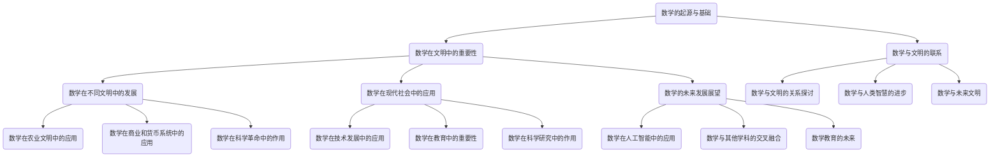

                 

# 《数学与文明史：数学在人类文明演进中的地位》

## 关键词
数学、文明史、人类文明、起源、应用、发展、影响、未来

## 摘要
本文探讨了数学在人类文明演进中的地位和作用。从数学的起源与基础，到数学在不同文明中的发展，再到数学在现代社会中的应用，本文通过逐步分析推理，详细阐述了数学对人类文明的深远影响。本文旨在揭示数学在人类文明发展中的核心地位，展望数学的未来发展趋势，以期为读者提供对数学在文明史中重要性的深刻理解。

## 目录大纲

### 第一部分：数学的起源与基础

**第1章：数学的起源与历史背景**
1.1 数学的发展简史
1.1.1 古埃及数学
1.1.2 古希腊数学
1.1.3 罗马时期数学
1.1.4 中世纪数学
1.2 数学的基本概念和原则
1.2.1 数的概念
1.2.2 代数基础
1.2.3 几何基础

### 第二部分：数学在文明中的重要性

**第2章：数学对文明发展的推动作用**
2.1 数学在农业文明中的应用
2.1.1 古代农业的数学应用
2.1.2 数学在灌溉系统中的作用
2.1.3 数学与建筑艺术的结合
2.2 数学在商业和货币系统中的应用
2.2.1 商业计算与数学
2.2.2 数学在货币系统中的作用
2.2.3 数学在会计和金融领域的应用
2.3 数学在科学革命中的作用
2.3.1 数学与天文学
2.3.2 数学与物理学
2.3.3 数学与化学

### 第三部分：数学在不同文明中的发展

**第3章：不同文明中的数学发展**
3.1 古代中国数学
3.1.1 中国古代数学的基础
3.1.2 算术的发展
3.1.3 代数学的发展
3.2 印度数学
3.2.1 印度数学的发展
3.2.2 印度数学的重要贡献
3.2.3 印度数学的传承与影响
3.3 阿拉伯数学
3.3.1 阿拉伯数学的起源
3.3.2 阿拉伯数学的重要贡献
3.3.3 阿拉伯数学对西方数学的影响

### 第四部分：数学与现代社会

**第4章：数学在现代社会中的应用**
4.1 数学在技术发展中的应用
4.1.1 计算机科学中的数学
4.1.2 数据科学中的数学
4.1.3 网络安全中的数学
4.2 数学在教育中的重要性
4.2.1 数学教育的发展
4.2.2 数学教育的重要性
4.2.3 创新数学教育方法
4.3 数学在科学研究中的作用
4.3.1 数学与生物学
4.3.2 数学与物理学
4.3.3 数学与社会科学

### 第五部分：数学的未来与发展

**第5章：数学的未来发展展望**
5.1 数学在人工智能中的应用
5.1.1 机器学习中的数学
5.1.2 深度学习中的数学
5.1.3 图论与网络分析
5.2 数学与其他学科的交叉融合
5.2.1 数学与物理学
5.2.2 数学与经济学
5.2.3 数学与艺术
5.3 数学教育的未来
5.3.1 数学教育的挑战
5.3.2 未来数学教育的趋势
5.3.3 培养创新数学人才

### 第六部分：数学与文明的联系

**第6章：数学与人类文明的关系**
6.1 数学与文明的关系探讨
6.1.1 数学在人类文明中的地位
6.1.2 数学对社会发展的贡献
6.1.3 数学在文化传承中的作用
6.2 数学与人类智慧的进步
6.2.1 数学对人类思维方式的影响
6.2.2 数学与人类创造力
6.2.3 数学在科技革命中的作用
6.3 数学与未来文明
6.3.1 数学在未来的重要性
6.3.2 数学在人类未来发展中的潜力
6.3.3 数学教育与未来文明

### 附录

**附录A：数学的历史事件与人物**
A.1 古代数学的重要事件
A.2 近现代数学的重要事件
A.3 数学界的重要人物
A.4 数学名词的起源与发展

# 图1-1 数学在人类文明演进中的地位

## 第一部分：数学的起源与基础

### 第1章：数学的起源与历史背景

数学作为人类智慧的一种体现，其起源可以追溯到远古时代。在人类文明发展的漫长历史中，数学逐渐演变为一门系统的学科，并在不同文明中发展出各自的特色。

#### 1.1 数学的发展简史

数学的历史可以追溯到公元前3000年左右，当时古埃及人和巴比伦人就已经开始使用数学来解决实际问题。古埃及人主要使用十进制系统，而巴比伦人则使用了六十进制系统。这些早期的数学主要是用于测量土地、计算面积和体积，以及解决日常生活中的实际问题。

公元前2000年左右，古希腊数学开始蓬勃发展。古希腊人强调数学的抽象性和逻辑性，他们的数学思想和方法对后世产生了深远的影响。毕达哥拉斯学派提出了勾股定理，欧几里得写出了《几何原本》，阿基米德则研究了浮力、杠杆原理等问题。

在罗马时期，数学得到了进一步的发展。罗马人将数学应用于建筑和工程领域，他们发展了罗马数字系统，并开始使用小数和负数。中世纪时期，阿拉伯数学家对数学的发展做出了重要贡献。他们翻译了古希腊和印度数学文献，并将自己的研究成果传播到欧洲。

到了近现代，数学进入了快速发展的时期。17世纪的牛顿和莱布尼茨发明了微积分，18世纪的欧拉和拉格朗日推动了数学分析的发展，19世纪的康托尔和希尔伯特则开创了数学基础理论的研究。

#### 1.1.1 古埃及数学

古埃及数学的主要特点是其实用性。古埃及人使用数学来计算土地面积、修建水利工程，以及进行天文观测。古埃及数学的基础是十进制系统，他们使用符号来表示数字，其中一些符号与现代阿拉伯数字非常相似。

古埃及的数学文献中记录了一些重要的数学成就，例如计算金字塔的高度和体积。古埃及人还发展了算术和代数的基本原理，他们使用代数方法来解决问题，例如解决线性方程。

#### 1.1.2 古希腊数学

古希腊数学强调抽象和逻辑推理，他们的数学成就是西方数学的基础。古希腊数学家如毕达哥拉斯、欧几里得和阿基米德等人在数学领域取得了许多重要成果。

毕达哥拉斯学派的定理指出，直角三角形的两条直角边的平方和等于斜边的平方，即著名的勾股定理。欧几里得的《几何原本》是古希腊数学的代表作，它系统地总结了古希腊的几何学成就，并提出了几何学的基本原理。

阿基米德在数学和物理学领域都取得了卓越的成就。他研究了浮力、杠杆原理等问题，并提出了许多重要的数学方法，如无穷小分析。

#### 1.1.3 罗马时期数学

罗马时期数学的主要贡献是罗马数字系统的发明和应用。罗马数字系统使用七个基本符号来表示数字，这些符号包括 I、V、X、L、C、D 和 M，分别表示 1、5、10、50、100、500 和 1000。

罗马人还开始使用小数和负数，他们使用上标来表示小数点，使用负号来表示负数。罗马数学家在建筑和工程领域使用数学方法，如比例和相似性，来设计和建造复杂的建筑。

#### 1.1.4 中世纪数学

中世纪时期，阿拉伯数学家对数学的发展做出了重要贡献。他们翻译了古希腊和印度数学文献，并将自己的研究成果传播到欧洲。阿拉伯数学家如花拉子米和阿尔-哈里迪对代数和几何学的发展做出了重要贡献。

花拉子米编写了《代数学原理》，系统地总结了代数学的基本原理。阿尔-哈里迪则研究了三角函数和天文学问题，他编写了《天文学基础》，对天文学的发展产生了重要影响。

#### 1.2 数学的基本概念和原则

数学是一门系统的学科，它由许多基本概念和原则组成。以下是一些重要的数学概念和原则：

- **数的概念**：数是数学中最基本的概念之一。数可以分为自然数、整数、有理数、实数和复数等。每个数都有其特定的性质和运算规则。
- **代数基础**：代数是研究代数方程和代数系统的数学分支。代数基础包括代数运算、代数结构、代数方程等。
- **几何基础**：几何是研究空间形状和结构的数学分支。几何基础包括点、线、面、角、圆等基本概念，以及几何图形的性质和关系。

#### 1.2.1 数的概念

数是数学中最基本的概念之一。数可以分为自然数、整数、有理数、实数和复数等。以下是对这些数的简要介绍：

- **自然数**：自然数是正整数，包括 1、2、3、4、5 等。自然数用于计数和排序。
- **整数**：整数包括正整数、负整数和零。整数可以表示为自然数的相反数。
- **有理数**：有理数是可以表示为两个整数之比的数，包括正有理数、负有理数和零。有理数可以表示为分数或小数。
- **实数**：实数包括有理数和无理数。实数是连续的，可以表示为无限不循环小数。
- **复数**：复数是形如 a+bi 的数，其中 a 和 b 是实数，i 是虚数单位。复数用于解决实数无法解决的问题，如解方程和表示频率。

#### 1.2.2 代数基础

代数是研究代数方程和代数系统的数学分支。代数基础包括代数运算、代数结构、代数方程等。以下是对这些概念的解释：

- **代数运算**：代数运算包括加法、减法、乘法、除法、指数运算等。代数运算符可以作用于数或变量。
- **代数结构**：代数结构是指满足特定运算规则和性质的集合。常见的代数结构有群、环、域等。
- **代数方程**：代数方程是包含未知数的等式。代数方程可以是一元一次方程、一元二次方程、多元方程等。解代数方程是代数学的基本任务之一。

#### 1.2.3 几何基础

几何是研究空间形状和结构的数学分支。几何基础包括点、线、面、角、圆等基本概念，以及几何图形的性质和关系。以下是对这些概念的解释：

- **点**：点是没有长度、宽度和高度的基本几何对象。点可以用坐标来表示。
- **线**：线是由无限多个点组成的直线。线有长度但没有宽度。
- **面**：面是由无限多个点组成的平面。面有长度和宽度，但没有高度。
- **角**：角是由两条射线共享一个端点所形成的形状。角可以用度数来度量。
- **圆**：圆是一个平面上所有到固定点（圆心）距离相等的点的集合。圆有半径和直径。

通过上述对数学起源与历史背景、基本概念和原则的介绍，我们可以看到数学在人类文明中的重要性。数学不仅是解决实际问题的工具，也是探索自然规律和科学理论的基础。在下一部分，我们将探讨数学在人类文明中的具体应用。

## 第二部分：数学对文明发展的推动作用

数学作为一门基础学科，不仅在理论研究中发挥着重要作用，而且在实际应用中同样具有深远的影响。数学对文明发展的推动作用体现在多个方面，包括农业文明、商业和货币系统、以及科学革命等方面。

### 2.1 数学在农业文明中的应用

农业是人类文明的基石，而数学在农业文明中的应用尤为显著。数学帮助人们精确计算土地面积、作物产量和资源分配，从而提高了农业生产的效率。

#### 2.1.1 古代农业的数学应用

在古代，数学被广泛应用于农业领域。古埃及人利用数学方法计算土地面积，以确定税收和土地分配的合理性。他们使用了一种称为“阿姆斯尺”的工具来测量土地，这是一种基于十进制系统的测量工具。

古巴比伦人也利用数学来规划灌溉系统。他们通过数学计算确定水渠的长度和宽度，以确保水能够均匀地分布在农田中。这种方法不仅提高了灌溉效率，还减少了水的浪费。

#### 2.1.2 数学在灌溉系统中的作用

灌溉系统的设计和管理需要精确的数学计算。古罗马人在建造灌溉系统时使用了数学方法来计算水流速度、水渠的坡度和水流量。这些计算有助于确保灌溉系统能够有效地工作，并满足农田的需求。

在现代，数学在农业中的应用更加广泛。计算机技术和数学模型被用于模拟气候、土壤和作物生长，从而优化农业生产的各个环节。例如，精准农业利用传感器和卫星图像来监测作物生长状况，并根据数据做出决策，如灌溉、施肥和收割。

#### 2.1.3 数学与建筑艺术的结合

建筑艺术的发展离不开数学的支持。古代建筑如埃及金字塔、希腊神庙和罗马斗兽场等，都是数学设计和计算的杰作。这些建筑不仅展示了人类的智慧和创造力，也反映了数学在建筑设计中的重要性。

古埃及的金字塔是数学与建筑艺术的完美结合。金字塔的设计和建造需要精确的计算，包括土地面积、角度测量和结构稳定性。这些计算确保了金字塔能够在长时间内保持稳定，并经受住各种自然条件的考验。

#### 2.2 数学在商业和货币系统中的应用

数学在商业和货币系统中的应用同样重要。数学方法帮助人们进行精确的商业计算、货币交易和财务管理，从而推动了商业的发展和货币系统的完善。

#### 2.2.1 商业计算与数学

商业计算是数学在商业领域的重要应用。古代商人在进行交易和财务计算时使用了各种数学方法。例如，古希腊商人使用比例和百分比来计算商品的价格和利润。

在现代，数学在商业计算中的应用更加广泛。计算机技术和数学模型被用于数据分析、市场预测和风险管理。例如，企业在制定销售策略时，可以使用数学模型来预测市场需求和销售趋势，从而做出更明智的决策。

#### 2.2.2 数学在货币系统中的作用

货币系统的运作离不开数学的支持。古代货币系统如古埃及的银币和罗马的金币，都是通过数学计算来确保货币的价值稳定和可兑换性。

在现代，数学在货币系统中的应用更加复杂。货币兑换率、利率和通货膨胀率等都是通过数学计算得出的。计算机技术和数学模型被用于监控和预测货币市场的动态，以确保货币系统的稳定和公平。

#### 2.2.3 数学在会计和金融领域的应用

数学在会计和金融领域具有广泛应用。会计需要精确记录和计算财务数据，如收入、支出和利润。数学方法被用于编制财务报表、进行财务分析和审计。

在金融领域，数学模型被用于风险评估、资产定价和投资策略。例如，金融市场分析师使用数学模型来预测股票价格和债券利率，从而制定投资策略。

#### 2.3 数学在科学革命中的作用

数学在科学革命中发挥了关键作用。数学方法为科学研究提供了精确的工具，使得科学家能够更准确地描述自然现象和解释科学理论。

#### 2.3.1 数学与天文学

天文学是数学应用的重要领域之一。古代天文学家如古希腊的阿里斯塔克和罗马的托勒密，都使用了数学方法来研究天体运动和天文现象。他们的工作奠定了现代天文学的基础。

在现代，数学在天文学中的应用更加广泛。天文学家使用数学模型来模拟宇宙的演化过程、预测彗星轨道和探测外星文明。

#### 2.3.2 数学与物理学

物理学是数学应用的另一个重要领域。牛顿和莱布尼茨在17世纪发明了微积分，这一数学工具为物理学的发展提供了强大的支持。牛顿的万有引力定律和莱布尼茨的运动定律都是基于数学计算得出的。

在现代，数学在物理学中的应用更加深入。物理学家使用数学模型来描述物质的性质和相互作用，如量子力学和相对论。

#### 2.3.3 数学与化学

化学也是数学应用的重要领域之一。化学家使用数学方法来研究化学反应、分子结构和物质性质。

在古代，古希腊哲学家如亚里士多德和希腊化学家如艾摩斯使用数学方法来解释化学现象。

在现代，化学家使用数学模型来研究分子结构和化学反应，如量子化学和分子动力学模拟。

通过上述对数学在农业文明、商业和货币系统、以及科学革命中的应用的介绍，我们可以看到数学在人类文明发展中的重要作用。数学不仅为人类提供了解决实际问题的工具，也推动了科学和技术的进步。在下一部分，我们将探讨数学在不同文明中的发展。

## 第三部分：数学在不同文明中的发展

数学是人类文明的重要组成部分，不同文明在数学的发展上都有各自的贡献。以下是古代中国数学、印度数学和阿拉伯数学的发展及其重要贡献。

### 3.1 古代中国数学

古代中国数学有着悠久的历史和丰富的成就。中国古代数学主要以算术、代数和几何为主要内容，其独特的数理思想和计算方法对世界数学的发展产生了深远的影响。

#### 3.1.1 中国古代数学的基础

中国古代数学的基础可以追溯到《九章算术》，这是一部成书于战国时期的数学著作，内容包括算术、代数、几何、数论等多个方面。这部著作奠定了中国古代数学的基本框架。

在《九章算术》中，最著名的成就之一是“九章算术·方程”一章，它提出了线性方程组的解法，包括高斯消元法和配方法等。这种方法在当时是独一无二的，为后来的代数学发展奠定了基础。

#### 3.1.2 算术的发展

中国古代在算术方面有许多独特的贡献。例如，中国发明了算盘，这是一种机械计算工具，可以快速进行加减乘除等基本运算。算盘的发明极大地提高了计算效率，对中国古代的会计和商业计算产生了深远影响。

此外，中国古代数学家还研究了分数和小数的运算，如《孙子算经》中提到了分数的加减法和乘除法。这些研究成果为现代数学的算术理论提供了重要的基础。

#### 3.1.3 代数学的发展

中国古代代数学的代表性著作是《九章算术》和《算经十书》。这些著作中提出了许多重要的代数问题和解法，如线性方程组、不定方程、二次方程等。

特别是《九章算术》中的“方程”一章，提出了“勾三股四弦五”的解法，这是一种求解二次方程的通用方法。这种方法在当时是先进的，对后来的代数学发展产生了重要影响。

#### 3.2 印度数学

印度数学在古代和中世纪时期有着重要的地位，其独特的数系和数学理论对世界数学的发展做出了巨大贡献。

#### 3.2.1 印度数学的发展

印度数学的发展可以追溯到公元前6世纪左右，当时印度数学家如阿约特卡和帕拉瓦等人开始了对数学的研究。他们的工作奠定了印度数学的基础。

印度数学的一个重要成就是发明了十进制数系。这种数系使用十个数字（0-9）来表示所有数，使得数学运算更加简便和高效。十进制数系的发明对世界数学的发展产生了深远的影响。

#### 3.2.2 印度数学的重要贡献

印度数学在数论、代数和几何等方面都有重要的贡献。例如，印度数学家提出了“素数分布定理”，这是数论中的重要问题。

在代数方面，印度数学家如巴塔查利于公元7世纪提出了“代数基本定理”，这是代数学中的重要成果。此外，印度数学家还研究了二次方程的解法，如“巴塔查利公式”。

在几何方面，印度数学家如阿耶波多提出了“阿耶波多定理”，这是一种关于圆的性质的重要定理。

#### 3.2.3 印度数学的传承与影响

印度数学在中世纪时期得到了进一步的发展。阿拉伯数学家在翻译印度数学文献时，将印度数学的成果传播到了阿拉伯世界。

阿拉伯数学家如花拉子米对印度数学的贡献进行了总结和提升，并将这些成果传播到了欧洲。例如，阿拉伯数学家将印度数学的数论和代数理论引入了《代数学原理》。

印度数学对现代数学也有重要影响。例如，计算机科学中的算法和密码学等领域，都受到了印度数学的影响。

#### 3.3 阿拉伯数学

阿拉伯数学是中世纪时期最先进的数学，其独特的成就对世界数学的发展产生了深远的影响。

#### 3.3.1 阿拉伯数学的起源

阿拉伯数学的起源可以追溯到公元8世纪左右，当时阿拉伯帝国的数学家开始了对数学的研究。阿拉伯数学家在翻译印度和希腊数学文献时，将印度和希腊数学的成果引入了阿拉伯世界。

#### 3.3.2 阿拉伯数学的重要贡献

阿拉伯数学在数论、代数和几何等方面都有重要的贡献。例如，阿拉伯数学家研究了素数分布和整数分解，提出了许多重要的数论定理。

在代数方面，阿拉伯数学家如阿尔-花拉子米编写了《代数学原理》，这是代数学的代表作，对后来的代数学发展产生了深远影响。

在几何方面，阿拉伯数学家如欧玛尔·海亚姆研究了二次方程的解法，提出了“海亚姆公式”，这是代数几何中的重要成果。

#### 3.3.3 阿拉伯数学对西方数学的影响

阿拉伯数学对西方数学的发展产生了重要影响。中世纪时期，阿拉伯数学文献被翻译成拉丁文，传播到了欧洲。

阿拉伯数学中的许多成果，如十进制数系、代数学原理、几何理论等，对欧洲数学的发展产生了深远影响。例如，阿拉伯数学的代数学原理为后来的欧洲代数学奠定了基础。

此外，阿拉伯数学家如阿尔-花拉子米和欧玛尔·海亚姆的工作对欧洲数学家如笛卡尔和牛顿等人产生了重要启发，推动了欧洲数学的进步。

通过以上对古代中国数学、印度数学和阿拉伯数学的发展及其重要贡献的介绍，我们可以看到不同文明在数学领域都有独特的成就。这些成就不仅推动了数学的发展，也对人类文明的进步产生了深远影响。在下一部分，我们将探讨数学在现代社会中的应用。

## 第四部分：数学在现代社会中的应用

随着科技的进步和社会的发展，数学在现代社会中的应用变得日益广泛和深入。数学不仅在传统领域如物理学、工程学、经济学等领域发挥着重要作用，还在计算机科学、数据科学、网络技术等新兴领域显示出强大的影响力。

### 4.1 数学在技术发展中的应用

数学是现代技术发展的重要基础，尤其在计算机科学、数据科学和网络技术等领域，数学的应用尤为突出。

#### 4.1.1 计算机科学中的数学

计算机科学是一门以算法和计算为核心的科学，而算法的设计和优化离不开数学的支持。以下是一些计算机科学中常见的数学应用：

- **算法分析**：算法分析是评估算法效率的重要工具。通过数学方法，可以分析算法的时间复杂度和空间复杂度，从而找到更高效的算法。
- **数据结构**：数据结构是计算机科学的基础，如数组、链表、树、图等。这些数据结构的设计和实现都依赖于数学原理。
- **加密算法**：加密算法是网络安全的重要组成部分。许多加密算法，如RSA加密算法，都是基于数学理论设计的。
- **机器学习**：机器学习是计算机科学的一个重要分支，而机器学习的核心是数学模型和算法。例如，线性回归、神经网络等模型都依赖于数学原理。

#### 4.1.2 数据科学中的数学

数据科学是大数据时代的产物，它利用数学方法来分析数据、提取信息和做出预测。以下是一些数据科学中常见的数学应用：

- **统计学**：统计学是数据科学的重要工具，用于数据的收集、分析和解释。常见的统计方法包括描述性统计、推断性统计、假设检验等。
- **概率论**：概率论是统计学的基础，它研究随机事件的发生概率。在数据科学中，概率论用于估计不确定性和进行预测。
- **优化算法**：优化算法是解决最优化问题的重要工具，如线性规划、整数规划、动态规划等。这些算法在数据科学中用于优化模型参数、选择最佳方案等。

#### 4.1.3 网络安全中的数学

网络安全是保障网络信息安全和数据隐私的关键。数学在网络安全中发挥着重要作用，以下是一些常见的数学应用：

- **加密算法**：前面已经提到，加密算法是网络安全的核心技术。许多加密算法，如RSA、椭圆曲线加密等，都是基于数学难题设计的。
- **数字签名**：数字签名用于确保数据传输的完整性和真实性。常见的数字签名算法，如RSA签名和DSA签名，都是基于数学原理。
- **安全协议**：网络安全协议，如SSL/TLS等，都利用数学方法来确保通信的安全性。这些协议通常基于密码学理论，如公钥密码学和哈希函数。

### 4.2 数学在教育中的重要性

数学教育是培养未来科学家、工程师和决策者的重要途径。数学在基础教育、高等教育和职业教育中都具有重要地位。

#### 4.2.1 数学教育的发展

数学教育的发展经历了几个阶段：

- **基础教育**：基础教育阶段的数学教育主要培养学生的基本数学能力和逻辑思维能力。通过学习数、量、图形等基本概念，学生可以建立起扎实的数学基础。
- **高等教育**：高等教育阶段的数学教育更加深入和系统，涉及微积分、线性代数、概率论等高等数学课程。这些课程为学生提供了解决复杂问题的工具。
- **职业教育**：职业教育阶段的数学教育侧重于实际应用，如工程数学、商业数学等。这些课程为学生将来的职业发展提供了必要的数学知识和技能。

#### 4.2.2 数学教育的重要性

数学教育的重要性体现在以下几个方面：

- **培养逻辑思维能力**：数学是一门逻辑性很强的学科，通过学习数学，学生可以培养严密的逻辑思维能力和批判性思维能力。
- **促进科学素养**：数学是科学的基础，通过数学教育，学生可以更好地理解科学原理和科学方法，提高科学素养。
- **培养创新精神**：数学问题往往需要创新思维和创造性解决方案，通过数学教育，学生可以培养创新精神和解决问题的能力。

#### 4.2.3 创新数学教育方法

为了提高数学教育质量，教育工作者不断探索创新的教学方法。以下是一些常见的创新数学教育方法：

- **项目式学习**：项目式学习是一种以项目为核心的学习方式，学生在完成实际项目的过程中学习数学知识。这种方法可以激发学生的学习兴趣，提高实践能力。
- **翻转课堂**：翻转课堂是一种将传统教学与在线学习相结合的教学模式。学生通过在线学习掌握基础知识，课堂上进行讨论和问题解决。这种方法可以提高学生的主动学习能力和课堂互动。
- **数学竞赛**：数学竞赛是一种激发学生学习兴趣和培养数学能力的重要方式。通过参加数学竞赛，学生可以锻炼解题技巧，提高数学水平。

### 4.3 数学在科学研究中的作用

数学在科学研究中的作用不可忽视。数学方法为科学研究提供了精确的工具，使得科学家能够更准确地描述自然现象和解释科学理论。

#### 4.3.1 数学与生物学

生物学是研究生命现象和生物体结构的科学，而数学在生物学中的应用越来越广泛。以下是一些数学在生物学中的应用：

- **基因测序**：基因测序是生物学的关键技术，而数学方法在基因测序中发挥着重要作用。例如，序列比对和序列分析都需要运用数学模型和算法。
- **生物信息学**：生物信息学是生物学与信息学交叉的学科，它利用计算机技术和数学方法来分析生物数据。常见的数学工具包括统计学、概率论和算法设计。
- **神经网络**：神经网络是一种模拟生物大脑结构的计算模型，它被广泛应用于生物学的各个领域，如神经科学、生态学等。神经网络的设计和训练都依赖于数学原理。

#### 4.3.2 数学与物理学

物理学是研究物质和能量的科学，而数学是物理学的基础工具。以下是一些数学在物理学中的应用：

- **微积分**：微积分是研究变化和运动的数学工具，它在物理学中得到了广泛应用。例如，牛顿的运动定律、热力学定律等都是用微积分描述的。
- **场论**：场论是研究物质和能量在空间中分布和运动的数学理论，它在物理学中有着重要的应用。例如，电磁场和引力场都可以用场论来描述。
- **统计物理学**：统计物理学是研究大量粒子集体行为的物理学分支，它利用概率论和统计方法来描述物理现象。

#### 4.3.3 数学与社会科学

社会科学是研究人类行为和社会现象的学科，而数学在社会科学中的应用也越来越广泛。以下是一些数学在社会科学中的应用：

- **统计学**：统计学是社会科学的基础工具，用于数据收集、分析和解释。例如，社会调查、民意测验和风险评估都需要使用统计学方法。
- **经济学**：经济学是研究资源配置和决策的学科，而数学在经济学中的应用非常广泛。例如，效用函数、供需分析等都是用数学模型描述的。
- **心理学**：心理学是研究人类行为和心理过程的学科，而数学在心理学中的应用也越来越受到关注。例如，心理测量和实验设计都需要运用数学方法。

通过以上对数学在技术发展、教育以及科学研究中的应用的介绍，我们可以看到数学在现代社会中的重要性。数学不仅是推动科技进步的重要力量，也是培养未来人才和解决社会问题的重要工具。在下一部分，我们将探讨数学的未来发展展望。

## 第五部分：数学的未来发展展望

随着科技的不断进步和社会的快速发展，数学在未来将继续扮演关键角色。数学在人工智能、其他学科交叉融合以及教育领域的发展都将引领新的科技革命。

### 5.1 数学在人工智能中的应用

人工智能（AI）是当今科技领域最热门的话题之一，而数学在AI发展中起着核心作用。

#### 5.1.1 机器学习中的数学

机器学习是人工智能的一个重要分支，而数学是其基础。以下是一些机器学习中的数学应用：

- **概率论与统计学**：概率论和统计学是机器学习的基础。概率论提供了处理不确定性的方法，而统计学则为数据分析和模型评估提供了工具。
- **线性代数**：线性代数在机器学习中用于处理高维数据，如矩阵运算和特征提取。线性代数的知识对于理解和支持向量机、神经网络等算法至关重要。
- **优化算法**：优化算法用于解决机器学习中的最优化问题，如梯度下降法和随机梯度下降法。这些算法基于数学优化理论，用于优化模型参数。

#### 5.1.2 深度学习中的数学

深度学习是机器学习的一个子领域，它在图像识别、语音识别和自然语言处理等方面取得了巨大成功。以下是一些深度学习中的数学应用：

- **微积分**：微积分在深度学习中用于计算梯度，这是训练神经网络的关键步骤。梯度计算依赖于微积分的基本原理。
- **概率论与信息论**：深度学习模型通常基于概率模型和信息论原理，如神经网络中的概率分布和熵。
- **图论**：图论在处理图结构数据时非常有用，例如在社会网络分析、图像识别和推荐系统等应用中。

#### 5.1.3 图论与网络分析

图论和网络分析是研究网络结构和属性的重要数学工具。以下是一些图论与网络分析的应用：

- **社交网络分析**：图论和网络分析用于分析社交网络中的连接和影响力，从而理解社交网络的结构和动态。
- **网络科学**：网络科学研究复杂网络的性质和行为，如互联网、生物网络和交通网络。图论和网络分析是理解这些网络的重要工具。
- **算法设计**：图论和网络分析为算法设计提供了理论基础，如最短路径算法、最小生成树算法等。

### 5.2 数学与其他学科的交叉融合

数学与其他学科的交叉融合将推动各学科的发展，产生新的研究领域和应用。

#### 5.2.1 数学与物理学

数学与物理学的交叉融合产生了许多重要的理论和应用，如：

- **量子计算**：量子计算是未来计算的重要方向，而其理论基础是量子数学。量子数学涉及量子逻辑、量子概率论等新领域。
- **统计物理学**：统计物理学结合了数学和物理学的原理，用于研究复杂系统的统计行为，如相变、临界现象等。
- **弦论**：弦论是一种尝试统一所有基本力的理论，而其数学基础是高维几何和拓扑学。

#### 5.2.2 数学与经济学

数学与经济学的交叉融合推动了经济学的发展，如：

- **行为经济学**：行为经济学研究人类在经济学决策中的心理和行为，而数学方法用于分析和建模这些行为。
- **金融数学**：金融数学用于建模金融市场和风险管理，如期权定价模型和风险价值（VaR）模型。
- **博弈论**：博弈论是研究决策制定的数学工具，它在经济学、政治学和社会学等领域都有重要应用。

#### 5.2.3 数学与艺术

数学与艺术的交叉融合为艺术家提供了新的创作工具和方法，如：

- **分形艺术**：分形艺术利用分形几何的美学原理，创造出复杂而美丽的艺术作品。
- **算法艺术**：算法艺术使用计算机程序生成艺术作品，如生成艺术、计算机动画等。
- **数字音乐**：数字音乐利用数学模型和算法生成音乐，如合成器、数字采样等。

### 5.3 数学教育的未来

数学教育的未来将面临新的挑战和机遇。以下是一些数学教育的未来趋势：

#### 5.3.1 数学教育的挑战

- **技术变革**：技术的快速发展对数学教育提出了新的要求，如在线教育、虚拟现实等。
- **个性化教育**：个性化教育要求根据学生的兴趣和能力提供定制化的学习路径，这对数学教育提出了挑战。
- **数学应用能力**：现代社会需要更多具有数学应用能力的专业人才，如何培养这些能力成为数学教育的重要任务。

#### 5.3.2 未来数学教育的趋势

- **创新教学方法**：未来数学教育将更加注重创新教学方法的引入，如项目式学习、游戏化学习等。
- **跨学科教育**：数学教育将与其他学科相结合，培养具有跨学科能力的复合型人才。
- **终身学习**：数学教育将更加注重终身学习的理念，为学生提供持续学习的机会和资源。

#### 5.3.3 培养创新数学人才

- **培养创新思维**：数学教育应注重培养学生的创新思维和问题解决能力。
- **实践能力**：数学教育应注重培养学生的实践能力，如实验设计、数据分析等。
- **国际化视野**：数学教育应培养学生的国际化视野，了解全球数学教育的发展趋势。

通过以上对数学在人工智能中的应用、与其他学科的交叉融合以及教育领域的未来发展的探讨，我们可以看到数学在未来的重要性和潜力。数学不仅是推动科技进步的重要力量，也是培养未来人才和解决社会问题的重要工具。在下一部分，我们将深入探讨数学与人类文明的关系。

## 第六部分：数学与人类文明的关系

数学作为人类智慧的一种体现，与人类文明的发展息息相关。数学不仅为人类提供了解决实际问题的工具，还在推动科技革命、文化传承和人类智慧进步方面发挥了重要作用。

### 6.1 数学与文明的关系探讨

数学在人类文明中扮演着核心角色，其重要性可以从以下几个方面进行探讨：

#### 6.1.1 数学在人类文明中的地位

数学在人类文明中具有无可替代的地位。从古代的农业、建筑到现代的科技、金融，数学始终是推动文明进步的重要力量。数学不仅帮助人类解决实际问题，还提供了研究自然现象和科学理论的工具。

数学的发展与人类文明的进程紧密相连。在古代文明中，数学的发展推动了农业、贸易和城市建设。在近现代，数学的发展催生了科学革命和工业革命，推动了社会进步和技术创新。

#### 6.1.2 数学对社会发展的贡献

数学对社会发展的贡献体现在多个方面：

- **科技进步**：数学为科学研究提供了精确的工具和方法，推动了物理学、生物学、化学等科学领域的发展。例如，牛顿的微积分和爱因斯坦的相对论都是基于数学理论。
- **经济发展**：数学在商业、金融和经济学中的应用促进了经济的发展。例如，数学模型用于市场预测、风险评估和资源分配。
- **社会发展**：数学在教育、法律和公共管理等领域也有广泛应用。数学教育培养逻辑思维能力和批判性思维能力，为社会培养人才。数学模型用于优化社会资源配置，提高社会治理效率。

#### 6.1.3 数学在文化传承中的作用

数学不仅是一种工具，也是人类文化的重要组成部分。数学文化传承了人类智慧的结晶，为后代提供了宝贵的知识财富。

- **数学文献**：数学文献是数学文化的重要载体。从古希腊的《几何原本》到现代的数学期刊，数学文献记录了人类数学发展的历程，传承了数学知识。
- **数学传统**：数学传统是数学文化的重要组成部分。不同文明的数学传统各有特色，如古希腊的几何、印度数学的数论、阿拉伯数学的代数等。这些数学传统通过教育、学术交流和文献传播得以传承。
- **数学教育**：数学教育是数学文化传承的重要途径。通过教育，数学知识和方法得以传播和普及，为后代培养数学人才。

### 6.2 数学与人类智慧的进步

数学对人类智慧的进步产生了深远影响。数学不仅改变了人类的思维方式，还激发了人类的创造力和创新能力。

#### 6.2.1 数学对人类思维方式的影响

数学对人类思维方式产生了重要影响：

- **逻辑思维**：数学强调逻辑推理和严谨证明，培养了人类的逻辑思维能力。逻辑思维是人类解决复杂问题的重要工具。
- **抽象思维**：数学是一种抽象的学科，它通过符号和公式来表示和解决问题。抽象思维是人类理解和探索世界的重要能力。
- **系统思维**：数学方法强调系统的分析和解决问题的方法。系统思维有助于人类理解和解决复杂问题，如社会问题和环境问题。

#### 6.2.2 数学与人类创造力

数学激发了人类的创造力，推动了科学和技术的进步：

- **理论创新**：数学为科学理论创新提供了基础。许多科学理论，如相对论、量子力学等，都是基于数学模型和数学方法。
- **技术创新**：数学在技术创新中发挥着关键作用。例如，计算机科学中的算法、网络技术中的加密算法等都是基于数学原理。
- **艺术创新**：数学在艺术创作中也发挥了重要作用。例如，分形艺术、算法艺术等都是数学与艺术的结合。

#### 6.2.3 数学在科技革命中的作用

数学在科技革命中发挥了核心作用，推动了人类社会的进步：

- **科学革命**：数学为科学革命提供了理论基础。例如，牛顿的微积分和爱因斯坦的相对论都是基于数学理论。
- **工业革命**：数学在工业革命中发挥了重要作用。例如，机械工程的数学模型和优化方法提高了生产效率。
- **信息革命**：数学在信息革命中起到了关键作用。例如，计算机科学中的算法和加密算法推动了信息技术的快速发展。

### 6.3 数学与未来文明

随着科技的不断进步，数学在未来文明中将发挥更加重要的作用。以下是对数学未来发展的展望：

#### 6.3.1 数学在未来的重要性

- **智能时代**：随着人工智能的发展，数学在智能时代将扮演关键角色。数学模型和算法将用于开发智能系统和智能应用。
- **数字化社会**：数字化社会需要数学来理解和解决复杂问题，如大数据分析、网络安全等。
- **可持续发展**：数学在可持续发展中发挥作用，如优化资源分配、环境建模等。

#### 6.3.2 数学在人类未来发展中的潜力

- **跨学科研究**：数学与其他学科的交叉融合将推动新的研究领域和应用，如生物数学、经济数学等。
- **科技创新**：数学在科技创新中具有巨大潜力，如量子计算、人工智能等前沿领域。
- **教育改革**：数学教育改革将培养更多具有数学能力和创新精神的人才，推动未来文明的发展。

#### 6.3.3 数学教育与未来文明

- **终身学习**：数学教育应注重终身学习的理念，培养适应未来社会的人才。
- **创新教育**：数学教育应注重培养学生的创新思维和问题解决能力。
- **国际化视野**：数学教育应培养学生的国际化视野，了解全球数学教育的发展趋势。

通过以上对数学与人类文明关系的探讨，我们可以看到数学在人类文明中的重要地位和作用。数学不仅是解决实际问题的工具，也是推动科技革命、文化传承和人类智慧进步的重要力量。在未来，数学将继续在人类文明中发挥关键作用，为未来社会的发展提供强大的支持。

## 附录A：数学的历史事件与人物

数学的发展历程中涌现了许多重要的历史事件和杰出人物，他们为数学的发展做出了巨大贡献。以下是一些重要的历史事件和数学家的简介：

### A.1 古代数学的重要事件

- **《几何原本》**：古希腊数学家欧几里得所著的《几何原本》是历史上最著名的数学著作之一，它系统地总结了古希腊的几何学成就，并提出了几何学的基本原理。
- **零的发明**：印度数学家发明了零的概念，这一发明极大地简化了数学运算，并对后来的数学和科学产生了深远影响。
- **代数基本定理**：印度数学家巴塔查利于公元7世纪提出了代数基本定理，这一定理是代数学中的核心成果。

### A.2 近现代数学的重要事件

- **微积分的发明**：牛顿和莱布尼茨在17世纪发明了微积分，这一数学工具为物理学和工程学的发展提供了强大的支持。
- **集合论的诞生**：康托尔在19世纪创立了集合论，这一数学理论为现代数学的发展奠定了基础。
- **哥德巴赫猜想的提出**：哥德巴赫提出了哥德巴赫猜想，这一猜想至今仍是数学界的重要未解决问题。

### A.3 数学界的重要人物

- **欧几里得**：古希腊数学家，著有《几何原本》，是几何学的奠基人。
- **阿基米德**：古希腊数学家和物理学家，研究了浮力、杠杆原理等问题。
- **牛顿**：英国数学家和物理学家，发明了微积分，提出了牛顿运动定律。
- **莱布尼茨**：德国数学家和哲学家，独立发明了微积分，并发明了二进制。
- **康托尔**：德国数学家，创立了集合论，为现代数学的发展做出了重要贡献。
- **希尔伯特**：德国数学家，提出了希尔伯特空间的概念，对数学基础理论的研究做出了重要贡献。

### A.4 数学名词的起源与发展

- **“代数”**：这个词来源于阿拉伯语“al-jabr”，意为“重新组合”，代数是研究代数方程和代数系统的数学分支。
- **“微积分”**：微积分是由拉丁语“micro”（小）和“calculus”（计算）组成，是研究变化和积分的数学分支。
- **“几何”**：几何一词来源于希腊语“geometria”，意为“土地测量”，是研究空间形状和结构的数学分支。

这些重要事件和人物对数学的发展产生了深远影响，他们的工作奠定了现代数学的基础，并为后来的数学研究提供了丰富的理论和方法。通过了解这些历史事件和人物，我们可以更好地理解数学的发展历程和它在人类文明中的地位。

