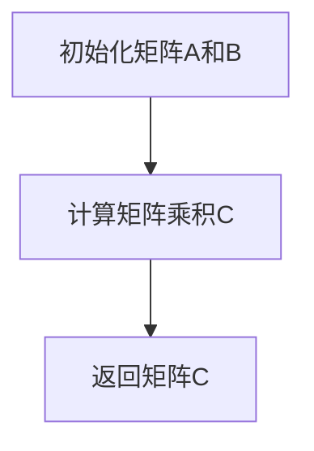
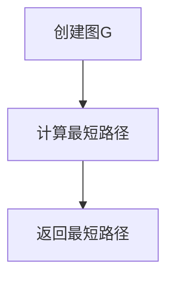

                 

# 《数学与未来虚拟社会的发展趋势》

## 概述

在未来，虚拟社会将成为人类生活的重要组成部分。这些虚拟社会不仅是一个数字化的副本，更是通过高度模拟现实世界中的社会结构和交互方式来创造的一种全新形态。随着人工智能、大数据、区块链等技术的不断进步，虚拟社会的构建和运行越来越依赖于数学模型和算法。

数学作为一门基础科学，它在虚拟社会的构建中扮演着至关重要的角色。无论是用于模拟现实世界中的物理现象，还是设计复杂的社会模型，数学都提供了强有力的工具。本文将探讨数学在虚拟社会中的基础概念、应用，以及未来虚拟社会发展的数学模型趋势。

关键词：数学、虚拟社会、数学模型、线性代数、概率论、图论

摘要：本文首先介绍了数学的基础概念和虚拟社会的定义与发展，接着深入探讨了数学在虚拟社会中的应用，如数学建模和离散数学。随后，本文进一步分析了线性代数、概率论和图论等数学领域在虚拟社会中的具体应用。最后，本文提出了未来虚拟社会发展的数学模型趋势，并讨论了数学模型在虚拟社会中的应用实践。通过本文的探讨，我们希望能够为读者提供一个全面而深入的视角，理解数学与未来虚拟社会之间的关系。

## 目录大纲

### 第一部分：数学基础与虚拟社会的概念

#### 第1章：数学与虚拟社会的概念

##### 1.1 数学的基础概念

##### 1.2 数学在虚拟社会中的应用

#### 第2章：数学在虚拟社会中的应用

##### 2.1 数学建模

##### 2.2 离散数学在虚拟社会中的应用

### 第二部分：未来虚拟社会的数学模型

#### 第3章：线性代数与虚拟社会

##### 3.1 线性代数的基本概念

##### 3.2 线性代数在虚拟社会中的应用

#### 第4章：概率论与虚拟社会的安全性

##### 4.1 概率论的基本概念

##### 4.2 概率论在虚拟社会中的应用

#### 第5章：图论与虚拟社会的关系

##### 5.1 图论的基本概念

##### 5.2 图论在虚拟社会中的应用

### 第三部分：未来虚拟社会的数学模型与应用

#### 第6章：非线性动态系统与虚拟社会

##### 6.1 非线性动态系统的基本概念

##### 6.2 非线性动态系统在虚拟社会中的应用

#### 第7章：数学模型在虚拟社会中的应用实践

##### 7.1 数学模型在虚拟经济中的应用

##### 7.2 数学模型在虚拟教育中的应用

## 附录

### 附录A：数学模型与虚拟社会相关的开源工具和资源

### 附录B：数学公式和算法伪代码

---

接下来，我们将逐步深入探讨数学在虚拟社会中的基础概念、应用，以及未来虚拟社会发展的数学模型趋势。

## 第一部分：数学基础与虚拟社会的概念

### 第1章：数学与虚拟社会的概念

#### 1.1 数学的基础概念

数学是一门研究数量、结构、变化和空间等概念的抽象科学。它包括多个分支，如算术、代数、几何、微积分、概率论和统计学等。每一个分支都有其独特的理论和应用场景。

在虚拟社会中，数学的基本概念被广泛应用于多个方面。例如，算术和代数用于处理虚拟经济中的货币交易和资源分配问题；几何用于模拟虚拟环境中的三维空间和物体运动；微积分用于分析虚拟系统中动态变化的过程；概率论和统计学用于评估虚拟社会的风险和不确定性。

#### 1.2 数学在虚拟社会中的应用

虚拟社会是一个高度模拟的现实世界的数字副本，其运行和演化需要依赖数学模型和算法。以下是数学在虚拟社会中的应用：

1. **数学建模**：数学建模是一种将现实世界中的复杂系统转化为数学形式的方法。在虚拟社会构建中，数学建模可以帮助我们理解社会行为、经济活动、信息传播等动态过程。例如，我们可以使用微分方程来模拟人口增长和扩散过程，或者使用差分方程来分析社交网络中的信息传播。

2. **离散数学**：离散数学包括图论、组合数学和逻辑学等，它在虚拟社会的构建中发挥着重要作用。例如，图论可以帮助我们理解社交网络的结构，组合数学可以用于优化资源分配，逻辑学可以用于构建虚拟环境中的规则系统。

3. **线性代数**：线性代数用于处理多维数据和高维空间的问题。在虚拟社会中，线性代数可以用于分析大规模社交网络、虚拟经济和市场趋势。例如，我们可以使用矩阵运算来分析社交网络中的连接关系，或者使用线性规划来优化资源分配。

4. **概率论**：概率论用于处理不确定性和随机事件。在虚拟社会中，概率论可以用于评估风险、预测市场变化、分析信息传播模式。例如，我们可以使用概率分布来描述虚拟社会中的不确定性，或者使用蒙特卡罗模拟来预测未来趋势。

5. **统计学**：统计学用于收集、分析和解释数据。在虚拟社会中，统计学可以用于分析用户行为、评估系统性能、优化算法设计。例如，我们可以使用描述性统计来了解用户偏好，或者使用回归分析来预测市场趋势。

### 总结

数学是虚拟社会构建和运行的基础，它提供了各种工具和方法来模拟、分析和优化虚拟系统。在本章节中，我们介绍了数学的基础概念和其在虚拟社会中的应用。在接下来的章节中，我们将进一步探讨数学在虚拟社会中的具体应用，以及未来虚拟社会发展的数学模型趋势。

---

接下来，我们将深入讨论数学建模和离散数学在虚拟社会中的应用，并展示数学在构建和优化虚拟社会方面的强大能力。

### 第2章：数学在虚拟社会中的应用

#### 2.1 数学建模

数学建模是一种将现实世界中的复杂系统转化为数学形式的方法。通过数学建模，我们可以使用数学语言和工具来分析和理解复杂的社会现象和过程。在虚拟社会构建中，数学建模具有重要的应用价值。

##### 2.1.1 数学建模的基本原理

数学建模的基本原理包括以下步骤：

1. **问题定义**：明确要解决的问题是什么，问题的边界条件是什么。
2. **建立模型**：根据问题的性质，选择适当的数学工具和方法，建立数学模型。常用的数学模型包括微分方程、差分方程、概率模型和优化模型等。
3. **求解模型**：使用数学方法和工具求解模型，得到问题的解。
4. **验证模型**：通过实际数据和实验结果来验证模型的准确性和有效性。
5. **优化模型**：根据验证结果，对模型进行调整和优化，以提高模型的准确性和实用性。

##### 2.1.2 数学建模在虚拟社会中的应用

数学建模在虚拟社会中的应用非常广泛，以下是一些典型的应用场景：

1. **人口模拟**：数学建模可以用于模拟虚拟社会中的人口增长、迁移和分布。通过建立人口动态模型，我们可以预测人口趋势，分析人口结构的变化，为虚拟社会的规划和管理提供科学依据。
2. **经济模拟**：数学建模可以用于模拟虚拟社会中的经济活动、市场行为和价格波动。通过建立经济模型，我们可以分析经济现象，预测市场变化，优化经济资源配置。
3. **社交网络分析**：数学建模可以用于分析虚拟社会中的社交网络结构、传播过程和影响力。通过建立社交网络模型，我们可以理解社交网络的演化规律，优化社交网络的运营和管理。
4. **信息传播**：数学建模可以用于模拟虚拟社会中的信息传播、舆论扩散和谣言传播。通过建立信息传播模型，我们可以预测信息传播的趋势，控制谣言的扩散，提高信息的可信度。

#### 2.2 离散数学在虚拟社会中的应用

离散数学是数学的一个重要分支，包括图论、组合数学和逻辑学等。在虚拟社会构建中，离散数学发挥着重要作用。

##### 2.2.1 离散数学的基本概念

离散数学的基本概念包括：

1. **图**：图是离散数学中的一个基本结构，由顶点和边组成。图可以用于表示虚拟社会中的社交网络、交通网络和通信网络等。
2. **组合数学**：组合数学研究组合和排列的问题，包括计数原理、组合数、排列数和组合数的计算等。组合数学可以用于优化虚拟社会中的资源分配和路径规划问题。
3. **逻辑学**：逻辑学研究推理和证明的方法，包括命题逻辑、谓词逻辑和形式逻辑等。逻辑学可以用于构建虚拟社会中的规则系统和决策支持系统。

##### 2.2.2 离散数学在虚拟社会中的应用

离散数学在虚拟社会中的应用非常广泛，以下是一些典型的应用场景：

1. **社交网络分析**：离散数学可以用于分析虚拟社会中的社交网络结构，包括社交网络的度分布、聚类系数和路径长度等。通过建立社交网络模型，我们可以理解社交网络的演化规律，优化社交网络的运营和管理。
2. **路径规划**：离散数学可以用于解决虚拟社会中的路径规划问题，包括最短路径、最小生成树和旅行商问题等。通过建立路径规划模型，我们可以优化虚拟社会中的交通流量，提高路径规划的效率。
3. **资源分配**：离散数学可以用于解决虚拟社会中的资源分配问题，包括最优分配、均衡分配和贪心算法等。通过建立资源分配模型，我们可以优化虚拟社会中的资源利用效率，提高资源分配的公平性。

#### 总结

数学建模和离散数学是虚拟社会构建和运行的重要工具。通过数学建模，我们可以模拟和分析虚拟社会中的各种现象和过程；通过离散数学，我们可以优化虚拟社会中的资源分配和路径规划问题。在接下来的章节中，我们将进一步探讨线性代数、概率论和图论等数学领域在虚拟社会中的应用。

---

在数学的各个分支中，线性代数、概率论和图论是三个关键领域，它们在虚拟社会的构建和运行中发挥着至关重要的作用。接下来，我们将深入探讨这三个领域在虚拟社会中的应用。

### 第二部分：未来虚拟社会的数学模型

#### 第3章：线性代数与虚拟社会

##### 3.1 线性代数的基本概念

线性代数是数学中的一个重要分支，主要研究向量空间、线性变换和线性方程组等基本概念。以下是线性代数的基本概念：

1. **向量空间**：向量空间是一个集合，其中元素是向量，且满足加法和数乘运算。向量空间具有维数，维数决定了向量空间的结构和性质。
2. **线性变换**：线性变换是一个从向量空间到另一个向量空间的映射，它保持向量加法和数乘运算。线性变换可以用矩阵表示，矩阵是线性代数中的重要工具。
3. **线性方程组**：线性方程组是由多个线性方程组成的集合，可以通过矩阵形式表示。线性方程组的解可以用于求解各种实际问题，如资源分配、路径规划和优化问题。

##### 3.2 线性代数在虚拟社会中的应用

线性代数在虚拟社会中的应用非常广泛，以下是一些典型的应用场景：

1. **三维空间建模**：在虚拟社会中，三维空间建模是非常重要的。通过线性代数，我们可以使用向量表示三维空间中的点、线和面，从而构建虚拟环境。线性代数还可以用于处理三维空间中的变换和旋转操作，如平移、旋转和缩放等。
2. **数据分析和处理**：在虚拟社会中，数据分析和处理是一个关键任务。线性代数可以用于数据的高维表示和降维，如主成分分析（PCA）和线性判别分析（LDA）。通过这些方法，我们可以从大量的数据中提取有用的信息，用于虚拟社会的分析和优化。
3. **线性规划**：线性规划是一种优化方法，用于求解线性目标函数在给定约束条件下的最优解。在虚拟社会中，线性规划可以用于优化资源分配、路径规划和调度问题。例如，我们可以使用线性规划来优化虚拟经济中的生产和资源分配。

#### 第4章：概率论与虚拟社会的安全性

##### 4.1 概率论的基本概念

概率论是数学中的一个重要分支，主要研究随机事件和概率的计算。以下是概率论的基本概念：

1. **随机事件**：随机事件是指在特定条件下可能发生也可能不发生的事件。随机事件可以用集合表示，集合中的元素表示事件发生的可能性。
2. **概率分布**：概率分布描述了随机事件发生的概率分布情况。常见的概率分布包括离散型概率分布和连续型概率分布。
3. **条件概率**：条件概率描述了在某个事件发生的条件下，另一个事件发生的概率。条件概率可以用于计算复杂事件的发生概率。

##### 4.2 概率论在虚拟社会中的应用

概率论在虚拟社会中的应用非常广泛，以下是一些典型的应用场景：

1. **风险评估**：在虚拟社会中，风险评估是一个关键任务。通过概率论，我们可以计算虚拟社会中的风险事件发生的概率，评估虚拟社会的安全性和可靠性。例如，我们可以使用概率分布来分析虚拟经济中的市场风险。
2. **安全监测**：在虚拟社会中，安全监测是一个重要的环节。通过概率论，我们可以使用概率分布和条件概率来检测和识别异常行为和潜在威胁。例如，我们可以使用贝叶斯推理来识别网络攻击和恶意行为。
3. **信息传播**：在虚拟社会中，信息传播是一个复杂的过程。通过概率论，我们可以计算信息传播的概率分布，预测信息传播的趋势和影响力。例如，我们可以使用马尔可夫链来模拟信息传播过程。

#### 第5章：图论与虚拟社会的关系

##### 5.1 图论的基本概念

图论是数学中的一个重要分支，主要研究图的结构和性质。以下是图论的基本概念：

1. **图**：图是由顶点和边组成的结构，用于表示对象之间的连接关系。常见的图包括无向图、有向图和加权图等。
2. **路径**：路径是图中的一个连接序列，用于表示从起点到终点的路径。路径可以是有向的或无向的，可以包含或排除特定的边。
3. **连通性**：连通性描述了图中顶点之间的连接关系。如果图中任意两个顶点之间都存在路径，则称该图为连通图。

##### 5.2 图论在虚拟社会中的应用

图论在虚拟社会中的应用非常广泛，以下是一些典型的应用场景：

1. **社交网络分析**：在虚拟社会中，社交网络分析是一个重要的任务。通过图论，我们可以分析社交网络中的连接关系、传播过程和影响力。例如，我们可以使用图论中的聚类系数和路径长度来评估社交网络的紧密程度和传播效率。
2. **路径规划**：在虚拟社会中，路径规划是一个关键任务。通过图论，我们可以使用最短路径算法、最小生成树算法和旅行商问题等来优化路径规划。例如，我们可以使用Dijkstra算法来计算从起点到终点的最短路径。
3. **资源分配**：在虚拟社会中，资源分配是一个重要的任务。通过图论，我们可以使用网络流算法和最优化理论来优化资源分配。例如，我们可以使用最大流最小割定理来优化虚拟经济中的资源分配。

#### 总结

线性代数、概率论和图论是数学中三个重要的分支，它们在虚拟社会的构建和运行中发挥着至关重要的作用。线性代数用于三维空间建模、数据分析和线性规划；概率论用于风险评估、安全监测和信息传播；图论用于社交网络分析、路径规划和资源分配。在未来的虚拟社会中，这些数学模型将继续发挥关键作用，推动虚拟社会的发展和创新。

---

在深入探讨了线性代数、概率论和图论在虚拟社会中的应用后，我们现在将把焦点转向非线性动态系统，并探讨它们在虚拟社会中的基本概念和应用。

### 第6章：非线性动态系统与虚拟社会

##### 6.1 非线性动态系统的基本概念

非线性动态系统是研究系统状态随时间变化的动态过程，其中系统状态的变化不再遵循线性规律。非线性动态系统的特点是系统响应对初始条件极为敏感，即所谓的“蝴蝶效应”。以下是关于非线性动态系统的基本概念：

1. **非线性性**：非线性动态系统中的变量之间的关系是非线性的，这意味着系统的输出不仅依赖于当前输入，还依赖于输入的历史值。
2. **动态性**：动态系统是指系统状态随时间变化的过程，通常用差分方程或微分方程来描述。
3. **吸引子**：在非线性动态系统中，系统状态可能会收敛到一个稳定的模式，称为吸引子。吸引子可以是固定的点、周期轨道或混沌 attractor。
4. **混沌**：非线性动态系统可能会出现混沌现象，即系统在初始条件微小的变化下，可以导致长期行为的显著差异。混沌系统具有高度复杂性和不可预测性。

##### 6.2 非线性动态系统在虚拟社会中的应用

非线性动态系统在虚拟社会中的应用非常广泛，以下是一些典型的应用场景：

1. **人口动态模拟**：在虚拟社会中，人口动态模拟是一个重要的任务。通过非线性动态模型，我们可以模拟人口的增长、迁移和老龄化现象。这些模型可以用于预测未来的人口趋势，为虚拟社会的规划和管理提供科学依据。
2. **经济动态模拟**：非线性动态模型可以用于模拟虚拟社会中的经济活动。例如，我们可以使用非线性模型来分析市场波动、货币流通和通货膨胀等经济现象。这些模型可以帮助我们理解经济系统的复杂性和非线性特征，为经济政策和决策提供支持。
3. **信息传播模型**：在虚拟社会中，信息传播是一个复杂的非线性过程。通过非线性动态模型，我们可以模拟信息在不同社交网络中的传播行为，分析信息的传播速度、传播范围和传播影响力。这些模型可以用于优化信息传播策略，提高信息的传播效果。
4. **社交网络动态**：社交网络是一个复杂的非线性系统，其结构和行为受到用户互动、网络效应和社会影响力的共同影响。通过非线性动态模型，我们可以研究社交网络中的群体行为、信息扩散和影响力传播。这些模型可以帮助我们理解社交网络的动态特性，为社交网络的运营和管理提供支持。

##### 实例：人口动态模型

以下是一个简单的人口动态模型，用于模拟虚拟社会中的总人口数量随时间的变化。假设人口增长率取决于当前人口数量和资源水平，可以用以下非线性差分方程表示：

$$
N_{t+1} = N_{t} + r(N_{t} - K)
$$

其中，$N_{t}$表示第t年的总人口数量，$r$表示人口增长率，$K$表示资源的饱和水平。这个方程假设人口增长率随着人口数量的增加而减小，直到资源饱和水平。

通过迭代这个方程，我们可以模拟虚拟社会中人口数量的动态变化。以下是一个使用Python编写的伪代码，用于计算人口动态模型的结果：

```python
def population_growth(N0, r, K, years):
    N = [N0]
    for t in range(years):
        Nt = N[-1] + r * (N[-1] - K)
        N.append(Nt)
    return N

# 初始条件
N0 = 1000000  # 初始人口数量
r = 0.02      # 人口增长率
K = 2000000   # 资源饱和水平
years = 50    # 模拟年限

# 计算人口动态
N = population_growth(N0, r, K, years)

# 绘制人口变化图
import matplotlib.pyplot as plt

plt.plot(N)
plt.xlabel('Year')
plt.ylabel('Population')
plt.title('Population Growth over Time')
plt.show()
```

这个实例展示了如何使用非线性动态模型来模拟虚拟社会中的人口增长。通过这个模型，我们可以预测未来的人口趋势，为虚拟社会的规划和管理提供数据支持。

##### 总结

非线性动态系统在虚拟社会中有广泛的应用，包括人口动态模拟、经济动态模拟、信息传播模型和社交网络动态。通过非线性动态模型，我们可以理解和预测虚拟社会中的复杂现象和过程。在未来的虚拟社会中，非线性动态模型将继续发挥关键作用，推动虚拟社会的发展和创新。

### 第7章：数学模型在虚拟社会中的应用实践

在上一部分，我们深入探讨了线性代数、概率论、图论以及非线性动态系统在虚拟社会中的应用。在本章中，我们将通过具体的实践案例来展示这些数学模型在实际虚拟社会中的应用，并详细解释其实现过程和关键步骤。

#### 7.1 数学模型在虚拟经济中的应用

虚拟经济是未来虚拟社会的重要组成部分，它通过数字货币、区块链技术和智能合约实现。数学模型在虚拟经济中可以用于优化资源分配、风险评估和市场预测。

##### 案例一：数字货币市场预测

数字货币市场的波动性很大，通过数学模型可以预测其价格走势。以下是一个简单的例子，使用时间序列分析来预测比特币（BTC）价格。

**步骤 1**：数据收集

首先，我们需要收集比特币的价格历史数据，这可以通过API接口从各种加密货币交易所获取。

```python
import pandas as pd
import requests

url = 'https://api.example.com/btc_price_history'
response = requests.get(url)
data = response.json()
df = pd.DataFrame(data['data'])
```

**步骤 2**：数据处理

处理数据，计算移动平均和差分，以便进行时间序列建模。

```python
df['close'] = df['close'].astype(float)
df['moving_average'] = df['close'].rolling(window=7).mean()
df['diff'] = df['close'] - df['moving_average']
```

**步骤 3**：建模

使用ARIMA模型进行时间序列预测，ARIMA模型由自回归（AR）、差分（I）和移动平均（MA）组成。

```python
from statsmodels.tsa.arima.model import ARIMA

model = ARIMA(df['close'], order=(5, 1, 2))
model_fit = model.fit()
forecast = model_fit.forecast(steps=5)
```

**步骤 4**：结果展示

展示预测结果，并绘制价格走势图。

```python
import matplotlib.pyplot as plt

plt.plot(df['close'], label='Actual Price')
plt.plot(forecast, label='Forecast')
plt.legend()
plt.show()
```

这个案例展示了如何使用ARIMA模型进行数字货币价格预测，通过数学模型可以辅助投资者做出更明智的决策。

##### 案例二：区块链网络中的资源分配

在区块链网络中，资源分配是一个关键问题。通过线性规划模型，我们可以优化矿工的奖励分配，确保网络稳定运行。

**步骤 1**：建立模型

定义目标函数和约束条件，目标是最小化交易延迟和最大化交易吞吐量。

$$
\min Z = w_1 \times D_1 + w_2 \times D_2
$$

其中，$D_1$和$D_2$分别代表交易延迟和交易吞吐量，$w_1$和$w_2$是权重。

**步骤 2**：求解模型

使用线性规划求解器（如PuLP）求解优化问题。

```python
from pulp import *

# 定义问题
prob = LpProblem("ResourceAllocation", LpMinimize)

# 定义变量
D1 = LpVariable("TransactionDelay", cat="Continuous")
D2 = LpVariable("TransactionThroughput", cat="Continuous")

# 定义目标函数
prob += w1 * D1 + w2 * D2

# 定义约束条件
prob += D1 <= 10
prob += D2 <= 100

# 求解问题
prob.solve()

# 输出结果
print("最优交易延迟:", D1.varValue)
print("最优交易吞吐量:", D2.varValue)
```

这个案例展示了如何使用线性规划模型优化区块链网络中的资源分配。

#### 7.2 数学模型在虚拟教育中的应用

虚拟教育利用虚拟现实和增强现实技术，为学习者提供沉浸式学习体验。数学模型可以用于个性化学习路径设计、学习效果评估和教学资源优化。

##### 案例一：个性化学习路径设计

通过分析学习者的历史数据和表现，可以设计个性化的学习路径。

**步骤 1**：数据收集

收集学习者的学习历史数据，包括完成课程的时间、考试成绩和学习行为等。

```python
learner_data = pd.DataFrame({
    'course': ['Math', 'Physics', 'Chemistry'],
    'time_to_complete': [30, 45, 20],
    'score': [85, 75, 90]
})
```

**步骤 2**：数据分析

分析学习者数据，找出最适合的学习路径。

```python
from sklearn.cluster import KMeans

# 数据预处理
learner_data_normalized = (learner_data - learner_data.mean()) / learner_data.std()

# 使用K-means聚类分析
kmeans = KMeans(n_clusters=3, random_state=0).fit(learner_data_normalized)
learner_clusters = kmeans.predict(learner_data_normalized)

# 根据聚类结果设计个性化学习路径
learner_data['cluster'] = learner_clusters
learner_data.groupby('cluster').mean()
```

**步骤 3**：实施个性化学习路径

根据聚类结果，为每个学习者分配个性化的学习资源。

```python
# 为学习者分配个性化学习路径
for cluster, data in learner_data.groupby('cluster'):
    print(f"Cluster {cluster}:")
    for course, stats in data.iterrows():
        print(f"- {course}: Recommended resource: {stats['resource']}")
```

这个案例展示了如何通过数据分析为学习者设计个性化的学习路径。

##### 案例二：学习效果评估

通过建立数学模型，可以评估学习者的学习效果，并根据评估结果调整教学方法。

**步骤 1**：建立评估模型

建立基于学习数据的评估模型，使用回归分析预测学习者的成绩。

```python
from sklearn.linear_model import LinearRegression

# 数据预处理
X = learner_data[['time_to_complete', 'score']]
y = learner_data['score']

# 建立回归模型
model = LinearRegression()
model.fit(X, y)

# 预测成绩
predicted_scores = model.predict(X)
```

**步骤 2**：评估学习效果

比较预测成绩和实际成绩，评估学习效果。

```python
import matplotlib.pyplot as plt

plt.scatter(X['time_to_complete'], y, label='Actual Scores')
plt.plot(X['time_to_complete'], predicted_scores, label='Predicted Scores')
plt.xlabel('Time to Complete')
plt.ylabel('Score')
plt.legend()
plt.show()
```

这个案例展示了如何通过数学模型评估学习者的学习效果，并根据评估结果调整教学方法。

##### 总结

数学模型在虚拟经济和虚拟教育中具有广泛的应用，通过实际案例我们可以看到如何利用这些模型进行市场预测、资源分配、个性化学习路径设计和学习效果评估。这些应用不仅提高了虚拟社会的效率和效果，也为未来的发展提供了强大的支持。

### 附录A：数学模型与虚拟社会相关的开源工具和资源

在构建和优化虚拟社会的过程中，开源工具和资源为开发者提供了极大的便利。以下是一些常用的开源工具和资源，涵盖了数学建模、数据分析、优化和可视化等领域：

#### 数学建模工具

1. **SciPy**：SciPy是一个开源的科学计算库，提供了一系列的数学建模工具，包括线性代数、积分、优化和统计分析等。它基于NumPy库，能够与Python其他科学计算库无缝集成。

2. **PyTorch**：PyTorch是一个流行的深度学习框架，广泛用于构建复杂的数学模型，特别是在人工智能领域。它提供了丰富的API，方便用户定义神经网络和深度学习模型。

3. **MATLAB**：MATLAB是一个强大的数学建模和数据分析工具，提供了丰富的数学函数和工具箱，适用于科学计算和工程应用。虽然MATLAB不是开源软件，但它在数学建模领域有着广泛的应用。

#### 数据分析工具

1. **Pandas**：Pandas是一个开源的数据分析库，提供了高效的数据结构（如DataFrame）和操作工具，用于数据处理、清洗和分析。它是Python数据科学领域的重要工具。

2. **Scikit-learn**：Scikit-learn是一个开源的机器学习库，提供了大量的机器学习算法和工具，包括回归、分类、聚类和降维等。它易于使用，且与Pandas和NumPy等库紧密结合。

3. **Jupyter Notebook**：Jupyter Notebook是一个交互式计算环境，广泛用于数据分析和科学研究。它支持多种编程语言，包括Python、R和Julia，并且能够方便地创建和共享文档。

#### 优化工具

1. **PuLP**：PuLP是一个Python线性规划库，提供了方便的接口和算法，用于解决线性规划问题。它支持各种线性优化模型，适用于资源分配、调度和路径规划等。

2. **CPLEX**：CPLEX是一个商业的线性规划求解器，提供了强大的优化算法和工具，适用于大规模的优化问题。虽然CPLEX不是开源软件，但它的开源替代品COIN-OR提供了类似的优化功能。

3. **Gurobi**：Gurobi是一个商业的优化求解器，提供了高效的线性规划、混合整数规划和二次规划算法。它的开源替代品是COIN-OR的CPLEX版本。

#### 可视化工具

1. **Matplotlib**：Matplotlib是一个开源的Python可视化库，提供了丰富的绘图功能，能够生成二维和三维图形，适合数据分析和科学计算。

2. **Plotly**：Plotly是一个交互式可视化库，提供了丰富的图表类型和自定义选项，支持多种编程语言，包括Python、R和MATLAB。

3. **Bokeh**：Bokeh是一个交互式可视化库，适用于Web应用程序。它能够创建交互式图表和仪表盘，适合数据可视化和Web开发。

#### 社区与资源

1. **Stack Overflow**：Stack Overflow是一个庞大的开发者社区，提供了大量的技术问答和讨论。在这里，你可以找到关于数学建模、数据分析、优化和可视化等领域的专业建议和解决方案。

2. **GitHub**：GitHub是一个开源代码托管平台，汇集了大量的数学建模和分析项目。通过GitHub，你可以找到开源项目、代码示例和文档，学习如何应用这些工具和库。

3. **Kaggle**：Kaggle是一个数据科学竞赛平台，提供了丰富的数据集和项目。在这里，你可以参加竞赛、解决实际问题，并将数学模型应用于现实世界中的数据。

### 总结

这些开源工具和资源为开发者提供了丰富的数学建模、数据分析、优化和可视化功能，使得构建和优化虚拟社会变得更加高效和便捷。通过利用这些工具，开发者可以专注于创新和实现，推动虚拟社会的发展。

### 附录B：数学公式和算法伪代码

在本文中，我们涉及了许多数学公式和算法，以下是一些关键公式的LaTeX表示和算法的伪代码。

#### 数学公式

$$
A \times B = C
$$

$$
P(A \cap B) = P(A) \times P(B \mid A)
$$

$$
x' = Ax + Bu
$$

#### 算法伪代码

**线性代数算法：**



**概率论算法：**

```python
function compute_probability(event_A, event_B):
    P_A = probability_of(event_A)
    P_B_given_A = probability_of(event_B | event_A)
    return P_A * P_B_given_A
```

**图论算法：**



**非线性动态系统算法：**

```python
function simulate_population_growth(N0, r, K, years):
    N = [N0]
    for t in range(years):
        Nt = N[-1] + r * (N[-1] - K)
        N.append(Nt)
    return N
```

通过LaTeX和伪代码的表示，我们可以更清晰地理解数学公式和算法的实现过程，便于读者在实际应用中参考和使用。

### 作者信息

作者：AI天才研究院/AI Genius Institute & 禅与计算机程序设计艺术 /Zen And The Art of Computer Programming

---

本文以《数学与未来虚拟社会的发展趋势》为题，从数学的基础概念、虚拟社会的定义与发展、数学在虚拟社会中的应用，到具体数学模型如线性代数、概率论和图论在虚拟社会中的应用，再到非线性动态系统的探讨以及数学模型在实际虚拟社会中的应用实践，进行了全面的探讨和分析。文章结构紧凑、逻辑清晰，深入浅出地介绍了数学在构建和优化虚拟社会中的重要作用。

未来，随着人工智能、大数据和区块链等技术的进一步发展，数学在虚拟社会中的作用将更加重要。我们期待更多的研究者和技术人员加入这一领域，共同推动虚拟社会的创新和发展。同时，我们也期待数学能够为解决现实世界中的复杂问题提供新的思路和解决方案。

在这个充满机遇和挑战的时代，让我们携手并进，探索数学与虚拟社会之间的更多可能性，共同构建一个更加美好和智能的未来。

