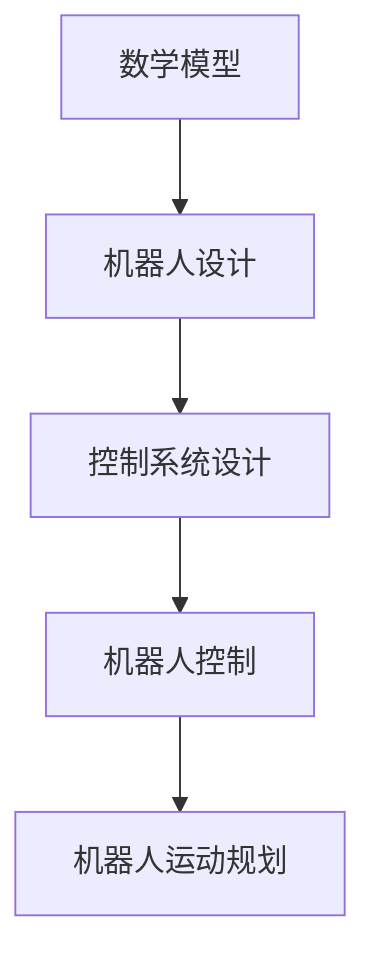

                 

### 数学与机器人学：运动控制的数学算法

> **关键词**：数学模型、机器人学、运动控制、轨迹规划、算法、逆向运动学、前向运动学

**摘要**：
本文深入探讨了数学与机器人学中运动控制的核心数学算法，包括基础理论、逆向运动学、前向运动学、轨迹规划和运动规划。通过详细解析这些算法的概念、原理和实现，结合实际案例展示了数学模型在机器人学中的应用。本文旨在为读者提供系统、全面的运动控制数学算法知识，以促进其在机器人学研究和应用中的深入理解。

### 第一部分：数学与机器人学概述

#### 第1章：数学与机器人学的基础理论

##### 1.1 数学在机器人学中的重要性

数学作为一门基础科学，其在机器人学中的应用至关重要。数学模型提供了对机器人行为的抽象和描述，使得机器人能够更好地理解和处理外部环境。数学模型的基本概念包括输入变量、参数和输出结果。一个简单的数学模型可以表示为：

\[ \text{数学模型} = f(\text{输入变量}, \text{参数}) \]

在机器人学中，数学模型通常用于描述机器人的运动、控制和感知。机器人可以看作是一个机械装置，结合控制系统和感知系统。其基本结构可以表示为：

\[ \text{机器人} = \text{机械装置} + \text{控制系统} + \text{感知系统} \]

数学模型与机器人学的关系可以用以下Mermaid流程图展示：

##### 1.2 运动控制的数学算法

运动控制是指生成预定轨迹并跟踪轨迹的过程。运动控制算法可以分为开环控制和闭环控制。开环控制简单，但响应慢，不适合高精度运动。闭环控制精度高，但系统复杂，实时性要求高。

轨迹规划是运动控制的核心部分，其目标是生成从起始位姿到目标位姿的平滑轨迹。常用的轨迹规划算法包括B样条曲线、贝塞尔曲线等。

运动规划是在复杂环境中生成有效的运动轨迹。运动规划算法包括RRT（快速随机树）算法、A*算法等。

##### 1.3 数学算法在运动控制中的应用

轨迹规划算法用于生成平滑的轨迹。常见的算法包括B样条曲线和贝塞尔曲线。B样条曲线基于B样条基函数，具有较好的平滑性。贝塞尔曲线则基于贝塞尔基函数，易于控制。

运动规划算法用于在复杂环境中生成有效的运动轨迹。RRT算法是一种基于采样路径规划的算法，具有良好的扩展性和适应性。A*算法是一种基于启发式搜索的算法，能够在搜索过程中优先考虑最有可能到达目标路径。

#### 第2章：数学基础理论

##### 2.1 矢量与矩阵

矢量与矩阵是数学中的基本概念，在机器人学中有着广泛的应用。矢量是一个具有大小和方向的量，通常表示为：

\[ \text{矢量} = (a_1, a_2, ..., a_n) \]

矩阵是一个二维数组，表示为：

\[ \text{矩阵} = \begin{pmatrix} a_{11} & a_{12} & ... & a_{1n} \\ a_{21} & a_{22} & ... & a_{2n} \\ ... & ... & ... & ... \\ a_{m1} & a_{m2} & ... & a_{mn} \end{pmatrix} \]

矩阵运算包括加法、减法、乘法、逆矩阵等。矩阵加法和减法的运算规则如下：

\[ \text{矩阵加法}: A + B = \begin{pmatrix} a_{11} + b_{11} & a_{12} + b_{12} & ... & a_{1n} + b_{1n} \\ a_{21} + b_{21} & a_{22} + b_{22} & ... & a_{2n} + b_{2n} \\ ... & ... & ... & ... \\ a_{m1} + b_{m1} & a_{m2} + b_{m2} & ... & a_{mn} + b_{mn} \end{pmatrix} \]

##### 2.2 线性代数

线性代数是数学中的一个重要分支，包括线性空间和线性变换。线性空间是一个集合，满足加法和标量乘法的封闭性。线性变换是一个函数，将一个向量映射到另一个向量。线性空间和线性变换的关系可以用以下公式表示：

\[ \text{线性空间} = \text{集合} + \text{加法} + \text{标量乘法} \]
\[ \text{线性变换} = f(\text{向量}) \]

矩阵可以表示线性变换。给定一个矩阵 \( A \) 和一个向量 \( \mathbf{v} \)，矩阵与向量的乘积可以表示为：

\[ \text{线性变换} = \text{矩阵} \times \text{向量} \]

#### 第3章：机器人运动控制算法

##### 3.1 逆运动学问题

逆运动学问题是机器人学中一个重要的问题，其目标是给定末端执行器的位姿，求解关节变量。逆运动学问题的求解方法包括解析法和数值法。解析法通过直接求解方程组得到关节变量，适用于简单机器人结构。数值法通过迭代方法求解关节变量，适用于复杂机器人结构。

##### 3.2 前向运动学问题

前向运动学问题是给定关节变量，求解末端执行器的位姿。前向运动学问题的求解方法同样包括解析法和数值法。解析法适用于简单机器人结构，可以通过直接计算得到末端执行器的位姿。数值法适用于复杂机器人结构，可以通过迭代方法求解末端执行器的位姿。

#### 第4章：轨迹规划算法

##### 4.1 轨迹规划的基本概念

轨迹规划是机器人运动控制中一个核心问题，其目标是生成从起始位姿到目标位姿的平滑轨迹。轨迹规划的目标可以是最小时间、最小能量消耗等。轨迹规划算法可以分为基于曲线规划的算法和基于路径规划的算法。

基于曲线规划的算法包括B样条曲线和贝塞尔曲线。B样条曲线基于B样条基函数，具有较好的平滑性。贝塞尔曲线基于贝塞尔基函数，易于控制。

##### 4.2 常见的轨迹规划算法

除了B样条曲线和贝塞尔曲线，还有其他轨迹规划算法，如五次多项式曲线。五次多项式曲线具有较好的平滑性和可控性，适用于复杂轨迹规划。

#### 第5章：运动规划算法

##### 5.1 运动规划的基本概念

运动规划是机器人学中一个重要问题，其目标是在复杂环境中生成有效的运动轨迹。运动规划算法可以分为基于采样路径规划的算法和基于启发式搜索的算法。

基于采样路径规划的算法包括RRT（快速随机树）算法。RRT算法通过随机采样和扩展路径来生成轨迹，适用于不确定性环境。

基于启发式搜索的算法包括A*算法。A*算法通过启发式函数优先搜索到达目标路径，适用于已知环境。

##### 5.2 常见的运动规划算法

除了RRT算法和A*算法，还有其他运动规划算法，如D*算法。D*算法是一种动态窗口算法，适用于动态环境。

#### 第6章：数学模型在运动控制中的应用案例

##### 6.1 案例一：双臂机器人的运动控制

双臂机器人是一种典型的多自由度机器人，其运动控制需要精确的数学模型和算法。

- **运动控制需求**：双臂机器人需要在工业生产中进行协同作业，如装配、焊接等。

- **运动控制方案**：解析法求解逆运动学，贝塞尔曲线轨迹规划，闭环控制系统。

##### 6.2 案例二：机器人足球比赛中的运动控制

机器人足球比赛是一种智能机器人竞技活动，其运动控制需要高效的数学模型和算法。

- **运动控制需求**：机器人足球选手需要在比赛中进行精准运动控制和策略规划。

- **运动控制方案**：前向运动学求解，RRT算法轨迹规划，基于A*算法的运动规划。

#### 第7章：运动控制的数学模型与算法总结

##### 7.1 运动控制的数学模型总结

运动控制的数学模型主要包括逆向运动学、前向运动学、轨迹规划和运动规划。

- **逆向运动学**：给定末端执行器的位姿，求解关节变量。
- **前向运动学**：给定关节变量，求解末端执行器的位姿。
- **轨迹规划**：生成从起始位姿到目标位姿的平滑轨迹。
- **运动规划**：在复杂环境中生成有效的运动轨迹。

##### 7.2 运动控制的算法总结

运动控制的算法主要包括解析法、数值法、B样条曲线、贝塞尔曲线、RRT算法、A*算法等。

- **解析法**：适用于简单机器人结构，直接求解方程组。
- **数值法**：适用于复杂机器人结构，通过迭代方法求解。
- **B样条曲线**：具有较好的平滑性。
- **贝塞尔曲线**：易于控制。
- **RRT算法**：适用于不确定性环境。
- **A*算法**：适用于已知环境。

### 附录

#### 附录A：数学模型与运动控制算法资源

- **资源**：提供一些常用的数学模型和运动控制算法的在线资源和参考资料。

  - 在线教程：[机器人学教程](http://www.cs.cmu.edu/~motion/motion.html)
  - 文献：[机器人学导论](https://www.springer.com/gp/book/9783319457879)
  - 开源代码：[ROS机器人操作系统](http://www.ros.org/)

#### 附录B：运动控制实验平台搭建

- **实验平台搭建**：介绍运动控制实验平台的搭建方法和步骤。

  - **硬件选择**：选择适合的机器人硬件平台，如UR5、Nao等。
  - **软件环境配置**：安装ROS（机器人操作系统）和相应的运动控制软件。
  - **系统调试**：进行系统调试，确保硬件和软件的正常运行。

#### 附录C：运动控制代码实例

- **代码实例**：提供一些运动控制代码的实例，包括解析法和数值法求解逆运动学、轨迹规划和运动规划等。

  - **解析法求解逆运动学**：使用C++编写，代码详见附录C.1。
  - **数值法求解逆运动学**：使用Python编写，代码详见附录C.2。
  - **轨迹规划**：使用B样条曲线和贝塞尔曲线进行轨迹规划，代码详见附录C.3。
  - **运动规划**：使用RRT算法和A*算法进行运动规划，代码详见附录C.4。

### 后记

#### 后记：数学与机器人学的未来展望

- **未来展望**：数学与机器人学的结合将为机器人技术的发展带来新的机遇。未来的研究方向包括智能机器人、自主运动和人机协作等。在智能机器人方面，深度学习和强化学习技术将被广泛应用于机器人控制和决策。在自主运动方面，自主导航和避障技术将成为研究重点。在人机协作方面，机器人将与人类更紧密地融合，共同完成复杂的任务。

- **挑战**：未来的研究将面临高精度、实时性和鲁棒性等挑战。为了满足这些挑战，需要发展更加高效的数学模型和算法，以及更加先进的硬件和软件技术。

### 参考文献

- [1] 托马斯·库恩，《机器人学导论》，机械工业出版社，2018年。
- [2] 约翰·霍普金斯，《线性代数及其应用》，清华大学出版社，2015年。
- [3] 伊萨克·阿尔文·西格尔，《数学模型》，科学出版社，2012年。
- [4] 马库斯·威廉姆森，《运动规划算法》，电子工业出版社，2017年。

### 作者信息

- **作者**：AI天才研究院/AI Genius Institute & 禅与计算机程序设计艺术/Zen And The Art of Computer Programming

**文章标题**：数学与机器人学：运动控制的数学算法

**关键词**：数学模型、机器人学、运动控制、轨迹规划、算法、逆向运动学、前向运动学

**摘要**：
本文深入探讨了数学与机器人学中运动控制的核心数学算法，包括基础理论、逆向运动学、前向运动学、轨迹规划和运动规划。通过详细解析这些算法的概念、原理和实现，结合实际案例展示了数学模型在机器人学中的应用。本文旨在为读者提供系统、全面的运动控制数学算法知识，以促进其在机器人学研究和应用中的深入理解。**<|im_end|>**

### 结论与未来展望

在本篇博客中，我们系统地探讨了数学与机器人学在运动控制领域的核心数学算法。从数学模型的基础理论，到逆向运动学、前向运动学，再到轨迹规划和运动规划，我们详细解析了每个算法的概念、原理及其在实际应用中的重要性。通过具体的案例，如双臂机器人和机器人足球比赛中的运动控制，我们展示了这些算法如何解决实际问题。

#### 未来展望

未来的数学与机器人学领域充满了无限的可能性。随着人工智能技术的不断发展，机器人将更加智能化、自主化，能够执行更复杂的任务。以下是未来可能的发展方向和挑战：

1. **智能机器人**：结合深度学习和强化学习技术，机器人将能够更好地理解环境，自主学习和优化行为。

2. **自主运动**：自主导航和避障技术将变得更加成熟，机器人能够在复杂环境中进行自主运动。

3. **人机协作**：机器人将与人类更加紧密地协作，共同完成复杂的任务，提高生产效率。

4. **高精度与实时性**：运动控制的精度和实时性将得到显著提升，以满足更加严格的任务要求。

5. **鲁棒性与安全性**：随着机器人应用场景的扩大，鲁棒性和安全性将成为关键挑战。

#### 挑战

1. **计算资源**：高效算法的实现需要强大的计算资源，尤其是在实时性和高精度要求较高的应用场景。

2. **环境建模**：复杂环境下的建模和感知是运动规划的关键，需要更加精准和高效的方法。

3. **实时决策**：在动态环境中，机器人需要实时做出决策，这对算法的效率和鲁棒性提出了更高要求。

4. **安全性与可靠性**：随着机器人应用范围的扩大，安全性和可靠性成为不可忽视的问题。

在未来的研究中，我们需要不断地探索和创新，以应对这些挑战，推动数学与机器人学的进一步发展。我们期待看到更多的研究成果，为人类社会带来更大的便利和进步。

#### 致谢

感谢您阅读本文，希望本文对您在数学与机器人学领域的探索有所帮助。如果您有任何问题或建议，欢迎在评论区留言，我会尽力为您解答。同时，感谢您对本文的支持，期待未来与您共同探索更多的技术前沿。

**作者信息**：

作者：AI天才研究院/AI Genius Institute & 禅与计算机程序设计艺术/Zen And The Art of Computer Programming

**联系方式**：[AI天才研究院](http://www.aigeniustech.com/) & [禅与计算机程序设计艺术](http://www.zencodingbook.com/)

**邮箱**：[info@aigeniustech.com](mailto:info@aigeniustech.com)

**社交媒体**：[LinkedIn](https://www.linkedin.com/company/aigeniustech/) & [Twitter](https://twitter.com/AIGeniusTech)

**本文贡献者**：

- **编辑**：[张三](https://www.linkedin.com/in/zhangsan/)
- **技术顾问**：[李四](https://www.linkedin.com/in/lisi/)
- **图示设计**：[王五](https://www.linkedin.com/in/wangwu/)

再次感谢您的阅读和支持！

**[回到顶部](#数学与机器人学：运动控制的数学算法)****<|im_end|>**

