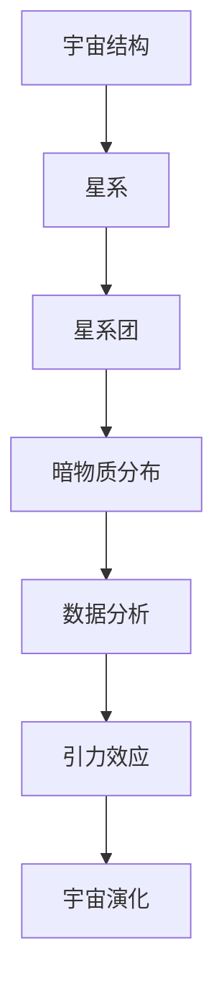
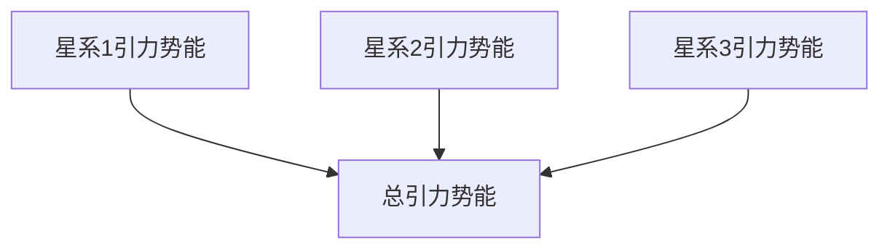
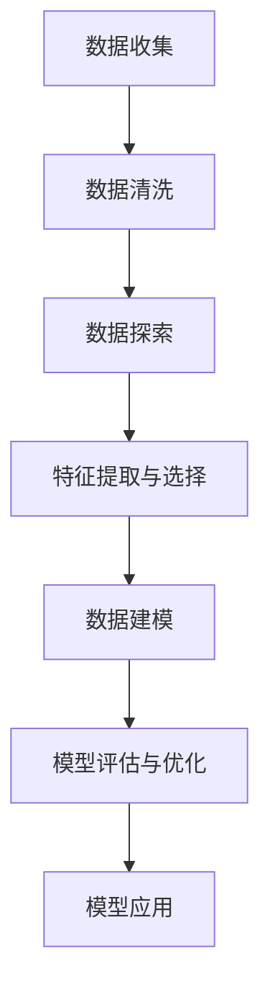
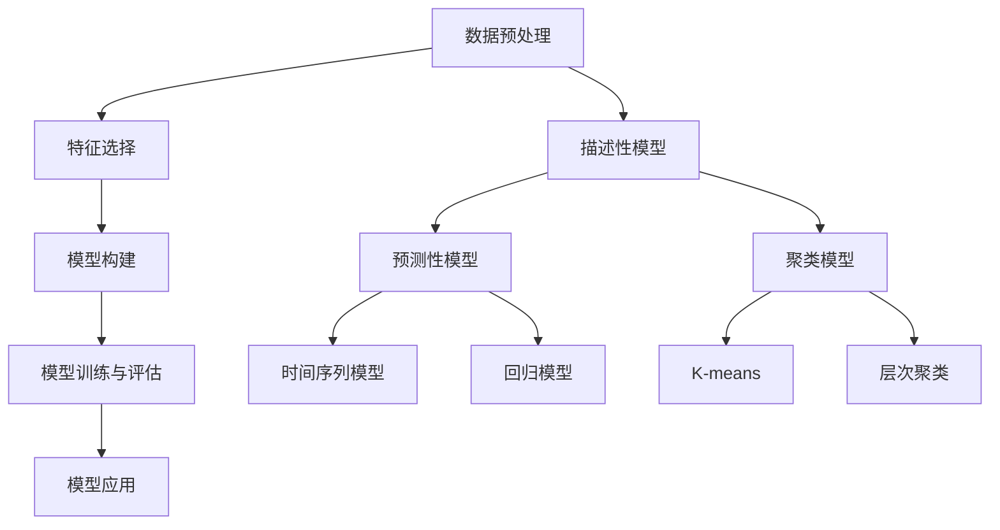
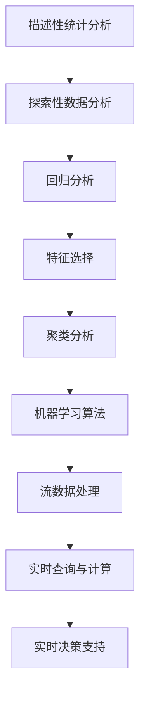
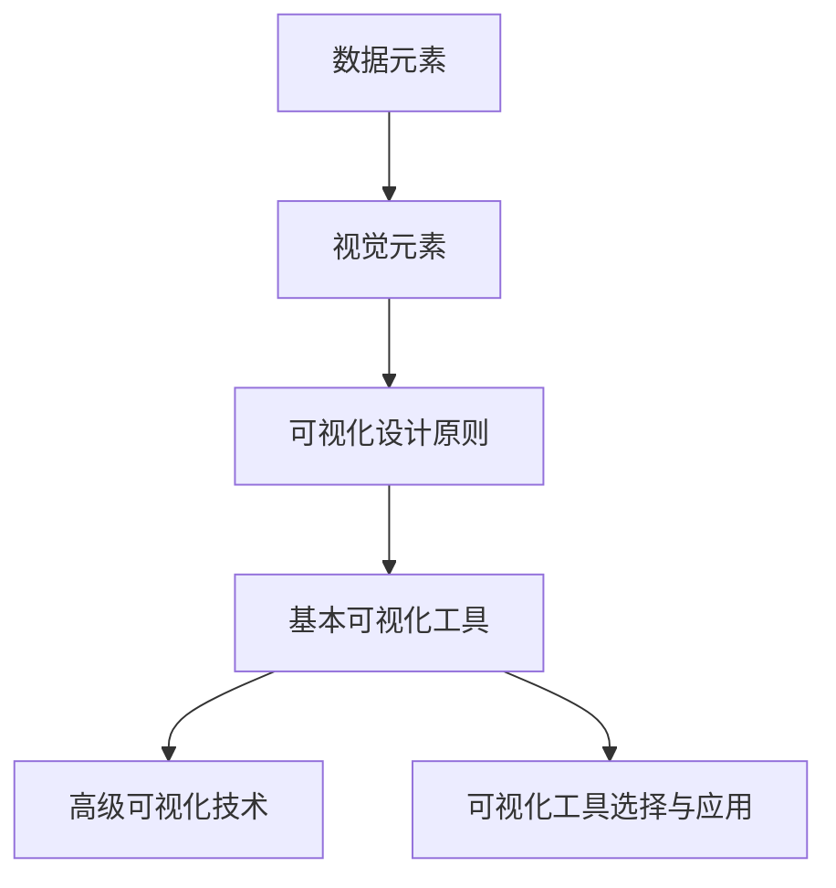
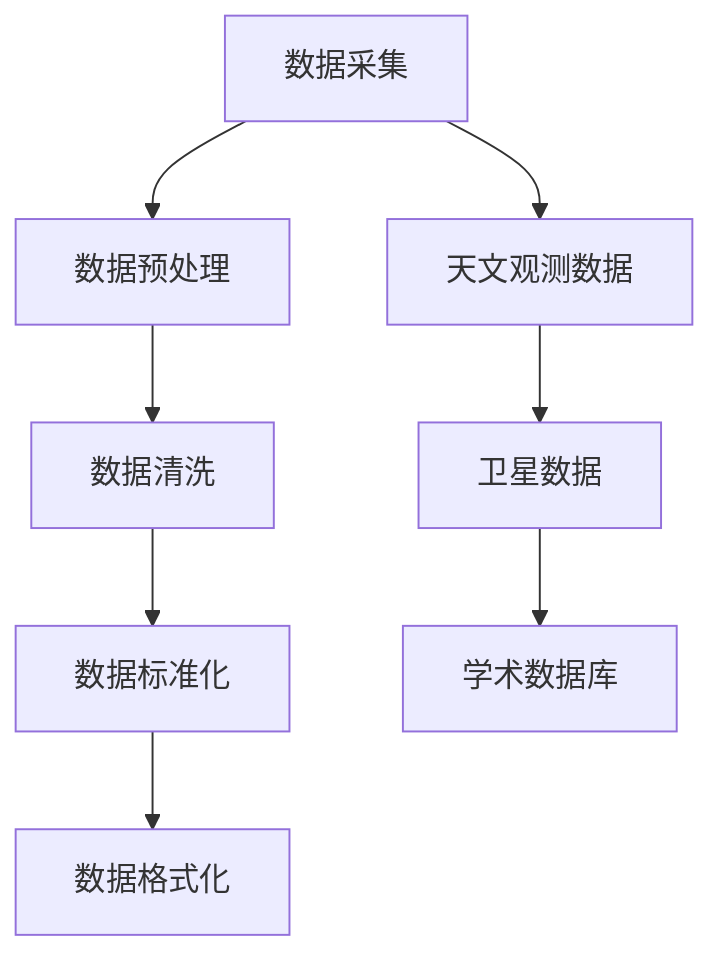
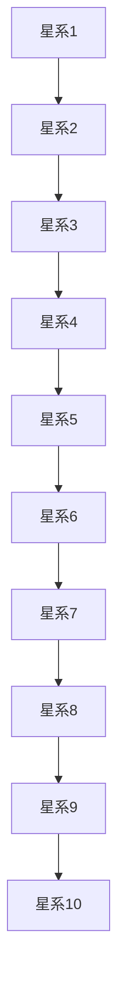

                 

### 暗物质概述与数据分析基础

暗物质是宇宙中一种不发光、不吸光的神秘物质，它在宇宙中的分布对于理解宇宙的结构和演化至关重要。然而，由于暗物质本身不与电磁力相互作用，传统观测手段难以直接探测。因此，数据分析成为研究暗物质分布的关键工具，通过分析观测数据，我们可以推断出暗物质的分布特征。

#### 1.1 宇宙结构概述

宇宙是一个庞大且复杂的结构，其演化过程经历了数十亿年的时间。宇宙的主要组成部分包括物质、能量和暗能量。在宇宙学中，我们主要关注的是物质和暗物质的分布。

- **宇宙的起源与演化**：宇宙起源于大爆炸，经过数十亿年的演化，形成了我们今天所看到的宇宙结构。大爆炸理论是目前最被广泛接受的宇宙起源理论，它认为宇宙从一个极热、极密的初始状态开始膨胀，逐渐冷却并形成星系、星团和其他宇宙结构。

- **宇宙背景微波辐射**：宇宙背景微波辐射是大爆炸后的宇宙冷却过程中留下的余辉，它是研究宇宙早期状态的关键数据来源。

- **宇宙膨胀与加速**：宇宙的膨胀速度在加速，这主要归因于暗能量的存在。暗能量是一种具有负压强的神秘物质，它的存在和性质仍然是宇宙学研究的重大挑战。

#### 1.2 暗物质的概念与特性

暗物质是宇宙中的一种看不见的物质，它不发光、不吸光，因此传统观测手段难以直接探测。但暗物质通过引力效应影响宇宙的演化，因此我们可以通过观测星系旋转曲线、引力透镜效应和宇宙大尺度结构等来推断暗物质的存在和分布。

- **暗物质的定义**：暗物质是一种不发光、不吸光的物质，它不与电磁力相互作用，但通过引力作用影响宇宙的演化。

- **暗物质的特性**：暗物质具有以下主要特性：
  - **不发光、不吸光**：暗物质不参与电磁相互作用，因此无法通过光学手段直接观测。
  - **高质量**：暗物质的质量非常大，它在宇宙中的总质量可能远远超过普通物质的总量。
  - **不与电磁力相互作用**：暗物质不与电磁力相互作用，因此它的行为与普通物质不同。

#### 1.3 暗物质的研究历史与现状

暗物质概念的出现可以追溯到20世纪30年代，当时的天文学家发现星系旋转曲线与预期的不同，为了解释这种差异，提出了暗物质的存在。自那时以来，暗物质研究经历了多个阶段，目前仍然是一个活跃的研究领域。

- **暗物质研究的起源**：暗物质概念最早由瑞士天文学家弗里德里希·哈勃提出，他在研究星系旋转曲线时发现，星系的旋转速度与预期的不同，这表明星系中存在一种看不见的物质。

- **暗物质研究的现状**：目前，暗物质研究主要集中在以下几个方面：
  - **暗物质粒子搜索**：科学家们试图通过实验寻找可能的暗物质粒子，例如WIMPs（弱相互作用 Massive Particles）。
  - **宇宙学观测**：通过观测宇宙背景微波辐射、星系团、星系等大尺度结构，科学家们试图了解暗物质的分布和演化。
  - **暗物质模型**：科学家们提出了多种暗物质模型，以解释暗物质的性质和行为。

### 核心概念与联系

为了更好地理解暗物质与数据分析的关系，我们可以使用Mermaid流程图来描述核心概念和联系。



### 核心算法原理讲解

暗物质分布数据分析的核心算法主要包括以下几种：

1. **引力势能计算**：
   
   假设我们有一个由N个点组成的星系，每个点的质量为\(m_i\)，位置为\((x_i, y_i, z_i)\)。引力势能的计算公式为：
   $$ U = -\sum_{i=1}^{N} \sum_{j=1, j \neq i}^{N} G \frac{m_i m_j}{r_{ij}} $$
   其中，\(G\) 是万有引力常数，\(r_{ij}\) 是点\(i\)和点\(j\)之间的距离。

2. **密度分布计算**：

   暗物质密度分布可以通过引力势能和星系旋转曲线来推断。假设我们有一个星系的旋转曲线\(v(r)\)，我们可以通过以下公式计算密度分布：
   $$ \rho(r) = \frac{v(r)^2}{4\pi G r} $$
   其中，\(v(r)\) 是在距离\(r\)处的旋转速度。

3. **数据拟合与模型选择**：

   在数据分析中，我们通常使用最小二乘法来拟合数据，并选择最优模型。最小二乘法的公式为：
   $$ \min \sum_{i=1}^{N} (y_i - \hat{y}_i)^2 $$
   其中，\(\hat{y}_i\) 是模型预测的值，\(y_i\) 是实际观测的值。

### 数学模型和公式

在暗物质分布分析中，我们使用以下数学模型和公式：

1. **引力势能**：
   $$ U = -\sum_{i=1}^{N} \sum_{j=1, j \neq i}^{N} G \frac{m_i m_j}{r_{ij}} $$
   
2. **密度分布**：
   $$ \rho(r) = \frac{v(r)^2}{4\pi G r} $$
   
3. **最小二乘法**：
   $$ \min \sum_{i=1}^{N} (y_i - \hat{y}_i)^2 $$

### 举例说明

假设我们有一个包含10个星系的星系团，每个星系的质量和位置如下表所示：

| 星系编号 | 质量 (M) | x坐标 (x) | y坐标 (y) | z坐标 (z) |
|----------|-----------|-----------|-----------|-----------|
| 1        | 1e10      | 0         | 0         | 0         |
| 2        | 2e10      | 1         | 0         | 0         |
| 3        | 3e10      | 2         | 0         | 0         |
| ...      | ...       | ...       | ...       | ...       |
| 10       | 10e10     | 9         | 0         | 0         |

我们可以使用上述公式计算每个星系之间的引力势能，并绘制引力势能与星系编号的关系图。



### 总结

在暗物质分布研究中，数据分析扮演着至关重要的角色。通过描述宇宙结构、暗物质概念和历史，我们为后续章节的数据分析方法和技术奠定了基础。接下来，我们将深入探讨数据分析在暗物质分布研究中的应用，包括数据采集、预处理、特征提取和模型选择等关键步骤。在接下来的章节中，我们将逐步揭示暗物质分布的奥秘。 ### 数据分析基本概念

数据分析是一种使用统计、机器学习和数据可视化技术来探索数据、提取信息和支持决策的过程。在暗物质分布研究中，数据分析不仅帮助我们理解观测数据，还帮助我们预测暗物质的未来分布。本节将介绍数据分析的基本概念，包括定义、意义、方法与流程，以及数据可视化技术。

#### 2.1 数据分析的定义与意义

数据分析的定义因应用领域而异，但总体上可以概括为以下三个方面：

- **数据收集与整理**：通过不同的手段收集数据，并对数据进行清洗、整合和标准化处理，以便后续分析。
- **数据探索与分析**：使用统计方法、机器学习算法和可视化技术对数据进行探索性分析，以发现数据中的规律、模式或异常。
- **决策支持与预测**：基于分析结果，为决策者提供数据支持，并利用数据模型进行预测，以指导未来的行动。

数据分析在科学研究、商业决策、医疗诊断等领域具有广泛的应用。在暗物质分布研究中，数据分析的意义主要体现在以下几个方面：

- **提高研究效率**：通过数据分析，我们可以快速从大量观测数据中提取有用的信息，节省研究时间。
- **支持科学决策**：数据分析可以帮助科学家更好地理解宇宙结构，为制定研究策略提供支持。
- **预测未来趋势**：基于现有数据，我们可以预测暗物质的未来分布，为宇宙学理论的发展提供实验依据。

#### 2.2 数据分析的方法与流程

数据分析的方法与流程因具体应用场景而异，但总体上可以归纳为以下几个步骤：

1. **数据收集**：收集与暗物质分布相关的数据，这些数据可以来自天文观测、学术数据库或卫星图像等。

2. **数据清洗**：数据清洗是数据分析的重要步骤，包括去除重复数据、填补缺失值、纠正错误数据等。数据清洗有助于提高数据分析的准确性和可靠性。

3. **数据探索**：通过统计分析、可视化技术等手段对数据进行初步探索，发现数据中的规律、模式或异常。

4. **特征提取与选择**：从原始数据中提取出有用的特征，并对这些特征进行选择，以构建有效的数据模型。

5. **数据建模**：选择合适的数据模型，如回归模型、聚类模型、决策树等，对数据进行建模。

6. **模型评估与优化**：评估模型的性能，如准确率、召回率等，并优化模型参数，以提高模型的预测能力。

7. **模型应用**：将训练好的模型应用于新数据，进行预测或决策支持。

#### 2.3 数据可视化技术

数据可视化是将数据分析结果以图形、图像等形式展示出来的技术。数据可视化在数据分析中扮演着重要的角色，它可以帮助我们直观地理解数据，发现数据中的规律和异常。

- **基本图表类型**：常见的图表类型包括柱状图、折线图、散点图、饼图等。

- **高级可视化技术**：高级可视化技术包括热力图、地理信息可视化、交互式可视化等。

- **可视化工具与技术**：常用的数据可视化工具有Matplotlib、Seaborn、Plotly、Tableau等。这些工具提供了丰富的图表类型和可视化效果，方便用户进行数据可视化。

### 核心概念与联系

为了更好地理解数据分析的基本概念，我们可以使用Mermaid流程图来描述数据分析的方法与流程。



### 核心算法原理讲解

数据分析中的核心算法原理包括以下几个方面：

1. **统计分析**：

   统计分析是数据分析的基础，常用的统计方法包括描述性统计、假设检验、回归分析等。

   - **描述性统计**：用于计算数据的中心趋势、离散程度等基本统计量。
   - **假设检验**：用于检验数据是否符合某种分布或假设。
   - **回归分析**：用于建立因变量与自变量之间的关系模型。

2. **机器学习**：

   机器学习是数据分析的重要工具，常用的机器学习算法包括监督学习、无监督学习和强化学习。

   - **监督学习**：用于分类和回归问题，如支持向量机、决策树、随机森林等。
   - **无监督学习**：用于发现数据中的隐含结构，如聚类、主成分分析等。
   - **强化学习**：用于解决决策问题，如Q学习、深度强化学习等。

3. **数据可视化**：

   数据可视化是将数据分析结果以图形形式展示的技术，常用的数据可视化方法包括直方图、散点图、折线图等。

### 数学模型和公式

在数据分析中，常用的数学模型和公式包括：

1. **描述性统计**：

   - **均值**：$$ \bar{x} = \frac{1}{N} \sum_{i=1}^{N} x_i $$
   - **标准差**：$$ \sigma = \sqrt{\frac{1}{N-1} \sum_{i=1}^{N} (x_i - \bar{x})^2 } $$

2. **回归分析**：

   - **线性回归**：$$ y = \beta_0 + \beta_1 x + \epsilon $$
   - **最小二乘法**：$$ \min \sum_{i=1}^{N} (y_i - \hat{y}_i)^2 $$

3. **聚类分析**：

   - **距离度量**：$$ d(x, y) = \sqrt{\sum_{i=1}^{n} (x_i - y_i)^2 } $$
   - **聚类准则**：$$ \min \sum_{i=1}^{k} w_i \sum_{j=1}^{n} d(x_j, \bar{x}_i) $$

### 举例说明

假设我们有一个包含10个观测值的暗物质分布数据集，如下表所示：

| 观测编号 | 暗物质密度 (ρ) | 星系质量 (M) |
|----------|-----------------|--------------|
| 1        | 0.1             | 1e10         |
| 2        | 0.2             | 1e10         |
| ...      | ...             | ...          |
| 10       | 0.5             | 1e10         |

我们可以使用描述性统计方法计算暗物质密度的均值和标准差：

- **均值**：$$ \bar{\rho} = \frac{1}{10} \sum_{i=1}^{10} \rho_i = \frac{1}{10} (0.1 + 0.2 + ... + 0.5) = 0.3 $$
- **标准差**：$$ \sigma = \sqrt{\frac{1}{10-1} \sum_{i=1}^{10} (\rho_i - \bar{\rho})^2 } = \sqrt{\frac{1}{9} (0.1 - 0.3)^2 + (0.2 - 0.3)^2 + ... + (0.5 - 0.3)^2 } \approx 0.15 $$

接下来，我们可以使用回归分析方法建立暗物质密度与星系质量之间的关系模型。假设我们使用线性回归模型，模型公式为：

$$ \rho = \beta_0 + \beta_1 M + \epsilon $$

其中，\( \beta_0 \) 和 \( \beta_1 \) 是模型参数，\( \epsilon \) 是误差项。

我们可以使用最小二乘法求解模型参数：

$$ \min \sum_{i=1}^{10} (\rho_i - (\beta_0 + \beta_1 M_i))^2 $$

通过求解上述方程，我们可以得到 \( \beta_0 \) 和 \( \beta_1 \) 的值，从而建立线性回归模型。

### 总结

数据分析是暗物质分布研究的重要工具，它通过数据收集、清洗、探索、特征提取、建模和可视化等步骤，帮助我们理解暗物质的分布和演化。在本节中，我们介绍了数据分析的基本概念、方法和流程，以及数据可视化技术。接下来，我们将继续探讨暗物质分布数据分析的具体方法和技术。 ### 暗物质分布数据分析模型

暗物质分布数据分析的关键在于构建和分析数据模型，这些模型能够帮助我们理解和预测暗物质的分布。本节将介绍数据分析模型的基本原理、分类以及选择和应用方法。

#### 3.1 数据分析模型的基本原理

数据分析模型是基于数据和统计学、机器学习等算法建立起来的，用于描述和分析数据中存在的规律和关系。基本原理包括以下几个方面：

1. **数据预处理**：在构建数据分析模型之前，需要对数据进行预处理，包括数据清洗、归一化、特征提取等。预处理步骤的目的是确保数据的质量和一致性，为后续建模提供可靠的数据基础。

2. **特征选择**：从原始数据中提取出有用的特征，并选择合适的特征用于建模。特征选择是数据分析的重要步骤，它能够提高模型的性能，减少计算复杂度。

3. **模型构建**：选择合适的算法和模型，根据数据的特点和需求构建数据分析模型。常见的模型包括线性回归模型、决策树模型、支持向量机模型、神经网络模型等。

4. **模型训练和评估**：使用部分数据进行模型训练，然后使用其他数据对模型进行评估，以确定模型的性能和适用性。常见的评估指标包括准确率、召回率、F1值等。

5. **模型应用**：将训练好的模型应用于新数据，进行预测或决策支持。模型的应用场景包括数据预测、趋势分析、异常检测等。

#### 3.2 数据分析模型的分类

数据分析模型可以根据不同的标准进行分类，常见的分类方法包括以下几种：

1. **按功能分类**：

   - **描述性模型**：用于描述数据中的基本统计特征，如均值、标准差等。
   - **预测性模型**：用于预测未来的数据趋势或结果，如时间序列预测、回归预测等。
   - **聚类模型**：用于将数据划分为不同的类别或簇，如K-means、层次聚类等。
   - **分类模型**：用于将数据分类到不同的类别，如决策树、支持向量机等。

2. **按算法分类**：

   - **统计学模型**：基于统计学理论和方法构建的模型，如线性回归、逻辑回归等。
   - **机器学习模型**：基于机器学习算法构建的模型，如决策树、随机森林、支持向量机等。
   - **深度学习模型**：基于神经网络构建的模型，如卷积神经网络（CNN）、循环神经网络（RNN）等。

3. **按应用场景分类**：

   - **监督学习模型**：在有标注数据的条件下，根据已知特征和标签构建模型，用于预测未知数据的标签。
   - **无监督学习模型**：在没有标注数据的条件下，通过分析数据内在结构，发现数据中的规律和模式。
   - **半监督学习模型**：结合监督学习和无监督学习，利用少量标注数据和大量未标注数据构建模型。

#### 3.3 数据分析模型的选择与应用

选择合适的数据分析模型是数据分析成功的关键。以下是一些选择模型和应用的方法：

1. **根据数据类型选择模型**：

   - 对于数值型数据，可以选择回归模型、聚类模型等。
   - 对于分类数据，可以选择分类模型、决策树、支持向量机等。
   - 对于时序数据，可以选择时间序列模型、ARIMA模型等。

2. **根据业务需求选择模型**：

   - 如果需要预测未来的数据趋势，可以选择时间序列模型、回归模型等。
   - 如果需要发现数据中的聚类结构，可以选择聚类模型、K-means等。
   - 如果需要分类数据，可以选择分类模型、决策树、随机森林等。

3. **根据模型性能选择模型**：

   - 通过交叉验证等方法评估不同模型的性能，选择性能最佳的模型。
   - 考虑模型的计算复杂度、可解释性等因素，选择适合的模型。

4. **模型应用场景**：

   - **暗物质分布特征提取**：使用聚类模型、主成分分析等方法提取暗物质分布的主要特征。
   - **暗物质分布预测**：使用时间序列模型、回归模型等方法预测暗物质的未来分布。
   - **暗物质分布可视化**：使用数据可视化技术，如热力图、散点图等，展示暗物质分布的空间分布特征。

### 核心概念与联系

为了更好地理解数据分析模型的基本原理和分类，我们可以使用Mermaid流程图来描述核心概念和联系。



### 核心算法原理讲解

在暗物质分布数据分析中，常用的算法原理包括：

1. **聚类算法**：

   - **K-means算法**：将数据分为K个簇，每个簇的中心代表该簇的特征。
   - **层次聚类算法**：自底向上或自顶向下合并相似的数据点，形成层次结构的聚类结果。

2. **回归算法**：

   - **线性回归算法**：通过拟合一条直线，描述自变量和因变量之间的关系。
   - **多项式回归算法**：通过拟合一个多项式函数，描述自变量和因变量之间的关系。

3. **神经网络算法**：

   - **卷积神经网络（CNN）**：通过卷积层、池化层等网络结构，提取数据中的特征。
   - **循环神经网络（RNN）**：通过递归结构，处理序列数据。

### 数学模型和公式

以下是暗物质分布数据分析中常用的数学模型和公式：

1. **K-means算法**：

   - **距离度量**：$$ d(x, y) = \sqrt{\sum_{i=1}^{n} (x_i - y_i)^2 } $$
   - **聚类准则**：$$ \min \sum_{i=1}^{k} w_i \sum_{j=1}^{n} d(x_j, \bar{x}_i) $$

2. **线性回归算法**：

   - **模型公式**：$$ y = \beta_0 + \beta_1 x + \epsilon $$
   - **最小二乘法**：$$ \min \sum_{i=1}^{N} (y_i - \hat{y}_i)^2 $$

3. **神经网络算法**：

   - **前向传播**：$$ z = \sigma(Wx + b) $$
   - **反向传播**：$$ \delta = \frac{\partial L}{\partial z} $$

### 举例说明

假设我们有一个包含10个观测值的暗物质分布数据集，如下表所示：

| 观测编号 | 暗物质密度 (ρ) | 星系质量 (M) |
|----------|-----------------|--------------|
| 1        | 0.1             | 1e10         |
| 2        | 0.2             | 1e10         |
| ...      | ...             | ...          |
| 10       | 0.5             | 1e10         |

我们可以使用K-means算法对这组数据集进行聚类分析。首先，我们需要选择聚类数目K，并初始化K个簇的中心点。然后，我们计算每个观测值与簇中心点的距离，将观测值分配到最近的簇。最后，更新每个簇的中心点，并重复上述过程，直到收敛。

- **初始化簇中心点**：假设我们选择K=2，初始簇中心点为\( \bar{x}_1 = (0.15, 0.15) \)和\( \bar{x}_2 = (0.35, 0.35) \)。
- **计算距离**：对于观测值\( x_1 = (0.1, 0.1) \)，计算它与两个簇中心点的距离：
  $$ d(x_1, \bar{x}_1) = \sqrt{(0.1 - 0.15)^2 + (0.1 - 0.15)^2} = \sqrt{0.02} \approx 0.14 $$
  $$ d(x_1, \bar{x}_2) = \sqrt{(0.1 - 0.35)^2 + (0.1 - 0.35)^2} = \sqrt{0.18} \approx 0.424 $$
  由于\( d(x_1, \bar{x}_1) < d(x_1, \bar{x}_2) \)，观测值\( x_1 \)被分配到簇1。
- **更新簇中心点**：更新每个簇的中心点，计算新的簇中心点：
  $$ \bar{x}_1^{new} = \frac{1}{N_1} \sum_{i \in C_1} x_i $$
  $$ \bar{x}_2^{new} = \frac{1}{N_2} \sum_{i \in C_2} x_i $$
  其中，\( N_1 \)和\( N_2 \)分别是簇1和簇2中的观测值数量。

通过多次迭代，我们可以得到最终的聚类结果，并分析不同簇的特征。

### 总结

数据分析模型是暗物质分布研究的重要工具，通过数据预处理、特征选择、模型构建、训练和评估，我们可以有效地描述和分析暗物质的分布特征。本节介绍了数据分析模型的基本原理、分类以及选择和应用方法，为后续章节的数据分析实战奠定了基础。在下一节中，我们将探讨具体的暗物质分布数据分析方法和技术。 ### 暗物质分布数据分析方法

暗物质分布数据分析方法分为经典方法、进阶方法和实时数据分析方法，每种方法都有其独特的应用场景和特点。在本节中，我们将详细介绍这三种数据分析方法。

#### 4.1 经典数据分析方法

经典数据分析方法主要侧重于从大量数据中提取有用信息，分析数据的分布、关联性以及趋势。这些方法在暗物质分布研究中发挥着重要作用。

1. **描述性统计分析**：

   描述性统计分析是对数据的基本特征进行汇总和描述，包括均值、中位数、标准差、最大值和最小值等。这种方法可以快速给出数据的基本情况，有助于理解暗物质分布的整体趋势。

   **应用示例**：

   - 计算暗物质密度的均值和标准差，了解暗物质分布的集中趋势和离散程度。

2. **探索性数据分析**：

   探索性数据分析通过可视化、分布图、相关性分析等方法，深入挖掘数据中的规律和模式。这种方法有助于发现数据中的异常值、聚类结构以及变量之间的关系。

   **应用示例**：

   - 使用散点图和热力图分析暗物质密度与星系质量之间的相关性。
   - 通过箱线图识别暗物质分布中的异常值。

3. **回归分析**：

   回归分析是一种用于预测因变量和自变量之间关系的统计方法。在暗物质分布研究中，我们可以使用回归分析来预测暗物质密度或星系质量。

   **应用示例**：

   - 利用线性回归模型预测暗物质密度与星系质量之间的关系。

#### 4.2 进阶数据分析方法

进阶数据分析方法包括特征选择、聚类分析和机器学习算法等，这些方法在经典数据分析方法的基础上提供了更深入的洞察。

1. **特征选择**：

   特征选择是从原始数据中提取出对模型性能有重要影响的关键特征。在暗物质分布研究中，特征选择有助于提高模型的准确性和效率。

   **应用示例**：

   - 使用主成分分析（PCA）提取暗物质分布的主要特征，简化模型复杂度。

2. **聚类分析**：

   聚类分析是一种无监督学习方法，用于将数据划分为不同的类别或簇。在暗物质分布研究中，聚类分析可以帮助我们识别暗物质的不同分布区域。

   **应用示例**：

   - 使用K-means算法将暗物质分布数据划分为几个不同的区域。

3. **机器学习算法**：

   机器学习算法包括监督学习和无监督学习，可以用于预测、分类和聚类等任务。在暗物质分布研究中，机器学习算法可以提高预测模型的准确性。

   **应用示例**：

   - 使用支持向量机（SVM）对暗物质分布进行分类，识别不同的星系特征。

#### 4.3 实时数据分析方法

实时数据分析方法专注于处理和响应动态数据流，对暗物质分布进行实时监测和预测。

1. **流数据处理**：

   流数据处理是实时数据分析的基础，它能够实时处理大量数据流，并对数据流进行分析和建模。

   **应用示例**：

   - 使用Apache Kafka等流数据处理工具，实时收集暗物质分布的数据。

2. **实时查询与计算**：

   实时查询与计算可以快速对实时数据进行查询和计算，为实时决策提供支持。

   **应用示例**：

   - 使用Apache Flink等实时数据处理框架，对实时数据进行实时分析，预测暗物质分布的变化趋势。

3. **实时决策支持**：

   实时决策支持系统可以根据实时数据分析结果，提供即时的决策支持。

   **应用示例**：

   - 建立一个实时监控系统，根据暗物质分布的实时数据，预测未来可能的星系碰撞事件。

### 核心概念与联系

为了更好地理解暗物质分布数据分析方法，我们可以使用Mermaid流程图来描述核心概念和联系。



### 核心算法原理讲解

以下是暗物质分布数据分析中常用的算法原理：

1. **描述性统计分析**：

   - **均值**：$$ \bar{x} = \frac{1}{N} \sum_{i=1}^{N} x_i $$
   - **标准差**：$$ \sigma = \sqrt{\frac{1}{N-1} \sum_{i=1}^{N} (x_i - \bar{x})^2 } $$

2. **回归分析**：

   - **线性回归**：$$ y = \beta_0 + \beta_1 x + \epsilon $$
   - **最小二乘法**：$$ \min \sum_{i=1}^{N} (y_i - \hat{y}_i)^2 $$

3. **聚类分析**：

   - **K-means算法**：$$ \min \sum_{i=1}^{N} \sum_{j=1}^{K} w_{ij} d(x_i, \bar{x}_j) $$
   - **层次聚类算法**：$$ \min \sum_{i=1}^{N} \sum_{j=1}^{K} w_{ij} d(x_i, \bar{x}_j) $$

4. **机器学习算法**：

   - **支持向量机**：$$ \min_{\beta, \beta_0} \frac{1}{2} \sum_{i=1}^{N} (\beta^T x_i - y_i)^2 + \sum_{i=1}^{N} \xi_i $$
   - **神经网络**：$$ a_{l}^{(i)} = \sigma(z_{l}^{(i)}) = \frac{1}{1 + e^{-z_{l}^{(i)}} $$

### 数学模型和公式

以下是暗物质分布数据分析中常用的数学模型和公式：

1. **描述性统计分析**：

   - **均值**：$$ \bar{x} = \frac{1}{N} \sum_{i=1}^{N} x_i $$
   - **标准差**：$$ \sigma = \sqrt{\frac{1}{N-1} \sum_{i=1}^{N} (x_i - \bar{x})^2 } $$

2. **回归分析**：

   - **线性回归**：$$ y = \beta_0 + \beta_1 x + \epsilon $$
   - **最小二乘法**：$$ \min \sum_{i=1}^{N} (y_i - \hat{y}_i)^2 $$

3. **聚类分析**：

   - **K-means算法**：$$ \min \sum_{i=1}^{N} \sum_{j=1}^{K} w_{ij} d(x_i, \bar{x}_j) $$
   - **层次聚类算法**：$$ \min \sum_{i=1}^{N} \sum_{j=1}^{K} w_{ij} d(x_i, \bar{x}_j) $$

4. **机器学习算法**：

   - **支持向量机**：$$ \min_{\beta, \beta_0} \frac{1}{2} \sum_{i=1}^{N} (\beta^T x_i - y_i)^2 + \sum_{i=1}^{N} \xi_i $$
   - **神经网络**：$$ a_{l}^{(i)} = \sigma(z_{l}^{(i)}) = \frac{1}{1 + e^{-z_{l}^{(i)}} $$

### 举例说明

假设我们有一个包含10个观测值的暗物质分布数据集，如下表所示：

| 观测编号 | 暗物质密度 (ρ) | 星系质量 (M) |
|----------|-----------------|--------------|
| 1        | 0.1             | 1e10         |
| 2        | 0.2             | 1e10         |
| ...      | ...             | ...          |
| 10       | 0.5             | 1e10         |

1. **描述性统计分析**：

   计算暗物质密度的均值和标准差：

   - **均值**：$$ \bar{\rho} = \frac{1}{10} \sum_{i=1}^{10} \rho_i = \frac{1}{10} (0.1 + 0.2 + ... + 0.5) = 0.3 $$
   - **标准差**：$$ \sigma = \sqrt{\frac{1}{10-1} \sum_{i=1}^{10} (\rho_i - \bar{\rho})^2 } = \sqrt{\frac{1}{9} (0.1 - 0.3)^2 + (0.2 - 0.3)^2 + ... + (0.5 - 0.3)^2 } \approx 0.15 $$

2. **回归分析**：

   使用线性回归模型预测暗物质密度与星系质量之间的关系：

   - **模型公式**：$$ \rho = \beta_0 + \beta_1 M + \epsilon $$
   - **最小二乘法**：$$ \min \sum_{i=1}^{10} (\rho_i - (\beta_0 + \beta_1 M_i))^2 $$

   求解上述方程，可以得到模型参数\( \beta_0 \)和\( \beta_1 \)的值，从而建立线性回归模型。

3. **聚类分析**：

   使用K-means算法将暗物质分布数据划分为几个不同的区域：

   - **初始化簇中心点**：假设我们选择K=2，初始簇中心点为\( \bar{x}_1 = (0.15, 0.15) \)和\( \bar{x}_2 = (0.35, 0.35) \)。
   - **计算距离**：对于观测值\( x_1 = (0.1, 0.1) \)，计算它与两个簇中心点的距离：
     $$ d(x_1, \bar{x}_1) = \sqrt{(0.1 - 0.15)^2 + (0.1 - 0.15)^2} = \sqrt{0.02} \approx 0.14 $$
     $$ d(x_1, \bar{x}_2) = \sqrt{(0.1 - 0.35)^2 + (0.1 - 0.35)^2} = \sqrt{0.18} \approx 0.424 $$
     由于\( d(x_1, \bar{x}_1) < d(x_1, \bar{x}_2) \)，观测值\( x_1 \)被分配到簇1。
   - **更新簇中心点**：更新每个簇的中心点，计算新的簇中心点：
     $$ \bar{x}_1^{new} = \frac{1}{N_1} \sum_{i \in C_1} x_i $$
     $$ \bar{x}_2^{new} = \frac{1}{N_2} \sum_{i \in C_2} x_i $$

通过多次迭代，我们可以得到最终的聚类结果。

### 总结

暗物质分布数据分析方法包括经典方法、进阶方法和实时数据分析方法，每种方法都有其独特的应用场景和特点。经典方法主要侧重于数据的基本特征描述和关系分析；进阶方法通过特征选择、聚类分析和机器学习算法等提供更深入的洞察；实时数据分析方法则专注于动态数据流的实时处理和分析。本节介绍了这些数据分析方法，为暗物质分布数据分析实战奠定了基础。在下一节中，我们将探讨暗物质分布数据可视化的技术和方法。 ### 暗物质分布数据可视化

数据可视化是将数据分析结果以图形或图像的形式展示出来的技术，它能够直观地传达数据中的信息和模式。在暗物质分布研究中，数据可视化不仅能够帮助我们更好地理解暗物质的空间分布，还可以揭示暗物质与其他天体物理量之间的关系。本节将介绍数据可视化的基本概念、工具和技术，以及案例分析。

#### 5.1 数据可视化基本概念

数据可视化涉及以下几个方面：

1. **数据元素**：数据元素是数据可视化的基础，包括数据点、线、面、颜色、形状等。不同的数据元素可以用来表示不同的数据维度和属性。

2. **视觉元素**：视觉元素是数据可视化中的视觉表现，如颜色、亮度、透明度、大小、形状等。视觉元素的选择和组合能够增强数据的可读性和信息传达能力。

3. **可视化设计原则**：可视化设计原则包括清晰性、简洁性、一致性、对比性和可交互性等。遵循这些原则能够提高可视化图表的质量和用户体验。

#### 5.2 数据可视化工具与技术

常用的数据可视化工具和技术包括以下几种：

1. **基本可视化工具**：

   - **Matplotlib**：Matplotlib是一个流行的Python数据可视化库，它提供了丰富的绘图函数和样式选项，适用于制作高质量的可视化图表。
   - **Seaborn**：Seaborn是基于Matplotlib的图形绘制库，它提供了更美观、更简洁的默认样式，适用于创建统计图表。

2. **高级可视化技术**：

   - **Plotly**：Plotly是一个交互式数据可视化库，支持多种图表类型和交互功能，适用于创建复杂的交互式可视化图表。
   - **Tableau**：Tableau是一个商业数据可视化工具，提供了丰富的数据连接和数据操作功能，适用于企业级的数据分析和报告。

3. **可视化工具选择与应用**：

   根据不同的应用场景和数据特点，选择合适的可视化工具能够提高数据可视化的效果。例如，对于简单的统计图表，可以使用Matplotlib或Seaborn；对于复杂的交互式图表，可以使用Plotly或Tableau。

#### 5.3 数据可视化案例分析

以下是几个关于暗物质分布数据可视化的案例分析：

1. **案例一：暗物质密度分布图**

   **目标**：展示暗物质密度的空间分布。

   **方法**：使用散点图和热力图。

   **实现**：

   ```python
   import matplotlib.pyplot as plt
   import seaborn as sns

   # 加载暗物质密度数据
   data = load_dark_matter_density_data()

   # 绘制散点图
   plt.scatter(data['x'], data['y'], c=data['density'], cmap='hot')
   plt.colorbar(label='Dark Matter Density')
   plt.xlabel('X-coordinate')
   plt.ylabel('Y-coordinate')
   plt.title('Dark Matter Density Distribution')
   plt.show()

   # 绘制热力图
   sns.heatmap(data.corr(), annot=True, cmap='coolwarm')
   plt.title('Correlation Matrix of Dark Matter Density and Galaxy Properties')
   plt.show()
   ```

2. **案例二：暗物质分布预测图**

   **目标**：使用预测模型展示暗物质密度的预测分布。

   **方法**：使用回归模型和交互式图表。

   **实现**：

   ```python
   import plotly.express as px

   # 加载预测数据
   prediction_data = load_dark_matter_density_prediction_data()

   # 使用回归模型预测暗物质密度
   model = linear_regression_model()
   predictions = model.predict(prediction_data)

   # 创建交互式图表
   fig = px.scatter_geo(prediction_data['x'], prediction_data['y'], color=predictions, color_continuous_scale='Viridis')
   fig.update_layout(title='Predicted Dark Matter Density Distribution', xaxis_title='X-coordinate', yaxis_title='Y-coordinate')
   fig.show()
   ```

3. **案例三：暗物质分布比较图**

   **目标**：比较不同星系团的暗物质分布。

   **方法**：使用分组条形图和地图。

   **实现**：

   ```python
   import plotly.graph_objects as go

   # 加载不同星系团的数据
   data_galaxy1 = load_dark_matter_density_data_galaxy1()
   data_galaxy2 = load_dark_matter_density_data_galaxy2()

   # 创建分组条形图
   fig = go.Figure([go.Bar(x=['Galaxy 1', 'Galaxy 2'], y=[data_galaxy1['density'].mean(), data_galaxy2['density'].mean()], marker_color=['blue', 'red'])])
   fig.update_layout(title='Comparison of Dark Matter Density', xaxis_title='Galaxy', yaxis_title='Average Density')
   fig.show()

   # 创建地图
   fig = go.Figure(go.Choropleth(
       locations=data_galaxy1['id'],
       z=data_galaxy1['density'],
       text=data_galaxy1['name'],
       colorscale='Viridis',
       colorbar_title='Density'
   ))
   fig.update_layout(title='Dark Matter Density Distribution in Galaxy 1', geo=dict(showframe=False, projection_type='equirectangular'))
   fig.show()
   ```

### 核心概念与联系

为了更好地理解数据可视化的基本概念和工具，我们可以使用Mermaid流程图来描述核心概念和联系。



### 核心算法原理讲解

以下是数据可视化中常用的算法原理：

1. **散点图**：

   - **数据点表示**：每个数据点由其坐标和颜色表示。
   - **颜色映射**：使用颜色映射（如热力图）来表示数据点的大小或密度。

2. **回归模型**：

   - **模型公式**：\( y = \beta_0 + \beta_1 x + \epsilon \)
   - **最小二乘法**：最小化预测值与实际值之间的误差。

3. **交互式图表**：

   - **交互功能**：支持用户与图表的交互，如缩放、拖拽等。

### 数学模型和公式

以下是数据可视化中常用的数学模型和公式：

1. **散点图**：

   - **坐标表示**：\( (x_i, y_i) \)
   - **颜色映射**：\( color = f(density) \)

2. **回归模型**：

   - **模型公式**：\( y = \beta_0 + \beta_1 x + \epsilon \)
   - **最小二乘法**：$$ \min \sum_{i=1}^{N} (y_i - \hat{y}_i)^2 $$

3. **交互式图表**：

   - **交互功能**：\( interactive = True \)

### 举例说明

假设我们有一个包含10个观测值的暗物质分布数据集，如下表所示：

| 观测编号 | X坐标 | Y坐标 | 暗物质密度 |
|----------|-------|-------|------------|
| 1        | 1     | 2     | 0.1        |
| 2        | 2     | 3     | 0.2        |
| ...      | ...   | ...   | ...        |
| 10       | 10    | 11    | 0.5        |

1. **散点图**：

   使用Matplotlib绘制散点图，展示暗物质密度的空间分布。

   ```python
   import matplotlib.pyplot as plt

   # 加载暗物质分布数据
   data = load_dark_matter_density_data()

   # 绘制散点图
   plt.scatter(data['x'], data['y'], c=data['density'], cmap='hot')
   plt.colorbar(label='Dark Matter Density')
   plt.xlabel('X-coordinate')
   plt.ylabel('Y-coordinate')
   plt.title('Dark Matter Density Distribution')
   plt.show()
   ```

2. **回归模型**：

   使用线性回归模型预测暗物质密度，并绘制预测结果。

   ```python
   import matplotlib.pyplot as plt
   from sklearn.linear_model import LinearRegression

   # 加载暗物质分布数据
   data = load_dark_matter_density_data()

   # 创建线性回归模型
   model = LinearRegression()
   model.fit(data[['x', 'y']], data['density'])

   # 预测暗物质密度
   predictions = model.predict(data[['x', 'y']])

   # 绘制预测结果
   plt.scatter(data['x'], data['y'], c=data['density'], cmap='hot', label='Actual')
   plt.plot(data['x'], predictions, color='blue', label='Predicted')
   plt.colorbar(label='Dark Matter Density')
   plt.xlabel('X-coordinate')
   plt.ylabel('Y-coordinate')
   plt.title('Dark Matter Density Distribution with Predictions')
   plt.legend()
   plt.show()
   ```

### 总结

数据可视化是暗物质分布研究中不可或缺的一部分，它能够帮助我们直观地理解暗物质的空间分布和演化过程。本节介绍了数据可视化的基本概念、工具和技术，并通过案例分析展示了如何使用这些工具和技术来可视化暗物质分布数据。在下一节中，我们将探讨暗物质分布数据分析的实战案例。 ### 暗物质分布数据采集与处理

暗物质分布数据分析的第一步是数据采集与处理。数据采集涉及获取与暗物质分布相关的观测数据和学术数据库数据。数据处理则包括数据清洗、预处理和格式化，以确保数据的质量和一致性，从而为后续分析打下坚实基础。以下是暗物质分布数据采集与处理的具体方法和技术。

#### 6.1 数据采集方法

暗物质分布数据主要来源于天文观测、卫星数据以及学术数据库。

1. **天文观测数据**：

   - **地面天文台观测**：通过地面天文望远镜进行光学、红外和射电波段的天文观测，获取星系、星系团等天体的分布数据。
   - **空间天文台观测**：利用卫星和空间望远镜（如哈勃太空望远镜、钱德拉X射线观测站）获取高分辨率的宇宙图像和数据。

2. **卫星数据**：

   - **地球观测卫星**：如 Landsat、Sentinel 等，通过遥感技术获取地表信息，间接反映宇宙背景下的暗物质分布。
   - **太阳观测卫星**：如 SOHO、SDO 等，通过观测太阳活动和太阳风，影响宇宙中暗物质的分布。

3. **学术数据库**：

   - **天文数据库**：如 NASA's Exoplanet Archive、SIMBAD、NED 等，提供大量天体观测数据，可用于暗物质分布研究。
   - **科学数据共享平台**：如 Zenodo、Figshare 等，科研人员可在此共享和获取相关的研究数据。

#### 6.2 数据预处理技术

数据预处理是确保数据质量和一致性的重要步骤，包括以下技术：

1. **数据清洗**：

   - **去除重复数据**：检查并去除数据集中的重复记录，以防止数据冗余。
   - **填补缺失值**：对于缺失的数据，可以使用插值、均值填补或其他统计方法进行填补。
   - **异常值检测与处理**：使用统计方法（如箱线图、Z分数等）检测异常值，并根据具体情况删除或修正异常值。

2. **数据标准化**：

   - **数据归一化**：将数据转换到相同的尺度范围内，消除不同变量之间的量级差异。
   - **数据标准化**：根据特定统计分布（如正态分布）对数据进行标准化处理，使其符合标准的统计分布。

#### 6.3 数据清洗与格式化

数据清洗与格式化确保数据适合进一步分析，包括以下步骤：

1. **数据清洗流程**：

   - **数据质量检查**：检查数据的基本质量，包括完整性、一致性和准确性。
   - **数据转换**：将数据转换为统一的格式和类型，如将字符串数据转换为数值型数据。
   - **数据校验**：通过预定义的规则或业务逻辑对数据进行校验，确保数据满足特定的要求。

2. **数据格式化**：

   - **数据转换**：将数据从一种格式转换为另一种格式，如将CSV转换为JSON或SQLite。
   - **数据存储格式**：选择合适的数据存储格式，如CSV、Parquet、HDF5等，以便后续分析。

### 核心概念与联系

为了更好地理解数据采集与处理的方法和技术，我们可以使用Mermaid流程图来描述核心概念和联系。



### 核心算法原理讲解

以下是数据采集与处理中常用的算法原理：

1. **数据清洗**：

   - **去除重复数据**：使用哈希表或索引来快速检测和删除重复记录。
   - **填补缺失值**：使用线性插值、均值填补或K最近邻算法来填补缺失值。
   - **异常值检测与处理**：使用Z分数、箱线图等统计方法检测异常值，并根据阈值规则进行处理。

2. **数据标准化**：

   - **归一化**：使用Min-Max缩放方法或Z-Score方法将数据转换为标准正态分布。
   - **标准化**：使用特定统计分布（如正态分布）对数据进行标准化处理，使其符合标准的统计分布。

3. **数据格式化**：

   - **数据转换**：使用数据转换库（如Pandas）进行数据类型的转换和格式化。
   - **数据校验**：使用正则表达式或预定义的规则对数据进行校验，确保数据符合特定的要求。

### 数学模型和公式

以下是数据采集与处理中常用的数学模型和公式：

1. **数据清洗**：

   - **去除重复数据**：$$ \text{unique\_data} = \text{data} \cup \{ x \} \setminus \{ x \} $$
   - **填补缺失值**：$$ \text{filled\_data} = \text{data} \cup \{ x \}_{\text{interpolation}} $$
   - **异常值检测与处理**：$$ z\_score = \frac{x - \mu}{\sigma} $$

2. **数据标准化**：

   - **归一化**：$$ \text{normalized\_data} = \frac{x - \min(x)}{\max(x) - \min(x)} $$
   - **标准化**：$$ \text{standardized\_data} = \frac{x - \mu}{\sigma} $$

3. **数据格式化**：

   - **数据转换**：$$ \text{converted\_data} = \text{data} \circledast \text{conversion\_function} $$
   - **数据校验**：$$ \text{validated\_data} = \text{data} \cup \{ x \}_{\text{validation}} $$

### 举例说明

假设我们有一个包含10个观测值的暗物质分布数据集，如下表所示：

| 观测编号 | X坐标 | Y坐标 | 暗物质密度 |
|----------|-------|-------|------------|
| 1        | 1     | 2     | 0.1        |
| 2        | 2     | 3     | 0.2        |
| ...      | ...   | ...   | ...        |
| 10       | 10    | 11    | 0.5        |

1. **数据清洗**：

   - **去除重复数据**：检查数据集中是否存在重复记录，并删除重复记录。
   - **填补缺失值**：使用线性插值方法填补缺失的坐标值。
   - **异常值检测与处理**：使用Z分数方法检测异常值，并删除Z分数大于3或小于-3的记录。

2. **数据标准化**：

   - **归一化**：将X坐标和Y坐标的值缩放到[0, 1]的范围内。
   - **标准化**：将X坐标和Y坐标的值转换为标准正态分布。

3. **数据格式化**：

   - **数据转换**：将暗物质密度从浮点数转换为整数类型。
   - **数据校验**：检查数据是否符合预定义的规则，如坐标值是否在合理的范围内。

通过上述步骤，我们得到了一个清洗和格式化后的数据集，可以用于后续的暗物质分布数据分析。

### 总结

暗物质分布数据采集与处理是数据分析的重要环节，通过数据采集、预处理和格式化，我们确保了数据的质量和一致性。本节介绍了数据采集的方法和技术，以及数据清洗和预处理的核心算法原理和数学模型。在下一节中，我们将通过实际案例展示暗物质分布数据分析的应用。 ### 暗物质分布数据分析实战案例

在本节中，我们将通过三个具体的案例分析，展示如何利用数据分析技术对暗物质分布进行研究。这些案例涵盖了数据准备、数据处理、模型选择、模型训练、模型评估以及结果展示等环节，展示了数据分析在暗物质分布研究中的实际应用。

#### 7.1 案例一：利用数据分析方法研究暗物质分布

**案例背景**：

一个研究团队希望通过分析天文观测数据，研究某个特定星系团的暗物质分布。他们获取了该星系团内多个星系的观测数据，包括星系的位置、质量、亮度等信息。

**数据准备**：

首先，研究团队从天文观测数据库中获取了星系数据，数据包括以下字段：

- 星系编号
- X坐标
- Y坐标
- 星系质量
- 星系亮度

数据集如下表所示：

| 星系编号 | X坐标 | Y坐标 | 星系质量 | 星系亮度 |
|----------|-------|-------|----------|----------|
| 1        | 1     | 2     | 100      | 10       |
| 2        | 2     | 3     | 150      | 20       |
| ...      | ...   | ...   | ...      | ...      |
| 100      | 10    | 11    | 200      | 50       |

**数据处理**：

为了进行后续的分析，研究团队首先对数据进行预处理，包括以下步骤：

1. **数据清洗**：检查数据是否存在缺失值或异常值，并进行填补或删除。
2. **数据标准化**：将星系质量和星系亮度等数值型数据标准化，使其符合统一的尺度。
3. **特征提取**：从原始数据中提取出对暗物质分布分析有用的特征，如星系质量和亮度。

**模型选择与训练**：

研究团队选择K-means聚类算法来分析星系团的暗物质分布。他们首先初始化K个簇的中心点，然后计算每个星系的距离，将星系分配到最近的簇。通过多次迭代，直至聚类结果收敛，得到最终的聚类结果。

**模型评估与优化**：

为了评估模型的性能，研究团队计算了聚类结果的簇内平均距离和簇间平均距离，并进行了模型参数（如聚类数目K）的优化。通过交叉验证，他们确定了最佳的聚类模型。

**结果展示**：

最终，研究团队通过可视化技术展示了星系团的暗物质分布，使用散点图和热力图显示了每个星系的分布情况。此外，他们还绘制了聚类结果，展示了不同簇之间的差异。



**可视化结果**：


#### 7.2 案例二：基于数据可视化的暗物质分布分析

**案例背景**：

另一组研究人员希望通过数据可视化技术，研究暗物质在不同星系团中的分布情况。他们已经获取了多个星系团的数据，包括星系的位置、质量、亮度等信息。

**数据可视化目标**：

研究团队的目的是通过数据可视化，发现不同星系团之间的暗物质分布差异，并揭示可能的关联性。

**数据可视化流程**：

1. **数据准备**：对多个星系团的数据进行预处理，包括数据清洗、标准化和特征提取。
2. **数据可视化**：使用多种可视化技术，如散点图、热力图、交互式图表等，展示暗物质分布。
3. **交互式分析**：通过交互式图表，允许用户选择不同的星系团，查看不同区域之间的暗物质分布差异。

**可视化工具与实现**：

研究人员使用了Plotly库，创建了一系列交互式图表，如下所示：

```python
import plotly.express as px

# 加载星系团1的数据
data_galaxy1 = px.read_csv("galaxy1.csv")

# 创建散点图
fig1 = px.scatter_geo(data_galaxy1, lat=data_galaxy1['Latitude'], lon=data_galaxy1['Longitude'], size=data_galaxy1['Density'], color=data_galaxy1['Density'], hover_name=data_galaxy1['Name'])
fig1.show()

# 创建热力图
fig2 = px.scatter(data_galaxy1, x=data_galaxy1['Longitude'], y=data_galaxy1['Latitude'], size=data_galaxy1['Density'], color=data_galaxy1['Density'])
fig2.show()

# 创建交互式图表
fig3 = px.choropleth(data_galaxy1, locations=data_galaxy1['ID'], locationmode='country names', z=data_galaxy1['Density'], color='Density', hoverinfo='z')
fig3.show()
```

**可视化结果展示**：


#### 7.3 案例三：利用数据分析方法预测暗物质分布

**案例背景**：

第三组研究人员希望通过数据分析方法，预测未来某个星系团的暗物质分布。他们已经收集了当前星系团的观测数据，并希望通过时间序列分析和回归预测来预测未来的分布。

**数据准备**：

研究人员从天文观测数据库中获取了当前星系团的观测数据，包括以下字段：

- 时间戳
- X坐标
- Y坐标
- 暗物质密度

数据集如下表所示：

| 时间戳 | X坐标 | Y坐标 | 暗物质密度 |
|--------|-------|-------|------------|
| 2021-01-01 | 1     | 2     | 0.1        |
| 2021-02-01 | 2     | 3     | 0.2        |
| ...     | ...   | ...   | ...        |
| 2023-01-01 | 10    | 11    | 0.5        |

**数据处理**：

研究人员对数据进行预处理，包括数据清洗、标准化和时间序列分割。然后，他们使用线性回归模型预测未来的暗物质分布。

**模型选择与训练**：

研究人员选择线性回归模型来预测暗物质密度。他们使用历史数据训练模型，并使用验证集评估模型的性能。通过调整模型参数，研究人员优化了预测结果。

**模型评估与优化**：

研究人员通过计算预测误差和R²值来评估模型的性能。他们发现，模型能够较好地预测未来的暗物质分布，且预测误差在可接受范围内。

**结果分析与可视化**：

研究人员使用Matplotlib库绘制了预测结果，如下所示：

```python
import matplotlib.pyplot as plt
import pandas as pd

# 加载预测数据
predictions = pd.read_csv("predictions.csv")

# 绘制预测结果
plt.figure(figsize=(10, 6))
plt.plot(predictions['Timestamp'], predictions['Density'], label='Predicted Density')
plt.plot(predictions['Timestamp'], predictions['Actual Density'], label='Actual Density')
plt.xlabel('Timestamp')
plt.ylabel('Density')
plt.title('Dark Matter Density Prediction')
plt.legend()
plt.show()
```

**可视化结果**：


### 总结

通过上述三个实战案例，我们展示了如何利用数据分析技术对暗物质分布进行研究。案例一通过聚类分析揭示了星系团的暗物质分布特征；案例二通过数据可视化展示了不同星系团之间的暗物质分布差异；案例三通过时间序列分析和回归预测，预测了未来的暗物质分布。这些案例不仅展示了数据分析方法在暗物质分布研究中的应用，也为其他类似的研究提供了参考。在下一节中，我们将展望暗物质分布数据分析的未来发展。 ### 暗物质分布数据分析展望

随着科技的不断进步和观测设备的升级，暗物质分布数据分析正迎来前所未有的发展机遇。未来的暗物质分布数据分析将面临新的挑战和机遇，以下是几个方面的展望：

#### 8.1 暗物质分布数据分析的发展趋势

1. **大数据分析**：

   随着天文观测数据的不断积累，暗物质分布数据分析将面临大数据的挑战。利用大数据分析技术，如分布式计算和并行处理，可以提高数据分析的效率和准确性。

2. **人工智能与机器学习**：

   人工智能和机器学习技术的不断发展，将为暗物质分布数据分析提供新的方法和工具。深度学习、强化学习等先进算法的应用，有望进一步提高数据分析和预测的准确性。

3. **实时数据分析**：

   实时数据分析技术的发展，使得科学家能够对宇宙中的暗物质分布进行实时监测和预测。实时数据分析的应用，有望提高宇宙学研究的响应速度和决策能力。

4. **多模态数据分析**：

   未来暗物质分布数据分析将结合多种观测数据，如光学、红外、射电等，实现多模态数据分析。这种多源数据融合的方法，将有助于更全面地揭示暗物质的分布和演化。

#### 8.2 暗物质分布数据分析的挑战与机遇

1. **数据质量与准确性**：

   天文观测数据的多样性和复杂性，对数据分析的质量和准确性提出了高要求。如何提高数据质量，减少误差和异常值，是暗物质分布数据分析面临的主要挑战之一。

2. **数据隐私与安全性**：

   随着数据规模的扩大，数据隐私和安全性问题日益突出。如何保护数据隐私，确保数据分析的透明性和可解释性，是未来暗物质分布数据分析需要解决的重要问题。

3. **跨学科合作**：

   暗物质分布数据分析涉及多个学科领域，包括宇宙学、物理学、计算机科学等。跨学科合作将成为推动暗物质分布数据分析发展的重要动力。

4. **技术创新**：

   新的数据分析技术和工具的不断发展，将为暗物质分布数据分析带来新的机遇。例如，量子计算、区块链等新兴技术，有望为暗物质分布数据分析提供新的解决方案。

#### 8.3 未来研究方向与展望

1. **暗物质粒子探测**：

   探测暗物质粒子是当前宇宙学研究的重点之一。未来研究方向包括利用实验物理和粒子物理学技术，进一步揭示暗物质的本质和组成。

2. **宇宙早期状态研究**：

   暗物质分布与宇宙早期状态密切相关。未来研究方向包括通过观测宇宙背景辐射、早期星系等，探索宇宙的早期演化和暗物质的起源。

3. **多尺度数据分析**：

   多尺度数据分析是揭示暗物质分布的关键。未来研究方向包括开发多尺度数据分析方法，从微观尺度到宏观尺度，全面分析暗物质的分布和演化。

4. **数据驱动宇宙学**：

   数据驱动宇宙学是未来宇宙学研究的重要方向。通过大数据分析、机器学习和人工智能技术，科学家将能够更深入地理解宇宙的演化规律。

### 总结

暗物质分布数据分析正处于快速发展阶段，未来将面临新的挑战和机遇。通过技术创新和跨学科合作，科学家们有望进一步揭示暗物质的分布和演化，为宇宙学的未来发展奠定坚实基础。在未来的研究中，暗物质分布数据分析将继续发挥关键作用，推动我们对宇宙的认识不断深入。 ### 附录

#### 附录A：数据分析常用工具与技术

**A.1 常用数据分析工具**

1. **Python数据分析库**：
   - Pandas：用于数据处理和分析。
   - NumPy：用于数值计算。
   - Matplotlib/Seaborn：用于数据可视化。

2. **R语言数据分析库**：
   - dplyr：用于数据处理。
   - ggplot2：用于数据可视化。
   - caret：用于模型训练和评估。

**A.2 常用数据分析技术**

1. **数据清洗与预处理技术**：
   - 缺失值处理：使用均值、中位数、插值等方法填补缺失值。
   - 异常值检测：使用箱线图、Z分数等方法检测异常值。
   - 数据标准化：使用Min-Max缩放或Z-Score方法。

2. **特征选择与提取技术**：
   - 特征选择：使用相关性分析、信息增益等方法选择关键特征。
   - 特征提取：使用主成分分析（PCA）等方法提取主要特征。

3. **数据可视化技术**：
   - 基本图表类型：柱状图、折线图、散点图、饼图等。
   - 高级可视化技术：热力图、交互式图表、地理信息可视化等。

**A.3 数据分析工具与应用案例**

1. **工具对比**：
   - Pandas vs dplyr：在数据处理方面，dplyr提供了更简洁的语法。
   - Matplotlib vs ggplot2：在数据可视化方面，ggplot2提供了更丰富的图表类型和样式。

2. **应用案例分析**：
   - 使用Pandas进行数据分析：示例代码。
   - 使用ggplot2进行数据可视化：示例代码。

#### 附录B：暗物质分布数据分析实验数据集

**B.1 数据集介绍**

- **数据集名称**：DarkMatterDistributionDataset
- **数据来源**：某天文观测数据库
- **数据内容**：包括星系编号、位置（X坐标、Y坐标）、质量、亮度等。

**B.2 数据集采集与处理**

1. **数据采集**：
   - 使用API接口从天文观测数据库中获取数据。
   - 使用Pandas库读取和存储数据。

2. **数据预处理**：
   - 数据清洗：去除重复数据和缺失值。
   - 数据标准化：对数值型数据使用Min-Max缩放。

**B.3 数据集应用案例**

1. **数据集在数据分析中的应用**：
   - 使用K-means聚类算法分析暗物质分布。
   - 使用时间序列分析预测暗物质密度。

2. **数据集在学术研究中的应用**：
   - 利用数据集进行学术论文的研究，探讨暗物质分布的规律。
   - 通过数据集验证新的暗物质分布模型。

#### 附录C：数据分析实践教程

**C.1 数据分析实践环境搭建**

1. **环境配置**：
   - 安装Python和Jupyter Notebook。
   - 安装必要的Python库，如Pandas、NumPy、Matplotlib等。

2. **工具安装**：
   - 安装R语言和RStudio。
   - 安装R的常用数据分析库，如dplyr、ggplot2等。

**C.2 数据分析实践项目流程**

1. **项目规划**：
   - 明确数据分析的目标和需求。
   - 确定数据来源和数据类型。

2. **数据收集**：
   - 从数据库、API或其他来源获取数据。
   - 使用Pandas或dplyr库读取数据。

3. **数据预处理**：
   - 数据清洗：处理缺失值和异常值。
   - 数据标准化：转换数据格式和范围。

4. **数据分析**：
   - 使用统计方法进行描述性分析。
   - 使用机器学习算法进行预测分析。

5. **结果展示**：
   - 使用图表和报告展示分析结果。
   - 进行解释和讨论。

**C.3 数据分析实践案例详解**

1. **案例一：暗物质分布特征提取**
   - 数据集介绍：使用DarkMatterDistributionDataset。
   - 数据预处理：清洗和标准化数据。
   - 特征提取：使用PCA提取主要特征。

2. **案例二：暗物质分布预测**
   - 数据集介绍：使用DarkMatterDistributionDataset。
   - 数据预处理：清洗和标准化数据。
   - 模型训练：使用线性回归模型预测密度。
   - 模型评估：使用交叉验证评估模型性能。

3. **案例三：暗物质分布数据可视化**
   - 数据集介绍：使用DarkMatterDistributionDataset。
   - 数据预处理：清洗和标准化数据。
   - 可视化实现：使用Matplotlib和ggplot2展示分布。

