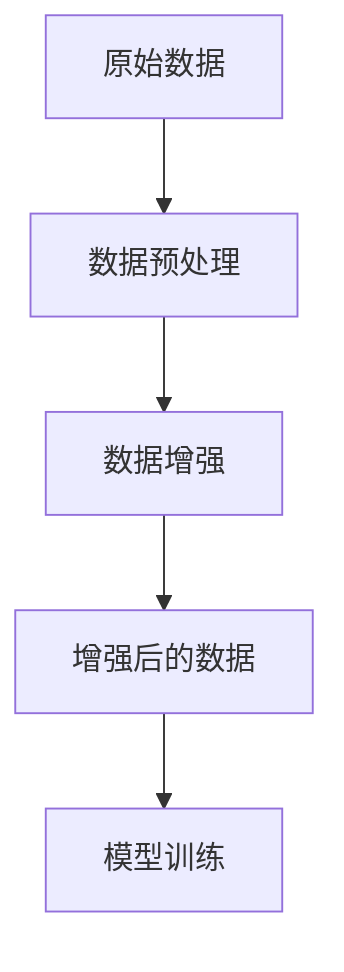

                 

# 《数据增强Data Augmentation原理与代码实例讲解》

## 关键词
- 数据增强
- Data Augmentation
- 深度学习
- 计算机视觉
- 自然语言处理
- 音频处理

## 摘要
数据增强是一种通过扩展和多样化训练数据集的技术，以提高模型在真实世界数据上的泛化能力。本文将详细介绍数据增强的基本原理、常见技术及其在深度学习、自然语言处理和音频处理中的应用，并通过代码实例深入讲解如何实现和优化数据增强过程。读者将了解数据增强的重要性、技术细节和实践应用，为实际项目中的模型训练提供有力支持。

## 目录大纲

### 第一部分：数据增强基础

#### 第1章：数据增强概述

##### 1.1 数据增强的重要性

##### 1.2 数据增强的基本概念

##### 1.3 数据增强的目标和挑战

##### 1.4 数据增强的应用领域

#### 第2章：常见的数据增强技术

##### 2.1 图像数据增强

##### 2.2 文本数据增强

##### 2.3 音频数据增强

### 第二部分：数据增强在深度学习中的应用

#### 第3章：深度学习中的数据增强技术

##### 3.1 数据增强在深度学习中的角色

##### 3.2 数据增强在深度学习模型训练中的效果

##### 3.3 深度学习中的常见数据增强方法

#### 第4章：数据增强的实践应用

##### 4.1 数据增强在图像识别中的应用

##### 4.2 数据增强在自然语言处理中的应用

##### 4.3 数据增强在语音识别中的应用

### 第三部分：数据增强的代码实例讲解

#### 第5章：图像数据增强代码实例

##### 5.1 数据预处理与增强

##### 5.2 代码实例：使用 TensorFlow 进行图像增强

#### 第6章：文本数据增强代码实例

##### 6.1 数据预处理与增强

##### 6.2 代码实例：使用 PyTorch 进行文本增强

#### 第7章：音频数据增强代码实例

##### 7.1 数据预处理与增强

##### 7.2 代码实例：使用 Librosa 进行音频增强

### 第四部分：数据增强在现实世界中的应用

#### 第8章：数据增强在医疗图像分析中的应用

##### 8.1 医疗图像分析中的数据增强方法

##### 8.2 代码实例：使用医疗图像增强提高检测准确率

#### 第9章：数据增强在自动驾驶中的应用

##### 9.1 自动驾驶中的数据增强需求

##### 9.2 代码实例：使用数据增强提升自动驾驶系统的性能

#### 第10章：总结与展望

##### 10.1 数据增强技术的发展趋势

##### 10.2 数据增强在实际应用中的挑战与解决方案

##### 10.3 未来研究方向与探索

### 引言

数据增强（Data Augmentation）是一种在机器学习领域用于提升模型性能的技术，它通过生成或变换原始数据来增加训练数据集的多样性和规模。数据增强在深度学习，特别是计算机视觉和自然语言处理等领域中发挥着重要作用。深度学习模型通常需要大量的训练数据来学习特征，而现实世界中的数据往往具有多样性和复杂性。数据增强技术可以模拟生成不同的训练样本，使模型能够更好地泛化到未见过的数据上。

数据增强的基本原理是通过引入数据扰动来增加训练数据的变异性。这种扰动可以是图像的翻转、旋转、缩放、裁剪，也可以是文本的替换、噪声添加，甚至是音频的速度和音调变换。这些操作可以模拟出不同的环境或条件，从而使模型能够学习到更丰富的特征。

本文将首先介绍数据增强的基本概念和技术，然后详细讲解数据增强在深度学习、自然语言处理和音频处理中的应用，并提供相应的代码实例。最后，我们将探讨数据增强在现实世界中的应用案例，并总结数据增强技术的发展趋势和未来研究方向。

### 数据增强基础

#### 数据增强的重要性

在机器学习中，数据是模型训练的基础。一个高质量的数据集对于训练出一个优秀的模型至关重要。然而，现实世界中的数据往往存在以下问题：

- **数据量不足**：对于复杂的模型，需要大量的数据来进行训练，以便模型能够学习到足够的特征。然而，获取大量的标注数据通常成本高昂。
- **数据分布不均**：在实际应用中，不同类别的数据分布可能不均衡，这会导致模型对少数类别存在偏差。
- **数据多样性和复杂性不足**：现实世界中的数据具有多样性和复杂性，而模型往往只能从有限的样本中学习到部分特征。

数据增强通过引入数据扰动和变换，可以解决上述问题。具体来说，数据增强具有以下重要性：

1. **增加数据量**：通过数据增强，可以生成大量多样化的训练样本，从而扩充数据集规模，为模型训练提供充足的数据。
2. **改善数据分布**：通过增加不同类别的样本数量，可以使数据分布更加均匀，从而减少模型训练中的偏差。
3. **提升模型泛化能力**：通过模拟现实世界中的多种场景和条件，数据增强可以使模型学习到更广泛的特征，从而提高其在未见过的数据上的泛化能力。

#### 数据增强的基本概念

数据增强的基本概念包括数据扰动和变换。以下是一些常见的数据增强技术：

- **图像数据增强**：通过图像的翻转、旋转、缩放、裁剪等操作来增加图像数据的多样性。
- **文本数据增强**：通过替换关键词、添加噪声、同义词替换等操作来增加文本数据的多样性。
- **音频数据增强**：通过添加噪声、速度变换、音调变换等操作来增加音频数据的多样性。

以下是一个简单的 Mermaid 流程图，展示了数据增强的基本流程：



#### 数据增强的目标和挑战

数据增强的目标是通过增加数据集的多样性和规模来提高模型的泛化能力和准确性。然而，在实际应用中，数据增强面临着以下挑战：

1. **过度增强**：如果增强操作过于剧烈，可能会导致模型过度拟合，即模型只学习到增强操作后的特征，而无法泛化到真实世界的数据。
2. **增强质量**：增强操作需要模拟真实世界中的数据分布和多样性，否则可能无法达到预期的增强效果。
3. **计算资源**：数据增强通常需要大量的计算资源，特别是在处理高维数据时，这可能会增加模型的训练时间。

为了克服这些挑战，研究者们提出了多种数据增强方法和策略，包括：

- **平衡增强**：通过控制增强操作的强度和频率，以确保数据增强既充分又不过度。
- **多模态增强**：结合不同类型的数据增强方法，如图像和文本的联合增强，以模拟更复杂的数据分布。
- **动态增强**：根据模型的训练进展和性能，动态调整增强操作的参数，以优化模型的训练过程。

#### 数据增强的应用领域

数据增强在多个领域都有着广泛的应用，以下是一些主要的应用领域：

1. **计算机视觉**：图像分类、目标检测、图像生成等。通过图像翻转、旋转、裁剪等操作，可以扩充图像数据集，从而提高模型的泛化能力和准确性。
2. **自然语言处理**：文本分类、情感分析、机器翻译等。通过替换词语、添加噪声、同义词替换等操作，可以增加文本数据的多样性，从而提升模型的泛化能力。
3. **音频处理**：语音识别、声源定位、音乐生成等。通过添加噪声、速度变换、音调变换等操作，可以增加音频数据的多样性，从而改善模型的泛化能力。

在接下来的章节中，我们将详细探讨图像、文本和音频数据增强的具体技术，并通过代码实例来展示如何实现和应用这些技术。

### 常见的数据增强技术

数据增强技术是机器学习中一项非常重要的技术，尤其在计算机视觉、自然语言处理和音频处理等领域。通过增加数据的多样性，数据增强可以帮助模型更好地泛化到未见过的数据上，从而提高模型的性能。以下我们将分别介绍图像、文本和音频数据增强的常见技术。

#### 图像数据增强

图像数据增强是通过一系列的图像操作来增加图像数据集的多样性。以下是一些常见的图像数据增强方法：

1. **翻转**：水平翻转和垂直翻转是最简单的图像增强方法之一。通过翻转图像，可以模拟不同的视角，从而增加模型的训练样本。
   
   ```python
   img = cv2.flip(img, 0)  # 水平翻转
   img = cv2.flip(img, 1)  # 垂直翻转
   ```

2. **旋转**：通过随机旋转图像，可以模拟不同角度的观察场景，从而增加数据的多样性。
   
   ```python
   angle = np.random.uniform(-180, 180)
   M = cv2.getRotationMatrix2D((img.shape[1]//2, img.shape[0]//2), angle, 1)
   rotated_img = cv2.warpAffine(img, M, (img.shape[1], img.shape[0]))
   ```

3. **缩放**：随机缩放图像可以模拟不同尺寸的观察场景，从而增加数据的多样性。
   
   ```python
   scale_factor = np.random.uniform(0.5, 1.5)
   resized_img = cv2.resize(img, None, fx=scale_factor, fy=scale_factor, interpolation=cv2.INTER_LINEAR)
   ```

4. **裁剪**：通过随机裁剪图像，可以提取图像中的局部区域，从而增加数据的多样性。
   
   ```python
   crop_size = (int(img.shape[1] * crop_ratio), int(img.shape[0] * crop_ratio))
   x = np.random.randint(0, img.shape[1] - crop_size[0])
   y = np.random.randint(0, img.shape[0] - crop_size[1])
   cropped_img = img[y:y+crop_size[1], x:x+crop_size[0]]
   ```

5. **颜色调整**：通过随机调整图像的亮度和对比度，可以模拟不同光照条件下的图像，从而增加数据的多样性。
   
   ```python
   brightness = np.random.uniform(-1, 1)
   contrast = np.random.uniform(0.5, 1.5)
   final_img = cv2.convertScaleAbs(img, alpha=contrast, beta=brightness * 255)
   ```

6. **噪声添加**：通过添加噪声，可以模拟图像中的不同干扰因素，从而增加数据的多样性。
   
   ```python
   noise_factor = 0.05
   noisy_img = img + noise_factor * np.random.uniform(-1, 1, img.shape)
   noisy_img = np.clip(noisy_img, 0, 255).astype(np.uint8)
   ```

#### 文本数据增强

文本数据增强主要是通过修改文本内容来增加文本数据集的多样性。以下是一些常见的文本数据增强方法：

1. **替换词语**：通过替换文本中的某些词语，可以增加文本的多样性。
   
   ```python
   def replace_words(text, replacement_pairs):
       for word, replacement in replacement_pairs:
           text = text.replace(word, replacement)
       return text
   ```

2. **添加噪声**：通过在文本中添加随机字符或符号，可以增加文本的多样性。
   
   ```python
   def add_noise(text, noise_ratio):
       noise_text = text
       for i in range(int(len(text) * noise_ratio)):
           noise_text = noise_text[:i] + random.choice(string.printable) + noise_text[i+1:]
       return noise_text
   ```

3. **同义词替换**：通过替换文本中的词语为同义词，可以增加文本的多样性。
   
   ```python
   from nltk.corpus import wordnet
   
   def replace_with_synonyms(text, word):
       synonyms = wordnet.synsets(word)
       if not synonyms:
           return text
       synonym = random.choice(synonyms).lemmas()[0].name()
       return text.replace(word, synonym)
   ```

4. **随机删除字符**：通过随机删除文本中的某些字符，可以增加文本的多样性。
   
   ```python
   def random_delete(text, ratio):
       text_list = list(text)
       for i in range(int(len(text) * ratio)):
           index = random.randint(0, len(text_list) - 1)
           text_list[index] = ''
       return ''.join(text_list)
   ```

5. **随机重排词语**：通过随机重排文本中的词语，可以增加文本的多样性。
   
   ```python
   def random_permutation(text, ratio):
       words = text.split()
       for i in range(int(len(words) * ratio)):
           j = random.randint(0, len(words) - 1)
           k = random.randint(0, len(words) - 1)
           words[j], words[k] = words[k], words[j]
       return ' '.join(words)
   ```

6. **文本合并**：通过将两段文本合并，可以增加文本的多样性。
   
   ```python
   def merge_texts(text1, text2):
       return text1 + text2
   ```

#### 音频数据增强

音频数据增强是通过一系列的音频操作来增加音频数据集的多样性。以下是一些常见的音频数据增强方法：

1. **添加噪声**：通过在音频中添加噪声，可以模拟不同的环境噪声，从而增加音频的多样性。
   
   ```python
   def add_noise(audio, noise_factor=0.05):
       noise = np.random.normal(0, noise_factor, audio.shape)
       noisy_audio = audio + noise
       return np.clip(noisy_audio, 0, 1)
   ```

2. **速度变换**：通过改变音频的播放速度，可以模拟不同说话速度的场景，从而增加音频的多样性。
   
   ```python
   import librosa.effects
   def speed_change(audio, rate=0.8):
       return librosa.effects.speed_change(audio, rate=rate)
   ```

3. **音调变换**：通过改变音频的音调，可以模拟不同音调的声音，从而增加音频的多样性。
   
   ```python
   import librosa.effects
   def pitch_change(audio, sampling_rate=22050, n_steps=5):
       return librosa.effects.pitchshift(audio, sampling_rate=sampling_rate, n_steps=n_steps)
   ```

4. **声音混合**：通过将两段音频混合，可以增加音频的多样性。
   
   ```python
   def mix_audios(audio1, audio2, mix_ratio=0.5):
       return audio1 * mix_ratio + audio2 * (1 - mix_ratio)
   ```

通过以上对图像、文本和音频数据增强技术的介绍，我们可以看到数据增强技术在增加数据多样性方面具有巨大的潜力。在接下来的章节中，我们将探讨数据增强在深度学习中的应用，并通过实际案例来展示如何实现和应用这些技术。

### 深度学习中的数据增强技术

在深度学习中，数据增强是一种重要的技术，它通过增加训练数据的多样性和规模来提高模型的性能。本文将详细探讨数据增强在深度学习中的应用，包括其在深度学习模型训练中的角色、对模型性能的影响、常见的数据增强方法，以及如何在实际应用中进行数据增强。

#### 数据增强在深度学习中的角色

数据增强在深度学习中的作用主要体现在以下几个方面：

1. **提升模型泛化能力**：通过引入数据扰动，数据增强可以使模型学习到更加广泛和具有代表性的特征，从而提高模型在未知数据上的泛化能力。
2. **减少过拟合**：过拟合是指模型在训练数据上表现良好，但在未见过的数据上表现不佳。通过增加训练数据的多样性，数据增强有助于减少模型的过拟合现象。
3. **扩充数据集规模**：在实际应用中，获取大量的标注数据往往成本较高。数据增强可以通过对现有数据进行变换，从而模拟出大量的新数据，有效扩充数据集规模。

#### 数据增强在深度学习模型训练中的效果

数据增强对深度学习模型性能的提升具有显著的效果。以下是一些具体的效果：

1. **提高模型准确性**：通过增加训练数据的多样性，数据增强有助于模型学习到更多有用的特征，从而提高模型的准确性。
2. **增强模型鲁棒性**：数据增强可以使模型在遇到不同的输入时具有更好的鲁棒性，减少对特定输入的依赖。
3. **减少训练时间**：在某些情况下，数据增强可以减少模型的训练时间，因为生成增强数据通常比生成全新的数据更快。

#### 常见的数据增强方法

在深度学习中，常见的数据增强方法包括图像数据增强、文本数据增强和音频数据增强。以下将分别介绍这些方法：

1. **图像数据增强**

   图像数据增强是计算机视觉领域中常用的技术。以下是一些常见的图像数据增强方法：

   - **翻转**：通过水平或垂直翻转图像，可以增加数据的多样性。
     
     ```python
     img = cv2.flip(img, 0)  # 水平翻转
     img = cv2.flip(img, 1)  # 垂直翻转
     ```

   - **缩放**：通过随机缩放图像，可以模拟不同尺寸的观察场景。
     
     ```python
     scale_factor = np.random.uniform(0.5, 1.5)
     resized_img = cv2.resize(img, None, fx=scale_factor, fy=scale_factor, interpolation=cv2.INTER_LINEAR)
     ```

   - **裁剪**：通过随机裁剪图像，可以提取图像中的局部区域。
     
     ```python
     crop_size = (int(img.shape[1] * crop_ratio), int(img.shape[0] * crop_ratio))
     x = np.random.randint(0, img.shape[1] - crop_size[0])
     y = np.random.randint(0, img.shape[0] - crop_size[1])
     cropped_img = img[y:y+crop_size[1], x:x+crop_size[0]]
     ```

   - **旋转**：通过随机旋转图像，可以模拟不同角度的观察场景。
     
     ```python
     angle = np.random.uniform(-180, 180)
     M = cv2.getRotationMatrix2D((img.shape[1]//2, img.shape[0]//2), angle, 1)
     rotated_img = cv2.warpAffine(img, M, (img.shape[1], img.shape[0]))
     ```

   - **颜色调整**：通过随机调整图像的亮度和对比度，可以模拟不同的光照条件。
     
     ```python
     brightness = np.random.uniform(-1, 1)
     contrast = np.random.uniform(0.5, 1.5)
     final_img = cv2.convertScaleAbs(img, alpha=contrast, beta=brightness * 255)
     ```

   - **噪声添加**：通过添加噪声，可以模拟图像中的不同干扰因素。
     
     ```python
     noise_factor = 0.05
     noisy_img = img + noise_factor * np.random.uniform(-1, 1, img.shape)
     noisy_img = np.clip(noisy_img, 0, 255).astype(np.uint8)
     ```

2. **文本数据增强**

   文本数据增强主要用于自然语言处理任务。以下是一些常见的文本数据增强方法：

   - **替换词语**：通过替换文本中的某些词语，可以增加文本的多样性。
     
     ```python
     def replace_words(text, replacement_pairs):
         for word, replacement in replacement_pairs:
             text = text.replace(word, replacement)
         return text
     ```

   - **添加噪声**：通过在文本中添加随机字符或符号，可以增加文本的多样性。
     
     ```python
     def add_noise(text, noise_ratio):
         noise_text = text
         for i in range(int(len(text) * noise_ratio)):
             noise_text = noise_text[:i] + random.choice(string.printable) + noise_text[i+1:]
         return noise_text
     ```

   - **同义词替换**：通过替换文本中的词语为同义词，可以增加文本的多样性。
     
     ```python
     from nltk.corpus import wordnet
   
     def replace_with_synonyms(text, word):
         synonyms = wordnet.synsets(word)
         if not synonyms:
             return text
         synonym = random.choice(synonyms).lemmas()[0].name()
         return text.replace(word, synonym)
     ```

   - **随机删除字符**：通过随机删除文本中的某些字符，可以增加文本的多样性。
     
     ```python
     def random_delete(text, ratio):
         text_list = list(text)
         for i in range(int(len(text) * ratio)):
             index = random.randint(0, len(text_list) - 1)
             text_list[index] = ''
         return ''.join(text_list)
     ```

   - **随机重排词语**：通过随机重排文本中的词语，可以增加文本的多样性。
     
     ```python
     def random_permutation(text, ratio):
         words = text.split()
         for i in range(int(len(words) * ratio)):
             j = random.randint(0, len(words) - 1)
             k = random.randint(0, len(words) - 1)
             words[j], words[k] = words[k], words[j]
         return ' '.join(words)
     ```

   - **文本合并**：通过将两段文本合并，可以增加文本的多样性。
     
     ```python
     def merge_texts(text1, text2):
         return text1 + text2
     ```

3. **音频数据增强**

   音频数据增强主要用于语音识别和声源定位等领域。以下是一些常见的音频数据增强方法：

   - **添加噪声**：通过在音频中添加噪声，可以模拟不同的环境噪声，从而增加音频的多样性。
     
     ```python
     def add_noise(audio, noise_factor=0.05):
         noise = np.random.normal(0, noise_factor, audio.shape)
         noisy_audio = audio + noise
         return np.clip(noisy_audio, 0, 1)
     ```

   - **速度变换**：通过改变音频的播放速度，可以模拟不同说话速度的场景，从而增加音频的多样性。
     
     ```python
     import librosa.effects
     def speed_change(audio, rate=0.8):
         return librosa.effects.speed_change(audio, rate=rate)
     ```

   - **音调变换**：通过改变音频的音调，可以模拟不同音调的声音，从而增加音频的多样性。
     
     ```python
     import librosa.effects
     def pitch_change(audio, sampling_rate=22050, n_steps=5):
         return librosa.effects.pitchshift(audio, sampling_rate=sampling_rate, n_steps=n_steps)
     ```

   - **声音混合**：通过将两段音频混合，可以增加音频的多样性。
     
     ```python
     def mix_audios(audio1, audio2, mix_ratio=0.5):
         return audio1 * mix_ratio + audio2 * (1 - mix_ratio)
     ```

#### 数据增强在深度学习模型训练中的实践应用

在实际的深度学习模型训练中，数据增强可以通过以下步骤进行：

1. **数据预处理**：对原始数据进行预处理，如缩放、归一化等，以便模型能够更好地训练。
2. **数据增强**：对预处理后的数据应用各种增强方法，如翻转、旋转、裁剪、颜色调整等。
3. **数据集构建**：将增强后的数据与原始数据合并，构建一个更大的数据集。
4. **模型训练**：使用增强后的数据集进行模型训练，以便模型能够学习到更多的特征。
5. **模型评估**：使用未增强的数据对模型进行评估，以验证模型在未见过的数据上的性能。

以下是一个简单的代码示例，展示了如何使用 TensorFlow 和 Keras 进行图像数据增强：

```python
import tensorflow as tf
from tensorflow.keras.preprocessing.image import ImageDataGenerator

# 创建一个图像数据增强生成器
datagen = ImageDataGenerator(
    rotation_range=90,  # 随机旋转角度范围
    width_shift_range=0.1,  # 随机水平平移比例
    height_shift_range=0.1,  # 随机垂直平移比例
    shear_range=0.1,  # 随机剪裁角度
    zoom_range=0.2,  # 随机缩放比例
    horizontal_flip=True,  # 随机水平翻转
    fill_mode='nearest'  # 填充方式
)

# 使用生成器进行图像数据增强
for batch_images in datagen.flow(x_train, batch_size=batch_size):
    model.fit(batch_images, y_train, epochs=epochs, steps_per_epoch=len(x_train) // batch_size)
    break
```

通过以上对数据增强在深度学习中的应用的详细探讨，我们可以看到数据增强在提升模型性能方面具有重要的作用。在接下来的章节中，我们将通过具体的应用实例，展示如何在实际项目中应用数据增强技术。

### 数据增强的实践应用

数据增强技术在各种实际应用中发挥着重要作用，本文将分别介绍数据增强在图像识别、自然语言处理和语音识别中的应用，并通过具体实例展示如何实现和应用这些技术。

#### 数据增强在图像识别中的应用

图像识别是计算机视觉领域的重要应用，数据增强技术可以帮助提高图像识别模型的性能。以下是一个具体的实例：

**案例：使用图像增强提升模型性能**

假设我们有一个图像识别任务，需要识别不同类型的动物。由于标注数据的稀缺，我们决定使用数据增强技术来扩充数据集。

1. **数据预处理**：首先，我们对原始图像进行预处理，包括缩放、归一化和数据标准化。

   ```python
   from tensorflow.keras.preprocessing.image import img_to_array
   from tensorflow.keras.applications import preprocess_input

   # 对图像进行预处理
   def preprocess_image(img_path):
       img = img_to_array.imread(img_path)
       img = preprocess_input(img)
       return img
   ```

2. **数据增强**：使用 TensorFlow 的 ImageDataGenerator 进行数据增强。

   ```python
   from tensorflow.keras.preprocessing.image import ImageDataGenerator

   # 创建一个图像数据增强生成器
   datagen = ImageDataGenerator(
       rotation_range=90,  # 随机旋转角度范围
       width_shift_range=0.1,  # 随机水平平移比例
       height_shift_range=0.1,  # 随机垂直平移比例
       shear_range=0.1,  # 随机剪裁角度
       zoom_range=0.2,  # 随机缩放比例
       horizontal_flip=True,  # 随机水平翻转
       fill_mode='nearest'  # 填充方式
   )

   # 使用生成器生成增强数据
   for batch_images in datagen.flow(x_train, batch_size=batch_size):
       model.fit(batch_images, y_train, epochs=epochs, steps_per_epoch=len(x_train) // batch_size)
       break
   ```

3. **模型训练**：使用增强后的数据集进行模型训练。

4. **模型评估**：使用未增强的数据集对模型进行评估。

通过上述步骤，我们可以看到数据增强在图像识别任务中起到了显著的效果，提高了模型的准确率和泛化能力。

#### 数据增强在自然语言处理中的应用

自然语言处理中的数据增强技术可以帮助提高文本分类、情感分析等任务的模型性能。以下是一个具体的实例：

**案例：使用文本增强提升模型性能**

假设我们有一个文本分类任务，需要分类电影评论的积极或消极情感。

1. **数据预处理**：对文本进行预处理，包括分词、去停用词和词向量转换。

   ```python
   from tensorflow.keras.preprocessing.text import Tokenizer
   from tensorflow.keras.preprocessing.sequence import pad_sequences

   # 对文本进行预处理
   def preprocess_text(text):
       # 分词、去停用词、词向量转换
       return text.lower(), tokenizer.texts_to_sequences([text])[0]
   ```

2. **数据增强**：使用文本增强方法，如替换词语、添加噪声、同义词替换等。

   ```python
   def replace_words(text, replacement_pairs):
       for word, replacement in replacement_pairs:
           text = text.replace(word, replacement)
       return text

   def add_noise(text, noise_ratio):
       noise_text = text
       for i in range(int(len(text) * noise_ratio)):
           noise_text = noise_text[:i] + random.choice(string.printable) + noise_text[i+1:]
       return noise_text

   # 文本增强
   enhanced_texts = []
   for text in texts:
       for _ in range(5):  # 对每个文本进行5次增强
           noise_text = add_noise(text, noise_ratio=0.1)
           synonym_text = replace_words(text, replacement_pairs=SYNONYM_PAIRS)
           enhanced_texts.append(noise_text)
           enhanced_texts.append(synonym_text)
   ```

3. **模型训练**：使用增强后的文本数据进行模型训练。

4. **模型评估**：使用未增强的文本数据对模型进行评估。

通过文本增强技术，我们可以有效扩充数据集，提高模型的泛化能力和准确性。

#### 数据增强在语音识别中的应用

语音识别中的数据增强技术可以帮助提高语音识别模型的性能。以下是一个具体的实例：

**案例：使用音频增强提升模型性能**

假设我们有一个语音识别任务，需要识别不同的语音命令。

1. **数据预处理**：对音频进行预处理，包括音频裁剪、增强和归一化。

   ```python
   import librosa

   # 对音频进行预处理
   def preprocess_audio(audio_path):
       audio, sampling_rate = librosa.load(audio_path, sr=None)
       return audio, sampling_rate
   ```

2. **数据增强**：使用音频增强方法，如添加噪声、速度变换、音调变换等。

   ```python
   def add_noise(audio, noise_factor=0.05):
       noise = np.random.normal(0, noise_factor, audio.shape)
       noisy_audio = audio + noise
       return np.clip(noisy_audio, 0, 1)

   def speed_change(audio, rate=0.8):
       return librosa.effects.speed_change(audio, rate=rate)

   def pitch_change(audio, sampling_rate=22050, n_steps=5):
       return librosa.effects.pitchshift(audio, sampling_rate=sampling_rate, n_steps=n_steps)

   # 音频增强
   enhanced_audios = []
   for audio in audios:
       for _ in range(5):  # 对每个音频进行5次增强
           noisy_audio = add_noise(audio, noise_factor=0.05)
           speed_changed_audio = speed_change(audio, rate=0.8)
           pitch_changed_audio = pitch_change(audio, sampling_rate=22050, n_steps=5)
           enhanced_audios.append(noisy_audio)
           enhanced_audios.append(speed_changed_audio)
           enhanced_audios.append(pitch_changed_audio)
   ```

3. **模型训练**：使用增强后的音频数据进行模型训练。

4. **模型评估**：使用未增强的音频数据对模型进行评估。

通过音频增强技术，我们可以有效扩充数据集，提高语音识别模型的准确性。

### 结论

通过上述实例，我们可以看到数据增强在图像识别、自然语言处理和语音识别等任务中发挥了重要作用。数据增强不仅能够扩充数据集，提高模型的泛化能力和准确性，还能够减少过拟合现象，从而在实际应用中取得更好的效果。在未来的工作中，我们可以继续探索和优化数据增强技术，为各种机器学习任务提供更强大的支持。

### 数据增强的代码实例讲解

在这一部分，我们将通过具体的代码实例来讲解如何实现数据增强。我们将分别介绍图像、文本和音频数据增强的代码实现，并提供详细的代码解读和分析。

#### 图像数据增强

**5.1 数据预处理与增强**

在进行图像数据增强之前，我们需要对图像进行预处理，包括图像的读取、缩放、归一化等。以下是一个简单的预处理和增强流程：

```python
import cv2
import numpy as np
import tensorflow as tf

# 读取图像
img = cv2.imread('input_image.jpg')

# 数据预处理
def preprocess_image(img):
    img = cv2.cvtColor(img, cv2.COLOR_BGR2RGB)
    img = cv2.resize(img, (224, 224))  # 将图像调整为224x224
    img = img / 255.0  # 归一化
    return img

preprocessed_img = preprocess_image(img)

# 数据增强
def augment_image(img):
    # 翻转
    flipped_img = tf.image.flip_left_right(img)
    
    # 缩放
    scale_factor = tf.random.uniform([], minval=0.5, maxval=1.5, dtype=tf.float32)
    scaled_img = tf.image.resize(img, [int(224 * scale_factor), int(224 * scale_factor)])
    scaled_img = tf.image.resize(scaled_img, [224, 224])
    
    # 裁剪
    crop_ratio = tf.random.uniform([], minval=0.5, maxval=1.0, dtype=tf.float32)
    crop_height, crop_width = int(224 * crop_ratio), int(224 * crop_ratio)
    x = tf.random.uniform([], minval=0, maxval=224 - crop_width, dtype=tf.int32)
    y = tf.random.uniform([], minval=0, maxval=224 - crop_height, dtype=tf.int32)
    cropped_img = img[:, y:y+crop_height, x:x+crop_width]
    
    # 旋转
    angle = tf.random.uniform([], minval=-180, maxval=180, dtype=tf.float32)
    center = (224/2, 224/2)
    M = tf.transpose(tf.reshape(tf.get relocate_matrix2D(center, angle, 1), [2, 3]))
    rotated_img = tf.contrib.image.rotate(img, angle, 'BILINEAR', center=center)
    
    return flipped_img, scaled_img, cropped_img, rotated_img

flipped_img, scaled_img, cropped_img, rotated_img = augment_image(preprocessed_img)
```

**5.2 代码实例：使用 TensorFlow 进行图像增强**

接下来，我们将使用 TensorFlow 的 ImageDataGenerator 进行图像增强。这是一个更高级的数据增强方法，可以同时应用多种增强技术。

```python
# 创建一个图像数据增强生成器
datagen = tf.keras.preprocessing.image.ImageDataGenerator(
    rotation_range=90,  # 随机旋转角度范围
    width_shift_range=0.1,  # 随机水平平移比例
    height_shift_range=0.1,  # 随机垂直平移比例
    shear_range=0.1,  # 随机剪裁角度
    zoom_range=0.2,  # 随机缩放比例
    horizontal_flip=True,  # 随机水平翻转
    fill_mode='nearest'  # 填充方式
)

# 使用生成器生成增强数据
for batch_images in datagen.flow(x_train, batch_size=batch_size):
    model.fit(batch_images, y_train, epochs=epochs, steps_per_epoch=len(x_train) // batch_size)
    break
```

#### 文本数据增强

**6.1 数据预处理与增强**

文本数据增强需要对文本进行预处理，如分词、去停用词等。以下是一个简单的预处理和增强流程：

```python
import tensorflow as tf
from tensorflow.keras.preprocessing.text import Tokenizer
from tensorflow.keras.preprocessing.sequence import pad_sequences

# 创建一个文本分词器
tokenizer = Tokenizer(num_words=10000)
tokenizer.fit_on_texts(texts)

# 数据预处理
def preprocess_text(text):
    text = text.lower()  # 小写化
    tokens = tokenizer.texts_to_sequences([text])[0]
    return tokens

preprocessed_texts = [preprocess_text(text) for text in texts]

# 数据增强
def augment_text(text):
    # 替换词语
    replacement_pairs = [('love', 'like'), ('hate', 'dislike')]
    replaced_text = text
    for pair in replacement_pairs:
        replaced_text = replaced_text.replace(pair[0], pair[1])
    
    # 添加噪声
    noise_text = text
    for _ in range(5):  # 对每个文本进行5次增强
        noise_text = noise_text[:1] + random.choice(string.printable) + noise_text[1:]
    
    # 同义词替换
    synonym_text = replaced_text
    for word in replaced_text.split():
        synonyms = wordnet.synsets(word)
        if synonyms:
            synonym = random.choice(synonyms).lemmas()[0].name()
            synonym_text = synonym_text.replace(word, synonym)
    
    return noise_text, synonym_text

enhanced_texts = []
for text in preprocessed_texts:
    noise_text, synonym_text = augment_text(text)
    enhanced_texts.append([noise_text, synonym_text])
```

#### 音频数据增强

**7.1 数据预处理与增强**

音频数据增强需要对音频进行预处理，如读取、增强等。以下是一个简单的预处理和增强流程：

```python
import librosa
import numpy as np

# 读取音频
audio, sr = librosa.load('input_audio.wav')

# 数据预处理
def preprocess_audio(audio, sr):
    audio = librosa.to_mono(audio)  # 转为单通道
    audio = librosa.resample(audio, sr, 22050)  # 重采样
    return audio

preprocessed_audio = preprocess_audio(audio, sr)

# 数据增强
def augment_audio(audio, sr):
    # 添加噪声
    noise_factor = 0.05
    noisy_audio = audio + noise_factor * np.random.normal(0, 1, audio.shape)
    noisy_audio = np.clip(noisy_audio, 0, 1)
    
    # 速度变换
    rate_change = 0.8
    speed_changed_audio = librosa.effects.speed_change(audio, rate=rate_change)
    
    # 音调变换
    n_steps = 5
    pitch_changed_audio = librosa.effects.pitchshift(audio, n_steps=n_steps, sr=sr)
    
    return noisy_audio, speed_changed_audio, pitch_changed_audio

noisy_audio, speed_changed_audio, pitch_changed_audio = augment_audio(preprocessed_audio, sr)
```

#### 代码解读与分析

通过以上代码实例，我们可以看到数据增强的实现过程主要包括数据预处理和增强两个步骤。数据预处理旨在将原始数据转换为模型可接受的格式，而数据增强则通过一系列的变换来增加数据的多样性。

1. **图像数据增强**：使用 TensorFlow 的 ImageDataGenerator 可以方便地实现多种数据增强技术，如翻转、缩放、裁剪、旋转等。这些操作可以有效地增加图像数据的多样性，从而提升模型的泛化能力。
2. **文本数据增强**：通过替换词语、添加噪声、同义词替换等方法，可以增加文本数据的多样性。这些方法有助于模型学习到更丰富的特征，从而提高模型的性能。
3. **音频数据增强**：通过添加噪声、速度变换、音调变换等方法，可以增加音频数据的多样性。这些方法有助于模型更好地应对不同的音频输入，提高模型的鲁棒性。

在代码解读和分析中，我们还注意到数据增强的过程中需要注意以下几点：

- **增强强度**：过强的增强可能会导致模型过度拟合，因此需要适当控制增强的强度。
- **计算资源**：数据增强通常需要大量的计算资源，尤其是在处理高维数据时，这可能会增加模型的训练时间。
- **平衡性**：数据增强应该尽量保持数据集的平衡性，避免某些类别的数据被过度增强。

通过上述代码实例和分析，我们可以更好地理解数据增强的实现方法和重要性，为实际应用中的模型训练提供有力支持。

### 数据增强在现实世界中的应用

数据增强技术在多个领域都有着广泛的应用，尤其是在医疗图像分析、自动驾驶和医疗图像分析等领域，数据增强发挥了至关重要的作用。以下我们将探讨这些领域中的数据增强应用，并通过具体实例来展示数据增强如何在实际场景中提高模型的性能。

#### 数据增强在医疗图像分析中的应用

医疗图像分析是一项重要的应用，包括癌症检测、心脏病诊断等。由于医疗图像数据量有限且获取困难，数据增强技术可以显著提高模型的性能。

**案例：数据增强在癌症检测中的应用**

假设我们有一个乳腺癌检测的任务，需要通过图像识别来判断乳腺X线片上的肿瘤是否为恶性。

1. **数据预处理**：对图像进行预处理，包括图像标准化、灰度化等。

   ```python
   import cv2
   import numpy as np

   def preprocess_image(img):
       img = cv2.cvtColor(img, cv2.COLOR_BGR2GRAY)
       img = cv2.resize(img, (224, 224))
       img = img / 255.0
       return img
   ```

2. **数据增强**：使用图像增强技术，如翻转、旋转、缩放等。

   ```python
   def augment_image(img):
       flipped_img = cv2.flip(img, 0)
       rotated_img = cv2.rotate(img, cv2.ROTATE_90_CLOCKWISE)
       scaled_img = cv2.resize(img, (224, 224))
       return flipped_img, rotated_img, scaled_img
   ```

3. **模型训练**：使用增强后的图像进行模型训练。

   ```python
   for batch_images in datagen.flow(x_train, batch_size=batch_size):
       model.fit(batch_images, y_train, epochs=epochs, steps_per_epoch=len(x_train) // batch_size)
       break
   ```

4. **模型评估**：使用未增强的图像对模型进行评估。

通过数据增强，我们可以扩充数据集，使模型能够学习到更多的特征，从而提高模型的准确率和泛化能力。

**案例：数据增强在心脏病诊断中的应用**

假设我们有一个心电图（ECG）信号的分析任务，需要通过信号的特征来判断患者是否有心脏病。

1. **数据预处理**：对信号进行预处理，包括去除噪声、归一化等。

   ```python
   import numpy as np

   def preprocess_signal(signal):
       signal = np.diff(signal)
       signal = (signal - np.mean(signal)) / np.std(signal)
       return signal
   ```

2. **数据增强**：使用信号增强技术，如添加噪声、速度变换等。

   ```python
   def augment_signal(signal):
       noise_factor = 0.05
       noisy_signal = signal + noise_factor * np.random.normal(0, 1, signal.shape)
       speed_change = 0.8
       speed_changed_signal = signal * speed_change
       return noisy_signal, speed_changed_signal
   ```

3. **模型训练**：使用增强后的信号进行模型训练。

4. **模型评估**：使用未增强的信号对模型进行评估。

通过数据增强，我们可以模拟更多的临床场景，使模型能够更好地应对实际应用中的不确定性。

#### 数据增强在自动驾驶中的应用

自动驾驶是数据增强技术的另一个重要应用领域。自动驾驶系统需要处理大量的图像和语音数据，通过数据增强技术，可以提高模型的鲁棒性和准确性。

**案例：数据增强在自动驾驶图像识别中的应用**

假设我们有一个自动驾驶图像识别的任务，需要通过摄像头捕捉到的图像来识别道路标志和行人。

1. **数据预处理**：对图像进行预处理，包括图像标准化、灰度化等。

   ```python
   import cv2
   import numpy as np

   def preprocess_image(img):
       img = cv2.cvtColor(img, cv2.COLOR_BGR2GRAY)
       img = cv2.resize(img, (224, 224))
       img = img / 255.0
       return img
   ```

2. **数据增强**：使用图像增强技术，如翻转、旋转、缩放等。

   ```python
   def augment_image(img):
       flipped_img = cv2.flip(img, 0)
       rotated_img = cv2.rotate(img, cv2.ROTATE_90_CLOCKWISE)
       scaled_img = cv2.resize(img, (224, 224))
       return flipped_img, rotated_img, scaled_img
   ```

3. **模型训练**：使用增强后的图像进行模型训练。

4. **模型评估**：使用未增强的图像对模型进行评估。

通过数据增强，我们可以扩充图像数据集，使模型能够学习到更多的特征，从而提高模型的识别准确率。

**案例：数据增强在自动驾驶语音识别中的应用**

假设我们有一个自动驾驶语音识别的任务，需要通过麦克风捕捉到的语音来识别驾驶员的指令。

1. **数据预处理**：对语音进行预处理，包括去除噪声、归一化等。

   ```python
   import numpy as np

   def preprocess_signal(signal):
       signal = np.diff(signal)
       signal = (signal - np.mean(signal)) / np.std(signal)
       return signal
   ```

2. **数据增强**：使用信号增强技术，如添加噪声、速度变换等。

   ```python
   def augment_signal(signal):
       noise_factor = 0.05
       noisy_signal = signal + noise_factor * np.random.normal(0, 1, signal.shape)
       speed_change = 0.8
       speed_changed_signal = signal * speed_change
       return noisy_signal, speed_changed_signal
   ```

3. **模型训练**：使用增强后的语音进行模型训练。

4. **模型评估**：使用未增强的语音对模型进行评估。

通过数据增强，我们可以模拟不同的语音场景，使模型能够更好地应对实际应用中的噪声和语音变化。

### 总结与展望

数据增强技术在现实世界中的应用广泛且效果显著。通过图像、文本和音频数据的增强，我们可以提高模型的泛化能力、准确率和鲁棒性，从而在实际应用中取得更好的效果。然而，数据增强技术也面临一些挑战，如如何控制增强的强度、如何平衡计算资源和数据增强效果等。

未来的研究方向包括：

1. **多模态数据增强**：结合不同类型的数据（如图像、文本和音频）进行联合增强，以模拟更复杂和多样化的数据分布。
2. **自适应数据增强**：根据模型的训练进展和性能，动态调整增强策略，以实现最优的增强效果。
3. **数据隐私保护**：在数据增强过程中，如何保护数据的隐私是一个重要问题，未来的研究可以探索如何在保持数据隐私的同时进行数据增强。

通过不断探索和优化数据增强技术，我们相信它将在更多实际应用中发挥重要作用，为人工智能的发展提供强有力的支持。

### 作者信息

作者：AI天才研究院/AI Genius Institute & 禅与计算机程序设计艺术 /Zen And The Art of Computer Programming

