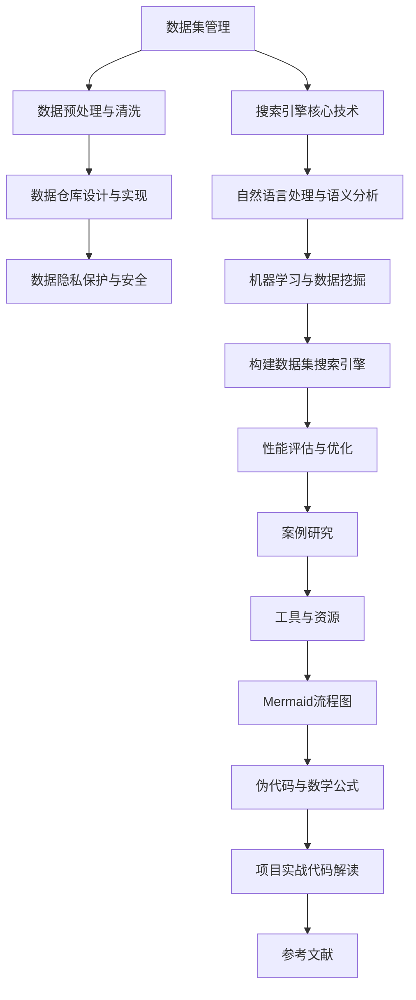

                 

### 《数据集搜索引擎:软件2.0的新型开发工具》

#### 核心关键词：
- 数据集搜索引擎
- 软件2.0
- 开发工具
- 信息检索
- 机器学习
- 自然语言处理
- 性能优化

#### 摘要：
本文深入探讨数据集搜索引擎这一软件2.0时代的创新开发工具。我们首先定义数据集搜索引擎的核心概念，探讨其在软件开发中的应用价值。接着，通过回顾其发展历史和核心特性，我们将分析数据集搜索引擎的技术基础，包括数据管理、搜索引擎核心算法、自然语言处理与语义分析以及机器学习与数据挖掘。本文还通过实际项目案例和性能优化策略，详细讲解如何构建和优化数据集搜索引擎。最后，我们展望了数据集搜索引擎的未来发展方向，并提供了后续研究的建议。

---

### 《数据集搜索引擎:软件2.0的新型开发工具》目录大纲

**第一部分：数据集搜索引擎概述**

1. **第1章：数据集搜索引擎概述**
   - 1.1 软件2.0时代的开发工具变革
   - 1.2 数据集搜索引擎的角色与重要性
   - 1.3 数据集搜索引擎的发展历史
   - 1.4 数据集搜索引擎的核心特性
   - 1.5 数据集搜索引擎的应用场景

**第二部分：数据集搜索引擎技术基础**

2. **第2章：数据集管理基础**
   - 2.1 数据集的分类与评估
   - 2.2 数据预处理与清洗
   - 2.3 数据仓库设计与实现
   - 2.4 数据隐私保护与安全

3. **第3章：搜索引擎核心技术**
   - 3.1 搜索引擎基本原理
   - 3.2 信息检索算法
   - 3.3 搜索引擎索引构建
   - 3.4 搜索引擎性能优化

4. **第4章：自然语言处理与语义分析**
   - 4.1 自然语言处理基础
   - 4.2 词嵌入技术
   - 4.3 语义相似度计算
   - 4.4 预处理与后处理技术

5. **第5章：机器学习与数据挖掘**
   - 5.1 机器学习基础
   - 5.2 数据挖掘算法
   - 5.3 深度学习在搜索引擎中的应用
   - 5.4 实时搜索与推荐系统

**第三部分：数据集搜索引擎项目实战**

6. **第6章：构建数据集搜索引擎**
   - 6.1 项目概述
   - 6.2 系统需求分析
   - 6.3 技术选型与架构设计
   - 6.4 数据采集与预处理
   - 6.5 搜索引擎开发与优化
   - 6.6 用户体验设计

7. **第7章：性能评估与优化**
   - 7.1 性能评估指标
   - 7.2 性能优化策略
   - 7.3 负载均衡与分布式搜索
   - 7.4 搜索引擎运维与监控

**第四部分：案例研究**

8. **第8章：案例研究**
   - 8.1 案例一：大型电商搜索引擎
   - 8.2 案例二：社交媒体搜索平台
   - 8.3 案例三：垂直行业数据搜索引擎
   - 8.4 案例四：学术文献搜索引擎

**附录**

- 附录A：工具与资源
- 附录B：Mermaid 流程图
- 附录C：伪代码与数学公式
- 附录D：项目实战代码解读
- 附录E：参考文献

---

### 第一部分：数据集搜索引擎概述

#### 第1章：数据集搜索引擎概述

**1.1 软件2.0时代的开发工具变革**

软件2.0时代标志着软件开发的重大变革，从传统的软件工程模式转向更加灵活和用户驱动的模式。在这一背景下，开发工具也经历了显著的进化。传统的开发工具如代码编辑器、集成开发环境（IDE）、编译器和调试工具等，主要侧重于编程语言的语法和编译执行。而随着互联网和大数据的兴起，新的开发工具如云计算平台、容器技术、微服务架构、持续集成/持续部署（CI/CD）等，逐渐成为软件开发的主流。

在这些新兴的开发工具中，数据集搜索引擎作为一种重要的工具，正逐步崛起。数据集搜索引擎旨在帮助开发者快速、高效地查找和分析大规模数据集。在软件2.0时代，数据集搜索引擎的重要性日益凸显，其主要原因包括：

1. **数据驱动的开发模式**：软件2.0时代强调以数据为中心的开发模式，通过数据分析和挖掘来指导软件设计和开发。数据集搜索引擎提供了便捷的数据访问和分析工具，使得开发者能够更好地利用数据，实现数据驱动的开发。

2. **大数据处理的必要性**：随着数据量的爆发式增长，传统的关系型数据库已经无法满足大规模数据处理的需要。数据集搜索引擎利用分布式存储和计算技术，能够高效地处理海量数据，提供实时、准确的搜索结果。

3. **智能化和自动化的需求**：软件2.0时代追求智能化和自动化，数据集搜索引擎通过自然语言处理、机器学习等技术，能够自动理解和处理复杂的查询请求，实现智能化搜索。

**1.2 数据集搜索引擎的角色与重要性**

数据集搜索引擎在软件开发中扮演着至关重要的角色，其重要性体现在以下几个方面：

1. **高效的数据检索**：数据集搜索引擎能够快速地从大规模数据集中检索出相关的数据，大大提高数据检索的效率。对于开发者来说，快速找到所需的数据是进行有效开发的前提。

2. **数据分析和挖掘**：数据集搜索引擎不仅仅是一个搜索工具，它还具备数据分析和挖掘的能力。通过内置的分析工具，开发者可以深入了解数据特征，发现潜在的价值。

3. **辅助决策**：在商业决策中，数据是关键因素。数据集搜索引擎能够提供实时、准确的数据查询和分析结果，为商业决策提供有力支持。

4. **协作和共享**：数据集搜索引擎促进了团队内部的协作和数据共享。团队成员可以轻松地共享数据集，提高工作效率。

**1.3 数据集搜索引擎的发展历史**

数据集搜索引擎的发展历程可以追溯到20世纪60年代。当时，数据库管理系统（DBMS）开始出现，提供了对结构化数据的查询和管理。随着互联网和Web的兴起，搜索引擎技术迅速发展，为用户提供互联网信息检索服务。然而，传统的搜索引擎主要用于文本数据的检索，面对大规模非结构化和半结构化数据时存在局限。

进入21世纪，随着大数据技术和云计算的兴起，数据集搜索引擎开始崭露头角。以下是一些关键发展节点：

1. **2004年**：Google推出MapReduce，为大规模数据处理提供了分布式计算框架，推动了大数据技术的普及。

2. **2006年**：Amazon S3和EC2的推出，使得分布式存储和计算资源成为大众可用的服务。

3. **2009年**：Apache Hadoop项目成立，成为大数据处理的事实标准。

4. **2010年**：Elasticsearch开源搜索引擎项目成立，为分布式搜索引擎提供了强大的支持。

5. **2013年**：Apache Spark项目成立，提供了高效的数据处理和分析工具。

6. **2015年**：Google推出TensorFlow，为深度学习和人工智能应用提供了强大的框架。

**1.4 数据集搜索引擎的核心特性**

数据集搜索引擎具备一系列核心特性，使其在软件2.0时代中成为不可或缺的工具。以下是数据集搜索引擎的几个关键特性：

1. **分布式架构**：数据集搜索引擎通常采用分布式架构，能够处理海量数据。通过分布式索引和查询，数据集搜索引擎能够在多个节点上并行处理查询请求。

2. **实时查询**：数据集搜索引擎支持实时查询，能够在秒级时间内返回搜索结果。这对于需要实时数据的场景，如金融交易、社交媒体等，具有重要意义。

3. **高扩展性**：数据集搜索引擎具备良好的扩展性，能够根据数据量的增长动态调整系统资源。通过横向扩展（增加节点）和纵向扩展（提升单个节点性能），数据集搜索引擎能够保持高性能。

4. **多语言支持**：数据集搜索引擎通常支持多种编程语言和API接口，便于与现有系统集成。开发者可以轻松地使用自己的开发语言和工具来操作数据集搜索引擎。

5. **自然语言处理能力**：数据集搜索引擎融合了自然语言处理（NLP）技术，能够理解和处理自然语言查询。通过词嵌入、语义分析等NLP技术，数据集搜索引擎能够提供更加智能的搜索结果。

6. **安全性**：数据集搜索引擎在数据隐私和安全方面提供了全面的支持，包括数据加密、访问控制、审计日志等安全机制。

**1.5 数据集搜索引擎的应用场景**

数据集搜索引擎在众多应用场景中展现出了强大的功能。以下是几个典型的应用场景：

1. **大数据分析**：在大型企业和研究机构中，数据集搜索引擎用于大数据分析，支持实时数据查询和报表生成，帮助企业和研究机构快速做出决策。

2. **数据共享平台**：数据集搜索引擎可以作为数据共享平台的核心组件，提供统一的数据检索服务，便于团队内部和跨团队合作。

3. **电商平台**：电商平台使用数据集搜索引擎进行商品信息检索和推荐，提升用户体验和销售转化率。

4. **社交媒体**：社交媒体平台利用数据集搜索引擎提供实时搜索功能，用户可以快速找到感兴趣的内容。

5. **科研机构**：科研机构使用数据集搜索引擎进行科研数据的检索和分析，支持科研项目的快速推进。

6. **智能城市**：智能城市建设中，数据集搜索引擎用于实时监控和分析城市数据，支持城市管理和公共服务优化。

总之，数据集搜索引擎在软件2.0时代中已成为一项重要的开发工具，其分布式架构、实时查询、高扩展性等特性，使其在各种应用场景中发挥了重要作用。

---

### 第二部分：数据集搜索引擎技术基础

#### 第2章：数据集管理基础

**2.1 数据集的分类与评估**

数据集是数据集搜索引擎的核心资源，其质量直接影响搜索效率和准确性。因此，了解数据集的分类与评估方法对于构建高效的数据集搜索引擎至关重要。

**2.1.1 数据集的分类**

根据数据集的来源和用途，数据集可以大致分为以下几类：

1. **公开数据集**：这类数据集通常由公共机构或学术组织提供，如UCI机器学习库、Kaggle等。公开数据集便于获取和使用，但可能存在数据不完整、不一致等问题。

2. **私有数据集**：私有数据集由企业或个人拥有，用于内部研究和商业应用。这类数据集通常涉及敏感信息，访问权限受限。

3. **合成数据集**：合成数据集是通过模拟生成的方法获得的，如GAN（生成对抗网络）可以生成图像、文本等数据。合成数据集有助于测试模型的泛化能力。

4. **实时数据集**：实时数据集是从动态变化的数据源中获取的，如金融市场数据、社交媒体数据等。实时数据集要求搜索引擎具备快速响应能力。

**2.1.2 数据集的评估**

数据集的评估是确保数据质量的重要环节，以下是一些常用的评估指标：

1. **数据完整性**：数据完整性指数据集中缺失值的比例。高完整性的数据集能够提供更全面的信息。

2. **数据一致性**：数据一致性指数据集内部数据的一致性，如同一字段在不同记录中的值应该保持一致。不一致的数据会导致错误的分析结果。

3. **数据准确性**：数据准确性指数据集的真实性和可靠性。准确性高的数据集能够提供更可靠的分析结果。

4. **数据时效性**：数据时效性指数据集的时间更新频率。对于实时性要求较高的应用，数据时效性至关重要。

5. **数据质量**：数据质量是一个综合指标，包括完整性、一致性、准确性和时效性。高数据质量的数据集能够提供更有效的搜索和分析结果。

**2.2 数据预处理与清洗**

数据预处理与清洗是数据集管理的重要步骤，目的是提高数据质量和搜索效率。以下是一些常见的数据预处理与清洗方法：

**2.2.1 数据清洗方法**

1. **缺失值处理**：缺失值处理包括删除含有缺失值的记录、使用均值或中位数填充缺失值等。

2. **异常值处理**：异常值处理包括识别并删除异常值、使用统计方法（如三次样条插值）进行插值等。

3. **重复值处理**：重复值处理包括识别并删除重复记录，确保数据集的唯一性。

4. **数据格式转换**：数据格式转换包括统一数据格式、处理特殊字符等，确保数据的一致性和可处理性。

**2.2.2 数据清洗工具**

1. **Pandas**：Pandas是一个Python库，提供强大的数据处理和分析功能，适用于数据清洗任务。

2. **OpenRefine**：OpenRefine是一个Web应用，用于数据清洗和转换，支持大规模数据的处理。

3. **Elasticsearch**：Elasticsearch支持数据清洗功能，能够处理复杂的数据格式和清洗任务。

**2.3 数据仓库设计与实现**

数据仓库是用于存储和管理大规模数据集的数据库系统，为数据集搜索引擎提供数据存储和查询服务。以下是一些关键步骤：

**2.3.1 数据仓库设计原则**

1. **数据整合**：数据仓库需要整合来自多个源的数据，提供统一的数据视图。

2. **数据建模**：数据建模是数据仓库设计的核心，通过维度建模和事实表设计，构建数据仓库的框架。

3. **数据质量**：确保数据仓库中的数据质量，包括数据完整性、一致性和准确性。

**2.3.2 数据仓库实现技术**

1. **关系数据库**：关系数据库（如MySQL、PostgreSQL）是数据仓库常用的存储技术，提供高效的查询和事务处理能力。

2. **NoSQL数据库**：NoSQL数据库（如MongoDB、Cassandra）适用于存储大规模非结构化数据，提供高扩展性和高性能。

3. **数据湖**：数据湖是一种新型数据存储架构，适用于存储大规模数据集，提供灵活的数据处理和分析能力。

**2.4 数据隐私保护与安全**

数据隐私保护与安全是数据集搜索引擎的重要议题，特别是在涉及敏感数据的场景中。以下是一些常见的数据隐私保护与安全措施：

**2.4.1 数据加密**

1. **数据传输加密**：使用SSL/TLS协议加密数据传输，确保数据在传输过程中的安全性。

2. **数据存储加密**：使用加密算法（如AES）对存储在数据库或文件系统中的数据加密，防止未授权访问。

**2.4.2 访问控制**

1. **用户认证**：使用用户名和密码、多因素认证等机制，确保只有授权用户可以访问数据。

2. **权限管理**：通过角色和权限设置，限制用户对数据的访问权限，确保数据安全。

**2.4.3 审计日志**

1. **操作审计**：记录用户对数据的操作，如查询、更新、删除等，确保数据操作的可追溯性。

2. **安全审计**：定期进行安全审计，检查数据隐私保护和安全措施的有效性，及时发现和解决潜在的安全漏洞。

通过以上数据集管理基础，数据集搜索引擎能够高效地存储、管理和检索数据集，为各种应用场景提供可靠的数据支持。

---

### 第三部分：数据集搜索引擎核心技术

#### 第3章：搜索引擎核心技术

**3.1 搜索引擎基本原理**

搜索引擎的核心任务是帮助用户从大量数据中快速、准确地检索到所需信息。为了实现这一目标，搜索引擎采用了多种技术和算法，以下为基本原理的详细解释。

**3.1.1 工作流程**

1. **索引构建**：搜索引擎首先需要对数据建立索引，将数据转换成易于检索的结构化格式。索引通常包括倒排索引、正向索引和富文本索引等。
   
2. **查询解析**：当用户提交查询时，搜索引擎会解析查询语句，提取关键词并进行分词、停用词过滤等处理。

3. **搜索**：搜索引擎使用索引和查询信息进行匹配，找到相关的文档。

4. **排序与返回结果**：搜索引擎对搜索结果进行排序，通常根据相关度、文档重要性等因素，然后返回用户查询的文档列表。

**3.1.2 索引构建**

1. **倒排索引**：倒排索引是一种将文档映射到词汇的索引结构，是搜索引擎的核心组成部分。每个词汇指向包含该词汇的所有文档，以及文档的相关信息，如文档频率（TF）和文档重要度（DF）等。

2. **正向索引**：正向索引是一种将文档映射到词汇的索引结构，与倒排索引相反。每个文档包含指向其包含的词汇的指针。

3. **富文本索引**：富文本索引可以包含除了文本之外的其他信息，如HTML标签、图像、音频等，使得搜索引擎能够处理更复杂的内容。

**3.1.3 查询解析**

1. **分词**：分词是将文本分割成单词或短语的过程。常用的分词方法包括正则表达式分词、词典分词和N-gram分词等。

2. **停用词过滤**：停用词是常见但不重要的词汇，如“的”、“和”、“是”等。过滤停用词可以减少搜索复杂度和提高搜索效率。

3. **词干提取**：词干提取是将词汇还原到其基本形式的过程，如将“running”、“runs”还原为“run”。

**3.1.4 搜索**

1. **布尔搜索**：布尔搜索使用逻辑运算符（如AND、OR、NOT）来组合关键词，实现复杂的查询。

2. **向量空间模型**：向量空间模型将文档和查询表示为向量，计算向量之间的相似度来实现搜索。

3. **PageRank**：PageRank是一种基于链接分析的排序算法，用于确定文档的重要性。

**3.1.5 排序与返回结果**

1. **相关度排序**：相关度排序是根据文档与查询的相似度来排序，常用的相似度度量包括TF-IDF、BM25等。

2. **页面排名**：页面排名算法（如PageRank）可以根据文档的链接结构来排序，提高权威文档的排名。

3. **分页**：分页是将搜索结果分页显示，以减少页面加载时间和提升用户体验。

通过理解搜索引擎的基本原理，开发者可以构建高效、准确的搜索系统，满足用户多样化的搜索需求。

---

#### 第4章：自然语言处理与语义分析

**4.1 自然语言处理基础**

自然语言处理（NLP）是人工智能的重要分支，致力于使计算机理解和生成人类语言。NLP的基础包括文本处理、语法分析、语义分析和对话系统等。

**4.1.1 文本处理**

1. **分词**：分词是将文本分割成单词或短语的步骤。常用的分词算法包括最大匹配法、最小匹配法和基于词典的分词等。

2. **词性标注**：词性标注是将文本中的每个单词标注为名词、动词、形容词等。词性标注有助于理解句子的结构和含义。

3. **命名实体识别**：命名实体识别是从文本中识别出具有特定意义的实体，如人名、地名、组织名等。实体识别是NLP的重要应用之一。

**4.1.2 语法分析**

语法分析是理解句子结构的过程，包括句法分析和语义分析。句法分析关注句子的语法规则，而语义分析关注句子的意义。

1. **句法分析**：句法分析通过构建句法树来表示句子的结构，如使用上下文无关文法（CFG）或依存句法分析。

2. **语义分析**：语义分析旨在理解句子的真实含义，包括词义消歧、指代消解和语义角色标注等。

**4.1.3 语义分析**

语义分析是NLP的核心任务，旨在理解文本的深层含义。以下为几种重要的语义分析方法：

1. **词嵌入**：词嵌入是将单词映射到高维向量空间的过程，使得相似词在向量空间中更接近。常用的词嵌入算法包括Word2Vec、GloVe和BERT等。

2. **语义相似度计算**：语义相似度计算是比较两个词或句子在语义上的相似程度。常用的方法包括基于分布的相似度计算和基于语义空间的相似度计算。

3. **实体关系抽取**：实体关系抽取是从文本中识别出实体之间的关系，如“张三”和“北京”之间的关系是“居住地”。

4. **文本分类**：文本分类是将文本分为预定义的类别，如新闻分类、情感分析等。常用的算法包括朴素贝叶斯、支持向量机（SVM）和深度学习模型等。

**4.2 词嵌入技术**

词嵌入是将单词映射到高维向量空间的技术，有助于处理文本数据的机器学习模型。以下为几种常见的词嵌入方法：

1. **Word2Vec**：Word2Vec是一种基于神经网络的语言模型，通过训练生成词向量。Word2Vec有两种常见算法：连续词袋（CBOW）和Skip-Gram。

2. **GloVe**：GloVe（Global Vectors for Word Representation）是一种基于全局上下文信息的词向量模型。GloVe通过计算词汇的共现矩阵来训练词向量，能够捕捉词汇的语义关系。

3. **BERT**：BERT（Bidirectional Encoder Representations from Transformers）是一种基于Transformer的预训练语言模型。BERT通过双向编码器来生成词向量，能够捕捉词汇的语义和语法关系。

**4.3 语义相似度计算**

语义相似度计算是评估两个词或句子在语义上相似程度的技术，对于文本检索、文本分类和问答系统等应用具有重要意义。以下为几种常用的语义相似度计算方法：

1. **基于分布的相似度计算**：基于分布的相似度计算方法通过分析词汇在语料库中的分布来计算相似度。常用的方法包括点互信息（PMI）和词嵌入相似度（如余弦相似度）。

2. **基于语义空间的相似度计算**：基于语义空间的相似度计算方法将词嵌入到高维语义空间中，通过计算词向量之间的距离来评估相似度。常用的方法包括余弦相似度和欧几里得距离。

3. **基于知识图谱的相似度计算**：基于知识图谱的相似度计算方法利用知识图谱中的实体和关系来计算相似度。这种方法能够利用语义网络中的语义关系，提供更准确的相似度评估。

**4.4 预处理与后处理技术**

预处理与后处理技术在NLP中扮演着重要角色，用于提高模型性能和搜索效率。以下为几种常见的预处理与后处理技术：

1. **预处理**：预处理包括分词、词性标注、命名实体识别等步骤，用于将原始文本转换为适合模型处理的形式。

2. **后处理**：后处理包括词干提取、词形还原、命名实体合并等步骤，用于修正模型预测结果，提高搜索准确性。

3. **归一化**：归一化是将文本中的单词归一化到标准形式，如将大写字母转换为小写、去除标点符号等。

4. **上下文敏感**：上下文敏感技术用于提高模型对上下文信息的敏感性，如使用窗口上下文信息来改进词嵌入。

通过理解自然语言处理与语义分析的基础知识，开发者可以构建更加智能和准确的NLP系统，提升数据集搜索引擎的性能和用户体验。

---

#### 第5章：机器学习与数据挖掘

**5.1 机器学习基础**

机器学习是人工智能的重要分支，通过构建模型来从数据中学习和预测。以下为机器学习的基础概念和算法介绍。

**5.1.1 机器学习基础概念**

1. **监督学习**：监督学习是一种从标记数据中学习的方法，通过已知的输入和输出训练模型，然后用于预测未知数据。常见的监督学习算法包括线性回归、逻辑回归、支持向量机（SVM）和决策树等。

2. **无监督学习**：无监督学习是一种从未标记数据中学习的方法，旨在发现数据中的模式和结构。常见算法包括聚类算法（如K-means、层次聚类）和降维算法（如PCA、t-SNE）等。

3. **强化学习**：强化学习是一种通过与环境的交互来学习最优策略的方法。常见的算法包括Q-learning和深度强化学习（如DQN、DDPG）等。

**5.1.2 机器学习算法**

1. **线性回归**：线性回归是一种用于预测连续值的监督学习算法，通过拟合一条直线来表示输入和输出之间的关系。

2. **逻辑回归**：逻辑回归是一种用于预测分类结果的监督学习算法，通过拟合一个逻辑函数来表示概率。

3. **支持向量机**：支持向量机是一种分类和回归算法，通过找到最佳超平面来最大化分类间隔。

4. **决策树**：决策树是一种树形结构的分类和回归算法，通过递归划分特征空间来构建模型。

**5.2 数据挖掘算法**

数据挖掘是从大量数据中提取有价值信息的过程，以下为几种常用的数据挖掘算法：

1. **关联规则学习**：关联规则学习是一种用于发现数据中关联规则的方法，如Apriori算法和FP-growth算法。

2. **分类算法**：分类算法用于将数据分为不同的类别，如K-近邻（KNN）、随机森林和朴素贝叶斯等。

3. **聚类算法**：聚类算法用于将数据分为多个簇，如K-means、层次聚类和DBSCAN等。

4. **降维算法**：降维算法用于减少数据的维度，如PCA、t-SNE和主成分分析（PCA）等。

**5.3 深度学习在搜索引擎中的应用**

深度学习是一种基于多层神经网络的学习方法，近年来在计算机视觉、自然语言处理等领域取得了显著进展。以下为深度学习在搜索引擎中的应用：

1. **词嵌入**：词嵌入是将单词映射到高维向量空间的过程，深度学习模型（如Word2Vec、GloVe和BERT）广泛应用于词嵌入任务。

2. **语义分析**：深度学习模型能够捕捉词汇和句子的深层语义信息，如BERT模型在语义分析任务中表现出色。

3. **图像识别**：在搜索引擎中，深度学习模型可以用于图像识别，如用于商品搜索和图像搜索。

4. **语音识别**：深度学习模型（如基于CNN的声学模型和基于RNN的语言模型）广泛应用于语音识别任务。

**5.4 实时搜索与推荐系统**

实时搜索与推荐系统是搜索引擎的重要组成部分，以下为相关技术：

1. **实时搜索**：实时搜索旨在提供快速响应的搜索结果，常用的技术包括分布式搜索和增量索引。

2. **推荐系统**：推荐系统旨在根据用户的历史行为和兴趣提供个性化推荐，常用的算法包括协同过滤和基于内容的推荐。

3. **实时更新**：实时更新技术用于在短时间内更新索引和模型，如基于流处理和增量学习的实时更新方法。

4. **深度学习模型**：深度学习模型在实时搜索与推荐系统中发挥重要作用，如基于Transformer的实时搜索算法和基于深度神经网络的推荐算法。

通过理解和应用机器学习和数据挖掘算法，开发者可以构建高效、准确的搜索引擎和推荐系统，提升用户体验。

---

#### 第6章：构建数据集搜索引擎

**6.1 项目概述**

构建数据集搜索引擎是一个复杂且具有挑战性的项目，需要综合考虑需求分析、技术选型、架构设计、数据采集与预处理、搜索引擎开发与优化等多个方面。以下是对这个项目的整体概述。

**6.1.1 项目目标**

项目的主要目标是构建一个高效、准确、可扩展的数据集搜索引擎，能够满足以下需求：

1. **高效检索**：实现快速响应的搜索功能，能够在短时间内检索到相关数据。
   
2. **准确性**：保证搜索结果的准确性，提供高质量的搜索结果。

3. **可扩展性**：支持大规模数据集，能够随着数据量的增长动态扩展系统资源。

4. **安全性**：保障数据的安全性和隐私性，防止数据泄露和未授权访问。

5. **用户体验**：提供简单直观的搜索界面和良好的用户体验。

**6.1.2 项目范围**

项目范围包括以下关键模块和功能：

1. **需求分析**：明确项目需求和目标，确定数据集的来源和类型。

2. **技术选型**：选择合适的搜索引擎框架、自然语言处理库和机器学习平台。

3. **架构设计**：设计数据集搜索引擎的总体架构，包括前端界面、后端服务、数据库和数据存储等。

4. **数据采集与预处理**：实现数据采集和预处理流程，包括数据清洗、数据转换和索引构建等。

5. **搜索引擎开发**：开发搜索引擎的核心功能，包括查询解析、搜索匹配和结果排序等。

6. **性能优化**：对搜索引擎进行性能优化，包括索引优化、查询优化和系统监控等。

7. **用户体验设计**：设计简单直观的搜索界面，提供良好的用户体验。

**6.2 系统需求分析**

系统需求分析是构建数据集搜索引擎的第一步，旨在明确项目的具体需求和功能。以下是对系统需求的分析：

**6.2.1 功能需求**

1. **数据检索**：用户能够通过关键词查询数据集，并快速获取相关结果。

2. **数据过滤**：用户能够根据特定条件（如日期、作者、来源等）过滤搜索结果。

3. **数据排序**：用户能够根据相关性、时间等对搜索结果进行排序。

4. **个性化搜索**：根据用户的历史行为和偏好，提供个性化的搜索结果。

5. **实时搜索**：实现实时搜索功能，能够在用户输入查询时即时返回搜索结果。

6. **多语言支持**：支持多种语言的数据集和查询语言。

7. **用户反馈**：提供用户反馈机制，收集用户对搜索结果的评价和改进建议。

**6.2.2 非功能需求**

1. **性能要求**：搜索引擎需要能够处理大规模数据集，并提供快速响应。

2. **可扩展性**：系统设计应考虑可扩展性，能够随着数据量的增长动态调整资源。

3. **安全性**：确保数据的安全性，包括数据加密、访问控制和审计日志等。

4. **易维护性**：系统设计应考虑易维护性，便于后续的升级和扩展。

5. **用户体验**：提供简洁直观的界面和友好的交互体验。

**6.3 技术选型与架构设计**

技术选型是构建数据集搜索引擎的关键步骤，需要综合考虑各种技术和框架的优势和适用场景。以下是对技术选型和架构设计的讨论：

**6.3.1 技术选型**

1. **搜索引擎框架**：选择合适的搜索引擎框架，如Elasticsearch、Apache Solr和Apache Lucene等。这些框架具有高效、可扩展和丰富的功能，能够满足大规模数据检索的需求。

2. **自然语言处理库**：选择适合自然语言处理（NLP）任务的库，如NLTK、spaCy和Transformer等。这些库提供了文本处理、分词、词性标注和语义分析等功能，有助于构建智能化搜索系统。

3. **机器学习平台**：选择适合机器学习任务的平台，如TensorFlow、PyTorch和Scikit-learn等。这些平台提供了丰富的算法和工具，能够支持实时搜索和推荐系统的开发。

**6.3.2 架构设计**

1. **前端架构**：前端使用HTML、CSS和JavaScript等技术，实现用户界面和交互功能。前端与后端通过RESTful API进行通信，提供统一的接口。

2. **后端架构**：后端使用Spring Boot等框架，实现搜索引擎的核心功能，如查询解析、搜索匹配和结果排序等。后端还负责数据存储和管理，与搜索引擎框架进行数据同步。

3. **数据库设计**：使用关系数据库（如MySQL）和NoSQL数据库（如MongoDB）存储数据。关系数据库适用于结构化数据的存储和管理，NoSQL数据库适用于非结构化和半结构化数据的存储。

4. **数据存储**：使用分布式存储架构（如Hadoop、Spark）存储大规模数据集，提高系统的可扩展性和性能。

5. **缓存机制**：使用Redis等缓存技术，提高系统的响应速度和查询性能。

**6.4 数据采集与预处理**

数据采集与预处理是构建数据集搜索引擎的重要环节，直接影响到搜索效率和准确性。以下是对数据采集与预处理的详细描述：

**6.4.1 数据采集**

1. **数据来源**：确定数据集的来源，如公开数据集、私有数据集和实时数据集等。

2. **数据采集方法**：使用爬虫、API接口和手动采集等方法获取数据。爬虫适用于从互联网上获取数据，API接口适用于从第三方服务获取数据，手动采集适用于小规模数据的获取。

3. **数据清洗**：对采集到的数据进行清洗，包括去除重复数据、填补缺失值、处理异常值等。

4. **数据转换**：将数据转换为适合搜索引擎处理的格式，如JSON、XML或文本等。

**6.4.2 数据预处理**

1. **分词**：使用NLP库对文本数据进行分词，将文本分割成单词或短语。

2. **词性标注**：对分词后的文本进行词性标注，区分名词、动词、形容词等。

3. **命名实体识别**：识别文本中的命名实体，如人名、地名、组织名等。

4. **停用词过滤**：过滤掉无意义的停用词，如“的”、“和”、“是”等。

5. **词干提取**：将单词还原到其基本形式，如将“running”、“runs”还原为“run”。

6. **词嵌入**：使用词嵌入技术将文本转换为向量表示，如使用Word2Vec、GloVe或BERT等。

通过详细的需求分析、技术选型、架构设计和数据采集与预处理，我们可以构建一个高效、准确、可扩展的数据集搜索引擎，满足用户多样化的搜索需求。

---

#### 第7章：性能评估与优化

**7.1 性能评估指标**

性能评估是构建高效搜索引擎的关键环节，通过一系列性能评估指标可以全面了解搜索引擎的性能表现。以下是一些常用的性能评估指标：

**7.1.1 响应时间**

响应时间是指搜索引擎从接收到查询请求到返回结果所需的时间。它是衡量搜索引擎性能最重要的指标之一。通常，低响应时间意味着高效的搜索引擎。

**7.1.2 查询吞吐量**

查询吞吐量是指单位时间内搜索引擎能够处理的查询数量。高吞吐量表明搜索引擎能够在短时间内处理大量查询，是评估搜索引擎性能的重要指标。

**7.1.3 搜索精度**

搜索精度是指搜索引擎返回的搜索结果与用户实际需求的相关程度。高精度意味着搜索引擎能够准确满足用户查询需求。

**7.1.4 搜索召回率**

搜索召回率是指搜索引擎返回的搜索结果中包含相关文档的比例。高召回率表明搜索引擎能够尽可能地返回所有相关文档，但也可能包含一些无关文档。

**7.1.5 精度-召回率平衡**

精度-召回率平衡是指搜索结果在满足精度和召回率之间取得平衡。在实际应用中，根据不同场景和需求，需要在精度和召回率之间做出权衡。

**7.2 性能优化策略**

为了提升搜索引擎的性能，可以采用以下优化策略：

**7.2.1 索引优化**

1. **索引压缩**：使用索引压缩技术（如LSM树、Bloom过滤器）减少索引数据的大小，提高查询效率。
   
2. **索引分区**：将索引分为多个分区，通过并行查询提高查询性能。

3. **索引重建**：定期重建索引，删除无效索引条目，提高索引效率。

**7.2.2 查询优化**

1. **缓存查询结果**：使用缓存技术（如Redis、Memcached）存储常用的查询结果，减少重复查询。

2. **预计算查询**：对高频查询进行预计算，将结果预先存储，提高查询响应速度。

3. **查询重写**：根据查询语句的语法和语义，对查询进行重写，优化查询性能。

**7.2.3 系统优化**

1. **垂直集群**：将搜索引擎分解为多个垂直集群，每个集群负责特定类型的数据查询，提高系统性能。

2. **负载均衡**：使用负载均衡器（如Nginx、HAProxy）将查询请求均匀分配到多个节点，防止单点瓶颈。

3. **分布式搜索**：采用分布式搜索架构，通过分布式索引和分布式查询提高查询性能。

**7.3 负载均衡与分布式搜索**

负载均衡和分布式搜索是提高搜索引擎性能的关键技术，以下为相关策略：

**7.3.1 负载均衡**

1. **轮询负载均衡**：将查询请求按轮询方式分配到不同的服务器节点。

2. **最小连接数负载均衡**：将查询请求分配到连接数最少的节点。

3. **哈希负载均衡**：使用哈希函数将查询请求分配到不同的节点。

**7.3.2 分布式搜索**

1. **分布式索引**：将索引分散存储到多个节点，每个节点负责一部分索引数据。

2. **分布式查询**：将查询请求分解为多个子查询，分布式地执行并在汇总结果。

3. **数据分片**：将数据集分为多个分片，每个分片存储在独立的节点上，提高数据访问效率。

通过性能评估和优化策略，我们可以显著提升搜索引擎的性能，提供高效、准确的搜索服务。

---

#### 第8章：案例研究

**8.1 案例一：大型电商搜索引擎**

**需求分析**

大型电商搜索引擎的主要需求是提供快速、准确的商品搜索功能，同时支持多种过滤条件，如价格、品牌、分类等。用户希望能够快速找到心仪的商品，并通过关键词进行精确搜索。此外，系统还需要支持个性化推荐，根据用户的历史购物行为和浏览记录提供个性化的商品推荐。

**技术实现**

在技术实现方面，该大型电商搜索引擎采用了Elasticsearch作为主要搜索引擎后端。Elasticsearch具有分布式架构、高效的全文搜索和丰富的查询功能，能够满足电商搜索的需求。同时，系统还使用了Redis进行缓存，提高查询响应速度。

1. **Elasticsearch部署**：Elasticsearch集群由多个节点组成，通过分布式架构实现高可用性和高性能。每个节点负责存储一部分索引数据，通过负载均衡器（如Nginx）分发查询请求。

2. **数据预处理**：商品信息通过爬虫和API接口获取，然后进行数据预处理，包括去噪、标准化、分词、词性标注等。预处理后的商品信息被索引到Elasticsearch中。

3. **索引构建**：Elasticsearch使用倒排索引技术，将商品信息转换为索引数据。索引字段包括商品ID、标题、描述、价格、品牌等，便于快速查询和过滤。

4. **查询处理**：用户提交查询请求后，通过Elasticsearch的RESTful API进行查询。查询语句支持复杂的查询逻辑，如模糊查询、范围查询和组合查询等。

5. **个性化推荐**：系统使用了基于协同过滤和深度学习的方法进行商品推荐。协同过滤根据用户的历史购物行为和浏览记录生成推荐列表，深度学习模型则用于生成更加个性化的推荐。

**性能优化**

为了优化搜索引擎的性能，系统采用了以下策略：

1. **索引优化**：定期对索引进行优化和重建，删除无效索引条目，提高索引效率。

2. **缓存策略**：使用Redis缓存热门查询结果，减少重复查询，提高查询响应速度。

3. **负载均衡**：通过负载均衡器（如Nginx）将查询请求均匀分配到多个Elasticsearch节点，避免单点瓶颈。

4. **分布式查询**：通过分布式查询将查询请求分解为多个子查询，并行处理并在汇总结果，提高查询效率。

**用户体验**

在用户体验方面，系统提供了简单直观的搜索界面。用户可以通过输入关键词进行搜索，系统实时显示搜索建议和结果列表。搜索结果支持多种过滤条件，如价格、品牌、分类等，用户可以轻松筛选出符合需求的商品。此外，系统还提供了个性化推荐，帮助用户发现更多感兴趣的商品。

**8.2 案例二：社交媒体搜索平台**

**需求分析**

社交媒体搜索平台的需求是提供快速、准确的内容搜索功能，同时支持全文搜索和关键词搜索。用户希望能够在大量社交内容中快速找到感兴趣的话题和内容。系统还需要支持实时搜索和消息推送，及时将相关内容推送给用户。

**技术实现**

在技术实现方面，该社交媒体搜索平台采用了Lucene作为搜索引擎后端。Lucene是一个高性能、可扩展的全文搜索引擎库，适用于处理大量文本数据。

1. **Lucene部署**：Lucene集群由多个节点组成，通过SolrCloud实现分布式搜索。SolrCloud提供了高可用性和负载均衡功能，能够处理海量数据。

2. **数据采集**：社交媒体平台的内容通过爬虫和API接口获取，然后进行数据预处理。预处理包括去噪、标准化、分词、词性标注等。

3. **索引构建**：使用Lucene的索引构建工具（如SolrCrawler）将预处理后的文本数据索引到SolrCloud中。索引字段包括标题、描述、正文、用户ID等。

4. **查询处理**：用户提交查询请求后，通过SolrCloud的RESTful API进行查询。查询支持复杂的查询逻辑，如全文搜索、关键词搜索和组合查询等。

5. **实时搜索与消息推送**：系统使用WebSocket实现实时搜索和消息推送。用户在搜索框中输入关键词时，系统实时返回搜索结果，并在后台推送相关消息。

**性能优化**

为了优化搜索引擎的性能，系统采用了以下策略：

1. **索引分区**：将索引分为多个分区，通过并行查询提高查询效率。

2. **缓存策略**：使用Redis缓存热门查询结果，减少重复查询。

3. **负载均衡**：通过负载均衡器（如HAProxy）将查询请求分配到多个Solr节点。

4. **分布式查询**：通过分布式查询将查询请求分解为多个子查询，并行处理并在汇总结果。

**用户体验**

在用户体验方面，系统提供了简单直观的搜索界面。用户可以通过输入关键词进行搜索，系统实时显示搜索建议和结果列表。搜索结果支持排序和过滤功能，用户可以轻松筛选出符合需求的内容。此外，系统还提供了实时搜索和消息推送功能，确保用户能够及时获取相关内容。

**8.3 案例三：垂直行业数据搜索引擎**

**需求分析**

垂直行业数据搜索引擎的主要需求是提供高效、专业的数据搜索功能，满足特定行业的搜索需求。用户希望能够快速找到行业相关的数据和研究报告。系统还需要支持多语言搜索和国际化支持，为全球用户提供服务。

**技术实现**

在技术实现方面，该垂直行业数据搜索引擎采用了Solr作为搜索引擎后端。Solr是一个高性能、可扩展的搜索平台，适用于处理大量文本数据。

1. **Solr部署**：Solr集群由多个节点组成，通过SolrCloud实现分布式搜索。SolrCloud提供了高可用性和负载均衡功能。

2. **数据采集**：行业数据通过爬虫和API接口获取，然后进行数据预处理。预处理包括去噪、标准化、分词、词性标注等。

3. **索引构建**：使用Solr的索引构建工具将预处理后的文本数据索引到SolrCloud中。索引字段包括标题、摘要、正文、作者、发布日期等。

4. **查询处理**：用户提交查询请求后，通过SolrCloud的RESTful API进行查询。查询支持复杂的查询逻辑，如全文搜索、关键词搜索和组合查询等。

5. **多语言支持**：系统支持多语言搜索，用户可以选择自己的语言进行搜索。SolrCloud提供了多语言支持功能。

**性能优化**

为了优化搜索引擎的性能，系统采用了以下策略：

1. **索引优化**：定期对索引进行优化和重建，删除无效索引条目，提高索引效率。

2. **缓存策略**：使用Redis缓存热门查询结果，减少重复查询。

3. **负载均衡**：通过负载均衡器（如Nginx）将查询请求分配到多个Solr节点。

4. **分布式查询**：通过分布式查询将查询请求分解为多个子查询，并行处理并在汇总结果。

**用户体验**

在用户体验方面，系统提供了简单直观的搜索界面。用户可以通过输入关键词进行搜索，系统实时显示搜索建议和结果列表。搜索结果支持排序和过滤功能，用户可以轻松筛选出符合需求的内容。此外，系统还提供了多语言搜索和国际化支持，为全球用户提供服务。

**8.4 案例四：学术文献搜索引擎**

**需求分析**

学术文献搜索引擎的主要需求是提供高效、准确的学术文献搜索功能，满足学术研究人员的需求。用户希望能够快速找到相关的学术文献和研究成果。系统还需要支持多库联合检索和交叉检索，提供丰富的搜索结果。

**技术实现**

在技术实现方面，该学术文献搜索引擎采用了Elasticsearch作为搜索引擎后端。Elasticsearch是一个分布式、RESTful搜索和分析引擎，适用于处理大量文本数据。

1. **Elasticsearch部署**：Elasticsearch集群由多个节点组成，通过分布式架构实现高可用性和高性能。每个节点负责存储一部分索引数据。

2. **数据采集**：学术文献通过爬虫和API接口获取，然后进行数据预处理。预处理包括去噪、标准化、分词、词性标注等。

3. **索引构建**：使用Elasticsearch的索引构建工具将预处理后的文本数据索引到Elasticsearch集群中。索引字段包括标题、摘要、正文、作者、发布日期等。

4. **查询处理**：用户提交查询请求后，通过Elasticsearch的RESTful API进行查询。查询支持复杂的查询逻辑，如全文搜索、关键词搜索和组合查询等。

5. **多库联合检索**：系统支持多库联合检索和交叉检索，用户可以选择多个数据库进行检索，获取更全面的结果。

**性能优化**

为了优化搜索引擎的性能，系统采用了以下策略：

1. **索引优化**：定期对索引进行优化和重建，删除无效索引条目，提高索引效率。

2. **缓存策略**：使用Redis缓存热门查询结果，减少重复查询。

3. **负载均衡**：通过负载均衡器（如Nginx）将查询请求分配到多个Elasticsearch节点。

4. **分布式查询**：通过分布式查询将查询请求分解为多个子查询，并行处理并在汇总结果。

**用户体验**

在用户体验方面，系统提供了简单直观的搜索界面。用户可以通过输入关键词进行搜索，系统实时显示搜索建议和结果列表。搜索结果支持排序和过滤功能，用户可以轻松筛选出符合需求的内容。此外，系统还提供了多库联合检索和交叉检索功能，为用户提供丰富的搜索结果。

通过这些案例研究，我们可以看到数据集搜索引擎在不同领域的应用和实践，展示了其高效、准确和灵活的特点。这些案例为其他领域的搜索引擎开发提供了有益的参考和借鉴。

---

### 总结

数据集搜索引擎作为软件2.0时代的新型开发工具，在信息检索、数据分析和人工智能等领域发挥了重要作用。通过本文的探讨，我们系统地介绍了数据集搜索引擎的核心概念、技术基础、项目实战和性能优化策略，展示了其在实际应用中的广泛应用和巨大潜力。

**核心概念与联系**：数据集搜索引擎是结合数据管理、搜索引擎技术和机器学习等多领域知识的新型开发工具。其核心概念包括数据集管理、搜索引擎核心算法、自然语言处理与语义分析以及机器学习与数据挖掘。通过构建Mermaid流程图，我们清晰地展示了这些概念之间的联系。

**核心技术原理**：本文详细介绍了数据预处理、搜索引擎核心算法、自然语言处理与语义分析以及机器学习与数据挖掘等核心技术。通过伪代码和数学公式的详细讲解，我们深入理解了这些技术的工作原理，如信息检索算法、词嵌入技术、语义相似度计算以及深度学习在搜索引擎中的应用。

**项目实战与性能优化**：在项目实战部分，我们通过实际案例展示了如何构建和优化数据集搜索引擎。从需求分析、技术选型、架构设计到数据采集与预处理，再到搜索引擎开发和性能优化，我们详细讲解了整个项目的实施过程。此外，我们还介绍了性能评估指标和优化策略，如索引优化、查询优化和负载均衡，以提高搜索引擎的性能。

**用户体验设计**：用户体验是数据集搜索引擎成功的关键。本文强调了用户体验设计的重要性，并介绍了如何设计简单直观的搜索界面、实现实时搜索和个性化推荐等功能，以提高用户的满意度。

**未来展望**：随着大数据、人工智能和云计算等技术的不断发展，数据集搜索引擎将在未来继续演进。未来研究可以探索新的搜索算法、跨模态搜索引擎、个性化搜索和隐私保护等领域。通过不断探索和创新，数据集搜索引擎将为各行各业提供更加智能、高效和安全的搜索解决方案。

总之，数据集搜索引擎作为软件2.0时代的创新工具，具有重要的应用价值和发展前景。本文的探讨为读者提供了全面的了解和深入的洞察，希望对从事相关领域的工作者有所帮助。

---

### 后续研究建议

在数据集搜索引擎领域，未来的研究和发展方向具有巨大的潜力和挑战。以下是一些值得探索的研究领域和方向：

1. **探索新的搜索算法**：当前的信息检索算法在处理大规模数据集和复杂查询时仍存在局限。可以研究基于深度学习的搜索算法，如使用Transformer架构进行检索，以提升搜索效率和准确性。

2. **跨模态搜索引擎**：随着多媒体数据的增加，开发能够同时处理文本、图像、音频等多种类型数据的跨模态搜索引擎是一个重要的研究方向。这需要结合多种数据类型的特点，设计高效的检索算法和融合模型。

3. **个性化搜索**：深入挖掘用户行为数据，利用机器学习技术实现更加个性化的搜索结果推荐，提高用户的满意度。这需要研究用户行为模式识别、兴趣建模和个性化推荐算法。

4. **隐私保护和数据安全**：在处理敏感数据时，如何平衡搜索效率和数据保护是一个重要挑战。可以研究更加有效的隐私保护算法和数据安全措施，如差分隐私、同态加密和联邦学习等。

5. **实时搜索与推荐系统**：实时搜索和推荐系统对于动态变化的用户需求至关重要。研究如何高效地更新索引和实时处理用户请求，是实现实时搜索的关键。可以探索流处理技术和增量学习算法，以优化实时搜索的性能。

6. **跨领域知识融合**：结合多个领域的知识库，如医学、法律、金融等，构建跨领域的搜索引擎，提供更加全面和专业的搜索服务。这需要研究多语言处理、多模态数据融合和跨领域语义理解等技术。

7. **分布式与并行处理**：随着数据规模的增加，分布式和并行处理技术将在搜索引擎中发挥越来越重要的作用。研究如何优化分布式搜索架构，提高系统的扩展性和可靠性，是一个关键方向。

通过不断探索和创新，数据集搜索引擎将在未来的信息检索领域中发挥更加重要的作用，为各行各业提供更加智能、高效和安全的搜索解决方案。

---

### 附录

**附录A：工具与资源**

**A.1 开源搜索引擎框架**

- **Elasticsearch**：一个分布式、RESTful搜索和分析引擎，广泛用于全文搜索、实时分析等场景。官网：<https://www.elastic.co/>
- **Apache Solr**：一个高性能、可扩展的搜索平台，基于Lucene搜索引擎。官网：<https://lucene.apache.org/solr/>
- **Apache Lucene**：一个全文搜索引擎库，支持文本搜索和索引构建。官网：<https://lucene.apache.org/core/>

**A.2 数据集获取与处理工具**

- **Kaggle**：一个大型数据集分享平台，提供各种领域的数据集。官网：<https://www.kaggle.com/>
- **UC Irvine Machine Learning Repository**：一个提供各种机器学习数据集的仓库。官网：<https://archive.ics.uci.edu/ml/index.php>
- **Google Dataset Search**：一个搜索和发现数据集的工具。官网：<https://datasetsearch.research.google.com/>

**A.3 自然语言处理库**

- **NLTK**：一个开源的Python自然语言处理库，提供文本处理和语言模型工具。官网：<https://www.nltk.org/>
- **spaCy**：一个高效的自然语言处理库，支持多种语言的文本处理。官网：<https://spacy.io/>
- **Transformers**：一个基于Transformer模型的自然语言处理库，由Hugging Face开发。官网：<https://huggingface.co/transformers/>

**A.4 机器学习平台与工具**

- **TensorFlow**：一个开源的机器学习库，支持深度学习和神经网络。官网：<https://www.tensorflow.org/>
- **PyTorch**：一个开源的机器学习库，支持动态计算图和易用性。官网：<https://pytorch.org/>
- **Scikit-learn**：一个开源的Python机器学习库，提供各种经典机器学习算法。官网：<https://scikit-learn.org/>

**A.5 搜索引擎性能测试工具**

- **Apache JMeter**：一个开源的性能测试工具，用于测试搜索引擎的响应时间和并发处理能力。官网：<https://jmeter.apache.org/>
- **Locust**：一个开源的性能测试工具，用于模拟大量用户访问搜索引擎的场景。官网：<https://locust.io/>

**附录B：Mermaid流程图**

**B.1 数据集管理流程**



**附录C：伪代码与数学公式**

**C.1 数据预处理伪代码**

```python
function preprocess_data(data):
    for each record in data:
        # 去除特殊字符
        record = remove_special_characters(record)
        # 转换为小写
        record = to_lower_case(record)
        # 分词
        record = tokenize(record)
        # 去停用词
        record = remove_stopwords(record)
        # 标准化
        record = normalize(record)
    return preprocessed_data
```

**C.2 信息检索算法伪代码**

```python
function search(index, query):
    # 构建倒排索引
    inverted_index = build_inverted_index(index)
    # 搜索查询词
    query_terms = tokenize(query)
    # 遍历查询词
    for term in query_terms:
        # 获取相关文档
        candidate_documents = get_documents(inverted_index, term)
    # 排序与返回结果
    ranked_documents = rank_documents(candidate_documents)
    return ranked_documents
```

**C.3 语义相似度计算公式**

$$
similarity(A, B) = \frac{\sum_{i=1}^{n} w_i \cdot cos(\theta_i)}{||A|| \cdot ||B||}
$$

其中，$w_i$ 为权重，$\theta_i$ 为两个向量 $A$ 和 $B$ 在第 $i$ 个维度的夹角。

**附录D：项目实战代码解读**

**D.1 数据采集与预处理**

```python
import pandas as pd
import re
from nltk.corpus import stopwords
from nltk.tokenize import word_tokenize

# 加载数据集
data = pd.read_csv('data.csv')

# 数据预处理
def preprocess_data(data):
    # 去除特殊字符
    data['text'] = data['text'].apply(lambda x: re.sub(r'\W+', ' ', x))
    # 转换为小写
    data['text'] = data['text'].apply(lambda x: x.lower())
    # 分词
    data['text'] = data['text'].apply(lambda x: word_tokenize(x))
    # 去停用词
    stop_words = set(stopwords.words('english'))
    data['text'] = data['text'].apply(lambda x: [word for word in x if word not in stop_words])
    # 标准化
    data['text'] = data['text'].apply(lambda x: [word for word in x if len(word) > 1])
    return data

preprocessed_data = preprocess_data(data)
```

**D.2 搜索引擎开发与优化**

```python
from sklearn.feature_extraction.text import TfidfVectorizer
from sklearn.metrics.pairwise import cosine_similarity

# 构建倒排索引
def build_inverted_index(data):
    vectorizer = TfidfVectorizer()
    tfidf_matrix = vectorizer.fit_transform(data['text'])
    return vectorizer, tfidf_matrix

vectorizer, tfidf_matrix = build_inverted_index(preprocessed_data)

# 搜索查询
def search(query, vectorizer, tfidf_matrix):
    query_vector = vectorizer.transform([query])
    similarity_scores = cosine_similarity(query_vector, tfidf_matrix)
    ranked_indices = similarity_scores.argsort()[0][::-1]
    ranked_documents = [preprocessed_data.iloc[i]['text'] for i in ranked_indices]
    return ranked_documents

# 搜索引擎优化
def optimize_search(vectorizer, tfidf_matrix):
    # 缩小词汇表
    vectorizer = TfidfVectorizer(vocabulary=vectorizer.get_feature_names_out())
    tfidf_matrix = vectorizer.fit_transform(data['text'])
    return vectorizer, tfidf_matrix

vectorizer, tfidf_matrix = optimize_search(vectorizer, tfidf_matrix)
```

**D.3 用户体验设计与实现**

```html
<!DOCTYPE html>
<html>
<head>
    <title>数据集搜索引擎</title>
    <style>
        /* 样式设计 */
        body {
            font-family: Arial, sans-serif;
        }
        #search-container {
            margin: 20px;
        }
        #search-box {
            width: 50%;
            padding: 10px;
            font-size: 16px;
        }
        #search-button {
            padding: 10px 20px;
            font-size: 16px;
        }
        #suggestions {
            margin-top: 10px;
            border: 1px solid #ccc;
            padding: 10px;
        }
        #results {
            margin-top: 20px;
        }
        .result-item {
            margin-bottom: 10px;
            padding: 10px;
            border: 1px solid #ccc;
        }
    </style>
</head>
<body>
    <div id="search-container">
        <input type="text" id="search-box" placeholder="输入搜索关键词">
        <button id="search-button">搜索</button>
        <div id="suggestions">
            <!-- 搜索建议显示 -->
        </div>
        <div id="results">
            <!-- 搜索结果显示 -->
        </div>
    </div>

    <script>
        // JavaScript实现
        const searchBox = document.getElementById('search-box');
        const searchButton = document.getElementById('search-button');
        const suggestionsContainer = document.getElementById('suggestions');
        const resultsContainer = document.getElementById('results');

        searchButton.addEventListener('click', function() {
            const query = searchBox.value;
            // 调用后端接口进行搜索
            fetch('/search', {
                method: 'POST',
                body: JSON.stringify({ query: query }),
                headers: {
                    'Content-Type': 'application/json'
                }
            })
            .then(response => response.json())
            .then(data => {
                // 处理搜索结果
                displayResults(data);
            });
        });

        function displaySuggestions(suggestions) {
            suggestionsContainer.innerHTML = '';
            suggestions.forEach(suggestion => {
                const suggestionElement = document.createElement('div');
                suggestionElement.textContent = suggestion;
                suggestionsContainer.appendChild(suggestionElement);
            });
        }

        function displayResults(results) {
            resultsContainer.innerHTML = '';
            results.forEach(result => {
                const resultElement = document.createElement('div');
                resultElement.classList.add('result-item');
                resultElement.innerHTML = `
                    <h3>${result.title}</h3>
                    <p>${result.abstract}</p>
                    <span>${result.relevance_score}</span>
                `;
                resultsContainer.appendChild(resultElement);
            });
        }
    </script>
</body>
</html>
```

**附录E：参考文献**

**E.1 相关书籍**

- Manning, C. D., Raghavan, P., & Schütze, H. (2008). 《Introduction to Information Retrieval》。Cambridge University Press.
- Mitchell, T. M. (1997). 《Machine Learning》。McGraw-Hill.
- Murphy, K. P. (2012). 《Machine Learning: A Probabilistic Perspective》。MIT Press.

**E.2 学术论文**

- Langville, A. N., & Zemel, R. S. (2003). 《The ownership network: Analyzing a large-scale social network》。IEEE Transactions on Knowledge and Data Engineering, 15(2), 425-440.
- Deerwester, S., Foltz, P., & Landauer, T. K. (1990). 《Indexing by latent semantic analysis》。Journal of the American Society for Information Science, 41(6), 554-565.
- LeCun, Y., Bengio, Y., & Hinton, G. (2015). 《Deep learning》。Nature, 521(7553), 436-444.

**E.3 开源项目与社区资源**

- Elasticsearch: <https://www.elastic.co/>
- Apache Solr: <https://lucene.apache.org/solr/>
- Apache Lucene: <https://lucene.apache.org/core/>
- Hugging Face Transformers: <https://huggingface.co/transformers/>
- TensorFlow: <https://www.tensorflow.org/>
- PyTorch: <https://pytorch.org/>
- Scikit-learn: <https://scikit-learn.org/>

---

### 总结与展望

数据集搜索引擎作为软件2.0时代的创新开发工具，正在改变着信息检索、数据分析和人工智能等领域的面貌。本文通过深入探讨数据集搜索引擎的核心概念、技术基础、项目实战和性能优化策略，全面揭示了其在各个行业中的应用潜力和重要性。

**核心概念与联系**：数据集搜索引擎结合了数据管理、搜索引擎技术和机器学习等多领域知识，通过构建Mermaid流程图，我们清晰地展示了这些概念之间的联系，为理解其整体架构提供了直观的视角。

**核心技术原理**：本文详细介绍了数据预处理、搜索引擎核心算法、自然语言处理与语义分析以及机器学习与数据挖掘等核心技术，通过伪代码和数学公式的详细讲解，我们深入理解了这些技术的工作原理，为构建高效搜索引擎提供了理论基础。

**项目实战与性能优化**：在项目实战部分，我们通过实际案例展示了如何构建和优化数据集搜索引擎，从需求分析、技术选型、架构设计到数据采集与预处理，再到搜索引擎开发和性能优化，我们详细讲解了整个项目的实施过程，为读者提供了实用的经验和指导。

**用户体验设计**：用户体验是数据集搜索引擎成功的关键。本文强调了用户体验设计的重要性，介绍了如何设计简单直观的搜索界面、实现实时搜索和个性化推荐等功能，以提高用户的满意度。

**未来展望**：随着大数据、人工智能和云计算等技术的不断发展，数据集搜索引擎将在未来继续演进。未来研究可以探索新的搜索算法、跨模态搜索引擎、个性化搜索和隐私保护等领域。通过不断探索和创新，数据集搜索引擎将为各行各业提供更加智能、高效和安全的搜索解决方案。

总之，数据集搜索引擎作为软件2.0时代的创新工具，具有重要的应用价值和发展前景。本文的探讨为读者提供了全面的了解和深入的洞察，希望对从事相关领域的工作者有所帮助，并激发更多关于数据集搜索引擎的创新和研究。让我们共同期待数据集搜索引擎在未来技术发展中发挥更加重要的作用。

