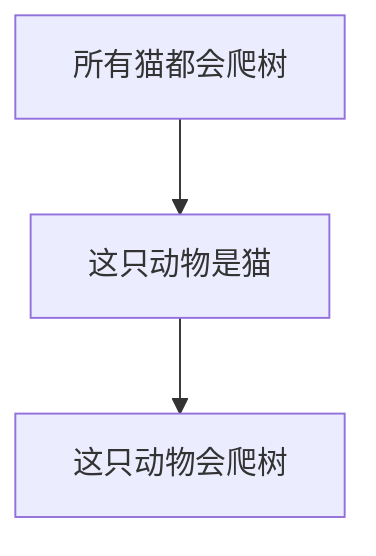
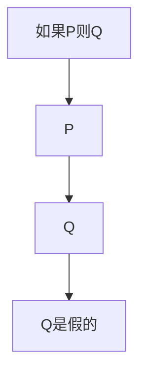
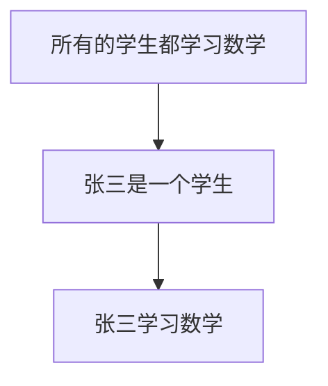
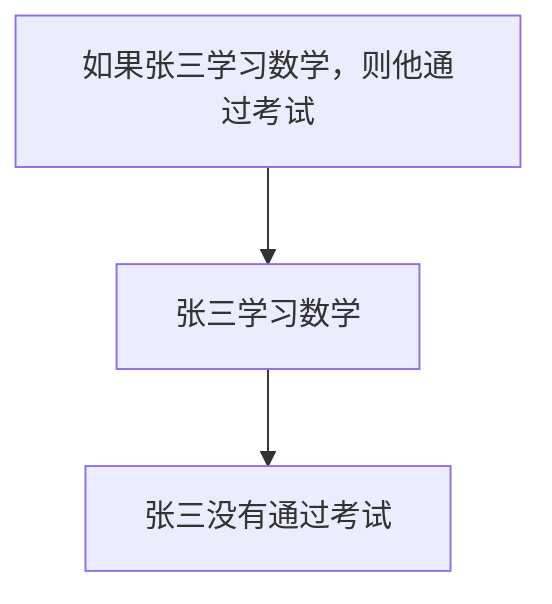
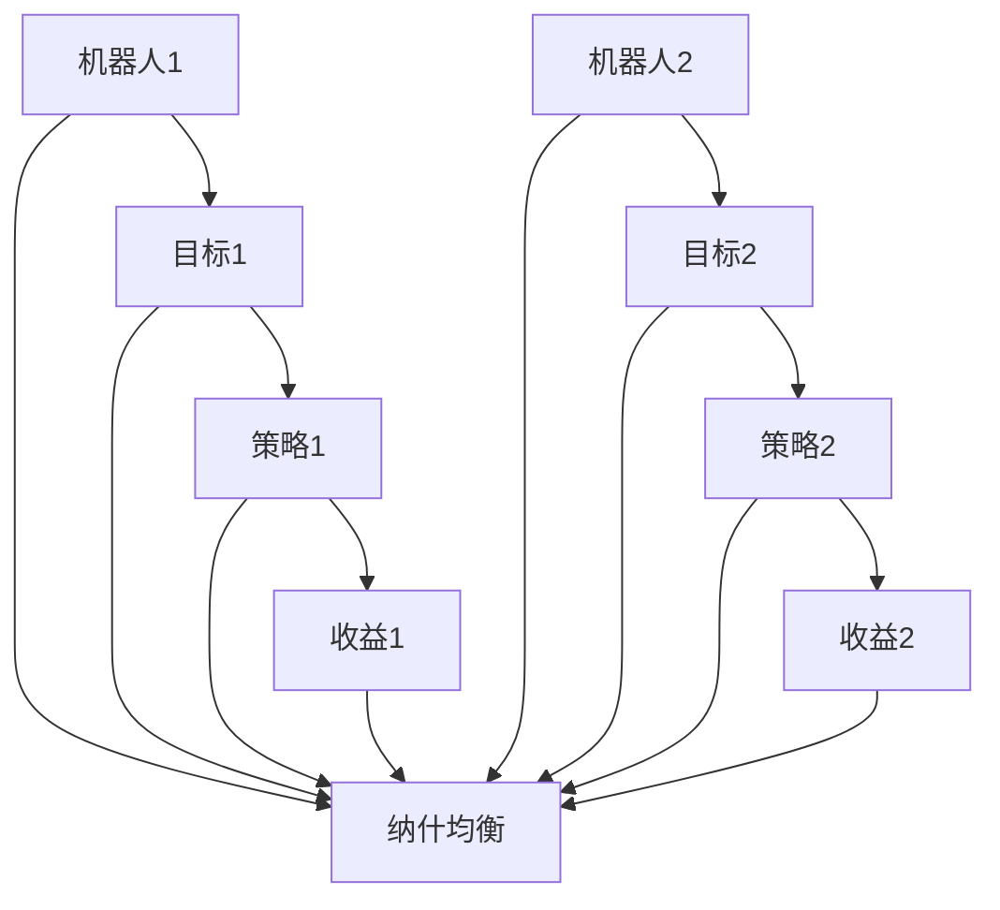
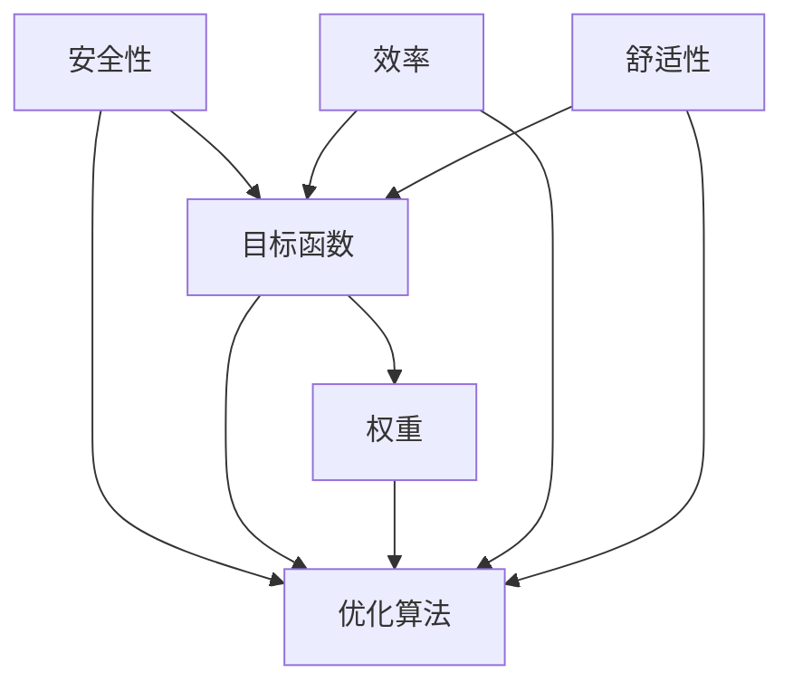
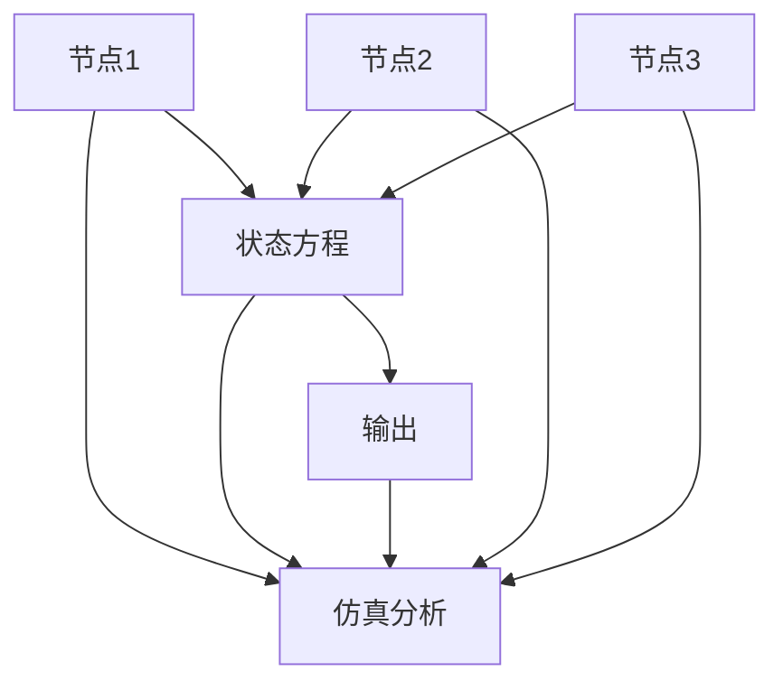

                 

# 数理逻辑：可靠性和协调性

## 摘要

本文将深入探讨数理逻辑中的可靠性理论及其协调性分析。首先，我们将回顾数理逻辑的基础知识，包括命题逻辑和谓词逻辑的基本概念和推理方法。接着，我们将介绍可靠性理论的基本概念，探讨其在计算机科学和数学领域的应用。随后，我们将研究协调性理论，分析其在复杂系统中的重要性。文章还将探讨可靠性协调性的综合应用，以及数理逻辑在人工智能和控制系统中的实践案例。最后，我们将提供附录，包括数理逻辑常用符号表、数学模型和公式的详解，以及可靠性协调性分析工具的介绍。通过本文的详细讲解，读者将更好地理解数理逻辑的深度和应用价值。

## 关键词

- 数理逻辑
- 可靠性理论
- 协调性分析
- 计算机科学
- 人工智能
- 控制系统
- 数学模型

## 数理逻辑基础

### 数理逻辑概述

数理逻辑，又称符号逻辑，是一种用数学方法研究逻辑性质和推理规则的学科。它的诞生可以追溯到19世纪末和20世纪初，当时数学家们开始探索如何将逻辑形式化，以解决形式证明和数学基础的问题。数理逻辑不仅对数学理论的发展有着深远影响，还在计算机科学、哲学、人工智能等领域得到广泛应用。

### 数理逻辑的基本概念

数理逻辑主要研究以下几个基本概念：

#### 命题

命题是一个陈述句，它可以是真的或假的，但不能同时为真和假。例如，“今天下雨”是一个命题。

#### 逻辑联结词

逻辑联结词用于连接命题，形成更复杂的逻辑表达式。常见的逻辑联结词有“且”（AND）、“或”（OR）、“非”（NOT）等。

#### 推理规则

推理规则是用于从已知命题推导出新命题的规则。常见的推理规则有“假言推理”、“选言推理”等。

### 数理逻辑的发展历程

数理逻辑的发展历程可以分为以下几个阶段：

#### 逻辑原子主义

逻辑原子主义认为，所有复杂的逻辑命题都可以分解为基本的命题原子。这种观点由早期逻辑学家如乔治·坎特布里的贝特兰·罗素和贝恩德·罗素提出。

#### 逻辑集合论

逻辑集合论将命题视为集合的子集，通过集合的运算来定义命题的逻辑运算。这种观点由数学家如大卫·希尔伯特和莱布尼茨等人发展。

#### 逻辑形式化

逻辑形式化是数理逻辑的核心目标之一，它试图将逻辑推理过程形式化为一系列符号和规则。这种形式化方法为计算机科学和人工智能的发展奠定了基础。

### 数理逻辑的应用领域

数理逻辑在多个领域都有广泛应用：

#### 计算机科学

在计算机科学中，数理逻辑用于形式化编程语言的语义、设计形式化的验证工具以及实现逻辑编程语言。

#### 数学

数学家使用数理逻辑来研究数学基础、证明理论以及构建新的数学理论体系。

#### 哲学

哲学家利用数理逻辑来探讨逻辑哲学问题，如知识的必然性和可能性。

### 数理逻辑的符号系统

数理逻辑使用一套符号来表示命题、逻辑联结词和推理规则。常见的符号有：

- 命题变量：如 $P, Q, R$ 等
- 逻辑联结词：如 $\land, \lor, \neg$ 等
- 推理规则：如 $\to, \leftrightarrow$ 等

通过这些符号，数理逻辑可以将复杂的逻辑推理形式化，使得推理过程更加清晰和精确。

### 数理逻辑的基本规则

数理逻辑的基本规则包括命题变元的替换规则、逻辑联结词的结合规则以及推理规则。这些规则确保了逻辑推理的合法性和一致性。

#### 命题变元的替换规则

这个规则允许我们在逻辑表达式中替换命题变量，只要替换的是相同类型的命题。

#### 逻辑联结词的结合规则

这些规则定义了如何组合逻辑联结词，以形成更复杂的逻辑表达式。

#### 推理规则

推理规则用于从已知命题推导出新命题。例如，假言推理（Modus Ponens）允许我们从“如果P则Q”和“P”推导出“Q”。

### 数理逻辑的推理方法

数理逻辑的推理方法包括直接推理和间接推理。

#### 直接推理

直接推理是从已知命题直接推导出新命题的方法。例如，从“所有猫都会爬树”和“这只动物是猫”可以推导出“这只动物会爬树”。

#### 间接推理

间接推理是通过否定已知命题的结论来推导出新的命题。例如，如果我们知道“如果P则Q”是假的，并且P是真的，那么我们可以推导出Q是假的。

#### 演绎推理与归纳推理

演绎推理是从一般到特殊的推理过程，而归纳推理是从特殊到一般的推理过程。数理逻辑中的推理方法不仅限于演绎推理，还涉及归纳推理。

## 命题逻辑

命题逻辑是数理逻辑的一个分支，主要研究命题的结构和推理。它是一种形式逻辑，通过符号表示命题和推理，使得推理过程更加精确和可靠。

### 命题逻辑的基本概念

#### 命题

命题是一个陈述句，它可以是真的或假的，但不能同时为真和假。例如，“今天下雨”是一个命题。

#### 逻辑联结词

逻辑联结词用于连接命题，形成更复杂的逻辑表达式。常见的逻辑联结词有“且”（AND）、“或”（OR）、“非”（NOT）等。

#### 命题逻辑的符号系统

命题逻辑使用一套符号来表示命题、逻辑联结词和推理规则。常见的符号有：

- 命题变量：如 $P, Q, R$ 等
- 逻辑联结词：如 $\land, \lor, \neg$ 等
- 推理规则：如 $\to, \leftrightarrow$ 等

通过这些符号，命题逻辑可以将复杂的逻辑推理形式化，使得推理过程更加清晰和精确。

### 命题逻辑的基本规则

命题逻辑的基本规则包括命题变元的替换规则、逻辑联结词的结合规则以及推理规则。这些规则确保了逻辑推理的合法性和一致性。

#### 命题变元的替换规则

这个规则允许我们在逻辑表达式中替换命题变量，只要替换的是相同类型的命题。

#### 逻辑联结词的结合规则

这些规则定义了如何组合逻辑联结词，以形成更复杂的逻辑表达式。

#### 推理规则

推理规则用于从已知命题推导出新命题。例如，假言推理（Modus Ponens）允许我们从“如果P则Q”和“P”推导出“Q”。

### 命题逻辑的推理方法

命题逻辑的推理方法包括直接推理和间接推理。

#### 直接推理

直接推理是从已知命题直接推导出新命题的方法。例如，从“所有猫都会爬树”和“这只动物是猫”可以推导出“这只动物会爬树”。

#### 间接推理

间接推理是通过否定已知命题的结论来推导出新的命题。例如，如果我们知道“如果P则Q”是假的，并且P是真的，那么我们可以推导出Q是假的。

#### 演绎推理与归纳推理

演绎推理是从一般到特殊的推理过程，而归纳推理是从特殊到一般的推理过程。命题逻辑中的推理方法不仅限于演绎推理，还涉及归纳推理。

### 命题逻辑的推理方法

#### 直接推理

直接推理是从已知命题直接推导出新命题的方法。例如，从“所有猫都会爬树”和“这只动物是猫”可以推导出“这只动物会爬树”。



#### 间接推理

间接推理是通过否定已知命题的结论来推导出新的命题。例如，如果我们知道“如果P则Q”是假的，并且P是真的，那么我们可以推导出Q是假的。



#### 演绎推理与归纳推理

演绎推理是从一般到特殊的推理过程，而归纳推理是从特殊到一般的推理过程。

- **演绎推理**：从一般原理推导出特定情况下的结论。例如，从“所有人都会死”和“苏格拉底是人”可以得出“苏格拉底会死”。
  
  ```mermaid
  graph TD
  A[所有人都会死] --> B[苏格拉底是人]
  B --> C[苏格拉底会死]
  ```

- **归纳推理**：从特定情况推导出一般原理。例如，通过观察许多天鹅是白色的，我们可以归纳出“所有天鹅都是白色的”。
  
  ```mermaid
  graph TD
  A1[天鹅1是白色的] --> B1[天鹅2是白色的]
  B1 --> B2[天鹅3是白色的]
  B2 --> B3[天鹅4是白色的]
  B3 --> C[所有天鹅都是白色的]
  ```

## 谓词逻辑

谓词逻辑是数理逻辑的另一个重要分支，它扩展了命题逻辑，允许我们处理更加复杂和具体的命题。谓词逻辑通过引入谓词、量词和关系符号，使得我们能够表达和推理关于个体和集合的性质。

### 谓词逻辑的基本概念

#### 谓词

谓词是一个用来描述个体或集合性质或关系的命题部分。例如，“是红色的”、“大于2”等都是谓词。

#### 量词

量词用来描述个体或集合的全体或部分。常见的量词有全称量词（$\forall$）和存在量词（$\exists$）。

- **全称量词**：用于描述对所有个体的性质。例如，“对于所有的自然数，它们都是无限的”。
- **存在量词**：用于描述至少有一个个体满足某种性质。例如，“存在一个自然数，它是偶数”。

#### 关系符号

关系符号用来描述个体或集合之间的关系。例如，“小于”（$<$）、“等于”（$=$）等。

### 谓词逻辑的符号系统

谓词逻辑使用一套符号来表示谓词、量词和关系符号。常见的符号有：

- 谓词符号：如 $P(x), Q(x)$ 等
- 量词符号：如 $\forall, \exists$ 等
- 关系符号：如 $=$, $>$ 等

通过这些符号，谓词逻辑可以表达和推理复杂的命题。

### 谓词逻辑的基本规则

谓词逻辑的基本规则包括谓词变元的替换规则、量词的引入和消去规则以及关系符号的结合规则。这些规则确保了谓词逻辑推理的合法性和一致性。

#### 谓词变元的替换规则

这个规则允许我们在逻辑表达式中替换谓词变量，只要替换的是相同类型的谓词。

#### 量词的引入和消去规则

量词的引入规则允许我们将一个存在量词或全称量词引入到命题中，而量词的消去规则则允许我们从带有量词的命题中提取出相应的个体命题。

#### 关系符号的结合规则

这些规则定义了如何组合关系符号，以形成更复杂的关系表达式。

### 谓词逻辑的推理方法

谓词逻辑的推理方法包括直接推理和间接推理。

#### 直接推理

直接推理是从已知命题直接推导出新命题的方法。例如，从“所有的学生都学习数学”和“张三是一个学生”可以推导出“张三学习数学”。



#### 间接推理

间接推理是通过否定已知命题的结论来推导出新的命题。例如，如果我们知道“如果张三学习数学，则他通过考试”是假的，并且张三学习了数学，那么我们可以推导出他没有通过考试。



#### 演绎推理与归纳推理

演绎推理是从一般到特殊的推理过程，而归纳推理是从特殊到一般的推理过程。

- **演绎推理**：从一般原理推导出特定情况下的结论。例如，从“所有的猫都有四条腿”和“猫是动物”可以得出“猫有四条腿”。
  
  ```mermaid
  graph TD
  A[所有的猫都有四条腿] --> B[猫是动物]
  B --> C[猫有四条腿]
  ```

- **归纳推理**：从特定情况推导出一般原理。例如，通过观察多个猫都有四条腿，我们可以归纳出“所有的动物都有四条腿”。

  ```mermaid
  graph TD
  A1[猫1有四条腿] --> B1[猫2有四条腿]
  B1 --> B2[猫3有四条腿]
  B2 --> B3[猫4有四条腿]
  B3 --> C[所有的动物都有四条腿]
  ```

## 可靠性理论

可靠性理论是研究系统或产品在特定条件下能够保持正常功能的能力的学科。它广泛应用于工程、计算机科学和人工智能等领域，旨在提高系统的稳定性和安全性。可靠性理论的核心问题是：如何评估和改善系统的可靠性？

### 可靠性的基本概念

#### 可靠性的定义

可靠性是指系统或产品在特定条件下无故障运行的概率。具体来说，可靠性通常定义为在特定时间内，系统或产品能够正常工作的概率。

#### 可靠性的度量

可靠性通常用以下几个指标来度量：

- **故障率（Failure Rate）**：故障率是指单位时间内发生故障的概率。它通常用泊松分布来描述。
  
  $$ \lambda = \frac{1}{\tau} $$

  其中，$\lambda$ 表示故障率，$\tau$ 表示平均无故障时间。

- **平均故障时间（Mean Time To Failure, MTTF）**：平均故障时间是指系统平均运行到首次故障的时间。
  
  $$ \MTTF = \frac{1}{\lambda} $$

- **平均故障间隔时间（Mean Time Between Failures, MTBF）**：平均故障间隔时间是指两次故障之间的平均时间。

  $$ \MTBF = \MTTF + \MTTR $$

  其中，$\MTTR$ 表示平均故障修复时间。

#### 可靠性的影响因素

可靠性的影响因素包括：

- **设计因素**：包括系统的结构、硬件和软件设计等。
- **环境因素**：包括温度、湿度、电磁干扰等。
- **操作因素**：包括操作人员的技能、操作规程等。
- **维护因素**：包括定期维护、故障检测和修复等。

### 可靠性分析方法

可靠性分析方法包括概率方法、模糊集方法和模型方法等。

#### 基于概率的方法

基于概率的方法通过计算系统或产品在特定条件下的故障概率来评估可靠性。常用的概率方法有：

- **蒙特卡罗方法**：通过模拟大量样本来评估系统的可靠性。
- **故障树分析（FTA）**：将系统故障分解为基本事件，并通过概率计算来评估系统故障的概率。

#### 基于模糊集的方法

基于模糊集的方法通过引入模糊集来描述系统的可靠性。这种方法适用于系统或产品的可靠性难以精确度量的情况。

#### 基于模型的方法

基于模型的方法通过建立系统或产品的可靠性模型来评估和优化系统的可靠性。常用的模型有：

- **马尔可夫模型**：用于描述系统在不同状态之间的转移概率。
- **贝叶斯网络**：用于表示系统故障的原因和结果之间的关系。

### 可靠性在实际应用中的重要性

可靠性在各个领域都有广泛的应用：

- **工程领域**：在航空航天、汽车制造、电力工程等领域，可靠性是设计和维护系统的重要指标。
- **计算机科学**：在软件开发、网络安全、人工智能等领域，可靠性是保证系统稳定性和安全性的关键。
- **人工智能**：在自动驾驶、智能家居、医疗诊断等领域，可靠性是保证系统正常运行和用户安全的关键。

通过可靠性理论的深入研究和应用，我们可以设计出更加可靠和高效的系统，从而提高系统的性能和用户体验。

### 可靠性理论的基本概念

可靠性理论是研究系统或产品在特定条件下能够保持正常功能的能力的学科。它的核心问题是：如何评估和改善系统的可靠性？

#### 可靠性的定义

可靠性是指系统或产品在特定条件下无故障运行的概率。具体来说，可靠性通常定义为在特定时间内，系统或产品能够正常工作的概率。

#### 可靠性的度量

可靠性通常用以下几个指标来度量：

- **故障率（Failure Rate）**：故障率是指单位时间内发生故障的概率。它通常用泊松分布来描述。

  $$ \lambda = \frac{1}{\tau} $$

  其中，$\lambda$ 表示故障率，$\tau$ 表示平均无故障时间。

- **平均故障时间（Mean Time To Failure, MTTF）**：平均故障时间是指系统平均运行到首次故障的时间。

  $$ \MTTF = \frac{1}{\lambda} $$

- **平均故障间隔时间（Mean Time Between Failures, MTBF）**：平均故障间隔时间是指两次故障之间的平均时间。

  $$ \MTBF = \MTTF + \MTTR $$

  其中，$\MTTR$ 表示平均故障修复时间。

#### 可靠性的影响因素

可靠性的影响因素包括：

- **设计因素**：包括系统的结构、硬件和软件设计等。
- **环境因素**：包括温度、湿度、电磁干扰等。
- **操作因素**：包括操作人员的技能、操作规程等。
- **维护因素**：包括定期维护、故障检测和修复等。

### 可靠性分析方法

可靠性分析方法包括概率方法、模糊集方法和模型方法等。

#### 基于概率的方法

基于概率的方法通过计算系统或产品在特定条件下的故障概率来评估可靠性。常用的概率方法有：

- **蒙特卡罗方法**：通过模拟大量样本来评估系统的可靠性。
- **故障树分析（FTA）**：将系统故障分解为基本事件，并通过概率计算来评估系统故障的概率。

#### 基于模糊集的方法

基于模糊集的方法通过引入模糊集来描述系统的可靠性。这种方法适用于系统或产品的可靠性难以精确度量的情况。

#### 基于模型的方法

基于模型的方法通过建立系统或产品的可靠性模型来评估和优化系统的可靠性。常用的模型有：

- **马尔可夫模型**：用于描述系统在不同状态之间的转移概率。
- **贝叶斯网络**：用于表示系统故障的原因和结果之间的关系。

### 可靠性在实际应用中的重要性

可靠性在各个领域都有广泛的应用：

- **工程领域**：在航空航天、汽车制造、电力工程等领域，可靠性是设计和维护系统的重要指标。
- **计算机科学**：在软件开发、网络安全、人工智能等领域，可靠性是保证系统稳定性和安全性的关键。
- **人工智能**：在自动驾驶、智能家居、医疗诊断等领域，可靠性是保证系统正常运行和用户安全的关键。

通过可靠性理论的深入研究和应用，我们可以设计出更加可靠和高效的系统，从而提高系统的性能和用户体验。

### 协调性理论

协调性理论是研究系统内部各部分之间协同工作的能力。它关注系统如何在不同条件下保持稳定和高效，从而实现整体性能的最优化。协调性在复杂系统的设计和运行中起着关键作用，因为它涉及到系统内部各个组件之间的相互作用和平衡。

#### 协调性的基本概念

#### 协调性的定义

协调性是指系统内部各部分之间的协同工作能力，使其能够有效地实现系统的整体目标和功能。具体来说，协调性涉及以下几个方面：

- **同步性**：系统内部各部分能够在正确的时间执行正确的操作。
- **一致性**：系统内部各部分的状态和输出能够保持一致，避免冲突和错误。
- **适应性**：系统在面对外部变化或内部故障时，能够快速适应并恢复正常运作。

#### 协调性的度量

协调性通常用以下几个指标来度量：

- **一致性指标**：用于衡量系统内部状态和输出的同步程度。
- **适应性指标**：用于衡量系统对外部变化或内部故障的响应能力。
- **效率指标**：用于衡量系统整体性能，包括资源利用率和任务完成时间等。

#### 协调性的影响因素

协调性的影响因素包括：

- **系统结构**：系统内部组件的布局和连接方式会影响协调性。
- **通信机制**：系统内部各部分之间的通信方式和效率对协调性有重要影响。
- **控制策略**：系统控制算法的合理性和适应性对协调性有直接影响。

### 协调性理论的基本概念

#### 协调性的定义

协调性是指系统内部各部分之间的协同工作能力，使其能够有效地实现系统的整体目标和功能。具体来说，协调性涉及以下几个方面：

- **同步性**：系统内部各部分能够在正确的时间执行正确的操作。
- **一致性**：系统内部各部分的状态和输出能够保持一致，避免冲突和错误。
- **适应性**：系统在面对外部变化或内部故障时，能够快速适应并恢复正常运作。

#### 协调性的度量

协调性通常用以下几个指标来度量：

- **一致性指标**：用于衡量系统内部状态和输出的同步程度。
- **适应性指标**：用于衡量系统对外部变化或内部故障的响应能力。
- **效率指标**：用于衡量系统整体性能，包括资源利用率和任务完成时间等。

#### 协调性的影响因素

协调性的影响因素包括：

- **系统结构**：系统内部组件的布局和连接方式会影响协调性。
- **通信机制**：系统内部各部分之间的通信方式和效率对协调性有重要影响。
- **控制策略**：系统控制算法的合理性和适应性对协调性有直接影响。

### 协调性分析方法

协调性分析方法包括博弈论方法、多目标优化方法和模型分析方法等。

#### 基于博弈论的方法

基于博弈论的方法通过分析系统内部各部分之间的利益冲突和合作机制，来优化系统的协调性。这种方法适用于具有竞争和合作的复杂系统。

- **博弈模型**：建立系统内部各部分的博弈模型，分析各部分的策略和收益。
- **纳什均衡**：寻找系统各部分的纳什均衡策略，以实现整体最优。

#### 基于多目标优化的方法

基于多目标优化的方法通过优化系统内部各部分的协同工作，来实现系统整体性能的最优化。这种方法适用于具有多个目标约束的复杂系统。

- **多目标优化模型**：建立系统多目标优化的数学模型，定义目标函数和约束条件。
- **优化算法**：使用遗传算法、粒子群优化等算法来求解多目标优化问题。

#### 基于模型的方法

基于模型的方法通过建立系统协调性的数学模型，来分析和优化系统的协调性。这种方法适用于可以通过数学建模描述的复杂系统。

- **数学模型**：建立系统协调性的数学模型，包括状态方程、控制方程等。
- **仿真分析**：通过仿真分析来验证模型的正确性和优化效果。

### 协调性在实际应用中的重要性

协调性在多个领域都有重要应用：

- **控制系统**：在航空航天、机器人、自动化生产线等领域，协调性是保证系统正常运行和高效作业的关键。
- **分布式系统**：在计算机网络、云计算、物联网等领域，协调性是提高系统性能和可靠性的重要手段。
- **人工智能**：在自动驾驶、智能识别、机器人控制等领域，协调性是确保系统决策和动作一致性的基础。

通过协调性理论的研究和应用，我们可以设计出更加协调和高效的系统，从而提高系统的整体性能和用户体验。

### 协调性分析方法

协调性分析方法包括基于博弈论的方法、基于多目标优化的方法以及基于模型的方法。

#### 基于博弈论的方法

基于博弈论的方法通过分析系统内部各部分之间的利益冲突和合作机制，来优化系统的协调性。这种方法适用于具有竞争和合作的复杂系统。

- **博弈模型**：建立系统内部各部分的博弈模型，分析各部分的策略和收益。
- **纳什均衡**：寻找系统各部分的纳什均衡策略，以实现整体最优。

例如，在一个多机器人系统中，每个机器人都有各自的目标，但它们的行动可能会相互干扰。通过建立博弈模型，可以分析每个机器人的最佳策略，以及系统整体的纳什均衡，从而优化整个系统的协调性。



#### 基于多目标优化的方法

基于多目标优化的方法通过优化系统内部各部分的协同工作，来实现系统整体性能的最优化。这种方法适用于具有多个目标约束的复杂系统。

- **多目标优化模型**：建立系统多目标优化的数学模型，定义目标函数和约束条件。
- **优化算法**：使用遗传算法、粒子群优化等算法来求解多目标优化问题。

例如，在一个自动驾驶系统中，需要同时优化安全性、效率和舒适性等目标。通过建立多目标优化模型，可以确定各目标的权重，并使用优化算法来找到最优解。



#### 基于模型的方法

基于模型的方法通过建立系统协调性的数学模型，来分析和优化系统的协调性。这种方法适用于可以通过数学建模描述的复杂系统。

- **数学模型**：建立系统协调性的数学模型，包括状态方程、控制方程等。
- **仿真分析**：通过仿真分析来验证模型的正确性和优化效果。

例如，在一个分布式网络系统中，可以通过建立状态方程和控制方程，来描述系统中各个节点之间的通信和协调。通过仿真分析，可以评估系统的协调性能，并优化控制策略。



通过这些协调性分析方法，我们可以有效地提高复杂系统的协调性和整体性能，从而实现系统的高效运行和优化。

### 可靠性协调性的综合应用

在复杂系统的设计和运行中，可靠性协调性是一个关键因素。可靠性确保系统在规定条件下能够正常工作，而协调性则保证了系统内部各部分之间的协同效应，从而实现整体性能的最优化。下面，我们将探讨可靠性协调性在计算机系统、数学模型和人工智能领域中的应用。

#### 计算机系统中的可靠性协调性

在计算机系统中，可靠性和协调性是确保系统稳定性和安全性的基础。以下是一些具体应用实例：

- **服务器集群**：在大型服务器集群中，可靠性协调性至关重要。通过冗余设计、负载均衡和故障转移机制，可以确保在个别服务器出现故障时，整个系统仍能正常运行。例如，使用分布式哈希表（DHT）可以实现服务器之间的数据同步和负载均衡，提高集群的可靠性和协调性。

  ```mermaid
  graph TD
  A[服务器1] --> B[数据]
  B --> C[分布式哈希表]
  C --> D[负载均衡]
  D --> E[故障转移]
  E --> F[系统稳定性]
  ```

- **实时操作系统**：在实时操作系统中，可靠性和协调性确保系统能够及时响应外部事件。例如，通过使用优先级调度算法，可以确保关键任务（如安全监控和故障检测）能够优先执行，从而提高系统的可靠性和协调性。

  ```mermaid
  graph TD
  A[任务1] --> B[优先级]
  B --> C[调度算法]
  C --> D[响应时间]
  D --> E[系统稳定性]
  ```

#### 数学模型中的可靠性协调性

在数学模型中，可靠性协调性用于分析和优化系统的性能。以下是一些具体应用实例：

- **优化模型**：在优化问题中，可靠性协调性用于评估系统在各种条件下的性能。例如，通过建立线性规划模型，可以优化系统资源分配，确保系统在给定约束条件下达到最优性能。

  ```math
  \min_{x} c^T x \quad \text{subject to} \quad Ax \leq b
  ```

- **蒙特卡罗模拟**：在蒙特卡罗模拟中，可靠性协调性用于评估系统在不同场景下的可靠性。例如，通过模拟大量样本，可以评估系统在极端条件下的可靠性，并优化设计参数。

  ```mermaid
  graph TD
  A[初始状态] --> B[模拟场景]
  B --> C[可靠性评估]
  C --> D[参数优化]
  ```

#### 人工智能中的可靠性协调性

在人工智能系统中，可靠性协调性用于确保系统在复杂环境中的稳定性和安全性。以下是一些具体应用实例：

- **自动驾驶**：在自动驾驶系统中，可靠性协调性确保车辆能够安全行驶。通过使用传感器融合和路径规划算法，可以确保车辆在复杂交通环境中的稳定性和协调性。

  ```mermaid
  graph TD
  A[传感器数据] --> B[融合算法]
  B --> C[路径规划]
  C --> D[车辆控制]
  D --> E[行驶安全]
  ```

- **智能诊断**：在医疗诊断系统中，可靠性协调性用于确保诊断结果的准确性。通过使用机器学习算法和专家系统，可以确保系统在不同病患数据中的可靠性和协调性。

  ```mermaid
  graph TD
  A[病患数据] --> B[机器学习算法]
  B --> C[诊断结果]
  C --> D[专家系统]
  D --> E[诊断准确性]
  ```

通过可靠性协调性的综合应用，我们可以设计出更加稳定、安全、高效的系统，从而满足实际需求并提升用户体验。

### 可靠性协调性在人工智能中的应用

在人工智能（AI）领域，可靠性和协调性是确保系统有效运行和用户信任的关键因素。以下将详细探讨可靠性协调性在人工智能中的具体应用，包括AI中的可靠性问题和协调性问题，以及一些典型的应用案例。

#### AI中的可靠性问题

在人工智能系统中，可靠性问题主要体现在以下几个方面：

- **数据可靠性**：数据是AI系统的核心，数据质量直接影响模型的准确性和稳定性。数据可靠性问题包括数据缺失、数据偏差、噪声数据等。
- **模型可靠性**：模型可靠性指的是模型在特定任务上的表现能否保持一致性。例如，深度学习模型可能会因为数据分布的变化而出现性能下降。
- **计算可靠性**：在分布式计算环境中，计算资源的可用性和稳定性是确保AI系统可靠运行的关键。

为了解决这些可靠性问题，可以采取以下措施：

- **数据清洗和预处理**：通过数据清洗和预处理，可以减少数据中的噪声和异常值，提高数据质量。
- **模型验证和测试**：通过交叉验证和测试，可以评估模型的稳定性和泛化能力，确保模型在未知数据上的表现。
- **冗余设计**：通过设计冗余系统，可以确保在计算资源出现故障时，系统能够继续运行。

#### AI中的协调性问题

在人工智能系统中，协调性问题主要体现在以下几个方面：

- **多模型协调**：在复杂任务中，可能需要多个模型协同工作。例如，在自动驾驶系统中，需要感知、规划和控制等多个模型之间的协调。
- **动态环境适应**：AI系统需要根据环境变化动态调整策略，保持系统的一致性和协调性。
- **资源分配**：在资源受限的环境中，需要合理分配计算资源，以确保系统的高效运行。

为了解决协调性问题，可以采取以下措施：

- **多模型融合**：通过多模型融合，可以结合不同模型的优势，提高系统整体性能。例如，使用集成学习（Ensemble Learning）方法，可以结合多个弱学习器的预测结果，提高模型的可靠性。
- **动态规划**：通过动态规划算法，可以实时调整系统策略，以适应环境变化。例如，在自动驾驶中，使用动态路径规划算法，可以实时调整行驶路线，以应对交通状况的变化。
- **资源优化**：通过资源优化算法，可以合理分配计算资源，确保关键任务得到优先处理。例如，在云计算环境中，使用调度算法可以优化虚拟机的分配，提高系统整体性能。

#### 应用案例

以下是一些具体的AI应用案例，展示了可靠性协调性在实践中的应用：

- **自动驾驶**：自动驾驶系统需要处理大量的传感器数据，并协调多个模型（如感知、规划和控制）的输出，确保车辆在复杂交通环境中的安全行驶。通过多模型融合和动态路径规划，可以提升系统的可靠性和协调性。
  
  ```mermaid
  graph TD
  A[传感器数据] --> B[感知模型]
  B --> C[环境感知]
  C --> D[路径规划]
  D --> E[控制模型]
  E --> F[车辆控制]
  ```

- **智能医疗诊断**：在智能医疗诊断系统中，多个模型（如影像分析、疾病预测和诊断辅助）需要协同工作，确保诊断结果的准确性。通过数据清洗和预处理，以及多模型融合，可以提高系统的可靠性。

  ```mermaid
  graph TD
  A[病患数据] --> B[数据清洗]
  B --> C[影像分析]
  C --> D[疾病预测]
  D --> E[诊断辅助]
  E --> F[诊断结果]
  ```

- **智能安防**：在智能安防系统中，需要实时监控视频数据，并协调报警系统和分析系统的输出，确保及时发现和处理异常情况。通过动态规划和资源优化，可以提高系统的协调性和响应速度。

  ```mermaid
  graph TD
  A[视频数据] --> B[实时监控]
  B --> C[异常检测]
  C --> D[报警系统]
  D --> E[资源优化]
  E --> F[系统响应]
  ```

通过可靠性协调性的深入研究和应用，人工智能系统能够在复杂环境中保持稳定运行，提高系统的整体性能和用户满意度。

### 可靠性协调性在控制系统中的应用

在控制系统领域，可靠性协调性是确保系统稳定运行和安全操作的关键。控制系统通常涉及多个组件和变量，因此，可靠性协调性的分析和优化对于确保系统的高效性能至关重要。以下将详细探讨可靠性协调性在控制系统中的应用，包括可靠性协调性在控制系统的意义、具体应用案例以及实现方法。

#### 可靠性协调性在控制系统的意义

在控制系统（如自动化生产线、机器人控制、航空航天系统等）中，可靠性协调性的意义体现在以下几个方面：

- **确保系统稳定性**：可靠性协调性分析可以帮助我们识别系统中的潜在故障点，并采取相应的措施来提高系统的稳定性。
- **优化系统性能**：通过可靠性协调性分析，我们可以找到系统中的瓶颈和薄弱环节，从而优化系统的整体性能。
- **提高安全性**：在控制系统运行过程中，可靠性协调性分析有助于识别潜在的安全隐患，并采取相应的措施来防止事故发生。

#### 可靠性协调性的具体应用案例

以下是一些典型的应用案例，展示了可靠性协调性在控制系统中的应用：

- **自动化生产线**：在自动化生产线上，可靠性协调性分析用于优化生产流程，提高生产效率。例如，通过分析生产线中各个机器和设备的运行状态，可以确定最优的生产节奏，避免设备过载或闲置。

  ```mermaid
  graph TD
  A[生产线1] --> B[设备状态分析]
  B --> C[优化生产节奏]
  C --> D[提高生产效率]
  ```

- **机器人控制**：在机器人控制系统中，可靠性协调性分析用于确保机器人能够在各种环境中稳定运行。例如，通过分析机器人关节的磨损情况和运动轨迹，可以优化机器人的控制策略，延长其使用寿命。

  ```mermaid
  graph TD
  A[机器人关节] --> B[磨损情况分析]
  B --> C[优化控制策略]
  C --> D[延长使用寿命]
  ```

- **航空航天系统**：在航空航天系统中，可靠性协调性分析用于确保飞行器的安全和可靠性。例如，通过分析飞行器各个部件的运行状态，可以优化飞行器的维护计划，降低故障风险。

  ```mermaid
  graph TD
  A[飞行器部件] --> B[运行状态分析]
  B --> C[优化维护计划]
  C --> D[降低故障风险]
  ```

#### 可靠性协调性的实现方法

以下是一些常见的可靠性协调性实现方法：

- **故障树分析（FTA）**：故障树分析是一种基于逻辑关系的方法，用于识别系统中的故障模式和故障原因。通过建立故障树，可以分析系统的故障路径和故障概率，从而优化系统的设计和管理。

  ```mermaid
  graph TD
  A[系统故障] --> B[故障原因]
  B --> C[故障路径]
  C --> D[故障概率]
  ```

- **蒙特卡罗模拟**：蒙特卡罗模拟是一种基于概率的方法，用于评估系统的可靠性和性能。通过模拟大量样本，可以分析系统的故障模式和性能指标，从而优化系统的设计和运行。

  ```mermaid
  graph TD
  A[模拟样本] --> B[系统性能]
  B --> C[故障模式]
  C --> D[可靠性评估]
  ```

- **多目标优化**：多目标优化是一种基于数学的方法，用于优化系统的多个性能指标。通过建立多目标优化模型，可以同时优化系统的可靠性、性能和成本等目标，从而提高系统的整体性能。

  ```mermaid
  graph TD
  A[可靠性目标] --> B[性能目标]
  B --> C[成本目标]
  C --> D[多目标优化]
  ```

通过可靠性协调性的分析和优化，我们可以设计出更加可靠、高效和安全的控制系统，从而满足实际需求并提升用户体验。

### 附录

#### 附录A：数理逻辑常用符号表

以下是数理逻辑中常用的符号及其含义：

- **命题变量**：$P, Q, R$ 等
- **逻辑联结词**：$\land$（且），$\lor$（或），$\neg$（非），$\rightarrow$（蕴含），$\leftrightarrow$（等价）
- **量词**：$\forall$（全称量词，表示“对于所有”），$\exists$（存在量词，表示“存在”）
- **关系符号**：$=$（等于），$>$（大于），$<$（小于），$\neq$（不等于）

#### 附录B：数学模型和数学公式详解

以下是数理逻辑中常用的数学模型和公式详解：

- **命题逻辑公式**：

  - 命词公式：$P \land Q$（P且Q），$P \lor Q$（P或Q），$\neg P$（非P）
  - 推理规则：$P \rightarrow Q$（如果P则Q），$P \leftrightarrow Q$（P等价于Q）

- **谓词逻辑公式**：

  - 谓词公式：$P(x)$（x是P），$\forall x P(x)$（所有x都是P），$\exists x P(x)$（存在一个x是P）
  - 推理规则：$\forall x (P(x) \rightarrow Q(x))$（对于所有x，如果P(x)则Q(x)），$\exists x (P(x) \land Q(x))$（存在一个x，使得P(x)且Q(x)）

- **可靠性公式**：

  - 故障率：$\lambda = \frac{1}{\tau}$（故障率等于平均无故障时间）
  - 平均故障时间：$\MTTF = \frac{1}{\lambda}$（平均故障时间为故障率的倒数）
  - 平均故障间隔时间：$\MTBF = \MTTF + \MTTR$（平均故障间隔时间为平均故障时间加上平均故障修复时间）

#### 附录C：可靠性协调性分析工具介绍

以下是常用的可靠性协调性分析工具：

- **故障树分析（FTA）**：一种基于逻辑关系的方法，用于识别系统中的故障模式和故障原因。
- **蒙特卡罗模拟**：一种基于概率的方法，用于评估系统的可靠性和性能。
- **多目标优化**：一种基于数学的方法，用于优化系统的多个性能指标。

通过这些工具，我们可以有效地分析和优化系统的可靠性协调性，提高系统的整体性能和稳定性。

