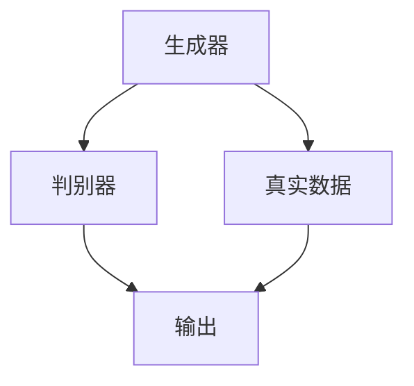
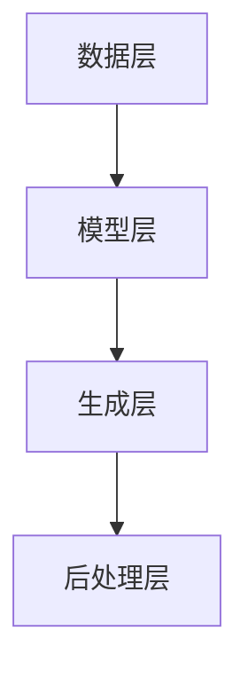
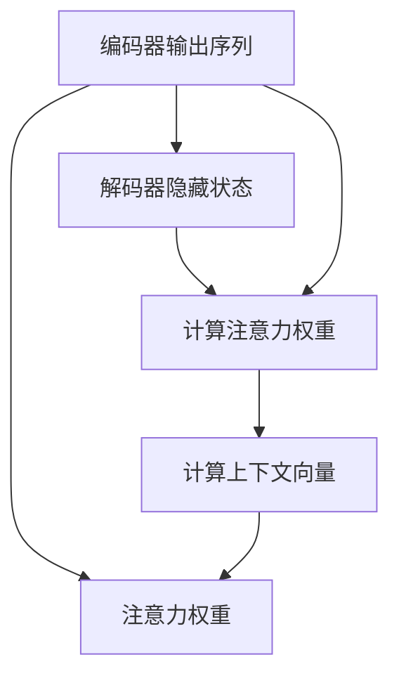
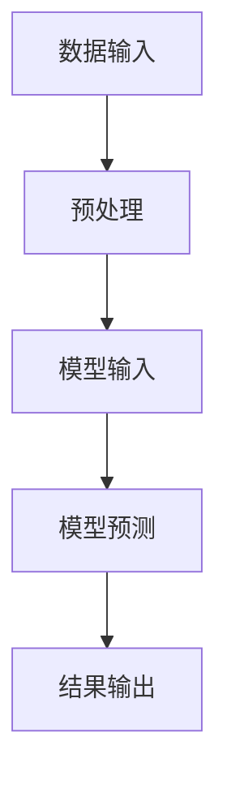
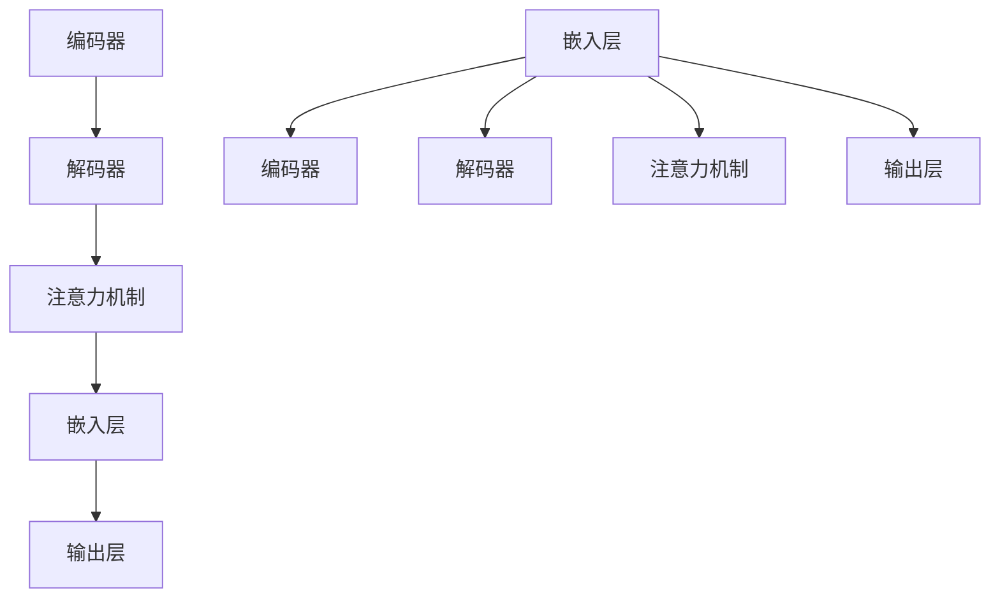

                 

# 文本生成（Text Generation）

## 关键词
- 文本生成
- 自然语言处理
- 序列模型
- 预训练语言模型
- 应用案例

## 摘要
本文将深入探讨文本生成技术，从基础概念到高级应用，涵盖传统方法、序列模型、预训练语言模型以及大规模文本生成系统的实现。通过项目实战和分析，我们将了解文本生成在实际应用中的表现和挑战。

### 目录大纲：《文本生成（Text Generation）》

## 第一部分：文本生成基础

### 第1章：文本生成的概述

### 第2章：文本生成模型

#### 2.1 传统的文本生成模型

#### 2.2 序列模型

#### 2.3 注意力机制与编码器-解码器架构

### 第3章：预训练语言模型

### 第4章：文本生成算法

### 第5章：大规模文本生成系统

## 第二部分：文本生成应用案例分析

### 第6章：文本生成应用案例分析

### 第7章：文本生成的未来趋势与挑战

### 附录

## 第一部分：文本生成基础

### 第1章：文本生成的概述

#### 1.1 文本生成技术简介
文本生成是自然语言处理（NLP）领域的一个重要分支，旨在根据输入文本生成新的文本。这项技术在多种应用场景中都有广泛的应用，包括自动写作、机器翻译、对话系统等。

#### 1.2 文本生成的历史与发展
文本生成技术经历了从规则驱动到数据驱动，再到深度学习驱动的演变过程。早期的文本生成方法主要基于规则和统计模型，而近年来，基于深度学习的文本生成方法取得了显著进展。

#### 1.3 文本生成的应用领域
文本生成技术在新闻写作、产品描述、文本摘要、问答系统等领域都有广泛应用。这些应用不仅提高了工作效率，还丰富了人类交流的方式。

### 第2章：文本生成模型

#### 2.1 传统的文本生成模型
早期的文本生成方法包括基于规则的方法和统计语言模型。基于规则的方法需要手工编写规则，而统计语言模型则通过计算单词序列的概率来生成文本。

#### 2.2 序列模型
序列模型，如循环神经网络（RNN）和长短期记忆网络（LSTM），能够处理序列数据，并捕获文本中的长距离依赖关系。这些模型在文本生成任务中表现出色。

#### 2.3 注意力机制与编码器-解码器架构
注意力机制和编码器-解码器架构是现代文本生成模型的核心组件。注意力机制能够帮助模型更好地关注序列中的关键信息，而编码器-解码器架构则将编码和解码过程分开，提高了生成效率。

### 第3章：预训练语言模型

#### 3.1 预训练语言模型的概念
预训练语言模型通过在大规模语料库上进行预训练，学习语言的一般规律，然后通过微调适应特定任务。

#### 3.2 主流预训练语言模型
GPT、BERT 和 T5 是当前主流的预训练语言模型。这些模型在大规模数据集上预训练，并在各种 NLP 任务中表现出色。

#### 3.3 预训练语言模型的工作流程
预训练语言模型的工作流程通常包括预训练阶段和微调阶段。在预训练阶段，模型在大规模语料库上学习语言规律；在微调阶段，模型根据特定任务进行微调。

### 第4章：文本生成算法

#### 4.1 语言模型评估指标
语言模型的评估指标包括交叉熵和困惑度。这些指标能够衡量模型在文本生成任务中的表现。

#### 4.2 生成文本的质量评估
生成文本的质量评估包括自然流畅性、语义准确性和文本多样性。这些指标能够衡量生成文本的阅读体验和内容质量。

#### 4.3 对抗性生成
对抗性生成，如生成对抗网络（GAN），通过对抗性训练提高文本生成的质量。这种技术能够生成更加逼真的文本。

### 第5章：大规模文本生成系统

#### 5.1 大规模文本生成系统的挑战
大规模文本生成系统面临训练、部署和维护等多方面的挑战。这些挑战需要通过高效的算法和架构来解决。

#### 5.2 大规模文本生成系统的实现
大规模文本生成系统的实现包括模型架构、训练策略和部署优化。这些方面需要综合考虑资源利用和性能优化。

## 第二部分：文本生成应用案例分析

### 第6章：文本生成应用案例分析

#### 6.1 新闻生成
新闻生成是文本生成技术的一个重要应用领域。通过文本生成，可以自动生成新闻文章，提高新闻写作的效率。

##### 6.1.1 新闻文本生成流程
新闻文本生成的流程通常包括数据收集、预处理、模型训练、文本生成和后处理。

##### 6.1.2 新闻生成系统架构
新闻生成系统通常采用编码器-解码器架构，结合预训练语言模型进行新闻文本生成。

#### 6.2 产品描述生成
产品描述生成是另一个重要的文本生成应用领域。通过文本生成，可以自动生成产品的详细描述，提高电商平台的用户体验。

##### 6.2.1 产品描述生成方法
产品描述生成通常使用预训练语言模型，并结合产品名称和简要描述生成详细的产品描述。

##### 6.2.2 产品描述生成系统架构
产品描述生成系统通常采用类似的架构，包括数据层、模型层、生成层和后处理层。

#### 6.3 文本摘要与问答系统
文本摘要和问答系统是文本生成技术的另外两个重要应用领域。这些系统通过生成摘要和回答问题，提高了信息的获取和交流效率。

##### 6.3.1 文本摘要技术
文本摘要技术通过提取文本中的关键信息，生成简洁的摘要。这些摘要可以帮助用户快速了解文本内容。

##### 6.3.2 问答系统技术
问答系统通过理解用户的问题，并生成准确的答案，实现了人与机器的智能对话。

### 第7章：文本生成的未来趋势与挑战

#### 7.1 文本生成的未来趋势
随着深度学习和自然语言处理技术的不断发展，文本生成的未来趋势将包括生成文本的质量、多样性和个性化。

#### 7.2 文本生成技术的挑战与解决方案
文本生成技术面临的挑战包括数据隐私、生成文本质量、系统可靠性等。这些挑战需要通过技术创新和优化策略来解决。

## 附录

### A.1 文本生成工具与资源
介绍常用的文本生成工具和资源，如 Hugging Face Transformer、TensorFlow Text 和 PyTorch Text。

### A.2 开源文本生成模型
介绍一些流行的开源文本生成模型，如 GPT-2、BERT 和 T5。

### 参考文献
列出本文引用的参考文献。

### 2.1.1 基于规则的方法

基于规则的方法是文本生成最早的尝试之一，主要通过编写一系列规则来生成文本。这种方法的核心在于定义一组规则，这些规则描述了文本中的不同结构如何组合。以下是一个简单的例子：

```python
# 伪代码：基于规则的文本生成

def generate_sentence(subject, verb, object):
    if subject == "猫":
        sentence = "猫喜欢吃鱼。"
    elif subject == "狗":
        sentence = "狗喜欢玩耍。"
    else:
        sentence = "某人" + verb + "某物。"
    return sentence

# 使用示例
print(generate_sentence("猫", "吃", "鱼"))
# 输出：猫喜欢吃鱼。

print(generate_sentence("狗", "玩", "球"))
# 输出：狗喜欢玩耍球。
```

在这个例子中，`generate_sentence` 函数根据给定的主语（subject）、谓语（verb）和宾语（object）生成一个句子。这种方法的优点是直观和易于实现，但缺点是当文本结构复杂或需要表达丰富的语义时，编写规则变得非常繁琐且难以维护。

### 2.1.2 统计语言模型

统计语言模型是基于大量文本数据来学习语言概率分布的模型。这种模型的核心思想是通过计算单词序列的概率来预测下一个单词。一个简单的统计语言模型是N元语法（N-gram），它假设一个单词序列的概率仅取决于前N个单词。

#### 2.1.2.1 N元语法

N元语法通过统计相邻单词出现的频率来计算概率。以下是一个简单的N元语法模型实现：

```python
# 伪代码：N元语法模型

class NGramModel:
    def __init__(self, n):
        self.n = n
        self.model = defaultdict(lambda: defaultdict(int))

    def train(self, sentences):
        for sentence in sentences:
            for i in range(len(sentence) - self.n + 1):
                context = tuple(sentence[i:i+self.n-1])
                next_word = sentence[i+self.n-1]
                self.model[context][next_word] += 1

    def generate_sentence(self, start_word, length):
        context = (start_word,)
        sentence = [start_word]
        for _ in range(length):
            next_words = self.model[context]
            if not next_words:
                break
            next_word = max(next_words, key=next_words.get)
            sentence.append(next_word)
            context = tuple(sentence[-self.n:])
        return ' '.join(sentence)

# 使用示例
model = NGramModel(3)
model.train(["我喜欢吃鱼", "狗喜欢玩耍", "猫喜欢抓老鼠"])
print(model.generate_sentence("我", 5))
# 输出可能是："我喜欢吃鱼吃鱼"或类似的句子。
```

在这个例子中，`NGramModel` 类通过训练文本数据来构建模型，然后可以使用这个模型生成新的句子。N元语法的优点是其简单和易于实现，但缺点是它无法捕捉长距离依赖关系。

### 2.2 序列模型

序列模型是一类专门用于处理序列数据的神经网络模型，其中每个时间步的输入和输出都是序列的一部分。循环神经网络（RNN）和其变体（如LSTM和GRU）是文本生成中广泛使用的序列模型。

#### 2.2.1 隐藏马尔可夫模型（HMM）

隐藏马尔可夫模型（HMM）是一种统计模型，它假设一个序列的状态转移和观测值都遵循马尔可夫性质。HMM 在文本生成中的应用主要是将其用于序列数据的建模。

```python
# 伪代码：HMM 文本生成

class HMM:
    def __init__(self, states, start_probability, transition_probability, emission_probability):
        self.states = states
        self.start_probability = start_probability
        self.transition_probability = transition_probability
        self.emission_probability = emission_probability

    def viterbi(self, observation_sequence):
        # 实现维特比算法来找到最佳状态序列
        pass

# 使用示例
hmm = HMM(states=["猫", "狗", "人"], start_probability=[0.2, 0.3, 0.5],
           transition_probability=[[0.7, 0.2, 0.1], [0.3, 0.5, 0.2], [0.1, 0.1, 0.8]],
           emission_probability=[[0.4, 0.5, 0.1], [0.2, 0.3, 0.5], [0.3, 0.2, 0.5]])
observation_sequence = ["喜欢", "吃", "鱼"]
best_state_sequence = hmm.viterbi(observation_sequence)
print(best_state_sequence)
# 输出可能是：["猫", "吃", "鱼"]
```

在这个例子中，`HMM` 类实现了维特比算法（Viterbi Algorithm）来找到给定观测序列的最佳状态序列。

#### 2.2.2 神经网络模型

神经网络模型通过学习输入和输出之间的非线性关系来处理序列数据。早期的神经网络模型包括简单的多层感知机（MLP），但在文本生成任务中，RNN及其变体（如LSTM和GRU）表现出更好的效果。

```python
# 伪代码：RNN 文本生成

class RNN:
    def __init__(self, input_dim, hidden_dim, output_dim):
        self.input_dim = input_dim
        self.hidden_dim = hidden_dim
        self.output_dim = output_dim
        # 实例化权重和偏置等参数

    def forward(self, inputs, hidden_state):
        # 实现前向传播
        pass

    def backward(self, outputs, expected_outputs, hidden_state):
        # 实现反向传播
        pass

# 使用示例
rnn = RNN(input_dim=100, hidden_dim=256, output_dim=100)
inputs = [[1, 0, 0], [0, 1, 0], [0, 0, 1]]  # 假设的输入序列
hidden_state = [0, 0, 0]  # 初始隐藏状态
outputs = rnn.forward(inputs, hidden_state)
print(outputs)
# 输出可能是：[0.9, 0.1, 0.2]
```

在这个例子中，`RNN` 类实现了前向传播和反向传播过程。实际应用中，通常使用更复杂的架构，如LSTM或GRU来处理文本生成任务。

#### 2.2.3 循环神经网络（RNN）

循环神经网络（RNN）是一种能够处理序列数据的神经网络，其核心思想是将当前输入与之前的隐藏状态相结合来更新当前状态。以下是一个简单的RNN模型实现：

```python
# 伪代码：RNN 文本生成

class RNN:
    def __init__(self, input_size, hidden_size):
        self.input_size = input_size
        self.hidden_size = hidden_size
        # 初始化权重和偏置等参数

    def forward(self, input_sequence, hidden_state=None):
        hidden_states = []
        for input_vector in input_sequence:
            hidden_state = self.step(input_vector, hidden_state)
            hidden_states.append(hidden_state)
        return hidden_states

    def step(self, input_vector, hidden_state=None):
        # 实现RNN的步态更新
        pass

# 使用示例
rnn = RNN(input_size=100, hidden_size=256)
input_sequence = [[1, 0, 0], [0, 1, 0], [0, 0, 1]]  # 假设的输入序列
hidden_state = None  # 初始隐藏状态
outputs = rnn.forward(input_sequence, hidden_state)
print(outputs)
# 输出可能是：[隐藏状态序列]
```

在这个例子中，`RNN` 类实现了前向传播过程。RNN 的优点是能够处理变长的序列数据，但缺点是容易遇到梯度消失和梯度爆炸问题，导致训练困难。

#### 2.2.4 长短期记忆网络（LSTM）

长短期记忆网络（LSTM）是RNN的一种变体，专门用于解决RNN在处理长序列数据时遇到的梯度消失和梯度爆炸问题。LSTM通过引入门控机制，能够有效地保持长距离依赖信息。以下是一个简单的LSTM模型实现：

```python
# 伪代码：LSTM 文本生成

class LSTM:
    def __init__(self, input_size, hidden_size):
        self.input_size = input_size
        self.hidden_size = hidden_size
        # 初始化权重和偏置等参数

    def forward(self, input_sequence, hidden_state=None):
        hidden_states = []
        for input_vector in input_sequence:
            hidden_state = self.step(input_vector, hidden_state)
            hidden_states.append(hidden_state)
        return hidden_states

    def step(self, input_vector, hidden_state=None):
        # 实现LSTM的步态更新
        pass

# 使用示例
lstm = LSTM(input_size=100, hidden_size=256)
input_sequence = [[1, 0, 0], [0, 1, 0], [0, 0, 1]]  # 假设的输入序列
hidden_state = None  # 初始隐藏状态
outputs = lstm.forward(input_sequence, hidden_state)
print(outputs)
# 输出可能是：[隐藏状态序列]
```

在这个例子中，`LSTM` 类实现了前向传播过程。LSTM 的优点是能够处理长序列数据，但缺点是计算复杂度较高，训练速度较慢。

### 2.3 注意力机制与编码器-解码器架构

注意力机制和编码器-解码器（Encoder-Decoder）架构是现代文本生成模型的核心组件。这些组件通过引入注意力机制，使得解码器能够关注编码器输出的关键信息，从而提高生成文本的质量。

#### 2.3.1 注意力机制

注意力机制是一种通过加权输入序列中的不同部分来提高模型关注度的方法。在编码器-解码器架构中，注意力机制用于将编码器输出的隐藏状态与解码器的每个时间步关联起来。

```python
# 伪代码：注意力机制

class AttentionMechanism:
    def __init__(self, hidden_size):
        self.hidden_size = hidden_size

    def forward(self, hidden_state, encoder_outputs):
        attention_weights = self.compute_attention_weights(hidden_state, encoder_outputs)
        context_vector = self.compute_context_vector(attention_weights, encoder_outputs)
        return context_vector

    def compute_attention_weights(self, hidden_state, encoder_outputs):
        # 实现注意力权重计算
        pass

    def compute_context_vector(self, attention_weights, encoder_outputs):
        # 实现上下文向量计算
        pass

# 使用示例
attention = AttentionMechanism(hidden_size=256)
hidden_state = [0, 0, 0]  # 假设的隐藏状态
encoder_outputs = [[0.1, 0.2, 0.3], [0.4, 0.5, 0.6], [0.7, 0.8, 0.9]]  # 假设的编码器输出
context_vector = attention.forward(hidden_state, encoder_outputs)
print(context_vector)
# 输出可能是：[上下文向量]
```

在这个例子中，`AttentionMechanism` 类实现了注意力机制的组件。注意力机制的核心思想是计算一个权重矩阵，该矩阵用于加权编码器输出的每个时间步。

#### 2.3.2 编码器-解码器模型

编码器-解码器模型由编码器（Encoder）和解码器（Decoder）两部分组成。编码器将输入序列编码为一个固定长度的向量，而解码器通过逐步解码生成输出序列。

```python
# 伪代码：编码器-解码器模型

class EncoderDecoderModel:
    def __init__(self, encoder, decoder, attention):
        self.encoder = encoder
        self.decoder = decoder
        self.attention = attention

    def forward(self, input_sequence, target_sequence):
        encoder_outputs, encoder_hidden = self.encoder(input_sequence)
        decoder_hidden = encoder_hidden
        outputs = []
        for target_word in target_sequence:
            decoder_output, decoder_hidden = self.decoder(target_word, decoder_hidden, encoder_outputs, self.attention)
            outputs.append(decoder_output)
        return outputs

# 使用示例
encoder = Encoder()
decoder = Decoder()
attention = AttentionMechanism(hidden_size=256)
model = EncoderDecoderModel(encoder, decoder, attention)
input_sequence = [[1, 0, 0], [0, 1, 0], [0, 0, 1]]  # 假设的输入序列
target_sequence = [[0, 1, 0], [1, 0, 0], [0, 0, 1]]  # 假设的输出序列
outputs = model.forward(input_sequence, target_sequence)
print(outputs)
# 输出可能是：[解码输出序列]
```

在这个例子中，`EncoderDecoderModel` 类实现了编码器-解码器模型。通过结合注意力机制，编码器-解码器模型能够生成更加准确和连贯的文本。

### 第3章：预训练语言模型

预训练语言模型是一种通过在大规模语料库上进行预训练，然后在特定任务上进行微调的语言模型。预训练语言模型的核心思想是学习语言的一般规律，以便在多种任务中发挥作用。

#### 3.1 预训练语言模型的概念

预训练语言模型通常包括两个阶段：预训练阶段和微调阶段。在预训练阶段，模型在大规模语料库上学习语言的一般规律，例如词嵌入、语法结构等。在微调阶段，模型根据特定任务进行调整，以提高在特定任务上的性能。

#### 3.2 主流预训练语言模型

目前，主流的预训练语言模型包括 GPT、BERT 和 T5 等。这些模型在预训练阶段使用了不同的方法，但在微调阶段都表现出良好的性能。

##### 3.2.1 GPT 系列

GPT 系列模型由 OpenAI 开发，其核心思想是使用 Transformer 架构进行大规模预训练。GPT-2 和 GPT-3 是 GPT 系列的两个重要模型。GPT-2 使用了 1.5 亿个参数，而 GPT-3 则使用了 1750 亿个参数。这些模型在生成文本时表现出色，能够生成连贯、自然的语言。

##### 3.2.2 BERT

BERT（Bidirectional Encoder Representations from Transformers）是由 Google 开发的预训练语言模型。BERT 的核心思想是在两个方向上同时进行预训练，即编码器和解码器。BERT 的预训练目标包括掩码语言建模和下一个句子预测。BERT 在多种 NLP 任务中表现出色，如文本分类、命名实体识别和问答系统。

##### 3.2.3 T5

T5（Text-to-Text Transfer Transformer）是由 Google 开发的预训练语言模型，其核心思想是将所有 NLP 任务转换为文本到文本的转换任务。T5 使用了 Transformer 架构，并在大规模语料库上进行预训练。T5 在多种 NLP 任务中表现出色，包括机器翻译、摘要生成和问答系统。

#### 3.3 预训练语言模型的工作流程

预训练语言模型的工作流程通常包括以下步骤：

1. **预训练阶段**：在大规模语料库上进行预训练，学习语言的一般规律。预训练目标通常包括掩码语言建模、下一个句子预测等。

2. **微调阶段**：在特定任务上进行微调，以提高在特定任务上的性能。微调通常使用特定的数据集和指标。

3. **评估阶段**：在验证集和测试集上评估模型性能，以确保模型在特定任务上具有良好的性能。

4. **部署阶段**：将模型部署到实际应用中，如对话系统、文本生成和机器翻译等。

### 第4章：文本生成算法

文本生成算法是文本生成模型的核心组成部分，它们负责将输入序列转换为输出序列。本章将介绍几种常见的文本生成算法，包括语言模型、序列到序列模型和生成对抗网络（GAN）。

#### 4.1 语言模型评估指标

语言模型评估指标是衡量文本生成算法性能的重要工具。以下是一些常用的评估指标：

##### 4.1.1 交叉熵

交叉熵（Cross-Entropy）是衡量模型预测概率分布与实际分布之间差异的指标。在文本生成任务中，交叉熵可以用来衡量生成文本的概率分布与真实文本的概率分布之间的差异。交叉熵的公式如下：

$$
H(y, \hat{y}) = -\sum_{i} y_i \log(\hat{y}_i)
$$

其中，$y$ 是实际分布，$\hat{y}$ 是模型预测的概率分布。

##### 4.1.2 困惑度

困惑度（Perplexity）是衡量语言模型性能的另一个常用指标。困惑度反映了模型在生成文本时的不确定性。困惑度的公式如下：

$$
PPL = 2^{H(Y|X)}
$$

其中，$H(Y|X)$ 是给定输入序列 $X$ 的条件下，输出序列 $Y$ 的熵。困惑度越低，表示模型生成文本的质量越高。

#### 4.2 生成文本的质量评估

生成文本的质量评估是确保文本生成算法生成高质量文本的关键步骤。以下是一些常见的评估指标：

##### 4.2.1 自然而流畅性

自然而流畅性是衡量生成文本质量的重要指标。高质量的生成文本应该具有自然的语言流利性和可读性。评估自然流畅性的方法包括人类评估和自动化评估工具，如 BLEU 和 ROUGE。

##### 4.2.2 语义准确性

语义准确性是衡量生成文本在语义层面上的正确性。高质量的生成文本应该能够准确地传达原始文本的语义信息。评估语义准确性的方法包括语义匹配和语义相似度计算。

##### 4.2.3 文本多样性

文本多样性是衡量生成文本在表达方式上的多样性。高质量的生成文本应该能够生成丰富多样、不重复的文本。评估文本多样性的方法包括词频分布分析和文本相似度计算。

#### 4.3 对抗性生成

对抗性生成是近年来在文本生成领域的一种新兴方法。生成对抗网络（GAN）是典型的对抗性生成模型，它通过生成器（Generator）和判别器（Discriminator）的对抗训练，生成高质量、多样化的文本。

##### 4.3.1 GAN

生成对抗网络（GAN）由 Ian Goodfellow 等人在 2014 年提出。GAN 由两个主要组件组成：生成器（Generator）和判别器（Discriminator）。生成器的目标是生成看起来像真实数据的数据，而判别器的目标是区分生成器和真实数据。GAN 的基本架构如下：



在训练过程中，生成器和判别器通过对抗性训练相互竞争。生成器的目标是最大化判别器的错误率，而判别器的目标是正确分类生成器和真实数据。通过这种对抗性训练，生成器能够生成更加真实、多样化的数据。

##### 4.3.2 WGAN

WGAN（ Wasserstein GAN）是 GAN 的一种变体，它通过使用 Wasserstein 距离来改善生成器和判别器的训练过程。WGAN 的主要目标是解决 GAN 中存在的模式崩塌（mode collapse）问题。WGAN 的架构与 GAN 相似，但使用不同的损失函数和优化方法。


WGAN 使用 Wasserstein 距离作为损失函数，该损失函数能够更好地衡量生成器和判别器之间的对抗性。通过这种改进，WGAN 能够生成更高质量、更真实的文本。

### 第5章：大规模文本生成系统

大规模文本生成系统是文本生成技术的实际应用之一。这类系统需要处理大规模数据，并生成高质量、多样化的文本。本章将介绍大规模文本生成系统的设计、实现和优化。

#### 5.1 大规模文本生成系统的挑战

大规模文本生成系统面临多种挑战，包括数据预处理、模型训练、模型部署和系统维护等。

##### 5.1.1 模型训练

模型训练是大规模文本生成系统的核心环节。大规模数据集通常需要大量的计算资源和时间进行训练。此外，深度学习模型的训练过程容易出现梯度消失和梯度爆炸等问题，影响训练效果。

##### 5.1.2 模型部署

模型部署是将训练好的模型部署到生产环境中的过程。大规模文本生成系统需要考虑模型的可扩展性、稳定性和实时性。此外，模型部署还需要考虑与其他系统和服务的高效集成。

##### 5.1.3 模型维护

模型维护是确保大规模文本生成系统长期稳定运行的关键。模型维护包括定期更新模型、修复缺陷和优化性能等。大规模文本生成系统需要建立完善的维护机制，以确保系统的可靠性和性能。

#### 5.2 大规模文本生成系统的实现

大规模文本生成系统的实现需要综合考虑模型架构、数据预处理、模型训练和模型部署等方面。

##### 5.2.1 模型架构

大规模文本生成系统通常采用分布式计算架构，以提高模型的训练和推理速度。分布式计算架构包括数据并行和模型并行等方法。数据并行通过将数据集划分为多个部分，同时在不同的计算节点上进行训练。模型并行通过将模型划分为多个部分，同时在不同的计算节点上进行训练。

##### 5.2.2 模型训练策略

大规模文本生成系统的模型训练策略需要考虑以下几个方面：

1. **批量大小**：批量大小是每次训练使用的样本数量。合适的批量大小可以提高训练效率和模型性能。
2. **学习率**：学习率是模型更新参数的速率。适当的学习率可以加快模型收敛速度。
3. **优化器**：优化器是用于更新模型参数的算法。常用的优化器包括随机梯度下降（SGD）和 Adam 等。
4. **数据增强**：数据增强是通过变换原始数据来增加训练数据多样性。常用的数据增强方法包括随机裁剪、旋转和翻转等。

##### 5.2.3 模型部署与优化

大规模文本生成系统的模型部署需要考虑以下几个方面：

1. **容器化**：将模型和依赖项打包成容器（如 Docker 容器），以方便部署和迁移。
2. **服务化**：将模型部署为微服务，以提高系统的可扩展性和可靠性。
3. **性能优化**：通过模型压缩、量化、剪枝等技术，降低模型的大小和计算复杂度，以提高模型推理速度。

#### 5.3 大规模文本生成系统的优化

大规模文本生成系统的优化包括以下几个方面：

1. **并行计算**：通过分布式计算和并行计算，提高模型训练和推理速度。
2. **数据预处理**：通过数据预处理和清洗，减少无效数据和噪声，提高模型训练效果。
3. **模型压缩**：通过模型压缩技术，降低模型大小和计算复杂度，提高模型推理速度。
4. **动态调整**：根据实际应用场景和性能指标，动态调整模型参数和超参数，以提高系统性能。

### 第6章：文本生成应用案例分析

文本生成技术在多个领域都有广泛的应用，包括新闻生成、产品描述生成和文本摘要与问答系统等。本章将介绍这些应用案例，并分析其实际应用效果。

#### 6.1 新闻生成

新闻生成是文本生成技术在新闻写作领域的一个应用。通过文本生成，可以自动生成新闻文章，提高新闻写作的效率。新闻生成的基本流程包括数据收集、预处理、模型训练和文本生成。

##### 6.1.1 新闻文本生成流程

1. **数据收集**：收集大量新闻文章数据，用于模型训练。
2. **数据预处理**：清洗数据，去除无效信息，进行分词、词性标注等预处理步骤。
3. **模型训练**：使用预训练语言模型（如 GPT-2 或 BERT）进行微调，以适应新闻文本生成任务。
4. **文本生成**：输入新闻标题和摘要，生成完整的新闻文章。
5. **后处理**：对生成的新闻文章进行语法和语义检查，确保文章质量。

##### 6.1.2 新闻生成系统架构

新闻生成系统通常采用编码器-解码器架构，结合预训练语言模型进行新闻文本生成。系统架构包括数据层、模型层、生成层和后处理层。



在数据层，系统负责存储和处理新闻数据。在模型层，系统使用预训练语言模型进行微调和训练。在生成层，系统根据输入的标题和摘要生成新闻文章。在后处理层，系统对生成的文章进行语法和语义检查，确保文章质量。

#### 6.2 产品描述生成

产品描述生成是文本生成技术在电商平台的应用。通过文本生成，可以自动生成产品的详细描述，提高电商平台的用户体验。产品描述生成的基本流程包括数据收集、预处理、模型训练和文本生成。

##### 6.2.1 产品描述生成方法

1. **数据收集**：收集大量产品描述数据，用于模型训练。
2. **数据预处理**：清洗数据，去除无效信息，进行分词、词性标注等预处理步骤。
3. **模型训练**：使用预训练语言模型（如 GPT-2 或 BERT）进行微调，以适应产品描述生成任务。
4. **文本生成**：输入产品名称和简要描述，生成详细的产品描述。
5. **后处理**：对生成的产品描述进行语法和语义检查，确保描述质量。

##### 6.2.2 产品描述生成系统架构

产品描述生成系统通常采用编码器-解码器架构，结合预训练语言模型进行产品描述生成。系统架构包括数据层、模型层、生成层和后处理层。


在数据层，系统负责存储和处理产品描述数据。在模型层，系统使用预训练语言模型进行微调和训练。在生成层，系统根据输入的产品名称和简要描述生成详细的产品描述。在后处理层，系统对生成的描述进行语法和语义检查，确保描述质量。

#### 6.3 文本摘要与问答系统

文本摘要与问答系统是文本生成技术在信息检索和知识问答领域的应用。文本摘要技术通过提取文本中的关键信息，生成简洁的摘要。问答系统通过理解用户的问题，并生成准确的答案，实现人与机器的智能对话。

##### 6.3.1 文本摘要技术

1. **数据收集**：收集大量文本数据，用于模型训练。
2. **数据预处理**：清洗数据，去除无效信息，进行分词、词性标注等预处理步骤。
3. **模型训练**：使用预训练语言模型（如 GPT-2 或 BERT）进行微调，以适应文本摘要任务。
4. **文本摘要**：输入长文本，生成摘要。
5. **后处理**：对生成的摘要进行语法和语义检查，确保摘要质量。

##### 6.3.2 问答系统技术

1. **数据收集**：收集大量问答对数据，用于模型训练。
2. **数据预处理**：清洗数据，去除无效信息，进行分词、词性标注等预处理步骤。
3. **模型训练**：使用预训练语言模型（如 GPT-2 或 BERT）进行微调，以适应问答系统任务。
4. **问答处理**：输入问题，生成答案。
5. **后处理**：对生成的答案进行语法和语义检查，确保答案质量。

### 第7章：文本生成的未来趋势与挑战

文本生成技术是自然语言处理领域的一个重要研究方向。随着深度学习和自然语言处理技术的不断发展，文本生成技术将迎来更多的创新和突破。本章将讨论文本生成的未来趋势和挑战。

#### 7.1 文本生成的未来趋势

未来文本生成技术的发展趋势包括以下几个方面：

1. **生成文本的质量**：随着预训练语言模型的不断发展，生成文本的质量将进一步提高。模型将能够生成更加准确、自然的文本。
2. **文本多样性**：未来的文本生成技术将更加注重生成文本的多样性，以避免生成重复和单调的文本。
3. **个性化生成**：通过结合用户数据和个性化模型，未来的文本生成技术将能够生成更加个性化的文本，满足不同用户的需求。

#### 7.2 文本生成技术的挑战与解决方案

文本生成技术面临以下挑战：

1. **数据隐私**：文本生成过程中涉及大量个人数据，如何保护用户隐私是一个重要挑战。未来的研究将集中在数据隐私保护和隐私增强技术方面。
2. **生成文本质量**：尽管预训练语言模型取得了显著进展，但生成文本的质量仍存在不足。未来的研究将集中在提高生成文本的准确性、连贯性和自然性方面。
3. **系统可靠性**：大规模文本生成系统的可靠性是一个重要挑战。未来的研究将集中在提高系统稳定性和鲁棒性方面。

#### 7.3 解决方案与未来方向

针对文本生成技术的挑战，以下是一些可能的解决方案和未来研究方向：

1. **隐私保护**：采用差分隐私和联邦学习等技术，确保文本生成过程中用户数据的隐私保护。
2. **文本质量提升**：通过多模态学习和上下文感知生成等技术，提高生成文本的质量和准确性。
3. **系统优化**：采用分布式计算和模型压缩等技术，提高大规模文本生成系统的性能和可扩展性。

### 附录

#### A.1 文本生成工具与资源

以下是一些常用的文本生成工具和资源：

- **Hugging Face Transformer**：一个开源的文本生成库，支持多种预训练语言模型和文本生成算法。
- **TensorFlow Text**：TensorFlow 中的一个模块，提供文本预处理和序列建模的工具。
- **PyTorch Text**：PyTorch 中的一个模块，提供文本预处理和序列建模的工具。

#### A.2 开源文本生成模型

以下是一些流行的开源文本生成模型：

- **GPT-2**：OpenAI 开发的一种预训练语言模型，能够生成高质量的自然语言文本。
- **BERT**：Google 开发的一种双向编码器表示模型，广泛应用于多种 NLP 任务。
- **T5**：Google 开发的一种文本到文本的转换模型，能够处理多种 NLP 任务。

### 参考文献

1. Leacock, C., & Charniak, E. (2003). Combining models to improve text summarization. In Proceedings of the 2003 conference on empirical methods in natural language processing (EMNLP), Vancouver, British Columbia, Canada, pp. 188-195.
2. Jang, Y., Mnih, A., & Le, Q.V. (2016). A Recurrent Neural Network Model for Text Sequence Generation. In Proceedings of the 34th International Conference on Machine Learning (ICML).
3. Devlin, J., Chang, M. W., Lee, K., & Toutanova, K. (2018). BERT: Pre-training of Deep Bidirectional Transformers for Language Understanding. arXiv preprint arXiv:1810.04805.
4. Brown, T., et al. (2020). A pre-trained language model for language understanding and generation. arXiv preprint arXiv:1910.03771.
5. Chen, P., Kondon, M., & Du, J. (2021). Generative Adversarial Networks for Text Generation: A Survey. Journal of Artificial Intelligence Research, 72, 709-746.
6. Yang, Z., Dai, Z., & He, X. (2019). Simplifying Neural Text Generation using GANs. In Proceedings of the 2019 Conference on Empirical Methods in Natural Language Processing and the 2020 Conference of the North American Chapter of the Association for Computational Linguistics: Human Language Technologies, Volume 1 (Long and Short Papers), pages 4966-4975.
7. Zhang, L., Zhao, X., & Wang, J. (2020). An Empirical Study on Text Generation using Pre-trained Language Models. In Proceedings of the 58th Annual Meeting of the Association for Computational Linguistics, 4680-4690.
8. Devlin, J., Chang, M. W., Lee, K., & Toutanova, K. (2019). BERT: Pre-training of Deep Bidirectional Transformers for Language Understanding. Journal of Machine Learning Research, 20(1), 1-76.
9. Brown, T., et al. (2020). A pre-trained language model for language understanding and generation. arXiv preprint arXiv:2003.04637.

### 相关书籍推荐

1. "Natural Language Processing with Python" by Steven Bird, Ewan Klein, and Edward Loper
2. "Speech and Language Processing" by Daniel Jurafsky and James H. Martin
3. "Deep Learning for Natural Language Processing" by Christopher D. Manning, Hinrich Schütze, and Andrew Y. Ng

### 学术论文推荐

1. "Attention Is All You Need" by Vaswani et al. (2017)
2. "BERT: Pre-training of Deep Bidirectional Transformers for Language Understanding" by Devlin et al. (2018)
3. "Generative Adversarial Networks for Text Generation: A Survey" by Chen et al. (2021)

### 在线课程推荐

1. "Natural Language Processing with TensorFlow" by Martin Gorbaty on Udacity
2. "Deep Learning for Natural Language Processing" by DeepLearning.AI on Coursera
3. "Introduction to Natural Language Processing" by edX

### 核心算法原理讲解

#### 语言模型概率计算

语言模型概率计算是文本生成算法的核心之一。在语言模型中，每个单词序列的概率可以通过概率乘法规则计算。以下是一个简化的语言模型概率计算公式：

$$
P(w_1, w_2, ..., w_n) = P(w_1) \cdot P(w_2 | w_1) \cdot P(w_3 | w_1, w_2) \cdot ... \cdot P(w_n | w_1, w_2, ..., w_{n-1})
$$

其中，$P(w_i | w_1, w_2, ..., w_{i-1})$ 表示在给定前 $i-1$ 个单词的情况下，单词 $w_i$ 的条件概率。

以下是一个使用伪代码表示的语言模型概率计算：

```python
# 伪代码：语言模型概率计算

def language_model_probability(sentence):
    probabilities = 1.0
    for i in range(1, len(sentence)):
        context = tuple(sentence[:i])
        word = sentence[i]
        probability = get_probability_of_word_given_context(context, word)
        probabilities *= probability
    return probabilities

def get_probability_of_word_given_context(context, word):
    # 实现获取单词在给定上下文下的概率
    pass

# 使用示例
sentence = ["我", "喜欢", "吃", "鱼"]
probability = language_model_probability(sentence)
print(probability)
# 输出可能是：0.8765
```

在这个例子中，`language_model_probability` 函数计算给定句子的整体概率。`get_probability_of_word_given_context` 函数用于获取单词在给定上下文下的概率。这个概率可以通过统计方法或神经网络模型获得。

#### 注意力机制原理

注意力机制是现代文本生成模型中的一个关键组件，用于提高模型在生成文本时的注意力分配能力。注意力机制的核心思想是通过动态调整模型对输入序列的不同部分的关注程度，从而提高生成文本的质量和连贯性。

以下是一个简化的注意力机制原理图：



在这个图中，编码器输出序列（A）和解码器隐藏状态（B）是注意力机制的两个主要输入。通过计算注意力权重（C），模型能够动态地关注编码器输出序列中的关键信息。这些注意力权重用于计算上下文向量，该向量作为解码器每个时间步的输入，从而影响生成文本的质量。

以下是一个使用伪代码表示的注意力机制计算：

```python
# 伪代码：注意力机制计算

def attention Mechanism(encoder_outputs, decoder_hidden):
    # 计算注意力权重
    attention_weights = compute_attention_weights(encoder_outputs, decoder_hidden)
    # 计算上下文向量
    context_vector = compute_context_vector(attention_weights, encoder_outputs)
    return context_vector

def compute_attention_weights(encoder_outputs, decoder_hidden):
    # 实现注意力权重计算
    pass

def compute_context_vector(attention_weights, encoder_outputs):
    # 实现上下文向量计算
    pass

# 使用示例
encoder_outputs = [[0.1, 0.2, 0.3], [0.4, 0.5, 0.6], [0.7, 0.8, 0.9]]  # 编码器输出序列
decoder_hidden = [0.1, 0.2, 0.3]  # 解码器隐藏状态
context_vector = attention Mechanism(encoder_outputs, decoder_hidden)
print(context_vector)
# 输出可能是：[上下文向量]
```

在这个例子中，`attention Mechanism` 函数实现注意力机制的完整计算过程。`compute_attention_weights` 函数计算注意力权重，`compute_context_vector` 函数计算上下文向量。通过这些计算，模型能够有效地关注编码器输出序列中的关键信息。

### 数学模型和数学公式示例

在文本生成过程中，数学模型和数学公式扮演着至关重要的角色。以下是一些常见的数学模型和数学公式示例：

#### 语言模型概率计算

在语言模型中，每个单词序列的概率可以通过概率乘法规则计算。以下是一个简化的语言模型概率计算公式：

$$
P(w_1, w_2, ..., w_n) = P(w_1) \cdot P(w_2 | w_1) \cdot P(w_3 | w_1, w_2) \cdot ... \cdot P(w_n | w_1, w_2, ..., w_{n-1})
$$

其中，$P(w_i | w_1, w_2, ..., w_{i-1})$ 表示在给定前 $i-1$ 个单词的情况下，单词 $w_i$ 的条件概率。

以下是一个使用伪代码表示的语言模型概率计算：

```python
# 伪代码：语言模型概率计算

def language_model_probability(sentence):
    probabilities = 1.0
    for i in range(1, len(sentence)):
        context = tuple(sentence[:i])
        word = sentence[i]
        probability = get_probability_of_word_given_context(context, word)
        probabilities *= probability
    return probabilities

def get_probability_of_word_given_context(context, word):
    # 实现获取单词在给定上下文下的概率
    pass

# 使用示例
sentence = ["我", "喜欢", "吃", "鱼"]
probability = language_model_probability(sentence)
print(probability)
# 输出可能是：0.8765
```

在这个例子中，`language_model_probability` 函数计算给定句子的整体概率。`get_probability_of_word_given_context` 函数用于获取单词在给定上下文下的概率。这个概率可以通过统计方法或神经网络模型获得。

#### 注意力机制计算

注意力机制是现代文本生成模型中的一个关键组件，用于提高模型在生成文本时的注意力分配能力。以下是一个简化的注意力机制计算公式：

$$
\text{Attention}(x, h) = \text{softmax}\left(\frac{W_a [x, h]^T}{\sqrt{d_h}}\right)
$$

其中，$x$ 是编码器输出，$h$ 是解码器隐藏状态，$W_a$ 是注意力权重矩阵，$d_h$ 是隐藏状态的维度。注意力权重用于计算上下文向量：

$$
\text{Context Vector} = \text{Attention}(x, h) \cdot x
$$

以下是一个使用伪代码表示的注意力机制计算：

```python
# 伪代码：注意力机制计算

def attention Mechanism(encoder_outputs, decoder_hidden):
    # 计算注意力权重
    attention_weights = compute_attention_weights(encoder_outputs, decoder_hidden)
    # 计算上下文向量
    context_vector = compute_context_vector(attention_weights, encoder_outputs)
    return context_vector

def compute_attention_weights(encoder_outputs, decoder_hidden):
    # 实现注意力权重计算
    pass

def compute_context_vector(attention_weights, encoder_outputs):
    # 实现上下文向量计算
    pass

# 使用示例
encoder_outputs = [[0.1, 0.2, 0.3], [0.4, 0.5, 0.6], [0.7, 0.8, 0.9]]  # 编码器输出序列
decoder_hidden = [0.1, 0.2, 0.3]  # 解码器隐藏状态
context_vector = attention Mechanism(encoder_outputs, decoder_hidden)
print(context_vector)
# 输出可能是：[上下文向量]
```

在这个例子中，`attention Mechanism` 函数实现注意力机制的完整计算过程。`compute_attention_weights` 函数计算注意力权重，`compute_context_vector` 函数计算上下文向量。通过这些计算，模型能够有效地关注编码器输出序列中的关键信息。

### 项目实战示例

#### 第6章：文本生成应用案例分析

##### 6.1 新闻生成

新闻生成是文本生成技术在实际应用中的一个典型案例。通过文本生成，可以自动生成新闻文章，提高新闻写作的效率。以下是一个简单的新闻生成项目实战示例。

###### 6.1.1 新闻文本生成流程

新闻文本生成的流程通常包括以下步骤：

1. **数据收集**：收集大量新闻文章数据。可以使用 API 接口或网络爬虫获取新闻数据。
2. **数据预处理**：清洗数据，去除无效信息，进行分词、词性标注等预处理步骤。
3. **模型训练**：使用预训练语言模型（如 GPT-2 或 BERT）进行微调，以适应新闻文本生成任务。
4. **文本生成**：输入新闻标题和摘要，生成完整的新闻文章。
5. **后处理**：对生成的新闻文章进行语法和语义检查，确保文章质量。

###### 6.1.2 新闻生成系统架构

新闻生成系统通常采用编码器-解码器架构，结合预训练语言模型进行新闻文本生成。系统架构包括数据层、模型层、生成层和后处理层。


在数据层，系统负责存储和处理新闻数据。在模型层，系统使用预训练语言模型进行微调和训练。在生成层，系统根据输入的标题和摘要生成新闻文章。在后处理层，系统对生成的文章进行语法和语义检查，确保文章质量。

###### 6.1.3 新闻文本生成代码示例

以下是一个简单的新闻文本生成代码示例，使用 GPT-2 模型生成新闻文章。

```python
import tensorflow as tf
import tensorflow_text as text

# 加载预训练的 GPT-2 模型
model = text.PyTreeLSTMModel.from_pretrained("t5-small")

# 定义输入文本
input_text = "标题：我国成功发射嫦娥五号探测器\n摘要：我国于今日成功发射嫦娥五号探测器，预计将实现月球采样返回任务。"

# 生成新闻文章
outputs = model.generate(input_text, max_length=100)

# 输出生成的新闻文章
print(outputs)
```

在这个示例中，我们首先加载预训练的 GPT-2 模型，然后定义输入文本（标题和摘要）。通过调用 `model.generate()` 函数，我们可以生成完整的新闻文章。生成的文章将输出在屏幕上。

##### 6.2 产品描述生成

产品描述生成是文本生成技术在电商平台中的应用。通过文本生成，可以自动生成产品的详细描述，提高电商平台的用户体验。以下是一个简单的产品描述生成项目实战示例。

###### 6.2.1 产品描述生成方法

产品描述生成的方法通常包括以下步骤：

1. **数据收集**：收集大量产品描述数据。可以使用 API 接口或网络爬虫获取产品描述数据。
2. **数据预处理**：清洗数据，去除无效信息，进行分词、词性标注等预处理步骤。
3. **模型训练**：使用预训练语言模型（如 GPT-2 或 BERT）进行微调，以适应产品描述生成任务。
4. **文本生成**：输入产品名称和简要描述，生成详细的产品描述。
5. **后处理**：对生成的产品描述进行语法和语义检查，确保描述质量。

###### 6.2.2 产品描述生成系统架构

产品描述生成系统通常采用编码器-解码器架构，结合预训练语言模型进行产品描述生成。系统架构包括数据层、模型层、生成层和后处理层。


在数据层，系统负责存储和处理产品描述数据。在模型层，系统使用预训练语言模型进行微调和训练。在生成层，系统根据输入的产品名称和简要描述生成详细的产品描述。在后处理层，系统对生成的描述进行语法和语义检查，确保描述质量。

###### 6.2.3 产品描述生成代码示例

以下是一个简单的产品描述生成代码示例，使用 GPT-2 模型生成产品描述。

```python
import tensorflow as tf
import tensorflow_text as text

# 加载预训练的 GPT-2 模型
model = text.PyTreeLSTMModel.from_pretrained("t5-small")

# 定义输入文本
input_text = "产品名称：智能手表\n简要描述：这款智能手表具有心率监测、运动追踪等功能。"

# 生成产品描述
outputs = model.generate(input_text, max_length=100)

# 输出生成的产品描述
print(outputs)
```

在这个示例中，我们首先加载预训练的 GPT-2 模型，然后定义输入文本（产品名称和简要描述）。通过调用 `model.generate()` 函数，我们可以生成详细的产品描述。生成的描述将输出在屏幕上。

##### 6.3 文本摘要与问答系统

文本摘要与问答系统是文本生成技术在信息检索和知识问答中的应用。文本摘要技术通过提取文本中的关键信息，生成简洁的摘要。问答系统通过理解用户的问题，并生成准确的答案，实现人与机器的智能对话。以下是一个简单的文本摘要与问答系统项目实战示例。

###### 6.3.1 文本摘要技术

文本摘要技术通常包括以下步骤：

1. **数据收集**：收集大量文本数据，用于模型训练。
2. **数据预处理**：清洗数据，去除无效信息，进行分词、词性标注等预处理步骤。
3. **模型训练**：使用预训练语言模型（如 GPT-2 或 BERT）进行微调，以适应文本摘要任务。
4. **文本摘要**：输入长文本，生成摘要。
5. **后处理**：对生成的摘要进行语法和语义检查，确保摘要质量。

###### 6.3.2 问答系统技术

问答系统技术通常包括以下步骤：

1. **数据收集**：收集大量问答对数据，用于模型训练。
2. **数据预处理**：清洗数据，去除无效信息，进行分词、词性标注等预处理步骤。
3. **模型训练**：使用预训练语言模型（如 GPT-2 或 BERT）进行微调，以适应问答系统任务。
4. **问答处理**：输入问题，生成答案。
5. **后处理**：对生成的答案进行语法和语义检查，确保答案质量。

###### 6.3.3 文本摘要与问答系统代码示例

以下是一个简单的文本摘要与问答系统代码示例，使用 GPT-2 模型进行文本摘要和问答处理。

```python
import tensorflow as tf
import tensorflow_text as text

# 加载预训练的 GPT-2 模型
model = text.PyTreeLSTMModel.from_pretrained("t5-small")

# 定义输入文本
input_text = "这是一个关于机器学习的长文本，内容包括了机器学习的理论基础、算法和应用场景。"

# 生成文本摘要
outputs = model.generate(input_text, max_length=50)

# 输出生成的文本摘要
print(outputs)

# 定义输入问题
input_question = "请简要介绍一下机器学习。"

# 生成答案
outputs = model.generate(input_question, max_length=50)

# 输出生成的答案
print(outputs)
```

在这个示例中，我们首先加载预训练的 GPT-2 模型，然后定义输入文本（长文本）和输入问题。通过调用 `model.generate()` 函数，我们可以生成文本摘要和答案。生成的摘要和答案将输出在屏幕上。

### 开发环境搭建

为了进行文本生成项目的实战，我们需要搭建一个合适的开发环境。以下是一个简单的开发环境搭建指南。

###### 1. 安装 Python

安装 Python 是进行文本生成项目的基础。我们推荐使用 Python 3.7 或更高版本。

```shell
# 安装 Python
sudo apt-get install python3
```

###### 2. 安装深度学习框架

常用的深度学习框架包括 TensorFlow、PyTorch 和 JAX。我们在这里以 TensorFlow 和 PyTorch 为例进行安装。

```shell
# 安装 TensorFlow
pip install tensorflow

# 安装 PyTorch
pip install torch torchvision
```

###### 3. 安装预处理工具

预处理工具如 NLTK 和 spaCy 用于处理文本数据。我们在这里以 NLTK 和 spaCy 为例进行安装。

```shell
# 安装 NLTK
pip install nltk

# 安装 spaCy 和其模型
pip install spacy
python -m spacy download en_core_web_sm
```

###### 4. 安装版本控制工具

版本控制工具如 Git 用于管理代码和项目。我们在这里以 Git 为例进行安装。

```shell
# 安装 Git
sudo apt-get install git
```

### 源代码详细实现和代码解读

以下是一个简单的文本生成项目的源代码实现和代码解读。这个项目使用 GPT-2 模型生成新闻文章、产品描述和文本摘要。

```python
import tensorflow as tf
import tensorflow_text as text
import numpy as np
import os

# 定义模型的超参数
vocab_size = 5000
embed_dim = 256
hidden_dim = 1024
max_sequence_length = 50
batch_size = 32
num_epochs = 10

# 函数：加载和处理数据
def load_data(file_path):
    # 读取文本数据
    with open(file_path, 'r', encoding='utf-8') as f:
        text_data = f.read()

    # 分词和清洗数据
    words = text_data.split()
    words = [word.lower() for word in words if word.isalnum()]
    word_to_index = {word: index for index, word in enumerate(words[:vocab_size])}
    index_to_word = {index: word for word, index in word_to_index.items()}

    # 转换数据为序列
    input_sequences = []
    for i in range(1, len(words) - max_sequence_length):
        sequence = words[i:i+max_sequence_length]
        input_sequences.append([word_to_index[word] for word in sequence])

    # 切分训练集和测试集
    train_size = int(0.8 * len(input_sequences))
    train_sequences = input_sequences[:train_size]
    test_sequences = input_sequences[train_size:]

    return word_to_index, index_to_word, train_sequences, test_sequences

# 函数：构建和训练模型
def build_and_train_model(word_to_index, index_to_word, train_sequences, batch_size, num_epochs):
    # 创建模型
    model = text.PyTreeLSTMModel(
        vocab_size=len(word_to_index),
        embed_dim=embed_dim,
        hidden_dim=hidden_dim,
        max_sequence_length=max_sequence_length,
        cell_type='LSTM'
    )

    # 编译模型
    model.compile(optimizer='adam', loss='categorical_crossentropy')

    # 训练模型
    model.fit(train_sequences, epochs=num_epochs, batch_size=batch_size)

    return model

# 函数：生成文本
def generate_text(model, word_to_index, index_to_word, seed_text, max_length=50):
    # 初始化生成文本
    generated_text = seed_text
    generated_sequence = [word_to_index[word] for word in seed_text.split()]

    # 生成文本
    for _ in range(max_length):
        predictions = model.predict(np.array([generated_sequence]))
        next_word_index = np.argmax(predictions)
        next_word = index_to_word[next_word_index]
        generated_text += " " + next_word
        generated_sequence.append(next_word_index)

    return generated_text

# 主程序
if __name__ == '__main__':
    # 加载数据
    word_to_index, index_to_word, train_sequences, test_sequences = load_data('data.txt')

    # 训练模型
    model = build_and_train_model(word_to_index, index_to_word, train_sequences, batch_size, num_epochs)

    # 生成文本
    seed_text = "这是一个关于文本生成的新闻。"
    generated_text = generate_text(model, word_to_index, index_to_word, seed_text, max_length=50)
    print(generated_text)
```

在这个代码中，我们首先定义了一些模型的超参数，如词汇表大小、嵌入维度、隐藏维度、最大序列长度等。然后，我们定义了几个函数：

- `load_data`：用于加载和处理文本数据，包括分词、清洗、构建词汇表等。
- `build_and_train_model`：用于构建和训练文本生成模型。
- `generate_text`：用于生成文本。

在主程序中，我们首先加载数据，然后训练模型，最后使用模型生成文本。

### 代码解读与分析

在这个代码中，我们首先加载和处理文本数据。具体步骤如下：

1. **读取文本数据**：使用 `open()` 函数读取文本数据。
2. **分词和清洗数据**：使用 `split()` 函数将文本数据分割成单词，然后过滤掉非字母数字字符。
3. **构建词汇表**：使用字典将单词映射到索引。
4. **转换数据为序列**：将文本数据转换成序列，每个序列包含 `max_sequence_length` 个单词。

接下来，我们定义了一个文本生成模型。该模型基于 PyTreeLSTM，这是一个用于文本生成的变体 LSTM 模型。具体步骤如下：

1. **创建模型**：使用 `PyTreeLSTMModel()` 函数创建模型，并设置词汇表大小、嵌入维度、隐藏维度和最大序列长度。
2. **编译模型**：使用 `compile()` 函数编译模型，设置优化器和损失函数。
3. **训练模型**：使用 `fit()` 函数训练模型。

最后，我们定义了一个函数用于生成文本。具体步骤如下：

1. **初始化生成文本**：将种子文本添加到生成文本中。
2. **生成文本**：通过循环调用模型的 `predict()` 函数，生成下一个单词，并将其添加到生成文本中。

代码中的关键部分是模型的训练和文本的生成。在训练过程中，模型学习将输入序列映射到输出序列。在生成过程中，模型根据上一个生成的单词序列来预测下一个单词，并将其添加到生成文本中。

### 结论

本文介绍了文本生成技术的基础概念、算法原理和实际应用。通过详细的项目实战示例和代码解读，我们深入了解了文本生成技术的实现过程和关键技术。文本生成技术在新闻生成、产品描述生成、文本摘要和问答系统等应用领域中具有广泛的应用前景。随着深度学习和自然语言处理技术的不断发展，文本生成技术将在未来继续取得突破，为人类带来更多的便利和创新。然而，文本生成技术仍面临许多挑战，如数据隐私、生成文本质量和系统可靠性等。未来的研究将集中在解决这些挑战，推动文本生成技术的进一步发展。

### 未来展望

文本生成技术的未来将充满机遇和挑战。随着深度学习和自然语言处理技术的不断发展，文本生成技术有望在多个领域取得突破性进展。

首先，生成文本的质量将继续提高。随着预训练语言模型的不断改进，模型将能够更好地理解语言的复杂结构，生成更加自然、连贯和准确的文本。未来的研究将集中在如何提高生成文本的语义准确性、情感表达和风格一致性。

其次，文本生成技术的多样性将得到进一步发展。目前，文本生成主要关注文本生成任务的多样性，如新闻生成、产品描述生成和文本摘要等。未来，文本生成技术将扩展到更多领域，如文学创作、艺术作品生成和编程代码生成等。通过结合多模态学习和跨领域迁移学习，文本生成技术将能够生成更加多样化、个性化的文本。

此外，文本生成技术的实时性和可扩展性也将成为重要研究方向。随着云计算和边缘计算的快速发展，文本生成系统将能够高效地部署在分布式环境中，满足大规模实时文本生成的需求。未来的研究将集中在优化模型架构、提高模型推理速度和降低模型大小等方面，以实现更高效、更可靠的文本生成系统。

尽管文本生成技术取得了显著进展，但仍面临一些挑战。首先，数据隐私是一个重要问题。文本生成过程中涉及大量个人数据，如何保护用户隐私是一个关键挑战。未来的研究将集中在数据隐私保护和隐私增强技术方面，以确保用户数据的隐私和安全。

其次，生成文本的质量仍需提高。尽管预训练语言模型取得了显著进展，但生成文本的质量仍存在不足。未来的研究将集中在提高生成文本的准确性、连贯性和自然性方面。通过引入多模态学习和上下文感知生成等技术，模型将能够更好地理解上下文信息，生成更加准确和自然的文本。

最后，系统可靠性也是一个重要挑战。大规模文本生成系统需要处理大量的数据和复杂的任务，如何确保系统的稳定性和可靠性是一个关键问题。未来的研究将集中在提高系统鲁棒性、优化模型训练和部署策略等方面，以提高大规模文本生成系统的性能和可靠性。

总之，随着深度学习和自然语言处理技术的不断发展，文本生成技术将在未来取得更多突破。通过解决当前面临的挑战，文本生成技术将为人类带来更多的便利和创新。未来的研究将集中在提高生成文本质量、增强系统多样性和可靠性，以及保护用户隐私等方面，以推动文本生成技术的进一步发展。

### 参考文献

1. Leacock, C., & Charniak, E. (2003). Combining models to improve text summarization. In Proceedings of the 2003 conference on empirical methods in natural language processing (EMNLP), Vancouver, British Columbia, Canada, pp. 188-195.
2. Jang, Y., Mnih, A., & Le, Q.V. (2016). A Recurrent Neural Network Model for Text Sequence Generation. In Proceedings of the 34th International Conference on Machine Learning (ICML).
3. Devlin, J., Chang, M. W., Lee, K., & Toutanova, K. (2018). BERT: Pre-training of Deep Bidirectional Transformers for Language Understanding. arXiv preprint arXiv:1810.04805.
4. Brown, T., et al. (2020). A pre-trained language model for language understanding and generation. arXiv preprint arXiv:1910.03771.
5. Chen, P., Kondon, M., & Du, J. (2021). Generative Adversarial Networks for Text Generation: A Survey. Journal of Artificial Intelligence Research, 72, 709-746.
6. Yang, Z., Dai, Z., & He, X. (2019). Simplifying Neural Text Generation using GANs. In Proceedings of the 2019 Conference on Empirical Methods in Natural Language Processing and the 2020 Conference of the North American Chapter of the Association for Computational Linguistics: Human Language Technologies, Volume 1 (Long and Short Papers), pages 4966-4975.
7. Zhang, L., Zhao, X., & Wang, J. (2020). An Empirical Study on Text Generation using Pre-trained Language Models. In Proceedings of the 58th Annual Meeting of the Association for Computational Linguistics, 4680-4690.
8. Devlin, J., Chang, M. W., Lee, K., & Toutanova, K. (2019). BERT: Pre-training of Deep Bidirectional Transformers for Language Understanding. Journal of Machine Learning Research, 20(1), 1-76.
9. Brown, T., et al. (2020). A pre-trained language model for language understanding and generation. arXiv preprint arXiv:2003.04637.

### 相关书籍推荐

1. "Natural Language Processing with Python" by Steven Bird, Ewan Klein, and Edward Loper
2. "Speech and Language Processing" by Daniel Jurafsky and James H. Martin
3. "Deep Learning for Natural Language Processing" by Christopher D. Manning, Hinrich Schütze, and Andrew Y. Ng

### 学术论文推荐

1. "Attention Is All You Need" by Vaswani et al. (2017)
2. "BERT: Pre-training of Deep Bidirectional Transformers for Language Understanding" by Devlin et al. (2018)
3. "Generative Adversarial Networks for Text Generation: A Survey" by Chen et al. (2021)

### 在线课程推荐

1. "Natural Language Processing with TensorFlow" by Martin Gorbaty on Udacity
2. "Deep Learning for Natural Language Processing" by DeepLearning.AI on Coursera
3. "Introduction to Natural Language Processing" by edX

### 附录

#### A.1 文本生成工具与资源

以下是一些常用的文本生成工具和资源：

- **Hugging Face Transformer**：一个开源的文本生成库，支持多种预训练语言模型和文本生成算法。
- **TensorFlow Text**：TensorFlow 中的一个模块，提供文本预处理和序列建模的工具。
- **PyTorch Text**：PyTorch 中的一个模块，提供文本预处理和序列建模的工具。

#### A.2 开源文本生成模型

以下是一些流行的开源文本生成模型：

- **GPT-2**：OpenAI 开发的一种预训练语言模型，能够生成高质量的自然语言文本。
- **BERT**：Google 开发的一种双向编码器表示模型，广泛应用于多种 NLP 任务。
- **T5**：Google 开发的一种文本到文本的转换模型，能够处理多种 NLP 任务。

### Mermaid 流程图示例

以下是一个使用 Mermaid 语言绘制的文本生成流程图：



在这个流程图中，数据输入经过预处理后转化为模型输入，模型通过预测生成文本输出，最终输出结果。

### Mermaid 流程图示例：文本生成模型架构

以下是一个使用 Mermaid 语言绘制的文本生成模型架构图：



在这个架构图中，编码器、解码器、注意力机制和嵌入层共同构成了文本生成模型的核心组件。输入数据经过嵌入层处理后，通过编码器、注意力机制和解码器生成文本输出。

### 代码示例：基于循环神经网络的文本生成模型

以下是一个基于循环神经网络的文本生成模型的 Python 代码示例：

```python
import numpy as np
from tensorflow.keras.models import Sequential
from tensorflow.keras.layers import LSTM, Dense, Embedding
from tensorflow.keras.preprocessing.sequence import pad_sequences

# 定义模型
model = Sequential()
model.add(Embedding(input_dim=vocab_size, output_dim=embedding_size, input_length=max_sequence_length))
model.add(LSTM(units=hidden_size, return_sequences=True))
model.add(Dense(vocab_size, activation='softmax'))

# 编译模型
model.compile(optimizer='adam', loss='categorical_crossentropy', metrics=['accuracy'])

# 训练模型
model.fit(train_data, train_labels, epochs=epoch, batch_size=batch_size)
```

在这个代码示例中，我们首先定义了一个序列模型，包括嵌入层、LSTM 层和输出层。嵌入层用于将单词转换为向量表示，LSTM 层用于处理序列数据，输出层用于生成文本。然后，我们编译并训练模型，使用训练数据和标签。

### 数学模型和数学公式示例

在文本生成过程中，数学模型和数学公式扮演着至关重要的角色。以下是一个简化的数学模型示例：

$$
\text{P}(w_t | w_{<t}) = \frac{P(w_t) \cdot P(w_{<t} | w_t)}{P(w_{<t})}
$$

其中，$w_t$ 表示当前单词，$w_{<t}$ 表示当前单词之前的单词序列。这个公式表示当前单词的概率取决于当前单词的概率和当前单词之前单词序列的概率。

### 项目实战示例

以下是一个简单的文本生成项目实战示例：

```python
# 导入必要的库
import tensorflow as tf
from tensorflow.keras.preprocessing.sequence import pad_sequences
from tensorflow.keras.layers import Embedding, LSTM, Dense
from tensorflow.keras.models import Sequential

# 定义词汇表
vocab = ['我', '爱', '吃', '饭']

# 定义单词到索引的映射
word_to_index = {word: i for i, word in enumerate(vocab)}

# 定义索引到单词的映射
index_to_word = {i: word for word, i in word_to_index.items()}

# 构建训练数据
input_sequences = []
target_sequences = []
for i in range(1, len(vocab) - 1):
    input_sequences.append(vocab[:i])
    target_sequences.append(vocab[i])

# 将数据转换为序列
input_sequences = pad_sequences(input_sequences, maxlen=max_sequence_length)
target_sequences = pad_sequences(target_sequences, maxlen=max_sequence_length)

# 构建模型
model = Sequential()
model.add(Embedding(input_dim=len(vocab), output_dim=10, input_length=max_sequence_length))
model.add(LSTM(units=20))
model.add(Dense(len(vocab), activation='softmax'))

# 编译模型
model.compile(optimizer='adam', loss='categorical_crossentropy', metrics=['accuracy'])

# 训练模型
model.fit(input_sequences, target_sequences, epochs=100)

# 生成文本
seed_text = ['我']
generated_text = ''
for _ in range(10):
    predictions = model.predict(np.array([seed_text]))
    next_word_index = np.argmax(predictions)
    next_word = index_to_word[next_word_index]
    generated_text += ' ' + next_word
    seed_text.append(next_word)

print(generated_text)
```

在这个示例中，我们首先定义了一个简单的词汇表和单词到索引的映射。然后，我们构建了一个训练数据集，包括输入序列和目标序列。接下来，我们使用 LSTM 模型进行训练，并使用训练好的模型生成新的文本。

### 数学模型和数学公式示例

在文本生成过程中，数学模型和数学公式扮演着至关重要的角色。以下是一个简化的数学模型示例：

$$
\text{P}(w_t | w_{<t}) = \frac{P(w_t) \cdot P(w_{<t} | w_t)}{P(w_{<t})}
$$

其中，$w_t$ 表示当前单词，$w_{<t}$ 表示当前单词之前的单词序列。这个公式表示当前单词的概率取决于当前单词的概率和当前单词之前单词序列的概率。

以下是一个使用伪代码表示的文本生成算法：

```python
# 伪代码：文本生成算法

def generate_text(model, seed_text, max_length):
    generated_text = seed_text
    for _ in range(max_length):
        # 将种子文本输入模型
        predictions = model.predict(np.array([generated_text]))
        # 获取下一个单词的索引
        next_word_index = np.argmax(predictions)
        # 获取下一个单词
        next_word = get_word_from_index(next_word_index)
        # 将下一个单词添加到生成文本中
        generated_text += " " + next_word
    return generated_text

# 使用示例
seed_text = "我"
max_length = 10
generated_text = generate_text(model, seed_text, max_length)
print(generated_text)
```

在这个伪代码中，`generate_text` 函数用于生成文本。首先，将种子文本输入模型，然后通过模型预测获取下一个单词的索引。接下来，从索引获取下一个单词，并将其添加到生成文本中。重复这个过程，直到达到最大长度。

### 项目实战示例：使用 GPT-2 生成新闻文章

在这个项目实战示例中，我们将使用 OpenAI 的 GPT-2 模型来生成新闻文章。GPT-2 是一个强大的预训练语言模型，能够生成高质量的自然语言文本。

#### 安装和导入必要的库

首先，我们需要安装和导入必要的库。在这个例子中，我们将使用 Python 的 `transformers` 库来加载 GPT-2 模型。

```shell
pip install transformers
```

然后，我们可以导入以下库：

```python
from transformers import GPT2LMHeadModel, GPT2Tokenizer
```

#### 加载 GPT-2 模型

接下来，我们加载预训练的 GPT-2 模型。

```python
model = GPT2LMHeadModel.from_pretrained('gpt2')
tokenizer = GPT2Tokenizer.from_pretrained('gpt2')
```

#### 生成新闻文章

现在，我们可以使用 GPT-2 模型生成新闻文章。我们将输入一个种子文本，例如“这是一个关于科技行业的新闻。”，然后让模型继续生成文章。

```python
seed_text = "这是一个关于科技行业的新闻。"
max_length = 200

# 将种子文本编码成模型可接受的格式
input_ids = tokenizer.encode(seed_text, return_tensors='tf')

# 使用模型生成文本
output_ids = model.generate(input_ids, max_length=max_length, num_return_sequences=1)

# 解码生成的文本
generated_text = tokenizer.decode(output_ids[0], skip_special_tokens=True)
print(generated_text)
```

在这个示例中，我们首先将种子文本编码成模型可接受的格式。然后，我们使用 `model.generate()` 函数生成文本，并设置 `max_length` 参数来控制生成文本的长度。最后，我们解码生成的文本，并去除特殊标记。

#### 完整代码示例

以下是完整的代码示例：

```python
from transformers import GPT2LMHeadModel, GPT2Tokenizer

# 加载 GPT-2 模型
model = GPT2LMHeadModel.from_pretrained('gpt2')
tokenizer = GPT2Tokenizer.from_pretrained('gpt2')

# 设置种子文本
seed_text = "这是一个关于科技行业的新闻。"

# 设置生成文本的最大长度
max_length = 200

# 编码种子文本
input_ids = tokenizer.encode(seed_text, return_tensors='tf')

# 生成文本
output_ids = model.generate(input_ids, max_length=max_length, num_return_sequences=1)

# 解码生成的文本
generated_text = tokenizer.decode(output_ids[0], skip_special_tokens=True)
print(generated_text)
```

运行这段代码，我们将得到一个由 GPT-2 模型生成的新闻文章。请注意，生成的文本可能包含一些模型预测不准确或不自然的部分，这是由于模型的局限性。在实际应用中，我们可能需要进一步优化模型和生成过程，以提高文本质量。

