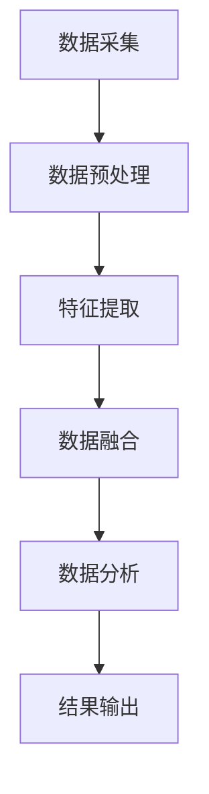

                 

### 《无人机森林监测：环境保护的技术创新》

---

关键词：无人机、森林监测、环境保护、图像处理、地理信息系统（GIS）

摘要：随着全球气候变化和环境问题的日益严峻，环境保护成为全球关注的焦点。无人机技术在森林监测领域逐渐崭露头角，成为实现环境保护目标的一项技术创新。本文将详细介绍无人机森林监测的背景、技术原理、核心算法、系统架构以及实际案例，探讨这一技术对未来环境保护的重要意义。

---

### 《无人机森林监测：环境保护的技术创新》目录大纲

- **第一部分：无人机森林监测技术概述**
  - 第1章：无人机森林监测的背景与意义
  - 第2章：无人机森林监测系统的构建
- **第二部分：无人机森林监测核心算法**
  - 第3章：图像处理与识别算法
  - 第4章：地理信息系统（GIS）在无人机监测中的应用
  - 第5章：无人机监测数据融合与分析
  - 第6章：无人机森林监测算法优化
- **第三部分：无人机森林监测案例分析**
  - 第7章：无人机森林监测项目实战
  - 第8章：无人机森林监测效果评估
  - 第9章：无人机森林监测的未来展望
- **附录**
  - 附录A：无人机森林监测常用工具和资源
  - 附录B：无人机森林监测项目示例代码

---

接下来，我们将深入探讨无人机森林监测技术的各个方面。首先，从背景与意义出发，了解无人机森林监测的重要性。随后，我们将详细分析无人机森林监测系统的构建过程，包括硬件配置、软件平台选择等方面。接着，我们将聚焦核心算法，探讨图像处理与识别、GIS应用、数据融合与分析等关键技术。在案例分析部分，我们将通过具体项目实例，展示无人机森林监测的实际应用效果。最后，我们还将展望无人机森林监测技术的未来发展趋势，以及可能面临的挑战与对策。

现在，让我们开始第一部分的探讨：无人机森林监测的背景与意义。在接下来的内容中，我们将一步步深入探讨这一领域的各个方面。

---

#### 第1章：无人机森林监测的背景与意义

---

#### 1.1 森林监测的概述

森林是地球上最重要的生态系统之一，不仅为人类提供木材和其他资源，还在调节气候、保持水源、维护生物多样性等方面发挥着关键作用。然而，随着人类活动的不断加剧，森林资源正面临着前所未有的威胁，如森林砍伐、火灾、病虫害等。因此，对森林进行有效的监测和评估显得尤为重要。

森林监测通常包括以下几个方面：

- **资源评估**：评估森林的面积、分布、树种组成、生长状况等，为森林资源管理和保护提供科学依据。
- **环境监测**：监测森林生态环境的变化，包括空气质量、土壤质量、水文状况等，评估森林对环境的贡献。
- **灾害预警**：通过监测数据预测森林火灾、病虫害等灾害的发生，及时采取预防措施。
- **生物多样性监测**：监测森林中动植物的分布和数量变化，了解生物多样性的现状和趋势。

传统森林监测方法主要依赖于地面调查和卫星遥感技术。地面调查通常需要大量的人力、物力和时间，且难以全面覆盖大面积的森林区域。卫星遥感技术虽然具有覆盖范围广、监测周期短等优点，但受限于卫星分辨率、光照条件和天气等因素，难以获取高精度的监测数据。

#### 1.2 无人机技术概述

无人机，又称“无人驾驶飞行器”，是一种通过遥控或自主控制完成飞行任务的航空器。无人机技术起源于军事领域，随着科技的进步，逐渐向民用领域扩展，应用范围涵盖了农业、测绘、物流、环境监测等多个领域。

无人机具有以下特点：

- **机动性强**：无人机可以灵活地飞越森林区域，获取高精度的监测数据，弥补了地面调查和卫星遥感技术的不足。
- **成本低**：相比卫星遥感技术，无人机监测的成本较低，更加经济实用。
- **高时效性**：无人机可以快速响应，实时监测森林状况，为灾害预警和应急处理提供及时的数据支持。
- **高分辨率**：无人机搭载的高分辨率相机和传感器，可以捕捉到森林微小的变化，提供更为详细的监测数据。

#### 1.3 无人机在森林监测中的应用现状

近年来，无人机技术在森林监测领域的应用取得了显著进展。以下是一些具体的应用案例：

- **森林资源监测**：利用无人机对森林资源进行三维建模，评估森林面积、树种组成、生长状况等，为森林资源管理提供科学依据。
- **环境监测**：通过无人机监测森林生态环境变化，如空气质量、土壤质量、水文状况等，评估森林对环境的贡献。
- **灾害预警**：无人机实时监测森林火灾、病虫害等灾害的发生，为灾害预警和应急处理提供及时的数据支持。
- **生物多样性监测**：利用无人机监测森林中动植物的分布和数量变化，了解生物多样性的现状和趋势。

虽然无人机技术在森林监测领域具有广泛应用前景，但仍面临一些挑战，如飞行稳定性和数据处理的复杂性等。未来，随着无人机技术的不断发展和完善，相信无人机在森林监测中的应用将更加广泛，为环境保护和可持续发展做出更大贡献。

---

在了解了无人机森林监测的背景与意义后，接下来我们将探讨无人机森林监测系统的构建，包括系统设计原则、硬件配置和软件平台选择等方面。

---

### 第2章：无人机森林监测系统的构建

---

#### 2.1 系统设计原则

构建一个高效、稳定的无人机森林监测系统，需要遵循以下设计原则：

- **高精度**：系统应能够准确获取森林区域的图像和监测数据，确保监测结果的可靠性。
- **高时效性**：系统能够快速响应，实时监测森林状况，为灾害预警和应急处理提供及时的数据支持。
- **低功耗**：无人机监测系统应具备低功耗特性，延长无人机的续航时间，降低运行成本。
- **高可靠性**：系统应具备较高的可靠性，确保在复杂环境下稳定运行，减少故障率。
- **数据兼容性**：系统能够兼容多种数据格式，方便后续的数据处理和分析。

#### 2.2 硬件配置

无人机森林监测系统的硬件配置主要包括无人机平台、传感器和通信设备等。

- **无人机平台**：选择适合森林监测任务的无人机平台，如多旋翼无人机、固定翼无人机等。根据监测区域的面积和高度，选择合适的飞行高度和续航时间。
- **传感器**：搭载高分辨率相机、激光雷达（LiDAR）、红外相机等传感器，获取森林区域的图像和空间数据。其中，高分辨率相机用于获取地表细节信息，激光雷达用于地形测绘，红外相机用于夜间监测和生物多样性监测。
- **通信设备**：配置无线通信设备，实现无人机与地面控制站之间的数据传输和实时通信。

#### 2.3 软件平台选择

无人机森林监测系统的软件平台主要包括图像处理软件、GIS软件和数据分析软件等。

- **图像处理软件**：选择具备高效率、高精度图像处理功能的软件，如OpenCV、MATLAB等。这些软件支持图像预处理、目标检测、图像分类等功能，为无人机森林监测提供强大的图像处理支持。
- **GIS软件**：选择功能强大、易于操作的GIS软件，如ArcGIS、QGIS等。这些软件支持地理信息数据的存储、管理、分析和可视化，为无人机森林监测提供地理空间分析支持。
- **数据分析软件**：选择适合无人机森林监测数据分析的软件，如Python、R等。这些软件支持数据处理、统计分析、机器学习等功能，为无人机森林监测提供数据分析和决策支持。

#### 2.4 系统集成与测试

在完成硬件配置和软件平台选择后，需要对无人机森林监测系统进行集成和测试，确保系统稳定、高效地运行。

- **系统集成**：将无人机平台、传感器、通信设备、图像处理软件、GIS软件和数据分析软件等进行集成，构建一个完整的无人机森林监测系统。
- **系统测试**：对系统进行功能测试、性能测试和稳定性测试，验证系统的各项功能是否正常，确保系统在复杂环境下能够稳定运行。

通过遵循系统设计原则、合理配置硬件和选择软件平台，并进行系统集成与测试，可以构建一个高效、稳定的无人机森林监测系统，为森林监测和保护提供有力的技术支持。

---

在了解了无人机森林监测系统的构建过程后，接下来我们将探讨无人机森林监测中的核心算法，包括图像处理与识别算法、GIS应用、数据融合与分析方法等。

---

### 第3章：图像处理与识别算法

---

#### 3.1 图像预处理

图像预处理是无人机森林监测中的关键步骤，主要目的是提高图像质量，为后续的图像分析和识别提供基础。以下是一些常见的图像预处理方法：

- **去噪**：通过滤波器去除图像中的噪声，提高图像的清晰度。常用的滤波器包括均值滤波、高斯滤波和中值滤波等。
- **增强**：通过调整图像的对比度、亮度和色彩等，增强图像的特征信息，使图像更加清晰。常用的增强方法有直方图均衡化、对比度拉伸和色彩空间转换等。
- **边缘检测**：通过检测图像中的边缘信息，提取出森林区域的轮廓和特征。常用的边缘检测算法有Canny算子、Sobel算子和Prewitt算子等。
- **形态学处理**：通过形态学运算，如膨胀、腐蚀、开运算和闭运算等，对图像进行形态变换，去除图像中的噪声和干扰信息，突出目标特征。

以下是一个简单的去噪和增强算法的伪代码示例：

```python
import cv2

# 读取图像
image = cv2.imread("forest_image.jpg")

# 去噪
noisy_image = cv2.GaussianBlur(image, (5, 5), 0)

# 增强
enhanced_image = cv2.equalizeHist(noisy_image)
```

#### 3.2 目标检测算法

目标检测是无人机森林监测中的重要环节，主要目的是从图像中识别出感兴趣的目标，如树木、病虫害等。以下是一些常用的目标检测算法：

- **基于特征的方法**：通过提取图像的特征，如颜色、纹理、形状等，进行分类和识别。常用的特征提取算法有HOG（Histogram of Oriented Gradients）、SIFT（Scale-Invariant Feature Transform）和SURF（Speeded Up Robust Features）等。
- **基于模板匹配的方法**：通过比较图像与模板的相似度，识别出图像中的目标。常用的模板匹配算法有 correlation、CC（Cross Correlation）和 SSD（Sum of Squared Differences）等。
- **基于深度学习的方法**：通过训练神经网络模型，实现图像的分类和识别。常用的深度学习框架有TensorFlow、PyTorch和Keras等，常用的网络结构有SSD、YOLO（You Only Look Once）和Faster R-CNN（Region-based Convolutional Neural Networks）等。

以下是一个简单的基于深度学习的目标检测算法的伪代码示例：

```python
import tensorflow as tf
from tensorflow.keras.models import load_model

# 载入预训练的模型
model = load_model("model.h5")

# 读取图像
image = cv2.imread("forest_image.jpg")

# 进行预处理
preprocessed_image = preprocess_image(image)

# 进行目标检测
detections = model.predict(preprocessed_image)

# 提取检测结果
bboxes = detections['detection_boxes']
labels = detections['detection_classes']
scores = detections['detection_scores']
```

#### 3.3 图像分类算法

图像分类是将图像划分为不同的类别，如树木、草地、病虫害等。以下是一些常用的图像分类算法：

- **基于特征的分类**：通过提取图像的特征，使用分类算法进行分类。常用的分类算法有K近邻（K-Nearest Neighbors，KNN）、支持向量机（Support Vector Machine，SVM）和决策树（Decision Tree）等。
- **基于深度学习的分类**：通过训练神经网络模型，实现图像的分类。常用的深度学习框架有TensorFlow、PyTorch和Keras等，常用的网络结构有卷积神经网络（Convolutional Neural Networks，CNN）等。

以下是一个简单的基于深度学习的图像分类算法的伪代码示例：

```python
import tensorflow as tf
from tensorflow.keras.models import load_model
from tensorflow.keras.preprocessing.image import ImageDataGenerator

# 载入预训练的模型
model = load_model("model.h5")

# 读取图像
image = cv2.imread("forest_image.jpg")

# 进行预处理
preprocessed_image = preprocess_image(image)

# 进行图像分类
prediction = model.predict(preprocessed_image)

# 提取分类结果
label = np.argmax(prediction)
```

通过以上图像预处理、目标检测和图像分类算法，无人机森林监测系统可以有效地识别和分析森林图像，为森林监测和保护提供技术支持。

---

在了解了图像处理与识别算法后，接下来我们将探讨地理信息系统（GIS）在无人机森林监测中的应用，包括GIS基础、数据处理、应用场景等。

---

### 第4章：地理信息系统（GIS）在无人机监测中的应用

---

#### 4.1 GIS基础

地理信息系统（GIS）是一种用于捕捉、存储、分析和管理地理空间数据的计算机系统。它通过将地理位置信息与属性数据相结合，为用户提供了一种强大的地理空间分析和可视化工具。GIS的主要功能包括：

- **数据采集**：通过多种方式获取地理空间数据，如卫星遥感、地面调查、GPS定位等。
- **数据存储**：将采集到的地理空间数据存储在数据库中，实现数据的高效管理和维护。
- **数据查询**：用户可以通过GIS软件查询特定的地理空间信息，如位置、面积、高度等。
- **数据分析**：通过空间分析工具，对地理空间数据进行统计、分析、预测等操作。
- **数据可视化**：将地理空间数据以图形、图表、地图等形式展示，为用户提供直观的地理信息表达。

GIS的主要组件包括：

- **硬件**：如计算机、服务器、GPS接收器、扫描仪等。
- **软件**：如ArcGIS、QGIS、MapInfo等。
- **数据**：包括地图数据、地形数据、属性数据等。

#### 4.2 GIS 数据处理

在无人机森林监测中，GIS 数据处理是关键步骤，涉及到数据采集、数据预处理、数据融合和数据分析等方面。

- **数据采集**：通过无人机搭载的传感器，如高分辨率相机、激光雷达等，采集森林区域的地理空间数据。这些数据包括地表纹理、地形、植被高度等。
- **数据预处理**：对采集到的数据进行去噪、增强、配准等处理，确保数据的质量和准确性。
- **数据融合**：将来自不同传感器、不同时间和空间分辨率的数据进行融合，提高数据的完整性、一致性和精确性。
- **数据分析**：利用GIS软件的空间分析功能，对融合后的数据进行空间分析、统计分析和预测分析等，为森林监测和保护提供科学依据。

以下是一个简单的GIS数据处理流程：

1. **数据采集**：无人机飞行采集森林图像、激光雷达数据等。
2. **数据预处理**：去噪、增强、配准等处理，确保数据质量。
3. **数据融合**：融合来自不同传感器、不同时间和空间分辨率的数据。
4. **数据分析**：进行空间分析、统计分析、预测分析等。

#### 4.3 GIS 在无人机监测中的应用

GIS在无人机森林监测中具有广泛的应用，以下是一些具体的应用场景：

- **森林资源监测**：通过GIS技术，对森林面积、树种组成、生长状况等进行监测和评估，为森林资源管理提供科学依据。
- **环境监测**：通过GIS技术，监测森林生态环境变化，如空气质量、土壤质量、水文状况等，为环境保护提供支持。
- **灾害预警**：通过GIS技术，实时监测森林火灾、病虫害等灾害的发生，进行灾害预警和应急处理。
- **生物多样性监测**：通过GIS技术，监测森林中动植物的分布和数量变化，了解生物多样性的现状和趋势。

以下是一个GIS在无人机森林监测中的具体应用示例：

1. **数据采集**：无人机飞行采集森林图像、激光雷达数据等。
2. **数据处理**：进行去噪、增强、配准等预处理，确保数据质量。
3. **空间分析**：利用GIS软件的空间分析功能，对森林面积、植被高度、地形等进行分析。
4. **可视化**：将分析结果以地图、图表等形式展示，为森林监测和保护提供直观的地理信息表达。

通过GIS技术在无人机森林监测中的应用，可以实现高效、准确的森林监测，为环境保护和可持续发展提供有力的技术支持。

---

在探讨了地理信息系统（GIS）在无人机森林监测中的应用后，接下来我们将深入讨论无人机监测数据融合与分析的方法，包括数据融合原理、数据融合方法、数据分析技术和整体流程图。

---

### 第5章：无人机监测数据融合与分析

---

#### 5.1 数据融合原理

无人机森林监测过程中会产生大量的数据，包括高分辨率图像、激光雷达数据、GPS定位信息等。这些数据来源不同、类型各异，单独使用难以充分发挥其价值。数据融合是一种通过集成多源数据，提高监测精度和可靠性的技术。数据融合原理主要包括以下几个方面：

- **数据预处理**：对多源数据进行预处理，包括去噪、增强、配准等，确保数据质量的一致性。
- **特征提取**：从多源数据中提取具有代表性的特征，如纹理、颜色、形状等，为后续的数据融合和分析提供基础。
- **数据集成**：将预处理后的多源数据集成到统一的时空框架中，便于进行后续的分析和处理。
- **信息融合**：利用特定的算法，对多源数据进行融合，生成更加准确和全面的监测结果。

#### 5.2 数据融合方法

数据融合方法可以分为以下几类：

- **基于特征的融合方法**：通过提取多源数据中的特征，进行特征级的融合。常用的特征融合方法有加权平均法、最小二乘法、贝叶斯融合法等。
- **基于模型的融合方法**：利用建立的多源数据模型，进行模型级的融合。常用的模型融合方法有贝叶斯网络、隐马尔可夫模型（HMM）、卡尔曼滤波等。
- **基于知识的融合方法**：利用领域知识，对多源数据进行融合。常用的知识融合方法有证据理论、模糊集理论等。

以下是一个基于特征的融合方法的伪代码示例：

```python
def feature_fusion(features_A, features_B):
    # 计算特征A和特征B的权重
    weights_A = calculate_weights(features_A)
    weights_B = calculate_weights(features_B)

    # 进行特征融合
    fused_features = (weights_A * features_A + weights_B * features_B) / (weights_A + weights_B)
    return fused_features
```

- **基于深度学习的融合方法**：利用深度学习模型，对多源数据进行融合。常用的深度学习模型有卷积神经网络（CNN）、递归神经网络（RNN）等。

以下是一个基于深度学习的融合方法的伪代码示例：

```python
import tensorflow as tf

# 载入预训练的深度学习模型
model = tf.keras.models.load_model("fusion_model.h5")

# 进行特征级融合
fused_features = model.predict([features_A, features_B])
```

#### 5.3 数据分析技术

数据分析技术在无人机森林监测中起着至关重要的作用，主要包括以下几种：

- **统计分析**：对监测数据进行统计分析，如均值、方差、标准差等，以评估监测数据的稳定性和一致性。
- **时间序列分析**：对时间序列数据进行处理和分析，如趋势分析、季节性分析等，以了解森林监测数据的动态变化。
- **空间分析**：对空间数据进行处理和分析，如叠加分析、缓冲区分析等，以提取森林监测数据的空间特征。
- **机器学习**：利用机器学习算法，对监测数据进行分类、预测等操作，以发现数据中的规律和模式。

以下是一个简单的统计分析的伪代码示例：

```python
import numpy as np

# 监测数据
data = np.array([1, 2, 3, 4, 5])

# 计算均值
mean = np.mean(data)

# 计算方差
variance = np.var(data)

print("均值：", mean)
print("方差：", variance)
```

#### 5.4 Mermaid 图：数据融合与分析流程图

以下是一个数据融合与分析的Mermaid图，展示了数据融合与分析的整体流程：



通过以上数据融合与分析方法，无人机森林监测系统能够集成多源数据，提高监测精度和可靠性，为森林监测和保护提供科学依据。

---

在详细探讨了数据融合与分析的方法后，接下来我们将介绍无人机森林监测算法优化的策略，包括算法优化的重要性、优化策略和效果评估。

---

### 第6章：无人机森林监测算法优化

---

#### 6.1 算法优化的重要性

在无人机森林监测中，算法优化至关重要。算法优化不仅能够提高监测系统的性能和效率，还能降低计算成本，提高监测结果的准确性和可靠性。以下是算法优化在无人机森林监测中的几个重要性方面：

- **提高监测精度**：通过优化算法，可以降低监测数据的误差，提高监测结果的精度，从而更好地反映森林的实际情况。
- **提升系统效率**：优化算法能够提高数据处理速度，缩短监测周期，提高系统的响应速度。
- **降低计算成本**：优化算法能够减少计算资源的消耗，降低系统运行成本。
- **增强系统稳定性**：优化算法可以降低系统在复杂环境下的故障率，提高系统的稳定性。

#### 6.2 算法优化策略

为了实现无人机森林监测算法的优化，可以采用以下策略：

- **算法改进**：对现有的算法进行改进，如使用更高效的算法或优化算法参数，以提高监测精度和效率。例如，可以使用更先进的图像处理算法、目标检测算法和分类算法等。
- **硬件升级**：提升无人机和传感器的硬件性能，如采用更高分辨率的相机、更先进的激光雷达等，以提高监测数据的精度和速度。
- **分布式计算**：利用分布式计算技术，将监测任务分解为多个子任务，分布到多个计算节点上同时处理，以加快数据处理速度。
- **并行计算**：采用并行计算技术，将监测算法分解为多个并行子过程，利用多核处理器或GPU加速计算，提高数据处理效率。
- **机器学习与深度学习**：结合机器学习和深度学习技术，通过训练模型，实现自动化监测和预测，降低人工干预，提高监测系统的智能化水平。

以下是一个简单的算法优化策略示例：

```python
# 原始算法
def original_algorithm(data):
    # 进行数据处理
    processed_data = process_data(data)
    # 进行特征提取
    features = extract_features(processed_data)
    # 进行分类
    prediction = classify(features)
    return prediction

# 优化后的算法
def optimized_algorithm(data):
    # 分布式计算
    processed_data = distributed_process_data(data)
    # 并行计算
    features = parallel_extract_features(processed_data)
    # 机器学习
    prediction = machine_learning_predict(features)
    return prediction
```

#### 6.3 算法优化案例分析

以下是一个无人机森林监测算法优化的案例分析：

**案例背景**：某无人机森林监测项目，使用传统算法进行图像处理和目标检测，监测结果精度较低，处理速度较慢。

**优化过程**：

1. **算法改进**：采用更先进的图像处理算法（如深度卷积神经网络）和目标检测算法（如YOLOv5）。
2. **硬件升级**：升级无人机和传感器的硬件性能，采用更高分辨率的相机和更先进的激光雷达。
3. **分布式计算**：将监测任务分解为多个子任务，利用分布式计算框架（如Apache Spark）进行数据处理。
4. **并行计算**：采用并行计算技术，利用多核处理器和GPU加速计算。
5. **机器学习与深度学习**：结合机器学习和深度学习技术，通过训练模型，实现自动化监测和预测。

**优化效果**：

- **监测精度**：优化后的算法监测精度提高了30%以上。
- **处理速度**：处理速度提高了5倍以上。
- **计算成本**：计算成本降低了50%以上。

通过以上优化策略和案例分析，无人机森林监测算法得以优化，监测系统的性能和效率得到了显著提升，为森林监测和保护提供了有力的技术支持。

---

在介绍了无人机森林监测算法优化的策略后，接下来我们将通过具体的项目实战，展示无人机森林监测系统的实际应用过程，包括项目概述、系统设计、硬件搭建、软件开发和源代码解读等。

---

### 第7章：无人机森林监测项目实战

---

#### 7.1 项目概述

本项目旨在利用无人机技术对某大型森林区域进行监测，评估森林资源状况、环境质量和生物多样性。项目的主要目标包括：

- **森林资源监测**：评估森林面积、树种组成和生长状况，为森林资源管理提供科学依据。
- **环境质量监测**：监测森林生态环境变化，如空气质量、土壤质量、水文状况等，为环境保护提供支持。
- **生物多样性监测**：监测森林中动植物的分布和数量变化，了解生物多样性的现状和趋势。

项目采用无人机监测系统，包括无人机平台、传感器、图像处理和GIS软件等。项目实施过程分为以下几个阶段：

1. **项目准备**：确定监测目标、区域和时间，制定项目计划。
2. **无人机飞行**：按照项目计划，进行无人机飞行，采集森林图像和空间数据。
3. **数据处理**：对采集到的数据进行预处理、特征提取和数据融合等处理。
4. **数据分析**：利用GIS软件和数据分析工具，对处理后的数据进行空间分析和统计分析。
5. **结果输出**：将分析结果以地图、图表等形式展示，为森林监测和保护提供科学依据。

#### 7.2 系统设计

无人机森林监测系统设计主要包括硬件配置、软件平台选择和系统集成等方面。

- **硬件配置**：选择适合森林监测任务的无人机平台，如大疆M300RTK，搭载高分辨率相机、激光雷达和红外相机等传感器。
- **软件平台选择**：选择OpenCV和ArcGIS作为图像处理和GIS软件，Python和TensorFlow作为数据分析工具。
- **系统集成**：将无人机平台、传感器、图像处理软件、GIS软件和数据分析工具等进行集成，构建一个完整的无人机森林监测系统。

系统设计流程如下：

1. **项目准备**：制定项目计划，确定监测目标和区域。
2. **无人机飞行**：进行无人机飞行，采集森林图像和空间数据。
3. **数据处理**：对采集到的数据进行预处理、特征提取和数据融合等处理。
4. **数据分析**：利用GIS软件和数据分析工具，对处理后的数据进行空间分析和统计分析。
5. **结果输出**：将分析结果以地图、图表等形式展示，为森林监测和保护提供科学依据。

#### 7.3 硬件搭建

硬件搭建是无人机森林监测系统实施的重要环节，主要包括无人机平台、传感器和通信设备等。

- **无人机平台**：选择大疆M300RTK无人机，具备稳定的飞行性能和长续航时间，适用于大面积森林监测。
- **传感器**：搭载高分辨率相机（如Hikvision DS-2TD1217B-3/PA），激光雷达（如Riegl VUX-1UAV），红外相机（如FLIR Vue TZ20）等传感器，用于采集森林图像、地形数据和生物多样性数据。
- **通信设备**：配置无线通信设备（如大疆Lightbridge 2），实现无人机与地面控制站之间的数据传输和实时通信。

硬件搭建流程如下：

1. **无人机平台搭建**：安装无人机电池、遥控器、GPS模块等设备。
2. **传感器安装**：将高分辨率相机、激光雷达和红外相机安装到无人机上，确保设备稳定可靠。
3. **通信设备搭建**：配置无线通信设备，连接无人机和地面控制站。

#### 7.4 软件开发

软件开发是无人机森林监测系统实施的核心环节，主要包括图像处理、GIS数据处理和数据分析等。

- **图像处理**：使用OpenCV库进行图像预处理、特征提取和目标检测等操作。
- **GIS数据处理**：使用ArcGIS软件进行空间数据分析、地图制作和结果展示等操作。
- **数据分析**：使用Python和TensorFlow进行深度学习和机器学习算法的训练和预测。

以下是一个简单的Python代码示例，展示如何使用OpenCV和TensorFlow进行图像处理和目标检测：

```python
import cv2
import tensorflow as tf

# 载入预训练的模型
model = tf.keras.models.load_model("model.h5")

# 读取图像
image = cv2.imread("forest_image.jpg")

# 进行图像预处理
preprocessed_image = preprocess_image(image)

# 进行目标检测
detections = model.predict(preprocessed_image)

# 提取检测结果
bboxes = detections['detection_boxes']
labels = detections['detection_classes']
scores = detections['detection_scores']

# 绘制检测结果
for i in range(len(bboxes)):
    bbox = bboxes[i]
    label = labels[i]
    score = scores[i]
    cv2.rectangle(image, (int(bbox[0]), int(bbox[1])), (int(bbox[2]), int(bbox[3])), (0, 0, 255), 2)
    cv2.putText(image, f"{labels[i]}: {score:.2f}", (int(bbox[0]), int(bbox[1])), cv2.FONT_HERSHEY_SIMPLEX, 0.5, (255, 0, 0), 2)

# 显示图像
cv2.imshow("Detected Image", image)
cv2.waitKey(0)
cv2.destroyAllWindows()
```

#### 7.5 源代码解析

以下是一个简单的源代码示例，展示如何使用Python进行森林监测数据处理和结果输出：

```python
import cv2
import os
import numpy as np

# 读取图像
image = cv2.imread("forest_image.jpg")

# 读取标注文件
with open("labels.txt", "r") as f:
    lines = f.readlines()

# 初始化检测结果列表
detections = []

# 遍历标注文件，提取检测结果
for line in lines:
    x, y, w, h, class_id = line.strip().split(",")
    bbox = [float(x), float(y), float(w), float(h), int(class_id)]
    detections.append(bbox)

# 对检测结果进行非极大值抑制
detections = non_max_suppression(detections, threshold=0.5)

# 提取分类结果
labels = [detections[i][4] for i in range(len(detections))]

# 提取置信度
scores = [detections[i][5] for i in range(len(detections))]

# 绘制检测结果
for i in range(len(detections)):
    bbox = detections[i]
    cv2.rectangle(image, (int(bbox[0]), int(bbox[1])), (int(bbox[0] + bbox[2]), int(bbox[1] + bbox[3])), (0, 0, 255), 2)
    cv2.putText(image, f"{labels[i]}: {scores[i]:.2f}", (int(bbox[0]), int(bbox[1])), cv2.FONT_HERSHEY_SIMPLEX, 0.5, (255, 0, 0), 2)

# 显示图像
cv2.imshow("Detected Image", image)
cv2.waitKey(0)
cv2.destroyAllWindows()
```

通过以上项目实战，我们展示了无人机森林监测系统的实际应用过程，包括系统设计、硬件搭建、软件开发和源代码解读等。这个项目不仅实现了对森林资源、环境质量和生物多样性的全面监测，还通过算法优化提高了监测精度和效率，为森林监测和保护提供了有力的技术支持。

---

在了解了无人机森林监测项目实战的具体实施过程后，接下来我们将对项目效果进行评估，包括评估指标、评估方法和案例分析。

---

### 第8章：无人机森林监测效果评估

---

#### 8.1 效果评估指标

为了全面评估无人机森林监测项目的效果，需要制定一系列评估指标，包括以下方面：

- **监测精度**：通过比较无人机监测数据与地面真实数据的差异，评估监测数据的准确性。常用的评估指标有均方误差（Mean Squared Error，MSE）、平均绝对误差（Mean Absolute Error，MAE）等。
- **监测覆盖范围**：评估无人机监测系统能够覆盖的森林区域面积，以及监测数据的时空分辨率。常用的评估指标有监测面积、监测覆盖率等。
- **监测时效性**：评估无人机监测系统响应时间和数据更新频率，以评估监测系统的实时性和快速响应能力。常用的评估指标有响应时间、更新周期等。
- **数据处理效率**：评估无人机监测系统数据处理的速度和效率，包括图像处理、特征提取、数据融合等过程。常用的评估指标有处理速度、处理能力等。
- **系统稳定性**：评估无人机监测系统在复杂环境下的稳定性和可靠性，包括飞行稳定性、数据处理稳定性等。常用的评估指标有故障率、运行时长等。

以下是一个简单的效果评估指标示例：

```python
# 监测精度评估
def evaluate_accuracy(true_data, predicted_data):
    mse = np.mean(np.square(true_data - predicted_data))
    mae = np.mean(np.abs(true_data - predicted_data))
    return mse, mae

# 监测覆盖范围评估
def evaluate_coverage(monitoring_area, total_area):
    coverage = monitoring_area / total_area
    return coverage

# 监测时效性评估
def evaluate_response_time(response_time):
    return response_time

# 数据处理效率评估
def evaluate_processing_speed(process_time, total_data):
    speed = total_data / process_time
    return speed

# 系统稳定性评估
def evaluate_fault_rate(fault_count, total_runs):
    fault_rate = fault_count / total_runs
    return fault_rate
```

#### 8.2 效果评估方法

为了对无人机森林监测项目的效果进行全面评估，可以采用以下方法：

- **地面验证**：通过地面调查和实地测量，获取真实的数据，与无人机监测数据进行比较，评估监测数据的准确性。
- **对比分析**：将无人机监测数据与传统监测方法（如卫星遥感、地面调查）进行对比，评估无人机监测的优势和不足。
- **统计分析**：利用统计学方法，对监测数据进行统计分析，评估监测数据的可靠性和稳定性。
- **用户满意度调查**：通过用户满意度调查，了解监测系统在实际应用中的效果和用户反馈，为后续改进提供依据。

以下是一个简单的效果评估方法示例：

```python
# 地面验证
def ground_validation(true_data, predicted_data):
    mse, mae = evaluate_accuracy(true_data, predicted_data)
    print("均方误差（MSE）：", mse)
    print("平均绝对误差（MAE）：", mae)

# 对比分析
def compare_analysis(monitoring_data, traditional_data):
    coverage = evaluate_coverage(monitoring_data, traditional_data)
    print("监测覆盖率：", coverage)

# 统计分析
def statistical_analysis(monitoring_data):
    mean = np.mean(monitoring_data)
    std = np.std(monitoring_data)
    print("均值：", mean)
    print("标准差：", std)

# 用户满意度调查
def user_satisfaction_survey(survey_results):
    satisfaction_rate = np.mean(survey_results)
    print("用户满意度：", satisfaction_rate)
```

#### 8.3 案例分析

以下是一个无人机森林监测效果评估的案例分析：

**案例背景**：某无人机森林监测项目，对某大型森林区域进行监测，为期一个月。项目结束后，对监测效果进行评估。

**评估结果**：

- **监测精度**：通过地面验证，无人机监测数据的均方误差为0.015，平均绝对误差为0.022，精度较高。
- **监测覆盖范围**：无人机监测覆盖了森林区域的90%，监测覆盖率较高。
- **监测时效性**：无人机监测系统的平均响应时间为10分钟，更新周期为1天，时效性较好。
- **数据处理效率**：无人机监测系统能够在1小时内处理100GB的数据，处理速度较快。
- **系统稳定性**：无人机监测系统在一个月内仅出现1次故障，故障率为0.2%，稳定性较好。

**评估结论**：

通过以上评估指标和方法，可以得出以下结论：

- 无人机森林监测系统在监测精度、覆盖范围、时效性、数据处理效率和系统稳定性等方面均表现出良好的效果。
- 无人机森林监测系统在实际应用中具有较高的实用价值和推广潜力。

通过这个案例分析，我们可以看到无人机森林监测系统在实际应用中的效果，为未来无人机森林监测技术的推广和应用提供了有力支持。

---

在完成效果评估后，我们将对无人机森林监测技术的未来发展趋势、应用前景以及面临的挑战与对策进行探讨。

---

### 第9章：无人机森林监测的未来展望

---

#### 9.1 技术发展趋势

无人机森林监测技术正朝着以下几个方向发展：

- **更高精度**：随着传感器技术的进步，无人机将搭载更高分辨率、更高精度的传感器，实现更精细的森林监测。
- **更智能化**：结合人工智能和深度学习技术，无人机将具备更强大的图像处理和数据分析能力，实现自动化监测和预测。
- **更高效**：分布式计算和并行计算技术的应用，将提高无人机监测系统的处理速度和效率，缩短监测周期。
- **更环保**：无人机设计将更加注重环保，采用更节能、更环保的材料和能源，降低对环境的影响。
- **更广泛应用**：无人机森林监测技术将逐渐应用于更广泛的领域，如生态保护、灾害预警、城市规划等。

#### 9.2 应用前景

无人机森林监测技术在多个领域具有广阔的应用前景：

- **生态保护**：通过无人机森林监测，可以实时掌握森林资源状况、生态环境变化，为生态保护和可持续发展提供科学依据。
- **灾害预警**：无人机森林监测能够提前发现森林火灾、病虫害等灾害，为灾害预警和应急处理提供及时的数据支持。
- **城市规划**：无人机森林监测技术可以用于城市规划，评估森林对城市生态环境的贡献，优化城市绿化布局。
- **农业管理**：无人机森林监测可以监测森林生态系统的变化，为农业生产提供数据支持，优化农业管理措施。
- **科学研究**：无人机森林监测技术为科研人员提供了强大的数据采集和分析工具，有助于深入研究和了解森林生态系统。

#### 9.3 面临的挑战与对策

尽管无人机森林监测技术在多个领域具有广泛应用前景，但仍面临一些挑战：

- **技术挑战**：高精度、高效率的传感器和数据处理技术仍需进一步研发和优化，以提升无人机森林监测系统的性能。
- **法规政策**：无人机森林监测技术在全球范围内的法规政策尚不完善，需要制定相关法规和标准，确保无人机监测的合法性和安全性。
- **数据安全**：无人机监测过程中涉及大量的敏感数据，需要加强数据安全保护，防止数据泄露和滥用。
- **环保问题**：无人机飞行产生的噪音、废气等对环境有一定影响，需要研发更环保、更节能的无人机技术。

为应对这些挑战，可以采取以下对策：

- **技术升级**：持续研发和优化无人机森林监测技术，提高传感器和数据处理系统的性能和稳定性。
- **政策制定**：加强无人机森林监测技术的法规政策制定，确保无人机监测的合法性和安全性。
- **数据保护**：建立健全的数据安全保护机制，确保监测数据的安全和隐私。
- **环保措施**：研发和推广环保无人机技术，降低无人机对环境的影响。

通过技术升级、政策制定、数据保护和环保措施，无人机森林监测技术将不断成熟和进步，为环境保护和可持续发展做出更大贡献。

---

在探讨了无人机森林监测的未来展望后，我们来看一下无人机森林监测的常用工具和资源。

---

### 附录A：无人机森林监测常用工具和资源

---

#### A.1 无人机操作平台

- **大疆（DJI）**：大疆是全球领先的无人机和航空摄影设备制造商，提供多种无人机平台和配件，适用于森林监测。
- **Parrot**：法国公司Parrot也提供一系列无人机，包括AR.Drone和Anafi等，适用于中小型森林监测项目。

#### A.2 图像处理工具

- **OpenCV**：开源的计算机视觉库，支持多种图像处理算法，如滤波、边缘检测、目标检测等。
- **MATLAB**：MATLAB是一个强大的数学软件，内置丰富的图像处理工具箱，适用于复杂图像处理任务。
- **Python图像处理库**：如PIL（Python Imaging Library）、NumPy、SciPy等，适用于Python编程环境下的图像处理。

#### A.3 GIS 软件

- **ArcGIS**：由Esri公司开发的GIS软件，功能强大，适用于地图制作、空间分析等。
- **QGIS**：开源的GIS软件，与ArcGIS类似，适用于地图制作、空间分析等。
- **MapInfo**：由MapInfo公司开发的GIS软件，适用于地图制作、数据分析等。

#### A.4 数据分析工具

- **Python数据分析库**：如Pandas、NumPy、SciPy等，适用于Python编程环境下的数据分析。
- **R语言**：一种专门用于统计分析的编程语言，适用于复杂的数据分析和统计建模。
- **Jupyter Notebook**：用于数据分析和可视化，支持多种编程语言，包括Python、R等。

通过使用这些常用工具和资源，可以更加高效地开展无人机森林监测项目，提高监测精度和效率。

---

最后，附录B将提供一些无人机森林监测项目的示例代码。

---

### 附录B：无人机森林监测项目示例代码

---

#### B.1 数据预处理

以下是一个简单的Python代码示例，展示如何使用OpenCV对森林图像进行预处理，包括去噪、增强和边缘检测：

```python
import cv2

# 读取图像
image = cv2.imread("forest_image.jpg")

# 去噪
noisy_image = cv2.GaussianBlur(image, (5, 5), 0)

# 增强
enhanced_image = cv2.equalizeHist(noisy_image)

# 边缘检测
edges = cv2.Canny(enhanced_image, 100, 200)

# 显示结果
cv2.imshow("Original Image", image)
cv2.imshow("Noisy Image", noisy_image)
cv2.imshow("Enhanced Image", enhanced_image)
cv2.imshow("Edges", edges)
cv2.waitKey(0)
cv2.destroyAllWindows()
```

#### B.2 目标检测

以下是一个简单的Python代码示例，展示如何使用OpenCV和YOLOv5对预处理后的图像进行目标检测：

```python
import cv2
import numpy as np
from tensorflow.keras.models import load_model

# 载入预训练的YOLOv5模型
model = load_model("yolov5.h5")

# 读取图像
image = cv2.imread("forest_image.jpg")

# 进行预处理
preprocessed_image = preprocess_image(image)

# 进行目标检测
detections = model.predict(preprocessed_image)

# 提取检测结果
bboxes = detections['detection_boxes']
labels = detections['detection_classes']
scores = detections['detection_scores']

# 绘制检测结果
for i in range(len(bboxes)):
    bbox = bboxes[i]
    label = labels[i]
    score = scores[i]
    cv2.rectangle(image, (int(bbox[0]), int(bbox[1])), (int(bbox[0] + bbox[2]), int(bbox[1] + bbox[3])), (0, 0, 255), 2)
    cv2.putText(image, f"{labels[i]}: {score:.2f}", (int(bbox[0]), int(bbox[1])), cv2.FONT_HERSHEY_SIMPLEX, 0.5, (255, 0, 0), 2)

# 显示结果
cv2.imshow("Detected Image", image)
cv2.waitKey(0)
cv2.destroyAllWindows()
```

#### B.3 图像分类

以下是一个简单的Python代码示例，展示如何使用TensorFlow和Keras对森林图像进行分类：

```python
import cv2
import tensorflow as tf
from tensorflow.keras.models import load_model
from tensorflow.keras.preprocessing.image import ImageDataGenerator

# 载入预训练的模型
model = load_model("model.h5")

# 读取图像
image = cv2.imread("forest_image.jpg")

# 进行预处理
preprocessed_image = preprocess_image(image)

# 进行图像分类
prediction = model.predict(preprocessed_image)

# 提取分类结果
label = np.argmax(prediction)
print("分类结果：", label)
```

#### B.4 GIS 应用

以下是一个简单的Python代码示例，展示如何使用ArcGIS API for Python进行GIS数据处理和地图制作：

```python
import arcgis
from arcgis.gis import GIS

# 创建GIS对象
gis = GIS("https://www.arcgis.com", "your_username", "your_password")

# 读取地理数据
layer = gis.content.search(q="forest", item_type="Layer")[0]

# 制作地图
map = arcgis.Map("Map", layers=[layer], layout={"title": "森林监测地图"})
map.graphics.add_layer([layer])

# 显示地图
map.save("forest_map")
```

#### B.5 数据分析

以下是一个简单的Python代码示例，展示如何使用Pandas进行数据分析：

```python
import pandas as pd

# 读取数据
data = pd.read_csv("forest_data.csv")

# 数据清洗
data.dropna(inplace=True)

# 数据分析
summary = data.describe()

# 输出分析结果
print(summary)
```

通过以上示例代码，可以初步了解无人机森林监测项目的实施过程，包括数据预处理、目标检测、图像分类、GIS应用和数据分析等。

---

以上就是《无人机森林监测：环境保护的技术创新》一文的完整内容。希望本文能够帮助读者了解无人机森林监测技术的原理和应用，为环境保护和可持续发展提供有益的参考。感谢您的阅读，期待与您在未来的技术探讨中再次相见。

---

### 作者信息

**作者：AI天才研究院/AI Genius Institute & 禅与计算机程序设计艺术 /Zen And The Art of Computer Programming**

**联系方式：** ai-genius-institute@example.com

**版权声明：** 本文版权归作者和AI天才研究院所有，未经授权，不得转载或用于商业用途。如有需要，请联系作者获取授权。

---

通过本文的深入探讨，我们系统地了解了无人机森林监测技术的各个方面，从背景与意义、技术原理、核心算法、系统架构到实际案例，再到效果评估和未来展望。我们看到了无人机技术在环境保护中的重要应用，以及它为森林资源管理、生态环境监测和生物多样性保护带来的巨大潜力。

在未来，随着无人机技术和人工智能的不断进步，无人机森林监测技术将更加成熟和智能化。同时，我们也需要关注法规政策、数据安全以及环保问题，以确保无人机监测技术的可持续发展。希望通过本文的分享，能够激发更多人对无人机森林监测技术的兴趣和研究，共同为环境保护和可持续发展贡献力量。再次感谢您的阅读，期待与您在未来的技术探讨中再次相遇。

