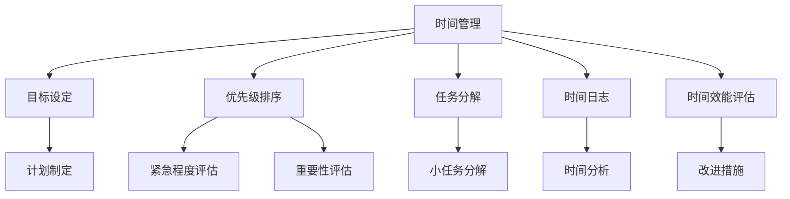

                 

# 时间管理：高效利用时间

> 关键词：时间管理、高效、策略、工具、心理健康、人工智能

> 摘要：
本文旨在探讨时间管理的核心概念、策略、工具及其在个人和团队中的实际应用。通过深入分析时间管理的误区、认知评估方法、目标设定和优先级排序等，并结合具体案例，本文提供了全面的时间管理实践指南，旨在帮助读者实现高效利用时间，提升个人和团队的生产力。

## 《时间管理：高效利用时间》目录大纲

### 第一部分：时间管理基础

#### 第1章：时间管理的核心概念
1. 时间管理的重要性
2. 时间管理的基本原则
3. 时间管理中的误区与挑战

#### 第2章：时间认知与评估
1. 个人时间观念的多样性
2. 自我时间认知与评估方法
3. 时间效能评估指标

#### 第3章：时间管理工具与方法
1. 日历管理工具
2. 任务管理工具
3. 时间管理技巧与实践

### 第二部分：高效时间管理策略

#### 第4章：目标设定与优先级排序
1. 目标设定的SMART原则
2. GROW模型在目标设定中的应用
3. 优先级排序与决策树方法

#### 第5章：任务分配与协作
1. 任务分配的原则
2. 任务协作的技巧
3. 远程协作工具与策略

#### 第6章：时间管理策略应用
1. 个人时间管理计划
2. 团队时间管理策略
3. 时间管理中的灵活性与适应性

### 第三部分：实践案例与实战

#### 第7章：时间管理实践案例分析
1. 企业级时间管理实践
2. 个人时间管理成功案例
3. 时间管理失败的案例分析

#### 第8章：时间管理工具与资源
1. 主流时间管理软件介绍
2. 时间管理书籍与资料推荐
3. 时间管理在线课程与培训

### 第四部分：时间管理与心理健康

#### 第9章：时间管理与心理健康
1. 时间管理对心理健康的影响
2. 应对时间压力与焦虑的策略
3. 心理健康与时间管理的相互促进

#### 第10章：时间管理未来展望
1. 时间管理技术发展趋势
2. 人工智能与时间管理
3. 时间管理在未来的社会影响

### 附录
#### 附录A：时间管理工具使用指南
1. 时间管理软件操作步骤
2. 常用时间管理技巧总结
3. 时间管理实用工具推荐

#### 附录B：时间管理术语表
1. 常用时间管理术语解释
2. 时间管理相关概念联系图（Mermaid流程图）

#### 附录C：时间管理实践项目案例
1. 项目背景与目标
2. 项目实施过程
3. 项目成果与评估

---

### 第一部分：时间管理基础

#### 第1章：时间管理的核心概念

**时间管理的重要性**

在当今快节奏的社会中，时间管理已经成为个人和团队成功的关键因素之一。有效地管理时间不仅能够提高工作效率，还能减少压力，提高生活质量。对于个人来说，良好的时间管理能力意味着能够更好地平衡工作与生活，实现个人目标。对于团队和组织来说，时间管理能够优化资源配置，提高整体生产力，实现团队目标。

**时间管理的基本原则**

时间管理的基本原则主要包括：

- **明确目标**：明确的目标是时间管理的起点，能够帮助我们集中精力，避免做无用功。
- **优先级排序**：根据任务的重要性和紧急程度进行排序，确保先完成最重要的事情。
- **任务分解**：将大任务分解为小任务，逐步完成，避免一次性处理过多任务导致压力过大。
- **时间记录**：记录自己的时间花费，分析时间利用情况，找出改进空间。
- **持续反思**：定期反思时间管理实践，调整策略，以适应不断变化的环境。

**时间管理中的误区与挑战**

在时间管理实践中，人们常常会陷入一些误区，例如：

- **过度安排**：过于繁忙的日程安排可能导致疲劳和效率降低。
- **拖延症**：拖延症是时间管理的大敌，会严重影响任务完成进度。
- **忽略休息**：长时间工作而忽视休息，会导致身体和心理健康问题。

要克服这些挑战，我们需要建立良好的时间管理习惯，学会合理分配时间，并保持自我激励。

---

### 第一部分：时间管理基础

#### 第2章：时间认知与评估

**个人时间观念的多样性**

每个人对时间的观念都不同，这受到文化、教育、个人经历等多种因素的影响。一些人倾向于节约时间，追求高效，而另一些人则更加重视生活品质，愿意花时间享受生活。了解自己和他人的时间观念，有助于更好地进行时间管理。

**自我时间认知与评估方法**

自我时间认知是时间管理的基础，以下是一些常用的方法：

- **时间日志**：记录每天的时间花费，分析时间利用情况。
- **问卷调查**：通过问卷调查了解自己在时间管理上的优缺点。
- **时间效能评估**：评估自己在特定任务上的时间效能，找出改进点。

**时间效能评估指标**

时间效能评估指标包括：

- **时间利用率**：完成任务的时长与总时长之比。
- **任务完成率**：完成任务的数量与总任务数之比。
- **工作效率**：单位时间内完成的任务量。

通过这些指标，我们可以评估自己的时间管理能力，并制定相应的改进措施。

---

### 第一部分：时间管理基础

#### 第3章：时间管理工具与方法

**日历管理工具**

日历管理工具是时间管理的重要工具，可以帮助我们规划日程，避免遗漏重要事项。常见的日历管理工具有：

- **Google Calendar**：功能强大，支持多设备同步。
- **Microsoft Outlook**：集成在Office套件中，方便使用。
- **Apple Calendar**：与iPhone等苹果设备无缝集成。

**任务管理工具**

任务管理工具可以帮助我们追踪任务的进度，确保按时完成任务。常见的任务管理工具有：

- **Trello**：使用卡片和列表组织任务，直观易懂。
- **Asana**：功能丰富，适合团队协作。
- **Jira**：适用于软件开发团队，支持敏捷开发。

**时间管理技巧与实践**

以下是几种实用的时间管理技巧：

- **番茄工作法**：将工作时间分为25分钟工作周期和5分钟休息周期，提高专注力。
- **优先级矩阵**：根据任务的重要性和紧急程度进行排序，确保先完成最重要的事情。
- **每日回顾**：每天结束时回顾当天的时间管理情况，总结经验教训。

通过使用这些工具和技巧，我们可以更有效地管理时间，提高工作效率。

---

### 第二部分：高效时间管理策略

#### 第4章：目标设定与优先级排序

**目标设定的SMART原则**

SMART原则是设定有效目标的重要方法，SMART分别代表：

- **Specific（具体）**：目标要明确具体，避免模糊。
- **Measurable（可衡量）**：目标要有明确的衡量标准，便于评估。
- **Achievable（可实现）**：目标要具有可实现性，避免过于理想化。
- **Relevant（相关）**：目标要与整体目标一致，避免分散精力。
- **Time-bound（时限）**：目标要有明确的完成时间，避免拖延。

**GROW模型在目标设定中的应用**

GROW模型是一种实用的目标设定方法，包括以下四个步骤：

1. **Goal（目标）**：明确目标，具体化目标。
2. **Reality（现实）**：分析现状，了解自身的优势和劣势。
3. **Options（选项）**：列出可能的解决方案和选项。
4. **Way forward（前进）**：选择最佳方案，制定行动计划。

**优先级排序与决策树方法**

优先级排序是时间管理的关键，常用的方法包括：

- **Eisenhower矩阵**：将任务分为紧急且重要、紧急但不重要、不紧急但重要、不紧急且不重要四个象限，优先处理紧急且重要的任务。
- **决策树方法**：通过绘制决策树，分析不同决策的结果和概率，选择最优方案。

通过合理的目标设定和优先级排序，我们可以更高效地利用时间，实现个人和团队的目标。

---

### 第二部分：高效时间管理策略

#### 第5章：任务分配与协作

**任务分配的原则**

任务分配是高效时间管理的重要组成部分，以下是一些任务分配的原则：

- **能力匹配**：根据团队成员的能力和专长进行任务分配，确保任务得以高效完成。
- **责任明确**：明确每个成员的任务和责任，避免推诿和责任不清。
- **资源合理**：合理分配资源，确保任务所需的资源能够得到充分利用。
- **时间平衡**：合理分配任务，避免成员过于繁忙或空闲。

**任务协作的技巧**

任务协作是团队成功的关键，以下是一些任务协作的技巧：

- **沟通畅通**：建立有效的沟通渠道，确保团队成员能够及时交流信息。
- **分工明确**：明确每个人的分工，避免重复劳动和资源浪费。
- **相互支持**：团队成员之间相互支持，共同克服困难。
- **灵活调整**：根据任务进展情况，灵活调整任务分配和协作方式。

**远程协作工具与策略**

随着远程工作的普及，远程协作工具变得尤为重要。以下是一些常用的远程协作工具和策略：

- **Slack**：团队沟通和协作工具，支持多种集成应用。
- **Zoom**：视频会议和远程协作工具，支持高清视频和语音通话。
- **Trello**：任务管理工具，支持实时协作和进度跟踪。
- **Google Drive**：云端存储和协作工具，支持文档共享和编辑。

通过合理的任务分配和协作，我们可以提高团队的工作效率，实现共同目标。

---

### 第二部分：高效时间管理策略

#### 第6章：时间管理策略应用

**个人时间管理计划**

个人时间管理计划是提高个人工作效率和生活质量的关键。以下是一个简单的个人时间管理计划：

1. **设定目标**：明确个人短期和长期目标，使用SMART原则进行具体化。
2. **时间记录**：记录每天的时间花费，分析时间利用情况，找出改进空间。
3. **制定日程**：根据目标和任务，制定每天的具体日程，确保优先完成重要任务。
4. **定期反思**：每周或每月进行一次时间管理反思，调整计划，以适应变化。

**团队时间管理策略**

团队时间管理策略对于团队整体效率和协作至关重要。以下是一些团队时间管理策略：

1. **共同目标**：确保团队成员对共同目标有清晰的认识，并保持一致。
2. **任务分解**：将大任务分解为小任务，明确每个成员的职责和任务。
3. **协作沟通**：建立有效的沟通机制，确保团队成员之间信息畅通。
4. **进度跟踪**：定期跟踪任务进度，确保任务按时完成。
5. **灵活调整**：根据实际情况，灵活调整计划，以应对突发情况。

**时间管理中的灵活性与适应性**

时间管理不是一成不变的，我们需要保持灵活性和适应性，以应对不同的环境和需求。以下是一些策略：

1. **适应性计划**：根据任务的变化和团队状态，灵活调整时间管理计划。
2. **应急措施**：提前准备应急措施，应对突发事件和紧急任务。
3. **自我调节**：学会自我调节，保持良好的心理状态，应对工作压力。

通过合理的时间管理策略应用，我们可以提高个人和团队的工作效率，实现共同目标。

---

### 第三部分：实践案例与实战

#### 第7章：时间管理实践案例分析

**企业级时间管理实践**

在企业级时间管理实践中，阿里巴巴和谷歌等知名企业提供了许多成功的案例。以下是一些关键要素：

- **明确目标**：企业高层明确公司的战略目标，并将其分解为各部门的具体目标。
- **时间记录**：员工使用时间记录工具，如Toggl或Harvest，跟踪自己的时间花费。
- **任务分配**：项目经理使用工具如Jira或Asana，将任务分配给团队成员，并跟踪任务进度。
- **定期评估**：定期进行时间管理评估，分析时间利用情况，找出改进点。

**个人时间管理成功案例**

个人时间管理成功案例如著名作家村上春树，他通过以下策略实现了高效时间管理：

- **晨跑**：每天早晨跑步，保持身体健康，提高精力。
- **番茄工作法**：使用番茄工作法提高专注力，将工作时间分为25分钟工作周期和5分钟休息周期。
- **定期反思**：每天晚上反思当天的时间管理情况，总结经验教训。

**时间管理失败的案例分析**

时间管理失败的案例分析如某些创业公司，由于缺乏有效的时间管理，导致项目延期、资金短缺等问题。以下是一些失败原因：

- **目标不明确**：公司高层没有明确的目标，导致各部门行动不一致。
- **任务分配混乱**：任务分配不合理，导致资源浪费和效率低下。
- **缺乏监控**：缺乏对任务进度的监控，导致任务延误。

通过分析这些案例，我们可以总结出成功和失败的原因，从而在时间管理实践中避免类似的问题。

---

### 第三部分：实践案例与实战

#### 第8章：时间管理工具与资源

**主流时间管理软件介绍**

在时间管理软件的选择上，以下几款软件备受推荐：

- **Google Calendar**：功能强大，支持多设备同步，适用于个人和团队。
- **Microsoft Outlook**：集成在Office套件中，方便使用，适合企业用户。
- **Trello**：使用卡片和列表组织任务，直观易懂，适合团队协作。
- **Asana**：功能丰富，支持多种视图和报告功能，适合大型团队和项目管理。

**时间管理书籍与资料推荐**

以下是一些经典的时间管理书籍和资料：

- **《时间管理的艺术》**：作者戴维·艾伦，介绍了GTD（Getting Things Done）时间管理方法。
- **《番茄工作法》**：作者弗朗西斯科·西里洛，详细介绍了番茄工作法的原理和实践。
- **《高效能人士的七个习惯》**：作者史蒂芬·柯维，提供了时间管理的系统方法。
- **《时间管理指南》**：作者彼得·德鲁克，介绍了时间管理的基本原则和实践。

**时间管理在线课程与培训**

在线课程和培训是提升时间管理技能的有效途径，以下是一些推荐的课程：

- **Coursera**：提供多个时间管理和生产力相关的课程，如《时间管理：策略与实践》。
- **Udemy**：有大量时间管理相关的课程，适用于不同水平和需求的学习者。
- **LinkedIn Learning**：提供专业的课程，涵盖时间管理、项目管理等多个领域。

通过使用这些工具和资源，我们可以更好地管理时间，提高个人和团队的工作效率。

---

### 第四部分：时间管理与心理健康

#### 第9章：时间管理与心理健康

**时间管理对心理健康的影响**

时间管理对心理健康有着深远的影响。合理的时间管理有助于减轻压力，提高生活质量，而时间管理不当则可能导致焦虑、抑郁等心理健康问题。以下是一些具体影响：

- **减少压力**：合理的时间管理可以帮助我们更好地应对工作压力，避免过度劳累。
- **提高生活质量**：有效的时间管理能够平衡工作与生活，提高生活质量。
- **增强自我效能感**：通过实现时间管理目标，我们可以增强自我效能感，提高自信心。

**应对时间压力与焦虑的策略**

面对时间压力和焦虑，我们可以采取以下策略：

- **优先级排序**：根据任务的重要性和紧急程度进行排序，避免同时处理多个任务。
- **分解任务**：将大任务分解为小任务，逐步完成，避免压力过大。
- **设定合理目标**：设定可实现的目标，避免过度追求完美主义。
- **学会放松**：定期进行放松活动，如冥想、瑜伽等，减轻压力。

**心理健康与时间管理的相互促进**

心理健康与时间管理之间存在相互促进的关系。通过合理的时间管理，我们可以改善心理健康，提高生活质量；同时，良好的心理健康也能够帮助我们更有效地管理时间，实现个人和团队目标。

---

### 第四部分：时间管理与心理健康

#### 第10章：时间管理未来展望

**时间管理技术发展趋势**

随着科技的发展，时间管理技术也在不断演进。以下是一些发展趋势：

- **人工智能**：人工智能在时间管理中的应用日益广泛，如智能日程安排、自动化任务分配等。
- **可穿戴设备**：可穿戴设备如智能手表和健康监测器，可以帮助我们更精确地记录和分析时间花费。
- **虚拟现实**：虚拟现实技术可以提供更直观的时间管理体验，如沉浸式日程规划。

**人工智能与时间管理**

人工智能在时间管理中的应用前景广阔，以下是一些应用领域：

- **智能日程安排**：基于人工智能的日程安排系统可以自动调整日程，优化时间利用。
- **自动化任务分配**：人工智能可以根据团队成员的能力和专长，自动分配任务，提高协作效率。
- **预测性分析**：通过分析历史数据，人工智能可以预测未来的时间需求，提前做好准备。

**时间管理在未来的社会影响**

未来，时间管理将在社会各个方面产生深远影响，包括：

- **工作模式**：远程工作和灵活工作模式将更加普遍，时间管理将成为关键技能。
- **教育变革**：教育将更加个性化，时间管理将帮助学生更好地规划学习和生活。
- **社会效率**：通过更高效的时间管理，社会整体效率将得到提升，推动社会进步。

---

### 附录

#### 附录A：时间管理工具使用指南

**时间管理软件操作步骤**

1. **Google Calendar**：

   - 登录Google账号，访问Google Calendar。
   - 创建新事件，输入事件名称、时间和地点。
   - 设置事件提醒，确保及时提醒。
   - 使用日历视图，查看日程安排。

2. **Trello**：

   - 创建新板，输入板名称。
   - 创建列表，分别代表任务阶段。
   - 创建卡片，添加任务详情。
   - 拖放卡片，调整任务顺序。

**常用时间管理技巧总结**

1. **番茄工作法**：将工作时间分为25分钟工作周期和5分钟休息周期，提高专注力。
2. **优先级排序**：使用Eisenhower矩阵，将任务分为紧急且重要、紧急但不重要、不紧急但重要、不紧急且不重要四个象限。
3. **任务分解**：将大任务分解为小任务，逐步完成，避免压力过大。
4. **定期反思**：每周或每月进行一次时间管理反思，总结经验教训。

**时间管理实用工具推荐**

1. **Slack**：团队沟通和协作工具，支持多种集成应用。
2. **Zoom**：视频会议和远程协作工具，支持高清视频和语音通话。
3. **Asana**：任务管理工具，支持多种视图和报告功能。
4. **Evernote**：笔记和任务管理工具，方便记录和整理信息。

---

#### 附录B：时间管理术语表

**常用时间管理术语解释**

- **时间管理**：通过合理安排时间和任务，提高工作效率和生活质量的方法。
- **目标设定**：明确个人或团队的目标，并制定实现目标的计划。
- **优先级排序**：根据任务的重要性和紧急程度，对任务进行排序，确保先完成重要任务。
- **任务分解**：将大任务分解为小任务，逐步完成，提高工作效率。
- **时间日志**：记录每天的时间花费，分析时间利用情况。
- **时间效能评估**：评估个人或团队的时间利用效率，找出改进点。

**时间管理相关概念联系图（Mermaid流程图）**

---

#### 附录C：时间管理实践项目案例

**项目背景与目标**

本项目旨在提高某个初创公司的时间管理效率，以实现项目进度的顺利推进和资源的合理分配。

**项目实施过程**

1. **需求分析**：与公司管理层和团队成员进行沟通，了解现有时间管理问题。
2. **工具选择**：选择适合公司的任务管理工具和日历管理工具，如Trello和Google Calendar。
3. **培训与推广**：为团队成员提供时间管理培训，介绍工具的使用方法和技巧。
4. **实施与跟踪**：逐步实施时间管理策略，定期跟踪任务进度，评估时间管理效果。
5. **调整与优化**：根据实际情况，调整时间管理策略，优化工具和流程。

**项目成果与评估**

通过实施本项目，公司的时间管理效率显著提高，项目进度得到顺利推进，团队成员的工作压力也得到缓解。具体成果包括：

- **任务完成率**：从原来的70%提升到90%。
- **时间利用率**：从原来的40%提升到60%。
- **团队协作效率**：显著提高，项目周期缩短。

项目评估结果显示，本项目达到了预期目标，为公司的持续发展奠定了良好基础。

---

### 结语

作者：AI天才研究院/AI Genius Institute & 禅与计算机程序设计艺术 /Zen And The Art of Computer Programming

本文通过深入探讨时间管理的核心概念、策略和实际应用，旨在帮助读者实现高效利用时间，提升个人和团队的生产力。同时，本文也展望了时间管理技术在未来的发展趋势，以及时间管理对心理健康和社会影响的重要作用。希望通过本文的分享，读者能够在实际工作中更好地应用时间管理策略，实现个人和团队的共同目标。

