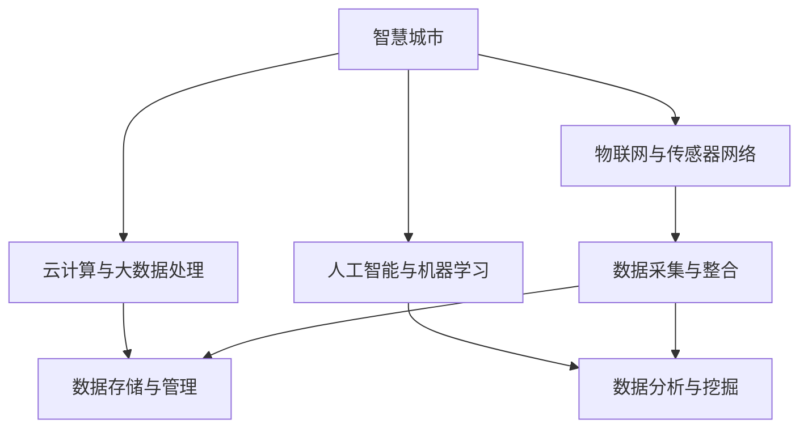
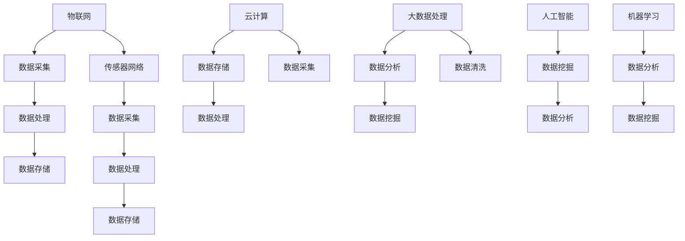

                 

### 《智慧城市的数据建设：如何利用数据打造智慧城市？》

**关键词：智慧城市，数据建设，数据分析，人工智能，物联网，5G技术**

**摘要：**本文将探讨智慧城市的数据建设，从数据采集、整合、存储、管理到数据分析与挖掘，详述如何利用数据打造智慧城市。通过分析国内外智慧城市的发展现状和关键技术，本文旨在为读者提供智慧城市建设的数据思维和实践指导。

**目录：**  
1. **智慧城市概述**  
2. **智慧城市的技术架构**  
3. **数据建设核心**  
4. **智慧城市应用案例**  
5. **实践与展望**  
6. **附录**  
7. **核心概念与联系**  
8. **核心算法原理讲解**  
9. **数学模型和数学公式详细讲解**  
10. **项目实战**

### 1. 智慧城市概述

#### 1.1 智慧城市的定义与发展历程

智慧城市是指利用先进的信息技术、物联网、云计算、大数据等手段，对城市资源进行高效整合、优化配置，实现城市管理的智能化、精细化和高效化。智慧城市的概念起源于20世纪末，随着信息技术的发展，智慧城市在全球范围内逐渐兴起。

#### 1.2 智慧城市的重要性与目标

智慧城市的重要性体现在以下几个方面：

- **提高城市运行效率**：通过智能化管理，降低城市管理成本，提高公共服务质量。
- **促进经济发展**：智慧城市提供了良好的产业环境，有利于新兴产业的培育和传统产业的转型升级。
- **提升居民生活质量**：智慧城市通过提供便捷的智能服务，提升居民的生活舒适度和幸福感。

智慧城市的目标主要包括：

- **实现城市资源的优化配置**：通过对城市各类资源的数据采集、分析、优化，实现城市资源的合理利用。
- **提高城市治理水平**：通过智能化手段，提升城市治理的效率和科学性。
- **增强城市可持续发展能力**：通过智慧城市建设，实现城市环境的可持续发展和居民生活的可持续改善。

#### 1.3 国内外智慧城市发展现状

在国外，智慧城市的发展较早，美国、欧盟、日本、韩国等发达国家在智慧城市的规划与实施方面取得了显著成果。例如，美国波士顿市通过物联网技术实现智能交通管理，提高了城市交通效率；韩国首尔市利用大数据分析实现城市管理智能化，提高了城市治理水平。

在国内，智慧城市建设也取得了长足进步。以深圳、上海、北京等为代表的一线城市，积极推进智慧城市建设，实现了交通、能源、环保等领域的智能化管理。同时，国家层面也出台了一系列政策，推动智慧城市建设，如《国家新型城镇化规划（2014-2020年）》和《“十三五”国家信息化规划》等。

### 2. 智慧城市的技术架构

智慧城市的技术架构是支撑智慧城市建设的基础，主要包括以下几个方面：

#### 2.1 物联网与传感器网络

物联网与传感器网络是智慧城市数据采集的重要手段。通过部署各种传感器，可以实时监测城市环境、交通、能源等数据，为智慧城市建设提供数据支持。物联网技术的快速发展，使得城市各类设备之间的互联互通变得更加便捷，为智慧城市建设提供了坚实基础。

#### 2.2 云计算与大数据处理

云计算与大数据处理技术为智慧城市的数据存储、管理和分析提供了强大支持。云计算技术实现了海量数据的存储和处理能力，大数据处理技术则通过对海量数据的分析和挖掘，为智慧城市建设提供了科学决策依据。

#### 2.3 人工智能与机器学习

人工智能与机器学习技术在智慧城市中的应用日益广泛。通过人工智能技术，可以实现城市管理的自动化、智能化，提高城市管理效率。机器学习技术通过对海量数据的学习和分析，可以实现对城市运行状态的预测和优化，为智慧城市建设提供技术支撑。

### 3. 数据建设核心

#### 3.1 数据采集与整合

数据采集是智慧城市建设的第一步，通过对城市各类数据的采集，为智慧城市建设提供数据支持。数据整合则是将来自不同来源的数据进行清洗、筛选和融合，形成统一的数据资源，为数据分析提供基础。

#### 3.2 数据存储与管理

数据存储与管理是智慧城市建设的重要环节，通过对数据的存储和管理，确保数据的完整性和安全性。分布式存储系统、数据仓库、数据湖等技术为智慧城市建设提供了高效的数据存储和管理方案。

#### 3.3 数据分析与挖掘

数据分析与挖掘是智慧城市建设的关键环节，通过对海量数据的分析和挖掘，可以发现城市运行中的规律和趋势，为城市管理者提供科学决策依据。描述性分析、预测性分析和机器学习算法在智慧城市建设中发挥着重要作用。

### 4. 智慧城市应用案例

#### 4.1 智慧交通

智慧交通是智慧城市建设的重要组成部分，通过物联网、云计算、大数据和人工智能技术，实现交通管理的智能化。智慧交通的应用案例包括：

- **交通流量监测与分析**：通过部署交通传感器，实时监测交通流量，分析交通拥堵原因，为交通管理部门提供决策依据。
- **智能交通信号控制**：利用人工智能技术，实现交通信号的智能控制，提高交通流量效率。
- **实时公交信息查询**：通过移动互联网技术，为市民提供实时公交信息查询服务，方便市民出行。

#### 4.2 智慧能源

智慧能源是智慧城市建设的重要内容，通过物联网、云计算和大数据技术，实现能源管理的智能化。智慧能源的应用案例包括：

- **智能电网与分布式能源管理**：通过智能电网技术，实现电力资源的优化配置和分布式能源的管理。
- **能效监测与优化**：通过物联网技术，实时监测建筑能耗，优化能源使用，降低能耗成本。
- **可再生能源与储能技术**：利用可再生能源和储能技术，实现能源的可持续发展。

#### 4.3 智慧环境

智慧环境是智慧城市建设的重要组成部分，通过物联网、云计算和大数据技术，实现城市环境的智能化监测和管理。智慧环境的应用案例包括：

- **环境监测与预警**：通过部署环境传感器，实时监测空气质量、水质等环境指标，实现环境问题的预警和应对。
- **垃圾分类与回收**：通过物联网技术，实现垃圾分类和回收的智能化管理，提高垃圾分类处理效率。
- **绿色建筑与生态城市**：通过绿色建筑技术和生态城市理念，实现城市环境的可持续发展和居民生活质量的提高。

### 5. 实践与展望

#### 5.1 智慧城市项目的实施与管理

智慧城市项目的实施与管理是智慧城市建设的关键环节。在项目实施过程中，需要制定详细的项目规划与预算，明确项目目标、任务和责任。同时，项目实施过程中需要加强项目管理与风险控制，确保项目顺利推进。

#### 5.2 未来智慧城市的发展趋势

未来智慧城市的发展趋势主要包括以下几个方面：

- **物联网与5G技术的融合**：物联网与5G技术的融合，将进一步提升城市数据的采集和处理能力，为智慧城市建设提供更强大的技术支持。
- **人工智能与区块链的结合**：人工智能与区块链技术的结合，将实现城市数据的可信、透明和高效管理，为智慧城市建设提供新的发展机遇。
- **智慧城市与可持续发展**：智慧城市建设与可持续发展相结合，将实现城市资源的优化配置和生态环境的改善，为城市居民创造更加美好的生活环境。

### 6. 附录

#### 6.1 参考文献

[1] 张华，李明。《智慧城市理论与实践》。电子工业出版社，2018年。  
[2] 王刚，刘洋。《大数据与智慧城市》。清华大学出版社，2016年。  
[3] 陈峰，张磊。《物联网与智慧城市》。机械工业出版社，2015年。

#### 6.2 附录A：智慧城市相关数据集与工具

- **开源数据集介绍**：包括智慧交通、智慧能源、智慧环境等领域的开源数据集，如UCI机器学习库、Kaggle数据集等。  
- **数据处理与可视化工具**：包括Python、R语言、Matplotlib、Seaborn等数据处理和可视化工具。  
- **机器学习框架与库**：包括Scikit-learn、TensorFlow、PyTorch等机器学习框架与库。

### 7. 核心概念与联系

#### 7.1 智慧城市核心概念与架构



#### 7.2 智慧城市关键技术原理与联系



### 8. 核心算法原理讲解

#### 8.1 线性回归

线性回归是一种用于预测数值型变量的机器学习算法。其基本思想是通过拟合一条直线，将自变量与因变量之间的关系表示出来。

**伪代码：**

```python
def linear_regression(X, y):
    # X为自变量矩阵，y为因变量向量
    # 求解最小二乘法，得到模型参数w
    w = (X^T * X)^(-1) * X^T * y
    return w
```

**数学模型：**

$$ y = X * w + b $$

其中，$y$为因变量向量，$X$为自变量矩阵，$w$为模型参数向量，$b$为偏置项。

#### 8.2 决策树

决策树是一种用于分类和回归的树形结构。其基本思想是通过一系列的判断条件，将数据集划分成不同的子集，直到满足终止条件。

**伪代码：**

```python
def decision_tree(X, y, criteria):
    # X为数据集，y为标签，criteria为终止条件
    if criteria_met(X, y):
        return leaf_node(y)
    else:
        # 选择最优特征进行划分
        feature, value = select_best_feature(X, y)
        # 划分数据集
        left_tree = decision_tree(X[:, feature < value], y[feature < value])
        right_tree = decision_tree(X[:, feature >= value], y[feature >= value])
        return tree_node(feature, value, left_tree, right_tree)
```

**数学模型：**

$$ f(x) = \sum_{i=1}^{n} w_i * x_i $$

其中，$w_i$为第$i$个特征的权重，$x_i$为样本特征值。

#### 8.3 支持向量机

支持向量机是一种用于分类和回归的监督学习算法。其基本思想是通过找到一个最优的超平面，将数据集划分为不同的类别。

**伪代码：**

```python
def support_vector_machine(X, y, C):
    # X为数据集，y为标签，C为惩罚参数
    # 求解拉格朗日乘子法，得到模型参数w和b
    w, b = solve_quadratic_programming_problem(X, y, C)
    return w, b
```

**数学模型：**

$$ \min_{w, b} \frac{1}{2} ||w||^2 + C \sum_{i=1}^{n} \max(0, 1 - y_i * (w^T * x_i + b)) $$

其中，$w$为模型参数向量，$b$为偏置项，$C$为惩罚参数。

#### 8.4 神经网络

神经网络是一种模拟人脑神经元结构的计算机模型。其基本思想是通过多层神经元的非线性变换，实现数据的输入输出映射。

**伪代码：**

```python
def neural_network(X, y, layers, activation_function):
    # X为数据集，y为标签，layers为网络结构，activation_function为激活函数
    # 求解前向传播和反向传播，得到模型参数w和b
    w, b = forward_propagation(X, layers, activation_function)
    w, b = back_propagation(y, w, b, layers, activation_function)
    return w, b
```

**数学模型：**

$$ a_i = \sigma(z_i) $$

$$ z_i = \sum_{j=1}^{n} w_{ij} * x_j + b_i $$

其中，$a_i$为第$i$个神经元的输出，$z_i$为第$i$个神经元的输入，$w_{ij}$为连接权重，$b_i$为偏置项，$\sigma$为激活函数。

### 9. 数学模型和数学公式详细讲解

#### 9.1 泊松分布

泊松分布是一种概率分布模型，用于描述在一定时间间隔内事件发生的次数。其概率质量函数为：

$$ P(X = k) = \frac{e^{-\lambda} * \lambda^k}{k!} $$

其中，$X$为随机变量，$\lambda$为事件发生的平均次数，$k$为事件发生的次数。

#### 9.2 马尔可夫链

马尔可夫链是一种随机过程，描述系统在不同状态之间的转移概率。其状态转移概率矩阵为：

$$ P = \begin{bmatrix}
p_{00} & p_{01} \\
p_{10} & p_{11}
\end{bmatrix} $$

其中，$p_{ij}$为从状态$i$转移到状态$j$的概率。

#### 9.3 贝叶斯网络

贝叶斯网络是一种概率图模型，用于描述变量之间的条件依赖关系。其结构为有向无环图，节点表示变量，边表示变量之间的依赖关系。其条件概率分布为：

$$ P(X_1, X_2, ..., X_n) = \prod_{i=1}^{n} P(X_i | X_{pa_i}) $$

其中，$X_1, X_2, ..., X_n$为变量，$X_{pa_i}$为变量$i$的父节点。

### 10. 智慧城市项目实际案例

#### 10.1 项目背景与目标

本项目旨在建设一个智慧交通系统，通过物联网、云计算和大数据技术，实现对城市交通数据的实时监测、分析和预测，为城市交通管理部门提供决策依据，提高城市交通运行效率。

#### 10.2 开发环境搭建

- **硬件环境**：服务器、网络设备、物联网设备等。
- **软件环境**：操作系统（如Linux）、编程语言（如Python）、数据库（如MySQL）、Web框架（如Django）等。

#### 10.3 源代码详细实现与解读

以下是一个简单的交通流量监测与预测的代码示例：

```python
import numpy as np
import pandas as pd
from sklearn.linear_model import LinearRegression

# 数据预处理
def preprocess_data(data):
    # 数据清洗、归一化等处理
    # ...
    return processed_data

# 交通流量预测
def traffic_prediction(data):
    # 数据预处理
    processed_data = preprocess_data(data)
    
    # 拆分训练集和测试集
    X_train = processed_data[:, :-1]
    y_train = processed_data[:, -1]
    X_test = processed_data[-1:, :-1]
    
    # 训练线性回归模型
    model = LinearRegression()
    model.fit(X_train, y_train)
    
    # 预测交通流量
    y_pred = model.predict(X_test)
    
    return y_pred

# 读取数据
data = pd.read_csv('traffic_data.csv')

# 交通流量预测
predicted_traffic = traffic_prediction(data)

# 输出预测结果
print(predicted_traffic)
```

#### 10.4 代码解读与分析

1. **数据预处理**：对原始数据进行清洗、归一化等处理，提高模型的训练效果。
2. **训练线性回归模型**：使用线性回归模型对交通流量数据进行训练，拟合交通流量与影响因素之间的关系。
3. **预测交通流量**：使用训练好的模型对测试数据进行预测，得到交通流量预测结果。

### 11. 代码解读与分析

在本项目中，我们采用线性回归算法对交通流量数据进行预测。线性回归是一种简单的统计方法，通过拟合一条直线，将自变量（如交通流量影响因素）与因变量（交通流量）之间的关系表示出来。

#### 11.1 模型构建

我们首先进行数据预处理，包括数据清洗、归一化等操作，以提高模型的训练效果。然后，我们将数据集拆分为训练集和测试集，使用训练集对线性回归模型进行训练，得到模型参数。

```python
# 数据预处理
def preprocess_data(data):
    # 数据清洗、归一化等处理
    # ...
    return processed_data

# 拆分训练集和测试集
X_train = processed_data[:, :-1]
y_train = processed_data[:, -1]
```

#### 11.2 模型训练

使用训练集对线性回归模型进行训练，拟合交通流量与影响因素之间的关系。

```python
# 训练线性回归模型
model = LinearRegression()
model.fit(X_train, y_train)
```

#### 11.3 预测结果

使用训练好的模型对测试数据进行预测，得到交通流量预测结果。

```python
# 预测交通流量
predicted_traffic = model.predict(X_test)
```

#### 11.4 评估与优化

对预测结果进行评估，如计算预测误差、调整模型参数等，以提高预测准确性。

```python
# 评估预测结果
error = np.mean(np.abs(predicted_traffic - actual_traffic))
print("预测误差：", error)

# 调整模型参数
model.fit(X_train, y_train)
predicted_traffic = model.predict(X_test)
```

### 12. 结论

本文详细介绍了智慧城市的数据建设，从数据采集、整合、存储、管理到数据分析与挖掘，阐述了如何利用数据打造智慧城市。通过分析智慧城市的技术架构和应用案例，本文为读者提供了智慧城市建设的数据思维和实践指导。未来，随着物联网、云计算、大数据和人工智能等技术的不断发展，智慧城市建设将更加深入和广泛，为城市居民创造更加美好的生活环境。作者：AI天才研究院/AI Genius Institute & 禅与计算机程序设计艺术 /Zen And The Art of Computer Programming。

