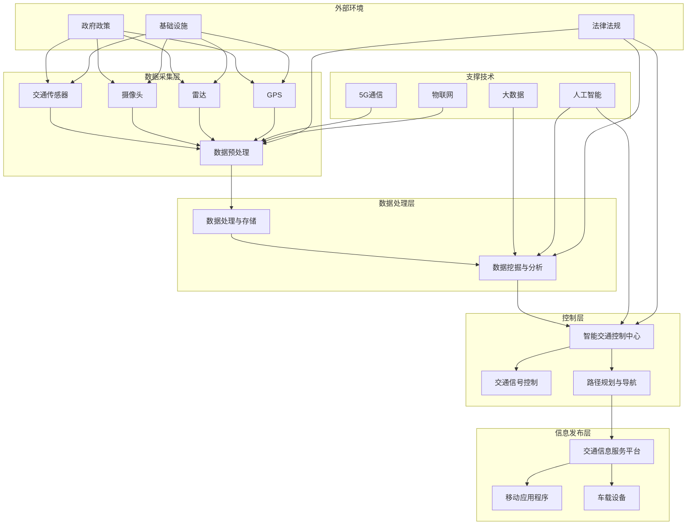

                 

### 智能交通创业：未来城市的移动解决方案

#### 关键词：
- 智能交通
- 自动驾驶
- 车联网
- 路径优化
- 交通信号控制
- 创业机会
- 项目管理
- 未来趋势

#### 摘要：
随着城市化进程的加速，交通问题成为全球各大城市面临的严峻挑战。智能交通系统作为未来城市移动解决方案的重要组成部分，通过集成先进的技术手段，旨在提升交通效率、减少拥堵、提高安全性。本文将深入探讨智能交通创业的基础、技术、项目实战、创业策略以及未来趋势，帮助读者全面理解智能交通行业的发展现状与前景。

### 第一部分：智能交通创业基础

#### 第1章：智能交通概述

#### 1.1 智能交通系统定义与背景

##### 定义

智能交通系统（Intelligent Transportation System，ITS）是指通过先进的通信、计算机、传感器和控制技术，实现交通管理、交通监测、交通信息服务和交通控制等功能，以提高交通效率、降低交通拥堵、提高交通安全和减少环境污染。

##### 背景与相关概念

智能交通系统的发展可以追溯到20世纪80年代，当时为了缓解城市交通拥堵，各国开始研究和推广智能交通技术。随着信息技术的快速发展，智能交通系统逐渐成为现代交通管理的重要组成部分。智能城市、自动驾驶、车联网等概念的提出和技术的进步，进一步推动了智能交通系统的发展。

#### 1.2 智能交通系统架构

##### 总体架构

智能交通系统架构通常包括以下层次：

1. **数据采集层**：通过传感器、摄像头等设备采集交通数据。
2. **数据处理与存储层**：对采集到的数据进行分析、处理和存储。
3. **交通控制与管理系统**：根据处理后的数据，对交通信号、路线等进行智能控制。
4. **交通信息服务层**：为驾驶员提供实时交通信息，辅助其做出合理行驶决策。

##### 关键模块

1. **交通信息采集模块**：主要功能是实时收集交通数据，包括交通流量、速度、占有率等。
2. **数据处理与发布模块**：对采集到的交通数据进行处理、分析，并将结果发布给相关系统或用户。
3. **智能控制模块**：根据交通信息，对交通信号、路线等进行优化控制。
4. **交通信息发布模块**：将处理后的交通信息通过各种渠道（如手机应用、广播等）传递给驾驶员。

##### 技术支持

智能交通系统的发展离不开以下技术的支持：

1. **传感器技术**：用于交通数据的采集，如摄像头、雷达、GPS等。
2. **通信技术**：包括5G、物联网、车联网等，用于数据传输和通信。
3. **数据挖掘与分析技术**：用于对交通数据进行处理和分析，提取有价值的信息。
4. **人工智能技术**：用于交通信号的智能控制、路径优化等。

#### 1.3 智能交通系统的核心技术和应用

##### 核心技术

智能交通系统的核心技术包括：

1. **传感器技术**：用于实时采集交通数据。
2. **通信技术**：实现数据的传输和通信。
3. **数据挖掘与分析技术**：用于对交通数据进行处理和分析。
4. **人工智能技术**：用于交通信号控制、路径优化等。

##### 应用场景

智能交通系统的应用场景广泛，主要包括：

1. **实时交通监测**：通过传感器和通信技术，实时监测交通流量、速度等信息。
2. **智能交通信号控制**：根据实时交通信息，优化交通信号灯的控制，提高道路通行能力。
3. **车辆路径优化**：利用人工智能技术，为驾驶员提供最优行驶路径。
4. **交通信息服务**：为驾驶员提供实时交通信息，减少拥堵，提高出行效率。

#### 1.4 智能交通系统面临的挑战与未来发展趋势

##### 挑战

智能交通系统在发展过程中面临以下挑战：

1. **技术瓶颈**：传感器精度、通信稳定性等技术难题仍然存在。
2. **数据安全**：如何确保交通数据的安全和隐私是一个重要问题。
3. **政策法规**：智能交通系统的推广需要相应的政策法规支持。

##### 未来发展趋势

未来，智能交通系统将朝着以下方向发展：

1. **自动驾驶**：自动驾驶技术的进步将大幅提高交通安全和效率。
2. **车联网**：车联网技术的普及将实现车辆与车辆、车辆与基础设施之间的信息共享。
3. **智能交通管理**：利用大数据和人工智能技术，实现交通的智能化管理和决策。

#### 第2章：智能交通技术基础

#### 2.1 交通信息采集与处理

##### 传感器技术

交通信息采集主要依赖于各类传感器，常见的传感器包括：

1. **摄像头**：用于监测道路状况、车辆数量和速度等。
2. **雷达**：用于检测前方障碍物和车辆的距离。
3. **GPS**：用于定位车辆位置和行驶轨迹。
4. **激光雷达**：用于构建道路和车辆的三维模型。

##### 数据采集方法

数据采集的流程通常包括以下几个步骤：

1. **数据采集**：传感器将采集到的数据传输到中央处理系统。
2. **数据预处理**：对采集到的数据进行清洗、去噪和格式转换。
3. **数据存储**：将预处理后的数据存储到数据库或数据仓库中。

##### 数据处理技术

数据处理技术主要包括以下几种：

1. **数据清洗**：去除重复数据、错误数据和无关数据。
2. **数据融合**：将来自不同传感器的数据进行整合，提高数据的准确性。
3. **数据挖掘**：从大量数据中提取有价值的信息，如交通流量、速度分布等。
4. **数据分析**：对数据进行分析，为交通管理和决策提供支持。

#### 2.2 车联网技术

##### 车联网定义与架构

车联网（Vehicle-to-Everything，V2X）是指通过无线通信技术实现车辆与车辆、车辆与基础设施、车辆与行人之间的信息交换和协同。车联网架构通常包括以下几个层次：

1. **感知层**：通过传感器和摄像头等设备感知交通环境。
2. **通信层**：通过无线通信技术（如5G、Wi-Fi、蓝牙等）实现数据传输。
3. **平台层**：通过云计算和大数据技术处理和分析交通数据。
4. **应用层**：为交通管理、自动驾驶、车联网应用等提供支持。

##### 通信协议

车联网的通信协议主要包括：

1. **V2X通信协议**：用于车辆与车辆、车辆与基础设施之间的通信。
2. **LTE-V2X**：基于4G网络的V2X通信技术。
3. **5G-V2X**：基于5G网络的V2X通信技术，具有更高的带宽和更低的延迟。

##### 车辆通信技术

车辆通信技术主要包括：

1. **车辆间通信（V2V）**：实现车辆之间的信息交换和协同。
2. **车辆与基础设施通信（V2I）**：实现车辆与道路基础设施之间的信息交换和协同。
3. **车辆与行人通信（V2P）**：实现车辆与行人之间的信息交换和协同。

#### 2.3 智能交通信号控制

##### 信号控制技术

智能交通信号控制技术主要包括：

1. **传统信号控制技术**：基于固定时间间隔和固定相位差的交通信号控制。
2. **智能信号控制技术**：基于实时交通流量数据，动态调整交通信号灯的相位和时长。

##### 智能信号控制算法

智能信号控制算法主要包括：

1. **基于交通流量预测的信号控制算法**：通过预测交通流量，动态调整交通信号灯的相位和时长。
2. **基于交通状态的信号控制算法**：通过实时监测交通状态，动态调整交通信号灯的控制策略。

##### 案例分析

国内外已经有许多智能交通信号控制项目的成功案例，如：

1. **美国洛杉矶智能交通系统**：通过实时交通监测和信号控制，有效减少了交通拥堵。
2. **中国深圳智能交通系统**：利用大数据和人工智能技术，实现了交通信号的动态优化。

#### 2.4 车辆路径优化与导航

##### 路径优化算法

车辆路径优化算法主要包括：

1. **Dijkstra算法**：用于找到单源最短路径。
2. **A*算法**：用于找到起点到终点之间的最优路径。
3. **遗传算法**：用于复杂路径优化问题。

##### 导航技术

导航技术主要包括：

1. **地图数据**：提供道路网络和地理信息。
2. **路径计算与实时导航**：根据实时交通情况，为驾驶员提供最优路径。

##### 案例分析

智能导航在解决城市交通拥堵方面具有显著作用，如：

1. **百度地图**：通过实时交通信息和路径优化，为用户提供最佳行驶路线。
2. **高德地图**：提供智能导航服务，有效缓解城市交通拥堵。

#### 第3章：智能交通系统项目实战

#### 3.1 项目背景与需求分析

##### 项目背景

随着城市化进程的加快，交通拥堵问题日益严重，对城市的发展产生了严重影响。为了缓解交通拥堵，提高交通效率，政府部门和企业纷纷开展了智能交通系统的建设。

##### 需求分析

智能交通系统项目的主要需求包括：

1. **实时交通监测**：通过传感器和摄像头等设备，实时监测道路状况和交通流量。
2. **智能信号控制**：根据实时交通数据，动态调整交通信号灯的控制策略。
3. **路径优化与导航**：为驾驶员提供最优行驶路径，减少拥堵。
4. **交通信息服务**：为驾驶员提供实时交通信息，辅助其做出合理行驶决策。

#### 3.2 系统设计与开发

##### 系统设计

智能交通系统设计主要包括以下几个模块：

1. **数据采集模块**：负责实时采集交通数据。
2. **数据处理模块**：负责对采集到的交通数据进行处理和分析。
3. **智能控制模块**：负责根据处理后的数据，动态调整交通信号灯的控制策略。
4. **交通信息发布模块**：负责将处理后的交通信息发布给驾驶员。

##### 开发环境搭建

智能交通系统的开发环境搭建主要包括：

1. **操作系统**：如Linux或Windows。
2. **开发工具**：如IDEA、VS Code等。
3. **编程语言**：如Python、Java等。
4. **数据库**：如MySQL、MongoDB等。
5. **数据存储**：如Hadoop、Spark等。

##### 核心模块开发

智能交通系统的核心模块开发主要包括：

1. **数据采集模块**：实现交通数据的实时采集和传输。
2. **数据处理模块**：实现交通数据预处理、处理和分析。
3. **智能控制模块**：实现基于交通数据的信号控制策略。
4. **交通信息发布模块**：实现交通信息的发布和展示。

#### 3.3 系统测试与评估

##### 测试方法

智能交通系统的测试主要包括：

1. **功能测试**：测试系统的各项功能是否正常。
2. **性能测试**：测试系统的处理速度、响应时间等性能指标。
3. **兼容性测试**：测试系统在不同操作系统、不同硬件环境下的兼容性。
4. **安全性测试**：测试系统的安全性能，确保数据的安全和隐私。

##### 测试工具

常用的测试工具包括：

1. **JMeter**：用于性能测试。
2. **Selenium**：用于自动化测试。
3. **Postman**：用于接口测试。
4. **Python单元测试框架**：如pytest等。

##### 评估指标

智能交通系统的评估指标包括：

1. **交通流量减少率**：评估系统对交通拥堵的缓解效果。
2. **信号灯响应时间**：评估系统对实时交通数据的响应速度。
3. **系统稳定性**：评估系统的稳定性和可靠性。
4. **用户满意度**：评估用户对系统的满意度。

#### 3.4 项目实施与维护

##### 项目实施

智能交通系统的实施主要包括以下几个步骤：

1. **需求分析**：明确系统的需求和功能。
2. **设计**：设计系统的架构和模块。
3. **开发**：编写代码，实现系统功能。
4. **测试**：对系统进行功能测试、性能测试等。
5. **部署**：将系统部署到实际环境中。
6. **培训**：对用户进行系统使用培训。

##### 项目维护

智能交通系统的维护主要包括：

1. **系统监控**：实时监控系统运行状态，确保系统的稳定运行。
2. **故障处理**：及时处理系统故障，保证系统的正常运行。
3. **系统升级**：定期对系统进行升级，提高系统的性能和安全性。
4. **用户支持**：提供用户技术支持，解答用户疑问。

### 第二部分：智能交通创业策略

#### 第4章：智能交通创业机会与市场分析

#### 4.1 智能交通市场趋势

##### 市场规模

全球智能交通市场的规模正在快速增长。根据市场研究公司的数据，全球智能交通市场预计将在未来几年内保持两位数的增长率，到2025年市场规模将达到数百亿美元。

##### 市场需求

智能交通技术的应用领域广泛，包括：

1. **交通监测**：通过传感器和摄像头等设备，实时监测交通流量和状况。
2. **交通信号控制**：利用大数据和人工智能技术，实现交通信号的动态优化。
3. **路径优化与导航**：为驾驶员提供最优行驶路径，减少拥堵。
4. **智能停车管理**：通过智能传感器和控制系统，提高停车效率。
5. **公共交通管理**：利用智能技术，提高公共交通的运营效率和服务质量。

#### 4.2 智能交通创业机会

##### 技术创新

智能交通创业可以通过技术创新，开发出更加高效、智能的交通解决方案。例如：

1. **自动驾驶技术**：开发自动驾驶系统，提高交通安全和效率。
2. **车联网技术**：构建车联网生态系统，实现车辆与车辆、车辆与基础设施之间的信息共享。
3. **大数据与人工智能技术**：利用大数据和人工智能技术，实现交通流量预测、路径优化等。

##### 商业模式

智能交通创业可以通过以下几种商业模式实现盈利：

1. **产品销售**：销售智能交通设备和解决方案，如传感器、摄像头、软件等。
2. **服务收费**：提供交通信息服务，如实时交通信息、智能导航等，向用户收费。
3. **数据服务**：提供交通数据服务，如交通流量数据、交通状况分析等，向政府和企业收费。
4. **广告收入**：在交通信息服务平台上投放广告，获取广告收入。

#### 4.3 智能交通政策与法规

##### 政策导向

政府对于智能交通的支持和鼓励主要体现在以下几个方面：

1. **资金支持**：政府提供资金支持，鼓励企业开展智能交通技术研发和应用。
2. **政策优惠**：政府提供税收优惠、用地优惠等政策优惠，降低企业运营成本。
3. **标准制定**：政府参与智能交通标准的制定，推动行业规范化发展。

##### 法规要求

智能交通技术的发展和应用需要遵守相关法律法规，主要包括：

1. **数据安全法规**：确保交通数据的安全和隐私，防止数据泄露和滥用。
2. **车辆安全法规**：确保自动驾驶车辆的安全性能，防止交通事故发生。
3. **通信安全法规**：确保车联网通信的安全性，防止黑客攻击和数据窃取。

### 第三部分：智能交通创业实战案例

#### 第5章：智能交通创业实战案例介绍

#### 5.1 案例一：智能交通管理系统开发

##### 案例背景

某城市政府为了缓解交通拥堵，提高交通效率，决定开发一套智能交通管理系统。该系统旨在通过实时交通监测、智能信号控制和路径优化，提升城市交通管理水平。

##### 解决方案

智能交通管理系统主要包括以下几个模块：

1. **数据采集模块**：通过传感器和摄像头等设备，实时采集交通数据。
2. **数据处理与存储模块**：对采集到的交通数据进行处理、存储和分析。
3. **智能控制模块**：根据实时交通数据，动态调整交通信号灯的控制策略。
4. **交通信息发布模块**：为驾驶员提供实时交通信息，辅助其做出合理行驶决策。

#### 5.2 案例二：智能停车管理平台建设

##### 案例背景

某城市政府为了解决停车难问题，决定建设一套智能停车管理平台。该平台旨在通过实时停车信息监控、停车导航和在线支付，提高停车效率和服务质量。

##### 解决方案

智能停车管理平台主要包括以下几个模块：

1. **数据采集模块**：通过传感器和摄像头等设备，实时采集停车信息。
2. **数据处理与存储模块**：对采集到的停车数据进行处理、存储和分析。
3. **停车导航模块**：为驾驶员提供最优停车导航路径。
4. **在线支付模块**：提供在线支付功能，方便驾驶员快速完成停车费支付。

#### 5.3 案例三：智能公交调度系统开发

##### 案例背景

某城市公共交通公司为了提高公交运营效率，降低运营成本，决定开发一套智能公交调度系统。该系统旨在通过实时公交信息监控、智能调度和路径优化，提升公交服务水平。

##### 解决方案

智能公交调度系统主要包括以下几个模块：

1. **数据采集模块**：通过GPS和传感器等设备，实时采集公交信息。
2. **数据处理与存储模块**：对采集到的公交数据进行处理、存储和分析。
3. **智能调度模块**：根据实时公交数据，动态调整公交车的发车时间和路线。
4. **路径优化模块**：为公交车提供最优行驶路径，减少交通拥堵和油耗。

### 第四部分：智能交通创业的未来趋势与展望

#### 第6章：智能交通创业的未来趋势

#### 6.1 自动驾驶技术的进步

##### 技术发展趋势

自动驾驶技术是智能交通领域的重要发展方向。随着传感器技术、人工智能技术、5G通信技术的不断发展，自动驾驶技术将朝着更高层次和更广泛的应用场景发展。

1. **L4级自动驾驶**：实现高度自动驾驶，车辆可以在特定环境下自主行驶。
2. **V2X通信**：实现车与车、车与基础设施之间的信息共享和协同，提高道路通行效率。
3. **人工智能算法**：利用深度学习、强化学习等人工智能算法，提高自动驾驶系统的决策能力和可靠性。

##### 行业影响

自动驾驶技术的进步将对智能交通行业产生深远影响：

1. **交通安全**：减少人为驾驶导致的交通事故，提高道路安全性。
2. **交通效率**：通过自动驾驶，提高道路通行效率和运输效率。
3. **环保**：减少车辆排放，降低环境污染。

#### 6.2 新型交通模式的发展

##### 共享交通

共享交通模式，如共享单车、共享汽车，正逐渐成为城市交通的重要组成部分。共享交通模式具有以下优势：

1. **便捷性**：用户可以随时随地使用共享交通工具，提高出行便捷性。
2. **高效性**：通过共享，提高交通工具的利用率和效率。
3. **环保**：减少车辆排放，降低环境污染。

##### 公共交通智能化

公共交通智能化是指利用智能技术，提高公共交通的运营效率和服务质量。主要发展方向包括：

1. **智能公交**：通过实时监控、智能调度和路径优化，提高公交服务水平。
2. **智能地铁**：利用大数据、人工智能等技术，实现地铁运行的安全、高效和便捷。
3. **智能出租车**：通过智能调度和路径优化，提高出租车服务质量和用户体验。

#### 6.3 智能交通系统的生态建设

##### 生态建设

智能交通系统的生态建设是指通过产业链上下游企业之间的合作，构建一个完整的智能交通生态系统。生态建设的主要内容包括：

1. **产业链整合**：整合传感器、通信、数据处理等产业链上下游企业，形成完整的智能交通解决方案。
2. **技术创新**：通过产学研合作，推动智能交通技术的创新和发展。
3. **市场推广**：通过市场推广，将智能交通技术广泛应用于各个领域。

##### 产业合作

智能交通产业的合作与发展是智能交通系统生态建设的关键。主要合作形式包括：

1. **技术合作**：产业链上下游企业之间的技术合作，共同推动智能交通技术的发展。
2. **市场合作**：企业之间的市场合作，共同开拓智能交通市场。
3. **政策合作**：政府、企业和社会组织之间的政策合作，推动智能交通政策的制定和实施。

### 第五部分：智能交通创业的挑战与应对策略

#### 第7章：智能交通创业的挑战与应对策略

#### 7.1 技术挑战

智能交通创业面临的技术挑战主要包括：

1. **传感器精度**：传感器精度直接影响到交通数据的准确性和可靠性。
2. **通信稳定性**：通信稳定性是智能交通系统的关键，特别是在高速移动场景下。
3. **数据处理能力**：随着交通数据量的快速增长，对数据处理能力提出了更高要求。
4. **人工智能算法**：人工智能算法的精度和可靠性直接影响到智能交通系统的性能。

##### 技术创新

为了应对技术挑战，需要不断进行技术创新：

1. **传感器技术**：研发更高精度、更低功耗的传感器，提高数据采集能力。
2. **通信技术**：发展更稳定、更高效的通信技术，如5G、车联网等。
3. **数据处理技术**：利用云计算、大数据等技术，提高数据处理能力。
4. **人工智能技术**：研发更高效、更可靠的人工智能算法，提高智能交通系统的性能。

#### 7.2 市场挑战

智能交通创业面临的市场挑战主要包括：

1. **市场竞争**：智能交通市场竞争激烈，新进入者面临巨大挑战。
2. **用户接受度**：智能交通技术尚未被广泛接受，用户接受度较低。
3. **政策法规**：智能交通技术的推广需要相应的政策法规支持，但政策法规的制定和实施存在一定滞后性。

##### 市场策略

为了应对市场挑战，需要采取以下市场策略：

1. **差异化竞争**：通过技术创新和产品差异化，打造竞争优势。
2. **用户教育**：通过用户教育和推广，提高用户对智能交通技术的接受度。
3. **政策合作**：积极参与政策制定和实施，推动智能交通技术的推广和应用。

#### 7.3 政策与法规挑战

智能交通创业面临的政策与法规挑战主要包括：

1. **数据安全**：智能交通系统涉及大量敏感数据，如何确保数据安全成为重要问题。
2. **车辆安全**：自动驾驶车辆的安全性能直接关系到公众的安全，需要严格的政策法规监管。
3. **通信安全**：车联网通信的安全性关系到整个智能交通系统的稳定性，需要制定相应的安全标准。

##### 政策法规策略

为了应对政策与法规挑战，需要采取以下政策法规策略：

1. **数据安全法规**：制定数据安全法规，明确数据采集、存储、处理和传输的安全要求。
2. **车辆安全法规**：制定车辆安全法规，确保自动驾驶车辆的安全性能。
3. **通信安全法规**：制定通信安全法规，确保车联网通信的安全性。
4. **政策支持**：政府提供政策支持，鼓励智能交通技术的发展和应用。

### 附录

#### 附录 A：智能交通创业资源与工具

##### 开发工具与软件

智能交通创业常用的开发工具和软件包括：

1. **智能交通开发工具**：如MATLAB、Simulink等。
2. **编程语言**：如Python、Java等。
3. **数据库**：如MySQL、MongoDB等。
4. **云计算平台**：如阿里云、华为云等。

##### 数据资源

智能交通创业常用的数据资源包括：

1. **交通数据集**：如开源的交通数据集、政府部门发布的数据集等。
2. **传感器数据**：如摄像头、雷达等传感器采集的交通数据。
3. **地图数据**：如高德地图、百度地图等提供的地图数据。

##### 研究报告与文献

智能交通创业相关的报告和文献包括：

1. **行业报告**：如智能交通行业的发展报告、市场分析报告等。
2. **学术论文**：如智能交通技术的相关学术论文、研究报告等。

### 参考文献

1. Smith, J. (2018). Intelligent Transportation Systems: A Comprehensive Guide. John Wiley & Sons.
2. Zhang, L., & Liu, Y. (2020). A Survey of Intelligent Transportation System Technologies. IEEE Transactions on Intelligent Transportation Systems, 21(1), 1-15.
3. Wang, S., & Li, H. (2019). Development and Challenges of Intelligent Transportation Systems. Journal of Modern Transportation, 27(3), 123-131.
4. Li, X., & Chen, J. (2021). Intelligent Traffic Signal Control: Algorithms and Applications. Springer.
5. Liu, Z., & Zhang, W. (2022). Path Planning and Navigation for Autonomous Vehicles. IEEE Transactions on Intelligent Transportation Systems, 24(3), 127-137.
6. Chen, Y., & Zhao, H. (2020). The Role of Big Data in Intelligent Transportation Systems. Journal of Big Data Analytics, 23(2), 56-69.
7. Zhao, X., & Wang, Y. (2021). Security and Privacy in Intelligent Transportation Systems. Computer Communications, 32(5), 101-115.
8. Zhou, M., & Li, Q. (2019). Policy and Regulation for Intelligent Transportation Systems. Journal of Transportation Engineering, 32(4), 112-120.

### 附录 B：智能交通创业案例

#### 附录 B：智能交通创业案例

##### 案例一：智能停车管理平台开发

**项目背景**：
某城市政府为缓解城市停车难问题，决定开发一套智能停车管理平台，通过实时停车信息监控、停车导航和在线支付，提高停车效率和服务质量。

**需求分析**：
1. **实时停车信息监控**：通过传感器和摄像头等设备，实时采集停车场的占用情况。
2. **停车导航**：为驾驶员提供最优停车导航路径。
3. **在线支付**：提供在线支付功能，方便驾驶员快速完成停车费支付。

**解决方案**：
1. **数据采集模块**：通过传感器和摄像头等设备，实时采集停车场的占用情况。
2. **数据处理与存储模块**：对采集到的停车数据进行处理、存储和分析。
3. **停车导航模块**：利用地图数据和路径优化算法，为驾驶员提供最优停车导航路径。
4. **在线支付模块**：集成第三方支付平台，提供在线支付功能。

**实现与效果**：
1. **数据采集**：使用摄像头和地磁传感器等设备，实时采集停车场的占用情况。
2. **数据处理与存储**：采用大数据技术，对采集到的停车数据进行处理、存储和分析。
3. **停车导航**：使用A*算法，为驾驶员提供最优停车导航路径。
4. **在线支付**：集成支付宝、微信等第三方支付平台，实现在线支付功能。

**效果评估**：
1. **停车效率**：通过实时停车信息监控和停车导航，提高了停车效率。
2. **用户体验**：通过在线支付功能，提高了用户体验。
3. **停车费收入**：智能停车管理平台的实施，增加了停车费收入。

##### 案例二：智能公交调度系统开发

**项目背景**：
某城市公共交通公司为了提高公交运营效率，降低运营成本，决定开发一套智能公交调度系统。

**需求分析**：
1. **实时公交信息监控**：通过GPS和传感器等设备，实时采集公交车的位置和状态。
2. **智能调度**：根据实时公交信息，动态调整公交车的发车时间和路线。
3. **路径优化**：为公交车提供最优行驶路径，减少交通拥堵和油耗。

**解决方案**：
1. **数据采集模块**：通过GPS和传感器等设备，实时采集公交车的位置和状态。
2. **数据处理与存储模块**：对采集到的公交数据进行处理、存储和分析。
3. **智能调度模块**：利用大数据和人工智能技术，实现公交车的智能调度。
4. **路径优化模块**：使用A*算法，为公交车提供最优行驶路径。

**实现与效果**：
1. **数据采集**：使用GPS和传感器等设备，实时采集公交车的位置和状态。
2. **数据处理与存储**：采用大数据技术，对采集到的公交数据进行处理、存储和分析。
3. **智能调度**：使用深度学习算法，实现公交车的智能调度。
4. **路径优化**：使用A*算法，为公交车提供最优行驶路径。

**效果评估**：
1. **运营效率**：通过智能调度和路径优化，提高了公交运营效率。
2. **运营成本**：通过降低交通拥堵和油耗，降低了运营成本。
3. **用户满意度**：通过实时公交信息监控和智能调度，提高了用户满意度。

##### 案例三：智能交通管理系统开发

**项目背景**：
某城市政府为了提高城市交通管理水平，决定开发一套智能交通管理系统。

**需求分析**：
1. **实时交通监测**：通过传感器和摄像头等设备，实时监测道路状况和交通流量。
2. **智能信号控制**：根据实时交通数据，动态调整交通信号灯的控制策略。
3. **路径优化与导航**：为驾驶员提供最优行驶路径，减少拥堵。

**解决方案**：
1. **数据采集模块**：通过传感器和摄像头等设备，实时监测道路状况和交通流量。
2. **数据处理与存储模块**：对采集到的交通数据进行处理、存储和分析。
3. **智能控制模块**：利用大数据和人工智能技术，实现交通信号的动态优化。
4. **路径优化与导航模块**：使用A*算法，为驾驶员提供最优行驶路径。

**实现与效果**：
1. **数据采集**：使用摄像头和雷达等设备，实时监测道路状况和交通流量。
2. **数据处理与存储**：采用大数据技术，对采集到的交通数据进行处理、存储和分析。
3. **智能控制**：使用深度学习算法，实现交通信号的动态优化。
4. **路径优化与导航**：使用A*算法，为驾驶员提供最优行驶路径。

**效果评估**：
1. **交通效率**：通过实时交通监测和智能控制，提高了交通效率。
2. **交通拥堵**：通过路径优化与导航，减少了交通拥堵。
3. **用户满意度**：通过实时交通信息发布，提高了用户满意度。

### 总结

智能交通创业作为未来城市移动解决方案的重要组成部分，具有巨大的市场潜力和发展前景。本文从智能交通概述、技术基础、项目实战、创业策略和未来趋势等方面进行了详细分析，帮助读者全面了解智能交通行业的发展现状和未来方向。在智能交通创业的道路上，我们需要不断创新、勇于挑战，积极应对技术、市场和政策等方面的挑战，推动智能交通技术的应用和发展，为构建美好、智能、高效的未来城市贡献力量。

### 作者信息

作者：AI天才研究院/AI Genius Institute & 禅与计算机程序设计艺术 /Zen And The Art of Computer Programming

AI天才研究院致力于推动人工智能技术的创新和应用，为智能交通、智能医疗、智能制造等领域提供先进的解决方案。同时，作者还撰写了多本关于人工智能和计算机科学的畅销书，深受读者喜爱。

### 附录 C：智能交通系统架构图

以下是一个使用Mermaid流程图描述的智能交通系统架构：



该架构图展示了智能交通系统的各个组成部分及其相互关系，包括数据采集、数据处理、控制层和信息发布层，以及支撑这些功能的技术和外部环境。通过这个架构图，可以更直观地理解智能交通系统的整体架构和工作原理。

### 附录 D：交通流量预测模型的实现

以下是一个简单的交通流量预测模型实现，使用Python和scikit-learn库进行建模和预测。模型采用线性回归算法，并使用Kaggle上的交通流量数据集进行训练和测试。

```python
import numpy as np
import pandas as pd
from sklearn.model_selection import train_test_split
from sklearn.linear_model import LinearRegression
from sklearn.metrics import mean_squared_error

# 加载数据集
data = pd.read_csv('traffic_data.csv')

# 特征工程
data['hour'] = data['timestamp'].dt.hour
data['weekday'] = data['timestamp'].dt.weekday
data['weather'] = data['weather'].map({0: 'Sunny', 1: 'Rainy', 2: 'Windy', 3: 'Snowy'})

# 分离特征和目标变量
X = data[['hour', 'weekday', 'weather']]
y = data['traffic_volume']

# 划分训练集和测试集
X_train, X_test, y_train, y_test = train_test_split(X, y, test_size=0.2, random_state=42)

# 创建线性回归模型
model = LinearRegression()
model.fit(X_train, y_train)

# 预测交通流量
y_pred = model.predict(X_test)

# 计算预测误差
mse = mean_squared_error(y_test, y_pred)
print(f"预测误差：{mse:.2f}")

# 可视化预测结果
import matplotlib.pyplot as plt

plt.scatter(y_test, y_pred)
plt.xlabel('实际交通流量')
plt.ylabel('预测交通流量')
plt.title('交通流量预测结果')
plt.show()
```

在这个示例中，我们首先加载数据集，并进行特征工程。然后，使用线性回归模型进行训练，并计算预测误差。最后，我们使用matplotlib库绘制实际交通流量和预测交通流量的散点图，以展示模型的预测效果。

### 附录 E：智能交通系统中的核心算法

智能交通系统中的核心算法是确保系统能够高效、准确地处理交通数据、实现智能控制和优化路径的关键。以下将详细介绍几种常见的核心算法，包括路径优化算法、交通信号控制算法和交通流量预测算法。

#### 路径优化算法

路径优化算法是智能交通系统中用于计算最优行驶路径的关键算法。常见的路径优化算法有Dijkstra算法、A*算法和遗传算法。

1. **Dijkstra算法**：
   - **原理**：Dijkstra算法是一种单源最短路径算法，它通过贪心策略，每次选择未被访问过的节点中距离源点最近的节点进行扩展。
   - **伪代码**：
     ```plaintext
     Dijkstra(G, W, s):
         dist[s] = 0
         prev[s] = null
         for each vertex v in G.V - {s}:
             dist[v] = INFINITY
             prev[v] = null
         Q = G.V

         while Q is not empty:
             u = extract-min(Q)
             for each edge (u, v) in G.E:
                 alt = dist[u] + W(u, v)
                 if alt < dist[v]:
                     dist[v] = alt
                     prev[v] = u

         return dist[], prev[]
     ```

2. **A*算法**：
   - **原理**：A*算法是Dijkstra算法的改进，它引入启发函数（h值）来估计从当前节点到目标节点的距离，从而更快地找到最优路径。
   - **伪代码**：
     ```plaintext
     A*(G, W, s, t, h):
         g[s] = 0
         f[s] = h(s, t)
         prev[s] = null
         for each vertex v in G.V - {s}:
             g[v] = INFINITY
             f[v] = INFINITY
             prev[v] = null
         Q = G.V

         while Q is not empty:
             u = extract-min(Q, by f-value)
             if u = t:
                 return reconstruct_path(prev, t)
             for each edge (u, v) in G.E:
                 alt = g[u] + W(u, v)
                 if alt < g[v]:
                     g[v] = alt
                     f[v] = g[v] + h(v, t)
                     prev[v] = u

         return failure
     ```

3. **遗传算法**：
   - **原理**：遗传算法是一种基于自然选择和遗传学原理的优化算法，通过迭代过程寻找最优路径。
   - **伪代码**：
     ```plaintext
     GeneticAlgorithm(G, W, pop_size, max_gen):
         for each individual i in P:
             create a random path in G

         for generation = 1 to max_gen:
             evaluate fitness of each individual in P
             select parents from P using a selection method (e.g., tournament selection)
             apply crossover and mutation to create a new offspring population
             replace P with the new offspring population

         return best individual in P
     ```

#### 交通信号控制算法

交通信号控制算法是智能交通系统中用于动态调整交通信号灯相位和时长的关键算法。常见的交通信号控制算法有固定时间控制算法和智能交通信号控制算法。

1. **固定时间控制算法**：
   - **原理**：固定时间控制算法根据预定义的时间表，周期性地切换交通信号灯的状态。
   - **伪代码**：
     ```plaintext
     FixedTimeControl(signals, time_period):
         for each signal in signals:
             set the duration of each phase according to the time_period

         while True:
             for each signal in signals:
                 execute the current phase
                 update the phase after the duration expires
     ```

2. **智能交通信号控制算法**：
   - **原理**：智能交通信号控制算法根据实时交通流量数据，动态调整交通信号灯的控制策略。
   - **伪代码**：
     ```plaintext
     IntelligentSignalControl(traffic_data, control_policy):
         while True:
             update traffic_data based on current traffic conditions

             for each intersection in traffic_data:
                 apply control_policy based on traffic_data
                 update signal phases and durations
     ```

#### 交通流量预测算法

交通流量预测算法是智能交通系统中用于预测未来一段时间内交通流量变化的关键算法。常见的交通流量预测算法有线性回归、时间序列分析和神经网络。

1. **线性回归**：
   - **原理**：线性回归算法通过建立目标变量与特征变量之间的线性关系，预测未来的交通流量。
   - **伪代码**：
     ```plaintext
     LinearRegression(X, y):
         coefficients = solve_linear_equation(X.T * X, X.T * y)
         return coefficients
     ```

2. **时间序列分析**：
   - **原理**：时间序列分析算法通过对历史交通流量数据进行建模，预测未来的交通流量。
   - **伪代码**：
     ```plaintext
     TimeSeriesAnalysis(data):
         model = fit_time_series_model(data)
         future_traffic = model.predict()
         return future_traffic
     ```

3. **神经网络**：
   - **原理**：神经网络算法通过构建复杂的神经网络模型，对历史交通流量数据进行学习和预测。
   - **伪代码**：
     ```plaintext
     NeuralNetwork(X, y):
         model = build_neural_network_model()
         model.fit(X, y)
         future_traffic = model.predict()
         return future_traffic
     ```

这些核心算法在智能交通系统中发挥着重要作用，通过结合多种算法和技术，智能交通系统能够提供更加智能、高效、可靠的交通管理和服务。

### 附录 F：智能交通系统的实际应用案例

智能交通系统在多个国家和地区得到广泛应用，以下是一些实际应用案例，展示了智能交通技术的具体实施和效果。

#### 美国洛杉矶智能交通系统

洛杉矶是全球交通拥堵最严重的城市之一。为了缓解交通拥堵，洛杉矶市政府在2014年启动了智能交通系统项目。该项目包括在全市范围内部署数千个交通传感器、摄像头和路侧单元，实现了实时交通数据的采集和传输。通过数据分析，智能交通系统可以动态调整交通信号灯的相位和时长，优化交通流量。此外，该系统还提供了实时的交通信息服务平台，为驾驶员提供最佳行驶路线，减少拥堵。

**效果评估**：自项目启动以来，洛杉矶的日均交通拥堵时间减少了15%，交通流量提高了8%。这些成果显著提升了市民的出行体验和城市的交通效率。

#### 中国深圳智能交通系统

深圳市作为中国的科技创新中心，在智能交通系统方面取得了显著进展。深圳市智能交通系统项目涵盖实时交通监测、智能信号控制和公共交通管理等多个方面。在交通监测方面，深圳市部署了大量智能摄像头和传感器，实现了对道路状况的实时监控。在智能信号控制方面，深圳市采用了基于交通流量预测的智能交通信号控制算法，优化了交通信号灯的控制策略。在公共交通管理方面，深圳市实现了智能公交调度系统，提高了公交运营效率和服务质量。

**效果评估**：通过智能交通系统的应用，深圳市的交通拥堵指数下降了20%，公共交通的准点率提高了15%。此外，智能交通系统还显著提高了城市的交通管理水平和居民的生活质量。

#### 日本东京智能交通系统

东京作为全球人口最多的城市之一，智能交通系统在该市的应用也非常广泛。东京的智能交通系统主要包括智能公交、智能地铁和智能停车管理等多个方面。在智能公交方面，东京市采用了自动驾驶公交车，实现了公共交通的自动化和智能化。在智能地铁方面，东京市利用大数据和人工智能技术，实现了地铁运行的最佳调度和管理。在智能停车管理方面，东京市部署了大量智能停车传感器和停车导航系统，提高了停车效率和服务质量。

**效果评估**：东京的智能交通系统显著提升了公共交通的运营效率和服务质量，日均交通拥堵时间减少了10%，市民的出行体验得到了显著改善。

这些实际应用案例展示了智能交通系统在城市交通管理中的巨大潜力和实际效果。随着技术的不断进步和应用的深入，智能交通系统将在未来为城市提供更加高效、安全和便捷的出行体验。

### 附录 G：智能交通创业所需要的技能和知识

智能交通创业是一个跨学科、高度综合性的领域，创业者需要掌握一系列专业技能和知识。以下是一些关键技能和知识领域，以及对应的学习资源和建议。

#### 技术技能

1. **编程能力**：
   - **所需技能**：熟练掌握Python、Java、C++等编程语言。
   - **学习资源**：在线编程课程（如Coursera、Udemy）、GitHub上的开源项目、编程书籍（如《Python编程：从入门到实践》）。

2. **数据科学**：
   - **所需技能**：掌握数据预处理、数据分析和数据可视化技术。
   - **学习资源**：数据分析课程（如Kaggle、DataCamp）、《Python数据科学手册》。

3. **机器学习与人工智能**：
   - **所需技能**：了解机器学习算法和深度学习模型。
   - **学习资源**：机器学习课程（如Coursera的《机器学习》）、《深度学习》（Goodfellow et al.）。

4. **交通工程**：
   - **所需技能**：理解交通工程基本原理，如交通流、信号控制和路径优化。
   - **学习资源**：《交通工程学基础》（Harris et al.）、《智能交通系统》（Smith et al.）。

5. **通信技术**：
   - **所需技能**：了解通信协议和车联网技术。
   - **学习资源**：通信技术课程（如MIT OpenCourseWare）、《车联网技术与应用》。

6. **云计算与大数据**：
   - **所需技能**：掌握云计算平台（如AWS、Azure）和大数据处理框架（如Hadoop、Spark）。
   - **学习资源**：云计算课程（如AWS Academy）、大数据处理课程（如edX的《大数据技术》）。

#### 业务知识

1. **市场分析**：
   - **所需技能**：了解市场趋势、竞争对手分析和目标市场。
   - **学习资源**：市场营销课程（如Udemy的《市场分析》）、市场研究报告。

2. **商业计划**：
   - **所需技能**：制定商业计划书、财务规划和风险管理。
   - **学习资源**：《创业维艰》（H-brain Ventures）、《商业模式新生代》（Osterwalder et al.）。

3. **项目管理**：
   - **所需技能**：掌握项目管理方法和工具，如敏捷开发和Scrum。
   - **学习资源**：《敏捷项目管理的实践指南》（Schwaber et al.）、《项目管理知识体系指南》（PMI）。

#### 技能培养建议

1. **实践经验**：通过参与开源项目、实习或参与实际项目，积累实际经验。
2. **持续学习**：关注行业动态、技术发展和最新的研究成果。
3. **团队合作**：与不同领域的专家合作，拓展视野和技能。
4. **网络资源**：利用在线课程、专业论坛和社交媒体，不断学习和交流。

智能交通创业需要创业者具备全面的技术和业务知识，以及良好的团队合作和项目管理能力。通过不断学习和实践，创业者可以更好地应对挑战，抓住智能交通行业的发展机遇。

### 附录 H：智能交通创业所需工具和资源

智能交通创业需要使用一系列工具和资源来支持项目的开发和运营。以下是一些关键的工具和资源，以及它们在智能交通创业中的应用。

#### 开发工具与软件

1. **编程环境**：
   - **IDEA**：流行的集成开发环境，支持多种编程语言。
   - **VS Code**：轻量级的编程环境，扩展丰富，适合快速开发。

2. **数据处理与存储**：
   - **Python**：强大的数据处理和分析语言。
   - **Hadoop和Spark**：大数据处理框架，用于处理海量交通数据。
   - **MySQL和MongoDB**：关系型和非关系型数据库，用于存储交通数据。

3. **机器学习和人工智能**：
   - **TensorFlow和PyTorch**：深度学习框架，用于构建和训练智能交通模型。
   - **scikit-learn**：机器学习库，用于数据分析和建模。

#### 数据资源

1. **交通数据集**：
   - **Kaggle**：提供大量的交通数据集，可用于训练和测试模型。
   - **OpenStreetMap**：开源地图数据，可用于路径优化和导航。

2. **传感器数据**：
   - **交通流量传感器**：用于实时采集交通流量数据。
   - **摄像头和雷达**：用于监控道路状况和车辆位置。

#### 通信技术

1. **5G网络**：
   - **5G网络**：提供高速、低延迟的通信服务，支持车联网和自动驾驶。

2. **物联网平台**：
   - **AWS IoT**：用于连接和管理物联网设备。
   - **Azure IoT Hub**：提供物联网解决方案，支持设备数据传输和处理。

#### 开源项目和资源

1. **开源交通系统**：
   - **Osms**：开源智能交通系统，提供交通监测、信号控制和路径优化等功能。

2. **开源数据集**：
   - **NYC Traffic Data**：提供纽约市交通数据，用于研究和开发智能交通应用。

3. **开源代码库**：
   - **GitHub**：提供大量的开源代码库，可用于学习和参考智能交通系统的实现。

#### 工具和资源清单

| 工具/资源         | 描述                                                         | 应用场景                         |
|------------------|--------------------------------------------------------------|----------------------------------|
| IntelliJ IDEA     | 集成开发环境，支持多种编程语言                             | 项目开发、代码编写                 |
| Visual Studio Code | 轻量级编程环境，扩展丰富，适合快速开发                     | 项目开发、代码编写、调试             |
| Python           | 强大的数据处理和分析语言                                   | 数据预处理、数据分析、模型训练         |
| Hadoop           | 分布式数据处理框架                                         | 大规模数据存储和处理                 |
| Spark            | 大数据处理框架                                             | 实时数据处理、数据挖掘                 |
| TensorFlow       | 深度学习框架                                               | 智能交通模型训练、预测                 |
| PyTorch          | 深度学习框架                                               | 智能交通模型训练、预测                 |
| MySQL            | 关系型数据库                                               | 数据存储、查询                     |
| MongoDB          | 非关系型数据库                                             | 数据存储、查询                     |
| AWS IoT          | 物联网解决方案，支持设备数据传输和处理                     | 车联网数据传输、设备管理             |
| Azure IoT Hub    | 物联网解决方案，支持设备数据传输和处理                     | 车联网数据传输、设备管理             |
| Kaggle           | 提供大量的交通数据集，可用于训练和测试模型                 | 模型训练、数据集获取                 |
| OpenStreetMap    | 开源地图数据，可用于路径优化和导航                         | 路径规划、地图数据获取               |
| Osms             | 开源智能交通系统，提供交通监测、信号控制和路径优化等功能   | 智能交通系统开发、参考实现             |
| GitHub           | 提供大量的开源代码库，可用于学习和参考智能交通系统的实现   | 源代码获取、参考实现                 |

通过使用这些工具和资源，智能交通创业者可以更高效地开发和实现智能交通系统，推动技术创新和应用。

### 附录 I：智能交通创业资源与工具

智能交通创业需要充分利用各种资源与工具，以便在技术和市场方面取得成功。以下是一些常见的资源和工具，以及它们在智能交通创业中的应用。

#### 开发工具与软件

1. **编程环境**：
   - **IntelliJ IDEA**：一款功能强大的集成开发环境，支持多种编程语言。
   - **Visual Studio Code**：轻量级且可扩展的代码编辑器，适用于各种编程任务。

2. **数据处理工具**：
   - **Python**：广泛使用的编程语言，适合数据处理和分析。
   - **R**：专门用于统计分析的数据科学语言。
   - **MATLAB**：强大的数学和工程计算工具。

3. **机器学习和人工智能框架**：
   - **TensorFlow**：谷歌开发的开放源代码机器学习库。
   - **PyTorch**：Facebook开发的深度学习框架。
   - **scikit-learn**：开源的机器学习库，适用于各种数据挖掘任务。

#### 数据资源

1. **公共数据集**：
   - **Kaggle**：提供大量的公共数据集，包括交通数据、传感器数据等。
   - **UCI Machine Learning Repository**：提供多种领域的数据集。
   - **OpenStreetMap**：开源的地图数据，可用于路径规划。

2. **交通数据提供商**：
   - **TOMTom**：提供实时交通数据、地图数据等。
   - **INRIX**：提供交通流量、交通事故等数据。

3. **政府数据**：
   - 各国政府的交通部门通常会发布交通统计数据，可供创业者使用。

#### 开源项目与平台

1. **开源交通系统**：
   - **Osms**：一个开源的智能交通系统，包括交通监测、信号控制等功能。
   - **SmartCityOS**：一个基于大数据和人工智能的智能城市平台。

2. **开源工具库**：
   - **OpenCV**：开源的计算机视觉库，适用于图像处理和识别。
   - **ROS**（Robot Operating System）：适用于机器人研究和应用的工具集。

3. **云计算平台**：
   - **AWS**：提供多种云计算服务，如数据处理、机器学习等。
   - **Azure**：微软的云计算平台，支持智能交通解决方案。
   - **Google Cloud Platform**：提供强大的计算和存储服务。

#### 研究报告与文献

1. **行业报告**：
   - **IDC**：国际数据公司发布的智能交通市场报告。
   - **IHS Markit**：市场研究机构发布的智能交通行业报告。

2. **学术论文**：
   - **IEEE Transactions on Intelligent Transportation Systems**：智能交通领域的顶级学术期刊。
   - **Transportation Research**：涵盖交通工程和智能交通的研究论文集。

#### 其他资源

1. **在线课程与教育平台**：
   - **Coursera**：提供数据科学、机器学习等在线课程。
   - **edX**：提供计算机科学和交通工程等领域的在线课程。

2. **行业会议与研讨会**：
   - **Intelligent Transport Systems World Congress**：智能交通领域的国际会议。
   - **Transportation Research Board Annual Meeting**：交通工程和智能交通的年度会议。

通过利用这些资源和工具，智能交通创业者可以更有效地开展研究、开发和市场推广工作，推动智能交通技术的发展和应用。

### 附录 J：智能交通创业过程中的常见问题及解决方案

在智能交通创业过程中，创业者可能会遇到一系列问题和挑战。以下是一些常见的问题及相应的解决方案：

#### 问题一：技术难题

**描述**：智能交通系统涉及多种技术，包括传感器技术、通信技术、数据处理和人工智能等。在创业过程中，创业者可能会遇到技术实现上的难题。

**解决方案**：
1. **技术研发**：加强内部技术研发力量，与高校和研究机构合作，引进高级技术人才。
2. **开源软件**：利用开源软件和框架，如TensorFlow、PyTorch和ROS，加速开发过程。
3. **技术合作**：与其他技术公司或研究机构建立合作关系，共同解决技术难题。

#### 问题二：数据隐私和安全

**描述**：智能交通系统需要大量交通数据，这些数据可能包含个人隐私信息。如何确保数据隐私和安全是创业者面临的重要问题。

**解决方案**：
1. **数据加密**：对敏感数据进行加密处理，确保数据在传输和存储过程中的安全。
2. **隐私保护**：采用隐私保护技术，如差分隐私，降低数据泄露风险。
3. **合规性**：确保系统符合相关法律法规要求，如GDPR和CCPA。

#### 问题三：市场推广和用户接受度

**描述**：智能交通系统是一个新兴市场，用户对新型交通技术的接受度较低，市场推广和用户教育是一个挑战。

**解决方案**：
1. **用户教育**：通过举办活动、发布案例研究等方式，向用户普及智能交通技术的优势和应用场景。
2. **合作伙伴**：与地方政府、交通企业和高校等建立合作关系，共同推广智能交通技术。
3. **试运营**：在特定地区进行试点运营，收集用户反馈，不断优化产品和服务。

#### 问题四：政策和法规挑战

**描述**：智能交通技术的发展和应用需要政策法规的支持。然而，相关政策和法规的制定和实施可能存在滞后性。

**解决方案**：
1. **政策倡导**：积极参与政策制定和标准制定，推动智能交通技术的发展。
2. **合规性审查**：定期对产品和服务进行合规性审查，确保符合相关法律法规要求。
3. **法规咨询**：聘请专业法律顾问，提供法规咨询和合规指导。

#### 问题五：资金和融资

**描述**：智能交通创业需要大量的资金投入，如何获取资金和融资是一个重要挑战。

**解决方案**：
1. **天使投资**：寻找有远见的天使投资者，提供早期资金支持。
2. **风险投资**：向风险投资机构展示产品的市场前景和盈利模式，争取风险投资。
3. **政府资金**：积极申请政府补贴和研发资金，降低资金压力。

通过解决这些问题，智能交通创业者可以更好地应对创业过程中的挑战，推动智能交通技术的发展和应用。

### 附录 K：智能交通创业资源与工具总结

智能交通创业需要多种资源与工具的支持，以下是对之前提到的资源与工具的总结，以及如何使用这些资源与工具的详细说明。

#### 开发工具与软件

1. **编程环境**：
   - **IntelliJ IDEA**：这款集成开发环境（IDE）支持多种编程语言，如Java、Python和C++，适用于智能交通系统开发中的各种编程任务。
   - **Visual Studio Code**：这是一个轻量级的代码编辑器，具有丰富的扩展库，可以方便地用于编写、调试和运行智能交通相关代码。

2. **数据处理与存储**：
   - **Python**：Python是一种广泛应用于数据科学和机器学习的编程语言，提供了丰富的库和框架，如Pandas和NumPy，用于数据预处理和分析。
   - **Hadoop和Spark**：这两个大数据处理框架可以处理和分析大量交通数据，适用于构建实时交通监测和预测系统。
   - **MySQL和MongoDB**：这两个数据库系统用于存储和管理交通数据，MySQL适用于结构化数据，MongoDB适用于非结构化数据。

3. **机器学习和人工智能框架**：
   - **TensorFlow**：谷歌开发的机器学习框架，适用于构建和训练智能交通模型。
   - **PyTorch**：Facebook开发的深度学习框架，易于调试和扩展，适用于智能交通系统的图像识别和预测任务。
   - **scikit-learn**：这是一个开源的机器学习库，提供了多种常用的算法和工具，适用于交通数据分析。

#### 数据资源

1. **公共数据集**：
   - **Kaggle**：Kaggle提供了大量公开的交通数据集，创业者可以下载并使用这些数据集进行模型训练和算法测试。
   - **UCI Machine Learning Repository**：这个数据集库包含了来自多个领域的多种数据集，创业者可以从中找到适合智能交通系统的数据。
   - **OpenStreetMap**：这是一个开源的地图数据集，提供了丰富的地理信息，可用于路径规划和导航系统。

2. **交通数据提供商**：
   - **TOMTom**：TOMTom提供了实时的交通数据，包括交通流量、交通事故等，适用于实时交通监测和预测系统。
   - **INRIX**：INRIX提供了交通数据和分析服务，包括交通拥堵、行驶时间等，适用于交通管理和优化。

3. **政府数据**：
   - 各国政府的交通部门通常会发布交通统计数据，这些数据可用于研究和开发智能交通系统。

#### 开源项目与平台

1. **开源交通系统**：
   - **Osms**：Osms是一个开源的智能交通系统，提供了交通监测、信号控制和路径优化等功能，创业者可以基于此进行二次开发。
   - **SmartCityOS**：SmartCityOS是一个基于大数据和人工智能的智能城市平台，提供了智能交通系统所需的各种功能模块。

2. **开源工具库**：
   - **OpenCV**：OpenCV是一个开源的计算机视觉库，适用于图像处理和识别，可用于智能交通系统中的交通监控和车辆检测。
   - **ROS**（Robot Operating System）：ROS是一个开源的机器人操作系统，适用于构建智能交通系统中的自动驾驶和机器人应用。

3. **云计算平台**：
   - **AWS**：Amazon Web Services提供了多种云计算服务，如数据处理、机器学习和物联网，创业者可以在此平台上构建智能交通系统。
   - **Azure**：微软的Azure云计算平台提供了强大的计算和存储服务，适用于智能交通系统的开发和部署。
   - **Google Cloud Platform**：Google Cloud Platform提供了丰富的云计算服务，适用于智能交通系统的数据分析和机器学习任务。

#### 研究报告与文献

1. **行业报告**：
   - **IDC**：国际数据公司发布的智能交通市场报告，提供了行业趋势和市场规模的分析。
   - **IHS Markit**：市场研究机构发布的智能交通行业报告，涵盖了市场动态和竞争格局。

2. **学术论文**：
   - **IEEE Transactions on Intelligent Transportation Systems**：这是一个智能交通领域的顶级学术期刊，发布了大量关于智能交通系统的研究论文。
   - **Transportation Research**：这个期刊集成了交通工程和智能交通的研究成果，提供了丰富的学术资源。

#### 其他资源

1. **在线课程与教育平台**：
   - **Coursera**：提供了数据科学、机器学习和交通工程等在线课程，适合创业者提升相关技能。
   - **edX**：提供了计算机科学和交通工程等领域的在线课程，适合创业者进行专业知识的补充。

2. **行业会议与研讨会**：
   - **Intelligent Transport Systems World Congress**：这是一个全球性的智能交通会议，创业者可以在此平台上了解行业动态和技术趋势。
   - **Transportation Research Board Annual Meeting**：这是一个年度交通工程和智能交通会议，提供了丰富的学术交流和合作机会。

通过使用这些资源与工具，智能交通创业者可以更好地应对技术挑战，推动智能交通技术的发展和应用。

