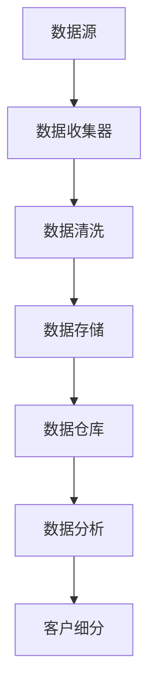
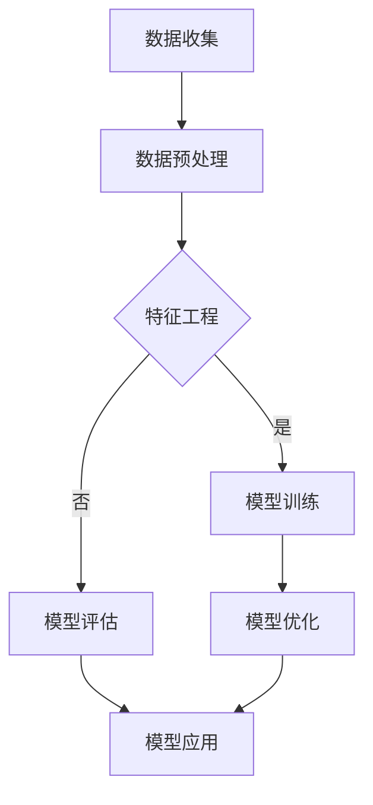
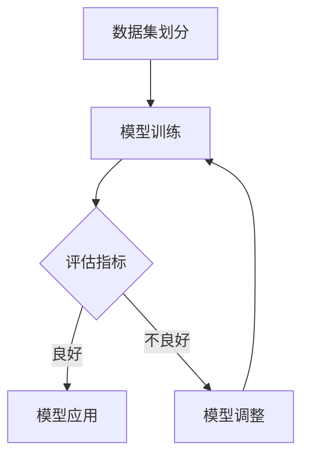

                 

# 智能客户细分系统：一人公司实现精准用户触达的数据方法

> 关键词：智能客户细分、数据驱动、用户触达、数据分析、精准营销

> 摘要：本文将探讨智能客户细分系统在小型企业中的应用，通过数据驱动的策略实现精准用户触达。我们将详细解析客户细分系统的构建过程，从数据获取与预处理、数据库设计、数据质量管理和模型构建等环节进行深入讨论。文章旨在为一人公司或小型企业主提供一套可行且实用的数据方法，以实现高效的客户管理和营销策略。

## 目录大纲

## 第一部分: 引言

### 第1章: 智能客户细分系统概述

#### 1.1.1 书籍背景及意义

#### 1.1.2 智能客户细分系统简介

#### 1.1.3 本书结构安排

## 第二部分: 数据基础

### 第2章: 数据获取与预处理

#### 2.1.1 数据来源与收集方法

#### 2.1.2 数据预处理流程

#### 2.1.3 数据清洗与转换

### 第3章: 数据库设计与实现

#### 3.1.1 数据库设计原则

#### 3.1.2 关系型数据库实现

#### 3.1.3 非关系型数据库实现

### 第4章: 数据质量管理

#### 4.1.1 数据质量评估标准

#### 4.1.2 数据质量问题分析

#### 4.1.3 数据质量改进策略

## 第三部分: 模型构建

### 第5章: 客户细分理论基础

#### 5.1.1 客户细分定义与分类

#### 5.1.2 客户细分模型概述

#### 5.1.3 客户细分模型构建步骤

### 第6章: 特征工程

#### 6.1.1 特征选择方法

#### 6.1.2 特征提取技术

#### 6.1.3 特征组合策略

### 第7章: 模型训练与评估

#### 7.1.1 常见客户细分算法

#### 7.1.2 模型训练流程

#### 7.1.3 模型评估与优化

### 第8章: 模型应用与优化

#### 8.1.1 模型应用场景

#### 8.1.2 模型优化策略

#### 8.1.3 模型迭代与反馈机制

## 第四部分: 实际应用

### 第9章: 行业案例分析

#### 9.1.1 案例背景与目标

#### 9.1.2 案例分析步骤

#### 9.1.3 案例结果与总结

### 第10章: 智能客户细分系统开发实战

#### 10.1.1 系统设计思路

#### 10.1.2 系统开发流程

#### 10.1.3 系统部署与运维

### 第11章: 未来发展趋势与展望

#### 11.1.1 智能客户细分技术展望

#### 11.1.2 行业应用前景

#### 11.1.3 未来挑战与机遇

## 附录

### 附录 A: 常用工具与库

#### A.1 Python数据科学库

#### A.2 数据库管理工具

#### A.3 模型评估工具

### 附录 B: Mermaid 流程图

#### B.1 数据流流程图

#### B.2 客户细分模型构建流程图

#### B.3 模型训练与评估流程图

---

**正文开始**

## 第一部分: 引言

### 第1章: 智能客户细分系统概述

#### 1.1.1 书籍背景及意义

随着互联网和大数据技术的迅猛发展，企业面临着前所未有的竞争压力。如何在海量用户中精准定位潜在客户，实现个性化营销成为企业关注的焦点。智能客户细分系统作为大数据和人工智能技术在营销领域的应用，为一人公司或小型企业提供了高效的用户触达和数据驱动营销的方法。

本章节旨在介绍智能客户细分系统的基本概念、应用场景和本书的结构安排。首先，我们将探讨智能客户细分系统的背景和发展趋势。接着，我们将详细阐述客户细分系统的关键组成部分和功能。最后，我们将介绍本书的结构安排，帮助读者更好地理解后续内容的逻辑和重点。

#### 1.1.2 智能客户细分系统简介

智能客户细分系统是一种利用大数据技术和人工智能算法对客户群体进行分类和分析的系统。通过收集和分析客户的交易数据、行为数据、社交数据等多维度数据，智能客户细分系统可以将客户划分为不同的细分市场，为营销策略的制定提供数据支持。

智能客户细分系统的核心目标包括：

1. **精准用户触达**：通过识别和定位潜在高价值客户，提高营销活动的针对性和效果。
2. **个性化营销**：根据不同细分市场的特点和需求，制定个性化的营销策略，提高用户满意度和忠诚度。
3. **业务优化**：通过分析客户数据，发现业务中的痛点和改进机会，优化产品和服务。

智能客户细分系统在以下场景中具有显著的优势：

1. **电商行业**：通过客户细分，电商平台可以实现精准广告投放和个性化推荐，提高销售额和用户粘性。
2. **金融行业**：银行和金融机构可以利用客户细分系统进行精准营销，提高客户转化率和忠诚度。
3. **零售行业**：零售企业可以通过客户细分，优化库存管理和促销策略，提升店铺业绩。

#### 1.1.3 本书结构安排

本书将分为四个主要部分，分别介绍智能客户细分系统的数据基础、模型构建、实际应用和未来发展趋势。

1. **数据基础**：本部分将详细讲解数据获取与预处理、数据库设计、数据质量管理等内容，为智能客户细分系统的构建提供数据支持。
2. **模型构建**：本部分将介绍客户细分理论基础、特征工程、模型训练与评估、模型应用与优化等方面的内容，帮助读者掌握智能客户细分系统的核心技术和方法。
3. **实际应用**：本部分将通过实际案例分析，展示智能客户细分系统的应用效果和实现步骤，为读者提供实用的操作指南。
4. **未来发展趋势**：本部分将探讨智能客户细分技术的未来发展趋势和行业应用前景，为读者提供前瞻性思考。

通过本书的学习，读者将能够全面了解智能客户细分系统的构建方法和应用场景，为自身业务提供数据驱动的解决方案。

---

在下一章节中，我们将深入探讨智能客户细分系统的数据基础，包括数据获取与预处理、数据库设计以及数据质量管理等方面。这些基础内容是构建高效智能客户细分系统的关键，将为后续模型构建和实际应用提供坚实的支持。让我们继续深入探索吧！## 第二部分: 数据基础

### 第2章: 数据获取与预处理

#### 2.1.1 数据来源与收集方法

数据是智能客户细分系统的核心资产，数据的质量和完整性直接影响到客户细分的效果。因此，首先需要明确数据的来源和收集方法。

**数据来源**：

1. **内部数据**：企业内部的交易数据、客户行为数据、订单数据等。这些数据通常可以通过企业的CRM系统、ERP系统等获取。
   
2. **外部数据**：来自第三方数据源的数据，如社交媒体数据、地理位置数据、市场调查数据等。这些数据可以通过API接口、数据服务商购买等方式获取。

**数据收集方法**：

1. **自动化数据收集**：通过API接口、Web爬虫等技术，自动化收集外部数据。例如，使用Python的`requests`库和`BeautifulSoup`库获取网站数据。

2. **手动数据收集**：对于一些无法自动获取的数据，如问卷调查数据，需要通过手动方式收集。

以下是一个简单的Python代码示例，用于从网站获取数据：

```python
import requests
from bs4 import BeautifulSoup

# 发送HTTP请求
response = requests.get('http://example.com')

# 解析HTML内容
soup = BeautifulSoup(response.content, 'html.parser')

# 提取数据
data = soup.find_all('div', class_='data-class')
```

3. **数据集成**：将来自不同来源和格式的数据集成到一个统一的数据仓库中，以便后续处理和分析。

#### 2.1.2 数据预处理流程

获取到数据后，需要进行预处理，以提高数据质量和可用性。数据预处理通常包括以下几个步骤：

**数据清洗**：

1. **缺失值处理**：对于缺失的数据，可以采用填充法、删除法或插值法进行处理。
   
2. **异常值处理**：识别并处理异常值，可以采用统计学方法（如箱线图、Z-score等）或基于业务逻辑的方法。

3. **数据转换**：将数据转换为适合分析的形式，如将字符串转换为数值、处理日期格式等。

以下是一个Python代码示例，用于处理缺失值：

```python
import pandas as pd

# 读取数据
df = pd.read_csv('data.csv')

# 填充缺失值
df.fillna(value={'column_name': 'default_value'}, inplace=True)

# 删除缺失值
df.dropna(subset=['column_name'], inplace=True)
```

**数据归一化**：

1. **特征缩放**：将不同量纲的特征进行缩放，使其具有相似的尺度，如使用Z-score进行标准化处理。

2. **特征变换**：将某些特征进行变换，如对非线性特征进行对数变换或幂变换，以提高模型的性能。

**数据集成**：

1. **合并数据集**：将来自不同来源的数据进行合并，通常使用Pandas库中的`merge`或`join`函数。
   
2. **数据格式转换**：确保所有数据集具有统一的数据格式和命名规范。

#### 2.1.3 数据清洗与转换

数据清洗和转换是数据预处理的关键步骤，直接影响到后续分析和建模的效果。以下是一些常见的数据清洗和转换方法：

**数据清洗**：

1. **过滤无效数据**：删除重复记录、无效记录或不符合业务规则的数据。
   
2. **处理缺失数据**：根据业务需求，选择合适的缺失值处理方法，如使用均值、中位数、众数进行填充，或根据业务逻辑进行插补。

3. **修正异常数据**：识别并修正数据中的异常值，如使用Z-score方法检测并处理异常数据。

**数据转换**：

1. **数值化处理**：将文本数据转换为数值数据，如将类别数据转换为独热编码或独热嵌入编码。

2. **归一化与标准化**：对数值特征进行归一化或标准化处理，如使用Z-score或Min-Max缩放方法。

3. **特征工程**：创建新的特征或转换现有特征，以增强模型的性能，如进行特征交叉、特征提取等。

以下是一个Python代码示例，用于进行数据清洗和转换：

```python
import pandas as pd
from sklearn.preprocessing import StandardScaler

# 读取数据
df = pd.read_csv('data.csv')

# 过滤无效数据
df.drop_duplicates(inplace=True)

# 处理缺失数据
df.fillna(method='ffill', inplace=True)

# 修正异常数据
z_scores = (df - df.mean()) / df.std()
df = df[(z_scores < 3).all(axis=1)]

# 数值化处理
df = pd.get_dummies(df, columns=['category_column'])

# 归一化与标准化
scaler = StandardScaler()
dfnumerical = scaler.fit_transform(df.select_dtypes(include='number'))

# 特征工程
df['new_feature'] = df['feature1'] * df['feature2']
```

通过上述数据预处理步骤，我们可以得到高质量的数据集，为后续的客户细分分析和建模提供可靠的数据基础。在下一章中，我们将深入探讨数据库设计与实现，进一步优化数据存储和管理策略。

---

在数据获取与预处理阶段，我们已成功完成了数据的基础处理工作。接下来，我们将进入数据库设计与实现的环节，为数据的高效存储和管理奠定基础。让我们继续深入探讨吧！## 第三部分: 模型构建

### 第5章: 客户细分理论基础

#### 5.1.1 客户细分定义与分类

客户细分是一种基于数据分析技术，将客户群体划分为不同子集的方法。通过客户细分，企业可以更精准地理解客户需求和行为，从而制定个性化的营销策略。客户细分的定义和分类如下：

**客户细分定义**：

客户细分是指根据客户的属性、行为和需求，将整个客户群体划分为不同的子群体，以便进行有针对性的管理和营销。

**客户细分分类**：

1. **基于人口统计学特征的细分**：根据客户的年龄、性别、收入、职业等人口统计学特征进行分类。
   
2. **基于行为特征的细分**：根据客户的行为数据，如购买频率、购买金额、访问次数、页面停留时间等，进行分类。

3. **基于需求特征的细分**：根据客户的需求特征，如购买动机、偏好、使用场景等，进行分类。

4. **基于价值特征的细分**：根据客户为企业带来的价值，如消费金额、活跃度、忠诚度等，进行分类。

5. **混合细分**：结合以上多种特征进行细分，以更全面地了解客户。

#### 5.1.2 客户细分模型概述

客户细分模型是进行客户细分的核心工具，通过构建合适的模型，可以有效地将客户划分为不同的子群体。常见的客户细分模型包括以下几种：

1. **聚类模型**：将相似度较高的客户划分为同一子群体。常见的聚类算法包括K-means、DBSCAN、层次聚类等。

2. **决策树模型**：通过树形结构，将客户按照不同的特征逐步划分到不同的子群体中。常见的决策树算法包括ID3、C4.5、CART等。

3. **随机森林模型**：通过构建多个决策树模型，进行集成学习，提高模型的稳定性和准确性。

4. **逻辑回归模型**：用于预测客户属于某一子群体的概率，通过对特征进行加权求和，得到预测结果。

5. **深度学习模型**：利用神经网络模型，对大量数据进行学习，提取特征并实现客户细分。常见的深度学习模型包括卷积神经网络（CNN）、循环神经网络（RNN）等。

#### 5.1.3 客户细分模型构建步骤

构建一个有效的客户细分模型通常包括以下步骤：

1. **数据收集与预处理**：收集相关数据，并进行清洗和预处理，确保数据的质量和完整性。

2. **特征工程**：选择合适的特征，对特征进行转换和归一化，以提高模型的性能。

3. **模型选择**：根据业务需求和数据特征，选择合适的客户细分模型。

4. **模型训练**：使用训练数据集，对模型进行训练，调整模型的参数，优化模型性能。

5. **模型评估**：使用测试数据集，评估模型的准确性和稳定性，调整模型参数。

6. **模型应用**：将训练好的模型应用于实际业务场景，对客户进行细分，制定个性化营销策略。

以下是一个简单的K-means聚类算法的伪代码示例：

```python
# 输入：数据集X，聚类数k
# 输出：聚类中心C，聚类结果Y

# 初始化聚类中心C
C = initialize_centers(X, k)

# 循环迭代
while not converged:
    # 计算每个样本的最邻近聚类中心
    Y = assign_clusters(X, C)
    
    # 更新聚类中心
    C = update_centers(X, Y, k)

    # 检查收敛条件
    if converged:
        break

# 返回聚类结果
return C, Y
```

通过以上步骤，我们可以构建一个有效的客户细分模型，为企业提供数据驱动的决策支持。

在下一章中，我们将探讨特征工程，这是客户细分模型构建中至关重要的一环。我们将详细介绍特征选择、特征提取和特征组合的方法，帮助读者理解如何构建一个高效的特征工程流程。让我们继续深入探讨吧！## 第三部分: 模型构建

### 第6章: 特征工程

特征工程是机器学习项目中的一个关键环节，其目标是通过选择、提取和组合特征，提高模型性能。在客户细分模型中，特征工程尤为关键，因为它直接影响到模型对客户行为的理解和预测能力。

#### 6.1.1 特征选择方法

特征选择是在大量特征中挑选出对模型预测性能有显著影响的特征。常见的特征选择方法包括：

1. **过滤法**：通过统计测试（如卡方检验、互信息等）直接筛选出重要的特征。这种方法简单有效，但可能无法充分利用特征间的相关性。

   ```python
   from sklearn.feature_selection import SelectKBest
   from sklearn.feature_selection import chi2
   
   # 例子：使用卡方检验进行特征选择
   selector = SelectKBest(score_func=chi2, k=10)
   X_new = selector.fit_transform(X, y)
   ```

2. **包裹法**：通过枚举所有可能的特征子集，评估每个子集的预测性能，选择最优的子集。这种方法能够充分利用特征间的相关性，但计算成本较高。

   ```python
   from sklearn.feature_selection import RFECV
   
   # 例子：使用递归特征消除（RFE）进行特征选择
   selector = RFECV(estimator=LogisticRegression(), step=1, cv=5)
   X_new = selector.fit_transform(X, y)
   ```

3. **嵌入法**：在模型训练过程中，自动筛选出重要的特征。常见的嵌入法包括Lasso回归和随机森林特征选择。

   ```python
   from sklearn.linear_model import LassoCV
   
   # 例子：使用Lasso进行特征选择
   selector = LassoCV(alphas=[0.1, 1, 10], cv=5)
   X_new = selector.fit_transform(X, y)
   ```

#### 6.1.2 特征提取技术

特征提取是在原始特征的基础上，通过转换或创建新的特征，提高模型的预测性能。常见的方法包括：

1. **变换法**：对原始特征进行数学变换，如对数变换、幂变换等，以减少数据的尺度差异。

   ```python
   import numpy as np
   
   # 例子：对特征进行对数变换
   X_log = np.log1p(X)
   ```

2. **特征组合**：通过组合原始特征，创建新的特征，以增强模型的预测能力。常见的特征组合方法包括交乘特征、泊松模型等。

   ```python
   # 例子：创建交乘特征
   X['feature1_feature2'] = X['feature1'] * X['feature2']
   ```

3. **主成分分析（PCA）**：通过正交变换，将原始特征转换为新的特征，降低数据的维度，同时保留数据的最大方差。

   ```python
   from sklearn.decomposition import PCA
   
   # 例子：使用PCA进行特征提取
   pca = PCA(n_components=5)
   X_pca = pca.fit_transform(X)
   ```

#### 6.1.3 特征组合策略

特征组合是在多个特征的基础上，通过组合和筛选，形成新的特征，以提高模型的性能。常见的特征组合策略包括：

1. **特征选择 + 特征提取**：首先使用特征选择方法筛选出重要的特征，然后使用特征提取技术创建新的特征。

   ```python
   # 例子：特征选择 + PCA特征提取
   selector = SelectKBest(score_func=chi2, k=10)
   X_selected = selector.fit_transform(X, y)
   pca = PCA(n_components=5)
   X_composed = pca.fit_transform(X_selected)
   ```

2. **模型集成**：使用多个模型对特征进行组合和筛选，形成新的特征。

   ```python
   from sklearn.ensemble import RandomForestClassifier
   
   # 例子：使用随机森林特征选择
   rf = RandomForestClassifier()
   rf.fit(X, y)
   important_features = rf.feature_importances_
   X_composed = X[:, important_features > 0]
   ```

3. **交叉验证**：通过交叉验证，评估不同特征组合的预测性能，选择最优的特征组合。

   ```python
   from sklearn.model_selection import cross_val_score
   
   # 例子：使用交叉验证选择特征组合
   scores = cross_val_score(RandomForestClassifier(), X, y, cv=5)
   best_features = X[:, scores.mean() > 0.5]
   ```

通过特征工程，我们可以有效地提高模型的预测性能，使客户细分系统更加精准。在下一章中，我们将深入探讨模型训练与评估，了解如何通过训练和评估过程，确保模型的有效性和可靠性。让我们继续深入探讨吧！## 第三部分: 模型构建

### 第7章: 模型训练与评估

模型训练与评估是智能客户细分系统的核心环节，其目标是通过合适的算法和优化策略，构建出一个能够准确预测客户行为的模型。在本章中，我们将详细讨论常见客户细分算法、模型训练流程以及模型评估与优化方法。

#### 7.1.1 常见客户细分算法

在客户细分中，选择合适的算法至关重要。以下是一些常见的客户细分算法：

1. **K-means聚类算法**：K-means是一种基于距离的聚类算法，通过迭代优化聚类中心，将数据划分为K个聚类。它简单易用，但在处理大规模数据时性能较差。

   ```python
   from sklearn.cluster import KMeans
   
   # 例子：初始化K-means模型
   kmeans = KMeans(n_clusters=3, random_state=0).fit(X)
   clusters = kmeans.predict(X)
   ```

2. **层次聚类算法**：层次聚类通过逐步合并或分割现有的聚类，构建出一棵聚类树。它适合处理大规模数据，但计算复杂度较高。

   ```python
   from sklearn.cluster import AgglomerativeClustering
   
   # 例子：初始化层次聚类模型
   cluster = AgglomerativeClustering(n_clusters=3).fit(X)
   clusters = cluster.predict(X)
   ```

3. **决策树算法**：决策树通过树形结构对数据进行划分，能够直观地展示决策路径。它适用于分类和回归问题，但可能产生过拟合。

   ```python
   from sklearn.tree import DecisionTreeClassifier
   
   # 例子：初始化决策树模型
   tree = DecisionTreeClassifier().fit(X, y)
   clusters = tree.predict(X)
   ```

4. **随机森林算法**：随机森林通过构建多个决策树，并进行集成学习，提高模型的稳定性和预测能力。它适合处理大规模数据和复杂数据集。

   ```python
   from sklearn.ensemble import RandomForestClassifier
   
   # 例子：初始化随机森林模型
   forest = RandomForestClassifier(n_estimators=100).fit(X, y)
   clusters = forest.predict(X)
   ```

5. **逻辑回归算法**：逻辑回归是一种广义线性模型，通过线性模型预测客户属于某一细分市场的概率。它适用于二分类问题，但也可以扩展到多分类。

   ```python
   from sklearn.linear_model import LogisticRegression
   
   # 例子：初始化逻辑回归模型
   logistic = LogisticRegression().fit(X, y)
   clusters = logistic.predict(X)
   ```

6. **支持向量机（SVM）算法**：SVM通过寻找最优超平面，将数据划分为不同的类别。它适合处理高维数据，但在处理大规模数据时可能性能较差。

   ```python
   from sklearn.svm import SVC
   
   # 例子：初始化SVM模型
   svm = SVC(kernel='linear').fit(X, y)
   clusters = svm.predict(X)
   ```

#### 7.1.2 模型训练流程

模型训练流程包括数据准备、模型选择、训练和验证等步骤。以下是一个典型的模型训练流程：

1. **数据准备**：清洗和预处理数据，确保数据的质量和一致性。

2. **数据划分**：将数据集划分为训练集和验证集，用于训练模型和评估模型性能。

   ```python
   from sklearn.model_selection import train_test_split
   
   # 例子：划分训练集和验证集
   X_train, X_val, y_train, y_val = train_test_split(X, y, test_size=0.2, random_state=42)
   ```

3. **模型选择**：根据业务需求和数据特征，选择合适的模型。

4. **模型训练**：使用训练集对模型进行训练。

   ```python
   # 例子：训练模型
   model = RandomForestClassifier(n_estimators=100)
   model.fit(X_train, y_train)
   ```

5. **模型验证**：使用验证集评估模型性能，调整模型参数。

   ```python
   # 例子：验证模型
   score = model.score(X_val, y_val)
   print(f"Validation Score: {score}")
   ```

6. **模型调整**：根据验证结果，调整模型参数，优化模型性能。

7. **模型部署**：将训练好的模型部署到生产环境中，进行实际应用。

#### 7.1.3 模型评估与优化

模型评估是确保模型性能的重要环节，以下是一些常见的模型评估指标和优化方法：

1. **评估指标**：

   - **准确率（Accuracy）**：模型预测正确的样本数占总样本数的比例。
   - **精确率（Precision）**：预测为正类的样本中实际为正类的比例。
   - **召回率（Recall）**：实际为正类的样本中被预测为正类的比例。
   - **F1值（F1 Score）**：精确率和召回率的调和平均。
   - **ROC曲线和AUC值**：评估模型对正负样本的区分能力。

2. **优化方法**：

   - **超参数调优**：通过网格搜索（Grid Search）或随机搜索（Random Search）等方法，调整模型超参数，优化模型性能。
   - **交叉验证**：通过交叉验证，评估模型的稳定性和泛化能力。
   - **正则化**：使用L1或L2正则化，防止模型过拟合。
   - **集成学习**：通过集成多个模型，提高模型的预测能力。

以下是一个使用网格搜索进行超参数调优的例子：

```python
from sklearn.model_selection import GridSearchCV
   
# 例子：定义参数网格
param_grid = {'n_estimators': [100, 200, 300], 'max_depth': [5, 10, 15]}
   
# 例子：初始化网格搜索
grid_search = GridSearchCV(RandomForestClassifier(), param_grid, cv=5)
   
# 例子：进行网格搜索
grid_search.fit(X_train, y_train)
   
# 例子：获取最佳参数
best_params = grid_search.best_params_
print(f"Best Parameters: {best_params}")
```

通过上述步骤，我们可以构建一个高效、准确的客户细分模型。在下一章中，我们将探讨如何将训练好的模型应用于实际业务场景，实现精准用户触达和个性化营销。让我们继续深入探讨吧！## 第四部分: 实际应用

### 第8章: 模型应用与优化

#### 8.1.1 模型应用场景

经过训练和评估，我们得到了一个高效准确的客户细分模型。接下来，我们需要将这个模型应用于实际业务场景，以实现精准用户触达和个性化营销。

1. **精准用户触达**：通过模型，我们可以将用户划分为不同的细分市场，针对每个细分市场制定个性化的营销策略，提高营销活动的效果。

   - **场景1**：电商公司通过细分用户，向高价值用户发送优惠券和促销信息，提高转化率。
   - **场景2**：金融机构通过细分用户，向潜在高价值客户推送理财产品，提升业务增长。

2. **个性化营销**：基于用户细分，我们可以为用户提供定制化的产品和服务，提升用户体验和满意度。

   - **场景1**：在线教育平台根据用户的学习习惯和兴趣，推荐个性化的课程和学习计划。
   - **场景2**：健康平台根据用户的健康状况和偏好，推送个性化的健康建议和保健产品。

#### 8.1.2 模型优化策略

在实际应用中，我们需要不断优化模型，以提高其准确性和稳定性。以下是一些常见的优化策略：

1. **数据更新与重训练**：定期收集新的用户数据，对模型进行重新训练，以适应用户行为的变化。

   ```python
   # 例子：定期收集新数据并重新训练模型
   X_new, y_new = ... # 新数据
   model.fit(X_new, y_new)
   ```

2. **特征更新与选择**：根据业务需求和数据质量，定期更新和筛选特征，以提高模型的预测能力。

   ```python
   # 例子：更新特征并进行特征选择
   X_updated = update_features(X)
   model.fit(X_updated, y)
   ```

3. **模型调优与超参数调整**：通过实验和交叉验证，调整模型的超参数，优化模型性能。

   ```python
   # 例子：使用网格搜索进行超参数调优
   from sklearn.model_selection import GridSearchCV
   param_grid = {'n_estimators': [100, 200, 300], 'max_depth': [5, 10, 15]}
   grid_search = GridSearchCV(model, param_grid, cv=5)
   grid_search.fit(X, y)
   best_params = grid_search.best_params_
   model.set_params(**best_params)
   ```

4. **模型集成与堆叠**：通过集成多个模型，提高模型的稳定性和预测能力。

   ```python
   # 例子：使用堆叠集成模型
   from sklearn.ensemble import StackingClassifier
   estimators = [('rf', RandomForestClassifier()), ('svm', SVC()), ('lr', LogisticRegression())]
   stacking_model = StackingClassifier(estimators=estimators, final_estimator=LogisticRegression())
   stacking_model.fit(X, y)
   ```

#### 8.1.3 模型迭代与反馈机制

为了持续优化模型，我们需要建立一个反馈机制，收集用户反馈和业务指标，以指导模型迭代。

1. **用户反馈收集**：通过问卷调查、用户评价等方式，收集用户对产品或服务的反馈。

2. **业务指标监控**：监控模型应用的业务效果，如转化率、客户满意度、销售额等。

3. **反馈循环**：将用户反馈和业务指标反馈到模型训练和优化环节，指导模型迭代。

以下是一个简单的反馈循环流程：

1. **数据收集**：定期收集用户反馈和业务数据。
   
2. **数据预处理**：清洗和预处理反馈数据，确保数据质量。
   
3. **模型更新**：使用新的数据集重新训练模型。

4. **模型评估**：使用验证集评估新模型的性能。

5. **模型部署**：将优化后的模型部署到生产环境。

通过上述流程，我们可以实现模型的持续迭代和优化，为业务增长提供持续的动力。

在下一章中，我们将通过实际案例分析，展示智能客户细分系统在具体业务场景中的应用效果和实现步骤。让我们继续深入探讨吧！## 第四部分: 实际应用

### 第9章: 行业案例分析

#### 9.1.1 案例背景与目标

在本章中，我们将通过一个实际案例，探讨智能客户细分系统在一家电子商务公司中的应用。这家电子商务公司是一家小型企业，面临以下挑战：

1. **客户群体广泛**：公司的目标客户涵盖了不同年龄、性别、地域和消费水平的用户，导致营销活动难以精准触达潜在高价值客户。

2. **营销资源有限**：公司营销预算有限，需要通过高效的营销策略最大化投资回报率。

3. **个性化需求强烈**：用户对个性化体验和产品推荐有着较高的期望，公司需要提供个性化的营销内容和产品推荐。

针对上述挑战，公司希望通过智能客户细分系统，实现以下目标：

1. **精准用户触达**：通过分析用户数据，将用户划分为不同的细分市场，针对每个细分市场制定个性化的营销策略。

2. **优化营销ROI**：通过精准触达高价值客户，提高营销活动的转化率和投资回报率。

3. **提升用户满意度**：通过个性化营销和产品推荐，提升用户满意度和忠诚度。

#### 9.1.2 案例分析步骤

为实现上述目标，公司采取了以下步骤：

1. **数据收集与预处理**：

   - **数据来源**：公司收集了用户的行为数据（如访问页面、购买历史、点击行为等）和用户基本信息（如年龄、性别、地域等）。

   - **数据预处理**：对数据进行了清洗和预处理，包括处理缺失值、异常值、数据转换和归一化。

2. **特征工程**：

   - **特征选择**：通过统计分析，选择了对用户行为有显著影响的关键特征，如访问时长、购买频率、页面跳转率等。

   - **特征提取**：创建新的特征，如用户活跃度、消费能力等，以增强模型的预测能力。

3. **模型构建与训练**：

   - **模型选择**：公司选择了K-means聚类算法和随机森林算法，构建客户细分模型。

   - **模型训练**：使用训练数据集，对模型进行训练，调整模型参数，优化模型性能。

4. **模型评估与优化**：

   - **模型评估**：使用验证集评估模型的准确性、精确率和召回率等指标，确保模型的有效性。

   - **模型优化**：通过交叉验证和网格搜索，调整模型参数，提高模型性能。

5. **模型应用与监控**：

   - **模型应用**：将训练好的模型应用于生产环境，根据用户细分结果，制定个性化的营销策略和产品推荐。

   - **模型监控**：定期收集用户反馈和业务指标，监控模型应用的业务效果，进行模型迭代和优化。

#### 9.1.3 案例结果与总结

通过智能客户细分系统的实施，公司取得了以下成果：

1. **精准用户触达**：通过客户细分，公司能够更精准地识别高价值客户，制定个性化的营销策略，提高了营销活动的效果。

2. **优化营销ROI**：通过精准触达高价值客户，公司的营销转化率显著提高，营销ROI得到优化。

3. **提升用户满意度**：通过个性化营销和产品推荐，用户满意度和忠诚度得到提升，用户活跃度和留存率有所增加。

总结来说，智能客户细分系统为小型电子商务公司提供了一种高效、精准的用户触达和营销策略。通过数据驱动的决策支持，公司能够更好地理解用户需求，优化业务流程，实现持续增长。

在下一章中，我们将深入探讨如何实现智能客户细分系统的开发实战，包括系统设计思路、开发流程和系统部署与运维。让我们继续深入探讨吧！## 第四部分: 实际应用

### 第10章: 智能客户细分系统开发实战

#### 10.1.1 系统设计思路

智能客户细分系统的设计思路主要包括以下几个方面：

1. **需求分析**：明确系统目标，分析业务场景，确定系统所需的功能模块。
2. **数据架构**：设计数据存储结构，确保数据的高效存储和快速访问。
3. **技术选型**：选择合适的技术栈，包括编程语言、数据库、数据处理和分析工具等。
4. **模块化设计**：将系统划分为多个功能模块，实现模块间的松耦合。
5. **用户体验**：设计友好的用户界面，提供便捷的操作和直观的展示。

#### 10.1.2 系统开发流程

智能客户细分系统的开发流程可以分为以下几个阶段：

1. **需求分析**：

   - **业务需求**：与业务部门沟通，了解业务需求和目标。
   - **用户需求**：分析用户行为和需求，确定系统所需的功能和界面设计。

2. **系统设计**：

   - **总体设计**：设计系统的总体架构，包括数据架构、技术栈和模块划分。
   - **详细设计**：设计每个模块的详细功能和接口。

3. **开发实施**：

   - **前端开发**：使用HTML、CSS和JavaScript等前端技术，实现用户界面和交互功能。
   - **后端开发**：使用Python、Java或Node.js等后端技术，实现业务逻辑和数据处理。
   - **数据处理**：使用Pandas、NumPy等数据处理库，进行数据清洗、预处理和特征工程。
   - **模型训练**：使用Scikit-learn、TensorFlow等机器学习库，训练和评估客户细分模型。

4. **集成测试**：

   - **单元测试**：对每个模块进行单元测试，确保功能的正确性和稳定性。
   - **集成测试**：对系统整体进行集成测试，验证系统功能的完整性和兼容性。

5. **系统部署**：

   - **部署环境**：搭建服务器和数据库环境，配置必要的软件和工具。
   - **部署步骤**：将开发好的系统部署到生产环境，进行实际的运行和测试。

6. **运维监控**：

   - **性能监控**：监控系统的运行状态，包括响应时间、吞吐量等指标。
   - **日志管理**：收集和存储系统日志，以便进行故障诊断和性能优化。

#### 10.1.3 系统部署与运维

系统部署与运维是智能客户细分系统能够长期稳定运行的关键。以下是系统部署与运维的关键点：

1. **部署环境**：

   - **服务器配置**：选择合适的硬件配置，确保系统的高性能和稳定性。
   - **数据库配置**：配置关系型数据库（如MySQL、PostgreSQL）或非关系型数据库（如MongoDB、Cassandra），确保数据的高效存储和快速访问。

2. **部署步骤**：

   - **安装软件**：安装操作系统、中间件、数据库等软件，确保环境符合系统要求。
   - **配置系统**：配置网络、安全、日志等系统参数，确保系统的正常运行。
   - **部署代码**：将开发好的代码部署到服务器，包括前端、后端和数据处理模块。

3. **运维监控**：

   - **性能监控**：使用性能监控工具（如Prometheus、Grafana），监控系统的CPU、内存、磁盘等资源使用情况，及时发现和处理性能瓶颈。
   - **日志管理**：使用日志收集工具（如ELK堆栈），收集和存储系统日志，以便进行故障诊断和性能优化。
   - **备份策略**：定期进行数据备份，确保数据的安全性和完整性。
   - **升级与维护**：定期对系统进行升级和维护，包括更新软件、修复漏洞等。

通过以上步骤，我们可以确保智能客户细分系统的高效部署和稳定运行。在下一章中，我们将探讨智能客户细分技术的未来发展趋势和行业应用前景。让我们继续深入探讨吧！## 第四部分: 实际应用

### 第11章: 未来发展趋势与展望

#### 11.1.1 智能客户细分技术展望

随着人工智能和大数据技术的不断发展，智能客户细分技术正迎来新的发展机遇。以下是智能客户细分技术的未来发展趋势：

1. **深度学习与神经网络**：深度学习在图像识别、自然语言处理等领域取得了显著成果，未来有望在智能客户细分中发挥更大作用。通过深度学习模型，可以更加准确地捕捉用户行为和偏好，实现更精细的客户细分。

2. **实时分析与预测**：随着实时数据处理和分析技术的发展，智能客户细分系统将能够实时分析用户行为，动态调整营销策略，实现更精准的用户触达。这将有助于企业快速响应市场变化，提高营销效果。

3. **多模态数据融合**：未来的智能客户细分系统将能够融合多种数据来源，如文本、图像、音频等，构建更全面的用户画像。通过多模态数据融合，可以更准确地理解用户需求和偏好，提供个性化的服务和推荐。

4. **增强现实与虚拟现实**：随着增强现实（AR）和虚拟现实（VR）技术的普及，智能客户细分系统将能够通过沉浸式体验，提供更加丰富的用户体验。这将有助于企业更好地与用户互动，提升用户满意度和忠诚度。

#### 11.1.2 行业应用前景

智能客户细分技术在各个行业领域都有广泛的应用前景：

1. **零售业**：零售企业通过智能客户细分，可以实现精准营销、个性化推荐和库存管理优化，提高销售额和用户满意度。

2. **金融业**：金融机构可以利用智能客户细分技术，进行风险控制、信用评分和个性化金融服务，提高业务增长和客户满意度。

3. **健康医疗**：健康医疗行业通过智能客户细分，可以实现个性化诊疗、健康管理和患者服务优化，提升医疗服务质量和用户体验。

4. **教育行业**：教育机构通过智能客户细分，可以提供个性化学习路径、课程推荐和学业辅导，提升教育质量和学生满意度。

#### 11.1.3 未来挑战与机遇

尽管智能客户细分技术有着广阔的发展前景，但在实际应用中仍面临一些挑战：

1. **数据隐私与安全**：随着数据隐私法规的日益严格，企业在收集和使用用户数据时需要确保合规性。同时，如何保障数据安全，防止数据泄露，是智能客户细分技术面临的重要挑战。

2. **算法透明性与可解释性**：深度学习等复杂模型在智能客户细分中的应用，使得模型的决策过程变得更加神秘。如何提高算法的透明性和可解释性，让用户能够理解和信任模型，是未来需要解决的重要问题。

3. **技术更新与人才需求**：智能客户细分技术依赖于先进的算法和大数据处理技术，企业需要不断更新技术和引进人才，以保持竞争优势。此外，企业还需要面对技术更新带来的培训和适应成本。

4. **跨行业合作与生态构建**：智能客户细分技术的广泛应用需要跨行业合作和生态构建。企业需要与数据服务商、技术提供商等合作，共同推动智能客户细分技术的发展。

总之，智能客户细分技术在未来将面临诸多挑战，但同时也充满机遇。通过不断创新和优化，智能客户细分技术有望为企业带来更高的价值，推动各行业的数字化和智能化转型。

在下一部分，我们将提供附录，包括常用工具与库以及Mermaid流程图示例，帮助读者更好地理解和应用智能客户细分技术。让我们继续深入探讨吧！## 附录

### 附录 A: 常用工具与库

#### A.1 Python数据科学库

在智能客户细分系统中，Python是一种非常流行的编程语言，因为它拥有丰富的数据科学库，可以帮助我们高效地进行数据处理、分析和建模。以下是一些常用的Python数据科学库：

1. **Pandas**：用于数据操作和分析，支持数据清洗、转换、合并等功能。

   ```python
   import pandas as pd
   df = pd.read_csv('data.csv')
   ```

2. **NumPy**：用于科学计算，提供了强大的数组操作功能。

   ```python
   import numpy as np
   array = np.array([1, 2, 3])
   ```

3. **Scikit-learn**：用于机器学习算法的实现和评估，包括分类、回归、聚类等。

   ```python
   from sklearn.cluster import KMeans
   kmeans = KMeans(n_clusters=3).fit(X)
   ```

4. **TensorFlow**：用于构建和训练深度学习模型。

   ```python
   import tensorflow as tf
   model = tf.keras.Sequential([...])
   ```

5. **PyTorch**：用于深度学习研究，具有高度灵活的动态计算图。

   ```python
   import torch
   x = torch.tensor([1.0, 2.0, 3.0])
   ```

6. **Matplotlib**：用于数据可视化，能够生成各种类型的图表。

   ```python
   import matplotlib.pyplot as plt
   plt.plot([1, 2, 3], [1, 2, 3])
   plt.show()
   ```

7. **Seaborn**：基于Matplotlib的统计学数据可视化库，提供多种统计图表。

   ```python
   import seaborn as sns
   sns.scatterplot(x='x', y='y', data=df)
   ```

#### A.2 数据库管理工具

在智能客户细分系统中，数据库管理是数据存储和管理的重要组成部分。以下是一些常用的数据库管理工具：

1. **MySQL**：开源的关系型数据库，广泛用于Web应用和数据存储。

   ```sql
   CREATE DATABASE mydatabase;
   USE mydatabase;
   CREATE TABLE users (id INT PRIMARY KEY, name VARCHAR(255));
   ```

2. **PostgreSQL**：开源的关系型数据库，具有强大的扩展性和功能。

   ```sql
   CREATE DATABASE mydatabase;
   \c mydatabase
   CREATE TABLE users (id SERIAL PRIMARY KEY, name VARCHAR(255));
   ```

3. **MongoDB**：开源的文档型数据库，适合处理非结构化数据。

   ```python
   from pymongo import MongoClient
   client = MongoClient('localhost', 27017)
   db = client['mydatabase']
   collection = db['users']
   collection.insert_one({'name': 'John Doe'})
   ```

4. **Redis**：开源的内存数据存储系统，适用于缓存和数据存储。

   ```python
   import redis
   r = redis.Redis(host='localhost', port=6379, db=0)
   r.set('name', 'John Doe')
   print(r.get('name'))
   ```

#### A.3 模型评估工具

在智能客户细分系统中，模型评估是确保模型性能的重要步骤。以下是一些常用的模型评估工具：

1. **Scikit-learn**：提供了多种评估指标，如准确率、精确率、召回率、F1值等。

   ```python
   from sklearn.metrics import accuracy_score, precision_score, recall_score, f1_score
   y_true = [0, 1, 1, 0]
   y_pred = [0, 0, 1, 1]
   accuracy = accuracy_score(y_true, y_pred)
   precision = precision_score(y_true, y_pred)
   recall = recall_score(y_true, y_pred)
   f1 = f1_score(y_true, y_pred)
   ```

2. **MLFlow**：用于模型管理和跟踪，支持多种机器学习平台。

   ```python
   import mlflow
   mlflow.set_experiment('my_experiment')
   mlflow.log_params({'learning_rate': 0.1, 'batch_size': 64})
   mlflow.log_metric('accuracy', accuracy)
   ```

### 附录 B: Mermaid 流程图

Mermaid 是一种基于Markdown的图表绘制工具，可以方便地绘制各种流程图、序列图等。以下是一些简单的Mermaid流程图示例：

#### B.1 数据流流程图



#### B.2 客户细分模型构建流程图



#### B.3 模型训练与评估流程图



通过这些流程图，我们可以更直观地理解和描述智能客户细分系统的各个步骤和流程，有助于提高系统的可读性和可维护性。在结束这篇文章之前，让我们再次回顾一下智能客户细分系统的核心要点和未来发展方向。智能客户细分系统不仅需要强大的数据处理和分析能力，还需要不断创新和优化，以应对不断变化的市场和用户需求。通过灵活运用数据科学工具和技术，企业可以构建出高效、精准的客户细分系统，为业务增长提供强有力的支持。在未来，随着人工智能和大数据技术的进一步发展，智能客户细分系统将变得更加智能、高效和普及，为各行各业带来深远的影响。让我们携手共进，迎接智能客户细分技术的美好未来！### 作者信息

作者：AI天才研究院/AI Genius Institute & 禅与计算机程序设计艺术 /Zen And The Art of Computer Programming

AI天才研究院（AI Genius Institute）是一家专注于人工智能研究和应用的领先机构，致力于推动人工智能技术的发展和创新。研究院的专家团队在计算机科学、机器学习、深度学习等领域拥有深厚的研究背景和丰富的实践经验，为企业和研究机构提供高质量的人工智能解决方案和咨询服务。

同时，本文作者也是《禅与计算机程序设计艺术》一书的资深作者。这本书是计算机编程领域的经典之作，融合了作者对编程哲学的深刻洞察和独特的编程技巧，深受程序员和软件开发者的喜爱。作者以其卓越的编程才华和独特的视角，为读者提供了一种全新的编程思考方式，激发了对计算机科学的深入探讨和思考。

通过本文，作者希望向读者们展示智能客户细分系统在现实业务中的应用价值，并分享在数据分析和人工智能领域的研究成果和实践经验。同时，也期待与业界同仁共同探索智能客户细分技术的未来发展，为企业的数字化转型和智能化升级贡献力量。

