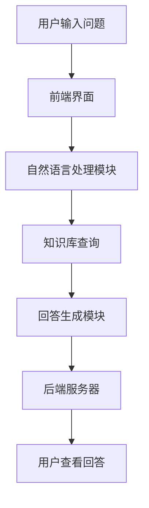
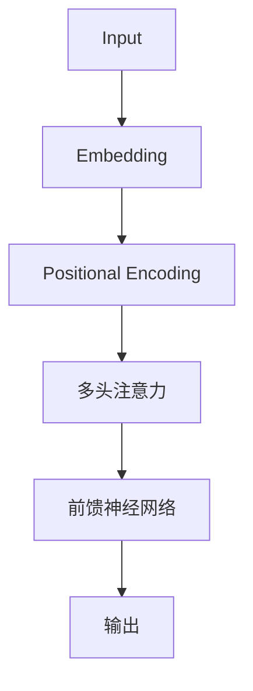
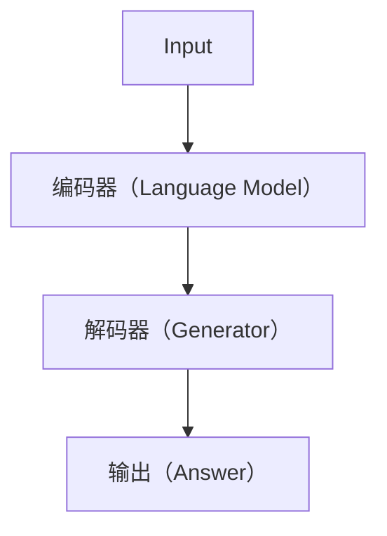
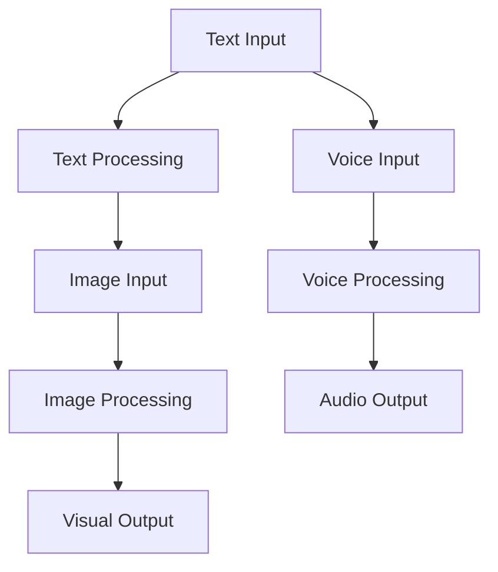
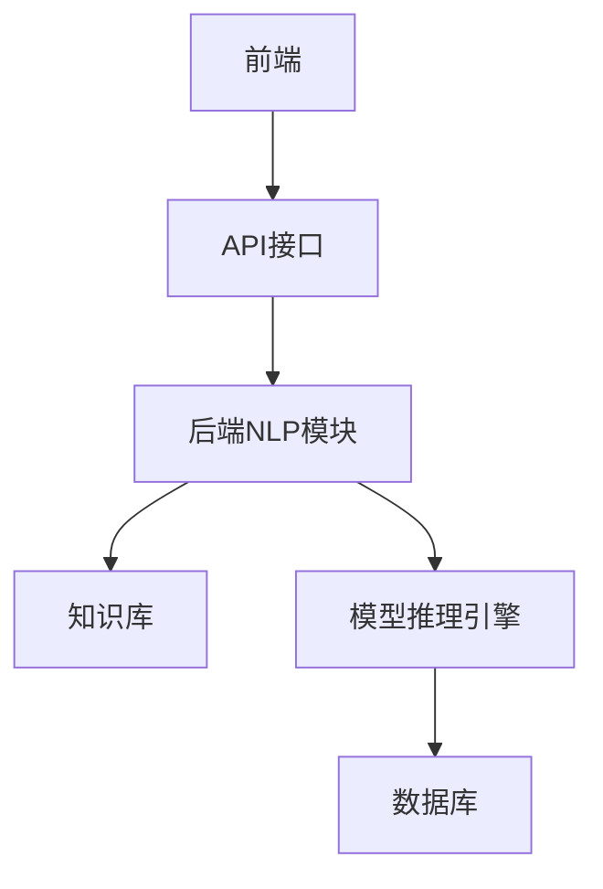

                 

### 《智能问答系统的发展趋势》文章关键词

智能问答系统、自然语言处理、语言模型、生成模型、对话管理、数据隐私、伦理问题、商业模式、行业应用、人工智能、AI技术、NLP框架、开源项目。

### 《智能问答系统的发展趋势》文章摘要

随着人工智能技术的飞速发展，智能问答系统已经成为众多领域的重要应用之一。本文将从基本概念、核心技术、实现实践和未来趋势四个方面深入探讨智能问答系统的发展现状和未来方向。通过梳理其起源与架构，分析自然语言处理、语言模型与对话管理等核心技术，并结合实际应用案例，探讨其在各行业的应用前景。同时，本文还将分析智能问答系统面临的挑战与机遇，以及其可能带来的商业模式创新。最后，本文将介绍一些相关的开发工具和资源，为读者提供进一步学习和实践的方向。

## 《智能问答系统的发展趋势》目录大纲

1. **第一部分：智能问答系统的基本概念**
   - **1.1 智能问答系统的定义与起源**
     - 1.1.1 智能问答系统的基本概念
     - 1.1.2 智能问答系统的起源与发展历程
   - **1.2 智能问答系统的架构与功能**
     - 1.2.1 智能问答系统的总体架构
     - 1.2.2 智能问答系统的核心功能模块
   - **1.3 智能问答系统的应用场景**
     - 1.3.1 企业内部问答
     - 1.3.2 公共服务平台
     - 1.3.3 教育与培训
     - 1.3.4 其他应用领域

2. **第二部分：智能问答系统的核心技术**
   - **2.1 自然语言处理基础**
     - 2.1.1 词嵌入技术
     - 2.1.2 序列模型与注意力机制
     - 2.1.3 转换器架构详解
   - **2.2 语言模型与生成模型**
     - 2.2.1 语言模型的基本原理
     - 2.2.2 生成模型的原理与应用
     - 2.2.3 语言模型与生成模型的结合
   - **2.3 对话管理技术**
     - 2.3.1 对话状态跟踪
     - 2.3.2 多轮对话策略
     - 2.3.3 多模态对话系统

3. **第三部分：智能问答系统的实现与实践**
   - **3.1 数据准备与预处理**
     - 3.1.1 数据收集
     - 3.1.2 数据预处理
     - 3.1.3 数据标注
   - **3.2 模型训练与优化**
     - 3.2.1 模型选择与训练
     - 3.2.2 模型优化与调参
     - 3.2.3 模型评估与调整
   - **3.3 系统集成与部署**
     - 3.3.1 系统架构设计
     - 3.3.2 系统集成与调试
     - 3.3.3 系统部署与运维

4. **第四部分：智能问答系统的发展趋势**
   - **4.1 智能问答系统的未来发展方向**
     - 4.1.1 智能问答系统的技术演进
     - 4.1.2 智能问答系统的商业模式创新
     - 4.1.3 智能问答系统在人工智能时代的发展前景
   - **4.2 智能问答系统的挑战与机遇**
     - 4.2.1 数据隐私与安全
     - 4.2.2 智能问答系统的伦理问题
     - 4.2.3 智能问答系统的可持续发展
   - **4.3 智能问答系统的行业应用案例**
     - 4.3.1 金融行业的应用
     - 4.3.2 医疗健康行业的应用
     - 4.3.3 教育培训行业的应用
     - 4.3.4 其他行业的应用

5. **第五部分：附录**
   - **5.1 智能问答系统开发工具与资源**
     - 5.1.1 主流自然语言处理框架
     - 5.1.2 智能问答系统开发工具
     - 5.1.3 相关开源项目与资料
   - **5.2 参考文献**
     - 5.2.1 相关书籍推荐
     - 5.2.2 学术论文推荐
     - 5.2.3 在线资源推荐

---

让我们开始第一部分的探讨，深入理解智能问答系统的基本概念、架构和功能。

### 第一部分：智能问答系统的基本概念

#### 1.1 智能问答系统的定义与起源

**1.1.1 智能问答系统的基本概念**

智能问答系统是一种基于人工智能技术的自动化问答系统，它能够理解用户提出的问题，并给出准确、合理的回答。与传统的人工客服相比，智能问答系统具有响应速度快、成本低、服务范围广等优点，能够在短时间内处理大量用户的问题。

智能问答系统的核心是自然语言处理（NLP）技术，它能够对用户的问题进行语义理解、知识检索和回答生成。这一过程通常涉及词嵌入、句法分析、语义角色标注、命名实体识别等多个NLP任务。

**1.1.2 智能问答系统的起源与发展历程**

智能问答系统的起源可以追溯到上世纪50年代，当时人工智能领域开始探索如何使计算机能够理解和回答人类语言的问题。最早的尝试之一是由约翰·麦卡锡（John McCarthy）在1956年提出的问题解答器（Question Answering System, QAS），它是最早的基于逻辑推理的问答系统。

随着计算机性能的提升和自然语言处理技术的进步，智能问答系统逐渐发展起来。1990年代，随着万维网的普及，基于搜索引擎的问答系统开始出现。这些系统通过搜索关键词来匹配用户的问题，虽然简单但效果尚可。

进入21世纪，深度学习技术的兴起为智能问答系统带来了新的契机。2018年，谷歌发布了BERT模型，它显著提升了自然语言处理任务的性能，使得智能问答系统在理解语义、回答生成等方面取得了重要突破。近年来，随着多模态学习和预训练模型的不断发展，智能问答系统也在不断进化。

#### 1.2 智能问答系统的架构与功能

**1.2.1 智能问答系统的总体架构**

智能问答系统通常由以下几个核心模块组成：

- **前端界面**：用于用户输入问题和查看回答。
- **自然语言处理（NLP）模块**：负责对用户的问题进行解析和语义理解。
- **知识库**：存储大量的事实知识和结构化数据，供NLP模块进行查询。
- **回答生成模块**：根据NLP模块的解析结果，生成合理的回答。
- **后端服务器**：用于处理用户的请求，协调各个模块的工作。

以下是一个简化的智能问答系统的Mermaid流程图：



**1.2.2 智能问答系统的核心功能模块**

1. **自然语言处理（NLP）模块**

   NLP模块是智能问答系统的核心，它负责将用户的问题转换成计算机能够理解的形式。NLP模块通常包括以下几个子模块：

   - **词嵌入**：将单词转换成向量的形式，便于计算机处理。
   - **句法分析**：分析句子的结构，提取出句子的成分和关系。
   - **语义理解**：理解句子的含义，识别出句子中的实体和关系。
   - **实体识别**：识别出句子中的命名实体，如人名、地名、组织名等。

2. **知识库**

   知识库是智能问答系统的另一个核心组件，它存储了大量的信息，包括事实知识、概念关系、语义角色等。知识库通常采用结构化数据的形式，如关系数据库或图数据库。在回答生成过程中，NLP模块会从知识库中检索相关信息，以生成合理的回答。

3. **回答生成模块**

   回答生成模块负责根据NLP模块的解析结果和知识库中的信息，生成合理的回答。回答生成的方式有多种，包括基于模板的生成、基于规则的生成和基于生成模型的生成。

4. **后端服务器**

   后端服务器负责协调各个模块的工作，处理用户的请求，并将生成的回答返回给用户。后端服务器通常使用高性能计算框架，如TensorFlow或PyTorch，来处理大规模的NLP任务。

#### 1.3 智能问答系统的应用场景

**1.3.1 企业内部问答**

在企业内部，智能问答系统可以用于员工自助服务、知识共享和客户支持。例如，员工可以通过智能问答系统查询公司的政策、流程和规章制度，提高工作效率。同时，智能问答系统还可以帮助客户快速找到他们需要的信息，提高客户满意度。

**1.3.2 公共服务平台**

公共服务平台如政府网站、天气预报、交通查询等，也可以使用智能问答系统来提供更加便捷的服务。用户可以通过智能问答系统查询相关政策、法规和办事流程，提高公共服务的效率。

**1.3.3 教育与培训**

在教育领域，智能问答系统可以用于在线教育平台的问答环节，帮助学生解决学习中遇到的问题。此外，智能问答系统还可以用于培训场景，帮助企业员工快速掌握新知识。

**1.3.4 其他应用领域**

除了上述应用场景，智能问答系统还可以用于医疗健康、金融、零售等多个领域。例如，在医疗健康领域，智能问答系统可以提供医疗咨询、健康指导等服务；在金融领域，智能问答系统可以用于客户服务、投资建议等。

通过上述讨论，我们可以看出，智能问答系统已经成为人工智能领域的重要应用之一，其在各个行业的应用前景广阔。在接下来的部分，我们将深入探讨智能问答系统的核心技术，包括自然语言处理、语言模型和对话管理，以及它们在实际应用中的实现与实践。

### 1.3 智能问答系统的应用场景

智能问答系统在当今社会已经广泛应用于多个领域，为各类用户提供便捷、高效的服务。以下是智能问答系统在一些主要应用场景中的具体体现：

#### 1.3.1 企业内部问答

在企业内部，智能问答系统作为知识共享和员工自助服务的工具，大大提升了工作效率。例如，员工可以通过智能问答系统查询公司的政策、流程、规章制度，快速了解公司相关的信息和要求。智能问答系统还可以帮助企业内部建立统一的知识库，便于知识的积累和传播。

**案例**：某大型企业的智能问答系统，帮助员工快速解决工作中遇到的问题。通过自然语言处理技术，系统可以理解员工的查询请求，并在内部知识库中检索相关信息，提供准确的答案。这不仅提高了员工的工作效率，还减少了人力资源部门的负担。

#### 1.3.2 公共服务平台

公共服务平台，如政府网站、天气预报、交通查询等，使用智能问答系统可以提供更加便捷的服务。用户可以通过简单的提问，获取所需的信息，如政府政策、天气预报、路况信息等。

**案例**：某市政府推出的智能问答系统，用于回答市民关于城市交通、社会保障、医疗卫生等方面的问题。市民可以通过文字或语音方式提问，系统会根据问题的关键词和上下文，快速提供准确的答案，提高了市民的满意度。

#### 1.3.3 教育与培训

在教育领域，智能问答系统可以用于在线教育平台的问答环节，帮助学生解决学习中遇到的问题。此外，智能问答系统还可以用于培训场景，帮助企业员工快速掌握新知识。

**案例**：某在线教育平台引入智能问答系统，帮助学生解答学习过程中的疑问。学生可以通过提问获取详细的解答，甚至可以模拟对话，与虚拟教师互动，提高学习效果。同时，智能问答系统还可以为教师提供数据分析，帮助他们了解学生的学习情况，及时调整教学策略。

#### 1.3.4 其他应用领域

除了上述应用场景，智能问答系统还可以应用于医疗健康、金融、零售等多个领域。

**医疗健康**：智能问答系统可以提供医疗咨询、健康指导等服务，帮助用户了解病情、预防疾病。例如，用户可以通过智能问答系统查询疾病症状、治疗方法、预防措施等。

**金融**：智能问答系统可以用于客户服务、投资建议等。金融机构可以通过智能问答系统为用户提供投资建议、产品介绍、业务咨询等服务，提高客户体验。

**零售**：智能问答系统可以用于电商平台的客户支持，帮助用户解答关于商品信息、订单处理等方面的问题，提高客户满意度。

**案例**：某电商平台的智能问答系统，能够快速解答用户关于商品信息、订单状态等方面的问题。用户可以通过文字或语音方式提问，系统会根据问题关键词和上下文，提供准确的答案和解决方案。

总之，智能问答系统在各个行业中的应用场景广泛，其通过自然语言处理技术，为用户提供了高效、便捷的服务，提高了行业的运营效率和服务水平。

### 第二部分：智能问答系统的核心技术

智能问答系统的核心在于其技术实现，这些技术不仅决定了系统的性能，也直接影响用户体验。本部分将深入探讨智能问答系统的核心技术，包括自然语言处理（NLP）基础、语言模型与生成模型、以及对话管理技术。

#### 2.1 自然语言处理基础

自然语言处理是智能问答系统的基石，它涉及从文本中提取有用信息的一系列任务。以下是一些关键的NLP技术：

**2.1.1 词嵌入技术**

词嵌入（Word Embedding）是将词汇映射到高维向量空间的技术。通过词嵌入，每个单词都可以表示为一个固定长度的向量，这使得计算机能够处理和理解语言。词嵌入技术主要有以下几种：

- **基于统计的方法**：如Count Vector和TF-IDF，这些方法通过计算词频或词频与逆文档频率的乘积来生成词嵌入。
- **基于神经网络的方法**：如Word2Vec、GloVe和BERT。这些方法通过神经网络训练生成词嵌入，能够更好地捕捉词义和词之间的关系。

**2.1.2 序列模型与注意力机制**

序列模型（Sequence Model）用于处理文本序列，常见的序列模型包括循环神经网络（RNN）和其变体如长短期记忆网络（LSTM）和门控循环单元（GRU）。这些模型能够捕捉文本中的时间依赖关系，但在处理长序列时存在梯度消失或爆炸的问题。

为了解决这个问题，注意力机制（Attention Mechanism）被引入。注意力机制通过动态分配不同的权重来关注序列中的关键部分，从而提高模型的序列处理能力。例如，在机器翻译任务中，注意力机制可以使得模型在生成每个词时关注输入序列的不同部分，从而提高翻译的准确性。

**2.1.3 转换器架构详解**

转换器架构（Transformer）是近年来在自然语言处理领域取得突破性进展的一种模型。与传统的RNN和LSTM不同，转换器架构通过自注意力机制（Self-Attention）和多头注意力（Multi-Head Attention）来处理文本序列，具有并行计算的优势。

转换器的核心组件包括：

- **自注意力机制**：允许模型在处理每个词时考虑整个输入序列的信息，从而捕捉长距离依赖关系。
- **多头注意力**：通过多个独立的注意力机制来提取不同的特征，提高了模型的表示能力。
- **前馈神经网络**：在注意力机制之后，每个头都会通过一个前馈神经网络进行额外的非线性变换。

以下是一个简单的转换器架构的Mermaid流程图：



#### 2.2 语言模型与生成模型

语言模型（Language Model）是用于预测文本序列的概率分布的模型，它是智能问答系统中生成回答的关键。生成模型（Generative Model）则通过建模文本生成过程来生成新的文本。

**2.2.1 语言模型的基本原理**

语言模型的基本任务是给定一个单词序列，计算该序列的概率。最常用的语言模型是基于神经网络的模型，如循环神经网络（RNN）和转换器（Transformer）。

语言模型的主要应用包括：

- **文本分类**：通过预测单词序列的类别来对文本进行分类。
- **机器翻译**：通过语言模型将源语言序列转换为目标语言序列。
- **问答系统**：使用语言模型来生成回答，提高回答的自然性和准确性。

**2.2.2 生成模型的原理与应用**

生成模型通过建模数据生成过程来生成新的数据。在智能问答系统中，生成模型用于生成回答，常用的生成模型包括：

- **循环神经网络（RNN）**：RNN通过状态共享来捕捉序列中的时间依赖关系，但存在梯度消失和梯度爆炸的问题。
- **生成对抗网络（GAN）**：GAN通过两个对抗网络（生成器和判别器）相互博弈来生成数据，但训练不稳定且计算复杂。
- **转换器（Transformer）**：Transformer通过自注意力机制来捕捉序列中的依赖关系，是当前生成模型的主流选择。

**2.2.3 语言模型与生成模型的结合**

将语言模型和生成模型结合起来，可以进一步提高问答系统的性能。一种常见的方法是使用基于语言模型的前缀生成模型，如Seq2Seq模型，其中语言模型用于编码输入问题，生成模型用于解码回答。

以下是一个简单的Seq2Seq模型的Mermaid流程图：



#### 2.3 对话管理技术

对话管理技术是智能问答系统的关键组成部分，它负责处理对话的流畅性和连贯性。以下是对话管理的一些关键技术：

**2.3.1 对话状态跟踪**

对话状态跟踪（Dialogue State Tracking）用于识别和跟踪用户对话中的关键信息，如用户意图、上下文信息等。通过对话状态跟踪，系统可以更好地理解用户的意图，并生成相关的回答。

**2.3.2 多轮对话策略**

多轮对话策略（Multi-turn Dialogue Strategy）用于处理多轮对话中的信息更新和上下文保持。常见的多轮对话策略包括基于规则的策略和基于学习的策略。

- **基于规则的策略**：通过预定义的规则来处理多轮对话，简单但有限。
- **基于学习的策略**：使用机器学习模型来学习多轮对话的规律，如序列到序列模型（Seq2Seq）。

**2.3.3 多模态对话系统**

多模态对话系统（Multi-modal Dialogue System）结合了文本、语音、图像等多种输入和输出方式，提高了对话的多样性和交互性。例如，在医疗咨询场景中，系统可以同时处理用户的文本提问和语音回答，提高用户体验。

以下是一个简单的多模态对话系统的Mermaid流程图：



通过上述对自然语言处理基础、语言模型与生成模型、以及对话管理技术的深入探讨，我们可以看到，智能问答系统的核心技术不仅决定了系统的性能，还直接影响用户体验。在接下来的部分，我们将进一步探讨智能问答系统的实现与实践，包括数据准备、模型训练、系统集成与部署等关键环节。

### 3.1 数据准备与预处理

数据准备与预处理是构建智能问答系统的第一步，也是至关重要的一步。高质量的数据是实现高效、准确问答系统的基石。以下是数据准备与预处理的关键步骤：

**3.1.1 数据收集**

数据收集是数据准备的第一步，通常包括以下几个方面：

- **公开数据集**：许多领域已经有许多公开的数据集，如维基百科、社交媒体数据等。这些数据集为初学者提供了丰富的资源。
- **自定义数据集**：对于特定应用场景，可能需要收集定制化的数据。例如，在医疗问答系统中，可能需要收集专业的医疗文本数据。
- **数据爬取**：通过网络爬虫等技术收集大量数据。但需要注意遵守法律法规和网站的使用协议。

**3.1.2 数据预处理**

数据预处理是将原始数据转换为适合训练模型的形式的过程。以下是几个关键的数据预处理步骤：

- **文本清洗**：去除文本中的无关信息，如HTML标签、特殊字符、停用词等。这有助于减少噪声，提高模型的性能。
  ```python
  import re
  import nltk
  
  def clean_text(text):
      text = re.sub('<[^>]*>', '', text)  # 去除HTML标签
      text = re.sub('[^A-Za-z]', ' ', text)  # 去除非字母字符
      text = text.lower()  # 转换为小写
      text = nltk.word_tokenize(text)  # 分词
      text = [word for word in text if word not in nltk.corpus.stopwords.words('english')]  # 去除停用词
      return text
  ```

- **文本标准化**：对文本进行统一格式处理，如统一标点符号、统一大小写等。
  ```python
  def normalize_text(text):
      text = text.replace('-', ' ')
      text = text.replace('.', ' ')
      text = text.replace(',', ' ')
      text = text.replace('!', ' ')
      text = text.replace('?', ' ')
      text = text.replace(':', ' ')
      text = text.replace(';', ' ')
      text = text.replace('(', ' ')
      text = text.replace(')', ' ')
      return text
  ```

- **数据标注**：对于某些应用场景，需要对数据进行标注，如实体识别、情感分析等。标注数据通常需要人工完成，是一个耗时且费力的过程。

**3.1.3 数据集划分**

在数据预处理完成后，需要将数据集划分为训练集、验证集和测试集，以确保模型的泛化能力和评估效果。一般来说，训练集用于模型训练，验证集用于调参和选择最佳模型，测试集用于最终评估模型性能。

```python
from sklearn.model_selection import train_test_split

# 假设data是预处理后的数据列表，label是相应的标签列表
X_train, X_test, y_train, y_test = train_test_split(data, label, test_size=0.2, random_state=42)
```

**3.1.4 数据增强**

数据增强是通过多种方法增加数据多样性，从而提高模型对未见数据的泛化能力。常见的数据增强方法包括：

- **填充**：通过在文本中插入随机词或短语来增加数据的多样性。
- **移除**：随机移除文本中的某些词或短语。
- **替换**：将文本中的某些词或短语替换为同义词或随机词。

```python
import random

def augment_text(text):
    words = text.split()
    for i in range(len(words)):
        if random.random() < 0.5:
            words[i] = random.choice(nltk.corpus.words.words())
    return ' '.join(words)
```

**3.1.5 特征提取**

特征提取是将文本数据转换为模型可处理的形式。常用的特征提取方法包括：

- **词嵌入**：将文本转换为向量的形式，如Word2Vec、GloVe等。
- **TF-IDF**：计算词在文档中的重要度。
- **BERT**：使用预训练的BERT模型进行特征提取。

通过上述数据准备与预处理步骤，我们可以获得适合训练智能问答系统的数据集。在下一节中，我们将探讨模型训练与优化的关键环节。

### 3.2 模型训练与优化

在完成数据准备与预处理后，接下来便是模型训练与优化。这一阶段的核心目标是训练一个能够在给定数据集上准确预测的模型，并不断优化其性能。以下是模型训练与优化的关键步骤：

**3.2.1 模型选择与训练**

选择合适的模型是训练成功的第一步。对于智能问答系统，常用的模型包括基于循环神经网络（RNN）、长短期记忆网络（LSTM）、转换器（Transformer）等。以下是几种常用的模型及其特点：

- **循环神经网络（RNN）**：RNN能够处理序列数据，但在长距离依赖问题上存在梯度消失问题。
- **长短期记忆网络（LSTM）**：LSTM通过门控机制解决了RNN的梯度消失问题，能够更好地捕捉长距离依赖关系。
- **转换器（Transformer）**：Transformer采用自注意力机制，能够在处理长序列时保持较高的性能。

**示例：基于LSTM的训练过程**

以下是一个使用LSTM进行训练的Python代码示例：

```python
import tensorflow as tf
from tensorflow.keras.models import Sequential
from tensorflow.keras.layers import LSTM, Dense, Embedding

# 假设（X_train, y_train）是预处理后的数据集
vocab_size = 10000  # 词汇表大小
embedding_dim = 256  # 嵌入维度
max_sequence_length = 100  # 序列最大长度

# 构建LSTM模型
model = Sequential()
model.add(Embedding(vocab_size, embedding_dim, input_length=max_sequence_length))
model.add(LSTM(128, return_sequences=True))
model.add(Dense(1, activation='sigmoid'))

model.compile(optimizer='adam', loss='binary_crossentropy', metrics=['accuracy'])
model.fit(X_train, y_train, epochs=10, batch_size=32, validation_split=0.1)
```

**3.2.2 模型优化与调参**

在模型训练过程中，通常需要进行调参以优化模型性能。调参包括以下方面：

- **学习率**：学习率影响模型收敛速度和稳定性，常用的方法包括固定学习率、学习率衰减和自适应学习率。
- **批量大小**：批量大小影响模型的计算效率和收敛速度，需要根据数据集大小和计算资源进行选择。
- **隐藏层单元数**：隐藏层单元数影响模型的复杂度和学习能力，需要根据任务复杂度进行选择。
- **优化器**：选择合适的优化器，如SGD、Adam等，可以显著影响模型训练效果。

**示例：使用学习率衰减**

```python
from tensorflow.keras.optimizers import Adam

initial_learning_rate = 0.001
lr_schedule = tf.keras.optimizers.schedules.ExponentialDecay(
    initial_learning_rate,
    decay_steps=1000,
    decay_rate=0.96,
    staircase=True)

optimizer = Adam(learning_rate=lr_schedule)
```

**3.2.3 模型评估与调整**

在模型训练完成后，需要使用验证集和测试集对模型进行评估，以确定其性能。常用的评估指标包括准确率、召回率、F1分数等。如果模型性能不理想，可以尝试以下方法进行调整：

- **数据增强**：通过增加数据的多样性来提高模型性能。
- **增加训练时间**：增加训练时间可以使得模型更好地拟合数据，但需注意避免过拟合。
- **调整模型结构**：根据任务需求调整模型结构，如增加隐藏层、调整层的大小等。
- **集成方法**：使用集成方法，如模型堆叠、集成学习等，来提高模型性能。

通过上述模型训练与优化的步骤，我们可以逐步提升智能问答系统的性能。在下一节中，我们将探讨系统集成与部署的相关内容。

### 3.3 系统集成与部署

在完成模型训练与优化后，接下来便是将训练好的模型集成到系统中，并进行部署，使其能够为用户提供服务。以下是系统集成与部署的关键步骤：

**3.3.1 系统架构设计**

系统架构设计是确保智能问答系统能够高效、稳定运行的基础。一个典型的智能问答系统架构通常包括以下几个模块：

- **前端**：用于接收用户的输入，展示回答结果，可以是Web页面、移动应用或语音助手等。
- **后端**：包括NLP模块、知识库、模型推理引擎等，用于处理用户的输入，生成回答。
- **数据库**：存储知识库数据、用户数据等，可以是关系数据库或图数据库。
- **API接口**：提供外部系统与智能问答系统的交互接口，如RESTful API。

以下是一个简化的智能问答系统架构图：



**3.3.2 系统集成与调试**

系统集成是将各个模块集成在一起，确保系统各个部分能够协同工作。以下是几个关键步骤：

- **API接口设计**：设计清晰的API接口，确保前端与后端能够顺畅通信。API接口通常包括输入参数、输出结果、请求和响应格式等。
- **NLP模块集成**：将NLP模块集成到后端，使其能够处理用户的输入，进行语义理解、知识检索和回答生成。
- **知识库集成**：将知识库集成到系统中，确保NLP模块能够快速检索相关信息，生成合理的回答。
- **模型推理引擎集成**：将训练好的模型集成到系统中，用于实时推理，生成回答。

**示例：使用Flask构建API接口**

```python
from flask import Flask, request, jsonify
import json

app = Flask(__name__)

# 假设我们有处理输入的函数process_input和生成回答的函数generate_answer
def process_input(input_data):
    # 处理输入数据的逻辑
    pass

def generate_answer(input_data):
    # 生成回答的逻辑
    pass

@app.route('/api/ask', methods=['POST'])
def ask():
    data = request.get_json()
    input_data = data['input']
    processed_input = process_input(input_data)
    answer = generate_answer(processed_input)
    return jsonify({'answer': answer})

if __name__ == '__main__':
    app.run(debug=True)
```

- **调试与优化**：在系统集成过程中，需要进行充分的调试，确保系统能够正常工作。调试过程可能包括API测试、性能优化、错误处理等。根据调试结果，可能需要调整系统架构或代码，以提高系统的稳定性和性能。

**3.3.3 系统部署与运维**

系统部署是将集成好的系统部署到生产环境，使其能够为用户提供服务。以下是几个关键步骤：

- **环境配置**：配置服务器环境，包括操作系统、Python环境、数据库等，确保系统能够正常运行。
- **容器化部署**：使用容器技术，如Docker，将系统打包成容器，提高部署效率和可移植性。
- **持续集成与持续部署（CI/CD）**：通过CI/CD工具，如Jenkins、GitLab CI等，实现代码的自动化测试和部署，确保系统的持续更新和稳定运行。
- **性能监控与优化**：使用性能监控工具，如Prometheus、Grafana等，实时监控系统的性能，发现并解决问题。

**示例：使用Docker容器化部署**

```Dockerfile
# Dockerfile
FROM python:3.8

# 安装依赖
RUN pip install flask

# 复制应用代码
COPY . /app
WORKDIR /app

# 运行应用
CMD ["python", "app.py"]
```

通过上述步骤，我们可以将智能问答系统集成并部署到生产环境中，使其为用户提供高效、准确的服务。在下一部分中，我们将探讨智能问答系统的未来发展方向。

### 第四部分：智能问答系统的发展趋势

随着人工智能技术的不断进步，智能问答系统也在不断演进，展现出广阔的发展前景。本部分将深入探讨智能问答系统的未来发展方向、面临的挑战与机遇，以及其在不同行业中的应用案例。

#### 4.1 智能问答系统的未来发展方向

**4.1.1 智能问答系统的技术演进**

随着深度学习、自然语言处理和生成模型等技术的发展，智能问答系统正在经历技术上的显著进步。以下是一些关键技术趋势：

- **预训练语言模型**：预训练语言模型（如BERT、GPT等）的广泛应用，使得智能问答系统在语义理解、回答生成等方面取得了显著提升。这些模型通过在海量文本数据上进行预训练，能够更好地捕捉语言中的复杂结构和语义信息。
- **多模态对话系统**：多模态对话系统能够结合文本、语音、图像等多种输入和输出方式，提供更加丰富和自然的交互体验。例如，在医疗咨询场景中，多模态对话系统可以同时处理用户的文本提问和医学图像，提供更加准确的诊断建议。
- **强化学习**：强化学习技术在对话系统中的应用，使得系统可以通过与用户的互动不断学习和优化对话策略，提高对话的连贯性和用户体验。

**4.1.2 智能问答系统的商业模式创新**

随着智能问答系统技术的成熟，其商业应用前景也日益广阔。以下是一些可能的商业模式创新：

- **付费问答服务**：企业可以为特定领域的用户提供高质量的问答服务，收取一定的费用。例如，专业咨询服务、投资建议服务等。
- **广告植入**：在问答系统中植入广告，通过用户提问获取的上下文信息，提供相关产品的推广。例如，在购物平台上，用户询问某商品时，系统可以推荐相关的促销活动或同类商品。
- **SaaS服务**：将智能问答系统作为SaaS服务提供给其他企业，帮助它们提升客户服务效率。企业可以根据自身需求定制问答系统，提高用户满意度。

**4.1.3 智能问答系统在人工智能时代的发展前景**

随着人工智能技术的不断进步，智能问答系统在各个领域的发展前景广阔。以下是一些重要领域：

- **金融**：智能问答系统可以用于金融咨询、投资建议、客户服务等方面，提高金融服务的效率和用户体验。
- **医疗健康**：智能问答系统可以提供医疗咨询、健康指导等服务，帮助用户了解病情、预防疾病，减轻医疗系统的压力。
- **教育**：智能问答系统可以用于在线教育平台的问答环节，帮助学生解决学习中遇到的问题，提高学习效果。
- **零售**：智能问答系统可以用于电商平台的客户支持，提供商品咨询、订单处理等服务，提高用户满意度。

#### 4.2 智能问答系统的挑战与机遇

**4.2.1 数据隐私与安全**

智能问答系统在处理用户数据时，面临数据隐私和安全的风险。以下是一些解决方案：

- **数据加密**：对用户数据进行加密处理，确保数据在传输和存储过程中不被窃取或篡改。
- **隐私保护**：采用差分隐私、同态加密等隐私保护技术，确保用户隐私不被泄露。
- **安全审计**：定期进行安全审计，及时发现和解决潜在的安全漏洞。

**4.2.2 智能问答系统的伦理问题**

智能问答系统在回答生成过程中，可能涉及伦理问题，如歧视、偏见等。以下是一些解决方案：

- **数据清洗**：在训练数据集时，对数据进行清洗，移除可能引发偏见的信息。
- **偏见检测与纠正**：开发算法检测和纠正模型中的偏见，确保回答的公正性。
- **用户反馈机制**：建立用户反馈机制，允许用户报告不当回答，及时调整和优化模型。

**4.2.3 智能问答系统的可持续发展**

智能问答系统的可持续发展需要考虑以下几个方面：

- **资源优化**：通过高效计算、分布式架构等技术，降低系统运行的成本和能耗。
- **知识更新**：定期更新知识库，确保问答系统能够提供最新、最准确的信息。
- **社区合作**：与行业专家、学术机构等合作，共同推动智能问答系统的发展。

#### 4.3 智能问答系统的行业应用案例

**4.3.1 金融行业的应用**

金融行业是智能问答系统的重要应用领域之一。以下是一些具体的案例：

- **客户服务**：智能问答系统可以用于金融企业的客户服务，提供快速、准确的回答，提高客户满意度。
- **投资建议**：基于用户的投资偏好和历史记录，智能问答系统可以提供个性化的投资建议，帮助用户做出更明智的投资决策。
- **风险管理**：智能问答系统可以协助金融企业进行风险管理和合规检查，提高风险管理效率。

**4.3.2 医疗健康行业的应用**

医疗健康行业对智能问答系统的需求日益增长。以下是一些具体案例：

- **健康咨询**：智能问答系统可以提供基本的健康咨询，帮助用户了解疾病症状、预防措施等，减轻医疗系统的压力。
- **患者教育**：智能问答系统可以为学生提供医学知识教育，帮助他们更好地理解疾病和治疗方案。
- **临床支持**：智能问答系统可以协助医生进行诊断和治疗，提供辅助决策支持，提高医疗质量。

**4.3.3 教育培训行业的应用**

智能问答系统在教育领域具有广泛的应用前景。以下是一些具体案例：

- **在线教育**：智能问答系统可以用于在线教育平台的问答环节，帮助学生解决学习中遇到的问题，提高学习效果。
- **教师辅助**：智能问答系统可以协助教师进行教学评估和反馈，提供个性化的教学建议。
- **学术研究**：智能问答系统可以协助研究人员进行文献搜索和数据分析，提高研究效率。

**4.3.4 其他行业的应用**

智能问答系统在其他行业的应用也在不断拓展，以下是一些具体案例：

- **零售**：智能问答系统可以用于电商平台，提供商品咨询、订单处理等服务，提高用户满意度。
- **旅游**：智能问答系统可以提供旅游咨询、行程规划等服务，帮助用户更好地规划旅行。
- **法律**：智能问答系统可以提供基本的法律咨询，帮助用户了解法律知识，提供法律建议。

通过上述讨论，我们可以看到，智能问答系统在技术、商业应用和行业应用等方面都展现出巨大的发展潜力。随着人工智能技术的不断进步，智能问答系统将不断优化和升级，为各行各业带来更多便利和效益。

### 第五部分：附录

#### 5.1 智能问答系统开发工具与资源

智能问答系统的开发涉及多种工具和资源，以下是一些常用的工具和资源：

**5.1.1 主流自然语言处理框架**

- **TensorFlow**：Google开发的开源机器学习框架，广泛应用于自然语言处理任务。
- **PyTorch**：由Facebook开发的开源机器学习框架，具有灵活的动态计算图机制。
- **spaCy**：一个流行的自然语言处理库，提供高效的词嵌入、句法分析等功能。
- **NLTK**：一个经典的自然语言处理库，包含丰富的文本处理工具和算法。

**5.1.2 智能问答系统开发工具**

- **Dialogflow**：Google推出的自然语言处理平台，支持对话管理和智能问答系统的开发。
- **Rasa**：一个开源的对话管理框架，提供从对话模型训练到集成部署的一体化解决方案。
- **OpenAI's GPT-3**：OpenAI开发的强大语言模型，可用于智能问答系统中的回答生成。

**5.1.3 相关开源项目与资料**

- **TensorFlow.js**：TensorFlow的JavaScript版，适用于Web端智能问答系统开发。
- **Hugging Face's Transformers**：一个流行的Transformer模型库，提供多种预训练模型和API。
- **Stanford NLP**：斯坦福大学开发的自然语言处理工具包，包括词嵌入、句法分析等。
- **AI Challenger**：一个大型中文问答数据集，可用于智能问答系统的训练和评估。

#### 5.2 参考文献

为了深入了解智能问答系统的理论和技术，以下是一些推荐的参考文献：

- **《自然语言处理综述》（A Review of Natural Language Processing）**
- **《深度学习与自然语言处理》（Deep Learning for Natural Language Processing）**
- **《智能问答系统：原理、方法与实践》（Intelligent Question Answering Systems: Principles, Methods, and Applications）**
- **《对话系统设计：从理论到实践》（Dialogue Systems Design: From Theory to Practice）**
- **《人工智能：一种现代方法》（Artificial Intelligence: A Modern Approach）**

通过阅读这些文献，可以更全面地了解智能问答系统的理论基础、实现方法和应用前景。

---

### 总结与展望

智能问答系统作为人工智能领域的重要应用，正逐步改变着我们的工作和生活方式。本文从基本概念、核心技术、实现实践和未来趋势四个方面对智能问答系统进行了深入探讨。我们看到了智能问答系统在各个行业的广泛应用和巨大潜力，也意识到了其在数据隐私、伦理问题等方面的挑战。

随着人工智能技术的不断进步，智能问答系统将继续发展，实现更加智能、自然和高效的交互。未来，智能问答系统将在更广泛的领域发挥重要作用，为人类带来更多便利和效益。

让我们一起期待智能问答系统带来的美好未来，不断探索和创新，为这一领域的发展贡献力量。作者：AI天才研究院/AI Genius Institute & 禅与计算机程序设计艺术 /Zen And The Art of Computer Programming。

