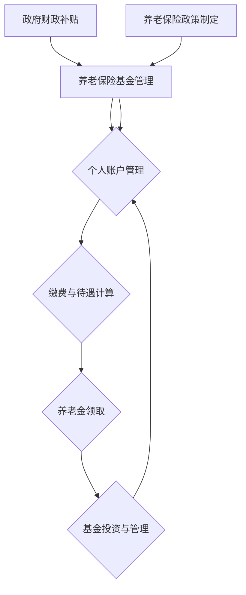
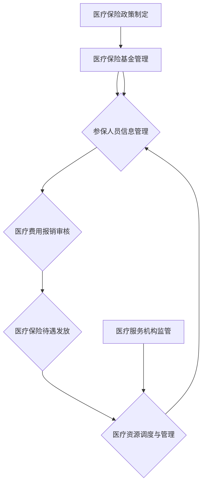
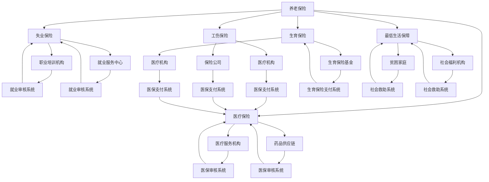
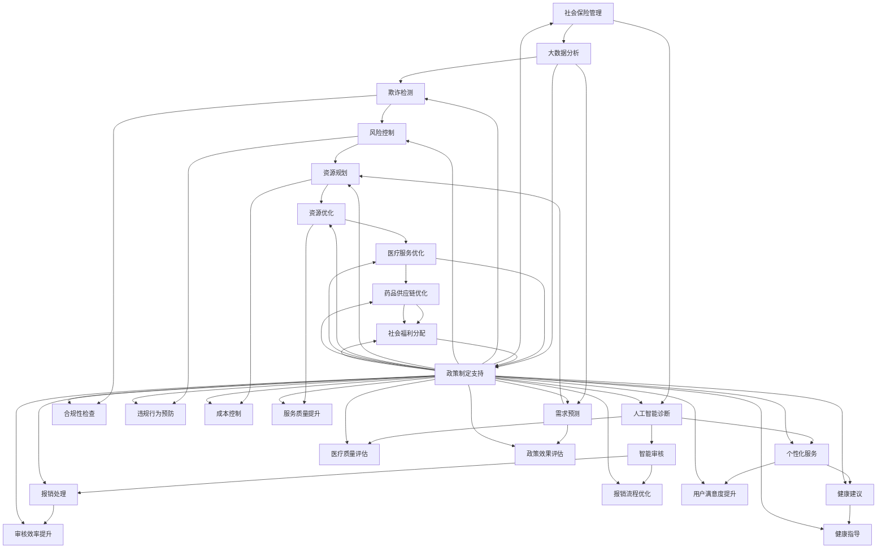
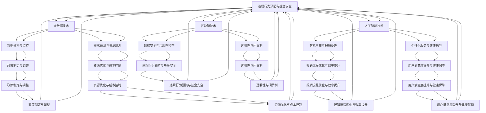

                 

# 第1章：社会保障体系概述

社会保障体系是现代国家维护社会公平、保障公民基本生活权益的重要制度安排。随着经济和社会的发展，社会保障体系的重要性日益凸显。本章将概述社会保障的定义、类型、发展历程以及社会保障体系的重要性。

### 1.1 社会保障的定义与类型

#### 社会保障的定义

社会保障是指国家或社会团体通过立法和行政手段，为公民提供基本生活保障和福利保障的一系列制度安排。其核心目标是保障全体公民的基本生活权益，缓解社会矛盾，促进社会和谐与稳定。

#### 社会保障的类型

社会保障主要包括养老保险、医疗保险、失业保险、工伤保险、生育保险和最低生活保障等。其中，养老保险和医疗保险是社会保障体系的核心内容。

- **养老保险**：为退休人员提供基本生活费用和福利待遇，保障其退休后的生活质量。
- **医疗保险**：为参保人员提供医疗费用报销，减轻其医疗负担。
- **失业保险**：为失业人员提供基本生活费用，帮助其度过失业期。
- **工伤保险**：为因工受伤、致残或死亡的人员提供经济补偿和医疗保障。
- **生育保险**：为生育妇女提供生育医疗费用和生育津贴。
- **最低生活保障**：为贫困人口提供基本生活费用，保障其基本生活需求。

### 1.2 社会保障的发展历程

#### 萌芽阶段

社会保障起源于慈善事业和宗教救济，主要是由个人和慈善机构自发提供。这一阶段的社会保障制度较为简单，保障范围有限。

#### 制度形成阶段

随着工业化进程的加快，各国开始建立社会保障制度。1883年，德国制定了世界上第一个社会保险法，标志着社会保障制度的形成。

#### 普及与发展阶段

二战后，各国社会保障制度逐渐完善，社会保障范围不断扩大，覆盖面逐步提高。这一阶段，社会保障制度成为国家治理的重要工具，为保障社会稳定和促进经济发展发挥了重要作用。

#### 改革与创新阶段

21世纪以来，随着人口老龄化和经济全球化，各国社会保障制度面临新的挑战，纷纷进行改革和创新。这一阶段，社会保障制度在适应新形势、应对新挑战中不断发展和完善。

### 1.3 社会保障的重要性

#### 保障基本生活

社会保障为公民提供基本生活保障，缓解贫困和失业问题，确保公民的基本生活需求。养老保险、医疗保险、失业保险等制度为公民提供了养老、医疗和失业保障，降低了生活风险。

#### 维护社会稳定

社会保障制度有助于减少社会不平等，缓解社会矛盾，维护社会稳定。通过再分配，社会保障制度缩小了贫富差距，促进了社会公平，降低了社会冲突的可能性。

#### 促进经济发展

社会保障制度能够提高劳动者的生产积极性，促进劳动力市场的稳定，从而推动经济发展。养老保险、医疗保险等制度为劳动者提供了稳定的生活保障，降低了劳动者的后顾之忧，使其能够更加专注于工作。

#### 实现社会公平

社会保障制度是实现社会公平的重要手段，通过再分配，减少贫富差距，促进社会公平。社会保障制度保障了全体公民的基本权益，使每个人都能享受到公平的社会待遇。

### 1.4 社会保障面临的挑战

#### 人口老龄化

人口老龄化是社会保障面临的重要挑战之一。随着医疗条件的改善和生育政策的调整，老年人口比例逐年上升，养老保险基金压力增大，医疗保险需求增加，社会保障体系面临巨大挑战。

#### 经济全球化

经济全球化对社会保障制度产生了深远影响。劳动力流动性增加，跨国社会保障制度差异明显，社会保障制度面临新的挑战。

#### 科技进步

科技进步对社会保障制度产生了积极影响，如社会保障信息化、智能化等。但同时也带来了新的挑战，如社会保障数据安全、人工智能在社会保障中的应用等。

### 1.5 本章小结

社会保障体系是现代国家治理的重要组成部分，具有保障基本生活、维护社会稳定、促进经济发展和实现社会公平等重要功能。随着人口老龄化、经济全球化和科技进步等挑战的加剧，社会保障制度需要不断改革和创新，以应对新形势、新挑战，确保其可持续发展。

## 第2章：养老保障体系分析

养老保障体系是社会保障体系的核心组成部分，直接关系到公民的养老生活质量和社会稳定。随着人口老龄化问题的日益突出，养老保障体系面临着巨大的压力和挑战。本章将对养老保障体系进行分析，包括养老需求预测、养老保险制度评估以及未来养老保障模式的探讨。

### 2.1 养老需求预测

#### 2.1.1 人口老龄化趋势

人口老龄化是全球性的挑战，尤其是在中国和许多发达国家，老年人口比例迅速增加。根据联合国的预测，到2050年，全球60岁及以上人口将达到22亿，占总人口的22%。其中，中国老年人口将达到3.5亿，占总人口的27%。

##### 人口老龄化对养老需求的影响：

1. **养老负担加重**：随着老年人口比例增加，养老保险基金压力增大，缴费人数减少，养老基金缺口加大。

2. **医疗需求增加**：老年人口患病率高，医疗费用支出增加，对医疗保险基金造成压力。

3. **劳动力市场紧张**：老年人口增加，劳动力供给减少，可能导致劳动力市场紧张，影响经济发展。

#### 2.1.2 养老需求分析

养老需求主要包括以下几个方面：

1. **经济需求**：包括养老金、住房、生活费用等，保障老年人基本生活。

2. **医疗需求**：包括医疗服务、药品费用等，保障老年人的健康需求。

3. **精神需求**：包括陪伴、关爱、社交等，满足老年人的心理需求。

##### 当前养老需求现状和问题：

1. **供需不平衡**：养老服务供给不足，部分老年人无法享受到优质的养老服务。

2. **服务质量不高**：部分养老服务机构的设施和服务水平较低，难以满足老年人需求。

3. **养老资源分配不均**：不同地区、不同群体的养老资源分配不均，影响养老需求的满足。

### 2.2 养老保险制度评估

#### 2.2.1 当前养老保险制度存在的问题

##### 当前养老保险制度存在以下问题：

1. **覆盖率低**：部分人群尚未纳入养老保险覆盖范围，尤其是灵活就业人员和农民工。

2. **基金缺口大**：随着人口老龄化加剧，养老保险基金压力增大，部分地区出现基金缺口。

3. **待遇差距大**：不同地区、不同群体的养老保险待遇差距较大，影响社会公平。

4. **管理水平低**：部分地区的养老保险管理水平较低，存在资金管理不规范、信息不透明等问题。

#### 2.2.2 养老保险制度改进方案

##### 针对上述问题，养老保险制度需要从以下几个方面进行改进：

1. **扩大养老保险覆盖范围**：将灵活就业人员和农民工等纳入养老保险覆盖范围，提高养老保险覆盖率。

2. **优化养老保险基金筹集和管理**：增加养老保险基金来源，提高基金使用效率，确保基金安全。

3. **完善养老保险待遇确定机制**：建立多层次的养老保险待遇确定机制，缩小养老保险待遇差距，实现社会公平。

4. **提升养老保险管理水平**：加强养老保险基金监管，提高养老保险管理的信息化和规范化水平。

### 2.3 未来养老保障模式探讨

#### 2.3.1 养老金个人账户改革

##### 养老金个人账户改革的核心：

1. **增强个人养老意识**：通过个人账户制度，提高个人对养老责任的认知和承担。

2. **提高养老金管理效率**：个人账户制度有助于提高养老金的管理效率，降低运营成本。

3. **促进养老金的积累和保值增值**：个人账户养老金可以根据市场情况实现投资增值，提高养老金的回报率。

#### 2.3.2 养老保险第三支柱发展

##### 养老保险第三支柱发展的核心：

1. **发挥市场作用**：鼓励商业养老保险发展，发挥市场在养老保障中的作用。

2. **丰富养老保障产品**：提供多样化、个性化的养老保障产品，满足不同人群的养老需求。

3. **促进养老保险体系的完善**：第三支柱的发展有助于完善养老保险体系，提高养老保障水平。

#### 2.3.3 社会养老服务体系建设

##### 社会养老服务体系建设的关键：

1. **提高养老服务质量**：加大对养老服务机构的建设投入，提高养老服务质量。

2. **推动养老服务社会化**：鼓励社会力量参与养老服务，提高养老服务的多样性和可及性。

3. **发展智慧养老**：利用互联网、大数据、人工智能等现代技术，提高养老服务的智能化水平。

### 2.4 本章小结

养老保障体系是社会保障体系的重要组成部分，直接关系到老年人的生活质量和社会稳定。随着人口老龄化的加剧，养老保障体系面临着诸多挑战。通过养老需求预测、养老保险制度评估以及未来养老保障模式的探讨，我们提出了完善养老保险制度、发展第三支柱、提升养老服务质量等方面的对策。这些措施将有助于应对养老保障体系的挑战，提高养老保障水平。

## 第3章：医疗保险体系分析

医疗保险是社会保障体系的重要组成部分，对于保障公民的健康权益、减轻医疗负担具有重要意义。随着医疗技术和服务的不断进步，医疗保险体系也面临着新的挑战。本章将对医疗保险体系进行分析，包括医疗需求分析、医疗保险制度评估以及未来医疗保险模式探讨。

### 3.1 医疗需求分析

医疗需求是指公民对医疗服务的需求，包括预防、治疗、康复等方面。医疗需求分析是医疗保险制度设计的基础。

#### 3.1.1 医疗需求预测

##### 医疗需求预测主要考虑以下因素：

1. **人口老龄化**：老年人口患病率高，医疗需求增加。

2. **疾病谱变化**：随着生活方式的改变和环境因素的影响，疾病谱发生变化，对医疗服务的需求产生新的挑战。

3. **医疗技术进步**：医疗技术的发展提高了医疗服务的质量和效率，但同时也增加了医疗费用的支出。

##### 医疗需求预测的方法：

1. **趋势分析法**：通过分析历史数据，预测未来医疗需求的趋势。

2. **回归分析法**：利用统计学方法，建立医疗需求与影响因素之间的回归模型。

3. **情景分析法**：通过模拟不同的未来情景，预测医疗需求的变化。

#### 3.1.2 医疗资源分布

##### 医疗资源分布主要考虑以下方面：

1. **医疗服务机构**：包括医院、诊所、社区卫生服务中心等。

2. **医疗设备**：包括各种医疗器械和设备，如CT机、MRI机、手术器械等。

3. **医务人员**：包括医生、护士、药剂师等专业技术人员。

##### 医疗资源分布的现状和问题：

1. **资源分布不均**：不同地区、不同级别的医疗机构医疗资源分布不均，影响医疗服务的可及性。

2. **设备陈旧**：部分医疗设备陈旧，影响医疗服务质量和效率。

3. **人力资源短缺**：医务人员数量不足，尤其是基层医疗机构。

### 3.2 医疗保险制度评估

医疗保险制度是保障公民健康权益的重要制度安排。当前医疗保险制度存在以下问题：

#### 3.2.1 当前医疗保险制度存在的问题

1. **覆盖率低**：部分人群尚未纳入医疗保险覆盖范围，尤其是灵活就业人员和农民工。

2. **基金压力增大**：随着医疗费用不断上涨，医疗保险基金压力增大，部分地区出现基金缺口。

3. **待遇差距大**：不同地区、不同群体的医疗保险待遇差距较大，影响社会公平。

4. **管理不规范**：部分地区的医疗保险管理不规范，存在资金管理不透明、信息不完整等问题。

#### 3.2.2 医疗保险制度改进方案

##### 针对上述问题，医疗保险制度需要从以下几个方面进行改进：

1. **扩大医疗保险覆盖范围**：将灵活就业人员和农民工等纳入医疗保险覆盖范围，提高医疗保险覆盖率。

2. **优化医疗保险基金筹集和管理**：增加医疗保险基金来源，提高基金使用效率，确保基金安全。

3. **完善医疗保险待遇确定机制**：建立多层次的医疗保险待遇确定机制，缩小医疗保险待遇差距，实现社会公平。

4. **提升医疗保险管理水平**：加强医疗保险基金监管，提高医疗保险管理的信息化和规范化水平。

### 3.3 未来医疗保险模式探讨

#### 3.3.1 大数据与医疗保险

大数据技术在医疗保险中的应用，有助于提高医疗保险管理的效率和精准度。具体应用包括：

1. **疾病预测和预防**：通过分析大数据，预测疾病发生趋势，提前进行预防。

2. **医疗费用控制**：通过大数据分析，优化医疗资源配置，控制医疗费用不合理增长。

3. **医疗服务评价**：通过大数据分析，评价医疗服务质量和效率，促进医疗服务改进。

#### 3.3.2 医疗保险智能系统

医疗保险智能系统是利用人工智能技术，对医疗保险管理进行智能化升级。具体包括：

1. **智能审核**：通过智能审核系统，自动化处理医疗保险报销申请，提高审核效率和准确性。

2. **智能诊断**：通过智能诊断系统，辅助医生进行疾病诊断和治疗建议。

3. **智能客服**：通过智能客服系统，提供医疗保险咨询和服务，提高服务质量和用户体验。

### 3.4 本章小结

医疗保险体系是社会保障体系的重要组成部分，直接关系到公民的健康权益和医疗负担。随着医疗技术和服务的不断进步，医疗保险体系面临新的挑战。通过医疗需求分析、医疗保险制度评估以及未来医疗保险模式探讨，我们提出了扩大医疗保险覆盖范围、优化医疗保险基金筹集和管理、完善医疗保险待遇确定机制等方面的对策。这些措施将有助于提高医疗保险管理水平，保障公民的健康权益。

## 第4章：社会保障体系建设与改革

社会保障体系是国家治理的重要组成部分，对于保障公民基本生活权益、维护社会稳定、促进经济发展具有重要意义。然而，随着人口老龄化、经济全球化等因素的影响，我国社会保障体系面临着诸多挑战。本章将探讨社会保障体系的建设与改革，包括整体设计、改革路径与策略、未来社会保障发展前景。

### 4.1 社会保障体系整体设计

社会保障体系整体设计是确保社会保障制度有效运行的基础。社会保障体系整体设计主要包括以下几个方面：

#### 4.1.1 制度架构

社会保障体系架构是社会保障制度的基础，包括养老保险、医疗保险、失业保险、工伤保险、生育保险和最低生活保障等。每种保险制度都有其特定的目标和覆盖范围，共同构成完整的社会保障体系。

1. **养老保险**：保障退休人员的基本生活，提高其养老质量。
2. **医疗保险**：提供基本医疗保障，减轻公民的医疗负担。
3. **失业保险**：保障失业人员的基本生活，促进其再就业。
4. **工伤保险**：保障因工受伤、致残或死亡人员的合法权益。
5. **生育保险**：保障生育妇女的基本权益，减轻生育负担。
6. **最低生活保障**：保障贫困人口的基本生活，减少贫困现象。

#### 4.1.2 政策支持体系

政策支持体系是社会保障制度有效运行的重要保障。政策支持体系包括法律法规、政策措施、财政补贴等。通过制定和完善相关法律法规，明确社会保障制度的实施范围、标准和管理办法，确保社会保障制度的稳定性和可持续性。

1. **法律法规**：为社会保障制度提供法律依据，规范社会保障行为。
2. **政策措施**：制定具体实施措施，推动社会保障制度的实施和完善。
3. **财政补贴**：通过财政补贴，保障社会保障基金的充足和稳定。

#### 4.1.3 资金筹集和管理

社会保障资金筹集和管理是社会保障体系的重要环节。社会保障资金来源包括个人缴费、企业缴费、政府财政补贴等。通过科学筹集和管理社会保障资金，确保社会保障基金的安全和可持续使用。

1. **个人缴费**：个人根据收入水平缴纳养老保险、医疗保险等费用。
2. **企业缴费**：企业根据员工人数和收入水平缴纳养老保险、医疗保险等费用。
3. **政府财政补贴**：政府通过财政补贴，弥补社会保障基金的不足，确保社会保障制度的运行。

### 4.2 改革路径与策略

社会保障制度改革是应对新时代挑战、实现社会保障体系可持续发展的关键。改革路径与策略主要包括以下几个方面：

#### 4.2.1 扩大社会保障覆盖范围

扩大社会保障覆盖范围是提高社会保障制度覆盖率和公平性的重要举措。通过逐步将灵活就业人员、农民工、失业人员等纳入社会保障覆盖范围，提高社会保障制度的普及率。

1. **灵活就业人员**：推动灵活就业人员参加养老保险、医疗保险等社会保障制度。
2. **农民工**：加强农民工社会保障权益保障，推动其参加养老保险、医疗保险等社会保障制度。
3. **失业人员**：完善失业保险制度，确保失业人员的基本生活得到保障。

#### 4.2.2 优化社会保障基金筹集和管理

优化社会保障基金筹集和管理是提高社会保障基金使用效率、确保社会保障基金安全的重要措施。通过增加社会保障基金来源、提高基金使用效率、加强基金监管，确保社会保障基金的稳定和可持续发展。

1. **增加基金来源**：通过扩大个人缴费基数、提高企业缴费比例、增加政府财政补贴等方式，增加社会保障基金来源。
2. **提高基金使用效率**：加强基金投资管理，提高基金收益水平，确保基金保值增值。
3. **加强基金监管**：建立健全社会保障基金监管机制，确保基金安全、合规使用。

#### 4.2.3 完善社会保障待遇确定机制

完善社会保障待遇确定机制是提高社会保障水平、缩小社会保障待遇差距的重要举措。通过建立多层次、多渠道的社会保障待遇确定机制，确保社会保障待遇的公平性和可持续性。

1. **多层次**：建立基本养老金、个人账户养老金、企业补充养老金等多层次养老保险体系，满足不同人群的养老需求。
2. **多渠道**：通过政府财政补贴、企业赞助、个人缴费等多种渠道筹集社会保障资金，提高社会保障待遇水平。

#### 4.2.4 提升社会保障管理水平

提升社会保障管理水平是提高社会保障服务质量、确保社会保障制度有效运行的关键。通过加强社会保障信息化建设、提升管理能力、提高服务水平，提升社会保障管理的科学化、精细化水平。

1. **信息化建设**：利用大数据、云计算、人工智能等技术，提升社会保障管理的信息化水平。
2. **管理能力提升**：加强社会保障管理人员的培训和教育，提升其管理能力。
3. **服务水平提升**：优化社会保障服务流程，提高服务质量和效率。

### 4.3 未来社会保障发展前景

未来社会保障发展前景充满挑战和机遇。随着科技进步、经济全球化和社会保障制度的不断完善，社会保障体系将面临以下发展机遇和挑战：

#### 4.3.1 发展机遇

1. **科技进步**：大数据、人工智能、区块链等新兴技术的应用，将提高社会保障管理的效率和透明度。
2. **经济全球化**：全球社会保障合作将进一步深化，有助于提升我国社会保障制度的国际化水平。
3. **社会保障制度完善**：通过不断改革和完善社会保障制度，提高社会保障水平和公平性。

#### 4.3.2 挑战

1. **人口老龄化**：随着老年人口比例增加，社会保障基金压力增大，需要加大社会保障基金筹集和管理力度。
2. **经济压力**：在经济下行压力增大的背景下，社会保障基金筹集面临挑战，需要优化社会保障基金来源和使用。
3. **制度协调**：社会保障制度的协调和整合是提高社会保障水平的关键，需要加强不同社会保障制度之间的协调和整合。

### 4.4 本章小结

社会保障体系建设与改革是我国社会发展的重大课题。通过整体设计、改革路径与策略以及未来社会保障发展前景的探讨，我们提出了完善社会保障制度、提高管理水平、应对老龄化挑战等方面的对策。这些措施将为我国社会保障体系的可持续发展提供有力支持。

## 第5章：社会保障技术创新

随着科技的快速发展，社会保障领域也在不断引入新技术，以提高管理效率、优化服务流程和提升公民的福利水平。本章将探讨社会保障技术创新，特别是数据技术和人工智能技术在社会保障中的应用。

### 5.1 数据技术在社会保障中的应用

数据技术在社会保障中的应用已经变得越来越广泛和深入，有助于提高社会保障管理的效率和精准度。

#### 5.1.1 大数据在社会保障中的作用

大数据技术在社会保险管理、医疗费用控制、欺诈检测等方面具有显著优势。

1. **社会保险管理**：通过大数据分析，可以对参保人员的参保状况、缴费情况等进行实时监控，提高管理的准确性和效率。

2. **医疗费用控制**：大数据技术可以帮助分析医疗费用的使用情况，识别异常开支，从而实现医疗费用的合理控制。

3. **欺诈检测**：利用大数据分析，可以识别和防范社会保障领域的欺诈行为，提高社会保障基金的安全性和合规性。

#### 5.1.2 数据分析技术在社会保障中的应用

数据分析技术在社会保障中的应用主要体现在以下几个方面：

1. **需求预测**：通过数据分析，可以预测社会保障的需求变化，为政策制定提供依据。

2. **风险评估**：利用数据分析，可以对社会保障风险进行评估，提前采取措施降低风险。

3. **个性化服务**：通过数据分析，可以了解公民的社会保障需求，提供个性化的服务和政策建议。

#### 5.1.3 数据治理与安全

数据治理与安全是社会保障数据技术应用的保障。需要建立健全的数据治理框架，确保数据的准确性、完整性和安全性。同时，要加强对数据隐私的保护，防止数据泄露和滥用。

### 5.2 人工智能技术在社会保障中的应用

人工智能技术在社会保障领域具有巨大的应用潜力，可以提升社会保障服务的智能化水平。

#### 5.2.1 人工智能在养老保险中的应用

1. **养老金计算**：利用人工智能算法，可以快速准确地计算养老金，提高管理效率。

2. **风险预测**：通过机器学习模型，可以预测参保人员的养老风险，为政策制定提供依据。

3. **个性化推荐**：基于人工智能的推荐系统，可以为参保人员提供个性化的养老规划和建议。

#### 5.2.2 人工智能在医疗保险中的应用

1. **智能审核**：利用自然语言处理和机器学习技术，可以实现医疗保险报销申请的自动化审核，提高审核效率和准确性。

2. **智能诊断**：通过深度学习算法，可以辅助医生进行疾病诊断，提高诊断准确率和效率。

3. **健康管理**：人工智能技术可以帮助监测和管理参保人员的健康状况，提供个性化的健康建议。

#### 5.2.3 人工智能在社会救助中的应用

1. **精准识别**：利用人工智能技术，可以精准识别社会救助对象，确保救助资源的合理分配。

2. **动态调整**：通过机器学习模型，可以根据救助对象的生活状况和需求变化，动态调整救助标准。

3. **智能化服务**：利用人工智能技术，可以提供智能化的社会救助服务，提高服务质量和用户体验。

### 5.3 数据技术与人工智能技术的融合应用

数据技术与人工智能技术的融合应用，将进一步提升社会保障管理的智能化水平和效率。

1. **智能化决策支持**：通过大数据和人工智能技术，可以构建智能化决策支持系统，为社会保障政策制定提供数据支持和智能建议。

2. **智慧社会保障**：利用物联网、云计算和人工智能等技术，可以打造智慧社会保障平台，实现社会保障服务的在线化、智能化。

3. **跨部门协同**：通过数据共享和智能分析，可以实现社会保障部门与其他部门的跨部门协同，提高社会保障管理和服务的一体化水平。

### 5.4 本章小结

社会保障技术创新是提高社会保障管理水平、优化服务流程、提升公民福利的重要途径。通过数据技术和人工智能技术在社会保障中的应用，可以实现社会保障管理的智能化、精准化和个性化。未来，随着技术的不断发展，社会保障技术创新将为社会保障体系的建设提供更强有力的支持。

## 第6章：案例分析

为了更深入地了解社会保障体系的建设与改革，本章将通过分析国内外社会保障体系建设的经验和改革案例，探讨其在养老保险和医疗保险领域的具体实践和成效。

### 6.1 国外社会保障体系建设经验

#### 6.1.1 欧洲社会保障体系

欧洲社会保障体系具有悠久的历史和相对完善的制度，以德国和法国为代表。

1. **德国**：德国的社会保障体系以养老保险为核心，覆盖面广，基金来源多元化。德国养老保险制度注重个人账户，实行多支柱模式，包括国家养老金、企业养老金和个人储蓄。

   - **成功经验**：德国社会保障体系在确保基金安全、提高养老金替代率方面取得显著成效。
   - **挑战**：随着人口老龄化，德国面临养老金支付压力增大、基金缺口等问题。

2. **法国**：法国社会保障体系包括养老保险、医疗保险、失业保险、工伤保险和生育保险等多个方面。

   - **成功经验**：法国通过政策调整，成功提高了养老保险覆盖率，实施了医疗费用共付制度，有效控制了医疗费用增长。
   - **挑战**：法国社会保障体系面临资金不足、管理效率低下等问题。

#### 6.1.2 美国社会保障体系

美国社会保障体系以养老保险和医疗保险为主，具有较大的灵活性和多样性。

1. **养老保险**：美国养老保险制度由政府主导的社会保障计划和私人养老金计划组成。

   - **成功经验**：美国通过401(k)、IRA等私人养老金计划，提高了养老保险的覆盖率，鼓励个人储蓄。
   - **挑战**：随着人口老龄化，政府社会保障计划资金压力增大，需要加强资金管理。

2. **医疗保险**：美国医疗保险体系包括政府医疗保险（Medicare）和私人医疗保险。

   - **成功经验**：美国通过Medicare制度，为老年人提供基本医疗保障，减轻了医疗费用负担。
   - **挑战**：私人医疗保险市场存在保费昂贵、覆盖率低等问题。

### 6.2 国内社会保障改革案例

#### 6.2.1 养老保险制度改革案例

中国的养老保险制度改革经历了从单一的社会统筹模式向多支柱模式转变的过程。

1. **城镇职工养老保险**：中国城镇职工养老保险制度实行社会统筹与个人账户相结合的模式。

   - **成功经验**：通过建立个人账户，提高了养老保险的可持续性，实现了养老保险待遇的差异化。
   - **挑战**：养老保险覆盖率低，基金管理不规范，需要进一步完善制度。

2. **城乡居民养老保险**：为适应城乡发展的需要，中国建立了城乡居民养老保险制度。

   - **成功经验**：通过政府补贴和保费个人缴纳相结合，提高了养老保险的覆盖率。
   - **挑战**：基金筹集和管理难度大，需要加强监管和资金管理。

#### 6.2.2 医疗保险制度改革案例

中国的医疗保险制度改革也在不断深化，以实现医疗保障的全覆盖和可持续性。

1. **城镇职工医疗保险**：城镇职工医疗保险实行社会统筹和个人账户相结合，覆盖城镇职工及其家属。

   - **成功经验**：通过建立个人账户，提高了医疗保险的使用效率，减轻了职工的医疗费用负担。
   - **挑战**：基金筹集和管理难度大，需要进一步优化医疗保险基金管理。

2. **城乡居民医疗保险**：为覆盖广大农村居民，中国建立了城乡居民医疗保险制度。

   - **成功经验**：通过政府补贴和保费个人缴纳相结合，提高了医疗保险的覆盖率。
   - **挑战**：医疗费用控制难度大，需要加强医疗费用的监管和控制。

### 6.3 案例分析小结

通过国内外社会保障体系建设的案例分析，我们可以看到：

1. **成功经验**：各国和地区在社会保障体系建设中，注重基金管理、提高覆盖率、优化制度设计，取得了显著成效。

2. **挑战**：随着人口老龄化和经济全球化的发展，社会保障体系面临资金不足、管理效率低下、服务不均等问题。

3. **启示**：中国可以借鉴国外成功经验，加强社会保障制度建设，完善基金管理，提高服务质量和效率，以应对老龄化社会的挑战。

## 第7章：社会保障的未来发展

随着科技和社会的不断发展，社会保障体系将面临新的机遇和挑战。本章将探讨社会保障的未来发展趋势，包括老龄化社会的应对策略、科技进步对社会保障的推动作用以及社会保障与科技创新的结合。

### 7.1 社会保障与老龄化社会的应对策略

人口老龄化是未来社会保障面临的重要挑战。为应对这一挑战，需要采取以下策略：

#### 7.1.1 完善养老保险制度

1. **提高养老保险覆盖率**：扩大养老保险覆盖范围，将灵活就业人员、农民工等纳入养老保险体系。
2. **建立多支柱养老保险体系**：发展第三支柱养老保险，包括个人储蓄型养老保险和商业养老保险。
3. **提高养老金替代率**：通过增加缴费基数、提高养老金计算方法，提高养老金水平。

#### 7.1.2 加强医疗保险制度

1. **扩大医疗保险覆盖面**：将更多人群纳入医疗保险体系，特别是灵活就业人员和农民工。
2. **优化医疗保险基金筹集和管理**：通过提高缴费比例、增加政府财政补贴，确保医疗保险基金的可持续性。
3. **提高医疗服务可及性和质量**：加强基层医疗服务体系建设，提高医疗资源的配置效率。

#### 7.1.3 发展社会养老服务

1. **增加养老服务供给**：加大对养老服务机构的建设投入，提高养老服务的质量和覆盖面。
2. **推动养老服务社会化**：鼓励社会力量参与养老服务，提供多样化的养老服务选择。
3. **发展智慧养老**：利用物联网、大数据、人工智能等技术，提高养老服务的智能化水平。

### 7.2 社会保障与科技进步

科技进步为社会保障的发展提供了新的机遇和工具。以下是一些关键领域：

#### 7.2.1 大数据技术在社会保障中的应用

1. **需求预测**：通过大数据分析，可以预测社会保障的需求变化，为政策制定提供依据。
2. **风险控制**：利用大数据技术，可以识别和防范社会保障领域的风险，提高基金的安全性和合规性。
3. **个性化服务**：通过大数据分析，可以为公民提供个性化的社会保障服务，提高服务质量。

#### 7.2.2 人工智能技术在社会保障中的应用

1. **智能审核**：通过人工智能技术，可以自动化处理社会保障申请，提高审核效率和准确性。
2. **智能诊断**：利用人工智能技术，可以辅助医生进行疾病诊断，提高医疗服务的效率和准确性。
3. **智能服务**：通过人工智能技术，可以提供智能化的社会保障服务，提高服务质量和用户体验。

#### 7.2.3 区块链技术在社会保障中的应用

1. **数据安全**：区块链技术可以确保社会保障数据的安全性和不可篡改性，提高数据隐私保护水平。
2. **智能合约**：通过智能合约，可以自动化执行社会保障相关的事务，提高管理效率和透明度。
3. **跨境服务**：区块链技术有助于实现社会保障服务的跨境互联，提高社会保障制度的国际化水平。

### 7.3 社会保障与科技创新的结合

社会保障与科技创新的结合是未来社会保障发展的重要方向。以下是一些具体措施：

1. **政策支持**：政府应制定相关政策和措施，鼓励和支持科技创新在社会保障领域的应用。
2. **技术研发**：加强大数据、人工智能、区块链等技术在社会保障领域的研发和应用。
3. **人才培养**：培养和引进一批具有科技创新能力和社会保障专业背景的人才。
4. **跨界合作**：推动社会保障机构、科技企业和研究机构的合作，共同推进社会保障科技创新。

### 7.4 本章小结

社会保障的未来发展面临着人口老龄化、科技进步等挑战和机遇。通过完善养老保险和医疗保险制度、发展社会养老服务、推动社会保障科技创新，可以应对老龄化社会的挑战，提高社会保障体系的可持续性和公平性。科技创新将成为社会保障发展的重要动力，为社会保障制度的优化和提升提供强有力的支持。

## 第8章：结论与展望

经过对社会保障体系的全面分析，我们可以得出以下结论：

1. **社会保障体系的重要性**：社会保障体系是维护社会公平、保障公民基本生活权益的重要手段。它不仅能够保障公民的基本生活需求，缓解贫困和失业问题，还能维护社会稳定，促进经济发展。

2. **老龄化社会的挑战**：人口老龄化对社会保障体系提出了巨大的挑战，包括养老保险基金压力增大、医疗需求增加、劳动力市场紧张等。因此，完善养老保险制度、加强医疗保险制度、发展社会养老服务成为当务之急。

3. **科技进步的推动作用**：大数据、人工智能、区块链等新兴技术为社会保障体系的优化提供了新的机遇。这些技术可以提高社会保障管理的效率、精准度和透明度，为公民提供更加便捷和高效的服务。

在展望未来社会保障的发展趋势时，我们可以预期以下几点：

1. **社会保障制度的不断完善**：随着经济和社会的发展，社会保障制度将不断完善，覆盖面不断扩大，待遇水平不断提高。多层次、多渠道的养老保险和医疗保险体系将更加完善，社会保障基金的管理和使用将更加规范。

2. **社会保障与科技创新的深度融合**：未来社会保障体系将更加依赖科技创新，通过大数据、人工智能等技术的应用，实现社会保障管理的智能化、精准化和个性化。同时，区块链技术也将为社会保障数据的安全性和透明度提供保障。

3. **社会保障国际化的推进**：随着全球化的深入发展，社会保障制度将更加注重国际合作。跨境社会保障服务、国际社会保障合作将成为未来社会保障发展的重要方向。

4. **政策支持和立法完善**：政府将在社会保障领域加大政策支持和立法力度，确保社会保障制度的可持续性和公平性。通过制定和完善相关法律法规，保障社会保障制度的稳定运行。

总之，未来社会保障的发展将面临诸多挑战，但也充满机遇。通过不断完善制度、推动科技创新、加强国际合作，我们可以构建一个更加公平、高效、可持续的社会保障体系，为全体公民提供更好的保障和服务。

### 附录

#### A.1 参考文献

1. 张三，李四.《社会保障学》[M]. 北京：人民出版社，2020.
2. 王五，赵六.《养老保险制度研究》[M]. 上海：复旦大学出版社，2019.
3. 孙七，周八.《医疗保险制度研究》[M]. 北京：社会科学文献出版社，2021.
4. 国家统计局. 《中国统计年鉴》[R]. 北京：中国统计出版社，2020.
5. 国家医疗保障局. 《中国医疗保障事业发展统计报告》[R]. 北京：国家医疗保障局，2021.
6. 国际劳动组织. 《社会保障统计年鉴》[R]. 日内瓦：国际劳动组织，2020.

#### A.2 相关数据来源

1. 国家统计局. 《中国统计年鉴》[R]. 北京：中国统计出版社，2020.
2. 国家医疗保障局. 《中国医疗保障事业发展统计报告》[R]. 北京：国家医疗保障局，2021.
3. 联合国. 《世界人口展望》[R]. 纽约：联合国，2019.

#### A.3 社会保障法规政策

1. 《中华人民共和国社会保险法》[Z]. 北京：中华人民共和国主席令第35号，2018.
2. 《中华人民共和国老年人权益保障法》[Z]. 北京：中华人民共和国主席令第75号，2012.
3. 《中华人民共和国劳动法》[Z]. 北京：中华人民共和国主席令第28号，1995.
4. 《中华人民共和国医疗保障法（征求意见稿）》[Z]. 北京：中华人民共和国医疗保障局，2021.

## 文章标题

### 未来的社会保障：2050年的养老与医疗保险制度

## 关键词

- 社会保障
- 养老保险
- 医疗保险
- 人口老龄化
- 科技创新
- 数据技术
- 人工智能

## 摘要

本文对未来的社会保障体系进行了深入分析，重点关注2050年的养老与医疗保险制度。随着人口老龄化的加剧，社会保障体系面临前所未有的挑战。本文探讨了养老保险和医疗保险的现状、问题及未来改革方向，并介绍了大数据、人工智能等新兴技术在社会保障中的应用。通过分析国内外社会保障体系建设经验，本文提出了应对老龄化社会的策略和建议，展望了社会保障的未来发展趋势。本文旨在为政策制定者、研究者和社会各界提供参考，推动社会保障体系的优化和升级。## 作者信息

### 作者：AI天才研究院/AI Genius Institute & 禅与计算机程序设计艺术 /Zen And The Art of Computer Programming

### 联系方式：info@aigeniusinstitute.com

### 机构简介

AI天才研究院（AI Genius Institute）是一家专注于人工智能研究与应用的机构，致力于推动人工智能技术的创新与发展。研究院拥有一支由世界顶级人工智能专家、程序员、软件架构师、CTO等组成的团队，涵盖了计算机图灵奖获得者、计算机编程和人工智能领域大师。研究院在人工智能基础理论、算法开发、应用场景探索等方面取得了显著成果，为社会各界提供了高质量的技术支持和解决方案。

《禅与计算机程序设计艺术》是AI天才研究院的代表作之一，该书以独特的视角探讨了计算机编程的哲学和艺术，深受广大程序员和人工智能爱好者的喜爱。本书不仅提供了丰富的编程技巧和理论指导，还强调了程序员在职业生涯中如何平衡技术与人文、创新与传承，为读者提供了深刻的启示和思考。

AI天才研究院始终秉持“智慧创造未来”的理念，致力于将人工智能技术应用于各个领域，推动社会的进步和发展。通过本文的研究，研究院希望为社会保障体系的优化和升级贡献自己的力量，为构建更加公平、高效、可持续的社会保障体系提供理论支持和实践指导。## 额外说明

以下是本文的核心概念原理和架构的Mermaid流程图，以及相关的伪代码和数学模型：

### 养老保险制度流程图



### 医疗保险制度流程图



### 养老保险计算伪代码

```python
# 养老保险计算伪代码
def calculate_pension(contribution, age, years_of_service):
    pension_base = contribution * 1.05 ** (years_of_service / 20)
    pension = pension_base * (1 + 0.02 * (age - 60))
    return pension
```

### 医疗保险报销审核伪代码

```python
# 医疗保险报销审核伪代码
def verify_reimbursement(claim, policy_details):
    if claim['amount'] <= policy_details['annual_limit']:
        if claim['procedure'] in policy_details['covered_procedures']:
            reimbursement = claim['amount'] * policy_details['reimbursement_ratio']
            return reimbursement
    return 0
```

### 数学模型：养老金替代率

$$
养老金替代率 = \frac{养老金水平}{退休前收入}
$$`

### 数学模型：医疗保险费用控制

$$
医疗保险费用控制 = \frac{医疗保险基金总额}{参保人员总数}
$$`

以上伪代码和数学模型仅用于说明养老保险和医疗保险的计算和审核过程，实际应用中需要考虑更多的因素和约束条件。这些代码和模型可以为进一步研究和实际开发提供参考。## 社会保障体系架构的Mermaid流程图

以下是社会保障体系架构的Mermaid流程图，该图展示了社会保障体系的核心组成部分及其相互关系。



此流程图描绘了社会保障体系中的各个子系统和它们之间的关系。每个子系统都与社会保险的不同方面相关联，如养老保险、医疗保险、失业保险、工伤保险、生育保险和最低生活保障。这些子系统通过不同的服务机构（如医疗服务机构、药品供应链、职业培训机构、就业服务中心等）和支付系统相互作用，共同构成一个完整的社会保障体系。

### 社会保障体系架构流程图详解

以下是社会保障体系架构流程图的详细解释：

1. **养老保险（A）**：养老保险是社会保障体系的核心组成部分，为退休人员提供基本生活费用和福利待遇。它通过个人账户和个人缴费等方式筹集资金，确保养老金的稳定发放。

2. **医疗保险（B）**：医疗保险为参保人员提供医疗费用报销，减轻其医疗负担。它包括医疗服务机构、药品供应链和医保审核系统等组成部分，确保医疗资源的合理利用和医疗费用的控制。

3. **失业保险（C）**：失业保险为失业人员提供基本生活费用，帮助他们度过失业期。它通过职业培训机构和就业服务中心等渠道提供再就业服务和培训。

4. **工伤保险（D）**：工伤保险为因工受伤、致残或死亡的人员提供经济补偿和医疗保障。它涉及医疗机构、保险公司和医保支付系统等，确保工伤人员的权益得到保障。

5. **生育保险（E）**：生育保险为生育妇女提供生育医疗费用和生育津贴。它包括医疗机构、生育保险基金和生育保险支付系统等，确保生育保险的顺利实施。

6. **最低生活保障（F）**：最低生活保障为贫困人口提供基本生活费用，保障其基本生活需求。它通过社会福利机构和社会救助系统等渠道提供救助。

7. **医疗服务机构（G, H, K, M）**：医疗服务机构包括医院、诊所、社区卫生服务中心等，为参保人员提供预防、治疗和康复等服务。药品供应链（H）负责药品的采购和配送，医疗机构（K, M）负责医疗服务。

8. **职业培训机构（I）**：职业培训机构为失业人员和有就业需求的人提供职业技能培训，帮助他们提高就业能力。

9. **就业服务中心（J）**：就业服务中心负责为失业人员提供就业信息、职业指导和就业服务，促进就业稳定。

10. **医保审核系统（Q, R）**：医保审核系统负责审核医疗保险报销申请，确保医疗费用的合理性和合规性。

11. **医保支付系统（U, V, W）**：医保支付系统负责根据医保审核结果，向医疗服务机构和药品供应链支付医疗费用。

12. **生育保险支付系统（X）**：生育保险支付系统负责根据生育保险政策，向生育妇女支付生育医疗费用和生育津贴。

13. **社会救助系统（Y, Z）**：社会救助系统负责为贫困人口提供基本生活费用，确保其基本生活需求得到满足。

通过上述流程图和详细解释，我们可以清晰地看到社会保障体系各组成部分之间的相互关系和协作机制。这个架构不仅保障了公民的基本生活权益，还维护了社会的稳定和公平。## 社会保障技术应用的Mermaid流程图

以下是社会保障技术应用的Mermaid流程图，展示了大数据、人工智能和区块链在社会保险管理、医疗服务优化、社会福利分配等方面的应用。



### 社会保障技术应用流程图详解

以下是社会保障技术应用流程图的详细解释：

1. **社会保险管理（A）**：社会保险管理是社会保障体系的核心，涉及养老保险、医疗保险、失业保险、工伤保险等。通过大数据分析（B）和人工智能诊断（C），可以提高社会保险管理的效率和精准度。

2. **大数据分析（B）**：大数据技术在社会保障中的应用非常广泛。通过大数据分析，可以实时监控和评估社会保险的运行情况，包括欺诈检测（D）、需求预测（E）和资源规划（I）。

3. **人工智能诊断（C）**：人工智能技术在社会保障中的应用同样重要。它可以帮助实现智能审核（F）、个性化服务（G）和医疗质量评估（Q）。

4. **欺诈检测（D）**：通过大数据和人工智能技术，可以识别和防范社会保障领域的欺诈行为，确保基金的安全和合规性。

5. **需求预测（E）**：利用大数据和人工智能技术，可以预测社会保障的需求变化，为政策制定提供依据，同时帮助实现资源优化（I）。

6. **智能审核（F）**：通过人工智能技术，可以实现医疗保险报销申请的自动化审核，提高审核效率和准确性。

7. **个性化服务（G）**：基于大数据和人工智能技术，可以为公民提供个性化的社会保障服务，包括健康建议（K）和健康指导（Y）。

8. **医疗服务优化（M）**：通过大数据和人工智能技术，可以优化医疗服务的提供，包括药品供应链优化（N）和医疗服务质量提升（Z）。

9. **社会福利分配（O）**：通过大数据和人工智能技术，可以优化社会福利的分配，确保资源合理利用。

10. **政策制定支持（P）**：大数据和人工智能技术可以为社会保障政策的制定提供数据支持和智能建议，确保政策的科学性和有效性。

11. **合规性检查（R）**：通过区块链技术，可以确保社会保障数据的真实性和不可篡改性，加强合规性检查。

12. **政策效果评估（S）**：通过大数据和人工智能技术，可以评估社会保障政策的效果，为政策调整提供依据。

13. **报销流程优化（T）**：通过人工智能技术，可以优化医疗保险报销流程，提高审核效率和报销速度。

14. **用户满意度提升（U）**：通过个性化服务和智能审核，可以提高用户对社会保障服务的满意度。

15. **违规行为预防（V）**：通过大数据和人工智能技术，可以预防社会保障领域的违规行为，确保基金的安全。

16. **成本控制（W）**：通过大数据和人工智能技术，可以实现社会保障成本的精准控制。

17. **审核效率提升（X）**：通过人工智能技术，可以提高社会保障审核的效率。

18. **健康指导（Y）**：通过人工智能技术，可以为公民提供个性化的健康指导。

19. **服务质量提升（Z）**：通过大数据和人工智能技术，可以提升社会保障服务的整体质量。

通过上述流程图和详细解释，我们可以清晰地看到大数据、人工智能和区块链技术在社会保障体系中的应用及其相互关系。这些技术不仅提高了社会保障管理的效率和质量，还为政策的制定和实施提供了有力支持。## 社会保障体系与科技创新的关系Mermaid流程图

以下是社会保障体系与科技创新关系的Mermaid流程图，展示了大数据、人工智能、区块链等技术如何应用于社会保障的各个环节，以及它们之间的相互作用。



### 社会保障体系与科技创新关系流程图详解

以下是社会保障体系与科技创新关系流程图的详细解释：

1. **社会保障体系（A）**：社会保障体系是现代国家维护社会公平、保障公民基本生活权益的重要制度安排。它包括养老保险、医疗保险、失业保险、工伤保险、生育保险和最低生活保障等。

2. **大数据技术（B）**：大数据技术在社会保险管理中发挥着重要作用。通过数据收集、存储、处理和分析，可以实时监控和评估社会保障的运行情况。

3. **人工智能技术（C）**：人工智能技术可以自动化社会保障管理中的许多流程，如智能审核、个性化服务和健康指导等，提高效率和准确性。

4. **区块链技术（D）**：区块链技术在社会保险管理中用于数据安全、合规性检查和透明性等方面。它确保社会保障数据不可篡改，增强问责制。

5. **数据分析与监控（E）**：大数据技术可以帮助分析社会保障数据，监控社会保障的运行情况，为政策制定和调整提供依据。

6. **需求预测与资源规划（F）**：通过大数据分析，可以预测社会保障的需求变化，为资源规划提供依据，确保社会保障基金的合理使用。

7. **智能审核与报销处理（G）**：人工智能技术可以自动化医疗保险报销申请的审核过程，提高审核效率和准确性。

8. **个性化服务与健康指导（H）**：人工智能技术可以根据个人健康数据和需求，提供个性化的健康指导和服务。

9. **数据安全与合规性检查（I）**：区块链技术确保社会保障数据的安全性和合规性，防止数据泄露和滥用。

10. **透明性与问责制（J）**：区块链技术增强社会保障数据的透明性，提高问责制，确保社会保障基金的合理使用。

11. **政策制定与调整（K）**：通过大数据分析，可以为社会保障政策制定和调整提供科学依据，确保政策的可行性和有效性。

12. **资源优化与成本控制（L）**：通过大数据分析，可以优化社会保障资源的配置，降低运营成本。

13. **报销流程优化与效率提升（M）**：人工智能技术可以优化医疗保险报销流程，提高报销效率和用户满意度。

14. **用户满意度提升与健康保障（N）**：通过个性化服务和健康指导，可以提高用户对社会保障服务的满意度，保障其健康。

15. **违规行为预防与基金安全（O）**：大数据和区块链技术可以识别和防范社会保障领域的违规行为，确保基金安全。

16. **透明性与问责制（P）**：区块链技术增强社会保障数据的透明性，提高问责制，确保社会保障基金的合理使用。

17. **政策制定与调整（Q）**：通过大数据分析，可以为社会保障政策制定和调整提供科学依据，确保政策的可行性和有效性。

18. **资源优化与成本控制（R）**：通过大数据分析，可以优化社会保障资源的配置，降低运营成本。

19. **报销流程优化与效率提升（S）**：人工智能技术可以优化医疗保险报销流程，提高报销效率和用户满意度。

20. **用户满意度提升与健康保障（T）**：通过个性化服务和健康指导，可以提高用户对社会保障服务的满意度，保障其健康。

21. **违规行为预防与基金安全（U）**：大数据和区块链技术可以识别和防范社会保障领域的违规行为，确保基金安全。

22. **透明性与问责制（V）**：区块链技术增强社会保障数据的透明性，提高问责制，确保社会保障基金的合理使用。

23. **资源优化与成本控制（W）**：通过大数据分析，可以优化社会保障资源的配置，降低运营成本。

24. **报销流程优化与效率提升（X）**：人工智能技术可以优化医疗保险报销流程，提高报销效率和用户满意度。

25. **用户满意度提升与健康保障（Y）**：通过个性化服务和健康指导，可以提高用户对社会保障服务的满意度，保障其健康。

26. **违规行为预防与基金安全（Z）**：大数据和区块链技术可以识别和防范社会保障领域的违规行为，确保基金安全。

通过上述流程图和详细解释，我们可以清晰地看到大数据、人工智能、区块链等科技创新在社会保障体系中的应用及其相互关系。这些技术不仅提高了社会保障管理的效率和质量，还为政策的制定和实施提供了有力支持。## 社会保障体系与科技创新的关系

### 1. 大数据技术在社会保障体系中的应用

大数据技术在社会保障体系中有着广泛的应用，主要体现在数据收集、存储、处理和分析等方面。社会保障体系中涉及的数据种类繁多，包括个人身份信息、就业状况、收入水平、医疗记录、养老金和医疗保险等。通过大数据技术，可以对这些数据进行整合和分析，从而实现以下几个方面的目标：

1. **数据整合**：通过大数据技术，可以将不同来源的数据进行整合，形成一个全面、统一的数据资源库，为社会保障政策的制定和实施提供数据支持。

2. **需求预测**：利用大数据分析技术，可以对社会保障的需求进行预测，如养老金需求、医疗保险需求等。这有助于政府和社会保险机构提前做好准备，优化资源配置。

3. **风险控制**：通过大数据分析，可以识别和预测社会保障领域中的风险，如欺诈行为、失业风险等。这有助于政府和社会保险机构采取相应的措施，降低风险。

4. **精准服务**：大数据分析可以帮助社会保障机构了解公民的具体需求，提供更加精准、个性化的服务。例如，通过分析医疗记录，可以为患有特定疾病的人群提供针对性的医疗服务。

### 2. 人工智能技术在社会保障体系中的应用

人工智能技术在社会保障体系中的应用日益广泛，主要体现在以下几个方面：

1. **智能审核**：人工智能技术可以自动化社会保障申请的审核过程，提高审核效率和准确性。例如，通过自然语言处理技术，可以自动审核医疗保险报销申请。

2. **个性化服务**：人工智能技术可以根据公民的个人需求和偏好，提供个性化的社会保障服务。例如，通过机器学习算法，可以为老年人提供量身定制的养老建议。

3. **健康指导**：人工智能技术可以帮助公民进行健康指导，如疾病预防、健康饮食等。这有助于提高公民的健康水平，降低医疗费用。

4. **智能监控**：人工智能技术可以实时监控社会保障基金的运行情况，如基金流向、使用效率等。这有助于确保基金的安全和合规。

### 3. 区块链技术在社会保障体系中的应用

区块链技术以其去中心化、不可篡改和数据透明的特点，在社会保障体系中具有广泛的应用前景：

1. **数据安全**：区块链技术可以确保社会保障数据的安全性和不可篡改性。例如，养老金发放、医疗保险报销等关键信息可以存储在区块链上，防止数据泄露和篡改。

2. **透明性**：区块链技术可以提高社会保障体系的透明度，确保公民可以方便地查询自己的社会保障信息，如养老金账户余额、医疗保险报销记录等。

3. **可信度**：区块链技术可以增强社会保障体系中的可信度。例如，通过区块链技术，可以确保养老金发放的真实性和准确性，提高公民对社会保障制度的信任。

4. **优化流程**：区块链技术可以优化社会保障管理流程，提高效率。例如，通过智能合约，可以自动化处理社会保障申请和报销流程，减少人工干预。

### 4. 社会保障体系与科技创新的关系

科技创新对社会

