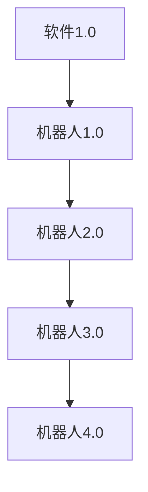

                 

# 机器人创业：自动化生产的未来蓝图

> **关键词：** 机器人创业、自动化生产、创业策略、团队建设、市场调研、产品设计与开发、资金筹集、营销策略、风险管理、成功案例解析

> **摘要：** 本文深入探讨了机器人创业领域的发展现状、创业策略、实际操作流程以及风险管理。通过详细分析市场调研、团队建设、产品设计与开发、资金筹集、营销策略等方面，本文为创业者提供了从0到1的完整创业蓝图。同时，通过成功案例解析和实战分享，本文旨在激发更多创业者投身机器人创业的热潮，共同探索自动化生产的未来蓝图。

---

## 第一部分：机器人创业的基础

### 第1章：机器人技术概述

#### 1.1 机器人技术的发展历程

机器人技术起源于20世纪中期，最早的机器人由美国机器人工程师乔治·德沃尔（George Devol）于1954年发明。最初的机器人主要用于工业生产，如焊接、组装等重复性劳动。此后，随着计算机技术的飞速发展，机器人技术逐渐成熟，应用领域不断扩大。

进入21世纪，机器人技术迎来了新的发展机遇。智能机器人、服务机器人、无人机等新型机器人不断涌现，逐渐渗透到医疗、教育、农业、物流等多个行业。当前，机器人技术已经成为全球科技创新的重要方向之一。

#### 1.2 机器人的分类

根据应用领域和功能特点，机器人可分为以下几类：

1. 工业机器人：主要用于工业生产中的焊接、组装、搬运等操作，如机械臂、焊接机器人等。
2. 服务机器人：为人类提供生活、工作、娱乐等服务的机器人，如清洁机器人、送餐机器人、医疗机器人等。
3. 军事机器人：用于军事侦察、战斗、工程保障等任务的机器人，如侦察机器人、无人机、机器人坦克等。
4. 社会机器人：为人类社会提供公共服务的机器人，如警用机器人、消防机器人、市政服务机器人等。

#### 1.3 机器人技术的重要领域

机器人技术的重要领域包括：

1. 人工智能：通过人工智能技术，机器人可以实现自主决策、智能交互、精准控制等功能。
2. 传感器技术：传感器技术是机器人感知外部环境的重要手段，包括视觉、听觉、触觉等多种传感器。
3. 通信技术：机器人需要通过通信技术与其他设备、系统进行数据交换和协同工作。
4. 控制系统：控制系统是机器人的核心，负责实时监测机器人状态、执行指令等。
5. 机器人编程：机器人编程是实现机器人自动化操作的关键，包括程序设计、算法实现等。

#### 1.4 机器人技术的影响

机器人技术对人类社会产生了深远的影响：

1. 提高生产效率：机器人可以在短时间内完成大量重复性工作，提高生产效率，降低成本。
2. 改善生活质量：服务机器人的普及，使得人类在生活、工作中更加便捷、舒适。
3. 推动科技创新：机器人技术与其他前沿技术（如人工智能、大数据等）相结合，为科技创新提供了新的方向。
4. 引发就业变革：随着机器人技术的广泛应用，某些职业将被替代，同时也将催生新的职业需求。

## 第2章：机器人与创业

### 2.1 创业的本质与挑战

创业是指创业者通过创新、创造和资源整合，创建一个新的企业或组织的过程。创业的本质在于探索新的商业机会，实现企业价值和社会价值的双重提升。

创业面临的挑战包括：

1. 市场竞争：市场上已存在大量企业，创业者需要找到独特的市场定位和竞争优势。
2. 资金压力：创业初期需要大量的资金投入，创业者需要寻找合适的融资渠道。
3. 团队建设：创业团队是企业成功的关键，创业者需要找到合适的人才并搭建高效的团队。
4. 运营管理：创业者需要具备一定的管理能力，确保企业运营顺利进行。

### 2.2 机器人技术在创业中的应用

机器人技术在创业中具有广泛的应用前景，主要体现在以下几个方面：

1. 工业生产：机器人可以替代人工完成重复性、危险性和高精度的生产任务，提高生产效率和质量。
2. 服务领域：服务机器人可以应用于医疗、养老、教育、旅游等领域，提高服务质量和生活便利性。
3. 物流配送：机器人可以应用于物流仓储、配送等环节，实现自动化、智能化的物流体系。
4. 军事应用：机器人可以应用于侦察、战斗、工程保障等军事任务，提高作战效能。

### 2.3 创业者如何利用机器人技术

创业者可以从以下几个方面利用机器人技术：

1. 技术研发：研发具有自主知识产权的机器人产品，形成核心竞争力。
2. 合作合作：与机器人研发企业、高校、研究机构等合作，获取技术支持。
3. 应用创新：结合机器人技术，创新商业模式和产品服务，满足市场需求。
4. 投资布局：投资机器人产业链上下游企业，实现产业链整合和资源优化。

### 2.4 机器人创业的优势与风险

机器人创业具有以下优势：

1. 市场前景广阔：随着人口老龄化、产业升级和人工智能技术的应用，机器人市场需求不断增长。
2. 技术创新驱动：机器人技术是科技创新的重要方向，创业者可以通过技术创新获得竞争优势。
3. 产业政策支持：我国政府高度重视机器人产业发展，出台了一系列政策措施，为创业者提供有利环境。

然而，机器人创业也面临一定风险：

1. 技术风险：机器人技术发展迅速，创业者需要跟上技术发展趋势，否则可能被市场淘汰。
2. 市场风险：机器人市场竞争激烈，创业者需要找到独特的市场定位和竞争优势。
3. 资金风险：机器人创业需要大量资金投入，创业者需要确保资金充足，否则可能导致创业失败。
4. 法规风险：机器人产业政策法规不断完善，创业者需要了解并遵守相关法规，避免法律风险。

## 第二部分：机器人创业的实际操作

### 第3章：机器人创业的市场调研

#### 3.1 市场调研的方法

市场调研是机器人创业的重要环节，创业者需要了解市场需求、竞争对手、市场规模等信息。市场调研的方法包括：

1. 定量调研：通过问卷调查、访谈等方式收集大量数据，进行统计分析。
2. 定性调研：通过专家访谈、小组讨论等方式深入了解市场需求和竞争状况。
3. 竞品分析：分析竞争对手的产品、服务、市场策略等，找出自身的优势和不足。
4. 市场趋势预测：根据历史数据和市场环境，预测未来市场需求和趋势。

#### 3.2 机器人市场现状分析

目前，全球机器人市场呈现出以下特点：

1. 增长迅速：随着人口老龄化、产业升级和人工智能技术的应用，全球机器人市场需求不断增长。
2. 区域差异：亚洲地区（如中国、日本、韩国）机器人市场规模较大，欧美地区市场发展较为成熟。
3. 应用广泛：机器人应用于工业生产、服务、物流等多个领域，呈现出多元化发展趋势。
4. 技术竞争：机器人技术竞争激烈，各国纷纷加大研发投入，提升技术水平和市场份额。

#### 3.3 目标市场选择

创业者需要根据自身优势和市场需求，选择合适的目标市场。选择目标市场的因素包括：

1. 市场规模：目标市场需要具备较大的市场规模和潜力。
2. 竞争态势：目标市场需要具备较低的竞争态势，有利于创业者快速进入市场。
3. 政策环境：目标市场需要具备良好的政策环境，有利于企业发展。
4. 用户需求：目标市场需要具备较高的用户需求，有利于产品销售和推广。

#### 3.4 市场趋势预测

根据当前市场环境和未来发展需求，机器人市场趋势预测如下：

1. 智能化：随着人工智能技术的不断发展，智能化将成为未来机器人发展的主要方向。
2. 个性化：消费者对个性化、定制化需求日益增长，机器人将更加注重满足用户个性化需求。
3. 服务化：机器人将从单纯的硬件产品向提供整体解决方案的服务化方向发展。
4. 绿色环保：随着环保意识的提高，绿色环保将成为未来机器人发展的关键因素。

### 第4章：机器人创业的团队建设

#### 4.1 团队建设的重要性

团队建设是机器人创业成功的关键，一个高效的团队可以发挥成员的协同效应，实现企业目标。团队建设的重要性体现在以下几个方面：

1. 提高企业竞争力：团队协作可以发挥成员的专业优势，提高企业整体竞争力。
2. 促进知识共享：团队成员之间的知识共享和经验交流，有利于企业创新和成长。
3. 增强企业凝聚力：良好的团队建设可以增强企业凝聚力，降低员工流失率。
4. 提高工作效率：团队协作可以提高工作效率，降低企业运营成本。

#### 4.2 找到合适的团队成员

创业者需要找到具备以下能力的团队成员：

1. 技术能力：团队成员需要具备机器人技术相关的专业知识和技能。
2. 创新能力：团队成员需要具备创新意识和能力，能够不断推动企业创新。
3. 项目管理能力：团队成员需要具备项目管理能力，能够确保项目顺利推进。
4. 沟通协作能力：团队成员需要具备良好的沟通协作能力，能够与团队成员、合作伙伴等建立良好关系。

#### 4.3 团队成员的能力要求

团队成员的能力要求包括：

1. 技术能力：熟悉机器人技术的基本原理和应用，掌握相关编程语言和工具。
2. 项目管理能力：能够制定项目计划、分配任务、监控进度、协调资源等。
3. 产品设计能力：能够进行产品需求分析、功能规划、原型设计等。
4. 市场营销能力：能够进行市场调研、竞品分析、营销策略制定等。
5. 财务管理能力：能够进行财务预算、成本控制、资金管理等。

#### 4.4 团队协作与沟通

团队协作与沟通是团队建设的重要组成部分，创业者需要关注以下几个方面：

1. 明确目标：确保团队成员对项目目标和任务有清晰的认识，形成共同的目标共识。
2. 分工协作：合理分配任务，确保每个成员都能发挥自己的专业优势。
3. 定期沟通：定期召开团队会议，分享工作进展、讨论问题、协调资源等。
4. 建立反馈机制：鼓励团队成员提出意见和建议，及时解决问题，提高团队执行力。
5. 营造良好氛围：建立积极向上的团队氛围，增强团队成员的归属感和凝聚力。

### 第5章：机器人产品的设计

#### 5.1 产品设计的目标与原则

机器人产品的设计目标是满足用户需求，提高生产效率，降低成本。产品设计应遵循以下原则：

1. 用户需求导向：产品设计应以用户需求为核心，关注用户体验和满意度。
2. 可靠性：机器人产品需要具备较高的可靠性和稳定性，确保长期运行。
3. 可扩展性：产品设计应具备良好的可扩展性，能够适应不同应用场景和需求。
4. 成本效益：在满足功能需求的前提下，尽量降低产品成本，提高市场竞争力。
5. 安全性：产品设计应充分考虑安全性，确保用户和设备的安全。

#### 5.2 用户需求分析

用户需求分析是产品设计的关键环节，创业者需要深入了解用户需求，包括以下几个方面：

1. 应用场景：了解用户使用机器人的具体场景，如工业生产、服务、物流等。
2. 功能需求：分析用户对机器人的功能需求，如移动、抓取、操作、交互等。
3. 性能指标：确定用户对机器人性能的需求，如速度、精度、负载、功耗等。
4. 界面交互：分析用户对机器人界面的需求，如操作简单、直观易懂等。
5. 成本预算：了解用户对机器人价格的承受范围，确保产品具备市场竞争力。

#### 5.3 产品功能规划

产品功能规划是设计机器人产品的具体步骤，包括以下几个方面：

1. 确定产品功能：根据用户需求，明确机器人产品应具备的功能。
2. 功能模块划分：将产品功能划分为多个模块，便于设计和实现。
3. 功能优先级排序：根据用户需求和市场竞争力，确定功能模块的优先级。
4. 功能实现策略：制定功能实现的具体策略，如硬件选型、软件设计等。
5. 功能验证与优化：通过实际测试和用户反馈，验证功能实现的正确性和有效性，不断优化产品功能。

#### 5.4 产品原型设计

产品原型设计是验证产品功能和设计方案的阶段，包括以下几个方面：

1. 功能原型设计：根据产品功能规划，设计功能原型，如界面、操作流程等。
2. 硬件原型设计：根据产品功能和性能指标，设计硬件原型，如机械结构、传感器等。
3. 软件原型设计：根据产品功能和性能指标，设计软件原型，如控制算法、交互界面等。
4. 原型验证与优化：通过实际测试和用户反馈，验证产品原型的正确性和可行性，不断优化设计方案。
5. 原型迭代：根据用户反馈和市场需求，不断迭代和优化产品原型，提高产品竞争力。

### 第6章：机器人创业的资金筹集

#### 6.1 资金筹集的渠道

机器人创业需要大量资金支持，创业者可以通过以下渠道筹集资金：

1. 自有资金：创业者可以利用个人储蓄、投资收益等自有资金进行创业。
2. 亲友借款：向亲朋好友借款，解决创业初期的资金需求。
3. 天使投资：寻找天使投资人，通过股权融资获取资金支持。
4. 风险投资：寻求风险投资机构的投资，通过股权融资获取资金支持。
5. 政府补贴：了解国家和地方政府的相关政策，申请政府补贴和专项资金。
6. 债务融资：通过银行贷款、债券发行等债务融资方式筹集资金。

#### 6.2 创业融资的策略

创业者需要根据自身情况和市场需求，制定合理的融资策略，包括以下几个方面：

1. 筹资计划：明确创业项目的资金需求、筹集方式和筹资期限等。
2. 融资渠道选择：根据自身情况和市场需求，选择合适的融资渠道。
3. 股权融资：合理确定股权分配比例，确保创业项目的长期发展。
4. 债务融资：合理控制债务规模，避免过度负债风险。
5. 融资成本：评估不同融资方式的成本，选择最优的融资策略。
6. 融资进度：根据项目进度和资金需求，合理安排融资进度。

#### 6.3 资金管理的重要性

资金管理是机器人创业过程中至关重要的一环，创业者需要关注以下几个方面：

1. 资金预算：制定详细的资金预算，确保资金合理使用，避免浪费。
2. 成本控制：加强对成本的监控和控制，降低企业运营成本。
3. 资金流转：确保企业资金流转顺畅，避免资金链断裂。
4. 资金用途：明确资金用途，确保资金用于项目发展和业务拓展。
5. 资金安全：加强对资金的管理和监控，确保资金安全。

#### 6.4 资金筹集的注意事项

在资金筹集过程中，创业者需要注意以下几点：

1. 融资时机：选择合适的时机进行融资，避免因融资需求过高而导致企业估值降低。
2. 融资成本：合理评估融资成本，避免因融资成本过高而影响企业盈利能力。
3. 股权稀释：合理规划股权分配，避免因股权稀释而导致企业控制权丧失。
4. 风险控制：加强对融资过程中的风险控制，确保企业稳定发展。
5. 融资用途：明确融资用途，确保资金用于项目发展和业务拓展。

### 第7章：机器人创业的营销策略

#### 7.1 营销策略的重要性

营销策略是机器人创业成功的关键，创业者需要制定有效的营销策略，以实现产品推广、市场份额扩大和品牌塑造。营销策略的重要性体现在以下几个方面：

1. 产品推广：通过有效的营销策略，将机器人产品推向市场，提高产品知名度。
2. 市场份额：通过营销策略，吸引更多潜在客户，提高市场份额。
3. 品牌建设：通过营销策略，塑造企业品牌形象，提高品牌价值。
4. 增值服务：通过营销策略，提供增值服务，提高客户满意度。
5. 长期发展：通过营销策略，实现企业长期稳定发展。

#### 7.2 市场定位与品牌建设

市场定位和品牌建设是营销策略的核心，创业者需要明确以下方面：

1. 市场定位：根据产品特点和市场需求，选择合适的市场定位，如高端市场、大众市场等。
2. 品牌定位：根据企业特点和目标市场，确定品牌定位，如技术领先、服务优质等。
3. 品牌形象：设计独特的品牌形象，如标志、色彩、口号等，提高品牌辨识度。
4. 品牌传播：通过多种渠道传播品牌信息，提高品牌知名度。
5. 品牌维护：通过优质的产品和服务，维护品牌形象，提高客户忠诚度。

#### 7.3 营销渠道选择

营销渠道选择是营销策略的关键环节，创业者需要根据产品特点和市场需求，选择合适的营销渠道，包括以下几个方面：

1. 线上渠道：利用互联网平台，如电商平台、社交媒体等，开展线上营销。
2. 线下渠道：利用实体门店、展会等，开展线下营销。
3. 代理渠道：与代理商合作，开拓市场，提高销售业绩。
4. 联合营销：与其他企业合作，共同开展营销活动，扩大市场影响力。
5. 定位营销：根据不同目标市场，选择合适的营销渠道，提高营销效果。

#### 7.4 营销效果评估

营销效果评估是营销策略的重要环节，创业者需要定期对营销效果进行评估，包括以下几个方面：

1. 销售数据：分析销售数据，了解产品销售情况，评估营销策略的有效性。
2. 市场份额：分析市场份额变化，了解市场竞争状况，评估营销策略的竞争力。
3. 品牌知名度：通过调查、访谈等方式，了解品牌知名度变化，评估品牌建设效果。
4. 客户满意度：通过客户反馈、投诉等，了解客户满意度，评估产品和服务质量。
5. 成本效益：分析营销成本和收益，评估营销策略的经济效益。

### 第8章：机器人创业的风险管理

#### 8.1 风险管理的重要性

风险管理是机器人创业过程中至关重要的一环，创业者需要关注以下几个方面：

1. 风险识别：识别创业过程中可能面临的各种风险，包括市场风险、技术风险、财务风险等。
2. 风险评估：对识别出的风险进行评估，分析风险发生的可能性及其影响程度。
3. 风险应对：制定相应的风险应对策略，降低风险发生的概率和影响。
4. 风险监控：建立风险监控机制，实时监控风险变化，及时调整风险应对策略。
5. 风险管理效果评估：评估风险管理措施的有效性，持续优化风险管理策略。

#### 8.2 风险识别与评估

风险识别与评估是风险管理的基础，创业者需要关注以下几个方面：

1. 市场风险：分析市场需求、竞争态势、政策法规等因素，评估市场风险。
2. 技术风险：评估机器人技术的成熟度、研发进展、竞争对手技术实力等，评估技术风险。
3. 财务风险：分析资金来源、资金用途、成本控制、盈利能力等，评估财务风险。
4. 法律风险：了解相关法律法规，评估法律风险。
5. 运营风险：分析生产运营、供应链管理、团队管理等因素，评估运营风险。

#### 8.3 风险应对策略

根据风险识别与评估的结果，创业者需要制定相应的风险应对策略，包括以下几个方面：

1. 风险规避：通过调整创业项目、改变市场策略等方式，避免风险发生。
2. 风险降低：通过技术改进、合作共赢等方式，降低风险发生的概率和影响。
3. 风险转移：通过保险、外包等方式，将风险转移给第三方。
4. 风险接受：对无法规避或降低的风险，采取接受风险的态度，制定相应的应对措施。
5. 风险监测：建立风险监测机制，实时关注风险变化，及时调整风险应对策略。

#### 8.4 风险监控与处理

风险监控与处理是风险管理的持续过程，创业者需要关注以下几个方面：

1. 风险预警：通过数据分析、实时监控等方式，及时发现潜在风险。
2. 风险报告：定期向管理层报告风险状况，提出风险应对建议。
3. 风险处理：针对发生的风险，采取相应的应对措施，降低风险影响。
4. 风险总结：对处理过的风险进行总结和分析，优化风险管理策略。
5. 持续改进：根据风险监控和处理的反馈，持续改进风险管理措施，提高风险管理水平。

### 第三部分：机器人创业案例与实战

#### 第9章：机器人创业案例解析

##### 9.1 案例一：机器人公司A的成功之路

机器人公司A是一家专注于服务机器人的初创企业，成立于2015年。公司创始人毕业于知名高校，具备丰富的机器人研发和创业经验。以下是该公司的发展历程：

1. 初始阶段：公司初期以研发智能服务机器人为主要方向，通过天使投资获得了100万元资金支持。
2. 产品发布：2016年，公司发布了首款智能服务机器人，主要应用于酒店、商场等场景，获得了良好的市场反响。
3. 融资扩张：2017年，公司获得风险投资机构的融资，将产品线扩展至医疗、教育等领域。
4. 市场推广：公司积极开展市场推广活动，与国内外知名企业建立合作关系，产品销量持续增长。
5. 收购整合：2019年，公司被一家大型机器人企业收购，实现了从初创企业到行业龙头的转变。

案例一的成功经验包括：

1. 创始人具备丰富的经验和技能，为企业的创新和发展提供了有力支持。
2. 产品定位准确，符合市场需求，具有竞争优势。
3. 积极寻求融资，为企业的快速发展提供了资金保障。
4. 市场推广策略得当，提高了品牌知名度和市场份额。
5. 与产业链上下游企业建立合作关系，实现了资源整合和优势互补。

##### 9.2 案例二：机器人公司B的创新实践

机器人公司B是一家专注于工业机器人的初创企业，成立于2016年。公司创始人毕业于知名高校，曾在国内知名机器人企业工作多年。以下是该公司的发展历程：

1. 初始阶段：公司初期以研发工业机器人为主要方向，通过天使投资获得了50万元资金支持。
2. 产品发布：2017年，公司发布了首款工业机器人，主要应用于电子、汽车等行业，获得了客户好评。
3. 融资扩张：2018年，公司获得风险投资机构的融资，将产品线扩展至医疗、物流等领域。
4. 技术创新：公司持续投入研发，不断提升产品性能和智能化水平，取得了多项技术突破。
5. 市场拓展：公司积极开展市场拓展活动，与国内外知名企业建立合作关系，产品销量稳步增长。

案例二的创新实践包括：

1. 以市场需求为导向，不断改进和优化产品。
2. 持续投入研发，提升技术创新能力。
3. 与产业链上下游企业建立合作关系，实现优势互补。
4. 积极拓展市场，提高品牌知名度和市场份额。
5. 通过技术创新和市场化运作，实现企业的快速发展。

##### 9.3 案例三：机器人公司C的市场挑战

机器人公司C是一家专注于农业机器人的初创企业，成立于2018年。公司创始人毕业于农业工程领域，具有丰富的农业和机器人研发经验。以下是该公司的发展历程：

1. 初始阶段：公司初期以研发农业机器人为主要方向，通过天使投资获得了50万元资金支持。
2. 产品发布：2019年，公司发布了首款农业机器人，主要应用于水稻、小麦等农作物种植，取得了良好的效果。
3. 融资扩张：2020年，公司获得风险投资机构的融资，将产品线扩展至蔬菜、水果等农作物种植。
4. 市场拓展：公司积极开展市场拓展活动，与国内外农业企业建立合作关系，产品销量逐步提升。
5. 市场挑战：公司面临市场竞争激烈、技术瓶颈、政策支持不足等挑战，需要不断创新和优化产品，提高市场竞争力。

案例三的市场挑战包括：

1. 农业机器人市场竞争激烈，公司需要不断提升产品性能和智能化水平，以保持竞争优势。
2. 技术瓶颈制约了产品的发展，公司需要加大研发投入，突破技术难题。
3. 政策支持不足，公司需要积极争取政策支持，为产品推广创造有利条件。
4. 市场推广难度较大，公司需要制定有效的市场推广策略，提高品牌知名度和市场份额。

#### 第10章：机器人创业实战

##### 10.1 创业实战的准备

创业实战的第一步是进行充分准备，包括以下几个方面：

1. 市场调研：了解市场需求、竞争对手、市场规模等信息，为创业项目提供决策依据。
2. 技术储备：掌握机器人技术的基本原理和应用，具备一定的研发能力。
3. 团队建设：组建具备专业技能和协作能力的团队，确保项目顺利推进。
4. 融资规划：制定详细的融资计划，确保项目有足够的资金支持。
5. 营销策略：制定市场推广策略，提高产品知名度和市场份额。

##### 10.2 创业实战的过程

创业实战的过程可以分为以下几个阶段：

1. 项目立项：根据市场调研结果和团队资源，确定创业项目的方向和目标。
2. 产品研发：根据项目需求，进行产品设计和研发，确保产品具备市场竞争力。
3. 市场推广：制定市场推广策略，通过线上线下渠道推广产品，提高品牌知名度。
4. 市场反馈：收集客户反馈，了解产品优缺点，不断优化产品和服务。
5. 融资拓展：根据项目进展和市场需求，寻求融资机会，扩大企业规模。
6. 团队管理：加强团队建设，提升团队协作能力，确保项目顺利进行。

##### 10.3 创业实战的反思与总结

创业实战结束后，创业者需要进行反思和总结，包括以下几个方面：

1. 项目成果：评估创业项目的成果，分析成功和失败的原因。
2. 团队协作：反思团队协作情况，找出团队管理中的问题和不足。
3. 营销策略：评估营销策略的有效性，调整市场推广策略。
4. 资金管理：总结资金使用情况，优化融资策略和资金管理方法。
5. 技术研发：总结技术研发过程中的经验教训，为后续项目提供参考。

##### 10.4 创业实战的经验分享

创业实战的经验分享对于其他创业者具有重要价值，包括以下几个方面：

1. 市场调研：分享市场调研的方法和技巧，提高市场分析能力。
2. 团队建设：分享团队建设经验，提高团队协作和管理水平。
3. 营销策略：分享有效的营销策略，提高产品知名度和市场份额。
4. 融资规划：分享融资策略和技巧，提高融资成功率。
5. 技术研发：分享技术研发经验，提高技术创新能力。

### 附录

#### 附录A：机器人创业工具与资源

1. 机器人开发工具：如ROS（Robot Operating System）、MATLAB等。
2. 机器人开发平台：如Raspberry Pi、Arduino等。
3. 机器人开发资源：如机器人类别、技术文档、教程等。
4. 机器人技术社区：如ROS官方社区、机器之心等。
5. 机器人产业政策：如国家机器人产业规划、地方政策等。

#### 附录B：机器人创业相关法规与政策

1. 工业机器人安全规范：如GB/T 17626.1-2017《工业机器人安全规范 第1部分：通用技术要求》。
2. 机器人产品认证：如CCC认证、CE认证等。
3. 机器人研发资助政策：如国家科技计划、地方科技计划等。
4. 机器人税收优惠政策：如增值税优惠、企业所得税优惠等。
5. 机器人产业规范：如《中国机器人产业发展政策白皮书》等。

#### 附录C：机器人创业常见问题解答

1. 问题1：如何选择合适的机器人技术方向？
   - 解答：根据市场需求、个人兴趣和团队优势，选择具有发展潜力和竞争力的技术方向。

2. 问题2：创业初期如何筹集资金？
   - 解答：通过天使投资、风险投资、政府补贴等多种渠道筹集资金，合理规划资金用途。

3. 问题3：如何搭建高效的团队？
   - 解答：明确团队成员职责，提供培训机会，建立良好的沟通和协作机制。

4. 问题4：如何制定有效的营销策略？
   - 解答：了解市场需求，选择合适的营销渠道，制定针对性的营销方案。

5. 问题5：如何应对市场竞争？
   - 解答：关注市场动态，不断创新和优化产品，提高自身竞争力。

### 图表与代码

#### 图表1-1：机器人技术的发展历程图



#### 代码10-1：创业实战中的简单机器人控制脚本

```python
# 导入相关库
import robot

# 初始化机器人
robot.init()

# 设置目标位置
robot.set_destination(10, 20)

# 移动机器人
robot.move()

# 关闭机器人
robot.close()
```

## 结束语

作者：AI天才研究院/AI Genius Institute & 禅与计算机程序设计艺术 /Zen And The Art of Computer Programming

本文从机器人技术概述、机器人与创业、机器人创业的实际操作、机器人创业案例与实战等多个方面，全面探讨了机器人创业的方方面面。通过深入分析市场调研、团队建设、产品设计与开发、资金筹集、营销策略、风险管理等关键环节，本文为创业者提供了从0到1的完整创业蓝图。

机器人创业作为当前科技创新的重要方向，具有巨大的发展潜力和市场前景。然而，创业道路充满挑战，需要创业者具备坚定的信念、专业的技能和丰富的经验。本文希望通过分享成功案例和实战经验，激发更多创业者投身机器人创业的热潮，共同探索自动化生产的未来蓝图。

最后，本文感谢所有参与研究和实践的团队成员，以及为本文提供支持和帮助的各方。在未来的发展中，我们将继续关注机器人创业领域，不断为创业者提供有价值的参考和指导。让我们携手共进，共创机器人创业的美好未来！

