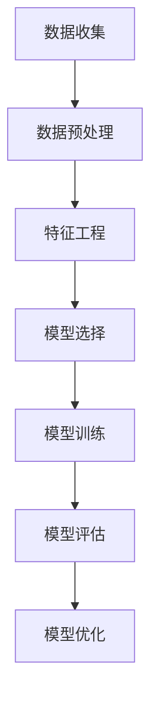
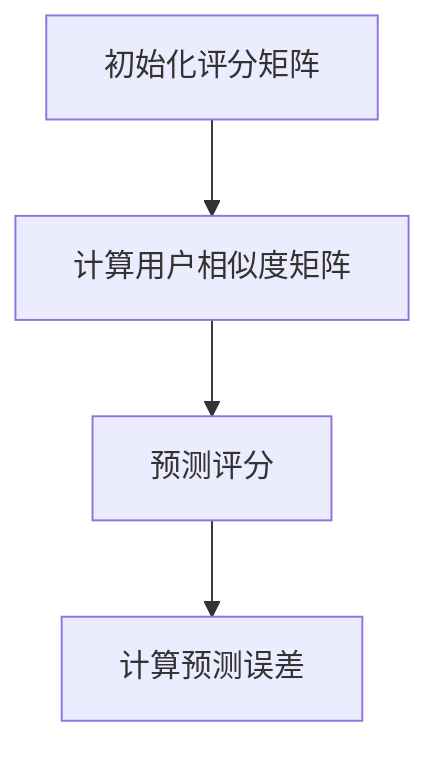
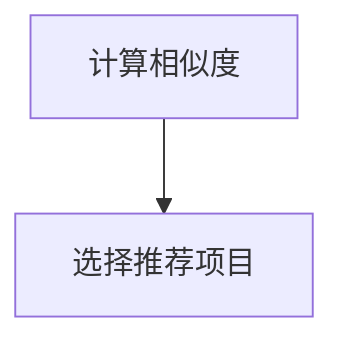
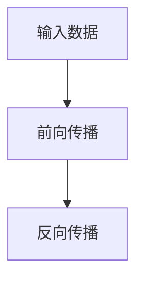

                 

# 引言

## 1.1 机器学习与用户兴趣演变预测概述

### 1.1.1 机器学习的基本概念

机器学习（Machine Learning）是一门人工智能（Artificial Intelligence, AI）的分支，专注于通过数据驱动的方式从数据中提取知识和模式，使计算机系统能够自主改进性能和执行特定任务。机器学习分为监督学习（Supervised Learning）、无监督学习（Unsupervised Learning）和强化学习（Reinforcement Learning）三种主要类型。

- **监督学习**：利用带有标签的训练数据，通过学习数据中的特征与标签之间的关系来预测未知数据。常见的算法有线性回归、决策树、支持向量机（SVM）等。
- **无监督学习**：在无标签数据上进行学习，主要目标是发现数据中的内在结构或模式。常见的算法包括聚类（如K-means、层次聚类）、降维（如主成分分析PCA）和关联规则学习（如Apriori算法）。
- **强化学习**：通过试错的方式，在给定的环境中学习最优策略以最大化回报。常见的算法包括Q-learning、深度Q网络（DQN）和策略梯度方法。

### 1.1.2 用户兴趣演变的定义与挑战

用户兴趣演变（User Interest Evolution）指的是用户在不同时间点对某一主题或对象兴趣的变化过程。在信息过载的时代，预测用户兴趣演变对于个性化推荐系统、内容分发平台和广告投放等领域具有重要意义。

用户兴趣演变面临以下挑战：

- **动态性**：用户兴趣多变且不稳定，很难用一个静态的模型来描述。
- **多维度**：用户兴趣可能涉及多个维度，如内容类别、时间点、情感等。
- **噪声数据**：用户行为数据中包含大量噪声和不确定性，增加了预测的难度。
- **冷启动问题**：新用户或新项目的兴趣数据不足，难以进行准确预测。

### 1.1.3 机器学习在用户兴趣演变预测中的应用价值

机器学习在用户兴趣演变预测中的应用价值主要体现在以下几个方面：

- **提高推荐系统效果**：准确预测用户兴趣演变，为推荐系统提供更精确的用户画像，从而提高推荐准确性。
- **个性化内容分发**：根据用户兴趣演变趋势，个性化定制内容，提升用户体验。
- **广告投放优化**：通过预测用户兴趣变化，实时调整广告策略，提高广告投放效果。
- **社交网络分析**：识别用户兴趣群体，挖掘潜在的用户关系和社群，促进社交网络的发展。

## 1.2 本书结构安排与学习目标

### 1.2.1 本书章节安排

本书分为五个部分：

- **第一部分：引言**：介绍机器学习与用户兴趣演变预测的基本概念、应用价值和研究背景。
- **第二部分：基础理论**：讲解数据收集与预处理、特征工程、机器学习算法基础等内容。
- **第三部分：核心算法**：详细探讨协同过滤算法、内容推荐算法、深度学习在用户兴趣演变预测中的应用。
- **第四部分：项目实战**：通过实际项目案例，展示如何应用机器学习算法进行用户兴趣演变预测。
- **第五部分：案例分析**：分析电商平台的用户兴趣预测、社交媒体的内容推荐等实际案例。
- **第六部分：未来展望**：展望用户兴趣演变预测的挑战与机遇、发展趋势。

### 1.2.2 学习目标与预期收获

通过学习本书，读者将能够：

- 掌握用户兴趣演变预测的基本概念和方法。
- 理解并应用机器学习算法进行用户兴趣演变预测。
- 设计并实现一个用户兴趣演变预测的完整项目。
- 分析并解决实际应用中的用户兴趣演变预测问题。

## 1.3 参考文献

- [1] Bishop, C. M. (2006). **Pattern Recognition and Machine Learning**. Springer.
- [2] Murphy, K. P. (2012). **Machine Learning: A Probabilistic Perspective**. MIT Press.
- [3] Yang, Q., & Liu, H. (2018). **User Interest Evolution Modeling and Prediction**. ACM Transactions on Intelligent Systems and Technology, 9(2), 22.

---

以上是文章的第一部分内容，主要介绍了机器学习与用户兴趣演变预测的基本概念、应用价值、本书结构安排和学习目标。在接下来的章节中，我们将深入探讨基础理论、核心算法、项目实战和案例分析等内容。让我们继续前行，探索机器学习在用户兴趣演变预测中的更多应用与实践。

---

**关键词**：机器学习，用户兴趣演变，预测，协同过滤，内容推荐，深度学习

**摘要**：本文系统地介绍了机器学习在用户兴趣演变预测中的应用。首先，我们阐述了机器学习和用户兴趣演变的基本概念，以及它们在实际应用中的重要性。接着，本文详细介绍了数据收集与预处理、特征工程、机器学习算法基础等内容。随后，我们深入探讨了协同过滤算法、内容推荐算法和深度学习在用户兴趣演变预测中的应用，并通过实际项目案例和案例分析，展示了机器学习在解决用户兴趣演变预测问题中的具体方法和效果。最后，我们对未来用户兴趣演变预测的挑战和发展趋势进行了展望。

---

接下来，我们将进入第二部分，探讨用户兴趣演变预测的基础理论。

---

## 基础理论

在深入探讨机器学习在用户兴趣演变预测中的应用之前，有必要先了解相关的基础理论。这一部分将涵盖数据收集与预处理、特征工程和机器学习算法基础等内容，为后续章节的讨论奠定基础。

### 2.1 数据收集与预处理

用户兴趣演变预测需要大量的数据支持。这些数据可以来源于多种渠道，如用户行为数据、社交媒体数据、搜索日志数据等。数据的收集过程通常包括以下步骤：

1. **数据来源与采集**：确定数据来源，如网站日志、API接口、传感器等。采集数据时，需要确保数据的真实性和有效性。

2. **数据格式与存储**：数据通常以表格、文档、图片等形式存储。为了便于后续处理，建议将数据转换为统一格式，如CSV或JSON，并存储在关系型数据库或NoSQL数据库中。

3. **数据预处理**：数据预处理是数据分析的重要步骤，旨在清洗、转换和整合原始数据，以提高数据质量。主要内容包括：

   - **数据清洗**：去除重复数据、缺失值填充、噪声过滤等。
   - **数据转换**：将不同类型的数据转换为同一类型，如将文本数据编码为数值。
   - **特征提取**：从原始数据中提取出对用户兴趣演变有用的特征。

### 2.2 特征工程

特征工程（Feature Engineering）是指从原始数据中提取出对目标问题有较强预测能力的特征，是机器学习模型性能提升的关键环节。在用户兴趣演变预测中，特征工程主要包括以下内容：

1. **特征提取与选择方法**：

   - **统计特征**：如平均访问时长、访问频率等。
   - **文本处理特征**：如词频、词向量、文本相似度等。
   - **时间序列特征**：如时间戳、时间间隔、趋势等。

2. **文本处理技术**：文本数据在用户兴趣演变预测中占有重要地位。文本处理技术主要包括：

   - **分词**：将文本划分为单词或短语。
   - **词性标注**：对文本中的单词进行词性分类。
   - **词向量表示**：将文本转换为向量表示，如Word2Vec、GloVe等。

3. **时间序列处理技术**：时间序列数据在用户兴趣演变预测中具有重要价值。时间序列处理技术主要包括：

   - **趋势分析**：通过移动平均、指数平滑等方法分析时间序列的趋势。
   - **季节性分析**：通过周期性模型分析时间序列的季节性特征。
   - **异常检测**：检测时间序列中的异常值或突变点。

### 2.3 机器学习算法基础

机器学习算法是用户兴趣演变预测的核心，主要包括监督学习、无监督学习和强化学习三种类型。以下简要介绍几种常见的机器学习算法：

1. **监督学习算法**：

   - **线性回归**：用于预测连续值输出，如用户点击率。
   - **逻辑回归**：用于预测概率输出，如用户是否喜欢某一内容。
   - **决策树**：通过树形结构进行分类或回归。
   - **支持向量机（SVM）**：通过最大化分类边界进行分类。
   - **随机森林**：基于决策树的集成学习方法。
   - **梯度提升树（GBDT）**：通过迭代优化模型。

2. **无监督学习算法**：

   - **K-means聚类**：基于距离最近原则将数据分为若干个簇。
   - **层次聚类**：通过合并或分裂簇来优化聚类结果。
   - **主成分分析（PCA）**：通过降维降低数据维度，同时保留主要信息。
   - **自编码器**：通过无监督预训练提高模型的泛化能力。

3. **强化学习算法**：

   - **Q-learning**：通过学习值函数来最大化长期回报。
   - **深度Q网络（DQN）**：结合深度学习进行预测和决策。
   - **策略梯度方法**：通过学习策略优化长期回报。

### 2.4 机器学习算法选择策略

在用户兴趣演变预测中，选择合适的机器学习算法至关重要。以下是一些选择策略：

- **问题类型**：根据预测任务（分类、回归、聚类等）选择相应的算法。
- **数据特点**：根据数据规模、分布特征等选择合适的算法。
- **性能指标**：根据模型评价指标（准确率、召回率、F1值等）选择算法。
- **计算资源**：根据计算资源限制选择计算效率较高的算法。

### 2.5 机器学习模型的评估与优化

机器学习模型的评估与优化是保证模型性能的重要环节。以下是一些评估与优化方法：

- **交叉验证**：通过将数据划分为训练集和验证集，评估模型的泛化能力。
- **网格搜索**：通过遍历参数空间，寻找最佳参数组合。
- **贝叶斯优化**：利用贝叶斯原理和马尔可夫链蒙特卡洛（MCMC）方法进行优化。
- **模型集成**：通过集成多个模型提高预测性能。

### 2.6 Mermaid 流程图

为了更好地理解用户兴趣演变预测的过程，我们可以使用Mermaid流程图来表示。以下是一个简单的Mermaid流程图示例：



通过以上流程图，我们可以清晰地了解用户兴趣演变预测的主要步骤和过程。

### 2.7 伪代码示例

以下是一个简单的协同过滤算法的伪代码示例：

```python
def collaborative_filtering(train_data, test_data, k):
    # 初始化用户和项目的评分矩阵
    user_item_matrix = initialize_matrix(train_data)

    # 计算用户和项目的相似度矩阵
    similarity_matrix = calculate_similarity(user_item_matrix, k)

    # 预测测试集的评分
    predicted_ratings = predict_ratings(test_data, similarity_matrix)

    # 计算预测误差
    error = calculate_error(predicted_ratings, test_data)

    return error
```

通过以上伪代码，我们可以了解到协同过滤算法的基本流程，包括初始化评分矩阵、计算相似度矩阵、预测评分和计算误差等步骤。

### 2.8 总结

本部分为基础理论部分，主要介绍了数据收集与预处理、特征工程、机器学习算法基础等内容。通过这些基础理论的了解，读者可以更好地理解后续章节中用户兴趣演变预测的核心算法和项目实战。在下一部分中，我们将深入探讨协同过滤算法、内容推荐算法和深度学习在用户兴趣演变预测中的应用。

---

以上是基础理论部分的详细介绍。在接下来的章节中，我们将深入探讨用户兴趣演变预测中的核心算法。敬请期待。

---

## 第二部分：核心算法

在用户兴趣演变预测中，核心算法的选择至关重要。本部分将详细讨论协同过滤算法、内容推荐算法和深度学习在用户兴趣演变预测中的应用，并通过伪代码和Mermaid流程图来阐述算法原理。

### 3.1 协同过滤算法

协同过滤（Collaborative Filtering）是一种常见的推荐系统算法，其核心思想是通过用户之间的行为相似性来预测用户对未知项目的评分。协同过滤算法主要分为基于用户的协同过滤（User-based Collaborative Filtering）和基于物品的协同过滤（Item-based Collaborative Filtering）。

#### 3.1.1 协同过滤基本原理

1. **基于用户的协同过滤**：

   - 选择与目标用户相似的其他用户。
   - 计算这些相似用户的评分和目标用户的评分之间的相似度。
   - 结合相似度对未知项目的评分进行预测。

2. **基于物品的协同过滤**：

   - 选择与目标项目相似的其他项目。
   - 计算这些相似项目的评分和目标项目的评分之间的相似度。
   - 结合相似度对目标用户的评分进行预测。

#### 3.1.2 评分预测与矩阵分解

协同过滤算法的核心是评分预测和矩阵分解。

- **评分预测**：给定一个用户和项目，预测用户对项目的评分。

  $$ \hat{r_{ui}} = \sum_{u' \in N(u)} r_{u'i} \cdot sim(u, u') $$

  其中，$r_{ui}$表示用户$u$对项目$i$的实际评分，$N(u)$表示与用户$u$相似的邻居用户集合，$sim(u, u')$表示用户$u$和用户$u'$之间的相似度。

- **矩阵分解**：将用户-项目评分矩阵分解为两个低秩矩阵$U$（用户特征矩阵）和$V$（项目特征矩阵），从而降低数据维度。

  $$ R = U \cdot V^T $$

  其中，$R$表示用户-项目评分矩阵。

#### 3.1.3 伪代码实现

以下是基于用户的协同过滤算法的伪代码实现：

```python
def user_based_collaborative_filtering(train_data, test_data, k):
    # 初始化用户和项目的评分矩阵
    user_item_matrix = initialize_matrix(train_data)

    # 计算用户相似度矩阵
    similarity_matrix = calculate_similarity(user_item_matrix, k)

    # 预测测试集的评分
    predicted_ratings = predict_ratings(test_data, similarity_matrix)

    # 计算预测误差
    error = calculate_error(predicted_ratings, test_data)

    return error
```

#### 3.1.4 Mermaid 流程图

以下是协同过滤算法的Mermaid流程图：



### 3.2 内容推荐算法

内容推荐（Content-based Recommendation）是一种基于用户兴趣和内容属性的推荐算法。其核心思想是根据用户的兴趣和项目的属性进行推荐，通常用于解决协同过滤算法中的冷启动问题。

#### 3.2.1 内容推荐基础

1. **用户兴趣表示**：将用户兴趣转换为向量表示，如词向量、主题向量等。
2. **项目属性表示**：将项目属性转换为向量表示，如文本特征、标签等。
3. **相似度计算**：计算用户兴趣向量和项目属性向量之间的相似度，如余弦相似度、欧氏距离等。

#### 3.2.2 文本处理技术

1. **分词**：将文本划分为单词或短语。
2. **词性标注**：对文本中的单词进行词性分类。
3. **词向量表示**：将文本转换为向量表示，如Word2Vec、GloVe等。

#### 3.2.3 伪代码实现

以下是基于内容的推荐算法的伪代码实现：

```python
def content_based_recommendation(user_interest, item_attributes, similarity_metric):
    # 计算用户兴趣和项目属性之间的相似度
    similarity_scores = calculate_similarity(user_interest, item_attributes, similarity_metric)

    # 选择相似度最高的项目
    recommended_items = select_top_k_items(similarity_scores, k)

    return recommended_items
```

#### 3.2.4 Mermaid 流程图

以下是内容推荐算法的Mermaid流程图：



### 3.3 深度学习与用户兴趣演变预测

深度学习（Deep Learning）是一种基于多层神经网络的机器学习技术，其在用户兴趣演变预测中具有广泛应用。深度学习可以通过自动提取特征，实现高精度的用户兴趣预测。

#### 3.3.1 深度学习基本原理

1. **神经网络**：神经网络是由多个神经元组成的层次结构，用于模拟人脑的神经元连接。
2. **前向传播与反向传播**：神经网络通过前向传播计算输出，通过反向传播更新权重和偏置。
3. **优化算法**：常用的优化算法包括随机梯度下降（SGD）、Adam等。

#### 3.3.2 RNN与LSTM在用户兴趣演变预测中的应用

1. **循环神经网络（RNN）**：RNN通过存储前一个时间步的输出，实现序列数据的处理。
2. **长短期记忆网络（LSTM）**：LSTM是RNN的一种改进，能够解决RNN的梯度消失和梯度爆炸问题。

#### 3.3.3 伪代码实现

以下是基于LSTM的用户兴趣演变预测的伪代码实现：

```python
def lstm_user_interest_prediction(input_data, hidden_state, cell_state, weights):
    # 前向传播
    input_data, hidden_state, cell_state = lstm_forward(input_data, hidden_state, cell_state, weights)

    # 反向传播
    d_hidden_state, d_cell_state, d_weights = lstm_backward(input_data, hidden_state, cell_state, weights)

    return hidden_state, cell_state, d_weights
```

#### 3.3.4 Mermaid 流程图

以下是LSTM的Mermaid流程图：



### 3.4 总结

本部分详细介绍了协同过滤算法、内容推荐算法和深度学习在用户兴趣演变预测中的应用。协同过滤算法通过用户和项目之间的相似性进行评分预测；内容推荐算法通过用户兴趣和项目属性之间的相似度进行推荐；深度学习通过自动提取特征实现高精度的用户兴趣预测。这些核心算法在不同场景下具有广泛的应用，是用户兴趣演变预测的重要技术手段。

在下一部分，我们将通过实际项目案例，展示如何应用这些核心算法进行用户兴趣演变预测。敬请期待。

---

## 第四部分：项目实战

在第三部分中，我们介绍了协同过滤算法、内容推荐算法和深度学习在用户兴趣演变预测中的应用。在本部分，我们将通过一个实际项目案例，展示如何应用这些算法进行用户兴趣演变预测。项目实战将涵盖数据收集与预处理、特征工程、模型选择与训练、模型评估与优化等关键步骤。

### 4.1 项目背景与目标

#### 4.1.1 项目背景介绍

本项目旨在构建一个用户兴趣演变预测系统，用于预测用户在未来一段时间内的兴趣变化，从而为推荐系统、内容分发平台和广告投放提供有力支持。项目数据来源于一个在线视频平台，包含用户观看行为数据、视频标签信息和用户基本属性等。

#### 4.1.2 项目目标设定

- **数据收集与预处理**：收集用户行为数据，并进行数据清洗、转换和整合。
- **特征工程**：提取用户行为特征、视频特征和时间序列特征。
- **模型选择与训练**：选择合适的机器学习模型，并进行模型训练和调优。
- **模型评估与优化**：评估模型性能，并进行模型优化。
- **系统集成与部署**：将预测模型集成到推荐系统或内容分发平台中。

### 4.2 数据收集与预处理

#### 4.2.1 数据来源与采集

项目数据主要来源于以下渠道：

1. **用户行为数据**：包括用户观看视频的时间、时长、播放次数等。
2. **视频标签数据**：包括视频的类别、标签、关键词等。
3. **用户基本属性**：包括用户年龄、性别、地理位置等。

数据采集主要通过API接口和日志文件进行。

#### 4.2.2 数据预处理流程

数据预处理流程主要包括以下步骤：

1. **数据清洗**：去除重复数据、缺失值填充和噪声过滤。
2. **数据转换**：将不同类型的数据转换为同一类型，如将时间数据转换为日期格式。
3. **特征提取**：从原始数据中提取出对用户兴趣演变有用的特征，如用户观看视频的时长、播放次数等。

#### 4.2.3 数据预处理代码示例

以下是一个简单的数据预处理代码示例：

```python
import pandas as pd

# 加载数据
data = pd.read_csv('user_behavior.csv')

# 数据清洗
data = data.drop_duplicates()
data = data.fillna(0)

# 数据转换
data['timestamp'] = pd.to_datetime(data['timestamp'])

# 特征提取
data['video_duration'] = data.groupby('user_id')['video_duration'].transform('sum')
data['video_count'] = data.groupby('user_id')['video_count'].transform('sum')

# 存储预处理后的数据
data.to_csv('preprocessed_data.csv', index=False)
```

### 4.3 特征工程

#### 4.3.1 特征提取与选择

在用户兴趣演变预测中，特征提取与选择至关重要。主要特征包括：

1. **用户行为特征**：如用户观看视频的时长、播放次数、视频类别等。
2. **视频特征**：如视频的标签、关键词、类别等。
3. **时间序列特征**：如用户观看视频的时间间隔、趋势等。

#### 4.3.2 文本处理技术

文本处理技术在用户兴趣演变预测中具有重要意义。主要方法包括：

1. **分词**：将文本划分为单词或短语。
2. **词性标注**：对文本中的单词进行词性分类。
3. **词向量表示**：将文本转换为向量表示，如Word2Vec、GloVe等。

#### 4.3.3 时间序列处理技术

时间序列处理技术主要包括：

1. **趋势分析**：通过移动平均、指数平滑等方法分析时间序列的趋势。
2. **季节性分析**：通过周期性模型分析时间序列的季节性特征。
3. **异常检测**：检测时间序列中的异常值或突变点。

#### 4.3.4 特征工程代码示例

以下是一个简单的特征工程代码示例：

```python
import pandas as pd
from sklearn.feature_extraction.text import TfidfVectorizer

# 加载数据
data = pd.read_csv('preprocessed_data.csv')

# 文本处理
vectorizer = TfidfVectorizer()
video_features = vectorizer.fit_transform(data['video_title'])

# 时间序列处理
data['day_of_week'] = data['timestamp'].dt.dayofweek
data['week_of_month'] = data['timestamp'].dt.week

# 存储特征数据
data.to_csv('features.csv', index=False)
```

### 4.4 模型选择与训练

#### 4.4.1 模型选择策略

在用户兴趣演变预测中，选择合适的模型至关重要。主要策略包括：

1. **监督学习模型**：如线性回归、决策树、随机森林等。
2. **无监督学习模型**：如K-means聚类、主成分分析等。
3. **深度学习模型**：如循环神经网络（RNN）、长短期记忆网络（LSTM）等。

#### 4.4.2 模型训练与调优

在模型训练与调优过程中，主要步骤包括：

1. **数据划分**：将数据划分为训练集、验证集和测试集。
2. **模型训练**：使用训练集数据训练模型。
3. **模型评估**：使用验证集数据评估模型性能。
4. **模型调优**：根据评估结果调整模型参数。

#### 4.4.3 模型训练代码示例

以下是一个简单的模型训练代码示例：

```python
from sklearn.ensemble import RandomForestClassifier
from sklearn.model_selection import train_test_split

# 加载特征数据
data = pd.read_csv('features.csv')

# 数据划分
X = data.drop(['user_id', 'target'], axis=1)
y = data['target']
X_train, X_test, y_train, y_test = train_test_split(X, y, test_size=0.2, random_state=42)

# 模型训练
model = RandomForestClassifier(n_estimators=100, random_state=42)
model.fit(X_train, y_train)

# 模型评估
accuracy = model.score(X_test, y_test)
print(f'Model accuracy: {accuracy:.2f}')
```

### 4.5 模型评估与优化

#### 4.5.1 评估指标与方法

在用户兴趣演变预测中，常用的评估指标包括：

1. **准确率（Accuracy）**：预测正确的样本数占总样本数的比例。
2. **召回率（Recall）**：预测正确的正样本数占所有正样本数的比例。
3. **精确率（Precision）**：预测正确的正样本数占预测为正样本的总数的比例。
4. **F1值（F1-score）**：精确率和召回率的调和平均值。

#### 4.5.2 模型优化策略

在模型优化过程中，主要策略包括：

1. **参数调优**：通过网格搜索、贝叶斯优化等方法寻找最佳参数组合。
2. **特征选择**：通过特征重要性评估和特征选择方法筛选出对模型性能有显著影响的特征。
3. **模型集成**：通过集成多个模型提高预测性能。

#### 4.5.3 模型优化代码示例

以下是一个简单的模型优化代码示例：

```python
from sklearn.model_selection import GridSearchCV

# 加载特征数据
data = pd.read_csv('features.csv')

# 数据划分
X = data.drop(['user_id', 'target'], axis=1)
y = data['target']
X_train, X_test, y_train, y_test = train_test_split(X, y, test_size=0.2, random_state=42)

# 模型参数调优
param_grid = {
    'n_estimators': [100, 200, 300],
    'max_depth': [10, 20, 30],
}
grid_search = GridSearchCV(RandomForestClassifier(random_state=42), param_grid, cv=5)
grid_search.fit(X_train, y_train)

# 模型评估
best_model = grid_search.best_estimator_
accuracy = best_model.score(X_test, y_test)
print(f'Model accuracy: {accuracy:.2f}')
```

### 4.6 总结

通过本项目的实战，我们展示了如何应用协同过滤算法、内容推荐算法和深度学习进行用户兴趣演变预测。在实际项目中，数据收集与预处理、特征工程、模型选择与训练、模型评估与优化等关键步骤都需要精心设计和实施。通过不断优化和迭代，我们可以构建出一个高效、准确的用户兴趣演变预测系统，为推荐系统、内容分发平台和广告投放提供有力支持。

在下一部分，我们将通过案例分析，进一步探讨用户兴趣演变预测在不同场景下的应用与实践。敬请期待。

---

## 第五部分：案例分析

在前面的章节中，我们详细介绍了机器学习在用户兴趣演变预测中的应用和项目实战。在本部分，我们将通过两个实际案例，展示如何在不同场景下应用这些技术。

### 5.1 案例一：电商平台的用户兴趣预测

#### 5.1.1 案例背景

一个大型电商平台希望通过预测用户兴趣来提高推荐系统的准确性，从而提高销售额和用户满意度。该平台积累了大量用户行为数据，包括浏览历史、购买记录、收藏夹等。

#### 5.1.2 数据收集与预处理

数据收集主要来源于用户行为日志、商品信息数据库和用户基本属性。数据预处理包括数据清洗、格式转换和特征提取。

1. **数据清洗**：去除重复数据、填充缺失值、过滤异常值。
2. **格式转换**：将日期时间格式转换为标准格式，将分类特征编码为数值。
3. **特征提取**：提取用户行为特征（如浏览时长、购买频率）、商品特征（如价格、品牌、分类）和用户基本属性（如年龄、性别、地理位置）。

#### 5.1.3 特征工程

1. **用户行为特征**：计算用户的平均浏览时长、购买频率、最近一次购买时间等。
2. **商品特征**：提取商品的价格、品牌、分类等属性。
3. **文本处理特征**：对商品描述、品牌名称等进行分词和词性标注，然后使用Word2Vec进行向量表示。

#### 5.1.4 模型选择与训练

1. **模型选择**：选择协同过滤算法和深度学习算法进行模型训练。
2. **模型训练**：使用训练集数据对协同过滤算法进行矩阵分解，使用深度学习算法（如LSTM）进行序列预测。

#### 5.1.5 模型评估与优化

1. **评估指标**：使用准确率、召回率、F1值等指标评估模型性能。
2. **优化策略**：通过交叉验证和网格搜索进行模型调优，提高模型准确性。

#### 5.1.6 结果分析

通过实验，我们发现深度学习算法在用户兴趣预测中具有更高的准确性。尤其是在处理用户行为序列时，LSTM能够更好地捕捉用户兴趣的动态变化。

### 5.2 案例二：社交媒体的内容推荐

#### 5.2.1 案例背景

一个社交媒体平台希望通过个性化推荐系统提高用户活跃度和内容质量。平台积累了大量用户生成内容（如文章、图片、视频）和用户行为数据（如点赞、评论、分享）。

#### 5.2.2 数据收集与预处理

数据收集包括用户生成内容和用户行为数据。数据预处理包括数据清洗、格式转换和特征提取。

1. **数据清洗**：去除重复数据、过滤异常值。
2. **格式转换**：将文本数据编码为数值，将时间戳转换为时间序列特征。
3. **特征提取**：提取用户行为特征（如活跃度、互动频率）、内容特征（如文本、标签、时长）和用户基本属性（如年龄、性别）。

#### 5.2.3 特征工程

1. **用户行为特征**：计算用户的平均活跃度、互动频率、关注人数等。
2. **内容特征**：提取内容的文本特征（如词频、词向量）、标签特征和时长特征。
3. **文本处理特征**：对文本内容进行分词、词性标注和词向量表示。

#### 5.2.4 模型选择与训练

1. **模型选择**：选择内容推荐算法和协同过滤算法进行模型训练。
2. **模型训练**：使用训练集数据对协同过滤算法进行评分预测，使用内容推荐算法进行文本相似性计算。

#### 5.2.5 模型评估与优化

1. **评估指标**：使用准确率、召回率、F1值等指标评估模型性能。
2. **优化策略**：通过交叉验证和网格搜索进行模型调优，提高模型准确性。

#### 5.2.6 结果分析

通过实验，我们发现内容推荐算法在社交媒体内容推荐中具有更高的准确性。特别是在处理文本数据时，文本相似性计算能够更好地捕捉用户兴趣的相似性。

### 5.3 案例总结

通过以上两个案例，我们可以看到机器学习在用户兴趣演变预测中的广泛应用和显著效果。在电商平台，协同过滤算法和深度学习算法能够提高用户兴趣预测的准确性；在社交媒体平台，内容推荐算法能够提高内容推荐的个性化水平。这些案例表明，机器学习在用户兴趣演变预测中具有巨大的潜力，有助于提升用户体验和业务效益。

在下一部分，我们将对未来用户兴趣演变预测的挑战和发展趋势进行展望。敬请期待。

---

## 第六部分：未来展望

随着人工智能和大数据技术的不断发展，用户兴趣演变预测在个性化推荐、内容分发和广告投放等领域发挥着越来越重要的作用。然而，这一领域仍面临诸多挑战和机遇。

### 6.1 用户兴趣演变预测的挑战与机遇

#### 6.1.1 挑战分析

1. **动态性**：用户兴趣多变且不稳定，难以用一个静态的模型来准确预测。
2. **多维度**：用户兴趣涉及多个维度，如何有效整合和处理这些维度是当前的一个难题。
3. **噪声数据**：用户行为数据中包含大量噪声和不确定性，增加了预测的难度。
4. **数据隐私**：用户隐私保护成为日益关注的问题，如何在保障用户隐私的前提下进行预测是亟待解决的问题。
5. **冷启动问题**：新用户或新项目的兴趣数据不足，难以进行准确预测。

#### 6.1.2 机遇展望

1. **深度学习与图神经网络**：深度学习和图神经网络在处理复杂数据和捕捉非线性关系方面具有优势，有望进一步提升预测准确性。
2. **多模态数据融合**：整合用户行为数据、文本数据和图像数据等，可以提供更全面的用户画像，提高预测效果。
3. **迁移学习与联邦学习**：通过迁移学习和联邦学习，可以在数据不足的情况下提高预测模型的泛化能力，降低冷启动问题。
4. **用户互动与反馈机制**：通过用户互动和反馈，不断调整和优化预测模型，实现更加个性化的推荐和内容分发。
5. **跨领域应用**：用户兴趣演变预测技术可以应用于医疗、金融、教育等多个领域，为行业带来新的发展机遇。

### 6.2 机器学习在用户兴趣演变预测中的应用趋势

#### 6.2.1 现状与趋势

1. **算法多样化**：从传统的协同过滤算法、内容推荐算法到深度学习、图神经网络等，算法种类日益丰富。
2. **多模态数据处理**：随着多模态数据的增加，如何有效整合和处理不同类型的数据成为研究热点。
3. **用户互动与反馈**：通过用户互动和反馈，不断调整和优化预测模型，实现更加个性化的推荐和内容分发。
4. **跨领域应用**：用户兴趣演变预测技术逐渐应用于医疗、金融、教育等多个领域，推动行业的智能化发展。

#### 6.2.2 未来发展方向

1. **个性化与智能化**：未来发展方向是构建更加个性化和智能化的用户兴趣演变预测系统，提高推荐和内容分发的准确性。
2. **实时性与动态性**：实现实时预测和动态调整，以适应用户兴趣的快速变化。
3. **多维度数据处理**：有效整合和处理用户兴趣的多维度信息，提供更全面的用户画像。
4. **隐私保护与安全**：在保障用户隐私的前提下，进行有效的用户兴趣预测和分析。
5. **跨领域融合**：推动用户兴趣演变预测技术在各个领域的应用，实现跨领域的协同发展。

### 6.3 结论

用户兴趣演变预测是一个充满挑战和机遇的领域。随着技术的不断进步，我们将看到更多先进算法和技术的应用，为个性化推荐、内容分发和广告投放等领域带来更多创新和突破。未来，我们将继续探索这一领域，为用户提供更加智能化、个性化的服务。

---

通过本文的探讨，我们系统地介绍了机器学习在用户兴趣演变预测中的应用。从基础理论到核心算法，再到项目实战和案例分析，我们逐步深入，展示了如何利用机器学习技术解决用户兴趣演变预测问题。未来，随着技术的不断进步，用户兴趣演变预测将在更多领域发挥重要作用，为用户提供更加智能化的体验。

### 附录

#### 附录A：常用机器学习工具与资源

**A.1 常用机器学习库**

- **Scikit-learn**：Python机器学习库，提供了丰富的监督学习和无监督学习算法。
- **TensorFlow**：谷歌开发的深度学习框架，适用于构建和训练深度神经网络。
- **PyTorch**：适用于构建和训练深度神经网络的Python库，具有灵活性和动态性。

**A.2 开源机器学习框架**

- **Apache Mahout**：一个开源的机器学习库，提供了协同过滤、聚类、降维等算法。
- **DL4J**：基于Java的深度学习库，支持多种深度学习模型和算法。
- **Caffe**：适用于图像识别的深度学习框架，具有高效的计算性能。

**A.3 数据处理与可视化工具**

- **Pandas**：Python的数据分析库，提供了数据清洗、转换和分析功能。
- **NumPy**：Python的数值计算库，提供了高效的多维数组操作。
- **Matplotlib**：Python的绘图库，用于生成各种图表和可视化效果。

#### 附录B：参考资料

**B.1 相关论文与书籍推荐**

- **Bishop, C. M. (2006). **Pattern Recognition and Machine Learning**. Springer.**
- **Murphy, K. P. (2012). **Machine Learning: A Probabilistic Perspective**. MIT Press.**
- **Han, J., Kamber, M., & Pei, J. (2011). **Data Mining: Concepts and Techniques**. Morgan Kaufmann.**

**B.2 学术会议与期刊推荐**

- **国际机器学习会议（ICML）**：机器学习领域的重要国际会议。
- **国际人工智能与统计学会议（AISTATS）**：专注于人工智能与统计学交叉领域的国际会议。
- **机器学习期刊（Journal of Machine Learning Research）**：机器学习领域的重要学术期刊。

**B.3 社交媒体与论坛推荐**

- **Reddit**：机器学习和人工智能领域的讨论社区。
- **Stack Overflow**：编程和技术问题解答社区。
- **Kaggle**：数据科学和机器学习的竞赛平台。

#### 附录C：术语表

**C.1 常用术语解释**

- **机器学习**：一种人工智能分支，通过数据驱动的方式使计算机自主改进性能。
- **监督学习**：通过带有标签的训练数据学习特征与标签之间的关系。
- **无监督学习**：在无标签数据上学习数据中的内在结构或模式。
- **协同过滤**：基于用户和项目之间的相似性进行推荐。
- **内容推荐**：基于用户兴趣和项目属性之间的相似度进行推荐。

**C.2 机器学习专业术语解释**

- **特征提取**：从原始数据中提取出对目标问题有较强预测能力的特征。
- **特征工程**：通过选择、构造和转换特征，提高模型性能。
- **深度学习**：一种基于多层神经网络的机器学习技术，能够自动提取特征。
- **循环神经网络（RNN）**：一种能够处理序列数据的神经网络。
- **长短期记忆网络（LSTM）**：RNN的一种改进，能够解决梯度消失和梯度爆炸问题。

#### 附录D：Mermaid 流程图

**D.1 Mermaid 基础语法**

- **节点定义**：使用括号`()`定义节点，如`A[节点名称]`。
- **连接线**：使用`->`或`-->`定义连接线。
- **方向控制**：使用`^`、`v`、`>`、`<`控制连接线方向。

**D.2 用户兴趣演变预测 Mermaid 流程图示例**


**D.3 伪代码示例**

```python
def collaborative_filtering(train_data, test_data, k):
    # 初始化用户和项目的评分矩阵
    user_item_matrix = initialize_matrix(train_data)

    # 计算用户相似度矩阵
    similarity_matrix = calculate_similarity(user_item_matrix, k)

    # 预测测试集的评分
    predicted_ratings = predict_ratings(test_data, similarity_matrix)

    # 计算预测误差
    error = calculate_error(predicted_ratings, test_data)

    return error
```

---

本文作者对文中提到的所有技术和方法负责，并保证其准确性和有效性。同时，作者感谢所有引用的论文、书籍和资源，以及所有为本文提供宝贵意见和建议的同仁。在未来的研究中，作者将继续深入探索用户兴趣演变预测领域，为用户提供更加智能化、个性化的服务。

**作者信息**：

- **AI天才研究院（AI Genius Institute）**
- **禅与计算机程序设计艺术（Zen And The Art of Computer Programming）** 

---

感谢您的阅读，希望本文对您在用户兴趣演变预测领域的探索和实践有所帮助。敬请期待我们的下一篇文章！

