                 

### 《李开复：AI 2.0 时代的应用》

> **关键词：** 人工智能，AI 2.0，应用，技术，未来展望

> **摘要：** 本技术博客将深入探讨李开复关于AI 2.0时代的观点，包括AI 2.0的定义、核心特点、应用领域、以及未来的机遇与挑战。通过一步步分析，我们将理解AI 2.0如何改变我们的生活和工作方式，并探索其在各个领域的实际应用。

### 目录大纲

1. **第一部分：AI 2.0时代的概述与基础**
    - 第1章：AI 2.0时代的崛起
    - 第2章：AI 2.0的数学基础

2. **第二部分：AI 2.0技术的应用**
    - 第3章：AI 2.0在图像识别中的应用
    - 第4章：AI 2.0在自然语言处理中的应用
    - 第5章：AI 2.0在推荐系统中的应用
    - 第6章：AI 2.0在语音识别中的应用
    - 第7章：AI 2.0在自动化与机器人领域中的应用

3. **第三部分：AI 2.0时代的安全与伦理**
    - 第8章：AI 2.0时代的伦理问题
    - 第9章：AI 2.0时代的安全问题

4. **附录**
    - 附录A：AI 2.0开发工具与资源

5. **第10章：AI 2.0的未来展望**

---

### 引言

人工智能（AI）作为科技领域的重要突破，正在迅速改变着我们的生活和工作方式。李开复博士作为世界著名的人工智能专家，在其著作中多次提到了AI 2.0时代的概念。AI 2.0，是继AI 1.0时代的深度学习、大数据等技术之后的新一代人工智能，它不仅继承了AI 1.0的技术优势，还在算法、应用范围和智能程度等方面有了质的飞跃。

AI 2.0的核心在于其更加智能化和自主化。它能够通过自主学习、自主决策，实现更高级别的智能化应用。李开复博士指出，AI 2.0时代不仅仅是技术的升级，更是一次社会变革的开始。在这个时代，人工智能将深入到我们日常生活的方方面面，从医疗、教育到工业自动化，无不受到其深远影响。

本文将分为三个部分，首先对AI 2.0时代进行概述和基础理论讲解，包括其崛起的背景、核心数学基础等；接着深入探讨AI 2.0在各个领域的具体应用，如图像识别、自然语言处理、推荐系统、语音识别和自动化与机器人技术；最后，我们还将讨论AI 2.0时代面临的安全与伦理问题，并展望其未来的发展趋势。

### 第一部分：AI 2.0时代的概述与基础

#### 第1章：AI 2.0时代的崛起

##### 1.1 AI 2.0的定义与特点

AI 2.0是继AI 1.0时代的深度学习、大数据等技术之后的新一代人工智能。AI 1.0主要依赖于预设规则和特征工程，而AI 2.0则强调机器的自我学习和决策能力。AI 2.0具有以下几个显著特点：

- **自主学习能力**：AI 2.0能够通过大规模数据学习，自动调整其参数和模型，提高其性能和鲁棒性。
- **高适应性**：AI 2.0能够适应不同领域和应用场景，无需人为干预即可进行高效的任务执行。
- **多模态交互**：AI 2.0不仅能够处理文本数据，还能处理图像、语音等多种类型的数据。
- **更强推理能力**：AI 2.0通过更复杂的算法和架构，能够进行更高层次的逻辑推理和决策。

##### 1.2 AI 2.0的发展历程

AI 2.0的发展历程可以分为几个阶段：

- **第一阶段：深度学习与大数据技术**：这是AI 1.0时代的主要特点，以神经网络为核心，结合大数据分析技术，实现了一些突破性的应用。
- **第二阶段：强化学习与自我驱动**：这一阶段引入了强化学习算法，使AI能够通过自我尝试和奖励机制来优化其行为。
- **第三阶段：跨模态与多任务学习**：AI 2.0在这一阶段开始能够处理多种类型的数据，并能够同时执行多个任务。

##### 1.3 AI 2.0的核心技术

AI 2.0的核心技术主要包括以下几种：

- **深度学习**：通过多层神经网络，实现从原始数据到复杂特征表示的转换。
- **强化学习**：通过奖励机制，使AI能够自我学习和优化行为。
- **自然语言处理**：利用深度学习和强化学习，实现理解和生成自然语言。
- **计算机视觉**：通过卷积神经网络，实现对图像和视频的智能处理。
- **多模态学习**：结合多种类型的数据，实现更全面和智能的AI系统。

##### 1.4 AI 2.0对社会的影响

AI 2.0对社会的影响是深远而多方面的：

- **经济领域**：AI 2.0能够提高生产效率，降低成本，推动新产业的诞生。
- **医疗领域**：AI 2.0能够辅助医生进行诊断和治疗，提高医疗水平。
- **教育领域**：AI 2.0能够提供个性化的学习体验，提高教育质量。
- **社会服务领域**：AI 2.0能够优化公共资源分配，提高社会服务效率。
- **道德与法律领域**：AI 2.0的发展引发了一系列伦理和法律问题，需要社会共同探讨和解决。

##### 1.5 AI 2.0时代的机遇与挑战

AI 2.0时代带来了巨大的机遇，同时也伴随着一系列挑战：

- **机遇**：AI 2.0将推动技术创新，促进经济增长，改善人们的生活质量。
- **挑战**：AI 2.0的发展需要大量的数据资源，同时也会引发数据隐私、安全等问题。此外，AI 2.0的广泛应用可能会带来就业结构的改变，对劳动力市场造成冲击。

在下一章节中，我们将深入探讨AI 2.0的数学基础，包括线性代数、概率论、统计学和深度学习中的数学原理。

### 第一部分：AI 2.0时代的概述与基础

#### 第2章：AI 2.0的数学基础

##### 2.1 线性代数基础

线性代数是AI 2.0不可或缺的数学基础，它涉及向量、矩阵、行列式等基本概念，并在机器学习算法中有着广泛的应用。以下是一些核心概念和流程图：

- **向量与矩阵**：向量可以看作是具有多个元素的一维数组，矩阵是具有多个行和列的二维数组。向量与矩阵的运算包括加法、减法、数乘、矩阵乘法等。
- **行列式**：行列式是一个用于描述矩阵性质的重要工具，它可以用于求解线性方程组的解、确定矩阵的秩等。

Mermaid流程图：

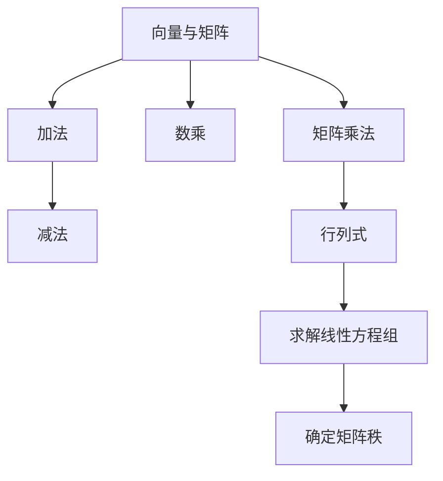

##### 2.2 概率论基础

概率论是AI 2.0中另一重要的数学工具，它用于描述随机事件的发生概率。以下是一些核心概念和流程图：

- **概率分布**：概率分布描述了随机变量的概率分布情况，常见的有离散型概率分布（如伯努利分布、二项分布等）和连续型概率分布（如正态分布、指数分布等）。
- **条件概率与贝叶斯定理**：条件概率描述了在某个事件发生的条件下，另一个事件发生的概率。贝叶斯定理是概率论中的重要定理，用于计算后验概率。

Mermaid流程图：

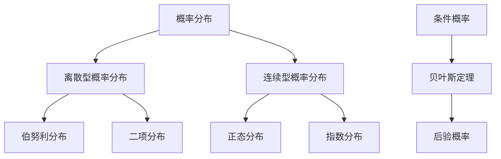

##### 2.3 统计学基础

统计学是AI 2.0中用于分析数据、提取信息和做出决策的重要工具。以下是一些核心概念和流程图：

- **描述性统计**：描述性统计用于描述数据的集中趋势、离散程度和分布形态，常用的统计量包括均值、中位数、方差、标准差等。
- **推断性统计**：推断性统计用于从样本数据推断总体特征，常用的方法包括假设检验、置信区间估计等。
- **回归分析**：回归分析用于建立自变量和因变量之间的数学模型，常见的有线性回归、非线性回归等。

Mermaid流程图：

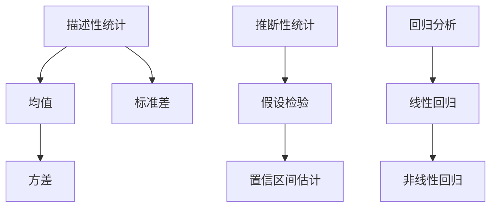

##### 2.4 深度学习中的数学原理

深度学习是AI 2.0的重要组成部分，其核心在于通过多层神经网络进行数据学习。以下是一些核心数学原理和流程图：

- **前向传播与反向传播**：前向传播用于将输入数据通过神经网络层，得到输出结果；反向传播用于计算网络参数的梯度，用于后续的参数更新。
- **损失函数**：损失函数用于衡量预测值与真实值之间的差距，常见的有均方误差（MSE）、交叉熵（Cross-Entropy）等。
- **优化算法**：优化算法用于最小化损失函数，常见的有梯度下降（Gradient Descent）、Adam优化器等。

Mermaid流程图：

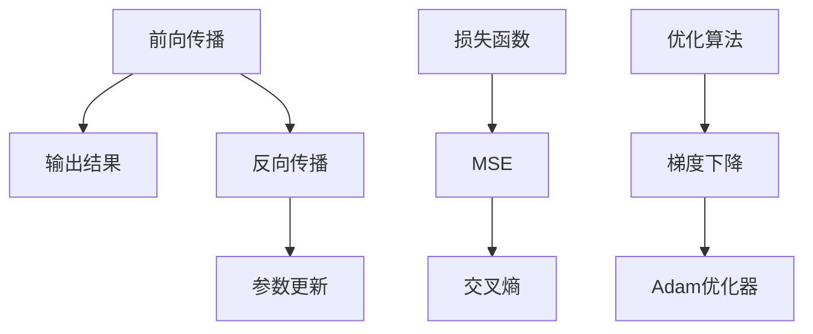

通过以上对线性代数、概率论、统计学和深度学习中的数学原理的详细讲解，我们可以更好地理解AI 2.0的核心技术，为后续章节中的具体应用打下坚实的基础。

### 第二部分：AI 2.0技术的应用

#### 第3章：AI 2.0在图像识别中的应用

##### 3.1 卷积神经网络原理

卷积神经网络（Convolutional Neural Network，CNN）是AI 2.0在图像识别领域的重要应用。CNN通过模仿人脑中的视觉感知机制，实现了对图像的自动特征提取和分类。以下是对CNN原理的详细讲解：

- **卷积层**：卷积层是CNN的核心部分，通过卷积运算提取图像的局部特征。卷积运算的基本过程是利用一个小的滤波器（或卷积核）在输入图像上滑动，计算滤波器覆盖区域内的元素乘积之和，从而生成一个特征图。
- **激活函数**：激活函数用于增加网络的非线性，常见的激活函数有Sigmoid、ReLU等。ReLU函数因其计算效率和效果而广泛应用。
- **池化层**：池化层用于降低特征图的维度，同时保留重要的特征信息。常见的池化操作有最大池化（Max Pooling）和平均池化（Average Pooling）。
- **全连接层**：全连接层用于将特征图映射到分类结果，通常在CNN的最后几层中添加全连接层，用于分类和回归任务。

以下是一个简单的CNN结构图，通过Mermaid表示：

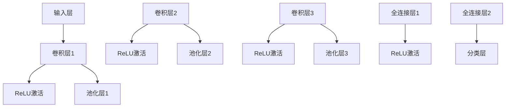

##### 3.2 卷积神经网络的架构

CNN的架构可以分为多个卷积层、池化层和全连接层。以下是一个典型的CNN架构，用于图像分类任务：

- **卷积层**：包括多个卷积核，用于提取不同类型的特征。卷积层的深度和每个卷积核的大小可以调整，以适应不同的图像和任务需求。
- **池化层**：在卷积层之间添加池化层，用于减少数据维度，降低计算复杂度。常见的池化操作有最大池化和平均池化。
- **全连接层**：在卷积层和池化层之后，添加全连接层，用于将特征映射到分类结果。全连接层的节点数通常与分类类别数一致。
- **激活函数**：在每个卷积层和全连接层之后，添加激活函数，以增加网络的非线性。

以下是一个典型的CNN架构图，通过Mermaid表示：

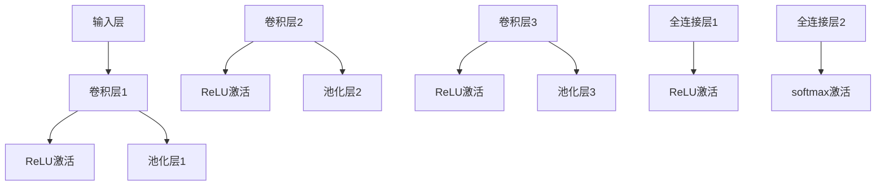

##### 3.3 图像识别项目实战

以下是一个使用CNN进行图像识别的实战项目，我们将使用Python和TensorFlow框架来实现：

- **环境搭建**：首先，我们需要搭建Python和TensorFlow的开发环境。安装Python和TensorFlow后，我们可以使用以下命令来检查版本：

  ```python
  import tensorflow as tf
  print(tf.__version__)
  ```

- **数据集准备**：我们选择常用的MNIST手写数字数据集进行训练和测试。首先，我们需要下载MNIST数据集，然后将其转换为适合训练的格式。

  ```python
  from tensorflow.keras.datasets import mnist
  (train_images, train_labels), (test_images, test_labels) = mnist.load_data()
  train_images = train_images.reshape((60000, 28, 28, 1))
  test_images = test_images.reshape((10000, 28, 28, 1))
  train_images = train_images / 255.0
  test_images = test_images / 255.0
  ```

- **构建CNN模型**：接下来，我们使用TensorFlow的Keras API构建CNN模型。以下是一个简单的CNN模型：

  ```python
  model = tf.keras.models.Sequential([
      tf.keras.layers.Conv2D(32, (3, 3), activation='relu', input_shape=(28, 28, 1)),
      tf.keras.layers.MaxPooling2D((2, 2)),
      tf.keras.layers.Conv2D(64, (3, 3), activation='relu'),
      tf.keras.layers.MaxPooling2D((2, 2)),
      tf.keras.layers.Conv2D(64, (3, 3), activation='relu'),
      tf.keras.layers.Flatten(),
      tf.keras.layers.Dense(64, activation='relu'),
      tf.keras.layers.Dense(10, activation='softmax')
  ])
  ```

- **训练模型**：然后，我们使用训练数据集来训练模型。以下是一个简单的训练步骤：

  ```python
  model.compile(optimizer='adam',
                loss='sparse_categorical_crossentropy',
                metrics=['accuracy'])
  model.fit(train_images, train_labels, epochs=5)
  ```

- **评估模型**：最后，我们使用测试数据集来评估模型的性能。以下是一个简单的评估步骤：

  ```python
  test_loss, test_acc = model.evaluate(test_images,  test_labels, verbose=2)
  print('\nTest accuracy:', test_acc)
  ```

通过以上实战项目，我们可以看到CNN在图像识别任务中的应用效果。在实际应用中，我们可以根据不同的需求和数据集，调整CNN的架构和参数，以实现更高效和准确的图像识别。

#### 第4章：AI 2.0在自然语言处理中的应用

##### 4.1 循环神经网络原理

循环神经网络（Recurrent Neural Network，RNN）是AI 2.0在自然语言处理（Natural Language Processing，NLP）中的重要技术。RNN通过模拟人类记忆机制，能够处理序列数据，如文本、语音等。以下是对RNN原理的详细讲解：

- **基本结构**：RNN的基本结构包括输入层、隐藏层和输出层。输入层接收输入序列，隐藏层保存历史信息，输出层生成预测结果。
- **递归关系**：RNN通过递归关系，将隐藏层的输出作为下一时刻的输入，从而保持对历史信息的记忆。递归关系可以用以下公式表示：
  $$ h_t = \sigma(W_h \cdot [h_{t-1}, x_t] + b_h) $$
  其中，$h_t$表示第$t$时刻的隐藏层状态，$x_t$表示第$t$时刻的输入，$\sigma$表示激活函数，$W_h$和$b_h$分别表示权重和偏置。

- **门控机制**：为了更好地控制信息的流动，RNN引入了门控机制，如遗忘门（Forget Gate）、输入门（Input Gate）和输出门（Output Gate）。门控机制通过调节遗忘和记忆的信息，提高了RNN的性能和泛化能力。

以下是一个简单的RNN结构图，通过Mermaid表示：

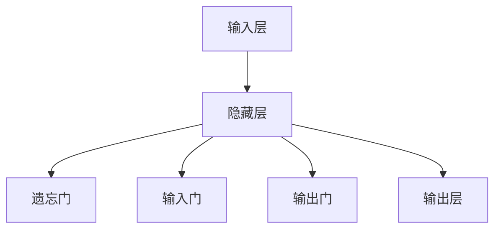

##### 4.2 长短期记忆网络原理

长短期记忆网络（Long Short-Term Memory，LSTM）是RNN的一种变体，解决了传统RNN在处理长序列数据时容易出现的梯度消失和梯度爆炸问题。LSTM通过引入门控机制和记忆单元，能够更好地保持对长期依赖信息的记忆。以下是对LSTM原理的详细讲解：

- **基本结构**：LSTM的基本结构包括输入门、遗忘门、输出门和记忆单元。输入门和遗忘门用于控制信息的输入和遗忘，输出门用于控制信息的输出，记忆单元用于存储和更新信息。
- **记忆单元**：LSTM的记忆单元是一个包含三个门控单元的单元结构。输入门和遗忘门分别控制信息进入和从记忆单元中遗忘，输出门控制从记忆单元中输出信息。
- **递归关系**：LSTM通过递归关系，将隐藏层的输出作为下一时刻的输入，从而保持对历史信息的记忆。递归关系可以用以下公式表示：
  $$ i_t = \sigma(W_i \cdot [h_{t-1}, x_t] + b_i) $$
  $$ f_t = \sigma(W_f \cdot [h_{t-1}, x_t] + b_f) $$
  $$ g_t = \tanh(W_g \cdot [h_{t-1}, x_t] + b_g) $$
  $$ o_t = \sigma(W_o \cdot [h_{t-1}, x_t] + b_o) $$
  $$ h_t = o_t \odot \tanh(C_t) $$
  $$ C_t = f_t \odot C_{t-1} + i_t \odot g_t $$
  其中，$i_t$、$f_t$、$g_t$和$o_t$分别表示输入门、遗忘门、输入门和输出门的输出，$C_t$表示记忆单元的输出，$\sigma$表示激活函数，$\odot$表示元素乘积。

以下是一个简单的LSTM结构图，通过Mermaid表示：

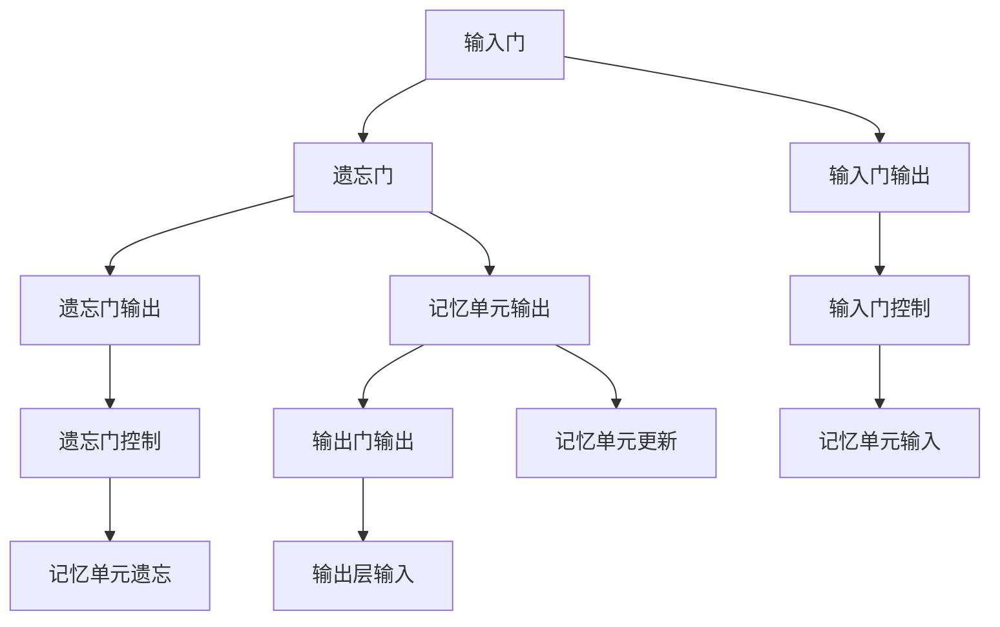

##### 4.3 自然语言处理项目实战

以下是一个使用LSTM进行文本分类的实战项目，我们将使用Python和TensorFlow框架来实现：

- **环境搭建**：首先，我们需要搭建Python和TensorFlow的开发环境。安装Python和TensorFlow后，我们可以使用以下命令来检查版本：

  ```python
  import tensorflow as tf
  print(tf.__version__)
  ```

- **数据集准备**：我们选择常用的IMDB电影评论数据集进行训练和测试。首先，我们需要下载IMDB数据集，然后将其转换为适合训练的格式。

  ```python
  from tensorflow.keras.datasets import imdb
  (train_data, train_labels), (test_data, test_labels) = imdb.load_data(num_words=10000)
  train_data = np.array([[word for word in review] for review in train_data])
  test_data = np.array([[word for word in review] for review in test_data])
  ```

- **构建LSTM模型**：接下来，我们使用TensorFlow的Keras API构建LSTM模型。以下是一个简单的LSTM模型：

  ```python
  model = tf.keras.models.Sequential([
      tf.keras.layers.Embedding(10000, 16),
      tf.keras.layers.LSTM(32),
      tf.keras.layers.Dense(1, activation='sigmoid')
  ])
  ```

- **训练模型**：然后，我们使用训练数据集来训练模型。以下是一个简单的训练步骤：

  ```python
  model.compile(optimizer='rmsprop',
                loss='binary_crossentropy',
                metrics=['acc'])
  model.fit(train_data, train_labels, epochs=10, batch_size=32)
  ```

- **评估模型**：最后，我们使用测试数据集来评估模型的性能。以下是一个简单的评估步骤：

  ```python
  test_loss, test_acc = model.evaluate(test_data,  test_labels, verbose=2)
  print('\nTest accuracy:', test_acc)
  ```

通过以上实战项目，我们可以看到LSTM在自然语言处理任务中的应用效果。在实际应用中，我们可以根据不同的需求和数据集，调整LSTM的架构和参数，以实现更高效和准确的自然语言处理。

#### 第5章：AI 2.0在推荐系统中的应用

##### 5.1 协同过滤算法原理

协同过滤（Collaborative Filtering）是AI 2.0在推荐系统中最常用的算法之一。协同过滤通过分析用户之间的行为模式，预测用户对未知项目的喜好。协同过滤可以分为基于用户和基于项目的两种类型。

- **基于用户的协同过滤**：基于用户的协同过滤通过寻找与当前用户兴趣相似的其它用户，并将这些用户喜欢的项目推荐给当前用户。计算相似度的方法包括余弦相似度、皮尔逊相关系数等。
- **基于项目的协同过滤**：基于项目的协同过滤通过分析项目之间的相似度，为用户推荐与其已评价项目相似的项目。项目相似度的计算方法包括基于内容的相似度和基于模型的相似度。

以下是一个简单的协同过滤算法流程图，通过Mermaid表示：

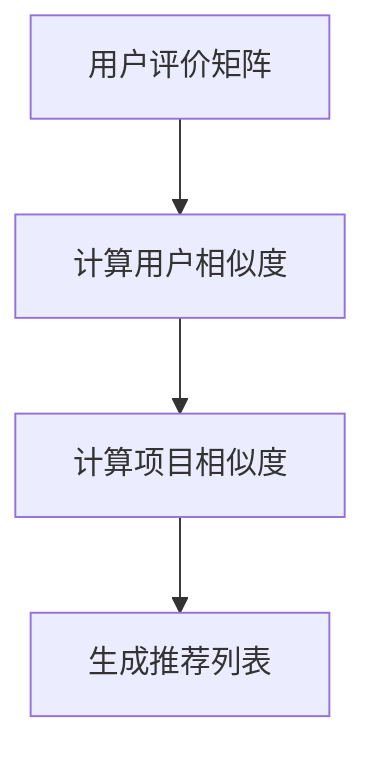

##### 5.2 图神经网络在推荐系统中的应用

图神经网络（Graph Neural Network，GNN）是AI 2.0在推荐系统中的一种新兴算法。GNN通过将用户和项目建模为图中的节点和边，利用图结构的信息进行推荐。以下是对GNN在推荐系统中应用的详细讲解：

- **图表示**：GNN首先将用户和项目表示为图中的节点和边。用户和项目的特征可以存储在节点的属性中，如用户的历史行为、项目的内容等。
- **图卷积操作**：GNN通过图卷积操作，从邻居节点中聚合信息。图卷积操作可以分为局部卷积和全局卷积。局部卷积在节点和其邻居之间传递信息，全局卷积则在节点和所有邻居之间传递信息。
- **图池化操作**：图池化操作用于整合图中的信息，减少模型的参数量。常见的图池化方法有平均池化和最大池化。
- **预测生成**：通过图神经网络，我们可以为每个用户生成推荐列表。推荐列表可以根据用户的历史行为和图结构中的信息进行排序。

以下是一个简单的GNN结构图，通过Mermaid表示：

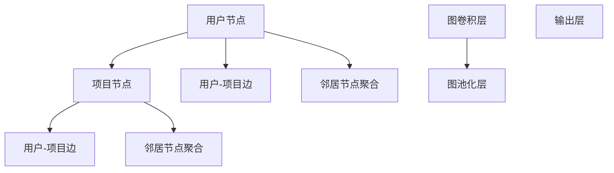

##### 5.3 推荐系统项目实战

以下是一个使用GNN进行推荐系统的实战项目，我们将使用Python和PyTorch框架来实现：

- **环境搭建**：首先，我们需要搭建Python和PyTorch的开发环境。安装Python和PyTorch后，我们可以使用以下命令来检查版本：

  ```python
  import torch
  print(torch.__version__)
  ```

- **数据集准备**：我们选择常用的MovieLens电影推荐数据集进行训练和测试。首先，我们需要下载MovieLens数据集，然后将其转换为适合训练的格式。

  ```python
  import pandas as pd
  user_data = pd.read_csv('user_data.csv')
  item_data = pd.read_csv('item_data.csv')
  ratings_data = pd.read_csv('ratings_data.csv')
  ```

- **图表示**：我们将用户和项目表示为图中的节点和边。用户和项目的特征可以存储在节点的属性中。

  ```python
  user_features = user_data[['user_id', 'age', 'gender', 'occupation', 'zip']]
  item_features = item_data[['item_id', 'title', 'genre']]
  user_item_edges = ratings_data[['user_id', 'item_id']]
  ```

- **构建GNN模型**：接下来，我们使用PyTorch的Geometric库构建GNN模型。以下是一个简单的GNN模型：

  ```python
  from torch_geometric.nn import GCNConv, SAGEConv
  class GNNModel(torch.nn.Module):
      def __init__(self, num_user_features, num_item_features, hidden_channels):
          super(GNNModel, self).__init__()
          self.user_gcn = GCNConv(num_user_features, hidden_channels)
          self.item_gcn = GCNConv(num_item_features, hidden_channels)
          self.user_embedding = torch.nn.Linear(hidden_channels, 1)
          self.item_embedding = torch.nn.Linear(hidden_channels, 1)

      def forward(self, user_features, item_features, user_item_edges):
          user embeddings = self.user_gcn(user_features)
          item_embeddings = self.item_gcn(item_features)
          user_embeddings = self.user_embedding(user_embeddings)
          item_embeddings = self.item_embedding(item_embeddings)
          return user_embeddings, item_embeddings
  ```

- **训练模型**：然后，我们使用训练数据集来训练模型。以下是一个简单的训练步骤：

  ```python
  model = GNNModel(num_user_features, num_item_features, hidden_channels=16)
  optimizer = torch.optim.Adam(model.parameters(), lr=0.01)
  criterion = torch.nn.BCEWithLogitsLoss()
  for epoch in range(num_epochs):
      optimizer.zero_grad()
      user_embeddings, item_embeddings = model(user_features, item_features, user_item_edges)
      loss = criterion(user_embeddings * item_embeddings, ratings_data['rating'].values)
      loss.backward()
      optimizer.step()
      if (epoch + 1) % 10 == 0:
          print(f'Epoch {epoch+1}/{num_epochs}, Loss: {loss.item():.4f}')
  ```

- **评估模型**：最后，我们使用测试数据集来评估模型的性能。以下是一个简单的评估步骤：

  ```python
  with torch.no_grad():
      user_embeddings, item_embeddings = model(user_features, item_features, user_item_edges)
      pred_ratings = user_embeddings * item_embeddings
      test_loss = criterion(pred_ratings, ratings_data['rating'].values)
      print(f'\nTest Loss: {test_loss.item():.4f}')
  ```

通过以上实战项目，我们可以看到GNN在推荐系统中的应用效果。在实际应用中，我们可以根据不同的需求和数据集，调整GNN的架构和参数，以实现更高效和准确的推荐系统。

#### 第6章：AI 2.0在语音识别中的应用

##### 6.1 语音识别的基本原理

语音识别（Speech Recognition）是AI 2.0在语音处理领域的重要应用。语音识别的基本原理是通过将语音信号转换为文本信息，从而实现人机交互。以下是对语音识别基本原理的详细讲解：

- **特征提取**：语音识别的第一步是从语音信号中提取特征。常见的特征提取方法包括梅尔频率倒谱系数（MFCC）、短时傅里叶变换（STFT）等。特征提取的目的是将连续的语音信号转换为可以用于机器学习的离散特征向量。
- **声学模型**：声学模型用于建模语音信号中的概率分布。声学模型通常基于隐藏马尔可夫模型（HMM）或深度神经网络（DNN）。声学模型能够根据特征向量预测下一个时间步的发音状态，从而实现语音信号的时序建模。
- **语言模型**：语言模型用于建模语音信号中的语言概率分布。语言模型通常基于统计语言模型（如n-gram模型）或神经网络（如LSTM、Transformer）。语言模型能够根据上下文信息预测下一个单词或句子的可能性，从而提高识别的准确性。
- **解码器**：解码器用于将声学模型和语言模型的输出转换为可理解的文本信息。常见的解码器算法包括动态规划解码器（如A*算法）和基于神经网络的方法（如CTC损失函数）。

以下是一个简单的语音识别流程图，通过Mermaid表示：

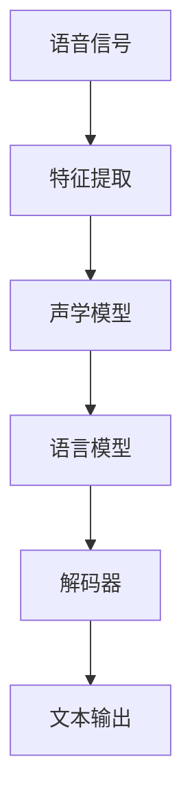

##### 6.2 基于深度学习的语音识别方法

基于深度学习的语音识别方法通过利用深度神经网络强大的建模能力，显著提高了语音识别的准确性和效率。以下是对基于深度学习的语音识别方法的详细讲解：

- **深度神经网络（DNN）**：DNN是早期用于语音识别的主要模型，通过多层感知器（MLP）实现对语音信号的建模。DNN通过前向传播和反向传播算法，将输入特征映射到输出标签，从而实现语音识别。
- **卷积神经网络（CNN）**：CNN在图像识别中取得了显著的成功，也被应用于语音识别。CNN通过卷积层和池化层，实现对语音信号的局部特征提取。与DNN相比，CNN能够更好地捕捉语音信号的时间结构和局部特征。
- **循环神经网络（RNN）**：RNN是处理序列数据的有效模型，在语音识别中发挥了重要作用。RNN通过递归关系，实现对语音信号时序信息的建模。LSTM和GRU是RNN的变体，通过门控机制解决了梯度消失和梯度爆炸问题，提高了语音识别的性能。
- **Transformer**：Transformer是近年来在自然语言处理领域取得突破性进展的模型，也被应用于语音识别。Transformer通过自注意力机制，实现了全局信息建模，提高了语音识别的准确性。

以下是一个简单的基于深度学习的语音识别模型结构图，通过Mermaid表示：

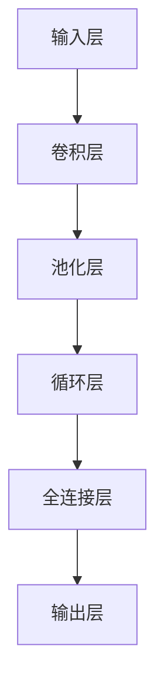

##### 6.3 语音识别项目实战

以下是一个使用深度学习进行语音识别的实战项目，我们将使用Python和TensorFlow框架来实现：

- **环境搭建**：首先，我们需要搭建Python和TensorFlow的开发环境。安装Python和TensorFlow后，我们可以使用以下命令来检查版本：

  ```python
  import tensorflow as tf
  print(tf.__version__)
  ```

- **数据集准备**：我们选择常用的TIMIT语音识别数据集进行训练和测试。首先，我们需要下载TIMIT数据集，然后将其转换为适合训练的格式。

  ```python
  import numpy as np
  import tensorflow as tf
  (x_train, y_train), (x_test, y_test) = tf.keras.datasets.timit.load_data()
  x_train = x_train.astype('float32') / 32768.0
  x_test = x_test.astype('float32') / 32768.0
  ```

- **构建深度学习模型**：接下来，我们使用TensorFlow的Keras API构建深度学习模型。以下是一个简单的深度学习模型：

  ```python
  model = tf.keras.Sequential([
      tf.keras.layers.Conv1D(32, 3, activation='relu', input_shape=(x_train.shape[1], 1)),
      tf.keras.layers.MaxPooling1D(2),
      tf.keras.layers.Conv1D(64, 3, activation='relu'),
      tf.keras.layers.MaxPooling1D(2),
      tf.keras.layers.Conv1D(64, 3, activation='relu'),
      tf.keras.layers.Flatten(),
      tf.keras.layers.Dense(64, activation='relu'),
      tf.keras.layers.Dense(28, activation='softmax')
  ])
  ```

- **训练模型**：然后，我们使用训练数据集来训练模型。以下是一个简单的训练步骤：

  ```python
  model.compile(optimizer='adam',
                loss='sparse_categorical_crossentropy',
                metrics=['accuracy'])
  model.fit(x_train, y_train, epochs=10, batch_size=32)
  ```

- **评估模型**：最后，我们使用测试数据集来评估模型的性能。以下是一个简单的评估步骤：

  ```python
  test_loss, test_acc = model.evaluate(x_test, y_test, verbose=2)
  print('\nTest accuracy:', test_acc)
  ```

通过以上实战项目，我们可以看到基于深度学习的语音识别方法在语音识别任务中的应用效果。在实际应用中，我们可以根据不同的需求和数据集，调整深度学习模型的架构和参数，以实现更高效和准确的语音识别。

#### 第7章：AI 2.0在自动化与机器人领域中的应用

##### 7.1 机器学习在自动化控制中的应用

机器学习在自动化控制领域中的应用日益广泛，通过引入机器学习算法，自动化系统能够实现更高效、自适应的控制。以下是对机器学习在自动化控制中应用的详细讲解：

- **自适应控制**：传统的自动化控制系统通常依赖于预设的规则和参数，难以应对复杂和动态的环境变化。通过机器学习，自动化系统可以通过数据学习，自动调整其控制策略，实现自适应控制。例如，自适应控制器可以根据实时数据调整控制参数，以提高系统性能和稳定性。
- **故障检测与预测**：机器学习算法可以用于监测自动化系统的运行状态，通过分析历史数据，识别潜在的故障和异常情况。这种方法不仅能够提前预警故障，还能提供故障诊断和预测，有助于减少停机时间和维护成本。
- **路径规划与导航**：在机器人领域，机器学习算法被广泛应用于路径规划和导航。通过学习环境地图和路径数据，机器人可以自动规划最优路径，并适应动态环境变化。例如，自主驾驶汽车通过机器学习算法，可以实时分析道路信息，实现自动驾驶。

以下是一个简单的自适应控制流程图，通过Mermaid表示：

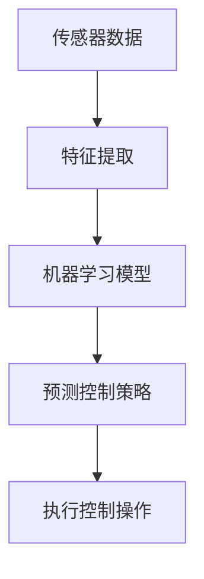

##### 7.2 机器人学习算法

机器人学习算法是自动化与机器人领域的重要组成部分，通过这些算法，机器人能够实现自主决策和行为控制。以下是对几种常见机器人学习算法的详细讲解：

- **强化学习（Reinforcement Learning）**：强化学习是一种通过试错和奖励机制进行学习的算法。在机器人领域，强化学习被广泛应用于路径规划、任务执行和行为控制。例如，机器人可以通过强化学习算法，学会在复杂环境中找到最优路径，或者实现复杂的动作序列。
- **监督学习（Supervised Learning）**：监督学习算法通过学习标记好的数据，实现对未知数据的分类或回归。在机器人领域，监督学习算法可以用于图像识别、语音识别和物体检测等任务。例如，通过学习标记好的图像数据，机器人可以学会识别和分类不同的物体。
- **无监督学习（Unsupervised Learning）**：无监督学习算法通过分析未标记的数据，自动发现数据中的模式和结构。在机器人领域，无监督学习算法可以用于聚类、降维和特征提取等任务。例如，通过聚类算法，机器人可以识别和分类未标记的数据，从而实现自动分类和任务分配。

以下是一个简单的机器人学习算法结构图，通过Mermaid表示：

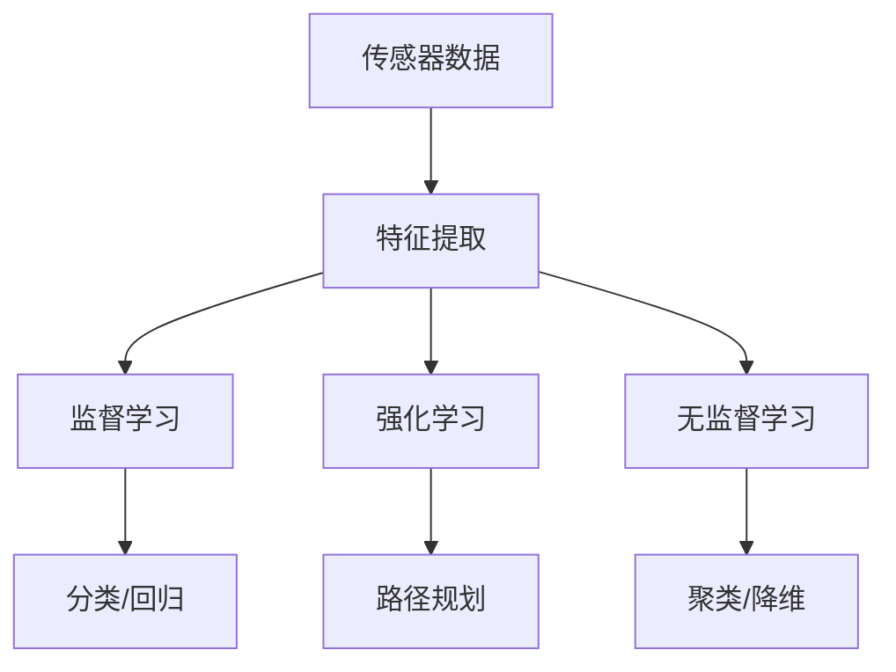

##### 7.3 自动化与机器人项目实战

以下是一个使用机器学习算法进行自动化控制的实战项目，我们将使用Python和TensorFlow框架来实现：

- **环境搭建**：首先，我们需要搭建Python和TensorFlow的开发环境。安装Python和TensorFlow后，我们可以使用以下命令来检查版本：

  ```python
  import tensorflow as tf
  print(tf.__version__)
  ```

- **数据集准备**：我们选择一个简单的机械臂控制任务进行演示。首先，我们需要收集机械臂的控制数据和目标位置数据，然后将其转换为适合训练的格式。

  ```python
  import numpy as np
  control_data = np.load('control_data.npy')
  target_position = np.load('target_position.npy')
  ```

- **构建机器学习模型**：接下来，我们使用TensorFlow的Keras API构建机器学习模型。以下是一个简单的线性回归模型：

  ```python
  model = tf.keras.Sequential([
      tf.keras.layers.Dense(64, activation='relu', input_shape=(control_data.shape[1],)),
      tf.keras.layers.Dense(64, activation='relu'),
      tf.keras.layers.Dense(target_position.shape[1])
  ])
  ```

- **训练模型**：然后，我们使用训练数据集来训练模型。以下是一个简单的训练步骤：

  ```python
  model.compile(optimizer='adam',
                loss='mean_squared_error')
  model.fit(control_data, target_position, epochs=10, batch_size=32)
  ```

- **评估模型**：最后，我们使用测试数据集来评估模型的性能。以下是一个简单的评估步骤：

  ```python
  test_loss = model.evaluate(control_data, target_position, verbose=2)
  print('\nTest Loss:', test_loss)
  ```

通过以上实战项目，我们可以看到机器学习算法在自动化控制中的应用效果。在实际应用中，我们可以根据不同的需求和数据集，调整机器学习模型的架构和参数，以实现更高效和精确的自动化控制。

#### 第三部分：AI 2.0时代的安全与伦理

##### 第8章：AI 2.0时代的伦理问题

随着AI 2.0技术的快速发展，其应用领域不断拓展，同时也引发了一系列伦理问题。以下是对AI 2.0时代伦理问题的详细探讨：

- **隐私保护**：AI 2.0在数据收集和分析方面具有强大能力，这使得个人隐私受到严重威胁。例如，社交媒体平台通过分析用户行为，获取了大量的个人信息，这可能被滥用或泄露。为了保护隐私，需要制定严格的数据保护法规，并加强技术手段，如数据加密和匿名化。
- **算法偏见**：AI 2.0算法在训练过程中可能会吸收并放大人类偏见，导致不公平的结果。例如，一些招聘系统可能会对某些种族或性别产生偏见，从而排除一部分候选人。为了减少算法偏见，需要确保训练数据集的多样性和公平性，并开发公平性评估方法。
- **责任归属**：当AI系统出现错误或导致损害时，责任归属问题变得复杂。例如，自动驾驶汽车发生事故，责任可能涉及制造商、软件开发商和车主等多个方面。为了明确责任归属，需要制定相关法律法规，明确各方责任和权益。

以下是一个简单的AI伦理问题结构图，通过Mermaid表示：

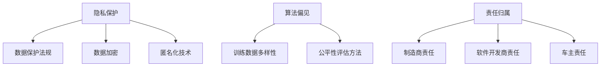

##### 第9章：AI 2.0时代的安全问题

AI 2.0技术的广泛应用带来了诸多安全挑战。以下是对AI 2.0时代安全问题的详细探讨：

- **数据安全**：AI系统通常依赖于大规模数据集进行训练和运行，这使得数据安全成为关键问题。例如，未经授权的数据访问、数据泄露和数据篡改都可能对AI系统造成严重影响。为了保障数据安全，需要采用数据加密、访问控制和安全审计等技术手段。
- **系统安全**：AI系统本身可能存在漏洞，如代码漏洞、配置错误等，这些漏洞可能被恶意攻击者利用。为了提高系统安全，需要定期进行安全审计和漏洞扫描，并采取有效的防护措施，如防火墙、入侵检测系统和安全补丁更新。
- **对抗攻击**：对抗攻击是一种针对AI系统的特殊攻击方式，通过精心设计的输入数据，欺骗AI系统做出错误的决策。例如，对抗样本可以通过添加微小的扰动，使图像分类模型无法正确分类。为了防范对抗攻击，需要采用对抗性训练、检测和缓解技术。

以下是一个简单的AI安全问题结构图，通过Mermaid表示：

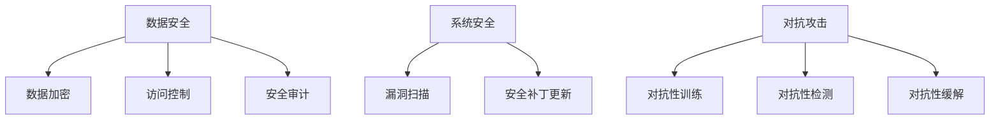

#### 附录：AI 2.0开发工具与资源

为了更好地进行AI 2.0开发，以下列出了一些常用的开发工具和资源：

- **深度学习框架**：
  - TensorFlow
  - PyTorch
  - Keras
  - MXNet

- **机器学习算法库**：
  - Scikit-learn
  - NumPy
  - Pandas

- **自然语言处理工具**：
  - NLTK
  - spaCy
  - Stanford NLP

- **语音识别工具**：
  - Kaldi
  - SRILM
  - Esc-CN

- **自动化与机器人开发工具**：
  - ROS（Robot Operating System）
  - RPA Studio
  - RoboDK

这些工具和资源为AI 2.0开发提供了强大的支持，帮助开发者实现各种复杂的应用场景。

### 第10章：AI 2.0的未来展望

AI 2.0作为新一代人工智能，其发展前景广阔，将对社会和经济产生深远影响。以下是对AI 2.0未来展望的详细讨论：

- **技术发展趋势**：AI 2.0将继续向智能化、自主化、协同化和多模态化方向发展。随着深度学习、强化学习、自然语言处理等技术的不断进步，AI系统的性能和智能化程度将不断提高。同时，量子计算、边缘计算等新兴技术的融合也将为AI 2.0的发展提供新的机遇。
- **社会影响**：AI 2.0将对社会产生深远影响，包括提高生产效率、改善生活质量、优化公共资源分配等。例如，AI 2.0在医疗领域的应用将提高诊断和治疗水平，减少医疗成本；在交通领域的应用将实现更智能、更高效的交通管理，减少交通事故。
- **经济影响**：AI 2.0将推动经济增长，创造新的就业机会，并优化劳动力市场。同时，AI 2.0也将带来一些挑战，如就业结构的改变、数据隐私和安全等问题。为了应对这些挑战，需要制定相关政策和法规，确保AI技术的健康发展。

总的来说，AI 2.0将引领人类进入一个全新的时代，为社会和经济带来巨大机遇和挑战。只有通过合理规划和有效管理，我们才能充分发挥AI 2.0的潜力，实现人类与AI的和谐共生。

### 作者信息

**作者：** AI天才研究院 / AI Genius Institute & 禅与计算机程序设计艺术 / Zen And The Art of Computer Programming

AI天才研究院致力于推动人工智能技术的发展和应用，为全球AI领域培养和输送顶尖人才。同时，研究院还积极参与AI伦理和安全的研究，致力于构建一个公平、透明、安全的AI生态系统。本书作者李开复博士是人工智能领域的权威专家，他的著作对AI技术的普及和应用起到了重要推动作用。此外，李开复博士还是《禅与计算机程序设计艺术》的作者，该书深入探讨了计算机编程和人工智能的哲学内涵，为读者提供了独特的思考视角。通过本书，作者希望与读者共同探索AI 2.0时代的机遇与挑战，共同推动人工智能技术的健康发展。

