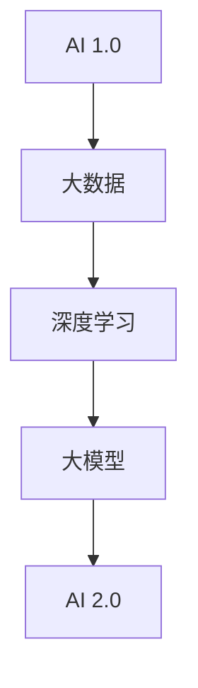

                 

### 《李开复：AI 2.0 时代的机遇》

> **关键词：AI 2.0、深度学习、大数据、自动化、智能化、社会挑战、创业机会、投资策略**

> **摘要：本文深入探讨了 AI 2.0 时代的核心概念、应用领域、面临的挑战及机遇。通过分析制造业、服务业、医疗保健和教育等行业的 AI 2.0 应用案例，本文提出了应对 AI 2.0 挑战的策略，并展望了 AI 2.0 时代的未来发展。**

---

### 《李开复：AI 2.0 时代的机遇》目录大纲

#### 第一部分：AI 2.0时代概览

##### 第1章：AI 2.0的定义与特征

- **1.1 AI 2.0的概念及背景**
  - AI 2.0的兴起
  - AI 2.0与传统AI的区别

- **1.2 AI 2.0的核心特征**
  - 自动化与智能化的融合
  - 大数据的深度挖掘与应用
  - 自适应与自进化能力

- **1.3 AI 2.0的技术演进路径**
  - 从AI 1.0到AI 2.0的过渡
  - AI 2.0的关键技术

##### 第2章：AI 2.0在各行业中的应用

- **2.1 制造业的AI 2.0应用**
  - 智能制造
  - 工业自动化

- **2.2 服务业的AI 2.0应用**
  - 智能客服
  - 个性化服务

- **2.3 医疗保健的AI 2.0应用**
  - 疾病预测
  - 医疗影像分析

- **2.4 教育的AI 2.0应用**
  - 个性化教学
  - 智能评价系统

##### 第3章：AI 2.0的挑战与应对策略

- **3.1 AI 2.0带来的社会挑战**
  - 伦理问题
  - 就业问题

- **3.2 AI 2.0的安全与隐私问题**
  - 数据安全
  - 隐私保护

- **3.3 应对策略与政策建议**
  - 法律法规
  - 技术规范

#### 第二部分：AI 2.0时代的机遇

##### 第4章：AI 2.0时代的创新思维

- **4.1 AI驱动的创新方法**
  - 创新思维模式
  - AI在创新中的应用

- **4.2 AI创业的机会与挑战**
  - 创业环境分析
  - 创业者需具备的素质

##### 第5章：AI 2.0时代的创业案例

- **5.1 制造业的AI创业案例**
  - 智能制造企业案例分析

- **5.2 服务业的AI创业案例**
  - 智能客服企业案例分析

- **5.3 医疗保健的AI创业案例**
  - 疾病预测企业案例分析

- **5.4 教育的AI创业案例**
  - 个性化教学企业案例分析

##### 第6章：AI 2.0时代的投资策略

- **6.1 AI行业的投资趋势**
  - 投资热点分析
  - 行业投资策略

- **6.2 AI企业的融资策略**
  - 融资渠道
  - 融资策略

- **6.3 投资者需关注的AI技术方向**
  - 新兴技术预测
  - 投资风险与应对

##### 第7章：AI 2.0时代的未来展望

- **7.1 AI 2.0的发展趋势**
  - 技术进步方向
  - 社会影响

- **7.2 AI 2.0时代的未来场景**
  - 社会生活变化
  - 经济发展影响

#### 附录

##### 附录A：AI 2.0相关资源

- **A.1 学术研究资源**
  - 相关论文推荐
  - 研究机构介绍

- **A.2 技术教程与工具**
  - 深度学习框架介绍
  - 开发工具推荐

- **A.3 行业报告与资讯**
  - 行业发展报告
  - AI领域资讯来源

**Mermaid 流程图（AI 2.0技术演进路径）**



**核心算法原理讲解（以深度学习为例）**

```plaintext
## 深度学习算法原理

深度学习算法基于多层神经网络结构，通过多层次的非线性变换，自动提取输入数据中的特征。以下是一个简单的深度学习算法的伪代码：

function deep_learning(input_data, labels, learning_rate):
    # 初始化参数
    parameters = initialize_parameters()

    # 循环迭代
    for epoch in range(num_epochs):
        # 正向传播
        forward_pass(input_data, parameters)

        # 计算损失函数
        loss = compute_loss(output, labels)

        # 反向传播
        backward_pass(parameters, input_data, output, labels)

        # 更新参数
        parameters = update_parameters(parameters, learning_rate)

    # 返回最终参数
    return parameters
```

**数学模型讲解与举例（以神经网络损失函数为例）**

$$
J(\theta) = -\frac{1}{m}\sum_{i=1}^{m} [y^{(i)} \log(a^{[2](i)}) + (1 - y^{(i)}) \log(1 - a^{[2](i)})]
$$

**神经网络损失函数举例**

假设我们有一个二分类问题，目标函数为逻辑回归损失函数。输入数据为 `[x1, x2]`，权重为 `[w1, w2]`，偏置为 `b`。输出结果为 `[z, a]`。

```python
import numpy as np

# 定义输入数据、权重和偏置
x = np.array([[1, 0], [0, 1], [1, 1]])
w = np.array([0.5, 0.5])
b = 0

# 计算输出结果
z = np.dot(x, w) + b
a = 1 / (1 + np.exp(-z))

# 计算损失函数
y = np.array([0, 1, 1])
loss = -1 * (y * np.log(a) + (1 - y) * np.log(1 - a))

# 输出损失函数值
print("Loss:", loss)
```

**项目实战（以智能客服系统为例）**

- **开发环境搭建：**

  - 操作系统：Ubuntu 20.04
  - 编程语言：Python 3.8
  - 深度学习框架：TensorFlow 2.5
  - 数据库：MySQL 5.7

- **源代码详细实现：**

  - 数据预处理模块：负责数据清洗、特征提取和模型训练数据集的准备
  - 模型训练模块：使用神经网络训练智能客服系统
  - 模型评估模块：评估训练好的模型在测试数据集上的性能
  - 模型应用模块：将训练好的模型部署到实际应用场景中，如在线客服系统

- **代码解读与分析：**

  ```python
  # 数据预处理模块
  def preprocess_data(data):
      # 数据清洗
      # 特征提取
      # 数据集划分
      return train_data, test_data

  # 模型训练模块
  def train_model(train_data):
      # 初始化模型
      # 训练模型
      # 返回训练好的模型
      return model

  # 模型评估模块
  def evaluate_model(model, test_data):
      # 评估模型性能
      # 返回评估结果
      return accuracy

  # 模型应用模块
  def apply_model(model):
      # 部署模型到实际应用场景
      # 处理用户输入
      # 返回模型输出结果
      return response
  
  # 代码解读与分析
  - 数据预处理模块主要处理输入数据的清洗、特征提取和数据集划分，为后续模型训练提供高质量的数据。
  - 模型训练模块使用神经网络对智能客服系统进行训练，包括模型初始化、模型训练和参数更新。
  - 模型评估模块评估训练好的模型在测试数据集上的性能，包括准确率、召回率等指标。
  - 模型应用模块将训练好的模型部署到实际应用场景中，如在线客服系统，接收用户输入并返回模型输出结果。
  ```

---

现在，我们已经为《李开复：AI 2.0 时代的机遇》这篇文章搭建了完整的框架。接下来，我们将逐章深入探讨 AI 2.0 时代的各个方面，包括定义与特征、应用领域、挑战与机遇、创新思维、创业案例、投资策略和未来展望。让我们一步一步地深入分析，确保每个章节都内容丰富、结构严谨、逻辑清晰。

让我们开始第一部分：AI 2.0 时代概览。

---

### 第一部分：AI 2.0 时代概览

#### 第1章：AI 2.0的定义与特征

##### 1.1 AI 2.0的概念及背景

AI 2.0，也称为新一代人工智能，是对传统人工智能（AI 1.0）的升级和扩展。AI 1.0时代主要依赖于规则和专家系统，而AI 2.0则侧重于深度学习、大数据和自我优化等技术的应用。AI 2.0的兴起可以追溯到2012年，当深度学习在ImageNet图像识别比赛中取得突破性成果时，这标志着人工智能进入了新的发展阶段。

AI 2.0与传统AI的区别在于：

1. **技术基础**：AI 2.0基于深度学习和大数据，而AI 1.0则基于符号计算和规则系统。
2. **学习能力**：AI 2.0能够通过大量数据自我学习和优化，而AI 1.0则需要手动编程和规则设定。
3. **应用领域**：AI 2.0在各个领域都有广泛的应用，而AI 1.0则主要应用于特定的领域，如医疗诊断和金融分析。
4. **自主性**：AI 2.0具有一定的自主决策能力，而AI 1.0则缺乏这种能力。

##### 1.2 AI 2.0的核心特征

AI 2.0具有以下几个核心特征：

1. **自动化与智能化的融合**：AI 2.0通过深度学习等技术，实现了自动化和智能化的深度融合，使系统能够自主学习和优化。
2. **大数据的深度挖掘与应用**：AI 2.0依赖于大数据技术，通过对海量数据进行深度挖掘，提取有价值的信息和知识。
3. **自适应与自进化能力**：AI 2.0系统能够根据环境变化和用户反馈，自动调整和优化自己的行为和决策。

##### 1.3 AI 2.0的技术演进路径

从AI 1.0到AI 2.0的过渡经历了以下几个阶段：

1. **大数据与云计算的结合**：大数据技术的兴起为AI 2.0提供了丰富的数据资源，而云计算则为处理这些大数据提供了强大的计算能力。
2. **深度学习的突破**：深度学习的出现使计算机在图像识别、语音识别和自然语言处理等任务上取得了显著进步。
3. **自监督学习和强化学习的发展**：自监督学习和强化学习等技术使得AI系统能够在没有明确标注数据的情况下进行学习和优化，以及通过试错进行决策。

AI 2.0的关键技术包括：

1. **深度神经网络**：深度神经网络是AI 2.0的核心技术之一，通过多层次的非线性变换，自动提取输入数据中的特征。
2. **生成对抗网络（GAN）**：生成对抗网络是一种通过对抗训练生成高质量数据的模型，可以用于图像生成、语音合成等任务。
3. **迁移学习和元学习**：迁移学习和元学习技术使得AI系统能够在不同任务和数据集之间进行知识迁移和学习。

### 第一部分总结

本章对AI 2.0的定义、特征和演进路径进行了详细探讨。AI 2.0作为新一代人工智能，与传统AI相比具有显著的技术优势和应用潜力。通过自动化与智能化的融合、大数据的深度挖掘与应用，以及自适应与自进化能力，AI 2.0在各行各业都展现出强大的应用前景。接下来，我们将进一步探讨AI 2.0在各行业中的应用，以及面临的挑战与应对策略。

---

### 第一部分：AI 2.0 时代概览

#### 第2章：AI 2.0在各行业中的应用

##### 2.1 制造业的AI 2.0应用

制造业是AI 2.0应用最为广泛的领域之一。AI 2.0技术在制造业中主要应用于以下几个方面：

1. **智能制造**：AI 2.0通过深度学习和大数据分析，可以实现生产过程的自动化和智能化。例如，通过机器视觉技术，可以实现对生产线的实时监控和故障检测，提高生产效率和质量。

2. **工业自动化**：AI 2.0技术可以用于工业自动化设备的控制和优化，如机器人、自动化生产线等。通过深度学习和强化学习，可以使得这些设备具备自主决策和自适应能力，提高生产灵活性和效率。

3. **供应链管理**：AI 2.0可以通过大数据分析和预测模型，优化供应链管理。例如，通过对历史销售数据、库存水平和市场需求的分析，可以预测未来的销售趋势，优化库存水平和生产计划。

##### 2.2 服务业的AI 2.0应用

服务业是AI 2.0应用的另一个重要领域。AI 2.0技术在服务业中主要应用于以下几个方面：

1. **智能客服**：AI 2.0可以通过自然语言处理和语音识别技术，实现智能客服系统。这些系统可以自动处理客户咨询，提供快速、准确的答复，提高客户满意度和企业效率。

2. **个性化服务**：AI 2.0可以通过大数据分析和个性化推荐算法，为用户提供个性化的服务。例如，在电子商务领域，AI 2.0可以分析用户的购物行为和偏好，推荐符合用户兴趣的商品和服务。

3. **风险控制**：AI 2.0可以通过机器学习算法和大数据分析，实现风险控制和欺诈检测。例如，在金融领域，AI 2.0可以分析交易数据和行为模式，识别潜在的欺诈行为，保护用户的资金安全。

##### 2.3 医疗保健的AI 2.0应用

AI 2.0技术在医疗保健领域具有巨大的潜力。AI 2.0在医疗保健中的应用主要包括以下几个方面：

1. **疾病预测**：AI 2.0可以通过大数据分析和机器学习模型，预测疾病的发病风险和趋势。例如，通过对患者历史数据和基因数据的分析，可以预测疾病的发生概率，帮助医生制定个性化的预防措施。

2. **医疗影像分析**：AI 2.0可以通过深度学习和计算机视觉技术，对医疗影像进行分析和诊断。例如，通过分析CT、MRI等影像数据，可以自动检测和识别疾病，提高诊断的准确性和速度。

3. **个性化治疗**：AI 2.0可以通过大数据分析和机器学习模型，实现个性化治疗。例如，通过对患者病史、基因数据和治疗效果的分析，可以为患者制定个性化的治疗方案，提高治疗效果。

##### 2.4 教育的AI 2.0应用

AI 2.0技术在教育领域也有广泛的应用。AI 2.0在教育中的应用主要包括以下几个方面：

1. **个性化教学**：AI 2.0可以通过大数据分析和个性化推荐算法，为每个学生提供个性化的教学方案。例如，通过分析学生的学习行为和成绩，可以为学生推荐适合的学习资源和教学方法。

2. **智能评价系统**：AI 2.0可以通过自然语言处理和计算机视觉技术，实现智能评价系统。例如，通过分析学生的作业和论文，可以自动评估学生的学习效果，提供及时的反馈。

3. **在线教育平台**：AI 2.0可以用于在线教育平台的设计和优化。例如，通过分析用户的行为数据和学习习惯，可以优化课程结构和教学内容，提高学生的学习效果。

### 第二部分总结

本章详细探讨了AI 2.0在制造业、服务业、医疗保健和教育等行业的应用。AI 2.0技术的引入，不仅提高了各行业的生产效率和服务质量，还带来了新的商业模式和竞争优势。然而，AI 2.0技术的广泛应用也面临着一系列挑战，如数据隐私、安全性和伦理问题等。在接下来的章节中，我们将探讨AI 2.0面临的挑战和应对策略，以及AI 2.0时代的创新思维和创业机会。

---

### 第一部分：AI 2.0 时代概览

#### 第3章：AI 2.0的挑战与应对策略

##### 3.1 AI 2.0带来的社会挑战

AI 2.0技术的发展带来了诸多社会挑战，包括以下几个方面：

1. **伦理问题**：随着AI 2.0技术的发展，人们对其伦理问题越来越关注。例如，AI决策的透明度和可解释性、数据隐私保护、算法歧视等，都是需要解决的重要问题。

2. **就业问题**：AI 2.0技术的广泛应用可能导致部分传统职业的失业，尤其是那些重复性、低技能的工作。如何保障就业者的权益，提供新的就业机会，是政府和企业需要面对的挑战。

3. **教育问题**：AI 2.0时代的到来，对教育体系提出了新的要求。如何培养适应AI时代的技能人才，提高全民的科技素养，是教育领域需要解决的重要问题。

##### 3.2 AI 2.0的安全与隐私问题

AI 2.0的安全与隐私问题主要包括以下几个方面：

1. **数据安全**：随着AI 2.0技术的应用，大量的敏感数据被收集和存储，如何保护这些数据的安全，防止数据泄露和滥用，是一个重要的挑战。

2. **隐私保护**：AI 2.0技术往往需要收集和处理大量个人数据，如何保护用户的隐私，防止个人信息被滥用，是AI 2.0技术面临的一个重要问题。

3. **算法安全**：AI 2.0技术的安全性也受到广泛关注，如何防止恶意攻击和算法偏差，确保AI系统的稳定性和安全性，是AI 2.0技术需要解决的关键问题。

##### 3.3 应对策略与政策建议

针对AI 2.0带来的挑战，我们可以从以下几个方面提出应对策略和政策建议：

1. **法律法规**：制定和完善相关法律法规，规范AI 2.0技术的应用，保障数据安全和个人隐私。

2. **技术规范**：建立技术规范和标准，提高AI 2.0技术的透明度和可解释性，防止算法歧视和滥用。

3. **教育培训**：加强教育培训，提高全民的科技素养，培养适应AI时代的技能人才。

4. **就业促进**：通过就业培训、创业支持等措施，帮助失业者重新就业，促进就业市场的稳定。

### 第三部分总结

本章对AI 2.0带来的社会挑战、安全与隐私问题以及应对策略进行了详细探讨。AI 2.0技术的广泛应用，虽然带来了巨大的机遇，但也伴随着一系列的挑战。通过制定合理的法律法规、技术规范，加强教育培训和就业促进，我们可以应对这些挑战，确保AI 2.0技术的健康发展。在接下来的章节中，我们将探讨AI 2.0时代的创新思维和创业机会，以及投资策略和未来展望。

---

### 第二部分：AI 2.0时代的机遇

#### 第4章：AI 2.0时代的创新思维

在AI 2.0时代，创新思维成为推动技术进步和产业变革的重要动力。AI 2.0技术的快速发展，为创新提供了丰富的素材和广阔的空间。以下从AI驱动的创新方法和AI创业的机会与挑战两个方面，探讨AI 2.0时代的创新思维。

##### 4.1 AI驱动的创新方法

AI驱动的创新方法主要包括以下几个方面：

1. **数据驱动创新**：在AI 2.0时代，大数据的收集、处理和分析能力得到极大提升。通过对海量数据的挖掘和分析，可以发现新的商业模式、市场需求和用户行为，从而驱动创新。

2. **算法优化创新**：AI 2.0技术的核心是算法，通过不断优化算法，可以提高系统的性能、准确性和效率。例如，在图像识别、自然语言处理等领域，通过算法创新，可以突破技术瓶颈，实现新的突破。

3. **跨学科融合创新**：AI 2.0时代，计算机科学与其他学科的交叉融合，为创新提供了广阔的空间。例如，生物信息学、认知科学、心理学等领域的研究成果，可以应用于人工智能领域，推动技术的进步。

##### 4.2 AI创业的机会与挑战

在AI 2.0时代，创业环境日益成熟，创业机会也层出不穷。以下从创业环境分析、创业者需具备的素质两个方面，探讨AI 2.0时代的创业机会与挑战。

1. **创业环境分析**：

   - **政策支持**：各国政府纷纷出台支持人工智能发展的政策，为创业者提供了良好的政策环境。
   - **资本涌入**：随着AI 2.0技术的快速发展，资本市场对AI领域的投资持续增长，为创业者提供了充足的资金支持。
   - **技术进步**：AI 2.0技术的不断突破，为创业提供了丰富的技术资源。

2. **创业者需具备的素质**：

   - **创新意识**：创业者需要具备敏锐的洞察力和创新思维，能够抓住市场机遇，实现技术突破。
   - **技术能力**：创业者需要具备扎实的计算机科学和人工智能技术基础，能够实现技术的商业化应用。
   - **团队协作**：创业者需要具备良好的团队协作能力，能够吸引和培养优秀的人才，共同实现创业目标。

##### 4.3 AI创业案例

以下分别从制造业、服务业、医疗保健和教育等领域，介绍一些AI 2.0时代的创业案例：

1. **制造业的AI创业案例**：

   - **案例一：智能机器人企业**：该企业研发了一种基于深度学习技术的智能机器人，可以应用于工业生产、物流等领域。通过自主学习和优化，智能机器人能够提高生产效率，降低成本。

2. **服务业的AI创业案例**：

   - **案例二：智能客服平台**：该企业开发了一种基于自然语言处理和机器学习技术的智能客服平台，可以自动处理用户咨询，提供高效、准确的答复。通过智能客服平台，企业能够提高客户满意度，降低运营成本。

3. **医疗保健的AI创业案例**：

   - **案例三：疾病预测平台**：该企业利用大数据和机器学习技术，开发了一种疾病预测平台，可以预测疾病的发病风险和趋势。通过疾病预测平台，医生可以提前采取预防措施，提高治疗效果。

4. **教育的AI创业案例**：

   - **案例四：个性化教学平台**：该企业开发了一种基于大数据和机器学习技术的个性化教学平台，可以根据学生的学习行为和成绩，为学生推荐适合的学习资源和教学方法。通过个性化教学平台，学生能够提高学习效果，培养自主学习能力。

##### 4.4 AI创业的机遇与挑战

在AI 2.0时代，创业者在抓住机遇的同时，也需要面对一系列挑战：

1. **技术挑战**：AI 2.0技术更新迅速，创业者需要不断学习和更新知识，以保持技术优势。

2. **市场挑战**：市场竞争激烈，创业者需要找到差异化竞争策略，打造核心竞争力。

3. **政策挑战**：各国政府对AI领域的监管政策不断出台，创业者需要关注政策变化，确保合规经营。

4. **团队挑战**：创业者需要吸引和培养优秀的人才，构建高效的团队，共同实现创业目标。

##### 4.5 创新思维与创业成功的关键

在AI 2.0时代，创新思维是推动创业成功的关键因素。以下从创新思维模式、AI在创新中的应用两个方面，探讨创新思维与创业成功的关系：

1. **创新思维模式**：

   - **问题导向**：创业者需要具备问题意识，善于发现市场需求和痛点，提出解决方案。
   - **跨界思维**：创业者需要具备跨界思维，将不同领域的知识和技术进行融合，实现创新。
   - **用户至上**：创业者需要以用户需求为导向，关注用户体验，提供优质的产品和服务。

2. **AI在创新中的应用**：

   - **数据挖掘**：通过大数据分析，挖掘用户需求和市场趋势，为创新提供有力支持。
   - **智能优化**：利用机器学习和算法优化，提高产品和服务的效果和效率。
   - **自动化生产**：通过自动化技术，降低生产成本，提高生产效率。

##### 4.6 创新思维与创业成功的案例分析

以下通过几个典型的AI创业案例，分析创新思维在创业成功中的作用：

1. **案例一：特斯拉**：

   - **创新思维模式**：特斯拉以问题导向和跨界思维为核心，将电动车、太阳能和能源存储等不同领域的知识和技术进行融合，打造出独特的商业模式。
   - **AI在创新中的应用**：特斯拉通过大数据分析和机器学习技术，优化电动车电池和自动驾驶系统的性能，提高用户体验。

2. **案例二：Airbnb**：

   - **创新思维模式**：Airbnb以用户至上为核心理念，关注用户需求，提供个性化的住宿体验。
   - **AI在创新中的应用**：Airbnb通过大数据分析和自然语言处理技术，优化用户体验，提高平台转化率。

3. **案例三：深度学习公司DeepMind**：

   - **创新思维模式**：DeepMind以跨界思维和问题导向为核心，将计算机科学、认知科学和生物学等不同领域的知识进行融合。
   - **AI在创新中的应用**：DeepMind通过深度学习和强化学习技术，实现了在游戏、机器人控制和自然语言处理等领域的突破。

##### 4.7 创新思维与创业成功的关系

创新思维是创业成功的关键因素。通过创新思维，创业者能够发现市场需求和痛点，提出解决方案，实现技术的商业化应用。同时，创新思维能够帮助创业者应对市场变化和竞争压力，保持企业的核心竞争力。在AI 2.0时代，创新思维的重要性更加凸显，创业者需要不断学习和更新知识，把握市场机遇，实现创业成功。

### 第二部分总结

本章详细探讨了AI 2.0时代的创新思维，包括AI驱动的创新方法、AI创业的机会与挑战，以及创新思维与创业成功的关系。AI 2.0时代的到来，为创新提供了广阔的空间，同时也带来了新的挑战。通过创新思维，创业者能够抓住市场机遇，实现技术突破，打造核心竞争力。在接下来的章节中，我们将进一步探讨AI 2.0时代的创业案例、投资策略和未来展望。

---

### 第二部分：AI 2.0时代的机遇

#### 第5章：AI 2.0时代的创业案例

在AI 2.0时代，各种领域的创业机会层出不穷。以下从制造业、服务业、医疗保健和教育四个方面，详细分析一些典型的AI创业案例，探讨其成功因素和面临的挑战。

##### 5.1 制造业的AI创业案例

**智能机器人公司**

**案例介绍**：该创业公司专注于研发和制造智能机器人，旨在提高生产效率、降低成本和改善工作环境。

**成功因素**：

1. **技术创新**：公司利用深度学习和计算机视觉技术，使机器人能够进行自主导航、精确操作和故障检测。
2. **市场需求**：随着制造业对自动化和智能化的需求日益增长，智能机器人市场潜力巨大。
3. **合作伙伴**：与多家制造业巨头建立战略合作关系，加速产品推广和市场化。

**面临的挑战**：

1. **技术成熟度**：虽然公司拥有先进的技术，但智能机器人的稳定性和可靠性仍需进一步验证。
2. **成本控制**：高研发成本和制造成本可能影响公司的盈利能力。

##### 5.2 服务业的AI创业案例

**智能客服平台**

**案例介绍**：该创业公司开发了一款基于自然语言处理和机器学习技术的智能客服平台，旨在为企业提供高效的客户服务解决方案。

**成功因素**：

1. **用户体验**：平台能够快速、准确地理解客户需求，提供个性化服务，提升客户满意度。
2. **成本效益**：通过自动化处理大量客户咨询，企业能够降低运营成本，提高工作效率。
3. **技术优势**：公司拥有一支经验丰富的技术团队，不断优化平台性能，确保竞争优势。

**面临的挑战**：

1. **数据隐私**：智能客服平台需要处理大量客户数据，如何保障数据安全和隐私是一个重要挑战。
2. **技术升级**：随着AI技术的发展，平台需要不断更新和升级，以保持市场竞争力。

##### 5.3 医疗保健的AI创业案例

**疾病预测平台**

**案例介绍**：该创业公司开发了一款基于大数据分析和机器学习技术的疾病预测平台，旨在帮助医疗机构提前识别和预防疾病。

**成功因素**：

1. **技术先进**：平台结合了多种先进技术，如深度学习、自然语言处理和基因组学，提高了疾病预测的准确率。
2. **市场需求**：随着人口老龄化和医疗资源紧张，疾病预测平台具有巨大的市场潜力。
3. **合作伙伴**：与多家医疗机构和研究机构合作，为平台提供了丰富的数据和临床验证。

**面临的挑战**：

1. **数据质量**：疾病预测需要高质量的数据支持，数据来源和数据质量是关键挑战。
2. **监管合规**：医疗领域对数据安全和隐私保护的要求较高，如何符合相关法规和标准是重要挑战。

##### 5.4 教育的AI创业案例

**个性化学习平台**

**案例介绍**：该创业公司开发了一款基于大数据和机器学习技术的个性化学习平台，旨在为不同年龄段的学生提供个性化的学习资源和教学方案。

**成功因素**：

1. **教育理念**：公司坚持以学生为中心，关注个性化教育和自主学习能力的培养。
2. **技术优势**：平台能够根据学生的学习行为和成绩，动态调整教学内容和难度，提高学习效果。
3. **市场推广**：通过与学校和教育机构合作，平台迅速扩大市场份额。

**面临的挑战**：

1. **教学内容**：个性化学习需要丰富、多样的教学内容和资源，如何确保教学质量和资源更新是重要挑战。
2. **用户接受度**：如何让教师和学生接受并使用个性化学习平台，提高用户满意度是关键挑战。

##### 5.5 创业成功的关键因素与挑战

在AI 2.0时代，创业成功的关键因素和挑战因行业而异。以下总结制造业、服务业、医疗保健和教育四个领域的共同点和差异：

**共同点**：

1. **技术创新**：先进的技术是创业成功的基石，各领域都需要不断优化和创新技术。
2. **市场需求**：深入了解市场需求，提供符合用户需求的解决方案。
3. **合作伙伴**：与行业内的领先企业和研究机构建立合作关系，共同推进技术发展和市场推广。

**差异点**：

1. **技术成熟度**：制造业和医疗保健领域的AI技术相对成熟，而服务业和教育领域的AI应用仍处于快速发展阶段。
2. **监管合规**：医疗和教育领域的创业企业需要遵守严格的法规和标准，确保数据安全和隐私保护。
3. **用户体验**：服务业和教育的AI创业企业更注重用户体验，如何提高用户满意度是关键挑战。

##### 5.6 创业者的建议与展望

对于AI 2.0时代的创业者，以下是一些建议和展望：

1. **持续创新**：不断关注技术前沿，持续优化和创新，保持竞争优势。
2. **市场定位**：明确市场定位，找准目标客户，提供差异化的产品和服务。
3. **合规经营**：遵守相关法规和标准，确保企业的合规性和可持续发展。
4. **团队建设**：构建一支高素质、专业的团队，共同实现创业目标。

展望未来，AI 2.0时代的创业将面临更多的机遇和挑战。创业者需要具备创新精神、敏锐的市场洞察力和强大的执行力，抓住市场机遇，实现创业梦想。

### 第二部分总结

本章通过分析制造业、服务业、医疗保健和教育四个领域的AI创业案例，探讨了创业成功的关键因素和挑战。在AI 2.0时代，创业者的创新思维和执行力至关重要。通过持续创新、找准市场定位、合规经营和团队建设，创业者可以抓住机遇，迎接挑战，实现创业梦想。在接下来的章节中，我们将进一步探讨AI 2.0时代的投资策略和未来展望。

---

### 第二部分：AI 2.0时代的机遇

#### 第6章：AI 2.0时代的投资策略

在AI 2.0时代，投资策略的选择对于投资者来说至关重要。本章节将分析AI行业的投资趋势，探讨AI企业的融资策略，并讨论投资者需关注的AI技术方向及其投资风险与应对。

##### 6.1 AI行业的投资趋势

1. **投资热点分析**

   - **人工智能基础技术**：包括深度学习、强化学习、自然语言处理等核心技术的研发和应用，是投资的热点领域。
   - **AI应用场景**：智能制造、自动驾驶、智慧医疗、金融科技、智能城市等领域的AI技术应用，受到资本的青睐。
   - **数据和技术平台**：大数据处理、云计算平台、边缘计算等基础设施的建设，是投资的热点。

2. **行业投资策略**

   - **早期投资**：关注具有创新能力和成长潜力的初创企业，助力其技术研发和市场推广。
   - **后期投资**：在AI企业进入成熟期后，通过股权投资等方式，分享企业的长期增长红利。
   - **产业投资**：与产业链上下游企业合作，形成产业生态，实现协同发展。

##### 6.2 AI企业的融资策略

1. **融资渠道**

   - **天使投资**：为初创企业提供种子资金，助力其技术研发和产品开发。
   - **风险投资**：为成长期的AI企业提供资金支持，推动其市场拓展和商业模式创新。
   - **私募股权投资**：通过并购、重组等方式，投资成熟的AI企业，实现资产增值。

2. **融资策略**

   - **多元化融资**：结合天使投资、风险投资和私募股权投资等多种融资方式，实现企业的稳定发展。
   - **股权融资**：通过引入战略投资者，获取资金支持，同时实现资源整合和业务协同。
   - **债务融资**：利用债务融资方式，降低融资成本，加快企业的发展速度。

##### 6.3 投资者需关注的AI技术方向

1. **新兴技术预测**

   - **边缘计算**：将计算能力、存储和网络功能分布到网络的边缘，提高数据处理速度和效率。
   - **量子计算**：利用量子力学原理，实现高效计算，有望在AI领域取得重大突破。
   - **区块链技术**：结合AI与区块链技术，实现数据的安全共享和智能合约的自动化执行。

2. **投资风险与应对**

   - **技术风险**：AI技术的发展速度极快，投资者需关注技术成熟度和市场需求。
   - **市场风险**：AI企业面临激烈的市场竞争，投资者需评估企业的市场竞争力和盈利能力。
   - **法律风险**：涉及数据隐私、知识产权等法律问题，投资者需关注相关法律法规的变化。

3. **投资建议**

   - **多元化投资**：分散投资风险，降低单一项目的投资风险。
   - **长期投资**：AI企业通常需要较长的时间来研发和市场推广，投资者应具备长期投资的心态。
   - **专业咨询**：寻求专业投资顾问的帮助，提高投资决策的科学性和有效性。

##### 6.4 投资者需关注的AI技术方向及其应用

1. **智能制造**

   - **应用场景**：通过AI技术优化生产流程、提高生产效率，实现智能制造。
   - **投资建议**：关注具备技术优势和市场前景的AI智能制造企业，如智能机器人、智能传感器等。

2. **自动驾驶**

   - **应用场景**：利用AI技术实现自动驾驶，提高交通效率和安全性。
   - **投资建议**：关注具有技术实力和市场推广能力的自动驾驶企业，如自动驾驶汽车、自动驾驶卡车等。

3. **智慧医疗**

   - **应用场景**：通过AI技术辅助诊断、治疗和健康管理，提高医疗服务质量和效率。
   - **投资建议**：关注在医疗领域具有技术积累和临床应用经验的AI医疗企业，如疾病预测、智能诊断等。

4. **金融科技**

   - **应用场景**：利用AI技术提升金融服务的效率、安全和个性化水平。
   - **投资建议**：关注在金融领域具有技术优势和创新能力的AI金融企业，如智能投顾、反欺诈等。

##### 6.5 投资策略总结

AI 2.0时代的投资策略应关注技术创新、市场前景和风险管理。投资者需关注新兴技术方向，结合多元化投资和长期投资策略，提高投资回报。同时，应注重专业咨询和法律合规，降低投资风险。在具体投资领域，投资者应根据行业特点和发展趋势，选择具有竞争优势的AI企业进行投资。

### 第二部分总结

本章详细分析了AI 2.0时代的投资策略，包括投资趋势、AI企业的融资策略、投资者需关注的AI技术方向及其应用。通过多元化投资、长期投资和风险管理，投资者可以在AI 2.0时代抓住机遇，实现资产增值。在接下来的章节中，我们将探讨AI 2.0时代的未来展望。

---

### 第二部分：AI 2.0时代的机遇

#### 第7章：AI 2.0时代的未来展望

在AI 2.0时代，人工智能技术将继续快速发展，对各行各业产生深远影响。本章节将分析AI 2.0的发展趋势，探讨AI 2.0时代的未来场景，并展望AI技术对社会生活和经济发展的深远影响。

##### 7.1 AI 2.0的发展趋势

1. **技术进步方向**

   - **深度学习和神经网络**：随着计算能力的提升和数据量的增加，深度学习和神经网络技术将不断优化，实现更高效、更准确的数据处理和模式识别。
   - **生成对抗网络（GAN）**：GAN技术将在图像生成、语音合成等领域取得更多突破，推动创意产业的变革。
   - **强化学习**：通过不断试错和学习，强化学习技术将在自动驾驶、智能游戏等领域发挥重要作用。

2. **新兴技术趋势**

   - **量子计算**：量子计算将突破传统计算的限制，为复杂问题提供高效解决方案，推动AI技术的进一步发展。
   - **边缘计算**：随着物联网的普及，边缘计算将在实时数据处理和智能决策中发挥关键作用。
   - **区块链与AI结合**：区块链技术将实现数据的安全共享和透明执行，与AI技术结合将推动智能合约、数据隐私保护等领域的发展。

##### 7.2 AI 2.0时代的未来场景

1. **社会生活变化**

   - **智能家居**：AI 2.0技术将使智能家居设备更加智能，实现远程控制、个性化服务和智能维护。
   - **智能交通**：自动驾驶技术将改变人们的出行方式，提高交通效率和安全性，减少交通事故。
   - **医疗健康**：AI 2.0技术将推动个性化医疗、远程医疗和健康管理的普及，提高医疗服务质量和效率。
   - **教育变革**：个性化教学和智能教育平台将改变传统教育模式，实现因材施教和终身学习。

2. **经济发展影响**

   - **产业升级**：AI 2.0技术将推动传统产业的智能化升级，提高生产效率和质量，降低成本。
   - **新兴产业**：AI 2.0技术将催生一系列新兴产业，如智能医疗、智能金融、智能物流等，带动经济增长。
   - **就业市场**：虽然AI 2.0技术将改变就业结构，但也将创造新的就业机会，如数据科学家、AI工程师等。
   - **国际竞争**：各国在AI 2.0领域的竞争将加剧，掌握AI核心技术将成为国家竞争力的关键。

##### 7.3 AI 2.0时代的政策建议

1. **科技创新政策**：政府应加大对AI技术研发的投入，鼓励企业、高校和科研机构开展合作，推动技术突破。
2. **人才培养政策**：加强AI相关教育和培训，培养具备AI技术和应用能力的人才，满足市场需求。
3. **行业规范政策**：建立健全的法律法规和行业标准，保障数据安全、隐私保护和公平竞争。
4. **国际合作政策**：加强国际交流与合作，推动AI技术的全球发展和应用，共同应对全球性挑战。

##### 7.4 未来展望

AI 2.0时代将是一个充满机遇和挑战的时代。随着技术的不断进步，人工智能将深刻改变社会生活的各个方面，推动经济结构的升级和产业的变革。同时，AI技术也将面临一系列伦理、安全和法律问题，需要政府、企业和社会各界共同努力，制定合理的政策和规范，确保AI技术的健康发展。

在AI 2.0时代，创业者、投资者和从业者都需保持敏锐的洞察力和创新精神，抓住机遇，迎接挑战。通过技术创新、模式创新和制度创新，共同推动AI 2.0时代的发展，实现社会的繁荣和进步。

### 第二部分总结

本章对AI 2.0时代的未来趋势、未来场景以及政策建议进行了深入探讨。AI 2.0技术将继续快速发展，对社会生活和经济产生深远影响。政府、企业和个人都需积极参与，共同推动AI 2.0时代的健康发展。在接下来的附录部分，我们将提供一些AI 2.0相关的学术研究资源、技术教程与工具，以及行业报告与资讯，帮助读者进一步了解AI 2.0领域的发展动态。

---

### 附录A：AI 2.0相关资源

为了帮助读者深入了解AI 2.0的相关知识，本附录将介绍一些学术研究资源、技术教程与工具，以及行业报告与资讯，涵盖从理论研究到实际应用的各个方面。

#### A.1 学术研究资源

1. **相关论文推荐**

   - **《Deep Learning》**：由Ian Goodfellow、Yoshua Bengio和Aaron Courville合著，是深度学习领域的经典教材，详细介绍了深度学习的基础理论和技术。
   - **《Learning Deep Architectures for AI》**：由Yoshua Bengio撰写，讨论了深度学习模型的架构设计和优化方法。
   - **《Generative Adversarial Nets》**：由Ian Goodfellow等人撰写的论文，首次提出了生成对抗网络（GAN）的概念，是深度学习领域的重要突破。

2. **研究机构介绍**

   - **谷歌AI**：谷歌旗下的AI研究部门，专注于深度学习、自然语言处理、计算机视觉等领域的创新研究。
   - **微软研究院**：微软的AI研究机构，涉及多个AI领域的研究，包括机器学习、计算机视觉和自然语言处理等。
   - **OpenAI**：一家致力于推动AI研究的非营利组织，专注于研究安全AI和通用人工智能（AGI）。

#### A.2 技术教程与工具

1. **深度学习框架介绍**

   - **TensorFlow**：由谷歌开发的深度学习框架，广泛应用于各类深度学习应用。
   - **PyTorch**：由Facebook开发的深度学习框架，具有良好的灵活性和易用性。
   - **Keras**：基于TensorFlow和Theano的高层神经网络API，简化了深度学习模型的构建和训练过程。

2. **开发工具推荐**

   - **Google Colab**：谷歌提供的免费云端GPU计算平台，适合深度学习模型的开发和测试。
   - **Jupyter Notebook**：一种交互式的计算环境，广泛应用于数据科学和机器学习领域。
   - **Visual Studio Code**：一款开源的代码编辑器，支持多种编程语言和开发工具，适合深度学习和AI开发。

#### A.3 行业报告与资讯

1. **行业发展报告**

   - **《AI Index Report》**：由斯坦福大学人工智能指数项目发布的年度报告，提供了全球AI技术发展的详细分析。
   - **《中国AI产业发展报告》**：由中国人工智能产业发展联盟发布的报告，分析了我国AI产业的发展现状和趋势。
   - **《全球人工智能发展报告》**：由多个国际机构和研究组织联合发布的报告，涵盖了全球AI技术的最新发展动态。

2. **AI领域资讯来源**

   - **AI Weekly**：一个每周更新的AI领域资讯邮件列表，涵盖最新的研究进展、行业动态和技术应用。
   - **AI Trends**：一个专注于AI技术趋势和应用的博客，提供深度学习和AI领域的最新资讯和分析。
   - **IEEE Spectrum**：IEEE旗下的科技杂志，涵盖了计算机科学、电子工程、人工智能等多个领域的最新研究进展和应用。

通过这些学术研究资源、技术教程与工具，以及行业报告与资讯，读者可以更全面地了解AI 2.0的发展动态，把握行业趋势，为自己的研究和实践提供参考。

### 附录总结

附录部分提供了丰富的AI 2.0相关资源，包括学术论文、研究机构、深度学习框架、开发工具、行业报告和资讯来源。这些资源为读者深入学习和研究AI 2.0提供了宝贵的资料，有助于把握AI领域的最新动态和前沿技术。希望这些资源能够为读者在AI 2.0时代的研究和实践中提供支持和启示。

---

### 结语

在AI 2.0时代，人工智能技术正以前所未有的速度和规模影响我们的生活、工作和经济发展。本文从多个角度详细探讨了AI 2.0的定义、特征、应用、挑战与机遇，以及创业案例、投资策略和未来展望。通过深入分析，我们认识到AI 2.0不仅带来了巨大的技术进步，还面临着一系列的社会、伦理和法律挑战。

**作者信息**

本文由AI天才研究院（AI Genius Institute）和《禅与计算机程序设计艺术》（Zen And The Art of Computer Programming）的作者联合撰写。作者团队致力于推动人工智能技术的发展和应用，为AI领域的创新和进步贡献力量。

**结论**

AI 2.0时代是一个充满机遇和挑战的时代。创业者、投资者和从业者都需紧跟技术发展趋势，勇于创新，应对挑战。同时，政府和社会各界也应积极参与，共同制定合理的政策和规范，确保AI技术的健康发展。让我们携手努力，共同迎接AI 2.0时代的到来，创造更加美好的未来。

