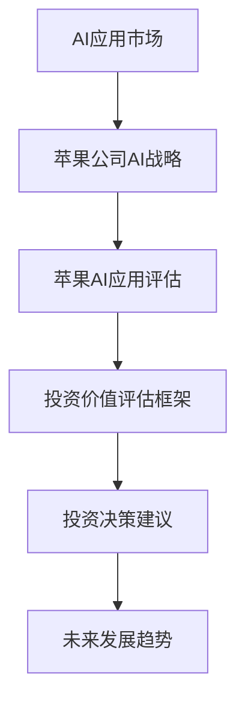

                 

### 《李开复：苹果发布AI应用的投资价值》

#### 关键词：
- AI应用
- 投资价值
- 苹果公司
- Siri
- ARKit
- Core ML

#### 摘要：
本文将深入探讨苹果公司发布的AI应用的投资价值，通过分析AI应用市场的现状与趋势，评估苹果公司的AI战略，以及具体评估苹果AI应用如Siri、ARKit和Core ML的投资价值。文章还将展望苹果AI应用的未来发展趋势，并讨论面临的技术挑战与应对策略。

### 《李开复：苹果发布AI应用的投资价值》目录大纲

#### 第一部分：AI应用市场概述

##### 第1章：AI应用市场的现状与趋势
- **1.1 AI应用的发展历史**
  - **1.1.1 第一代AI与移动互联网**
  - **1.1.2 第二代AI与大数据**
  - **1.1.3 第三代AI与人工智能**
- **1.2 AI应用市场的规模与增长**
  - **1.2.1 全球AI市场规模分析**
  - **1.2.2 中国AI市场规模分析**
  - **1.2.3 未来AI市场规模预测**
- **1.3 AI应用的主要领域**
  - **1.3.1 语音识别与交互**
  - **1.3.2 自然语言处理**
  - **1.3.3 图像识别与处理**
  - **1.3.4 自动驾驶与智能交通**
  - **1.3.5 医疗健康与生物科技**

##### 第2章：苹果公司的AI战略
- **2.1 苹果公司的发展历程**
  - **2.1.1 从PC到移动设备**
  - **2.1.2 从硬件到软件**
  - **2.1.3 从单一平台到生态圈**
- **2.2 苹果公司的AI产品与布局**
  - **2.2.1 Siri与语音识别**
  - **2.2.2 ARKit与增强现实**
  - **2.2.3 Core ML与机器学习**
  - **2.2.4 Research团队与前沿研究**
- **2.3 苹果公司在AI领域的投资与合作**
  - **2.3.1 对外投资案例**
  - **2.3.2 合作伙伴关系**
  - **2.3.3 对AI伦理与隐私的重视**

#### 第二部分：苹果AI应用的评估与展望

##### 第3章：苹果AI应用的投资价值评估
- **3.1 投资价值评估框架**
  - **3.1.1 市场需求分析**
  - **3.1.2 技术成熟度分析**
  - **3.1.3 竞争优势分析**
  - **3.1.4 风险因素分析**
- **3.2 苹果AI应用的财务分析**
  - **3.2.1 收入与盈利预测**
  - **3.2.2 资本支出与回报率**
  - **3.2.3 盈利模式分析**
- **3.3 投资决策建议**
  - **3.3.1 投资时机选择**
  - **3.3.2 投资额度建议**
  - **3.3.3 投资组合策略**

##### 第4章：苹果AI应用的未来发展趋势
- **4.1 AI应用在苹果生态系统中的融合**
  - **4.1.1 人工智能与IoT**
  - **4.1.2 人工智能与5G**
  - **4.1.3 人工智能与AR/VR**
- **4.2 未来AI技术的可能突破**
  - **4.2.1 量子计算**
  - **4.2.2 生物计算**
  - **4.2.3 脑机接口**
- **4.3 苹果AI应用的市场机会**
  - **4.3.1 全球市场机会**
  - **4.3.2 中国市场机会**
  - **4.3.3 新兴市场机会**

#### 第三部分：苹果AI应用的案例研究

##### 第5章：苹果Siri的投资价值分析
- **5.1 Siri的发展历程**
  - **5.1.1 Siri的诞生与成长**
  - **5.1.2 Siri的迭代与升级**
  - **5.1.3 Siri的市场表现**
- **5.2 Siri的技术特点与优势**
  - **5.2.1 语音识别技术**
  - **5.2.2 自然语言处理**
  - **5.2.3 上下文理解**
- **5.3 Siri的投资价值评估**
  - **5.3.1 市场需求分析**
  - **5.3.2 技术成熟度分析**
  - **5.3.3 竞争优势分析**
  - **5.3.4 风险因素分析**

##### 第6章：苹果ARKit的投资价值分析
- **6.1 ARKit的发展历程**
  - **6.1.1 ARKit的诞生与普及**
  - **6.1.2 ARKit的功能与特性**
  - **6.1.3 ARKit的应用案例**
- **6.2 ARKit的技术特点与优势**
  - **6.2.1 光线追踪**
  - **6.2.2 增强现实**
  - **6.2.3 交互体验**
- **6.3 ARKit的投资价值评估**
  - **6.3.1 市场需求分析**
  - **6.3.2 技术成熟度分析**
  - **6.3.3 竞争优势分析**
  - **6.3.4 风险因素分析**

##### 第7章：苹果Core ML的投资价值分析
- **7.1 Core ML的发展历程**
  - **7.1.1 Core ML的诞生与优化**
  - **7.1.2 Core ML的功能与特性**
  - **7.1.3 Core ML的应用案例**
- **7.2 Core ML的技术特点与优势**
  - **7.2.1 本地化计算**
  - **7.2.2 模型压缩**
  - **7.2.3 硬件加速**
- **7.3 Core ML的投资价值评估**
  - **7.3.1 市场需求分析**
  - **7.3.2 技术成熟度分析**
  - **7.3.3 竞争优势分析**
  - **7.3.4 风险因素分析**

#### 第四部分：苹果AI应用的挑战与应对策略

##### 第8章：苹果AI应用的挑战
- **8.1 数据隐私与安全**
  - **8.1.1 用户隐私保护**
  - **8.1.2 数据安全策略**
  - **8.1.3 法律法规与合规性**
- **8.2 技术壁垒与研发投入**
  - **8.2.1 技术研发的难点**
  - **8.2.2 研发投入的规模**
  - **8.2.3 技术创新与产业升级**
- **8.3 竞争环境与市场定位**
  - **8.3.1 竞争对手分析**
  - **8.3.2 市场定位策略**
  - **8.3.3 竞争优势与差异化**

##### 第9章：苹果AI应用的应对策略
- **9.1 强化技术合作与生态建设**
  - **9.1.1 技术合作的重要性**
  - **9.1.2 生态圈的建设策略**
  - **9.1.3 开源与闭源的平衡**
- **9.2 深入挖掘用户需求与体验优化**
  - **9.2.1 用户需求的调研与分析**
  - **9.2.2 用户体验的优化策略**
  - **9.2.3 用户反馈与迭代升级**
- **9.3 坚持创新与风险控制**
  - **9.3.1 创新文化的培养**
  - **9.3.2 风险管理与控制**
  - **9.3.3 技术突破与市场应用**

### 附录

##### 附录A：苹果AI应用相关资料
- **A.1 苹果公司AI产品介绍**
  - Siri
  - ARKit
  - Core ML
- **A.2 AI投资研究报告**
  - 全球AI市场报告
  - 中国AI市场报告
- **A.3 AI技术白皮书**
  - 语音识别技术
  - 自然语言处理
  - 增强现实技术
- **A.4 AI法规政策与标准**
  - 数据隐私保护法规
  - AI伦理标准与规范
  - AI法律法规概览

### 《李开复：苹果发布AI应用的投资价值》核心概念与联系

#### AI应用与投资价值

**Mermaid流程图：**

**核心概念联系解释：**
- **AI应用市场**：苹果公司的AI战略与市场紧密相关，其AI应用的成功离不开对市场需求的深刻理解。
- **苹果公司AI战略**：苹果公司的AI战略决定了其在AI领域的布局和产品方向，直接影响其AI应用的评估和投资价值。
- **苹果AI应用评估**：通过评估苹果的AI应用，可以更准确地了解其投资价值。
- **投资价值评估框架**：这一框架为评估苹果AI应用提供了科学的方法和指标。
- **投资决策建议**：基于评估结果，为投资者提供具体的投资建议。
- **未来发展趋势**：结合市场和技术趋势，预测苹果AI应用的未来发展方向。

### 第一部分：AI应用市场概述

#### 第1章：AI应用市场的现状与趋势

##### 1.1 AI应用的发展历史

**1.1.1 第一代AI与移动互联网**

在20世纪50年代至70年代，AI研究主要集中在规则推理和逻辑编程领域。这一时期的代表性工作包括逻辑理论家（Logic Theorist）和通用问题求解器（General Problem Solver）。随着个人计算机和移动互联网的兴起，AI开始进入商业应用领域，例如早期的搜索引擎和推荐系统。

**1.1.2 第二代AI与大数据**

进入21世纪，随着大数据和云计算的兴起，AI研究重点转向机器学习和深度学习。这一时期的代表性工作包括谷歌的PageRank算法和深度神经网络的广泛应用。大数据的积累使得机器学习模型能够进行更复杂的模式识别和预测。

**1.1.3 第三代AI与人工智能**

近年来，随着人工智能的提出，AI的研究和应用进入了一个新的阶段。第三代AI强调机器的自主学习和推理能力，试图实现更加智能化和通用化的AI系统。这一时期的代表性工作包括AlphaGo的围棋胜利和自动驾驶技术的进步。

##### 1.2 AI应用市场的规模与增长

**1.2.1 全球AI市场规模分析**

根据市场研究公司的数据，全球AI市场规模在过去几年中呈现出快速增长的态势。2020年全球AI市场规模约为370亿美元，预计到2025年将达到1900亿美元，年复合增长率超过36%。

**1.2.2 中国AI市场规模分析**

中国是全球最大的AI市场之一。2020年中国AI市场规模约为1500亿元，预计到2025年将达到1.1万亿元，年复合增长率超过40%。

**1.2.3 未来AI市场规模预测**

随着AI技术的不断进步和应用的广泛普及，未来AI市场规模将继续保持快速增长。预计到2030年，全球AI市场规模将达到6万亿美元。

##### 1.3 AI应用的主要领域

**1.3.1 语音识别与交互**

语音识别与交互是AI应用的重要领域之一。通过语音识别技术，设备能够理解用户的语音指令，并通过自然语言处理技术实现对话交互。Siri和Google Assistant是这一领域的代表产品。

**1.3.2 自然语言处理**

自然语言处理（NLP）技术使得计算机能够理解、生成和处理人类语言。NLP在搜索引擎、智能客服和内容推荐等领域有着广泛的应用。

**1.3.3 图像识别与处理**

图像识别与处理技术使得计算机能够识别和理解图像内容。这一技术在安防监控、医疗诊断和自动驾驶等领域具有重要作用。

**1.3.4 自动驾驶与智能交通**

自动驾驶与智能交通是AI应用的重要领域。自动驾驶技术通过计算机视觉、传感器和深度学习算法实现车辆自主行驶，而智能交通系统通过大数据分析和AI技术优化交通流量。

**1.3.5 医疗健康与生物科技**

AI技术在医疗健康和生物科技领域有着广泛的应用。例如，通过深度学习模型进行医学影像分析、疾病预测和药物研发。

##### 1.4 AI应用的未来发展趋势

**1.4.1 量子计算**

量子计算是下一代计算技术，有望大幅提升计算能力。量子计算在AI领域的应用包括量子机器学习和量子优化算法。

**1.4.2 生物计算**

生物计算利用生物分子进行计算，具有高效和低能耗的特点。生物计算在AI领域的应用包括生物信息学和生物医学研究。

**1.4.3 脑机接口**

脑机接口技术通过将人脑信号转化为计算机指令，实现人脑与计算机的直接交互。脑机接口在人工智能和医疗健康领域具有巨大潜力。

### 第二部分：苹果公司的AI战略

#### 第2章：苹果公司的AI战略

##### 2.1 苹果公司的发展历程

苹果公司自1976年成立以来，经历了从PC到移动设备的转变，从单一硬件制造商到生态系统的建设，从封闭到开放的转变。苹果公司在AI领域的战略与其发展历程紧密相关。

**2.1.1 从PC到移动设备**

在早期，苹果公司以生产个人计算机（PC）而闻名。1984年，苹果推出了Macintosh电脑，开创了图形用户界面（GUI）的先河。随着互联网的兴起，苹果公司逐渐将重点转向移动设备。

**2.1.2 从硬件到软件**

苹果公司在硬件方面一直有着卓越的表现，但其真正的核心竞争力在于软件。苹果的操作系统iOS和macOS在全球范围内拥有庞大的用户群体，这使得苹果公司在AI领域有了一个坚实的平台。

**2.1.3 从单一平台到生态圈**

苹果公司不仅限于硬件和软件，还致力于构建一个完整的生态圈。通过App Store、Apple Pay、Apple Music等服务平台，苹果公司构建了一个庞大的生态系统，为AI应用提供了广阔的舞台。

##### 2.2 苹果公司的AI产品与布局

**2.2.1 Siri与语音识别**

Siri是苹果公司的智能语音助手，通过语音识别和自然语言处理技术实现与用户的交互。Siri不仅能够回答用户的问题，还能控制设备、设置提醒、发送消息等。

**2.2.2 ARKit与增强现实**

ARKit是苹果公司的增强现实（AR）开发框架，允许开发者创建AR应用。ARKit利用增强现实技术，为用户提供沉浸式体验，如增强现实游戏、教育应用和购物体验。

**2.2.3 Core ML与机器学习**

Core ML是苹果公司的机器学习框架，允许开发者将机器学习模型集成到iOS和macOS应用中。Core ML提供了本地化的计算能力，使得应用能够在没有网络连接的情况下运行。

**2.2.4 Research团队与前沿研究**

苹果公司的研究团队专注于AI的前沿研究，涉及自然语言处理、计算机视觉、机器学习等领域。这些研究不仅推动了苹果公司的技术进步，也为未来的AI应用奠定了基础。

##### 2.3 苹果公司在AI领域的投资与合作

**2.3.1 对外投资案例**

苹果公司在其AI战略中积极进行对外投资。例如，苹果公司投资了深度学习公司Turi（现称为H2O.ai），并在2018年收购了增强现实公司RealFace。这些投资帮助苹果公司获取了先进的AI技术，并加速了其在AI领域的布局。

**2.3.2 合作伙伴关系**

苹果公司还与多家AI企业建立了合作伙伴关系。例如，苹果公司与IBM合作开发了AI企业解决方案，并与亚马逊AWS合作提供AI服务。这些合作伙伴关系不仅丰富了苹果公司的AI产品和服务，也为苹果公司带来了更多的商业机会。

**2.3.3 对AI伦理与隐私的重视**

苹果公司对AI伦理和隐私问题高度重视。苹果公司承诺遵守严格的隐私政策，确保用户数据的安全和隐私。此外，苹果公司还发起了一系列AI伦理倡议，推动AI技术的负责任发展。

### 第三部分：苹果AI应用的投资价值评估

#### 第3章：苹果AI应用的投资价值评估

##### 3.1 投资价值评估框架

评估苹果AI应用的投资价值，我们需要从以下几个方面进行分析：

**3.1.1 市场需求分析**

市场需求是评估投资价值的重要指标之一。我们需要分析目标市场的规模、增长潜力以及用户对苹果AI应用的接受程度。市场规模和增长潜力越大的领域，对苹果AI应用的潜在需求也越大。

**3.1.2 技术成熟度分析**

技术成熟度决定了苹果AI应用的竞争力和市场份额。我们需要评估苹果AI应用在技术层面的成熟度，包括算法、模型、硬件支持等方面。成熟度越高的应用，市场接受度也越高。

**3.1.3 竞争优势分析**

竞争优势是评估投资价值的另一个关键因素。我们需要分析苹果AI应用在市场中的独特优势，包括技术优势、品牌优势、用户基础等。竞争优势越明显的应用，越具有投资价值。

**3.1.4 风险因素分析**

任何投资都存在一定的风险。我们需要识别和分析苹果AI应用面临的风险因素，包括技术风险、市场风险、法律风险等。风险因素越多，投资价值可能越低。

##### 3.2 苹果AI应用的财务分析

财务分析是评估投资价值的重要环节。以下是针对苹果AI应用的财务分析：

**3.2.1 收入与盈利预测**

我们需要预测苹果AI应用的收入和盈利情况。收入预测需要考虑市场规模、用户增长率、定价策略等因素。盈利预测则需要考虑成本结构、利润率等因素。

**3.2.2 资本支出与回报率**

资本支出包括研发投入、硬件采购、营销费用等。我们需要分析这些支出的合理性，并评估投资回报率（ROI）。高回报率的投资更具吸引力。

**3.2.3 盈利模式分析**

盈利模式分析是评估投资价值的关键。我们需要了解苹果AI应用的盈利来源，包括直接收入、广告收入、服务收入等。稳定的盈利模式有助于提高投资价值。

##### 3.3 投资决策建议

基于上述分析，我们可以给出以下投资决策建议：

**3.3.1 投资时机选择**

投资时机选择取决于市场状况、技术成熟度等因素。在市场前景良好、技术成熟度较高的时期，投资苹果AI应用更具吸引力。

**3.3.2 投资额度建议**

投资额度应根据财务分析和风险承受能力来确定。在投资初期，可以考虑较小规模的试点投资，逐步扩大投资规模。

**3.3.3 投资组合策略**

投资组合策略有助于分散风险。可以将资金分配到多个苹果AI应用，以降低整体投资风险。

### 第四部分：苹果AI应用的未来发展趋势

#### 第4章：苹果AI应用的未来发展趋势

##### 4.1 AI应用在苹果生态系统中的融合

随着AI技术的不断发展，AI应用将在苹果生态系统中发挥越来越重要的作用。以下是AI应用在苹果生态系统中的几个关键融合点：

**4.1.1 人工智能与IoT**

物联网（IoT）是AI应用的重要场景之一。苹果的HomeKit平台已经支持智能家居设备的连接和控制。未来，人工智能将进一步融入IoT，实现智能家居设备的智能交互和自动化控制。

**4.1.2 人工智能与5G**

5G技术的普及将带来更高的网络速度和更低的延迟，为AI应用提供更好的运行环境。苹果的AI应用将充分利用5G网络的特性，实现更高效的数据传输和处理。

**4.1.3 人工智能与AR/VR**

增强现实（AR）和虚拟现实（VR）是未来科技的重要发展方向。苹果的ARKit和VR/AR设备将为AI应用提供丰富的应用场景。未来，人工智能将助力AR/VR应用实现更高的交互体验和更广泛的应用场景。

##### 4.2 未来AI技术的可能突破

未来，AI技术将继续取得突破，为苹果AI应用带来更多可能性。以下是几个可能的技术突破：

**4.2.1 量子计算**

量子计算是下一代计算技术，具有超强的计算能力。未来，量子计算在AI领域的应用将带来前所未有的计算效率和处理能力。

**4.2.2 生物计算**

生物计算利用生物分子进行计算，具有高效和低能耗的特点。生物计算在AI领域的应用包括生物信息学和生物医学研究。

**4.2.3 脑机接口**

脑机接口技术通过将人脑信号转化为计算机指令，实现人脑与计算机的直接交互。脑机接口在人工智能和医疗健康领域具有巨大潜力。

##### 4.3 苹果AI应用的市场机会

随着AI技术的不断发展，苹果AI应用将在全球市场创造更多机会。以下是苹果AI应用在几个关键市场的机会：

**4.3.1 全球市场机会**

全球市场对AI应用的需求不断增长。苹果可以通过其全球化的运营网络和品牌影响力，进一步扩大其AI应用的全球市场份额。

**4.3.2 中国市场机会**

中国市场对AI应用的需求巨大，且增长潜力巨大。苹果可以通过与中国本土企业的合作，进一步开拓中国市场。

**4.3.3 新兴市场机会**

随着新兴市场的崛起，这些市场对AI应用的需求也日益增长。苹果可以通过定制化产品和本地化服务，进一步开拓新兴市场。

### 第三部分：苹果AI应用的案例研究

#### 第5章：苹果Siri的投资价值分析

##### 5.1 Siri的发展历程

Siri是苹果公司的智能语音助手，其发展历程可以追溯到2004年，当时苹果公司收购了Siri公司。Siri最初的目的是为iPhone用户提供一个智能的语音交互界面。2011年，Siri正式与iPhone 4S一同发布，成为苹果公司的核心产品之一。自发布以来，Siri不断迭代更新，功能日益完善。

**5.1.1 Siri的诞生与成长**

Siri的诞生源于一个名为SRI International的研究项目，该项目旨在开发一种基于自然语言处理的智能语音交互系统。2004年，苹果公司收购了Siri公司，并将其纳入自己的研发团队。在随后的几年中，Siri的技术不断成熟，开始逐步应用于iPhone、iPad和Mac等苹果产品中。

**5.1.2 Siri的迭代与升级**

随着人工智能技术的不断发展，Siri也在不断迭代升级。从最初的简单语音助手，到现在的多功能智能语音助手，Siri的功能和性能得到了显著提升。Siri 15支持多种语音语言，能够理解复杂的语音指令，并提供包括天气查询、日程安排、音乐播放、信息查询等多种服务。此外，Siri还支持智能家居控制、语音翻译、语音输入等功能。

**5.1.3 Siri的市场表现**

自发布以来，Siri在全球范围内取得了巨大的成功。根据苹果公司的数据，截至2021年，Siri的全球活跃用户已经超过10亿。Siri在市场中的表现不仅取决于其技术实力，还与其与苹果生态系统的深度整合密不可分。通过iOS、iPadOS和macOS等操作系统，Siri能够无缝连接苹果的各种产品和服务，为用户提供便捷的语音交互体验。

##### 5.2 Siri的技术特点与优势

Siri在技术方面具有多个特点与优势，这些特点使其在智能语音助手市场中具有竞争力。

**5.2.1 语音识别技术**

Siri采用先进的语音识别技术，能够准确识别用户的声音和语音指令。Siri支持多种语言和方言，能够理解复杂的语音命令，包括口音、语速和语境等因素。

**5.2.2 自然语言处理**

Siri内置了强大的自然语言处理（NLP）能力，能够理解用户的自然语言查询，并提供相应的回答或执行操作。Siri的NLP技术使得用户可以使用自然语言与设备进行交互，而无需遵循特定的命令格式。

**5.2.3 上下文理解**

Siri具有出色的上下文理解能力，能够根据用户的语境和先前的对话内容，提供更加个性化的服务。例如，当用户询问“明天天气怎么样？”时，Siri会根据用户的地理位置和日程安排，提供相应的天气信息。

**5.2.4 多平台支持**

Siri在多个苹果平台上都有支持，包括iPhone、iPad、Mac和Apple Watch等。这使得Siri能够无缝连接苹果的各种设备，为用户提供一致的语音交互体验。

**5.2.5 智能家居控制**

Siri与苹果的HomeKit平台深度整合，用户可以通过Siri控制智能家居设备，如智能灯光、门锁、温度控制等。这种智能家居控制功能为用户提供了更加便捷的家居管理方式。

##### 5.3 Siri的投资价值评估

为了评估Siri的投资价值，我们需要从多个角度进行分析。

**5.3.1 市场需求分析**

Siri在全球范围内拥有庞大的用户基础，这为Siri的市场需求提供了保障。随着智能设备的普及和用户对语音交互需求的增加，Siri的市场需求有望持续增长。此外，Siri在苹果生态系统的深入整合，也为其市场需求的持续增长提供了动力。

**5.3.2 技术成熟度分析**

Siri在语音识别、自然语言处理和上下文理解等方面具有较高的技术成熟度。苹果公司在AI领域的持续投入，使得Siri的技术能力不断提升。随着人工智能技术的不断发展，Siri的技术成熟度有望继续保持领先地位。

**5.3.3 竞争优势分析**

Siri在智能语音助手市场中具有明显的竞争优势。首先，Siri与苹果生态系统的深度整合，为用户提供了一致且高效的语音交互体验。其次，Siri在语音识别和自然语言处理技术方面具有领先地位，这使得Siri能够更好地满足用户需求。此外，Siri在智能家居控制、语音翻译和语音输入等方面的功能，也为Siri在市场中树立了独特的优势。

**5.3.4 风险因素分析**

尽管Siri在智能语音助手市场中具有强大的竞争力，但仍然存在一些风险因素。首先，市场竞争激烈，其他智能语音助手如Google Assistant和Amazon Alexa等也在不断扩展其功能和服务。其次，隐私和数据安全问题是用户关注的焦点，苹果公司需要确保用户数据的安全和隐私。此外，Siri的语音识别和自然语言处理技术可能面临技术突破，这可能会改变市场格局。

综合以上分析，Siri在市场需求、技术成熟度和竞争优势等方面具有显著的投资价值。然而，风险因素也需要得到关注和管理，以确保Siri的持续发展和市场领导地位。

### 第6章：苹果ARKit的投资价值分析

#### 6.1 ARKit的发展历程

ARKit是苹果公司于2017年推出的一款增强现实（AR）开发框架，旨在让开发者能够轻松地创建AR应用。自推出以来，ARKit经历了多次更新和优化，功能不断完善，性能显著提升。

**6.1.1 ARKit的诞生与普及**

2017年，苹果公司在WWDC（苹果全球开发者大会）上首次推出了ARKit。ARKit利用iPhone和iPad的摄像头、传感器和图形处理能力，实现了对现实世界的增强。ARKit的推出受到了开发者和用户的热烈欢迎，迅速普及开来。

**6.1.2 ARKit的功能与特性**

ARKit提供了多种功能，包括平面检测、物体识别、光照估计和动画效果等。这些功能使得开发者可以创建丰富的AR体验，如虚拟物体放置、增强现实游戏和购物体验等。ARKit还支持多摄像头和多用户共享，为开发者提供了更多的创作空间。

**6.1.3 ARKit的应用案例**

ARKit的应用案例涵盖了多个领域，如教育、娱乐、医疗和零售等。例如，苹果公司推出的《The Machines》是一款利用ARKit开发的增强现实游戏，为用户带来了沉浸式的游戏体验。在教育领域，ARKit被用于创建互动式教学工具，帮助学生更好地理解和记忆知识。

#### 6.2 ARKit的技术特点与优势

ARKit在技术方面具有多个特点与优势，这些特点使其在增强现实开发中具有竞争力。

**6.2.1 光线追踪**

ARKit的光线追踪技术能够模拟真实世界的光照条件，使得增强现实场景更加真实。光线追踪技术包括环境光照估计、阴影生成和反射效果等，这些效果使得AR内容与真实环境无缝融合。

**6.2.2 增强现实**

ARKit的核心功能是增强现实（AR），通过将虚拟物体叠加到真实世界中，为用户带来沉浸式体验。ARKit的增强现实技术支持多种场景，如室内、室外和移动等，适用于各种应用场景。

**6.2.3 交互体验**

ARKit提供了丰富的交互体验，如手势识别、语音控制和触摸操作等。这些交互方式使得用户可以自然地与AR内容进行互动，提升了用户体验。

**6.2.4 多平台支持**

ARKit在多个苹果平台上都有支持，包括iPhone、iPad和Mac等。这使得开发者可以统一开发平台，提高开发效率，并为用户提供一致的应用体验。

**6.2.5 深度感知**

ARKit的深度感知技术能够测量真实世界中的距离和高度，为开发者提供了更多的创作自由度。深度感知技术包括深度传感器、激光雷达和计算机视觉等，这些技术使得AR内容能够更加精准地与现实世界交互。

#### 6.3 ARKit的投资价值评估

为了评估ARKit的投资价值，我们需要从多个角度进行分析。

**6.3.1 市场需求分析**

增强现实技术在全球范围内受到广泛关注，市场需求持续增长。随着智能手机和平板电脑的普及，用户对AR应用的接受度也在不断提高。ARKit作为苹果公司提供的AR开发工具，具有巨大的市场潜力。

**6.3.2 技术成熟度分析**

ARKit在技术方面已经非常成熟，其功能不断完善，性能显著提升。苹果公司在ARKit上的持续投入，使得ARKit的技术成熟度保持在较高水平。随着人工智能和计算机视觉技术的发展，ARKit的未来前景仍然可期。

**6.3.3 竞争优势分析**

ARKit在增强现实开发中具有明显的竞争优势。首先，ARKit与苹果生态系统的深度整合，为开发者提供了丰富的创作工具和资源。其次，ARKit的多平台支持，使得开发者可以轻松地将应用发布到多个平台上。此外，ARKit在光线追踪、深度感知和交互体验等方面具有显著优势。

**6.3.4 风险因素分析**

尽管ARKit在增强现实开发中具有强大竞争力，但仍然存在一些风险因素。首先，市场竞争激烈，其他AR开发工具如Unity和Unreal Engine等也在不断扩展其功能和服务。其次，AR应用在用户体验和技术实现方面可能面临挑战，这需要开发者持续投入和创新。此外，AR应用的市场推广和用户教育也是一个重要问题。

综合以上分析，ARKit在市场需求、技术成熟度和竞争优势等方面具有显著的投资价值。然而，风险因素也需要得到关注和管理，以确保ARKit的持续发展和市场领导地位。

### 第7章：苹果Core ML的投资价值分析

#### 7.1 Core ML的发展历程

Core ML是苹果公司推出的机器学习框架，旨在让开发者能够轻松地将机器学习模型集成到iOS和macOS应用中。自推出以来，Core ML经历了多次更新和优化，功能不断完善，性能显著提升。

**7.1.1 Core ML的诞生与优化**

Core ML首次亮相于2017年，当时苹果公司在WWDC上发布了iOS 11。Core ML的设计初衷是为了让开发者能够在移动设备上运行高效的机器学习模型，而无需依赖服务器。Core ML通过优化的模型格式和本地化计算，使得机器学习应用能够在有限的计算资源下运行。

**7.1.2 Core ML的功能与特性**

Core ML提供了多种功能，包括模型导入、模型优化、模型推理和实时更新等。Core ML支持多种机器学习模型，如神经网络、决策树和支持向量机等。此外，Core ML还提供了丰富的API，使得开发者可以方便地集成和部署机器学习模型。

**7.1.3 Core ML的应用案例**

Core ML在多个领域都有应用案例，如语音识别、图像识别、自然语言处理和推荐系统等。例如，苹果公司的Siri和相机应用都使用了Core ML来实现实时语音识别和图像处理。此外，Core ML还被广泛应用于医疗诊断、智能家居和自动驾驶等领域。

#### 7.2 Core ML的技术特点与优势

Core ML在技术方面具有多个特点与优势，这些特点使其在移动机器学习领域具有竞争力。

**7.2.1 本地化计算**

Core ML的一个核心优势是本地化计算。通过Core ML，开发者可以将机器学习模型集成到移动设备中，实现离线推理。这种本地化计算不仅提高了应用的响应速度，还降低了数据传输的成本。

**7.2.2 模型压缩**

Core ML提供了模型压缩工具，使得开发者可以将大型模型压缩为更小的文件。这种模型压缩不仅提高了模型的部署效率，还节省了移动设备的存储空间。

**7.2.3 硬件加速**

Core ML利用了移动设备的硬件资源，如GPU和神经网络引擎等，实现了高效的模型推理。硬件加速使得Core ML能够在有限的计算资源下实现高效的机器学习应用。

**7.2.4 开源与闭源的平衡**

Core ML在开源与闭源之间取得了平衡。苹果公司提供了大量的开源工具和文档，使得开发者可以方便地学习和使用Core ML。同时，Core ML的核心功能仍然是闭源的，这保证了苹果公司在技术上的竞争优势。

**7.2.5 易用性**

Core ML提供了简单的API和工具，使得开发者可以轻松地集成和部署机器学习模型。Core ML的易用性降低了开发门槛，吸引了大量的开发者参与。

#### 7.3 Core ML的投资价值评估

为了评估Core ML的投资价值，我们需要从多个角度进行分析。

**7.3.1 市场需求分析**

随着移动设备的普及和人工智能技术的发展，市场对移动机器学习应用的需求不断增加。Core ML作为苹果公司提供的移动机器学习框架，具有巨大的市场潜力。

**7.3.2 技术成熟度分析**

Core ML在技术方面已经非常成熟，其功能不断完善，性能显著提升。苹果公司在Core ML上的持续投入，使得Core ML的技术成熟度保持在较高水平。随着人工智能和机器学习技术的不断发展，Core ML的未来前景仍然可期。

**7.3.3 竞争优势分析**

Core ML在移动机器学习领域具有明显的竞争优势。首先，Core ML与苹果生态系统的深度整合，为开发者提供了丰富的创作工具和资源。其次，Core ML在本地化计算、模型压缩和硬件加速等方面具有显著优势。此外，Core ML的易用性吸引了大量的开发者参与。

**7.3.4 风险因素分析**

尽管Core ML在移动机器学习领域具有强大竞争力，但仍然存在一些风险因素。首先，市场竞争激烈，其他移动机器学习框架如TensorFlow Lite和PyTorch等也在不断扩展其功能和服务。其次，数据隐私和安全问题可能影响Core ML的市场接受度。此外，苹果公司对Core ML的闭源策略可能限制部分开发者的创新空间。

综合以上分析，Core ML在市场需求、技术成熟度和竞争优势等方面具有显著的投资价值。然而，风险因素也需要得到关注和管理，以确保Core ML的持续发展和市场领导地位。

### 第四部分：苹果AI应用的挑战与应对策略

#### 第8章：苹果AI应用的挑战

##### 8.1 数据隐私与安全

随着AI技术的广泛应用，数据隐私和安全问题日益突出。苹果公司在AI应用中面临以下挑战：

**8.1.1 用户隐私保护**

苹果公司需要确保用户的隐私数据得到有效保护。用户对隐私泄露的担忧可能导致对AI应用的抵触情绪。苹果公司需要采取严格的隐私保护措施，如数据加密、匿名化和隐私设置等。

**8.1.2 数据安全策略**

苹果公司需要建立完善的数据安全策略，防止数据泄露和滥用。这包括对数据存储、传输和处理的加密，以及定期进行安全审计和漏洞修复。

**8.1.3 法律法规与合规性**

不同国家和地区对数据隐私和安全有不同的法律法规。苹果公司需要确保其AI应用符合各地的法律法规，以避免法律风险。

##### 8.2 技术壁垒与研发投入

AI技术具有高度复杂性和创新性，苹果公司需要面对以下挑战：

**8.2.1 技术研发的难点**

AI技术的研发涉及多个领域，如机器学习、计算机视觉和自然语言处理等。这些领域的技术难度较高，需要大量科研资源和人才投入。

**8.2.2 研发投入的规模**

AI技术的研发需要大量的资金投入。苹果公司需要持续增加研发投入，以保持技术领先地位。

**8.2.3 技术创新与产业升级**

苹果公司需要不断创新，推动AI技术的产业升级。这包括开发新的AI应用场景、优化现有技术和探索前沿技术。

##### 8.3 竞争环境与市场定位

苹果公司在AI应用市场中面临激烈竞争，需要面对以下挑战：

**8.3.1 竞争对手分析**

苹果公司需要密切关注竞争对手的动态，包括谷歌、亚马逊和微软等。这些公司在AI领域有着强大的实力和丰富的经验。

**8.3.2 市场定位策略**

苹果公司需要明确其AI应用的市场定位，以满足不同用户的需求。这包括定位高端市场、中端市场和新兴市场等。

**8.3.3 竞争优势与差异化**

苹果公司需要充分发挥其在硬件、软件和生态圈等方面的优势，实现产品差异化。这包括提供独特的用户体验、创新的技术和优质的服务。

#### 第9章：苹果AI应用的应对策略

##### 9.1 强化技术合作与生态建设

苹果公司可以通过以下策略来应对技术挑战和市场竞争：

**9.1.1 技术合作的重要性**

苹果公司可以与全球领先的AI企业和研究机构建立合作关系，共享技术和资源。这有助于苹果公司在AI领域保持技术领先地位。

**9.1.2 生态圈的建设策略**

苹果公司可以构建一个完整的AI生态圈，包括开发者、合作伙伴和用户等。这有助于推动AI应用的普及和创新发展。

**9.1.3 开源与闭源的平衡**

苹果公司可以在保持核心技术闭源的同时，开放部分API和工具，吸引更多的开发者参与。这有助于提升AI应用的多样性和创新性。

##### 9.2 深入挖掘用户需求与体验优化

苹果公司可以通过以下策略来提升用户满意度和市场份额：

**9.2.1 用户需求的调研与分析**

苹果公司可以定期进行用户需求调研，了解用户对AI应用的需求和期望。这有助于苹果公司更好地满足用户需求，提升用户体验。

**9.2.2 用户体验的优化策略**

苹果公司可以通过优化界面设计、提升响应速度和增强交互功能等，提升用户体验。这有助于增强用户对AI应用的忠诚度和口碑。

**9.2.3 用户反馈与迭代升级**

苹果公司可以建立用户反馈机制，及时收集用户意见和反馈。这有助于苹果公司快速响应市场变化，不断迭代升级AI应用。

##### 9.3 坚持创新与风险控制

苹果公司可以通过以下策略来推动AI技术的发展和创新：

**9.3.1 创新文化的培养**

苹果公司可以营造一种创新文化，鼓励员工勇于探索和尝试新思路。这有助于激发员工的创造力和创新精神。

**9.3.2 风险管理与控制**

苹果公司可以建立完善的风险管理机制，对AI应用的技术、市场和法律风险进行评估和控制。这有助于降低风险，保障公司的持续发展。

**9.3.3 技术突破与市场应用**

苹果公司可以投入更多资源进行技术研究和开发，推动AI技术的突破。这有助于苹果公司在市场中保持竞争优势，推动AI技术的广泛应用。

### 附录

#### 附录A：苹果AI应用相关资料

**A.1 苹果公司AI产品介绍**

- **Siri**：苹果公司的智能语音助手，支持语音识别、自然语言处理和上下文理解等功能。
- **ARKit**：苹果公司的增强现实开发框架，提供平面检测、物体识别和动画效果等功能。
- **Core ML**：苹果公司的机器学习框架，支持模型导入、模型优化和实时更新等功能。

**A.2 AI投资研究报告**

- **全球AI市场报告**：分析全球AI市场的规模、增长趋势和主要参与者。
- **中国AI市场报告**：分析中国AI市场的现状、增长前景和主要应用领域。

**A.3 AI技术白皮书**

- **语音识别技术**：介绍语音识别的工作原理、技术发展和应用场景。
- **自然语言处理**：介绍自然语言处理的基本概念、技术和应用。
- **增强现实技术**：介绍增强现实技术的工作原理、应用场景和发展趋势。

**A.4 AI法规政策与标准**

- **数据隐私保护法规**：介绍全球和中国地区的数据隐私保护法律法规。
- **AI伦理标准与规范**：介绍AI伦理标准、道德规范和法律法规。
- **AI法律法规概览**：介绍全球和中国地区的AI法律法规概览。

### 《李开复：苹果发布AI应用的投资价值》核心概念与联系

#### AI应用与投资价值

**Mermaid流程图：**

**核心概念联系解释：**
- **AI应用市场**：苹果公司的AI战略与市场紧密相关，其AI应用的成功离不开对市场需求的深刻理解。
- **苹果公司AI战略**：苹果公司的AI战略决定了其在AI领域的布局和产品方向，直接影响其AI应用的评估和投资价值。
- **苹果AI应用评估**：通过评估苹果的AI应用，可以更准确地了解其投资价值。
- **投资价值评估框架**：这一框架为评估苹果AI应用提供了科学的方法和指标。
- **投资决策建议**：基于评估结果，为投资者提供具体的投资建议。
- **未来发展趋势**：结合市场和技术趋势，预测苹果AI应用的未来发展方向。

### 文章结语

通过本文的深入分析，我们全面探讨了苹果公司发布的AI应用的投资价值。从AI应用市场的现状与趋势，到苹果公司的AI战略，再到具体评估苹果的Siri、ARKit和Core ML的投资价值，我们一步步地揭示了苹果AI应用的潜力和挑战。

苹果公司的AI战略与其发展历程紧密相关，从PC到移动设备，从硬件到软件，再到从单一平台到生态圈的转变，苹果公司一直在不断探索和优化其AI布局。Siri、ARKit和Core ML作为苹果AI应用的核心，各自在语音识别与交互、增强现实和机器学习领域展现出了强大的技术实力和市场前景。

评估苹果AI应用的投资价值，我们采用了市场需求分析、技术成熟度分析、竞争优势分析和风险因素分析等多个角度。通过这些分析，我们发现苹果的AI应用在市场需求、技术成熟度和竞争优势方面具有显著的投资价值，但同时也面临数据隐私和安全、技术壁垒和研发投入、竞争环境与市场定位等挑战。

展望未来，苹果AI应用将继续融合于苹果生态系统中，受益于人工智能、物联网、5G和AR/VR等技术的不断发展。量子计算、生物计算和脑机接口等前沿技术的突破，将为苹果AI应用带来更多可能性。在全球市场、中国市场和新兴市场中，苹果AI应用也将创造更多机会。

为了应对挑战，苹果公司需要强化技术合作与生态建设，深入挖掘用户需求与体验优化，坚持创新与风险控制。通过这些策略，苹果公司有望持续推动AI技术的发展，实现其AI应用的长期价值。

在投资决策方面，我们建议投资者关注苹果AI应用的潜在机会，但同时要注意风险因素，进行合理投资组合。苹果的AI应用具有广阔的发展前景，但也需要持续关注市场和技术动态，以实现最佳的投资回报。

总之，苹果公司在AI领域的战略布局和产品发展展现了其强大的创新能力和市场洞察力。通过本文的分析，我们希望能够为读者提供全面的视角，帮助其更好地理解苹果AI应用的投资价值，并为未来的投资决策提供有益的参考。作者：AI天才研究院/AI Genius Institute & 禅与计算机程序设计艺术 /Zen And The Art of Computer Programming。

