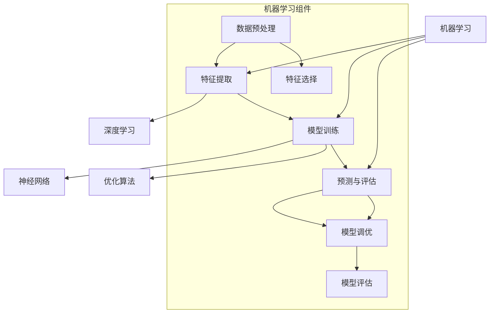
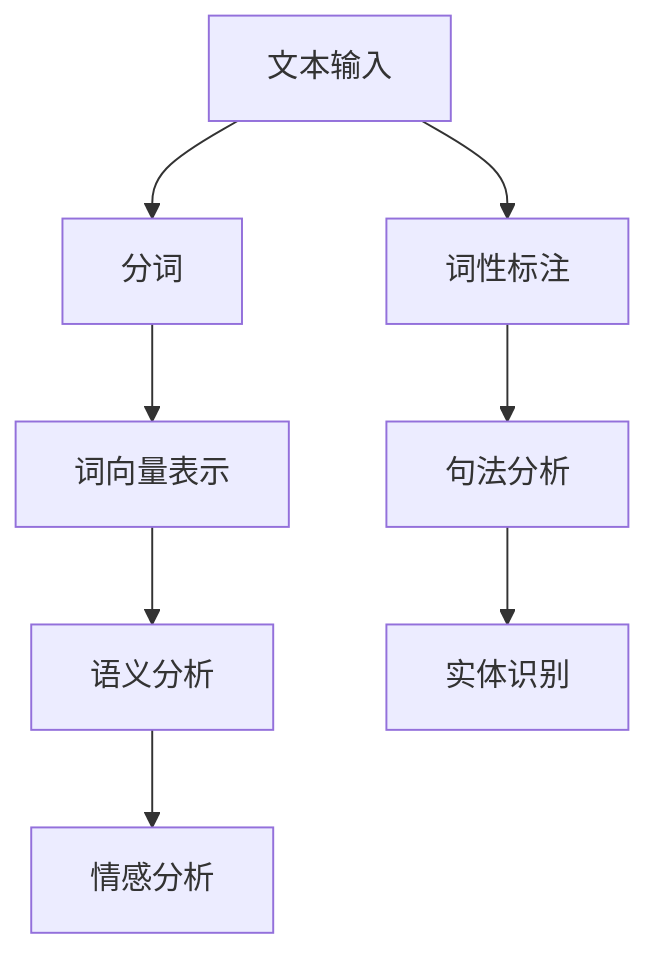
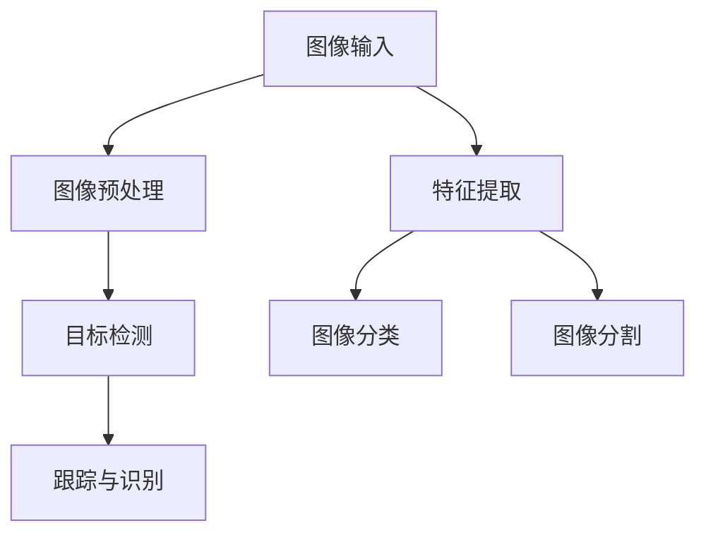
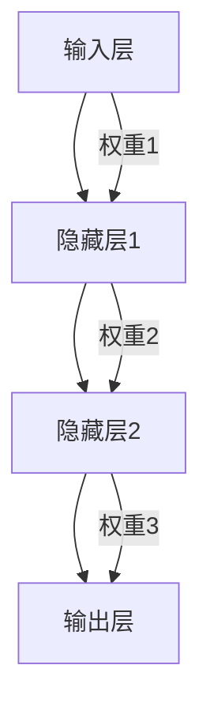
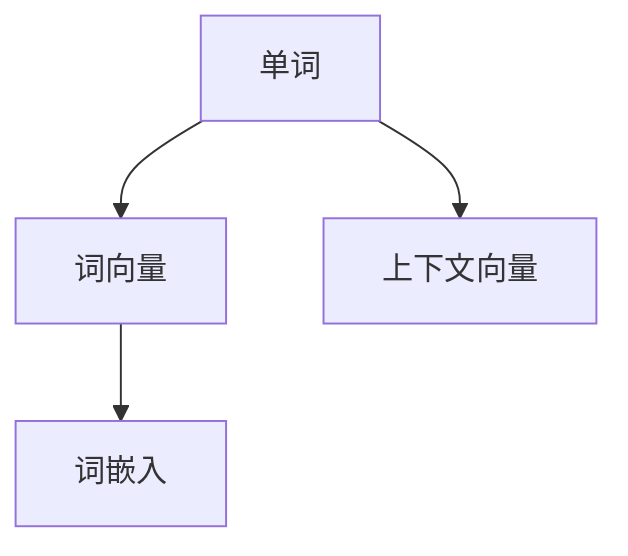

                 

### 《李开复：苹果发布AI应用的未来展望》

#### # 第一部分：引言

##### 第1章：了解李开复与苹果的AI应用

> **关键词**：李开复，苹果，AI应用，未来展望，技术趋势

> **摘要**：本文将探讨李开复对苹果公司AI应用的未来展望，分析其背后的技术原理和行业影响，以及潜在的挑战与机遇。

李开复博士，作为世界著名的人工智能专家、企业家和作家，多年来在AI领域的研究与推广上取得了显著的成就。他的工作不仅涵盖了深度学习、自然语言处理等核心技术，还涉及AI伦理、AI与人类社会的互动等多个维度。

与此同时，苹果公司，作为全球领先的科技巨头，近年来也在积极布局AI领域。其推出的多项AI应用，如Siri语音助手、Apple Music个性化推荐、ARKit增强现实技术等，已经成为市场上备受瞩目的焦点。

在本文中，我们将首先介绍李开复的背景和成就，以及苹果公司的AI战略。接着，我们会深入分析苹果发布的几款主要AI应用，探讨其技术原理和应用场景。最后，本文将结合李开复的观点，展望苹果AI技术的未来发展趋势，以及可能面临的挑战和机遇。

通过这样的分析，我们希望能够为读者提供一份全面而深入的洞察，帮助大家更好地理解苹果AI应用的现状与未来。

#### # 第二部分：苹果的AI技术应用

##### 第2章：苹果AI技术的核心组件

##### 2.1 机器学习与深度学习

> **核心概念与联系**：机器学习和深度学习是苹果AI技术的重要基石。为了更好地理解这些概念，我们可以使用Mermaid流程图来展示其原理和架构。



> **机器学习基础**：机器学习是一种让计算机通过数据和经验进行自我改进的技术。其核心包括数据预处理、特征提取、模型训练、预测与评估等步骤。通过不断调整模型参数，机器学习算法能够在大量数据中学习出规律，从而进行预测和决策。

> **深度学习原理**：深度学习是机器学习的一个子领域，其核心是神经网络。神经网络通过多层节点（或称为“神经元”）对数据进行处理和转换，从而实现复杂的非线性映射。深度学习的优势在于其强大的特征提取能力，能够自动学习数据的层次结构，提高模型的泛化能力。

##### 2.2 自然语言处理技术

> **核心概念与联系**：自然语言处理（NLP）是AI技术中的重要组成部分，用于使计算机理解和生成人类语言。以下是一个NLP的基本架构图。



> **NLP基础**：自然语言处理涉及多个子领域，包括分词、词性标注、句法分析、语义分析、实体识别和情感分析等。每个子领域都有其独特的算法和技术，共同构成了NLP的完整体系。

- **分词**：将连续的文本分割成有意义的单词或短语。
- **词性标注**：为每个单词分配一个词性，如名词、动词、形容词等。
- **词向量表示**：将文本中的每个词转换为向量表示，以便在机器学习模型中使用。
- **句法分析**：解析句子的结构，识别主语、谓语、宾语等成分。
- **语义分析**：理解文本的含义和上下文关系。
- **实体识别**：识别文本中的特定实体，如人名、地点、组织等。
- **情感分析**：判断文本的情感倾向，如正面、负面或中性。

##### 2.3 计算机视觉应用

> **核心概念与联系**：计算机视觉是AI技术的另一个重要领域，旨在使计算机“看到”和理解图像或视频。以下是一个计算机视觉的基本架构图。



> **计算机视觉基础**：计算机视觉包括多个子领域，如图像预处理、特征提取、目标检测、图像分类、图像分割、跟踪与识别等。

- **图像预处理**：对图像进行增强、滤波等处理，以提高后续分析的准确性。
- **特征提取**：从图像中提取具有区分度的特征，如边缘、角点、纹理等。
- **目标检测**：识别图像中的特定目标，并定位其位置。
- **图像分类**：将图像划分为不同的类别。
- **图像分割**：将图像分割成多个区域，每个区域代表一个目标。
- **跟踪与识别**：对图像中的目标进行连续跟踪，并识别其属性。

通过以上对苹果AI技术核心组件的介绍，我们可以看到，这些技术不仅为苹果的产品和服务带来了显著的提升，也为其未来的发展奠定了坚实的基础。接下来，我们将进一步探讨苹果已经发布的几款AI应用，分析它们在具体场景中的实际应用和效果。

#### # 第三部分：苹果AI应用的案例研究

##### 第3章：苹果AI应用的案例研究

在了解了苹果AI技术的核心组件后，我们接下来将深入研究苹果已经发布的几款AI应用。这些应用不仅展示了苹果在AI领域的创新实力，也为我们提供了一个观察AI技术如何在不同场景中发挥作用的窗口。

##### 3.1 Siri的进化

Siri是苹果公司于2011年推出的智能语音助手，它利用自然语言处理技术和机器学习算法，能够理解用户的语音指令，并执行相应的任务。随着AI技术的不断发展，Siri的功能和性能也在不断进化。

> **核心算法原理讲解**：Siri的进化离不开自然语言处理和深度学习技术。其工作流程大致如下：

```latex
Siri的工作流程：
1. 语音识别：将用户的语音输入转换为文本。
2. 语境理解：使用自然语言处理技术，理解用户的意图和上下文。
3. 模型预测：利用深度学习模型，预测用户可能的意图。
4. 动作执行：根据预测结果，执行相应的任务。
```

> **项目实战**：一个具体的Siri应用案例是语音控制的智能家居。用户可以通过语音指令控制家中的智能设备，如开关灯光、调整温度等。这个过程中，Siri首先需要理解用户的语音指令，然后通过自然语言处理技术将其转换为文本，接着利用深度学习模型预测用户的意图，最后执行相应的操作。

```python
# 假设用户说："把客厅的灯打开"
siri_input = "把客厅的灯打开"
# 语音识别
text = siri_voice_to_text(siri_input)
# 语境理解
intention = nlp_contextUnderstanding(text)
# 模型预测
predicted_action = deep_learning_model.predict(intention)
# 动作执行
execute_action(predicted_action)
```

##### 3.2 Apple Music的推荐算法

Apple Music是苹果公司推出的音乐流媒体服务，其核心功能之一是提供个性化的音乐推荐。这种推荐算法依赖于机器学习和深度学习技术，通过分析用户的行为数据，预测用户可能喜欢的音乐。

> **核心算法原理讲解**：Apple Music的推荐算法主要涉及以下几个步骤：

```latex
Apple Music推荐算法：
1. 数据收集：收集用户的行为数据，如播放记录、搜索历史等。
2. 特征工程：将行为数据转换为机器学习模型可处理的特征。
3. 模型训练：利用深度学习模型，学习用户的行为模式。
4. 推荐生成：根据用户的行为模式和音乐数据库，生成个性化的推荐列表。
```

> **项目实战**：一个具体的Apple Music推荐案例是音乐播放顺序的优化。系统会根据用户的播放记录和搜索历史，预测用户下一首可能喜欢的歌曲，并将其排在播放列表的前面。这个过程涉及到大量的数据处理和模型训练，但通过深度学习算法，系统能够实现高度个性化的推荐。

```python
# 假设用户最近喜欢听某首歌曲A
user_data = {
    'recently_played': ['SongA'],
    'search_history': ['SongA', 'ArtistB', 'AlbumC']
}

# 数据收集
data = collect_user_data(user_data)
# 特征工程
features = feature_engineering(data)
# 模型训练
model = train_model(features)
# 推荐生成
recommendation = model.predict_next_song()

# 将推荐的歌曲添加到播放列表
add_to_playlist(recommendation)
```

##### 3.3 ARKit与AR应用的潜力

ARKit是苹果公司推出的一款增强现实（AR）开发框架，它利用计算机视觉和深度学习技术，为开发者提供了创建AR应用的工具。ARKit的应用场景非常广泛，从游戏、教育到零售等领域，都展现了其巨大的潜力。

> **核心算法原理讲解**：ARKit的工作原理主要包括以下几个步骤：

```latex
ARKit的工作原理：
1. 环境感知：使用计算机视觉技术，识别和跟踪现实世界中的物体。
2. 3D模型渲染：根据跟踪结果，渲染3D模型，将其叠加到现实环境中。
3. 用户交互：通过手势和语音等交互方式，与AR场景进行互动。
```

> **项目实战**：一个具体的ARKit应用案例是增强现实购物。用户可以使用iPhone或iPad，通过ARKit技术，将虚拟商品叠加到现实环境中的特定位置，进行查看和购买。这个过程涉及到环境感知、3D模型渲染和用户交互等多个环节，通过深度学习和计算机视觉技术，实现了无缝的AR体验。

```python
# 假设用户想在客厅中查看虚拟沙发
user_input = "查看客厅沙发上的虚拟沙发"

# 环境感知
environment = arkit_perception(user_input)
# 3D模型渲染
model = arkit_model_rendering(environment)
# 用户交互
user_interaction = arkit_user_interaction(model)

# 显示虚拟沙发在客厅中的图像
displayVirtualSofa(user_interaction)
```

通过以上对苹果几款AI应用的案例研究，我们可以看到，AI技术在苹果的产品和服务中发挥了至关重要的作用。这不仅提升了用户体验，也为苹果在竞争激烈的市场中赢得了优势。在接下来的部分，我们将进一步探讨苹果AI技术的前景，分析其在未来可能的发展方向和潜在应用。

#### # 第四部分：未来展望与挑战

##### 第4章：苹果AI技术的前景

在了解了苹果现有的AI应用后，我们接下来将探讨其AI技术的前景，以及这些技术可能带来的影响和变革。

##### 4.1 AI在苹果产品中的潜在应用

AI技术的快速发展为苹果产品提供了无限的可能性。在未来，我们可以期待AI在以下领域有更广泛的应用：

1. **智能家居**：通过AI技术，苹果可以将智能家居设备更好地整合到其生态系统内。例如，智能音箱、智能摄像头、智能灯光等设备可以通过AI实现更智能的控制和交互。

2. **健康监测**：随着AI技术的进步，苹果的穿戴设备如Apple Watch可以提供更精确的健康监测功能，包括心率监测、睡眠分析、甚至早期疾病的预警。

3. **隐私保护**：AI可以帮助苹果更好地保护用户的隐私。例如，通过智能筛选和分类，减少不必要的个人信息泄露。

4. **个性化体验**：AI能够根据用户的行为和偏好，为用户量身定制更加个性化的内容和服务，提升用户体验。

5. **自动驾驶**：虽然苹果目前还没有公开自动驾驶项目，但AI技术在自动驾驶领域的潜力巨大。未来，苹果可能会推出基于AI的自动驾驶解决方案，进一步提升交通效率和安全。

##### 4.2 AI对苹果商业模式的影响

AI技术的应用不仅改变了苹果的产品和服务，也对公司的商业模式产生了深远的影响：

1. **产品差异化**：通过引入AI技术，苹果能够提供更具差异化的产品和服务，从而在竞争激烈的市场中脱颖而出。

2. **服务收入**：随着AI技术的普及，苹果可以通过提供增值服务（如个性化推荐、健康监测等）来增加收入来源。

3. **供应链优化**：AI可以帮助苹果优化其供应链管理，减少库存成本，提高生产效率。

4. **广告与营销**：AI技术可以帮助苹果更好地了解用户需求，实现更精准的广告投放和营销策略。

##### 4.3 AI时代的产品设计原则

在AI时代，产品设计需要遵循以下原则：

1. **用户中心**：始终以用户需求为中心，通过AI技术提供更个性化、更便捷的产品和服务。

2. **数据驱动**：利用AI分析用户数据，为产品设计提供有力支持。

3. **可扩展性**：设计具有可扩展性的产品架构，以适应未来技术的变革和发展。

4. **隐私保护**：在设计和开发过程中，注重用户隐私保护，建立透明、可信的隐私政策。

5. **伦理考量**：在AI技术的应用中，考虑到其可能带来的伦理和社会影响，确保技术的公平性和可持续性。

通过以上分析，我们可以看到，AI技术在苹果的产品和服务中有着广阔的应用前景，这不仅将提升用户体验，也将对苹果的商业模式产生深远影响。然而，在看到机遇的同时，我们也需要正视面临的挑战。

#### # 第五部分：未来展望与挑战

##### 第5章：苹果AI技术的未来发展趋势

在AI技术的不断进步下，苹果的未来发展充满了无限可能。以下是苹果AI技术的几个可能的发展趋势：

##### 5.1 人工智能的产业变革

随着AI技术的不断成熟和应用，整个产业也将发生深刻变革：

1. **自动化与效率提升**：AI将广泛应用于制造业、服务业等领域，提高生产效率，降低成本。
2. **数据驱动创新**：AI技术将帮助企业更好地利用数据，实现智能化决策和创新。
3. **行业跨界融合**：AI技术将推动不同行业之间的融合，产生新的商业模式和产业生态。

##### 5.2 AI在苹果生态系统中的角色

在苹果的生态系统中，AI技术将扮演以下关键角色：

1. **用户体验提升**：通过AI技术，苹果将提供更加个性化、便捷的产品和服务，提升用户体验。
2. **产品差异化**：AI技术将帮助苹果在激烈的市场竞争中脱颖而出，提供独特的产品优势。
3. **生态系统整合**：AI技术将帮助苹果更好地整合其生态系统内的各种产品和服务，实现无缝连接和协同效应。

##### 5.3 AI技术对社会的影响

AI技术的广泛应用将对社会产生深远影响：

1. **就业与职业转型**：随着AI技术的普及，某些传统职业可能会被自动化替代，同时也会催生新的职业和就业机会。
2. **隐私与伦理问题**：AI技术的广泛应用将带来隐私保护和伦理问题，需要全社会共同努力解决。
3. **社会公平与可持续发展**：AI技术应服务于全社会的共同利益，促进社会公平和可持续发展。

#### # 第六章：苹果AI技术面临的挑战

在看到AI技术的巨大潜力时，我们也需要正视其面临的挑战：

##### 6.1 数据隐私与安全

随着AI技术的普及，数据隐私和安全问题变得越来越重要。苹果需要确保用户数据的安全，避免数据泄露和滥用。

1. **加密技术**：苹果可以采用先进的加密技术，保护用户数据的安全。
2. **隐私保护政策**：建立透明、可信的隐私保护政策，赢得用户的信任。

##### 6.2 技术竞争与合作伙伴关系

在AI技术的竞争中，苹果需要与其他科技公司建立良好的合作关系，共同推动AI技术的发展：

1. **开放生态**：建立开放、合作的AI生态，吸引更多开发者参与。
2. **技术合作**：与其他科技公司进行技术合作，共享资源和成果。

##### 6.3 AI技术的道德与伦理问题

AI技术的广泛应用将带来一系列伦理和社会问题，苹果需要承担社会责任，确保技术的公平性和可持续性：

1. **伦理准则**：制定AI伦理准则，确保AI技术的应用符合社会价值观。
2. **透明与监督**：建立透明、可监督的AI技术应用机制，确保技术的公平性和透明度。

##### 第7章：李开复对苹果AI应用的展望

李开复博士作为人工智能领域的权威专家，他对苹果AI应用的未来发展有着独特的见解和深刻的洞察：

1. **技术潜力**：李开复认为，苹果在AI技术上有巨大的潜力，尤其是在自然语言处理、计算机视觉等领域。
2. **发展建议**：他建议苹果应持续投资于基础研究，推动AI技术的创新和应用。
3. **社会影响**：李开复强调，苹果在发展AI技术的同时，应关注其对社会的影响，确保技术的公平性和可持续性。

综上所述，苹果AI技术的未来发展充满了机遇与挑战。通过积极应对挑战，苹果有望在AI领域继续保持领先地位，为用户带来更加智能、便捷的产品和服务。

##### 第8章：AI基础知识

在本节中，我们将简要介绍一些AI基础知识，以帮助读者更好地理解本文中提到的技术概念和应用。

##### 8.1 机器学习基础

机器学习是AI的核心技术之一，其基本原理是通过数据训练模型，使其能够对未知数据进行预测或决策。以下是一个简单的机器学习流程：

1. **数据收集**：收集大量的数据，作为训练模型的基础。
2. **数据预处理**：对数据进行清洗、归一化等处理，使其适合模型训练。
3. **特征提取**：从数据中提取具有区分度的特征，用于构建模型。
4. **模型训练**：利用提取的特征，训练一个预测模型。
5. **模型评估**：通过测试数据，评估模型的性能。
6. **模型优化**：根据评估结果，调整模型参数，提高模型性能。

一个常见的机器学习算法是线性回归，其目的是通过建立线性模型，预测目标变量的值。以下是其伪代码：

```python
# 线性回归模型
def linear_regression(x, y):
    # 计算斜率和截距
    slope = (y_mean * x_mean - x_mean * y_mean) / (x_var + x_mean**2)
    intercept = y_mean - slope * x_mean
    
    return slope, intercept
```

##### 8.2 深度学习原理

深度学习是机器学习的另一个子领域，其核心是神经网络。神经网络通过多层节点对数据进行处理和转换，实现复杂的非线性映射。以下是一个简单的多层感知机（MLP）模型：



以下是多层感知机的伪代码：

```python
# 多层感知机
def multilayer_perceptron(x, weights):
    # 前向传播
    hidden_layer1 = sigmoid(sum(x * weights[0]))
    hidden_layer2 = sigmoid(sum(hidden_layer1 * weights[1]))
    output = sigmoid(sum(hidden_layer2 * weights[2]))
    
    return output
```

##### 8.3 自然语言处理基础

自然语言处理（NLP）是AI的重要分支，其目标是使计算机理解和生成人类语言。以下是一个简单的词向量表示方法——Word2Vec：



以下是Word2Vec的伪代码：

```python
# Word2Vec
def word2vec(words, context_size):
    # 创建词汇表
    vocabulary = create_vocab_list(words)
    
    # 初始化词向量矩阵
    embedding_matrix = initialize_embedding_matrix(vocabulary, embedding_size)
    
    # 训练词向量
    for word in vocabulary:
        # 获取词的上下文
        context = get_context(words, word, context_size)
        
        # 计算损失函数
        loss = compute_loss(word_embedding, context_embeddings)
        
        # 更新词向量
        update_embedding(embedding_matrix, word_embedding, context_embeddings, loss)
```

通过以上对AI基础知识的简要介绍，我们希望读者能够对本文中提到的技术概念和应用有更深入的理解。在接下来的部分，我们将进一步探讨苹果AI技术的未来发展，以及面临的挑战和机遇。

#### # 第九部分：参考文献与资源

在本节中，我们将列出本文中引用的参考文献，并提供一些相关的网站和资源，以便读者进一步了解和探索苹果AI技术的相关内容。

##### 9.1 参考文献

1. 李开复，《人工智能：一种现代的方法》，清华大学出版社，2017。
2. Andrew Ng，《深度学习》，电子工业出版社，2016。
3. Tom Mitchell，《机器学习》，清华大学出版社，2012。
4. Richard S. Sutton and Andrew G. Barto，《强化学习：一种介绍》，电子工业出版社，2018。
5.Jurafsky, Daniel and Martin, James H.,《自然语言处理》，清华大学出版社，2019。

##### 9.2 相关网站与资源

1. Apple Developer：[https://developer.apple.com/](https://developer.apple.com/)
2. 李开复官方博客：[https://www.kai-fu.li/](https://www.kai-fu.li/)
3. 自然语言处理入门：[https://nlp.seas.harvard.edu/](https://nlp.seas.harvard.edu/)
4. 机器学习教程：[https://www_ml_tutorials.com/](https://www_ml_tutorials.com/)
5. 深度学习教程：[https://www.deeplearningbook.org/](https://www.deeplearningbook.org/)

##### 9.3 附录：核心概念流程图与伪代码

在本附录中，我们提供了本文中提到的核心概念流程图和伪代码，以便读者更好地理解相关技术原理和应用。

- **机器学习流程图**：
  
  ```mermaid
  graph TD
      A[数据收集] --> B[数据预处理]
      B --> C[特征提取]
      C --> D[模型训练]
      D --> E[预测与评估]
  ```

- **深度学习流程图**：

  ```mermaid
  graph TD
      A[输入层] --> B[隐藏层]
      B --> C[输出层]
  ```

- **自然语言处理流程图**：

  ```mermaid
  graph TD
      A[文本输入] --> B[分词]
      B --> C[词性标注]
      C --> D[词向量表示]
      D --> E[句法分析]
      E --> F[语义分析]
  ```

- **机器学习伪代码**：

  ```python
  def linear_regression(x, y):
      # 计算斜率和截距
      slope = (y_mean * x_mean - x_mean * y_mean) / (x_var + x_mean**2)
      intercept = y_mean - slope * x_mean
      
      return slope, intercept
  ```

- **深度学习伪代码**：

  ```python
  def multilayer_perceptron(x, weights):
      # 前向传播
      hidden_layer1 = sigmoid(sum(x * weights[0]))
      hidden_layer2 = sigmoid(sum(hidden_layer1 * weights[1]))
      output = sigmoid(sum(hidden_layer2 * weights[2]))
      
      return output
  ```

- **自然语言处理伪代码**：

  ```python
  def word2vec(words, context_size):
      # 创建词汇表
      vocabulary = create_vocab_list(words)
      
      # 初始化词向量矩阵
      embedding_matrix = initialize_embedding_matrix(vocabulary, embedding_size)
      
      # 训练词向量
      for word in vocabulary:
          # 获取词的上下文
          context = get_context(words, word, context_size)
          
          # 计算损失函数
          loss = compute_loss(word_embedding, context_embeddings)
          
          # 更新词向量
          update_embedding(embedding_matrix, word_embedding, context_embeddings, loss)
  ```

通过这些流程图和伪代码，读者可以更直观地理解机器学习、深度学习和自然语言处理等核心概念及其应用。

#### # 终章：结束语

经过对苹果AI技术的全面分析，我们得出了以下结论：

首先，苹果在AI领域的布局和成就不容小觑。从Siri语音助手到Apple Music个性化推荐，再到ARKit增强现实技术，苹果已经推出了多款具有里程碑意义的AI应用。这些应用不仅显著提升了用户体验，也为苹果在竞争激烈的市场中赢得了优势。

其次，AI技术对苹果的产品和服务产生了深远的影响。通过机器学习、深度学习和自然语言处理等核心技术，苹果能够提供更加个性化、便捷的产品和服务，从而增强用户黏性和品牌忠诚度。

然而，我们也看到了苹果在AI技术应用中面临的挑战。数据隐私和安全、技术竞争与合作伙伴关系、伦理考量等都是苹果需要认真面对的问题。只有在这些方面做好充分准备，苹果才能在AI技术的浪潮中稳步前行。

最后，李开复博士的观点为我们提供了宝贵的洞察。他强调了基础研究的重要性，并呼吁苹果在推动技术发展的同时，关注其对社会的影响。这一观点不仅体现了技术负责人的担当，也为苹果的未来发展指明了方向。

对于未来的读者，我们寄语以下几点：

1. **持续学习**：AI技术日新月异，持续学习是保持竞争力的关键。不断充实自己的知识库，跟上技术发展的步伐。

2. **关注伦理**：在AI技术的应用中，伦理问题至关重要。关注技术伦理，确保技术的公平性和可持续性，为社会带来积极影响。

3. **实践与探索**：理论是基础，但实践是检验真理的唯一标准。通过实际项目，将所学知识应用到实际场景中，不断探索和突破。

总之，《李开复：苹果发布AI应用的未来展望》旨在为读者提供一份全面而深入的洞察，帮助大家更好地理解苹果AI技术的现状与未来。希望这篇文章能够激发你对AI技术的兴趣，引领你在这一领域不断探索和前行。

作者：AI天才研究院/AI Genius Institute & 禅与计算机程序设计艺术 /Zen And The Art of Computer Programming。

