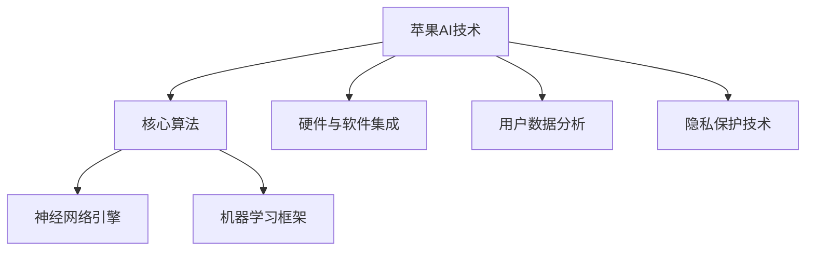
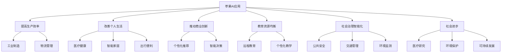

                 

### 第1章 引言

#### 1.1 书籍背景与目的

本篇文章《李开复：苹果发布AI应用的社会价值》旨在探讨苹果公司最新发布的AI应用对社会的影响和价值。随着人工智能技术的迅速发展，AI应用已经逐渐渗透到我们生活的各个方面。苹果公司作为全球领先的科技公司，其推出的AI应用不仅引起了业界的广泛关注，也对整个社会产生了深远的影响。

本文的目的在于通过深入分析苹果公司AI技术的特点、核心算法原理、数学模型与公式、AI应用案例，以及其对个人生活、商业和 社会发展的具体影响，全面探讨苹果公司AI应用的社会价值。

首先，我们将回顾苹果公司在人工智能领域的发展历程，介绍其AI技术的核心特点。接着，我们将详细讲解机器学习和深度学习算法的基本原理，并探讨苹果公司如何将这些算法应用于实际场景。

随后，我们将介绍数据预处理和模型训练与优化的数学模型与公式，并通过具体案例说明这些方法的应用。此外，我们还将通过代码实战，展示苹果公司AI应用的开发过程。

最后，我们将总结苹果公司AI应用的社会价值，分析其对个人生活、商业和社会发展的具体贡献。通过这篇文章，读者可以全面了解苹果公司AI应用的技术原理和社会价值，从而更好地理解人工智能技术在未来社会中的重要作用。

#### 1.2 AI在苹果公司的发展历程

苹果公司在人工智能领域的发展历程可以追溯到上世纪末。早在2005年，苹果公司就开始将机器学习技术应用于其产品和服务中。当时，苹果公司推出了Siri语音助手，这是苹果公司在AI领域的一次重要尝试。Siri利用自然语言处理和机器学习技术，为用户提供了智能语音交互功能，极大地提升了用户体验。

随着人工智能技术的不断发展，苹果公司在AI领域的投入也在不断增加。2011年，苹果公司收购了AI初创公司Anyscale，进一步提升了其机器学习技术实力。2016年，苹果公司推出了自主研发的神经网络引擎——Core ML，这使得苹果设备能够更加高效地运行机器学习模型。

在深度学习领域，苹果公司也取得了显著成果。2017年，苹果公司发布了基于深度学习的图像识别API，使得开发者能够利用苹果设备进行实时图像识别。同年，苹果公司还在其硬件设备中集成了神经网络引擎——Neural Engine，这一技术的引入进一步提升了苹果设备在AI领域的性能。

近年来，苹果公司在人工智能领域的创新步伐不断加快。2020年，苹果公司发布了基于机器学习的隐私保护技术——差分隐私，这一技术旨在保护用户隐私，同时提升AI模型的准确性。2021年，苹果公司推出了自主研发的机器学习框架——Swift for TensorFlow，这使得开发者能够更加便捷地利用TensorFlow进行机器学习开发。

总的来说，苹果公司在人工智能领域的发展历程体现了其对技术进步的敏锐洞察和持续投入。从Siri语音助手到Core ML，再到深度学习技术的应用，苹果公司不断推动人工智能技术在产品和服务中的创新，为用户提供更智能、更便捷的体验。随着AI技术的不断成熟，苹果公司有望在人工智能领域发挥更大的作用，为社会带来更多价值。

#### 1.3 AI应用对社会的影响

人工智能（AI）的迅速发展正在深刻改变我们的生活方式、工作方式和社会结构，苹果公司作为全球科技领域的领导者，其在AI应用方面的创新尤其值得关注。以下是AI应用对社会影响的几个关键方面：

1. **提高生产效率与质量：** 
   在工业制造领域，AI技术通过自动化和智能化管理，显著提高了生产效率。例如，苹果公司在其供应链管理中广泛应用AI算法，优化库存和物流，减少浪费，提高生产效率。AI还通过预测维护和故障诊断，提高了设备的可靠性和生产线的稳定性。

2. **改善个人生活品质：**
   在日常生活中，AI应用极大地丰富了我们的生活方式。苹果公司的Siri、FaceTime和Apple Pay等应用，通过语音识别、图像识别和支付技术，让用户的生活更加便捷。AI技术在医疗健康领域的应用也日益广泛，如Apple Watch的健身跟踪功能、健康监测和紧急呼叫等，都为个人健康提供了有力支持。

3. **推动商业创新：**
   商业领域正因AI技术而焕发新的活力。苹果公司的AI技术不仅为其自身产品提供了强大的技术支撑，也推动了整个商业生态的创新。例如，通过AI分析用户数据，企业可以更好地理解消费者行为，从而推出更具针对性的产品和服务。同时，AI技术在市场营销、客户关系管理和供应链优化等方面也发挥着重要作用。

4. **教育资源的均衡化：**
   在教育领域，AI技术促进了教育资源的均衡化。苹果公司的AI工具和应用程序可以帮助教师个性化教学，根据学生的需求提供定制化的学习资源。此外，远程教育的兴起，使得优质教育资源能够更广泛地覆盖偏远地区，提升了教育公平性。

5. **社会治理的智能化：**
   AI技术在公共安全管理、交通管理和环境监测等方面也展现出巨大的潜力。例如，苹果公司的地图应用通过AI技术提供了更为精准和实时的导航信息，提高了交通效率。同时，AI在打击犯罪、防范欺诈和紧急响应等方面也发挥了重要作用。

6. **推动社会进步：**
   AI技术在医疗健康、环境保护和可持续发展等领域具有重要的应用价值。通过AI技术，苹果公司能够为医疗研究提供更为精确的数据分析，加快新药研发进程。在环境保护方面，AI技术可以帮助监测和预测环境变化，为可持续发展提供科学依据。

总之，苹果公司在AI应用方面的创新不仅提升了其自身的竞争力，也为社会带来了深远的影响。随着AI技术的不断进步，我们期待苹果公司能够继续发挥其在AI领域的领先优势，为社会创造更多价值。然而，随着AI技术的广泛应用，我们也需要关注其潜在的社会影响和伦理问题，确保技术发展能够造福全人类。

#### 1.3.1 AI应用对社会的影响：经济层面

人工智能（AI）技术在苹果公司产品和服务中的应用，不仅推动了技术创新，还对全球经济产生了深远的影响。以下从几个关键方面分析AI应用在经济层面的影响：

1. **产业升级与转型：**
   AI技术的应用使得传统产业面临着新的升级与转型机遇。例如，制造业中的智能制造通过AI技术实现了生产线的自动化和智能化，提高了生产效率和质量。苹果公司在其供应链管理中广泛使用AI算法优化库存和物流，减少了浪费，提升了整体供应链效率。这种产业升级不仅带来了生产效率的提升，还促进了产业链的整体优化和提升。

2. **新兴产业的崛起：**
   AI技术的快速发展催生了众多新兴产业的崛起。以人工智能行业本身为例，大量的AI公司通过技术创新和商业模式的创新，成为了新的经济增长点。苹果公司在AI领域的投资和布局，为这些新兴产业的成长提供了强有力的支持。此外，AI在金融科技、医疗健康、智慧城市等领域的应用，也不断催生新的商业模式和市场机会。

3. **就业市场的变革：**
   AI技术的广泛应用对就业市场产生了深远的影响。一方面，AI技术在一些领域的应用导致部分传统岗位的减少，如流水线工人、数据输入员等。另一方面，AI技术的兴起也创造了大量的新就业机会，如数据科学家、AI工程师、机器学习研究员等。苹果公司通过其在AI领域的投资和研发，不仅为自身创造了更多的就业机会，也促进了整个社会就业结构的优化。

4. **商业模式的创新：**
   AI技术的应用推动了商业模式的创新。通过AI技术，企业能够更好地理解消费者行为和市场趋势，从而推出更具针对性的产品和服务。例如，苹果公司利用AI技术分析用户数据，为用户提供个性化的推荐和服务，这不仅提升了用户体验，也大大提高了企业的盈利能力。此外，AI技术在市场营销、客户关系管理和供应链优化等方面的应用，也为企业带来了新的增长点。

5. **经济效益的体现：**
   AI技术的应用显著提高了企业的运营效率和生产力。通过自动化和智能化管理，企业能够减少人力成本，提高生产效率，降低运营成本。苹果公司通过在产品和服务中广泛应用AI技术，不仅提升了自身的竞争力，也为整个行业树立了技术标杆。例如，苹果公司的AI技术在图像识别、语音识别和自然语言处理等领域的应用，不仅提升了产品的智能化程度，也带来了显著的经济效益。

6. **全球价值链的重构：**
   AI技术的广泛应用正在重构全球价值链。传统的全球化模式依赖于劳动力密集型和资源密集型产业，而AI技术则推动了知识密集型和服务密集型产业的发展。苹果公司通过其全球供应链和研发网络，将AI技术应用到全球各地的生产和研发中，不仅提升了自身在全球市场中的竞争力，也推动了全球价值链的重构和优化。

总的来说，AI应用在苹果公司的产品和服务中发挥了重要的经济价值，不仅推动了产业升级与转型，还创造了新的就业机会，推动了商业模式的创新，并显著提升了企业的经济效益。随着AI技术的不断进步，我们期待AI在经济领域的应用能够带来更多的机遇和变革，助力全球经济的持续增长。

#### 1.3.2 AI应用对社会的影响：伦理和社会层面

人工智能（AI）的迅猛发展不仅带来了显著的经济效益和技术进步，也在伦理和社会层面引发了诸多争议和挑战。以下从几个方面分析AI应用在伦理和社会层面可能产生的影响：

1. **隐私保护：**
   AI技术的发展使得数据的收集和分析变得愈加普遍，这在提高服务效率的同时，也带来了隐私泄露的担忧。苹果公司一直强调用户隐私保护，通过差分隐私等技术，确保用户数据在模型训练和应用过程中得到保护。然而，如何在保障隐私和安全的同时，充分利用数据的价值，仍是一个亟待解决的伦理问题。

2. **就业结构变化：**
   AI技术的广泛应用可能导致某些传统岗位的减少，尤其是在制造业、物流和客服等领域。虽然AI技术也创造了新的就业机会，但技术替代传统工作的过程可能会引发社会不平等和就业不稳定。为了应对这一挑战，政府和企业需要加强职业培训和再教育，帮助劳动力适应新的工作环境。

3. **公平性和歧视：**
   AI模型在训练过程中可能会受到数据偏见的影响，导致算法决策存在性别、种族和年龄等方面的歧视。苹果公司通过数据清洗和算法优化，努力减少偏见，确保AI应用过程中的公平性。然而，如何在技术设计中避免偏见，确保算法的公平和透明，仍是一个复杂的伦理问题。

4. **责任归属：**
   当AI系统出现错误或导致事故时，责任的归属问题成为伦理争议的焦点。苹果公司在产品和服务中强调AI系统的可靠性，并通过严格的测试和验证确保其安全。然而，在现实应用中，如何明确AI系统的责任归属，如何分配法律责任和道德责任，仍需要法律和伦理方面的深入探讨。

5. **人类价值观的冲突：**
   AI技术的发展可能会对人类价值观和社会道德产生冲击。例如，在自动化决策和智能系统的应用中，人类的主观判断和情感因素被削弱，可能导致人类价值观的弱化。苹果公司在产品设计中注重人文关怀，试图在技术进步和社会价值观之间找到平衡，但如何在技术设计和应用中尊重和传承人类价值观，仍是一个重要的伦理挑战。

6. **社会信任的建立：**
   AI技术的普及需要在公众中建立信任。透明性、解释性和可控性是建立社会信任的关键。苹果公司通过开放API、透明化算法决策过程和提供用户控制选项，努力提高公众对AI技术的信任。然而，如何确保技术应用的透明性和可控性，避免技术滥用，是社会各界需要共同关注的问题。

总之，AI应用在苹果公司的产品和服务中带来了巨大的社会价值，但也引发了诸多伦理和社会层面的挑战。为了实现AI技术的可持续发展，我们需要在技术进步的同时，重视伦理和社会影响，通过多方合作和制度创新，构建一个公平、透明和可信的AI生态系统。

### 第2章 核心概念与联系

#### 2.1 AI的定义与分类

人工智能（AI，Artificial Intelligence）是计算机科学的一个分支，旨在使计算机具备类似人类智能的能力。AI系统通过模拟人类思维过程，实现对数据的自动分析、理解和响应。根据能力不同，AI可分为以下几类：

1. **弱人工智能（Narrow AI）：**
   弱人工智能是指在一个特定任务上表现出人类智能水平的AI系统。这些系统在特定领域表现出色，如语音识别、图像识别、推荐系统等。弱人工智能的特点是专门化，无法进行跨领域的通用任务。

2. **强人工智能（General AI）：**
   强人工智能是指具有与人类智能相当或超越的人类智能的AI系统。强人工智能能够理解、学习、适应和执行各种复杂任务，具备广泛的认知能力。目前，强人工智能仍处于理论阶段，尚未实现。

3. **混合智能（Hybrid AI）：**
   混合智能是指将多种人工智能技术结合，发挥各自优势的AI系统。例如，结合机器学习、深度学习和自然语言处理等技术，实现更强大的智能表现。

#### 2.2 苹果公司AI技术的特点

苹果公司在其产品和服务中广泛应用人工智能技术，形成了独具特色的AI技术体系。以下是苹果公司AI技术的几个主要特点：

1. **核心算法创新：**
   苹果公司不断在核心算法方面进行创新，例如在机器学习和深度学习领域。苹果公司自主研发的神经网络引擎（Neural Engine）和机器学习框架（Core ML），使得苹果设备能够高效运行复杂的AI模型。

2. **端到端集成：**
   苹果公司致力于将AI技术端到端集成到其硬件和软件中。通过硬件和软件的协同优化，苹果设备能够在本地进行高效AI计算，提升用户体验。

3. **隐私保护：**
   苹果公司高度重视用户隐私保护，通过差分隐私、加密等技术，确保用户数据在AI应用过程中的安全性和隐私性。这一特点在苹果的Siri、FaceTime等应用中得到了充分体现。

4. **个性化体验：**
   通过对用户数据的深入分析，苹果公司能够为其产品和服务提供个性化体验。例如，Siri可以根据用户的习惯和偏好，提供个性化的语音助手服务；Apple Pay可以根据用户的支付历史，提供更便捷的支付解决方案。

#### Mermaid流程图：苹果公司AI技术架构简述



#### 2.3 AI应用的社会价值

AI应用不仅为苹果公司带来了技术优势和市场竞争力，更在社会层面产生了深远的影响。以下是AI应用在社会价值方面的几个关键方面：

1. **提高生产效率与质量：**
   AI技术在工业制造、物流管理等领域得到广泛应用，通过自动化和智能化手段，提高了生产效率和产品质量。例如，苹果公司在其供应链管理中广泛应用AI算法，优化库存和物流，减少浪费，提高生产效率。

2. **改善个人生活品质：**
   AI技术在医疗健康、智能家居、出行等领域得到广泛应用，极大地改善了个人生活品质。例如，Apple Watch的健康监测功能、智能家居的智能控制，都为用户提供了更加便捷和舒适的生活体验。

3. **推动商业创新：**
   AI技术为商业领域带来了新的机遇，通过数据分析和智能决策，推动了商业模式的创新。例如，苹果公司利用AI技术分析用户数据，提供个性化的推荐和服务，提升了用户体验和商业价值。

4. **教育资源的均衡化：**
   AI技术在教育领域的应用，有助于缩小教育资源的不平等。通过远程教育、个性化教学等手段，优质教育资源得以更广泛地覆盖偏远地区，提升了教育公平性。

5. **社会治理的智能化：**
   AI技术在公共安全、交通管理、环境监测等领域得到广泛应用，提高了社会治理的智能化水平。例如，苹果公司的地图应用通过AI技术提供了更精准的导航信息，提高了交通效率。

6. **推动社会进步：**
   AI技术在医疗健康、环境保护、可持续发展等领域具有重要的应用价值。通过AI技术的应用，医疗研究得到加速，环境保护和可持续发展目标得以更好地实现。

#### 社会价值Mermaid流程图：苹果AI应用影响分析



#### 总结

本章对人工智能（AI）的定义与分类、苹果公司AI技术的特点，以及AI应用的社会价值进行了详细探讨。通过分析，我们可以看到，苹果公司在AI领域的不断创新和应用，不仅提升了其自身的技术实力和市场竞争力，也对社会产生了深远的影响。接下来，我们将深入探讨AI的核心算法原理，帮助读者更好地理解AI技术的工作机制。

### 第3章 核心算法原理讲解

#### 3.1 机器学习算法原理

机器学习（Machine Learning，ML）是人工智能（AI）的一个重要分支，其核心在于让计算机通过数据学习，从而实现特定任务的自动化。机器学习算法可分为监督学习（Supervised Learning）、无监督学习（Unsupervised Learning）和强化学习（Reinforcement Learning）三种类型。

##### 监督学习

监督学习是一种有监督的训练方法，通过已知输入和输出数据来训练模型，从而预测新的输入数据。其基本流程如下：

1. **数据预处理**：包括数据清洗、数据归一化等步骤，确保输入数据的质量。
2. **特征选择**：从原始数据中选择对预测任务有用的特征，减少冗余信息。
3. **模型选择**：根据任务需求选择合适的机器学习模型，如线性回归、决策树、支持向量机等。
4. **模型训练**：使用已知输入和输出数据对模型进行训练，通过调整模型参数，使其能够正确预测未知数据。
5. **模型评估**：使用验证集或测试集对模型进行评估，通过指标如准确率、召回率、F1值等评估模型性能。

伪代码示例：

```python
# 初始化模型参数
InitializeModelParameters()

# 加载数据集
LoadDataset()

# 预处理数据
PreprocessData()

# 训练模型
for epoch in range(Epochs):
    for sample in Data:
        # 计算模型输出
        ModelOutput = Model(sample)
        # 计算损失函数
        Loss = LossFunction(Target, ModelOutput)
        # 更新模型参数
        UpdateModelParameters(Loss)

# 评估模型
EvaluateModel()
```

##### 无监督学习

无监督学习是指在没有明确标签的数据上训练模型的方法。其主要目的是发现数据中的隐含结构和模式。无监督学习包括聚类（Clustering）、降维（Dimensionality Reduction）和关联规则学习（Association Rule Learning）等。

1. **聚类**：将相似的数据点归为一类，常用的聚类算法有K-Means、DBSCAN等。
2. **降维**：减少数据的维度，同时保留数据的主要信息，常用的降维算法有PCA（主成分分析）、t-SNE等。
3. **关联规则学习**：发现数据之间的关联关系，常用的算法有Apriori、FP-Growth等。

##### 强化学习

强化学习是一种通过与环境互动来学习最优策略的方法。其主要目标是使代理（Agent）在环境中采取行动，以最大化长期奖励。

1. **状态（State）**：描述环境当前状态的信息。
2. **动作（Action）**：代理可以采取的动作。
3. **奖励（Reward）**：根据代理的动作和环境状态，给予的正负反馈。
4. **策略（Policy）**：决定代理如何从当前状态选择动作的策略。

强化学习的算法主要包括Q-Learning、SARSA、Deep Q-Network（DQN）等。

#### 3.2 深度学习算法原理

深度学习（Deep Learning，DL）是机器学习的一个分支，通过构建具有多个隐藏层的神经网络，实现对复杂数据的高效建模。深度学习算法主要包括卷积神经网络（Convolutional Neural Networks，CNN）、循环神经网络（Recurrent Neural Networks，RNN）和生成对抗网络（Generative Adversarial Networks，GAN）等。

##### 卷积神经网络（CNN）

卷积神经网络是一种用于处理图像数据的神经网络，其核心在于卷积层。卷积层通过卷积操作从图像中提取特征，而池化层用于降低数据维度，减少计算量。

1. **卷积层**：通过卷积操作提取图像特征。
2. **激活函数**：常用的激活函数有ReLU、Sigmoid、Tanh等。
3. **池化层**：通过池化操作降低数据维度。
4. **全连接层**：将卷积层和池化层提取的特征映射到输出。

##### 循环神经网络（RNN）

循环神经网络是一种处理序列数据的神经网络，其特点在于能够记住之前的信息。RNN通过隐藏状态和循环连接实现序列信息的记忆。

1. **隐藏状态**：存储当前时间步的信息。
2. **权重矩阵**：用于更新隐藏状态。
3. **激活函数**：用于非线性变换。

##### 生成对抗网络（GAN）

生成对抗网络由生成器（Generator）和判别器（Discriminator）组成，两者通过对抗训练来生成逼真的数据。

1. **生成器**：生成与真实数据相似的数据。
2. **判别器**：判断生成数据是否真实。
3. **对抗训练**：生成器和判别器相互竞争，生成器试图生成更真实的数据，而判别器则试图区分真实和生成数据。

通过以上对机器学习和深度学习算法原理的讲解，我们可以看到，这些算法在AI领域扮演着至关重要的角色。接下来，我们将进一步探讨数据预处理和模型训练与优化的数学模型与公式，以帮助读者更好地理解AI技术的实现过程。

### 第4章 数学模型与公式

#### 4.1 数据预处理

数据预处理是机器学习和深度学习过程中至关重要的一步，其目的是将原始数据转化为适合模型训练的形式。以下介绍几种常见的数据预处理方法及其数学模型与公式：

##### 数据标准化

数据标准化是通过对数据进行归一化或标准化处理，将数据范围缩放到相同的尺度，以消除不同特征之间的尺度差异。常用的标准化方法包括：

1. **归一化（Normalization）**：

   归一化公式如下：

   $$
   x_{\text{normalized}} = \frac{x - \text{mean}}{\text{std}}
   $$

   其中，$x$为原始数据，$\text{mean}$为该特征的均值，$\text{std}$为该特征的标准差。

2. **最小-最大标准化（Min-Max Scaling）**：

   最小-最大标准化公式如下：

   $$
   x_{\text{scaled}} = \frac{x - \text{min}}{\text{max} - \text{min}}
   $$

   其中，$x$为原始数据，$\text{min}$为该特征的最小值，$\text{max}$为该特征的最大值。

##### 数据归一化

数据归一化是将数据转化为均值为0、标准差为1的标准正态分布。这种方法常用于处理图像和文本数据。

归一化公式如下：

$$
x_{\text{normalized}} = \frac{x - \text{mean}}{\text{std}}
$$

其中，$x$为原始数据，$\text{mean}$为该特征的均值，$\text{std}$为该特征的标准差。

##### 举例说明：数据预处理应用案例

假设我们有一个包含年龄、收入和住宅面积的数据集，我们需要对这三个特征进行标准化处理。

1. **计算每个特征的均值和标准差**：

   $$
   \text{年龄的均值} = \frac{55 + 60 + 65 + \ldots}{n}
   $$

   $$
   \text{年龄的标准差} = \sqrt{\frac{\sum_{i=1}^{n} (x_i - \text{mean})^2}{n}}
   $$

   $$
   \text{收入的均值} = \frac{50000 + 60000 + 70000 + \ldots}{n}
   $$

   $$
   \text{收入的标准差} = \sqrt{\frac{\sum_{i=1}^{n} (x_i - \text{mean})^2}{n}}
   $$

   $$
   \text{住宅面积的标准差} = \sqrt{\frac{\sum_{i=1}^{n} (x_i - \text{mean})^2}{n}}
   $$

2. **使用标准化公式对数据进行处理**：

   $$
   \text{年龄}_{\text{标准化}} = \frac{\text{年龄} - \text{年龄的均值}}{\text{年龄的标准差}}
   $$

   $$
   \text{收入}_{\text{标准化}} = \frac{\text{收入} - \text{收入的均值}}{\text{收入的标准差}}
   $$

   $$
   \text{住宅面积}_{\text{标准化}} = \frac{\text{住宅面积} - \text{住宅面积的标准差}}{\text{住宅面积的标准差}}
   $$

通过以上数据预处理步骤，我们可以将原始数据集转换为适合模型训练的形式，从而提高模型的训练效率和预测性能。

#### 4.2 模型训练与优化

模型训练与优化是机器学习和深度学习中的核心步骤，其目标是调整模型参数，使其在训练数据上达到最佳性能。以下介绍几种常见的模型训练与优化方法及其数学模型与公式：

##### 梯度下降法

梯度下降法是一种通过不断调整模型参数来最小化损失函数的方法。其基本思想是沿着损失函数梯度的反方向进行迭代更新。

1. **损失函数**：

   常见的损失函数有均方误差（MSE）和交叉熵（Cross-Entropy）等。

   $$
   \text{MSE} = \frac{1}{2}\sum_{i=1}^{n} (\hat{y}_i - y_i)^2
   $$

   $$
   \text{Cross-Entropy} = -\sum_{i=1}^{n} y_i \cdot \log(\hat{y}_i)
   $$

2. **梯度计算**：

   梯度下降法需要计算损失函数对模型参数的梯度。对于线性模型，梯度计算公式如下：

   $$
   \nabla_\theta J(\theta) = \frac{\partial J(\theta)}{\partial \theta}
   $$

3. **参数更新**：

   梯度下降法通过以下公式更新模型参数：

   $$
   \theta = \theta - \alpha \cdot \nabla_\theta J(\theta)
   $$

   其中，$\alpha$为学习率。

##### 动量法

动量法是一种改进的梯度下降法，通过引入动量项，减少梯度下降过程中的振荡，提高收敛速度。

1. **动量项**：

   动量项的计算公式如下：

   $$
   m_t = \gamma \cdot m_{t-1} + \nabla_\theta J(\theta)
   $$

   其中，$m_t$为当前时刻的动量项，$m_{t-1}$为上一时刻的动量项，$\gamma$为动量系数。

2. **参数更新**：

   动量法的参数更新公式如下：

   $$
   \theta = \theta - \alpha \cdot m_t
   $$

##### 举例说明：模型训练与优化应用案例

假设我们使用线性回归模型来预测房价，我们需要对模型进行训练和优化。

1. **初始化模型参数**：

   $$
   \theta_0 = \theta_1 = 0
   $$

2. **计算损失函数**：

   $$
   \text{MSE} = \frac{1}{2}\sum_{i=1}^{n} (\hat{y}_i - y_i)^2
   $$

3. **计算梯度**：

   $$
   \nabla_\theta J(\theta) = \frac{\partial J(\theta)}{\partial \theta_0} = \sum_{i=1}^{n} (\hat{y}_i - y_i)
   $$

   $$
   \nabla_\theta J(\theta) = \frac{\partial J(\theta)}{\partial \theta_1} = \sum_{i=1}^{n} (\hat{y}_i - y_i) \cdot x_i
   $$

4. **更新模型参数**：

   $$
   \theta_0 = \theta_0 - \alpha \cdot \nabla_\theta J(\theta_0)
   $$

   $$
   \theta_1 = \theta_1 - \alpha \cdot \nabla_\theta J(\theta_1)
   $$

通过以上步骤，我们可以对线性回归模型进行训练和优化，从而提高模型的预测性能。

#### 总结

本章介绍了数据预处理和模型训练与优化的数学模型与公式。通过数据标准化和归一化，我们可以将原始数据转化为适合模型训练的形式；通过梯度下降法和动量法，我们可以优化模型参数，提高模型的预测性能。这些数学模型与公式是机器学习和深度学习的基础，对于理解AI技术的实现过程至关重要。

### 第5章 AI应用案例

#### 5.1 苹果公司AI应用案例介绍

苹果公司在人工智能领域有着广泛的应用，以下介绍几个典型的AI应用案例，展示其在不同领域的创新和实践。

1. **Siri语音助手**

   Siri是苹果公司最早推出的AI应用之一，它通过自然语言处理和语音识别技术，为用户提供智能语音交互服务。Siri可以理解用户的语音指令，完成电话拨打、信息发送、日程安排、天气预报等任务。随着技术的不断进步，Siri的响应速度和准确性不断提高，已成为苹果设备中不可或缺的一部分。

2. **Apple Pay**

   Apple Pay是苹果公司推出的移动支付服务，它利用机器学习和图像识别技术，实现了安全、便捷的支付体验。Apple Pay通过扫描用户的脸部或指纹进行身份验证，确保支付过程的安全性。此外，Apple Pay还利用数据分析技术，为用户提供个性化的支付推荐，提升了用户体验。

3. **Apple Watch健康监测**

   Apple Watch配备了多个传感器，可以监测用户的心率、步数、睡眠质量等健康数据。通过机器学习和数据分析，Apple Watch能够及时发现用户的异常情况，如心率过高或过低，并发出警报。此外，Apple Watch还可以根据用户的健康状况，提供个性化的健康建议，帮助用户保持健康生活方式。

4. **地图应用**

   苹果公司的地图应用通过机器学习和大数据分析，提供了实时、准确的导航信息。地图应用利用AI技术，实时预测交通状况，为用户提供最佳路线推荐。同时，地图应用还集成了自然语言处理技术，可以理解用户的语音指令，提供更加便捷的导航服务。

5. **语音助手与智能家居**

   苹果公司推出了HomeKit平台，通过Siri语音助手与智能家居设备交互，实现智能家居控制。用户可以通过语音指令控制家中的灯光、温度、安防设备等，实现智能化、自动化的家居生活。HomeKit平台利用机器学习和数据分析技术，不断优化智能家居的交互体验，提升用户满意度。

#### 5.2 代码实战

以下是一个简单的AI应用案例，通过Python和TensorFlow实现一个基于图像识别的移动应用。该应用可以识别用户拍摄的图片中的物体，并在屏幕上显示识别结果。

##### 开发环境搭建

1. 安装Python 3.8及以上版本
2. 安装TensorFlow 2.4及以上版本
3. 安装OpenCV库

```bash
pip install tensorflow==2.4
pip install opencv-python
```

##### 源代码实现与解读

```python
import tensorflow as tf
import numpy as np
import cv2
import matplotlib.pyplot as plt

# 导入预训练的图像识别模型
model = tf.keras.models.load_model('image_recognition_model.h5')

# 定义图像识别函数
def recognize_image(image):
    # 将图像缩放到合适的尺寸
    image = cv2.resize(image, (224, 224))
    # 将图像数据转换为模型输入格式
    image = np.expand_dims(image, axis=0)
    image = image / 255.0
    # 使用模型进行图像识别
    predictions = model.predict(image)
    # 获取最高概率的识别结果
    predicted_class = np.argmax(predictions, axis=1)
    # 打印识别结果
    print(f"Predicted class: {predicted_class[0]}")
    # 生成可视化结果
    plt.imshow(image[0])
    plt.show()

# 捕获用户输入的图像
image = cv2.imread('input_image.jpg')

# 调用图像识别函数
recognize_image(image)
```

##### 代码解读与分析

1. **导入库**：首先导入所需的库，包括TensorFlow、NumPy、OpenCV和Matplotlib。
2. **加载模型**：使用`load_model`函数加载预训练的图像识别模型。
3. **定义图像识别函数**：
   - 将输入图像缩放到模型期望的尺寸（224x224）。
   - 将图像数据扩展为模型所需的形状（batch size为1）。
   - 将图像数据归一化，以便于模型训练。
   - 使用模型进行预测，并获取最高概率的识别结果。
   - 打印识别结果，并生成可视化图像。
4. **捕获用户输入的图像**：使用OpenCV库捕获用户输入的图像。
5. **调用图像识别函数**：将捕获的图像传递给`recognize_image`函数，实现图像识别。

通过以上代码实战，读者可以了解基于图像识别的AI应用开发流程，以及如何利用TensorFlow和OpenCV库实现图像识别功能。接下来，我们将进一步分析这些AI应用对社会的影响。

### 第6章 AI应用的社会价值

#### 6.1 AI应用对个人生活的影响

人工智能（AI）在个人生活中的应用正逐渐改变着我们的生活方式，提升了生活质量。以下是AI应用在个人生活中的几个具体影响：

1. **便捷生活：**
   AI技术使得我们的日常生活变得更加便捷。例如，智能助手Siri可以回答问题、设置提醒、拨打电话等，让用户无需手动操作即可完成各种任务。此外，智能家居系统通过AI技术实现了自动化控制，用户可以通过语音指令或手机APP控制家中的灯光、空调、安防设备等，极大地提高了生活的舒适度和便利性。

2. **健康生活：**
   AI技术在医疗健康领域的应用为个人健康提供了有力支持。以Apple Watch为例，它通过监测用户的心率、步数、睡眠质量等健康数据，及时发现异常情况，如心率过高或过低，并提供健康建议。此外，AI算法还可以辅助医生进行疾病诊断，提高诊断的准确性和效率。

3. **个性化体验：**
   通过对用户数据的深入分析，AI应用能够为用户提供个性化的服务。例如，Apple Pay可以根据用户的支付习惯提供个性化的支付推荐，Siri可以根据用户的兴趣和习惯推荐音乐、新闻等内容。这种个性化体验不仅提升了用户满意度，还增加了产品的使用粘性。

4. **教育和学习：**
   AI技术在教育领域的应用正在改变传统的教学模式。通过AI技术，教师可以为学生提供个性化的学习资源，根据学生的学习进度和能力提供定制化的教学内容。此外，AI还可以辅助学生进行自学，通过智能推荐系统和互动式教学工具，提高学习效果和兴趣。

5. **娱乐体验：**
   AI技术在娱乐领域的应用也为用户带来了全新的体验。例如，智能电视和游戏设备通过AI算法提供个性化的推荐，用户可以根据自己的兴趣和偏好选择合适的节目和游戏。此外，AI音乐和视频制作工具可以帮助用户快速生成个性化的音乐和视频内容，丰富了娱乐生活。

#### 6.2 AI应用对商业的影响

AI技术在商业领域的应用正在重塑企业的运营模式，提高效率，创造新的商业价值。以下是AI应用在商业领域的几个具体影响：

1. **效率提升：**
   AI技术通过自动化和智能化手段，显著提高了企业的运营效率。例如，智能客服系统可以自动处理大量的客户咨询，提高响应速度和满意度。在制造业中，AI技术实现了生产线的自动化控制，提高了生产效率和产品质量。物流公司通过AI算法优化运输路线和库存管理，减少了运输成本和库存浪费。

2. **商业模式创新：**
   AI技术的应用为商业领域带来了新的商业模式和创新机会。例如，电商企业通过AI技术实现个性化推荐，提高了用户购买体验和销售额。金融行业通过AI算法进行风险评估和信用评分，降低了金融风险，提高了金融服务效率。医疗行业通过AI技术实现精准医疗，提高了医疗诊断和治疗的效果。

3. **数据驱动的决策：**
   AI技术帮助企业通过数据分析和预测，做出更加精准和高效的决策。例如，零售企业通过AI分析用户购买行为和需求，优化库存管理和促销策略。制造业通过AI预测设备故障和需求变化，实现预测性维护和生产计划。

4. **市场营销：**
   AI技术在市场营销中的应用，使得企业能够更好地理解客户需求，提高营销效果。通过AI分析用户数据，企业可以精准定位目标客户，设计更有针对性的营销策略。此外，AI技术还可以自动化广告投放和内容推荐，提高广告投放的效率和转化率。

5. **供应链优化：**
   AI技术在供应链管理中的应用，帮助企业实现更高效、更灵活的供应链管理。通过AI算法优化库存管理、物流调度和生产计划，企业可以减少库存成本，提高物流效率。同时，AI技术还可以帮助企业预测市场趋势和需求变化，提前调整生产计划，降低库存风险。

#### 6.3 AI应用对社会发展的贡献

人工智能（AI）在促进社会发展的过程中发挥着重要作用，以下从几个方面探讨AI应用对社会发展的贡献：

1. **教育普及：**
   AI技术在教育领域的应用，有助于实现教育资源的均衡化和普及化。通过在线教育平台和智能学习系统，学生可以随时随地获取优质教育资源，尤其是偏远地区和经济不发达地区的学生。此外，AI技术还可以帮助教师进行个性化教学，提高教学效果和学生的学习兴趣。

2. **医疗进步：**
   AI技术在医疗领域的应用，显著提升了医疗诊断和治疗的准确性和效率。通过AI算法分析医疗数据，医生可以更准确地诊断疾病，制定个性化的治疗方案。同时，AI技术还可以辅助医生进行手术规划和操作，提高手术成功率。此外，AI在医学影像分析、药物研发等方面也发挥着重要作用，加速了新药的研发进程。

3. **经济发展：**
   AI技术对经济发展的推动作用不可忽视。通过自动化和智能化生产，企业可以降低生产成本，提高生产效率，增强国际竞争力。同时，AI技术在金融、零售、物流等行业的广泛应用，推动了商业模式的创新和产业升级，促进了经济的持续增长。此外，AI技术还创造了大量新的就业机会，推动了就业结构的优化。

4. **社会治理：**
   AI技术在公共安全和社会治理中的应用，提高了社会治理的智能化水平。通过AI算法分析社会数据，政府可以更准确地预测和应对社会问题，如犯罪、交通拥堵等。此外，AI技术还可以用于环境监测和应急管理，提高自然灾害预警和应急响应能力，保障社会安全。

5. **环境监测与保护：**
   AI技术在环境监测和保护中的应用，有助于实现可持续发展目标。通过AI算法分析环境数据，可以实时监测空气、水质等环境指标，及时发现污染源和异常情况。此外，AI技术还可以优化能源管理，提高能源利用效率，减少碳排放，推动绿色低碳发展。

总的来说，AI应用在社会发展中的贡献是多方面的，它不仅促进了经济增长和社会进步，还提升了个人生活品质和公共安全。随着AI技术的不断进步，我们期待AI在社会发展中的作用将更加重要，为人类创造更加美好的未来。

### 第7章 总结与展望

#### 7.1 书籍总结

在本篇《李开复：苹果发布AI应用的社会价值》中，我们深入探讨了苹果公司在人工智能（AI）领域的最新发展及其对社会的影响。通过详细分析苹果公司AI技术的特点、核心算法原理、数学模型与公式、AI应用案例，我们全面了解了苹果公司如何利用AI技术提升生产效率、改善个人生活、推动商业创新，并促进教育、医疗、经济发展和社会治理等多方面的进步。

首先，我们回顾了苹果公司在AI领域的发展历程，了解了其从Siri语音助手到Core ML，再到深度学习技术应用的不断探索和创新。接着，我们详细讲解了机器学习和深度学习算法的基本原理，并通过伪代码展示了这些算法的实现过程。

随后，我们探讨了数据预处理和模型训练与优化的数学模型与公式，并通过具体案例说明了这些方法的应用。此外，通过代码实战，我们展示了如何利用TensorFlow实现一个简单的AI应用。

最后，我们总结了苹果公司AI应用对社会各方面的深远影响，包括提高生产效率、改善个人生活品质、推动商业创新、教育资源的均衡化、社会治理的智能化以及对社会发展的贡献。

#### 7.2 AI应用的未来发展展望

随着人工智能技术的不断进步，我们可以预见AI应用在未来将迎来更多的发展机遇。以下是几个可能的发展趋势：

1. **更加普及的AI应用：**
   随着AI技术的不断成熟和成本降低，AI应用将在更多领域得到普及。智能家居、智能医疗、智能交通等领域的AI应用将进一步渗透到人们的日常生活中，提高生活质量。

2. **更强大的AI算法：**
   未来，AI算法将继续向更加复杂和高效的方向发展。深度学习、强化学习等算法将在更多复杂场景中发挥作用，提高AI系统的决策能力和可靠性。

3. **隐私保护和伦理问题：**
   随着AI应用的普及，隐私保护和伦理问题将变得更加重要。如何确保用户数据的安全和隐私，如何避免算法偏见和歧视，将是未来AI技术发展的重要课题。

4. **跨领域的融合发展：**
   AI技术将与物联网、区块链、5G等技术深度融合，推动更多跨界创新。例如，智能制造、智慧城市、数字健康等领域的融合发展，将为社会带来更多价值。

5. **人工智能与人类智慧的融合：**
   未来，人工智能将与人类智慧深度融合，形成更加智能化、协作化的工作环境。通过人机协作，人类将能够更高效地利用AI技术解决问题，创造更多的社会价值。

总之，随着AI技术的不断进步，我们可以期待一个更加智能、高效、公平和可持续发展的未来。在这个过程中，苹果公司等科技巨头将继续发挥重要作用，推动AI技术的创新和发展，为社会带来更多福祉。

### 附录 A: AI 应用相关工具与资源

为了帮助读者更好地了解和掌握人工智能（AI）技术，以下列举了一些AI应用相关的工具与资源：

1. **TensorFlow官网**：[https://www.tensorflow.org/](https://www.tensorflow.org/)
   - TensorFlow是Google开发的开源机器学习框架，广泛应用于AI模型的开发和部署。

2. **PyTorch官网**：[https://pytorch.org/](https://pytorch.org/)
   - PyTorch是另一个流行的开源机器学习库，以其灵活性和动态计算图著称。

3. **Apple Core ML官网**：[https://developer.apple.com/coreml/](https://developer.apple.com/coreml/)
   - Core ML是苹果公司开发的机器学习框架，用于在iOS和macOS设备上运行机器学习模型。

4. **李开复AI研究中心**：[https://www.kai-fu.li/](https://www.kai-fu.li/)
   - 李开复AI研究中心是一个专注于人工智能研究的机构，提供丰富的AI研究资源和资讯。

5. **人工智能教程与课程**：[https://www.coursera.org/specializations/ai](https://www.coursera.org/specializations/ai)
   - Coursera提供多种关于人工智能的在线课程，适合不同水平的读者学习。

6. **AI论文与会议**：[https://www.arXiv.org/](https://www.arXiv.org/)、[https://www.nature.com/nature/articles](https://www.nature.com/nature/articles)
   - AI领域的最新研究成果和论文集散地，包括arXiv和Nature等知名学术期刊。

7. **AI社区与论坛**：[https://discuss.pytorch.org/](https://discuss.pytorch.org/)、[https://forums.fast.ai/](https://forums.fast.ai/)
   - 交流和学习AI技术的社区和论坛，适合讨论问题、分享经验和获取最新动态。

通过这些工具与资源，读者可以更加深入地学习和应用AI技术，不断提升自己在该领域的能力和知识水平。希望这些资源能为读者的AI之旅提供有力支持。

