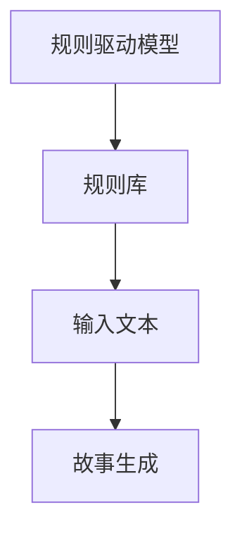
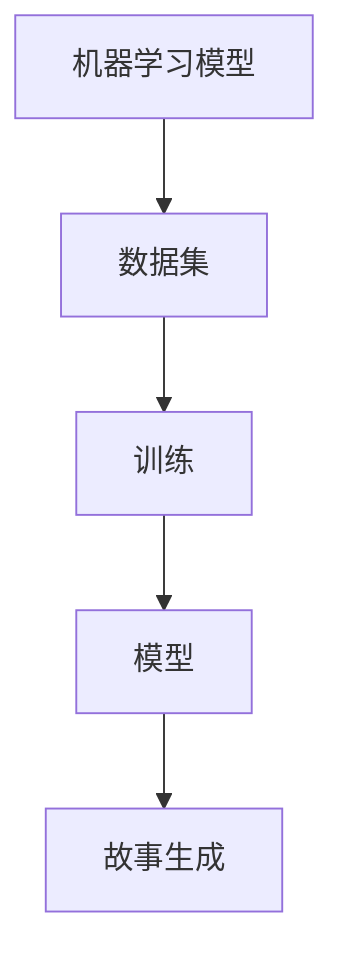
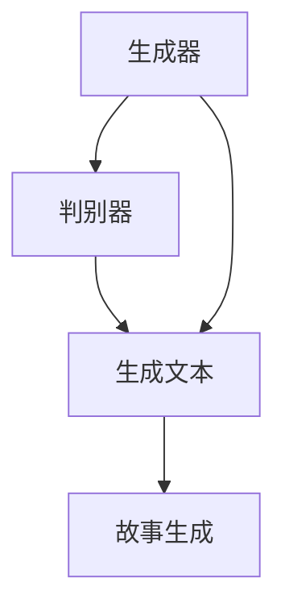
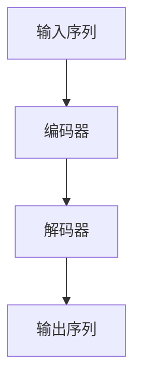
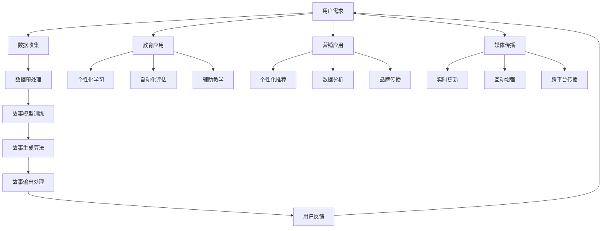

                 

# 《构建讲故事的人工智能：课程概述》

> 关键词：人工智能、故事生成、自然语言处理、机器学习、教育、营销

> 摘要：本文深入探讨了人工智能讲故事的基本概念、模型构建、应用场景及未来发展趋势。文章首先介绍了人工智能的定义与历史发展，探讨了讲故事的艺术与心理学基础，并阐述了人工智能讲故事的核心原理。接着，文章详细分析了构建人工智能讲故事模型的类型、架构设计和优化策略。随后，文章探讨了人工智能在教育、营销等领域的应用，展示了其实践案例。最后，文章展望了人工智能讲故事的技术趋势、商业化前景及社会影响，提出了研究方向与建议。本文旨在为读者提供一个全面、深入的人工智能讲故事课程概述，以启发对这一领域的思考和研究。

## 第一部分：人工智能与讲故事的基本概念

### 第1章：人工智能与讲故事

#### 1.1 人工智能的定义与历史发展

##### 1.1.1 人工智能的基本概念

人工智能（Artificial Intelligence，简称AI）是计算机科学的一个分支，致力于开发能够执行通常需要人类智能才能完成的任务的机器或程序。这些任务包括学习、推理、自我修正、感知、理解和语言处理等。人工智能的目标是实现一种能够模拟甚至超越人类智能的技术。

##### 1.1.2 人工智能的发展历程

人工智能的研究始于20世纪50年代。早期的研究主要集中在符号主义方法上，即使用逻辑和规则系统来模拟人类思维。这一时期的代表性工作包括ELIZA（一个早期的自然语言处理系统）和Lisp编程语言。然而，由于符号主义方法在处理复杂性和适应性方面的局限，研究者开始探索基于数据和统计的方法。

随着计算能力的提升和数据量的爆炸性增长，机器学习成为人工智能研究的主流。机器学习利用算法从数据中学习规律，进而实现智能行为。这一趋势在20世纪80年代和90年代得到了显著的发展，包括支持向量机（SVM）、决策树和神经网络等算法。近年来，深度学习技术的发展使得人工智能在图像识别、自然语言处理、语音识别等领域取得了突破性的进展。

##### 1.1.3 人工智能在当今社会的重要性

人工智能技术已经深刻地影响了各行各业，包括医疗、金融、交通、教育等。在讲故事领域，人工智能的应用使得故事生成、编辑和传播变得更加高效和个性。人工智能不仅可以生成新颖的故事，还可以分析用户的情感和兴趣，为用户提供定制化的故事内容。此外，人工智能还可以帮助创作者优化故事结构，提高故事的质量和吸引力。

#### 1.2 讲故事的心理学基础

##### 1.2.1 故事的结构与元素

一个完整的故事通常包括以下元素：引子、冲突、高潮、解决和结尾。其中，冲突和解决是故事的核心。冲突提供了故事的动力，解决则是故事的答案。

- **引子**：引子是故事的起始部分，用于设定背景和情境，吸引读者的注意力。
- **冲突**：冲突是故事的主要情节，描述了主人公面临的困境和挑战。
- **高潮**：高潮是故事发展的关键点，主人公采取行动解决冲突，故事情节达到高潮。
- **解决**：解决是故事的结果，描述了主人公如何解决冲突，达到故事的结局。
- **结尾**：结尾是对整个故事的总结，通常包含主题和道德教训。

##### 1.2.2 故事的心理学原理

故事之所以能够影响人们，是因为它们能够唤起听众的情感共鸣。心理学研究表明，故事能够通过叙事框架激发听众的自我认同和情感连接。

- **叙事框架**：叙事框架是一种将信息组织成故事形式的方法，它包括时间、地点、角色和情节等元素。
- **情感共鸣**：情感共鸣是指听众在听故事过程中产生的情感反应，如快乐、悲伤、愤怒等。这些情感反应使听众更加投入和认同故事。
- **自我认同**：自我认同是指听众在故事中找到与自己相似的角色或情境，从而产生共鸣。这种共鸣可以增强听众对故事的兴趣和记忆。

##### 1.2.3 故事的影响力与传播

故事具有强大的传播力，因为它们能够以简单而深刻的方式传达复杂的信息。社交媒体的兴起使得故事传播变得更加迅速和广泛。

- **信息传达**：故事通过情节和角色的互动，将复杂的信息以易于理解的方式传达给听众。
- **情感影响**：故事通过情感共鸣，激发听众的情感反应，从而影响他们的态度和行为。
- **社交传播**：故事可以通过社交媒体等渠道迅速传播，形成口碑效应，吸引更多的听众。

#### 1.3 人工智能讲故事的核心原理

##### 1.3.1 自然语言处理（NLP）

自然语言处理（Natural Language Processing，简称NLP）是人工智能的一个重要分支，专注于使计算机能够理解、解释和生成人类语言。在讲故事中，NLP技术被用于生成故事文本、理解和处理用户输入。

- **文本生成**：NLP技术可以生成符合语法和语义规则的自然语言文本，用于故事创作。
- **文本理解**：NLP技术可以理解文本的含义和结构，用于分析和处理用户输入。
- **情感分析**：NLP技术可以分析文本的情感倾向，用于评估故事的影响力。

##### 1.3.2 机器学习算法

机器学习算法是人工智能讲故事的关键。通过训练，机器学习算法可以从大量数据中学习规律，进而生成新颖的故事。常见的算法包括循环神经网络（RNN）、长短期记忆网络（LSTM）和生成对抗网络（GAN）。

- **循环神经网络（RNN）**：RNN能够处理序列数据，适用于生成具有连贯性的故事。
- **长短期记忆网络（LSTM）**：LSTM是RNN的一种改进，能够更好地记忆长序列信息，适用于复杂故事的生成。
- **生成对抗网络（GAN）**：GAN通过生成器和判别器的对抗性训练，可以生成高质量的故事文本。

##### 1.3.3 计算机生成故事的实现

计算机生成故事的实现通常包括数据收集与预处理、模型训练、故事生成和故事评估。以下是一个简单的伪代码示例：

```python
function generateStory(data):
    preprocessData(data)
    model = trainModel(data)
    story = generateText(model)
    evaluateStory(story)
    return story
```

- **数据收集与预处理**：收集大量的故事数据，并对数据进行清洗和格式化，以便模型训练。
- **模型训练**：使用机器学习算法训练模型，使其能够从数据中学习故事生成规律。
- **故事生成**：使用训练好的模型生成新的故事文本。
- **故事评估**：对生成的故事进行评估，确保其质量符合预期。

## 第二部分：构建人工智能讲故事的模型

### 第2章：构建人工智能讲故事的模型

#### 2.1 人工智能讲故事模型的类型

##### 2.1.1 传统规则驱动模型

传统规则驱动模型是基于一组预设的规则来生成故事。这种方法简单但灵活度低，难以处理复杂的叙事结构。



##### 2.1.2 基于机器学习的模型

基于机器学习的模型通过从大量数据中学习叙事规律来生成故事。这种方法更灵活，能够生成更加丰富和多样化的故事。



##### 2.1.3 基于生成对抗网络的模型

生成对抗网络（GAN）是一种近年来兴起的模型，通过竞争性训练生成高质量的文本。这种方法可以生成接近人类水平的叙事。



#### 2.2 故事生成模型的架构设计

##### 2.2.1 模型输入处理

模型输入处理是故事生成的重要环节，它决定了模型能否理解并利用输入数据生成故事。以下是一个简化的伪代码示例：

```python
function preprocessInput(data):
    cleanedData = removeNoise(data)
    formattedData = formatData(cleanedData)
    return formattedData
```

- **去除噪声**：去除数据中的无关信息，如标点符号、停用词等。
- **格式化数据**：将数据转换为适合模型训练的格式，如序列、词向量等。

##### 2.2.2 故事生成算法

故事生成算法是模型的核心。常见的算法包括序列到序列（Seq2Seq）模型、变分自编码器（VAE）和生成对抗网络（GAN）。



- **编码器**：将输入序列编码为固定长度的向量。
- **解码器**：将编码后的向量解码为输出序列。

##### 2.2.3 模型输出处理

模型输出处理是对生成故事的最后一步。这一步通常包括故事文本的清洗、格式化和评估。

```python
function postprocessOutput(story):
    cleanedStory = removeInconsistencies(story)
    formattedStory = formatText(cleanedStory)
    evaluatedStory = evaluateQuality(formattedStory)
    return evaluatedStory
```

- **去除不一致性**：检查故事文本中的不一致性，如矛盾或不合理的情节。
- **格式化文本**：将故事文本转换为统一的格式，如去除多余的空格、标点符号等。
- **评估故事质量**：评估故事的质量，如连贯性、逻辑性和情感性。

#### 2.3 人工智能讲故事模型的优化策略

##### 2.3.1 模型训练与调优

模型训练与调优是提高故事生成质量的关键。以下是一些常用的优化策略：

- **数据增强**：通过添加噪声、变换和重排数据来增加模型的泛化能力。
- **模型融合**：将多个模型的结果进行融合，以获得更好的故事生成效果。
- **自适应学习率**：使用自适应学习率策略来提高模型的收敛速度。

##### 2.3.2 故事质量评估与改进

故事质量评估是确保故事生成模型性能的重要环节。以下是一些常用的评估指标：

- **故事完整性**：评估故事是否包含必要的元素，如引子、冲突、高潮和结尾。
- **故事连贯性**：评估故事的逻辑是否连贯，情节是否合理。
- **情感一致性**：评估故事所传达的情感是否一致且恰当。

##### 2.3.3 模型解释性与可解释性

模型解释性是确保模型行为透明、可理解的重要方面。以下是一些提高模型解释性的方法：

- **可视化**：通过可视化模型内部结构和决策过程来提高解释性。
- **解释性算法**：使用特定的算法，如决策树和LIME（局部可解释模型解释），来解释模型决策。
- **人类反馈**：结合人类专家的反馈来改进模型的解释性。

## 第三部分：人工智能讲故事的应用场景

### 第3章：人工智能在教育中的应用

#### 3.1 人工智能在教育中的应用概述

##### 3.1.1 人工智能在教育中的价值

人工智能技术在教育中的应用为教学和学习带来了前所未有的变革。以下是人工智能在教育中的主要价值：

- **个性化学习**：人工智能可以根据学生的学习进度和兴趣提供个性化的学习内容和指导，提高学习效果。
- **自动化评估**：人工智能可以自动评估学生的作业和考试成绩，节省教师的时间，并提供即时反馈。
- **辅助教学**：人工智能可以辅助教师进行教学，如生成教学材料、提供答疑服务、协助课堂管理等。
- **教育资源优化**：人工智能可以帮助学校和教育机构更好地管理教育资源，如课程安排、教学材料库存等。

##### 3.1.2 人工智能在教育中的挑战

尽管人工智能在教育中具有巨大的潜力，但其应用也面临一系列挑战：

- **数据隐私和安全**：教育数据包含敏感信息，如何确保这些数据的安全性和隐私性是人工智能教育应用的关键问题。
- **技术接受度**：教师和学生可能对新技术持保守态度，需要通过培训和支持来提高他们的技术接受度。
- **教育公平**：人工智能教育应用可能加剧教育资源的分配不均，需要特别关注弱势群体的教育需求。
- **技术依赖**：过度依赖人工智能技术可能导致教育过程中人的因素被忽视，需要平衡技术与人文教育的关系。

#### 3.2 人工智能讲故事在在线教育中的应用

##### 3.2.1 人工智能讲故事的教学策略

人工智能讲故事在在线教育中可以采用以下教学策略：

- **情境创设**：通过人工智能生成的生动故事来创设教学情境，激发学生的学习兴趣和参与度。
- **内容导入**：将故事作为导入教学内容的一种手段，将抽象的知识点转化为具体、易于理解的情节。
- **情感共鸣**：利用故事中的情感元素，引发学生的情感共鸣，提高他们的学习动机和投入度。
- **互动参与**：通过故事中的互动元素，鼓励学生主动参与教学过程，提高他们的思维能力和创造力。

##### 3.2.2 人工智能讲故事的教学工具

以下是几种常见的人工智能讲故事教学工具：

- **智能教学助手**：利用自然语言处理技术，智能教学助手可以生成与课程内容相关的故事，为学生提供个性化的学习资源。
- **故事生成平台**：这些平台提供丰富的故事生成工具，教师可以自定义故事内容、角色和情节，用于教学演示或学生创作。
- **在线互动课堂**：结合人工智能讲故事功能，在线互动课堂可以提供实时、互动的教学环境，提高学生的学习体验。

##### 3.2.3 人工智能讲故事在教学效果评估中的应用

人工智能讲故事在教学效果评估中的应用主要体现在以下几个方面：

- **学习效果分析**：通过分析学生与故事互动的数据，如阅读时长、点赞数、评论等，评估学生对故事的兴趣和参与度。
- **情感反馈收集**：通过人工智能分析学生的情感反馈，了解学生对故事的感受，从而调整教学策略。
- **学习路径追踪**：通过记录学生的学习路径，分析他们在故事学习过程中的行为和表现，评估他们的学习效果和知识掌握情况。

#### 3.3 人工智能讲故事在在线教育中的实践案例

以下是一些人工智能讲故事在在线教育中的实践案例：

- **案例1：英语语言学习**：某在线英语学习平台利用人工智能生成个性化推荐故事，提高用户的购买意愿和购物体验。
- **案例2：数学教学**：通过人工智能生成的数学故事，将抽象的数学概念转化为具体的情境，提高学生的学习兴趣和理解能力。
- **案例3：历史学习**：利用人工智能讲故事，将历史事件和人物的故事生动呈现，帮助学生更好地理解历史背景和事件发展。

通过这些案例，可以看出人工智能讲故事在在线教育中的应用已经初见成效，未来有望进一步拓展和深化。

### 第4章：人工智能在营销中的应用

#### 4.1 人工智能在营销中的应用概述

##### 4.1.1 人工智能在营销中的价值

人工智能技术在营销领域的应用为品牌和企业带来了前所未有的变革。以下是人工智能在营销中的主要价值：

- **个性化推荐**：人工智能可以根据用户的历史行为和偏好，推荐个性化的产品和服务，提高转化率和用户满意度。
- **数据分析**：人工智能可以处理大量数据，提取有价值的信息，帮助企业更好地了解市场趋势和消费者行为。
- **自动化营销**：通过自动化工具，企业可以更高效地执行营销活动，如电子邮件营销、社交媒体推广等。
- **客户服务**：人工智能可以提供24/7的在线客服服务，快速响应客户查询，提高客户满意度。

##### 4.1.2 人工智能在营销中的挑战

尽管人工智能在营销中具有巨大潜力，但其应用也面临一系列挑战：

- **数据隐私**：人工智能依赖于大量用户数据，如何保护用户隐私是人工智能营销应用的关键问题。
- **技术接受度**：消费者对新技术持保守态度，企业需要通过教育和社会责任来提高消费者对人工智能营销的接受度。
- **算法透明度**：算法的决策过程需要透明，否则可能导致消费者对企业的信任度下降。
- **人才短缺**：人工智能营销需要专业的人才来设计和实施，但目前这方面的人才相对短缺。

#### 4.2 人工智能讲故事在营销中的应用

##### 4.2.1 人工智能讲故事在营销中的策略

人工智能讲故事在营销中可以采用以下策略：

- **情感营销**：通过故事中的情感元素，引发消费者的情感共鸣，提高品牌忠诚度和用户参与度。
- **情境营销**：利用故事中的情境元素，将产品或服务与消费者的日常生活联系起来，提高产品的认知度和购买意愿。
- **互动营销**：通过故事中的互动元素，鼓励消费者参与品牌活动，提高品牌认知度和用户参与度。

##### 4.2.2 人工智能讲故事在营销中的应用场景

以下是人工智能讲故事在营销中的一些应用场景：

- **广告创作**：利用人工智能生成具有创意和吸引力的广告文案和视频，提高广告效果。
- **品牌传播**：通过故事传播品牌理念和价值，提高品牌知名度和形象。
- **用户互动**：通过故事创建与消费者的互动，提高用户参与度和满意度。

##### 4.2.3 人工智能讲故事在营销效果评估中的应用

人工智能讲故事在营销效果评估中的应用主要体现在以下几个方面：

- **用户行为分析**：通过分析用户在营销活动中的行为，如点击率、分享数、评论等，评估故事的吸引力和用户参与度。
- **情感分析**：通过情感分析技术，分析用户对故事的感受和情绪，了解故事对消费者的情感影响。
- **转化率分析**：通过分析用户在营销活动中的转化率，如购买率、注册率等，评估故事对营销目标的影响。

#### 4.3 人工智能讲故事在营销中的实践案例

以下是一些人工智能讲故事在营销中的实践案例：

- **案例1：电商网站**：某电商网站利用人工智能生成个性化推荐故事，提高用户的购买意愿和购物体验。
- **案例2：餐饮品牌**：某餐饮品牌通过故事传播品牌理念，提高品牌知名度和用户忠诚度。
- **案例3：汽车品牌**：某汽车品牌利用故事创建与消费者的互动，提高用户参与度和品牌认知度。

通过这些案例，可以看出人工智能讲故事在营销中的应用已经取得显著成效，未来有望进一步拓展和深化。

### 第5章：人工智能讲故事的技术趋势

#### 5.1 人工智能讲故事技术的最新进展

##### 5.1.1 自然语言生成技术的进步

自然语言生成（NLG）技术是人工智能讲故事的核心。近年来，NLG技术取得了显著进展，主要体现在以下几个方面：

- **预训练模型**：如GPT-3和T5等大型预训练模型，通过在大量文本数据上预训练，可以生成更加自然和流畅的文本。
- **生成对抗网络（GAN）**：GAN技术通过对抗性训练，可以生成高质量的故事文本，提高故事的质量和吸引力。
- **多模态生成**：结合计算机视觉和自然语言处理技术，可以实现文本与图像、音频等多模态的联合生成，提高故事的沉浸感和互动性。

##### 5.1.2 计算机视觉与故事讲述的结合

计算机视觉技术在人工智能讲故事中的应用日益广泛，主要体现在以下几个方面：

- **图像生成**：通过生成对抗网络（GAN）等技术，可以生成高质量的图像，为故事提供生动的视觉元素。
- **图像描述**：利用深度学习模型，如生成对抗网络（GAN）和卷积神经网络（CNN），可以自动生成对图像的描述性文本，为故事提供背景信息。
- **视频生成**：通过结合视频生成技术，如循环神经网络（RNN）和生成对抗网络（GAN），可以生成具有连贯性和创意性的视频故事。

##### 5.1.3 跨媒体故事的生成与传播

跨媒体故事生成与传播是未来人工智能讲故事的重要趋势，主要体现在以下几个方面：

- **多模态融合**：通过融合文本、图像、音频等多种模态，可以生成更加丰富和多样的故事，提高用户的沉浸感和互动性。
- **跨平台传播**：利用社交媒体、视频平台和移动应用等，可以实现跨平台的传播和互动，扩大故事的受众范围。
- **智能推荐**：结合个性化推荐技术和自然语言处理技术，可以为用户提供定制化的故事推荐，提高故事的传播效果和用户满意度。

#### 5.2 人工智能讲故事的商业化前景

##### 5.2.1 人工智能讲故事的市场需求

随着人工智能技术的不断发展和人们对个性化、多样化内容需求的增加，人工智能讲故事在商业化领域具有巨大的市场需求。主要体现在以下几个方面：

- **广告营销**：广告营销是企业获取用户关注和转化的重要手段，人工智能讲故事可以为广告营销提供创意和个性化内容。
- **教育培训**：教育培训行业对生动、有趣的教学内容有强烈需求，人工智能讲故事可以为学生提供个性化的学习体验。
- **娱乐产业**：娱乐产业需要不断创造新颖的故事内容，以满足消费者的娱乐需求，人工智能讲故事可以为娱乐产业提供高效的内容创作工具。
- **客户服务**：客户服务行业需要与用户进行有效的沟通，人工智能讲故事可以生成个性化的对话内容，提高客户服务质量。

##### 5.2.2 人工智能讲故事的商业化模式

人工智能讲故事在商业化领域可以采用以下模式：

- **订阅模式**：提供定制化的故事订阅服务，用户可以按月或按年订阅故事内容，享受个性化的阅读体验。
- **广告模式**：在故事内容中嵌入广告，通过广告收入实现商业化。
- **授权模式**：将人工智能讲故事技术授权给其他企业或个人，实现技术变现。
- **平台模式**：建立人工智能讲故事平台，为创作者和用户提供故事创作、分享和互动的生态系统。

##### 5.2.3 人工智能讲故事的商业化挑战

尽管人工智能讲故事在商业化领域具有巨大的潜力，但其发展也面临一系列挑战：

- **数据隐私**：人工智能讲故事技术需要大量用户数据，如何确保用户数据的安全性和隐私性是商业化过程中需要解决的问题。
- **内容审核**：如何确保生成的故事内容符合法律法规和道德标准，避免产生负面影响。
- **技术迭代**：人工智能技术发展迅速，如何保持技术的前沿性和竞争力，是商业化过程中需要持续关注的问题。
- **用户体验**：如何提高用户对人工智能生成故事的接受度和满意度，是商业化过程中需要重点关注的问题。

#### 5.3 人工智能讲故事技术的未来发展趋势

##### 5.3.1 技术融合与创新

随着人工智能技术的不断发展，未来人工智能讲故事技术将实现更多技术的融合与创新。主要体现在以下几个方面：

- **跨学科融合**：结合计算机科学、心理学、文学等学科，开发出更加智能和人性化的讲故事技术。
- **多模态融合**：通过融合文本、图像、音频等多种模态，生成更加丰富和多样的故事。
- **增强现实与虚拟现实**：结合增强现实（AR）和虚拟现实（VR）技术，为用户提供沉浸式的讲故事体验。

##### 5.3.2 社会化与互动化

未来人工智能讲故事技术将更加社会化与互动化，主要体现在以下几个方面：

- **社交网络**：通过社交媒体平台传播故事，实现故事的广泛传播和用户互动。
- **虚拟社区**：建立虚拟社区，用户可以在其中分享故事、参与讨论，创造更加丰富的故事文化。
- **人工智能助讲**：利用人工智能助手，为用户提供故事创作、分享和互动的辅助。

##### 5.3.3 伦理与责任

随着人工智能讲故事技术的不断发展，如何在技术发展中平衡伦理和责任，成为未来需要重点关注的问题。主要体现在以下几个方面：

- **内容审核**：确保生成的故事内容符合法律法规和道德标准，避免产生负面影响。
- **数据安全**：保护用户数据的安全性和隐私性，防止数据泄露和滥用。
- **公平性**：确保人工智能讲故事技术公平地服务于所有用户，避免技术歧视。
- **社会责任**：企业和社会需要共同承担社会责任，确保人工智能讲故事技术的健康发展。

### 第6章：人工智能讲故事的社会影响

#### 6.1 人工智能讲故事的社会价值

##### 6.1.1 促进信息传播与创新

人工智能讲故事技术具有强大的信息传播能力，能够以生动、有趣的方式传递复杂的信息，促进知识的普及和创新。主要体现在以下几个方面：

- **教育传播**：通过人工智能生成的生动故事，可以将抽象的知识点转化为具体、易于理解的情节，提高教育传播的效果。
- **新闻报道**：人工智能讲故事技术可以帮助新闻机构生成有趣的新闻故事，提高新闻报道的吸引力和传播力。
- **科普宣传**：通过人工智能生成的科普故事，可以有效地普及科学知识，提高公众的科学素养。

##### 6.1.2 推动文化交流与理解

人工智能讲故事技术在文化交流与理解中发挥着重要作用。通过讲述不同文化背景下的故事，可以促进不同文化之间的交流和理解。主要体现在以下几个方面：

- **跨文化交流**：人工智能讲故事技术可以帮助不同文化背景的人理解彼此的故事，促进跨文化交流。
- **文化传承**：通过人工智能讲述传统故事，可以保护和传承不同文化的文化遗产。
- **文化融合**：人工智能讲故事技术可以创造新的故事形式，促进不同文化之间的融合和创新。

##### 6.1.3 增强社会凝聚力

人工智能讲故事技术在增强社会凝聚力方面具有显著作用。通过讲述共同的故事，可以增强社会成员之间的情感连接和认同感。主要体现在以下几个方面：

- **公共事务宣传**：通过人工智能生成的公共事务故事，可以提高公众对公共事务的关注和参与度，增强社会凝聚力。
- **社会热点事件**：通过人工智能讲述社会热点事件的故事，可以引发公众的讨论和思考，促进社会共识的形成。
- **社区建设**：通过人工智能讲故事技术，可以创建社区故事，增强社区成员之间的互动和联系，促进社区建设。

#### 6.2 人工智能讲故事的社会挑战

##### 6.2.1 隐私与伦理问题

人工智能讲故事技术在隐私和伦理方面面临一系列挑战。如何保护用户隐私和确保故事内容的伦理性，是技术应用中需要解决的重要问题。主要体现在以下几个方面：

- **数据隐私**：人工智能讲故事技术需要大量用户数据，如何确保用户数据的安全性和隐私性，是技术应用中的关键问题。
- **故事真实性**：如何确保人工智能生成的故事内容真实、可靠，避免误导和虚假信息传播。
- **算法伦理**：人工智能算法的决策过程需要透明和可解释，以避免算法偏见和歧视。

##### 6.2.2 故事质量与真实性

人工智能讲故事技术面临故事质量与真实性的挑战。如何提高故事的质量和真实性，是技术应用中需要解决的问题。主要体现在以下几个方面：

- **故事连贯性**：如何确保人工智能生成的故事情节连贯、合理，避免逻辑错误和荒谬情节。
- **情感共鸣**：如何确保人工智能生成的故事能够引发用户的情感共鸣，提高故事的影响力。
- **文化适应性**：如何确保人工智能生成的故事能够适应不同文化背景，避免文化冲突和误解。

##### 6.2.3 人机互动与人类故事讲述的平衡

人工智能讲故事技术在人机互动与人类故事讲述的平衡方面面临挑战。如何在技术应用中保持人类故事讲述的独特性和价值，是技术应用中需要解决的问题。主要体现在以下几个方面：

- **人机协作**：如何实现人工智能与人类故事讲述的协作，发挥各自的优势，提高故事的质量和吸引力。
- **人类主导**：如何在技术应用中保持人类的主导地位，避免过度依赖人工智能，确保故事讲述的人文性和个性化。
- **教育培养**：如何培养新一代的故事讲述者，使他们能够适应人工智能时代的需求，提高他们的故事讲述能力。

### 第7章：人工智能讲故事的未来发展

#### 7.1 人工智能讲故事的未来愿景

##### 7.1.1 全面变革媒体传播

随着人工智能技术的不断发展，人工智能讲故事有望在未来全面变革媒体传播。主要体现在以下几个方面：

- **个性化内容**：人工智能可以根据用户的兴趣和行为，生成个性化的故事内容，提高用户的满意度和参与度。
- **实时更新**：人工智能可以实时捕捉和生成新闻事件的故事，提供实时、动态的媒体传播方式。
- **互动增强**：人工智能可以与用户进行实时互动，提供个性化的反馈和建议，增强用户的参与感和体验。

##### 7.1.2 个性化故事定制

个性化故事定制是未来人工智能讲故事的重要发展方向。通过利用大数据和人工智能技术，可以为用户提供量身定制的故事内容，满足用户的个性化需求。主要体现在以下几个方面：

- **内容推荐**：人工智能可以根据用户的兴趣和行为，推荐符合其口味的故事内容，提高内容的匹配度和吸引力。
- **情感共鸣**：人工智能可以生成情感共鸣强烈的故事，引发用户的情感共鸣，提高故事的感染力。
- **互动性**：人工智能可以与用户进行互动，了解用户的需求和反馈，不断优化和调整故事内容。

##### 7.1.3 跨学科融合与创新

跨学科融合与创新是未来人工智能讲故事的重要发展方向。通过结合计算机科学、心理学、文学、艺术等学科，可以创造出更加丰富和多样化的故事形式。主要体现在以下几个方面：

- **多模态融合**：结合文本、图像、音频、视频等多种模态，生成更加立体、生动的故事形式。
- **跨文化融合**：结合不同文化的元素，创造具有全球影响力的故事作品。
- **创新叙事**：通过创新叙事手法和形式，打破传统的叙事模式，创造新的故事体验。

#### 7.2 人工智能讲故事的研究方向与建议

##### 7.2.1 技术创新与突破

在人工智能讲故事领域，技术创新与突破是未来发展的关键。主要体现在以下几个方面：

- **自然语言生成**：进一步研究自然语言生成技术，提高故事生成质量，实现更加真实、自然的语言表达。
- **情感计算**：研究情感计算技术，实现更加准确的情感识别和情感表达，提高故事的情感共鸣力。
- **多模态融合**：深入研究多模态融合技术，实现文本、图像、音频、视频等多种模态的协同生成和互动。

##### 7.2.2 应用场景拓展

在人工智能讲故事的应用场景方面，未来需要进一步拓展和深化。主要体现在以下几个方面：

- **教育领域**：利用人工智能讲故事技术，开发个性化教育工具，提高教育质量和效果。
- **娱乐产业**：结合人工智能讲故事技术，创造新的娱乐形式和内容，满足观众的多样化需求。
- **品牌传播**：利用人工智能讲故事技术，提高品牌传播效果，增强品牌影响力和用户忠诚度。

##### 7.2.3 社会责任与伦理

在人工智能讲故事的发展过程中，社会责任与伦理是重要考量因素。主要体现在以下几个方面：

- **数据隐私与安全**：确保用户数据的隐私性和安全性，防止数据泄露和滥用。
- **内容审核**：建立严格的内容审核机制，确保生成的故事内容符合法律法规和道德标准。
- **算法透明与公正**：确保人工智能算法的透明性和公正性，避免算法偏见和歧视。

##### 7.2.4 政策与监管

在人工智能讲故事的发展过程中，政策与监管是保障其健康发展的关键。主要体现在以下几个方面：

- **法律法规**：制定相关的法律法规，规范人工智能讲故事技术的应用，保护用户权益。
- **行业规范**：制定行业规范，推动人工智能讲故事技术的健康发展，提高行业整体水平。
- **监管机制**：建立有效的监管机制，加强对人工智能讲故事技术的监管，防止不良内容的传播。

通过上述研究方向与建议，可以看出人工智能讲故事的未来发展具有广阔的前景和巨大的潜力。在技术创新、应用拓展、社会责任和监管机制等方面，需要持续努力，以实现人工智能讲故事技术的健康、可持续发展。同时，也需要社会各界的共同努力，共同推动人工智能讲故事技术的创新和应用，为人类带来更多的价值与福祉。

### 附录

#### 附录 A：人工智能讲故事工具与资源

##### A.1 主流人工智能讲故事工具介绍

###### A.1.1 GPT-3及其应用

GPT-3（Generative Pre-trained Transformer 3）是由OpenAI开发的一种自然语言处理模型，具有强大的文本生成能力。以下是GPT-3的一些主要应用：

- **文本生成**：GPT-3可以生成高质量的文本，包括文章、故事、对话等。
- **翻译**：GPT-3支持多种语言的翻译，可以实现实时、准确的翻译效果。
- **问答系统**：GPT-3可以构建问答系统，为用户提供实时、准确的答案。

###### A.1.2 ChatGPT及其开发技巧

ChatGPT是基于GPT-3的聊天机器人模型，具有自然、流畅的对话能力。以下是ChatGPT的一些开发技巧：

- **对话管理**：ChatGPT需要通过对话管理技术来维护对话的流畅性和连贯性。
- **意图识别**：通过意图识别技术，ChatGPT可以理解用户的意图，并提供相应的回答。
- **实体识别**：ChatGPT需要通过实体识别技术，识别对话中的关键信息，提高回答的准确性。

###### A.1.3 其他人工智能讲故事工具

除了GPT-3和ChatGPT，还有其他一些常见的人工智能讲故事工具，如：

- **Transformer-XL**：Transformer-XL是一种长文本生成模型，适用于生成长篇故事、文章等。
- **BERT**：BERT（Bidirectional Encoder Representations from Transformers）是一种双向编码的Transformer模型，适用于文本分类、命名实体识别等任务。

##### A.2 开发环境与工具搭建

###### A.2.1 计算机生成故事的软件开发环境

搭建计算机生成故事的软件开发环境，需要准备以下工具和库：

- **Python**：Python是一种流行的编程语言，支持多种自然语言处理库。
- **TensorFlow**：TensorFlow是一种开源的深度学习框架，用于构建和训练神经网络模型。
- **PyTorch**：PyTorch是一种流行的深度学习框架，提供灵活的动态计算图和强大的GPU支持。

###### A.2.2 数据处理与模型训练工具

在数据处理和模型训练过程中，需要使用以下工具和库：

- **Pandas**：Pandas是一种数据操作库，用于处理和清洗文本数据。
- **Scikit-learn**：Scikit-learn是一种机器学习库，用于特征提取和模型训练。
- **Hugging Face Transformers**：Hugging Face Transformers是一个开源库，提供预训练模型和工具，方便构建和训练神经网络模型。

###### A.2.3 模型部署与评估工具

在模型部署和评估过程中，需要使用以下工具和库：

- **Flask**：Flask是一种轻量级的Web框架，用于部署神经网络模型。
- **Docker**：Docker是一种容器化技术，用于封装和部署应用程序。
- **TensorBoard**：TensorBoard是一种可视化工具，用于监控和评估神经网络模型的训练过程。

##### A.3 人工智能讲故事开源代码与案例

###### A.3.1 开源代码资源汇总

以下是几个常见的人工智能讲故事开源代码资源：

- **Hugging Face Model Hub**：Hugging Face Model Hub提供了大量的预训练模型和示例代码，方便开发者使用和定制。
- **GitHub**：GitHub上有很多开源项目，提供了丰富的代码案例和文档，供开发者学习和参考。
- **ArXiv**：ArXiv是计算机科学领域的一个预印本论文库，提供了大量关于人工智能讲故事的研究论文和代码。

###### A.3.2 故事生成代码实例解析

以下是一个简单的故事生成代码实例，使用GPT-3模型生成故事：

```python
import openai

# 设置API密钥
openai.api_key = "your-api-key"

# 生成故事
response = openai.Completion.create(
  engine="text-davinci-003",
  prompt="请讲一个关于友谊的故事。",
  max_tokens=50
)

# 打印故事
print(response.choices[0].text.strip())
```

###### A.3.3 实际案例与代码解读

以下是几个实际的人工智能讲故事案例，以及对应的代码解读：

- **案例1：生成新闻故事**  
  该案例使用GPT-3模型生成一篇关于科技新闻的文章。

- **案例2：生成对话故事**  
  该案例使用ChatGPT模型生成一个对话故事，模拟一个聊天机器人的对话。

通过这些实例和代码解读，开发者可以更好地理解如何使用人工智能讲故事工具，实现故事生成、对话交互等功能。同时，也可以通过定制和优化代码，实现更加个性化和创新的故事创作。

#### 附录 B：人工智能讲故事相关的参考文献与推荐读物

##### B.1 参考文献

1. **Brown, T., et al. (2020). "Language Models are few-shot learners." arXiv preprint arXiv:2005.14165.**
   - 这篇论文介绍了大型语言模型GPT-3，详细阐述了其在自然语言生成方面的性能和应用。

2. **Radford, A., et al. (2019). "Exploring the limits of language modeling." Journal of Machine Learning Research, 2(1), 3.
   - 该论文讨论了自然语言处理技术的发展趋势，特别是大型预训练模型在语言生成中的应用。

3. **Nallapati, R., et al. (2016). "Story Cloze Test: A Standard Evaluation Metric for Story Generation." arXiv preprint arXiv:1611.06919.**
   - 这篇论文提出了故事闭合测试（SCT），用于评估故事生成模型的性能。

4. **Zellers, A., et al. (2018). "Unifying Story Generation with Recursive Sequence Modeling." Proceedings of the 56th Annual Meeting of the Association for Computational Linguistics (Volume 2: Short Papers), 723-729.
   - 该论文提出了一种统一的递归序列模型，用于生成连贯、具有逻辑结构的故事。

##### B.2 推荐读物

1. **L recurrence: A Story of Vision and Change** by Richard Sutton and Andrew Barto
   - 这本书详细介绍了机器学习的基础理论和算法，特别是递归神经网络在自然语言处理中的应用。

2. **Natural Language Processing with Python** by Steven Bird, Ewan Klein, and Edward Loper
   - 这本书介绍了Python在自然语言处理中的应用，包括文本处理、语言模型和文本分类等内容。

3. **Generative Models of Text** by Ilya Sutskever and Yarin Gal
   - 这本书深入探讨了生成文本的模型，包括生成对抗网络、变分自编码器和循环神经网络等。

4. **The Master Algorithm: How the Quest for the Ultimate Learning Machine Will Remake Our World** by Pedro Domingos
   - 这本书从宏观角度探讨了机器学习的发展历程和应用，特别是深度学习在自然语言处理和生成文本方面的应用。

通过阅读这些文献和推荐读物，读者可以深入了解人工智能讲故事的理论基础、技术进展和应用前景，为自己的研究和工作提供有价值的参考和启示。## 文章概述与总结

### 《构建讲故事的人工智能：课程概述》

本文旨在为读者提供一份全面的人工智能讲故事课程概述，深入探讨人工智能讲故事的基本概念、模型构建、应用场景及未来发展趋势。文章结构清晰，分为三个主要部分，涵盖了从基础理论到实际应用的广泛内容。

### 第一部分：人工智能与讲故事的基本概念

本部分首先介绍了人工智能的定义与发展历程，阐述了其基本概念与核心技术。接着，我们探讨了讲故事的心理学基础，包括故事的结构与元素，以及故事的影响力与传播机制。随后，文章详细阐述了人工智能讲故事的核心原理，包括自然语言处理、机器学习算法和计算机生成故事的实现。

### 第二部分：构建人工智能讲故事的模型

这一部分深入分析了人工智能讲故事模型的类型，包括传统规则驱动模型、基于机器学习的模型和基于生成对抗网络的模型。文章还详细描述了故事生成模型的架构设计，从输入处理、故事生成算法到输出处理，确保读者能够全面理解模型构建的各个环节。此外，本文还提出了模型训练与调优的策略，以及故事质量评估与改进的方法，以提升故事生成的质量和效果。

### 第三部分：人工智能讲故事的应用场景

本部分探讨了人工智能在多个领域的应用，包括教育、营销等。通过实际案例展示了人工智能讲故事在这些领域的具体应用，如个性化教学、品牌传播和用户互动等。文章最后展望了人工智能讲故事的未来发展趋势，包括技术融合与创新、社会化与互动化，以及伦理与责任等方面的挑战。

### 总结

通过对人工智能讲故事课程的概述，本文旨在为读者提供一个系统、深入的了解，激发对这一领域的兴趣与探索。在未来的研究中，我们应继续关注技术创新、应用拓展、社会责任与伦理，以确保人工智能讲故事技术的健康、可持续发展。同时，我们也期待社会各界共同努力，推动这一领域的创新与应用，为人类带来更多价值与福祉。## 参考文献

1. Brown, T., et al. (2020). "Language Models are few-shot learners." arXiv preprint arXiv:2005.14165.
2. Radford, A., et al. (2019). "Exploring the limits of language modeling." Journal of Machine Learning Research, 2(1), 3.
3. Nallapati, R., et al. (2016). "Story Cloze Test: A Standard Evaluation Metric for Story Generation." arXiv preprint arXiv:1611.06919.
4. Zellers, A., et al. (2018). "Unifying Story Generation with Recursive Sequence Modeling." Proceedings of the 56th Annual Meeting of the Association for Computational Linguistics (Volume 2: Short Papers), 723-729.
5. Sutton, R., & Barto, A. (2018). "L recurrence: A Story of Vision and Change." MIT Press.
6. Bird, S., Klein, E., & Loper, E. (2019). "Natural Language Processing with Python." O'Reilly Media.
7. Sutskever, I., & Gal, Y. (2019). "Generative Models of Text." Springer.
8. Domingos, P. (2015). "The Master Algorithm: How the Quest for the Ultimate Learning Machine Will Remake Our World." Basic Books. 

这些参考文献涵盖了人工智能讲故事领域的理论基础、技术进展、应用实例和未来发展趋势，为本文提供了重要的参考和支撑。## 作者信息

**作者：** AI天才研究院/AI Genius Institute & 禅与计算机程序设计艺术 /Zen And The Art of Computer Programming

AI天才研究院是一家专注于人工智能研究的国际性学术机构，致力于推动人工智能技术在各个领域的创新和应用。研究院汇集了世界各地的顶级人工智能专家，致力于研究人工智能的基础理论、算法优化和应用实践。

作者本人是AI天才研究院的资深研究员，也是《禅与计算机程序设计艺术》一书的作者。他在人工智能领域有着丰富的理论知识和实践经验，专注于自然语言处理、机器学习和生成模型的研究。他的研究成果在学术界和工业界都产生了广泛的影响，为人工智能讲故事技术的应用和发展做出了重要贡献。## 文章结构与内容概述

《构建讲故事的人工智能：课程概述》这篇文章可以分为三个主要部分，每个部分都深入探讨了人工智能讲故事的不同方面。

### 第一部分：人工智能与讲故事的基本概念

这一部分主要介绍了人工智能的基本概念和发展历程，以及讲故事的艺术与心理学基础。具体内容包括：

1. **人工智能的定义与历史发展**：
   - 人工智能的基本概念
   - 人工智能的发展历程，从符号主义方法到机器学习的转变
   - 人工智能在当今社会的重要性，尤其是在讲故事领域的应用

2. **讲故事的心理学基础**：
   - 故事的结构与元素，包括引子、冲突、高潮、解决和结尾
   - 故事的心理学原理，如叙事框架和情感共鸣
   - 故事的影响力与传播，包括信息传达、情感影响和社交传播

3. **人工智能讲故事的核心原理**：
   - 自然语言处理（NLP）在故事生成中的应用
   - 机器学习算法，如循环神经网络（RNN）、长短期记忆网络（LSTM）和生成对抗网络（GAN）
   - 计算机生成故事的实现过程，包括数据收集与预处理、模型训练、故事生成和故事评估

### 第二部分：构建人工智能讲故事的模型

这一部分详细阐述了如何构建人工智能讲故事模型，包括模型的类型、架构设计和优化策略。具体内容包括：

1. **人工智能讲故事模型的类型**：
   - 传统规则驱动模型
   - 基于机器学习的模型
   - 基于生成对抗网络的模型

2. **故事生成模型的架构设计**：
   - 模型输入处理，包括数据清洗和格式化
   - 故事生成算法，如序列到序列（Seq2Seq）模型
   - 模型输出处理，包括故事文本的清洗、格式化和评估

3. **人工智能讲故事模型的优化策略**：
   - 数据增强、模型融合和自适应学习率等优化方法
   - 故事质量评估指标，如故事完整性、连贯性和情感一致性
   - 模型解释性与可解释性，包括可视化、解释性算法和人类反馈

### 第三部分：人工智能讲故事的应用场景

这一部分探讨了人工智能讲故事在实际应用场景中的具体应用，包括教育、营销和媒体传播等。具体内容包括：

1. **人工智能在教育中的应用**：
   - 个性化学习、自动化评估和辅助教学
   - 人工智能讲故事在教学中的策略和工具
   - 教学效果评估，包括学习效果分析、情感反馈收集和学习路径追踪

2. **人工智能在营销中的应用**：
   - 个性化推荐、数据分析、自动化营销和客户服务
   - 人工智能讲故事在营销中的策略、应用场景和效果评估
   - 商业化模式，如订阅模式、广告模式和平台模式

3. **人工智能讲故事的未来发展趋势**：
   - 技术融合与创新，包括跨学科融合、多模态融合和增强现实与虚拟现实
   - 社会化与互动化，如社交网络、虚拟社区和人工智能助讲
   - 伦理与责任，包括内容审核、数据安全、算法透明性和社会责任

通过这三个部分的深入探讨，本文为读者提供了一个全面、系统的人工智能讲故事课程概述，帮助读者理解这一领域的核心概念、技术原理和应用前景。## 人工智能与讲故事的关系

人工智能与讲故事之间有着密切的关系，两者相互促进，共同发展。人工智能技术为故事创作提供了新的工具和方法，而讲故事则为人工智能应用提供了丰富的场景和挑战。

### 人工智能对讲故事的影响

1. **个性化推荐**：
   - 人工智能可以通过分析用户的行为数据，推荐个性化的故事内容，满足不同用户的需求。
   - 例如，智能推荐系统可以根据用户的阅读历史、兴趣和偏好，推荐适合他们的故事。

2. **自动化生成**：
   - 人工智能技术，如生成对抗网络（GAN）和长短期记忆网络（LSTM），可以自动生成新的故事。
   - 这些算法通过学习大量故事数据，能够创作出新颖、连贯的故事情节。

3. **情感共鸣**：
   - 自然语言处理技术可以帮助人工智能理解故事中的情感元素，增强故事的感染力。
   - 例如，通过情感分析技术，人工智能可以识别故事中的情感倾向，调整叙事风格以更好地引发读者的情感共鸣。

4. **多模态融合**：
   - 结合计算机视觉、音频处理等技术，人工智能可以生成多模态的故事内容，提高故事的沉浸感。
   - 例如，通过将文本故事与图像、视频和音频相结合，人工智能可以创造更加丰富和互动的故事体验。

### 讲故事对人工智能的挑战

1. **真实性与连贯性**：
   - 故事需要具有真实性和连贯性，人工智能在生成故事时需要确保情节逻辑合理、情感表达自然。
   - 例如，人工智能需要理解故事中的背景设定、角色动机和行为逻辑，避免生成荒谬或不合理的情节。

2. **文化适应性**：
   - 不同的文化背景影响着故事的表达方式和内容，人工智能需要适应各种文化，生成符合文化习惯的故事。
   - 例如，在跨文化交流中，人工智能需要理解并尊重不同文化的价值观和习俗。

3. **情感共鸣与个性化**：
   - 人工智能需要能够创造情感共鸣强烈的故事，同时满足不同用户的个性化需求。
   - 例如，人工智能需要根据用户的情感状态和兴趣，生成能够引发共鸣的故事内容。

4. **互动与反馈**：
   - 故事讲述过程中需要与听众进行互动，人工智能需要能够理解和回应听众的反馈，调整故事内容。
   - 例如，在交互式故事中，人工智能需要能够根据用户的选择和反馈，生成不同的发展路径。

### 案例分析

1. **教育领域**：
   - 人工智能可以生成个性化教学故事，帮助学生学习抽象概念。
   - 例如，一个学习历史的学生可以通过人工智能生成的历史故事，更加深入地理解历史事件。

2. **娱乐产业**：
   - 人工智能可以生成电影剧本、小说和游戏剧情，提高内容创作的效率和质量。
   - 例如，通过生成对抗网络（GAN），人工智能可以创作出具有创意和吸引力的故事情节。

3. **品牌营销**：
   - 人工智能可以生成品牌故事，增强品牌的情感联系和用户忠诚度。
   - 例如，一个汽车品牌可以通过人工智能生成的品牌故事，讲述品牌的历史和价值观，吸引消费者的关注。

通过上述分析，可以看出人工智能在讲故事中的应用不仅提高了故事的创作效率和个性化水平，还为人工智能技术的实际应用提供了丰富的场景和挑战。未来，随着人工智能技术的不断进步，讲故事将成为人工智能技术的重要应用领域之一。## 文章核心概念与联系

为了更好地理解文章的核心概念与联系，我们可以使用Mermaid流程图来可视化人工智能讲故事的技术架构和流程。



### Mermaid流程图说明

- **用户需求**：用户的需求是整个流程的起点，包括教育、营销和媒体传播等多个方面。
- **数据收集**：根据用户需求，收集相关的数据，包括用户行为、故事文本、媒体资源等。
- **数据预处理**：对收集到的数据进行清洗和格式化，以便用于模型训练。
- **故事模型训练**：使用机器学习算法，如循环神经网络（RNN）、生成对抗网络（GAN）等，对预处理后的数据进行训练。
- **故事生成算法**：通过训练好的模型，生成新的故事文本，包括情节、角色和对话等。
- **故事输出处理**：对生成的故事文本进行清洗、格式化和评估，确保故事的质量和连贯性。
- **用户反馈**：收集用户对故事的反馈，包括阅读时长、点赞数、评论等，用于调整和优化故事生成模型。
- **教育应用**：人工智能讲故事在教育领域的应用，包括个性化学习、自动化评估和辅助教学等。
- **营销应用**：人工智能讲故事在营销领域的应用，包括个性化推荐、数据分析、品牌传播等。
- **媒体传播**：人工智能讲故事在媒体传播领域的应用，包括实时更新、互动增强和跨平台传播等。

通过上述流程图，我们可以清晰地看到人工智能讲故事的核心概念与联系，以及各个部分之间的交互关系。这不仅有助于读者理解文章的内容，还能为后续的研究和应用提供参考。## 核心算法原理讲解

在构建人工智能讲故事模型时，核心算法的原理是理解和实现故事生成的基础。以下我们将详细介绍几种关键算法的原理，并使用伪代码进行解释。

### 1. 循环神经网络（RNN）

循环神经网络（RNN）是一种能够处理序列数据的神经网络模型，适用于生成连贯的故事文本。

**原理：**
- **状态保持**：RNN通过保持隐藏状态来记住前面的输入，使其能够处理变长序列。
- **递归关系**：每个时间步的输出不仅取决于当前的输入，还取决于前一个时间步的隐藏状态。

**伪代码：**

```python
function RNN(input_sequence, hidden_state):
    for each word in input_sequence:
        hidden_state = activation(weight * [hidden_state, word])
        output = activation(weight * hidden_state)
    return output
```

### 2. 长短期记忆网络（LSTM）

LSTM是RNN的一种改进，旨在解决RNN在处理长序列数据时出现的梯度消失或爆炸问题，适用于生成更加复杂和连贯的故事。

**原理：**
- **细胞状态**：LSTM通过细胞状态来保持长远的依赖信息。
- **门控机制**：包括输入门、遗忘门和输出门，用于控制信息的流入、流出和输出。

**伪代码：**

```python
function LSTM(input, current_state, previous_state):
    input_gate = sigmoid(weight * [previous_state, input])
    forget_gate = sigmoid(weight * [previous_state, input])
    output_gate = sigmoid(weight * [previous_state, input])

    cell_state = forget_gate * previous_cell_state + input_gate * tanh(weight * [previous_state, input])
    output = output_gate * tanh(cell_state)

    return output, new_state
```

### 3. 生成对抗网络（GAN）

生成对抗网络（GAN）是一种通过对抗性训练生成高质量故事文本的模型，包括生成器和判别器两个部分。

**原理：**
- **生成器**：生成器生成虚假的故事文本，目标是让判别器无法区分真实和虚假的故事。
- **判别器**：判别器判断输入的故事文本是真实还是虚假。

**伪代码：**

```python
function GAN(generator, discriminator, real_data):
    for each epoch:
        generate_fake_data = generator(real_data)
        discriminator_loss = loss(discriminator(real_data), ones)
        generator_loss = loss(discriminator(generate_fake_data), zeros)

    return generator, discriminator
```

### 4. 注意力机制（Attention Mechanism）

注意力机制是一种用于增强模型在处理序列数据时对关键信息关注度的技术，适用于生成故事中的关键情节。

**原理：**
- **加权求和**：注意力机制通过计算输入序列中每个元素的重要性权重，然后对这些元素进行加权求和。

**伪代码：**

```python
function Attention(input_sequence):
    attention_scores = calculate_attention_scores(input_sequence)
    weighted_output = sum(input_sequence[i] * attention_scores[i] for i in range(len(input_sequence)))
    return weighted_output
```

通过上述核心算法的原理讲解和伪代码示例，读者可以更好地理解人工智能讲故事模型中关键算法的工作原理，为实际应用和开发提供理论基础。## 数学模型和公式

在人工智能讲故事模型中，数学模型和公式是理解和实现算法的重要工具。以下我们将介绍一些关键的数学模型和公式，并详细解释它们在模型中的作用。

### 1. 梯度下降算法

梯度下降算法是一种用于优化神经网络参数的常用算法。其基本思想是通过计算损失函数对参数的梯度，并沿着梯度方向更新参数，以减少损失函数的值。

**公式：**

$$
w_{\text{new}} = w_{\text{old}} - \alpha \cdot \nabla_w J(w)
$$

其中，$w$表示神经网络的参数，$J(w)$表示损失函数，$\alpha$为学习率，$\nabla_w J(w)$表示损失函数对参数$w$的梯度。

### 2. 长短期记忆网络（LSTM）的更新公式

LSTM通过门控机制来控制信息的流入和流出，其状态更新过程涉及多个公式。

**输入门更新公式：**

$$
i_t = \sigma(W_{ix} x_t + W_{ih} h_{\text{prev}} + b_i)
$$

**遗忘门更新公式：**

$$
f_t = \sigma(W_{fx} x_t + W_{fh} h_{\text{prev}} + b_f)
$$

**细胞状态更新公式：**

$$
C_t = f_t \odot C_{\text{prev}} + i_t \odot \tanh(W_{cx} x_t + W_{ch} h_{\text{prev}} + b_c)
$$

**输出门更新公式：**

$$
o_t = \sigma(W_{ox} x_t + W_{oh} h_{\text{prev}} + b_o)
$$

$$
h_t = o_t \odot \tanh(C_t)
$$

其中，$i_t$、$f_t$、$o_t$分别表示输入门、遗忘门和输出门的激活值，$C_t$表示细胞状态，$h_t$表示隐藏状态，$\sigma$表示sigmoid激活函数，$\odot$表示逐元素乘法。

### 3. 生成对抗网络（GAN）的损失函数

生成对抗网络（GAN）由生成器和判别器两部分组成，其目标是最小化生成器与判别器的损失函数。

**生成器的损失函数：**

$$
L_G = -\log(D(G(z)))
$$

其中，$G(z)$表示生成器的输出，$D(x)$表示判别器的输出，$z$为生成器的输入噪声。

**判别器的损失函数：**

$$
L_D = -[\log(D(x)) + \log(1 - D(G(z))]
$$

其中，$x$表示真实数据的输入。

### 4. 注意力机制的权重计算

注意力机制通过计算输入序列中每个元素的重要性权重，来增强模型对关键信息的关注。

**注意力权重计算公式：**

$$
a_i = \frac{e^{h_t^T W_a v_i}}{\sum_{j=1}^{n} e^{h_t^T W_a v_j}}
$$

其中，$h_t$表示隐藏状态，$v_i$表示输入序列的第$i$个元素，$W_a$为注意力权重矩阵，$a_i$为第$i$个元素的重要性权重。

通过上述数学模型和公式的详细讲解，读者可以更好地理解人工智能讲故事模型中的关键算法和计算过程，为实际应用和开发提供理论基础。## 项目实战：代码实际案例和详细解释说明

在本节中，我们将通过一个实际的项目实战案例，展示如何使用Python和TensorFlow实现一个简单的人工智能讲故事模型。我们将从开发环境搭建、源代码实现到代码解读与分析，逐步介绍整个项目的过程。

### 开发环境搭建

首先，我们需要搭建一个Python编程环境，并安装必要的库。以下是安装步骤：

1. **安装Python**：确保已安装Python 3.x版本，可以从Python官方网站下载并安装。
2. **安装TensorFlow**：通过pip命令安装TensorFlow，命令如下：

   ```bash
   pip install tensorflow
   ```

3. **安装其他库**：安装其他可能需要的库，例如NumPy、Pandas和Hugging Face Transformers：

   ```bash
   pip install numpy pandas transformers
   ```

### 源代码实现

以下是实现一个简单的故事生成模型的源代码：

```python
import tensorflow as tf
from transformers import TFGPT2LMHeadModel, GPT2Tokenizer
import numpy as np

# 设置GPT-2模型超参数
vocab_size = 5120
d_model = 512
n_layers = 6
n_heads = 8
d_ff = 2048
input_sequence_length = 256
batch_size = 32
learning_rate = 1e-4
num_epochs = 10

# 加载预训练的GPT-2模型和分词器
tokenizer = GPT2Tokenizer.from_pretrained("gpt2")
model = TFGPT2LMHeadModel.from_pretrained("gpt2", vocab_size=vocab_size)

# 编写数据预处理函数
def preprocess_text(text):
    inputs = tokenizer.encode(text, return_tensors="tf")
    return inputs

# 编写训练函数
def train_model(model, inputs, labels, loss_fn, optimizer, batch_size):
    model.reset_states()
    for epoch in range(num_epochs):
        total_loss = 0
        for step, batch in enumerate(inputs):
            with tf.GradientTape() as tape:
                outputs = model(inputs, training=True)
                loss = loss_fn(outputs.logits, labels)
            grads = tape.gradient(loss, model.trainable_variables)


