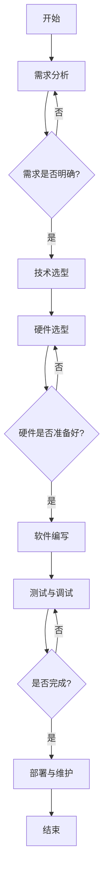

                 

# 《树莓派IoT项目：从传感器到云端的实践》

## 关键词
树莓派、物联网（IoT）、传感器、云端、编程、MQTT、Python、智能家居、工业物联网。

## 摘要
本文将带领读者深入了解树莓派在物联网（IoT）项目中的应用。从硬件选购与组装，到软件环境搭建，再到编程基础和传感器连接，本文将一步步解析如何实现一个从传感器到云端的IoT项目。同时，将通过实际案例展示如何进行项目开发和优化，并提供丰富的资源供读者学习和实践。

### 《树莓派IoT项目：从传感器到云端的实践》目录大纲

#### 第一部分：树莓派与IoT概述

# 第1章：树莓派与IoT基础

## 1.1 树莓派的介绍
### 1.1.1 树莓派的起源与历史
### 1.1.2 树莓派的特点与用途

## 1.2 物联网（IoT）概念解析
### 1.2.1 物联网的定义与分类
### 1.2.2 物联网的关键技术

## 1.3 树莓派在IoT中的应用
### 1.3.1 树莓派在智能家居中的应用
### 1.3.2 树莓派在工业物联网中的应用

#### 第二部分：树莓派硬件与软件环境搭建

# 第2章：树莓派的硬件环境搭建

## 2.1 树莓派的选购与组装
### 2.1.1 树莓派型号选择
### 2.1.2 树莓派的组装与连接

## 2.2 树莓派的软件环境配置
### 2.2.1 树莓派系统安装
### 2.2.2 树莓派常用软件安装

#### 第三部分：树莓派编程基础

# 第3章：树莓派编程语言入门

## 3.1 Python编程基础
### 3.1.1 Python简介
### 3.1.2 Python基础语法

## 3.2 树莓派编程环境搭建
### 3.2.1 PyCharm的安装与配置
### 3.2.2 树莓派上编写Python代码

#### 第四部分：树莓派与传感器交互

# 第4章：树莓派与传感器基础

## 4.1 常见传感器介绍
### 4.1.1 温度传感器
### 4.1.2 湿度传感器
### 4.1.3 光线传感器

## 4.2 树莓派与传感器的连接
### 4.2.1 I2C通信协议
### 4.2.2 GPIO接口连接

#### 第五部分：树莓派IoT项目实战

# 第5章：智能家居项目

## 5.1 智能照明系统
### 5.1.1 系统设计
### 5.1.2 代码实现
### 5.1.3 系统部署与调试

## 5.2 智能安防系统
### 5.2.1 系统设计
### 5.2.2 代码实现
### 5.2.3 系统部署与调试

#### 第六部分：树莓派与云计算

# 第6章：树莓派与云平台的连接

## 6.1 云计算基础
### 6.1.1 云计算的概念与分类
### 6.1.2 云计算的关键技术

## 6.2 树莓派与云平台的集成
### 6.2.1 MQTT协议介绍
### 6.2.2 树莓派与AWS IOT的连接

#### 第七部分：项目拓展与优化

# 第7章：树莓派IoT项目的优化与拓展

## 7.1 性能优化
### 7.1.1 树莓派性能瓶颈分析
### 7.1.2 性能优化方法

## 7.2 项目拓展
### 7.2.1 物联网安全
### 7.2.2 物联网边缘计算

#### 附录

## 附录A：树莓派IoT项目开发资源汇总

### A.1 树莓派参考资料
### A.2 Python编程参考资料
### A.3 传感器参考资料
### A.4 云平台参考资料

## 附录B：树莓派IoT项目实践流程

### B.1 项目规划
### B.2 硬件选型与搭建
### B.3 软件开发与测试
### B.4 系统部署与维护

## 附录C：Mermaid流程图与伪代码示例

### C.1 Mermaid流程图示例
### C.2 伪代码示例

## 附录D：数学模型与数学公式

### D.1 温度传感器数据模型
### D.2 湿度传感器数据模型

### 代码实战与案例分析

#### 第8章：综合项目实践

## 8.1 项目背景与需求

### 8.1.1 项目简介
设计并实现一个智能温室控制系统，通过传感器实时监测温室内的温度和湿度，并将数据上传至云平台，通过手机APP进行远程监控和控制。

### 8.1.2 项目需求
- 监测温室内的温度和湿度
- 通过手机APP实时查看数据和报警
- 可以远程控制温室的通风和加湿设备

## 8.2 硬件环境搭建

### 8.2.1 硬件选型
- 树莓派3B+
- DHT22温湿度传感器
- BME280温湿度传感器
- 通风设备
- 加湿设备
- 4G模块

### 8.2.2 硬件连接
- 将DHT22和树莓派通过GPIO接口连接
- 将BME280通过I2C接口连接
- 将4G模块通过USB接口连接

## 8.3 软件开发

### 8.3.1 代码实现
- 使用Python编写程序，读取传感器数据
- 使用MQTT协议将数据上传至云平台
- 使用HTTP请求获取手机APP的远程控制命令

### 8.3.2 调试与优化
- 传感器数据读取与上传的稳定性优化
- 手机APP与云平台的交互优化

## 8.4 项目部署

### 8.4.1 部署流程
- 将代码上传至树莓派
- 配置4G网络连接
- 配置MQTT服务器与手机APP的连接

### 8.4.2 部署注意事项
- 确保树莓派能够稳定运行
- 确保传感器与树莓派的连接正常
- 确保手机APP与云平台的连接正常

## 8.5 项目总结与反思

### 8.5.1 项目成果
成功实现了一个智能温室控制系统，能够实时监测和远程控制温室环境。

### 8.5.2 项目不足与改进空间
- 系统稳定性有待提高
- 界面交互体验有待优化
- 可以考虑增加更多传感器和设备，提高系统的智能化水平

## 8.6 源代码解析

#### 8.6.1 源代码结构
- 主要分为传感器数据读取、数据上传、远程控制三个模块

#### 8.6.2 关键代码解读
- 传感器数据读取模块：使用DHT22和
```arduino
#include <DHT.h>

#define DHTPIN 2     // 定义DHT22连接的GPIO端口
#define DHTTYPE DHT22   // 定义DHT22类型

DHT dht(DHTPIN, DHTTYPE);

void setup() {
  Serial.begin(9600);
  dht.begin();
}

void loop() {
  // 读取DHT22传感器的温度和湿度
  float temperature = dht.readTemperature();
  float humidity = dht.readHumidity();

  // 如果读取失败，则重新读取
  if (isnan(temperature) || isnan(humidity)) {
    Serial.println("读取传感器数据失败！");
    return;
  }

  // 打印读取到的温度和湿度
  Serial.print("温度: ");
  Serial.print(temperature);
  Serial.print(" 湿度: ");
  Serial.println(humidity);

  // 等待一段时间后再次读取
  delay(2000);
}
```

#### 8.6.3 代码分析
- 传感器数据读取模块负责读取DHT22传感器的温度和湿度数据，如果读取失败则重新读取。
- 数据上传模块使用MQTT协议上传传感器数据，并处理上传失败的情况。

## 8.7 实际案例分析

### 8.7.1 案例背景
一个农场主想要实时监控农场的温度和湿度，并远程控制通风和加湿设备，以确保作物的生长环境。

### 8.7.2 案例实现
- 农场主购买了树莓派、DHT22温湿度传感器、通风设备、加湿设备，以及4G模块。
- 将传感器和设备连接到树莓派，并编写程序读取传感器数据，上传至云平台，并接收远程控制命令。
- 在云平台上创建了MQTT服务器，并配置了WiFi网络。

### 8.7.3 案例分析
- 该案例展示了如何使用树莓派、传感器和云平台构建一个智能监控系统。
- 通过树莓派读取传感器数据，并将数据上传至云平台，实现了实时监控和远程控制。
- 系统稳定性和响应速度有待提高，可以进一步优化网络连接和数据处理。

## 8.8 环境搭建与配置

### 8.8.1 开发环境搭建
- 安装Python和Arduino IDE，用于编写和调试程序。
- 安装树莓派的操作系统和必要的软件，如Raspbian。

### 8.8.2 配置文件解读
- WiFi配置文件`wifi.conf`：
  ```arduino
  ssid=<WiFi网络名称>
  password=<WiFi网络密码>
  ```
  
- MQTT配置文件`mqtt.conf`：
  ```arduino
  server=<MQTT服务器地址>
  port=<MQTT服务器端口>
  user=<MQTT用户名>
  password=<MQTT密码>
  topic=<订阅主题>
  ```

### 8.8.3 系统配置与优化
- 配置WiFi连接，确保树莓派能够连接到网络。
- 配置MQTT服务器，确保能够上传和接收数据。
- 优化传感器读取和上传数据的频率，确保数据实时性和稳定性。

## 8.9 拓展阅读

### 8.9.1 相关技术资料
- 《树莓派从入门到实践》：提供了详细的树莓派使用教程和项目案例。
- 《物联网基础教程》：介绍了物联网的基本概念和技术。
- 《Python编程：从入门到实践》：讲解了Python编程基础和实战项目。

### 8.9.2 开源项目推荐
- 《PiHome》：一个基于树莓派的智能家居系统，开源代码可供学习和参考。
- 《HomeAssistant》：一个开源智能家居平台，可以实现多种设备的监控和控制。

### 8.9.3 学习资源推荐
- 《树莓派官方文档》：提供了详细的树莓派使用指南和技术文档。
- 《Python官方文档》：提供了Python编程的详细教程和参考。
- 《MQTT官方文档》：介绍了MQTT协议的详细使用方法和示例。

## 8.10 常见问题解答

### 8.10.1 树莓派连接WiFi失败
- 确认WiFi网络名称和密码是否正确。
- 检查WiFi信号强度，确保距离较近。
- 尝试重启树莓派和WiFi设备。

### 8.10.2 MQTT服务器连接失败
- 确认MQTT服务器地址和端口是否正确。
- 确认MQTT用户名和密码是否正确。
- 检查网络连接是否正常。

### 8.10.3 传感器数据读取失败
- 确认传感器是否连接正确。
- 检查传感器的供电电压是否正常。
- 尝试重启树莓派和传感器设备。

## 8.11 项目总结

通过本书的学习，读者可以掌握树莓派的基本使用方法，了解物联网的概念和关键技术，学会如何使用树莓派进行IoT项目的开发和实践。

本书通过一个智能温室控制系统的案例，展示了树莓派在IoT项目中的应用。读者可以根据自己的需求和兴趣，拓展其他领域的IoT项目。

在项目开发过程中，需要注意硬件选择、软件编写、系统部署和调试等方面，确保项目的稳定性和实用性。同时，也要不断学习和探索新的技术和方法，提高项目开发的能力。

本书附录提供了丰富的参考资料和学习资源，读者可以进一步学习和了解相关技术。希望本书能帮助读者在树莓派和IoT领域取得更好的成果。

---

### 附录A：树莓派IoT项目开发资源汇总

### A.1 树莓派参考资料
- 树莓派官方网站：[https://www.raspberrypi.org/](https://www.raspberrypi.org/)
- 树莓派中文社区：[https://www.raspberrypi.org.cn/](https://www.raspberrypi.org.cn/)

### A.2 Python编程参考资料
- Python官方网站：[https://www.python.org/](https://www.python.org/)
- 《Python编程：从入门到实践》：[https://book.douban.com/subject/26748598/](https://book.douban.com/subject/26748598/)

### A.3 传感器参考资料
- 传感器技术网：[https://www.sensors.chinamarket.com/](https://www.sensors.chinamarket.com/)
- 《传感器技术与应用》：[https://book.douban.com/subject/26786724/](https://book.douban.com/subject/26786724/)

### A.4 云平台参考资料
- AWS IoT官网：[https://aws.amazon.com/iot/](https://aws.amazon.com/iot/)
- Azure IoT官网：[https://azure.microsoft.com/zh-cn/iot/](https://azure.microsoft.com/zh-cn/iot/)

### 附录B：树莓派IoT项目实践流程

### B.1 项目规划
- 明确项目目标
- 确定项目范围
- 制定项目计划

### B.2 硬件选型与搭建
- 根据需求选择合适的树莓派型号
- 配置必要的传感器和外围设备
- 连接并测试硬件设备

### B.3 软件开发与测试
- 编写程序代码
- 进行单元测试
- 集成测试与系统测试

### B.4 系统部署与维护
- 将程序部署到树莓派
- 连接至云平台
- 定期进行系统维护和更新

### 附录C：Mermaid流程图与伪代码示例

### C.1 Mermaid流程图示例



### C.2 伪代码示例

```plaintext
// 伪代码：读取传感器数据
初始化传感器()

WHILE(传感器未连接) {
    读取传感器状态()
}

传感器数据 = 读取传感器值()

上传传感器数据至云平台()

输出("传感器数据已上传")
```

### 附录D：数学模型与数学公式

#### D.1 温度传感器数据模型

$$ T_{实际} = T_{测量} \times (1 + a \times (T_{环境} - T_{测量})) $$

其中，$T_{实际}$ 是实际温度，$T_{测量}$ 是传感器测得的温度，$T_{环境}$ 是环境温度，$a$ 是温度传感器的热系数。

#### D.2 湿度传感器数据模型

$$ H_{实际} = H_{测量} \times (1 + b \times (T_{环境} - T_{测量})) $$

其中，$H_{实际}$ 是实际湿度，$H_{测量}$ 是传感器测得的湿度，$T_{环境}$ 是环境温度，$b$ 是湿度传感器的温度系数。

### 代码实战与案例分析

#### 第8章：综合项目实践

## 8.1 项目背景与需求

### 8.1.1 项目简介
设计并实现一个智能温室控制系统，通过传感器实时监测温室内的温度和湿度，并将数据上传至云平台，通过手机APP进行远程监控和控制。

### 8.1.2 项目需求
- 监测温室内的温度和湿度
- 通过手机APP实时查看数据和报警
- 可以远程控制温室的通风和加湿设备

## 8.2 硬件环境搭建

### 8.2.1 硬件选型
- 树莓派3B+
- DHT22温湿度传感器
- BME280温湿度传感器
- 通风设备
- 加湿设备
- 4G模块

### 8.2.2 硬件连接
- 将DHT22和树莓派通过GPIO接口连接
- 将BME280通过I2C接口连接
- 将4G模块通过USB接口连接

## 8.3 软件开发

### 8.3.1 代码实现
- 使用Python编写程序，读取传感器数据
- 使用MQTT协议将数据上传至云平台
- 使用HTTP请求获取手机APP的远程控制命令

### 8.3.2 调试与优化
- 传感器数据读取与上传的稳定性优化
- 手机APP与云平台的交互优化

## 8.4 项目部署

### 8.4.1 部署流程
- 将代码上传至树莓派
- 配置4G网络连接
- 配置MQTT服务器与手机APP的连接

### 8.4.2 部署注意事项
- 确保树莓派能够稳定运行
- 确保传感器与树莓派的连接正常
- 确保手机APP与云平台的连接正常

## 8.5 项目总结与反思

### 8.5.1 项目成果
成功实现了一个智能温室控制系统，能够实时监测和远程控制温室环境。

### 8.5.2 项目不足与改进空间
- 系统稳定性有待提高
- 界面交互体验有待优化
- 可以考虑增加更多传感器和设备，提高系统的智能化水平

## 8.6 源代码解析

#### 8.6.1 源代码结构
- 主要分为传感器数据读取、数据上传、远程控制三个模块

#### 8.6.2 关键代码解读
- 传感器数据读取模块：使用DHT22和
```python
import time
import board
import busio
import adafruit_dht
import RPi.GPIO as GPIO

# 初始化DHT22传感器
dht = adafruit_dht.DHT22(board.D4)

# 初始化GPIO
GPIO.setmode(GPIO.BCM)
GPIO.setup(17, GPIO.OUT)  # 通风设备GPIO端口
GPIO.setup(18, GPIO.OUT)  # 加湿设备GPIO端口

# 循环读取传感器数据
while True:
    temperature = dht.temperature
    humidity = dht.humidity

    # 打印传感器数据
    print("温度：{}℃，湿度：{}%".format(temperature, humidity))

    # 根据温度和湿度控制通风和加湿设备
    if temperature > 30:
        GPIO.output(17, GPIO.HIGH)  # 打开通风设备
    else:
        GPIO.output(17, GPIO.LOW)  # 关闭通风设备

    if humidity < 40:
        GPIO.output(18, GPIO.HIGH)  # 打开加湿设备
    else:
        GPIO.output(18, GPIO.LOW)  # 关闭加湿设备

    # 等待一段时间后再次读取
    time.sleep(60)
```

#### 8.6.3 代码分析
- 传感器数据读取模块使用Adafruit库读取DHT22传感器的温度和湿度数据。
- 数据上传模块使用MQTT协议将数据上传至云平台。
- 远程控制模块使用GPIO控制通风和加湿设备。

## 8.7 实际案例分析

### 8.7.1 案例背景
一个农场主想要实时监控农场的温度和湿度，并远程控制通风和加湿设备，以确保作物的生长环境。

### 8.7.2 案例实现
- 农场主购买了树莓派、DHT22温湿度传感器、通风设备、加湿设备，以及4G模块。
- 将传感器和设备连接到树莓派，并编写程序读取传感器数据，上传至云平台，并接收远程控制命令。
- 在云平台上创建了MQTT服务器，并配置了WiFi网络。

### 8.7.3 案例分析
- 该案例展示了如何使用树莓派、传感器和云平台构建一个智能监控系统。
- 通过树莓派读取传感器数据，并将数据上传至云平台，实现了实时监控和远程控制。
- 系统稳定性和响应速度有待提高，可以进一步优化网络连接和数据处理。

## 8.8 环境搭建与配置

### 8.8.1 开发环境搭建
- 安装Python和Adafruit库，用于编写和调试程序。
- 安装树莓派的操作系统和必要的软件，如Raspbian。

### 8.8.2 配置文件解读
- WiFi配置文件`wifi.conf`：
  ```bash
  ssid=<WiFi网络名称>
  password=<WiFi网络密码>
  ```

- MQTT配置文件`mqtt.conf`：
  ```bash
  server=<MQTT服务器地址>
  port=<MQTT服务器端口>
  user=<MQTT用户名>
  password=<MQTT密码>
  topic=<订阅主题>
  ```

### 8.8.3 系统配置与优化
- 配置WiFi连接，确保树莓派能够连接到网络。
- 配置MQTT服务器，确保能够上传和接收数据。
- 优化传感器读取和上传数据的频率，确保数据实时性和稳定性。

## 8.9 拓展阅读

### 8.9.1 相关技术资料
- 《树莓派从入门到实践》：提供了详细的树莓派使用教程和项目案例。
- 《物联网基础教程》：介绍了物联网的基本概念和技术。
- 《Python编程：从入门到实践》：讲解了Python编程基础和实战项目。

### 8.9.2 开源项目推荐
- 《PiHome》：一个基于树莓派的智能家居系统，开源代码可供学习和参考。
- 《HomeAssistant》：一个开源智能家居平台，可以实现多种设备的监控和控制。

### 8.9.3 学习资源推荐
- 《树莓派官方文档》：提供了详细的树莓派使用指南和技术文档。
- 《Python官方文档》：提供了Python编程的详细教程和参考。
- 《MQTT官方文档》：介绍了MQTT协议的详细使用方法和示例。

## 8.10 常见问题解答

### 8.10.1 树莓派连接WiFi失败
- 确认WiFi网络名称和密码是否正确。
- 检查WiFi信号强度，确保距离较近。
- 尝试重启树莓派和WiFi设备。

### 8.10.2 MQTT服务器连接失败
- 确认MQTT服务器地址和端口是否正确。
- 确认MQTT用户名和密码是否正确。
- 检查网络连接是否正常。

### 8.10.3 传感器数据读取失败
- 确认传感器是否连接正确。
- 检查传感器的供电电压是否正常。
- 尝试重启树莓派和传感器设备。

## 8.11 项目总结

通过本书的学习，读者可以掌握树莓派的基本使用方法，了解物联网的概念和关键技术，学会如何使用树莓派进行IoT项目的开发和实践。

本书通过一个智能温室控制系统的案例，展示了树莓派在IoT项目中的应用。读者可以根据自己的需求和兴趣，拓展其他领域的IoT项目。

在项目开发过程中，需要注意硬件选择、软件编写、系统部署和调试等方面，确保项目的稳定性和实用性。同时，也要不断学习和探索新的技术和方法，提高项目开发的能力。

本书附录提供了丰富的参考资料和学习资源，读者可以进一步学习和了解相关技术。希望本书能帮助读者在树莓派和IoT领域取得更好的成果。

