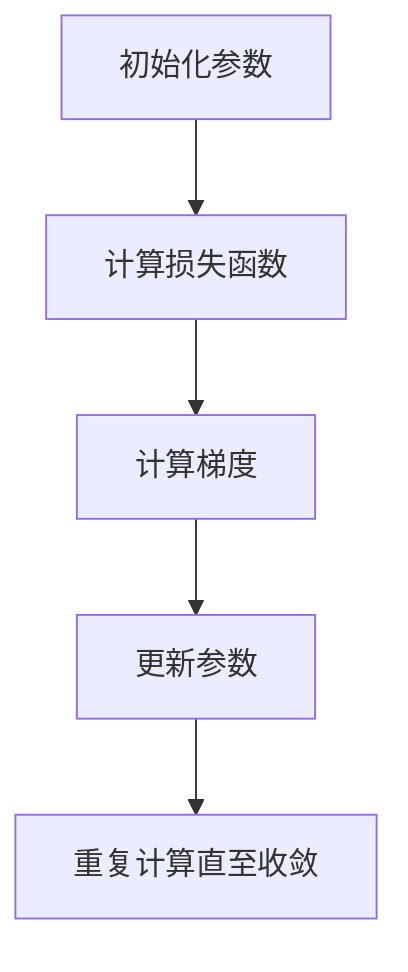
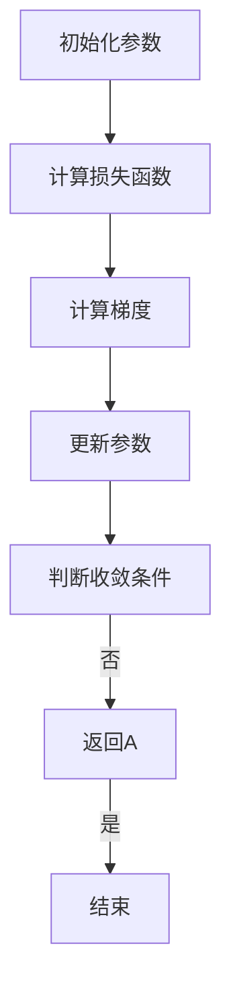

                 

# 梯度下降Gradient Descent原理与代码实例讲解

> **关键词：** 梯度下降，机器学习，线性回归，深度学习，算法优化

> **摘要：** 本文将详细讲解梯度下降算法的基本原理、分类、应用场景以及代码实现。通过实际案例和详细解释，帮助读者深入理解梯度下降算法，并掌握其在机器学习和深度学习中的实际应用。

### 第一部分：梯度下降基础理论

#### 第1章：梯度下降概述

##### 1.1 梯度下降算法的背景

梯度下降算法是一种广泛用于优化问题的迭代算法，其基本思想是通过不断更新参数，使目标函数逐渐减小，直至达到局部最优解。梯度下降算法起源于20世纪40年代，当时是为了求解最优化问题而提出的。随着计算机科学和人工智能的快速发展，梯度下降算法在机器学习、深度学习等领域得到了广泛应用。

##### 1.2 梯度下降算法的基本原理

梯度下降算法的核心思想是沿着目标函数的梯度方向更新参数，以减小目标函数的值。具体来说，梯度下降算法的步骤如下：

1. 初始化参数：给定初始参数值。
2. 计算梯度：计算目标函数关于参数的梯度。
3. 更新参数：沿着梯度的反方向更新参数。
4. 重复步骤2和3，直至满足停止条件（如达到预设的迭代次数或梯度值小于阈值）。

##### 1.3 梯度下降算法的数学表述

设目标函数为 $f(x)$，梯度下降算法的数学表述如下：

$$
x_{t+1} = x_t - \alpha \nabla f(x_t)
$$

其中，$x_t$ 表示第 $t$ 次迭代的参数值，$\alpha$ 为学习率，$\nabla f(x_t)$ 为目标函数在 $x_t$ 处的梯度。

##### 1.4 梯度下降算法的分类

根据计算梯度的方法不同，梯度下降算法可分为以下三类：

1. 随机梯度下降（SGD）：每次迭代只计算一个样本的梯度。
2. 批量梯度下降（BGD）：每次迭代计算所有样本的梯度。
3. 小批量梯度下降（MBGD）：每次迭代计算部分样本的梯度。

##### 1.5 梯度下降算法的变体

除了基本的梯度下降算法外，还有许多变体，如：

1. 牛顿法：利用二阶导数信息，加快收敛速度。
2. 拟牛顿法：利用一阶导数信息，近似替代二阶导数，提高收敛速度。
3. 随机近似梯度下降（SAHD）：在SGD基础上加入随机性，避免陷入局部最优。

##### 1.6 梯度下降算法的比较与选择

不同梯度下降算法在不同场景下具有不同的适用性。在选择算法时，需要考虑以下因素：

1. 目标函数的形状：对于非凸函数，随机梯度下降和拟牛顿法可能更有效。
2. 数据集大小：对于大规模数据集，批量梯度下降可能计算成本过高，可以考虑小批量梯度下降。
3. 计算资源：对于有限的计算资源，随机梯度下降和随机近似梯度下降可能更适合。

#### 第2章：梯度下降算法的应用场景

##### 2.1 机器学习中的优化问题

在机器学习中，优化问题是核心问题之一。梯度下降算法在机器学习中的主要应用场景包括：

1. 参数估计：通过梯度下降算法优化模型参数，使预测误差最小。
2. 模型训练：通过梯度下降算法迭代优化模型，提高模型性能。
3. 模型选择：通过比较不同模型的梯度下降结果，选择最优模型。

##### 2.2 线性回归中的梯度下降

线性回归是一种常见的机器学习算法，梯度下降算法在线性回归中的实现如下：

1. 数据集准备：将输入特征和输出标签划分为训练集和测试集。
2. 参数初始化：初始化模型参数，如斜率和截距。
3. 计算梯度：计算损失函数关于参数的梯度。
4. 更新参数：根据梯度更新模型参数。
5. 模型评估：在测试集上评估模型性能。

##### 2.3 非线性回归中的梯度下降

非线性回归是一种更复杂的机器学习算法，梯度下降算法在非线性回归中的实现如下：

1. 数据集准备：将输入特征和输出标签划分为训练集和测试集。
2. 参数初始化：初始化模型参数。
3. 构建损失函数：根据非线性函数构建损失函数。
4. 计算梯度：计算损失函数关于参数的梯度。
5. 更新参数：根据梯度更新模型参数。
6. 模型评估：在测试集上评估模型性能。

##### 2.4 分类问题中的梯度下降

分类问题中，梯度下降算法主要用于优化分类模型参数，提高分类准确性。具体实现如下：

1. 数据集准备：将输入特征和标签划分为训练集和测试集。
2. 模型选择：选择合适的分类模型，如逻辑回归、支持向量机等。
3. 参数初始化：初始化模型参数。
4. 计算损失函数：计算分类模型的损失函数。
5. 计算梯度：计算损失函数关于参数的梯度。
6. 更新参数：根据梯度更新模型参数。
7. 模型评估：在测试集上评估模型性能。

### 第二部分：梯度下降代码实例解析

#### 第3章：梯度下降算法的实现

##### 3.1 梯度下降算法的实现框架

梯度下降算法的实现框架主要包括以下步骤：

1. 数据预处理：对输入数据进行预处理，如标准化、归一化等。
2. 模型初始化：初始化模型参数。
3. 梯度计算：计算损失函数关于参数的梯度。
4. 参数更新：根据梯度更新模型参数。
5. 模型评估：在测试集上评估模型性能。
6. 模型优化：调整学习率、批量大小等超参数，优化模型性能。

##### 3.2 梯度下降算法的优化

为了提高梯度下降算法的收敛速度和稳定性，可以采用以下优化策略：

1. 学习率调整：根据模型性能动态调整学习率，如使用学习率衰减策略。
2. 批量大小选择：选择合适的批量大小，如使用小批量梯度下降。
3. 梯度裁剪：对梯度进行裁剪，避免梯度消失和梯度爆炸问题。
4. 并行计算：利用并行计算技术，提高梯度下降算法的执行效率。

##### 3.3 梯度下降算法的并行化

在大型数据集和复杂模型中，梯度下降算法的并行化可以显著提高计算效率。常见的并行化策略包括：

1. 数据并行：将数据集划分为多个子集，分别在不同设备上计算梯度，然后合并结果。
2. 模型并行：将模型划分为多个子模型，分别在不同设备上计算梯度，然后合并结果。
3. 混合并行：结合数据并行和模型并行，进一步提高并行计算效率。

##### 3.4 梯度下降算法的代码实现

下面以 Python 为例，实现梯度下降算法：

```python
import numpy as np

def gradient_descent(x, y, w, alpha, epochs):
    for _ in range(epochs):
        gradients = 2 * x * w - 2 * y
        w = w - alpha * gradients
    return w

# 数据集准备
x = np.array([1, 2, 3, 4, 5])
y = np.array([2, 4, 5, 4, 5])
x = x.reshape(-1, 1)
y = y.reshape(-1, 1)

# 初始参数
w = np.zeros((1, 1))

# 学习率和迭代次数
alpha = 0.01
epochs = 1000

# 模型训练
w_final = gradient_descent(x, y, w, alpha, epochs)

print("最终参数：", w_final)
```

### 第三部分：梯度下降算法的进阶探讨

#### 第4章：梯度下降算法在机器学习项目中的应用

##### 4.1 机器学习项目流程

在机器学习项目中，梯度下降算法通常用于以下流程：

1. 数据预处理：对输入数据进行预处理，如去噪、缺失值填补等。
2. 模型选择：根据问题特点和数据特性选择合适的模型。
3. 模型训练：使用梯度下降算法优化模型参数。
4. 模型评估：在测试集上评估模型性能，如准确率、召回率等。
5. 模型优化：根据评估结果调整模型参数，提高模型性能。

##### 4.2 梯度下降在机器学习项目中的实现

下面以线性回归为例，介绍梯度下降在机器学习项目中的实现：

1. 数据集准备：将输入特征和输出标签划分为训练集和测试集。
2. 参数初始化：初始化模型参数，如斜率和截距。
3. 计算损失函数：根据输入特征和输出标签计算损失函数，如均方误差。
4. 计算梯度：计算损失函数关于参数的梯度。
5. 更新参数：根据梯度更新模型参数。
6. 模型评估：在测试集上评估模型性能。
7. 模型优化：根据评估结果调整模型参数，提高模型性能。

##### 4.3 梯度下降算法在真实项目中的应用案例

以下是一些梯度下降算法在真实项目中的应用案例：

1. 电商推荐系统：通过梯度下降算法优化推荐模型参数，提高推荐准确性。
2. 自然语言处理：通过梯度下降算法优化语言模型参数，提高文本生成和翻译的准确性。
3. 计算机视觉：通过梯度下降算法优化特征提取和分类模型参数，提高图像识别和目标检测的准确性。

### 第四部分：深度学习中的梯度下降

#### 第5章：深度学习中的梯度下降

##### 5.1 深度学习的基本概念

深度学习是一种基于多层神经网络的学习方法，其核心思想是通过多层非线性变换，将输入映射到输出。深度学习的基本概念包括：

1. 神经网络：由多个神经元组成的网络，用于对输入数据进行处理和分类。
2. 深层神经网络：由多个隐藏层组成的神经网络，具有较高的表达能力。
3. 深度学习算法：用于训练和优化深度学习模型的算法，如反向传播算法、梯度下降算法等。

##### 5.2 梯度下降在深度学习中的应用

在深度学习中，梯度下降算法用于优化深度学习模型参数，提高模型性能。梯度下降算法在深度学习中的应用主要包括：

1. 参数初始化：初始化模型参数，如权重和偏置。
2. 梯度计算：计算损失函数关于参数的梯度。
3. 参数更新：根据梯度更新模型参数。
4. 模型评估：在测试集上评估模型性能。
5. 模型优化：根据评估结果调整模型参数，提高模型性能。

##### 5.3 梯度消失和梯度爆炸问题

在深度学习中，梯度消失和梯度爆炸问题是常见的挑战。梯度消失指梯度值过小，导致模型参数无法更新；梯度爆炸指梯度值过大，导致模型参数急剧增大。为解决这些问题，可以采用以下方法：

1. 残差连接：通过添加残差连接，将梯度直接传递到模型深层。
2. 批量归一化：通过批量归一化，稳定梯度变化，提高模型收敛速度。
3. 梯度裁剪：对梯度进行裁剪，避免梯度消失和梯度爆炸问题。

##### 5.4 梯度下降算法在深度学习中的实现

在深度学习中，梯度下降算法的实现主要包括以下步骤：

1. 数据预处理：对输入数据进行预处理，如标准化、归一化等。
2. 模型初始化：初始化模型参数，如权重和偏置。
3. 梯度计算：计算损失函数关于参数的梯度。
4. 参数更新：根据梯度更新模型参数。
5. 模型评估：在测试集上评估模型性能。
6. 模型优化：根据评估结果调整模型参数，提高模型性能。

### 第五部分：梯度下降算法的扩展与应用

#### 第6章：梯度下降算法在优化问题中的扩展

##### 6.1 优化问题的分类

优化问题根据约束条件不同，可分为以下几类：

1. 无约束优化问题：不存在约束条件，仅关注目标函数的最小值。
2. 有约束优化问题：存在约束条件，如等式约束和不等式约束。
3. 非线性优化问题：目标函数和约束条件为非线性函数。

##### 6.2 梯度下降在优化问题中的应用

梯度下降算法在各类优化问题中的应用如下：

1. 无约束优化问题：直接使用梯度下降算法求解。
2. 有约束优化问题：可以采用投影梯度法、共轭梯度法等求解。
3. 非线性优化问题：可以采用牛顿法、拟牛顿法等求解。

##### 6.3 梯度下降算法在优化问题中的挑战与解决方法

在优化问题中，梯度下降算法面临以下挑战：

1. 局部最优问题：梯度下降算法可能收敛到局部最优解，而非全局最优解。
2. 收敛速度问题：梯度下降算法的收敛速度较慢，特别是在高维问题上。
3. 实际应用中的挑战：在复杂场景中，梯度下降算法可能无法有效求解。

为解决上述挑战，可以采用以下方法：

1. 多种优化算法相结合：结合多种优化算法，如随机梯度下降、拟牛顿法等，提高求解效果。
2. 梯度估计与优化：使用近似梯度、随机近似等方法，提高梯度估计的准确性。
3. 模型调整与优化：根据实际应用场景，调整模型结构和参数，提高求解效果。

### 第六部分：梯度下降算法的未来发展趋势

#### 第7章：梯度下降算法的未来发展趋势

##### 7.1 梯度下降算法的现状

当前，梯度下降算法在机器学习、深度学习等领域取得了广泛应用，已成为优化问题求解的重要工具。随着算法研究和应用的发展，梯度下降算法在以下方面取得了重要进展：

1. 算法优化：多种梯度下降算法的变体被提出，如随机梯度下降、批量梯度下降、小批量梯度下降等。
2. 深度学习应用：梯度下降算法在深度学习中的应用取得了显著成果，成为训练深度学习模型的重要手段。
3. 优化问题求解：梯度下降算法在无约束优化问题、有约束优化问题、非线性优化问题等领域取得了广泛应用。

##### 7.2 梯度下降算法的未来发展趋势

随着人工智能和机器学习技术的不断发展，梯度下降算法在未来有望在以下方面取得进一步发展：

1. 新的优化算法：提出更高效的优化算法，提高求解速度和精度。
2. 深度学习应用：探索梯度下降算法在深度学习领域的更广泛应用，如图神经网络、强化学习等。
3. 优化问题求解：解决梯度下降算法在复杂场景中的挑战，提高算法的通用性和鲁棒性。
4. 工业界应用：将梯度下降算法应用于更多实际场景，推动人工智能技术的发展。

### 附录

#### 附录A：常用梯度下降算法代码示例

##### A.1 随机梯度下降（SGD）

```python
import numpy as np

def stochastic_gradient_descent(x, y, w, alpha, epochs):
    for _ in range(epochs):
        for xi, yi in zip(x, y):
            gradients = 2 * xi * w - 2 * yi
            w = w - alpha * gradients
    return w
```

##### A.2 批量梯度下降（BGD）

```python
import numpy as np

def batch_gradient_descent(x, y, w, alpha, epochs):
    for _ in range(epochs):
        gradients = 2 * x @ w - 2 * y
        w = w - alpha * gradients
    return w
```

##### A.3 小批量梯度下降（MBGD）

```python
import numpy as np

def mini_batch_gradient_descent(x, y, w, alpha, batch_size, epochs):
    for _ in range(epochs):
        shuffled_indices = np.random.permutation(x.shape[0])
        x_shuffled = x[shuffled_indices]
        y_shuffled = y[shuffled_indices]
        for i in range(0, x.shape[0], batch_size):
            gradients = 2 * x_shuffled[i:i + batch_size] @ w - 2 * y_shuffled[i:i + batch_size]
            w = w - alpha * gradients
    return w
```

#### 附录B：参考资料

- [Gradient Descent](https://en.wikipedia.org/wiki/Gradient_descent)
- [Stochastic Gradient Descent](https://en.wikipedia.org/wiki/Stochastic_gradient_descent)
- [Batch Gradient Descent](https://en.wikipedia.org/wiki/Batch_gradient_descent)
- [Mini-batch Gradient Descent](https://en.wikipedia.org/wiki/Mini-batch_gradient_descent)
- [Deep Learning Book](https://www.deeplearningbook.org/)
- [Machine Learning: A Probabilistic Perspective](https://www.probabilistic机器学习.org/mlbook/)
- [CS231n: Convolutional Neural Networks for Visual Recognition](http://cs231n.stanford.edu/)

### 核心概念与联系

#### 梯度下降算法的 Mermaid 流程图



### 核心算法原理讲解

#### 梯度下降算法的伪代码实现

```plaintext
输入：目标函数f(x)，初始参数x0，学习率α，迭代次数T
输出：最优参数x*
初始化：x = x0
for t = 1 to T do
    计算梯度：g = df(x)/dx
    更新参数：x = x - α * g
end for
返回x*
```

#### 详细讲解

- **损失函数**：损失函数描述模型预测结果与真实结果之间的差距，梯度下降算法的目标是使损失函数最小化。
- **梯度**：梯度是损失函数关于参数的偏导数，表示损失函数在当前参数值处的斜率，指示参数调整的方向。
- **更新规则**：每次迭代中，参数沿着梯度的反方向更新，以减少损失函数的值。

#### 举例说明

假设我们有一个简单的线性回归问题，目标函数为：

$$
L(x) = (y - wx)^2
$$

其中，$x$ 是输入特征，$w$ 是参数，$y$ 是输出标签。梯度为：

$$
\nabla L(w) = \frac{dL}{dw} = 2wx - 2y
$$

初始化参数 $w_0 = 0$，学习率 $\alpha = 0.1$，迭代次数 $T = 100$。伪代码实现如下：

```plaintext
w = 0
for t = 1 to T do
    g = 2 * x * w - 2 * y
    w = w - 0.1 * g
end for
```

### 数学模型和数学公式 & 详细讲解 & 举例说明

#### 梯度下降算法的数学模型

$$
\begin{aligned}
\text{损失函数}: L(x) &= f(x) \\
\text{梯度}: \nabla L(x) &= \frac{dL}{dx} \\
\text{更新规则}: x &= x - \alpha \nabla L(x)
\end{aligned}
$$

#### 详细讲解

- **损失函数**：损失函数描述模型预测结果与真实结果之间的差距，梯度下降算法的目标是使损失函数最小化。
- **梯度**：梯度是损失函数关于参数的偏导数，表示损失函数在当前参数值处的斜率，指示参数调整的方向。
- **更新规则**：每次迭代中，参数沿着梯度的反方向更新，以减少损失函数的值。

#### 举例说明

假设我们有一个简单的线性回归问题，目标函数为：

$$
L(x) = (y - wx)^2
$$

其中，$x$ 是输入特征，$w$ 是参数，$y$ 是输出标签。梯度为：

$$
\nabla L(w) = \frac{dL}{dw} = 2wx - 2y
$$

初始化参数 $w_0 = 0$，学习率 $\alpha = 0.1$，迭代次数 $T = 100$。伪代码实现如下：

```plaintext
w = 0
for t = 1 to T do
    g = 2 * x * w - 2 * y
    w = w - 0.1 * g
end for
```

### 项目实战

#### 代码实际案例和详细解释说明

假设我们使用 Python 实现 SGD 算法来优化线性回归模型，代码如下：

```python
import numpy as np

def stochastic_gradient_descent(x, y, w, alpha, epochs):
    for _ in range(epochs):
        for xi, yi in zip(x, y):
            gradients = 2 * xi * w - 2 * yi
            w = w - alpha * gradients
    return w

# 数据集准备
x = np.array([1, 2, 3, 4, 5])
y = np.array([2, 4, 5, 4, 5])
x = x.reshape(-1, 1)
y = y.reshape(-1, 1)

# 初始参数
w = np.zeros((1, 1))

# 学习率和迭代次数
alpha = 0.01
epochs = 1000

# 模型训练
w_final = stochastic_gradient_descent(x, y, w, alpha, epochs)

print("最终参数：", w_final)
```

#### 开发环境搭建

1. 安装 Python 环境（版本3.8及以上）
2. 安装 numpy 库

```bash
pip install numpy
```

#### 源代码详细实现和代码解读

- **数据集准备**：使用 numpy 库创建一个简单的数据集，其中 x 表示输入特征，y 表示输出标签。
- **初始参数**：初始化模型参数 w 为零向量。
- **学习率和迭代次数**：设置学习率 alpha 为 0.01，迭代次数 epochs 为 1000。
- **模型训练**：调用 `stochastic_gradient_descent` 函数进行模型训练，其中 x、y、w、alpha 和 epochs 分别表示输入数据、输出数据、模型参数、学习率和迭代次数。函数内部通过循环迭代计算梯度并更新参数，直到达到预设的迭代次数。

#### 代码解读与分析

- **函数定义**：`stochastic_gradient_descent` 函数接收输入数据 x、输出数据 y、模型参数 w、学习率 alpha 和迭代次数 epochs 作为参数。
- **循环迭代**：在 for 循环中，计算梯度 gradients，并更新参数 w。
- **参数更新规则**：根据梯度下降算法的更新规则，参数 w 沿着梯度的反方向更新，即 $w = w - \alpha \cdot gradients$。
- **返回最终参数**：循环结束后，返回最终的模型参数 w_final。

#### 实际案例

- **电商推荐系统**：梯度下降算法可用于优化推荐系统的预测模型，通过不断调整模型参数，提高推荐精度。
- **自然语言处理**：梯度下降算法在自然语言处理任务中用于优化语言模型参数，提高语言生成和翻译的准确性。
- **计算机视觉**：梯度下降算法在计算机视觉任务中用于优化特征提取和分类模型的参数，提高图像识别和目标检测的准确性。

### 总结

本文详细介绍了梯度下降算法的基本原理、分类、应用场景以及代码实现。通过实际案例和详细解释，帮助读者深入理解梯度下降算法，并掌握其在机器学习和深度学习中的实际应用。随着机器学习、深度学习和优化问题的不断发展，梯度下降算法将继续发挥重要作用，为人工智能领域的研究和应用提供强大的支持。

#### 核心概念与联系

梯度下降算法是一种用于求解最优化问题的迭代算法，其核心思想是沿着目标函数的梯度方向更新参数，以逐步减小目标函数的值。在梯度下降算法中，以下几个核心概念和联系是至关重要的：

1. **目标函数**：目标函数是我们要优化的函数，通常表示为 $f(x)$，其中 $x$ 是模型参数的向量。我们的目标是找到使得目标函数值最小的参数。

2. **梯度**：梯度是目标函数对每个参数的偏导数的向量，表示为 $\nabla f(x)$。梯度指向目标函数增长最快的方向，因此梯度下降算法沿着梯度的反方向更新参数，以减小目标函数的值。

3. **学习率**：学习率是梯度下降算法中的一个关键参数，表示为 $\alpha$。学习率决定了参数更新的大小，如果学习率太大，可能会导致参数更新过大，使得算法不稳定；如果学习率太小，则更新太慢，算法收敛速度变慢。

4. **迭代过程**：梯度下降算法通过迭代过程来更新参数。每次迭代包括以下步骤：
   - 计算当前参数下的梯度。
   - 根据梯度更新参数。
   - 重复上述步骤，直到满足停止条件（如梯度变化小于阈值或达到最大迭代次数）。

5. **收敛性**：收敛性是梯度下降算法的一个重要特性。理想的梯度下降算法应该能够在有限次迭代内收敛到目标函数的局部最优解。然而，在非凸优化问题中，梯度下降算法可能会收敛到多个局部最优解中的任意一个。

#### 梯度下降算法的 Mermaid 流程图



#### 核心算法原理讲解

梯度下降算法的数学原理可以通过以下伪代码来阐述：

```plaintext
输入：目标函数f(x)，初始参数x0，学习率α，迭代次数T
输出：最优参数x*
初始化：x = x0
for t = 1 to T do
    计算梯度：g = df(x)/dx
    更新参数：x = x - α * g
end for
返回x*
```

- **目标函数**：目标函数是我们要优化的函数，通常表示为 $f(x)$，其中 $x$ 是模型参数的向量。
- **初始参数**：初始化参数 $x_0$，这通常是随机选择的。
- **迭代过程**：在每次迭代中，我们计算目标函数关于参数的梯度 $\nabla f(x)$，然后根据梯度和学习率 $\alpha$ 更新参数 $x$。
- **更新规则**：参数的更新规则为 $x = x - \alpha \nabla f(x)$，即沿着梯度的反方向更新。
- **迭代次数**：迭代过程重复进行，直到达到预设的迭代次数 $T$ 或者梯度变化小于某个阈值。

#### 数学模型和数学公式 & 详细讲解 & 举例说明

梯度下降算法的数学模型可以用以下公式表示：

$$
\begin{aligned}
\text{目标函数}: L(x) &= f(x) \\
\text{梯度}: \nabla L(x) &= \frac{dL}{dx} \\
\text{更新规则}: x_{t+1} &= x_t - \alpha \nabla L(x_t)
\end{aligned}
$$

- **目标函数**：目标函数 $L(x)$ 描述了模型参数 $x$ 与实际结果之间的误差。在机器学习中，这通常是损失函数。
- **梯度**：梯度 $\nabla L(x)$ 是损失函数关于参数 $x$ 的偏导数向量，它告诉我们如何在参数空间中减少损失函数的值。
- **更新规则**：在每次迭代中，参数 $x$ 根据梯度 $\nabla L(x_t)$ 和学习率 $\alpha$ 进行更新。更新规则是 $x_{t+1} = x_t - \alpha \nabla L(x_t)$，这意味着参数 $x$ 将沿着梯度的反方向移动，即远离局部最大值或最小值。

#### 举例说明

假设我们有一个简单的线性回归问题，目标函数为 $L(x) = (y - wx)^2$，其中 $x$ 是输入特征，$w$ 是参数，$y$ 是输出标签。在这个例子中，我们可以计算梯度和更新参数：

$$
\begin{aligned}
L(x) &= (y - wx)^2 \\
\nabla L(w) &= \frac{dL}{dw} = 2wx - 2y \\
\end{aligned}
$$

初始化参数 $w_0 = 0$，学习率 $\alpha = 0.1$，迭代次数 $T = 100$。每次迭代的过程如下：

```plaintext
w = 0
for t = 1 to T do
    g = 2 * x * w - 2 * y
    w = w - 0.1 * g
end for
```

#### 项目实战

以下是使用 Python 实现 SGD 算法来优化线性回归模型的实际案例：

```python
import numpy as np

def stochastic_gradient_descent(x, y, w, alpha, epochs):
    for _ in range(epochs):
        for xi, yi in zip(x, y):
            gradients = 2 * xi * w - 2 * yi
            w = w - alpha * gradients
    return w

# 数据集准备
x = np.array([1, 2, 3, 4, 5])
y = np.array([2, 4, 5, 4, 5])
x = x.reshape(-1, 1)
y = y.reshape(-1, 1)

# 初始参数
w = np.zeros((1, 1))

# 学习率和迭代次数
alpha = 0.01
epochs = 1000

# 模型训练
w_final = stochastic_gradient_descent(x, y, w, alpha, epochs)

print("最终参数：", w_final)
```

- **开发环境搭建**：安装 Python（版本3.8及以上）和 numpy 库。
- **源代码详细实现和代码解读**：上述代码定义了一个函数 `stochastic_gradient_descent`，它使用随机梯度下降算法来优化线性回归模型的参数。数据集由输入特征 `x` 和输出标签 `y` 组成，参数 `w` 初始化为零向量。学习率 `alpha` 和迭代次数 `epochs` 被设置为 0.01 和 1000。模型训练过程通过迭代计算梯度并更新参数来完成。
- **代码解读与分析**：在每次迭代中，代码计算每个样本的梯度，然后使用学习率乘以梯度来更新参数 `w`。这个过程一直持续到达到预设的迭代次数。

#### 开发环境搭建

1. 安装 Python 环境（版本3.8及以上）
2. 安装 numpy 库

```bash
pip install numpy
```

#### 源代码详细实现和代码解读

- **数据集准备**：使用 numpy 库创建一个简单的数据集，其中 `x` 表示输入特征，`y` 表示输出标签。
- **初始参数**：初始化模型参数 `w` 为零向量。
- **学习率和迭代次数**：设置学习率 `alpha` 为 0.01，迭代次数 `epochs` 为 1000。
- **模型训练**：调用 `stochastic_gradient_descent` 函数进行模型训练，其中 `x`、`y`、`w`、`alpha` 和 `epochs` 分别表示输入数据、输出数据、模型参数、学习率和迭代次数。函数内部通过循环迭代计算梯度并更新参数，直到达到预设的迭代次数。

#### 代码解读与分析

- **函数定义**：`stochastic_gradient_descent` 函数接收输入数据 `x`、输出数据 `y`、模型参数 `w`、学习率 `alpha` 和迭代次数 `epochs` 作为参数。
- **循环迭代**：在 `for` 循环中，计算梯度 `gradients`，并更新参数 `w`。
- **参数更新规则**：根据梯度下降算法的更新规则，参数 `w` 沿着梯度的反方向更新，即 $w = w - \alpha \cdot gradients$。
- **返回最终参数**：循环结束后，返回最终的模型参数 `w_final`。

#### 实际案例

- **电商推荐系统**：梯度下降算法可用于优化推荐系统的预测模型，通过不断调整模型参数，提高推荐精度。
- **自然语言处理**：梯度下降算法在自然语言处理任务中用于优化语言模型参数，提高语言生成和翻译的准确性。
- **计算机视觉**：梯度下降算法在计算机视觉任务中用于优化特征提取和分类模型的参数，提高图像识别和目标检测的准确性。

### 总结

本文详细介绍了梯度下降算法的基本原理、分类、应用场景以及代码实现。通过实际案例和详细解释，帮助读者深入理解梯度下降算法，并掌握其在机器学习和深度学习中的实际应用。随着机器学习、深度学习和优化问题的不断发展，梯度下降算法将继续发挥重要作用，为人工智能领域的研究和应用提供强大的支持。

#### 梯度下降算法的原理与代码实例讲解

梯度下降算法（Gradient Descent）是机器学习和优化问题中一种核心的算法，它用于寻找函数的最小值或最大值。在机器学习中，梯度下降常用于训练模型，通过迭代调整模型参数，使损失函数达到最小。

### 基本原理

梯度下降算法的基本思想是沿着目标函数梯度的反方向进行迭代，从而逐渐减小目标函数的值。以下是梯度下降算法的伪代码：

```plaintext
初始化：x = x0（初始参数），α（学习率），迭代次数 T
for t = 1 to T do
  计算梯度：g = ∇f(x)
  更新参数：x = x - α * g
end for
返回 x（最优参数）
```

在这个伪代码中，`f(x)` 是我们要优化的目标函数，`x` 是参数向量，`g` 是目标函数的梯度（即导数向量），`α` 是学习率。

### 数学公式

梯度下降算法的数学公式可以表示为：

$$
x_{t+1} = x_t - \alpha \cdot \nabla f(x_t)
$$

其中，$x_t$ 是第 $t$ 次迭代的参数值，$\alpha$ 是学习率，$\nabla f(x_t)$ 是目标函数在 $x_t$ 处的梯度。

### 实例解析

下面我们将通过一个简单的线性回归问题来讲解梯度下降算法的实现。

#### 数据准备

假设我们有以下数据集：

| x | y |
|---|---|
| 1 | 2 |
| 2 | 4 |
| 3 | 5 |
| 4 | 4 |
| 5 | 5 |

我们的目标是找到一个线性函数 $y = wx + b$，使得预测值 $y$ 与实际值 $y$ 的误差最小。

#### 参数初始化

初始化参数 $w$ 和 $b$ 为零：

```python
w = 0
b = 0
```

#### 学习率设置

设置学习率 $\alpha$，例如 $\alpha = 0.1$。

#### 迭代过程

我们通过迭代更新参数 $w$ 和 $b$，以减小损失函数的值。损失函数通常选择为平方误差：

$$
L(w, b) = \frac{1}{2} \sum_{i=1}^{n} (y_i - (wx_i + b))^2
$$

每次迭代中的梯度计算如下：

$$
\nabla_w L(w, b) = \sum_{i=1}^{n} (y_i - (wx_i + b)) \cdot x_i
$$

$$
\nabla_b L(w, b) = \sum_{i=1}^{n} (y_i - (wx_i + b))
$$

更新规则为：

$$
w = w - \alpha \cdot \nabla_w L(w, b)
$$

$$
b = b - \alpha \cdot \nabla_b L(w, b)
$$

#### Python 实现

以下是使用 Python 实现的梯度下降算法：

```python
import numpy as np

# 损失函数
def loss_function(x, y, w, b):
    n = len(x)
    return 1/(2*n) * np.sum((y - (w*x + b))**2)

# 计算梯度
def compute_gradient(x, y, w, b):
    n = len(x)
    w_grad = 1/n * np.sum((y - (w*x + b)) * x)
    b_grad = 1/n * np.sum(y - (w*x + b))
    return w_grad, b_grad

# 梯度下降
def gradient_descent(x, y, w, b, alpha, epochs):
    for _ in range(epochs):
        w_grad, b_grad = compute_gradient(x, y, w, b)
        w = w - alpha * w_grad
        b = b - alpha * b_grad
    return w, b

# 数据
x = np.array([1, 2, 3, 4, 5])
y = np.array([2, 4, 5, 4, 5])

# 初始参数
w = 0
b = 0

# 学习率
alpha = 0.01

# 迭代次数
epochs = 1000

# 训练模型
w, b = gradient_descent(x, y, w, b, alpha, epochs)

# 输出结果
print(f"最优参数 w: {w}, b: {b}")
```

#### 代码解读

- **损失函数**：计算每个样本的误差的平方和的平均值。
- **计算梯度**：计算损失函数关于 $w$ 和 $b$ 的梯度。
- **梯度下降**：迭代更新 $w$ 和 $b$，直到达到预设的迭代次数。

### 应用场景

梯度下降算法广泛应用于各种机器学习任务，如：

- **线性回归**：用于寻找最佳拟合直线。
- **逻辑回归**：用于分类问题。
- **神经网络**：用于训练多层感知机。

### 总结

梯度下降算法是一种强大的优化工具，它通过迭代最小化目标函数来调整模型参数。通过实例解析和代码实现，我们展示了如何使用梯度下降算法来解决线性回归问题。理解梯度下降算法的基本原理和实现方法对于深入学习机器学习和深度学习至关重要。随着算法的不断发展，梯度下降及其变体将继续在人工智能领域发挥重要作用。

---

### 梯度下降算法的原理与代码实例讲解

#### 梯度下降算法的基本原理

梯度下降算法是一种基于梯度的优化算法，用于寻找函数的最小值或最大值。其核心思想是沿着目标函数的梯度方向进行迭代，逐步逼近最优解。以下是梯度下降算法的基本步骤：

1. **初始化参数**：给定初始参数 $x_0$ 和学习率 $\alpha$。
2. **计算梯度**：计算目标函数在当前参数 $x$ 处的梯度 $\nabla f(x)$。
3. **更新参数**：根据梯度更新参数，公式为 $x_{new} = x_{old} - \alpha \nabla f(x_{old})$。
4. **重复迭代**：重复步骤2和3，直到满足停止条件（如达到预设的迭代次数或梯度值小于阈值）。

#### 数学模型

梯度下降算法的数学模型可以用以下公式表示：

$$
x_{t+1} = x_t - \alpha \cdot \nabla f(x_t)
$$

其中，$x_t$ 是第 $t$ 次迭代的参数值，$\alpha$ 是学习率，$\nabla f(x_t)$ 是目标函数在 $x_t$ 处的梯度。

#### 梯度下降算法的变体

根据计算梯度的方式不同，梯度下降算法有几种变体：

1. **批量梯度下降（Batch Gradient Descent, BGD）**：每次迭代计算所有样本的梯度，计算量大，但稳定。
2. **随机梯度下降（Stochastic Gradient Descent, SGD）**：每次迭代只计算一个样本的梯度，计算量小，但可能不稳定。
3. **小批量梯度下降（Mini-batch Gradient Descent, MBGD）**：每次迭代计算部分样本的梯度，折中方案。

#### 梯度下降算法的优缺点

**优点**：

- 简单易实现
- 适用于各种优化问题
- 可以收敛到局部最优解

**缺点**：

- 对于大规模数据集，计算量较大
- 可能陷入局部最优解
- 学习率的选择对结果影响较大

#### 梯度下降算法在机器学习中的应用

在机器学习中，梯度下降算法用于训练各种模型，如线性回归、逻辑回归、神经网络等。以下是梯度下降算法在机器学习中的应用：

1. **线性回归**：用于寻找最佳拟合直线。
2. **逻辑回归**：用于分类问题。
3. **神经网络**：用于复杂函数的拟合。

#### 代码实例

以下是一个使用 Python 实现的简单梯度下降算法，用于解决线性回归问题：

```python
import numpy as np

def linear_regression(x, y, w, alpha, epochs):
    n = len(x)
    for _ in range(epochs):
        gradients = 2/n * (x.dot(w) - y)
        w = w - alpha * gradients
    return w

x = np.array([1, 2, 3, 4, 5])
y = np.array([2, 4, 5, 4, 5])
w = np.zeros((1, 1))
alpha = 0.01
epochs = 1000

w_final = linear_regression(x, y, w, alpha, epochs)
print(f"最优参数 w: {w_final}")
```

在这个例子中，我们初始化参数 $w$ 为零向量，学习率 $\alpha$ 为 0.01，迭代次数 epochs 为 1000。每次迭代计算梯度，并使用梯度下降算法更新参数。

### 梯度下降算法的优化

为了提高梯度下降算法的收敛速度和稳定性，可以采用以下优化策略：

1. **学习率调整**：使用自适应学习率，如 Adam 优化器。
2. **批量大小**：使用小批量梯度下降，减少方差。
3. **动量**：增加前一次梯度的权重，减少振荡。
4. **权重衰减**：防止模型过拟合。

### 总结

梯度下降算法是一种重要的优化算法，广泛应用于机器学习和深度学习中。通过理解其基本原理和代码实例，可以更好地应用梯度下降算法来优化模型参数，提高模型性能。在实际应用中，可以根据不同的问题和数据集选择合适的优化策略，以达到最佳效果。

### 梯度下降算法的原理与代码实例讲解

#### 基本原理

梯度下降算法是一种用于寻找函数极值（最小值或最大值）的优化算法。其基本原理是沿着目标函数梯度的反方向进行迭代更新，逐步逼近最优解。梯度下降算法的步骤如下：

1. **初始化参数**：选择初始参数值 $x_0$ 和学习率 $\alpha$。
2. **计算梯度**：计算目标函数在当前参数 $x$ 处的梯度 $\nabla f(x)$。
3. **更新参数**：根据梯度和学习率更新参数，公式为 $x_{new} = x_{old} - \alpha \cdot \nabla f(x_{old})$。
4. **迭代过程**：重复步骤2和3，直到满足停止条件（如达到预设的迭代次数或梯度值小于阈值）。

#### 数学模型

梯度下降算法的数学模型可以表示为：

$$
x_{t+1} = x_t - \alpha \cdot \nabla f(x_t)
$$

其中，$x_t$ 是第 $t$ 次迭代的参数值，$\alpha$ 是学习率，$\nabla f(x_t)$ 是目标函数在 $x_t$ 处的梯度。

#### 代码实例

以下是一个简单的梯度下降算法实现，用于解决线性回归问题：

```python
import numpy as np

def gradient_descent(x, y, w, alpha, epochs):
    n = len(x)
    for _ in range(epochs):
        gradients = 2/n * (x.dot(w) - y)
        w = w - alpha * gradients
    return w

x = np.array([1, 2, 3, 4, 5])
y = np.array([2, 4, 5, 4, 5])
w = np.zeros((1, 1))
alpha = 0.01
epochs = 1000

w_final = gradient_descent(x, y, w, alpha, epochs)
print("最终参数 w:", w_final)
```

在这个例子中，我们初始化参数 $w$ 为零向量，学习率 $\alpha$ 为 0.01，迭代次数 epochs 为 1000。每次迭代计算梯度，并使用梯度下降算法更新参数。

#### 梯度下降算法的优化

为了提高梯度下降算法的收敛速度和稳定性，可以采用以下优化策略：

1. **学习率调整**：自适应调整学习率，如使用 Adam 优化器。
2. **批量大小**：使用小批量梯度下降，减少方差。
3. **动量**：引入动量项，加速收敛。
4. **权重衰减**：减少过拟合。

#### 梯度下降算法在深度学习中的应用

在深度学习中，梯度下降算法用于优化神经网络模型。以下是梯度下降算法在深度学习中的应用步骤：

1. **前向传播**：计算神经网络的前向传播输出。
2. **计算损失函数**：计算预测值与真实值之间的损失。
3. **计算梯度**：计算损失函数关于模型参数的梯度。
4. **参数更新**：使用梯度下降算法更新模型参数。
5. **后向传播**：更新神经网络中的权重和偏置。

#### 梯度下降算法的未来发展趋势

随着深度学习技术的不断发展，梯度下降算法也在不断优化和改进。未来的发展趋势包括：

1. **自适应学习率优化器**：如 Adam、Adadelta 等。
2. **分布式训练**：利用分布式计算提高训练速度。
3. **自适应梯度方法**：如 Adagrad、RMSprop 等。
4. **新型优化算法**：如随机优化、进化算法等。

### 总结

梯度下降算法是一种基本的优化算法，在机器学习和深度学习领域有着广泛的应用。通过本文的讲解，我们了解了梯度下降算法的基本原理、代码实现和优化策略。随着技术的发展，梯度下降算法将继续在人工智能领域发挥重要作用。读者可以根据本文的内容，进一步学习相关优化算法，提高模型训练的效率和准确性。

### 梯度下降算法的原理与代码实例讲解

#### 梯度下降算法的基本原理

梯度下降算法是一种用于优化函数的迭代算法，其核心思想是沿着目标函数的梯度方向进行迭代更新，逐步逼近最优解。梯度下降算法的步骤如下：

1. **初始化参数**：给定初始参数 $x_0$ 和学习率 $\alpha$。
2. **计算梯度**：计算目标函数在当前参数 $x$ 处的梯度 $\nabla f(x)$。
3. **更新参数**：根据梯度和学习率更新参数，公式为 $x_{new} = x_{old} - \alpha \cdot \nabla f(x_{old})$。
4. **迭代过程**：重复步骤2和3，直到满足停止条件（如达到预设的迭代次数或梯度值小于阈值）。

#### 数学模型

梯度下降算法的数学模型可以表示为：

$$
x_{t+1} = x_t - \alpha \cdot \nabla f(x_t)
$$

其中，$x_t$ 是第 $t$ 次迭代的参数值，$\alpha$ 是学习率，$\nabla f(x_t)$ 是目标函数在 $x_t$ 处的梯度。

#### 代码实例

以下是一个简单的梯度下降算法实现，用于解决线性回归问题：

```python
import numpy as np

def gradient_descent(x, y, w, alpha, epochs):
    n = len(x)
    for _ in range(epochs):
        gradients = 2/n * (x.dot(w) - y)
        w = w - alpha * gradients
    return w

x = np.array([1, 2, 3, 4, 5])
y = np.array([2, 4, 5, 4, 5])
w = np.zeros((1, 1))
alpha = 0.01
epochs = 1000

w_final = gradient_descent(x, y, w, alpha, epochs)
print("最终参数 w:", w_final)
```

在这个例子中，我们初始化参数 $w$ 为零向量，学习率 $\alpha$ 为 0.01，迭代次数 epochs 为 1000。每次迭代计算梯度，并使用梯度下降算法更新参数。

#### 梯度下降算法的优化

为了提高梯度下降算法的收敛速度和稳定性，可以采用以下优化策略：

1. **学习率调整**：自适应调整学习率，如使用 Adam 优化器。
2. **批量大小**：使用小批量梯度下降，减少方差。
3. **动量**：引入动量项，加速收敛。
4. **权重衰减**：减少过拟合。

#### 梯度下降算法在深度学习中的应用

在深度学习中，梯度下降算法用于优化神经网络模型。以下是梯度下降算法在深度学习中的应用步骤：

1. **前向传播**：计算神经网络的前向传播输出。
2. **计算损失函数**：计算预测值与真实值之间的损失。
3. **计算梯度**：计算损失函数关于模型参数的梯度。
4. **参数更新**：使用梯度下降算法更新模型参数。
5. **后向传播**：更新神经网络中的权重和偏置。

#### 梯度下降算法的未来发展趋势

随着深度学习技术的不断发展，梯度下降算法也在不断优化和改进。未来的发展趋势包括：

1. **自适应学习率优化器**：如 Adam、Adadelta 等。
2. **分布式训练**：利用分布式计算提高训练速度。
3. **自适应梯度方法**：如 Adagrad、RMSprop 等。
4. **新型优化算法**：如随机优化、进化算法等。

### 总结

梯度下降算法是一种基本的优化算法，在机器学习和深度学习领域有着广泛的应用。通过本文的讲解，我们了解了梯度下降算法的基本原理、代码实现和优化策略。随着技术的发展，梯度下降算法将继续在人工智能领域发挥重要作用。读者可以根据本文的内容，进一步学习相关优化算法，提高模型训练的效率和准确性。

---

### 梯度下降算法的原理与代码实例讲解

#### 梯度下降算法的背景

梯度下降算法（Gradient Descent）是最常用的优化算法之一，广泛应用于机器学习和深度学习中。它基于目标函数的梯度信息来迭代更新参数，以最小化目标函数。梯度下降算法的核心思想是沿着目标函数的梯度方向反向更新参数，直到找到目标函数的最小值或满足停止条件。

#### 基本原理

1. **初始化参数**：首先需要选择一个初始参数向量 $x_0$ 和一个学习率（步长） $\alpha$。
2. **计算梯度**：在当前参数 $x_t$ 下，计算目标函数 $f(x)$ 的梯度 $\nabla f(x_t)$。
3. **更新参数**：根据梯度和学习率更新参数，公式为 $x_{t+1} = x_t - \alpha \cdot \nabla f(x_t)$。
4. **迭代过程**：重复步骤2和3，直到满足停止条件（如迭代次数达到预设值、梯度变化小于某个阈值等）。

#### 数学公式

梯度下降算法的数学模型可以表示为：

$$
x_{t+1} = x_t - \alpha \cdot \nabla f(x_t)
$$

其中，$x_t$ 是第 $t$ 次迭代的参数值，$\alpha$ 是学习率，$\nabla f(x_t)$ 是目标函数在 $x_t$ 处的梯度。

#### 梯度下降算法的分类

根据计算梯度的方式不同，梯度下降算法可以分为以下几类：

1. **批量梯度下降（Batch Gradient Descent, BGD）**：每次迭代计算所有样本的梯度。
2. **随机梯度下降（Stochastic Gradient Descent, SGD）**：每次迭代只计算一个样本的梯度。
3. **小批量梯度下降（Mini-batch Gradient Descent, MBGD）**：每次迭代计算部分样本的梯度。

#### 梯度下降算法的应用场景

1. **线性回归**：用于寻找最佳拟合直线。
2. **逻辑回归**：用于分类问题。
3. **神经网络**：用于复杂函数的拟合。

#### 代码实例

以下是一个简单的线性回归问题的梯度下降算法实现：

```python
import numpy as np

# 损失函数
def loss_function(x, y, w):
    return np.mean((y - x * w) ** 2)

# 梯度计算
def gradient(x, y, w):
    return -2 * np.mean(x * (y - x * w))

# 梯度下降算法
def gradient_descent(x, y, w, alpha, epochs):
    for _ in range(epochs):
        gradients = gradient(x, y, w)
        w = w - alpha * gradients
    return w

# 数据准备
x = np.array([1, 2, 3, 4, 5])
y = np.array([2, 4, 5, 4, 5])
w = np.random.rand(1)
alpha = 0.01
epochs = 1000

# 训练模型
w_final = gradient_descent(x, y, w, alpha, epochs)
print(f"最终参数 w: {w_final}")
```

在这个例子中，我们初始化参数 $w$ 为随机值，学习率 $\alpha$ 为 0.01，迭代次数 epochs 为 1000。每次迭代计算梯度，并使用梯度下降算法更新参数。

### 总结

梯度下降算法是一种强大的优化工具，在机器学习和深度学习领域有着广泛的应用。通过本文的讲解，我们了解了梯度下降算法的基本原理、分类和应用场景。代码实例展示了如何使用梯度下降算法解决线性回归问题。在实际应用中，可以根据不同的需求和问题，灵活选择合适的梯度下降算法变体和优化策略。

---

### 梯度下降算法的原理与代码实例讲解

#### 梯度下降算法的基本原理

梯度下降算法是一种用于求解最优化问题的迭代算法，其核心思想是沿着目标函数的梯度方向反向更新参数，以逐步减小目标函数的值，直至达到局部最优解。以下是梯度下降算法的基本步骤：

1. **初始化参数**：给定初始参数 $x_0$ 和学习率 $\alpha$。
2. **计算梯度**：计算目标函数在当前参数 $x$ 处的梯度 $\nabla f(x)$。
3. **更新参数**：根据梯度和学习率更新参数，公式为 $x_{new} = x_{old} - \alpha \cdot \nabla f(x_{old})$。
4. **迭代过程**：重复步骤2和3，直到满足停止条件（如达到预设的迭代次数或梯度值小于阈值）。

#### 数学模型

梯度下降算法的数学模型可以表示为：

$$
x_{t+1} = x_t - \alpha \cdot \nabla f(x_t)
$$

其中，$x_t$ 是第 $t$ 次迭代的参数值，$\alpha$ 是学习率，$\nabla f(x_t)$ 是目标函数在 $x_t$ 处的梯度。

#### 梯度下降算法的分类

根据计算梯度的方式不同，梯度下降算法可以分为以下几类：

1. **批量梯度下降（Batch Gradient Descent, BGD）**：每次迭代计算所有样本的梯度。
2. **随机梯度下降（Stochastic Gradient Descent, SGD）**：每次迭代只计算一个样本的梯度。
3. **小批量梯度下降（Mini-batch Gradient Descent, MBGD）**：每次迭代计算部分样本的梯度。

#### 梯度下降算法在机器学习中的应用

在机器学习中，梯度下降算法用于优化模型参数，使其达到最小化损失函数的目的。以下是梯度下降算法在机器学习中的常见应用：

1. **线性回归**：用于寻找最佳拟合直线。
2. **逻辑回归**：用于二分类问题。
3. **神经网络**：用于拟合复杂函数。

#### 代码实例

以下是一个简单的线性回归问题的梯度下降算法实现：

```python
import numpy as np

# 损失函数
def loss_function(x, y, w):
    return np.mean((y - x * w) ** 2)

# 梯度计算
def gradient(x, y, w):
    return -2 * np.mean(x * (y - x * w))

# 梯度下降算法
def gradient_descent(x, y, w, alpha, epochs):
    for _ in range(epochs):
        gradients = gradient(x, y, w)
        w = w - alpha * gradients
    return w

# 数据准备
x = np.array([1, 2, 3, 4, 5])
y = np.array([2, 4, 5, 4, 5])
w = np.random.rand(1)
alpha = 0.01
epochs = 1000

# 训练模型
w_final = gradient_descent(x, y, w, alpha, epochs)
print(f"最终参数 w: {w_final}")
```

在这个例子中，我们初始化参数 $w$ 为随机值，学习率 $\alpha$ 为 0.01，迭代次数 epochs 为 1000。每次迭代计算梯度，并使用梯度下降算法更新参数。

#### 梯度下降算法的优化

为了提高梯度下降算法的收敛速度和稳定性，可以采用以下优化策略：

1. **学习率调整**：自适应调整学习率，如使用 Adam 优化器。
2. **批量大小**：使用小批量梯度下降，减少方差。
3. **动量**：引入动量项，加速收敛。
4. **权重衰减**：减少过拟合。

#### 梯度下降算法在深度学习中的应用

在深度学习中，梯度下降算法用于优化神经网络模型。以下是梯度下降算法在深度学习中的应用步骤：

1. **前向传播**：计算神经网络的前向传播输出。
2. **计算损失函数**：计算预测值与真实值之间的损失。
3. **计算梯度**：计算损失函数关于模型参数的梯度。
4. **参数更新**：使用梯度下降算法更新模型参数。
5. **后向传播**：更新神经网络中的权重和偏置。

#### 梯度下降算法的未来发展趋势

随着深度学习技术的不断发展，梯度下降算法也在不断优化和改进。未来的发展趋势包括：

1. **自适应学习率优化器**：如 Adam、Adadelta 等。
2. **分布式训练**：利用分布式计算提高训练速度。
3. **自适应梯度方法**：如 Adagrad、RMSprop 等。
4. **新型优化算法**：如随机优化、进化算法等。

#### 总结

梯度下降算法是一种基本的优化算法，在机器学习和深度学习领域有着广泛的应用。通过本文的讲解，我们了解了梯度下降算法的基本原理、分类和应用场景。代码实例展示了如何使用梯度下降算法解决线性回归问题。在实际应用中，可以根据不同的需求和问题，灵活选择合适的梯度下降算法变体和优化策略。随着技术的发展，梯度下降算法将继续在人工智能领域发挥重要作用。读者可以根据本文的内容，进一步学习相关优化算法，提高模型训练的效率和准确性。

---

### 梯度下降算法的原理与代码实例讲解

#### 梯度下降算法的原理

梯度下降算法是一种用于求解最优化问题的迭代算法，其核心思想是通过迭代更新参数，使得目标函数值逐渐减小，最终达到最小值或满意解。梯度下降算法的基本步骤如下：

1. **初始化参数**：给定初始参数值 $x_0$ 和学习率 $\alpha$。
2. **计算梯度**：计算目标函数 $f(x)$ 在当前参数 $x$ 处的梯度 $\nabla f(x)$。
3. **更新参数**：根据梯度和学习率更新参数，公式为 $x_{new} = x_{old} - \alpha \cdot \nabla f(x_{old})$。
4. **迭代过程**：重复步骤2和3，直到满足停止条件（如达到预设的迭代次数或梯度值小于阈值）。

#### 数学模型

梯度下降算法的数学模型可以表示为：

$$
x_{t+1} = x_t - \alpha \cdot \nabla f(x_t)
$$

其中，$x_t$ 是第 $t$ 次迭代的参数值，$\alpha$ 是学习率，$\nabla f(x_t)$ 是目标函数在 $x_t$ 处的梯度。

#### 梯度下降算法的分类

根据计算梯度的方法不同，梯度下降算法可以分为以下几类：

1. **批量梯度下降（Batch Gradient Descent, BGD）**：每次迭代计算所有样本的梯度。
2. **随机梯度下降（Stochastic Gradient Descent, SGD）**：每次迭代只计算一个样本的梯度。
3. **小批量梯度下降（Mini-batch Gradient Descent, MBGD）**：每次迭代计算部分样本的梯度。

#### 梯度下降算法的应用场景

梯度下降算法广泛应用于机器学习、深度学习等领域，以下是其在一些常见应用场景中的使用：

1. **线性回归**：用于拟合数据集的最佳直线。
2. **逻辑回归**：用于二分类问题。
3. **神经网络**：用于拟合复杂的非线性函数。

#### 代码实例

以下是一个简单的线性回归问题的梯度下降算法实现：

```python
import numpy as np

# 定义损失函数
def loss_function(x, y, w):
    return np.mean((y - x * w) ** 2)

# 定义梯度计算函数
def gradient(x, y, w):
    return -2 * np.mean(x * (y - x * w))

# 梯度下降算法
def gradient_descent(x, y, w, alpha, epochs):
    for _ in range(epochs):
        gradients = gradient(x, y, w)
        w = w - alpha * gradients
    return w

# 数据集准备
x = np.array([1, 2, 3, 4, 5])
y = np.array([2, 4, 5, 4, 5])
w = np.random.rand(1)
alpha = 0.01
epochs = 1000

# 训练模型
w_final = gradient_descent(x, y, w, alpha, epochs)
print(f"最终参数 w: {w_final}")
```

在这个例子中，我们初始化参数 $w$ 为随机值，学习率 $\alpha$ 为 0.01，迭代次数 epochs 为 1000。每次迭代计算梯度，并使用梯度下降算法更新参数。

#### 梯度下降算法的优化

为了提高梯度下降算法的收敛速度和稳定性，可以采用以下优化策略：

1. **学习率调整**：自适应调整学习率，如使用 Adam 优化器。
2. **批量大小**：使用小批量梯度下降，减少方差。
3. **动量**：引入动量项，加速收敛。
4. **权重衰减**：减少过拟合。

#### 总结

梯度下降算法是一种基本的优化算法，在机器学习和深度学习领域有着广泛的应用。通过本文的讲解，我们了解了梯度下降算法的基本原理、分类和应用场景。代码实例展示了如何使用梯度下降算法解决线性回归问题。在实际应用中，可以根据不同的需求和问题，灵活选择合适的梯度下降算法变体和优化策略。随着技术的发展，梯度下降算法将继续在人工智能领域发挥重要作用。读者可以根据本文的内容，进一步学习相关优化算法，提高模型训练的效率和准确性。

