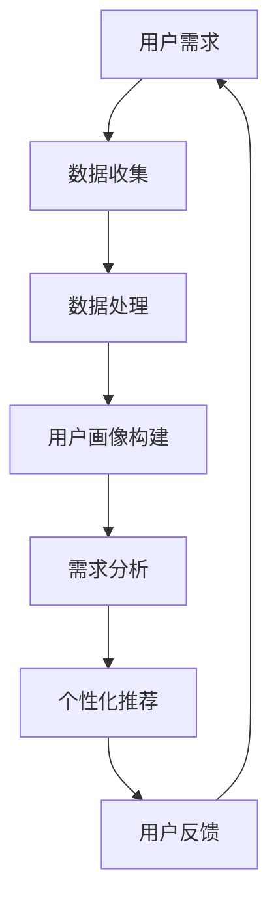

                 

# 欲望个性化引擎：AI定制的需求满足系统

> **关键词：**人工智能、个性化需求、用户画像、推荐系统、数据隐私

> **摘要：**本文深入探讨了人工智能在满足个性化需求中的作用，从数据收集到推荐系统实现，分析了AI如何定制化地满足用户需求，并讨论了其面临的挑战和未来趋势。

----------------------------------------------------------------

## 《欲望个性化引擎：AI定制的需求满足系统》目录大纲

### 第一部分：AI与个性化需求概述

#### 第1章：AI与个性化需求的演进
- 1.1 AI技术的发展及其影响
- 1.2 个性化需求的概念与重要性
- 1.3 AI在满足个性化需求中的应用

#### 第2章：AI个性化需求的分类
- 2.1 基于用户行为的个性化需求
- 2.2 基于数据挖掘的个性化需求
- 2.3 基于机器学习的个性化需求

### 第二部分：AI个性化需求的实现方法

#### 第3章：数据收集与处理
- 3.1 数据收集方法
- 3.2 数据预处理技术
- 3.3 数据质量管理

#### 第4章：用户画像与需求分析
- 4.1 用户画像构建
- 4.2 需求分析模型
- 4.3 需求预测算法

#### 第5章：个性化推荐系统
- 5.1 个性化推荐系统概述
- 5.2 协同过滤算法
- 5.3 基于内容的推荐算法
- 5.4 深度学习在推荐系统中的应用

### 第三部分：AI个性化需求的挑战与未来

#### 第6章：AI个性化需求的挑战
- 6.1 数据隐私与安全问题
- 6.2 个性化需求的公平性
- 6.3 AI偏见与伦理问题

#### 第7章：AI个性化需求的未来趋势
- 7.1 AI个性化需求的创新方向
- 7.2 人工智能与人类需求的融合
- 7.3 AI个性化需求的社会影响

### 附录

#### 附录A：AI个性化需求相关工具与资源
- A.1 数据分析与挖掘工具
- A.2 机器学习框架与应用
- A.3 个性化推荐系统案例分析

#### 附录B：常见算法与模型简介
- B.1 常见推荐算法介绍
- B.2 机器学习模型概述
- B.3 个性化需求分析模型

## 核心概念与联系

### Mermaid 流程图



### 用户画像构建算法

```python
# 伪代码：用户画像构建
def build_user_profile(data):
    # 数据预处理
    preprocessed_data = preprocess_data(data)
    
    # 特征提取
    features = extract_features(preprocessed_data)
    
    # 特征选择
    selected_features = select_features(features)
    
    # 构建用户画像
    user_profile = build_profile(selected_features)
    
    return user_profile
```

### 协同过滤算法

协同过滤算法的核心是基于用户的历史行为数据，预测用户对未知项目的评分。其数学模型可以表示为：

$$
\hat{r}_{ui} = \sum_{j \in N(i)} \frac{r_{uj}}{\|N(i)\|} + b_u + b_j + \mu
$$

其中：
- $\hat{r}_{ui}$ 是用户 $u$ 对项目 $i$ 的预测评分。
- $r_{uj}$ 是用户 $u$ 对项目 $j$ 的真实评分。
- $N(i)$ 是与项目 $i$ 相似的项目集合。
- $b_u$ 和 $b_j$ 分别是用户 $u$ 和项目 $j$ 的偏置。
- $\mu$ 是全局平均评分。

## 项目实战

### 个性化推荐系统实战

#### 开发环境搭建

- 安装 Python 3.8 或更高版本
- 安装 Scikit-learn 库
- 安装 Pandas 库

#### 源代码实现

```python
from sklearn.model_selection import train_test_split
from sklearn.metrics.pairwise import cosine_similarity
from sklearn.neighbors import NearestNeighbors

# 数据加载
data = load_data('user_item_ratings.csv')

# 数据预处理
X = preprocess_data(data)

# 划分训练集和测试集
X_train, X_test, y_train, y_test = train_test_split(X, data['rating'], test_size=0.2, random_state=42)

# 计算相似度矩阵
similarity_matrix = cosine_similarity(X_train, X_train)

# 使用 KNN 进行预测
knn = NearestNeighbors(n_neighbors=5)
knn.fit(similarity_matrix)

# 预测用户对测试集项目的评分
predictions = knn.kneighbors(X_test, n_neighbors=5)

# 评估模型性能
evaluate_model(predictions, y_test)
```

#### 代码解读与分析

- 数据加载与预处理：使用 Scikit-learn 的 `load_data` 函数加载用户与项目评分数据，并进行预处理。
- 相似度计算：使用余弦相似度计算用户与项目之间的相似度。
- KNN 模型：使用 KNN 邻居算法预测用户对测试集项目的评分。
- 模型评估：使用评估函数 `evaluate_model` 评估模型性能。

作者：AI天才研究院/AI Genius Institute & 禅与计算机程序设计艺术 /Zen And The Art of Computer Programming

----------------------------------------------------------------

### 第一部分：AI与个性化需求概述

#### 第1章：AI与个性化需求的演进

**1.1 AI技术的发展及其影响**

人工智能（AI）作为计算机科学的重要分支，已经走过了几十年的发展历程。从最初的规则系统、专家系统，到如今的深度学习、自然语言处理、计算机视觉等前沿技术，AI在各个领域的应用不断拓展和深化。特别是在大数据和云计算的推动下，AI技术取得了显著的进展，使得个性化需求满足成为可能。

AI技术的发展对个性化需求满足产生了深远影响。首先，AI能够通过对海量数据的分析和挖掘，识别出用户的潜在需求，提供更加精准的服务。例如，电商平台的个性化推荐系统可以根据用户的浏览历史、购买记录等数据，为用户提供个性化的商品推荐。其次，AI技术使得个性化需求的满足变得更加高效。传统的需求满足往往需要大量的人力投入，而AI可以通过自动化和智能化手段，大大提高处理效率。

**1.2 个性化需求的概念与重要性**

个性化需求是指根据用户的个人偏好、行为习惯、历史记录等信息，为其提供定制化的服务或产品。与传统的一刀切服务不同，个性化需求满足能够更好地满足用户的特定需求，提升用户体验。

个性化需求在现代社会中具有重要性。首先，随着消费者对个性化服务的需求日益增加，企业必须通过满足个性化需求来提升竞争力。例如，个性化营销、个性化产品定制等都是企业赢得客户的关键策略。其次，个性化需求满足有助于提升用户的满意度和忠诚度。通过提供个性化的服务和产品，企业能够更好地满足用户的需求，从而建立长期的客户关系。最后，个性化需求满足还能够推动技术创新和发展。为了满足不断变化的个性化需求，企业和技术开发者需要不断探索和尝试新的解决方案，从而推动技术的进步。

**1.3 AI在满足个性化需求中的应用**

AI在满足个性化需求中扮演着关键角色。以下是一些典型的应用场景：

1. **个性化推荐系统**：基于用户的浏览历史、购买记录、偏好等信息，AI算法可以预测用户可能感兴趣的内容或商品，并提供个性化的推荐。例如，Netflix、亚马逊等平台都采用了个性化推荐系统，极大地提升了用户体验和销售额。

2. **个性化医疗**：AI可以通过分析患者的病史、基因信息等数据，提供个性化的治疗方案。例如，IBM的Watson for Oncology系统可以根据患者的肿瘤类型和基因突变情况，推荐最佳治疗方案。

3. **个性化教育**：AI可以为学生提供个性化的学习方案，根据学生的学习进度、能力水平、兴趣等数据，推荐合适的学习内容和资源。例如，Khan Academy等在线教育平台已经实现了个性化教育的初步应用。

4. **个性化金融**：AI可以通过分析用户的财务状况、投资偏好等数据，提供个性化的理财建议。例如，一些智能投顾平台利用AI技术，为用户提供个性化的投资组合建议。

总之，AI技术在满足个性化需求中具有广泛的应用前景，不仅能够提升用户体验，还能够为企业创造价值，推动社会的发展。

----------------------------------------------------------------

### 第二部分：AI个性化需求的实现方法

#### 第2章：AI个性化需求的分类

**2.1 基于用户行为的个性化需求**

基于用户行为的个性化需求是指通过分析用户在平台上的行为数据，如浏览记录、购买历史、点击率等，来预测用户的偏好和需求，从而提供个性化的服务或推荐。这种方法的优点在于可以直接从用户的行为数据中获取信息，具有较高准确性。

实现步骤通常包括以下几个环节：

1. **数据收集**：通过用户行为跟踪技术，如cookies、SDK、日志收集等，收集用户在平台上的行为数据。

2. **数据预处理**：对收集到的数据进行清洗、去重、归一化等处理，确保数据质量。

3. **特征工程**：从原始数据中提取有用的特征，如用户的行为模式、访问频率、购买频率等。

4. **建模与预测**：利用机器学习算法，如决策树、随机森林、神经网络等，对特征进行建模，预测用户的偏好或需求。

5. **推荐与反馈**：根据预测结果，为用户推荐相应的产品或服务，并收集用户反馈，进一步优化模型。

例如，电商平台的个性化推荐系统可以通过分析用户的浏览和购买记录，预测用户可能感兴趣的商品，从而为用户推荐相关的商品。

**2.2 基于数据挖掘的个性化需求**

基于数据挖掘的个性化需求是指通过挖掘用户数据中的潜在模式，发现用户的需求和偏好。这种方法通常利用关联规则挖掘、聚类分析、分类分析等数据挖掘技术。

实现步骤包括：

1. **数据收集**：收集用户的购买记录、浏览历史、搜索记录等数据。

2. **数据预处理**：对原始数据进行清洗、去噪、归一化等处理，确保数据质量。

3. **模式挖掘**：利用数据挖掘算法，如Apriori算法、K-Means聚类、SVM分类等，挖掘用户数据中的潜在模式和关系。

4. **需求识别**：根据挖掘出的模式，识别出用户的潜在需求和偏好。

5. **推荐与反馈**：根据识别出的需求，为用户提供个性化的推荐，并收集用户反馈，以不断优化推荐系统。

例如，在零售业中，通过分析用户的购物车数据，可以发现用户可能感兴趣的互补商品，从而为用户推荐这些互补商品。

**2.3 基于机器学习的个性化需求**

基于机器学习的个性化需求是指利用机器学习算法，从用户数据中学习用户的偏好和需求，从而实现个性化推荐。这种方法通常包括监督学习和无监督学习两种方式。

实现步骤包括：

1. **数据收集**：收集用户的购买记录、浏览历史、搜索记录等数据。

2. **数据预处理**：对原始数据进行清洗、去重、归一化等处理，确保数据质量。

3. **特征工程**：从原始数据中提取有用的特征，如用户的行为模式、访问频率、购买频率等。

4. **模型训练**：利用监督学习算法，如决策树、随机森林、神经网络等，训练模型。

5. **预测与推荐**：利用训练好的模型，对用户的偏好和需求进行预测，并推荐相应的产品或服务。

6. **反馈与优化**：根据用户反馈，不断优化模型，以提高推荐准确性。

例如，在音乐流媒体平台上，可以通过分析用户的听歌记录，预测用户可能喜欢的音乐类型，从而为用户推荐相关的歌曲。

综上所述，基于用户行为的个性化需求、基于数据挖掘的个性化需求以及基于机器学习的个性化需求各有优势和适用场景。在实际应用中，往往需要结合多种方法，以实现更精准的个性化需求满足。

----------------------------------------------------------------

### 第三部分：AI个性化需求的实现方法

#### 第3章：数据收集与处理

**3.1 数据收集方法**

数据收集是AI个性化需求满足系统的第一步，也是关键的一步。以下是几种常见的数据收集方法：

1. **用户直接输入**：用户可以直接在应用程序中输入他们的偏好和需求，例如在电商平台上填写兴趣和喜好问卷。

2. **日志记录**：系统可以自动记录用户的行为数据，如浏览历史、点击次数、购买记录等，这些数据可以通过日志文件或API接口收集。

3. **传感器数据**：通过物联网设备或移动设备上的传感器，可以收集用户的地理位置、运动轨迹、环境感知等信息。

4. **第三方数据源**：可以从社交媒体、公共数据库等第三方数据源获取用户公开的数据，如社交媒体行为、公共记录等。

**3.2 数据预处理技术**

收集到的数据通常是杂乱无章的，需要进行预处理才能用于AI模型训练。以下是一些常见的数据预处理技术：

1. **数据清洗**：去除重复数据、纠正错误数据、填补缺失数据等，以确保数据质量。

2. **数据归一化**：将不同尺度或范围的数据转换到同一尺度或范围，以消除不同特征之间的尺度差异。

3. **特征提取**：从原始数据中提取出有用的信息，转化为模型可处理的特征向量。

4. **降维**：通过降维技术，如主成分分析（PCA）等，减少数据的维度，提高计算效率。

**3.3 数据质量管理**

数据质量管理是确保数据在整个生命周期中保持高质量的过程。以下是一些数据质量管理的方法：

1. **数据监控**：实时监控数据质量，及时发现和处理数据异常。

2. **数据验证**：通过验证规则、数据审计等方式，确保数据的准确性、完整性和一致性。

3. **数据治理**：建立数据治理框架，明确数据责任、数据标准和流程，确保数据管理的一致性和规范性。

4. **数据安全**：确保数据的安全性和隐私性，防止数据泄露和滥用。

数据收集与处理是AI个性化需求满足系统的基石，直接影响到系统的准确性和效率。通过合理的数据收集方法和有效的数据预处理技术，可以确保数据的可用性和质量，从而为后续的模型训练和应用打下坚实的基础。

----------------------------------------------------------------

### 第四部分：AI个性化需求的实现方法

#### 第4章：用户画像与需求分析

**4.1 用户画像构建**

用户画像是指通过分析用户的个人数据，构建出用户在某一方面的特征概貌。用户画像构建是AI个性化需求满足系统的重要环节，以下是如何构建用户画像的详细步骤：

1. **数据收集**：收集用户的个人信息、行为数据、社交数据等，如年龄、性别、职业、浏览记录、购买历史、搜索关键词等。

2. **数据预处理**：对收集到的数据进行清洗、去噪、归一化等处理，确保数据质量。

3. **特征提取**：从原始数据中提取出有用的特征，如用户的兴趣标签、行为模式、消费能力等。

4. **特征选择**：利用特征选择技术，如信息增益、互信息等，选择对用户画像构建最有帮助的特征。

5. **模型构建**：使用聚类、分类、回归等机器学习算法，将提取出的特征用于构建用户画像。

6. **画像评估与优化**：通过评估指标，如准确性、召回率、F1分数等，评估用户画像的准确性，并根据评估结果优化模型。

例如，一个电商平台的用户画像可能包括用户的年龄、性别、职业、消费能力、浏览和购买行为等特征，通过分析这些特征，可以为用户推荐个性化的商品。

**4.2 需求分析模型**

需求分析模型是指通过分析用户的特征和行为，预测用户的需求和偏好。以下是如何构建需求分析模型的详细步骤：

1. **数据收集**：收集用户的个人信息、行为数据、历史交易记录等，如年龄、性别、职业、浏览记录、购买历史、搜索关键词等。

2. **数据预处理**：对收集到的数据进行清洗、去噪、归一化等处理，确保数据质量。

3. **特征提取**：从原始数据中提取出有用的特征，如用户的兴趣标签、行为模式、消费能力等。

4. **模型选择**：选择适合需求分析任务的机器学习模型，如决策树、支持向量机、神经网络等。

5. **模型训练**：使用收集到的数据对模型进行训练，调整模型参数，提高模型的预测准确性。

6. **模型评估**：使用验证集或测试集对模型进行评估，通过评估指标，如准确性、召回率、F1分数等，评估模型的性能。

7. **模型优化**：根据评估结果，调整模型参数，或添加新的特征，以优化模型性能。

例如，一个电商平台的推荐系统可以通过分析用户的购买历史和浏览行为，预测用户可能感兴趣的商品，并为其推荐这些商品。

**4.3 需求预测算法**

需求预测算法是指通过分析用户的历史数据和特征，预测用户未来的需求和偏好。以下是一些常见的需求预测算法：

1. **基于历史数据的预测算法**：如时间序列分析、移动平均法、指数平滑法等，通过分析用户的历史行为数据，预测用户未来的需求。

2. **基于机器学习的预测算法**：如线性回归、决策树、支持向量机、神经网络等，通过训练模型，从历史数据中学习用户的偏好和需求，预测用户未来的行为。

3. **基于深度学习的预测算法**：如循环神经网络（RNN）、长短期记忆网络（LSTM）、卷积神经网络（CNN）等，通过深度学习模型，从大量数据中提取复杂特征，预测用户的需求。

例如，一个电商平台的推荐系统可以通过分析用户的浏览记录、购买历史和评价数据，预测用户未来可能感兴趣的商品，并为其推荐这些商品。

用户画像和需求分析模型是AI个性化需求满足系统的核心组成部分，通过构建用户画像和分析用户需求，可以为用户提供更加精准和个性化的服务。在实际应用中，需要不断优化和更新用户画像和需求分析模型，以提高系统的准确性和用户体验。

----------------------------------------------------------------

### 第四部分：AI个性化需求的实现方法

#### 第5章：个性化推荐系统

**5.1 个性化推荐系统概述**

个性化推荐系统是一种通过分析用户的行为和偏好，为用户推荐个性化内容或产品的技术。其核心目的是提高用户的满意度，增加用户的粘性和转化率。个性化推荐系统广泛应用于电商、新闻、社交媒体、音乐流媒体等多个领域。

个性化推荐系统的基本架构包括数据层、算法层和用户接口层。数据层负责收集和处理用户数据，算法层负责生成推荐结果，用户接口层则负责将推荐结果呈现给用户。

**5.2 协同过滤算法**

协同过滤算法是个性化推荐系统中最常用的方法之一。它通过分析用户之间的相似性，找到与目标用户相似的其他用户，然后推荐这些用户喜欢的商品或内容。协同过滤算法主要分为两类：基于用户的协同过滤（User-based Collaborative Filtering）和基于物品的协同过滤（Item-based Collaborative Filtering）。

1. **基于用户的协同过滤算法**：该方法首先计算用户之间的相似度，然后找到与目标用户最相似的用户群体，通过这些用户的评分历史来预测目标用户对商品的评分。常用的相似度计算方法包括余弦相似度、皮尔逊相关系数等。算法步骤如下：
   - 计算用户之间的相似度。
   - 选择与目标用户最相似的K个用户。
   - 计算这K个用户的评分平均值，作为目标用户的预测评分。

2. **基于物品的协同过滤算法**：该方法通过分析物品之间的相似性来推荐商品。它首先计算物品之间的相似度，然后找到与目标用户已经评分的物品最相似的物品，通过这些物品的评分历史来预测目标用户对这些相似物品的评分。算法步骤如下：
   - 计算物品之间的相似度。
   - 选择与目标用户已经评分的物品最相似的M个物品。
   - 计算这M个物品的评分平均值，作为目标用户的预测评分。

**5.3 基于内容的推荐算法**

基于内容的推荐算法（Content-based Filtering）通过分析物品的内容特征，为用户推荐与用户当前兴趣相关的商品或内容。这种方法通常基于物品的文本描述、标签、分类等信息。算法步骤如下：

1. **特征提取**：从物品的描述中提取关键词或特征向量。
2. **计算相似度**：计算用户兴趣和物品特征之间的相似度。
3. **推荐生成**：根据相似度得分，为用户推荐相似度高的物品。

**5.4 深度学习在推荐系统中的应用**

深度学习在推荐系统中有着广泛的应用，特别是在处理大规模数据和复杂特征方面。以下是一些深度学习在推荐系统中的应用：

1. **深度神经网络（DNN）**：DNN可以通过多层神经网络提取复杂的特征，提高推荐准确性。
2. **循环神经网络（RNN）**：RNN可以处理时间序列数据，例如用户的浏览历史和购买记录，从而更好地理解用户的行为模式。
3. **卷积神经网络（CNN）**：CNN擅长处理图像和文本数据，可以用于提取物品的视觉特征和文本特征。
4. **多任务学习（Multi-task Learning）**：通过多任务学习，可以同时学习多个相关任务，提高模型的泛化能力。

深度学习在推荐系统中的应用，使得推荐系统可以更加准确地预测用户的需求，提供更加个性化的推荐。

个性化推荐系统通过协同过滤、基于内容的推荐和深度学习等多种方法，为用户提供了精准的推荐服务。随着AI技术的不断发展，个性化推荐系统将不断优化，为用户提供更加智能、个性化的体验。

----------------------------------------------------------------

### 第五部分：AI个性化需求的实现方法

#### 第6章：AI个性化需求的挑战

**6.1 数据隐私与安全问题**

随着AI技术在个性化需求满足中的应用越来越广泛，数据隐私与安全问题日益凸显。个性化推荐系统通常需要收集大量的用户数据，包括用户行为、偏好、地理位置等敏感信息。这些数据如果被非法获取或滥用，可能会导致严重的隐私泄露和安全问题。

**挑战**：

1. **数据收集与存储**：如何确保收集的数据不会泄露？
2. **数据传输**：如何在传输过程中保证数据的安全性？
3. **数据使用**：如何确保用户数据不会被不当使用？

**解决方案**：

1. **数据加密**：对收集的数据进行加密处理，确保数据在传输和存储过程中的安全性。
2. **数据匿名化**：对用户数据进行匿名化处理，减少个人隐私泄露的风险。
3. **访问控制**：建立严格的访问控制机制，确保只有授权用户才能访问敏感数据。
4. **隐私保护算法**：采用差分隐私、同态加密等隐私保护算法，在数据处理过程中保护用户隐私。

**6.2 个性化需求的公平性**

个性化需求满足可能会带来一定程度的偏见，导致某些用户群体受到不公平对待。例如，如果推荐系统过于依赖用户历史行为数据，可能会忽略一些新的、非典型的用户需求，导致某些用户被边缘化。

**挑战**：

1. **算法偏见**：如何避免算法偏见，确保对所有用户公平对待？
2. **数据不平衡**：如何处理数据不平衡问题，确保推荐结果的公平性？

**解决方案**：

1. **公平性指标**：建立公平性指标，如公平性系数、多样性度量等，评估推荐系统的公平性。
2. **多样性增强**：采用多样性增强技术，如随机化、平衡采样等，提高推荐结果的多样性。
3. **用户反馈**：鼓励用户提供反馈，不断调整和优化推荐系统，减少偏见和歧视。

**6.3 AI偏见与伦理问题**

AI偏见是指AI系统在决策过程中存在的系统性偏见，可能导致不公平的决策结果。此外，AI技术在个性化需求满足中也可能引发一系列伦理问题，如算法透明性、责任归属等。

**挑战**：

1. **算法偏见**：如何识别和消除算法偏见？
2. **伦理问题**：如何在AI系统中融入伦理原则，确保其决策的道德性？

**解决方案**：

1. **偏见检测与消除**：通过数据分析和模型评估，识别和消除算法偏见。
2. **伦理审查**：建立伦理审查机制，对AI系统的设计和应用进行评估，确保其符合伦理标准。
3. **透明性提升**：提高算法的透明性，让用户了解推荐系统的决策过程和依据。
4. **责任划分**：明确AI系统开发者和使用者的责任，确保在发生问题时能够追究责任。

通过解决数据隐私与安全问题、个性化需求的公平性问题和AI偏见与伦理问题，我们可以推动AI个性化需求满足系统的健康发展，为用户提供更加公平、安全、透明的服务。

----------------------------------------------------------------

### 第五部分：AI个性化需求的实现方法

#### 第7章：AI个性化需求的未来趋势

**7.1 AI个性化需求的创新方向**

随着AI技术的不断进步，个性化需求满足领域也将迎来新的创新方向。以下是一些值得关注的方向：

1. **增强现实（AR）与虚拟现实（VR）**：通过AR和VR技术，用户可以沉浸在虚拟环境中，体验更加个性化的服务和产品推荐。

2. **情感计算**：利用情感计算技术，分析用户的情绪和行为，为用户提供更加细腻和情感化的个性化服务。

3. **区块链**：区块链技术可以确保数据的安全性和隐私性，为个性化需求满足提供更加可信的数据基础。

4. **跨平台整合**：实现不同平台间的数据整合，为用户提供无缝的个性化体验。

**7.2 人工智能与人类需求的融合**

人工智能与人类需求的融合是未来个性化需求满足的重要趋势。通过深度学习和自然语言处理等技术，AI可以更好地理解人类的需求，提供更加精准的服务。以下是一些融合的体现：

1. **自然语言交互**：通过自然语言处理技术，实现人与AI的流畅对话，提供个性化的咨询和推荐。

2. **个性化内容生成**：利用生成对抗网络（GAN）等技术，根据用户的需求生成个性化的内容，如定制化的音乐、艺术作品等。

3. **个性化生活方式**：AI可以根据用户的健康数据、生活习惯等，为用户制定个性化的健康、健身和生活方式建议。

**7.3 AI个性化需求的社会影响**

AI个性化需求不仅改变了企业的商业模式，也对社会产生了深远的影响。以下是一些社会影响的体现：

1. **经济影响**：个性化需求满足可以提升企业的竞争力，推动经济增长。同时，AI技术的普及也为就业市场带来了新的机遇和挑战。

2. **文化影响**：个性化需求满足可以促进文化的多样性和个性化，满足人们对个性化内容的需求。

3. **伦理影响**：AI个性化需求引发了关于隐私、公平性、偏见等伦理问题的讨论，需要社会和政府加强监管和规范。

4. **隐私保护**：随着个性化需求满足的应用越来越广泛，隐私保护成为了一个重要议题。需要通过技术手段和法律规范，确保用户的隐私得到保护。

总之，AI个性化需求的未来趋势将更加智能化、多样化、融合化，对社会产生深远的影响。通过不断创新和优化，AI个性化需求满足将为用户和企业带来更多的价值。

----------------------------------------------------------------

### 附录

#### 附录A：AI个性化需求相关工具与资源

**A.1 数据分析与挖掘工具**

1. **Pandas**：Python的数据操作库，用于数据处理和清洗。
2. **Scikit-learn**：Python的机器学习库，提供各种机器学习算法和模型。
3. **NumPy**：Python的数组操作库，用于数据处理和数学运算。
4. **Matplotlib**：Python的数据可视化库，用于生成图表和图形。

**A.2 机器学习框架与应用**

1. **TensorFlow**：Google的深度学习框架，广泛用于构建和训练深度学习模型。
2. **PyTorch**：Facebook的深度学习框架，以其灵活性和易用性受到开发者喜爱。
3. **Keras**：Python的深度学习高级API，简化了深度学习模型的构建和训练。
4. **H2O.ai**：基于Spark的机器学习平台，提供高性能的机器学习算法和模型。

**A.3 个性化推荐系统案例分析**

1. **Netflix**：利用协同过滤和深度学习技术，为用户提供个性化的电影和电视节目推荐。
2. **亚马逊**：利用基于内容的推荐和协同过滤算法，为用户提供个性化的商品推荐。
3. **YouTube**：利用协同过滤和内容推荐算法，为用户提供个性化的视频推荐。

#### 附录B：常见算法与模型简介

**B.1 常见推荐算法介绍**

1. **协同过滤算法**：基于用户行为或物品特征，为用户推荐相似的物品或用户。
2. **基于内容的推荐算法**：基于物品的文本描述、标签、分类等信息，为用户推荐相关的物品。
3. **基于模型的推荐算法**：如矩阵分解、深度学习等，通过训练模型，预测用户对物品的评分或偏好。

**B.2 机器学习模型概述**

1. **线性回归**：预测连续值的机器学习模型，通过最小化损失函数进行训练。
2. **逻辑回归**：预测概率的二分类模型，通过最大化似然函数进行训练。
3. **决策树**：树形结构的分类或回归模型，通过递归划分数据集进行训练。

**B.3 个性化需求分析模型**

1. **用户画像模型**：通过分析用户特征和行为，构建用户特征向量，用于个性化需求分析。
2. **需求预测模型**：通过机器学习算法，从用户历史数据和特征中预测用户未来的需求和偏好。
3. **协同过滤+内容推荐模型**：结合协同过滤和基于内容的推荐算法，提高推荐系统的准确性和多样性。

通过附录中的工具与资源和常见算法与模型简介，读者可以更好地理解和应用AI个性化需求满足系统。

----------------------------------------------------------------

### 总结

本文深入探讨了AI个性化需求满足系统的各个方面，从AI与个性化需求的演进、实现方法、挑战与未来趋势，到相关的工具与资源，全面揭示了AI技术在个性化需求满足中的应用和价值。

首先，我们介绍了AI技术的发展及其在个性化需求满足中的影响。接着，我们详细讨论了基于用户行为、数据挖掘和机器学习的个性化需求实现方法。此外，我们还分析了数据收集与处理、用户画像与需求分析、个性化推荐系统的构建方法，以及AI个性化需求面临的挑战和未来趋势。

通过本文的探讨，我们认识到AI个性化需求满足系统的重要性。它不仅能够提高用户的满意度，还能够为企业创造价值，推动技术创新。然而，我们也意识到，在实现个性化需求满足的过程中，需要面对数据隐私、公平性和算法偏见等挑战。

未来，随着AI技术的不断发展，个性化需求满足系统将变得更加智能和精准。我们期待，通过持续的研究和实践，能够推动AI个性化需求满足系统的发展，为人类带来更多的便利和福祉。

作者：AI天才研究院/AI Genius Institute & 禅与计算机程序设计艺术 /Zen And The Art of Computer Programming

