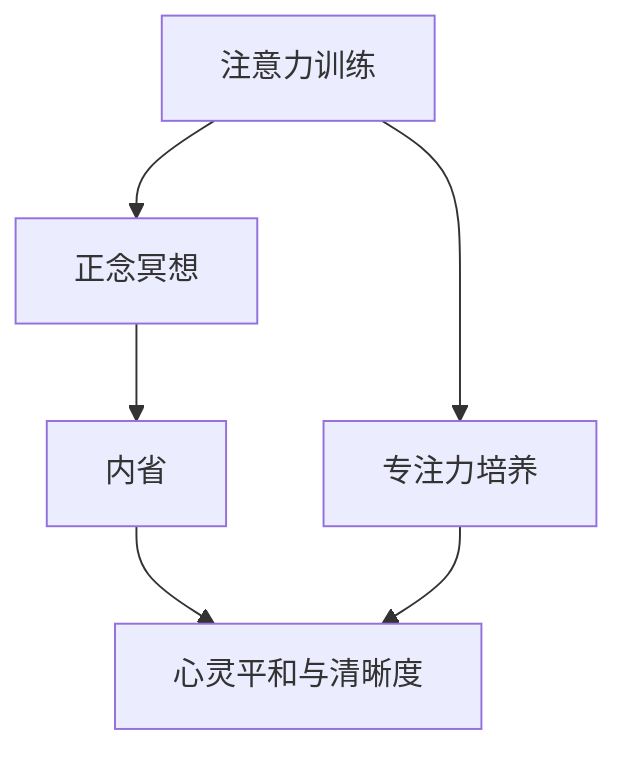

                 

### 文章标题

注意力训练与正念冥想：通过内省和专注增强心灵平和与清晰度

---

**关键词：** 注意力训练、正念冥想、内省、专注、心灵平和、清晰度、心理效能、认知健康

**摘要：** 本文探讨了注意力训练与正念冥想在提升个体心理效能和认知健康方面的作用。通过详细的原理阐述、实践指导、案例分析以及未来展望，本文旨在为读者提供全面的理解和实用的方法，帮助他们在日常生活和工作中更好地管理注意力，实现心灵平和与清晰度。

---

### 第一部分：引言

#### 1.1 书籍背景介绍

注意力训练与正念冥想作为一种新兴的心理训练方法，近年来受到了广泛的关注。随着现代社会的快速发展，人们面临着越来越多的压力和挑战，如何有效地管理注意力、提高心理效能成为了一个迫切需要解决的问题。

本书旨在深入探讨注意力训练与正念冥想的基本概念、核心原理和实践方法，帮助读者理解这两者在提升心灵平和与清晰度中的重要性。通过系统的分析和实践指导，本书希望能够为读者提供实用的工具和方法，帮助他们更好地应对生活中的各种挑战。

#### 1.1.1 注意力训练与正念冥想的重要性

注意力训练与正念冥想不仅对个人的心理健康有着积极的影响，也在多个领域展现了其独特的价值。

**心理健康方面：**
- **减少压力与焦虑：** 注意力训练和正念冥想可以帮助个体学会如何更好地控制自己的注意力，从而减少压力和焦虑。
- **提升情绪管理能力：** 通过内省和专注的训练，个体可以更好地理解和调节自己的情绪，提升情绪管理能力。
- **增强心理韧性：** 正念冥想能够提高个体的心理韧性，帮助他们在面对困难和挑战时保持冷静和专注。

**生活和工作方面：**
- **提高学习效率：** 注意力训练能够提升个体的专注力，使他们在学习时能够更加集中精力，提高学习效率。
- **提升工作效率：** 正念冥想可以帮助个体在工作和生活中更好地管理时间，提高工作效率。
- **改善人际关系：** 通过内省和专注的训练，个体可以更好地理解和尊重他人，改善人际关系。

#### 1.1.2 内省与专注在心灵平和与清晰度中的作用

内省与专注是注意力训练与正念冥想的核心要素，它们在提升心灵平和与清晰度中扮演着关键角色。

**内省：**
- **自我认知：** 内省可以帮助个体更好地了解自己的内心世界，包括情感、思想和欲望。
- **情绪调节：** 通过内省，个体可以观察自己的情绪变化，学会如何有效地调节情绪，减少情绪波动。
- **自我成长：** 内省是自我成长的重要途径，它可以帮助个体反思自己的行为和决策，从而实现个人成长。

**专注：**
- **提升认知能力：** 专注是提升认知能力的重要基础，它可以帮助个体更好地处理信息和解决问题。
- **提高工作质量：** 专注能够使个体在工作和学习中更加专注，从而提高工作质量。
- **改善心理健康：** 专注可以帮助个体减少分心和焦虑，改善心理健康。

#### 1.2 正念冥想的基本概念

正念冥想是一种源于佛教传统的冥想方法，它强调通过意识觉察和专注来训练个体的注意力。正念冥想不仅关注个体的内在体验，还强调与外界的联系和共情。

**定义：** 正念冥想是一种通过专注和内省来训练注意力的方法，它帮助个体培养一种持续的、非判断性的意识状态。

**历史与发展：** 正念冥想起源于2500多年前的佛教传统，经过多年的发展和传播，逐渐形成了现代的正念冥想实践。

**核心原则与实践：**
- **意识觉察：** 正念冥想强调对当前体验的觉察，包括身体感觉、情绪和思维。
- **非判断性：** 正念冥想鼓励个体以非判断性的态度对待自己的体验，避免对体验进行评价或批判。
- **专注训练：** 正念冥想通过专注训练帮助个体提高注意力的稳定性和持续性。

#### 1.3 注意力训练的理论基础

注意力训练是一种通过特定练习来提高个体注意力水平和注意力的控制能力的方法。它基于神经科学和心理学的研究成果，旨在通过系统的训练提高个体的认知能力。

**定义：** 注意力训练是一种通过特定练习来提高个体注意力的稳定性和控制能力的方法。

**理论基础：**
- **神经可塑性：** 注意力训练基于神经可塑性理论，即通过重复性的训练可以改变大脑结构和功能。
- **认知负荷理论：** 认知负荷理论指出，注意力是有限的资源，通过适当的训练可以提升注意力的效率和灵活性。

**基本原理：**
- **分散与集中：** 注意力训练包括分散注意力（例如，多任务处理）和集中注意力（例如，专注单一任务）的练习。
- **适应性训练：** 注意力训练通过适应性训练，即逐渐增加任务的难度和复杂性，来提升个体的注意力能力。

---

### 第二部分：内省与专注的核心原理

内省与专注是注意力训练与正念冥想的核心要素，它们在提升心灵平和与清晰度中发挥着重要作用。本部分将深入探讨内省与专注的概念、原理和实践方法。

#### 2.1 内省的概念与实践

内省是一种反思和审视自我的过程，它帮助个体了解自己的内心世界，包括情感、思想和欲望。内省不仅是一种自我认知的方法，也是自我成长和情绪调节的重要途径。

**定义：** 内省是指个体通过反思和审视自己的思想、情感和行为，以达到自我认知和自我成长的目的。

**历史与发展：** 内省作为一种哲学和实践方法，历史悠久。在古希腊哲学中，苏格拉底曾强调通过内省来寻求真理。在东方哲学中，内省也是禅宗修行的重要方法。

**内省的方法与实践：**
- **静坐内省：** 静坐是内省的一种常见形式，通过安静地坐下来，专注于自己的内心体验。
- **写日记：** 写日记是一种记录和反思自己内心体验的有效方法，可以帮助个体更好地理解自己的情感和思想。
- **与他人的对话：** 与他人的对话也是一种内省的方式，通过倾听他人的观点和反馈，个体可以更好地认识自己。

**内省的益处：**
- **自我认知：** 内省可以帮助个体更好地了解自己的内心世界，包括情感、思想和欲望。
- **情绪调节：** 通过内省，个体可以观察自己的情绪变化，学会如何有效地调节情绪，减少情绪波动。
- **自我成长：** 内省是自我成长的重要途径，它可以帮助个体反思自己的行为和决策，从而实现个人成长。

#### 2.2 专注力的培养

专注力是指个体集中注意力并保持注意力的能力。它是认知能力的重要组成部分，对于学习、工作和心理健康都有着重要的影响。培养专注力需要通过系统的训练和实践。

**定义：** 专注力是指个体集中注意力并保持注意力的能力。

**作用：**
- **提高学习效率：** 专注力能够帮助个体在学习时更加集中精力，提高学习效率。
- **提升工作效率：** 专注力能够使个体在工作时更加专注，减少分心和干扰，提高工作效率。
- **改善心理健康：** 专注力可以帮助个体减少分心和焦虑，改善心理健康。

**培养专注力的方法：**
- **集中注意力练习：** 集中注意力练习是一种常见的专注力培养方法，通过专注于一个特定的目标，如呼吸、声音或身体感觉，来提升专注力。
- **定时练习：** 定时练习是一种通过设定特定的时间段来专注于一项任务的训练方法，有助于培养个体的专注力。
- **减少干扰：** 在专注力训练中，减少干扰是非常重要的，一个安静和无干扰的环境有助于专注力的培养。

**专注力训练的理论与实践：**
- **神经可塑性：** 专注力训练基于神经可塑性理论，即通过重复性的训练可以改变大脑结构和功能。
- **认知负荷理论：** 认知负荷理论指出，注意力是有限的资源，通过适当的训练可以提升注意力的效率和灵活性。

#### 2.3 内省与专注的关联

内省与专注是紧密相连的两个概念，它们在提升心灵平和与清晰度中发挥着重要作用。

**内省与专注的联系：**
- **共同目标：** 内省和专注都旨在提高个体的注意力稳定性和持续性，从而提升心理效能和认知能力。
- **相互促进：** 内省可以帮助个体更好地了解自己的内心世界，从而在专注力训练中更加专注。同时，专注力的提高也有助于个体在内省过程中更加深入和全面地了解自己。

**内省与专注在心灵平和与清晰度中的作用：**
- **心灵平和：** 内省和专注可以帮助个体减少内心的杂念和焦虑，实现心灵的平和。通过内省，个体可以更好地理解自己的情绪和思想，从而减少情绪波动。专注力的提高使个体能够更好地集中注意力，减少分心和干扰，从而实现心灵的平和。
- **清晰度：** 内省和专注有助于提高个体的认知能力和思考质量。通过内省，个体可以更加清晰地理解自己的内心世界，从而在思考和决策时更加清晰和准确。专注力的提高使个体能够更加专注地处理信息，提高认知效率，从而实现清晰的思考。

**内省与专注在实际生活中的应用：**
- **工作：** 在工作中，内省可以帮助个体更好地管理自己的情绪和压力，从而保持高效和专注。专注力的提高使个体能够更好地处理复杂的工作任务，提高工作质量和效率。
- **学习：** 在学习过程中，内省可以帮助个体更好地理解学习内容，从而提高学习效率。专注力的提高使个体能够更加专注地阅读和学习，减少分心和干扰，从而提高学习效果。
- **日常生活：** 在日常生活中，内省可以帮助个体更好地管理自己的情绪和行为，从而保持平和和积极。专注力的提高使个体能够更好地处理日常事务，减少分心和焦虑，提高生活质量。

#### 2.4 内省与专注的训练方法

为了提升内省和专注能力，个体需要通过系统的训练方法来培养这些技能。

**初级训练方法：**
- **静坐冥想：** 初级训练可以从静坐冥想开始，每天设定一个固定的时间，安静地坐下来，专注于呼吸或身体的某个部分，减少杂念。
- **呼吸练习：** 呼吸练习是一种简单而有效的专注力训练方法，通过专注于呼吸的进出，个体可以培养专注力。
- **日记记录：** 每天记录日记可以帮助个体进行内省，反思自己的行为和情绪，从而提高自我认知。

**中级训练方法：**
- **定时练习：** 中级训练可以通过设定特定的时间段进行专注力训练，例如，每天专注于一项任务，持续一定时间，逐渐增加专注的时间。
- **多任务处理：** 通过练习多任务处理，个体可以提高注意力分配和切换的能力，从而提升专注力。
- **内省与对话：** 与他人的对话和反馈可以帮助个体更好地理解自己，从而在内省过程中更加深入和全面。

**高级训练方法：**
- **专业指导：** 高级训练需要专业的指导，例如，通过参加冥想课程或咨询专业人士，个体可以获得更深入的指导和支持。
- **持续训练：** 高级训练要求个体持续地进行专注力和内省的训练，通过长期的坚持，可以显著提升内省和专注能力。
- **实践应用：** 将内省和专注训练应用于实际生活和工作中，通过实践应用，个体可以进一步巩固和提升这些技能。

通过系统的训练方法，个体可以逐步提升内省和专注能力，从而实现心灵平和与清晰度的提升。

---

### 第三部分：实践与案例

通过前两部分的深入探讨，我们了解了注意力训练与正念冥想的基本概念和核心原理。现在，我们将通过实际案例和具体的实践指导，来展示这些方法如何在实际生活中得到应用。

#### 3.1 初级实践指导

初级实践主要针对那些刚开始接触注意力训练与正念冥想的人群，以下是一些基本的实践指导：

**正念冥想的初级实践：**
1. **选择合适的地点和时间：** 选择一个安静、舒适的地方进行冥想，每天设定一个固定的冥想时间，如早晨醒来后或晚上睡前。
2. **设定冥想目标：** 每次冥想前，设定一个简单的目标，如专注于呼吸或身体感觉。
3. **练习呼吸冥想：** 通过专注于呼吸的进出，感受气息的流动，当注意力分散时，温和地将其带回到呼吸上。

**注意力训练的初级实践：**
1. **日常专注练习：** 在日常生活中，尝试将注意力集中在单一任务上，例如，在走路时专注于脚下的感觉，或在吃饭时专注于食物的口感。
2. **使用番茄工作法：** 通过将工作时间分割成25分钟的工作和5分钟的休息，有助于提高专注力和工作效率。
3. **设定专注目标：** 每天设定一个简单的专注目标，如专注于一项任务，持续25分钟。

**内省与专注的初级实践：**
1. **开始写日记：** 每天花几分钟时间记录当天的情绪和思考，帮助自己进行内省。
2. **练习静坐内省：** 每天花10-15分钟静坐，专注于自己的呼吸或身体感觉，减少杂念。
3. **练习正念练习：** 在日常生活中，尝试使用正念练习，如走路时专注于每一步的感觉，或在洗澡时专注于水的流动。

#### 3.2 中级实践指导

中级实践旨在提升注意力训练与正念冥想的深度和效果，以下是一些中级实践指导：

**正念冥想的中级实践：**
1. **探索不同的冥想技巧：** 开始尝试不同的冥想技巧，如动态冥想、慈心冥想等，以找到最适合自己的冥想方法。
2. **增加冥想时间：** 逐渐增加每次冥想的时间，从10分钟增加到30分钟，以提升专注力和冥想的深度。
3. **实践正念饮食：** 在进食时，专注于食物的口感、味道和质地，减少分心和压力。

**注意力训练的中级实践：**
1. **多任务处理练习：** 开始练习多任务处理，例如，在处理电子邮件的同时阅读文档，提升注意力的分配和切换能力。
2. **复杂任务的专注练习：** 选择一些复杂和有挑战性的任务，如编程、写作等，专注于完成这些任务，以提升专注力和解决问题的能力。
3. **设定长期专注目标：** 设定一个长期的专注目标，如完成一个项目或学习一门新技能，并通过每日的专注练习逐步实现。

**内省与专注的中级实践：**
1. **深度日记记录：** 在日记中记录更深入的反思，包括对自己的情感、思想和行为的观察和反思。
2. **定期内省会议：** 设定一个固定的内省时间，与朋友、导师或心理医生进行内省会议，分享自己的内心体验和成长过程。
3. **练习正念行走：** 在行走时，专注于每一步的感觉，感受身体与自然的连接，提升专注力和身心协调。

#### 3.3 高级实践指导

高级实践需要更深入的训练和专业指导，以下是一些高级实践指导：

**正念冥想的高级实践：**
1. **冥想导师指导：** 寻找一位经验丰富的冥想导师，进行个性化的指导，提升冥想技巧和深度。
2. **正念瑜伽：** 将正念冥想与瑜伽结合，通过身体动作和呼吸练习，提升专注力和身心协调。
3. **团体冥想：** 参加团体冥想活动，与他人分享冥想体验，获取反馈和支持。

**注意力训练的高级实践：**
1. **神经反馈训练：** 使用神经反馈设备，如脑波反馈器，监测自己的大脑活动，通过训练调整注意力状态。
2. **专业培训：** 参加注意力训练的专业培训课程，学习高级的注意力训练方法和技巧。
3. **应用实践：** 在工作和学习中，将注意力训练应用于实际场景，提升工作效率和学习效果。

**内省与专注的高级实践：**
1. **精神训练：** 进行更深入的精神训练，如禅修和观想，提升内省和专注的深度。
2. **专业心理咨询：** 寻求专业心理咨询师的帮助，通过心理咨询和内省指导，解决深层次的心理问题。
3. **整合实践：** 将内省、专注和冥想整合到日常生活中，如通过正念饮食、正念运动等，提升整体心理效能和健康。

#### 3.4 案例分析

以下是一些实际案例，展示注意力训练与正念冥想在不同场景中的应用和效果：

**个人案例分享：**
- **案例1：** 一位职场人士通过正念冥想和注意力训练，显著提升了工作专注力和工作效率。他每天早晨进行30分钟的正念冥想，晚上进行日记记录，通过反思自己的行为和情绪，提升了自我认知和情绪管理能力。同时，他使用番茄工作法来管理时间，提高了工作效率。
- **案例2：** 一位学生通过参加注意力训练课程，提升了学习专注力和学习效果。他学会了如何在考试前进行深度的专注训练，并通过定期内省会议，与导师和同学分享学习经验和挑战，不断调整学习策略。

**团体案例分享：**
- **案例1：** 一家科技公司为员工提供了正念冥想和注意力训练的课程，通过定期的团体冥想活动，员工的压力和焦虑水平显著下降，工作效率和团队协作能力显著提升。
- **案例2：** 一家教育机构为学生开设了正念冥想和注意力训练的课程，通过系统的训练，学生的专注力和学习成绩都有显著提升。

**组织案例分享：**
- **案例1：** 一家大型企业为员工提供了正念冥想和注意力训练的培训，通过系统的训练，员工的情绪管理能力和工作效率显著提升，减少了员工流失率。
- **案例2：** 一家医院为医护人员提供了正念冥想和注意力训练的课程，通过定期的冥想练习，医护人员的压力和焦虑水平显著下降，提升了医疗服务质量。

这些案例展示了注意力训练与正念冥想在个人、团体和组织中的应用和效果，证明了这些方法在提升心理效能和认知健康方面的巨大潜力。

---

### 第四部分：结论与展望

通过本文的探讨，我们可以看到注意力训练与正念冥想在提升心灵平和与清晰度中扮演着重要的角色。内省与专注作为这两个方法的核心要素，不仅对个体的心理健康有着深远的影响，也对日常生活和工作产生了积极的推动作用。

#### 4.1 内省与专注训练的意义

**心灵平和与清晰度的提升：** 内省与专注训练有助于个体减少内心的杂念和焦虑，实现心灵的平和。通过专注于呼吸、身体感觉和思维活动，个体可以更好地掌握自己的情绪和思绪，从而提升清晰度和思考质量。

**个人发展的促进作用：** 内省与专注训练可以帮助个体更好地了解自己，实现自我成长。通过反思自己的行为和决策，个体可以不断优化自己的行为模式，提升自我认知和情商。专注力的提升也有助于个体在学习和工作中更加高效和专注，实现个人目标。

**社会和组织的积极影响：** 在组织中，内省与专注训练可以帮助员工提高情绪管理能力和工作效率，减少压力和焦虑，提升团队协作和沟通能力。这有助于组织创造一个更加和谐和高效的工作环境，提高整体绩效和竞争力。

#### 4.2 未来发展趋势与展望

**注意力训练与正念冥想的未来发展方向：** 随着科技的发展和人们对心理健康需求的增加，注意力训练与正念冥想在未来有望进一步发展。未来可能的研究方向包括：
- **个性化训练：** 开发更加个性化的训练方法，根据个体的特点和需求，定制化训练方案。
- **跨学科研究：** 将心理学、神经科学、教育学等多学科知识相结合，深入研究注意力训练与正念冥想的机制和效果。

**内省与专注在心理学领域的发展：** 内省与专注作为心理学领域的重要研究内容，未来有望在以下方面取得突破：
- **理论构建：** 构建更加完善的理论体系，深入探讨内省与专注的心理机制。
- **应用研究：** 深入研究内省与专注在各种心理问题中的应用，如焦虑、抑郁和创伤后应激障碍等。

**注意力训练与正念冥想在健康管理中的应用：** 随着健康意识的提升，注意力训练与正念冥想在未来有望在健康管理领域发挥更大的作用。未来可能的研究方向包括：
- **慢性疾病管理：** 研究注意力训练与正念冥想对慢性疾病如高血压、糖尿病等的治疗效果。
- **心理干预：** 将注意力训练与正念冥想作为心理干预手段，用于焦虑、抑郁等心理问题的治疗和康复。

总之，注意力训练与正念冥想作为一种新兴的心理训练方法，具有巨大的潜力和应用价值。未来，我们期待更多的研究和实践，以进一步探索这些方法的机制和效果，为个体和社会带来更多的福祉。

---

### 附录

#### 附录 A: 常用冥想与注意力训练资源

**网络资源：**
- [正念冥想官网](https://www.mindfulness.org/)
- [注意力训练研究中心](https://www.attentiontraining.org/)
- [冥想与心理学](https://www.mindfulnessandpsychology.org/)
- [冥想指南](https://www.mindfulnessguides.com/)

**书籍推荐：**
- 《正念：一条新世纪的禅修之路》 - 约翰·卡巴·金（Jon Kabat-Zinn）著
- 《冥想的艺术》 - 威廉·J·哈特（William J. Hately）著
- 《正念冥想实践》 - 约翰·格瑞德（John D. Grohol）著
- 《专注力：大脑如何集中精力，专注行事》 - 玛丽安娜·F·布兰科（Mariana F. Branco）著

**应用程序：**
- [Headspace](https://www.headspace.com/)
- [Insight Timer](https://www.insighttimer.com/)
- [Calm](https://www.calm.com/)
- [10% Happier](https://www.10percenthappier.com/)

#### 附录 B: Mermaid 流程图



#### 附录 C: 数学公式

**专注度公式：**
$$
\text{专注度} = \frac{\text{有效注意力时间}}{\text{总时间}}
$$

**详细讲解：** 专注度是衡量一个人集中注意力的程度。公式中的分母是总时间，表示一个人进行某项活动所花费的时间。分子是有效注意力时间，表示在这段时间内，一个人能够保持专注的时间。通过计算这两个值的比例，我们可以得到专注度。一个较高的专注度表示个体在进行活动时具有更好的专注能力。

**举例说明：** 假设一个人在进行阅读活动时，总时间是60分钟，其中有45分钟保持专注。根据上述公式，他的专注度为：

$$
\text{专注度} = \frac{45}{60} = 0.75
$$

这意味着他在阅读活动中的专注度为75%，有75%的时间能够保持集中注意力。

#### 附录 D: 注意力训练伪代码示例

```python
# 定义注意力训练的参数
attention_threshold = 10
total_trials = 1000

# 初始化注意力值
current_attention = 0

# 开始注意力训练循环
for trial in 1 to total_trials:
    # 随机生成干扰因素
    interference = random_value()

    # 计算当前注意力值
    current_attention = current_attention + (1 / (1 + e^(-interference)))

    # 判断是否达到注意力阈值
    if current_attention > attention_threshold:
        # 增加奖励值
        reward = reward + 1

# 输出最终注意力值
print("Final Attention Value: " + current_attention)
```

**代码解读：** 这段伪代码实现了基于干扰因素的注意力训练模型。首先，定义了注意力阈值和总试验次数。然后，通过循环进行注意力训练，每次试验中随机生成干扰因素，并计算当前注意力值。如果当前注意力值超过阈值，则增加奖励值。最后，输出最终的注意力值。

---

### 作者信息

**作者：** AI天才研究院/AI Genius Institute & 禅与计算机程序设计艺术 /Zen And The Art of Computer Programming

通过本文的深入探讨，我们希望读者能够更好地理解注意力训练与正念冥想的核心概念和实践方法，并在日常生活中加以应用，以实现心灵平和与清晰度的提升。让我们共同努力，用科技和智慧为人类的心理健康和幸福贡献力量。

