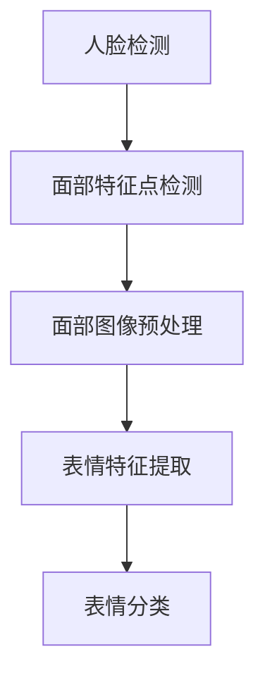
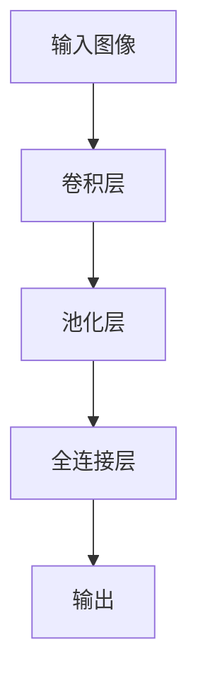
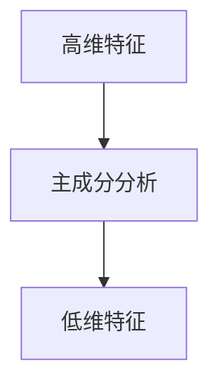
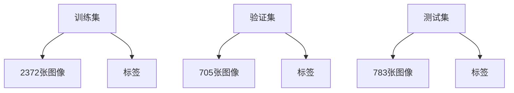
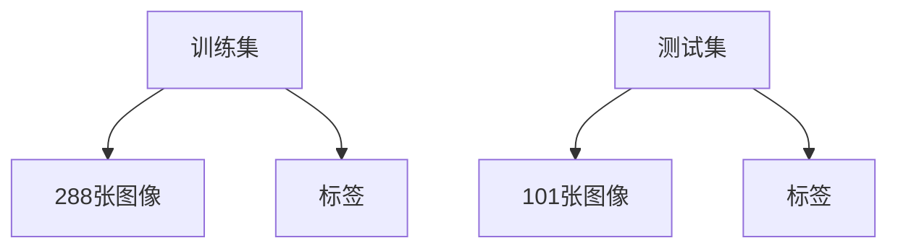

                 

### 《深度学习在人脸表情识别中的应用》

> **关键词：** 深度学习、人脸表情识别、卷积神经网络（CNN）、数据集、预处理、项目实战、挑战与未来。

> **摘要：** 本文旨在探讨深度学习在人脸表情识别中的应用。首先介绍深度学习的背景和核心概念，随后详细解析人脸表情识别的基本原理和技术流程。接着，本文将深入探讨深度学习核心算法，如卷积神经网络（CNN）的基本结构和实现方法。然后，文章将介绍人脸表情识别的数据集与预处理技术，并详细解读深度学习在人脸表情识别中的实现过程。最后，本文将通过一个实际项目展示如何应用深度学习技术进行人脸表情识别，并讨论当前技术的挑战以及未来的发展趋势。

### 目录

1. **基础理论**
    1.1 深度学习的背景与核心概念
    1.2 人脸表情识别的重要性与应用领域
    1.3 人脸表情识别的基本原理与流程
2. **人脸表情识别技术基础**
    2.1 图像处理基础知识
    2.2 特征提取与降维技术
3. **深度学习核心算法原理**
    3.1 深度学习的基本原理
    3.2 卷积神经网络（CNN）在人脸表情识别中的应用
4. **人脸表情识别的数据集与预处理**
    4.1 人脸表情识别常用数据集介绍
    4.2 数据预处理技术
5. **深度学习在人脸表情识别中的实现**
    5.1 开发环境搭建
    5.2 代码实现与解读
6. **人脸表情识别项目的实战**
    6.1 实战项目概述
    6.2 项目实施步骤
7. **人脸表情识别中的挑战与未来发展**
    7.1 当前人脸表情识别技术的挑战
    7.2 未来发展趋势
8. **附录**
    8.1 相关书籍推荐
    8.2 开源数据集与代码资源
    8.3 深度学习框架使用教程

### 第一部分：基础理论

#### 第1章：深度学习与人脸表情识别概述

##### 1.1 深度学习的背景与核心概念

深度学习（Deep Learning）是机器学习（Machine Learning）的一个子领域，它主要依赖于多层神经网络（Neural Networks）来进行数据建模和预测。深度学习的兴起可以追溯到20世纪40年代，但真正的突破发生在21世纪初，随着计算能力的提升和大数据的普及，深度学习在图像识别、语音识别、自然语言处理等领域取得了显著的成果。

核心概念包括：

- **神经网络（Neural Networks）**：模仿人脑神经元结构的计算模型，通过调整权重和偏置来进行数据建模。

- **深度（Depth）**：神经网络层数的多寡，深度越大，模型的复杂度和表达能力越强。

- **训练（Training）**：通过大量数据进行模型训练，调整网络中的权重和偏置。

- **反向传播（Backpropagation）**：一种用于训练神经网络的算法，通过计算损失函数关于网络参数的梯度，来调整网络参数。

##### 1.2 人脸表情识别的重要性与应用领域

人脸表情识别是一种通过分析人脸图像或视频，判断其中人物的表情状态的技术。它具有重要的应用价值，如：

- **情感分析（Sentiment Analysis）**：通过分析人脸表情，可以了解用户的情感状态，为智能客服、社交媒体分析等提供支持。

- **人机交互（Human-Computer Interaction）**：通过人脸表情识别，可以增强人机交互的自然性和智能性。

- **心理健康监测（Mental Health Monitoring）**：通过分析人脸表情的变化，可以及时发现异常行为，为心理健康提供预警。

- **安全监控（Security Surveillance）**：人脸表情识别可以用于安全监控，实时分析人群的情绪状态，提高监控的准确性。

##### 1.3 人脸表情识别的基本原理与流程

人脸表情识别的基本原理可以分为以下几个步骤：

1. **人脸检测（Face Detection）**：通过检测人脸图像或视频中的面部特征，定位人脸位置。

2. **面部特征点检测（Facial Feature Detection）**：进一步检测人脸中的关键特征点，如眼睛、鼻子、嘴巴等。

3. **面部图像预处理（Face Preprocessing）**：对提取到的人脸图像进行标准化处理，包括大小调整、灰度化、光照校正等。

4. **表情特征提取（Emotion Feature Extraction）**：通过图像处理技术，提取与表情相关的特征，如纹理、颜色、形状等。

5. **表情分类（Emotion Classification）**：利用深度学习模型，对提取到的特征进行分类，判断表情类型。

整个流程可以用以下 Mermaid 流程图表示：



### 第一部分：基础理论

#### 第2章：人脸表情识别技术基础

##### 2.1 图像处理基础知识

图像处理是人脸表情识别的重要组成部分，主要涉及以下知识点：

- **像素（Pixel）**：图像的基本单位，每个像素都有特定的颜色值。

- **分辨率（Resolution）**：图像的宽度和高度，通常以像素为单位。

- **颜色空间（Color Space）**：用于表示图像颜色的一种数学模型，常用的有RGB、HSV等。

- **滤波器（Filter）**：用于图像处理的函数，可以用来增强、模糊、锐化图像等。

- **边缘检测（Edge Detection）**：通过检测图像中的边缘，来识别物体轮廓。

常用的图像处理工具和库包括OpenCV、Pillow、NumPy等。

###### 2.1.1 图像的基本概念与处理方法

图像的基本概念包括像素、分辨率、颜色空间等。图像处理的方法包括滤波、边缘检测、特征提取等。

###### 2.1.2 颜色空间转换与特征提取

颜色空间转换是将一种颜色空间转换为另一种颜色空间，如RGB到HSV。特征提取是从图像中提取与目标相关的特征，如纹理、颜色、形状等。

##### 2.2 特征提取与降维技术

特征提取是将原始图像数据转换为适用于机器学习算法的输入特征。降维技术是将高维特征映射到低维空间，减少计算复杂度和数据存储需求。

常用的特征提取技术包括：

- **Haar-like特征**：用于人脸检测，通过组合简单几何形状的像素值，来识别面部特征。

- **LBP（Local Binary Patterns）**：用于纹理特征提取，通过分析像素点的二值模式，来描述纹理信息。

- **HOG（Histogram of Oriented Gradients）**：用于边缘特征提取，通过计算图像中每个像素点的梯度方向直方图，来描述图像的边缘信息。

常用的降维技术包括：

- **主成分分析（PCA）**：通过保留主要成分，来降低特征维度。

- **线性判别分析（LDA）**：通过优化特征空间的线性组合，来降低特征维度。

###### 2.2.1 卷积神经网络（CNN）的基本结构

卷积神经网络（Convolutional Neural Network，CNN）是一种专门用于处理图像数据的深度学习模型，其基本结构包括：

- **卷积层（Convolutional Layer）**：通过卷积操作提取图像特征。

- **池化层（Pooling Layer）**：通过降采样操作，减少数据维度。

- **全连接层（Fully Connected Layer）**：将卷积层和池化层提取的特征映射到分类标签。

- **激活函数（Activation Function）**：引入非线性变换，增强模型的表达能力。

CNN在人脸表情识别中的应用可以表示为：



###### 2.2.2 特征提取的常用方法

特征提取的常用方法包括Haar-like特征、LBP、HOG等。这些方法可以用于人脸检测和表情识别中的特征提取。

###### 2.2.3 降维技术（如主成分分析PCA）

降维技术可以用于减少特征维度，降低计算复杂度。主成分分析（PCA）是一种常用的降维方法，它通过保留主要成分，来降低特征维度。



### 第二部分：深度学习核心算法原理

#### 第3章：深度学习核心算法原理

##### 3.1 深度学习的基本原理

深度学习（Deep Learning）是机器学习（Machine Learning）的一个子领域，它主要依赖于多层神经网络（Neural Networks）来进行数据建模和预测。深度学习的兴起可以追溯到20世纪40年代，但真正的突破发生在21世纪初，随着计算能力的提升和大数据的普及，深度学习在图像识别、语音识别、自然语言处理等领域取得了显著的成果。

核心概念包括：

- **神经网络（Neural Networks）**：模仿人脑神经元结构的计算模型，通过调整权重和偏置来进行数据建模。

- **深度（Depth）**：神经网络层数的多寡，深度越大，模型的复杂度和表达能力越强。

- **训练（Training）**：通过大量数据进行模型训练，调整网络中的权重和偏置。

- **反向传播（Backpropagation）**：一种用于训练神经网络的算法，通过计算损失函数关于网络参数的梯度，来调整网络参数。

##### 3.2 卷积神经网络（CNN）在人脸表情识别中的应用

卷积神经网络（Convolutional Neural Network，CNN）是一种专门用于处理图像数据的深度学习模型，其基本结构包括：

- **卷积层（Convolutional Layer）**：通过卷积操作提取图像特征。

- **池化层（Pooling Layer）**：通过降采样操作，减少数据维度。

- **全连接层（Fully Connected Layer）**：将卷积层和池化层提取的特征映射到分类标签。

- **激活函数（Activation Function）**：引入非线性变换，增强模型的表达能力。

CNN在人脸表情识别中的应用可以表示为：


###### 3.2.1 CNN的基本结构

CNN的基本结构包括卷积层、池化层、全连接层和激活函数。这些层共同工作，以提取图像特征并进行分类。

###### 3.2.2 CNN的常用层与操作

CNN的常用层与操作包括：

- **卷积层（Convolutional Layer）**：通过卷积操作提取图像特征，常用的卷积核有ReLU、Sigmoid等。

- **池化层（Pooling Layer）**：通过降采样操作，减少数据维度，常用的池化方式有最大池化、平均池化等。

- **全连接层（Fully Connected Layer）**：将卷积层和池化层提取的特征映射到分类标签。

- **激活函数（Activation Function）**：引入非线性变换，增强模型的表达能力，常用的激活函数有ReLU、Sigmoid等。

###### 3.2.3 CNN在人脸表情识别中的实现方法

CNN在人脸表情识别中的实现方法可以分为以下几个步骤：

1. **数据预处理**：对输入的人脸图像进行预处理，包括大小调整、灰度化、归一化等。

2. **卷积层**：通过卷积操作提取人脸图像的特征。

3. **池化层**：通过降采样操作，减少数据维度。

4. **全连接层**：将卷积层和池化层提取的特征映射到分类标签。

5. **损失函数与优化器**：选择合适的损失函数（如交叉熵损失函数）和优化器（如Adam优化器），以训练模型。

以下是一个简单的CNN模型实现的伪代码：

```python
import tensorflow as tf

# 定义输入层
inputs = tf.placeholder(tf.float32, [None, height, width, channels])

# 定义卷积层
conv1 = tf.layers.conv2d(inputs, filters=32, kernel_size=(3, 3), activation=tf.nn.relu)

# 定义池化层
pool1 = tf.layers.max_pooling2d(conv1, pool_size=(2, 2))

# 定义全连接层
dense = tf.layers.dense(pool1, units=num_classes, activation=tf.nn.softmax)

# 定义损失函数与优化器
loss = tf.reduce_mean(tf.nn.softmax_cross_entropy_with_logits(logits=dense, labels=labels))
optimizer = tf.train.AdamOptimizer().minimize(loss)

# 训练模型
with tf.Session() as sess:
    sess.run(tf.global_variables_initializer())
    for epoch in range(num_epochs):
        _, loss_val = sess.run([optimizer, loss], feed_dict={inputs: X_train, labels: y_train})
        if epoch % 100 == 0:
            print("Epoch:", epoch, "Loss:", loss_val)
    # 计算准确率
    correct_prediction = tf.equal(tf.argmax(dense, 1), tf.argmax(labels, 1))
    accuracy = tf.reduce_mean(tf.cast(correct_prediction, tf.float32))
    print("Test accuracy:", accuracy.eval({inputs: X_test, labels: y_test}))
```

### 第三部分：人脸表情识别的数据集与预处理

#### 第4章：人脸表情识别的数据集与预处理

##### 4.1 人脸表情识别常用数据集介绍

人脸表情识别的数据集是进行模型训练和评估的重要资源。以下是一些常用的公开数据集：

- **FER2013**：FER2013数据集由AffectNet团队收集，包含2870张表情图像，分为7种表情类别（愤怒、 disgust、恐惧、快乐、悲伤、惊喜和中性）。

- **CK+**：CK+数据集由Cohn-Kanade实验室提供，包含389张表情图像，分为6种表情类别（快乐、中性、悲伤、惊讶、愤怒和恐惧）。

- **RAVAD**：RAVAD数据集由牛津大学提供，包含1062张表情图像，分为7种表情类别。

这些数据集通常包含人脸图像以及对应的表情标签，是进行人脸表情识别研究的重要资源。

###### 4.1.1 FER2013数据集

FER2013数据集由AffectNet团队收集，包含2870张表情图像，分为7种表情类别（愤怒、 disgust、恐惧、快乐、悲伤、惊喜和中性）。数据集分为训练集、验证集和测试集，其中训练集包含2372张图像，验证集包含705张图像，测试集包含783张图像。

数据集的结构如下：



FER2013数据集的特点是包含多种表情类别，数据量大，有助于训练和评估模型性能。

###### 4.1.2 CK+数据集

CK+数据集由Cohn-Kanade实验室提供，包含389张表情图像，分为6种表情类别（快乐、中性、悲伤、惊讶、愤怒和恐惧）。数据集分为训练集和测试集，其中训练集包含288张图像，测试集包含101张图像。

数据集的结构如下：



CK+数据集的特点是表情类别相对较少，但图像质量较高，有助于研究特定表情类别的识别问题。

###### 4.1.3 RAVAD数据集

RAVAD数据集由牛津大学提供，包含1062张表情图像，分为7种表情类别。数据集分为训练集和测试集，其中训练集包含685张图像，测试集包含377张图像。

数据集的结构如下：


RAVAD数据集的特点是表情类别多样，图像数量较多，有助于提高模型的泛化能力。

##### 4.2 数据预处理技术

数据预处理是提高人脸表情识别模型性能的重要环节，主要包括数据归一化与标准化、数据增强技术等。

###### 4.2.1 数据归一化与标准化

数据归一化与标准化是数据预处理的重要步骤，旨在将输入数据的特征缩放到相似的尺度，以提高模型训练效果。常用的归一化与标准化方法包括：

- **归一化（Normalization）**：将输入数据缩放到[0, 1]范围内，计算公式如下：

  $$ x' = \frac{x - \mu}{\sigma} $$

  其中，$x$为原始数据，$\mu$为均值，$\sigma$为标准差。

- **标准化（Standardization）**：将输入数据缩放到均值等于0，标准差等于1的范围内，计算公式如下：

  $$ x' = \frac{x - \mu}{\sigma} $$

  其中，$x$为原始数据，$\mu$为均值，$\sigma$为标准差。

以下是一个数据归一化的Python实现：

```python
import numpy as np

def normalize(data):
    mean = np.mean(data)
    std = np.std(data)
    normalized_data = (data - mean) / std
    return normalized_data
```

###### 4.2.2 数据增强技术

数据增强是通过模拟更多的训练样本，以提高模型的泛化能力。常见的数据增强技术包括：

- **随机裁剪（Random Crop）**：随机选择图像的一部分作为训练样本。

- **翻转（Flip）**：将图像沿水平或垂直方向进行翻转。

- **旋转（Rotate）**：随机旋转图像。

- **缩放（Scale）**：随机缩放图像。

以下是一个数据增强的Python实现：

```python
from torchvision import transforms

transform = transforms.Compose([
    transforms.RandomResizedCrop(size=224),
    transforms.RandomHorizontalFlip(),
    transforms.ToTensor(),
    transforms.Normalize(mean=[0.485, 0.456, 0.406], std=[0.229, 0.224, 0.225]),
])

data_loader = torch.utils.data.DataLoader(dataset, batch_size=64, shuffle=True, transform=transform)
```

通过数据归一化和数据增强技术，可以显著提高人脸表情识别模型的性能和泛化能力。

### 第三部分：深度学习在人脸表情识别中的实现

#### 第5章：深度学习在人脸表情识别中的实现

##### 5.1 开发环境搭建

在进行深度学习在人脸表情识别中的应用之前，首先需要搭建合适的开发环境。以下是一个简单的环境搭建流程：

1. **Python环境**：确保Python版本为3.6及以上，可以使用官方安装包进行安装。

2. **深度学习框架**：选择一个深度学习框架，如TensorFlow或PyTorch。以下以TensorFlow为例，说明如何安装：

   ```bash
   pip install tensorflow
   ```

3. **依赖库**：安装一些常用的依赖库，如NumPy、Pandas、OpenCV等：

   ```bash
   pip install numpy pandas opencv-python
   ```

4. **GPU支持**：如果使用GPU进行训练，需要安装CUDA和cuDNN。可以从NVIDIA官方网站下载相应版本的安装包，并按照提示进行安装。

##### 5.2 代码实现与解读

在本节中，我们将使用TensorFlow实现一个简单的人脸表情识别模型，并对代码进行详细解读。

###### 5.2.1 数据加载与预处理

首先，我们需要加载和处理数据。以下是一个数据加载与预处理的基本流程：

```python
import tensorflow as tf
import numpy as np
from tensorflow.keras.preprocessing.image import ImageDataGenerator

# 加载数据集
train_datagen = ImageDataGenerator(
    rescale=1./255,
    shear_range=0.2,
    zoom_range=0.2,
    horizontal_flip=True)

test_datagen = ImageDataGenerator(rescale=1./255)

train_generator = train_datagen.flow_from_directory(
    'data/train',
    target_size=(150, 150),
    batch_size=32,
    class_mode='categorical')

validation_generator = test_datagen.flow_from_directory(
    'data/validation',
    target_size=(150, 150),
    batch_size=32,
    class_mode='categorical')
```

在这个代码段中，我们使用了ImageDataGenerator来生成训练和验证数据。ImageDataGenerator提供了多种数据增强方法，如缩放、翻转、旋转等。通过调用`flow_from_directory`方法，我们可以轻松地将文件夹中的图像数据加载到内存中，并应用相应的预处理操作。

###### 5.2.2 神经网络结构设计与实现

接下来，我们需要设计并实现一个简单的神经网络模型。以下是一个基于卷积神经网络的实现：

```python
from tensorflow.keras.models import Sequential
from tensorflow.keras.layers import Dense, Conv2D, Flatten, MaxPooling2D, Dropout

model = Sequential([
    Conv2D(32, (3, 3), activation='relu', input_shape=(150, 150, 3)),
    MaxPooling2D(pool_size=(2, 2)),
    Conv2D(64, (3, 3), activation='relu'),
    MaxPooling2D(pool_size=(2, 2)),
    Conv2D(128, (3, 3), activation='relu'),
    MaxPooling2D(pool_size=(2, 2)),
    Flatten(),
    Dense(128, activation='relu'),
    Dropout(0.5),
    Dense(7, activation='softmax')
])

model.compile(optimizer='adam',
              loss='categorical_crossentropy',
              metrics=['accuracy'])
```

在这个代码段中，我们使用`Sequential`模型堆叠多个层，包括卷积层（`Conv2D`）、池化层（`MaxPooling2D`）、全连接层（`Dense`）和dropout层（`Dropout`）。最后，我们使用`compile`方法配置模型，选择`adam`优化器和`categorical_crossentropy`损失函数。

###### 5.2.3 训练过程与性能评估

训练过程如下：

```python
history = model.fit(
    train_generator,
    steps_per_epoch=100,
    epochs=25,
    validation_data=validation_generator,
    validation_steps=50,
    verbose=2)
```

在这个代码段中，我们调用`fit`方法开始训练模型。`steps_per_epoch`参数指定每个epoch中训练数据的步数，`epochs`参数指定训练的epoch数。`validation_data`和`validation_steps`参数用于验证模型在验证数据上的性能。

训练完成后，我们可以使用`history`对象来评估模型的性能：

```python
import matplotlib.pyplot as plt

# 绘制训练和验证准确率
plt.plot(history.history['accuracy'])
plt.plot(history.history['val_accuracy'])
plt.title('Model accuracy')
plt.ylabel('Accuracy')
plt.xlabel('Epoch')
plt.legend(['Train', 'Validation'], loc='upper left')
plt.show()

# 绘制训练和验证损失
plt.plot(history.history['loss'])
plt.plot(history.history['val_loss'])
plt.title('Model loss')
plt.ylabel('Loss')
plt.xlabel('Epoch')
plt.legend(['Train', 'Validation'], loc='upper left')
plt.show()
```

这些图表可以帮助我们了解模型的训练和验证性能，从而调整模型结构和训练参数。

### 第四部分：人脸表情识别项目的实战

#### 第6章：人脸表情识别项目的实战

##### 6.1 实战项目概述

本章节将介绍一个基于深度学习的人脸表情识别项目。该项目旨在实现一个能够识别和分析人脸表情的智能系统，主要分为以下几部分：

1. **数据收集与预处理**：收集人脸图像数据，并进行预处理，包括大小调整、灰度化、光照校正等。

2. **模型设计与训练**：设计并实现一个基于卷积神经网络的模型，对预处理后的图像数据进行训练。

3. **模型评估与优化**：评估模型的性能，并通过调整模型结构和训练参数来优化模型。

4. **模型部署与应用**：将训练好的模型部署到实际应用中，如情感分析、人机交互等。

##### 6.2 项目实施步骤

在本节中，我们将详细介绍项目实施的具体步骤。

###### 6.2.1 数据收集与预处理

首先，我们需要收集大量的人脸图像数据。这些数据可以从公开的数据集获取，如FER2013、CK+等。在收集到数据后，我们需要对图像进行预处理，以提高模型的训练效果。

1. **数据收集**：

   ```python
   import os
   import shutil

   def download_data(data_url, dataset_path):
       os.makedirs(dataset_path, exist_ok=True)
       shutil.copy(data_url, dataset_path)

   data_url = 'https://www.fer2013.org/downloads'
   dataset_path = 'fer2013'
   download_data(data_url, dataset_path)
   ```

   这个代码段将下载FER2013数据集到指定的路径。

2. **数据预处理**：

   ```python
   import cv2
   import numpy as np

   def preprocess_images(dataset_path, output_path, image_size=(48, 48)):
       os.makedirs(output_path, exist_ok=True)
       for class_folder in ['neutral', 'happy', 'sad', 'surprise', 'anger', 'disgust', 'fear']:
           for image_file in os.listdir(os.path.join(dataset_path, class_folder)):
               image_path = os.path.join(dataset_path, class_folder, image_file)
               image = cv2.imread(image_path)
               image = cv2.resize(image, image_size)
               image = cv2.cvtColor(image, cv2.COLOR_BGR2GRAY)
               image = image / 255.0
               image = image.reshape(-1, image_size[0], image_size[1])
               np.save(os.path.join(output_path, class_folder, image_file.replace('.jpg', '.npy')), image)
   ```

   这个代码段将对图像进行大小调整、灰度化、归一化等预处理操作。

###### 6.2.2 神经网络模型设计

接下来，我们需要设计一个基于卷积神经网络的模型，用于人脸表情识别。

1. **模型结构**：

   ```python
   import tensorflow as tf
   from tensorflow.keras.models import Sequential
   from tensorflow.keras.layers import Conv2D, MaxPooling2D, Flatten, Dense, Dropout

   model = Sequential([
       Conv2D(32, (3, 3), activation='relu', input_shape=(48, 48, 1)),
       MaxPooling2D(pool_size=(2, 2)),
       Conv2D(64, (3, 3), activation='relu'),
       MaxPooling2D(pool_size=(2, 2)),
       Conv2D(128, (3, 3), activation='relu'),
       MaxPooling2D(pool_size=(2, 2)),
       Flatten(),
       Dense(128, activation='relu'),
       Dropout(0.5),
       Dense(7, activation='softmax')
   ])

   model.compile(optimizer='adam',
                 loss='categorical_crossentropy',
                 metrics=['accuracy'])
   ```

   这个代码段定义了一个简单的卷积神经网络模型，包括卷积层、池化层、全连接层和dropout层。

2. **训练模型**：

   ```python
   from tensorflow.keras.preprocessing.image import ImageDataGenerator

   train_datagen = ImageDataGenerator(rescale=1./255, horizontal_flip=True)
   test_datagen = ImageDataGenerator(rescale=1./255)

   train_generator = train_datagen.flow_from_directory(
       'preprocessed_data/train',
       target_size=(48, 48),
       batch_size=32,
       class_mode='categorical')

   validation_generator = test_datagen.flow_from_directory(
       'preprocessed_data/validation',
       target_size=(48, 48),
       batch_size=32,
       class_mode='categorical')

   history = model.fit(
       train_generator,
       steps_per_epoch=100,
       epochs=25,
       validation_data=validation_generator,
       validation_steps=50,
       verbose=2)
   ```

   这个代码段使用ImageDataGenerator对图像数据进行增强，并使用`fit`方法训练模型。

###### 6.2.3 训练与优化

在训练模型时，我们可能需要调整模型的结构、训练参数等，以优化模型的性能。

1. **调整模型结构**：

   ```python
   model = Sequential([
       Conv2D(32, (3, 3), activation='relu', input_shape=(48, 48, 1)),
       MaxPooling2D(pool_size=(2, 2)),
       Conv2D(64, (3, 3), activation='relu'),
       MaxPooling2D(pool_size=(2, 2)),
       Conv2D(128, (3, 3), activation='relu'),
       MaxPooling2D(pool_size=(2, 2)),
       Flatten(),
       Dense(256, activation='relu'),
       Dropout(0.5),
       Dense(7, activation='softmax')
   ])

   model.compile(optimizer='adam',
                 loss='categorical_crossentropy',
                 metrics=['accuracy'])
   ```

   在这个例子中，我们将全连接层的神经元数量从128增加到256，以增加模型的容量。

2. **调整训练参数**：

   ```python
   history = model.fit(
       train_generator,
       steps_per_epoch=100,
       epochs=50,
       validation_data=validation_generator,
       validation_steps=50,
       verbose=2)
   ```

   我们将训练epoch的数量从25增加到50，以更充分地训练模型。

###### 6.2.4 模型部署与评估

在完成模型训练后，我们需要将模型部署到实际应用中，并进行评估。

1. **模型部署**：

   ```python
   model.save('face_expression_recognition_model.h5')
   ```

   这个代码段将训练好的模型保存到文件中。

2. **模型评估**：

   ```python
   from tensorflow.keras.models import load_model
   from sklearn.metrics import classification_report

   model = load_model('face_expression_recognition_model.h5')
   test_generator = test_datagen.flow_from_directory(
       'preprocessed_data/test',
       target_size=(48, 48),
       batch_size=32,
       class_mode='categorical')

   predictions = model.predict(test_generator)
   predicted_classes = np.argmax(predictions, axis=1)
   true_classes = test_generator.classes
   report = classification_report(true_classes, predicted_classes, target_names=test_generator.class_indices.keys())
   print(report)
   ```

   这个代码段使用训练好的模型对测试数据进行预测，并输出分类报告，以评估模型的性能。

通过以上步骤，我们可以实现一个基于深度学习的人脸表情识别项目，并在实际应用中进行评估和优化。

### 第五部分：人脸表情识别中的挑战与未来发展

#### 第7章：人脸表情识别中的挑战与未来发展

##### 7.1 当前人脸表情识别技术的挑战

尽管深度学习技术在人脸表情识别领域取得了显著的进展，但仍面临以下挑战：

###### 7.1.1 数据集问题

1. **数据量与多样性**：人脸表情识别需要大量且多样化的数据集来训练和评估模型。然而，获取高质量的表情数据集仍是一项艰巨的任务，尤其是具有标签的数据。

2. **数据不平衡**：大多数公开数据集存在类别不平衡问题，这可能导致模型在少数类别的预测上表现不佳。

3. **数据隐私**：在收集和使用表情数据时，隐私保护是一个重要问题。如何在不侵犯用户隐私的情况下收集和使用数据，是一个亟待解决的问题。

###### 7.1.2 泛化能力

1. **跨种族和跨年龄的泛化**：现有数据集大多以特定种族和年龄段的人为研究对象，这使得模型在处理不同种族和年龄段的人脸表情时可能存在偏差。

2. **极端表情的识别**：在一些极端表情情况下，如极端快乐、极端悲伤等，模型的识别性能可能受到影响。

###### 7.1.3 隐私保护

1. **匿名化与去匿名化**：在人脸数据收集和使用过程中，如何确保数据的匿名性是一个关键问题。一旦数据匿名化失败，可能导致用户隐私泄露。

2. **差分隐私**：如何在确保用户隐私的同时，提供高质量的模型性能，是一个重要的研究方向。

##### 7.2 未来发展趋势

###### 7.2.1 新算法研究

1. **生成对抗网络（GAN）**：GAN在人脸生成和数据增强方面具有巨大潜力，可以生成高质量的人脸图像，提高模型的泛化能力。

2. **迁移学习（Transfer Learning）**：利用预训练模型进行迁移学习，可以快速适应新的任务和数据集，提高模型在人脸表情识别中的性能。

3. **注意力机制（Attention Mechanism）**：通过引入注意力机制，模型可以更关注人脸图像中的重要区域，提高表情识别的准确性。

###### 7.2.2 应用场景拓展

1. **心理健康监测**：结合情感分析，人脸表情识别可以用于心理健康监测，帮助识别抑郁症、焦虑症等心理问题。

2. **人机交互**：在智能机器人、虚拟现实等领域，人脸表情识别可以增强人机交互的自然性和智能性。

3. **安全监控**：在公共安全领域，人脸表情识别可以用于实时分析人群情绪，提高监控的准确性和有效性。

###### 7.2.3 跨学科融合

1. **心理学与计算机科学**：结合心理学知识，研究人脸表情的内在规律，提高模型对人脸表情的理解能力。

2. **医学与健康领域**：人脸表情识别在医学诊断和健康监测中的应用，如抑郁症、自闭症等疾病的辅助诊断。

通过不断的研究和创新，人脸表情识别技术将在未来取得更加广泛和深入的应用，为人类社会带来更多价值。

### 附录

#### 附录A：深度学习在人脸表情识别中的应用参考资料

##### A.1 相关书籍推荐

1. **《深度学习》（Ian Goodfellow、Yoshua Bengio、Aaron Courville 著）**：这本书是深度学习的经典教材，涵盖了深度学习的理论基础和算法实现。

2. **《计算机视觉：算法与应用》（Richard Szeliski 著）**：这本书详细介绍了计算机视觉的基本概念和算法，包括人脸检测和识别等内容。

3. **《Python深度学习》（François Chollet 著）**：这本书通过大量的示例，介绍了如何使用TensorFlow实现深度学习模型。

##### A.2 开源数据集与代码资源

1. **FER2013数据集**：一个广泛使用的公开数据集，用于人脸表情识别研究。网址：[https://www.fer2013.org/](https://www.fer2013.org/)

2. **CK+数据集**：另一个常用的公开数据集，包含多种表情类别的人脸图像。网址：[https://openml.org/d/2751](https://openml.org/d/2751)

3. **RAVAD数据集**：牛津大学提供的一个大型公开数据集，包含多个人脸表情类别。网址：[https://www.cl.cam.ac.uk/research/dtg/attarchive/RAVAD/](https://www.cl.cam.ac.uk/research/dtg/attarchive/RAVAD/)

4. **GitHub代码仓库**：许多研究者将他们的代码和模型发布在GitHub上，如：[https://github.com/fernandocejas/fer2013](https://github.com/fernandocejas/fer2013)

##### A.3 深度学习框架使用教程

1. **TensorFlow教程**：TensorFlow官方网站提供了详细的教程和文档，帮助用户快速上手。网址：[https://www.tensorflow.org/tutorials](https://www.tensorflow.org/tutorials)

2. **PyTorch教程**：PyTorch官方网站提供了丰富的教程和示例，涵盖从基础知识到高级应用的各个方面。网址：[https://pytorch.org/tutorials/](https://pytorch.org/tutorials/)

通过这些参考资料，读者可以进一步深入了解深度学习在人脸表情识别中的应用，并开展自己的研究工作。

