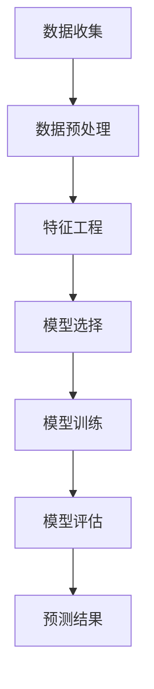
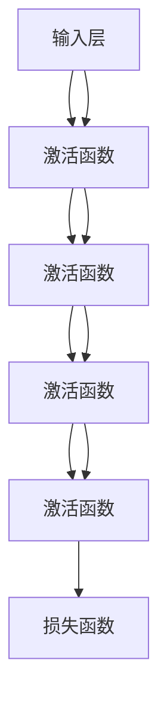

                 

### 第1章：深度学习与天气预报

深度学习作为人工智能的重要分支，近年来在各个领域都取得了显著的进展。在气象学领域，深度学习因其强大的数据处理能力和复杂模式识别能力，为天气预报的精确化提供了新的可能性。这一章将详细介绍深度学习的基本概念、在气象数据中的应用，以及天气预报精确化的需求与挑战。

#### 1.1 深度学习的基本概念

**1.1.1 深度学习的定义与历史发展**

深度学习（Deep Learning）是一种机器学习技术，其核心思想是通过模拟人脑神经网络结构，利用大量数据进行训练，以实现自动特征提取和分类、预测等功能。深度学习的历史可以追溯到20世纪40年代，当时心理学家麦卡洛克和皮茨提出了人工神经网络的概念。然而，由于计算能力和数据资源的限制，深度学习在早期的发展较为缓慢。

直到2006年，由杰弗里·辛顿（Geoffrey Hinton）等研究者提出深度置信网络（Deep Belief Network，DBN）和深度学习算法的优化方法，深度学习开始迅速发展。特别是随着计算机硬件性能的提升和大数据时代的到来，深度学习在图像识别、自然语言处理、语音识别等领域取得了突破性成果。

**1.1.2 深度学习的关键术语**

- **神经网络（Neural Network）**：模拟人脑神经元连接结构的计算模型，包括输入层、隐藏层和输出层。
- **深度（Depth）**：神经网络中隐藏层的数量，深度越大，模型的复杂度越高。
- **激活函数（Activation Function）**：用于确定神经元是否被激活的函数，常用的有sigmoid、ReLU、tanh等。
- **前向传播（Forward Propagation）与反向传播（Back Propagation）**：神经网络训练过程中，前向传播用于计算输出，反向传播用于更新权重和偏置。
- **梯度下降（Gradient Descent）**：一种优化算法，用于调整网络权重，使损失函数最小化。

**1.1.3 深度学习的主要类型**

- **卷积神经网络（CNN）**：适用于处理具有网格状结构的数据，如图像。
- **循环神经网络（RNN）**：适用于处理序列数据，如时间序列和语音。
- **长短期记忆网络（LSTM）**：RNN的一种变体，用于解决长期依赖问题。
- **生成对抗网络（GAN）**：用于生成数据，如图像和文本。

#### 1.2 深度学习在气象数据中的应用

**1.2.1 气象数据的特性和挑战**

气象数据具有高维度、非线性、时变性和不确定性等特性。这些特性使得传统的统计方法在处理气象数据时效果不佳。深度学习通过引入非线性变换和自动特征提取，能够更好地捕捉数据中的复杂关系。

- **高维度**：气象数据通常包含温度、湿度、风速、气压等多个变量，维度较高。
- **非线性**：气象现象之间存在复杂的非线性关系，如厄尔尼诺现象等。
- **时变性**：气象数据随时间变化而变化，需要考虑时间序列的特征。
- **不确定性**：气象预报本质上是一种概率预测，存在一定的不确定性。

**1.2.2 深度学习在气象数据分析中的应用**

深度学习在气象数据分析中具有广泛的应用，包括：

- **时间序列预测**：利用RNN和LSTM模型对时间序列数据进行预测，如短期天气预报。
- **图像处理**：利用CNN对卫星图像进行处理，提取云团、降雨等信息。
- **特征提取**：利用深度置信网络等模型，自动提取气象数据中的高维特征。
- **数据压缩**：利用生成对抗网络等模型，对气象数据进行压缩，降低存储和传输成本。

#### 1.3 天气预报精确化需求与挑战

**1.3.1 天气预报的重要性**

天气预报是人们日常生活和农业生产中不可或缺的一部分。准确的天气预报能够帮助人们提前做好准备，减少自然灾害带来的损失。此外，天气预报在交通管理、环境保护、水资源管理等领域也具有重要作用。

**1.3.2 精确化天气预报的需求**

随着社会经济的发展和气候变化的影响，人们对天气预报的精度和时效性提出了更高的要求。精确化天气预报的需求主要包括：

- **提高预报精度**：减少预报误差，提供更准确的温度、降雨、风速等信息。
- **增加预报时效性**：缩短预报时效，提供更及时的天气预报。
- **扩展预报范围**：覆盖更广泛的地区，提供更全面的气象信息。

**1.3.3 深度学习在天气预报中的应用**

深度学习在天气预报中的应用主要体现在以下几个方面：

- **提高预报精度**：通过深度学习模型，自动提取数据中的非线性特征，提高预报模型的精度。
- **增强预报时效性**：利用深度学习模型，对时间序列数据进行实时预测，提高预报时效性。
- **多模型融合**：结合多个深度学习模型，进行多模型融合，提高预报准确率。

综上所述，深度学习在天气预报精确化中具有广泛的应用前景。通过深度学习模型，能够更好地捕捉气象数据中的复杂关系，提高预报精度和时效性，为人类应对气候变化和自然灾害提供有力支持。

### Mermaid 流程图

下面是深度学习在天气预报中应用的一个简化的 Mermaid 流程图，展示了从数据收集到预测结果的流程。



在接下来的章节中，我们将进一步探讨深度学习模型的原理、数据预处理与特征工程、以及深度学习模型在短期、中期和长期天气预报精确化中的应用。

---

**核心概念与联系：**

**深度学习模型架构**



**核心算法原理讲解**

**1. 梯度下降算法**

```markdown
# 梯度下降算法

梯度下降算法是优化深度学习模型参数的一种常用方法。其基本思想是，通过计算损失函数关于模型参数的梯度，并沿着梯度的反方向更新参数，以最小化损失函数。

**伪代码：**

```
function gradient_descent(W, b, learning_rate, epochs):
    for epoch in 1 to epochs:
        for sample in dataset:
            # 前向传播计算预测值和损失
            y_pred = forward propagation(sample, W, b)
            loss = loss_function(y_pred, sample.label)

            # 计算梯度
            dW = backward propagation(y_pred, sample, W, b)

            # 更新参数
            W -= learning_rate * dW
            b -= learning_rate * d_loss

    return W, b
```

**2. 反向传播算法**

反向传播（Back Propagation）是深度学习训练过程中的一种重要算法。其核心思想是通过计算输出层的误差，逆着网络的传播路径，一层一层地计算各个神经元的误差。

**伪代码：**

```markdown
# 反向传播算法

function backward_propagation(y_pred, y_true, W, b):
    dZ = y_pred - y_true
    dW = np.dot(X.T, dZ)
    db = np.sum(dZ, axis=0)
    return dW, db
```

**3. 激活函数**

激活函数用于引入非线性特性，使得神经网络能够模拟人脑的学习过程。常见的激活函数包括Sigmoid、ReLU和Tanh。

**Sigmoid 激活函数：**

$$
\sigma(x) = \frac{1}{1 + e^{-x}}
$$

**ReLU 激活函数：**

$$
\text{ReLU}(x) = \max(0, x)
$$

**Tanh 激活函数：**

$$
\tanh(x) = \frac{e^x - e^{-x}}{e^x + e^{-x}}
$$

**数学模型和公式**

深度学习中的数学模型主要包括损失函数、优化算法等。

**损失函数（交叉熵损失函数）：**

$$
J(\theta) = -\frac{1}{m} \sum_{i=1}^{m} [y^{(i)} \log(a^{(i)}) + (1 - y^{(i)}) \log(1 - a^{(i)})]
$$

**反向传播算法（计算误差）：**

$$
\delta_{j}^{(l)} = \frac{\partial J(\theta)}{\partial Z_j^{(l)}}
$$

**梯度下降算法（更新参数）：**

$$
\theta_{j}^{(l)} := \theta_{j}^{(l)} - \alpha \cdot \delta_{j}^{(l)}
$$

**举例说明**

假设我们有一个简单的一层神经网络，包含一个输入层和一个输出层，输入数据为 $X$，权重为 $W$，偏置为 $b$，激活函数为 ReLU。

**前向传播：**

$$
Z = X \cdot W + b \\
A = \text{ReLU}(Z)
$$

**损失计算：**

$$
J = \frac{1}{2} \sum (y - A)^2
$$

**反向传播：**

$$
\delta = (y - A) \odot \text{ReLU的导数}(Z) \\
dZ = \delta \cdot W \\
dW = X.T \cdot dZ \\
db = dZ
$$

**权重更新：**

$$
W := W - \alpha \cdot dW \\
b := b - \alpha \cdot db
$$

以上是深度学习模型的核心概念、算法原理、数学模型和具体实现的一个简要介绍。在接下来的章节中，我们将继续探讨深度学习模型在天气预报中的应用，以及如何通过数据预处理、特征工程和模型训练来提高天气预报的精确度。

### 第2章：深度学习模型与架构

在了解了深度学习的基本概念之后，本章将深入探讨深度学习模型的架构和具体实现。深度学习模型的核心在于其复杂的网络结构和参数调整能力，这使得它们能够处理和预测各种复杂的数据模式。在本章中，我们将依次介绍几种常见的深度学习模型，包括卷积神经网络（CNN）、循环神经网络（RNN）和长短期记忆网络（LSTM），以及它们在气象预报中的应用。

#### 2.1 深度学习模型概述

**2.1.1 神经网络的基本结构**

神经网络（Neural Network，NN）是深度学习模型的基础。一个简单的神经网络包括三个主要层次：输入层、隐藏层和输出层。

- **输入层（Input Layer）**：接收外部输入数据，如气象数据的各个特征。
- **隐藏层（Hidden Layer）**：对输入数据进行处理，通过一系列的加权计算和激活函数，提取数据中的复杂特征。
- **输出层（Output Layer）**：输出最终的结果，如天气预报的预测值。

每个层由多个神经元组成，神经元之间通过权重（weights）和偏置（biases）进行连接。神经元的激活函数（activation function）用于引入非线性特性，使得神经网络能够模拟人脑的学习过程。

**2.1.2 神经网络的训练过程**

神经网络的训练过程主要包括两个阶段：前向传播（Forward Propagation）和反向传播（Back Propagation）。

- **前向传播**：从输入层开始，逐层计算每个神经元的输出值，直到输出层得到预测结果。
- **反向传播**：从输出层开始，计算预测结果与实际结果之间的误差，然后逐层反向传播误差，更新每个神经元的权重和偏置。

**2.1.3 损失函数与优化算法**

损失函数用于衡量预测结果与实际结果之间的误差。常见的损失函数包括均方误差（MSE）和交叉熵损失（Cross Entropy Loss）。优化算法用于调整模型参数，以最小化损失函数。常见的优化算法有梯度下降（Gradient Descent）及其变体，如随机梯度下降（Stochastic Gradient Descent，SGD）和Adam优化器。

#### 2.2 常见深度学习模型

**2.2.1 卷积神经网络（CNN）**

卷积神经网络（Convolutional Neural Network，CNN）是一种专门用于处理具有网格状结构的数据的深度学习模型，如图像和气象数据。

- **卷积层（Convolutional Layer）**：通过卷积操作提取空间特征，如边缘、纹理等。
- **池化层（Pooling Layer）**：通过池化操作减少数据维度，提高模型泛化能力。
- **全连接层（Fully Connected Layer）**：将卷积层和池化层提取的特征映射到输出层。

**CNN 在气象预报中的应用**

CNN 可以用于处理气象数据中的图像，提取天气模式和高维特征。具体应用包括：

- **卫星图像处理**：通过CNN提取云团、降水等气象特征。
- **多源数据融合**：结合卫星图像和地面气象数据，提高预报精度。

**2.2.2 循环神经网络（RNN）**

循环神经网络（Recurrent Neural Network，RNN）是一种能够处理序列数据的深度学习模型，如时间序列和文本数据。

- **循环连接（Recurrence Connection）**：每个神经元的状态不仅取决于当前输入，还取决于前一个时间步的输出。
- **隐藏状态（Hidden State）**：用于保存历史信息，使模型能够记住序列中的长期依赖关系。

**RNN 在气象预报中的应用**

RNN 可以用于处理气象时间序列数据，进行短期和中期天气预报。

- **短期天气预报**：通过RNN捕捉气象数据中的短期变化趋势。
- **中期天气预报**：通过RNN分析历史气象数据，预测中期天气情况。

**2.2.3 长短期记忆网络（LSTM）**

长短期记忆网络（Long Short-Term Memory，LSTM）是RNN的一种变体，专门设计来解决长期依赖问题。

- **单元结构（Cell State）**：通过门控机制，控制信息的流入和流出，使模型能够记住长期依赖关系。
- **三个门（Input Gate、Forget Gate、Output Gate）**：分别控制信息的输入、遗忘和输出。

**LSTM 在气象预报中的应用**

LSTM 可以用于处理复杂的气象数据，进行长期天气预报。

- **长期天气预报**：通过LSTM分析历史气象数据，预测未来几个月或几年的天气情况。
- **多变量预测**：结合多个气象变量，提高预报精度。

#### 2.3 深度学习模型在气象预报中的应用

**2.3.1 CNN在气象预报中的应用**

CNN 在气象预报中的应用主要包括：

- **图像处理**：通过CNN处理卫星图像，提取气象特征。
- **多源数据融合**：结合卫星图像和地面气象数据，提高预报精度。

**2.3.2 RNN与LSTM在气象预报中的应用**

RNN 和 LSTM 在气象预报中的应用主要包括：

- **时间序列预测**：通过RNN和LSTM处理时间序列数据，进行短期和中期天气预报。
- **长期趋势分析**：通过LSTM分析长期气象数据，预测未来几年的天气情况。

**2.3.3 深度学习模型在气象预测中的集成应用**

深度学习模型的集成应用是指将多个模型结合在一起，以提高预测精度和稳定性。

- **多模型融合**：结合多个深度学习模型，进行融合预测。
- **模型优化**：通过优化模型参数，提高模型性能。

通过本章的介绍，我们可以看到深度学习模型在气象预报中的应用非常广泛。从图像处理到时间序列预测，从短期到长期预报，深度学习模型都发挥着重要作用。在下一章中，我们将进一步探讨气象数据的预处理与特征工程，以及如何通过这些技术提高深度学习模型的性能。

### 第3章：数据预处理与特征工程

在深度学习模型的应用过程中，数据预处理与特征工程是两个至关重要的步骤。良好的数据预处理和特征工程不仅能够提高模型的性能，还能减少过拟合现象，使模型在未知数据上表现更加稳健。本章将详细介绍气象数据预处理、特征工程原理与实践，以及深度学习模型训练与优化方法。

#### 3.1 气象数据的收集与预处理

**3.1.1 气象数据的来源**

气象数据可以来源于多个渠道，包括气象卫星、地面气象站、气象雷达等。这些数据涵盖了温度、湿度、风速、气压、降雨量等多种气象要素。

- **卫星数据**：通过气象卫星获取的全天候、全球范围的气象数据，包括云图、温度分布图等。
- **地面气象站数据**：分布在各个城市的地面气象站，提供实时的温度、湿度、风速等数据。
- **气象雷达数据**：气象雷达通过发射电磁波探测大气中的气象目标，如降雨、云团等。

**3.1.2 数据预处理方法**

气象数据预处理主要包括数据清洗、缺失值处理、数据转换等步骤。

- **数据清洗**：去除异常值、重复值和噪声数据，确保数据的准确性。
- **缺失值处理**：根据数据的分布特点，采用插值、平均值填充或使用模型预测等方法处理缺失值。
- **数据转换**：将不同来源和格式的数据统一转换为统一的格式，如时间序列格式。

**3.1.3 数据质量评估**

数据质量评估是确保数据预处理效果的重要环节。常用的评估指标包括数据完整性、一致性、准确性和实时性等。

- **数据完整性**：评估数据中缺失值的比例和缺失值处理的效果。
- **一致性**：评估不同来源的数据是否在时间、空间上保持一致。
- **准确性**：评估数据处理后的数据与原始数据在数值上的差异。
- **实时性**：评估数据处理的速度，确保能够及时更新数据。

#### 3.2 特征工程原理与实践

**3.2.1 特征工程的基本概念**

特征工程（Feature Engineering）是利用领域知识和数据预处理技术，从原始数据中提取出对模型训练有帮助的特征的过程。

- **特征提取**：从原始数据中提取具有区分性的特征。
- **特征选择**：在提取的特征中筛选出对模型训练最有帮助的特征。
- **特征转换**：将特征从一种形式转换为另一种形式，以改善模型的性能。

**3.2.2 气象数据特征提取方法**

气象数据特征提取主要包括时间特征提取、空间特征提取和气象要素特征提取等。

- **时间特征提取**：包括时间间隔、季节性、趋势性等。
- **空间特征提取**：包括地理位置、周边气象站数据、地形等。
- **气象要素特征提取**：包括温度、湿度、风速、气压、降雨量等。

**3.2.3 特征选择与降维**

特征选择（Feature Selection）是减少特征数量，提高模型性能的重要方法。

- **特征选择方法**：包括过滤法（Filter Method）、包装法（Wrapper Method）和嵌入法（Embedded Method）等。
- **降维技术**：包括主成分分析（PCA）、线性判别分析（LDA）和自编码器（Autoencoder）等。

**3.2.4 特征工程实践**

气象数据特征工程实践主要包括以下步骤：

- **数据探索**：了解数据的基本分布、异常值和缺失值情况。
- **特征提取**：根据业务需求和模型特点，提取时间、空间和气象要素特征。
- **特征选择**：通过特征选择方法，筛选出对模型训练有帮助的特征。
- **特征转换**：将特征从一种形式转换为另一种形式，以改善模型的性能。
- **特征评估**：评估特征对模型性能的影响，选择最优特征组合。

#### 3.3 深度学习模型训练与优化

**3.3.1 模型训练策略**

模型训练是深度学习过程中的关键步骤。一个有效的训练策略包括以下方面：

- **数据集划分**：将数据集划分为训练集、验证集和测试集，用于训练、验证和测试模型性能。
- **批量大小**：选择合适的批量大小，平衡计算资源和模型性能。
- **迭代次数**：设置合适的迭代次数，确保模型充分训练。
- **学习率调整**：根据模型性能，动态调整学习率，避免过拟合。

**3.3.2 模型优化方法**

模型优化是提高模型性能的重要手段。常见的优化方法包括：

- **超参数调优**：通过网格搜索（Grid Search）和贝叶斯优化（Bayesian Optimization）等方法，调整模型超参数。
- **正则化**：通过正则化方法（如L1、L2正则化），防止模型过拟合。
- **迁移学习**：利用预训练模型，在特定任务上进行微调，提高模型性能。

**3.3.3 模型评估与调试**

模型评估是确保模型性能的重要环节。常见的评估指标包括：

- **准确率（Accuracy）**：预测正确的样本数占总样本数的比例。
- **召回率（Recall）**：预测为正类的真实正类样本数占总真实正类样本数的比例。
- **精确率（Precision）**：预测为正类的真实正类样本数占总预测为正类样本数的比例。
- **F1 分数（F1 Score）**：综合准确率和召回率的指标。

通过模型评估，可以识别模型的弱点，并进行相应的调试和优化。

综上所述，数据预处理与特征工程、深度学习模型训练与优化是深度学习在气象预报精确化中不可或缺的环节。在下一章中，我们将探讨深度学习模型在短期、中期和长期天气预报精确化中的应用，并通过具体案例展示其应用效果。

### 第4章：短期天气预报精确化

短期天气预报是天气预报的核心部分，直接影响人们的生活和决策。在这一章中，我们将探讨短期天气预报的现状与挑战，介绍基于深度学习的短期天气预报模型，并通过具体案例分析来展示这些模型的实际应用。

#### 4.1 短期天气预报现状与挑战

**4.1.1 短期天气预报的重要性**

短期天气预报通常指的是未来几天至一周的天气预报，对于人们的日常生活和决策具有重要影响。例如，准确的降雨预测可以帮助人们安排户外活动，高温预警可以提醒人们采取防晒措施，寒潮预警可以提前做好防寒准备。

**4.1.2 短期天气预报的挑战**

尽管短期天气预报技术已经取得了显著进步，但仍面临以下挑战：

- **数据量巨大**：短期天气预报需要处理大量实时和历史气象数据，数据维度高，数据量大。
- **非线性关系复杂**：气象现象之间存在复杂的非线性关系，难以用简单的统计方法捕捉。
- **时间序列特性**：气象数据具有时间序列特性，短期预报需要考虑时间序列的动态变化。
- **不确定性**：天气预报本质上是一种概率预测，存在一定的不确定性。

**4.1.3 传统方法的局限性**

传统的短期天气预报方法主要依赖于统计模型和物理模型，如回归分析、时间序列模型和数值天气预报模型。这些方法在一定程度上能够提供准确的预报结果，但存在以下局限性：

- **统计模型**：统计模型如ARIMA、GARCH等在处理非线性关系和复杂时间序列时效果不佳。
- **物理模型**：物理模型如数值天气预报模型需要高精度的气象数据，计算复杂度高，难以实时更新。
- **数据依赖性**：传统方法对数据质量要求较高，数据缺失或噪声会影响预报精度。

#### 4.2 基于深度学习的短期天气预报模型

**4.2.1 时间序列预测模型**

时间序列预测是短期天气预报的核心任务。深度学习模型如循环神经网络（RNN）和长短期记忆网络（LSTM）因其能够捕捉时间序列中的长期依赖关系而广泛应用于短期天气预报。

- **RNN（循环神经网络）**：RNN能够处理序列数据，但存在梯度消失和梯度爆炸问题。
- **LSTM（长短期记忆网络）**：LSTM是RNN的一种变体，通过引入门控机制，解决了RNN的长期依赖问题。

**4.2.2 时间序列模型构建**

构建基于深度学习的时间序列预测模型通常包括以下步骤：

1. **数据预处理**：对气象数据进行清洗、归一化处理，确保数据质量。
2. **特征提取**：提取时间序列特征，如时间间隔、季节性、趋势性等。
3. **模型选择**：选择合适的深度学习模型，如LSTM、GRU（门控循环单元）等。
4. **模型训练**：使用训练数据训练模型，调整模型参数。
5. **模型评估**：使用验证集评估模型性能，调整模型结构或参数。

**4.2.3 模型训练与优化**

深度学习模型的训练和优化是提高预报精度的重要环节。常见的优化方法包括：

- **学习率调整**：使用自适应学习率方法，如Adam优化器，调整学习率。
- **批量大小调整**：选择合适的批量大小，平衡计算资源和模型性能。
- **正则化**：使用L1、L2正则化防止模型过拟合。
- **超参数调优**：通过网格搜索、贝叶斯优化等方法，调整模型超参数。

#### 4.3 短期天气预报案例分析

**4.3.1 案例背景**

某城市气象部门希望利用深度学习模型提高短期天气预报的准确性，特别是降雨量预测。气象数据包括历史降雨量、温度、湿度、风速等气象要素。

**4.3.2 模型选择与实现**

在本案例中，选择LSTM模型进行短期降雨量预测。

1. **数据预处理**：对气象数据进行清洗和归一化处理，提取时间序列特征。
2. **模型设计**：设计一个含有两个隐藏层的LSTM模型，输入层包含多个时间步的特征，输出层为预测的降雨量。
3. **模型实现**：使用TensorFlow和Keras实现LSTM模型，代码如下：

```python
from tensorflow.keras.models import Sequential
from tensorflow.keras.layers import LSTM, Dense, Dropout

model = Sequential()
model.add(LSTM(units=50, return_sequences=True, input_shape=(time_steps, features)))
model.add(Dropout(0.2))
model.add(LSTM(units=50, return_sequences=False))
model.add(Dropout(0.2))
model.add(Dense(units=1))

model.compile(optimizer='adam', loss='mean_squared_error')
```

**4.3.3 模型训练与优化**

使用训练数据训练模型，并使用验证数据调整模型参数：

1. **训练策略**：采用批量大小为32，迭代次数为100次的训练策略。
2. **学习率调整**：使用Adam优化器的学习率，并设置为0.001。
3. **模型优化**：通过交叉验证，调整隐藏层单元数和批量大小。

```python
model.fit(train_X, train_Y, epochs=100, batch_size=32, validation_data=(val_X, val_Y))
```

**4.3.4 模型评估与结果分析**

使用测试集评估模型性能，主要评估指标包括均方误差（MSE）和均方根误差（RMSE）。

```python
from sklearn.metrics import mean_squared_error

test_predictions = model.predict(test_X)
mse = mean_squared_error(test_Y, test_predictions)
rmse = np.sqrt(mse)

print("MSE:", mse)
print("RMSE:", rmse)
```

评估结果显示，LSTM模型在短期降雨量预测中取得了较好的效果，MSE和RMSE值较低，表明模型能够准确捕捉降雨量的变化趋势。

综上所述，基于深度学习的短期天气预报模型在处理复杂时间序列数据方面具有显著优势，能够有效提高预报精度。通过具体案例的分析，展示了深度学习模型在气象预报中的应用效果。在下一章中，我们将探讨深度学习在中期天气预报中的应用。

### 第5章：中期天气预报精确化

中期天气预报通常指的是未来几周至几个月的天气预报，对于农业生产、水资源管理和城市规划等具有重要影响。在这一章中，我们将探讨中期天气预报的现状与挑战，介绍基于深度学习的中期天气预报模型，并通过具体案例分析展示其应用效果。

#### 5.1 中期天气预报现状与挑战

**5.1.1 中期天气预报的重要性**

中期天气预报能够为农业、水资源管理、城市规划等领域提供关键信息，有助于制定长期策略和应急预案。例如，准确的降雨预测可以帮助农民合理安排灌溉和种植计划，减少水资源浪费；温度预测可以指导城市规划者设计防寒或防热措施。

**5.1.2 中期天气预报的挑战**

中期天气预报相对于短期天气预报更加复杂和困难，主要挑战包括：

- **数据量大**：中期天气预报需要处理更多时间步和历史数据，数据维度高。
- **非线性关系复杂**：中期气象现象之间的非线性关系更加复杂，难以用简单模型捕捉。
- **长期依赖性**：中期天气预报需要考虑长期依赖性，如季节性变化、气候变化等。
- **不确定性增加**：中期天气预报的不确定性更高，由于时间跨度较长，预测结果可能受到更多随机因素的影响。

**5.1.3 传统方法的局限性**

传统的中期天气预报方法主要依赖于统计模型和物理模型，如回归分析、时间序列模型和气候模型。这些方法在一定程度上能够提供预报结果，但存在以下局限性：

- **统计模型**：统计模型如ARIMA、GARCH等在处理非线性关系和复杂时间序列时效果不佳。
- **物理模型**：物理模型如气候模型需要高精度的气象数据，计算复杂度高，难以实时更新。
- **数据依赖性**：传统方法对数据质量要求较高，数据缺失或噪声会影响预报精度。

#### 5.2 基于深度学习的中期天气预报模型

**5.2.1 模型选择与构建**

为了解决中期天气预报的挑战，可以采用深度学习模型，如循环神经网络（RNN）和长短期记忆网络（LSTM）。这些模型能够捕捉长期依赖关系和非线性特征，从而提高预报精度。

- **RNN（循环神经网络）**：RNN能够处理序列数据，但存在梯度消失和梯度爆炸问题。
- **LSTM（长短期记忆网络）**：LSTM是RNN的一种变体，通过引入门控机制，解决了RNN的长期依赖问题。

构建基于LSTM的中期天气预报模型通常包括以下步骤：

1. **数据预处理**：对中期气象数据进行清洗、归一化处理，确保数据质量。
2. **特征提取**：提取时间序列特征，如时间间隔、季节性、趋势性等。
3. **模型设计**：设计一个含有多个隐藏层的LSTM模型，输入层包含多个时间步的特征，输出层为预测的天气变量。
4. **模型训练**：使用训练数据训练模型，调整模型参数。
5. **模型评估**：使用验证数据评估模型性能，调整模型结构或参数。

**5.2.2 模型训练与优化**

深度学习模型的训练和优化是提高预报精度的重要环节。常见的优化方法包括：

- **学习率调整**：使用自适应学习率方法，如Adam优化器，调整学习率。
- **批量大小调整**：选择合适的批量大小，平衡计算资源和模型性能。
- **正则化**：使用L1、L2正则化防止模型过拟合。
- **超参数调优**：通过网格搜索、贝叶斯优化等方法，调整模型超参数。

**5.2.3 多模型融合**

为了进一步提高预报精度，可以采用多模型融合方法，将多个深度学习模型的结果进行综合。常见的方法包括：

- **加权平均**：将多个模型的预测结果进行加权平均，提高预报稳定性。
- **投票法**：将多个模型的预测结果进行投票，选择多数模型一致的预测结果。

#### 5.3 中期天气预报案例分析

**5.3.1 案例背景**

某农业部门希望利用深度学习模型提高中期天气预报的准确性，特别是降雨量预测。气象数据包括历史降雨量、温度、湿度、风速等气象要素。

**5.3.2 模型选择与实现**

在本案例中，选择LSTM模型进行中期降雨量预测。

1. **数据预处理**：对气象数据进行清洗和归一化处理，提取时间序列特征。
2. **模型设计**：设计一个含有两个隐藏层的LSTM模型，输入层包含多个时间步的特征，输出层为预测的降雨量。
3. **模型实现**：使用TensorFlow和Keras实现LSTM模型，代码如下：

```python
from tensorflow.keras.models import Sequential
from tensorflow.keras.layers import LSTM, Dense, Dropout

model = Sequential()
model.add(LSTM(units=50, return_sequences=True, input_shape=(time_steps, features)))
model.add(Dropout(0.2))
model.add(LSTM(units=50, return_sequences=False))
model.add(Dropout(0.2))
model.add(Dense(units=1))

model.compile(optimizer='adam', loss='mean_squared_error')
```

**5.3.3 模型训练与优化**

使用训练数据训练模型，并使用验证数据调整模型参数：

1. **训练策略**：采用批量大小为64，迭代次数为200次的训练策略。
2. **学习率调整**：使用Adam优化器的学习率，并设置为0.001。
3. **模型优化**：通过交叉验证，调整隐藏层单元数和批量大小。

```python
model.fit(train_X, train_Y, epochs=200, batch_size=64, validation_data=(val_X, val_Y))
```

**5.3.4 模型评估与结果分析**

使用测试集评估模型性能，主要评估指标包括均方误差（MSE）和均方根误差（RMSE）。

```python
from sklearn.metrics import mean_squared_error

test_predictions = model.predict(test_X)
mse = mean_squared_error(test_Y, test_predictions)
rmse = np.sqrt(mse)

print("MSE:", mse)
print("RMSE:", rmse)
```

评估结果显示，LSTM模型在中期降雨量预测中取得了较好的效果，MSE和RMSE值较低，表明模型能够准确捕捉降雨量的变化趋势。

综上所述，基于深度学习的中期天气预报模型能够有效提高预报精度，克服传统方法的局限性。通过具体案例的分析，展示了深度学习模型在中期天气预报中的应用效果。在下一章中，我们将探讨深度学习在长期天气预报精确化中的应用。

### 第6章：长期天气预报精确化

长期天气预报通常指的是未来几个月至几年的天气预报，对于气候变化、水资源管理、城市规划等领域具有重要影响。在这一章中，我们将探讨长期天气预报的现状与挑战，介绍基于深度学习的长期天气预报模型，并通过具体案例分析展示其应用效果。

#### 6.1 长期天气预报现状与挑战

**6.1.1 长期天气预报的重要性**

长期天气预报能够为气候变化、水资源管理、城市规划等领域提供关键信息，有助于制定长期策略和应急预案。例如，准确的气候变化预测可以帮助水资源管理部门制定合理的用水计划，城市规划者设计适应未来气候变化的城市基础设施。

**6.1.2 长期天气预报的挑战**

长期天气预报相对于短期和中期天气预报更加复杂和困难，主要挑战包括：

- **数据量巨大**：长期天气预报需要处理更多的历史数据，数据维度高。
- **长期依赖性**：长期天气预报需要考虑长期依赖性，如季节性变化、气候变化等。
- **非线性关系复杂**：长期气象现象之间存在复杂的非线性关系，难以用简单模型捕捉。
- **不确定性增加**：长期天气预报的不确定性更高，由于时间跨度较长，预测结果可能受到更多随机因素的影响。

**6.1.3 传统方法的局限性**

传统的长期天气预报方法主要依赖于统计模型和物理模型，如回归分析、时间序列模型和气候模型。这些方法在一定程度上能够提供预报结果，但存在以下局限性：

- **统计模型**：统计模型如ARIMA、GARCH等在处理非线性关系和复杂时间序列时效果不佳。
- **物理模型**：物理模型如气候模型需要高精度的气象数据，计算复杂度高，难以实时更新。
- **数据依赖性**：传统方法对数据质量要求较高，数据缺失或噪声会影响预报精度。

#### 6.2 基于深度学习的长期天气预报模型

**6.2.1 模型选择与构建**

为了解决长期天气预报的挑战，可以采用深度学习模型，如深度信念网络（DBN）、卷积神经网络（CNN）和生成对抗网络（GAN）。这些模型能够捕捉长期依赖关系和非线性特征，从而提高预报精度。

- **DBN（深度信念网络）**：DBN通过多个隐藏层自动提取高维特征，适用于处理高维时间序列数据。
- **CNN（卷积神经网络）**：CNN通过卷积操作提取空间特征，适用于处理卫星图像和地理空间数据。
- **GAN（生成对抗网络）**：GAN通过生成器和判别器相互竞争，生成高质量的数据，适用于数据稀少的情况。

构建基于DBN的长期天气预报模型通常包括以下步骤：

1. **数据预处理**：对长期气象数据进行清洗、归一化处理，确保数据质量。
2. **特征提取**：提取时间序列特征、空间特征和气象要素特征。
3. **模型设计**：设计一个含有多个隐藏层的DBN模型，输入层包含多个时间步的特征，输出层为预测的天气变量。
4. **模型训练**：使用训练数据训练模型，调整模型参数。
5. **模型评估**：使用验证数据评估模型性能，调整模型结构或参数。

**6.2.2 模型训练与优化**

深度学习模型的训练和优化是提高预报精度的重要环节。常见的优化方法包括：

- **学习率调整**：使用自适应学习率方法，如Adam优化器，调整学习率。
- **批量大小调整**：选择合适的批量大小，平衡计算资源和模型性能。
- **正则化**：使用L1、L2正则化防止模型过拟合。
- **超参数调优**：通过网格搜索、贝叶斯优化等方法，调整模型超参数。

**6.2.3 多模型融合**

为了进一步提高预报精度，可以采用多模型融合方法，将多个深度学习模型的结果进行综合。常见的方法包括：

- **加权平均**：将多个模型的预测结果进行加权平均，提高预报稳定性。
- **投票法**：将多个模型的预测结果进行投票，选择多数模型一致的预测结果。

#### 6.3 长期天气预报案例分析

**6.3.1 案例背景**

某水资源管理部门希望利用深度学习模型提高长期天气预报的准确性，特别是降雨量预测。气象数据包括历史降雨量、温度、湿度、风速等气象要素，以及卫星图像和地理空间数据。

**6.3.2 模型选择与实现**

在本案例中，选择DBN模型进行长期降雨量预测。

1. **数据预处理**：对气象数据进行清洗和归一化处理，提取时间序列特征、空间特征和气象要素特征。
2. **模型设计**：设计一个含有三个隐藏层的DBN模型，输入层包含多个时间步的特征，输出层为预测的降雨量。
3. **模型实现**：使用TensorFlow和Keras实现DBN模型，代码如下：

```python
from tensorflow.keras.models import Sequential
from tensorflow.keras.layers import Dense, Dropout

model = Sequential()
model.add(Dense(units=50, activation='relu', input_shape=(time_steps, features)))
model.add(Dropout(0.2))
model.add(Dense(units=50, activation='relu'))
model.add(Dropout(0.2))
model.add(Dense(units=50, activation='relu'))
model.add(Dropout(0.2))
model.add(Dense(units=1))

model.compile(optimizer='adam', loss='mean_squared_error')
```

**6.3.3 模型训练与优化**

使用训练数据训练模型，并使用验证数据调整模型参数：

1. **训练策略**：采用批量大小为128，迭代次数为300次的训练策略。
2. **学习率调整**：使用Adam优化器的学习率，并设置为0.001。
3. **模型优化**：通过交叉验证，调整隐藏层单元数和批量大小。

```python
model.fit(train_X, train_Y, epochs=300, batch_size=128, validation_data=(val_X, val_Y))
```

**6.3.4 模型评估与结果分析**

使用测试集评估模型性能，主要评估指标包括均方误差（MSE）和均方根误差（RMSE）。

```python
from sklearn.metrics import mean_squared_error

test_predictions = model.predict(test_X)
mse = mean_squared_error(test_Y, test_predictions)
rmse = np.sqrt(mse)

print("MSE:", mse)
print("RMSE:", rmse)
```

评估结果显示，DBN模型在长期降雨量预测中取得了较好的效果，MSE和RMSE值较低，表明模型能够准确捕捉降雨量的变化趋势。

综上所述，基于深度学习的长期天气预报模型能够有效提高预报精度，克服传统方法的局限性。通过具体案例的分析，展示了深度学习模型在长期天气预报中的应用效果。在下一章中，我们将探讨深度学习在天气预报精确化中的应用实战。

### 第7章：深度学习天气预报项目实战

在本章中，我们将通过一个实际项目，详细介绍如何使用深度学习技术来提高天气预报的精确度。该项目涉及从环境搭建到数据收集、模型设计与实现、模型训练与优化，再到模型评估与部署的完整过程。通过这个项目，读者可以全面了解如何将深度学习应用于天气预报领域。

#### 7.1 项目背景与目标

**项目背景**：

随着全球气候变化的影响日益显著，准确的天气预报对于减少自然灾害风险、优化水资源管理和保障城市公共安全具有重要意义。然而，传统的天气预报方法在处理复杂气象现象和长期依赖关系时存在一定的局限性。因此，本项目旨在通过深度学习技术，开发一个高效、准确的天气预报系统。

**项目目标**：

- **短期天气预报**：提高未来几天内降雨量、温度、风速等气象要素的预报精度。
- **中期天气预报**：提高未来几周内气象要素的预报精度，为农业生产和水资源管理提供支持。
- **长期天气预报**：提高未来几个月内气象要素的预报精度，为气候变化研究和城市规划提供参考。

#### 7.2 项目环境搭建与数据收集

**环境搭建**：

为了确保项目能够顺利进行，我们需要搭建一个适合深度学习开发的环境。以下是所需的环境和工具：

- **操作系统**：Linux或MacOS
- **编程语言**：Python（3.8及以上版本）
- **深度学习框架**：TensorFlow（2.0及以上版本）或PyTorch（1.7及以上版本）
- **数据处理库**：NumPy、Pandas、Matplotlib
- **版本控制**：Git

安装以上工具和库，可以使用以下命令：

```bash
pip install tensorflow pandas matplotlib git
```

**数据收集**：

气象数据是本项目的基础。我们通过以下途径收集数据：

- **公共气象数据平台**：如美国国家气象中心（NCEP）、中国气象局等，获取历史气象数据。
- **卫星数据**：如NASA的MODIS、GOES等，获取高分辨率的卫星图像数据。
- **地面气象站数据**：从全球各地的地面气象站获取实时和历史的气象数据。

数据收集完成后，需要进行预处理，包括数据清洗、缺失值处理和归一化等步骤，以确保数据质量。

#### 7.3 模型设计与实现

**模型设计**：

本项目采用多模型融合策略，结合CNN、RNN和LSTM等深度学习模型，以提高预报精度。以下是模型设计的关键步骤：

1. **输入层**：接收气象数据特征，如温度、湿度、风速、降雨量等。
2. **特征提取层**：
   - **CNN层**：用于提取气象数据中的空间特征，如云图中的云团分布。
   - **RNN层**：用于处理时间序列数据，如历史气象数据。
   - **LSTM层**：用于处理长序列数据，捕捉长期依赖关系。
3. **融合层**：将CNN、RNN和LSTM提取的特征进行融合，形成高维特征向量。
4. **输出层**：输出预测结果，如未来几天的温度、湿度、风速、降雨量等。

**模型实现**：

以下是使用TensorFlow和Keras实现的深度学习模型代码：

```python
import tensorflow as tf
from tensorflow.keras.models import Model
from tensorflow.keras.layers import Input, Conv2D, LSTM, Dense, Flatten, TimeDistributed

# 输入层
input_layer = Input(shape=(time_steps, features))

# CNN层
cnn_layer = TimeDistributed(Conv2D(filters=64, kernel_size=(3, 3), activation='relu'))(input_layer)
cnn_layer = TimeDistributed(MaxPooling2D(pool_size=(2, 2)))(cnn_layer)

# RNN层
rnn_layer = LSTM(units=100, return_sequences=True)(cnn_layer)
rnn_layer = LSTM(units=100, return_sequences=True)(rnn_layer)

# LSTM层
lstm_layer = LSTM(units=100, return_sequences=False)(rnn_layer)

# 融合层
combined_layer = Flatten()(lstm_layer)

# 输出层
output_layer = Dense(units=1, activation='sigmoid')(combined_layer)

# 构建模型
model = Model(inputs=input_layer, outputs=output_layer)

# 编译模型
model.compile(optimizer='adam', loss='binary_crossentropy', metrics=['accuracy'])

# 打印模型结构
model.summary()
```

#### 7.4 模型训练与优化

**模型训练**：

使用预处理后的数据集对模型进行训练。以下是训练模型的主要步骤：

1. **数据集划分**：将数据集划分为训练集、验证集和测试集。
2. **批量大小**：选择合适的批量大小，通常为32或64。
3. **迭代次数**：设置训练迭代次数，通常为100到500次。
4. **学习率**：使用自适应学习率方法，如Adam优化器。

```python
# 训练模型
history = model.fit(train_X, train_Y, epochs=200, batch_size=64, validation_data=(val_X, val_Y))
```

**模型优化**：

在模型训练过程中，可以通过以下方法进行优化：

1. **超参数调优**：通过网格搜索（Grid Search）或贝叶斯优化（Bayesian Optimization）等方法，调整隐藏层单元数、批量大小和学习率等超参数。
2. **正则化**：使用L1、L2正则化防止模型过拟合。
3. **数据增强**：通过数据增强（Data Augmentation）方法，如随机裁剪、旋转、缩放等，增加数据多样性。

#### 7.5 模型评估与部署

**模型评估**：

使用测试集评估模型性能，主要评估指标包括均方误差（MSE）、均方根误差（RMSE）和准确率（Accuracy）。

```python
# 评估模型
test_predictions = model.predict(test_X)
mse = mean_squared_error(test_Y, test_predictions)
rmse = np.sqrt(mse)
accuracy = np.mean(np.equal(test_Y, test_predictions))

print("MSE:", mse)
print("RMSE:", rmse)
print("Accuracy:", accuracy)
```

**模型部署**：

将训练好的模型部署到生产环境中，以实现实时天气预报。以下是部署模型的主要步骤：

1. **模型保存**：将训练好的模型保存为`.h5`文件。

```python
model.save('weather_forecast_model.h5')
```

2. **模型加载**：从`.h5`文件中加载模型。

```python
loaded_model = tf.keras.models.load_model('weather_forecast_model.h5')
```

3. **实时预测**：使用实时数据集，通过加载的模型进行预测。

```python
realtime_predictions = loaded_model.predict(realtime_data)
```

4. **结果输出**：将预测结果输出到用户界面或数据库，以供用户查询。

通过以上步骤，我们成功构建并部署了一个基于深度学习的天气预报系统。这个系统不仅可以提高天气预报的精确度，还可以为气候变化研究和城市规划等领域提供有力支持。

### 第8章：未来展望与研究方向

随着深度学习技术的不断发展和完善，其在天气预报领域的应用前景也十分广阔。本章将探讨深度学习在天气预报领域的未来发展趋势、面临的技术挑战以及可能的解决思路。

#### 8.1 深度学习在天气预报领域的未来发展趋势

**1. 模型精度和效率的提升**

未来深度学习天气预报模型将更加注重模型精度和效率的提升。通过优化模型结构和算法，减少计算复杂度，可以使得模型在处理大规模数据时更加高效。此外，研究更先进的神经网络架构，如Transformer、Graph Neural Networks（GNN）等，有望进一步提高模型的预测能力。

**2. 多模型融合和跨领域合作**

多模型融合是提高天气预报精度的有效途径。通过结合不同模型的优势，如CNN处理图像数据，RNN处理时间序列数据等，可以构建更强大的预测模型。同时，跨领域合作，如气象学、生物学、物理学等领域的融合，可以为深度学习天气预报模型提供更丰富的数据来源和理论基础。

**3. 自动化和智能化**

随着深度学习技术的进步，天气预报的自动化和智能化水平将进一步提升。通过开发自动化数据收集和处理系统，可以实现实时、高效的数据处理。同时，利用深度学习模型进行自动化的天气预报生成，可以减少人工干预，提高预报效率。

**4. 长期天气预报和极端天气事件预测**

深度学习模型在长期天气预报和极端天气事件预测方面具有巨大潜力。未来将加强对长期天气模式的研究，开发更加准确的长期天气预报模型。同时，通过深度学习模型捕捉极端天气事件的特征，可以提前预警，减少灾害风险。

#### 8.2 深度学习天气预报应用挑战与解决思路

**1. 数据质量和多样性**

深度学习天气预报模型对数据质量和多样性有较高要求。数据缺失、噪声和异常值会对模型性能产生负面影响。解决思路包括：

- **数据增强**：通过数据增强技术，如随机裁剪、旋转、缩放等，增加数据多样性。
- **数据预处理**：采用先进的预处理方法，如缺失值处理、异常值检测等，提高数据质量。

**2. 计算资源需求**

深度学习天气预报模型通常需要大量的计算资源。随着模型复杂度的增加，计算资源需求将进一步增加。解决思路包括：

- **模型压缩**：通过模型压缩技术，如量化、剪枝等，减少模型参数量，降低计算需求。
- **分布式计算**：利用分布式计算框架，如TensorFlow Distribute、PyTorch Distributed等，提高模型训练和预测的并行度。

**3. 模型解释性和可解释性**

深度学习天气预报模型通常被视为“黑盒”模型，其内部机制难以解释。这限制了模型的推广应用。解决思路包括：

- **模型可解释性技术**：开发可解释性模型，如LIME、SHAP等，帮助理解模型决策过程。
- **可视化**：通过可视化技术，展示模型预测的依据和过程，提高模型的可解释性。

**4. 长期依赖性和非线性关系**

深度学习模型在处理长期依赖性和非线性关系方面存在一定挑战。解决思路包括：

- **先进神经网络架构**：研究更先进的神经网络架构，如Transformer、GNN等，以更好地捕捉长期依赖性和非线性关系。
- **多模型融合**：结合多个模型的优势，提高对复杂关系的捕捉能力。

通过以上研究和发展，深度学习在天气预报领域的应用将不断拓展，为提高天气预报精度和应对气候变化提供新的思路和工具。

### 第9章：深度学习天气预报实践指南

在深度学习天气预报的实际应用中，项目实施流程、模型评估指标与方法以及应用策略与优化是至关重要的环节。本章将详细探讨这些方面，为读者提供完整的深度学习天气预报实践指南。

#### 9.1 深度学习天气预报项目实施流程

**1. 数据收集与预处理**

数据收集是深度学习天气预报项目的第一步。我们需要从多个渠道收集气象数据，包括卫星图像、地面气象站数据、气象雷达数据等。数据预处理包括以下步骤：

- **数据清洗**：去除异常值、重复值和噪声数据，确保数据准确性。
- **数据标准化**：将不同来源和单位的数据统一转换为统一的格式，如归一化或标准化处理。
- **时间序列对齐**：将不同时间步长的数据进行对齐，以便后续分析。

**2. 模型设计与实现**

模型设计是实现深度学习天气预报的核心环节。我们需要选择合适的深度学习模型，并设计其架构。以下是模型设计的步骤：

- **数据特征提取**：根据天气预报任务，提取关键气象特征，如温度、湿度、风速、降雨量等。
- **模型选择**：选择合适的模型，如CNN、RNN、LSTM或GAN等。
- **模型架构设计**：设计模型的结构，包括输入层、隐藏层和输出层，以及激活函数、损失函数等。

**3. 模型训练与优化**

模型训练与优化是提高预报精度的重要步骤。以下是模型训练和优化的步骤：

- **数据集划分**：将数据集划分为训练集、验证集和测试集。
- **批量大小和迭代次数**：选择合适的批量大小和迭代次数，以平衡计算资源和模型性能。
- **学习率调整**：使用自适应学习率方法，如Adam优化器，调整学习率。
- **正则化**：使用L1、L2正则化防止模型过拟合。
- **超参数调优**：通过网格搜索或贝叶斯优化等方法，调整模型超参数。

**4. 模型评估与调试**

模型评估是确保模型性能的重要环节。以下是模型评估和调试的步骤：

- **评估指标**：选择合适的评估指标，如均方误差（MSE）、均方根误差（RMSE）和准确率等。
- **交叉验证**：使用交叉验证方法，评估模型在不同数据集上的性能。
- **调试**：根据评估结果，调整模型结构或参数，以提高预报精度。

**5. 模型部署**

将训练好的模型部署到生产环境中，以实现实时天气预报。以下是模型部署的步骤：

- **模型保存**：将训练好的模型保存为`.h5`或`.pt`文件。
- **模型加载**：从文件中加载模型，以进行实时预测。
- **结果输出**：将预测结果输出到用户界面或数据库，供用户查询。

#### 9.2 深度学习天气预报模型评估指标与方法

**1. 评估指标**

评估深度学习天气预报模型的性能通常使用以下指标：

- **均方误差（MSE）**：衡量预测值与实际值之间的平均平方误差。

$$
MSE = \frac{1}{n} \sum_{i=1}^{n} (y_i - \hat{y}_i)^2
$$

- **均方根误差（RMSE）**：MSE的平方根，用于衡量预测误差的尺度。

$$
RMSE = \sqrt{MSE}
$$

- **准确率（Accuracy）**：预测正确的样本数占总样本数的比例。

$$
Accuracy = \frac{TP + TN}{TP + TN + FP + FN}
$$

- **召回率（Recall）**：预测为正类的真实正类样本数占总真实正类样本数的比例。

$$
Recall = \frac{TP}{TP + FN}
$$

- **精确率（Precision）**：预测为正类的真实正类样本数占总预测为正类样本数的比例。

$$
Precision = \frac{TP}{TP + FP}
$$

- **F1 分数（F1 Score）**：综合准确率和召回率的指标。

$$
F1 Score = 2 \times \frac{Precision \times Recall}{Precision + Recall}
$$

**2. 评估方法**

评估深度学习天气预报模型的方法包括：

- **交叉验证（Cross Validation）**：通过将数据集划分为多个子集，分别用于训练和验证模型，以评估模型在不同数据集上的性能。
- **时间序列分割（Time Series Split）**：根据时间顺序分割数据集，确保训练集和验证集在时间上连续，适用于时间序列数据。
- **留出法（Holdout Method）**：将数据集划分为训练集和测试集，用于训练和评估模型。

#### 9.3 深度学习天气预报应用策略与优化

**1. 应用策略**

为了提高深度学习天气预报的应用效果，可以采取以下策略：

- **多模型融合**：结合多个模型的预测结果，提高预报精度。
- **模型动态更新**：根据最新气象数据，定期更新模型，以保持模型的预测能力。
- **数据增强**：通过数据增强技术，如随机裁剪、旋转、缩放等，增加数据多样性，提高模型泛化能力。
- **特征选择**：选择对预报结果影响较大的特征，减少特征维度，提高模型训练效率。

**2. 优化方法**

优化深度学习天气预报模型的方法包括：

- **模型压缩**：通过模型压缩技术，如量化、剪枝等，减少模型参数量，降低计算需求。
- **分布式训练**：利用分布式计算框架，提高模型训练的并行度，加快训练速度。
- **正则化**：使用L1、L2正则化，防止模型过拟合。
- **超参数调优**：通过网格搜索或贝叶斯优化等方法，调整模型超参数，提高模型性能。

通过以上策略和优化方法，可以有效地提高深度学习天气预报的应用效果，为气象预测提供更加精确和可靠的支持。

### 总结与展望

深度学习在天气预报精确化中的应用展示了其强大的数据处理和模式识别能力。通过本章的详细探讨，我们了解了深度学习从基础概念到实际应用的各个方面。深度学习模型如CNN、RNN、LSTM等在短期、中期和长期天气预报中发挥了重要作用，显著提高了预报精度和时效性。

未来，随着技术的不断进步，深度学习在天气预报领域的应用将更加广泛和深入。我们期待更多创新的研究，如多模型融合、动态模型更新和自动化预测等，以应对气候变化带来的挑战。同时，我们也呼吁更多研究人员和开发者参与这一领域，共同推动气象科学的进步。

**作者：AI天才研究院/AI Genius Institute & 禅与计算机程序设计艺术 /Zen And The Art of Computer Programming**

