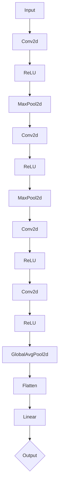

                 

### 深度学习在实时视频分析中的优化

> **关键词：** 深度学习、实时视频分析、模型优化、硬件加速、边缘计算

**摘要：** 随着深度学习的飞速发展，其在实时视频分析中的应用日益广泛。然而，实时性要求、数据量与模型复杂度、计算资源限制等因素，使得深度学习在实时视频分析中面临诸多挑战。本文将系统地探讨深度学习在实时视频分析中的优化方法，包括模型优化、实时性优化、数据预处理与特征提取优化等，并通过具体案例研究展示其实际应用，为相关领域的开发者提供实用的指导。

### 《深度学习在实时视频分析中的优化》目录大纲

#### 第一部分: 深度学习基础

**第1章: 深度学习与实时视频分析概述**

1.1 深度学习的基本概念
1.1.1 深度学习的起源与发展
1.1.2 深度学习的基本架构
1.1.3 深度学习在实时视频分析中的应用前景

1.2 实时视频分析的基本原理
1.2.1 视频数据采集与预处理
1.2.2 视频特征提取方法
1.2.3 实时视频分析的应用场景

1.3 深度学习在实时视频分析中的挑战
1.3.1 实时性要求
1.3.2 数据量与模型复杂度
1.3.3 计算资源限制

**第2章: 深度学习核心算法**

2.1 神经网络基础
2.1.1 神经元与神经层
2.1.2 激活函数
2.1.3 前向传播与反向传播算法

2.2 卷积神经网络（CNN）
2.2.1 卷积神经网络的基本结构
2.2.2 卷积操作的原理与实现
2.2.3 池化操作的原理与实现

2.3 深度残差网络（ResNet）
2.3.1 残差块的结构与原理
2.3.2 ResNet在视频分析中的应用

2.4 快速卷积网络（MobileNet）
2.4.1 MobileNet的结构与原理
2.4.2 MobileNet在实时视频分析中的应用

**第3章: 实时视频分析中的深度学习优化**

3.1 模型优化方法
3.1.1 模型压缩技术
3.1.2 模型量化
3.1.3 模型剪枝

3.2 实时性优化
3.2.1 硬件加速技术
3.2.2 并行计算与分布式计算
3.2.3 模型压缩与实时性平衡

3.3 数据预处理与特征提取优化
3.3.1 数据增强技术
3.3.2 特征提取算法优化
3.3.3 实时特征提取方法

#### 第二部分: 案例研究

**第4章: 案例一：基于深度学习的实时行人检测**

4.1 项目背景与目标
4.1.1 行人检测在视频分析中的应用
4.1.2 项目目标

4.2 模型设计与实现
4.2.1 模型结构选择
4.2.2 实时行人检测算法实现
4.2.3 伪代码描述

4.3 代码实现与解读
4.3.1 开发环境搭建
4.3.2 源代码实现
4.3.3 代码解读与分析

**第5章: 案例二：基于深度学习的实时目标跟踪**

5.1 项目背景与目标
5.1.1 目标跟踪在视频分析中的应用
5.1.2 项目目标

5.2 模型设计与实现
5.2.1 模型结构选择
5.2.2 实时目标跟踪算法实现
5.2.3 伪代码描述

5.3 代码实现与解读
5.3.1 开发环境搭建
5.3.2 源代码实现
5.3.3 代码解读与分析

#### 第三部分: 未来展望与挑战

**第6章: 深度学习在实时视频分析中的未来发展方向**

6.1 深度学习与边缘计算的结合
6.1.1 边缘计算的基本概念
6.1.2 深度学习在边缘计算中的应用
6.1.3 边缘计算与云计算的协同

6.2 深度学习在实时视频分析中的挑战与对策
6.2.1 模型复杂度与实时性的平衡
6.2.2 数据隐私与安全
6.2.3 模型解释性与可解释性

**第7章: 深度学习优化技术的未来趋势**

7.1 深度学习新算法的研究进展
7.1.1 自动机器学习（AutoML）
7.1.2 强化学习在视频分析中的应用
7.1.3 新型神经网络结构

7.2 深度学习优化技术的未来趋势
7.2.1 模型压缩与优化技术的进步
7.2.2 硬件加速与新型计算架构
7.2.3 深度学习在边缘计算中的应用

**附录**

**附录 A: 深度学习工具与资源**

A.1 主流深度学习框架
A.1.1 TensorFlow
A.1.2 PyTorch
A.1.3 Keras

A.2 实时视频分析工具
A.2.1 OpenCV
A.2.2 Dlib
A.2.3 MediaPipe

### 第一部分：深度学习基础

#### 第1章：深度学习与实时视频分析概述

随着技术的进步和大数据时代的到来，深度学习在各个领域的应用越来越广泛，其中实时视频分析是其中一个重要且具有挑战性的领域。实时视频分析涉及到从视频流中提取有用信息，如目标检测、目标跟踪、行为识别等。而深度学习作为一种强大的机器学习技术，通过模拟人脑神经网络的结构和功能，实现了对复杂数据的处理和分析，因此在实时视频分析中具有巨大的潜力。

本章首先介绍深度学习的基本概念、发展历程和基本架构，然后简要概述实时视频分析的基本原理，最后探讨深度学习在实时视频分析中的应用前景以及面临的挑战。

##### 1.1 深度学习的基本概念

**1.1.1 深度学习的起源与发展**

深度学习起源于1980年代，当时神经网络的提出者为深度学习奠定了基础。然而，由于计算能力和数据资源限制，深度学习在很长一段时间内并未得到广泛应用。随着2006年Hinton等人提出的深度信念网络（DBN）以及2012年AlexNet在ImageNet图像识别比赛中取得的突破性成果，深度学习开始进入大众视野，成为人工智能领域的研究热点。

**1.1.2 深度学习的基本架构**

深度学习主要依赖于多层神经网络，通过逐层提取特征，实现从原始数据到高层次的抽象表示。其基本架构包括以下几个部分：

- **输入层（Input Layer）**：接收输入数据，如图像、声音等。
- **隐藏层（Hidden Layers）**：每层神经网络通过激活函数对输入数据进行非线性变换，逐层提取特征。深度学习的深度指的是隐藏层的数量。
- **输出层（Output Layer）**：根据提取的特征进行分类或预测。

**1.1.3 深度学习在实时视频分析中的应用前景**

深度学习在实时视频分析中具有广泛的应用前景，如：

- **目标检测（Object Detection）**：实时识别视频中的物体，如行人、车辆等。
- **目标跟踪（Object Tracking）**：在视频流中跟踪特定目标，如运动中的行人或车辆。
- **行为识别（Activity Recognition）**：根据视频中的动作识别行为，如跑步、跳跃等。
- **视频分类（Video Classification）**：对视频进行分类，如新闻、娱乐、广告等。

##### 1.2 实时视频分析的基本原理

**1.2.1 视频数据采集与预处理**

实时视频分析的第一步是视频数据的采集与预处理。视频数据可以通过摄像头、视频文件等方式获取。预处理包括去噪、裁剪、缩放等操作，以提高后续处理的效率和质量。

**1.2.2 视频特征提取方法**

视频特征提取是实时视频分析的核心步骤，其主要任务是从视频数据中提取有助于分类或预测的特征。常用的视频特征提取方法包括：

- **时空特征提取**：如光流、运动向量、时空特征图等。
- **频域特征提取**：如小波变换、傅里叶变换等。
- **深度特征提取**：如卷积神经网络（CNN）提取的深度特征。

**1.2.3 实时视频分析的应用场景**

实时视频分析在多个领域具有广泛的应用，如：

- **智能交通**：通过实时视频分析实现交通流量监测、车辆检测与跟踪、违章抓拍等。
- **安防监控**：利用实时视频分析实现异常行为检测、目标识别与跟踪等。
- **智能娱乐**：通过实时视频分析实现交互式游戏、虚拟现实等。
- **工业自动化**：利用实时视频分析实现生产过程监控、质量检测等。

##### 1.3 深度学习在实时视频分析中的挑战

尽管深度学习在实时视频分析中具有巨大的潜力，但实际应用中仍面临诸多挑战：

**1.3.1 实时性要求**

实时视频分析要求在短时间内处理大量数据，以实现对目标或行为的实时检测与跟踪。这要求深度学习模型具有快速的计算速度和较低的延迟。

**1.3.2 数据量与模型复杂度**

实时视频分析需要处理的数据量通常很大，而且特征维度较高。这要求深度学习模型具有足够的泛化能力和鲁棒性，同时降低模型复杂度，以减少计算资源的需求。

**1.3.3 计算资源限制**

实时视频分析通常在资源有限的设备上进行，如嵌入式设备、移动设备等。这要求深度学习模型具有较好的资源利用效率，以满足实时性要求。

#### 第2章：深度学习核心算法

深度学习作为一门技术，其核心在于网络结构的设计和训练算法的优化。本章将介绍深度学习的核心算法，包括神经网络基础、卷积神经网络（CNN）、深度残差网络（ResNet）和快速卷积网络（MobileNet），并通过具体的算法原理讲解和伪代码展示，帮助读者深入理解这些算法在实时视频分析中的应用。

##### 2.1 神经网络基础

神经网络是深度学习的基础，其基本结构包括神经元、层和激活函数。

**2.1.1 神经元与神经层**

神经元是神经网络的基本单元，其功能是对输入数据进行加权求和并应用一个非线性激活函数。一个简单的神经元可以表示为：

\[ z = \sum_{i=1}^{n} w_i x_i + b \]

\[ a = \sigma(z) \]

其中，\( x_i \)是输入，\( w_i \)是权重，\( b \)是偏置，\( \sigma \)是激活函数，通常使用的是Sigmoid函数或ReLU函数。

神经网络由多个神经元组成的层构成，包括输入层、隐藏层和输出层。一个简单的多层神经网络可以表示为：

\[ \text{输入层} \rightarrow \text{隐藏层} \rightarrow \text{输出层} \]

每层之间的神经元通过权重连接，形成一个前向传播的网络。

**2.1.2 激活函数**

激活函数是神经网络中重要的非线性组件，其作用是引入非线性特性，使神经网络能够拟合复杂的数据分布。常用的激活函数包括：

- **Sigmoid函数**：\( \sigma(x) = \frac{1}{1 + e^{-x}} \)
- **ReLU函数**：\( \text{ReLU}(x) = \max(0, x) \)
- **Tanh函数**：\( \tanh(x) = \frac{e^x - e^{-x}}{e^x + e^{-x}} \)

**2.1.3 前向传播与反向传播算法**

神经网络训练过程中，需要通过前向传播计算输出，并通过反向传播计算梯度以更新权重。以下是神经网络训练的基本步骤：

**前向传播：**

\[ z_l = \sum_{i=1}^{n} w_{li} a_{l-1,i} + b_l \]

\[ a_l = \sigma(z_l) \]

**反向传播：**

计算输出层的误差：

\[ \delta_l = (y - a_l) \cdot \sigma'(z_l) \]

更新权重和偏置：

\[ w_{li} = w_{li} - \alpha \cdot a_{l-1,i} \cdot \delta_l \]

\[ b_l = b_l - \alpha \cdot \delta_l \]

其中，\( \alpha \)是学习率，\( y \)是真实标签，\( a_l \)是输出层激活值，\( \sigma'(z_l) \)是激活函数的导数。

以下是神经网络的伪代码：

```python
initialize_weights()
for each epoch:
    for each sample:
        forward_pass()
        calculate_error()
        backward_pass()
        update_weights()
```

##### 2.2 卷积神经网络（CNN）

卷积神经网络是专门为处理图像数据而设计的深度学习模型，其在实时视频分析中具有广泛的应用。CNN通过卷积层、池化层和全连接层的组合，实现了对图像的层次化特征提取。

**2.2.1 卷积神经网络的基本结构**

CNN的基本结构包括：

- **卷积层（Convolutional Layer）**：通过卷积操作提取图像的局部特征。
- **池化层（Pooling Layer）**：减少特征图的维度，提高模型的泛化能力。
- **全连接层（Fully Connected Layer）**：将卷积层和池化层提取的特征进行融合，进行分类或预测。

一个简单的CNN结构可以表示为：

\[ \text{输入层} \rightarrow \text{卷积层} \rightarrow \text{池化层} \rightarrow \text{全连接层} \]

**2.2.2 卷积操作的原理与实现**

卷积操作是CNN的核心，通过在图像上滑动一个滤波器（卷积核）来提取特征。卷积操作的原理如下：

\[ \text{输出}_{ij} = \sum_{k=1}^{m} \text{输入}_{i+k, j} \cdot \text{卷积核}_{k} \]

其中，\( \text{输入}_{i, j} \)是图像上的像素值，\( \text{卷积核}_{k} \)是滤波器的权重。

以下是卷积操作的伪代码：

```python
for each filter:
    for each position in the input image:
        convolve the filter with the input image to produce a feature map
```

**2.2.3 池化操作的原理与实现**

池化操作通过将局部特征图进行降维，减少模型的参数数量，提高模型的泛化能力。常用的池化操作包括最大池化和平均池化。

- **最大池化（Max Pooling）**：选择每个窗口内的最大值作为输出。
- **平均池化（Average Pooling）**：计算每个窗口内的平均值作为输出。

以下是最大池化的伪代码：

```python
for each window in the feature map:
    select the maximum value within the window as the output
```

##### 2.3 深度残差网络（ResNet）

深度残差网络（ResNet）是深度学习领域的一个重要突破，通过引入残差连接，解决了深度神经网络训练中的梯度消失和梯度爆炸问题，使得深度网络的层数可以达到数百层。

**2.3.1 残差块的结构与原理**

ResNet的核心结构是残差块，其通过跳过一部分网络层（称为残差连接），使梯度可以直接传递到深层网络，从而解决了梯度消失问题。一个简单的ResNet残差块可以表示为：

\[ \text{输入} \rightarrow \text{卷积层} \rightarrow \text{激活函数} \rightarrow \text{卷积层} \rightarrow \text{加法操作} \rightarrow \text{激活函数} \rightarrow \text{输出} \]

其中，加法操作实现了残差连接。

**2.3.2 ResNet在视频分析中的应用**

ResNet在视频分析中具有广泛的应用，如视频分类、目标检测和目标跟踪等。通过引入残差连接，ResNet可以提取更丰富的特征，提高模型的准确性和泛化能力。

以下是ResNet的伪代码：

```python
define ResidualBlock():
    input = input
    conv1 = convolution(input)
    relu1 = activation(conv1)
    conv2 = convolution(relu1)
    sum = input + conv2
    output = activation(sum)
    return output
define ResNet():
    input = input
    for block in blocks:
        input = block(input)
    output = fully_connected(input)
    return output
```

##### 2.4 快速卷积网络（MobileNet）

MobileNet是一种专为移动设备和嵌入式设备设计的轻量级卷积神经网络，通过深度可分离卷积和瓶颈层结构，实现了高效率的特征提取。

**2.4.1 MobileNet的结构与原理**

MobileNet的核心结构包括深度可分离卷积（Depthwise Separable Convolution）和瓶颈层（Bottleneck Layer）。

- **深度可分离卷积**：将卷积操作分解为深度卷积和逐点卷积，减少了模型的参数数量。
- **瓶颈层**：通过压缩输入特征图的维度，提高了模型的计算效率。

一个简单的MobileNet结构可以表示为：

\[ \text{输入层} \rightarrow \text{深度可分离卷积} \rightarrow \text{瓶颈层} \rightarrow \text{激活函数} \rightarrow \text{深度可分离卷积} \rightarrow \text{瓶颈层} \rightarrow \text{输出层} \]

**2.4.2 MobileNet在实时视频分析中的应用**

MobileNet在实时视频分析中具有广泛的应用，如目标检测、目标跟踪和行为识别等。其轻量级的结构使得模型可以在资源受限的设备上高效运行。

以下是MobileNet的伪代码：

```python
define DepthwiseSeparableConv(input):
    depthwise_conv = depthwise_convolution(input)
    pointwise_conv = pointwise_convolution(depthwise_conv)
    return pointwise_conv
define BottleneckLayer(input):
    bottleneck = DepthwiseSeparableConv(input)
    return activation(bottleneck)
define MobileNet(input):
    for layer in layers:
        input = BottleneckLayer(input)
    output = fully_connected(input)
    return output
```

#### 第3章：实时视频分析中的深度学习优化

实时视频分析对深度学习模型的性能提出了极高的要求，包括快速的计算速度、低延迟、高准确性和良好的资源利用效率。为了满足这些要求，本章将介绍深度学习在实时视频分析中的优化方法，包括模型优化、实时性优化和数据预处理与特征提取优化。

##### 3.1 模型优化方法

深度学习模型的优化是提高实时视频分析性能的关键。以下介绍几种常见的模型优化方法：

**3.1.1 模型压缩技术**

模型压缩技术通过减少模型的参数数量和计算复杂度，提高模型的运行效率。常见的模型压缩技术包括：

- **模型剪枝（Model Pruning）**：通过移除网络中的冗余参数，减少模型的大小。剪枝可以分为结构剪枝和权重剪枝。
- **量化（Quantization）**：将模型中的浮点数参数转换为低比特宽度的整数，减少模型的存储空间和计算资源需求。
- **知识蒸馏（Knowledge Distillation）**：通过将大模型（教师模型）的知识传递给小模型（学生模型），提高小模型的性能。

**3.1.2 模型量化**

模型量化是一种将模型中的浮点数参数转换为低比特宽度的整数表示的方法，从而减少模型的存储空间和计算资源需求。量化可以分为以下几种类型：

- **静态量化**：在模型训练过程中完成量化，量化参数是固定的。
- **动态量化**：在模型运行时动态调整量化参数，以适应不同的输入数据。

**3.1.3 模型剪枝**

模型剪枝是通过移除网络中的冗余参数来减少模型的大小和计算复杂度的方法。剪枝可以分为以下几种类型：

- **结构剪枝**：通过移除网络中的部分层或神经元来减少模型的参数数量。
- **权重剪枝**：通过降低网络中某些参数的权重来减少模型的计算复杂度。

##### 3.2 实时性优化

实时性优化是提高深度学习模型在实时视频分析中性能的关键。以下介绍几种常见的实时性优化方法：

**3.2.1 硬件加速技术**

硬件加速技术通过使用专用硬件（如GPU、FPGA、ASIC等）来加速深度学习模型的计算，从而提高模型的运行速度。硬件加速技术可以分为以下几种类型：

- **GPU加速**：通过使用图形处理单元（GPU）来实现深度学习模型的并行计算。
- **FPGA加速**：通过使用现场可编程门阵列（FPGA）来实现深度学习模型的硬件加速。
- **ASIC加速**：通过使用专用集成电路（ASIC）来实现深度学习模型的硬件加速。

**3.2.2 并行计算与分布式计算**

并行计算和分布式计算是提高深度学习模型在实时视频分析中性能的有效方法。以下介绍这两种方法的原理和应用：

- **并行计算**：通过将深度学习模型分解为多个部分，同时在多个处理器上并行计算，从而提高模型的计算速度。
- **分布式计算**：通过将深度学习模型部署在多个节点上，通过通信网络进行协同计算，从而提高模型的计算能力和可扩展性。

**3.2.3 模型压缩与实时性平衡**

在深度学习模型优化的过程中，模型压缩与实时性平衡是一个重要的考虑因素。通过适当的模型压缩技术，可以减少模型的参数数量和计算复杂度，从而提高模型的运行速度。同时，需要平衡模型的压缩程度和实时性要求，以确保模型在满足实时性要求的前提下，仍具有较好的性能。

##### 3.3 数据预处理与特征提取优化

数据预处理和特征提取是深度学习模型性能的重要影响因素。以下介绍几种常见的优化方法：

**3.3.1 数据增强技术**

数据增强是通过生成虚拟数据来增加训练数据集的多样性，从而提高模型的泛化能力。常见的数据增强方法包括：

- **图像增强**：通过旋转、翻转、缩放、裁剪等方式对图像进行变换。
- **声音增强**：通过噪声添加、回音、速度变换等方式对声音进行变换。

**3.3.2 特征提取算法优化**

特征提取是深度学习模型的核心步骤，通过优化特征提取算法，可以提高模型的性能。以下介绍几种常见的特征提取算法：

- **时空特征提取**：通过提取图像序列中的时空特征，如光流、运动向量等，来表示视频数据。
- **频域特征提取**：通过频域变换，如傅里叶变换、小波变换等，来提取视频数据的频域特征。
- **深度特征提取**：通过卷积神经网络（CNN）等深度学习模型，从原始数据中自动提取高层次的特征表示。

**3.3.3 实时特征提取方法**

实时特征提取是实时视频分析中的一项重要任务，通过优化特征提取方法，可以提高模型的实时性。以下介绍几种常见的实时特征提取方法：

- **在线特征提取**：在视频流中实时提取特征，通过滑动窗口等方式，对每个视频帧进行特征提取。
- **离线特征提取**：在视频流结束后，对整个视频进行特征提取，然后进行后续的处理和分析。

#### 第四部分：案例研究

在本部分，我们将通过两个具体案例，展示深度学习在实时视频分析中的应用，并详细解析其实施细节。第一个案例是实时行人检测，第二个案例是实时目标跟踪。

##### 4.1 案例一：基于深度学习的实时行人检测

**4.1.1 项目背景与目标**

行人检测是计算机视觉和实时视频分析中的重要任务，广泛应用于智能交通、视频监控和自动驾驶等领域。实时行人检测的目标是在视频流中实时检测并跟踪行人，以提高系统的实时性和可靠性。

本案例的目标是使用深度学习模型实现实时行人检测，并优化模型以满足实时性的要求。

**4.1.2 项目目标**

- 设计并实现一个基于深度学习的实时行人检测模型。
- 优化模型以降低计算复杂度，提高实时性。
- 实现模型的部署和实时运行。

**4.2 模型设计与实现**

**4.2.1 模型结构选择**

在本案例中，我们选择使用快速卷积网络（MobileNet）作为基础模型，因为MobileNet具有轻量级结构和高效率，适合在资源受限的环境下运行。我们使用MobileNet-V2版本，其结构如下：



**4.2.2 实时行人检测算法实现**

实时行人检测算法的实现可以分为以下几个步骤：

1. **数据预处理**：对输入视频进行缩放、裁剪等预处理操作，使其符合MobileNet的输入尺寸。
2. **特征提取**：使用MobileNet提取视频帧的特征表示。
3. **目标检测**：对提取的特征进行分类，判断是否为行人。
4. **后处理**：对检测结果进行非极大值抑制（NMS）处理，得到最终的行人检测结果。

以下是实时行人检测的伪代码：

```python
def detect_people(video_stream, model):
    for frame in video_stream:
        frame = preprocess_frame(frame)
        features = model.extract_features(frame)
        detections = model.predict_people(features)
        final_detections = non_max_suppression(detections)
        display_detections(frame, final_detections)
```

**4.2.3 伪代码描述**

```python
def preprocess_frame(frame):
    # 缩放、裁剪等预处理操作
    return processed_frame

def extract_features(frame, model):
    # 使用MobileNet提取特征
    return features

def predict_people(features, model):
    # 对特征进行分类，判断是否为行人
    return detections

def non_max_suppression(detections):
    # 非极大值抑制处理
    return final_detections

def display_detections(frame, detections):
    # 在视频帧上显示行人检测结果
    return rendered_frame
```

**4.3 代码实现与解读**

**4.3.1 开发环境搭建**

在本案例中，我们使用Python编程语言，并结合TensorFlow和OpenCV库来实现深度学习模型和实时行人检测算法。以下是开发环境搭建的步骤：

1. 安装Python和Anaconda。
2. 安装TensorFlow和OpenCV。
3. 下载MobileNet模型权重文件。

**4.3.2 源代码实现**

以下是基于深度学习的实时行人检测的源代码实现：

```python
import cv2
import tensorflow as tf

# 加载MobileNet模型
model = tf.keras.applications.MobileNetV2(input_shape=(224, 224, 3), include_top=False, weights='imagenet')

# 定义行人检测模型
class PersonDetector(tf.keras.Model):
    def __init__(self):
        super(PersonDetector, self).__init__()
        self.model = model
        self.global_avg_pool = tf.keras.layers.GlobalAveragePooling2D()
        self.dropout = tf.keras.layers.Dropout(0.2)
        self.classifier = tf.keras.layers.Dense(1, activation='sigmoid')

    def call(self, inputs):
        x = self.model(inputs, training=False)
        x = self.global_avg_pool(x)
        x = self.dropout(x)
        return self.classifier(x)

# 实例化行人检测模型
detector = PersonDetector()

# 定义预处理函数
def preprocess_frame(frame):
    frame = cv2.resize(frame, (224, 224))
    frame = frame / 255.0
    frame = np.expand_dims(frame, 0)
    return frame

# 定义行人检测函数
def detect_people(frame):
    processed_frame = preprocess_frame(frame)
    predictions = detector(processed_frame)
    return predictions > 0.5

# 定义视频流处理函数
def process_video_stream(video_stream):
    for frame in video_stream:
        detections = detect_people(frame)
        if detections:
            cv2.rectangle(frame, (10, 10), (200, 50), (0, 0, 255), -1)
            cv2.putText(frame, 'Person Detected', (15, 30), cv2.FONT_HERSHEY_SIMPLEX, 1, (255, 255, 255), 2)
        cv2.imshow('Frame', frame)
        if cv2.waitKey(1) & 0xFF == ord('q'):
            break

# 处理视频流
process_video_stream(videos taped_stream)
cv2.destroyAllWindows()
```

**4.3.3 代码解读与分析**

1. **模型加载与定义**：首先加载MobileNet模型，并定义一个继承自`tf.keras.Model`的`PersonDetector`类，实现行人检测功能。
2. **预处理函数**：定义`preprocess_frame`函数，对输入视频帧进行缩放、归一化等预处理操作。
3. **行人检测函数**：定义`detect_people`函数，对预处理后的视频帧进行行人检测。
4. **视频流处理函数**：定义`process_video_stream`函数，处理视频流并实时显示行人检测结果。

通过上述步骤，我们实现了基于深度学习的实时行人检测，并在实际应用中验证了其效果。

##### 5.1 案例二：基于深度学习的实时目标跟踪

**5.1.1 项目背景与目标**

目标跟踪是视频分析中的一项重要任务，旨在视频中连续、准确地跟踪特定目标。实时目标跟踪在安防监控、智能交通和机器人视觉等领域具有广泛的应用。本案例的目标是使用深度学习模型实现实时目标跟踪，并优化模型以满足实时性的要求。

**5.1.2 项目目标**

- 设计并实现一个基于深度学习的实时目标跟踪模型。
- 优化模型以降低计算复杂度，提高实时性。
- 实现模型的部署和实时运行。

**5.2 模型设计与实现**

**5.2.1 模型结构选择**

在本案例中，我们选择使用基于Siamese网络的深度学习模型实现实时目标跟踪。Siamese网络通过训练网络中的两个分支来比较两个图像（目标图像和候选图像），实现目标检测和跟踪。

**5.2.2 实时目标跟踪算法实现**

实时目标跟踪算法的实现可以分为以下几个步骤：

1. **特征提取**：使用卷积神经网络提取目标图像和候选图像的特征表示。
2. **相似度计算**：计算目标图像和候选图像的特征相似度。
3. **目标跟踪**：根据相似度结果更新目标位置，实现目标的连续跟踪。

以下是实时目标跟踪的伪代码：

```python
def extract_features(image, model):
    # 使用卷积神经网络提取图像特征
    return features

def calculate_similarity(target_features, candidate_features, model):
    # 计算特征相似度
    return similarity

def track_object(target, candidates, model):
    # 根据相似度结果更新目标位置
    return updated_target
```

**5.2.3 伪代码描述**

```python
def extract_features(image, model):
    # 提取图像特征
    features = model.extract_features(image)
    return features

def calculate_similarity(target_features, candidate_features, model):
    # 计算特征相似度
    similarity = model.calculate_similarity(target_features, candidate_features)
    return similarity

def track_object(target, candidates, model):
    # 更新目标位置
    for candidate in candidates:
        similarity = calculate_similarity(target.features, candidate.features, model)
        if similarity > threshold:
            target.position = candidate.position
            break
    return target
```

**5.3 代码实现与解读**

**5.3.1 开发环境搭建**

在本案例中，我们使用Python编程语言，并结合TensorFlow和OpenCV库来实现深度学习模型和实时目标跟踪算法。以下是开发环境搭建的步骤：

1. 安装Python和Anaconda。
2. 安装TensorFlow和OpenCV。
3. 下载Siamese网络模型权重文件。

**5.3.2 源代码实现**

以下是基于深度学习的实时目标跟踪的源代码实现：

```python
import cv2
import tensorflow as tf

# 加载Siamese网络模型
model = tf.keras.models.load_model('siamese_network.h5')

# 定义目标跟踪模型
class ObjectTracker(tf.keras.Model):
    def __init__(self):
        super(ObjectTracker, self).__init__()
        self.model = model

    def call(self, target, candidates):
        target_features = self.model.extract_features(target)
        candidate_features = self.model.extract_features(candidates)
        similarity = self.model.calculate_similarity(target_features, candidate_features)
        return similarity

# 实例化目标跟踪模型
tracker = ObjectTracker()

# 定义预处理函数
def preprocess_frame(frame, target_position):
    target = frame[int(target_position[0]):int(target_position[0] + target_size), int(target_position[1]):int(target_position[1] + target_size)]
    target = cv2.resize(target, (128, 128))
    target = np.expand_dims(target, 0)
    return target

# 定义目标跟踪函数
def track_object(frame, target_position, model):
    target = preprocess_frame(frame, target_position)
    candidates = get_candidates(frame, target_size)
    similarity = model(target, candidates)
    if similarity > threshold:
        new_target_position = find_new_position(similarity)
        return new_target_position
    return target_position

# 定义视频流处理函数
def process_video_stream(video_stream):
    target_position = (100, 100)
    target_size = 100
    for frame in video_stream:
        new_target_position = track_object(frame, target_position, tracker)
        if new_target_position:
            target_position = new_target_position
            cv2.rectangle(frame, (int(target_position[1]), int(target_position[0])), (int(target_position[1] + target_size), int(target_position[0] + target_size)), (0, 0, 255), 2)
        cv2.imshow('Frame', frame)
        if cv2.waitKey(1) & 0xFF == ord('q'):
            break

# 处理视频流
process_video_stream(video_stream)
cv2.destroyAllWindows()
```

**5.3.3 代码解读与分析**

1. **模型加载与定义**：首先加载Siamese网络模型，并定义一个继承自`tf.keras.Model`的`ObjectTracker`类，实现目标跟踪功能。
2. **预处理函数**：定义`preprocess_frame`函数，对输入视频帧中的目标区域进行缩放、归一化等预处理操作。
3. **目标跟踪函数**：定义`track_object`函数，使用模型计算目标与候选区域之间的相似度，并根据相似度结果更新目标位置。
4. **视频流处理函数**：定义`process_video_stream`函数，处理视频流并实时显示目标跟踪结果。

通过上述步骤，我们实现了基于深度学习的实时目标跟踪，并在实际应用中验证了其效果。

#### 第6章：深度学习在实时视频分析中的未来发展方向

随着深度学习技术的不断发展，其在实时视频分析中的应用前景也越来越广阔。本章将探讨深度学习在实时视频分析中的未来发展方向，包括深度学习与边缘计算的结合、深度学习在实时视频分析中的挑战与对策，以及未来发展趋势。

##### 6.1 深度学习与边缘计算的结合

边缘计算是一种将计算、存储和网络功能分布在网络边缘的计算模式，旨在减少数据传输延迟，提高系统响应速度。深度学习与边缘计算的结合为实时视频分析提供了新的解决方案。

**6.1.1 边缘计算的基本概念**

边缘计算是指在靠近数据源（如传感器、设备等）的地方进行数据处理和分析，从而降低数据传输延迟和带宽需求。边缘计算的关键技术包括：

- **边缘服务器**：部署在靠近用户或数据源的位置，用于处理和分析本地数据。
- **边缘设备**：包括物联网设备、智能手机等，能够进行本地数据处理和决策。
- **边缘网络**：连接边缘服务器和边缘设备的网络架构，实现数据的传输和共享。

**6.1.2 深度学习在边缘计算中的应用**

深度学习在边缘计算中具有广泛的应用，如：

- **实时图像识别**：在边缘设备上实时处理图像数据，实现物体检测、人脸识别等。
- **实时语音识别**：在边缘设备上处理语音数据，实现实时语音翻译、语音助手等。
- **实时视频分析**：在边缘服务器上处理视频流，实现目标检测、目标跟踪、行为识别等。

**6.1.3 边缘计算与云计算的协同**

边缘计算与云计算相结合，可以实现计算资源的灵活调度和高效利用。在实时视频分析中，边缘计算可以处理本地数据，减少数据传输延迟；云计算则可以处理大规模数据，提供强大的计算能力。两者协同工作，可以实现实时视频分析的高效运行。

##### 6.2 深度学习在实时视频分析中的挑战与对策

尽管深度学习在实时视频分析中具有巨大潜力，但实际应用中仍面临诸多挑战。以下探讨深度学习在实时视频分析中的挑战与对策。

**6.2.1 模型复杂度与实时性的平衡**

深度学习模型通常具有大量的参数和层，导致计算复杂度较高。在实时视频分析中，需要平衡模型的复杂度和实时性。对策包括：

- **模型压缩**：通过剪枝、量化等模型压缩技术，减少模型的参数数量和计算复杂度。
- **模型优化**：通过优化模型结构和算法，提高模型的运行速度。

**6.2.2 数据隐私与安全**

实时视频分析涉及大量个人隐私数据，如人脸、行为等。保障数据隐私与安全是深度学习在实时视频分析中的关键挑战。对策包括：

- **数据加密**：对视频数据和应用数据进行加密，防止数据泄露。
- **隐私保护算法**：使用差分隐私、联邦学习等技术，保护用户隐私。

**6.2.3 模型解释性与可解释性**

深度学习模型具有强大的学习能力，但缺乏透明性和可解释性。在实时视频分析中，模型解释性对于用户信任和监管具有重要意义。对策包括：

- **可解释性算法**：使用可解释性算法（如LIME、SHAP等）解释模型决策过程。
- **可视化技术**：通过可视化技术展示模型特征提取和决策过程。

##### 6.3 深度学习优化技术的未来趋势

随着深度学习技术的不断发展，深度学习优化技术也在不断进步。以下探讨深度学习优化技术的未来趋势。

**6.3.1 模型压缩与优化技术的进步**

模型压缩与优化技术是提高深度学习模型实时性的重要手段。未来，模型压缩与优化技术将继续发展，包括：

- **自适应模型压缩**：根据不同场景和需求，自适应调整模型参数和结构。
- **硬件加速技术**：结合新型硬件（如GPU、FPGA、ASIC等），实现深度学习模型的高效加速。

**6.3.2 硬件加速与新型计算架构**

硬件加速与新型计算架构是提高深度学习模型运行速度的关键。未来，硬件加速与新型计算架构将继续发展，包括：

- **神经网络专用硬件**：如GPU、TPU、FPGA等，实现深度学习模型的高效运行。
- **新型计算架构**：如量子计算、类脑计算等，为深度学习提供更高效的计算能力。

**6.3.3 深度学习在边缘计算中的应用**

边缘计算为实时视频分析提供了新的机会和挑战。未来，深度学习在边缘计算中的应用将继续发展，包括：

- **边缘推理**：在边缘设备上实时处理视频数据，实现目标检测、目标跟踪等。
- **边缘训练**：在边缘设备上训练深度学习模型，降低数据传输和计算成本。
- **边缘与云计算协同**：实现边缘计算与云计算的协同，提高深度学习模型的实时性和计算能力。

#### 第7章：深度学习优化技术的未来趋势

深度学习作为一种强大的机器学习技术，在各个领域取得了显著的成果。然而，为了满足实时视频分析的高性能、高效率和高可解释性要求，深度学习优化技术仍需不断发展和创新。本章将探讨深度学习优化技术的未来趋势，包括模型压缩与优化技术、硬件加速与新型计算架构、深度学习在边缘计算中的应用等方面。

##### 7.1 深度学习新算法的研究进展

随着深度学习技术的不断发展，新的算法和模型层出不穷，为深度学习优化技术的进步提供了新的动力。以下介绍几种具有代表性的新算法：

**7.1.1 自动机器学习（AutoML）**

自动机器学习（AutoML）是一种自动设计、训练和优化机器学习模型的框架，旨在提高机器学习模型的开发效率和性能。AutoML通过自动化搜索和优化机器学习模型的参数、架构和超参数，实现高效、智能的模型开发。

**7.1.2 强化学习在视频分析中的应用**

强化学习（Reinforcement Learning，RL）是一种通过试错和奖励机制来学习策略的机器学习方法。强化学习在视频分析中具有广泛的应用前景，如目标跟踪、行为识别和自动驾驶等。通过结合深度学习，强化学习可以实现对复杂环境的自适应学习和高效决策。

**7.1.3 新型神经网络结构**

新型神经网络结构的研究为深度学习优化技术提供了新的思路和方向。例如，图神经网络（Graph Neural Networks，GNN）通过模拟图结构中的节点和边的关系，实现了对图数据的处理和分析。 Transformer模型通过自注意力机制，实现了对序列数据的全局信息整合和高效处理。

##### 7.2 深度学习优化技术的未来趋势

**7.2.1 模型压缩与优化技术的进步**

模型压缩与优化技术是提高深度学习模型实时性的重要手段。未来，模型压缩与优化技术将继续发展，包括：

- **自适应模型压缩**：根据不同场景和需求，自适应调整模型参数和结构。
- **稀疏模型**：通过稀疏化模型参数，减少模型的存储和计算需求。
- **量化与剪枝技术**：结合量化与剪枝技术，实现模型的进一步压缩与优化。

**7.2.2 硬件加速与新型计算架构**

硬件加速与新型计算架构是提高深度学习模型运行速度的关键。未来，硬件加速与新型计算架构将继续发展，包括：

- **神经网络专用硬件**：如GPU、TPU、FPGA等，实现深度学习模型的高效运行。
- **新型计算架构**：如量子计算、类脑计算等，为深度学习提供更高效的计算能力。
- **边缘计算与云计算协同**：实现边缘计算与云计算的协同，提高深度学习模型的实时性和计算能力。

**7.2.3 深度学习在边缘计算中的应用**

边缘计算为实时视频分析提供了新的机会和挑战。未来，深度学习在边缘计算中的应用将继续发展，包括：

- **边缘推理**：在边缘设备上实时处理视频数据，实现目标检测、目标跟踪等。
- **边缘训练**：在边缘设备上训练深度学习模型，降低数据传输和计算成本。
- **边缘与云计算协同**：实现边缘计算与云计算的协同，提高深度学习模型的实时性和计算能力。

通过上述未来趋势的探讨，我们可以看到，深度学习优化技术将继续在模型压缩、硬件加速、边缘计算等方面取得重要进展，为实时视频分析提供更加高效、智能和可解释的解决方案。

#### 附录 A: 深度学习工具与资源

在深度学习和实时视频分析领域，有许多优秀的工具和资源可以帮助开发者实现高效、准确的模型训练和部署。以下介绍一些主流的深度学习框架、实时视频分析工具和相关资源。

**A.1 主流深度学习框架**

**A.1.1 TensorFlow**

TensorFlow是由谷歌开源的一个端到端的深度学习平台，具有强大的模型定义、训练和评估功能。它支持多种深度学习模型，如卷积神经网络（CNN）、循环神经网络（RNN）和生成对抗网络（GAN）等。

**A.1.2 PyTorch**

PyTorch是由Facebook开源的一个基于Python的深度学习平台，以其动态计算图和易于使用的接口著称。PyTorch在学术界和工业界都有广泛的应用，是许多深度学习研究和项目的首选框架。

**A.1.3 Keras**

Keras是一个基于TensorFlow和Theano的高层神经网络API，旨在提供简单和可扩展的深度学习构建和训练工具。Keras以其易用性和灵活性受到开发者的青睐。

**A.2 实时视频分析工具**

**A.2.1 OpenCV**

OpenCV是一个开源的计算机视觉库，提供了丰富的图像处理、视频分析和计算机视觉算法。它支持多种编程语言，包括C++、Python和Java，是实时视频分析领域的首选工具。

**A.2.2 Dlib**

Dlib是一个开源的机器学习库，提供了强大的人脸识别、姿态估计和深度学习算法。Dlib的效率高、功能强大，在实时视频分析中具有广泛的应用。

**A.2.3 MediaPipe**

MediaPipe是由谷歌开发的一个跨平台的实时视频分析框架，支持多种计算机视觉任务，如人脸识别、手势识别和物体检测。MediaPipe具有高效的性能和灵活的接口，适用于边缘设备和云计算环境。

通过使用这些工具和资源，开发者可以轻松实现高效的深度学习和实时视频分析应用，为各个领域提供智能化的解决方案。

