                 

# 深度强化学习在智能机器人自主学习中的应用

> **关键词**：深度强化学习，智能机器人，自主学习，路径规划，多智能体系统，应用与未来展望

> **摘要**：本文详细介绍了深度强化学习在智能机器人自主学习中的应用，从基础概念、核心算法到具体应用案例，全面探讨了深度强化学习如何提升智能机器人的自主学习和环境适应能力。文章旨在为读者提供系统、全面的了解，并展望未来深度强化学习在智能机器人领域的应用前景。

## 第一部分：深度强化学习基础

### 第1章：深度强化学习概述

#### 1.1 深度强化学习的概念与历史背景

##### 1.1.1 强化学习的定义

强化学习（Reinforcement Learning, RL）是一种机器学习方法，通过智能体（Agent）与环境的交互来学习优化行为。在强化学习框架中，智能体根据当前状态（State）选择动作（Action），并从环境中获得即时奖励（Reward）。智能体的目标是通过不断学习和调整策略，最大化累积奖励。

强化学习的基本组成部分包括：

- **智能体（Agent）**：执行动作并从环境中获取奖励的学习实体。
- **环境（Environment）**：智能体所处的动态环境，提供状态和奖励。
- **状态（State）**：描述环境的当前状态，通常用向量表示。
- **动作（Action）**：智能体在给定状态下可以执行的动作，通常也用向量表示。
- **奖励（Reward）**：智能体执行动作后从环境中获得的即时反馈，用于指导智能体的行为。
- **策略（Policy）**：智能体在给定状态下选择动作的决策规则。
- **值函数（Value Function）**：评估智能体在特定状态下的长期奖励。

下面是强化学习的一个简单的 Mermaid 流程图：

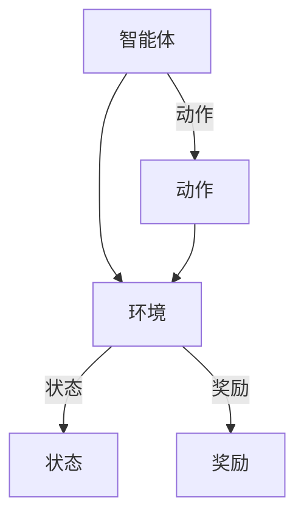

##### 1.1.2 深度强化学习的引入

随着人工智能技术的不断发展，强化学习遇到了一些挑战，尤其是在处理高维状态和动作空间时。深度强化学习（Deep Reinforcement Learning, DRL）应运而生，它将深度学习（Deep Learning）的强大表示能力引入到强化学习领域，通过深度神经网络来近似值函数和策略。

深度强化学习的发展历程可以追溯到2013年，当时Deep Q-Learning（DQN）模型首次将深度神经网络应用于强化学习。随后，DQN在Atari游戏上取得了突破性成果。2016年，Asynchronous Advantage Actor-Critic（A3C）模型在计算机游戏和围棋等领域取得了显著成果。2017年，Dueling DQN模型通过引入Dueling Network结构提高了性能。这些算法为深度强化学习的发展奠定了基础。

下面是深度强化学习算法发展的时间线：

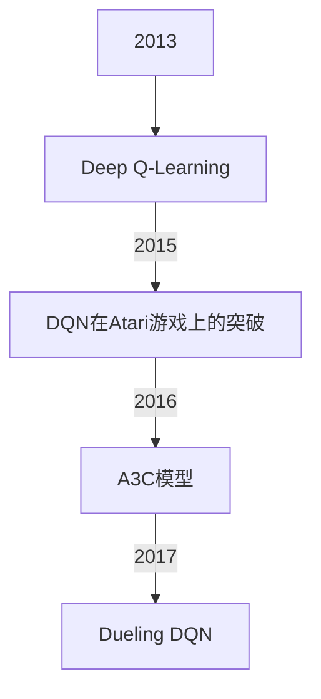

#### 1.2 深度强化学习的基本概念

##### 1.2.1 状态（State）

状态是环境在某一时刻的描述，通常用一个向量表示。状态向量包含了环境中的所有相关信息，如机器人的位置、周围障碍物的位置等。

以下是一个状态向量的示例：

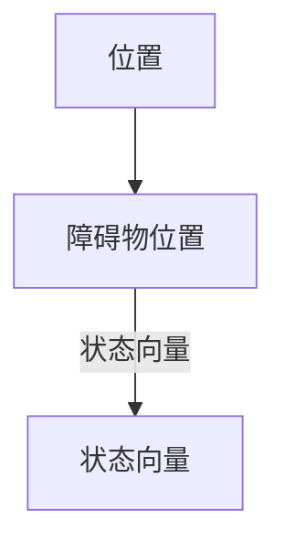

##### 1.2.2 动作（Action）

动作是智能体根据当前状态做出的决策，通常也是一个向量。在机器人控制中，动作可能包括移动方向、速度等。

以下是一个动作向量的示例：

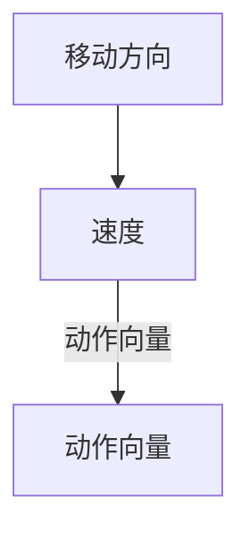

##### 1.2.3 奖励（Reward）

奖励是环境在智能体执行动作后给予的即时反馈，用来衡量智能体动作的好坏。奖励可以是正值、负值或零。

以下是一个奖励值的示例：

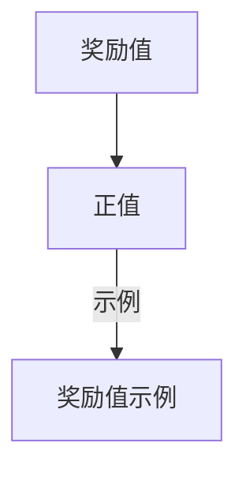

##### 1.2.4 策略（Policy）

策略是智能体在给定状态下选择最优动作的函数。策略可以是一个确定性策略，也可以是一个概率性策略。

以下是一个策略函数的示例：

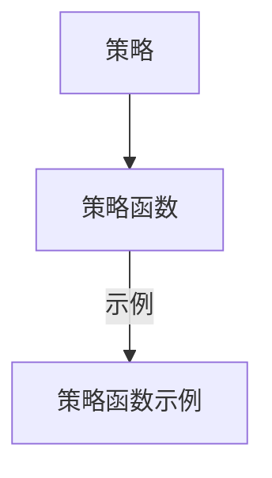

##### 1.2.5 值函数（Value Function）

值函数是评估智能体在特定状态下的长期奖励的函数。值函数可以用来评估策略的好坏，也可以用来指导智能体的行动。

以下是一个值函数类型的示例：

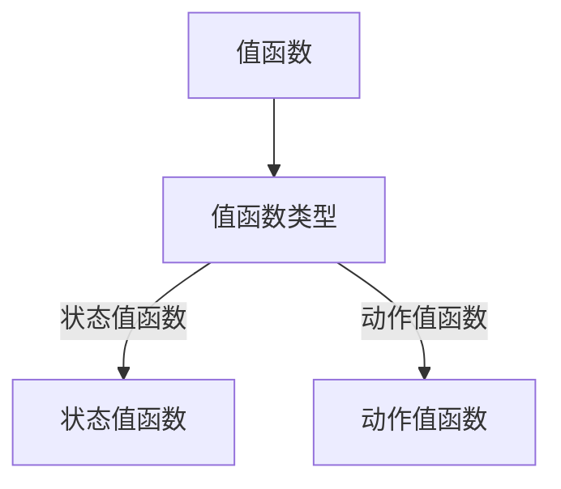

### 第2章：深度强化学习核心算法

#### 2.1 Q-Learning算法

##### 2.1.1 Q-Learning算法原理

Q-Learning算法是一种基于值函数的强化学习算法，通过迭代更新Q值来学习最优策略。Q值表示在给定状态下执行特定动作的预期回报。

以下是一个Q-Learning算法的伪代码：

```python
initialize Q(s, a) uniformly
for each episode do
    initialize state s
    while not end of episode do
        choose action a according to ε-greedy policy
        take action a, observe reward r and next state s'
        update Q(s, a) = Q(s, a) + α [r + γ max(Q(s', a')) - Q(s, a)]
        s <- s'
    end while
end for
```

##### 2.1.2 ε-greedy策略

ε-greedy策略是一种平衡探索和利用的策略，其中ε是一个较小的常数。在探索阶段，智能体以概率ε选择随机动作；在利用阶段，智能体以概率1-ε选择最优动作。

以下是一个ε-greedy策略的示例：

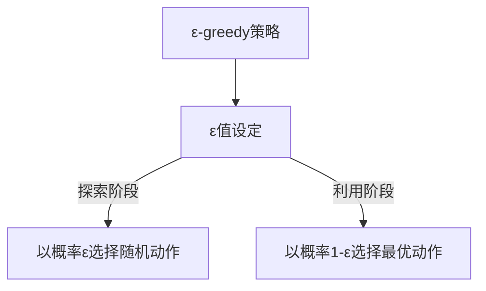

#### 2.2 Deep Q-Network（DQN）算法

##### 2.2.1 DQN算法原理

DQN算法将深度神经网络应用于Q-Learning，通过目标网络来稳定Q值更新。目标网络是另一个Q网络，用于降低目标值与真实值的差距。

以下是一个DQN算法的伪代码：

```python
initialize deep network Q and target network Q'
initialize replay memory D
for each episode do
    initialize state s
    while not end of episode do
        choose action a according to ε-greedy policy
        take action a, observe reward r and next state s'
        store (s, a, r, s') in D
        sample a batch of experiences from D
        for each experience (s, a, r, s') in the batch do
            Q'(s', a') = max(Q'(s', a'))
            Q(s, a) = Q(s, a) + α [r + γ Q'(s', a') - Q(s, a)]
        end for
        update target network Q' by copying the weights of Q with a small momentum
        s <- s'
    end while
end for
```

##### 2.2.2 Experience Replay

经验回放是一种避免策略网络和目标网络更新不一致的方法，通过随机抽样经验来训练策略网络。

#### 2.3 Deep Deterministic Policy Gradient（DDPG）算法

##### 2.3.1 DDPG算法原理

DDPG算法结合了深度Q网络（DQN）和确定性策略梯度（PG）算法，通过引入目标网络和行动空间的重要性采样来提高性能。

以下是一个DDPG算法的伪代码：

```python
initialize actor network π and target actor network π'
initialize critic network Q and target critic network Q'
initialize replay memory D
for each episode do
    initialize state s
    while not end of episode do
        choose action a_t ~ π(s_t; θ_π)
        execute action a_t in environment, observe reward r_t and next state s_{t+1}
        store (s_t, a_t, r_t, s_{t+1}) in D
        sample a batch of experiences from D
        for each experience (s_t, a_t, r_t, s_{t+1}) in the batch do
            a_{t+1} ~ π(s_{t+1}; θ_π)
            Q(s_{t+1}, a_{t+1}) = r_t + γ max Q(s_{t+1}, a_{t+1})
            Q(s_t, a_t) = Q(s_t, a_t) + α [Q(s_{t+1}, a_{t+1}) - Q(s_t, a_t)]
        end for
        update target networks Q' and π' by copying the weights of Q and π with a small momentum
        s <- s_{t+1}
    end while
end for
```

##### 2.3.2 目标网络（Target Network）

目标网络用于稳定策略梯度，通过定期更新目标网络来避免梯度消失问题。

#### 2.4 Asynchronous Advantage Actor-Critic（A3C）算法

##### 2.4.1 A3C算法原理

A3C算法是一种异步并行训练的强化学习算法，通过多个智能体在多个环境中同时训练，提高了收敛速度。

以下是一个A3C算法的伪代码：

```python
initialize global actor network π and critic network Q
initialize worker actor networks π_w and critic networks Q_w
for each worker w do
    for each episode of worker w do
        initialize state s_w
        while not end of episode of worker w do
            execute action a_w ~ π_w(s_w; θ_π)
            observe reward r_w and next state s_{w+1}
            update worker critic network Q_w by gradient descent
            update worker actor network π_w by gradient descent
            s_w <- s_{w+1}
        end while
        send gradients of π_w and Q_w to the global networks
end for
```

##### 2.4.2 策略梯度估计

策略梯度估计通过梯度下降来更新策略网络，使得策略网络能够找到最优策略。

## 第二部分：深度强化学习在智能机器人自主学习中的应用

### 第3章：深度强化学习在机器人控制中的应用

#### 3.1 机器人控制挑战

##### 3.1.1 高维状态和动作空间

机器人的状态和动作空间通常非常高维，这使得传统强化学习算法难以处理。例如，一个机器人可能需要处理数百个传感器数据，每个传感器数据都可以作为状态的一部分，同时它可能需要执行多个不同的动作，如移动、旋转等。

##### 3.1.2 实时性能要求

机器人控制要求实时性能，强化学习算法需要快速收敛以实现实时控制。这意味着算法必须在有限的时间内做出决策，并在实际环境中执行这些决策。

##### 3.1.3 安全性和可靠性

在机器人控制中，算法的决策必须确保机器人的安全性和可靠性。任何错误的行为都可能导致物理损坏或人身伤害。

#### 3.2 深度强化学习在机器人控制中的应用

##### 3.2.1 机器人路径规划

路径规划是机器人控制中的一个重要任务，它涉及到如何在复杂的动态环境中找到从起点到终点的最优路径。深度强化学习可以通过学习环境中的状态和动作来生成有效的路径规划策略。

以下是一个基于深度强化学习的机器人路径规划的基本框架：

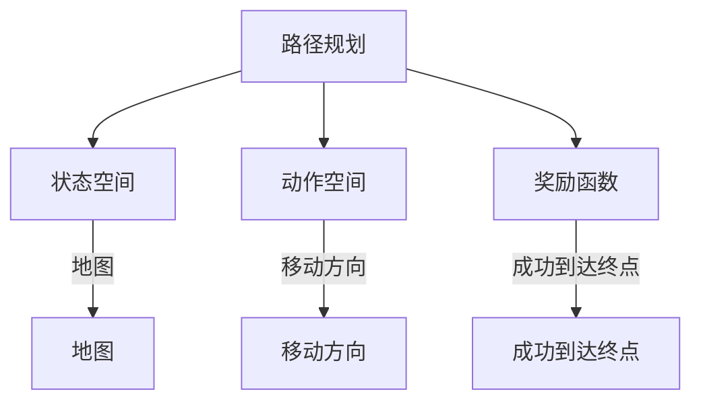

在这个框架中，状态空间包括地图信息和机器人的当前坐标，动作空间包括机器人可以执行的方向（上、下、左、右），奖励函数则设计为当机器人成功到达终点时给予最大奖励。

##### 3.2.2 机器人抓取

机器人抓取是另一个重要的机器人控制任务，它涉及到如何使用机器人的末端执行器抓取不同形状的物体。深度强化学习可以通过学习抓取策略来提高抓取的成功率。

以下是一个基于深度强化学习的机器人抓取的基本框架：

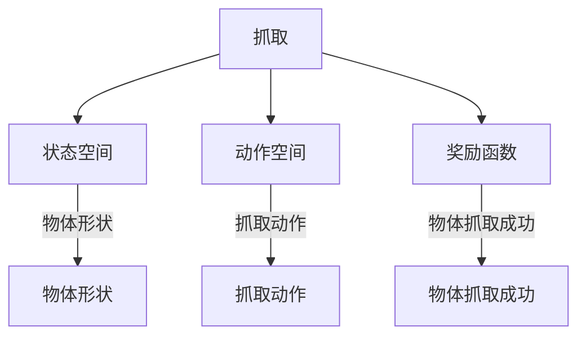

在这个框架中，状态空间包括物体的形状信息，动作空间包括机器人的抓取动作，奖励函数则设计为当机器人成功抓取物体时给予最大奖励。

#### 3.3 案例研究：基于深度强化学习的机器人路径规划

##### 3.3.1 问题定义

在给定的地图中，设计一个深度强化学习算法来规划机器人的路径，以避免障碍物并到达目标位置。这个问题可以形式化为一个马尔可夫决策过程（MDP），其中状态是机器人的位置和地图信息，动作是机器人可以执行的方向，奖励函数是到达目标位置的奖励。

##### 3.3.2 状态表示

状态向量可以表示为机器人的位置和当前地图的信息。例如，一个简单的状态向量可能包含以下信息：

- 机器人的x和y坐标。
- 机器人的方向（例如，北、南、东、西）。
- 当前地图上的障碍物信息。

以下是一个状态向量的示例：

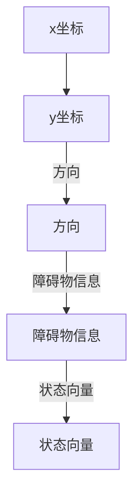

##### 3.3.3 动作表示

动作向量可以表示为机器人可以执行的方向。例如，一个简单的动作向量可能包含以下信息：

- 移动到北方向。
- 移动到南方向。
- 移动到东方向。
- 移动到西方向。

以下是一个动作向量的示例：

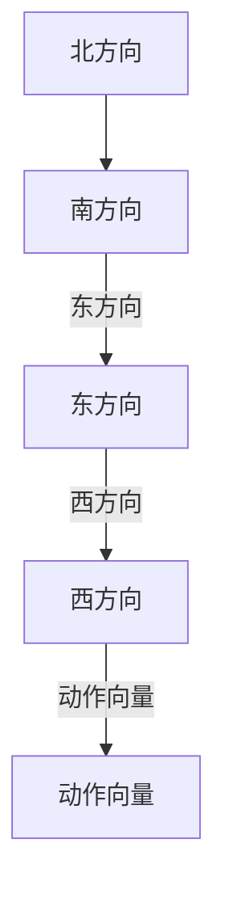

##### 3.3.4 奖励函数设计

奖励函数设计为当机器人成功到达终点时给予最大奖励，并在移动时给予较小的奖励。以下是一个奖励函数的示例：

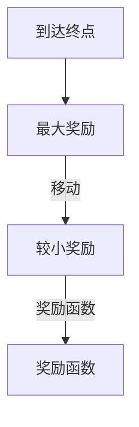

##### 3.3.5 模型训练与测试

使用DQN算法训练深度神经网络，通过经验回放和目标网络来稳定Q值更新。在测试集上评估模型的性能，并在实际应用中进行路径规划。

### 第4章：深度强化学习在智能机器人交互中的应用

#### 4.1 智能机器人交互挑战

##### 4.1.1 多模态感知

智能机器人需要处理多种传感器数据，如视觉、听觉、触觉等，以实现更好的交互能力。这要求深度强化学习算法能够处理高维和多样化的输入数据。

##### 4.1.2 复杂任务流程

智能机器人需要完成复杂任务流程，如自然对话、任务执行和故障处理等。这要求深度强化学习算法能够学习并执行复杂的多步骤任务。

##### 4.1.3 人机协作

智能机器人需要与人类进行协作，这要求深度强化学习算法能够理解并响应人类的指令和反馈。

#### 4.2 深度强化学习在智能机器人交互中的应用

##### 4.2.1 自然对话系统

自然对话系统是智能机器人与人类进行自然交流的重要工具。深度强化学习可以通过学习人类的对话策略来提高对话质量。

以下是一个基于深度强化学习的自然对话系统的基本框架：

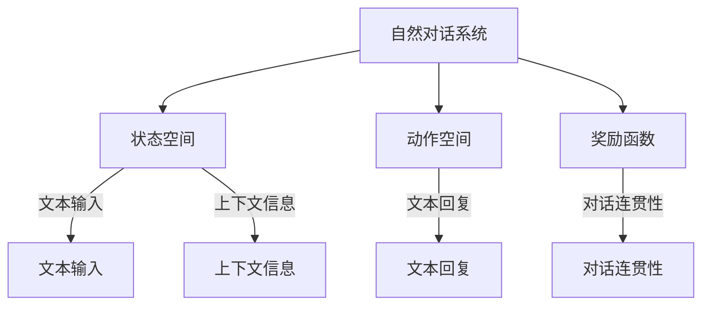

在这个框架中，状态空间包括文本输入和上下文信息，动作空间包括文本回复，奖励函数则设计为当对话连贯性提高时给予最大奖励。

##### 4.2.2 任务执行与故障处理

智能机器人需要能够执行各种任务，并在出现故障时进行故障处理。深度强化学习可以通过学习任务执行策略和故障处理策略来提高机器人的智能水平。

以下是一个基于深度强化学习的任务执行与故障处理的基本框架：

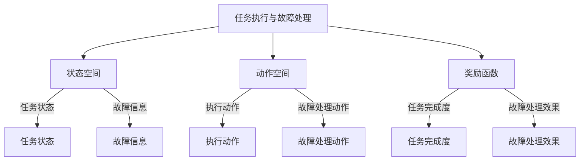

在这个框架中，状态空间包括任务状态和故障信息，动作空间包括执行动作和故障处理动作，奖励函数则设计为当任务完成度和故障处理效果提高时给予最大奖励。

##### 4.3 案例研究：基于深度强化学习的智能客服机器人

##### 4.3.1 问题定义

设计一个基于深度强化学习的智能客服机器人，实现与用户的自然对话并解决用户问题。这个问题可以形式化为一个MDP，其中状态是用户的文本输入和上下文信息，动作是客服机器人的文本回复，奖励函数是用户满意度。

##### 4.3.2 状态表示

状态向量可以表示为用户的文本输入和当前上下文信息。例如，一个简单的状态向量可能包含以下信息：

- 用户输入的文本。
- 当前对话的上下文信息。

以下是一个状态向量的示例：

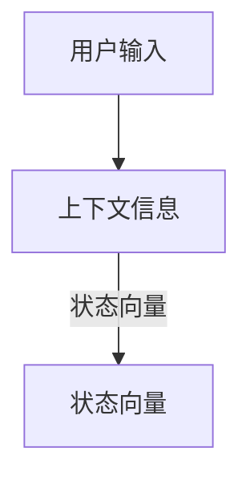

##### 4.3.3 动作表示

动作向量可以表示为客服机器人的文本回复。例如，一个简单的动作向量可能包含以下信息：

- 回复用户的问题。
- 提供解决方案。
- 转接给其他客服代表。

以下是一个动作向量的示例：

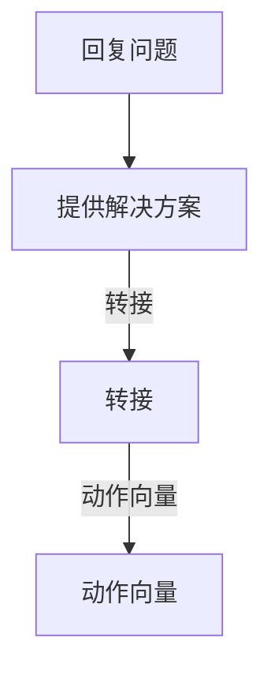

##### 4.3.4 奖励函数设计

奖励函数设计为当用户对客服机器人的回答满意时给予最大奖励，并在对话中给予较小的奖励。以下是一个奖励函数的示例：

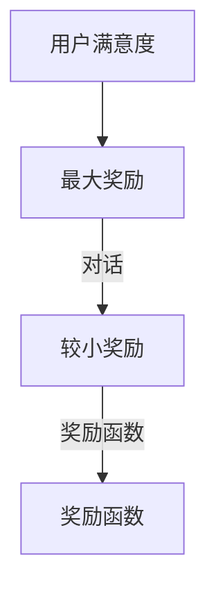

##### 4.3.5 模型训练与测试

使用A3C算法训练深度神经网络，通过异步并行训练来提高模型的收敛速度。在测试集上评估模型的性能，并在实际应用中进行对话交互。

### 第5章：深度强化学习在多智能体系统中的应用

#### 5.1 多智能体系统概述

##### 5.1.1 多智能体系统的定义

多智能体系统（Multi-Agent System, MAS）是由多个智能体（Agent）组成的分布式系统，每个智能体都具有自主性、协作性和适应性。智能体可以通过通信和协作来共同完成任务。

##### 5.1.2 多智能体系统的特点

- **分布式**：多智能体系统中的智能体可以独立运行，不需要集中控制。
- **协作性**：智能体之间可以通过通信和协作来共同完成任务。
- **适应性**：智能体可以根据环境变化和任务需求动态调整策略和行为。

#### 5.2 深度强化学习在多智能体系统中的应用

##### 5.2.1 多智能体强化学习基本概念

在多智能体强化学习（Multi-Agent Reinforcement Learning, MARL）中，每个智能体都独立地与环境进行交互，并学习优化自身的策略。多智能体强化学习的关键概念包括：

- **状态（State）**：描述每个智能体的当前环境和目标。
- **动作（Action）**：智能体可以执行的动作。
- **奖励（Reward）**：描述智能体在环境中执行动作后获得的即时奖励。
- **策略（Policy）**：描述智能体在给定状态下选择动作的策略。
- **值函数（Value Function）**：评估智能体在特定状态下的长期奖励。

##### 5.2.2 多智能体深度强化学习算法

多智能体深度强化学习算法通过引入深度神经网络来处理高维状态和动作空间，并提高智能体的学习效率。以下是一些常用的多智能体深度强化学习算法：

- **多智能体深度Q网络（Multi-Agent DQN）**：通过共享经验回放和目标网络来稳定训练过程。
- **多智能体策略梯度（Multi-Agent PG）**：通过异步策略梯度更新来提高收敛速度。
- **深度协同强化学习（Deep Cooperative RL）**：通过协同策略和共享值函数来实现智能体的合作。

##### 5.3 案例研究：基于深度强化学习的多智能体协同控制

##### 5.3.1 问题定义

设计一个基于深度强化学习的多智能体协同控制算法，实现多个智能体之间的协作以完成任务。这个问题可以形式化为一个多智能体马尔可夫决策过程（MDP），其中状态是每个智能体的位置和目标，动作是每个智能体的移动方向和速度，奖励函数是任务完成度。

##### 5.3.2 状态表示

状态向量可以表示为每个智能体的位置和目标。例如，一个简单的状态向量可能包含以下信息：

- 每个智能体的x和y坐标。
- 每个智能体的目标坐标。

以下是一个状态向量的示例：

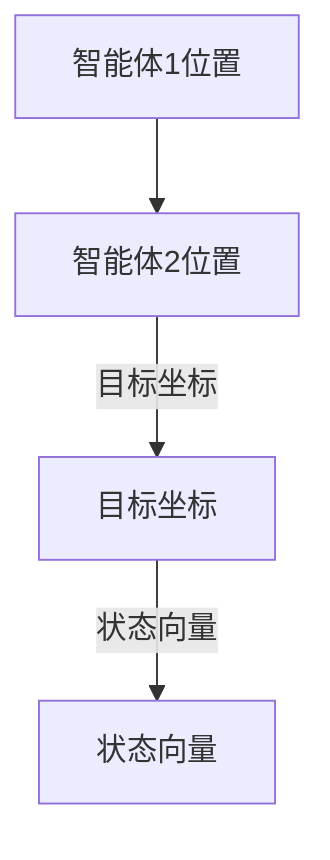

##### 5.3.3 动作表示

动作向量可以表示为每个智能体的移动方向和速度。例如，一个简单的动作向量可能包含以下信息：

- 智能体1的移动方向。
- 智能体2的移动方向。
- 智能体1的速度。
- 智能体2的速度。

以下是一个动作向量的示例：

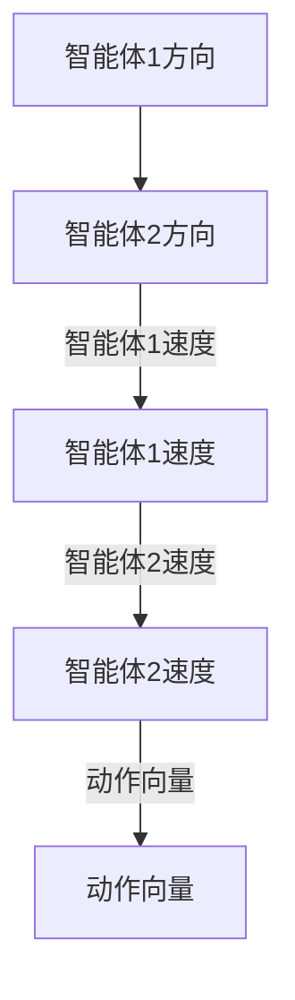

##### 5.3.4 奖励函数设计

奖励函数设计为当任务完成时给予最大奖励，并在执行动作时给予较小的奖励。以下是一个奖励函数的示例：

```mermaid
graph TD
    A[任务完成度] --> B[最大奖励]
    B -->|动作| C[较小奖励]
    C -->|奖励函数| D[奖励函数]
```

##### 5.3.5 模型训练与测试

使用DDPG算法训练深度神经网络，通过目标网络和重要性采样来稳定训练过程。在测试集上评估模型的性能，并在实际应用中进行多智能体协同控制。

## 第三部分：深度强化学习应用与未来展望

### 第6章：深度强化学习在智能机器人应用中的挑战与解决方案

#### 6.1 深度强化学习在智能机器人应用中的挑战

##### 6.1.1 训练数据需求

深度强化学习算法通常需要大量的训练数据来收敛，这在智能机器人应用中可能难以实现。特别是在复杂、动态和高度不确定的环境中，获取足够的训练数据是一个挑战。

##### 6.1.2 实时性能要求

智能机器人需要在实时环境中进行决策，深度强化学习算法的性能和响应速度可能不足以满足这一要求。特别是在动态变化的环境中，算法需要快速调整策略以应对变化。

##### 6.1.3 安全性和可靠性

深度强化学习算法可能存在意外行为和不确定性，这在智能机器人应用中需要特别关注。确保算法的决策和行为在真实环境中是安全和可靠的至关重要。

#### 6.2 深度强化学习在智能机器人应用中的解决方案

##### 6.2.1 数据增强与生成

通过数据增强和生成技术来扩大训练数据集，提高算法的鲁棒性。例如，可以使用图像生成、合成数据集等技术来增加训练数据的多样性。

##### 6.2.2 实时性能优化

通过模型压缩和分布式训练等技术来提高深度强化学习算法的实时性能。例如，可以使用轻量级网络架构、模型剪枝等技术来减少计算复杂度。

##### 6.2.3 安全性分析与验证

通过安全分析和验证技术来确保深度强化学习算法在智能机器人应用中的可靠性和安全性。例如，可以使用模型验证、形式验证等技术来检查算法的潜在风险。

#### 6.3 未来展望

随着深度强化学习技术的不断发展，未来在智能机器人应用中将会看到更多的创新和应用。特别是在自主驾驶、智能医疗和智能制造等领域，深度强化学习有望发挥重要作用。

### 第7章：深度强化学习在智能机器人自主学习中的应用前景

#### 7.1 自主学习的重要性

自主学习是智能机器人发展的关键，它使得机器人在复杂环境中能够自主适应和优化行为。深度强化学习为智能机器人的自主学习提供了强大工具，通过学习环境中的状态和动作，机器人可以不断优化策略，提高性能。

#### 7.2 深度强化学习在智能机器人自主学习中的应用

##### 7.2.1 自主路径规划

通过深度强化学习算法，实现智能机器人自主路径规划，避免障碍物并高效到达目标。这种方法可以在复杂环境中实现高效导航。

##### 7.2.2 自主导航

利用深度强化学习算法，实现智能机器人在未知环境中的自主导航，提高机器人的适应能力和可靠性。这种方法可以在动态环境中实现实时导航。

##### 7.2.3 自主决策

通过深度强化学习算法，实现智能机器人在复杂环境中的自主决策，提高机器人的智能水平和自主性。这种方法可以在复杂任务中实现高效决策。

#### 7.3 深度强化学习在智能机器人自主学习中的未来发展趋势

随着深度强化学习技术的不断进步，未来在智能机器人自主学习中的应用将更加广泛和深入。特别是在多智能体系统和人机交互领域，深度强化学习有望发挥更大作用。

### 附录

#### 附录A：深度强化学习开发工具与资源

##### A.1 深度强化学习框架

介绍常用的深度强化学习框架，如OpenAI Gym、TensorFlow和PyTorch等，并提供相关链接和文档。

##### A.2 深度强化学习算法实现代码示例

提供深度强化学习算法的实现代码示例，包括DQN、DDPG和A3C等，并解释关键代码部分。

##### A.3 深度强化学习应用案例

介绍深度强化学习在智能机器人领域的实际应用案例，包括路径规划、抓取和导航等，并提供相关链接和资料。

##### A.4 深度强化学习社区与资源

介绍深度强化学习相关的社区、论坛和资源，如Reddit、GitHub和学术会议等，为读者提供学习和交流的平台。

## 作者信息

**作者：AI天才研究院/AI Genius Institute & 禅与计算机程序设计艺术 /Zen And The Art of Computer Programming**

通过本文，我们深入探讨了深度强化学习在智能机器人自主学习中的应用，从基础概念到核心算法，再到实际应用案例，全面展示了深度强化学习在智能机器人领域的重要作用。未来，随着技术的不断进步，深度强化学习将在智能机器人中发挥更大的作用，推动智能机器人向更自主、更智能的方向发展。

