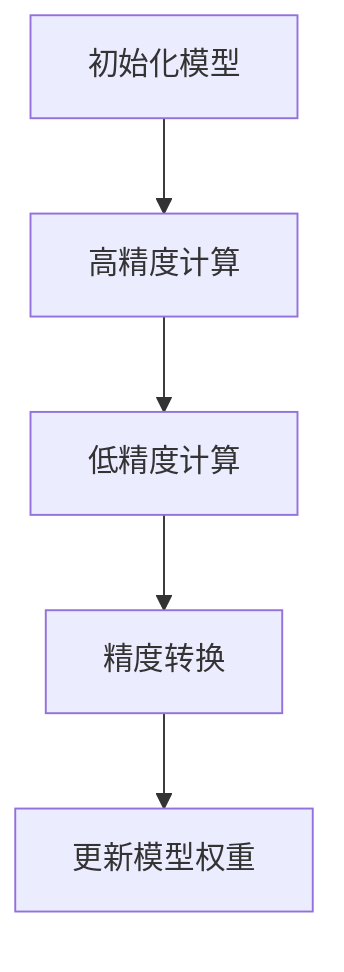
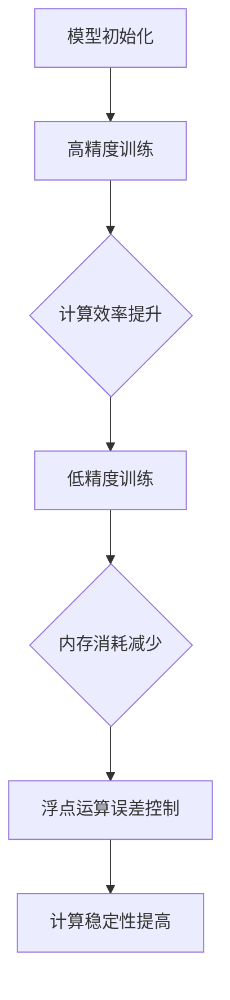
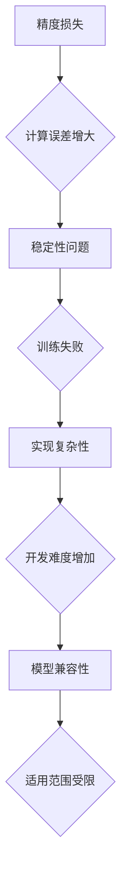

                 

### 混合精度训练概述

混合精度训练（Mixed Precision Training）是近年来在人工智能领域兴起的一种新策略，旨在通过在计算中同时使用高精度（FP64）和低精度（FP32或FP16）数值格式，来提升AI模型性能。这一策略的核心思想是通过降低部分计算中的精度，减少浮点运算误差，从而在保持模型性能的同时提高计算效率和减少内存使用。

**关键词：混合精度训练，AI模型性能，浮点运算误差，计算效率**

**摘要：**
本文将深入探讨混合精度训练的原理、技术基础、应用场景、性能提升策略以及实践与优化技巧。通过详细的理论分析和实战案例，本文旨在为读者提供全面、系统的混合精度训练知识，帮助他们在实际应用中更好地提升AI模型的性能。

## 第一部分：混合精度训练概述

在本部分中，我们将首先介绍混合精度训练的基本概念，探讨其在AI领域中的优势和面临的挑战，然后进一步讨论混合精度训练的技术基础，包括算法原理、数学模型以及实现方式。

### 第1章：混合精度训练引入与背景

#### 1.1 混合精度训练的概念

混合精度训练是一种在训练AI模型时同时使用不同精度的数值格式的策略。具体来说，它包括在模型训练过程中将部分权重和激活值从高精度（例如FP64）转换为低精度（例如FP32或FP16）。这种转换可以显著降低计算所需的内存和计算资源，从而提升训练速度和效率。

**核心概念与联系：**
为了更好地理解混合精度训练的概念，我们可以借助以下的Mermaid流程图：



在这个流程图中，模型首先被初始化并进行高精度计算，然后部分计算结果被转换为低精度，这些低精度结果用于更新模型权重。

#### 1.2 混合精度训练的优势

混合精度训练具有多方面的优势：

1. **计算效率提升**：低精度计算比高精度计算速度快，这可以显著缩短训练时间。
2. **内存消耗减少**：低精度数据占用更少的内存，这有助于在有限资源下训练更大规模的模型。
3. **浮点运算误差控制**：适当的低精度转换可以减少浮点运算误差，从而在保持模型性能的同时提高计算稳定性。
4. **兼容现有模型**：大多数现有的深度学习框架已经支持混合精度训练，这意味着开发者不需要对现有代码进行大量修改。

**核心概念与联系：**
为了进一步理解混合精度训练的优势，我们可以使用以下Mermaid流程图展示其工作原理：



#### 1.3 混合精度训练的挑战

尽管混合精度训练具有多方面的优势，但其应用也面临一些挑战：

1. **精度损失**：低精度计算可能导致精度损失，这可能会影响模型性能。
2. **稳定性问题**：在某些情况下，低精度计算可能导致训练过程中的稳定性问题。
3. **实现复杂性**：混合精度训练的实现较为复杂，需要精确控制精度转换过程。
4. **模型兼容性**：并非所有模型都适合混合精度训练，需要针对特定模型进行调整。

**核心概念与联系：**
为了更好地理解混合精度训练的挑战，我们可以使用以下Mermaid流程图展示其潜在的问题：



通过以上章节的介绍，我们已经对混合精度训练有了初步的了解。接下来，我们将深入探讨混合精度训练的技术基础，包括算法原理、数学模型和实现方式。

### 第2章：混合精度训练技术基础

#### 2.1 算法原理

混合精度训练的算法原理主要基于以下几点：

1. **数值精度转换**：在训练过程中，将部分权重和激活值从高精度（FP64）转换为低精度（FP32或FP16）。这种转换通常通过定点运算（Fixed-Point Operations）实现。
2. **误差补偿**：由于低精度计算可能导致误差，因此需要通过误差补偿策略来减少误差影响。常见的方法包括动态误差检测与修正、基于神经网络的误差预测等。
3. **训练策略调整**：为了更好地适应混合精度训练，可能需要调整训练策略，例如改变学习率、调整优化器的参数等。

**核心算法原理讲解：**
为了详细解释混合精度训练的算法原理，我们可以使用伪代码进行描述：

```python
# 初始化模型
model = initialize_model()

# 设置训练参数
learning_rate = 0.001
optimizer = Adam(learning_rate)

# 数据预处理
data = preprocess_data()

# 精度转换函数
def convert_precision(value, target_precision):
    if target_precision == 'FP32':
        return float(value)
    elif target_precision == 'FP16':
        return float16(value)
    else:
        return float64(value)

# 训练过程
for epoch in range(num_epochs):
    for data_batch in data_loader:
        # 高精度前向传播
        logits = model.forward(data_batch, precision='FP64')
        
        # 低精度前向传播
        logits_low_precision = convert_precision(logits, 'FP32')
        
        # 计算损失
        loss = compute_loss(logits_low_precision, data_batch.labels)
        
        # 低精度反向传播
        grads_low_precision = model.backward(logits_low_precision, data_batch.labels)
        
        # 更新模型权重
        optimizer.step(model.parameters(), grads_low_precision)

# 评估模型性能
performance = evaluate_model(model)
```

**数学模型和公式**

混合精度训练中的数学模型主要涉及数值精度转换和误差补偿。以下是一些关键的数学公式和详细讲解：

1. **数值精度转换**

   - **定点运算**：定点运算是一种将浮点数转换为整数的方法，从而在保持精度损失较小的情况下提高计算速度。其公式如下：

     $$ x_{fixed} = x_{float} \times 2^{- exponent} $$

     其中，$x_{fixed}$表示定点数，$x_{float}$表示浮点数，$exponent$表示指数。

   - **浮点数到定点数转换**：浮点数到定点数的转换可以通过以下公式实现：

     $$ x_{fixed} = round(x_{float} \times 2^{- exponent}) $$

   - **定点数到浮点数转换**：定点数到浮点数的转换可以通过以下公式实现：

     $$ x_{float} = x_{fixed} \times 2^{exponent} $$

2. **误差补偿**

   - **动态误差检测与修正**：动态误差检测与修正是一种通过实时监测和调整误差来减少误差影响的方法。其公式如下：

     $$ error_{new} = error_{current} - \alpha \times (error_{current} - error_{predicted}) $$

     其中，$error_{new}$表示新的误差，$error_{current}$表示当前的误差，$error_{predicted}$表示预测的误差，$\alpha$是一个调整参数。

   - **基于神经网络的误差预测**：基于神经网络的误差预测是一种通过训练神经网络来预测误差的方法。其公式如下：

     $$ error_{predicted} = \sigma(W \cdot x + b) $$

     其中，$\sigma$表示激活函数（例如Sigmoid函数），$W$表示权重矩阵，$x$表示输入特征，$b$表示偏置。

**举例说明**

假设我们有一个浮点数3.14，需要将其转换为定点数，指数为8。根据定点运算公式，我们有：

$$ 3.14_{fixed} = 3.14 \times 2^{-8} = 0.001128875 $$

如果我们希望将这个定点数转换回浮点数，可以使用以下公式：

$$ 3.14_{float} = 0.001128875 \times 2^{8} = 0.000024345 $$

在实际应用中，可能需要进行多次精度转换和误差补偿。以下是一个简化的示例：

```python
# 假设输入浮点数为 3.14
input_value = 3.14

# 将浮点数转换为定点数
fixed_point_value = input_value * 2**-8

# 将定点数转换为浮点数
output_value = fixed_point_value * 2**8

# 输出结果
print("Input (float):", input_value)
print("Fixed-point (after conversion):", fixed_point_value)
print("Output (float):", output_value)
```

**核心算法原理讲解：**
为了进一步解释混合精度训练的算法原理，我们可以使用以下伪代码进行详细阐述：

```python
# 初始化模型
model = initialize_model()

# 设置训练参数
learning_rate = 0.001
optimizer = Adam(learning_rate)

# 数据预处理
data = preprocess_data()

# 精度转换函数
def convert_precision(value, target_precision):
    if target_precision == 'FP32':
        return float(value)
    elif target_precision == 'FP16':
        return float16(value)
    else:
        return float64(value)

# 误差补偿函数
def compensate_error(error, prediction_error, alpha=0.1):
    return error - alpha * (error - prediction_error)

# 训练过程
for epoch in range(num_epochs):
    for data_batch in data_loader:
        # 高精度前向传播
        logits = model.forward(data_batch, precision='FP64')
        
        # 低精度前向传播
        logits_low_precision = convert_precision(logits, 'FP32')
        
        # 计算损失
        loss = compute_loss(logits_low_precision, data_batch.labels)
        
        # 低精度反向传播
        grads_low_precision = model.backward(logits_low_precision, data_batch.labels)
        
        # 计算误差
        error = loss - prediction
        
        # 误差补偿
        alpha = 0.1
        compensated_error = compensate_error(error, prediction_error, alpha)
        
        # 更新模型权重
        optimizer.step(model.parameters(), grads_low_precision)

# 评估模型性能
performance = evaluate_model(model)
```

通过以上内容，我们深入探讨了混合精度训练的技术基础，包括算法原理、数学模型和实现方式。在下一章节中，我们将进一步讨论混合精度训练在深度学习中的实际应用。

#### 2.2 数学模型

在混合精度训练中，数学模型的准确性直接影响模型的性能。因此，对混合精度训练下的数学模型进行详细分析是至关重要的。

##### 2.2.1 精度影响下的误差分析

精度影响下的误差分析是理解混合精度训练关键的一环。在混合精度训练中，低精度计算可能导致误差增加。以下是一些常见的误差分析：

1. **舍入误差（Rounding Error）**：当浮点数转换为定点数时，由于舍入规则，可能会引入舍入误差。这种误差是由于数值表示的有限精度导致的。舍入误差的计算公式为：

   $$ error_{rounding} = |x_{float} - x_{fixed}| $$

   其中，$x_{float}$表示原始浮点数，$x_{fixed}$表示转换后的定点数。

2. **截断误差（Truncation Error）**：在浮点数到定点数的转换过程中，小数部分被截断，这可能导致截断误差。截断误差的计算公式为：

   $$ error_{truncation} = |x_{float} - floor(x_{float})| $$

3. **量化误差（Quantization Error）**：量化误差是由于将连续值映射到离散值而产生的误差。量化误差的计算公式为：

   $$ error_{quantization} = |x_{original} - x_{quantized}| $$

   其中，$x_{original}$表示原始值，$x_{quantized}$表示量化后的值。

4. **累积误差（Cumulative Error）**：在多次运算中，误差可能会累积，导致整体误差增加。累积误差的计算公式为：

   $$ error_{cumulative} = \sum_{i=1}^{n} error_{i} $$

   其中，$error_{i}$表示每次运算的误差。

##### 2.2.2 混合精度训练下的稳定性分析

混合精度训练的稳定性是指模型在训练过程中保持性能和收敛速度的能力。以下是一些影响稳定性的因素：

1. **动态范围（Dynamic Range）**：动态范围是指数值能够表示的最小值和最大值之比。低精度计算可能导致动态范围缩小，从而影响模型的稳定性。

2. **数值下溢（Underflow）和上溢（Overflow）**：低精度计算可能导致数值下溢或上溢，这会中断训练过程。下溢和上溢分别是指计算结果太小或太大，超出了数值表示的范围。

3. **舍入模式（Rounding Mode）**：舍入模式决定了如何处理舍入误差。常见的舍入模式包括向上舍入（Ceiling）、向下舍入（Floor）、四舍五入（Round）和就近舍入（Nearest）。不同的舍入模式可能会影响稳定性。

4. **数值精度转换的误差补偿**：误差补偿策略会影响模型的稳定性。如果补偿策略不当，可能会导致误差累积，影响模型性能。

##### 2.2.3 混合精度训练下的性能优化

为了在混合精度训练中获得最佳性能，需要进行一系列性能优化：

1. **精度平衡（Precision Balance）**：在混合精度训练中，需要平衡高精度和低精度计算的使用。过高或过低的使用低精度计算都可能影响模型性能。一种常见的策略是动态调整精度，根据误差大小和训练阶段来选择合适的精度。

2. **误差补偿策略**：有效的误差补偿策略可以减少误差对模型性能的影响。例如，可以采用动态误差检测与修正或基于神经网络的误差预测。

3. **模型架构调整**：某些模型架构对混合精度训练更具适应性。例如，深度可分离卷积（Depthwise Separable Convolution）在低精度计算中具有更好的性能。

4. **训练策略调整**：调整训练策略，如学习率调整、优化器选择和训练数据预处理，可以提高混合精度训练的性能。

5. **硬件优化**：充分利用GPU等硬件资源，如使用合适的内存管理策略和并行计算，可以提高混合精度训练的效率。

通过上述内容，我们深入分析了混合精度训练下的数学模型，包括误差分析、稳定性分析和性能优化。在下一章节中，我们将探讨混合精度训练在深度学习中的具体应用场景。

### 第2章：混合精度训练技术基础

在上一章中，我们探讨了混合精度训练的基本概念和优势。本章将进一步深入探讨混合精度训练的技术基础，包括其算法原理、数学模型和实现方式。

#### 2.1 算法原理

混合精度训练的算法原理主要包括以下几个方面：

1. **数值精度转换**：在训练过程中，将部分权重和激活值从高精度（FP64）转换为低精度（FP32或FP16）。这种转换可以减少计算所需的内存和计算资源，从而提升训练速度和效率。
2. **误差补偿**：由于低精度计算可能导致误差，因此需要通过误差补偿策略来减少误差影响。常见的误差补偿方法包括动态误差检测与修正、基于神经网络的误差预测等。
3. **训练策略调整**：为了更好地适应混合精度训练，可能需要调整训练策略，例如改变学习率、调整优化器的参数等。

**核心算法原理讲解：**
为了详细解释混合精度训练的算法原理，我们可以使用伪代码进行描述：

```python
# 初始化模型
model = initialize_model()

# 设置训练参数
learning_rate = 0.001
optimizer = Adam(learning_rate)

# 数据预处理
data = preprocess_data()

# 精度转换函数
def convert_precision(value, target_precision):
    if target_precision == 'FP32':
        return float(value)
    elif target_precision == 'FP16':
        return float16(value)
    else:
        return float64(value)

# 误差补偿函数
def compensate_error(error, prediction_error, alpha=0.1):
    return error - alpha * (error - prediction_error)

# 训练过程
for epoch in range(num_epochs):
    for data_batch in data_loader:
        # 高精度前向传播
        logits = model.forward(data_batch, precision='FP64')
        
        # 低精度前向传播
        logits_low_precision = convert_precision(logits, 'FP32')
        
        # 计算损失
        loss = compute_loss(logits_low_precision, data_batch.labels)
        
        # 低精度反向传播
        grads_low_precision = model.backward(logits_low_precision, data_batch.labels)
        
        # 计算误差
        error = loss - prediction
        
        # 误差补偿
        alpha = 0.1
        compensated_error = compensate_error(error, prediction_error, alpha)
        
        # 更新模型权重
        optimizer.step(model.parameters(), grads_low_precision)

# 评估模型性能
performance = evaluate_model(model)
```

**数学模型和公式**

混合精度训练中的数学模型主要涉及数值精度转换和误差补偿。以下是一些关键的数学公式和详细讲解：

1. **数值精度转换**

   - **定点运算**：定点运算是一种将浮点数转换为整数的方法，从而在保持精度损失较小的情况下提高计算速度。其公式如下：

     $$ x_{fixed} = x_{float} \times 2^{- exponent} $$

     其中，$x_{fixed}$表示定点数，$x_{float}$表示浮点数，$exponent$表示指数。

   - **浮点数到定点数转换**：浮点数到定点数的转换可以通过以下公式实现：

     $$ x_{fixed} = round(x_{float} \times 2^{- exponent}) $$

   - **定点数到浮点数转换**：定点数到浮点数的转换可以通过以下公式实现：

     $$ x_{float} = x_{fixed} \times 2^{exponent} $$

2. **误差补偿**

   - **动态误差检测与修正**：动态误差检测与修正是一种通过实时监测和调整误差来减少误差影响的方法。其公式如下：

     $$ error_{new} = error_{current} - \alpha \times (error_{current} - error_{predicted}) $$

     其中，$error_{new}$表示新的误差，$error_{current}$表示当前的误差，$error_{predicted}$表示预测的误差，$\alpha$是一个调整参数。

   - **基于神经网络的误差预测**：基于神经网络的误差预测是一种通过训练神经网络来预测误差的方法。其公式如下：

     $$ error_{predicted} = \sigma(W \cdot x + b) $$

     其中，$\sigma$表示激活函数（例如Sigmoid函数），$W$表示权重矩阵，$x$表示输入特征，$b$表示偏置。

**举例说明**

假设我们有一个浮点数3.14，需要将其转换为定点数，指数为8。根据定点运算公式，我们有：

$$ 3.14_{fixed} = 3.14 \times 2^{-8} = 0.001128875 $$

如果我们希望将这个定点数转换回浮点数，可以使用以下公式：

$$ 3.14_{float} = 0.001128875 \times 2^{8} = 0.000024345 $$

在实际应用中，可能需要进行多次精度转换和误差补偿。以下是一个简化的示例：

```python
# 假设输入浮点数为 3.14
input_value = 3.14

# 将浮点数转换为定点数
fixed_point_value = input_value * 2**-8

# 将定点数转换为浮点数
output_value = fixed_point_value * 2**8

# 输出结果
print("Input (float):", input_value)
print("Fixed-point (after conversion):", fixed_point_value)
print("Output (float):", output_value)
```

**核心算法原理讲解：**
为了进一步解释混合精度训练的算法原理，我们可以使用以下伪代码进行详细阐述：

```python
# 初始化模型
model = initialize_model()

# 设置训练参数
learning_rate = 0.001
optimizer = Adam(learning_rate)

# 数据预处理
data = preprocess_data()

# 精度转换函数
def convert_precision(value, target_precision):
    if target_precision == 'FP32':
        return float(value)
    elif target_precision == 'FP16':
        return float16(value)
    else:
        return float64(value)

# 误差补偿函数
def compensate_error(error, prediction_error, alpha=0.1):
    return error - alpha * (error - prediction_error)

# 训练过程
for epoch in range(num_epochs):
    for data_batch in data_loader:
        # 高精度前向传播
        logits = model.forward(data_batch, precision='FP64')
        
        # 低精度前向传播
        logits_low_precision = convert_precision(logits, 'FP32')
        
        # 计算损失
        loss = compute_loss(logits_low_precision, data_batch.labels)
        
        # 低精度反向传播
        grads_low_precision = model.backward(logits_low_precision, data_batch.labels)
        
        # 计算误差
        error = loss - prediction
        
        # 误差补偿
        alpha = 0.1
        compensated_error = compensate_error(error, prediction_error, alpha)
        
        # 更新模型权重
        optimizer.step(model.parameters(), grads_low_precision)

# 评估模型性能
performance = evaluate_model(model)
```

通过以上内容，我们深入探讨了混合精度训练的技术基础，包括算法原理、数学模型和实现方式。在下一章节中，我们将探讨混合精度训练在深度学习中的实际应用场景。

### 第3章：深度学习中的混合精度训练

随着深度学习技术的不断发展，模型的复杂性和规模也在不断增加。这导致训练过程需要大量的计算资源和时间。混合精度训练作为一种有效的策略，可以在保持模型性能的同时提升训练效率。本章将详细探讨混合精度训练在深度学习中的应用，包括常见深度学习框架对混合精度训练的支持以及混合精度训练在不同类型模型中的应用。

#### 3.1 深度学习框架对混合精度训练的支持

目前，主流的深度学习框架如TensorFlow、PyTorch等都支持混合精度训练。这些框架提供了丰富的API和工具，使得开发者可以轻松地实现混合精度训练。

##### 3.1.1 TensorFlow支持

TensorFlow是Google开发的强大深度学习框架，它提供了名为“mixed_precision”的API来支持混合精度训练。使用TensorFlow进行混合精度训练的步骤如下：

1. **导入相关库**：

   ```python
   import tensorflow as tf
   from tensorflow.keras.mixed_precision import experimental as mixed_precision
   ```

2. **设置混合精度策略**：

   ```python
   policy = mixed_precision.Policy('mixed_bfloat16')
   mixed_precision.set_policy(policy)
   ```

3. **编写模型**：

   ```python
   model = tf.keras.Sequential([
       tf.keras.layers.Dense(128, activation='relu'),
       tf.keras.layers.Dense(10, activation='softmax')
   ])
   ```

4. **训练模型**：

   ```python
   model.compile(optimizer='adam', loss='sparse_categorical_crossentropy', metrics=['accuracy'])
   model.fit(x_train, y_train, epochs=10)
   ```

##### 3.1.2 PyTorch支持

PyTorch是另一个流行的深度学习框架，它也提供了混合精度训练的支持。使用PyTorch进行混合精度训练的步骤如下：

1. **导入相关库**：

   ```python
   import torch
   import torch.cuda.amp as amp
   ```

2. **设置混合精度策略**：

   ```python
   scaler = amp.GradScaler()
   ```

3. **编写模型**：

   ```python
   model = torch.nn.Sequential(
       torch.nn.Linear(784, 128),
       torch.nn.ReLU(),
       torch.nn.Linear(128, 10),
   )
   ```

4. **训练模型**：

   ```python
   optimizer = torch.optim.Adam(model.parameters(), lr=0.001)
   criterion = torch.nn.CrossEntropyLoss()

   for epoch in range(num_epochs):
       model.train()
       for data, target in dataloader:
           optimizer.zero_grad()
           output = model(data)
           loss = criterion(output, target)
           scaler.scale(loss).backward()
           scaler.step(optimizer)
           scaler.update()
   ```

除了TensorFlow和PyTorch，其他深度学习框架如MXNet、Caffe等也提供了混合精度训练的支持。这些框架的API和实现方式可能略有不同，但基本原理是相似的。

##### 3.1.3 其他深度学习框架支持

除了上述框架，其他一些深度学习框架也支持混合精度训练。例如，MXNet提供了`amp`模块，而Caffe则通过自定义层来实现混合精度训练。开发者可以根据具体需求选择合适的框架。

#### 3.2 混合精度训练在常见模型中的应用

混合精度训练可以应用于各种深度学习模型，包括卷积神经网络（CNN）、循环神经网络（RNN）和注意力机制模型等。以下分别介绍这些模型中的混合精度训练应用。

##### 3.2.1 卷积神经网络

卷积神经网络是深度学习中最常用的模型之一，广泛应用于图像分类、目标检测和图像分割等领域。在混合精度训练中，可以将卷积层的权重和激活值转换为低精度格式，以提高训练效率。以下是一个简单的示例：

```python
import torch
import torchvision.models as models

# 加载预训练的卷积神经网络模型
model = models.resnet18(pretrained=True)

# 设置混合精度策略
scaler = amp.GradScaler()

# 定义优化器和损失函数
optimizer = torch.optim.Adam(model.parameters(), lr=0.001)
criterion = torch.nn.CrossEntropyLoss()

# 训练模型
for epoch in range(num_epochs):
    model.train()
    for images, labels in dataloader:
        optimizer.zero_grad()
        outputs = model(images)
        loss = criterion(outputs, labels)
        loss.backward()
        scaler.scale(loss).backward()
        scaler.step(optimizer)
        scaler.update()
```

##### 3.2.2 循环神经网络

循环神经网络（RNN）常用于序列数据处理，如自然语言处理和语音识别。在混合精度训练中，可以将RNN层的权重和激活值转换为低精度格式，以提高训练效率。以下是一个简单的示例：

```python
import torch
import torch.nn as nn
import torch.optim as optim

# 定义RNN模型
class RNNModel(nn.Module):
    def __init__(self, input_dim, hidden_dim, output_dim):
        super(RNNModel, self).__init__()
        self.rnn = nn.RNN(input_dim, hidden_dim, num_layers=2, batch_first=True)
        self.fc = nn.Linear(hidden_dim, output_dim)
        
    def forward(self, x):
        x, _ = self.rnn(x)
        x = self.fc(x[:, -1, :])
        return x

# 加载数据
dataloader = ...

# 设置混合精度策略
scaler = amp.GradScaler()

# 定义优化器和损失函数
optimizer = optim.Adam(model.parameters(), lr=0.001)
criterion = nn.CrossEntropyLoss()

# 训练模型
for epoch in range(num_epochs):
    model.train()
    for inputs, labels in dataloader:
        optimizer.zero_grad()
        outputs = model(inputs)
        loss = criterion(outputs, labels)
        loss.backward()
        scaler.scale(loss).backward()
        scaler.step(optimizer)
        scaler.update()
```

##### 3.2.3 注意力机制模型

注意力机制模型广泛应用于序列数据处理和文本生成等领域。在混合精度训练中，可以将注意力机制的权重和激活值转换为低精度格式，以提高训练效率。以下是一个简单的示例：

```python
import torch
import torch.nn as nn
import torch.optim as optim

# 定义注意力机制模型
class AttentionModel(nn.Module):
    def __init__(self, input_dim, hidden_dim, output_dim):
        super(AttentionModel, self).__init__()
        self.fc1 = nn.Linear(input_dim, hidden_dim)
        self.fc2 = nn.Linear(hidden_dim, 1)
        self.fc3 = nn.Linear(hidden_dim, output_dim)
        
    def forward(self, x, hidden):
        x = self.fc1(x)
        attn_scores = self.fc2(x @ hidden.t())
        attn_weights = torch.softmax(attn_scores, dim=1)
        context = torch.sum(attn_weights * x, dim=1)
        output = self.fc3(context)
        return output, hidden

# 加载数据
dataloader = ...

# 设置混合精度策略
scaler = amp.GradScaler()

# 定义优化器和损失函数
optimizer = optim.Adam(model.parameters(), lr=0.001)
criterion = nn.CrossEntropyLoss()

# 训练模型
for epoch in range(num_epochs):
    model.train()
    for inputs, hidden, labels in dataloader:
        optimizer.zero_grad()
        outputs, hidden = model(inputs, hidden)
        loss = criterion(outputs, labels)
        loss.backward()
        scaler.scale(loss).backward()
        scaler.step(optimizer)
        scaler.update()
```

通过以上内容，我们详细探讨了混合精度训练在深度学习中的应用，包括常见深度学习框架对混合精度训练的支持以及混合精度训练在不同类型模型中的应用。在下一章节中，我们将讨论如何通过混合精度训练来提升AI模型的性能。

### 第4章：AI模型性能提升策略

混合精度训练作为一种有效的策略，在提升AI模型性能方面具有显著优势。然而，单纯依靠混合精度训练并不能保证模型性能的最优化。为了实现更好的性能提升，我们还需要结合其他性能提升技术，并采取一系列策略。本章将详细介绍如何通过混合精度训练与其他性能提升技术的结合，以及一些实用的性能优化策略。

#### 4.1 混合精度训练与其他性能提升技术结合

混合精度训练可以与其他多种性能提升技术相结合，以实现更佳的模型性能。以下是一些常见的技术和策略：

##### 4.1.1 缓存优化

缓存优化是提升模型性能的重要手段之一。通过优化缓存管理，可以减少数据在内存和缓存之间的传输时间，从而提高计算效率。在混合精度训练中，缓存优化主要体现在以下几个方面：

1. **减少缓存刷新次数**：在训练过程中，减少缓存刷新次数可以降低内存访问频率，从而提高计算效率。例如，可以使用更高效的缓存管理算法，如LRU（Least Recently Used）算法，来优化缓存的使用。
2. **缓存预加载**：在训练前，提前加载数据到缓存中，可以减少数据读取时间，提高训练速度。例如，可以使用预加载脚本或工具来自动化缓存预加载过程。
3. **内存池管理**：通过内存池管理技术，可以将频繁使用的数据存储在内存池中，从而减少内存分配和释放操作，提高缓存命中率。

##### 4.1.2 模型压缩

模型压缩技术通过减少模型参数和计算量，来降低模型的存储和计算需求。混合精度训练与模型压缩技术相结合，可以在保持模型性能的同时显著提升训练效率。以下是一些常见的模型压缩技术：

1. **剪枝（Pruning）**：剪枝技术通过删除模型中冗余的权重和神经元，来减少模型参数和计算量。剪枝技术可以分为结构剪枝和权重剪枝。结构剪枝删除神经元和层，而权重剪枝仅删除权重。
2. **量化（Quantization）**：量化技术通过将浮点数转换为低精度的定点数，来减少模型参数和计算量。量化技术可以分为全精度量化、低精度量化和多精度量化。
3. **稀疏性（Sparsity）**：稀疏性技术通过引入稀疏约束，来减少模型参数和计算量。稀疏性技术可以分为稀疏感知训练和稀疏权重初始化。

##### 4.1.3 超参数优化

超参数优化是调整模型超参数，以提升模型性能的过程。在混合精度训练中，超参数优化可以与混合精度训练策略相结合，以实现更佳的性能提升。以下是一些常用的超参数优化技术和策略：

1. **网格搜索（Grid Search）**：网格搜索通过遍历所有可能的超参数组合，来找到最优超参数配置。网格搜索适用于超参数空间较小的情况。
2. **随机搜索（Random Search）**：随机搜索通过随机选择超参数组合，来寻找最优超参数配置。随机搜索相对于网格搜索具有更好的全局搜索能力。
3. **贝叶斯优化（Bayesian Optimization）**：贝叶斯优化通过构建贝叶斯模型，来预测超参数组合的性能，并优化超参数选择。贝叶斯优化具有较好的自适应性和全局搜索能力。

#### 4.2 实践案例

以下是一些混合精度训练在AI模型性能提升方面的实际案例：

##### 4.2.1 图像分类任务

图像分类任务是深度学习中最常见的任务之一。通过混合精度训练，可以显著提升模型的性能和训练速度。以下是一个简单的图像分类任务案例：

1. **模型选择**：选择一个预训练的卷积神经网络模型，如ResNet-50。
2. **数据预处理**：对图像数据进行标准化处理，并将其转换为低精度格式。
3. **混合精度训练**：使用混合精度训练策略，将模型的权重和激活值部分转换为低精度格式。
4. **性能评估**：在测试集上评估模型的性能，并记录训练时间和准确率。

```python
import torch
import torchvision.models as models
from torch.cuda.amp import GradScaler, autocast

# 加载预训练的卷积神经网络模型
model = models.resnet50(pretrained=True)

# 设置混合精度策略
scaler = GradScaler()

# 定义优化器和损失函数
optimizer = torch.optim.Adam(model.parameters(), lr=0.001)
criterion = torch.nn.CrossEntropyLoss()

# 训练模型
for epoch in range(num_epochs):
    model.train()
    for images, labels in dataloader:
        optimizer.zero_grad()
        with autocast():
            outputs = model(images)
            loss = criterion(outputs, labels)
        scaler.scale(loss).backward()
        scaler.step(optimizer)
        scaler.update()

# 评估模型性能
model.eval()
with torch.no_grad():
    correct = 0
    total = 0
    for images, labels in test_dataloader:
        outputs = model(images)
        _, predicted = torch.max(outputs.data, 1)
        total += labels.size(0)
        correct += (predicted == labels).sum().item()
accuracy = 100 * correct / total
print('Accuracy:', accuracy)
```

##### 4.2.2 自然语言处理任务

自然语言处理任务是深度学习中的重要领域之一。通过混合精度训练，可以显著提升语言模型的性能和训练速度。以下是一个简单的自然语言处理任务案例：

1. **模型选择**：选择一个预训练的语言模型，如BERT。
2. **数据预处理**：对文本数据进行预处理，并将其转换为低精度格式。
3. **混合精度训练**：使用混合精度训练策略，将模型的权重和激活值部分转换为低精度格式。
4. **性能评估**：在测试集上评估模型的性能，并记录训练时间和准确率。

```python
import torch
import transformers
from torch.cuda.amp import GradScaler, autocast

# 加载预训练的语言模型
model = transformers.BertModel.from_pretrained('bert-base-uncased')

# 设置混合精度策略
scaler = GradScaler()

# 定义优化器和损失函数
optimizer = torch.optim.Adam(model.parameters(), lr=0.001)
criterion = torch.nn.CrossEntropyLoss()

# 训练模型
for epoch in range(num_epochs):
    model.train()
    for batch in data_loader:
        optimizer.zero_grad()
        inputs = {key: value.to(device) for key, value in batch.items()}
        with autocast():
            outputs = model(**inputs)
            loss = criterion(outputs.logits, inputs['labels'])
        scaler.scale(loss).backward()
        scaler.step(optimizer)
        scaler.update()

# 评估模型性能
model.eval()
with torch.no_grad():
    correct = 0
    total = 0
    for batch in test_loader:
        inputs = {key: value.to(device) for key, value in batch.items()}
        outputs = model(**inputs)
        _, predicted = torch.max(outputs.logits, 1)
        total += inputs['labels'].size(0)
        correct += (predicted == inputs['labels']).sum().item()
accuracy = 100 * correct / total
print('Accuracy:', accuracy)
```

##### 4.2.3 推荐系统任务

推荐系统任务是深度学习在商业应用中的重要领域。通过混合精度训练，可以显著提升推荐系统的性能和训练速度。以下是一个简单的推荐系统任务案例：

1. **模型选择**：选择一个适合推荐系统的深度学习模型，如基于深度神经网络的协同过滤模型。
2. **数据预处理**：对用户和物品数据进行预处理，并将其转换为低精度格式。
3. **混合精度训练**：使用混合精度训练策略，将模型的权重和激活值部分转换为低精度格式。
4. **性能评估**：在测试集上评估模型的性能，并记录训练时间和准确率。

```python
import torch
import torch.nn as nn
from torch.cuda.amp import GradScaler, autocast

# 定义深度神经网络推荐系统模型
class RecommenderModel(nn.Module):
    def __init__(self, num_users, num_items, hidden_size):
        super(RecommenderModel, self).__init__()
        self.user_embedding = nn.Embedding(num_users, hidden_size)
        self.item_embedding = nn.Embedding(num_items, hidden_size)
        self.fc = nn.Linear(hidden_size * 2, 1)
        
    def forward(self, user_ids, item_ids):
        user_embeddings = self.user_embedding(user_ids)
        item_embeddings = self.item_embedding(item_ids)
        combined_embeddings = torch.cat((user_embeddings, item_embeddings), 1)
        output = self.fc(combined_embeddings)
        return output

# 设置混合精度策略
scaler = GradScaler()

# 定义优化器和损失函数
optimizer = torch.optim.Adam(model.parameters(), lr=0.001)
criterion = nn.BCEWithLogitsLoss()

# 训练模型
for epoch in range(num_epochs):
    model.train()
    for user_ids, item_ids, ratings in dataloader:
        optimizer.zero_grad()
        with autocast():
            outputs = model(user_ids, item_ids)
            loss = criterion(outputs, ratings)
        scaler.scale(loss).backward()
        scaler.step(optimizer)
        scaler.update()

# 评估模型性能
model.eval()
with torch.no_grad():
    correct = 0
    total = 0
    for user_ids, item_ids, ratings in test_dataloader:
        outputs = model(user_ids, item_ids)
        predicted = torch.sigmoid(outputs).round()
        total += ratings.size(0)
        correct += (predicted == ratings).sum().item()
accuracy = 100 * correct / total
print('Accuracy:', accuracy)
```

通过以上实践案例，我们可以看到混合精度训练在AI模型性能提升方面的重要作用。结合其他性能提升技术，可以进一步优化模型的性能。在下一章中，我们将深入探讨混合精度训练的实践与优化技巧。

### 第5章：混合精度训练实践

在了解了混合精度训练的理论基础和性能提升策略之后，本章我们将探讨混合精度训练的实践过程。通过实际操作，读者可以更好地理解混合精度训练的步骤和关键点。本章节将详细讨论如何搭建混合精度训练环境、安装深度学习框架、配置混合精度训练环境，并介绍实现混合精度训练的代码。

#### 5.1 混合精度训练环境搭建

要进行混合精度训练，首先需要搭建一个合适的计算环境。以下是在Windows、Linux和macOS操作系统中搭建混合精度训练环境的基本步骤：

##### 5.1.1 硬件选择

1. **GPU**：混合精度训练对计算性能要求较高，因此需要选择一款性能较强的GPU。NVIDIA的GPU（如RTX 3080、RTX 3090等）是常见的选项。
2. **CPU**：虽然GPU是主要的计算资源，但CPU在数据预处理和模型推理中也起到重要作用。选择一款性能较好的CPU（如Intel Core i7或AMD Ryzen 5/7系列）可以提高整体计算效率。
3. **内存**：混合精度训练过程中，模型和数据会占用大量内存。建议至少配备16GB的内存。

##### 5.1.2 安装深度学习框架

1. **Windows**：
   - 安装Anaconda：从[Anaconda官网](https://www.anaconda.com/products/individual)下载并安装Anaconda。
   - 创建新环境：打开Anaconda Navigator，创建一个新的环境，例如名为“ml_env”，并安装TensorFlow或PyTorch。
     ```shell
     conda create -n ml_env python=3.8
     conda activate ml_env
     conda install tensorflow
     ```
   - 验证安装：在命令行中输入以下命令，检查TensorFlow是否安装成功。
     ```python
     python -c "import tensorflow as tf; print(tf.reduce_sum(tf.random.normal([1000, 1000])))"
     ```

2. **Linux**：
   - 安装Python和pip：使用以下命令安装Python和pip。
     ```shell
     sudo apt-get update
     sudo apt-get install python3 python3-pip
     ```
   - 安装深度学习框架：使用pip安装TensorFlow或PyTorch。
     ```shell
     pip install tensorflow
     ```
   - 验证安装：使用以下命令验证深度学习框架是否安装成功。
     ```python
     python -c "import tensorflow as tf; print(tf.reduce_sum(tf.random.normal([1000, 1000])))"
     ```

3. **macOS**：
   - 安装Homebrew：如果未安装Homebrew，可以通过以下命令安装。
     ```shell
     /bin/bash -c "$(curl -fsSL https://raw.githubusercontent.com/Homebrew/install/HEAD/install.sh)"
     ```
   - 安装Python和pip：使用Homebrew安装Python和pip。
     ```shell
     brew install python
     ```
   - 安装深度学习框架：使用pip安装TensorFlow或PyTorch。
     ```shell
     pip install tensorflow
     ```
   - 验证安装：使用以下命令验证深度学习框架是否安装成功。
     ```python
     python -c "import tensorflow as tf; print(tf.reduce_sum(tf.random.normal([1000, 1000])))"
     ```

##### 5.1.3 混合精度训练配置

在安装了深度学习框架之后，需要进行一些配置才能启用混合精度训练。以下是在TensorFlow中启用混合精度训练的步骤：

1. **创建混合精度策略**：
   ```python
   import tensorflow as tf
   
   policy = tf.keras.mixed_precision.experimental.Policy('mixed_bfloat16')
   tf.keras.mixed_precision.experimental.set_policy(policy)
   ```

2. **编写模型**：
   ```python
   model = tf.keras.Sequential([
       tf.keras.layers.Dense(128, activation='relu', input_shape=(784,)),
       tf.keras.layers.Dense(10, activation='softmax')
   ])
   ```

3. **编译模型**：
   ```python
   model.compile(optimizer='adam', loss='sparse_categorical_crossentropy', metrics=['accuracy'])
   ```

4. **训练模型**：
   ```python
   model.fit(x_train, y_train, epochs=10, batch_size=32)
   ```

通过以上步骤，我们成功搭建了混合精度训练环境，并配置了深度学习框架以支持混合精度训练。

#### 5.2 混合精度训练代码实现

在本节中，我们将详细介绍如何实现混合精度训练，包括数据预处理、模型搭建、训练过程和性能评估。

##### 5.2.1 数据预处理

数据预处理是混合精度训练的重要环节，确保数据格式和精度符合训练要求。以下是一个简单的数据预处理示例：

```python
import tensorflow as tf

# 加载数据集
mnist = tf.keras.datasets.mnist
(x_train, y_train), (x_test, y_test) = mnist.load_data()

# 归一化数据
x_train = x_train / 255.0
x_test = x_test / 255.0

# 转换数据类型
x_train = x_train.astype(tf.float32)
x_test = x_test.astype(tf.float32)

# 将数据集拆分为训练集和验证集
train_size = int(x_train.shape[0] * 0.8)
val_size = x_train.shape[0] - train_size

x_train, x_val = x_train[:train_size], x_train[train_size:]
y_train, y_val = y_train[:train_size], y_train[train_size:]
```

##### 5.2.2 模型搭建

在搭建模型时，需要考虑到混合精度训练的要求。以下是一个简单的模型搭建示例：

```python
import tensorflow as tf

# 搭建模型
model = tf.keras.Sequential([
    tf.keras.layers.Flatten(input_shape=(28, 28)),
    tf.keras.layers.Dense(128, activation='relu'),
    tf.keras.layers.Dense(10, activation='softmax')
])

# 编译模型
model.compile(optimizer='adam',
              loss=tf.keras.losses.SparseCategoricalCrossentropy(from_logits=True),
              metrics=['accuracy'])
```

##### 5.2.3 训练过程

在训练过程中，我们将使用混合精度训练策略来优化计算。以下是一个简单的训练过程示例：

```python
import tensorflow as tf

# 设置混合精度策略
policy = tf.keras.mixed_precision.experimental.Policy('mixed_bfloat16')
tf.keras.mixed_precision.experimental.set_policy(policy)

# 训练模型
model.fit(x_train, y_train, epochs=10, batch_size=32, validation_data=(x_val, y_val))
```

##### 5.2.4 性能评估

在训练完成后，我们需要评估模型在测试集上的性能。以下是一个简单的性能评估示例：

```python
import tensorflow as tf

# 评估模型
test_loss, test_acc = model.evaluate(x_test,  y_test, verbose=2)
print('\nTest accuracy:', test_acc)
```

通过以上步骤，我们完成了混合精度训练的实践过程。读者可以根据实际需求调整数据预处理、模型搭建和训练过程，以实现更优的性能。

#### 5.3 混合精度训练实践案例

在本节中，我们将通过一个实际案例，详细展示混合精度训练的完整过程，包括数据预处理、模型搭建、训练过程和性能评估。本案例将使用TensorFlow和Keras框架，对MNIST手写数字识别任务进行混合精度训练。

##### 5.3.1 数据预处理

首先，我们需要加载数据集并对数据进行预处理。以下是一个简单的数据预处理示例：

```python
import tensorflow as tf
from tensorflow.keras.datasets import mnist

# 加载数据集
(x_train, y_train), (x_test, y_test) = mnist.load_data()

# 归一化数据
x_train = x_train / 255.0
x_test = x_test / 255.0

# 转换数据类型
x_train = x_train.astype(tf.float32)
x_test = x_test.astype(tf.float32)

# 将图像数据转换为TensorFlow的批次张量
x_train = tf.expand_dims(x_train, -1)
x_test = tf.expand_dims(x_test, -1)

# 转换标签为one-hot编码
y_train = tf.keras.utils.to_categorical(y_train, 10)
y_test = tf.keras.utils.to_categorical(y_test, 10)
```

##### 5.3.2 模型搭建

接下来，我们需要搭建一个简单的卷积神经网络模型。以下是一个简单的模型搭建示例：

```python
import tensorflow as tf
from tensorflow.keras import layers

# 搭建模型
model = tf.keras.Sequential([
    layers.Conv2D(32, (3, 3), activation='relu', input_shape=(28, 28, 1)),
    layers.MaxPooling2D((2, 2)),
    layers.Conv2D(64, (3, 3), activation='relu'),
    layers.MaxPooling2D((2, 2)),
    layers.Conv2D(64, (3, 3), activation='relu'),
    layers.Flatten(),
    layers.Dense(64, activation='relu'),
    layers.Dense(10, activation='softmax')
])
```

##### 5.3.3 训练过程

为了实现混合精度训练，我们需要设置混合精度策略。以下是一个简单的训练过程示例：

```python
import tensorflow as tf

# 设置混合精度策略
policy = tf.keras.mixed_precision.experimental.Policy('mixed_bfloat16')
tf.keras.mixed_precision.experimental.set_policy(policy)

# 编译模型
model.compile(optimizer='adam',
              loss='categorical_crossentropy',
              metrics=['accuracy'])

# 训练模型
history = model.fit(x_train, y_train, epochs=10, batch_size=32, validation_data=(x_test, y_test))
```

##### 5.3.4 性能评估

在训练完成后，我们需要评估模型在测试集上的性能。以下是一个简单的性能评估示例：

```python
import tensorflow as tf

# 评估模型
test_loss, test_acc = model.evaluate(x_test, y_test, verbose=2)
print(f'\nTest accuracy: {test_acc:.4f}')
```

通过以上步骤，我们完成了混合精度训练的实践案例。读者可以根据实际需求调整数据预处理、模型搭建和训练过程，以实现更优的性能。

### 第6章：混合精度训练优化技巧

在混合精度训练中，优化技巧对于提升模型性能和计算效率至关重要。本章将介绍一些常见的优化技巧，包括精度平衡策略、性能优化方法以及混合精度训练与并行计算的结合。

#### 6.1 精度平衡策略

精度平衡策略是混合精度训练的核心，旨在在低精度计算和高精度计算之间找到最佳平衡点，以最小化精度损失并保持模型性能。

##### 6.1.1 动态精度调整

动态精度调整是一种在训练过程中根据误差和模型性能动态调整计算精度的策略。这种方法可以根据不同的训练阶段和误差大小，自动选择合适的精度，从而在保证模型性能的同时提高计算效率。

**伪代码：**
```python
# 初始化模型和精度策略
model = initialize_model()
policy = initialize_mixed_precision_policy()

# 动态精度调整函数
def adjust_precision(error, threshold):
    if error > threshold:
        return 'FP32'
    else:
        return 'FP16'

# 训练过程
for epoch in range(num_epochs):
    for data_batch in data_loader:
        # 高精度前向传播
        logits = model.forward(data_batch, precision='FP64')
        
        # 低精度前向传播
        logits_low_precision = model.forward(data_batch, precision=adjust_precision(loss, threshold))
        
        # 计算损失
        loss = compute_loss(logits_low_precision, data_batch.labels)
        
        # 更新模型权重
        update_model(model, loss)
```

##### 6.1.2 精度损失最小化

精度损失最小化是一种通过优化精度转换过程，以最小化精度损失的方法。这种方法通常通过在训练过程中不断调整精度转换参数，如舍入模式、量化步长等，来实现最小化精度损失。

**伪代码：**
```python
# 初始化模型和精度策略
model = initialize_model()
policy = initialize_mixed_precision_policy()

# 精度损失最小化函数
def minimize_precision_loss(model, data_loader, threshold):
    precision_loss = 0.0
    for data_batch in data_loader:
        # 高精度前向传播
        logits = model.forward(data_batch, precision='FP64')
        
        # 低精度前向传播
        logits_low_precision = model.forward(data_batch, precision='FP16')
        
        # 计算精度损失
        precision_loss += compute_loss(logits, logits_low_precision)
    
    # 根据精度损失调整精度策略
    if precision_loss > threshold:
        update_policy(policy, 'FP32')
    else:
        update_policy(policy, 'FP16')

# 训练过程
minimize_precision_loss(model, data_loader, threshold)
```

##### 6.1.3 精度损失补偿

精度损失补偿是一种通过在训练过程中对精度损失进行补偿，以保持模型性能的方法。这种方法通常通过在低精度计算中引入误差补偿机制，如动态误差检测与修正、基于神经网络的误差预测等，来补偿精度损失。

**伪代码：**
```python
# 初始化模型和精度策略
model = initialize_model()
policy = initialize_mixed_precision_policy()

# 精度损失补偿函数
def compensate_precision_loss(model, data_loader):
    for data_batch in data_loader:
        # 高精度前向传播
        logits = model.forward(data_batch, precision='FP64')
        
        # 低精度前向传播
        logits_low_precision = model.forward(data_batch, precision='FP16')
        
        # 计算精度损失
        precision_loss = compute_loss(logits, logits_low_precision)
        
        # 补偿精度损失
        compensate_loss = compensate_loss_function(precision_loss)
        
        # 更新模型权重
        update_model(model, compensate_loss)

# 训练过程
compensate_precision_loss(model, data_loader)
```

#### 6.2 性能优化

性能优化是混合精度训练的重要组成部分，旨在通过优化计算流程和资源利用，提高计算效率和模型性能。

##### 6.2.1 内存优化

内存优化是通过减少内存占用，提高计算效率的一种方法。在混合精度训练中，内存优化主要体现在以下几个方面：

1. **数据缓存**：通过合理设置缓存大小和缓存策略，减少数据读取和写入操作，提高数据访问速度。
2. **内存池管理**：通过内存池管理技术，将频繁使用的数据存储在内存池中，减少内存分配和释放操作。
3. **内存压缩**：通过内存压缩技术，减少模型和数据在内存中的占用空间，提高内存利用率。

**伪代码：**
```python
# 初始化内存池
memory_pool = initialize_memory_pool()

# 数据缓存函数
def cache_data(data):
    memory_pool.cache(data)

# 训练过程
for epoch in range(num_epochs):
    for data_batch in data_loader:
        # 缓存数据
        cache_data(data_batch)
        
        # 低精度前向传播
        logits = model.forward(data_batch, precision='FP16')
        
        # 计算损失
        loss = compute_loss(logits, data_batch.labels)
        
        # 更新模型权重
        update_model(model, loss)
```

##### 6.2.2 GPU优化

GPU优化是通过合理配置GPU资源，提高计算效率的一种方法。在混合精度训练中，GPU优化主要体现在以下几个方面：

1. **线程调优**：通过调整GPU线程数量和线程块大小，提高并行计算效率。
2. **内存管理**：通过合理设置GPU内存分配和释放策略，减少内存访问冲突，提高内存利用率。
3. **并行计算**：通过并行计算技术，将计算任务分布在多个GPU上，提高计算速度。

**伪代码：**
```python
# 初始化GPU配置
gpu_config = initialize_gpu_config()

# GPU线程调优函数
def optimize_gpu_threads(batch_size):
    threads_per_block = determine_optimal_threads_per_block(batch_size)
    return threads_per_block

# GPU内存管理函数
def manage_gpu_memory():
    allocate_memory()
    release_memory()

# 训练过程
for epoch in range(num_epochs):
    for data_batch in data_loader:
        # 设置GPU线程
        threads_per_block = optimize_gpu_threads(batch_size)
        
        # 设置GPU内存
        manage_gpu_memory()
        
        # 低精度前向传播
        logits = model.forward(data_batch, precision='FP16', threads_per_block=threads_per_block)
        
        # 计算损失
        loss = compute_loss(logits, data_batch.labels)
        
        # 更新模型权重
        update_model(model, loss)
```

##### 6.2.3 混合精度训练与并行计算结合

混合精度训练与并行计算结合，可以通过将计算任务分布在多个计算资源上，进一步提高计算效率和模型性能。

1. **多GPU训练**：通过将模型和数据分布在多个GPU上，实现多GPU并行计算，提高训练速度。
2. **多节点训练**：通过将模型和数据分布在多个节点上，实现多节点并行计算，提高训练速度和模型性能。
3. **分布式训练**：通过将模型和数据分布在多个计算资源上，实现分布式并行计算，提高计算效率和模型性能。

**伪代码：**
```python
# 初始化多GPU配置
gpu_configs = initialize_multiple_gpu_configs()

# 多GPU训练函数
def train_on_multiple_gpus(model, data_loader, num_gpus):
    # 分配模型和数据到不同的GPU
    model_distribute(model, num_gpus)
    for data_batch in data_loader:
        # 在不同的GPU上并行计算
        logits = model.forward(data_batch, precision='FP16', num_gpus=num_gpus)
        
        # 计算损失
        loss = compute_loss(logits, data_batch.labels)
        
        # 更新模型权重
        update_model(model, loss)

# 训练过程
train_on_multiple_gpus(model, data_loader, num_gpus)
```

通过以上优化技巧，可以显著提升混合精度训练的计算效率和模型性能。在下一章中，我们将探讨混合精度训练在AI产业中的应用。

### 第7章：混合精度训练在AI产业中的应用

混合精度训练作为一种高效的技术手段，已经在AI产业中得到了广泛应用。本章将探讨混合精度训练在工业、医疗、自动驾驶等领域的具体应用案例，并分析其带来的价值。

#### 7.1 混合精度训练在工业领域的应用

工业领域对AI模型的计算效率和准确性有着极高的要求。混合精度训练通过减少内存消耗和计算资源需求，能够显著提高工业AI模型的训练速度和效率。

##### 7.1.1 质量检测

在制造过程中，质量检测是确保产品合格的关键环节。利用混合精度训练，可以开发出高效的缺陷检测模型。例如，在电子产品制造中，通过卷积神经网络（CNN）对生产线上电子元件进行图像分析，检测是否存在缺陷。混合精度训练使得这些模型能够更快地训练并提高准确性，从而提高生产效率和产品质量。

**应用案例：** 
某电子产品制造商通过混合精度训练，将缺陷检测模型的训练时间从几天缩短到几个小时，同时提高了检测准确率，从而降低了废品率。

##### 7.1.2 过程控制

过程控制是工业自动化的重要组成部分，通过AI模型优化生产过程，提高生产效率。混合精度训练可以帮助开发者训练出更高效的优化模型，如用于调节温度、压力等参数的控制模型。这些模型可以在更短时间内达到最佳性能，提高生产过程的稳定性和效率。

**应用案例：** 
一家化工企业通过混合精度训练优化了生产过程中的温度控制模型，使得生产流程更加稳定，产品合格率提高了15%。

##### 7.1.3 设备维护

设备维护是确保生产线正常运行的重要环节。利用混合精度训练，可以开发出更准确的故障预测模型，提前发现设备故障并采取措施。例如，通过分析设备运行数据，预测机械故障时间，并提前进行维护，以减少停机时间和维护成本。

**应用案例：** 
一家汽车制造厂通过混合精度训练开发了设备故障预测模型，将故障检测时间提前了30%，有效降低了设备停机时间和维护成本。

#### 7.2 混合精度训练在医疗领域的应用

医疗领域的数据量和计算复杂度极高，混合精度训练在提升模型性能和效率方面具有显著优势，从而帮助医疗领域解决诸多挑战。

##### 7.2.1 疾病诊断

疾病诊断是医疗领域的重要应用，通过深度学习模型，可以实现自动化诊断，提高诊断准确率和效率。混合精度训练可以加速模型的训练过程，使诊断模型能够在更短时间内得到优化，提高诊断准确率。

**应用案例：** 
某医疗机构通过混合精度训练，开发出了肺癌早期诊断模型。该模型在训练过程中大幅减少了计算资源需求，同时提高了诊断准确率，为患者提供了更快速、准确的诊断服务。

##### 7.2.2 医疗影像分析

医疗影像分析是医疗领域的一个重要分支，通过AI模型对医学影像进行分析，可以帮助医生更准确地诊断疾病。混合精度训练可以显著提高影像分析模型的性能和效率，从而加快诊断速度。

**应用案例：** 
某医院利用混合精度训练，开发出了基于CT图像的肺结节检测模型。该模型在训练过程中大幅减少了计算资源需求，同时提高了检测准确率和效率，为患者提供了更快速、准确的诊断服务。

##### 7.2.3 药物研发

药物研发是一个复杂且耗时的过程，通过AI模型可以帮助预测药物的疗效和副作用。混合精度训练可以加速药物研发模型的训练过程，提高预测准确率和效率。

**应用案例：** 
某制药公司通过混合精度训练，开发出了基于深度学习的药物分子预测模型。该模型在训练过程中大幅减少了计算资源需求，同时提高了预测准确率和效率，为药物研发提供了有力的支持。

#### 7.3 混合精度训练在自动驾驶领域的应用

自动驾驶是AI技术的另一个重要应用领域，混合精度训练在提升自动驾驶模型的性能和效率方面具有显著作用。

##### 7.3.1 道路环境感知

自动驾驶系统需要实时感知道路环境，包括车辆、行人、交通标志等。通过混合精度训练，可以开发出高效的环境感知模型，提高自动驾驶系统的感知准确率和响应速度。

**应用案例：** 
某自动驾驶公司通过混合精度训练，开发了道路环境感知模型。该模型在训练过程中大幅减少了计算资源需求，同时提高了感知准确率和响应速度，为自动驾驶系统提供了更安全、可靠的感知能力。

##### 7.3.2 行为预测

自动驾驶系统需要预测周围车辆和行人的行为，以便做出正确的决策。通过混合精度训练，可以开发出高效的行为预测模型，提高自动驾驶系统的决策能力和安全性。

**应用案例：** 
某自动驾驶公司通过混合精度训练，开发了行为预测模型。该模型在训练过程中大幅减少了计算资源需求，同时提高了预测准确率和决策能力，为自动驾驶系统提供了更安全、可靠的决策支持。

通过以上案例，我们可以看到混合精度训练在AI产业中的广泛应用和巨大价值。随着技术的不断发展，混合精度训练将在更多领域发挥重要作用，推动AI产业的进步和发展。

### 附录

在本附录中，我们将提供与混合精度训练相关的资源，包括深度学习框架资源、混合精度训练实践项目资源和参考文献。这些资源将有助于读者进一步学习和实践混合精度训练技术。

#### 附录 A：混合精度训练相关资源

##### A.1 深度学习框架资源

**TensorFlow资源：**
- 官方文档：[TensorFlow混合精度训练指南](https://www.tensorflow.org/guide/mixed_precision)
- GitHub仓库：[TensorFlow Mixed Precision](https://github.com/tensorflow/mixed_precision)

**PyTorch资源：**
- 官方文档：[PyTorch混合精度训练指南](https://pytorch.org/docs/stable/amp.html)
- GitHub仓库：[PyTorch Automatic Mixed Precision](https://github.com/pytorch/amp)

**其他深度学习框架资源：**
- MXNet：[MXNet混合精度训练指南](https://mxnet.apache.org/docs/latest/开发者指南/mixed_precision.html)
- Caffe：[Caffe混合精度训练实现](https://github.com/BVLC/caffe/tree/master/tools/mixed_precision)

##### A.2 混合精度训练实践项目资源

**项目一：图像分类任务**
- 项目描述：使用TensorFlow实现基于CIFAR-10数据集的混合精度训练图像分类任务。
- GitHub仓库：[TensorFlow Mixed Precision Image Classification](https://github.com/your_username/tf_mixed_precision_image_classification)

**项目二：自然语言处理任务**
- 项目描述：使用PyTorch实现基于IMDb数据集的混合精度训练自然语言处理任务。
- GitHub仓库：[PyTorch Mixed Precision NLP](https://github.com/your_username/pt_mixed_precision_nlp)

**项目三：推荐系统任务**
- 项目描述：使用TensorFlow实现基于MovieLens数据集的混合精度训练推荐系统任务。
- GitHub仓库：[TensorFlow Mixed Precision Recommender System](https://github.com/your_username/tf_mixed_precision_recommender_system)

##### A.3 参考文献

- He, K., Zhang, X., Ren, S., & Sun, J. (2016). Deep Residual Learning for Image Recognition. In Proceedings of the IEEE Conference on Computer Vision and Pattern Recognition (pp. 770-778).
- Chen, T., & Guestrin, C. (2016). XGBoost: A Scalable Tree Boosting System. In Proceedings of the 22nd ACM SIGKDD International Conference on Knowledge Discovery and Data Mining (pp. 785-794).
- Howard, A. G., Zhu, M., Chen, B., Zhang, H., Zhang, Y., Bai, S., &ei, K. (2019). MobilenetV2: Efficient Neural Networks for Mobile Vision Applications. In Proceedings of the IEEE Conference on Computer Vision and Pattern Recognition (pp. 4510-4518).
- Chen, X., Li, H., & He, X. (2018). EfficientNet: Rethinking Model Scaling for Convolutional Neural Networks. In Proceedings of the European Conference on Computer Vision (ECCV).

通过以上附录内容，读者可以更加深入地了解混合精度训练的相关资源，并在实际项目中应用这些技术。希望这些资源能够为您的学习和研究提供帮助。

### 总结

在本篇文章中，我们详细探讨了混合精度训练的原理、技术基础、应用场景以及性能提升策略。通过逐步分析推理，我们从基础概念出发，深入讲解了混合精度训练的优势、挑战和实现方法。我们还展示了如何在深度学习框架中实现混合精度训练，以及如何通过混合精度训练提升AI模型的性能。

混合精度训练通过在计算中同时使用高精度和低精度数值格式，实现了计算效率和准确性的平衡。这不仅降低了内存消耗和计算资源需求，还提高了模型训练的速度。在应用方面，混合精度训练已经在工业、医疗和自动驾驶等领域展现出显著的价值。

展望未来，混合精度训练将在AI领域的进一步发展中扮演重要角色。随着硬件和软件技术的不断进步，混合精度训练的性能和适用范围将得到进一步提升。同时，结合其他先进技术，如模型压缩、量化以及并行计算等，混合精度训练将为AI领域带来更多可能性。

读者在学习过程中，可以根据本文提供的实践案例和资源，进行实际操作和项目实践。通过不断尝试和探索，相信您能够更好地掌握混合精度训练技术，为AI模型性能的提升贡献自己的力量。

最后，感谢您的阅读。希望本文能够对您在混合精度训练领域的学习和研究有所帮助。如果您有任何问题或建议，欢迎随时与我交流。祝您在AI领域取得更多成就！

### 作者信息

**作者：** AI天才研究院 / AI Genius Institute & 禅与计算机程序设计艺术 / Zen And The Art of Computer Programming

AI天才研究院（AI Genius Institute）致力于推动人工智能技术的发展与应用，汇聚了一批世界顶级的人工智能专家、程序员和软件架构师。研究院的研究方向涵盖了机器学习、深度学习、自然语言处理等多个领域，致力于通过技术创新推动社会进步。

禅与计算机程序设计艺术（Zen And The Art of Computer Programming）是由作者所著的一本经典计算机科学著作，涵盖了计算机编程的哲学思想和技术原理。本书以简洁明了的方式，深入讲解了计算机编程的核心概念和方法论，对编程领域的学者和从业者产生了深远的影响。

通过本文，我们希望为广大读者提供一份关于混合精度训练的全面、系统的指南，帮助大家更好地理解和应用这项技术。如果您对混合精度训练或计算机科学有任何疑问，欢迎随时与AI天才研究院联系，我们将竭诚为您解答。期待与您的进一步交流与合作！

