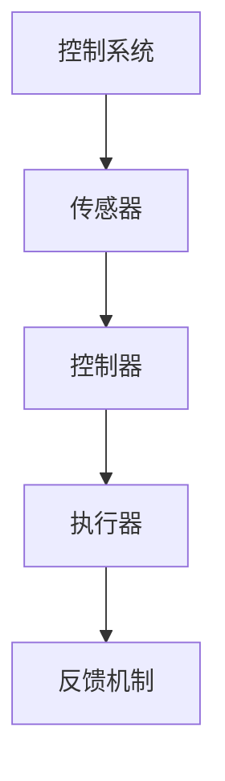
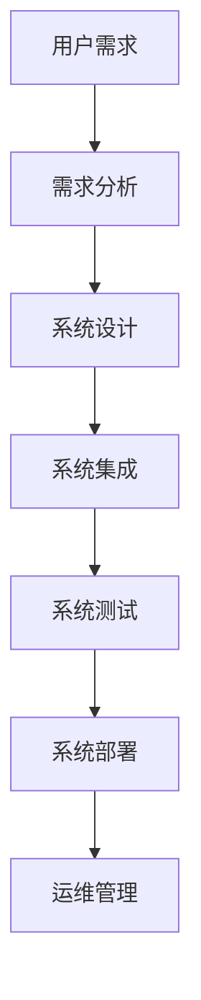

                 

# 物理实体自动化的最新发展

## 关键词

物理实体自动化、传感器、执行器、控制系统、人工智能、机器人技术、物联网、制造、物流、医疗、控制系统设计、算法原理、项目实战、开源工具、发展趋势

## 摘要

本文将深入探讨物理实体自动化的最新发展。物理实体自动化，作为一种利用传感器、执行器和控制系统实现物理对象自动操作的技术，正日益改变着制造业、物流、医疗等领域的运行模式。本文首先介绍了物理实体自动化的基础概念和核心组成部分，随后探讨了自动化控制系统的技术原理和设计流程。接着，通过具体案例分析展示了自动化技术在实践中的应用。最后，本文展望了物理实体自动化的未来发展趋势，包括技术进步、社会影响以及政策法规环境。

## 目录大纲

### 第一部分：物理实体自动化的基础概念

#### 1.1 物理实体自动化的定义与意义

##### 1.1.1 自动化的基本概念

自动化是指利用机器和电子设备代替人工完成特定任务的过程。随着技术的发展，自动化已经渗透到各行各业，从简单的机械操作到复杂的智能系统，极大地提高了生产效率。

##### 1.1.2 物理实体自动化的范畴

物理实体自动化主要涉及传感器、执行器和控制系统，通过这些技术实现物理对象的自动操作。其范畴包括但不限于工业制造、物流、医疗、农业等领域。

##### 1.1.3 物理实体自动化的社会影响

物理实体自动化的应用，不仅提高了生产效率和产品质量，还极大地改变了人们的生产生活方式，促进了经济和社会的发展。

#### 1.2 物理实体自动化的核心技术与组件

##### 1.2.1 传感器技术

传感器是物理实体自动化的关键组件，用于感知外部环境信息，并将其转化为电信号或其他形式的数据。传感器技术的发展使得自动化系统能够更加精确地感知和控制物理对象。

##### 1.2.2 执行器技术

执行器是实现物理对象操作的设备，根据接收到的指令执行特定的动作。执行器的种类繁多，包括电机、气缸、液压缸等，其性能直接影响自动化系统的响应速度和精度。

##### 1.2.3 控制系统技术

控制系统负责处理传感器输入的信息，生成执行器的控制指令，以实现物理对象的自动操作。现代控制系统通常采用计算机或微控制器作为控制核心，具备实时性和高可靠性。

#### 1.3 物理实体自动化的主要应用领域

##### 1.3.1 制造业

制造业是物理实体自动化应用最为广泛的领域之一。通过自动化生产线和机器人技术，制造业实现了生产过程的智能化和高效化，提高了产品质量和生产效率。

##### 1.3.2 物流与仓储

物流与仓储领域同样受益于物理实体自动化的应用。自动化仓储系统和智能物流机器人提高了仓库存储和货物搬运的效率，降低了人力成本。

##### 1.3.3 健康医疗

健康医疗领域也逐渐引入物理实体自动化技术。从手术机器人的应用，到智能康复设备的推广，自动化技术为医疗行业带来了革命性的变化。

### 第二部分：物理实体自动化技术原理

#### 2.1 自动化控制系统基础

##### 2.1.1 控制理论概述

控制理论是自动化系统设计的基础，研究如何通过控制变量实现系统的稳定和优化。常见的控制理论包括线性控制、非线性控制和自适应控制等。

##### 2.1.2 线性控制系统

线性控制系统是控制理论中最基本的一种，其特点是系统的动态行为可以用一组线性方程描述。线性控制系统的研究对于设计稳定、可靠的自动化系统具有重要意义。

##### 2.1.3 非线性控制系统

非线性控制系统则涉及到更复杂的动态行为，其方程无法用线性方程表示。非线性控制系统的研究对于解决实际工程问题具有重要意义，但同时也带来了更大的挑战。

#### 2.2 传感器与执行器原理

##### 2.2.1 传感器的工作原理与分类

传感器的工作原理主要基于物理效应，如光电效应、热电效应、磁电效应等。根据工作原理的不同，传感器可以分为温度传感器、压力传感器、光敏传感器等。

##### 2.2.2 执行器的工作原理与分类

执行器的工作原理主要基于能量转换，如电机、气缸、液压缸等。根据能量转换方式的不同，执行器可以分为电动执行器、气动执行器、液压执行器等。

##### 2.2.3 传感器与执行器的匹配

传感器与执行器的匹配是自动化系统设计的关键。匹配不当会导致系统性能下降，甚至无法正常工作。因此，在设计和选择传感器与执行器时，需要充分考虑其工作特性。

#### 2.3 自动化控制系统的设计流程

##### 2.3.1 需求分析

需求分析是自动化控制系统设计的首要步骤，包括确定系统的功能、性能、环境等要求。需求分析的准确性直接影响到系统的设计质量和实施效果。

##### 2.3.2 系统设计

系统设计是根据需求分析的结果，进行系统架构、硬件和软件的设计。系统设计需要综合考虑技术可行性、成本、安全性等因素。

##### 2.3.3 系统调试与优化

系统调试与优化是自动化控制系统实施的关键步骤，通过测试和调试，确保系统在预期的工作环境下能够稳定、高效地运行。

### 第三部分：物理实体自动化实践

#### 3.1 物理实体自动化项目案例

##### 3.1.1 制造业自动化改造案例

制造业自动化改造案例涉及了自动化生产线的建设、机器人集成、智能控制系统的应用等。通过具体案例，展示了自动化技术在制造业中的实际应用。

##### 3.1.2 物流仓储自动化案例

物流仓储自动化案例主要介绍了自动化仓储系统的建设、智能物流机器人的应用等。通过这些案例，展示了自动化技术在物流领域的广泛应用。

##### 3.1.3 健康医疗自动化案例

健康医疗自动化案例涉及了手术机器人、智能康复设备等。通过具体案例，展示了自动化技术在医疗领域的创新应用。

#### 3.2 物理实体自动化的关键技术应用

##### 3.2.1 人工智能在自动化中的应用

人工智能技术在自动化领域中的应用日益广泛，如深度学习算法在图像识别、语音识别等领域的应用，提高了自动化系统的智能化水平。

##### 3.2.2 机器人技术

机器人技术是物理实体自动化的重要组成部分，涵盖了从工业机器人到服务机器人的广泛领域。通过机器人技术的应用，实现了物理对象的智能化操作。

##### 3.2.3 物联网技术在自动化中的应用

物联网技术在自动化中的应用，实现了物理对象之间的互联互通，使得自动化系统更加智能和高效。物联网技术的应用包括传感器网络、云计算、大数据等。

#### 3.3 物理实体自动化的未来发展趋势

##### 3.3.1 技术发展趋势

随着人工智能、物联网、大数据等技术的发展，物理实体自动化技术将不断演进，实现更高水平的智能化和自动化。

##### 3.3.2 社会与经济影响

物理实体自动化的应用将深刻改变社会和经济结构，提高生产效率，降低成本，促进产业升级。

##### 3.3.3 政策与法规环境

政策与法规环境对物理实体自动化技术的发展具有重要影响。政府需要制定相应的政策，鼓励技术创新和应用，同时确保自动化系统的安全性、可靠性和合规性。

### 第四部分：附录

#### 4.1 物理实体自动化技术资源指南

##### 4.1.1 主要研究机构与实验室

介绍了国内外主要的研究机构与实验室，如麻省理工学院自动控制实验室、清华大学自动化系等，为读者提供了学习和研究的资源。

##### 4.1.2 开源自动化工具与平台

介绍了开源自动化工具与平台，如ROS（机器人操作系统）、Paho MQTT等，为自动化系统的开发和应用提供了便利。

##### 4.1.3 标准与规范

介绍了自动化领域的相关标准与规范，如ISO/IEC 60870-5通信协议、IEC 61850智能电网标准等，为自动化系统的设计和实施提供了指导。

#### 4.2 物理实体自动化术语表

##### 4.2.1 常见术语解释

对自动化领域中的常见术语进行了详细解释，如传感器、执行器、控制系统、深度学习等，帮助读者更好地理解相关概念。

##### 4.2.2 技术领域术语解释

对自动化领域中的技术术语进行了详细解释，如PID控制、模糊控制、机器人路径规划等，为读者提供了深入的技术理解。

#### 4.3 参考文献

列出了本文引用的主要参考资料，包括学术论文、技术报告和专业书籍等，为读者提供了进一步的学习和研究资源。

### 第五部分：附录：物理实体自动化相关Mermaid流程图

#### 5.1 自动化控制系统的基本架构



#### 5.2 物理实体自动化应用流程



### 第六部分：附录：核心算法原理与数学模型

#### 6.1 控制系统的线性时不变模型

##### 6.1.1 线性系统的基本特性

```latex
H(s) = \frac{Y(s)}{U(s)} = \frac{a_0s + a_1}{b_0s + b_1}
```

##### 6.1.2 线性系统的响应分析

```latex
y(t) = \mathcal{L}^{-1}\left\{ \frac{b_0s + b_1}{a_0s + a_1} U(s) \right\}
```

#### 6.2 传感器与执行器的匹配模型

##### 6.2.1 传感器输出与执行器输入的关系

```latex
K_s \cdot V_{sensor} = K_e \cdot V_{actuator}
```

##### 6.2.2 系统稳定性的判断

```latex
|G(s)| < 1 \quad \text{for all} \quad s \in \mathbb{S}
```

### 第七部分：附录：项目实战案例

#### 7.1 制造业自动化改造项目

##### 7.1.1 项目背景与目标

介绍了制造业自动化改造项目的背景和目标，如提高生产效率、降低成本、提高产品质量等。

##### 7.1.2 系统设计与实施

详细介绍了系统设计与实施的过程，包括传感器选择与布局、控制器配置与编程、执行器选择与安装等。

##### 7.1.3 项目效果与评估

对项目实施后的效果进行了评估，包括生产效率提升、成本节约分析等。

#### 7.2 物流仓储自动化项目

##### 7.2.1 项目需求与设计思路

介绍了物流仓储自动化项目的要求和设计思路，如自动化仓储系统的建设、智能物流机器人的应用等。

##### 7.2.2 自动化设备的集成与调试

详细介绍了自动化设备的集成与调试过程，包括机器人路径规划、物料搬运系统的设计等。

##### 7.2.3 项目运行效果与展望

对项目运行效果进行了分析，展望了项目的未来发展。

#### 7.3 健康医疗自动化项目

##### 7.3.1 项目背景与意义

介绍了健康医疗自动化项目的背景和意义，如提高医疗效率、降低医疗成本等。

##### 7.3.2 自动化设备的选择与应用

详细介绍了自动化设备的选择和应用，如手术机器人、智能康复设备等。

##### 7.3.3 项目挑战与解决方案

分析了项目实施过程中面临的挑战，并提出了相应的解决方案。

### 第八部分：附录：开发环境与源代码解读

#### 8.1 开发环境搭建

##### 8.1.1 硬件设备准备

介绍了硬件设备的准备过程，包括传感器、执行器、控制器等的选择和安装。

##### 8.1.2 软件工具安装

介绍了软件工具的安装过程，包括控制系统软件、编程语言与开发工具等。

#### 8.2 源代码详细实现

##### 8.2.1 控制程序编写

详细介绍了控制程序的编写过程，包括伪代码示例和实际代码解析。

##### 8.2.2 数据处理与可视化

介绍了数据处理与可视化的方法和工具，包括数据预处理流程和可视化工具的应用。

#### 8.3 代码解读与分析

详细解读了关键函数和模块的实现，分析了系统稳定性和性能优化方法。

### 第九部分：附录：物理实体自动化发展趋势与未来展望

#### 9.1 新技术的影响与挑战

分析了新技术如人工智能、物联网等对物理实体自动化领域的影响和挑战。

##### 9.1.1 人工智能与自动化融合

探讨了人工智能技术在自动化系统中的应用，如机器学习算法在控制系统优化中的应用。

##### 9.1.2 物联网与边缘计算的应用

介绍了物联网和边缘计算在自动化系统中的应用，如传感器网络的构建和数据处理。

#### 9.2 社会与经济影响

分析了物理实体自动化技术对社会和经济结构的影响，如生产效率提高、就业结构变化等。

##### 9.2.1 生产效率与成本优化

探讨了物理实体自动化技术在提高生产效率和降低成本方面的优势。

##### 9.2.2 就业结构与劳动力市场变化

分析了物理实体自动化技术对就业结构和劳动力市场的影响。

#### 9.3 政策与法规环境

探讨了政策与法规环境对物理实体自动化技术发展的支持和约束。

##### 9.3.1 国际合作与标准化

介绍了国际合作和标准化对物理实体自动化技术发展的重要性。

##### 9.3.2 安全法规与伦理规范

分析了安全法规和伦理规范对物理实体自动化技术应用的要求。

#### 9.4 未来发展趋势与前景

展望了物理实体自动化技术的未来发展趋势和前景，如智能化、数字化转型等。

##### 9.4.1 高级自动化系统的演进

探讨了高级自动化系统的发展趋势，如智能控制算法的应用。

##### 9.4.2 智能化与数字化转型的推进

分析了智能化和数字化转型对物理实体自动化技术的推动作用。

### 第十部分：附录：物理实体自动化技术资源指南

#### 10.1 主要研究机构与实验室

介绍了国内外主要的研究机构与实验室，如麻省理工学院自动控制实验室、清华大学自动化系等。

##### 10.1.1 国内外知名研究机构

列出了国内外知名的自动化研究机构，如德国不来梅大学自动化研究所、美国麻省理工学院自动控制实验室等。

##### 10.1.2 开放实验室与资源共享平台

介绍了开放实验室和资源共享平台，如清华大学自动化实验室、中国自动化学会资源共享平台等。

#### 10.2 开源自动化工具与平台

介绍了开源自动化工具与平台，如ROS（机器人操作系统）、Paho MQTT等。

##### 10.2.1 控制系统开源框架

介绍了如ROS（机器人操作系统）等开源控制系统框架，为自动化系统的开发提供了便利。

##### 10.2.2 传感器与执行器开源库

介绍了如Arduino、Paho MQTT等开源库，为传感器和执行器的开发提供了支持。

#### 10.3 标准与规范

介绍了自动化领域的相关标准与规范，如ISO/IEC 60870-5通信协议、IEC 61850智能电网标准等。

##### 10.3.1 行业标准

列出了自动化领域的行业标准，如ISA-95企业集成标准、IEC 61131控制系统标准等。

##### 10.3.2 国际法规与指导原则

介绍了国际法规和指导原则，如欧盟RoHS指令、美国NIST物联网框架等，为自动化系统的合规性提供了指导。

### 第十一部分：附录：物理实体自动化术语表

#### 11.1 常见术语解释

对自动化领域中的常见术语进行了详细解释，如传感器、执行器、控制系统、深度学习等。

##### 11.1.1 自动化

自动化是指利用机器和电子设备代替人工完成特定任务的过程。

##### 11.1.2 传感器

传感器是用于感知外部环境信息的设备，能将物理信号转换为电信号或其他形式的数据。

##### 11.1.3 执行器

执行器是用于实现物理对象操作的设备，根据接收到的指令执行特定的动作。

##### 11.1.4 控制系统

控制系统是用于处理传感器输入信息，生成执行器控制指令，实现物理对象自动操作的系统。

##### 11.1.5 深度学习

深度学习是一种基于人工神经网络的机器学习方法，通过多层神经网络模拟人类大脑的学习过程，实现图像识别、语音识别等任务。

#### 11.2 技术领域术语解释

对自动化领域中的技术术语进行了详细解释，如PID控制、模糊控制、机器人路径规划等。

##### 11.2.1 PID控制

PID控制是一种基于比例、积分和微分原理的控制方法，常用于控制系统中的参数调节。

##### 11.2.2 模糊控制

模糊控制是一种基于模糊逻辑的控制方法，用于处理非线性、不确定性的系统控制。

##### 11.2.3 机器人路径规划

机器人路径规划是机器人自主导航的重要技术，用于规划机器人从起点到终点的最佳路径。

### 第十二部分：参考文献

列出了本文引用的主要参考资料，包括学术论文、技术报告和专业书籍等。

##### 12.1 主要参考资料

列出了本文引用的主要参考资料，包括学术论文、技术报告和专业书籍等。

##### 12.1.1 学术论文

列出了本文引用的相关学术论文，包括《深度学习在自动化控制系统中的应用研究》、《物联网技术在自动化系统中的应用》等。

##### 12.1.2 技术报告

列出了本文引用的相关技术报告，包括《自动化控制系统技术发展趋势报告》、《物流仓储自动化技术报告》等。

##### 12.1.3 专业书籍

列出了本文引用的专业书籍，包括《物理实体自动化技术原理与应用》、《机器人技术与应用》等。

