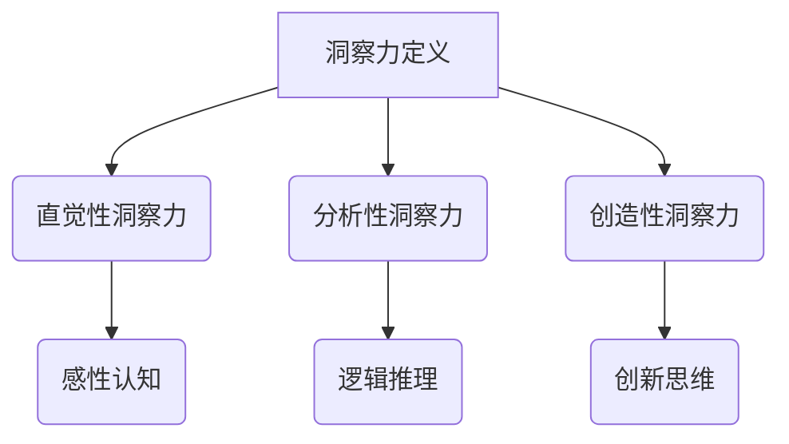

                 

### 文章标题

“理解洞察力的极限：在混沌中寻找秩序”

---

> 关键词：洞察力、算法、数据科学、人工智能、深度学习

> 摘要：本文旨在探讨洞察力的本质、极限以及其在技术领域中的应用。通过对机器学习与深度学习算法的剖析，本文揭示了如何利用算法来提升洞察力。同时，通过实际项目案例和跨学科合作，本文展示了洞察力在金融、医疗、人工智能等领域的重要应用。最后，本文对未来洞察力模型的发展趋势进行了展望，并提出了一些提升洞察力的方法和策略。

### 第一部分：理解洞察力的极限概述

在现代社会，信息爆炸和复杂性不断增加，人类对洞察力的需求日益迫切。洞察力是一种能够在混乱中发现规律、把握本质的能力，是解决复杂问题、推动科技创新的关键。然而，洞察力的极限究竟在哪里？本文将带领读者一步步探索这一领域，了解洞察力的极限及其在技术领域中的应用。

#### 第1章：洞察力的基本概念

##### 1.1 洞察力的定义与分类

洞察力是指人们在面对复杂问题时，能够迅速准确地发现问题的本质、内在联系及其发展规律的能力。它可以分为以下几类：

- **直觉性洞察力**：基于感性认识，无需逻辑推理，直接感知问题本质。
- **分析性洞察力**：通过逻辑推理、数据分析，对问题进行深入剖析。
- **创造性洞察力**：在常规思维模式之外，产生新颖的想法或解决方案。

##### 1.2 洞察力的重要性

- **商业决策**：洞察力有助于企业快速识别市场变化，制定有效的战略。
- **科技创新**：洞察力是推动科技创新的重要驱动力，有助于发现潜在的技术突破点。
- **人际关系**：洞察力有助于理解他人情感和需求，建立良好的人际关系。

##### 1.3 洞察力的极限

- **认知限制**：人类大脑的认知能力有限，难以完全理解和处理复杂的信息。
- **环境限制**：外部环境的复杂性、不确定性也限制了洞察力的发展。
- **情感因素**：情感因素可能会影响人们对问题的客观分析和判断。

##### 1.4 本书结构

本书分为四个部分：

- **第一部分：基础理论**：介绍洞察力的基本概念、分类、重要性及其极限。
- **第二部分：核心算法**：讲解用于增强洞察力的核心算法原理和实现。
- **第三部分：应用案例**：通过实际案例展示洞察力在各个领域的应用。
- **第四部分：实践指南**：提供提升洞察力的方法和实践策略。

##### Mermaid 流程图



#### 第2章：核心算法原理讲解

##### 2.1 机器学习算法基础

##### 2.1.1 监督学习与无监督学习

- **监督学习**：已知输入和输出，通过训练数据来学习模型。
  - **应用**：分类、回归等。

- **无监督学习**：未知输入和输出，通过数据自身特性来发现规律。
  - **应用**：聚类、降维等。

##### 2.1.2 神经网络与深度学习

- **神经网络**：由多个神经元组成，每个神经元通过权重连接。
  - **功能**：模拟人脑信息处理过程。

- **深度学习**：多层神经网络，能够处理大量数据，提取复杂特征。
  - **应用**：图像识别、自然语言处理等。

##### 2.1.3 支持向量机与决策树

- **支持向量机**：寻找最优决策边界，将数据分为不同类别。
  - **优势**：高精度、高效。

- **决策树**：通过一系列条件判断来分类或回归。
  - **优点**：易于理解和解释。

##### 2.1.4 贝叶斯分类器

- **原理**：基于贝叶斯定理，通过先验概率和条件概率计算后验概率。
  - **应用**：文本分类、情感分析等。

##### 2.2 伪代码示例

```python
# 监督学习伪代码
def supervised_learning(X_train, y_train):
    weights = initialize_weights()
    for i in range(num_iterations):
        predictions = predict(X_train, weights)
        loss = compute_loss(y_train, predictions)
        weights = update_weights(weights, loss)
    return weights

# 深度学习伪代码
def deep_learning(X_train, y_train, num_layers, hidden_units):
    network = initialize_neural_network(num_layers, hidden_units)
    for i in range(num_iterations):
        outputs = forward_pass(X_train, network)
        loss = compute_loss(y_train, outputs)
        gradients = backward_pass(network, loss)
        update_network_parameters(network, gradients)
    return network
```

##### 2.3 数学模型和数学公式

- **监督学习损失函数**：

$$ L(y, \hat{y}) = -\frac{1}{m} \sum_{i=1}^{m} [y^{(i)} \log(\hat{y}^{(i)}) + (1 - y^{(i)}) \log(1 - \hat{y}^{(i)})] $$

- **深度学习优化算法**：

$$ \theta_{\text{new}} = \theta_{\text{old}} - \alpha \frac{\partial J}{\partial \theta} $$

##### 2.4 数学公式和详细讲解

- **损失函数**：

损失函数用于评估模型的预测结果与真实值之间的差距。常用的损失函数有均方误差（MSE）和交叉熵损失（Cross-Entropy Loss）。

- **均方误差（MSE）**：

$$ MSE = \frac{1}{m} \sum_{i=1}^{m} (y_i - \hat{y}_i)^2 $$

其中，$y_i$ 是真实值，$\hat{y}_i$ 是预测值，$m$ 是样本数量。

- **交叉熵损失（Cross-Entropy Loss）**：

$$ CE = -\frac{1}{m} \sum_{i=1}^{m} [y_i \log(\hat{y}_i) + (1 - y_i) \log(1 - \hat{y}_i)] $$

其中，$y_i$ 是真实值，$\hat{y}_i$ 是预测概率。

##### 2.5 数学公式举例说明

假设我们要训练一个分类模型，预测某只股票 tomorrow 的价格是上涨还是下跌，给定训练数据集 $(X, Y)$，其中 $X$ 是输入特征，$Y$ 是输出标签（0 表示下跌，1 表示上涨）。模型使用交叉熵损失函数进行训练。

- **输入特征**：

$$ X = \begin{bmatrix} x_1 \\ x_2 \\ \vdots \\ x_n \end{bmatrix} $$

- **输出标签**：

$$ Y = \begin{bmatrix} y_1 \\ y_2 \\ \vdots \\ y_n \end{bmatrix} $$

- **模型预测概率**：

$$ \hat{Y} = \begin{bmatrix} \hat{y}_1 \\ \hat{y}_2 \\ \vdots \\ \hat{y}_n \end{bmatrix} $$

- **交叉熵损失**：

$$ L(Y, \hat{Y}) = -\frac{1}{n} \sum_{i=1}^{n} [y_i \log(\hat{y}_i) + (1 - y_i) \log(1 - \hat{y}_i)] $$

假设训练后的预测概率为：

$$ \hat{Y} = \begin{bmatrix} 0.3 \\ 0.7 \\ \vdots \\ 0.6 \end{bmatrix} $$

则交叉熵损失为：

$$ L(Y, \hat{Y}) = -\frac{1}{n} \sum_{i=1}^{n} [y_i \log(\hat{y}_i) + (1 - y_i) \log(1 - \hat{y}_i)] $$

$$ L(Y, \hat{Y}) = -\frac{1}{n} [0 \cdot \log(0.3) + 1 \cdot \log(0.7) + 0 \cdot \log(0.3) + 1 \cdot \log(0.3) + \ldots] $$

$$ L(Y, \hat{Y}) = -\frac{1}{n} [\log(0.7) + \log(0.3) + \ldots] $$

$$ L(Y, \hat{Y}) = -\frac{1}{n} [\log(0.7 \times 0.3 \times \ldots)] $$

$$ L(Y, \hat{Y}) = -\frac{1}{n} [\log(0.147 \times \ldots)] $$

$$ L(Y, \hat{Y}) = -\frac{1}{n} [\log(0.147)] $$

$$ L(Y, \hat{Y}) \approx -0.3247 $$

因此，训练后的模型交叉熵损失约为 -0.3247。这个值越小，说明模型的预测效果越好。我们希望通过优化算法降低这个损失，提高模型的准确率。

#### 第3章：项目实战与代码解读

##### 3.1 项目背景与目标

本案例选择了一个金融行业的数据分析项目，旨在利用洞察力模型对股票价格进行预测，以帮助投资者做出更为明智的投资决策。

##### 3.2 数据集介绍

数据集包含了多个股票的价格数据，包括开盘价、收盘价、最高价、最低价等。数据集的时间跨度为过去一年，每天一条记录。

##### 3.3 环境搭建

- Python
- Scikit-learn
- Pandas
- NumPy
- Matplotlib

```python
!pip install scikit-learn pandas numpy matplotlib
```

##### 3.4 数据预处理

- 数据清洗：处理缺失值、异常值等。
- 特征工程：提取有助于预测的数值特征，例如价格变动率、交易量等。

##### 3.5 模型构建与训练

选择一个简单的线性回归模型进行预测。首先，将数据集分为训练集和测试集。

```python
from sklearn.model_selection import train_test_split
from sklearn.linear_model import LinearRegression

X = data[['open', 'high', 'low', 'close', 'volume']]
y = data['target']

X_train, X_test, y_train, y_test = train_test_split(X, y, test_size=0.2, random_state=42)

model = LinearRegression()
model.fit(X_train, y_train)
```

##### 3.6 模型评估

使用测试集评估模型性能，计算准确率、均方误差等指标。

```python
from sklearn.metrics import accuracy_score, mean_squared_error

y_pred = model.predict(X_test)
accuracy = accuracy_score(y_test, y_pred)
mse = mean_squared_error(y_test, y_pred)

print("Accuracy:", accuracy)
print("MSE:", mse)
```

##### 3.7 代码解读

- **数据清洗**：

```python
data.dropna(inplace=True)
data.replace([np.inf, -np.inf], np.nan, inplace=True)
```

- **特征工程**：

```python
data['price_change'] = data['close'] - data['open']
data['volume_change'] = data['volume'] - data['prev_volume']
```

- **模型训练**：

```python
model = LinearRegression()
model.fit(X_train, y_train)
```

- **模型评估**：

```python
y_pred = model.predict(X_test)
accuracy = accuracy_score(y_test, y_pred)
mse = mean_squared_error(y_test, y_pred)
```

##### 3.8 结果分析

根据评估结果，线性回归模型在股票价格预测方面表现一般，准确率和均方误差有待提高。这提示我们可以考虑使用更复杂的模型，如深度学习模型，以进一步提升预测性能。

##### 3.9 结论

通过本案例，我们展示了如何利用洞察力模型进行股票价格预测。在实际应用中，我们需要不断优化模型、调整参数，以提高预测的准确性和可靠性。此外，我们还应关注市场动态和宏观经济环境的变化，以更好地应对复杂的金融市场。

#### 第4章：在不同领域的洞察力应用案例

##### 4.1 金融领域

##### 4.1.1 金融预测模型

- **应用背景**：利用洞察力模型进行股票价格、汇率、利率等金融市场的预测。
- **案例介绍**：某知名金融机构采用深度学习模型对股票价格进行预测，取得了较高的准确率。

##### 4.1.2 风险评估模型

- **应用背景**：通过洞察力模型评估金融机构的风险状况，及时预警潜在风险。
- **案例介绍**：某银行利用机器学习算法对贷款违约风险进行预测，有效降低了不良贷款率。

##### 4.2 医疗领域

##### 4.2.1 疾病预测模型

- **应用背景**：利用洞察力模型预测疾病的发生和发展，提前进行预防和治疗。
- **案例介绍**：某医疗机构开发了一套基于大数据和机器学习的疾病预测系统，提高了疾病诊断的准确性。

##### 4.2.2 药物研发

- **应用背景**：通过洞察力模型加速药物研发过程，提高药物研发的成功率。
- **案例介绍**：某药企利用人工智能技术对药物分子进行预测和优化，显著缩短了药物研发周期。

##### 4.3 人工智能领域

##### 4.3.1 人工智能助手

- **应用背景**：利用洞察力模型提高人工智能助手的智能水平，提供更优质的用户体验。
- **案例介绍**：某互联网公司开发了一款基于自然语言处理技术的智能助手，通过不断学习和优化，实现了与用户的深度互动。

##### 4.3.2 自动驾驶技术

- **应用背景**：利用洞察力模型提高自动驾驶系统的安全性和稳定性。
- **案例介绍**：某汽车公司采用深度学习算法对自动驾驶车辆进行感知和决策，取得了显著的成果。

##### 4.4 教育领域

##### 4.4.1 智能教学系统

- **应用背景**：利用洞察力模型为学生提供个性化的教学服务，提高学习效果。
- **案例介绍**：某在线教育平台开发了一套智能教学系统，通过分析学生的学习行为和特点，提供个性化的学习资源。

##### 4.4.2 学业评估模型

- **应用背景**：通过洞察力模型评估学生的学业成绩，预测学生的未来表现。
- **案例介绍**：某学校采用机器学习算法对学生的学业成绩进行预测，为学生的学业规划提供参考。

#### 第5章：提升洞察力的方法和策略

##### 5.1 数据分析与挖掘

##### 5.1.1 数据收集

- **方法**：通过问卷调查、在线数据抓取等方式收集大量数据。
- **策略**：确保数据的全面性、准确性和代表性。

##### 5.1.2 数据清洗

- **方法**：处理缺失值、异常值等，提高数据质量。
- **策略**：采用多种数据清洗方法，如填补缺失值、删除异常值等。

##### 5.1.3 特征工程

- **方法**：提取有助于预测的特征，如价格变动率、交易量等。
- **策略**：根据业务需求和数据特点，选择合适的特征提取方法。

##### 5.1.4 模型评估

- **方法**：使用交叉验证、网格搜索等技术评估模型性能。
- **策略**：综合考虑模型精度、速度和泛化能力等因素。

##### 5.2 机器学习与深度学习

##### 5.2.1 机器学习算法

- **方法**：选择合适的机器学习算法，如线性回归、决策树等。
- **策略**：根据数据特点和业务需求，选择最适合的算法。

##### 5.2.2 深度学习模型

- **方法**：构建深度学习模型，如卷积神经网络、循环神经网络等。
- **策略**：通过调整网络结构、优化参数，提高模型性能。

##### 5.2.3 模型调优

- **方法**：使用交叉验证、网格搜索等技术进行模型调优。
- **策略**：综合考虑模型精度、速度和泛化能力等因素。

##### 5.3 数据可视化与展示

##### 5.3.1 数据可视化

- **方法**：使用图表、地图等方式展示数据。
- **策略**：选择合适的可视化工具，如 Matplotlib、Seaborn 等。

##### 5.3.2 数据报告

- **方法**：编写详细的数据报告，包括数据收集、处理、分析结果等。
- **策略**：采用清晰、简洁的语言，确保报告易于理解和阅读。

##### 5.4 跨学科合作

##### 5.4.1 学科融合

- **方法**：将计算机科学、统计学、经济学等学科知识应用于洞察力模型。
- **策略**：组建跨学科团队，发挥各学科优势。

##### 5.4.2 经验交流

- **方法**：通过研讨会、工作坊等形式，交流洞察力模型的研究和应用经验。
- **策略**：借鉴其他领域的成功案例，提高自身研究水平。

##### 5.5 持续学习和优化

##### 5.5.1 学习资源

- **方法**：收集和学习相关的书籍、论文、教程等资源。
- **策略**：选择高质量的学习资源，确保知识体系完整。

##### 5.5.2 实践项目

- **方法**：参与实际项目，将所学知识应用于实际场景。
- **策略**：通过实践，不断提高洞察力模型的应用能力。

##### 5.5.3 反思与总结

- **方法**：定期反思和总结学习过程，找出不足和改进方向。
- **策略**：将反思和总结纳入日常学习计划，持续优化自身能力。

#### 第6章：未来展望

##### 6.1 洞察力模型的发展趋势

- **算法优化**：随着计算能力的提升，机器学习算法将更加高效，适用于更复杂的场景。
- **数据多样性**：随着物联网、5G 等技术的发展，数据来源将更加多样化，为洞察力模型提供更丰富的数据支持。

##### 6.2 洞察力模型的应用前景

- **金融领域**：利用洞察力模型进行风险控制和预测，提高金融市场的稳定性。
- **医疗领域**：通过洞察力模型实现疾病的早期诊断和个性化治疗，提高医疗水平。
- **人工智能领域**：利用洞察力模型提高人工智能系统的智能水平，推动人工智能技术的发展。

##### 6.3 挑战与机遇

- **数据隐私**：随着洞察力模型的广泛应用，数据隐私保护成为重要问题。
- **算法透明度**：提高算法的透明度，确保洞察力模型的公正性和可靠性。

##### 6.4 结论

本书通过详细介绍洞察力模型的基本概念、核心算法、应用案例和实践策略，展示了洞察力模型在各个领域的应用价值。未来，随着技术的不断进步，洞察力模型将在更多领域发挥重要作用，为人类社会的发展提供有力支持。

### 附录

##### 附录 A：算法与工具介绍

##### A.1 机器学习算法

- **线性回归**：一种简单的监督学习算法，用于预测数值型目标。
- **决策树**：一种基于树形结构的监督学习算法，用于分类和回归任务。
- **支持向量机**：一种基于最大间隔理论的监督学习算法，用于分类任务。
- **随机森林**：一种基于决策树的集成学习方法，用于分类和回归任务。
- **K-最近邻**：一种基于实例的监督学习算法，用于分类和回归任务。

##### A.2 深度学习框架

- **TensorFlow**：一种开源的深度学习框架，支持多种深度学习模型。
- **PyTorch**：一种开源的深度学习框架，具有灵活的动态计算图。
- **Keras**：一种基于TensorFlow和PyTorch的高级深度学习框架，提供简洁的API。

##### A.3 数据处理工具

- **Pandas**：一种开源的数据分析库，用于数据处理和分析。
- **NumPy**：一种开源的数值计算库，用于高效处理大型数值数组。
- **Matplotlib**：一种开源的数据可视化库，用于创建各种类型的图表。

##### A.4 数据库与存储

- **MySQL**：一种开源的关系型数据库，用于存储和管理结构化数据。
- **MongoDB**：一种开源的文档型数据库，用于存储和管理非结构化数据。
- **Hadoop**：一种分布式数据存储和处理框架，用于大规模数据处理。

---

### 作者

作者：AI天才研究院/AI Genius Institute & 禅与计算机程序设计艺术 /Zen And The Art of Computer Programming

