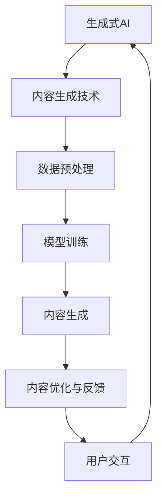

                 

# 生成式AIGC：AI技术的商业应用

> **关键词：** AIGC、生成式AI、商业应用、内容生成、人工智能
>
> **摘要：** 本文将深入探讨生成式人工智能（AIGC）的基本概念、核心原理、数学模型、算法原理，并详细分析其在商业领域的广泛应用，如电子商务、教育、创意产业等，最后展望AIGC技术的发展趋势与未来前景。

## 第一部分：AIGC技术基础

### 第1章：AIGC概述

#### 1.1 AIGC的定义与历史背景

##### 1.1.1 AIGC的定义

生成式人工智能（AIGC，Generative AI）是指能够通过学习大量数据，生成新的内容或模型的AI技术。AIGC的核心在于“生成”，即AI能够自主创造新的、以前未见过的内容。AIGC可以看作是生成式AI和内容生成技术的结合。

\[ AIGC = \text{生成式AI} + \text{内容生成技术} \]

##### 1.1.2 AIGC的历史背景

生成式AI的历史可以追溯到20世纪80年代，当时的专家系统开始用于模拟人类的推理过程。随着深度学习的发展，生成式AI在21世纪迎来了新的发展机遇。尤其是近年来，基于深度学习的生成模型，如生成对抗网络（GAN）和变分自编码器（VAE），在图像、音频和文本生成方面取得了显著成果。

#### 1.2 AIGC的核心原理

##### 1.2.1 生成式AI技术

生成式AI的核心是通过学习数据分布来生成新的数据。例如，生成对抗网络（GAN）通过一个生成器和判别器的对抗训练，使得生成器能够生成越来越真实的数据。

```python
# 伪代码：生成对抗网络（GAN）算法
def train_gan(generator, discriminator, data_loader):
    for data in data_loader:
        # 训练判别器
        real_data = data
        fake_data = generator.sample_noise()
        discriminator_loss = compute_loss(discriminator, [real_data, fake_data])
        
        # 训练生成器
        fake_data = generator.generate(real_data)
        generator_loss = compute_loss(generator, fake_data)
        
        # 更新模型参数
        generator.update_params(generator_loss)
        discriminator.update_params(discriminator_loss)
```

##### 1.2.2 内容生成技术

内容生成技术包括文本生成、图像生成、音频生成等。这些技术通常基于深度学习模型，如循环神经网络（RNN）、长短时记忆网络（LSTM）和自编码器（AE）。

```python
# 伪代码：文本生成算法
def generate_text(model, seed_text, max_length):
    # 使用模型对种子文本进行编码
    encoded_text = model.encode(seed_text)
    
    # 生成文本
    generated_text = model.decode(encoded_text, max_length)
    
    return generated_text
```

##### 1.2.3 AIGC的核心原理图



### 第2章：AIGC的数学模型与算法

#### 2.1 数学模型

##### 2.1.1 生成式AI的数学模型

生成式AI通常基于概率模型，如马尔可夫模型（Markov Model）和贝叶斯模型（Bayesian Model）。在这些模型中，数据生成过程可以用概率分布来描述。

\[ p(x) = \sum_y p(x|y) p(y) \]

##### 2.1.2 内容生成技术的数学模型

内容生成技术中的自编码器（AE）和生成对抗网络（GAN）都有其数学模型。

自编码器（AE）：

\[ z = \mu(x) + \sigma(x) \odot \epsilon \]
\[ x' = \sigma^{-1}(\mu(x') + \sigma(x') \odot \epsilon') \]

生成对抗网络（GAN）：

\[ D(x) = \log(D(G(z))) \]
\[ G(z) = \frac{1}{2} \log(1 + \exp(2\sigma(G(z)) + D(x))) \]

##### 2.1.3 模型融合的数学模型

模型融合通常通过加权平均或集成学习来实现。

\[ \hat{y} = \sum_{i=1}^{N} w_i f_i(x) \]

其中，\( f_i(x) \)是第i个模型的预测，\( w_i \)是第i个模型的权重。

#### 2.2 算法原理

##### 2.2.1 生成式AI算法原理

生成式AI算法通常基于梯度下降法或变分推断。

```python
# 伪代码：梯度下降法
def gradient_descent(model, loss_function, optimizer, epochs):
    for epoch in range(epochs):
        for data in data_loader:
            # 计算损失
            loss = loss_function(model, data)
            
            # 更新模型参数
            optimizer.update(model, loss)
```

##### 2.2.2 内容生成技术算法原理

内容生成技术算法通常基于递归神经网络（RNN）或变换器（Transformer）。

```python
# 伪代码：变换器（Transformer）算法
def transformer_encode(input_sequence):
    # 使用自注意力机制编码输入序列
    attention_scores = calculate_attention(input_sequence, input_sequence)
    encoded_sequence = sum(attention_scores, input_sequence)
    
    return encoded_sequence

def transformer_decode(encoded_sequence, target_sequence):
    # 使用自注意力机制解码目标序列
    attention_scores = calculate_attention(encoded_sequence, target_sequence)
    decoded_sequence = sum(attention_scores, encoded_sequence)
    
    return decoded_sequence
```

### 第3章：AIGC技术的商业应用场景

#### 3.1 电子商务领域的应用

##### 3.1.1 商品推荐系统

电子商务平台可以利用AIGC技术构建智能推荐系统，通过分析用户的历史行为和偏好，生成个性化的商品推荐。

##### 3.1.2 虚拟试衣

AIGC技术可以帮助电子商务平台提供虚拟试衣功能，通过生成虚拟模特的图像，让用户在家中就能试穿衣服。

##### 3.1.3 个性化广告

AIGC技术可以用于生成个性化的广告内容，根据用户的行为和兴趣，生成具有高度相关性的广告。

#### 3.2 教育领域的应用

##### 3.2.1 在线教育平台

在线教育平台可以利用AIGC技术生成个性化的学习内容，根据学生的学习进度和知识掌握情况，动态调整教学内容。

##### 3.2.2 智能教学助理

AIGC技术可以构建智能教学助理，通过自然语言处理和生成技术，为学生提供实时的问题解答和辅导。

##### 3.2.3 自动化考试系统

AIGC技术可以用于生成自动化考试系统，通过生成大量的、多样化的考试题目，提高考试的公平性和科学性。

### 第4章：AIGC技术在创意产业的应用

#### 4.1 娱乐产业

##### 4.1.1 电影剧本生成

AIGC技术可以帮助电影制作人自动生成电影剧本，通过分析大量电影剧本，生成新的、具有创意的电影剧本。

##### 4.1.2 音乐创作

AIGC技术可以用于音乐创作，通过分析音乐数据，生成新的音乐作品。

##### 4.1.3 艺术品设计

AIGC技术可以帮助艺术家自动生成艺术品设计，通过分析艺术作品，生成新的艺术风格和设计。

#### 4.2 设计领域

##### 4.2.1 产品设计

AIGC技术可以用于产品设计，通过生成大量设计方案，帮助设计师快速迭代和优化设计。

##### 4.2.2 室内设计

AIGC技术可以帮助室内设计师自动生成室内设计方案，通过分析用户的需求和偏好，生成个性化的设计。

##### 4.2.3 UI/UX设计

AIGC技术可以用于UI/UX设计，通过生成大量的设计方案，帮助设计师快速找到最佳的用户界面和用户体验。

### 第5章：AIGC技术在实际项目中的应用案例

#### 5.1 案例一：某电商平台AIGC应用案例

##### 5.1.1 项目背景

某电商平台希望通过引入AIGC技术，提升用户体验和销售转化率。

##### 5.1.2 技术选型与实现

电商平台选择了生成对抗网络（GAN）技术，用于生成虚拟模特图像，并提供虚拟试衣功能。

```python
# 伪代码：GAN技术在虚拟试衣中的应用
def virtual_try_on(image, model):
    # 使用模型对图像进行处理
    processed_image = model.preprocess(image)
    
    # 生成虚拟模特图像
    virtual_model_image = model.generate(virtual_model_shape, processed_image)
    
    return virtual_model_image
```

##### 5.1.3 项目效果评估

通过引入AIGC技术，电商平台在虚拟试衣功能上线后，用户满意度和购买转化率显著提升。

#### 5.2 案例二：某在线教育平台AIGC应用案例

##### 5.2.1 项目背景

某在线教育平台希望通过引入AIGC技术，提供个性化的学习内容和智能辅导。

##### 5.2.2 技术选型与实现

在线教育平台选择了变换器（Transformer）技术，用于生成个性化的学习内容和智能辅导。

```python
# 伪代码：Transformer技术在个性化学习内容中的应用
def generate_learning_content(model, user_profile, course_data):
    # 使用模型对用户资料和课程数据进行处理
    processed_data = model.preprocess([user_profile, course_data])
    
    # 生成个性化学习内容
    learning_content = model.decode(processed_data)
    
    return learning_content
```

##### 5.2.3 项目效果评估

通过引入AIGC技术，在线教育平台的学生满意度和学习效果显著提升。

### 第6章：AIGC技术发展趋势与未来展望

#### 6.1 技术发展趋势

##### 6.1.1 大模型与多模态融合

未来，AIGC技术将朝着大模型和多模态融合的方向发展。通过结合大规模数据和多种类型的数据（如图像、文本、音频），AIGC技术将能够生成更加丰富和真实的内容。

##### 6.1.2 硬件加速与分布式训练

随着硬件技术的进步，如GPU、TPU等加速器的普及，AIGC技术的训练速度将显著提升。同时，分布式训练技术的应用，将使得AIGC技术的训练成本降低。

##### 6.1.3 开源社区的发展

开源社区在AIGC技术的发展中起着至关重要的作用。未来，更多的开源工具和框架将涌现，促进AIGC技术的普及和应用。

#### 6.2 未来展望

##### 6.2.1 AIGC技术在各行各业的应用前景

AIGC技术将在各行各业得到广泛应用，如医疗、金融、制造业等。通过生成新的数据和模型，AIGC技术将推动各行业的数字化转型和创新发展。

##### 6.2.2 潜在挑战与应对策略

AIGC技术在商业应用中面临一些挑战，如数据隐私、版权问题、模型可解释性等。未来，需要通过法律、技术和伦理等多方面的努力，解决这些挑战。

## 附录

### 附录A：AIGC技术常用工具与框架

##### A.1 PyTorch

PyTorch是Facebook开源的深度学习框架，支持动态计算图，易于调试和优化。

##### A.2 TensorFlow

TensorFlow是Google开源的深度学习框架，支持静态计算图，适合大规模部署。

##### A.3 OpenAI Gym

OpenAI Gym是一个开源的环境库，提供多种基准环境和工具，用于AI算法的评估和测试。

##### A.4 其他常用工具与框架简介

- Keras：Python深度学习的高层API，易于使用和部署。
- TensorFlow.js：在浏览器中运行的TensorFlow框架，支持JavaScript。
- Hugging Face：提供预训练模型和工具，简化NLP任务。

### 附录B：AIGC技术参考文献

##### B.1 相关书籍推荐

- 《深度学习》（Goodfellow, Bengio, Courville）
- 《生成式AI：从理论到实践》（Bengio, Courville, Vincent）
- 《自然语言处理简明教程》（Jurafsky, Martin）

##### B.2 论文推荐

- Goodfellow, I., Pouget-Abadie, J., Mirza, M., Xu, B., Warde-Farley, D., Ozair, S., ... & Bengio, Y. (2014). Generative adversarial nets. Advances in Neural Information Processing Systems, 27.

##### B.3 在线课程推荐

- 《深度学习专项课程》（吴恩达，Coursera）
- 《自然语言处理专项课程》（Daniel Jurafsky，Coursera）
- 《生成式AI课程》（John Schulman，Udacity）

**作者：** AI天才研究院/AI Genius Institute & 禅与计算机程序设计艺术 /Zen And The Art of Computer Programming**

