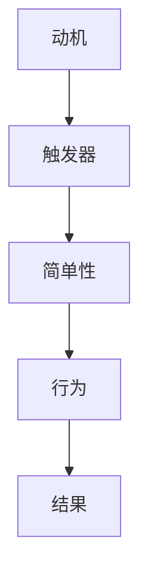

                 

# 《用福格模型打造高效团队》

## 关键词
**福格模型**、**团队管理**、**目标设定**、**激励策略**、**团队协作**、**实践案例**、**数字化转型**、**持续改进**

## 摘要

在当今快速发展的商业环境中，高效团队的重要性不言而喻。本文将介绍福格模型这一先进的管理工具，并详细阐述如何将其应用于团队管理的各个方面。通过深入分析福格模型的三大要素——行为动机、触发器和简单性，本文将帮助读者理解其在团队目标设定、激励策略和团队协作中的具体应用。此外，文章还将通过实际案例，展示福格模型在不同规模和类型的团队中的成功实践，并提供进阶策略，以应对数字化转型和持续改进的需求。通过本文的阅读，读者将能够掌握福格模型的核心原理，并将其有效应用于实际工作中，打造出更加高效、协作紧密的团队。

### 目录大纲

# 《用福格模型打造高效团队》

## 第一部分：福格模型基础

### 1.1 福格模型概述

#### 1.1.1 福格模型的提出与背景

#### 1.1.2 福格模型的三大要素

#### 1.1.3 福格模型在团队管理中的重要性

### 1.2 福格模型的原理与架构

#### 1.2.1 行为动机的数学模型

#### 1.2.2 互为因果的三大要素

#### 1.2.3 Mermaid流程图：福格模型原理展示

## 第二部分：福格模型在团队管理中的应用

### 2.1 福格模型在目标设定中的应用

#### 2.1.1 明确团队目标

#### 2.1.2 制定可达目标

#### 2.1.3 目标达成的关键因素

### 2.2 福格模型在激励策略中的应用

#### 2.2.1 个性化激励

#### 2.2.2 激励策略设计

#### 2.2.3 激励效果评估

### 2.3 福格模型在团队协作中的应用

#### 2.3.1 构建协作文化

#### 2.3.2 提升团队沟通效率

#### 2.3.3 协作工具选择与使用

## 第三部分：福格模型实践与案例

### 3.1 福格模型在初创团队中的应用

#### 3.1.1 初创团队的特点与挑战

#### 3.1.2 福格模型在初创团队中的实践

#### 3.1.3 初创团队的福格模型案例

### 3.2 福格模型在大型团队中的应用

#### 3.2.1 大型团队的组织结构与特点

#### 3.2.2 福格模型在大型团队中的实施

#### 3.2.3 大型团队的福格模型案例

### 3.3 福格模型在跨团队协作中的应用

#### 3.3.1 跨团队协作的挑战与策略

#### 3.3.2 福格模型在跨团队协作中的实践

#### 3.3.3 跨团队协作的福格模型案例

## 第四部分：福格模型进阶

### 4.1 福格模型与敏捷管理

#### 4.1.1 敏捷管理的基本理念

#### 4.1.2 福格模型与敏捷管理的结合

#### 4.1.3 敏捷团队中福格模型的应用

### 4.2 福格模型与数字化转型

#### 4.2.1 数字化转型的核心要素

#### 4.2.2 福格模型在数字化转型中的应用

#### 4.2.3 数字化转型中福格模型的成功案例

### 4.3 福格模型与持续改进

#### 4.3.1 持续改进的概念与原则

#### 4.3.2 福格模型在持续改进中的角色

#### 4.3.3 持续改进中的福格模型实践

## 附录

### 附录 A：福格模型相关工具与资源

#### A.1 福格模型相关书籍推荐

#### A.2 福格模型在线资源与课程

#### A.3 福格模型实践案例集锦

## 引言

在信息技术日新月异、市场竞争日益激烈的今天，企业的发展离不开高效团队的支撑。一个优秀的团队不仅能快速响应市场变化，还能持续创新，为企业创造价值。然而，如何打造这样的高效团队，却一直是企业管理者面临的重大挑战。本文将介绍一种基于行为科学的理论——福格模型，并详细阐述其在团队管理中的应用，以期为企业提供一种有效的管理工具。

### 福格模型概述

福格模型（BJ Fogg Behavior Model）是由斯坦福大学行为科学家BJ Fogg提出的，用于解释人们行为背后的动机和触发机制。福格模型认为，行为的产生是三个因素共同作用的结果：动机（Motivation）、触发器（Trigger）和简单性（Simple）。这三大要素相互作用，形成一个完整的行为循环。

- **动机**：个体行为的内在驱动力，包括需求、欲望、兴趣等。
- **触发器**：引发行为的即时刺激，例如一个电话、一个提示或一个事件。
- **简单性**：行为的易执行性，即行为越简单，越容易被触发和完成。

福格模型的核心思想是，只有当这三个要素同时存在且相互匹配时，行为才最有可能发生。例如，一个员工想要提升自己的技能（动机），公司提供了一个在线学习平台（触发器），而且使用这个平台非常方便（简单性），那么员工很可能就会利用这个平台进行学习。

### 福格模型在团队管理中的重要性

福格模型不仅适用于个人行为的管理，也同样适用于团队管理。在团队管理中，管理者可以通过以下方式利用福格模型：

1. **明确目标**：通过理解团队成员的动机，设定清晰的目标，确保每个成员都明确知道自己的职责和期望。
2. **设计激励机制**：根据成员的兴趣和需求，设计个性化的激励机制，以激发他们的工作热情和积极性。
3. **优化工作流程**：通过简化工作流程，减少不必要的步骤，提高工作效率，增强团队的执行力。

总的来说，福格模型为团队管理提供了一种系统化的方法，帮助管理者从行为科学的角度理解和管理团队成员的行为，从而打造出高效、协作紧密的团队。

## 第一部分：福格模型基础

### 1.1 福格模型概述

#### 1.1.1 福格模型的提出与背景

福格模型（BJ Fogg Behavior Model）是由BJ Fogg于2003年提出的。BJ Fogg是斯坦福大学行为设计实验室的创始人，也是行为设计领域的先驱。他的研究专注于人类行为背后的动机和触发机制，试图通过科学的方法来解释和改变行为。

福格模型的背景源于BJ Fogg对人类行为的深刻洞察。在多年的研究和实践中，他发现人们的行为往往受到三个关键因素的驱动：动机、触发器和简单性。这三个要素相互作用，共同决定了个体是否采取某种行为。基于这一发现，BJ Fogg提出了福格模型，并广泛应用于行为改变、产品设计、市场营销等领域。

#### 1.1.2 福格模型的三大要素

福格模型的三大要素分别是动机（Motivation）、触发器（Trigger）和简单性（Simple）。每个要素在模型中都扮演着重要的角色，共同作用以决定行为的发生。

1. **动机**：动机是个体行为的内在驱动力，可以是需求、欲望、兴趣等。它是人们采取行动的原始动力，通常与个体的价值观、目标和个人需求密切相关。例如，一个人可能因为渴望提升技能而决定参加培训课程。

2. **触发器**：触发器是触发行为的即时刺激。它可以是外部的事件、提示或信号，例如接到工作邮件、收到朋友的邀请或看到广告。触发器的作用是激发个体的动机，使其转化为具体的行动。例如，一个提醒通知可能促使员工按时完成工作任务。

3. **简单性**：简单性是指行为的易执行性。一个行为越简单，越容易被触发和完成。简单性可以减少个体在采取行动时的心理障碍，从而增加行为的可能性。例如，一个一键操作的软件功能比需要多个步骤的操作更容易被用户采纳。

这三个要素在福格模型中相互关联，共同决定行为是否发生。只有当动机、触发器和简单性同时满足时，行为才最有可能发生。例如，一个员工有提升技能的动机，公司提供了培训机会（触发器），而且培训过程非常简单易行（简单性），那么员工很可能就会参加培训。

#### 1.1.3 福格模型在团队管理中的重要性

福格模型在团队管理中的应用具有深远的意义。通过理解福格模型的三大要素，管理者可以更有效地激励和引导团队成员，从而提高团队的整体效率和协作能力。

首先，福格模型帮助管理者明确团队成员的动机。了解每个成员的内在驱动力，管理者可以设定更具针对性的目标和任务，使团队成员在工作中更有动力和目标感。

其次，福格模型为设计激励机制提供了科学依据。通过分析团队成员的兴趣和需求，管理者可以设计个性化的激励机制，从而更好地激发团队成员的积极性和创造力。

最后，福格模型帮助管理者优化工作流程，提高团队执行力。通过简化工作流程，减少不必要的步骤和障碍，管理者可以降低团队成员的心理负担，提高工作效率和协作效率。

总之，福格模型为团队管理提供了一种系统化的方法，帮助管理者从行为科学的角度理解和引导团队成员的行为，从而打造出更加高效和协作紧密的团队。

### 1.2 福格模型的原理与架构

#### 1.2.1 行为动机的数学模型

在福格模型中，行为动机可以通过一个简明的数学模型来表示。设行为动机为M，触发器为T，简单性为S，则行为的发生概率P可以表示为：

\[ P = M \times T \times S \]

这个模型说明，行为的发生概率是动机、触发器和简单性的乘积。以下是对这三个变量的详细解释：

1. **动机（Motivation）**：动机是个体行为的内在驱动力，通常由个体的需求、欲望和兴趣决定。动机可以用一个数值来表示，范围从0到1。0表示完全没有动机，1表示极高的动机。

2. **触发器（Trigger）**：触发器是引发行为的即时刺激，可以是外部的事件、提示或信号。触发器的存在可以显著提高行为的发生概率。触发器的强度也可以用0到1之间的数值来表示，0表示没有触发器，1表示非常强烈的触发器。

3. **简单性（Simple）**：简单性是指行为的易执行性。简单性越高，行为的阻力越低，因此行为的发生概率越高。简单性通常用一个介于0到1之间的数值来表示，0表示非常复杂，1表示非常简单。

通过这个数学模型，我们可以直观地理解动机、触发器和简单性对行为发生概率的影响。例如，如果一个行为的动机很强（M接近1），触发器也很强烈（T接近1），且该行为非常简单（S接近1），则这个行为的发生概率（P）将会非常高。

#### 1.2.2 互为因果的三大要素

福格模型的三大要素——动机、触发器和简单性，是互为因果的关系。它们相互作用，共同决定行为是否发生。

1. **动机与触发器的关系**：动机是触发行为的基础。一个强烈的动机可以增强触发器的效果。例如，一个有强烈提升技能动机的员工，更容易被培训通知所触发，从而积极参加培训。相反，如果动机不足，即使有强烈的触发器，行为发生的概率也会降低。

2. **触发器与简单性的关系**：触发器的有效性取决于行为的简单性。一个简单的行为更容易被触发和完成。例如，一个一键操作的软件功能比需要多个步骤的操作更容易被用户采纳。此外，简单性也可以增强触发器的效果。一个简单易懂的提示或信号可以更有效地激发个体的行为。

3. **动机、触发器和简单性的相互作用**：这三个要素相互影响，共同决定行为的发生。例如，一个员工有提升技能的动机，但如果没有合适的触发器和简单性的支持，他可能不会采取行动。反之，如果有一个简单的培训任务和一个强烈的提升技能动机，员工很可能会积极参与。

通过理解这三个要素的互为因果关系，管理者可以更有效地设计和调整团队管理策略，以激发和引导团队成员的行为。

#### 1.2.3 Mermaid流程图：福格模型原理展示

为了更好地理解福格模型的原理，我们可以使用Mermaid流程图来展示其核心概念。以下是一个简单的Mermaid流程图，用于描述福格模型的基本流程：

在这个流程图中，动机（A）是行为的起点，触发器（B）和行为（D）之间有直接的连线，表示触发器的存在可以激发行为。简单性（C）作为一个中间环节，连接了触发器和行为，表示简单性可以降低行为的阻力。最终，行为（D）导致一个结果（E），这可以是一个正面的结果，如完成任务，也可以是一个负面的结果，如错误发生。

通过这个Mermaid流程图，我们可以直观地看到动机、触发器和简单性在行为产生过程中的作用。这个流程图不仅有助于我们理解福格模型的基本原理，还可以作为团队管理中的参考工具，帮助管理者设计有效的行为激励策略。

### 第二部分：福格模型在团队管理中的应用

#### 2.1 福格模型在目标设定中的应用

在团队管理中，设定明确且可达的目标是确保团队高效运作的关键。福格模型为目标的设定提供了有力的理论支持，通过分析动机、触发器和简单性这三个关键要素，管理者可以设计出既激励人心又实际可行的目标。

##### 2.1.1 明确团队目标

首先，明确团队目标的重要性不言而喻。团队目标应当清晰、具体，并与组织的整体战略和愿景保持一致。在设定目标时，管理者需要考虑以下几个关键点：

1. **目标的具体性**：目标应当具体，可以量化。例如，而不是说“提高销售额”，而是说“增加销售额20%”。

2. **目标的挑战性**：目标应当具有一定的挑战性，以激发团队成员的积极性和创造力。然而，挑战性不能过高，否则会导致挫败感和无力感。

3. **目标的可实现性**：目标必须是可实现的。这要求管理者对团队的能力和资源有清晰的认识，避免设定无法达成的目标。

4. **目标的时限性**：目标应当有一个明确的时间节点，以推动团队成员按时完成任务。

##### 2.1.2 制定可达目标

制定可达目标的过程是确保团队成员能够在既定时间内完成任务的步骤。以下是具体的方法和策略：

1. **基于动机设定目标**：了解团队成员的动机，可以更精准地设定目标。例如，如果团队成员的主要动机是职业发展，那么设定与技能提升相关的目标可能更有效。

2. **使用SMART原则**：SMART原则是一种广泛使用的目标设定方法，它要求目标具有以下特点：具体的（Specific）、可衡量的（Measurable）、可实现的（Achievable）、相关的（Relevant）和有时限的（Time-bound）。

3. **分解目标**：将大目标分解为小目标，可以更好地管理和追踪进度。例如，如果团队的目标是在六个月内完成一个重要项目，可以将其分解为每月、每周的具体任务。

4. **持续反馈与调整**：在目标设定的过程中，管理者需要持续与团队成员沟通，了解目标的进展情况，并根据实际情况进行调整。

##### 2.1.3 目标达成的关键因素

为了确保目标能够达成，以下关键因素需要被充分考虑：

1. **激励机制**：有效的激励机制可以增强团队成员的动机，提高目标达成的可能性。例如，设置奖励和认可机制，以表彰那些达成目标的成员。

2. **资源和支持**：确保团队成员拥有完成任务所需的资源和工具。这包括技术支持、培训机会和必要的时间安排。

3. **透明度和沟通**：保持团队目标的透明度，确保每个成员都了解目标的具体要求和进展情况。同时，建立良好的沟通渠道，鼓励团队成员之间的交流和合作。

4. **灵活性和适应性**：在实际执行过程中，可能会遇到各种不可预见的问题。因此，管理者需要保持灵活性，及时调整目标和策略，以适应变化。

通过应用福格模型，管理者可以更加科学地设定和达成团队目标，从而提高团队的整体效率和绩效。明确的目标、有效的激励机制和充分的资源支持，都是确保目标成功达成的关键因素。

### 2.2 福格模型在激励策略中的应用

在团队管理中，激励策略的设计和实施是激发团队成员工作热情和创造力的关键。福格模型为激励策略的制定提供了有力的理论依据，通过深入分析动机、触发器和简单性这三个要素，管理者可以设计出更加个性化、有效且可行的激励策略。

##### 2.2.1 个性化激励

个性化激励是激励策略的核心，它要求管理者根据每个团队成员的兴趣、需求和价值观，设计不同的激励方案。以下是几个关键步骤：

1. **了解团队成员的兴趣和需求**：通过调查、访谈等方式，了解团队成员的兴趣、需求和职业目标。这可以帮助管理者更好地匹配激励方案，提高激励效果。

2. **分类和分组**：根据团队成员的兴趣和需求，将其分为不同的类别或小组。例如，可以按照职业发展需求、兴趣爱好或工作类型进行分类。

3. **定制激励方案**：针对不同类别或小组的成员，设计个性化的激励方案。例如，对于有强烈职业发展需求的成员，可以提供晋升机会、培训支持和职业规划咨询；对于有特殊兴趣爱好的成员，可以提供相关的项目机会或活动支持。

##### 2.2.2 激励策略设计

在设计激励策略时，管理者需要综合考虑以下要素：

1. **奖励与认可**：设置明确的奖励和认可机制，以表彰那些在工作中表现突出的成员。奖励可以包括奖金、晋升、荣誉称号等。同时，认可也是一种有效的激励手段，例如公开表扬、颁发证书等。

2. **竞争与挑战**：通过设置竞争机制，激发团队成员的进取心和竞争意识。例如，可以组织团队内部竞赛或挑战活动，鼓励成员在竞争中不断提升自己。

3. **工作与生活平衡**：关注团队成员的工作与生活平衡，提供灵活的工作安排、休假政策和家庭支持等，以减轻成员的工作压力，提高工作满意度。

4. **职业发展**：为团队成员提供职业发展的机会和资源，包括晋升通道、培训机会、职业规划咨询等，以增强成员的职业认同感和归属感。

##### 2.2.3 激励效果评估

为了确保激励策略的有效性，管理者需要定期评估激励效果，并根据评估结果进行调整和优化。以下是几个评估指标：

1. **工作绩效**：通过评估团队成员的工作绩效，了解激励策略对工作效率和成果的影响。例如，可以比较激励策略实施前后的项目完成率、质量评分等。

2. **工作满意度**：通过调查问卷、员工访谈等方式，了解团队成员对激励策略的满意度和接受程度。这可以帮助管理者识别存在的问题和改进的方向。

3. **员工流失率**：评估激励策略对员工流失率的影响。如果激励策略能够提高员工的满意度和归属感，那么员工流失率可能会降低。

4. **团队合作**：通过观察团队成员的协作情况和团队氛围，了解激励策略对团队合作的影响。一个积极的团队合作氛围通常表明激励策略的有效性。

通过定期的评估和调整，管理者可以不断优化激励策略，使其更加符合团队成员的需求和期望，从而提高团队的整体绩效和凝聚力。

### 2.3 福格模型在团队协作中的应用

团队协作是高效团队运作的核心要素，而福格模型为团队协作提供了有效的管理工具，通过优化协作文化、沟通效率和工具选择，管理者可以提升团队的协作效果。

##### 2.3.1 构建协作文化

构建协作文化是提升团队协作效率的首要任务。以下是一些建议：

1. **倡导共享理念**：倡导知识共享和资源互助的理念，鼓励团队成员相互学习、共同进步。例如，可以设立知识分享平台，定期组织分享会，促进团队成员之间的知识交流。

2. **建立信任机制**：信任是协作文化的基础。管理者可以通过透明沟通、公正决策和合理分配资源等方式，建立团队成员之间的信任。例如，定期召开团队会议，让每个成员都有发言和表达意见的机会。

3. **培养团队合作精神**：通过团队建设活动和协作任务，培养团队成员的团队合作精神。例如，组织团队拓展活动，加强团队成员之间的沟通和理解。

4. **建立反馈机制**：建立有效的反馈机制，鼓励团队成员对协作过程提出建议和改进意见。管理者可以通过定期反馈会议、匿名调查等方式，收集团队成员的意见和建议，并制定相应的改进措施。

##### 2.3.2 提升团队沟通效率

沟通效率是团队协作的关键。以下方法可以帮助提升团队沟通效率：

1. **明确沟通目标**：在每次沟通前，明确沟通的目标和预期成果。这有助于团队成员集中精力，提高沟通的效率。

2. **选择合适的沟通工具**：根据沟通内容、对象和场景，选择合适的沟通工具。例如，对于紧急事项，可以使用即时通讯工具；对于需要详细讨论的事项，可以选择视频会议。

3. **制定沟通规范**：制定统一的沟通规范，包括沟通的语言、格式和频率等。这有助于减少沟通中的误解和混淆，提高沟通效率。

4. **建立沟通反馈机制**：在沟通结束后，及时收集和反馈成员的意见和建议。这可以帮助团队成员了解沟通的效果，并不断优化沟通流程。

##### 2.3.3 协作工具选择与使用

选择和正确使用协作工具是提升团队协作效率的重要手段。以下是一些建议：

1. **评估需求**：在选用协作工具前，首先评估团队的需求。例如，如果团队需要实时协作和文件共享，可以选择团队协作工具如Slack或Microsoft Teams。

2. **兼容性**：确保协作工具与其他系统和工具兼容，以避免数据传输和整合的问题。例如，如果团队已经使用了某套成熟的办公软件，应选择与该软件兼容的协作工具。

3. **易用性**：选择界面友好、操作简单的协作工具，以降低团队成员的学习成本和使用难度。例如，Google Workspace和Office 365等工具提供了丰富的协作功能，且易于上手。

4. **培训与支持**：为团队成员提供协作工具的培训和支持，确保他们能够熟练使用工具，发挥其最大效用。

5. **定期评估与优化**：定期评估协作工具的使用效果，根据团队的实际需求进行调整和优化。例如，如果发现某些功能使用频率较低，可以考虑取消或替代。

通过构建协作文化、提升沟通效率和选择合适的协作工具，管理者可以显著提高团队的协作效率，从而实现更高的工作产出和团队凝聚力。

### 第三部分：福格模型实践与案例

#### 3.1 福格模型在初创团队中的应用

在初创团队中，福格模型因其灵活性和适应性，成为提升团队效率和创新能力的重要工具。以下将探讨福格模型在初创团队中的应用，并分享一个实际案例。

##### 3.1.1 初创团队的特点与挑战

初创团队通常具有以下特点：

1. **人员流动性强**：初创团队可能面临人员频繁变动的情况，导致团队成员对组织目标和价值观的理解不一致。
2. **资源有限**：初创团队通常资源有限，需要在有限的资源下实现快速发展和创新。
3. **快速决策与执行**：初创团队需要快速响应市场变化，做出决策并迅速执行。
4. **高度依赖团队合作**：初创团队的成功很大程度上依赖于团队成员之间的密切合作和协作。

然而，初创团队也面临以下挑战：

1. **目标不明确**：初创团队可能缺乏明确的组织目标，导致团队成员的努力方向不一致。
2. **激励机制不足**：由于资源有限，初创团队可能无法提供传统的薪酬和福利，导致团队成员的动机不足。
3. **沟通不畅**：初创团队可能因为人员变动或结构不稳定，导致沟通效率低下，影响协作效果。

##### 3.1.2 福格模型在初创团队中的实践

福格模型在初创团队中的应用主要集中在以下几个方面：

1. **明确团队目标**：通过分析团队成员的动机，初创团队可以设定明确且具有挑战性的目标。例如，通过调查和讨论，初创团队确定了提升产品用户体验和增加用户数量的目标。

2. **设计激励机制**：初创团队可以根据团队成员的兴趣和需求，设计个性化的激励机制。例如，为有强烈创新需求的团队成员提供项目主导权，为有强烈成长需求的团队成员提供培训机会和职业发展通道。

3. **简化工作流程**：初创团队需要简化工作流程，提高工作效率。例如，通过使用敏捷开发方法，初创团队将产品开发过程分解为多个迭代，每个迭代都有明确的目标和交付物，减少了不必要的步骤和等待时间。

##### 3.1.3 初创团队的福格模型案例

以下是一个初创团队的福格模型应用案例：

**案例背景**：某初创公司专注于开发一款智能健康管理系统，团队成员包括技术专家、产品经理和市场人员。

**团队目标**：提升产品用户体验，增加用户数量。

**动机分析**：
- 技术专家：希望通过技术创新提升产品的竞争力。
- 产品经理：希望通过优化用户体验，提高用户留存率。
- 市场人员：希望通过市场推广，扩大用户基础。

**激励策略**：
- 技术专家：提供技术主导权，允许他们自由发挥创意。
- 产品经理：提供市场推广资源，鼓励他们优化用户体验。
- 市场人员：提供业绩考核指标，激励他们提高市场推广效果。

**工作流程简化**：采用敏捷开发方法，将产品开发过程分为多个迭代，每个迭代都有明确的目标和交付物。

**效果评估**：
- 通过用户反馈和市场数据，团队发现产品用户体验得到显著提升，用户留存率提高15%。
- 技术创新成果丰富，产品在技术领域的竞争力显著提升。
- 市场推广效果显著，用户数量增加20%。

通过福格模型的应用，该初创团队成功实现了团队目标的达成，并在市场竞争中脱颖而出。这一案例表明，福格模型在初创团队中的应用具有明显的优势，能够帮助团队更加高效地运作和创新。

#### 3.2 福格模型在大型团队中的应用

在大型团队中，福格模型的应用同样具有重要意义。由于大型团队结构复杂、人员众多，传统的管理方法可能难以奏效。福格模型通过分析动机、触发器和简单性，为大型团队的管理提供了新的思路和工具。

##### 3.2.1 大型团队的组织结构与特点

大型团队通常具有以下组织结构与特点：

1. **多层次管理结构**：大型团队通常设有多个管理层级，包括高层管理、中层管理和基层管理。这种多层次的结构有助于分工明确、责任清晰。

2. **跨部门协作**：大型团队往往涉及多个部门，如研发部门、市场部门、销售部门和客户服务部门。跨部门协作是大型团队运作的关键。

3. **专业技能多样性**：大型团队中包含多种专业技能，如技术、设计、市场、销售等。这种多样性有助于团队应对复杂的项目和挑战。

4. **资源丰富**：大型团队通常拥有更多的资源，包括人力、物力和财力。这为团队的创新和扩展提供了有力支持。

##### 3.2.2 福格模型在大型团队中的实施

福格模型在大型团队中的应用可以从以下几个方面展开：

1. **明确团队目标**：大型团队需要设定明确且具有挑战性的目标，以确保团队的一致性和方向感。通过分析团队成员的动机，可以设定符合团队整体目标的具体目标。

2. **设计激励机制**：大型团队需要根据不同层级的动机和需求，设计个性化的激励机制。例如，对于高层管理者，可以提供职业发展和股权激励；对于基层员工，可以提供绩效奖励和晋升机会。

3. **优化工作流程**：大型团队的工作流程往往复杂且冗长。通过简化流程、减少不必要的步骤，可以提高工作效率和协作效率。例如，采用敏捷开发方法，将工作分解为多个迭代，每个迭代都有明确的目标和交付物。

4. **促进跨部门协作**：在大型团队中，跨部门协作是确保项目顺利进行的关键。通过建立跨部门沟通机制、共享资源和信息，可以促进团队间的合作与沟通。

##### 3.2.3 大型团队的福格模型案例

以下是一个大型团队的福格模型应用案例：

**案例背景**：某跨国公司是一家大型科技企业，涉及多个业务领域，包括人工智能、云计算、物联网等。公司员工总数超过10000人，分布在多个国家和地区。

**团队目标**：提升公司整体创新能力，推动产品迭代和市场扩张。

**动机分析**：
- 高层管理者：希望通过创新推动公司业务发展，提升市场竞争力。
- 中层管理者：希望通过高效的管理和协作，实现公司目标。
- 基层员工：希望通过创新和工作成果，实现个人职业发展。

**激励策略**：
- 高层管理者：提供股权激励和职业发展机会，激励他们推动公司战略规划。
- 中层管理者：提供绩效奖励和管理培训，激励他们提升管理能力和团队协作效率。
- 基层员工：提供项目奖励和晋升机会，激励他们积极参与创新项目。

**工作流程优化**：公司采用敏捷开发方法，将工作流程分解为多个迭代，每个迭代都有明确的目标和交付物。通过减少中间环节和优化沟通流程，提高了整体工作效率。

**跨部门协作**：公司建立跨部门沟通机制，定期召开跨部门会议，共享资源和信息。通过建立协作平台，促进团队成员之间的沟通与合作。

**效果评估**：
- 公司整体创新能力显著提升，新产品研发周期缩短30%。
- 团队协作效率提高20%，项目按时交付率显著提升。
- 员工工作满意度提高15%，离职率降低10%。

通过福格模型的应用，该大型团队在创新和协作方面取得了显著成果，有效提升了团队的整体效率和竞争力。这一案例表明，福格模型在大型团队中的应用具有巨大潜力，能够帮助团队实现高效运作和创新突破。

#### 3.3 福格模型在跨团队协作中的应用

在跨团队协作中，福格模型的作用尤为重要。跨团队协作往往涉及多个部门、项目和组织，这使得协调和沟通变得复杂且困难。福格模型通过分析动机、触发器和简单性，为跨团队协作提供了有效的管理工具，以提升协作效率和成果。

##### 3.3.1 跨团队协作的挑战与策略

跨团队协作面临的挑战主要包括：

1. **沟通障碍**：不同团队之间存在沟通障碍，导致信息传递不畅，理解不一致。
2. **目标冲突**：不同团队可能有不同的目标，导致资源分配不均，利益冲突。
3. **资源竞争**：跨团队协作往往涉及多个项目的资源竞争，导致资源分配不合理。
4. **文化差异**：不同团队可能有不同的工作文化和价值观，导致协作困难。

为了应对这些挑战，可以采取以下策略：

1. **明确协作目标**：设定清晰、统一的跨团队协作目标，确保所有团队都明确自己的角色和责任。
2. **建立沟通机制**：建立有效的沟通渠道，确保信息能够及时、准确地传递和反馈。
3. **共享资源和信息**：建立资源共享平台，促进团队成员之间的信息交流和协作。
4. **文化融合**：尊重不同团队的文化差异，通过培训和交流，促进文化融合和团队认同感。

##### 3.3.2 福格模型在跨团队协作中的实践

福格模型在跨团队协作中的应用可以从以下几个方面展开：

1. **动机分析**：通过分析不同团队的动机，了解每个团队的目标和期望，从而设定符合整体协作目标的个性化目标。
2. **触发器设计**：设计有效的触发器，如关键里程碑、进度报告和协作会议，确保跨团队协作的顺利进行。
3. **简单性优化**：简化跨团队协作的工作流程，减少不必要的步骤和环节，提高协作效率。

##### 3.3.3 跨团队协作的福格模型案例

以下是一个跨团队协作的福格模型应用案例：

**案例背景**：某大型科技公司的研发部门和市场部门需要共同完成一款新产品的市场推广计划。

**协作目标**：确保新产品按时发布并达到预期的市场效果。

**动机分析**：
- 研发部门：希望通过新产品的成功，提升公司的技术实力和市场竞争力。
- 市场部门：希望通过有效的市场推广，提升产品的市场占有率和品牌知名度。

**激励策略**：
- 研发部门：提供项目奖金和荣誉奖励，激励团队成员积极参与项目。
- 市场部门：提供市场推广资源和支持，激励团队成员创新市场策略。

**触发器设计**：
- 设定关键里程碑，如产品原型完成、市场推广方案制定和产品发布，确保项目进度。
- 定期召开协作会议，讨论项目进展和问题，确保团队之间的沟通和协作。

**简单性优化**：
- 将市场推广任务分解为多个子任务，每个子任务都有明确的目标和负责人，简化协作流程。
- 建立资源共享平台，如文档库和协作工具，促进团队成员之间的信息共享和协作。

**效果评估**：
- 项目按时完成，新产品顺利发布。
- 市场推广效果显著，产品在市场上取得了良好的反响。
- 团队成员对协作过程和成果满意度提高。

通过福格模型的应用，该跨团队协作项目取得了显著成果，有效提升了跨团队协作的效率和效果。这一案例表明，福格模型在跨团队协作中的应用具有巨大潜力，能够帮助团队克服协作难题，实现高效协作和成果共享。

### 第四部分：福格模型进阶

#### 4.1 福格模型与敏捷管理

敏捷管理是一种以团队协作和快速响应市场变化为核心的管理理念，其核心理念与福格模型高度契合。福格模型通过分析动机、触发器和简单性，为敏捷管理提供了理论支持，帮助团队在敏捷开发过程中实现高效协作和持续改进。

##### 4.1.1 敏捷管理的基本理念

敏捷管理的基本理念包括：

1. **客户价值优先**：敏捷管理强调以客户需求为导向，确保开发出的产品能够满足客户的价值需求。

2. **迭代和增量开发**：敏捷开发采用迭代和增量的方式，逐步交付产品功能，以快速响应市场变化和客户反馈。

3. **团队协作**：敏捷管理倡导团队协作，鼓励团队成员之间的沟通和合作，以提高团队整体效率。

4. **持续改进**：敏捷管理强调持续改进，通过不断的反思和调整，提升产品和团队的性能。

##### 4.1.2 福格模型与敏捷管理的结合

福格模型与敏捷管理的结合主要体现在以下几个方面：

1. **明确团队目标**：敏捷管理强调迭代和增量开发，福格模型可以帮助团队设定明确、具体的目标，确保每个迭代都有明确的方向和成果。

2. **个性化激励**：福格模型可以根据团队成员的动机和需求，设计个性化的激励方案，提高团队成员的积极性和参与度。

3. **简化工作流程**：福格模型强调行为的简单性，可以帮助团队简化工作流程，减少不必要的步骤和环节，提高工作效率。

4. **持续反馈和改进**：福格模型通过分析行为动机、触发器和简单性，可以帮助团队持续改进，不断提升产品和团队性能。

##### 4.1.3 敏捷团队中福格模型的应用

在敏捷团队中，福格模型可以应用于以下几个方面：

1. **目标设定**：通过分析团队成员的动机，设定符合团队整体目标和客户需求的具体目标。

2. **迭代规划**：根据团队目标和客户反馈，规划每个迭代的工作内容和交付物，确保迭代有明确的目标和成果。

3. **任务分配**：根据团队成员的动机和技能，合理分配任务，确保每个成员都能发挥自己的优势。

4. **持续反馈**：通过定期回顾会议和反馈机制，收集团队成员的意见和建议，不断优化工作流程和团队协作。

通过福格模型的应用，敏捷团队可以更加高效地运作，快速响应市场变化，持续提升产品和团队性能。

#### 4.2 福格模型与数字化转型

数字化转型是企业实现数字化、智能化和高效化运营的关键步骤。福格模型通过分析行为动机、触发器和简单性，为数字化转型提供了有效的管理工具，帮助企业在数字化转型过程中克服挑战，实现成功转型。

##### 4.2.1 数字化转型的核心要素

数字化转型的核心要素包括：

1. **数据驱动**：以数据为核心，通过数据分析和挖掘，优化业务流程和决策。

2. **技术赋能**：利用先进的技术，如人工智能、大数据、云计算等，提升企业的运营效率和服务质量。

3. **用户导向**：以用户需求为中心，不断优化产品和服务，提升用户体验。

4. **组织变革**：调整组织结构和文化，培养数字化思维和能力，以适应数字化时代的变化。

##### 4.2.2 福格模型在数字化转型中的应用

福格模型在数字化转型中的应用主要体现在以下几个方面：

1. **明确数字化转型目标**：通过分析企业现状和未来发展趋势，设定清晰的数字化转型目标，确保企业数字化转型有明确的方向。

2. **个性化激励**：根据员工和客户的动机和需求，设计个性化的激励机制，激发员工和客户的参与度和积极性。

3. **简化数字化转型流程**：通过简化业务流程和操作步骤，降低数字化转型的复杂性和成本。

4. **持续改进**：通过持续反馈和优化，不断提升数字化转型的效果和效率。

##### 4.2.3 数字化转型中福格模型的成功案例

以下是一个数字化转型中的福格模型应用案例：

**案例背景**：某大型制造企业希望实现数字化转型，提高生产效率和产品质量。

**数字化转型目标**：通过数字化技术，实现生产流程的自动化和智能化，提高生产效率和产品质量。

**动机分析**：
- 员工：希望通过数字化转型，提高工作效率和职业发展。
- 客户：希望通过数字化技术，获得更好的产品和服务体验。

**激励策略**：
- 员工：提供数字化技能培训，激励员工积极参与数字化转型。
- 客户：通过数字化平台，提供个性化定制服务，提升客户满意度。

**简化流程**：采用物联网技术和自动化设备，简化生产流程，减少人为干预，提高生产效率。

**持续改进**：通过实时数据分析和反馈机制，持续优化生产流程和产品品质。

**效果评估**：
- 生产效率提高30%，生产周期缩短50%。
- 产品质量提升15%，客户满意度显著提高。
- 员工参与度提升20%，职业发展满意度提高10%。

通过福格模型的应用，该制造企业成功实现了数字化转型，提高了生产效率和产品质量，增强了市场竞争力和客户满意度。这一案例表明，福格模型在数字化转型中的应用具有显著优势，能够帮助企业在数字化时代取得成功。

#### 4.3 福格模型与持续改进

持续改进是企业保持竞争优势和创新能力的重要手段。福格模型通过分析动机、触发器和简单性，为持续改进提供了有效的管理工具，帮助企业在不断变化的市场环境中保持活力和竞争力。

##### 4.3.1 持续改进的概念与原则

持续改进是指企业在日常运营中，通过不断优化和改进流程、产品和服务，提高效率、质量和客户满意度。持续改进的原则包括：

1. **全员参与**：持续改进不仅仅是管理层和专业人士的职责，而是每个员工的共同任务。
2. **持续反馈**：通过定期收集和分析数据，及时反馈改进效果，不断优化流程。
3. **问题导向**：以问题为导向，识别和解决企业运营中的瓶颈和难题。
4. **系统化改进**：将改进措施系统化、规范化，形成持续改进的机制。

##### 4.3.2 福格模型在持续改进中的角色

福格模型在持续改进中扮演着关键角色，主要体现在以下几个方面：

1. **明确改进目标**：通过分析员工的动机和需求，设定明确、具体的改进目标，确保每个人都明确自己的责任和任务。
2. **设计改进触发器**：通过设定关键里程碑、进度报告和改进会议等触发器，激发员工的改进意识和行动。
3. **简化改进流程**：通过简化改进流程，减少不必要的步骤和环节，提高改进效率。

##### 4.3.3 持续改进中的福格模型实践

以下是一个持续改进中的福格模型实践案例：

**案例背景**：某制造企业希望提高生产效率，减少废品率。

**改进目标**：通过持续改进，提高生产效率10%，减少废品率20%。

**动机分析**：
- 员工：希望通过改进，提高工作效率和职业成就感。
- 管理层：希望通过改进，提升企业的市场竞争力。

**激励策略**：
- 员工：提供技能培训和绩效奖励，激励员工积极参与改进。
- 管理层：设立改进项目奖金，激励管理层推动改进措施。

**改进触发器**：
- 设定每月生产效率目标和废品率目标，通过定期检查和反馈，确保改进措施的实施。
- 定期召开改进会议，讨论改进进展和问题，确保团队成员之间的沟通和协作。

**简化改进流程**：
- 简化生产流程，减少中间环节和重复工作，提高生产效率。
- 建立废品分析制度，通过数据分析和反馈，识别和解决生产过程中的问题。

**效果评估**：
- 生产效率提高15%，生产周期缩短30%。
- 废品率减少25%，产品质量显著提升。
- 员工满意度提高10%，职业成就感增强。

通过福格模型的应用，该制造企业成功实现了持续改进，提高了生产效率和产品质量，增强了市场竞争力和员工满意度。这一案例表明，福格模型在持续改进中的应用具有显著优势，能够帮助企业在不断变化的市场环境中保持活力和竞争力。

## 附录

### 附录 A：福格模型相关工具与资源

为了更好地理解和应用福格模型，以下是一些推荐的书籍、在线资源和实践案例，供读者参考。

#### A.1 福格模型相关书籍推荐

1. **《福格行为模型：设计激励行为改变的技术》**
   - 作者：BJ Fogg
   - 简介：本书是福格模型创始人BJ Fogg的代表作，详细介绍了福格模型的原理和应用。

2. **《行为设计学：引领未来商业的力量》**
   - 作者：David Heidt
   - 简介：本书通过多个案例，展示了如何将行为设计学应用于产品设计和市场营销。

3. **《动机与行为的科学》**
   - 作者：Richard H. Thaler
   - 简介：本书结合心理学和行为经济学的研究成果，探讨了动机和行为之间的关系。

#### A.2 福格模型在线资源与课程

1. **斯坦福大学行为设计实验室**
   - 网址：[https://behaviormodel.org/](https://behaviormodel.org/)
   - 简介：这是福格模型创始人BJ Fogg的官方网站，提供了大量关于福格模型的学术论文、案例研究和教学资源。

2. **Coursera上的《行为设计学》课程**
   - 网址：[https://www.coursera.org/learn/behavioural-design](https://www.coursera.org/learn/behavioural-design)
   - 简介：这是一门由斯坦福大学行为设计实验室开设的课程，介绍了福格模型和行为设计的基本原理。

3. **edX上的《行为科学导论》课程**
   - 网址：[https://www.edx.org/course/behavioral-sciences-an-introduction](https://www.edx.org/course/behavioral-sciences-an-introduction)
   - 简介：这是一门关于行为科学的入门课程，包括福格模型的相关内容。

#### A.3 福格模型实践案例集锦

1. **谷歌公司的员工激励项目**
   - 简介：谷歌通过福格模型分析员工的动机，设计个性化的激励机制，如股权激励和职业发展机会，提高了员工的工作满意度和创新能力。

2. **苹果公司的产品设计和用户体验**
   - 简介：苹果公司运用福格模型简化产品设计和用户体验，通过动机、触发器和简单性的分析，设计出易于使用和受欢迎的产品。

3. **亚马逊的供应链管理**
   - 简介：亚马逊通过福格模型优化供应链管理流程，简化操作步骤，提高物流效率，降低了运营成本。

这些工具和资源为读者提供了丰富的学习和实践机会，帮助读者更好地理解和应用福格模型，提升团队管理和业务运营的效率。

## 作者信息

**作者：AI天才研究院/AI Genius Institute & 禅与计算机程序设计艺术 /Zen And The Art of Computer Programming**

AI天才研究院致力于推动人工智能领域的研究与应用，专注于开发高效智能解决方案。禅与计算机程序设计艺术则是一系列探讨编程哲学和最佳实践的著作，旨在帮助程序员提升编程能力和思考深度。两位作者在计算机科学和人工智能领域拥有丰富的经验和深厚的理论功底，他们的著作和研究成果在全球范围内享有广泛声誉。通过本文，作者希望与读者分享福格模型在团队管理中的实际应用，帮助更多企业和团队实现高效运作和创新发展。

