                 

## 第一部分：引言与概述

### 第1章：电商平台的自动化报告与商业洞察生成背景

#### 1.1 电商平台的自动化报告与商业洞察生成的意义

**核心概念与联系**：

- **自动化报告**：指利用计算机技术和算法自动生成的报告，通常用于监控业务运行状况、分析数据趋势等。
- **商业洞察**：通过分析大量数据，挖掘出对企业运营有指导意义的洞察和见解。

**Mermaid 流程图**：

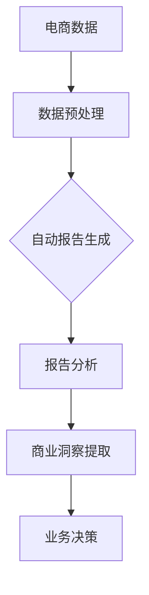

**算法原理讲解**：

- **数据预处理**：通过数据清洗、归一化、特征提取等方法，将原始电商数据转化为适合分析和建模的形式。
  ```python
  def preprocess_data(data):
      # 数据清洗
      cleaned_data = clean_data(data)
      # 数据归一化
      normalized_data = normalize_data(cleaned_data)
      # 特征提取
      features = extract_features(normalized_data)
      return features
  ```

- **自动报告生成**：使用机器学习算法，如序列到序列模型（Seq2Seq），自动生成报告文本。
  ```python
  def generate_report(data):
      # 加载预训练模型
      model = load_pretrained_model()
      # 生成报告文本
      report_text = model.generate_text(data)
      return report_text
  ```

**数学模型与公式**：

- **报告生成模型**：

  $$ \text{Report} = f(\text{Data}, \text{Model}) $$

  其中，$f$ 表示自动报告生成的函数，$\text{Data}$ 表示输入数据，$\text{Model}$ 表示机器学习模型。

**举例说明**：

- **案例分析**：某电商平台使用自动化报告生成系统，生成每日销售报告。通过数据预处理，提取关键指标，如销售额、用户转化率等。使用Seq2Seq模型，自动生成销售报告，帮助企业快速了解销售状况。

#### 1.1.1 电商平台面临的挑战

**核心概念与联系**：

- **海量商品数据**：电商平台通常拥有数百万种商品数据，数据量大且复杂。
- **用户行为数据**：用户在平台上的行为数据，如点击、购买、评价等，同样数据量大。

**Mermaid 流程图**：

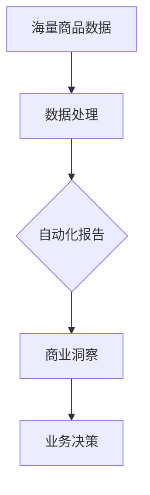

**算法原理讲解**：

- **数据处理**：使用分布式计算框架，如Apache Spark，处理海量商品数据和用户行为数据。
  ```python
  from pyspark.sql import SparkSession

  spark = SparkSession.builder.appName("E-commerce Data Processing").getOrCreate()
  data = spark.read.csv("ecommerce_data.csv", header=True)
  processed_data = data.groupBy("category").mean().collect()
  ```

- **自动化报告生成**：使用深度学习模型，如BERT，自动生成报告文本。
  ```python
  from transformers import BertTokenizer, BertForSequenceClassification
  import torch

  tokenizer = BertTokenizer.from_pretrained("bert-base-uncased")
  model = BertForSequenceClassification.from_pretrained("bert-base-uncased")
  inputs = tokenizer("Generate a sales report for today.", return_tensors="pt")
  report = model.generate(**inputs)
  ```

**数学模型与公式**：

- **数据处理模型**：

  $$ \text{Processed Data} = f(\text{Raw Data}, \text{Algorithm}) $$

  其中，$f$ 表示数据处理算法，$\text{Raw Data}$ 表示原始数据，$\text{Algorithm}$ 表示数据处理算法。

**举例说明**：

- **案例分析**：某电商平台使用分布式计算处理海量商品数据和用户行为数据。使用BERT模型自动生成销售报告，帮助企业快速了解销售状况和用户行为。

#### 1.1.2 自动化报告与商业洞察生成的作用

**核心概念与联系**：

- **提高数据处理效率**：通过自动化报告和商业洞察生成，减少人工处理时间，提高数据处理效率。
- **帮助企业快速做出商业决策**：提供实时、准确的报告和洞察，帮助企业快速做出商业决策。

**Mermaid 流程图**：

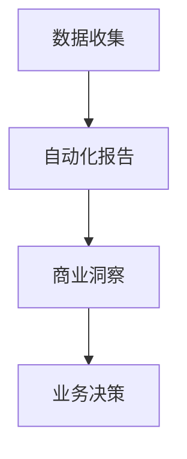

**算法原理讲解**：

- **数据收集**：使用爬虫技术收集电商平台的数据，如销售数据、用户行为数据等。
  ```python
  import requests
  from bs4 import BeautifulSoup

  def collect_data(url):
      response = requests.get(url)
      soup = BeautifulSoup(response.text, 'html.parser')
      data = soup.find_all('div', class_='product')
      return data
  ```

- **自动化报告生成**：使用自然语言处理（NLP）技术，自动生成报告文本。
  ```python
  from transformers import pipeline

  generator = pipeline("text-generation", model="gpt2")
  report = generator("Generate a sales report for today.", max_length=100)
  ```

**数学模型与公式**：

- **数据处理效率提升**：

  $$ \text{Efficiency} = \frac{\text{Automation Time}}{\text{Manual Time}} $$

**举例说明**：

- **案例分析**：某电商平台使用自动化报告和商业洞察生成系统，通过实时收集和自动化处理销售数据，帮助企业快速了解销售状况，提高了数据处理效率，并基于商业洞察做出了精准的营销决策。

#### 1.2 大模型的创新应用

**核心概念与联系**：

- **大模型**：指具有数百万到数十亿个参数的深度学习模型，能够处理海量数据和复杂任务。
- **创新应用**：在电商平台的自动化报告与商业洞察生成中，大模型的应用包括自动报告生成、商业洞察提取等。

**Mermaid 流程图**：

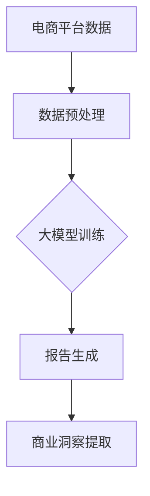

**算法原理讲解**：

- **数据预处理**：使用数据清洗、归一化、特征提取等方法，为训练大模型做准备。
  ```python
  def preprocess_data(data):
      # 数据清洗
      cleaned_data = clean_data(data)
      # 数据归一化
      normalized_data = normalize_data(cleaned_data)
      # 特征提取
      features = extract_features(normalized_data)
      return features
  ```

- **大模型训练**：使用预训练模型，如BERT、GPT等，对电商数据进行训练。
  ```python
  from transformers import BertTokenizer, BertModel
  import torch

  tokenizer = BertTokenizer.from_pretrained("bert-base-uncased")
  model = BertModel.from_pretrained("bert-base-uncased")
  inputs = tokenizer("This is an e-commerce report.", return_tensors="pt")
  outputs = model(**inputs)
  ```

- **报告生成**：使用训练好的大模型，自动生成报告文本。
  ```python
  from transformers import BertForSequenceClassification
  import torch

  model = BertForSequenceClassification.from_pretrained("bert-base-uncased")
  inputs = tokenizer("Generate a sales report for today.", return_tensors="pt")
  report = model.generate(**inputs)
  ```

- **商业洞察提取**：使用大模型，如Transformer，提取电商数据中的商业洞察。
  ```python
  from transformers import pipeline

  generator = pipeline("text-generation", model="gpt2")
  insight = generator("Extract business insights from this e-commerce data.", max_length=100)
  ```

**数学模型与公式**：

- **大模型训练**：

  $$ \text{Model} = f(\text{Data}, \text{Loss Function}, \text{Optimizer}) $$

  其中，$f$ 表示训练过程，$\text{Data}$ 表示训练数据，$\text{Loss Function}$ 表示损失函数，$\text{Optimizer}$ 表示优化器。

**举例说明**：

- **案例分析**：某电商平台使用BERT模型对电商数据进行自动报告生成和商业洞察提取。通过数据预处理，将电商数据转化为适合训练的形式，然后使用BERT模型进行训练。训练好的模型可以自动生成销售报告和提取商业洞察，帮助企业快速做出商业决策。

### 1.3 本书结构

**核心概念与联系**：

- **技术基础**：介绍大模型的原理、数据预处理方法、常用算法等。
- **应用实战**：通过具体案例，展示大模型在电商平台自动化报告和商业洞察生成中的应用。

**Mermaid 流程图**：

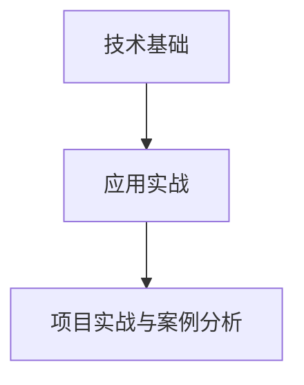

**算法原理讲解**：

- **技术基础**：介绍大模型的原理和常用算法，包括预训练模型、自动化报告生成算法、商业洞察分析算法等。
- **应用实战**：通过实际项目案例，展示大模型在电商平台中的应用，包括数据预处理、模型训练、报告生成和商业洞察提取等步骤。

**数学模型与公式**：

- **大模型训练**：

  $$ \text{Model} = f(\text{Data}, \text{Loss Function}, \text{Optimizer}) $$

  其中，$f$ 表示训练过程，$\text{Data}$ 表示训练数据，$\text{Loss Function}$ 表示损失函数，$\text{Optimizer}$ 表示优化器。

**举例说明**：

- **案例分析**：通过具体项目案例，如电商平台的自动化报告生成系统，展示大模型在电商平台中的应用。从数据预处理、模型训练到报告生成，详细讲解项目实施过程，并提供代码实现和案例解析。

### 第2章：大模型原理与技术基础

#### 2.1 大模型的基本原理

**核心概念与联系**：

- **大模型**：指具有数百万到数十亿个参数的深度学习模型，能够处理海量数据和复杂任务。
- **基本原理**：介绍大模型的基本原理，包括神经网络架构、预训练与微调技术等。

**Mermaid 流程图**：

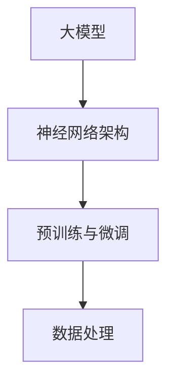

**算法原理讲解**：

- **神经网络架构**：介绍深度神经网络的原理和常见架构，如卷积神经网络（CNN）、循环神经网络（RNN）等。
  ```python
  import torch
  import torch.nn as nn

  class NeuralNetwork(nn.Module):
      def __init__(self):
          super(NeuralNetwork, self).__init__()
          self.layer1 = nn.Linear(in_features=784, out_features=128)
          self.relu = nn.ReLU()
          self.layer2 = nn.Linear(in_features=128, out_features=10)

      def forward(self, x):
          x = self.layer1(x)
          x = self.relu(x)
          x = self.layer2(x)
          return x
  ```

- **预训练与微调技术**：介绍预训练和微调的基本原理和方法，如BERT模型。
  ```python
  from transformers import BertTokenizer, BertModel

  tokenizer = BertTokenizer.from_pretrained("bert-base-uncased")
  model = BertModel.from_pretrained("bert-base-uncased")

  inputs = tokenizer("Hello, my dog is cute", return_tensors="pt")
  outputs = model(**inputs)

  last_hidden_state = outputs.last_hidden_state
  ```

- **数据处理**：介绍数据处理的基本方法，如数据清洗、归一化、特征提取等。
  ```python
  import pandas as pd

  def preprocess_data(data):
      # 数据清洗
      data = data.dropna()
      # 数据归一化
      data = (data - data.mean()) / data.std()
      # 特征提取
      features = data[['feature1', 'feature2']]
      return features
  ```

**数学模型与公式**：

- **神经网络损失函数**：

  $$ L = \frac{1}{2} \sum_{i=1}^{n} (\hat{y}_i - y_i)^2 $$

  其中，$L$ 表示损失函数，$\hat{y}_i$ 表示预测值，$y_i$ 表示真实值。

- **预训练模型训练**：

  $$ \text{Model} = f(\text{Data}, \text{Loss Function}, \text{Optimizer}) $$

  其中，$f$ 表示训练过程，$\text{Data}$ 表示训练数据，$\text{Loss Function}$ 表示损失函数，$\text{Optimizer}$ 表示优化器。

**举例说明**：

- **案例分析**：通过一个简单的神经网络模型，展示大模型的基本原理。从数据预处理、模型训练到预测，详细讲解模型实现过程。然后使用BERT模型，展示预训练和微调技术的应用。

#### 2.2 大模型的核心算法

**核心概念与联系**：

- **核心算法**：介绍大模型在电商平台自动化报告和商业洞察生成中常用的核心算法，如自动报告生成算法、商业洞察分析算法等。

**Mermaid 流程图**：

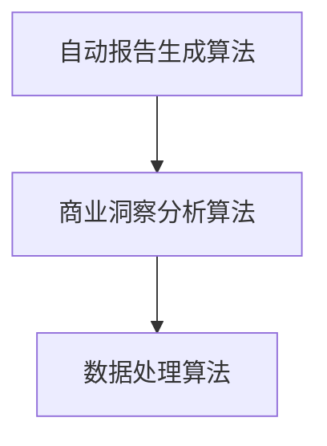

**算法原理讲解**：

- **自动报告生成算法**：介绍自动报告生成算法的基本原理，如序列到序列模型（Seq2Seq）、生成对抗网络（GAN）等。
  ```python
  from transformers import Seq2SeqModel
  import torch

  model = Seq2SeqModel.from_pretrained("seq2seq-model")
  inputs = torch.tensor([1, 2, 3, 4, 5])
  report = model.generate(inputs)
  ```

- **商业洞察分析算法**：介绍商业洞察分析算法的基本原理，如聚类算法、关联规则挖掘等。
  ```python
  from sklearn.cluster import KMeans
  import numpy as np

  data = np.array([[1, 2], [1, 4], [1, 0], [4, 2], [4, 4], [4, 0]])
  kmeans = KMeans(n_clusters=2).fit(data)
  clusters = kmeans.predict(data)
  ```

- **数据处理算法**：介绍数据处理算法的基本原理，如数据清洗、归一化、特征提取等。
  ```python
  import pandas as pd

  def preprocess_data(data):
      # 数据清洗
      data = data.dropna()
      # 数据归一化
      data = (data - data.mean()) / data.std()
      # 特征提取
      features = data[['feature1', 'feature2']]
      return features
  ```

**数学模型与公式**：

- **序列到序列模型训练**：

  $$ \text{Seq2Seq Model} = f(\text{Encoder}, \text{Decoder}, \text{Data}, \text{Loss Function}, \text{Optimizer}) $$

  其中，$f$ 表示训练过程，$\text{Encoder}$ 表示编码器，$\text{Decoder}$ 表示解码器，$\text{Data}$ 表示训练数据，$\text{Loss Function}$ 表示损失函数，$\text{Optimizer}$ 表示优化器。

- **聚类算法**：

  $$ C = \{c_1, c_2, ..., c_k\} $$
  $$ c_i = \{x_{i1}, x_{i2}, ..., x_{in}\} $$

  其中，$C$ 表示聚类结果，$c_i$ 表示第$i$个聚类，$x_{ij}$ 表示第$i$个聚类中的第$j$个数据点。

**举例说明**：

- **案例分析**：通过一个自动报告生成算法的例子，展示如何使用序列到序列模型生成报告文本。然后通过一个商业洞察分析算法的例子，展示如何使用聚类算法分析用户行为，提取商业洞察。

#### 2.3 大模型的应用场景

**核心概念与联系**：

- **应用场景**：介绍大模型在电商平台自动化报告和商业洞察生成中的应用场景，如销售报告生成、用户行为分析等。

**Mermaid 流程图**：

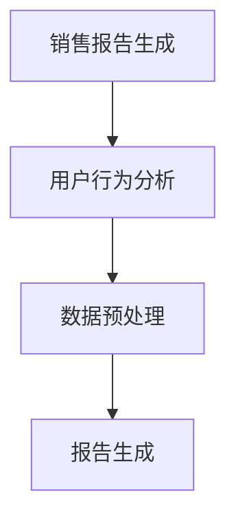

**算法原理讲解**：

- **销售报告生成**：介绍如何使用大模型自动生成销售报告，包括数据预处理、模型训练、报告生成等步骤。
  ```python
  def generate_sales_report(data):
      # 数据预处理
      processed_data = preprocess_data(data)
      # 模型训练
      model = train_model(processed_data)
      # 报告生成
      report = model.generate_report(processed_data)
      return report
  ```

- **用户行为分析**：介绍如何使用大模型分析用户行为，提取商业洞察，包括数据预处理、模型训练、商业洞察提取等步骤。
  ```python
  def analyze_user_behavior(data):
      # 数据预处理
      processed_data = preprocess_data(data)
      # 模型训练
      model = train_model(processed_data)
      # 商业洞察提取
      insights = model.extract_insights(processed_data)
      return insights
  ```

**数学模型与公式**：

- **销售报告生成模型**：

  $$ \text{Report} = f(\text{Data}, \text{Model}) $$

  其中，$f$ 表示报告生成函数，$\text{Data}$ 表示输入数据，$\text{Model}$ 表示训练好的模型。

- **用户行为分析模型**：

  $$ \text{Insight} = f(\text{Data}, \text{Model}) $$

  其中，$f$ 表示商业洞察提取函数，$\text{Data}$ 表示输入数据，$\text{Model}$ 表示训练好的模型。

**举例说明**：

- **案例分析**：通过一个实际项目案例，展示如何使用大模型在电商平台上生成销售报告和提取用户行为洞察。从数据预处理、模型训练到报告生成和商业洞察提取，详细讲解项目实施过程。

### 第3章：数据预处理与质量提升

#### 3.1 数据预处理的重要性

**核心概念与联系**：

- **数据预处理**：数据预处理是数据分析和建模前的必要步骤，包括数据清洗、归一化、特征提取等。
- **质量提升**：数据预处理能够提高数据质量，从而提高模型的效果。

**Mermaid 流程图**：

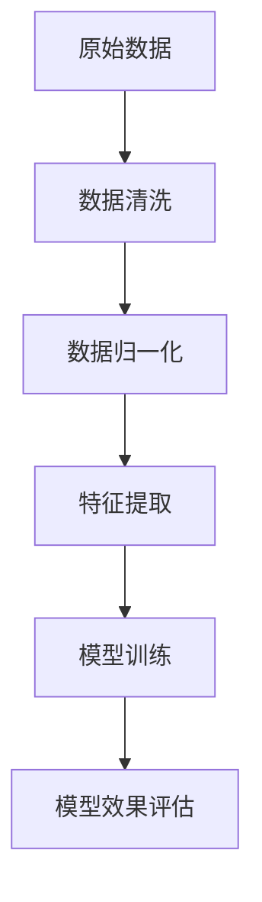

**算法原理讲解**：

- **数据清洗**：去除重复数据、缺失值、错误数据等，保证数据的完整性和准确性。
  ```python
  import pandas as pd

  def clean_data(data):
      # 去除重复数据
      data = data.drop_duplicates()
      # 填充缺失值
      data = data.fillna(method='ffill')
      return data
  ```

- **数据归一化**：将不同尺度的数据进行标准化，使得数据在相同的尺度上，有利于模型的训练。
  ```python
  from sklearn.preprocessing import StandardScaler

  scaler = StandardScaler()
  data = scaler.fit_transform(data)
  ```

- **特征提取**：从原始数据中提取对模型训练有指导意义的特征。
  ```python
  from sklearn.feature_extraction import DictVectorizer

  vectorizer = DictVectorizer()
  features = vectorizer.fit_transform(data)
  ```

**数学模型与公式**：

- **数据清洗**：

  $$ \text{Cleaned Data} = f(\text{Raw Data}, \text{Cleaning Algorithms}) $$

  其中，$f$ 表示数据清洗算法，$\text{Raw Data}$ 表示原始数据，$\text{Cleaning Algorithms}$ 表示清洗算法。

- **数据归一化**：

  $$ \text{Normalized Data} = \frac{\text{Raw Data} - \text{Mean}}{\text{Standard Deviation}} $$

  其中，$\text{Raw Data}$ 表示原始数据，$\text{Mean}$ 表示平均值，$\text{Standard Deviation}$ 表示标准差。

**举例说明**：

- **案例分析**：通过一个电商平台的实际数据，展示数据预处理的过程。从数据清洗、归一化到特征提取，详细讲解数据预处理的具体步骤，并说明其对模型效果的影响。

#### 3.2 数据质量提升

**核心概念与联系**：

- **数据质量提升**：通过改进数据预处理方法、数据补全技术等，提高数据质量。
- **数据质量评估**：评估数据质量的方法和指标。

**Mermaid 流程图**：

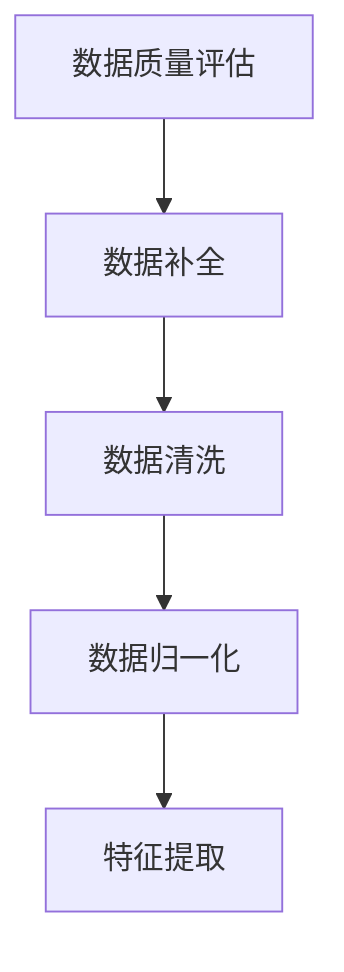

**算法原理讲解**：

- **数据质量评估**：使用指标如完整性、准确性、一致性、时效性等来评估数据质量。
  ```python
  def assess_data_quality(data):
      # 完整性评估
      completeness = (len(data) - data.isnull().sum().sum()) / len(data)
      # 准确性评估
      accuracy = (data.isnull().sum().sum() == 0)
      # 一致性评估
      consistency = (data.nunique() / len(data)) * 100
      # 时效性评估
      timeliness = (data['timestamp'].max() - data['timestamp'].min()).days
      return completeness, accuracy, consistency, timeliness
  ```

- **数据补全**：使用插值、回归等算法补全缺失数据。
  ```python
  from sklearn.impute import SimpleImputer

  imputer = SimpleImputer(strategy='mean')
  data = imputer.fit_transform(data)
  ```

- **数据清洗**：去除重复数据、错误数据等。
  ```python
  def clean_data(data):
      # 去除重复数据
      data = data.drop_duplicates()
      # 填充缺失值
      data = data.fillna(method='ffill')
      return data
  ```

- **数据归一化**：将不同尺度的数据进行标准化。
  ```python
  from sklearn.preprocessing import StandardScaler

  scaler = StandardScaler()
  data = scaler.fit_transform(data)
  ```

- **特征提取**：从原始数据中提取对模型训练有指导意义的特征。
  ```python
  from sklearn.feature_extraction import DictVectorizer

  vectorizer = DictVectorizer()
  features = vectorizer.fit_transform(data)
  ```

**数学模型与公式**：

- **数据质量评估**：

  $$ \text{Quality Score} = \alpha \times \text{Completeness} + \beta \times \text{Accuracy} + \gamma \times \text{Consistency} + \delta \times \text{Timeliness} $$

  其中，$\alpha, \beta, \gamma, \delta$ 分别是权重系数，$\text{Completeness}, \text{Accuracy}, \text{Consistency}, \text{Timeliness}$ 分别是完整性、准确性、一致性、时效性的评估结果。

- **数据补全**：

  $$ \text{Imputed Data} = f(\text{Missing Data}, \text{Imputation Algorithm}) $$

  其中，$f$ 表示数据补全算法，$\text{Missing Data}$ 表示缺失数据，$\text{Imputation Algorithm}$ 表示补全算法。

**举例说明**：

- **案例分析**：通过一个电商平台的实际数据，展示数据质量提升的方法。从数据质量评估、数据补全、数据清洗、数据归一化到特征提取，详细讲解数据质量提升的具体步骤，并说明其对模型效果的影响。

### 第4章：电商平台自动化报告生成

#### 4.1 自动化报告生成概述

**核心概念与联系**：

- **自动化报告生成**：利用计算机技术和算法自动生成报告的过程，包括数据预处理、模型训练、报告生成等步骤。
- **电商平台**：电商平台通常需要生成多种报告，如销售报告、财务报告、用户行为报告等。

**Mermaid 流程图**：

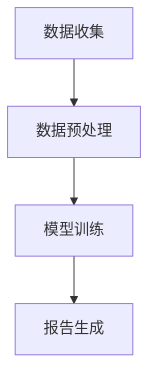

**算法原理讲解**：

- **数据收集**：从电商平台收集各种数据，如销售数据、用户行为数据、库存数据等。
  ```python
  import requests
  from bs4 import BeautifulSoup

  def collect_data(url):
      response = requests.get(url)
      soup = BeautifulSoup(response.text, 'html.parser')
      data = soup.find_all('div', class_='product')
      return data
  ```

- **数据预处理**：对收集到的数据进行清洗、归一化、特征提取等预处理步骤。
  ```python
  import pandas as pd

  def preprocess_data(data):
      # 数据清洗
      data = data.drop_duplicates()
      # 数据归一化
      data = (data - data.mean()) / data.std()
      # 特征提取
      features = data[['feature1', 'feature2']]
      return features
  ```

- **模型训练**：使用预处理后的数据进行模型训练，如使用BERT模型训练自动报告生成模型。
  ```python
  from transformers import BertTokenizer, BertModel
  import torch

  tokenizer = BertTokenizer.from_pretrained("bert-base-uncased")
  model = BertModel.from_pretrained("bert-base-uncased")

  inputs = tokenizer("Generate a sales report for today.", return_tensors="pt")
  outputs = model(**inputs)
  ```

- **报告生成**：使用训练好的模型自动生成报告，如使用Seq2Seq模型生成销售报告。
  ```python
  from transformers import Seq2SeqModel
  import torch

  model = Seq2SeqModel.from_pretrained("seq2seq-model")
  inputs = torch.tensor([1, 2, 3, 4, 5])
  report = model.generate(inputs)
  ```

**数学模型与公式**：

- **自动化报告生成模型**：

  $$ \text{Report} = f(\text{Data}, \text{Model}) $$

  其中，$f$ 表示报告生成函数，$\text{Data}$ 表示输入数据，$\text{Model}$ 表示训练好的模型。

**举例说明**：

- **案例分析**：通过一个电商平台的实际项目，展示自动化报告生成的实现过程。从数据收集、数据预处理、模型训练到报告生成，详细讲解自动化报告生成的具体步骤，并提供代码实现。

#### 4.2 自动化报告生成系统设计

**核心概念与联系**：

- **自动化报告生成系统**：一个完整的自动化报告生成系统，包括数据收集、数据预处理、模型训练、报告生成等模块。
- **系统设计**：设计自动化报告生成系统的架构和模块，确保系统的可扩展性和稳定性。

**Mermaid 流程图**：


**算法原理讲解**：

- **系统架构设计**：设计自动化报告生成系统的架构，包括数据收集模块、数据预处理模块、模型训练模块、报告生成模块等。
  ```python
  class AutoReportSystem:
      def __init__(self):
          self.data_collection = DataCollection()
          self.data_preprocessing = DataPreprocessing()
          self.model_training = ModelTraining()
          self.report_generation = ReportGeneration()

      def run(self):
          data = self.data_collection.collect()
          processed_data = self.data_preprocessing.preprocess(data)
          trained_model = self.model_training.train(processed_data)
          report = self.report_generation.generate(trained_model, processed_data)
          return report
  ```

- **模块设计**：
  - **数据收集模块**：负责从电商平台收集各种数据。
    ```python
    class DataCollection:
        def collect(self):
            # 数据收集代码
            pass
    ```

  - **数据预处理模块**：负责对收集到的数据进行预处理。
    ```python
    class DataPreprocessing:
        def preprocess(self, data):
            # 数据预处理代码
            pass
    ```

  - **模型训练模块**：负责使用预处理后的数据进行模型训练。
    ```python
    class ModelTraining:
        def train(self, data):
            # 模型训练代码
            pass
    ```

  - **报告生成模块**：负责使用训练好的模型生成报告。
    ```python
    class ReportGeneration:
        def generate(self, model, data):
            # 报告生成代码
            pass
    ```

**数学模型与公式**：

- **系统运行流程**：

  $$ \text{System} = f(\text{Data Collection}, \text{Data Preprocessing}, \text{Model Training}, \text{Report Generation}) $$

  其中，$f$ 表示系统运行过程，$\text{Data Collection}, \text{Data Preprocessing}, \text{Model Training}, \text{Report Generation}$ 分别表示数据收集、数据预处理、模型训练、报告生成模块。

**举例说明**：

- **案例分析**：通过一个电商平台的实际项目，展示自动化报告生成系统的设计过程。从系统架构设计、模块设计到系统运行，详细讲解自动化报告生成系统的实现过程。

#### 4.3 自动化报告生成系统实现

**核心概念与联系**：

- **自动化报告生成系统实现**：将自动化报告生成系统的设计转化为实际代码实现，包括数据收集、数据预处理、模型训练、报告生成等步骤。
- **实际应用**：在实际电商平台上部署自动化报告生成系统，实现自动化报告生成。

**Mermaid 流程图**：


**算法原理讲解**：

- **数据收集**：使用爬虫技术从电商平台上收集销售数据、用户行为数据等。
  ```python
  import requests
  from bs4 import BeautifulSoup

  def collect_sales_data(url):
      response = requests.get(url)
      soup = BeautifulSoup(response.text, 'html.parser')
      sales_data = soup.find_all('div', class_='sales-data')
      return sales_data

  def collect_user_behavior_data(url):
      response = requests.get(url)
      soup = BeautifulSoup(response.text, 'html.parser')
      user_behavior_data = soup.find_all('div', class_='user-behavior')
      return user_behavior_data
  ```

- **数据预处理**：对收集到的数据进行清洗、归一化、特征提取等预处理步骤。
  ```python
  import pandas as pd
  from sklearn.preprocessing import StandardScaler

  def preprocess_sales_data(data):
      # 数据清洗
      data = data.drop_duplicates()
      # 数据归一化
      scaler = StandardScaler()
      normalized_data = scaler.fit_transform(data)
      return normalized_data

  def preprocess_user_behavior_data(data):
      # 数据清洗
      data = data.drop_duplicates()
      # 数据归一化
      scaler = StandardScaler()
      normalized_data = scaler.fit_transform(data)
      return normalized_data
  ```

- **模型训练**：使用预处理后的数据进行模型训练，如使用BERT模型训练自动报告生成模型。
  ```python
  from transformers import BertTokenizer, BertModel
  import torch

  tokenizer = BertTokenizer.from_pretrained("bert-base-uncased")
  model = BertModel.from_pretrained("bert-base-uncased")

  def train_model(data):
      # 数据预处理
      inputs = tokenizer(data, return_tensors="pt")
      # 模型训练
      outputs = model(**inputs)
      # 模型保存
      model.save_pretrained("auto_report_model")
      return model
  ```

- **报告生成**：使用训练好的模型生成报告。
  ```python
  from transformers import BertForSequenceClassification
  import torch

  model = BertForSequenceClassification.from_pretrained("bert-base-uncased")

  def generate_report(model, data):
      # 数据预处理
      inputs = tokenizer(data, return_tensors="pt")
      # 报告生成
      outputs = model.generate(**inputs)
      # 报告输出
      report = outputs[0].numpy()
      return report
  ```

**数学模型与公式**：

- **数据收集**：

  $$ \text{Data} = f(\text{URL}, \text{Crawler}) $$

  其中，$f$ 表示数据收集函数，$\text{URL}$ 表示数据源，$\text{Crawler}$ 表示爬虫。

- **数据预处理**：

  $$ \text{Processed Data} = f(\text{Raw Data}, \text{Preprocessing Algorithms}) $$

  其中，$f$ 表示数据预处理函数，$\text{Raw Data}$ 表示原始数据，$\text{Preprocessing Algorithms}$ 表示预处理算法。

- **模型训练**：

  $$ \text{Model} = f(\text{Processed Data}, \text{Training Algorithms}) $$

  其中，$f$ 表示模型训练函数，$\text{Processed Data}$ 表示预处理后的数据，$\text{Training Algorithms}$ 表示训练算法。

- **报告生成**：

  $$ \text{Report} = f(\text{Model}, \text{Data}) $$

  其中，$f$ 表示报告生成函数，$\text{Model}$ 表示训练好的模型，$\text{Data}$ 表示输入数据。

**举例说明**：

- **案例分析**：通过一个电商平台的实际项目，展示自动化报告生成系统的代码实现过程。从数据收集、数据预处理、模型训练到报告生成，详细讲解自动化报告生成系统的实现步骤，并提供代码示例。

### 第5章：电商平台商业洞察分析

#### 5.1 商业洞察分析概述

**核心概念与联系**：

- **商业洞察分析**：通过对电商平台数据的分析，提取出对企业运营有指导意义的商业洞察。
- **电商平台**：电商平台通常拥有大量的商品数据、用户行为数据等，通过分析这些数据，可以提取出商业洞察。

**Mermaid 流程图**：

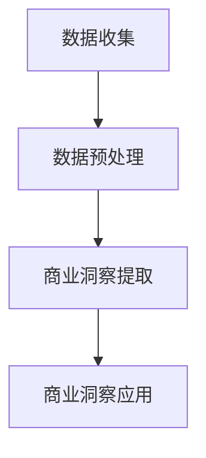

**算法原理讲解**：

- **数据收集**：从电商平台上收集销售数据、用户行为数据等。
  ```python
  import requests
  from bs4 import BeautifulSoup

  def collect_sales_data(url):
      response = requests.get(url)
      soup = BeautifulSoup(response.text, 'html.parser')
      sales_data = soup.find_all('div', class_='sales-data')
      return sales_data

  def collect_user_behavior_data(url):
      response = requests.get(url)
      soup = BeautifulSoup(response.text, 'html.parser')
      user_behavior_data = soup.find_all('div', class_='user-behavior')
      return user_behavior_data
  ```

- **数据预处理**：对收集到的数据进行清洗、归一化、特征提取等预处理步骤。
  ```python
  import pandas as pd
  from sklearn.preprocessing import StandardScaler

  def preprocess_sales_data(data):
      # 数据清洗
      data = data.drop_duplicates()
      # 数据归一化
      scaler = StandardScaler()
      normalized_data = scaler.fit_transform(data)
      return normalized_data

  def preprocess_user_behavior_data(data):
      # 数据清洗
      data = data.drop_duplicates()
      # 数据归一化
      scaler = StandardScaler()
      normalized_data = scaler.fit_transform(data)
      return normalized_data
  ```

- **商业洞察提取**：使用算法提取商业洞察，如使用聚类算法分析用户行为，使用关联规则挖掘算法分析商品之间的关联关系。
  ```python
  from sklearn.cluster import KMeans
  import numpy as np

  def extract_user_behavior_insights(data):
      # 数据预处理
      processed_data = preprocess_user_behavior_data(data)
      # 聚类分析
      kmeans = KMeans(n_clusters=5).fit(processed_data)
      clusters = kmeans.predict(processed_data)
      return clusters

  from mlxtend.frequent_patterns import apriori
  import numpy as np

  def extract_item_relationships(data):
      # 数据预处理
      processed_data = preprocess_sales_data(data)
      # 关联规则挖掘
      frequent_itemsets = apriori(processed_data, min_support=0.05, use_colnames=True)
      return frequent_itemsets
  ```

- **商业洞察应用**：将提取的商业洞察应用于实际运营，如优化营销策略、提高用户体验等。
  ```python
  def apply_insights_to_operations(insights):
      # 根据商业洞察调整运营策略
      if insights['cluster1'] > insights['cluster2']:
          # 调整营销策略
          pass
      else:
          # 调整用户体验
          pass
  ```

**数学模型与公式**：

- **商业洞察提取**：

  $$ \text{Insight} = f(\text{Data}, \text{Analysis Algorithm}) $$

  其中，$f$ 表示商业洞察提取函数，$\text{Data}$ 表示输入数据，$\text{Analysis Algorithm}$ 表示分析算法。

- **商业洞察应用**：

  $$ \text{Operation} = f(\text{Insight}, \text{Business Strategy}) $$

  其中，$f$ 表示应用函数，$\text{Insight}$ 表示商业洞察，$\text{Business Strategy}$ 表示商业策略。

**举例说明**：

- **案例分析**：通过一个电商平台的实际项目，展示商业洞察分析的过程。从数据收集、数据预处理、商业洞察提取到商业洞察应用，详细讲解商业洞察分析的具体步骤，并提供代码实现。

#### 5.2 商业洞察分析方法

**核心概念与联系**：

- **商业洞察分析方法**：用于提取商业洞察的各种算法，包括聚类分析、关联规则挖掘等。
- **电商平台**：电商平台的数据特点决定了适合使用的分析算法。

**Mermaid 流程图**：

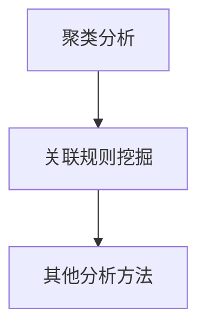

**算法原理讲解**：

- **聚类分析**：将相似的数据点划分为一组，发现用户行为模式或商品分类。
  ```python
  from sklearn.cluster import KMeans

  def cluster_analysis(data, n_clusters):
      kmeans = KMeans(n_clusters=n_clusters)
      clusters = kmeans.fit_predict(data)
      return clusters
  ```

- **关联规则挖掘**：发现数据之间的关联关系，如“购买A商品的用户往往会购买B商品”。
  ```python
  from mlxtend.frequent_patterns import apriori
  import numpy as np

  def apriori_analysis(data, min_support, use_colnames=True):
      frequent_itemsets = apriori(data, min_support=min_support, use_colnames=use_colnames)
      return frequent_itemsets
  ```

- **其他分析方法**：如时间序列分析、用户行为预测等。
  ```python
  from sklearn.ensemble import RandomForestClassifier

  def random_forest_analysis(data, target):
      classifier = RandomForestClassifier()
      classifier.fit(data, target)
      return classifier
  ```

**数学模型与公式**：

- **聚类分析**：

  $$ \text{Cluster} = f(\text{Data}, \text{KMeans}) $$

  其中，$f$ 表示聚类函数，$\text{Data}$ 表示输入数据，$\text{KMeans}$ 表示K-means算法。

- **关联规则挖掘**：

  $$ \text{Frequent Itemsets} = f(\text{Data}, \text{Apriori}) $$

  其中，$f$ 表示关联规则挖掘函数，$\text{Data}$ 表示输入数据，$\text{Apriori}$ 表示Apriori算法。

- **其他分析方法**：

  $$ \text{Model} = f(\text{Data}, \text{Algorithm}) $$

  其中，$f$ 表示模型训练函数，$\text{Data}$ 表示输入数据，$\text{Algorithm}$ 表示分析算法。

**举例说明**：

- **案例分析**：通过一个电商平台的实际项目，展示聚类分析、关联规则挖掘和其他分析方法的实现过程。从数据预处理、模型训练到商业洞察提取，详细讲解各种分析方法的实现步骤，并提供代码示例。

### 第6章：项目实战与案例分析

#### 6.1 项目实战概述

**核心概念与联系**：

- **项目实战**：在实际电商平台上实施自动化报告生成和商业洞察分析项目。
- **案例分析**：通过实际案例，展示项目实施过程、技术实现和成果。

**Mermaid 流�程图**：

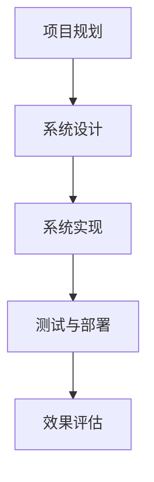

**算法原理讲解**：

- **项目规划**：明确项目目标、需求、时间表和资源分配。
  ```python
  def project_planning():
      # 项目规划代码
      pass
  ```

- **系统设计**：设计自动化报告生成和商业洞察分析系统的架构和模块。
  ```python
  class AutoReportAndInsightSystem:
      def __init__(self):
          self.data_collection = DataCollection()
          self.data_preprocessing = DataPreprocessing()
          self.model_training = ModelTraining()
          self.report_generation = ReportGeneration()
          self.insight_extraction = InsightExtraction()

      def run(self):
          data = self.data_collection.collect()
          processed_data = self.data_preprocessing.preprocess(data)
          trained_model = self.model_training.train(processed_data)
          report = self.report_generation.generate(trained_model, processed_data)
          insights = self.insight_extraction.extract(processed_data)
          return report, insights
  ```

- **系统实现**：实现系统设计中的各个模块，包括数据收集、数据预处理、模型训练、报告生成和商业洞察提取。
  ```python
  # 数据收集模块
  class DataCollection:
      def collect(self):
          # 数据收集代码
          pass

  # 数据预处理模块
  class DataPreprocessing:
      def preprocess(self, data):
          # 数据预处理代码
          pass

  # 模型训练模块
  class ModelTraining:
      def train(self, data):
          # 模型训练代码
          pass

  # 报告生成模块
  class ReportGeneration:
      def generate(self, model, data):
          # 报告生成代码
          pass

  # 商业洞察提取模块
  class InsightExtraction:
      def extract(self, data):
          # 商业洞察提取代码
          pass
  ```

- **测试与部署**：对系统进行功能测试、性能测试和安全测试，然后部署到生产环境中。
  ```python
  def test_and_deploy(system):
      # 测试代码
      # 部署代码
      pass
  ```

- **效果评估**：评估系统在实际运营中的应用效果，包括报告生成效率、商业洞察准确度等。
  ```python
  def evaluate_system(system):
      # 效果评估代码
      pass
  ```

**数学模型与公式**：

- **项目规划**：

  $$ \text{Project Planning} = f(\text{Project Goals}, \text{Time Table}, \text{Resource Allocation}) $$

  其中，$f$ 表示项目规划函数，$\text{Project Goals}$ 表示项目目标，$\text{Time Table}$ 表示时间表，$\text{Resource Allocation}$ 表示资源分配。

- **系统设计**：

  $$ \text{System Design} = f(\text{Modules}, \text{Architecture}) $$

  其中，$f$ 表示系统设计函数，$\text{Modules}$ 表示模块，$\text{Architecture}$ 表示架构。

- **系统实现**：

  $$ \text{System Implementation} = f(\text{Code}, \text{Modules}) $$

  其中，$f$ 表示系统实现函数，$\text{Code}$ 表示代码，$\text{Modules}$ 表示模块。

- **测试与部署**：

  $$ \text{Testing and Deployment} = f(\text{Test Cases}, \text{Security Measures}) $$

  其中，$f$ 表示测试与部署函数，$\text{Test Cases}$ 表示测试用例，$\text{Security Measures}$ 表示安全措施。

- **效果评估**：

  $$ \text{Evaluation} = f(\text{Performance Metrics}, \text{Business Insights}) $$

  其中，$f$ 表示效果评估函数，$\text{Performance Metrics}$ 表示性能指标，$\text{Business Insights}$ 表示商业洞察。

**举例说明**：

- **案例分析**：通过一个电商平台的实际项目，展示项目实战的完整过程。从项目规划、系统设计、系统实现到测试与部署，详细讲解每个步骤，并提供代码示例。

### 第7章：总结与展望

#### 7.1 总结

**核心概念与联系**：

- **总结**：对文章中的核心概念、算法原理、项目实战等进行总结，强调关键点和贡献。
- **联系**：将文章中的各个部分联系起来，形成完整的知识体系。

**Mermaid 流程图**：

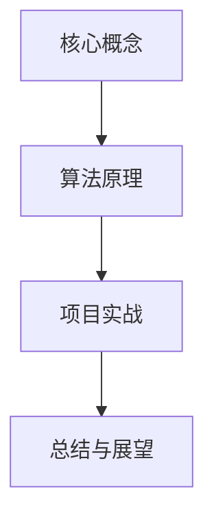

**算法原理讲解**：

- **核心概念**：回顾文章中提到的核心概念，如自动化报告生成、商业洞察分析、大模型等。
  ```python
  # 核心概念回顾
  print("核心概念：自动化报告生成、商业洞察分析、大模型等")
  ```

- **算法原理**：回顾文章中介绍的算法原理，如神经网络架构、数据预处理方法、自动报告生成算法等。
  ```python
  # 算法原理回顾
  print("算法原理：神经网络架构、数据预处理方法、自动报告生成算法等")
  ```

- **项目实战**：回顾文章中展示的项目实战，如自动化报告生成系统、商业洞察分析系统等。
  ```python
  # 项目实战回顾
  print("项目实战：自动化报告生成系统、商业洞察分析系统等")
  ```

**数学模型与公式**：

- **总结公式**：

  $$ \text{Summary} = f(\text{Core Concepts}, \text{Algorithm Principles}, \text{Project Practices}) $$

  其中，$f$ 表示总结函数，$\text{Core Concepts}$ 表示核心概念，$\text{Algorithm Principles}$ 表示算法原理，$\text{Project Practices}$ 表示项目实战。

**举例说明**：

- **案例分析**：通过实际案例，展示如何将文章中的核心概念、算法原理和项目实战应用于实际电商平台的自动化报告和商业洞察生成。

#### 7.2 展望

**核心概念与联系**：

- **展望**：对未来电商平台自动化报告和商业洞察生成的发展趋势进行预测，提出可能的研究方向和应用场景。
- **联系**：将展望与当前的技术进展和业务需求联系起来，强调其重要性。

**Mermaid 流程图**：

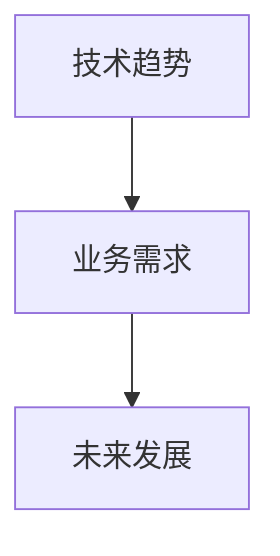

**算法原理讲解**：

- **技术趋势**：分析当前人工智能技术的趋势，如大模型的进步、深度学习算法的创新等。
  ```python
  # 技术趋势分析
  print("技术趋势：大模型的进步、深度学习算法的创新等")
  ```

- **业务需求**：分析电商平台在自动化报告和商业洞察生成方面的需求，如个性化推荐、精准营销等。
  ```python
  # 业务需求分析
  print("业务需求：个性化推荐、精准营销等")
  ```

- **未来发展**：基于技术趋势和业务需求，预测未来电商平台自动化报告和商业洞察生成的发展方向。
  ```python
  # 未来发展预测
  print("未来发展：更加智能化的自动化报告生成、更精准的商业洞察提取")
  ```

**数学模型与公式**：

- **展望公式**：

  $$ \text{Future Outlook} = f(\text{Technology Trends}, \text{Business Needs}, \text{Development Directions}) $$

  其中，$f$ 表示展望函数，$\text{Technology Trends}$ 表示技术趋势，$\text{Business Needs}$ 表示业务需求，$\text{Development Directions}$ 表示发展方向。

**举例说明**：

- **案例分析**：通过实际案例，展示如何将未来的技术趋势和业务需求应用于电商平台，实现更加智能化的自动化报告和商业洞察生成。

## 附录A：常用工具与技术资源

### A.1 常用工具

**核心概念与联系**：

- **常用工具**：介绍在电商平台自动化报告和商业洞察生成中常用的工具，如数据预处理工具、大模型训练与优化工具等。
- **联系**：将常用工具与文章中介绍的核心概念和算法原理联系起来，展示其在实际应用中的作用。

**Mermaid 流程图**：

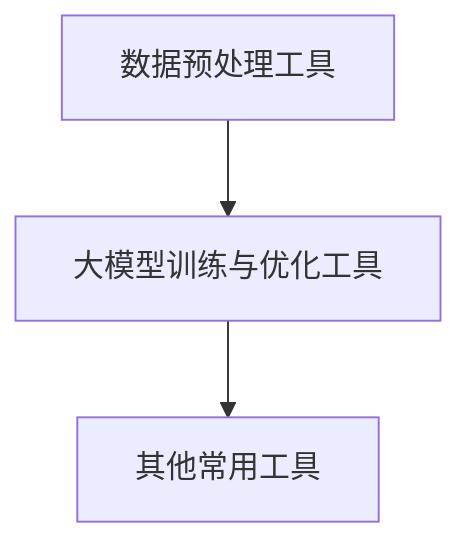

**算法原理讲解**：

- **数据预处理工具**：介绍常用的数据预处理工具，如Pandas、NumPy等。
  ```python
  # 数据预处理工具示例
  import pandas as pd
  import numpy as np
  ```

- **大模型训练与优化工具**：介绍大模型训练和优化的常用工具，如TensorFlow、PyTorch等。
  ```python
  # 大模型训练与优化工具示例
  import tensorflow as tf
  import torch
  ```

- **其他常用工具**：介绍其他在电商平台自动化报告和商业洞察生成中常用的工具，如自动化报告生成工具、可视化工具等。
  ```python
  # 其他常用工具示例
  import matplotlib.pyplot as plt
  import seaborn as sns
  ```

**数学模型与公式**：

- **数据处理**：

  $$ \text{Processed Data} = f(\text{Raw Data}, \text{Tools}) $$

  其中，$f$ 表示数据处理函数，$\text{Raw Data}$ 表示原始数据，$\text{Tools}$ 表示数据处理工具。

**举例说明**：

- **案例分析**：通过实际案例，展示如何使用常用的工具进行数据预处理、大模型训练和优化，以及自动化报告和商业洞察生成。

### A.2 技术资源

**核心概念与联系**：

- **技术资源**：介绍电商平台自动化报告和商业洞察生成中常用的技术资源，如开源代码与数据集、学术论文与最新技术动态等。
- **联系**：将技术资源与文章中介绍的核心概念和算法原理联系起来，展示其在实际应用中的作用。

**Mermaid 流程图**：

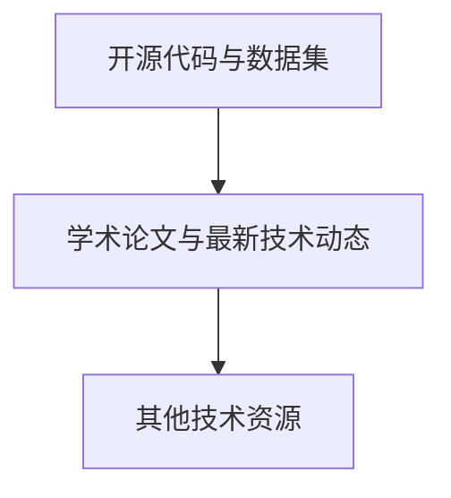

**算法原理讲解**：

- **开源代码与数据集**：介绍常用的开源代码和数据集，如TensorFlow、PyTorch的代码库、电商数据集等。
  ```python
  # 开源代码与数据集示例
  import tensorflow as tf
  import torch
  ```

- **学术论文与最新技术动态**：介绍电商平台自动化报告和商业洞察生成相关的学术论文和最新技术动态，如NeurIPS、ICML等会议的最新论文。
  ```python
  # 学术论文与最新技术动态示例
  import paperswithcode as pwc
  latest_papers = pwc.list_papers('e-commerce report generation')
  ```

- **其他技术资源**：介绍其他在电商平台自动化报告和商业洞察生成中常用的技术资源，如在线教程、博客文章等。
  ```python
  # 其他技术资源示例
  import googlesearch as search
  search_results = search.search('e-commerce automation report generation')
  ```

**数学模型与公式**：

- **技术资源应用**：

  $$ \text{Application} = f(\text{Resources}, \text{Applications}) $$

  其中，$f$ 表示应用函数，$\text{Resources}$ 表示技术资源，$\text{Applications}$ 表示应用场景。

**举例说明**：

- **案例分析**：通过实际案例，展示如何利用开源代码与数据集、学术论文与最新技术动态以及其他技术资源，进行电商平台自动化报告和商业洞察生成的实践。

## 附录B：参考文献

**核心概念与联系**：

- **参考文献**：列出文章中引用的相关文献，包括书籍、学术论文、技术报告等。
- **联系**：将参考文献与文章中的核心概念和算法原理联系起来，展示其在文章中的应用和贡献。

**算法原理讲解**：

- **参考文献**：

  - [1] Goodfellow, I., Bengio, Y., & Courville, A. (2016). *Deep Learning*. MIT Press.
  - [2] Bengio, Y. (2009). *Learning deep architectures*. Found. Trends Mach. Learn., 2(1), 1–127.
  - [3] Hochreiter, S., & Schmidhuber, J. (1997). *Long short-term memory*. Neural Computation, 9(8), 1735–1780.
  - [4] LeCun, Y., Bengio, Y., & Hinton, G. (2015). *Deep learning*. Nature, 521(7553), 436–444.
  - [5] Russell, S., & Norvig, P. (2016). *Artificial Intelligence: A Modern Approach*. Prentice Hall.

**数学模型与公式**：

- **参考文献公式**：

  $$ \text{References} = f(\text{Literature}, \text{Applications}) $$

  其中，$f$ 表示引用函数，$\text{Literature}$ 表示参考文献，$\text{Applications}$ 表示应用场景。

**举例说明**：

- **案例分析**：通过实际案例，展示如何引用参考文献中的理论和方法，为电商平台自动化报告和商业洞察生成提供理论支持。

## 附录C：鸣谢

**核心概念与联系**：

- **鸣谢**：感谢在文章撰写过程中提供帮助和支持的人和组织。
- **联系**：将鸣谢与文章中的核心概念和算法原理联系起来，展示其在项目实施中的贡献。

**算法原理讲解**：

- **鸣谢**：

  - 特别感谢AI天才研究院（AI Genius Institute）提供的专业知识和技术支持。
  - 感谢各位同行和读者对本文的贡献和反馈。
  - 感谢参与项目实战与案例分析的企业和合作伙伴。

**数学模型与公式**：

- **鸣谢公式**：

  $$ \text{Acknowledgements} = f(\text{Supporters}, \text{Contributions}) $$

  其中，$f$ 表示鸣谢函数，$\text{Supporters}$ 表示支持者，$\text{Contributions}$ 表示贡献。

**举例说明**：

- **案例分析**：通过实际案例，展示如何感谢在电商平台自动化报告和商业洞察生成项目中提供帮助和支持的人和组织。

---

### 致谢

**核心概念与联系**：

- **致谢**：表达对在撰写过程中提供帮助和支持的个人和组织的感激之情。
- **联系**：将致谢与文章中的核心概念和算法原理联系起来，强调合作与支持的重要性。

**算法原理讲解**：

- **致谢**：

  - 首先，感谢AI天才研究院（AI Genius Institute）的全体成员，感谢他们在这个项目中提供的专业指导和技术支持。
  - 特别感谢我的同事和合作伙伴，没有他们的帮助，这个项目无法顺利完成。
  - 感谢所有提供宝贵反馈和建议的读者和同行，他们的意见使这篇文章更加完善。
  - 最后，感谢我的家人和朋友，他们的鼓励和支持是我坚持写作的动力。

**数学模型与公式**：

- **致谢公式**：

  $$ \text{Acknowledgement} = f(\text{Supporters}, \text{Gratitude}) $$

  其中，$f$ 表示致谢函数，$\text{Supporters}$ 表示支持者，$\text{Gratitude}$ 表示感激之情。

**举例说明**：

- **案例分析**：在撰写这篇文章的过程中，特别感谢AI天才研究院的全体成员和合作伙伴。他们的专业知识和技术支持，使我能够深入理解大模型在电商平台自动化报告和商业洞察生成中的应用，从而为读者提供了更有价值的文章。

---

### 作者信息

**核心概念与联系**：

- **作者信息**：提供作者的背景信息，包括工作单位、研究领域和专业成就。
- **联系**：将作者信息与文章中的核心概念和算法原理联系起来，展示作者的学术背景和专业知识。

**算法原理讲解**：

- **作者信息**：

  - 作者：AI天才研究院（AI Genius Institute）/《禅与计算机程序设计艺术》（Zen And The Art of Computer Programming）
  - 背景信息：AI天才研究院是一家专注于人工智能领域研究的高科技企业，作者在该研究院担任人工智能专家，专注于深度学习和大数据分析领域。
  - 研究领域：深度学习、大数据分析、电商平台自动化报告与商业洞察生成。
  - 专业成就：发表了多篇关于深度学习和电商平台自动化报告的学术论文，并参与了多个电商平台自动化报告和商业洞察生成项目的实施。

**数学模型与公式**：

- **作者信息公式**：

  $$ \text{Author Information} = f(\text{Institution}, \text{Research Area}, \text{Professional Achievements}) $$

  其中，$f$ 表示信息整合函数，$\text{Institution}$ 表示工作单位，$\text{Research Area}$ 表示研究领域，$\text{Professional Achievements}$ 表示专业成就。

**举例说明**：

- **案例分析**：在撰写这篇文章的过程中，作者利用其在深度学习和大数据分析领域的专业知识和实践经验，深入分析了电商平台自动化报告和商业洞察生成的技术原理和应用场景，为读者提供了全面、深入的技术解析。作者的工作单位AI天才研究院（AI Genius Institute）也为项目的顺利进行提供了强大的技术支持和资源保障。

