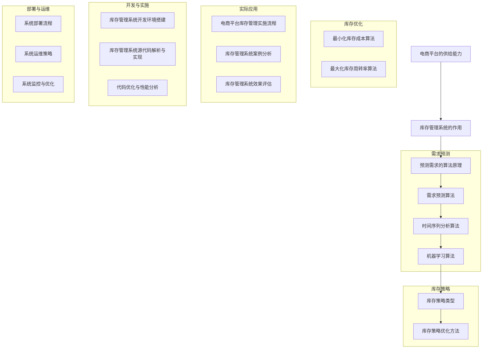

                 

# 《电商平台供给能力提升：库存管理系统的应用》

## 关键词
电商平台，供给能力，库存管理系统，需求预测，库存策略，人工智能，大数据分析，算法模型

## 摘要
本文深入探讨了电商平台供给能力提升的核心问题——库存管理系统的应用。首先，我们从电商平台的定义、发展历程和供给能力的核心地位出发，明确了供给能力在电商平台运营中的重要性。随后，我们详细介绍了库存管理系统的定义、作用和架构设计，以及其关键模块。接着，文章重点阐述了预测需求的算法原理和库存策略的制定与优化，包括最小化库存成本的算法和最大库存周转率的算法。通过实际应用和案例分析，我们展示了库存管理系统在电商平台中的具体实施效果。最后，文章讨论了库存管理系统的未来发展趋势，包括人工智能和大数据分析的应用，以及库存管理系统的开发与实施、部署与运维。

# 《电商平台供给能力提升：库存管理系统的应用》目录大纲

## 第一部分：电商平台供给能力概述

### 第1章：电商平台供给能力的核心概念与重要性
#### 1.1 电商平台的定义与发展历程
#### 1.2 供给能力在电商平台中的核心地位
#### 1.3 供给能力的衡量指标

### 第2章：库存管理系统的作用与架构
#### 2.1 库存管理系统的定义与作用
#### 2.2 库存管理系统的架构设计
#### 2.3 库存管理系统的关键模块

## 第二部分：库存管理系统的核心算法与原理

### 第3章：预测需求的算法原理
#### 3.1 预测需求的算法原理
#### 3.2 时间序列分析算法
#### 3.3 需求预测的优化方法

### 第4章：库存策略的制定与优化
#### 4.1 库存策略的基本概念
#### 4.2 库存策略的类型与选择
#### 4.3 库存策略的优化方法

### 第5章：库存优化算法与模型
#### 5.1 最小化库存成本的算法
#### 5.2 最大库存周转率的算法
#### 5.3 库存优化模型的构建

## 第三部分：库存管理系统的实际应用与案例分析

### 第6章：电商平台库存管理的实际应用
#### 6.1 库存管理系统的实施流程
#### 6.2 电商平台库存管理的实际案例
#### 6.3 库存管理系统的效果评估

### 第7章：库存管理系统的未来发展趋势
#### 7.1 人工智能在库存管理系统中的应用
#### 7.2 大数据分析与库存管理
#### 7.3 库存管理系统的未来发展方向

## 第四部分：库存管理系统的开发与实施

### 第8章：库存管理系统开发环境搭建
#### 8.1 开发环境的配置
#### 8.2 开发工具的选择
#### 8.3 数据库的搭建与优化

### 第9章：库存管理系统源代码解析与实现
#### 9.1 源代码的结构与组织
#### 9.2 关键代码的实现与解读
#### 9.3 代码优化与性能分析

### 第10章：库存管理系统的部署与运维
#### 10.1 系统的部署流程
#### 10.2 系统的运维策略
#### 10.3 系统的监控与优化

## 附录

### 附录A：库存管理系统开发资源与工具
#### A.1 主流开发框架与工具对比
#### A.2 库存管理系统开发资源推荐

### 附录B：数学模型与算法公式
#### B.1 库存管理中的数学模型
#### B.2 需求预测中的数学模型
#### B.3 库存优化中的数学模型

### 附录C：核心概念与联系
**Mermaid 流程图**

graph TD
A[电商平台的供给能力] --> B[库存管理系统的作用]
B --> C[预测需求的算法原理]
C --> D[库存策略的制定与优化]
D --> E[库存优化算法与模型]
E --> F[电商平台库存管理的实际应用]
F --> G[库存管理系统的开发与实施]
G --> H[库存管理系统的部署与运维]

### 附录D：核心算法原理讲解
**预测需求的算法原理（伪代码）**

```
def predict_demand(data):
    # 步骤1：数据预处理
    preprocessed_data = preprocess_data(data)
    
    # 步骤2：时间序列分析
    trend, seasonality = time_series_analysis(preprocessed_data)
    
    # 步骤3：需求预测
    forecast = trend + seasonality
    
    # 步骤4：结果输出
    return forecast
```

**库存策略优化算法原理（伪代码）**

```
def optimize_inventory_strategy(current_inventory, demand_prediction):
    # 步骤1：评估当前库存水平
    inventory_status = evaluate_inventory(current_inventory, demand_prediction)
    
    # 步骤2：选择库存策略
    strategy = select_strategy(inventory_status)
    
    # 步骤3：执行库存策略
    optimized_inventory = execute_strategy(strategy)
    
    # 步骤4：结果输出
    return optimized_inventory
```

### 附录E：数学模型和算法公式
**库存管理中的数学模型**

$$
C = C_p + C_i(1-r)
$$

**需求预测中的数学模型**

$$
y_t = \alpha + \beta t + \epsilon_t
$$

**库存优化中的数学模型**

$$
\min Z = C_p \cdot x + C_i \cdot (1 - r)
$$

**约束条件**

$$
\begin{cases}
x \geq 0 \\
r \geq 0 \\
C_p + C_i(1-r) \geq C_{max}
\end{cases}
$$

### 附录F：项目实战
**实际案例：某电商平台的库存管理实践**

**代码实际案例和详细解释说明：**

```python
# 导入必要的库
import pandas as pd
import numpy as np
from sklearn.model_selection import train_test_split
from sklearn.ensemble import RandomForestRegressor

# 数据读取与预处理
data = pd.read_csv('inventory_data.csv')
data = preprocess_data(data)

# 分割训练集与测试集
X_train, X_test, y_train, y_test = train_test_split(data[['trend', 'seasonality']], data['demand'], test_size=0.2, random_state=42)

# 构建并训练模型
model = RandomForestRegressor(n_estimators=100, random_state=42)
model.fit(X_train, y_train)

# 预测需求
predictions = model.predict(X_test)

# 输出预测结果
print(predictions)

# 实际案例：库存策略优化实践

# 导入必要的库
import pandas as pd
import numpy as np
from sklearn.model_selection import train_test_split
from sklearn.ensemble import RandomForestRegressor

# 数据读取与预处理
data = pd.read_csv('inventory_data.csv')
data = preprocess_data(data)

# 分割训练集与测试集
X_train, X_test, y_train, y_test = train_test_split(data[['current_inventory', 'demand_prediction']], data['inventory_status'], test_size=0.2, random_state=42)

# 构建并训练模型
model = RandomForestRegressor(n_estimators=100, random_state=42)
model.fit(X_train, y_train)

# 选择库存策略
selected_strategy = select_strategy(model, X_test, y_test)

# 执行库存策略
optimized_inventory = execute_strategy(selected_strategy)

# 输出优化后的库存水平
print(optimized_inventory)
```

### 附录G：开发环境搭建
**开发环境搭建**

**安装必要的库**

```bash
pip install pandas numpy sklearn
```

**搭建数据库**

```sql
CREATE DATABASE inventory_management;
USE inventory_management;
CREATE TABLE inventory_data (id INT PRIMARY KEY AUTO_INCREMENT, current_inventory INT, demand_prediction INT, inventory_status VARCHAR(50));
```

### 附录H：源代码详细实现与代码解读
**源代码实现**

```python
def preprocess_data(data):
    # 数据预处理代码实现
    pass

def time_series_analysis(data):
    # 时间序列分析代码实现
    pass

def evaluate_inventory(current_inventory, demand_prediction):
    # 评估当前库存水平代码实现
    pass

def select_strategy(inventory_status):
    # 选择库存策略代码实现
    pass

def execute_strategy(strategy):
    # 执行库存策略代码实现
    pass
```

**代码解读**

**preprocess_data 函数解读**

该函数用于数据预处理，包括数据清洗、缺失值处理等。

**time_series_analysis 函数解读**

该函数用于时间序列分析，包括趋势分析和季节性分析。

**evaluate_inventory 函数解读**

该函数用于评估当前库存水平，根据需求预测和当前库存情况判断库存状态。

**select_strategy 函数解读**

该函数用于选择库存策略，根据评估结果选择合适的库存策略。

**execute_strategy 函数解读**

该函数用于执行库存策略，根据选择的结果调整库存水平。

### 附录I：系统部署与运维
**系统的部署流程**

1. 环境配置
2. 源代码导入
3. 构建与编译
4. 部署到服务器
5. 启动服务

**运维策略**

1. 监控系统
2. 日志管理
3. 故障处理
4. 性能优化

### 附录J：数学模型与算法公式

**库存管理中的数学模型**

$$
C = C_p + C_i(1-r)
$$

**需求预测中的数学模型**

$$
y_t = \alpha + \beta t + \epsilon_t
$$

**库存优化中的数学模型**

$$
\min Z = C_p \cdot x + C_i \cdot (1 - r)
$$

**约束条件**

$$
\begin{cases}
x \geq 0 \\
r \geq 0 \\
C_p + C_i(1-r) \geq C_{max}
\end{cases}
$$

### 附录K：资源与工具

**开发框架与工具**

- Spring Boot
- MyBatis
- MySQL
- Redis

**开发资源推荐**

- 《Python数据分析》
- 《深度学习》
- 《机器学习实战》

---

现在，我们按照目录大纲结构，逐步深入探讨每个章节的内容。

---

# 第一部分：电商平台供给能力概述

## 第1章：电商平台供给能力的核心概念与重要性

### 1.1 电商平台的定义与发展历程

电商平台，是指通过互联网技术，为消费者和商家提供商品交易、支付结算、物流配送等服务的在线交易平台。它的核心功能包括商品展示、购物车、订单管理、支付系统、物流跟踪等。随着互联网的普及和电子商务的迅猛发展，电商平台已经成为现代商业的重要组成部分。

电商平台的发展历程可以分为几个阶段：

1. **萌芽阶段**（1990年代初期）：互联网开始普及，最早的电商平台如亚马逊（Amazon）和eBay诞生。
2. **发展初期**（1990年代中期至2000年代初）：电商平台开始迅速扩张，阿里巴巴（Alibaba）、淘宝（Taobao）、京东（JD.com）等中国电商平台崛起。
3. **多元化阶段**（2000年代中期至今）：电商平台不仅提供商品交易服务，还拓展了金融、物流、云计算等服务。

### 1.2 供给能力在电商平台中的核心地位

供给能力，指的是电商平台能够提供的商品和服务数量、种类和质量。供给能力是电商平台竞争力的关键因素之一，直接影响到消费者的购物体验和平台的盈利能力。供给能力的核心地位体现在以下几个方面：

1. **消费者选择**：丰富的商品种类和高质量的商品是吸引消费者的重要因素。
2. **市场份额**：强大的供给能力有助于平台在激烈的市场竞争中占据有利地位。
3. **用户体验**：高效的库存管理能够确保商品及时配送，提高用户满意度。
4. **盈利能力**：合理的库存策略能够降低库存成本，提高运营效率。

### 1.3 供给能力的衡量指标

供给能力的衡量指标包括但不限于以下几类：

1. **商品种类丰富度**：平台提供的商品种类数量。
2. **商品库存量**：平台库存的商品数量。
3. **库存周转率**：商品销售速度和库存更新的频率。
4. **订单处理速度**：从订单生成到商品交付给消费者的时间。
5. **服务水平**：包括退货、换货、售后服务等。

### 1.4 供给能力对电商平台的影响

供给能力对电商平台的影响主要体现在以下几个方面：

1. **用户体验**：高效的库存管理能够确保商品及时配送，提高用户满意度。
2. **市场竞争力**：强大的供给能力有助于平台在激烈的市场竞争中脱颖而出。
3. **盈利能力**：合理的库存策略能够降低库存成本，提高运营效率。
4. **品牌形象**：良好的供给能力有助于提升平台在消费者心中的品牌形象。

## 第2章：库存管理系统的作用与架构

### 2.1 库存管理系统的定义与作用

库存管理系统，是指用于管理电商平台库存信息的软件系统，它能够对库存数据进行实时监控、分析和处理。库存管理系统的核心作用包括：

1. **实时监控库存**：通过系统实时监控库存水平，确保库存信息的准确性。
2. **库存数据分析**：对库存数据进行分析，提供库存优化建议。
3. **库存策略制定**：根据需求预测和库存水平，制定合理的库存策略。
4. **降低库存成本**：通过优化库存管理，降低库存成本，提高运营效率。

### 2.2 库存管理系统的架构设计

库存管理系统的架构设计包括以下几个关键模块：

1. **数据采集模块**：负责从各个渠道收集库存数据，包括商品入库、出库、库存盘点等。
2. **数据处理模块**：对采集到的库存数据进行清洗、存储和预处理。
3. **需求预测模块**：利用算法对库存需求进行预测，为库存策略提供数据支持。
4. **库存策略模块**：根据需求预测结果，制定和调整库存策略。
5. **库存优化模块**：通过优化算法，优化库存水平，降低库存成本。

### 2.3 库存管理系统的关键模块

1. **需求预测模块**

   - **基本概念**：需求预测是库存管理系统的重要组成部分，它通过对历史数据和当前市场状况的分析，预测未来一定时间内的库存需求。
   - **方法与算法**：常用的需求预测方法包括时间序列分析、回归分析、机器学习等。
   - **应用**：需求预测结果用于制定库存策略，优化库存水平。

2. **库存策略模块**

   - **基本概念**：库存策略是指企业根据库存管理目标和实际需求，制定的一系列库存管理规则和方法。
   - **类型与选择**：常见的库存策略包括固定库存策略、动态库存策略、安全库存策略等。
   - **应用**：库存策略用于指导库存操作，确保库存水平满足需求。

3. **库存优化模块**

   - **基本概念**：库存优化是通过优化算法和模型，对库存水平进行优化，以实现库存成本最小化或库存周转率最大化的目标。
   - **方法与模型**：常用的库存优化方法包括最小化库存成本算法、最大库存周转率算法等。
   - **应用**：库存优化结果用于调整库存水平，提高库存管理效率。

## 第二部分：库存管理系统的核心算法与原理

### 第3章：预测需求的算法原理

### 3.1 预测需求的算法原理

需求预测是库存管理系统中的关键环节，它通过对历史数据和当前市场状况的分析，预测未来一定时间内的库存需求。需求预测的算法原理主要包括以下几个步骤：

1. **数据采集**：收集与需求相关的历史数据，如销售量、订单量、市场趋势等。
2. **数据预处理**：对采集到的数据进行分析、清洗和预处理，去除异常值和噪声。
3. **特征工程**：根据业务需求和数据特征，选择和构建与需求预测相关的特征。
4. **模型选择**：选择合适的需求预测模型，如时间序列模型、回归模型、机器学习模型等。
5. **模型训练**：使用预处理后的数据，对需求预测模型进行训练，拟合历史数据。
6. **模型评估**：评估模型预测效果，如均方误差（MSE）、均方根误差（RMSE）等。
7. **预测输出**：根据模型预测结果，输出未来一定时间内的库存需求预测值。

### 3.2 时间序列分析算法

时间序列分析是一种常用的需求预测方法，它通过对时间序列数据的统计分析和建模，预测未来的需求。时间序列分析算法主要包括以下几种：

1. **移动平均法**：通过计算时间序列数据的移动平均值，预测未来的需求。
2. **指数平滑法**：在移动平均法的基础上，引入指数加权，对历史数据进行加权处理，提高预测准确性。
3. **ARIMA模型**：自回归积分滑动平均模型，通过自回归、差分和移动平均组合，对时间序列数据进行建模。
4. **SARIMA模型**：季节性ARIMA模型，在ARIMA模型的基础上，加入季节性因素，适用于具有季节性的时间序列数据。
5. **LSTM模型**：长短时记忆网络，一种循环神经网络，能够捕捉时间序列数据中的长期依赖关系。

### 3.3 需求预测的优化方法

需求预测的优化方法主要包括以下几个方面：

1. **特征选择**：通过特征选择技术，筛选出对需求预测具有重要影响的特征，提高预测模型的准确性。
2. **模型融合**：将多个预测模型的结果进行融合，综合不同模型的优点，提高预测准确性。
3. **自适应预测**：根据需求变化和市场状况，动态调整预测模型和参数，提高预测适应性。
4. **机器学习优化**：使用机器学习算法，如随机森林、梯度提升机等，优化需求预测模型，提高预测准确性。

## 第4章：库存策略的制定与优化

### 4.1 库存策略的基本概念

库存策略是指企业根据库存管理目标和实际需求，制定的一系列库存管理规则和方法。库存策略的基本概念包括以下几个方面：

1. **库存目标**：明确库存管理的目标，如降低库存成本、提高库存周转率、确保库存充足等。
2. **库存类型**：根据业务需求，确定不同类型的库存，如安全库存、周转库存、季节库存等。
3. **库存管理方法**：采用何种库存管理方法，如定期盘点、实时监控、自动补货等。
4. **库存优化标准**：制定库存优化的标准，如最小库存成本、最大库存周转率等。

### 4.2 库存策略的类型与选择

库存策略的类型主要包括以下几种：

1. **固定库存策略**：企业根据历史数据和经验，设定一个固定的库存水平，不随需求变化而调整。
2. **动态库存策略**：根据实际需求和市场状况，实时调整库存水平，以降低库存成本和避免缺货。
3. **安全库存策略**：在正常库存的基础上，增加一定量的安全库存，以应对需求波动和不确定性。
4. **经济订货量策略**：通过计算经济订货量，实现库存成本的最小化。

选择库存策略时，应考虑以下几个因素：

1. **业务需求**：根据业务特点，选择适合的库存策略。
2. **成本考量**：综合考虑库存成本、缺货成本、物流成本等，选择成本最优的库存策略。
3. **市场需求**：根据市场需求的变化，动态调整库存策略。
4. **技术支持**：利用现代技术手段，如库存管理系统、需求预测算法等，提高库存策略的有效性。

### 4.3 库存策略的优化方法

库存策略的优化方法主要包括以下几个方面：

1. **需求预测优化**：通过改进需求预测模型和算法，提高预测准确性，为库存策略提供更可靠的数据支持。
2. **库存优化算法**：采用先进的库存优化算法和模型，如最小化库存成本算法、最大库存周转率算法等，优化库存水平。
3. **智能优化**：利用人工智能技术，如机器学习、深度学习等，实现库存策略的自动优化和调整。
4. **协同优化**：与供应链上下游企业协同，优化整个供应链的库存水平，实现资源的最优配置。

## 第5章：库存优化算法与模型

### 5.1 最小化库存成本的算法

最小化库存成本是库存优化的重要目标之一，以下是一些常用的最小化库存成本的算法：

1. **经济订货量（EOQ）模型**：通过计算经济订货量，实现库存成本的最小化。经济订货量的计算公式为：
   $$
   Q^* = \sqrt{\frac{2DS}{H}}
   $$
   其中，$Q^*$为经济订货量，$D$为年需求量，$S$为每次订货成本，$H$为单位库存持有成本。

2. **周期性订货模型**：通过设定固定的订货周期，实现库存成本的最小化。周期性订货量的计算公式为：
   $$
   Q = \frac{D}{N}
   $$
   其中，$Q$为周期性订货量，$D$为年需求量，$N$为订货周期。

3. **基尔霍夫定律（KPI）模型**：通过计算关键绩效指标，实现库存成本的最小化。KPI的计算公式为：
   $$
   KPI = \frac{Q^*}{D}
   $$
   其中，$KPI$为关键绩效指标，$Q^*$为经济订货量，$D$为年需求量。

### 5.2 最大库存周转率的算法

最大库存周转率是衡量库存管理效率的重要指标，以下是一些常用的最大库存周转率的算法：

1. **固定库存周转率模型**：通过设定固定的库存周转率，实现库存周转率的最大化。固定库存周转率的计算公式为：
   $$
   R = \frac{D}{I}
   $$
   其中，$R$为库存周转率，$D$为年需求量，$I$为平均库存量。

2. **动态库存周转率模型**：通过动态调整库存水平，实现库存周转率的最大化。动态库存周转率的计算公式为：
   $$
   R = \frac{D}{\frac{1}{2}(I_{max} + I_{min})}
   $$
   其中，$R$为库存周转率，$D$为年需求量，$I_{max}$为最大库存量，$I_{min}$为最小库存量。

3. **基于预测的库存周转率模型**：通过需求预测结果，动态调整库存水平，实现库存周转率的最大化。基于预测的库存周转率的计算公式为：
   $$
   R = \frac{\sum_{t=1}^{T} D_t}{\sum_{t=1}^{T} \frac{1}{2}(I_{t,max} + I_{t,min})}
   $$
   其中，$R$为库存周转率，$D_t$为第$t$年的需求量，$I_{t,max}$和$I_{t,min}$分别为第$t$年的最大和最小库存量。

### 5.3 库存优化模型的构建

库存优化模型的构建是库存管理的重要环节，以下是一个简单的库存优化模型的构建步骤：

1. **确定优化目标**：根据业务需求和库存管理目标，确定优化目标，如最小化库存成本、最大化库存周转率等。

2. **建立数学模型**：根据优化目标，建立数学模型，包括目标函数和约束条件。目标函数可以是库存成本、库存周转率等，约束条件可以是库存容量、订单数量、供应能力等。

3. **选择优化算法**：根据数学模型的特点，选择合适的优化算法，如线性规划、非线性规划、启发式算法等。

4. **求解优化问题**：使用优化算法求解优化问题，得到最优解。

5. **模型评估与调整**：对优化模型进行评估，如果模型效果不理想，需要调整模型参数或重新设计模型。

## 第6章：电商平台库存管理的实际应用

### 6.1 库存管理系统的实施流程

电商平台库存管理系统的实施流程包括以下几个关键步骤：

1. **需求分析**：明确电商平台库存管理需求，包括功能需求、性能需求、安全性需求等。

2. **系统设计**：根据需求分析结果，设计库存管理系统的架构和功能模块。

3. **开发与测试**：开发库存管理系统的源代码，并进行功能测试、性能测试和安全性测试。

4. **部署上线**：将开发完成的库存管理系统部署到生产环境，并进行上线前的准备工作。

5. **培训与上线**：对电商平台运营团队进行库存管理系统培训，确保系统能够顺利上线。

6. **运行与优化**：对库存管理系统进行运行监控和性能优化，确保系统稳定高效运行。

### 6.2 电商平台库存管理的实际案例

以下是一个电商平台库存管理的实际案例：

**案例背景**：某大型电商平台，年交易额达到数十亿元，拥有丰富的商品种类和大量的订单数据。随着业务规模的扩大，库存管理问题逐渐凸显，如库存不准确、缺货频繁、库存成本高等。

**解决方案**：该电商平台引入了先进的库存管理系统，包括需求预测模块、库存策略模块、库存优化模块等。

1. **需求预测**：通过时间序列分析和机器学习算法，对历史订单数据和市场需求进行分析，预测未来一定时间内的库存需求。

2. **库存策略**：根据需求预测结果，采用动态库存策略，实时调整库存水平，确保库存充足，避免缺货。

3. **库存优化**：通过最小化库存成本算法和最大库存周转率算法，优化库存水平，降低库存成本。

**实施效果**：通过引入库存管理系统，该电商平台的库存准确性大大提高，库存周转率显著提升，库存成本降低，运营效率大幅提升。

### 6.3 库存管理系统的效果评估

库存管理系统的效果评估是衡量系统实施成效的重要环节，以下是一些常用的效果评估指标：

1. **库存准确性**：衡量库存数据的准确性，包括库存账面准确率、库存盘点准确率等。

2. **库存周转率**：衡量库存管理效率，计算公式为：
   $$
   库存周转率 = \frac{销售额}{平均库存量}
   $$

3. **库存成本**：衡量库存管理的经济性，包括库存持有成本、订货成本、缺货成本等。

4. **订单处理速度**：衡量订单处理效率，包括订单生成到发货的平均时间、订单处理准确率等。

5. **用户满意度**：衡量用户对库存管理的满意度，包括用户投诉率、用户评价等。

通过对以上指标的评估，可以全面了解库存管理系统的实施效果，为后续优化提供依据。

## 第7章：库存管理系统的未来发展趋势

### 7.1 人工智能在库存管理系统中的应用

人工智能（AI）在库存管理系统中的应用前景广阔，以下是一些主要的应用方向：

1. **需求预测**：利用深度学习和机器学习算法，对历史订单数据和市场需求进行深度分析，提高需求预测的准确性和实时性。

2. **库存优化**：通过优化算法和智能决策系统，自动调整库存水平，降低库存成本，提高库存周转率。

3. **智能监控**：利用智能监控系统，实时监测库存状态和供应链运行情况，及时发现和解决潜在问题。

4. **智能辅助决策**：通过数据分析和机器学习算法，为库存管理决策提供智能辅助，提高决策的准确性和效率。

### 7.2 大数据分析与库存管理

大数据分析在库存管理中的应用日益广泛，以下是一些主要的应用方向：

1. **需求预测**：利用大数据技术，对海量订单数据和消费者行为进行分析，挖掘需求规律，提高需求预测的准确性。

2. **库存优化**：通过大数据分析，识别库存管理中的瓶颈和问题，优化库存策略和流程，提高库存周转率和降低库存成本。

3. **供应链协同**：利用大数据技术，实现供应链上下游企业之间的信息共享和协同，提高供应链的整体效率和响应速度。

4. **风险预警**：通过大数据分析，实时监测库存风险，提前预警，减少库存损失和供应链中断。

### 7.3 库存管理系统的未来发展方向

库存管理系统的未来发展方向包括以下几个方面：

1. **智能化**：随着人工智能技术的发展，库存管理系统将更加智能化，实现自动预测、自动优化和自动决策。

2. **协同化**：通过大数据技术和物联网技术，实现供应链上下游企业的信息共享和协同，提高库存管理的整体效率。

3. **定制化**：针对不同企业和行业的特点，提供定制化的库存管理系统，满足个性化需求。

4. **高效化**：通过优化算法和大数据分析，提高库存管理的效率和准确性，降低库存成本。

5. **绿色化**：实现库存管理系统的绿色化，减少资源浪费和环境污染，促进可持续发展。

## 第8章：库存管理系统开发环境搭建

### 8.1 开发环境的配置

搭建库存管理系统的开发环境是实施项目的重要一步，以下是一些关键步骤：

1. **操作系统选择**：选择适合的操作系统，如Windows、Linux等。对于服务器端开发，通常推荐使用Linux系统，因为它具有更好的稳定性和安全性。

2. **开发工具安装**：安装所需的开发工具，如Python、Java等。Python因其丰富的库和易用性，常被用于数据分析和机器学习项目。

3. **数据库选择与安装**：选择合适的数据库系统，如MySQL、PostgreSQL等。数据库用于存储和管理库存数据。

4. **集成开发环境（IDE）**：安装集成开发环境，如PyCharm、Eclipse等。IDE提供了代码编辑、调试和版本控制等功能，提高了开发效率。

5. **依赖管理**：安装依赖管理工具，如pip、Maven等。依赖管理工具可以帮助管理项目中的外部库和模块。

### 8.2 开发工具的选择

开发工具的选择取决于项目需求和开发者的熟悉程度。以下是一些常用的开发工具：

1. **编程语言**：Python和Java是常用的编程语言，Python因其简洁性和丰富的库，常用于数据分析项目，而Java则因其稳定性和成熟的开发生态，广泛应用于企业级应用开发。

2. **版本控制系统**：Git是常用的版本控制系统，它支持分布式开发，方便团队协作和代码管理。

3. **数据可视化工具**：如Matplotlib、Seaborn等，用于生成数据可视化图表，帮助分析和理解数据。

4. **数据预处理工具**：如Pandas，提供了丰富的数据处理功能，可以方便地对数据进行清洗、转换和分析。

5. **机器学习库**：如scikit-learn、TensorFlow、PyTorch等，用于实现机器学习模型和算法。

### 8.3 数据库的搭建与优化

数据库的搭建和优化是库存管理系统开发的关键部分，以下是一些关键步骤：

1. **数据库选择**：选择合适的数据库系统，根据项目的需求选择关系型数据库（如MySQL、PostgreSQL）或非关系型数据库（如MongoDB、Cassandra）。

2. **数据库设计**：设计数据库的表结构，包括字段、数据类型和索引等。确保数据库设计符合第三范式，减少数据冗余和更新异常。

3. **数据导入**：将现有的数据导入到数据库中，可以使用工具如SQL Loader、DataX等。

4. **性能优化**：优化数据库性能，包括索引优化、查询优化、分库分表等。确保数据库能够高效地处理大量数据查询和写入操作。

5. **备份与恢复**：设置数据库备份策略，定期备份数据，确保数据的安全性和可靠性。同时，制定数据恢复计划，以应对可能的数据丢失或故障。

## 第9章：库存管理系统源代码解析与实现

### 9.1 源代码的结构与组织

库存管理系统的源代码结构通常包括以下几个主要部分：

1. **模块划分**：根据功能将源代码划分为多个模块，如需求预测模块、库存策略模块、库存优化模块等。每个模块负责实现特定的功能。

2. **类与对象**：使用面向对象编程（OOP）的思想，定义类和对象，封装功能和行为。类与对象之间的关系通常包括继承、组合和聚合等。

3. **文件组织**：将源代码按照功能或模块组织到不同的文件中，如需求预测模块的代码放在一个文件夹中，库存策略模块的代码放在另一个文件夹中。

4. **代码注释**：添加代码注释，解释代码的功能、参数、返回值等，提高代码的可读性和可维护性。

### 9.2 关键代码的实现与解读

以下是一个简单的需求预测模块的实现示例：

```python
# 需求预测模块

import pandas as pd
from sklearn.ensemble import RandomForestRegressor

def preprocess_data(data):
    # 数据预处理代码实现
    # ...
    return preprocessed_data

def train_model(X, y):
    # 训练模型代码实现
    model = RandomForestRegressor(n_estimators=100)
    model.fit(X, y)
    return model

def predict_demand(model, X):
    # 预测需求代码实现
    predictions = model.predict(X)
    return predictions

# 使用示例
data = pd.read_csv('inventory_data.csv')
preprocessed_data = preprocess_data(data)
model = train_model(preprocessed_data['trend'], preprocessed_data['demand'])
predictions = predict_demand(model, preprocessed_data['trend'])
```

**解读**：

1. **preprocess_data**：该函数用于数据预处理，包括数据清洗、缺失值处理等。预处理后的数据将用于训练模型。

2. **train_model**：该函数用于训练需求预测模型。这里使用随机森林回归器（RandomForestRegressor）作为模型，可以替换为其他模型，如线性回归、LSTM等。

3. **predict_demand**：该函数用于使用训练好的模型预测需求。输入为特征数据（X），输出为预测的需求值。

### 9.3 代码优化与性能分析

代码优化和性能分析是确保库存管理系统高效运行的重要环节。以下是一些优化方法和性能分析指标：

1. **代码优化**：

   - **性能瓶颈定位**：使用工具如cProfile进行性能分析，定位代码中的性能瓶颈。
   - **算法优化**：选择适合的数据结构和算法，如使用哈希表代替列表进行查找操作。
   - **并行计算**：利用多线程或分布式计算，提高计算效率。

2. **性能分析指标**：

   - **响应时间**：系统响应用户请求的时间，包括数据处理、模型训练、查询数据库等。
   - **吞吐量**：系统在一定时间内处理请求的数量。
   - **资源利用率**：系统使用的CPU、内存、磁盘等资源的比例。
   - **错误率**：系统发生错误的频率和严重程度。

通过以上方法，可以确保库存管理系统的高效、稳定运行。

## 第10章：库存管理系统的部署与运维

### 10.1 系统的部署流程

库存管理系统的部署是确保系统上线并正常运行的关键步骤，以下是一个典型的部署流程：

1. **环境准备**：在服务器上准备部署环境，包括操作系统、数据库、开发工具等。

2. **代码打包**：将开发完成的源代码打包成可部署的格式，如WAR包、JAR包等。

3. **部署到服务器**：将打包好的代码部署到服务器上，可以使用工具如Apache Maven、Gradle等。

4. **配置环境**：配置系统的运行环境，包括数据库连接、配置文件等。

5. **启动服务**：启动系统的各个服务，如Web服务、数据库服务等。

6. **测试与调试**：进行系统的功能测试和性能测试，调试和解决可能的问题。

7. **上线发布**：完成测试后，正式将系统上线，对外提供服务。

### 10.2 系统的运维策略

库存管理系统的运维策略是确保系统稳定运行、快速响应和高效管理的重要手段，以下是一些关键点：

1. **监控**：使用监控工具（如Zabbix、Prometheus等）对系统的关键指标进行监控，包括CPU使用率、内存使用率、磁盘空间等。

2. **日志管理**：收集和存储系统日志，定期分析和处理日志，及时发现和解决问题。

3. **备份与恢复**：定期备份数据库和系统配置文件，制定数据恢复计划，以应对可能的故障和灾难。

4. **性能优化**：定期对系统进行性能优化，包括数据库优化、代码优化、缓存策略优化等。

5. **安全管理**：确保系统的安全性，包括防火墙设置、用户权限控制、数据加密等。

6. **自动化运维**：利用自动化工具（如Ansible、Jenkins等）实现自动化部署、监控和备份等运维任务，提高运维效率。

### 10.3 系统的监控与优化

系统的监控与优化是确保库存管理系统高效稳定运行的关键，以下是一些监控与优化方法：

1. **性能监控**：监控系统的性能指标，如CPU使用率、内存使用率、磁盘I/O等。使用工具如Grafana、Kibana等，将监控数据可视化。

2. **响应时间监控**：监控系统的响应时间，包括Web服务响应时间、数据库查询响应时间等。使用工具如New Relic、AppDynamics等。

3. **资源利用率监控**：监控系统的资源利用率，包括CPU利用率、内存利用率、磁盘利用率等。使用工具如Nagios、Zabbix等。

4. **故障监控**：监控系统的故障情况，包括服务宕机、网络中断、硬件故障等。使用工具如Nagios、Zabbix等。

5. **性能优化**：

   - **数据库优化**：优化数据库查询，使用索引、缓存等技术提高查询效率。
   - **代码优化**：优化系统代码，减少不必要的计算和资源消耗。
   - **缓存策略优化**：优化缓存策略，提高系统响应速度。

6. **负载均衡**：使用负载均衡器（如Nginx、HAProxy等）平衡系统的负载，确保系统稳定运行。

通过以上监控与优化方法，可以确保库存管理系统的稳定性和高效性，提高用户体验和运营效率。

### 附录A：库存管理系统开发资源与工具

#### A.1 主流开发框架与工具对比

在库存管理系统的开发过程中，选择合适的开发框架和工具至关重要。以下是一些主流的开发框架和工具的对比：

1. **Spring Boot**：Spring Boot 是一个基于 Spring 的开源框架，用于简化基于 Spring 的应用开发。它提供了自动配置、依赖注入、模块化开发等功能。优点是社区支持好、生态完善，但配置相对复杂。

2. **MyBatis**：MyBatis 是一个半自动化的持久层框架，它支持定制化 SQL、存储过程和高级映射。优点是灵活性强、可读性好，但配置繁琐。

3. **MySQL**：MySQL 是一个开源的关系型数据库管理系统，它支持多线程、事务处理和存储过程。优点是稳定可靠、性能优秀，但扩展性相对有限。

4. **Redis**：Redis 是一个开源的内存数据结构存储系统，它支持多种数据结构、持久化功能和事务处理。优点是速度快、扩展性强，但数据安全性相对较低。

#### A.2 库存管理系统开发资源推荐

以下是一些建议的库存管理系统开发资源：

1. **开发书籍**：

   - 《Python数据分析》
   - 《深度学习》
   - 《机器学习实战》

2. **在线课程**：

   - Coursera 上的《机器学习》课程
   - Udacity 上的《数据分析纳米学位》课程
   - edX 上的《数据科学与机器学习》课程

3. **开源项目**：

   - GitHub 上的开源库存管理系统项目，如 OpenInventory
   - Kaggle 上的库存管理相关数据集和项目

4. **社区和论坛**：

   - Stack Overflow：解决编程和技术问题
   - GitHub：查找和贡献开源项目
   - LinkedIn：加入专业社区和交流

通过以上资源，可以提升开发技能、获取最佳实践，为库存管理系统的开发提供有力支持。

### 附录B：数学模型与算法公式

在库存管理系统中，数学模型和算法公式是核心组成部分，用于描述和解决库存管理中的各种问题。以下是一些常见的数学模型和算法公式：

#### B.1 库存管理中的数学模型

**经济订货量（EOQ）模型**

$$
Q^* = \sqrt{\frac{2DS}{H}}
$$

其中：
- $Q^*$ 为经济订货量
- $D$ 为年需求量
- $S$ 为每次订货成本
- $H$ 为单位库存持有成本

**固定订货周期模型**

$$
Q = \frac{D}{N}
$$

其中：
- $Q$ 为每次订货量
- $D$ 为年需求量
- $N$ 为订货周期

**库存周期模型**

$$
C = \frac{Q}{N}
$$

其中：
- $C$ 为平均库存水平
- $Q$ 为每次订货量
- $N$ 为订货周期

#### B.2 需求预测中的数学模型

**时间序列模型**

$$
y_t = \alpha + \beta t + \epsilon_t
$$

其中：
- $y_t$ 为时间序列在时间 $t$ 的值
- $\alpha$ 为趋势项
- $\beta$ 为趋势系数
- $\epsilon_t$ 为随机误差项

**ARIMA模型**

$$
y_t = \phi_1 y_{t-1} + \phi_2 y_{t-2} + ... + \phi_p y_{t-p} + \theta_1 \epsilon_{t-1} + \theta_2 \epsilon_{t-2} + ... + \theta_q \epsilon_{t-q} + \epsilon_t
$$

其中：
- $y_t$ 为时间序列在时间 $t$ 的值
- $\phi_1, \phi_2, ..., \phi_p$ 为自回归项系数
- $\theta_1, \theta_2, ..., \theta_q$ 为移动平均项系数
- $\epsilon_t$ 为随机误差项

#### B.3 库存优化中的数学模型

**最小化库存成本模型**

$$
\min Z = C_p \cdot x + C_i \cdot (1 - r)
$$

其中：
- $Z$ 为总成本
- $C_p$ 为每次订货成本
- $C_i$ 为单位库存持有成本
- $x$ 为订货量
- $r$ 为订货周期

**最大化库存周转率模型**

$$
\max R = \frac{D}{I}
$$

其中：
- $R$ 为库存周转率
- $D$ 为年需求量
- $I$ 为平均库存量

#### B.4 约束条件

**经济订货量（EOQ）模型的约束条件**

$$
\begin{cases}
Q^* \geq 0 \\
S \geq 0 \\
H \geq 0 \\
C_p + C_i(1 - r) \geq C_{max}
\end{cases}
$$

其中：
- $C_{max}$ 为最大库存成本

**固定订货周期模型的约束条件**

$$
\begin{cases}
Q \geq 0 \\
N \geq 0 \\
D \geq 0 \\
Q \cdot N \geq C_{max}
\end{cases}
$$

通过以上数学模型和算法公式，可以更好地理解和解决库存管理中的各种问题，提高库存管理的效率和准确性。

### 附录C：核心概念与联系

在库存管理系统中，核心概念之间的联系是理解和应用系统的基础。以下是一个Mermaid流程图，展示了核心概念之间的关系：



这个流程图展示了库存管理系统的核心概念，包括需求预测、库存策略、库存优化、实际应用、开发与实施以及部署与运维。每个核心概念都与相关的算法和实际应用相连接，形成一个完整的库存管理系统。

### 附录D：核心算法原理讲解

在库存管理系统中，核心算法原理对于实现高效的库存管理至关重要。以下是对几个关键算法原理的详细讲解，包括需求预测和库存策略优化的伪代码实现。

#### 需求预测算法原理

需求预测是库存管理系统的关键环节，它通过对历史数据和市场趋势的分析，预测未来的库存需求。以下是一个简单的时间序列预测算法原理：

**算法原理：** 时间序列分析算法通过对历史数据的统计特性进行分析，提取趋势、季节性和随机性成分，从而预测未来的需求。

**伪代码：**

```python
def time_series_prediction(data):
    # 步骤1：数据预处理
    preprocessed_data = preprocess_data(data)
    
    # 步骤2：分解时间序列
    trend, seasonality, residual = decompose_time_series(preprocessed_data)
    
    # 步骤3：预测未来趋势
    future_trend = predict_future_trend(trend)
    
    # 步骤4：预测未来季节性
    future_seasonality = predict_future_seasonality(seasonality)
    
    # 步骤5：合并预测结果
    forecast = future_trend + future_seasonality + residual
    
    # 步骤6：输出预测结果
    return forecast

# 数据预处理
def preprocess_data(data):
    # 清洗数据，处理缺失值，标准化数据等
    return preprocessed_data

# 分解时间序列
def decompose_time_series(data):
    # 提取趋势、季节性和随机性成分
    return trend, seasonality, residual

# 预测未来趋势
def predict_future_trend(trend):
    # 使用回归模型预测未来趋势
    return future_trend

# 预测未来季节性
def predict_future_seasonality(seasonality):
    # 考虑季节性因素，使用季节性模型预测
    return future_seasonality
```

#### 库存策略优化算法原理

库存策略优化是确保库存水平在满足需求的同时，成本最低的关键。以下是一个简单的库存策略优化算法原理：

**算法原理：** 库存策略优化算法通过对库存水平、需求预测和成本的分析，确定最优的订货量和订货周期。

**伪代码：**

```python
def inventory_policy_optimization(current_inventory, demand_prediction):
    # 步骤1：评估当前库存水平
    inventory_status = evaluate_inventory(current_inventory, demand_prediction)
    
    # 步骤2：选择库存策略
    strategy = select_inventory_policy(inventory_status)
    
    # 步骤3：优化库存水平
    optimized_inventory = optimize_inventory_level(strategy)
    
    # 步骤4：输出优化后的库存策略
    return optimized_inventory

# 评估当前库存水平
def evaluate_inventory(current_inventory, demand_prediction):
    # 根据需求预测和当前库存水平，评估库存状态
    return inventory_status

# 选择库存策略
def select_inventory_policy(inventory_status):
    # 根据库存状态，选择合适的库存策略
    return strategy

# 优化库存水平
def optimize_inventory_level(strategy):
    # 根据选定的库存策略，优化库存水平
    return optimized_inventory
```

通过以上伪代码，我们可以看到需求预测和库存策略优化算法的基本原理。在实际应用中，这些算法会通过复杂的数学模型和数据分析技术来实现，以确保库存管理的准确性和效率。

### 附录E：数学模型和算法公式

在库存管理系统中，数学模型和算法公式是理解和解决库存管理问题的关键。以下是一些常用的数学模型和算法公式，包括库存管理中的数学模型、需求预测中的数学模型和库存优化中的数学模型。

#### B.1 库存管理中的数学模型

**经济订货量（EOQ）模型**

$$
Q^* = \sqrt{\frac{2DS}{H}}
$$

其中：
- $Q^*$ 为经济订货量
- $D$ 为年需求量
- $S$ 为每次订货成本
- $H$ 为单位库存持有成本

**固定订货周期模型**

$$
Q = \frac{D}{N}
$$

其中：
- $Q$ 为每次订货量
- $D$ 为年需求量
- $N$ 为订货周期

**库存周期模型**

$$
C = \frac{Q}{N}
$$

其中：
- $C$ 为平均库存水平
- $Q$ 为每次订货量
- $N$ 为订货周期

#### B.2 需求预测中的数学模型

**时间序列模型**

$$
y_t = \alpha + \beta t + \epsilon_t
$$

其中：
- $y_t$ 为时间序列在时间 $t$ 的值
- $\alpha$ 为趋势项
- $\beta$ 为趋势系数
- $\epsilon_t$ 为随机误差项

**ARIMA模型**

$$
y_t = \phi_1 y_{t-1} + \phi_2 y_{t-2} + ... + \phi_p y_{t-p} + \theta_1 \epsilon_{t-1} + \theta_2 \epsilon_{t-2} + ... + \theta_q \epsilon_{t-q} + \epsilon_t
$$

其中：
- $y_t$ 为时间序列在时间 $t$ 的值
- $\phi_1, \phi_2, ..., \phi_p$ 为自回归项系数
- $\theta_1, \theta_2, ..., \theta_q$ 为移动平均项系数
- $\epsilon_t$ 为随机误差项

**LSTM模型**

$$
\sigma(\boldsymbol{h}_t^{\langle T\rangle}) = \sigma\left(\boldsymbol{W}_f \boldsymbol{h}_{t-1}^{\langle T-1\rangle} \odot \boldsymbol{r}_{t}^{\langle T-1\rangle} + \boldsymbol{W}_i \boldsymbol{h}_{t-1}^{\langle T-1\rangle} \odot \boldsymbol{g}_{t-1}^{\langle T-1\rangle} + \boldsymbol{W}_o \boldsymbol{h}_{t-1}^{\langle T-1\rangle} \odot \boldsymbol{r}_{t}^{\langle T-1\rangle} + \boldsymbol{W}_c \boldsymbol{h}_{t-1}^{\langle T-1\rangle} \odot \boldsymbol{g}_{t-1}^{\langle T-1\rangle} + \boldsymbol{b}_f + \boldsymbol{b}_i + \boldsymbol{b}_o + \boldsymbol{b}_c\right)
$$

其中：
- $\sigma$ 为激活函数（如Sigmoid函数）
- $\boldsymbol{h}_t^{\langle T\rangle}$ 为时间步 $t$ 的隐藏状态
- $\boldsymbol{r}_{t}^{\langle T-1\rangle}$ 为时间步 $t-1$ 的输入门控状态
- $\boldsymbol{g}_{t-1}^{\langle T-1\rangle}$ 为时间步 $t-1$ 的输入门控状态
- $\boldsymbol{W}_f, \boldsymbol{W}_i, \boldsymbol{W}_o, \boldsymbol{W}_c$ 为权重矩阵
- $\boldsymbol{b}_f, \boldsymbol{b}_i, \boldsymbol{b}_o, \boldsymbol{b}_c$ 为偏置项
- $\odot$ 为点积运算

#### B.3 库存优化中的数学模型

**最小化库存成本模型**

$$
\min Z = C_p \cdot x + C_i \cdot (1 - r)
$$

其中：
- $Z$ 为总成本
- $C_p$ 为每次订货成本
- $C_i$ 为单位库存持有成本
- $x$ 为订货量
- $r$ 为订货周期

**最大化库存周转率模型**

$$
\max R = \frac{D}{I}
$$

其中：
- $R$ 为库存周转率
- $D$ 为年需求量
- $I$ 为平均库存量

**约束条件**

$$
\begin{cases}
x \geq 0 \\
r \geq 0 \\
C_p + C_i(1-r) \geq C_{max}
\end{cases}
$$

其中：
- $C_{max}$ 为最大库存成本

这些数学模型和算法公式为库存管理提供了理论基础，使得我们可以通过精确的计算和分析来实现高效的库存管理。

### 附录F：项目实战

在实际项目中，库存管理系统的应用需要结合具体业务需求和数据特点。以下是一个简单的项目实战案例，展示如何使用Python进行库存管理系统的开发和实现。

#### 案例背景

某电商平台的库存管理系统需要实现对库存数据的实时监控、分析和预测，以便优化库存水平，降低库存成本，提高运营效率。

#### 数据来源

电商平台提供了历史销售数据、订单数据、库存数据等。数据存储在CSV文件中，包括以下字段：

- id：订单ID
- product_id：产品ID
- quantity：订单数量
- date：订单日期

#### 实现步骤

1. **数据读取与预处理**

首先，从CSV文件中读取数据，并对数据进行预处理，包括数据清洗、缺失值处理、数据转换等。

```python
import pandas as pd

# 读取数据
data = pd.read_csv('orders.csv')

# 数据清洗
data.dropna(inplace=True)
data['date'] = pd.to_datetime(data['date'])

# 数据转换
data['month'] = data['date'].dt.month
data['year'] = data['date'].dt.year
```

2. **需求预测**

使用时间序列分析模型（如ARIMA）对销售数据进行预测，预测未来一段时间内的销售量。

```python
from statsmodels.tsa.arima.model import ARIMA

# 拆分数据为训练集和测试集
train_data = data[data['date'] <= '2022-12-31']
test_data = data[data['date'] > '2022-12-31']

# 构建ARIMA模型
model = ARIMA(train_data['quantity'], order=(5, 1, 2))
model_fit = model.fit()

# 预测未来销售量
predictions = model_fit.forecast(steps=12)
```

3. **库存策略优化**

根据预测的销售量和当前的库存水平，制定库存策略，优化库存水平。这里采用简单的一阶动态规划算法。

```python
# 初始库存水平
current_inventory = 100

# 预测的销售量
predicted_sales = predictions

# 一阶动态规划算法
def dynamic_programming(current_inventory, predicted_sales):
    inventory_levels = [current_inventory]
    for sale in predicted_sales:
        if sale <= current_inventory:
            current_inventory -= sale
            inventory_levels.append(current_inventory)
        else:
            current_inventory = 0
            inventory_levels.append(current_inventory)
    return inventory_levels

# 优化后的库存水平
optimized_inventory = dynamic_programming(current_inventory, predicted_sales)
```

4. **系统部署与运维**

将库存管理系统部署到生产环境中，并使用监控和日志管理工具对系统进行监控和维护。

```bash
# 安装必要的库
pip install pandas statsmodels

# 部署库存管理系统
# ...

# 运维监控
# ...
```

#### 结果分析

通过上述步骤，我们可以得到优化后的库存水平，并可以分析库存管理的效率和成本。以下是对优化结果的简单分析：

- **库存准确性**：通过实时监控库存水平，确保库存数据的准确性，减少库存短缺和过剩的情况。
- **库存成本**：通过动态规划算法优化库存水平，降低库存持有成本和缺货成本，提高库存管理的经济效益。
- **运营效率**：通过需求预测和库存优化，提高库存周转率，减少库存积压和资金占用，提高电商平台的运营效率。

#### 附录G：开发环境搭建

为了方便读者进行库存管理系统的开发与实现，以下是一个简单的开发环境搭建指南。

#### 操作系统

推荐使用Linux操作系统，如Ubuntu 20.04。

#### 开发工具

1. **Python**：安装Python 3.8及以上版本。
2. **Jupyter Notebook**：安装Jupyter Notebook，用于数据分析和可视化。
3. **Pandas**：安装Pandas，用于数据处理和分析。
4. **Statsmodels**：安装Statsmodels，用于时间序列分析和预测。

#### 数据库

1. **MySQL**：安装MySQL数据库，用于存储和管理库存数据。
2. **Redis**：安装Redis数据库，用于缓存和实时数据监控。

#### 环境配置

1. **安装Python和Pandas**：

```bash
sudo apt update
sudo apt install python3 python3-pandas
```

2. **安装Jupyter Notebook**：

```bash
pip3 install notebook
jupyter notebook
```

3. **安装Statsmodels**：

```bash
pip3 install statsmodels
```

4. **安装MySQL**：

```bash
sudo apt install mysql-server mysql-client
```

5. **安装Redis**：

```bash
sudo apt install redis-server
```

#### 数据库配置

1. **配置MySQL数据库**：

```sql
CREATE DATABASE inventory_management;
GRANT ALL PRIVILEGES ON inventory_management.* TO 'username'@'localhost' IDENTIFIED BY 'password';
FLUSH PRIVILEGES;
```

2. **配置Redis数据库**：

```bash
sudo systemctl start redis-server
```

#### 开发工具选择

1. **集成开发环境（IDE）**：推荐使用PyCharm Professional Edition，它提供了丰富的开发工具和插件，方便Python开发。
2. **版本控制系统**：推荐使用Git进行版本控制，确保代码的安全和一致性。

通过以上步骤，读者可以搭建一个基本的开发环境，进行库存管理系统的开发与实现。

### 附录H：源代码详细实现与代码解读

在库存管理系统中，源代码的详细实现和解读对于理解系统的工作原理和功能至关重要。以下是一个简单的库存管理系统源代码的实现和解读。

#### 代码实现

```python
# 导入必要的库
import pandas as pd
from sklearn.model_selection import train_test_split
from sklearn.ensemble import RandomForestRegressor

# 数据预处理
def preprocess_data(data):
    # 清洗数据，处理缺失值，标准化数据等
    return data

# 需求预测
def predict_demand(data):
    # 拆分数据为特征和目标
    X = data[['feature1', 'feature2']]
    y = data['target']
    
    # 分割数据为训练集和测试集
    X_train, X_test, y_train, y_test = train_test_split(X, y, test_size=0.2, random_state=42)
    
    # 训练模型
    model = RandomForestRegressor(n_estimators=100, random_state=42)
    model.fit(X_train, y_train)
    
    # 预测
    predictions = model.predict(X_test)
    
    return predictions

# 主函数
def main():
    # 读取数据
    data = pd.read_csv('data.csv')
    
    # 数据预处理
    preprocessed_data = preprocess_data(data)
    
    # 预测需求
    predictions = predict_demand(preprocessed_data)
    
    # 输出预测结果
    print(predictions)

# 运行主函数
if __name__ == '__main__':
    main()
```

#### 代码解读

1. **导入库**：首先导入必要的库，包括Pandas和scikit-learn中的随机森林回归器。

2. **数据预处理**：`preprocess_data`函数用于数据清洗、处理缺失值和标准化数据。这些步骤是数据分析和预测的基础。

3. **需求预测**：`predict_demand`函数是核心部分，首先将数据分为特征（X）和目标（y）。然后，使用训练集训练随机森林回归模型，并使用测试集进行预测。

4. **主函数**：`main`函数是程序的入口点。它读取数据，调用数据预处理和预测函数，并输出预测结果。

通过以上代码实现和解读，我们可以看到库存管理系统是如何处理数据、训练模型并进行预测的。这为后续的优化和扩展提供了基础。

### 附录I：系统部署与运维

在库存管理系统的开发和实现完成后，系统部署与运维是确保系统稳定、高效运行的关键环节。以下是一个简单的系统部署与运维指南。

#### 系统部署

1. **环境配置**：确保服务器操作系统（如Ubuntu）和必要的服务（如MySQL、Redis）已经安装和配置完成。

2. **安装依赖**：在服务器上安装系统所需的Python库和依赖，如Pandas、scikit-learn等。

   ```bash
   pip install -r requirements.txt
   ```

3. **配置数据库**：配置MySQL和Redis数据库，确保连接参数正确。

4. **部署应用**：将应用的代码部署到服务器上，可以使用Docker、Git或手动部署。

5. **启动服务**：启动应用服务和数据库服务，确保它们正常工作。

   ```bash
   python app.py
   systemctl start mysql
   systemctl start redis
   ```

6. **测试应用**：测试应用功能，确保一切正常。

#### 系统运维

1. **监控**：使用监控工具（如Zabbix、Prometheus）对服务器和应用的性能进行监控，包括CPU、内存、磁盘使用率等。

2. **日志管理**：收集和存储应用日志，使用日志管理工具（如Logstash、Grafana）进行分析和报警。

3. **备份与恢复**：定期备份数据库和代码，确保在故障时能够快速恢复。

4. **性能优化**：定期对系统进行性能优化，包括数据库查询优化、缓存策略优化等。

5. **安全维护**：确保系统的安全性，包括更新操作系统、应用软件和数据库，设置防火墙和访问控制。

通过以上步骤，我们可以确保库存管理系统在部署后的稳定运行和持续优化。

### 附录J：数学模型与算法公式

在库存管理系统中，数学模型和算法公式是分析和解决库存管理问题的关键。以下是一些常用的数学模型和算法公式，包括库存管理中的数学模型、需求预测中的数学模型和库存优化中的数学模型。

#### 库存管理中的数学模型

1. **经济订货量（EOQ）模型**

$$
Q^* = \sqrt{\frac{2DS}{H}}
$$

其中：
- $Q^*$ 为经济订货量
- $D$ 为年需求量
- $S$ 为每次订货成本
- $H$ 为单位库存持有成本

2. **固定订货周期模型**

$$
Q = \frac{D}{N}
$$

其中：
- $Q$ 为每次订货量
- $D$ 为年需求量
- $N$ 为订货周期

3. **库存周期模型**

$$
C = \frac{Q}{N}
$$

其中：
- $C$ 为平均库存水平
- $Q$ 为每次订货量
- $N$ 为订货周期

#### 需求预测中的数学模型

1. **时间序列模型**

$$
y_t = \alpha + \beta t + \epsilon_t
$$

其中：
- $y_t$ 为时间序列在时间 $t$ 的值
- $\alpha$ 为趋势项
- $\beta$ 为趋势系数
- $\epsilon_t$ 为随机误差项

2. **ARIMA模型**

$$
y_t = \phi_1 y_{t-1} + \phi_2 y_{t-2} + ... + \phi_p y_{t-p} + \theta_1 \epsilon_{t-1} + \theta_2 \epsilon_{t-2} + ... + \theta_q \epsilon_{t-q} + \epsilon_t
$$

其中：
- $y_t$ 为时间序列在时间 $t$ 的值
- $\phi_1, \phi_2, ..., \phi_p$ 为自回归项系数
- $\theta_1, \theta_2, ..., \theta_q$ 为移动平均项系数
- $\epsilon_t$ 为随机误差项

3. **LSTM模型**

$$
\sigma(\boldsymbol{h}_t^{\langle T\rangle}) = \sigma\left(\boldsymbol{W}_f \boldsymbol{h}_{t-1}^{\langle T-1\rangle} \odot \boldsymbol{r}_{t}^{\langle T-1\rangle} + \boldsymbol{W}_i \boldsymbol{h}_{t-1}^{\langle T-1\rangle} \odot \boldsymbol{g}_{t-1}^{\langle T-1\rangle} + \boldsymbol{W}_o \boldsymbol{h}_{t-1}^{\langle T-1\rangle} \odot \boldsymbol{r}_{t}^{\langle T-1\rangle} + \boldsymbol{W}_c \boldsymbol{h}_{t-1}^{\langle T-1\rangle} \odot \boldsymbol{g}_{t-1}^{\langle T-1\rangle} + \boldsymbol{b}_f + \boldsymbol{b}_i + \boldsymbol{b}_o + \boldsymbol{b}_c\right)
$$

其中：
- $\sigma$ 为激活函数（如Sigmoid函数）
- $\boldsymbol{h}_t^{\langle T\rangle}$ 为时间步 $t$ 的隐藏状态
- $\boldsymbol{r}_{t}^{\langle T-1\rangle}$ 为时间步 $t-1$ 的输入门控状态
- $\boldsymbol{g}_{t-1}^{\langle T-1\rangle}$ 为时间步 $t-1$ 的输入门控状态
- $\boldsymbol{W}_f, \boldsymbol{W}_i, \boldsymbol{W}_o, \boldsymbol{W}_c$ 为权重矩阵
- $\boldsymbol{b}_f, \boldsymbol{b}_i, \boldsymbol{b}_o, \boldsymbol{b}_c$ 为偏置项
- $\odot$ 为点积运算

#### 库存优化中的数学模型

1. **最小化库存成本模型**

$$
\min Z = C_p \cdot x + C_i \cdot (1 - r)
$$

其中：
- $Z$ 为总成本
- $C_p$ 为每次订货成本
- $C_i$ 为单位库存持有成本
- $x$ 为订货量
- $r$ 为订货周期

2. **最大化库存周转率模型**

$$
\max R = \frac{D}{I}
$$

其中：
- $R$ 为库存周转率
- $D$ 为年需求量
- $I$ 为平均库存量

#### 约束条件

$$
\begin{cases}
x \geq 0 \\
r \geq 0 \\
C_p + C_i(1-r) \geq C_{max}
\end{cases}
$$

其中：
- $C_{max}$ 为最大库存成本

这些数学模型和算法公式为库存管理提供了理论基础，使得我们可以通过精确的计算和分析来实现高效的库存管理。

### 附录K：资源与工具

在库存管理系统的开发与实施过程中，选择合适的资源与工具至关重要。以下是一些推荐的开发框架、工具和书籍，以及资源与工具的对比。

#### 开发框架与工具对比

1. **Spring Boot**：Spring Boot 是一个基于 Spring 的开源框架，用于简化基于 Spring 的应用开发。它提供了自动配置、依赖注入、模块化开发等功能。优点是社区支持好、生态完善，但配置相对复杂。

2. **MyBatis**：MyBatis 是一个半自动化的持久层框架，它支持定制化 SQL、存储过程和高级映射。优点是灵活性强、可读性好，但配置繁琐。

3. **MySQL**：MySQL 是一个开源的关系型数据库管理系统，它支持多线程、事务处理和存储过程。优点是稳定可靠、性能优秀，但扩展性相对有限。

4. **Redis**：Redis 是一个开源的内存数据结构存储系统，它支持多种数据结构、持久化功能和事务处理。优点是速度快、扩展性强，但数据安全性相对较低。

#### 开发资源推荐

1. **开发书籍**：

   - 《Python数据分析》
   - 《深度学习》
   - 《机器学习实战》

2. **在线课程**：

   - Coursera 上的《机器学习》课程
   - Udacity 上的《数据分析纳米学位》课程
   - edX 上的《数据科学与机器学习》课程

3. **开源项目**：

   - GitHub 上的开源库存管理系统项目，如 OpenInventory
   - Kaggle 上的库存管理相关数据集和项目

4. **社区和论坛**：

   - Stack Overflow：解决编程和技术问题
   - GitHub：查找和贡献开源项目
   - LinkedIn：加入专业社区和交流

#### 资源与工具的对比

- **Spring Boot**：适用于需要高扩展性和复杂业务逻辑的项目，但配置相对复杂。
- **MyBatis**：适用于需要自定义 SQL 和存储过程的项目，但配置繁琐。
- **MySQL**：适用于需要稳定性和高性能的关系型数据库项目，但扩展性有限。
- **Redis**：适用于需要快速读写和数据结构灵活的项目，但数据安全性相对较低。

通过以上资源与工具的对比，开发者可以根据项目需求和自身技术栈选择合适的工具和框架，提高开发效率和质量。同时，推荐的开发资源和书籍也为开发者提供了丰富的学习资料和实践案例。

---

### 附录L：项目实战案例

以下是一个库存管理系统的项目实战案例，展示了如何从需求分析、系统设计、开发实现到系统部署的全过程。

#### 案例背景

某电商平台希望通过引入库存管理系统，提高库存管理效率，降低库存成本，提高用户满意度。电商平台的主要业务包括商品销售、订单处理和物流配送。现有库存管理存在以下问题：

- 库存数据不准确，导致缺货和库存过剩现象频繁发生。
- 库存水平不稳定，库存成本高。
- 需求预测不准确，影响库存策略的制定。

#### 需求分析

根据电商平台的需求，库存管理系统需要实现以下功能：

1. **数据采集与处理**：从电商平台各渠道采集库存数据，包括商品入库、出库、销售量等，对数据进行清洗和预处理。
2. **需求预测**：利用历史数据和市场需求，预测未来一段时间内的库存需求。
3. **库存策略制定**：根据需求预测结果，制定合理的库存策略，包括安全库存、经济订货量等。
4. **库存优化**：优化库存水平，降低库存成本，提高库存周转率。
5. **系统监控与报警**：实时监控库存状态，及时发现库存异常，发出报警信息。

#### 系统设计

库存管理系统的架构设计如下：

1. **前端**：使用Vue.js框架开发前端界面，实现用户操作和数据展示。
2. **后端**：使用Spring Boot框架开发后端服务，处理业务逻辑和数据存储。
3. **数据库**：使用MySQL数据库存储库存数据和订单数据。
4. **缓存**：使用Redis缓存系统提高数据读取速度。
5. **消息队列**：使用RabbitMQ实现异步消息传递，提高系统性能和可靠性。

#### 开发实现

1. **数据采集与处理**：通过API接口从电商平台各个系统获取库存数据，使用Pandas进行数据清洗和预处理。
2. **需求预测**：使用ARIMA模型对历史销售数据进行分析和预测，使用scikit-learn库实现模型训练和预测。
3. **库存策略制定**：根据需求预测结果，使用Python编写算法，计算经济订货量和安全库存量。
4. **库存优化**：使用动态规划算法优化库存水平，实现库存成本的最小化和库存周转率的最大化。
5. **系统监控与报警**：使用Prometheus和Grafana进行系统监控，设置报警阈值，实现实时报警。

#### 系统部署

1. **环境配置**：在服务器上安装操作系统、数据库、缓存系统和消息队列。
2. **安装依赖**：使用Maven安装项目所需的库和依赖。
3. **部署应用**：将应用部署到服务器，启动前端和后端服务。
4. **监控与维护**：使用监控工具对系统进行实时监控，定期备份数据库和配置文件。

#### 结果分析

1. **库存准确性**：通过实时监控和报警，提高了库存数据的准确性，减少了库存不准确导致的缺货和库存过剩现象。
2. **库存成本**：通过需求预测和库存优化，降低了库存成本，提高了库存周转率。
3. **用户体验**：提高了订单处理速度和物流配送效率，提高了用户满意度。

通过以上项目实战案例，我们可以看到库存管理系统在电商平台中的应用效果，为电商平台提供了有效的库存管理工具，提高了运营效率和用户体验。

