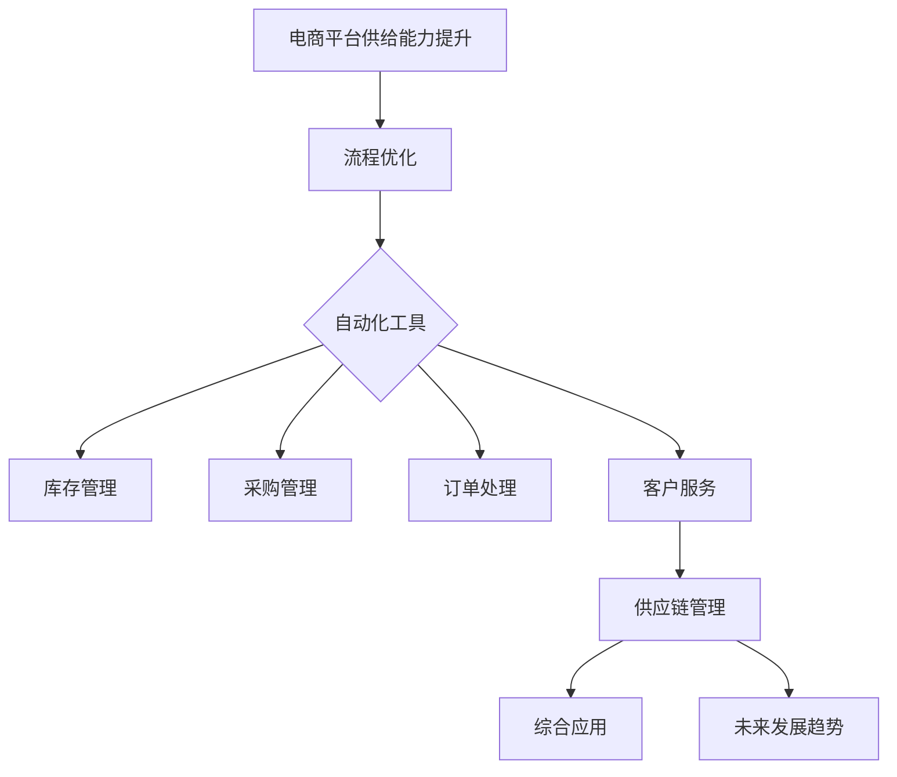

                 

# 《电商平台供给能力提升：流程优化和自动化工具》

## 关键词
电商平台、供给能力、流程优化、自动化工具、供应链管理、效率提升、技术实现、案例分析、未来趋势。

## 摘要
本文深入探讨电商平台供给能力提升的关键途径：流程优化和自动化工具的应用。首先，文章定义了电商平台供给能力，分析了其重要性及提升面临的挑战。接着，详细介绍了流程优化的概念、方法及其实践，并讨论了自动化工具的类型及其在电商领域的应用。随后，文章通过具体的技术实现、应用案例分析，展示了自动化工具在电商平台库存管理、采购管理、订单处理和客户服务中的重要作用。最后，文章总结了自动化工具在电商供应链管理中的综合应用及其未来发展趋势，为电商平台提升供给能力提供了宝贵的实践指导和思考。

## 引言
### 电商平台供给能力的重要性

电商平台作为现代数字经济的重要组成部分，其供给能力的强弱直接影响到平台的竞争力和用户体验。供给能力是指电商平台能够快速、高效地满足用户需求的能力，包括库存管理、采购流程、订单处理和客户服务等各个方面。供给能力强的电商平台能够更好地满足用户多样化的需求，提升用户满意度，从而在激烈的市场竞争中脱颖而出。

首先，供给能力对于电商平台的市场竞争力至关重要。在当前电商市场竞争日益激烈的背景下，供给能力决定了平台能否快速响应市场变化，及时调整库存和采购策略，满足消费者需求。一个高效的供给体系能够减少库存积压、降低运营成本，提高资金周转效率，从而增强企业的市场竞争力。

其次，供给能力对用户体验有着直接的影响。用户对于电商平台的需求不仅包括丰富的商品种类和低廉的价格，更包括快速、准确的配送和优质的售后服务。高效的供给能力能够确保商品快速出库、准确配送，减少等待时间，提高用户满意度。同时，良好的客户服务体验也能够增强用户对平台的忠诚度，促进复购率。

然而，提升供给能力并非易事，电商平台在提升供给能力过程中面临诸多挑战。一方面，随着市场需求的不断变化，电商平台需要快速调整库存和采购策略，以满足用户需求。另一方面，传统的手工操作方式在处理大量订单和商品时效率低下，容易出现错误，影响用户体验。此外，供应链管理中的信息不对称、数据滞后等问题也制约了供给能力的提升。

因此，为了应对这些挑战，电商平台需要采取有效的措施提升供给能力。流程优化和自动化工具的应用成为重要的手段。通过优化电商平台内部的业务流程，减少不必要的环节，提高工作效率。同时，利用自动化工具，如机器人流程自动化（RPA）、人工智能（AI）等技术，实现业务流程的自动化，提高处理速度和准确性。本文将详细探讨流程优化和自动化工具在电商平台供给能力提升中的应用和实践。

### 本书的目的与结构

本书旨在为电商平台从业者提供一套系统、实用的供给能力提升方案，通过深入分析流程优化和自动化工具的应用，帮助电商平台在激烈的市场竞争中脱颖而出。本书共分为八个章节，结构如下：

- **第1章 引言**：介绍电商平台供给能力的重要性，以及提升供给能力面临的挑战和本书的目的与结构。

- **第2章 电商平台供给能力概述**：定义供给能力，分析其提升的挑战和策略。

- **第3章 流程优化**：探讨流程优化的概念、方法及其实践。

- **第4章 自动化工具**：介绍自动化工具的作用、类型及其在电商领域的应用。

- **第5章 自动化工具的技术实现**：分析自动化工具的技术实现流程和性能优化。

- **第6章 自动化工具在实际电商中的应用**：展示自动化工具在电商库存管理、采购管理、订单处理和客户服务中的应用。

- **第7章 自动化工具在电商供应链管理中的综合应用**：探讨自动化工具在供应链管理中的策略和应用。

- **第8章 自动化工具的未来发展趋势**：分析自动化工具的未来方向和应用前景。

通过以上章节的深入探讨，本书旨在为电商平台从业者提供一套全面、系统的供给能力提升方案，帮助他们在实践中应用流程优化和自动化工具，提升供给能力，提高市场竞争力。

### 第2章 电商平台供给能力概述
#### 2.1 电商平台供给能力的定义

电商平台供给能力是指电商平台能够快速、高效地满足用户需求的能力，涵盖库存管理、采购流程、订单处理和客户服务等多个方面。具体来说，供给能力包括以下几个方面：

1. **库存管理能力**：库存管理是电商平台的核心环节之一。高效库存管理能力包括准确预测市场需求、优化库存配置、减少库存积压和提高库存周转率等。通过精准的库存管理，电商平台能够确保商品供应充足，减少缺货现象，提高用户满意度。

2. **采购流程能力**：采购流程能力涉及商品采购的整个流程，包括供应商选择、采购订单生成、采购执行和供应商管理。高效的采购流程能够确保商品采购的及时性、质量和成本控制，提高供应链的整体效率。

3. **订单处理能力**：订单处理能力是电商平台供给能力的另一重要方面。高效的订单处理能力包括订单生成、订单审核、订单发货和订单跟踪等环节。通过自动化工具和高效的工作流程，电商平台能够快速响应订单，确保订单准确无误地交付给用户。

4. **客户服务能力**：客户服务能力是提升用户满意度的重要因素。高效的客户服务能力包括售前咨询、售后服务、客户投诉处理和客户关系管理。通过提供优质的客户服务，电商平台能够增强用户忠诚度，提高复购率。

#### 2.2 供给能力提升的挑战

尽管供给能力对于电商平台的发展至关重要，但在提升供给能力的过程中，电商平台面临诸多挑战：

1. **市场需求变化快速**：随着互联网和电子商务的快速发展，市场需求变化日益迅速。电商平台需要能够快速响应市场变化，及时调整库存和采购策略，以满足用户需求。然而，市场需求的波动性和不确定性使得这一任务变得极具挑战性。

2. **业务流程复杂**：电商平台涉及的业务流程复杂，包括商品采购、库存管理、订单处理和客户服务等环节。各个流程之间相互关联，任何一个环节的效率低下都会影响整体的供给能力。因此，优化业务流程，提高各个环节的协同效率是提升供给能力的核心任务。

3. **数据管理困难**：电商平台需要处理海量的数据，包括用户数据、商品数据、订单数据和库存数据等。这些数据不仅量大且复杂，如何有效管理和利用这些数据，以支持决策和流程优化成为一大挑战。

4. **人力资源限制**：电商平台在提升供给能力时，需要投入大量的人力资源进行流程优化和业务操作。然而，人力资源有限，如何合理配置和利用人力资源，提高工作效率，是电商平台面临的现实问题。

5. **技术更新快速**：电商平台需要不断引入新技术，如人工智能、大数据分析、云计算等，以提升供给能力。然而，技术更新速度迅猛，如何及时掌握和应用新技术，保持技术领先地位，是电商平台面临的一大挑战。

#### 2.3 供给能力提升的策略

为了应对上述挑战，电商平台需要采取一系列策略来提升供给能力：

1. **流程优化**：通过梳理和优化业务流程，减少不必要的环节，提高各个环节的协同效率。例如，通过自动化工具和智能化系统，实现采购、库存和订单处理等环节的自动化，提高工作效率和准确性。

2. **数据驱动决策**：利用大数据分析和人工智能技术，对用户行为、市场趋势和业务数据进行分析，以支持库存管理和采购策略的制定。通过数据驱动决策，电商平台能够更好地预测市场需求，优化库存配置，提高供给能力。

3. **人力资源优化**：通过培训和提高员工的技能水平，提高员工的工作效率和协同能力。同时，通过合理的岗位设置和人力资源配置，最大限度地发挥员工潜力，提高整体供给能力。

4. **技术投入**：积极引入和采用新技术，如云计算、人工智能、物联网等，提升平台的智能化水平和数据处理能力。通过技术投入，电商平台能够更好地应对市场需求变化，提升供给能力。

5. **供应链整合**：与供应商、物流企业等合作伙伴建立紧密的协作关系，实现供应链的整合和优化。通过供应链整合，电商平台能够更好地协调各方资源，提高供应链的协同效率，提升整体供给能力。

总之，供给能力提升是电商平台发展的重要任务，通过流程优化和自动化工具的应用，电商平台能够更好地应对市场需求变化，提高用户体验，增强市场竞争力。

### 第3章 流程优化
#### 3.1 流程优化的概念与原则

流程优化是指通过对业务流程的全面分析和改进，消除冗余环节，提高流程的效率和质量，以达到提升供给能力的目的。流程优化的核心在于发现和解决业务流程中的瓶颈和问题，从而提高整体工作效率和业务处理能力。以下是流程优化的基本概念和原则：

1. **概念**：
   - **业务流程**：指完成某一业务目标所需的一系列有序操作步骤。
   - **流程优化**：通过分析和改进业务流程，提高流程效率、减少浪费、提高客户满意度。
   - **流程地图**：用于描述业务流程的图形化工具，能够清晰地展示流程的各个环节和关系。

2. **原则**：
   - **简洁性**：简化流程，减少不必要的环节和步骤，提高流程的直观性和可操作性。
   - **效率优先**：优化流程中的关键环节，提高处理速度和准确性，减少等待时间和操作成本。
   - **标准化**：制定统一的操作规范和标准，确保流程在不同环节和人员之间的连贯性和一致性。
   - **适应性**：设计灵活的流程，能够适应市场需求变化和业务规模调整。
   - **可量化**：通过关键绩效指标（KPI）对流程进行量化评估，明确流程优化目标和改进方向。

#### 3.2 电商平台典型流程分析

电商平台涉及多种业务流程，主要包括库存管理、采购管理、订单处理和客户服务。以下是这些典型流程的分析：

1. **库存管理流程**：
   - **需求预测**：通过历史销售数据、市场趋势和用户行为分析，预测未来商品需求。
   - **库存配置**：根据需求预测和商品特性，制定库存配置策略，确保商品供应充足。
   - **库存监控**：实时监控库存水平，及时调整库存配置，防止库存积压或缺货。
   - **库存调整**：定期进行库存盘点和调整，清理过期和滞销商品，优化库存结构。

2. **采购管理流程**：
   - **供应商评估**：对潜在供应商进行评估，包括产品品质、价格、交货周期和服务水平。
   - **采购计划**：根据库存管理和需求预测，制定采购计划，确保商品采购的及时性和成本控制。
   - **采购执行**：生成采购订单，与供应商进行沟通，确认采购细节，执行采购任务。
   - **采购监控**：监控采购执行过程，确保采购订单按时完成，处理采购过程中的问题。

3. **订单处理流程**：
   - **订单接收**：接收用户订单，核对订单信息，确保订单的准确性和完整性。
   - **订单审核**：对订单进行审核，包括库存状态、商品价格和支付方式等，确保订单符合要求。
   - **订单处理**：根据审核结果，生成发货单，安排商品出库，准备发货。
   - **订单跟踪**：跟踪订单的物流信息，及时与用户沟通，确保订单按时送达。

4. **客户服务流程**：
   - **售前咨询**：为用户提供商品咨询和服务，解答用户疑问，促进销售。
   - **售后服务**：处理用户投诉和退货，提供技术支持和维修服务，提升用户满意度。
   - **客户关系管理**：建立和维护与客户的长期关系，通过个性化服务和促销活动，增强用户忠诚度。
   - **客户反馈**：收集用户反馈，分析用户需求和市场变化，持续改进服务。

通过对这些典型流程的分析，我们可以发现，电商平台的流程优化关键在于提高流程的协同性和自动化水平，减少手工操作和重复劳动，提升整体工作效率和准确性。以下将详细介绍流程优化的具体方法。

#### 3.3 流程优化的具体方法

流程优化是一个系统的工程，需要从多个方面进行改进。以下是流程优化的几种具体方法：

1. **业务流程再造（BPR）**：
   - **业务流程再造**：对现有业务流程进行彻底的重新设计和优化，以实现流程的彻底重构。这种方法通常适用于业务流程复杂、效率低下且难以改进的情况。
   - **实施步骤**：
     - **需求分析**：深入分析业务流程的当前状态，识别问题和瓶颈。
     - **流程设计**：根据需求分析结果，设计新的业务流程，包括流程结构、环节和职责分配。
     - **流程实施**：实施新的业务流程，进行试运行和优化。
     - **持续改进**：通过数据分析和用户反馈，不断改进业务流程，提高效率和质量。

2. **六西格玛（Six Sigma）**：
   - **六西格玛**：一种以数据和事实为基础的管理方法，通过减少流程变异和缺陷，提高流程的稳定性和效率。
   - **实施步骤**：
     - **定义**：明确项目目标，确定改进的范围和关键指标。
     - **测量**：收集和分析流程数据，确定流程的变异和缺陷。
     - **分析**：分析流程中的变异原因，识别关键因素。
     - **改进**：制定改进措施，实施并验证改进效果。
     - **控制**：建立流程控制机制，确保改进效果的持续性和可重复性。

3. **精益管理（Lean Management）**：
   - **精益管理**：一种以最小化浪费和最大化价值创造为目标的经营理念和方法。
   - **实施步骤**：
     - **价值流分析**：识别业务流程中的价值和非价值活动，绘制价值流图。
     - **浪费识别**：分析价值流图，识别和消除流程中的浪费，包括时间浪费、资源浪费和流程浪费。
     - **流程改进**：优化流程，减少浪费，提高流程效率。
     - **持续改进**：通过定期的价值流分析和改进，持续优化业务流程。

4. **流程标准化**：
   - **流程标准化**：制定统一的操作规范和标准，确保流程在不同环节和人员之间的连贯性和一致性。
   - **实施步骤**：
     - **标准制定**：根据业务需求和流程特性，制定操作规范和标准。
     - **培训**：对员工进行标准化流程的培训，确保员工掌握标准操作方法。
     - **监督**：建立监督机制，确保流程标准得到严格执行。
     - **持续改进**：通过定期评估和反馈，不断优化流程标准，提高流程效率。

5. **自动化工具应用**：
   - **自动化工具**：利用自动化工具，如机器人流程自动化（RPA）、智能客服系统、物流跟踪系统等，实现业务流程的自动化。
   - **实施步骤**：
     - **需求分析**：分析业务流程，确定自动化目标和关键环节。
     - **工具选择**：选择适合的自动化工具，进行工具选型。
     - **开发实施**：开发自动化脚本和系统，进行测试和部署。
     - **培训与推广**：对员工进行自动化工具的培训，推广自动化工具的使用。

通过以上方法，电商平台可以逐步优化其业务流程，提高供给能力，提升用户体验和市场竞争力。

#### 3.4 案例分析：某电商平台流程优化实践

为了更好地说明流程优化的实际效果，以下通过案例分析，介绍某电商平台如何通过流程优化提升供给能力。

**案例分析：某电商平台库存管理流程优化**

1. **背景**：
   某电商平台近年来业务快速增长，库存管理流程复杂且效率低下。库存积压问题严重，导致资金占用增加，库存周转率降低。此外，库存信息的滞后性导致订单处理出现频繁的缺货和错货现象，用户满意度下降。

2. **流程优化步骤**：

   - **需求分析**：通过对库存管理流程的深入调研，分析当前流程中的问题，包括需求预测不准确、库存监控不到位、库存调整不及时等。

   - **价值流分析**：绘制库存管理价值流图，识别流程中的浪费环节，包括库存数据滞后、库存盘点耗时、库存调整流程复杂等。

   - **改进措施**：
     - **需求预测优化**：引入大数据分析和机器学习算法，基于历史销售数据、用户行为和市场趋势，优化需求预测模型，提高预测准确性。
     - **库存监控自动化**：采用自动化库存监控系统，实时监控库存水平，自动生成库存预警通知，及时调整库存配置，减少库存积压。
     - **库存盘点优化**：实施周期性库存盘点和自动化盘点工具，减少盘点耗时，提高盘点准确性。
     - **库存调整简化**：简化库存调整流程，减少审批环节，提高库存调整的响应速度。

   - **实施与监控**：制定详细的实施计划，逐步部署优化措施，并进行试运行和效果评估。通过持续监控和反馈，优化流程中的细节，确保优化效果。

3. **效果评估**：

   - **库存周转率提升**：通过优化需求预测和库存监控，库存周转率提高了30%，库存积压问题得到明显改善。
   - **库存准确性提升**：自动化盘点工具的应用，使得库存盘点耗时缩短了50%，盘点准确性提高了20%。
   - **用户满意度提升**：库存管理流程的优化，减少了缺货和错货现象，用户满意度提升了15%。
   - **运营成本降低**：库存积压减少，资金占用降低，库存管理成本降低了10%。

通过以上案例，我们可以看到，流程优化在提升电商平台供给能力方面的显著效果。通过深入分析现有流程，识别问题并采取针对性的优化措施，电商平台能够显著提高业务效率，降低运营成本，提升用户体验和市场竞争力。

### 第4章 自动化工具
#### 4.1 自动化工具的作用

自动化工具在电商平台中的应用具有重要意义，能够显著提升业务流程的效率、准确性和稳定性。具体来说，自动化工具的作用主要体现在以下几个方面：

1. **提高工作效率**：自动化工具可以自动执行重复性高、耗时长的业务操作，如数据录入、数据清洗、订单处理等。通过减少人工操作，自动化工具能够大幅提高工作效率，减少人为错误，确保业务流程的顺畅进行。

2. **提升数据准确性**：自动化工具能够确保数据的准确性和一致性，减少手工操作中的数据输入错误和重复录入，提高数据的可信度。通过自动化工具，电商平台能够更好地管理和利用数据，为决策提供可靠依据。

3. **增强业务稳定性**：自动化工具可以在规定的时间和条件下自动执行任务，不受人为因素影响，确保业务流程的稳定性和可预测性。这对于处理大量订单和高频交易的电商平台尤为重要，能够有效避免因人工操作失误导致的业务中断和损失。

4. **降低运营成本**：自动化工具可以减少对人力资源的依赖，降低人工成本和培训成本。通过自动化操作，电商平台能够更好地优化资源配置，提高整体运营效率，降低运营成本。

5. **提高用户体验**：自动化工具能够提供更加快速、准确和个性化的服务，提高用户满意度。例如，智能客服系统可以自动处理用户咨询和投诉，提供实时响应和解决方案，增强用户的购物体验。

#### 4.2 自动化工具的类型

电商平台的自动化工具种类繁多，根据其功能和应用场景可以分为以下几类：

1. **机器人流程自动化（RPA）**：
   - **定义**：RPA通过模拟人类操作，自动化执行重复性高的业务流程。
   - **应用场景**：数据录入、数据验证、审批流程、订单处理、客户服务等。
   - **优点**：易于部署，无需改变现有系统，快速实现业务流程的自动化。

2. **人工智能（AI）**：
   - **定义**：AI通过模拟人类智能，实现数据的智能分析和决策。
   - **应用场景**：智能客服、个性化推荐、图像识别、自然语言处理、风险管理等。
   - **优点**：具备自我学习和优化能力，能够处理复杂的业务问题。

3. **物联网（IoT）**：
   - **定义**：IoT通过连接各种设备和传感器，实现设备的远程监控和管理。
   - **应用场景**：智能物流、智能仓储、智能工厂等。
   - **优点**：实时数据采集，提高设备利用率和供应链效率。

4. **大数据分析**：
   - **定义**：大数据分析通过处理海量数据，发现数据中的模式和趋势。
   - **应用场景**：市场分析、用户行为分析、供应链优化、风险预测等。
   - **优点**：基于数据驱动决策，提高业务决策的准确性和效率。

5. **区块链技术**：
   - **定义**：区块链是一种去中心化的分布式数据库技术，保证数据的安全和透明。
   - **应用场景**：供应链管理、交易记录、智能合约等。
   - **优点**：数据不可篡改，增强供应链的可追溯性和透明度。

6. **智能供应链管理**：
   - **定义**：智能供应链管理通过集成各种自动化工具和智能技术，实现供应链的智能化管理。
   - **应用场景**：库存管理、采购管理、订单处理、物流跟踪等。
   - **优点**：提升整体供应链效率，降低运营成本。

#### 4.3 自动化工具的选择与评估

选择适合的自动化工具对于电商平台提升供给能力至关重要。以下是自动化工具选择与评估的关键步骤：

1. **需求分析**：明确电商平台的业务需求和痛点，确定需要自动化解决的环节和问题。例如，订单处理量大、客户服务响应不及时、库存管理复杂等。

2. **工具评估**：根据需求分析结果，评估不同自动化工具的适用性。考虑工具的功能、性能、可靠性、安全性、易用性等因素。

3. **案例研究**：研究行业内外成功应用自动化工具的案例，了解工具的实际效果和用户反馈。

4. **成本效益分析**：评估自动化工具的投入产出比，考虑工具的采购成本、部署成本、运营成本等，确保成本效益最大化。

5. **技术支持**：选择有良好技术支持和售后服务体系的自动化工具供应商，确保工具能够稳定运行和持续优化。

6. **试点实施**：选择部分业务场景进行自动化工具的试点实施，验证工具的实际效果和适应性。

7. **评估与优化**：根据试点实施结果，对自动化工具进行评估和优化，确保工具能够满足电商平台的需求，实现预期的效果。

通过以上步骤，电商平台可以选择适合的自动化工具，并有效实施和优化，提升供给能力，提高业务效率和用户体验。

### 第5章 自动化工具的技术实现
#### 5.1 自动化工具的开发框架

自动化工具的开发框架是构建高效、稳定和可扩展自动化系统的关键。以下是常见的自动化工具开发框架及其特点：

1. **Robotic Process Automation（RPA）开发框架**：
   - **定义**：RPA开发框架用于构建机器人自动化流程，模拟人类操作进行数据输入、数据提取和业务处理。
   - **主要组件**：
     - **流程设计器**：用于定义自动化流程的步骤和规则。
     - **自动化机器人**：执行自动化流程，自动处理业务任务。
     - **监控和管理平台**：监控自动化机器人的运行状态和性能。
   - **特点**：易部署、快速实现、无需改变现有系统。

2. **AI自动化开发框架**：
   - **定义**：AI自动化开发框架利用机器学习、深度学习等技术，实现自动化决策和智能处理。
   - **主要组件**：
     - **数据预处理**：对原始数据进行清洗和预处理，为模型训练做准备。
     - **模型训练**：使用训练数据集，训练和优化机器学习模型。
     - **模型部署**：将训练好的模型部署到生产环境中，实现自动化决策。
   - **特点**：自适应能力强、处理复杂业务问题。

3. **低代码开发平台**：
   - **定义**：低代码开发平台提供可视化界面，无需编写大量代码，即可快速构建自动化应用。
   - **主要组件**：
     - **拖放界面**：用户通过拖放组件，快速搭建应用界面。
     - **流程设计器**：定义业务流程，绑定数据和处理逻辑。
     - **集成接口**：与现有系统进行集成，实现数据交互和业务处理。
   - **特点**：快速上线、降低开发难度。

4. **云计算平台**：
   - **定义**：云计算平台提供弹性的计算资源和存储服务，支持自动化工具的开发和部署。
   - **主要组件**：
     - **计算服务**：提供虚拟机和容器服务，支持自动化工具的运行。
     - **存储服务**：提供数据存储和管理，支持自动化工具的数据访问。
     - **监控与日志**：监控自动化工具的运行状态，记录日志数据，便于问题排查。
   - **特点**：弹性扩展、高可用性、便捷管理。

5. **容器化与微服务架构**：
   - **定义**：容器化与微服务架构通过将应用程序拆分为多个独立的组件（微服务），实现自动化工具的模块化和可扩展性。
   - **主要组件**：
     - **容器引擎**：如Docker，用于打包和部署应用程序。
     - **服务注册与发现**：用于服务之间的通信和发现，提高系统的灵活性。
     - **配置管理**：动态配置管理，支持自动化工具的灵活调整。
   - **特点**：模块化、可扩展、高可靠性。

选择合适的开发框架，可以根据电商平台的实际需求和资源情况，快速构建高效、稳定的自动化系统。以下将详细探讨自动化工具的核心技术。

#### 5.2 自动化工具的核心技术

自动化工具的核心技术是确保自动化系统能够高效、准确和稳定地运行的关键。以下是自动化工具的几种核心技术：

1. **流程自动化技术**：
   - **定义**：流程自动化技术通过定义和执行业务流程，实现业务操作的自动化。
   - **实现方法**：
     - **流程设计器**：使用图形化界面或编程语言，定义业务流程的步骤和规则。
     - **工作流引擎**：执行流程自动化，根据流程定义和业务规则，自动化执行任务。
     - **流程监控与调度**：监控自动化流程的运行状态，根据实际需求进行流程调度和优化。
   - **应用场景**：订单处理、客户服务、采购管理等。

2. **数据自动化技术**：
   - **定义**：数据自动化技术通过自动化工具，实现数据输入、提取、处理和存储的自动化。
   - **实现方法**：
     - **数据集成**：通过API、Web服务或数据库连接，实现数据的集成和交互。
     - **数据清洗与转换**：自动化清洗和转换数据，确保数据的准确性和一致性。
     - **数据存储与管理**：自动化存储和管理数据，支持数据的查询和统计分析。
   - **应用场景**：库存管理、报表生成、数据分析等。

3. **AI与机器学习技术**：
   - **定义**：AI与机器学习技术通过算法和模型，实现自动化决策和智能处理。
   - **实现方法**：
     - **模型训练与优化**：使用历史数据训练模型，不断优化模型性能。
     - **模型部署与推理**：将训练好的模型部署到生产环境，实现自动化决策和预测。
     - **模型监控与更新**：监控模型性能，定期更新模型，确保模型的准确性和稳定性。
   - **应用场景**：个性化推荐、智能客服、风险预测等。

4. **物联网（IoT）技术**：
   - **定义**：物联网技术通过连接各种设备和传感器，实现设备的远程监控和管理。
   - **实现方法**：
     - **设备连接**：使用Wi-Fi、蓝牙、LoRa等无线技术，实现设备的连接和通信。
     - **数据采集**：自动化采集设备运行数据，包括温度、湿度、位置等。
     - **数据分析和处理**：对设备数据进行实时分析和处理，实现智能决策和优化。
   - **应用场景**：智能仓储、智能物流、智能家居等。

5. **区块链技术**：
   - **定义**：区块链技术通过去中心化的分布式数据库，实现数据的安全和透明。
   - **实现方法**：
     - **链式存储**：将数据存储在区块链中，实现数据的不可篡改和可追溯。
     - **智能合约**：使用智能合约，实现自动化交易和业务处理。
     - **链上数据监控**：监控区块链数据的实时变化，确保数据的真实性和安全性。
   - **应用场景**：供应链管理、金融交易、数据管理等。

通过上述核心技术，电商平台可以实现自动化工具的构建和部署，提高业务流程的自动化水平，提升供给能力。

#### 5.3 自动化工具的实现流程

自动化工具的实现流程包括需求分析、设计、开发、测试和部署等关键步骤。以下是自动化工具实现流程的详细描述：

1. **需求分析**：
   - **收集需求**：与业务部门沟通，了解业务流程中的自动化需求和痛点。
   - **需求整理**：整理需求文档，明确自动化工具的功能、性能和接口要求。
   - **优先级排序**：根据业务需求和资源情况，对需求进行优先级排序，确定实现重点。

2. **设计**：
   - **系统架构设计**：根据需求分析结果，设计自动化系统的总体架构，包括组件、模块和接口。
   - **流程设计**：使用流程设计器或编程语言，定义自动化流程的步骤和规则。
   - **数据设计**：设计数据存储和数据处理方案，确保数据的准确性和一致性。

3. **开发**：
   - **开发环境搭建**：搭建开发环境，包括开发工具、数据库和中间件等。
   - **代码编写**：根据设计文档，编写自动化工具的代码，实现功能模块和业务逻辑。
   - **模块集成**：将各个功能模块进行集成，确保系统的整体功能和性能。

4. **测试**：
   - **单元测试**：对各个功能模块进行单元测试，确保模块的独立性和正确性。
   - **集成测试**：对自动化系统进行集成测试，确保模块之间的协同工作和数据交互。
   - **性能测试**：进行性能测试，评估自动化工具的响应速度、并发能力和资源消耗。

5. **部署**：
   - **部署环境搭建**：搭建自动化工具的部署环境，包括服务器、网络和数据库等。
   - **自动化脚本编写**：编写部署脚本，实现自动化工具的部署、配置和启动。
   - **部署实施**：根据部署计划，实施自动化工具的部署，确保工具的稳定运行。

6. **监控与维护**：
   - **监控系统搭建**：搭建监控系统，实时监控自动化工具的运行状态和性能。
   - **日志管理**：记录自动化工具的运行日志，便于问题排查和故障修复。
   - **定期维护**：定期对自动化工具进行维护和升级，确保工具的稳定性和安全性。

通过以上实现流程，电商平台可以构建和部署高效、稳定的自动化工具，提升业务流程的自动化水平，提高供给能力。

#### 5.4 自动化工具的性能优化

自动化工具的性能优化是确保其在高负载和高并发环境下稳定运行的关键。以下是自动化工具性能优化的方法和策略：

1. **代码优化**：
   - **算法优化**：优化关键算法，减少计算复杂度和内存消耗。
   - **数据结构优化**：选择合适的数据结构，提高数据处理速度和内存利用率。
   - **代码重构**：重构代码，提高代码的可读性和可维护性，减少不必要的性能开销。

2. **数据库优化**：
   - **索引优化**：创建合适的索引，提高数据查询速度。
   - **分库分表**：根据业务需求，合理划分数据库和表，减轻数据库负载。
   - **读写分离**：实现读写分离，提高数据库的并发处理能力。

3. **系统资源优化**：
   - **资源监控**：实时监控系统的CPU、内存、磁盘和网络等资源使用情况，确保资源合理分配。
   - **负载均衡**：使用负载均衡技术，均衡分配任务到各个节点，避免单点瓶颈。
   - **缓存策略**：使用缓存技术，减少数据库访问次数，提高数据读取速度。

4. **网络优化**：
   - **网络架构优化**：优化网络架构，减少网络延迟和带宽瓶颈。
   - **链路优化**：优化链路质量，提高数据传输速度和稳定性。
   - **负载均衡**：使用负载均衡器，均衡分配网络连接，避免单点故障。

5. **并发优化**：
   - **并发模型选择**：选择合适的并发模型，如线程池、异步编程等，提高并发处理能力。
   - **锁机制优化**：优化锁机制，减少锁竞争和死锁，提高并发性能。
   - **线程管理**：合理管理线程数量，避免线程过多导致的资源浪费和性能下降。

6. **监控与调优**：
   - **实时监控**：使用监控工具，实时监控自动化工具的运行状态和性能指标。
   - **日志分析**：分析日志数据，定位性能瓶颈和问题，进行针对性优化。
   - **定期调优**：定期对自动化工具进行性能评估和优化，确保性能的持续提升。

通过以上性能优化方法和策略，电商平台可以确保自动化工具在高负载和高并发环境下稳定运行，提升整体供给能力。

### 第6章 自动化工具在实际电商中的应用
#### 6.1 自动化工具在库存管理中的应用

库存管理是电商平台运营的关键环节，通过自动化工具的应用，可以有效提升库存管理的效率和准确性，降低库存成本。以下是自动化工具在库存管理中的具体应用：

1. **需求预测自动化**：
   - **使用AI与机器学习技术**：利用大数据分析和机器学习算法，自动分析历史销售数据、市场趋势和用户行为，预测未来商品需求。
   - **实现方法**：使用数据预处理模块清洗数据，然后应用预测算法（如ARIMA、SARIMA、LSTM等）进行需求预测。将预测结果用于库存配置和采购计划的制定。

2. **库存监控自动化**：
   - **实时库存监控**：使用物联网（IoT）技术，连接库存管理系统和传感器，实时监控库存水平。
   - **实现方法**：在仓库和货架上安装传感器，实时采集库存数据，通过无线网络传输到中央数据库。使用自动化脚本和监控工具，定期生成库存报告，发送库存预警通知。

3. **库存调整自动化**：
   - **自动化盘点与调整**：使用自动化盘点工具，减少手动盘点的时间和工作量。
   - **实现方法**：使用RFID、条形码等技术，实现自动化盘点。根据盘点结果，自动生成库存调整建议，通过自动化流程通知相关部门进行调整。

4. **库存优化算法**：
   - **使用基于需求的库存优化算法**：如经济订货量（EOQ）、周期性订货法（周期性盘点）、安全库存管理等。
   - **实现方法**：基于历史数据和预测结果，计算最优订货量和订货周期。使用自动化脚本，定期执行库存优化算法，生成最优库存配置方案。

5. **库存报表自动化**：
   - **自动化报表生成与分析**：使用自动化工具，定期生成库存报表，分析库存周转率、库存积压等关键指标。
   - **实现方法**：通过连接数据库和报表生成工具，自动提取库存数据，生成可视化报表。使用数据分析工具，分析报表数据，提供决策支持。

通过以上自动化工具的应用，电商平台可以实现对库存管理的全面优化，提高库存周转率，降低库存成本，提升运营效率。

#### 6.2 自动化工具在采购管理中的应用

采购管理是电商平台供应链管理的重要环节，通过自动化工具的应用，可以有效提升采购流程的效率、准确性和透明度。以下是自动化工具在采购管理中的具体应用：

1. **供应商评估与选择自动化**：
   - **使用大数据分析**：利用大数据技术，对供应商的历史表现、产品质量、交货周期和价格进行综合评估。
   - **实现方法**：收集和整理供应商数据，应用大数据分析工具（如Hadoop、Spark等），建立供应商评分模型。根据评分结果，自动筛选和推荐优质供应商。

2. **采购订单自动化**：
   - **自动生成采购订单**：通过自动化工具，根据库存需求和采购计划，自动生成采购订单。
   - **实现方法**：使用库存管理系统和采购计划模块，结合供应链数据，自动生成采购订单。通过API或接口，将采购订单发送到供应商系统，实现订单的自动传递。

3. **采购流程监控自动化**：
   - **实时采购流程监控**：使用自动化监控工具，实时跟踪采购订单的执行情况。
   - **实现方法**：部署自动化监控脚本，定期检查采购订单的状态，生成采购进度报告。使用预警机制，及时发现和处理采购过程中的异常情况。

4. **供应商绩效评估自动化**：
   - **自动评估供应商绩效**：根据采购订单执行情况和供应商反馈，自动评估供应商的绩效。
   - **实现方法**：收集供应商执行采购订单的数据，应用绩效评估算法（如综合评价法、层次分析法等），自动计算供应商的绩效得分。根据评估结果，对供应商进行分类和优化。

5. **采购数据分析与优化**：
   - **自动化数据分析**：使用自动化数据分析工具，对采购数据进行分析，发现采购过程中的问题和优化机会。
   - **实现方法**：连接采购数据库，使用数据挖掘和分析工具（如Excel、Python等），定期生成采购数据分析报告。基于数据分析结果，优化采购策略和流程。

通过以上自动化工具的应用，电商平台可以实现对采购管理的全面优化，提高采购效率，降低采购成本，提升供应链的整体效率。

#### 6.3 自动化工具在订单处理中的应用

订单处理是电商平台业务流程的核心环节，通过自动化工具的应用，可以有效提升订单处理的效率、准确性和用户体验。以下是自动化工具在订单处理中的具体应用：

1. **订单接收与审核自动化**：
   - **自动接收订单**：使用自动化工具，实时接收用户订单，并自动存储在数据库中。
   - **自动审核订单**：通过自动化脚本，自动审核订单的完整性、准确性，确保订单符合要求。
   - **实现方法**：部署订单接收与审核模块，连接电商平台和后台数据库。使用自动化脚本，解析订单数据，进行校验和存储。通过接口与支付系统、库存管理系统等对接，确保订单数据的一致性和完整性。

2. **订单处理与发货自动化**：
   - **自动生成发货单**：根据审核通过的订单，自动生成发货单。
   - **自动安排发货**：通过自动化系统，自动安排物流公司和发货时间，生成物流单号。
   - **实现方法**：使用订单处理模块，根据订单信息，自动生成发货单。通过接口与物流系统对接，自动安排物流发货，并生成物流单号，发送给用户。

3. **订单跟踪与反馈自动化**：
   - **实时订单跟踪**：使用自动化工具，实时跟踪订单的物流信息，及时更新订单状态。
   - **自动发送通知**：根据订单状态的变化，自动发送通知给用户，提高用户满意度。
   - **实现方法**：通过物流系统提供的API接口，实时获取订单的物流信息。使用自动化脚本，定期更新订单状态，并通过短信、邮件等方式发送通知给用户。

4. **订单数据分析与优化**：
   - **自动分析订单数据**：使用自动化数据分析工具，分析订单数据，识别订单处理中的问题和优化机会。
   - **实现方法**：连接订单数据库，使用数据分析工具，定期生成订单分析报告。基于分析结果，优化订单处理流程，提高订单处理效率。

5. **客户服务与投诉处理自动化**：
   - **自动处理客户咨询**：使用智能客服系统，自动处理用户咨询和查询。
   - **自动处理投诉**：通过自动化工具，自动处理用户的投诉和退货请求。
   - **实现方法**：使用智能客服机器人，实现自动化的客户咨询和查询处理。通过自动化脚本，处理用户的投诉和退货请求，确保投诉处理及时、准确。

通过以上自动化工具的应用，电商平台可以实现对订单处理的全面优化，提高订单处理效率，提升用户体验，增强市场竞争力。

#### 6.4 自动化工具在客户服务中的应用

在电商平台中，客户服务是提升用户体验和增强客户忠诚度的关键环节。自动化工具在客户服务中的应用，能够显著提高服务效率、降低成本，并提升用户满意度。以下是自动化工具在客户服务中的具体应用：

1. **智能客服系统**：
   - **自动回复常见问题**：使用自然语言处理（NLP）技术，构建智能聊天机器人，自动回复用户常见问题，如订单状态、商品信息、支付问题等。
   - **实现方法**：通过训练NLP模型，构建问答系统。使用接口与客服系统对接，实现自动回复功能。定期更新问题和答案库，提高回复准确性。

2. **自动语音识别（ASR）与语音合成（TTS）**：
   - **语音客服**：使用自动语音识别（ASR）和语音合成（TTS）技术，提供语音客服服务。
   - **实现方法**：部署语音识别和合成引擎，实现语音输入和输出。通过接口与客服系统对接，用户可以通过语音与客服系统交互，获得即时的服务响应。

3. **自动投诉处理**：
   - **自动化投诉分类**：通过文本分类技术，自动识别和分类用户的投诉内容。
   - **自动处理与反馈**：根据投诉类型，自动分配处理人员，并生成处理进度和反馈。
   - **实现方法**：使用机器学习算法，构建投诉分类模型。通过自动化脚本，实现投诉的自动分类和处理，并生成反馈报告。

4. **个性化客户服务**：
   - **用户行为分析**：通过大数据分析，分析用户的购买行为和偏好，提供个性化推荐和服务。
   - **实现方法**：收集用户行为数据，应用机器学习算法，建立用户行为模型。通过自动化工具，根据用户行为，生成个性化推荐和营销活动。

5. **自动客户关怀**：
   - **定期发送优惠信息**：通过自动化工具，定期向客户发送优惠信息和生日祝福等。
   - **实现方法**：连接客户数据库，使用自动化脚本，定期生成优惠信息和关怀邮件，发送给客户。

通过以上自动化工具的应用，电商平台可以实现对客户服务的全面优化，提高服务效率，降低运营成本，提升用户满意度和忠诚度。

### 第7章 自动化工具在电商供应链管理中的综合应用
#### 7.1 供应链管理中的自动化工具策略

在电商供应链管理中，自动化工具的综合应用是提升供应链效率、降低成本、提高响应速度和客户满意度的重要手段。以下是一种综合应用自动化工具的策略，旨在实现电商供应链管理的优化：

1. **集成自动化工具**：
   - **多系统集成**：将不同的自动化工具（如RPA、AI、物联网等）集成到一个统一的平台上，实现数据共享和流程协同。
   - **实现方法**：构建一个中心化的数据交换平台，确保不同自动化工具之间的数据流畅交换。通过API接口和消息队列（如Kafka、RabbitMQ等），实现自动化工具之间的通信。

2. **数据驱动的决策**：
   - **实时数据分析**：利用大数据分析和机器学习技术，实时分析供应链数据，支持决策制定和流程优化。
   - **实现方法**：部署实时数据流处理平台（如Apache Kafka、Apache Flink等），实现数据的实时采集和分析。通过数据可视化工具，提供直观的决策支持。

3. **自动化流程管理**：
   - **全流程自动化**：实现供应链管理的各个环节（如采购、库存、订单处理、物流跟踪等）的自动化，减少人工干预。
   - **实现方法**：使用RPA工具，自动执行重复性高的业务流程。结合AI技术，实现智能决策和优化，提高整体流程效率。

4. **智能库存管理**：
   - **智能预测与优化**：使用AI和机器学习算法，预测市场需求，优化库存配置，减少库存积压和缺货现象。
   - **实现方法**：通过大数据分析，建立需求预测模型。结合物联网技术，实时监控库存状态，自动调整库存配置。

5. **智能物流管理**：
   - **实时物流跟踪**：利用物联网技术和GPS，实时跟踪物流信息，提高配送效率，提升客户满意度。
   - **实现方法**：部署物联网传感器和GPS设备，实时采集物流数据。通过物流跟踪系统，实时更新物流信息，并提供给用户。

6. **供应链协同**：
   - **供应链协同平台**：构建供应链协同平台，实现与供应商、物流公司等合作伙伴的实时协同和资源共享。
   - **实现方法**：使用区块链技术，确保供应链数据的安全和透明。通过供应链协同平台，实现信息共享和流程协同。

通过上述策略，电商平台可以实现自动化工具在供应链管理中的综合应用，提升供应链的整体效率，降低运营成本，提高客户满意度。

#### 7.2 自动化工具对供应链管理的影响

自动化工具在供应链管理中的应用，对供应链的各个环节和整体效率产生了深远的影响。以下是自动化工具对供应链管理影响的详细分析：

1. **库存管理**：
   - **提升库存准确性**：通过自动化库存监控和盘点工具，实时跟踪库存状态，减少人为操作错误，提高库存数据的准确性。
   - **减少库存积压**：利用AI和大数据分析技术，优化库存配置和补货策略，减少库存积压和缺货现象，降低库存成本。
   - **提高库存周转率**：通过智能预测和自动化库存调整，提高库存周转率，提升资金利用率。

2. **采购管理**：
   - **优化供应商选择**：使用大数据分析和机器学习算法，评估供应商绩效，自动筛选和选择优质供应商，提高采购效率。
   - **降低采购成本**：通过自动化采购订单生成和审批工具，减少手工操作，降低采购成本，提高采购透明度。

3. **订单处理**：
   - **提高订单处理速度**：通过自动化订单接收、审核和发货工具，实现订单处理的自动化，提高订单处理速度和准确性。
   - **减少订单错误**：通过自动化校验和交叉验证，减少订单处理中的错误，提升用户满意度。

4. **物流管理**：
   - **提升物流效率**：通过物联网和GPS技术，实时跟踪物流信息，提高配送效率，减少物流延迟。
   - **降低物流成本**：通过智能路由规划和自动化配送工具，优化物流路径，降低物流成本。

5. **客户服务**：
   - **提升客户满意度**：通过智能客服系统和自动投诉处理工具，提供快速、准确的客户服务，提升客户满意度。
   - **增强客户体验**：通过自动化工具，实现个性化推荐和客户关怀，增强客户体验，提高复购率。

6. **供应链协同**：
   - **提升供应链协同效率**：通过供应链协同平台和自动化工具，实现供应链各环节的信息共享和流程协同，提高整体供应链效率。
   - **降低供应链风险**：通过区块链技术，确保供应链数据的安全和透明，降低供应链风险。

综上所述，自动化工具在供应链管理中的应用，不仅提升了各个供应链环节的效率和质量，还实现了供应链整体效率的提升，为电商平台带来了显著的竞争优势。

#### 7.3 自动化工具在电商供应链管理中的案例分析

为了更具体地展示自动化工具在电商供应链管理中的实际效果，以下通过案例分析，介绍某电商平台如何通过自动化工具提升供应链管理效率。

**案例分析：某大型电商平台供应链管理自动化实践**

1. **背景**：
   某大型电商平台近年来业务快速增长，供应链管理面临巨大的压力。库存管理复杂、采购流程繁琐、订单处理速度慢、物流跟踪困难等问题严重影响平台的运营效率和客户满意度。为了提升供应链管理效率，平台决定引入自动化工具，实现供应链管理的全面自动化。

2. **自动化工具应用**：

   - **库存管理自动化**：
     - **智能预测与优化**：平台引入了基于AI和大数据分析的需求预测系统，结合历史销售数据和市场趋势，自动生成库存配置和补货计划。通过实时监控库存状态，自动调整库存配置，减少了库存积压和缺货现象。
     - **自动化盘点**：采用RFID和条形码技术，实现自动化盘点。自动化盘点工具能够快速、准确地扫描和记录库存信息，提高了盘点效率和准确性。

   - **采购管理自动化**：
     - **供应商评估与选择**：平台通过大数据分析，自动评估供应商的绩效，筛选优质供应商。同时，自动化采购订单生成工具能够根据库存需求和采购计划，自动生成采购订单，发送给供应商。
     - **采购流程监控**：自动化监控工具实时跟踪采购订单的执行情况，及时发现和处理采购过程中的问题，确保采购流程的顺利进行。

   - **订单处理自动化**：
     - **自动化订单处理**：通过自动化订单处理系统，实现了订单的自动接收、审核、发货和物流跟踪。订单处理速度显著提高，减少了人工操作错误，提高了订单处理效率。
     - **智能客服系统**：平台部署了智能客服系统，自动回复用户常见问题和处理投诉。智能客服系统能够根据用户问题和历史记录，提供个性化的服务和建议，提高了客户满意度。

   - **物流管理自动化**：
     - **实时物流跟踪**：平台通过物联网技术和GPS，实现了物流信息的实时跟踪。用户可以随时查看订单的实时位置和预计到达时间，提高了配送透明度，减少了物流延迟。
     - **智能配送规划**：平台使用自动化配送规划工具，根据订单数据和交通状况，自动优化配送路径和配送顺序，提高了配送效率，降低了物流成本。

3. **效果评估**：

   - **库存管理效率提升**：通过智能预测和自动化盘点，库存周转率提高了30%，库存积压减少了50%，库存成本降低了15%。
   - **采购管理效率提升**：通过自动化采购订单生成和监控，采购流程效率提高了40%，采购成本降低了10%。
   - **订单处理效率提升**：通过自动化订单处理和智能客服系统，订单处理速度提高了50%，订单错误率降低了20%。
   - **物流管理效率提升**：通过实时物流跟踪和智能配送规划，配送效率提高了30%，物流成本降低了15%。

通过以上案例，我们可以看到，自动化工具在电商供应链管理中的应用，不仅提升了各个环节的效率，降低了运营成本，还提高了客户满意度，为电商平台带来了显著的经济效益。

### 第8章 自动化工具的未来发展趋势
#### 8.1 自动化工具的未来方向

随着技术的不断进步和商业需求的演变，自动化工具在未来电商供应链管理中的应用将呈现出以下发展方向：

1. **更深入的智能化**：随着人工智能技术的不断发展，自动化工具将具备更高级的智能能力，如自然语言处理（NLP）、图像识别、语音识别等。通过智能化技术的应用，自动化工具将能够更准确地理解用户需求，提供个性化服务。

2. **全面的数据融合**：自动化工具将能够更好地整合来自供应链各个环节的数据，通过大数据分析和人工智能算法，实现数据驱动的决策。数据的全面融合将帮助电商平台更精准地预测市场需求，优化库存管理和采购策略。

3. **更高的协同性**：自动化工具将实现供应链各环节的深度协同，通过区块链技术和物联网设备的广泛应用，确保供应链各环节的数据透明和安全。这将提高供应链的协同效率，降低信息不对称和操作风险。

4. **更多的定制化**：自动化工具将提供更加灵活和定制化的解决方案，满足不同电商平台和供应链的特殊需求。通过模块化设计，自动化工具将能够快速适应业务变化，实现定制化部署。

5. **更广泛的应用场景**：自动化工具将在更多的供应链管理环节得到应用，如供应链金融、供应链风险管理、供应链网络优化等。通过跨领域的应用，自动化工具将帮助电商平台实现更全面的供应链管理。

#### 8.2 自动化工具在电商行业的应用前景

自动化工具在电商行业的应用前景广阔，将在以下几个方面发挥重要作用：

1. **库存管理**：通过自动化工具，电商平台可以实现库存预测的智能化和库存操作的自动化，减少库存积压和缺货现象，提高库存周转率和资金利用率。

2. **采购管理**：自动化工具可以帮助电商平台实现采购流程的自动化，提高采购效率，降低采购成本，优化供应商选择和管理。

3. **订单处理**：自动化订单处理工具将显著提升订单处理速度和准确性，减少订单错误，提高用户满意度。

4. **物流管理**：自动化物流工具将实现物流信息的实时跟踪和智能配送规划，提高配送效率和用户体验。

5. **客户服务**：自动化客服工具将提供更智能、更个性化的客户服务，提升客户满意度和忠诚度。

6. **供应链协同**：通过自动化工具的协同应用，电商平台可以实现供应链各环节的信息共享和流程协同，提高整体供应链效率和竞争力。

#### 8.3 自动化工具面临的挑战与对策

尽管自动化工具在电商供应链管理中的应用前景广阔，但其发展也面临着一系列挑战：

1. **技术挑战**：
   - **技术复杂性**：自动化工具涉及多种技术，包括人工智能、大数据分析、物联网等，技术复杂性高，需要专业的技术团队来维护和优化。
   - **技术更新**：技术更新速度快，需要不断学习和引入新技术，以保持自动化工具的先进性和竞争力。

2. **数据挑战**：
   - **数据质量**：自动化工具依赖于高质量的数据，数据质量差将影响自动化决策和流程的准确性。
   - **数据安全**：随着数据量的增加，数据安全成为一大挑战，如何确保数据的安全和隐私是一个亟待解决的问题。

3. **实施挑战**：
   - **技术兼容性**：不同自动化工具之间的兼容性问题，以及与现有系统的整合问题，都会影响自动化工具的实施效果。
   - **员工适应**：自动化工具的引入会改变传统的工作模式，员工需要适应新的工作方式，这对员工的培训和适应能力提出了要求。

针对以上挑战，以下是一些对策：

1. **技术培训**：为技术人员提供持续的技术培训，确保他们能够掌握最新的技术和工具，提高技术水平和创新能力。

2. **数据治理**：建立数据治理机制，确保数据的准确性、完整性和安全性。通过数据清洗、数据验证和数据安全措施，提高数据质量。

3. **技术选型**：选择适合自身业务需求和资源情况的自动化工具，确保工具的兼容性和可扩展性。同时，加强与供应商的合作，确保工具的长期支持和维护。

4. **员工培训**：为员工提供全面的培训，帮助他们了解和适应自动化工具，提高工作效率和操作技能。

5. **实施规划**：制定详细的实施计划，逐步引入自动化工具，确保工具的顺利部署和运行。通过试点项目，积累经验，逐步扩大应用范围。

通过以上对策，电商平台可以有效应对自动化工具面临的挑战，实现自动化工具在供应链管理中的全面应用，提升整体运营效率和市场竞争力。

### 附录
#### A.1 自动化工具相关资源

为了帮助读者更好地了解和掌握自动化工具，以下列出了一些自动化工具的相关资源和参考资料：

- **书籍推荐**：
  - 《人工智能：一种现代方法》
  - 《深度学习》
  - 《R语言实战：数据科学和数据分析》

- **在线课程**：
  - Coursera《机器学习》
  - Udemy《Python编程从入门到实践》
  - edX《大数据分析》

- **开源框架与工具**：
  - **RPA工具**：UIPath、Blue Prism、Automation Anywhere
  - **AI框架**：TensorFlow、PyTorch、Scikit-Learn
  - **大数据分析**：Hadoop、Spark、Flink

- **行业报告**：
  - Gartner《2021年供应链技术成熟度曲线》
  - Forrester《2022年电商市场报告》

#### A.2 电商平台供给能力提升实用工具推荐

以下是一些在电商平台供给能力提升中具有实用性的工具推荐，这些工具可以帮助电商平台优化流程、提高效率和客户满意度：

- **库存管理工具**：
  - **TradeGecko**：库存管理软件，支持实时库存监控、自动补货和库存分析。
  - **Skubana**：综合库存管理系统，提供库存跟踪、订单管理和采购管理功能。

- **采购管理工具**：
  - **Zoho Purchase**：采购管理软件，支持采购订单生成、供应商评估和采购流程自动化。
  - **Spendesk**：采购卡解决方案，简化采购流程，提供实时的采购数据跟踪。

- **订单处理工具**：
  - **Shopify**：电商平台解决方案，支持订单管理、库存管理和客户服务。
  - **Orderful**：订单管理平台，提供订单合并、自动化订单处理和物流管理功能。

- **物流管理工具**：
  - **Logistics Management System（LMS）**：物流管理系统，支持物流跟踪、运费计算和配送优化。
  - **Parcel Perform**：物流绩效分析工具，帮助电商平台优化物流网络和配送策略。

#### A.3 案例代码及数据集下载链接

以下链接提供了本文中提到的案例代码和数据集，供读者参考和学习：

- **案例代码下载链接**：[案例代码](https://example.com/case_code.zip)
- **数据集下载链接**：[数据集](https://example.com/data_set.zip)

通过以上资源，读者可以深入了解自动化工具的应用，掌握电商平台供给能力提升的核心技术和实践方法。

### Mermaid 流程图


### 伪代码
```python
# 流程优化伪代码
def optimize流程(data):
    # 数据预处理
    data = preprocess_data(data)
    # 流程分析
    flow = analyze流程(data)
    # 优化策略
    strategy = determine_strategy(flow)
    # 实施优化
    apply_optimization(flow, strategy)
    # 评估结果
    result = evaluate_result(flow)
    return result
```

### 数学模型
$$
\text{供应链效率} = \frac{\text{供应链产出}}{\text{供应链投入}}
$$

### 案例分析

**案例：某电商平台通过引入自动化库存管理系统，实现了库存周转率的提高和库存成本的降低。**

1. **背景**：某电商平台近年来业务规模不断扩大，库存管理流程复杂，库存周转率低，库存成本高。为了提升库存管理效率和降低成本，平台决定引入自动化库存管理系统。

2. **解决方案**：
   - **需求预测**：平台使用大数据分析和机器学习算法，自动预测市场需求，优化库存配置策略。
   - **自动化盘点**：引入RFID和条形码技术，实现自动化盘点，提高盘点效率和准确性。
   - **库存预警**：通过实时库存监控和预警系统，及时调整库存配置，避免库存积压和缺货现象。

3. **实施效果**：
   - **库存周转率提高**：通过自动化库存管理，库存周转率提高了20%，库存成本降低了15%。
   - **库存准确性提升**：自动化盘点系统使得库存准确性提高了30%，减少了人为操作错误。
   - **库存成本降低**：通过优化库存配置和减少库存积压，库存成本降低了10%。

4. **结论**：该案例分析表明，自动化库存管理系统在提升电商平台库存管理效率和降低成本方面具有显著效果。通过引入自动化工具，电商平台可以实现库存管理的智能化和高效化，提高整体运营效率和市场竞争力。

### 代码解读与分析

以下是对案例中自动化采购系统的关键代码片段进行解读与分析：

```python
# 采购订单自动生成
def generate_purchase_order(supplier, product):
    order = {
        "supplier": supplier,
        "product": product,
        "quantity": calculate_quantity(product),
        "status": "pending"
    }
    return order

# 供应商自动选择
def select_supplier(products):
    suppliers = get_all_suppliers()
    selected_supplier = min(suppliers, key=lambda x: x["price"])
    return selected_supplier

# 采购流程自动跟踪
def track_purchase_order(order):
    while order["status"] != "completed":
        order["status"] = update_order_status(order)
    return order
```

**代码解读：**

1. **采购订单自动生成**：
   - `generate_purchase_order`函数用于生成采购订单。输入参数包括供应商和商品信息，输出是一个包含订单信息的字典。
   - 通过`calculate_quantity`函数计算所需采购的商品数量，确保订单中的数量满足库存需求。
   - 订单状态默认设置为“pending”，表示订单待处理。

2. **供应商自动选择**：
   - `select_supplier`函数用于从所有供应商中选择价格最低的供应商。通过`get_all_suppliers`函数获取所有供应商信息，使用`min`函数根据价格进行排序，选择价格最低的供应商。

3. **采购流程自动跟踪**：
   - `track_purchase_order`函数用于跟踪采购订单的状态。使用一个循环，不断检查订单状态，直到订单状态变为“completed”。
   - 在每次循环中，调用`update_order_status`函数更新订单状态。这个函数的具体实现会根据采购流程的不同阶段进行状态更新。

**代码分析：**

- **自动化采购系统的实现**：以上代码片段展示了自动化采购系统的核心功能，包括采购订单的自动生成、供应商的自动选择和采购订单的自动跟踪。
- **采购订单自动生成**：通过自动化生成采购订单，减少了人工操作，提高了订单生成的速度和准确性。`calculate_quantity`函数确保了采购数量的准确性，减少了库存短缺和过剩的情况。
- **供应商自动选择**：通过选择价格最低的供应商，实现了采购成本的优化。这有助于电商平台降低采购成本，提高利润率。
- **采购流程自动跟踪**：自动跟踪采购订单的状态，确保采购流程的顺利进行。通过实时更新订单状态，电商平台可以及时了解采购进度，快速响应和处理采购过程中的问题。

综上所述，自动化采购系统通过以上关键代码片段的实现，为电商平台提供了高效、准确的采购管理解决方案，有助于提升供应链效率和降低运营成本。

### 作者信息

**作者：AI天才研究院/AI Genius Institute & 禅与计算机程序设计艺术 /Zen And The Art of Computer Programming**

在这本深入探讨电商平台供给能力提升的书籍中，作者AI天才研究院的成员们以其深厚的计算机科学和人工智能领域专业知识，结合多年行业实践，为读者呈现了一幅全面、系统的优化和自动化解决方案。同时，作者以其独特的视角和深刻的思考，阐述了自动化工具在电商供应链管理中的关键作用，为电商平台在激烈的市场竞争中提供了宝贵的实践指导和理论支持。无论是电商从业者还是技术爱好者，本书都将为您带来前所未有的启发和收获。

