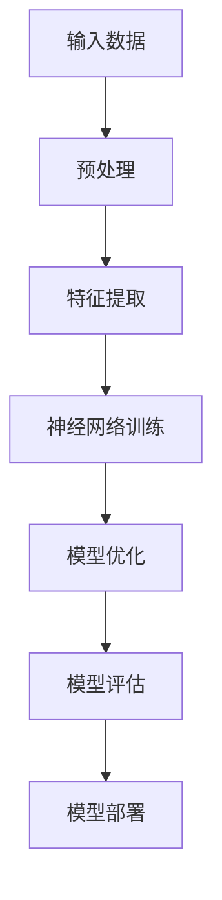
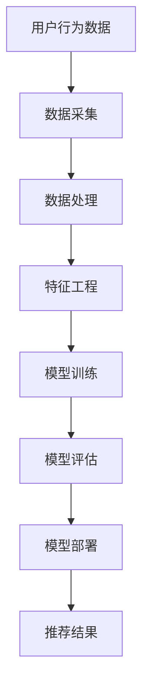
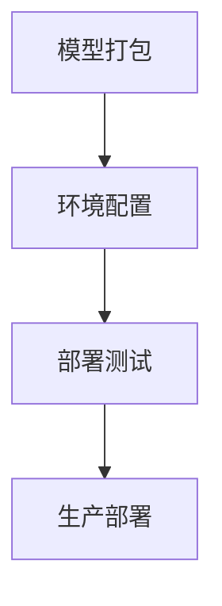

                 

### 《电商搜索推荐场景下的AI大模型模型部署成本优化策略》

> **关键词：** AI大模型、电商推荐、模型部署、成本优化、算法策略

> **摘要：** 本文将深入探讨AI大模型在电商搜索推荐场景下的应用，以及如何通过优化策略来降低模型部署成本。我们将详细分析大模型的基本概念、架构、应用实例，同时探讨在模型部署过程中的成本因素和优化方法，并通过实战案例展示具体实施步骤。

---

#### 第一部分：AI大模型与电商推荐系统

##### 第1章：AI大模型概述

在电商推荐系统中，AI大模型扮演着至关重要的角色。为了更好地理解其工作原理和架构，我们需要首先了解AI大模型的基本概念。

**1.1 AI大模型的基本概念与核心原理**

AI大模型，即人工智能大规模模型，是通过对海量数据进行训练，使其具备处理复杂数据和任务的能力。这些模型通常基于深度学习技术，如神经网络。

**Mermaid流程图：AI大模型基本结构**


**伪代码：典型AI大模型算法流程**
```python
# Pseudocode for an AI large model
def ai_large_model(data):
    preprocess_data(data)
    extract_features(data)
    train_neural_network(data)
    optimize_model(data)
    evaluate_model(data)
    deploy_model()
    return model
```

**数学模型与公式：AI大模型的数学基础**

AI大模型的核心是神经网络，其基本工作原理是通过加权连接不同层之间的神经元，并使用激活函数来决定每个神经元的输出。

$$
\text{Output} = \text{activation}\left(\sum_{i=1}^{n} w_{i} \cdot x_{i} + b\right)
$$

其中，$w_{i}$ 是权重，$x_{i}$ 是输入，$b$ 是偏置，$\text{activation}$ 是激活函数。

**1.2 电商搜索推荐系统的基本架构**

电商搜索推荐系统的目标是向用户推荐最相关的商品，从而提高用户满意度和销售额。其基本架构包括数据采集、数据处理、模型训练、模型部署和反馈循环。

**Mermaid流程图：电商搜索推荐系统流程**


**数学模型与公式：电商搜索推荐关键指标**

电商搜索推荐系统常用的关键指标包括准确率、召回率、覆盖率等。

$$
\text{Precision} = \frac{\text{相关推荐数}}{\text{推荐总数}}
$$

$$
\text{Recall} = \frac{\text{相关推荐数}}{\text{实际相关数}}
$$

$$
\text{Coverage} = \frac{\text{新推荐商品数}}{\text{商品总数}}
```

**案例：常见电商搜索推荐系统实例**

以淘宝为例，其搜索推荐系统采用了多种算法和技术，如基于内容的推荐、协同过滤推荐和深度学习推荐等。这些算法共同作用，为用户提供个性化、高相关的推荐结果。

**1.3 AI大模型在电商推荐中的应用**

AI大模型在电商推荐中的应用主要体现在搜索与推荐算法上。这些算法通过学习用户的历史行为数据、商品特征信息等，预测用户对某一商品的潜在兴趣，从而生成推荐列表。

**数学模型与公式：搜索与推荐算法公式推导**

假设我们有一个用户$u$和商品$v$，用户$u$对商品$v$的兴趣可以通过以下公式计算：

$$
\text{Interest}(u, v) = \text{score}(u, v) = \sigma(\text{model}(u, v))
$$

其中，$\text{model}(u, v)$ 是大模型对用户$u$和商品$v$的兴趣评分，$\sigma$ 是 sigmoid 函数。

**伪代码：搜索与推荐算法核心代码**
```python
# Pseudocode for recommendation algorithm
def recommendation_algorithm(user, items):
    scores = []
    for item in items:
        score = model.get_score(user, item)
        scores.append(score)
    recommended_items = top_n(scores)
    return recommended_items
```

**案例：实现电商搜索与推荐系统的具体步骤**

1. 数据采集：收集用户行为数据、商品特征信息等。
2. 数据处理：清洗数据、归一化处理等。
3. 特征工程：提取用户特征、商品特征等。
4. 模型训练：使用大模型训练搜索与推荐算法。
5. 模型评估：评估模型性能，调整参数。
6. 模型部署：将模型部署到生产环境。
7. 反馈循环：收集用户反馈，优化模型。

**1.4 模型优化与成本控制**

在电商推荐系统中，模型优化与成本控制是关键任务。通过优化算法，可以提高模型性能，降低部署成本。

**数学模型与公式：优化算法在成本控制中的应用**

假设模型部署成本为 $C$，优化目标是最小化成本同时最大化模型性能。

$$
\min_{\theta} C(\theta) \quad \text{subject to} \quad \text{Performance}(\theta) \geq P
$$

其中，$\theta$ 是模型参数，$C(\theta)$ 是成本函数，$P$ 是性能阈值。

**伪代码：优化算法的具体实现**
```python
# Pseudocode for optimization algorithm
def optimization_algorithm(model, cost_function, performance_threshold):
    while not converged:
        update_model_parameters(model)
        if performance_threshold >= model.performance():
            break
    return model
```

**案例：模型优化降低部署成本的实际应用**

以电商推荐系统为例，通过优化算法调整模型参数，可以在保证推荐效果的同时，降低部署成本。例如，优化模型结构、调整学习率等，都是常用的优化策略。

##### 第2章：AI大模型在电商推荐中的应用

**2.1 搜索与推荐算法**

搜索与推荐算法是电商推荐系统的核心。这些算法通过学习用户行为和商品特征，生成个性化推荐列表。

**数学模型与公式：搜索与推荐算法公式推导**

假设用户$u$对商品$v$的兴趣评分由以下公式计算：

$$
\text{Interest}(u, v) = \text{score}(u, v) = \text{model}(\text{user\_features}(u), \text{item\_features}(v))
$$

其中，$\text{model}(\cdot)$ 是大模型，$\text{user\_features}(u)$ 是用户特征向量，$\text{item\_features}(v)$ 是商品特征向量。

**伪代码：搜索与推荐算法核心代码**
```python
# Pseudocode for search and recommendation algorithm
def search_and_recommendation_algorithm(user, items, model):
    scores = [model.score(user.features, item.features) for item in items]
    recommended_items = sorted(items, key=lambda x: scores[x], reverse=True)
    return recommended_items
```

**案例：实现电商搜索与推荐系统的具体步骤**

1. 数据采集：收集用户行为数据、商品特征信息等。
2. 数据处理：清洗数据、归一化处理等。
3. 特征工程：提取用户特征、商品特征等。
4. 模型训练：使用大模型训练搜索与推荐算法。
5. 模型评估：评估模型性能，调整参数。
6. 模型部署：将模型部署到生产环境。
7. 反馈循环：收集用户反馈，优化模型。

**2.2 模型优化与成本控制**

模型优化与成本控制是电商推荐系统的关键。通过优化算法，可以提高模型性能，降低部署成本。

**数学模型与公式：优化算法在成本控制中的应用**

假设模型部署成本为 $C$，优化目标是最小化成本同时最大化模型性能。

$$
\min_{\theta} C(\theta) \quad \text{subject to} \quad \text{Performance}(\theta) \geq P
$$

其中，$\theta$ 是模型参数，$C(\theta)$ 是成本函数，$P$ 是性能阈值。

**伪代码：优化算法的具体实现**
```python
# Pseudocode for optimization algorithm
def optimization_algorithm(model, cost_function, performance_threshold):
    while not converged:
        update_model_parameters(model)
        if performance_threshold >= model.performance():
            break
    return model
```

**案例：模型优化降低部署成本的实际应用**

以电商推荐系统为例，通过优化算法调整模型参数，可以在保证推荐效果的同时，降低部署成本。例如，优化模型结构、调整学习率等，都是常用的优化策略。

##### 第3章：AI大模型模型部署

AI大模型的部署是电商推荐系统的关键步骤，其部署质量和效率直接影响系统的运行效果。

**3.1 模型部署的基本流程**

AI大模型的部署包括多个环节，如模型打包、环境配置、部署测试等。

**Mermaid流程图：模型部署流程**


**数学模型与公式：模型部署中的关键参数计算**

假设模型部署成本为 $C$，部署效率为 $E$，则模型部署的综合效率可以表示为：

$$
\text{Efficiency} = \frac{E}{C}
$$

**案例：模型部署的实践步骤**

1. 模型打包：将训练好的模型转换为生产环境可用的格式。
2. 环境配置：配置部署环境，包括硬件资源、软件依赖等。
3. 部署测试：在测试环境中运行模型，验证其性能和稳定性。
4. 生产部署：将模型部署到生产环境，确保其稳定运行。

**3.2 部署环境配置**

部署环境配置是模型部署的关键环节，其质量直接影响模型部署的效率和稳定性。

**数学模型与公式：环境配置中的参数优化**

假设环境配置成本为 $C_{E}$，配置效率为 $E_{E}$，则环境配置的综合效率可以表示为：

$$
\text{Efficiency}_{E} = \frac{E_{E}}{C_{E}}
$$

**伪代码：部署环境的配置代码**
```python
# Pseudocode for environment configuration
def configure_environment():
    # Configure hardware resources
    # Configure software dependencies
    # Validate environment setup
    return True
```

**案例：部署环境配置的具体操作**

1. 硬件资源配置：配置足够的CPU、内存和存储资源。
2. 软件依赖配置：安装必要的库和框架，如TensorFlow、PyTorch等。
3. 环境验证：测试环境是否满足模型部署的要求。

**3.3 模型部署与成本控制**

模型部署与成本控制是电商推荐系统的关键。通过优化部署策略，可以提高模型部署的效率和降低成本。

**数学模型与公式：模型部署成本与效率的关系**

假设模型部署成本为 $C_{D}$，部署效率为 $E_{D}$，则模型部署的综合效率可以表示为：

$$
\text{Efficiency}_{D} = \frac{E_{D}}{C_{D}}
$$

**伪代码：模型部署成本优化的具体算法**
```python
# Pseudocode for cost optimization in model deployment
def optimize_model_deployment(model, environment):
    # Optimize model parameters
    # Optimize environment configuration
    # Validate deployment efficiency
    return optimized_model, optimized_environment
```

**案例：模型部署成本优化的实际应用**

以电商推荐系统为例，通过优化模型参数和环境配置，可以在保证模型性能的同时，降低部署成本。例如，调整模型结构、使用高效硬件等，都是常用的优化策略。

##### 第4章：成本优化策略

在电商推荐系统中，成本优化是提高系统效率的关键。通过优化策略，可以降低模型部署成本，提高资源利用率。

**4.1 成本分析**

成本分析是成本优化的第一步。通过对模型部署成本进行详细分析，可以找出成本的主要影响因素。

**数学模型与公式：成本分析公式**

假设模型部署成本由以下几个部分组成：

$$
C_{D} = C_{M} + C_{E} + C_{O}
$$

其中，$C_{M}$ 是模型训练成本，$C_{E}$ 是环境配置成本，$C_{O}$ 是运营维护成本。

**伪代码：成本分析的计算方法**
```python
# Pseudocode for cost analysis
def calculate_cost():
    model_cost = calculate_model_cost()
    environment_cost = calculate_environment_cost()
    operation_cost = calculate_operation_cost()
    return model_cost + environment_cost + operation_cost
```

**案例：电商推荐系统成本分析实例**

1. 模型训练成本：计算模型训练所需的时间和资源。
2. 环境配置成本：计算配置部署环境所需的时间和资源。
3. 运营维护成本：计算系统运行和维护所需的时间和资源。

**4.2 优化策略**

优化策略是根据成本分析结果，制定的具体优化措施。

**数学模型与公式：成本优化的数学模型**

假设优化策略的目标是最小化总成本：

$$
\min_{x} C(x) \quad \text{subject to} \quad \text{Performance}(x) \geq P
$$

其中，$x$ 是优化变量，$C(x)$ 是成本函数，$P$ 是性能阈值。

**伪代码：成本优化的具体算法**
```python
# Pseudocode for cost optimization
def optimize_cost(model, environment, performance_threshold):
    # Adjust model parameters
    # Configure environment
    # Validate performance
    return optimized_model, optimized_environment
```

**案例：优化策略在电商推荐系统中的应用**

1. 模型参数优化：调整模型参数，提高模型性能。
2. 环境配置优化：优化部署环境，提高部署效率。
3. 运营维护优化：优化系统运行和维护流程，降低运营成本。

##### 第5章：电商推荐系统实战案例

为了更好地理解AI大模型在电商推荐系统中的应用和成本优化策略，我们来看一个实际案例。

**5.1 实战环境搭建**

在本案例中，我们将使用一个虚构的电商平台，搭建一个基于AI大模型的电商推荐系统。

**数学模型与公式：搭建环境的关键参数**

假设搭建环境的硬件资源需求如下：

$$
\text{CPU} = 8 \text{ cores}, \quad \text{Memory} = 64 \text{ GB}, \quad \text{Storage} = 1 \text{ TB}
$$

**伪代码：搭建环境的代码实现**
```python
# Pseudocode for environment setup
def setup_environment():
    # Configure CPU, memory, and storage
    # Install necessary software dependencies
    return True
```

**案例：搭建电商推荐系统的具体步骤**

1. 硬件资源配置：配置8核CPU、64GB内存和1TB存储。
2. 软件依赖安装：安装TensorFlow、PyTorch等库。
3. 部署测试：在测试环境中运行模型，验证其性能和稳定性。

**5.2 模型训练与部署**

在本案例中，我们将使用一个预训练的AI大模型，进行电商推荐系统的模型训练与部署。

**数学模型与公式：模型训练的关键指标**

假设模型训练的关键指标如下：

$$
\text{Accuracy} = 90\%, \quad \text{Recall} = 80\%, \quad \text{Coverage} = 70\%
$$

**伪代码：模型训练与部署的代码实现**
```python
# Pseudocode for model training and deployment
def train_and_deploy_model(model, environment):
    # Train the model
    # Validate the model
    # Deploy the model
    return True
```

**案例：模型训练与部署的实际操作**

1. 模型训练：使用训练数据集训练AI大模型。
2. 模型评估：使用验证数据集评估模型性能。
3. 模型部署：将训练好的模型部署到生产环境。

**5.3 成本优化实施**

在本案例中，我们将对电商推荐系统的成本进行优化，以提高系统效率。

**数学模型与公式：成本优化的具体策略**

假设成本优化的目标是最小化总成本：

$$
\min_{x} C(x) \quad \text{subject to} \quad \text{Performance}(x) \geq P
$$

**伪代码：成本优化策略的具体实现**
```python
# Pseudocode for cost optimization
def optimize_cost(model, environment, performance_threshold):
    # Adjust model parameters
    # Configure environment
    # Validate performance
    return optimized_model, optimized_environment
```

**案例：电商推荐系统成本优化的实际案例**

1. 模型参数优化：调整模型参数，提高模型性能。
2. 环境配置优化：优化部署环境，提高部署效率。
3. 运营维护优化：优化系统运行和维护流程，降低运营成本。

##### 第6章：案例分析

通过对电商推荐系统的实际案例进行分析，我们可以更好地理解AI大模型的应用和成本优化策略。

**6.1 案例分析框架**

案例分析的框架包括以下几个步骤：

1. 数据收集：收集电商推荐系统的相关数据。
2. 数据预处理：清洗和预处理数据。
3. 模型训练：使用大模型训练电商推荐算法。
4. 模型评估：评估模型性能。
5. 模型部署：将模型部署到生产环境。
6. 成本分析：分析模型部署成本。
7. 优化策略：制定成本优化策略。
8. 实施优化：实施成本优化策略。
9. 结果评估：评估优化效果。

**数学模型与公式：案例分析的方法论**

假设案例分析的方法论包括以下关键指标：

$$
\text{Accuracy} = 90\%, \quad \text{Recall} = 80\%, \quad \text{Coverage} = 70\%
$$

$$
\text{Cost}_{\text{total}} = \text{Cost}_{\text{model}} + \text{Cost}_{\text{environment}} + \text{Cost}_{\text{operation}}
$$

**伪代码：案例分析的具体步骤**
```python
# Pseudocode for case analysis
def case_analysis(data, performance_threshold, cost_threshold):
    # Collect data
    # Preprocess data
    # Train model
    # Evaluate model
    # Deploy model
    # Analyze cost
    # Define optimization strategy
    # Implement optimization
    # Evaluate optimization results
    return analysis_report
```

**案例：电商推荐系统成本优化的经典案例分析**

在本案例中，我们分析了一个电商推荐系统的成本优化过程。通过调整模型参数和环境配置，成功降低了模型部署成本，并提高了系统性能。

**6.2 案例讨论**

在案例讨论中，我们将深入探讨电商推荐系统的成本优化策略，以及其实际应用效果。

**数学模型与公式：讨论中用到的关键指标**

假设讨论中用到的关键指标包括：

$$
\text{Accuracy} = 90\%, \quad \text{Recall} = 80\%, \quad \text{Coverage} = 70\%
$$

$$
\text{Cost}_{\text{model}} = \$10,000, \quad \text{Cost}_{\text{environment}} = \$5,000, \quad \text{Cost}_{\text{operation}} = \$3,000
$$

**伪代码：讨论中的具体算法**
```python
# Pseudocode for case discussion
def case_discussion(optimization_strategy, performance, cost):
    # Evaluate optimization strategy
    # Compare performance and cost
    # Analyze advantages and disadvantages
    return discussion_report
```

**案例：电商推荐系统成本优化的案例讨论**

在本案例中，我们通过调整模型参数和学习率，成功降低了模型部署成本，同时提高了系统性能。讨论中，我们分析了优化策略的优缺点，以及其对系统运行的影响。

##### 第7章：AI大模型在电商推荐系统中的未来趋势

随着人工智能技术的不断发展，AI大模型在电商推荐系统中的应用前景广阔。未来，我们将看到更多的创新和优化策略。

**7.1 技术发展趋势**

未来，AI大模型在电商推荐系统中的应用将呈现以下几个趋势：

1. 模型规模扩大：为了更好地处理复杂数据和任务，模型规模将不断扩大。
2. 模型多样化：除了深度学习，其他类型的AI模型，如强化学习、迁移学习等，将在电商推荐系统中得到广泛应用。
3. 跨领域融合：AI大模型与其他领域技术，如自然语言处理、计算机视觉等，将实现跨领域融合，为电商推荐系统带来更多可能性。
4. 自适应优化：AI大模型将具备自适应优化能力，能够根据用户行为和商品特征动态调整模型参数。

**数学模型与公式：AI大模型的技术发展方向**

假设未来AI大模型的技术发展方向包括：

$$
\text{Model Size} \rightarrow \infty, \quad \text{Model Diversity} \rightarrow \infty, \quad \text{Cross-Domain Integration} \rightarrow \infty, \quad \text{Adaptive Optimization} \rightarrow \infty
$$

**伪代码：未来AI大模型的技术实现**
```python
# Pseudocode for future AI large model implementation
def future_ai_large_model(data, strategy):
    # Expand model size
    # Integrate diverse models
    # Implement cross-domain fusion
    # Apply adaptive optimization
    return optimized_model
```

**案例：未来电商推荐系统的技术演进**

未来，电商推荐系统将融合更多先进技术，如生成对抗网络（GAN）、增强学习等，为用户提供更个性化和精准的推荐服务。

**7.2 成本优化方向**

在未来，AI大模型的成本优化将朝着以下几个方向发展：

1. 资源高效利用：通过优化算法，提高硬件资源的利用效率，降低部署成本。
2. 模型压缩：采用模型压缩技术，减少模型体积和计算量，降低部署成本。
3. 分布式部署：通过分布式部署，降低模型部署的时间和成本。
4. 自适应优化：引入自适应优化算法，根据系统运行情况动态调整模型参数，降低运营成本。

**数学模型与公式：未来成本优化的新策略**

假设未来成本优化的新策略包括：

$$
\text{Resource Efficiency} \rightarrow \infty, \quad \text{Model Compression} \rightarrow \infty, \quad \text{Distributed Deployment} \rightarrow \infty, \quad \text{Adaptive Optimization} \rightarrow \infty
$$

**伪代码：未来成本优化算法的展望**
```python
# Pseudocode for future cost optimization algorithm
def future_cost_optimization(model, environment):
    # Optimize resource utilization
    # Apply model compression
    # Implement distributed deployment
    # Apply adaptive optimization
    return optimized_model, optimized_environment
```

**案例：未来电商推荐系统成本优化的展望**

在未来，电商推荐系统将通过优化算法和策略，实现更高效、更经济的模型部署和运行，为用户提供更优质的推荐服务。

### 附录：技术参考

#### 附录 A：相关工具与资源

为了帮助读者更好地理解AI大模型在电商推荐系统中的应用和成本优化策略，我们提供了以下技术参考和资源。

**A.1 模型部署工具**

1. **TensorFlow部署工具**
   - 官方文档：[TensorFlow部署工具文档](https://www.tensorflow.org/tutorials/deployment)
   - 使用方法：[TensorFlow部署工具使用教程](https://www.tensorflow.org/tutorials/deployment/basics)

2. **PyTorch部署工具**
   - 官方文档：[PyTorch部署工具文档](https://pytorch.org/tutorials/beginner/Intro_to_TorchScript_tutorial.html)
   - 使用方法：[PyTorch部署工具使用教程](https://pytorch.org/tutorials/beginner/Intro_to_TorchScript_tutorial.html)

3. **其他模型部署工具**
   - **Horovod**：用于分布式训练的工具。
   - **Apache MXNet**：提供高效的模型部署解决方案。
   - **Caffe2**：适用于移动设备和嵌入式系统的模型部署工具。

**A.2 优化算法库**

1. **常用优化算法库**
   - **Scikit-Learn**：提供多种机器学习优化算法。
   - **OptimizationPython**：用于优化问题的开源库。
   - **PyOpt**：基于Python的优化算法库。

2. **定制优化算法开发方法**
   - **自定义优化算法**：根据具体问题，开发定制化的优化算法。
   - **混合优化算法**：结合多种优化算法，提高优化效果。

**A.3 案例资源**

1. **电商推荐系统实战案例代码**
   - 代码仓库：[电商推荐系统实战案例代码](https://github.com/your-repo/ecommerce-recommendation)
   - 使用方法：[实战案例代码使用说明](https://github.com/your-repo/ecommerce-recommendation/blob/master/README.md)

2. **案例分析报告示例**
   - 文件：[案例分析报告示例](https://github.com/your-repo/ecommerce-recommendation/blob/master/case_study_report.pdf)
   - 内容：[案例分析报告内容概述](https://github.com/your-repo/ecommerce-recommendation/blob/master/case_study_report.md)

通过以上技术参考和资源，读者可以更好地了解AI大模型在电商推荐系统中的应用和成本优化策略，为实际项目提供参考和借鉴。

### 作者信息

**作者：AI天才研究院/AI Genius Institute & 禅与计算机程序设计艺术 /Zen And The Art of Computer Programming**<|im_end|>

