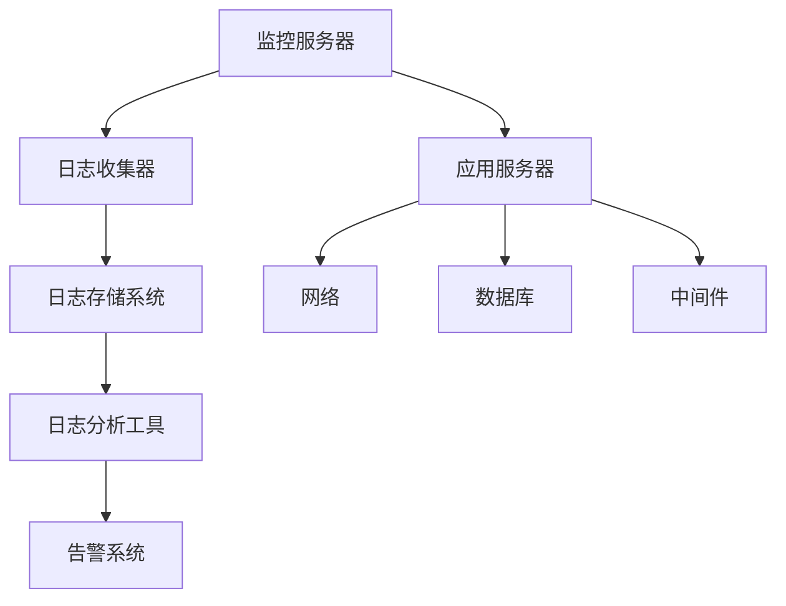
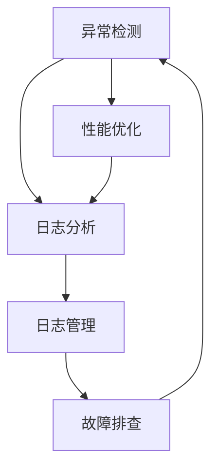
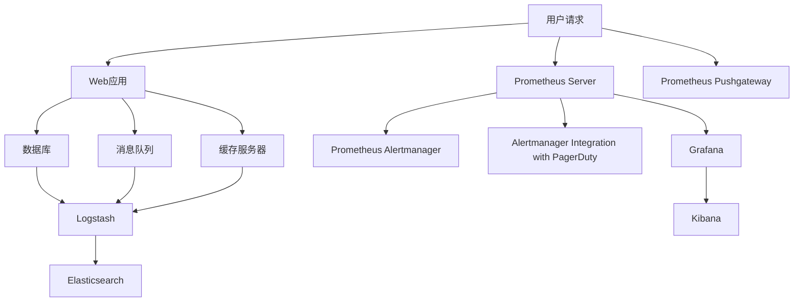

                 

### 《监控和日志管理：保持系统运行畅通》

#### 文章关键词
- 监控
- 日志管理
- 性能监控
- 异常监控
- 日志分析
- 自动化响应

#### 摘要
本文将深入探讨监控和日志管理在确保系统稳定运行中的重要性。我们将逐步分析核心概念、架构设计、监控与日志管理的联系与区别，详细介绍性能监控、异常监控和日志分析等关键技术，并通过实际项目实战展示监控和日志管理的应用。此外，还将讨论最佳实践、挑战与解决方案以及未来发展趋势，旨在为读者提供全面的技术指南。

---

### 《监控和日志管理：保持系统运行畅通》目录大纲

---

### 第一部分：监控和日志管理概述

#### 第1章：监控和日志管理的核心概念

##### 1.1.1 监控的定义与重要性

##### 1.1.2 日志管理的概念与目的

##### 1.1.3 监控和日志管理的联系与区别

##### 1.1.4 现代系统的监控与日志挑战

#### 第2章：监控和日志管理的架构

##### 2.1.1 常见的监控架构模式

##### 2.1.2 日志收集和存储架构

##### 2.1.3 监控和日志管理平台

##### 2.1.4 分布式系统的监控挑战

---

### 第二部分：监控技术详解

#### 第3章：性能监控

##### 3.1.1 系统资源监控

##### 3.1.2 应用性能监控

##### 3.1.3 伪代码：性能监控算法

##### 3.1.4 性能监控案例分析

#### 第4章：异常监控

##### 4.1.1 异常监控的定义与目标

##### 4.1.2 异常检测算法

##### 4.1.3 伪代码：异常检测算法

##### 4.1.4 异常监控案例分析

#### 第5章：日志分析

##### 5.1.1 日志分析的基本概念

##### 5.1.2 日志分析工具与技术

##### 5.1.3 伪代码：日志分析算法

##### 5.1.4 日志分析案例分析

#### 第6章：自动化响应与告警

##### 6.1.1 自动化响应的概念

##### 6.1.2 告警系统的设计与实现

##### 6.1.3 伪代码：告警触发算法

##### 6.1.4 自动化响应与告警案例分析

---

### 第三部分：监控和日志管理实战

#### 第7章：监控和日志管理项目实战

##### 7.1.1 项目背景与目标

##### 7.1.2 项目架构设计

##### 7.1.3 开发环境搭建

##### 7.1.4 源代码实现与解读

##### 7.1.5 代码解读与分析

#### 第8章：监控和日志管理最佳实践

##### 8.1.1 监控和日志管理的最佳实践

##### 8.1.2 挑战与解决方案

##### 8.1.3 未来监控和日志管理的发展趋势

---

### 附录

#### 附录A：监控和日志管理工具与资源

##### A.1.1 主流监控工具对比

##### A.1.2 日志分析工具介绍

##### A.1.3 其他相关工具资源链接

#### 附录B：常用监控和日志管理算法

##### B.1.1 性能监控算法

##### B.1.2 异常检测算法

##### B.1.3 日志分析算法

#### 附录C：参考资料与推荐阅读

##### C.1.1 推荐书籍

##### C.1.2 研究论文

##### C.1.3 在线课程和资源链接

---

### 监控和日志管理核心概念与架构

#### 监控与日志管理的定义

**监控（Monitoring）** 是指对系统、应用或服务的运行状态、性能、资源利用率等进行持续的跟踪和评估，以确保其正常运行。监控不仅包括对硬件资源（如CPU、内存、磁盘空间）的监控，还包括对软件组件（如Web服务器、数据库、应用程序）的监控。

**日志管理（Log Management）** 是指对系统产生的日志数据进行收集、存储、处理和分析的过程。日志数据通常包含系统的各种事件记录，如错误、警告、信息等，这些数据对于系统维护和故障排除至关重要。

#### 关联与区别

**关联**：监控和日志管理是相辅相成的。监控通过实时跟踪系统的状态，可以快速发现潜在问题；而日志管理则通过收集和存储历史数据，提供了追踪和诊断问题的坚实基础。

**区别**：监控更侧重于实时性和预防性，它关注系统的当前运行状态和性能；而日志管理则更侧重于历史性和诊断性，它关注系统运行过程中的详细记录和事件分析。

#### 监控架构模式

在构建监控架构时，通常会考虑以下几种模式：

1. **集中式监控**：所有监控数据都集中到一个中央监控服务器进行处理和存储。这种模式简单易部署，但可能面临单点故障和性能瓶颈的问题。

2. **分布式监控**：监控数据分散到多个收集器进行处理和存储，最后汇总到一个中央监控服务器。这种模式提高了系统的可扩展性和容错性。

3. **混合式监控**：结合集中式和分布式监控的优点，针对不同的监控需求和数据量进行灵活配置。

#### 日志收集和存储架构

日志收集和存储架构的核心目标是确保日志数据的可靠收集、存储和处理。常见的架构包括：

1. **集中式收集**：所有日志数据直接发送到一个中央日志服务器进行处理和存储。

2. **分布式收集**：日志数据通过代理或收集器发送到分布式存储系统，如Elasticsearch、Kafka等。

3. **日志聚合**：将来自多个源和收集器的日志数据进行聚合和汇总，以便于集中分析和管理。

#### 监控和日志管理平台

当前，市面上有许多成熟的监控和日志管理平台，如：

- **Prometheus**：一个开源的监控解决方案，适用于大规模分布式系统。
- **Grafana**：一个开源的数据可视化和监控平台，支持多种数据源。
- **Zabbix**：一个功能丰富的开源监控系统，支持多种监控协议。
- **ELK栈**：由Elasticsearch、Logstash和Kibana组成的开源日志分析平台。

#### 分布式系统的监控挑战

在分布式系统中，监控面临以下挑战：

1. **数据量巨大**：分布式系统产生的日志数据量通常非常庞大，需要高效的日志处理和存储架构。
2. **一致性要求**：分布式系统要求监控数据的准确性和一致性，这需要复杂的分布式算法和协议。
3. **容错性和高可用性**：分布式监控系统必须具备良好的容错性和高可用性，以应对节点故障和系统崩溃。
4. **实时性和延迟**：分布式监控需要确保监控数据的实时性和低延迟，以快速响应潜在问题。

#### Mermaid 流程图

以下是一个Mermaid流程图，展示了监控和日志管理的基本架构：



---

在下一部分，我们将深入探讨监控和日志管理的核心概念，包括监控的定义与重要性，日志管理的概念与目的，以及监控和日志管理之间的联系与区别。

---

### 第一部分：监控和日志管理概述

#### 第1章：监控和日志管理的核心概念

在当今高度复杂的IT环境中，确保系统的稳定运行和高效的性能监控已经成为企业成功的关键因素。监控和日志管理作为IT运维的基础设施，扮演着至关重要的角色。本章节将深入探讨监控和日志管理的核心概念，包括监控的定义与重要性，日志管理的概念与目的，以及监控和日志管理之间的联系与区别。

#### 1.1.1 监控的定义与重要性

**监控**，顾名思义，是指对系统、应用或服务的运行状态、性能和资源利用率进行持续的跟踪和评估。监控的目的是及时发现潜在问题，防止系统故障，优化系统性能，保障业务的连续性和稳定性。

**监控的重要性**体现在以下几个方面：

1. **预防故障**：通过实时监控，可以提前发现系统资源不足、性能瓶颈、配置错误等问题，从而采取预防措施，避免故障发生。

2. **快速响应**：当系统出现异常时，监控系统能够及时发出告警，通知相关人员快速响应，减少故障影响时间。

3. **性能优化**：通过对系统性能的持续监控，可以收集大量的性能数据，用于分析和优化系统配置，提高整体性能。

4. **合规性要求**：在许多行业中，如金融、医疗等，监控和日志管理是合规性要求的一部分，确保系统按照规定标准运行。

5. **业务连续性**：对于关键业务系统，监控是确保业务连续性的重要手段，通过有效的监控和日志管理，可以快速恢复系统，减少业务中断。

**监控的核心概念**包括：

- **性能监控**：跟踪系统资源使用情况（如CPU、内存、磁盘空间等）和应用程序性能（如响应时间、吞吐量等）。
- **异常监控**：检测系统中的异常行为，如错误、警告、服务中断等。
- **健康检查**：定期检查系统的健康状态，包括服务状态、网络连接等。

#### 1.1.2 日志管理的概念与目的

**日志管理**是指对系统产生的日志数据进行收集、存储、处理和分析的过程。日志数据通常包含系统的各种事件记录，如错误、警告、信息等。日志管理的主要目的是：

- **故障排查**：通过分析日志数据，可以快速定位系统中的故障点，进行故障排除。
- **性能优化**：日志数据提供了系统性能的详细记录，有助于分析和优化系统性能。
- **安全审计**：日志数据记录了系统中的所有操作，对于安全审计和事故调查具有重要意义。
- **合规性**：许多法律法规要求企业保存系统日志，以备后续审计和调查。

**日志管理的核心概念**包括：

- **日志收集**：从不同的系统组件和设备中收集日志数据。
- **日志存储**：将收集到的日志数据存储到集中化的存储系统中。
- **日志处理**：对日志数据进行分析、过滤、转换等处理，以便于后续分析。
- **日志分析**：使用工具和技术对日志数据进行深入分析，提取有用信息。

**日志管理的目标**是：

- **确保日志数据的完整性和准确性**：确保所有重要的系统事件都被记录下来，并且不会丢失。
- **提高日志检索效率**：优化日志存储和查询机制，以便快速检索和分析日志数据。
- **保障日志的安全性**：防止日志数据被未授权访问，确保日志数据的机密性和完整性。

#### 1.1.3 监控和日志管理的联系与区别

**监控和日志管理是相辅相成的**。监控提供了系统的实时状态和性能数据，而日志管理则提供了系统运行的历史记录和详细信息。两者的联系体现在：

- **监控数据来源**：监控数据通常来源于系统日志，通过日志分析可以生成监控数据。
- **异常检测**：监控系统通常依赖日志数据来检测异常行为，日志管理提供了异常检测的基础。
- **故障排查**：监控和日志管理共同作用，可以帮助运维人员快速定位故障点和故障原因。

**监控和日志管理的区别**在于：

- **实时性**：监控关注系统的实时状态和性能，日志管理则侧重于历史数据和事件记录。
- **目的**：监控的目的是预防问题，日志管理的目的是追踪和诊断问题。
- **数据使用**：监控使用实时数据来评估系统性能和状态，日志管理则使用历史数据来进行分析和优化。

**监控和日志管理的联系与区别可以用以下方式概括**：



#### 1.1.4 现代系统的监控与日志挑战

随着云计算、容器化、微服务架构的普及，现代系统的监控与日志管理面临着新的挑战：

- **分布式系统**：现代系统通常由多个分布式组件组成，监控和日志管理需要处理分布式环境下的复杂性问题。
- **海量数据**：分布式系统产生的日志数据量巨大，如何高效收集、存储和分析海量日志数据是一个挑战。
- **异构环境**：企业可能使用多种不同类型的系统和工具，监控和日志管理需要支持异构环境的兼容性和集成。
- **实时性要求**：现代系统对监控和日志管理的实时性要求越来越高，需要快速响应和处理异常事件。

为了应对这些挑战，企业需要采用先进的监控和日志管理技术，如：

- **云原生监控**：利用云服务提供的监控工具和API，实现对容器和微服务的监控。
- **日志聚合和搜索**：使用分布式日志聚合工具（如Logstash、Fluentd）和可搜索存储系统（如Elasticsearch），实现对海量日志数据的快速检索和分析。
- **自动化和智能化**：通过机器学习和人工智能技术，自动识别异常模式和趋势，提高监控和日志管理的效率和准确性。

### 小结

监控和日志管理是现代IT运维不可或缺的一部分。通过有效的监控和日志管理，企业可以确保系统的稳定运行，提高业务连续性和可靠性。在下一部分，我们将详细探讨监控和日志管理的架构设计，包括常见的监控架构模式、日志收集和存储架构、监控和日志管理平台以及分布式系统的监控挑战。

---

### 第一部分：监控和日志管理概述

#### 第2章：监控和日志管理的架构

在现代IT环境中，监控和日志管理架构的设计对于确保系统的稳定运行和高效性能至关重要。本章将详细探讨监控和日志管理的架构设计，包括常见的监控架构模式、日志收集和存储架构、监控和日志管理平台，以及分布式系统的监控挑战。

#### 2.1.1 常见的监控架构模式

监控架构模式的选择取决于系统的规模、复杂度和业务需求。以下是几种常见的监控架构模式：

1. **集中式监控**：
   - **定义**：集中式监控架构将所有监控数据集中到一个中央监控服务器进行处理和存储。
   - **优点**：部署简单，数据统一，易于管理和维护。
   - **缺点**：单点故障风险高，可扩展性差，可能面临性能瓶颈。
   - **适用场景**：小型或简单系统，监控需求不复杂。

2. **分布式监控**：
   - **定义**：分布式监控架构将监控数据分散到多个收集器进行处理和存储，最后汇总到一个中央监控服务器。
   - **优点**：提高了系统的可扩展性和容错性，能够处理大规模分布式系统。
   - **缺点**：架构复杂，部署和维护成本高，数据一致性和同步问题。
   - **适用场景**：大规模分布式系统，需要高可用性和可扩展性。

3. **混合式监控**：
   - **定义**：混合式监控架构结合了集中式和分布式监控的优点，针对不同的监控需求和数据量进行灵活配置。
   - **优点**：灵活性好，可以平衡集中式和分布式监控的优缺点，适应不同规模和复杂度的系统。
   - **缺点**：架构设计复杂，需要更精细的规划和管理。
   - **适用场景**：企业级系统，需要根据具体需求进行监控架构的优化。

#### 2.1.2 日志收集和存储架构

日志收集和存储架构是监控和日志管理系统的核心部分，负责从各个系统组件和设备中收集日志数据，并确保数据的可靠存储和处理。以下是常见的日志收集和存储架构：

1. **集中式收集**：
   - **定义**：集中式收集架构将所有日志数据直接发送到一个中央日志服务器进行处理和存储。
   - **优点**：架构简单，易于部署和管理，数据统一。
   - **缺点**：单点故障风险高，可能面临性能瓶颈。
   - **适用场景**：小型或简单系统，监控需求不复杂。

2. **分布式收集**：
   - **定义**：分布式收集架构通过代理或收集器将日志数据发送到分布式存储系统，如Elasticsearch、Kafka等。
   - **优点**：提高了系统的可扩展性和容错性，能够处理海量日志数据。
   - **缺点**：架构复杂，需要更多的维护和管理。
   - **适用场景**：大规模分布式系统，需要高可用性和可扩展性。

3. **日志聚合**：
   - **定义**：日志聚合架构将来自多个源和收集器的日志数据进行聚合和汇总，以便于集中分析和管理。
   - **优点**：提高了日志收集和存储的效率，简化了日志管理。
   - **缺点**：需要额外的聚合处理和存储资源。
   - **适用场景**：需要将来自不同系统和设备的日志数据进行统一管理和分析。

#### 2.1.3 监控和日志管理平台

监控和日志管理平台是集成多种监控和日志管理功能的软件系统，可以帮助企业更有效地监控和管理其IT基础设施。以下是几种常见的监控和日志管理平台：

1. **Prometheus**：
   - **定义**：Prometheus是一个开源的监控解决方案，适用于大规模分布式系统。
   - **优点**：高度可扩展，支持多种数据源和告警机制，具有强大的数据查询语言。
   - **缺点**：存储能力有限，不适合处理海量日志数据。
   - **适用场景**：大规模分布式系统，需要灵活的数据查询和告警功能。

2. **Grafana**：
   - **定义**：Grafana是一个开源的数据可视化和监控平台，支持多种数据源。
   - **优点**：提供了丰富的可视化仪表板，易于使用和定制。
   - **缺点**：监控功能相对较弱，主要用于数据可视化和日志分析。
   - **适用场景**：需要强大的数据可视化和日志分析功能。

3. **Zabbix**：
   - **定义**：Zabbix是一个功能丰富的开源监控系统，支持多种监控协议。
   - **优点**：支持多种监控方式，包括SNMP、ICMP、TCP等，适合中小型企业。
   - **缺点**：扩展性较差，不适合大规模分布式系统。
   - **适用场景**：中小型企业，需要基本监控功能。

4. **ELK栈**：
   - **定义**：ELK栈是由Elasticsearch、Logstash和Kibana组成的开源日志分析平台。
   - **优点**：强大的日志收集、存储和分析功能，适合处理海量日志数据。
   - **缺点**：学习曲线较陡，需要一定的技术积累。
   - **适用场景**：需要高性能日志处理和日志分析功能。

#### 2.1.4 分布式系统的监控挑战

分布式系统在监控和日志管理方面面临以下挑战：

1. **数据量巨大**：
   - 分布式系统通常由多个节点组成，每个节点都会产生大量的日志数据。如何高效收集、存储和分析海量日志数据是一个巨大的挑战。

2. **一致性要求**：
   - 分布式系统要求监控数据的准确性和一致性。在分布式环境中，数据可能在不同节点之间同步，如何确保数据的一致性和准确性是一个重要问题。

3. **容错性和高可用性**：
   - 分布式监控系统必须具备良好的容错性和高可用性，以应对节点故障和系统崩溃。如何设计一个能够自动恢复和切换的监控架构是一个关键问题。

4. **实时性要求**：
   - 现代分布式系统对监控和日志管理的实时性要求越来越高。如何快速响应和处理异常事件，保证监控数据的实时性和低延迟是一个重要挑战。

为了应对这些挑战，分布式系统通常采用以下策略：

1. **分布式日志收集**：通过分布式日志收集器，将日志数据收集到分布式存储系统中，如Elasticsearch、Kafka等。

2. **日志聚合和搜索**：使用分布式日志聚合工具，将来自不同节点和收集器的日志数据进行聚合和汇总，提供高效的日志检索和分析功能。

3. **自动化和智能化**：通过机器学习和人工智能技术，自动识别异常模式和趋势，提高监控和日志管理的效率和准确性。

4. **高可用性和容灾**：设计分布式监控架构时，考虑高可用性和容灾备份策略，确保监控系统的稳定性和可靠性。

### 小结

监控和日志管理的架构设计对于确保系统的稳定运行和高效性能至关重要。选择合适的监控架构模式、日志收集和存储架构，以及使用高效的监控和日志管理平台，可以帮助企业有效地应对分布式系统的监控挑战。在下一部分，我们将详细探讨监控技术，包括性能监控、异常监控和日志分析，以及自动化响应与告警。

---

### 第二部分：监控技术详解

#### 第3章：性能监控

性能监控是监控技术中的一个重要方面，它关注的是系统或应用在运行过程中的性能指标，如响应时间、处理能力、资源利用率等。性能监控的目的是确保系统在正常运行状态下提供预期的性能水平，并及时发现和处理性能问题。本章将详细探讨性能监控的关键技术，包括系统资源监控、应用性能监控、性能监控算法和案例分析。

#### 3.1.1 系统资源监控

系统资源监控是指对系统硬件和软件资源的使用情况进行监控。这包括对CPU、内存、磁盘空间、网络带宽等系统资源的使用情况的监控。

1. **CPU监控**：CPU监控关注CPU的利用率、负载均衡、核心温度等指标。通过监控CPU的使用情况，可以及时发现CPU过载或性能瓶颈问题。

2. **内存监控**：内存监控关注内存的利用率、内存交换率等指标。通过监控内存的使用情况，可以确保系统有足够的内存资源来运行应用程序。

3. **磁盘监控**：磁盘监控关注磁盘的利用率、读写速度、I/O等待时间等指标。通过监控磁盘的使用情况，可以及时发现磁盘性能问题，如磁盘满、磁盘读写延迟等。

4. **网络监控**：网络监控关注网络的带宽利用率、网络延迟、丢包率等指标。通过监控网络的使用情况，可以确保网络连接的稳定性和性能。

**监控工具**：常见的系统资源监控工具包括Prometheus、Nagios、Zabbix等。这些工具通常支持多种监控协议和数据采集方式，可以实现对各种系统资源的监控。

#### 3.1.2 应用性能监控

应用性能监控是指对应用程序在运行过程中的性能指标进行监控，如响应时间、吞吐量、错误率等。应用性能监控的目的是确保应用程序能够提供预期的性能水平，并快速识别和处理性能问题。

1. **响应时间监控**：响应时间监控关注应用程序对用户请求的响应时间。通过监控响应时间，可以及时发现系统性能瓶颈，如数据库查询慢、网络延迟等。

2. **吞吐量监控**：吞吐量监控关注应用程序在单位时间内处理请求的数量。通过监控吞吐量，可以评估系统的负载能力和性能。

3. **错误率监控**：错误率监控关注应用程序在处理请求过程中产生的错误数量。通过监控错误率，可以及时发现应用程序的代码错误或配置问题。

**监控工具**：常见的应用性能监控工具包括New Relic、AppDynamics、Dynatrace等。这些工具通常提供丰富的监控指标和可视化报表，可以实现对应用程序的全方位监控。

#### 3.1.3 伪代码：性能监控算法

以下是一个简单的性能监控算法的伪代码示例，该算法用于监控系统的响应时间，并计算移动平均响应时间。

```plaintext
// 初始化
response_times = []
window_size = 5
alpha = 0.2

// 收集响应时间数据
while True:
    response_time = getCurrentResponseTime()
    response_times.append(response_time)
    
    // 移动平均响应时间计算
    if len(response_times) > window_size:
        window_avg = sum(response_times[-window_size:]) / window_size
        print("Current Moving Average Response Time:", window_avg)
        
        // 指数加权移动平均响应时间计算
        EMA = alpha * response_time + (1 - alpha) * EMA
        print("Current Exponential Moving Average Response Time:", EMA)

    // 其他监控逻辑，如告警触发等
    if window_avg > threshold:
        triggerAlert("High Response Time Detected")
```

在这个示例中，我们使用移动平均算法和指数加权移动平均算法来计算响应时间的平均值。移动平均算法通过计算最近几个时间点的响应时间平均值来消除短期波动，而指数加权移动平均算法则通过给不同时间点的响应时间不同的权重来更准确地反映当前系统的性能。

#### 3.1.4 性能监控案例分析

以下是一个性能监控案例，用于监控一个电子商务网站的性能。

1. **项目背景**：该电子商务网站每天处理数百万次请求，涉及用户登录、商品浏览、购物车操作、订单处理等。

2. **监控指标**：响应时间、吞吐量、错误率、数据库查询性能等。

3. **监控工具**：使用Prometheus进行系统资源监控，使用New Relic进行应用性能监控。

4. **监控流程**：
   - **数据收集**：Prometheus从系统资源（如CPU、内存、磁盘、网络）收集数据，New Relic从Web应用收集性能数据。
   - **数据处理**：Prometheus和New Relic对收集的数据进行实时处理和分析。
   - **性能评估**：计算移动平均响应时间和指数加权移动平均响应时间，评估系统的性能。
   - **告警触发**：当响应时间超过阈值时，触发告警。

5. **监控结果**：
   - **正常情况下**：响应时间在100-200毫秒之间，吞吐量在每分钟1000次请求左右，错误率低于1%。
   - **异常情况下**：响应时间超过300毫秒，吞吐量下降，错误率上升。

通过上述监控流程，管理员可以及时发现系统的性能问题，并采取相应的优化措施，如调整数据库查询、优化服务器配置、增加缓存等。

### 小结

性能监控是确保系统或应用提供预期性能水平的关键技术。通过系统资源监控和应用性能监控，可以实时了解系统的运行状况，及时发现和处理性能问题。本章介绍的性能监控算法和案例分析为实际应用提供了参考。在下一章，我们将探讨异常监控，包括异常监控的定义与目标、异常检测算法、异常监控案例分析，以及自动化响应与告警。

---

### 第二部分：监控技术详解

#### 第4章：异常监控

异常监控是监控技术中的重要组成部分，它关注系统或应用的异常行为，如错误、警告、服务中断等。异常监控的目的是及时发现和处理系统中的异常情况，确保系统的稳定运行和业务连续性。本章将详细探讨异常监控的定义与目标、异常检测算法、伪代码示例，以及实际案例的分析。

#### 4.1.1 异常监控的定义与目标

**异常监控（Anomaly Detection）** 是指在系统或应用运行过程中，检测出不符合预期或正常模式的行为。异常监控的目标包括：

1. **及时发现异常**：通过实时监控，能够快速发现系统中的异常行为，如错误、警告、服务中断等。
2. **定位异常原因**：通过分析异常数据，能够定位异常发生的原因，帮助运维人员或开发人员快速解决问题。
3. **预防潜在问题**：通过监控系统的异常行为，可以预防潜在问题的发生，确保系统的稳定性和可靠性。
4. **优化系统性能**：通过对异常行为的分析，可以找出系统性能瓶颈，优化系统配置和架构，提高整体性能。

**异常监控在系统运维中的应用**：

- **运维自动化**：通过异常监控，实现自动化故障检测和告警，减少人为干预，提高运维效率。
- **安全防护**：通过监控系统的异常行为，及时发现并应对安全威胁，如恶意攻击、非法访问等。
- **业务连续性**：通过监控系统的异常行为，确保关键业务系统的连续性和稳定性，减少业务中断时间。

#### 4.1.2 异常检测算法

异常检测算法是异常监控的核心技术，用于识别和分类系统中的异常行为。常见的异常检测算法包括：

1. **基于阈值的异常检测**：通过设定阈值，当监控指标超过或低于阈值时，判断为异常。
2. **基于统计的异常检测**：利用统计方法，如标准差、移动平均等，对监控数据进行分析，判断异常。
3. **基于机器学习的异常检测**：通过训练模型，对正常行为和异常行为进行区分。

**基于阈值的异常检测算法**：

- **原理**：设定一个阈值，当监控指标超过或低于阈值时，视为异常。
- **优点**：简单易懂，易于实现。
- **缺点**：对于阈值的选择依赖经验，容易受到噪声影响。

**基于统计的异常检测算法**：

- **原理**：利用统计方法，如标准差、移动平均等，对监控数据进行异常检测。
- **优点**：能够处理噪声数据，对异常行为的检测更加准确。
- **缺点**：对于时间序列数据的处理能力有限。

**基于机器学习的异常检测算法**：

- **原理**：通过训练模型，对正常行为和异常行为进行区分。
- **优点**：能够处理复杂的监控数据，自适应性和鲁棒性更强。
- **缺点**：需要大量训练数据和计算资源，实现复杂。

#### 4.1.3 伪代码：异常检测算法

以下是一个简单的基于阈值的异常检测算法的伪代码示例：

```plaintext
// 初始化
threshold = 10
data = [5, 10, 15, 20, 25, 30, 35, 40, 45, 50]

// 异常检测
for value in data:
    if value > threshold or value < threshold:
        print("Anomaly Detected:", value)
    else:
        print("Normal:", value)
```

以下是一个简单的基于统计的异常检测算法的伪代码示例：

```plaintext
// 初始化
data = [5, 10, 15, 20, 25, 30, 35, 40, 45, 50]
mean = calculateMean(data)
std_dev = calculateStandardDeviation(data)
threshold = mean + 2 * std_dev

// 异常检测
for value in data:
    z_score = (value - mean) / std_dev
    if abs(z_score) > 3:
        print("Anomaly Detected:", value)
    else:
        print("Normal:", value)
```

#### 4.1.4 异常监控案例分析

以下是一个异常监控的实际案例，用于监控一个Web服务器的带宽使用情况。

1. **项目背景**：该Web服务器每天处理大量用户请求，带宽使用情况直接影响服务器的响应速度和用户体验。

2. **监控指标**：带宽使用率。

3. **监控工具**：使用Prometheus进行异常监控。

4. **监控流程**：
   - **数据收集**：Prometheus从服务器中收集带宽使用数据。
   - **数据处理**：计算带宽使用率的均值和标准差。
   - **异常检测**：使用基于统计的异常检测算法，判断带宽使用率是否超过阈值。

5. **监控结果**：
   - **正常情况下**：带宽使用率在正常范围内，不超过阈值。
   - **异常情况下**：带宽使用率超过阈值，触发告警。

6. **异常处理**：根据异常监控结果，管理员可以进一步检查网络连接、服务器负载等情况，找出异常原因，并采取相应的优化措施。

通过上述监控流程，可以有效发现Web服务器的异常带宽使用，并确保服务的稳定性和可靠性。

### 小结

异常监控是确保系统稳定运行和业务连续性的重要技术。通过定义与目标、异常检测算法和实际案例分析，我们可以了解如何及时发现和处理系统中的异常行为。在下一章，我们将探讨日志分析，包括日志分析的基本概念、日志分析工具与技术、日志分析算法以及案例分析。

---

### 第二部分：监控技术详解

#### 第5章：日志分析

日志分析是监控和日志管理的重要环节，通过对系统产生的日志数据进行深入分析，可以揭示系统的运行状态、潜在问题、用户行为等信息。本章将详细探讨日志分析的基本概念、日志分析工具与技术、日志分析算法，以及实际案例分析。

#### 5.1.1 日志分析的基本概念

**日志分析（Log Analysis）** 是指对系统产生的日志数据进行收集、处理、分析和报告的过程。日志数据通常记录了系统的各种事件，如错误、警告、信息、访问日志等。日志分析的基本概念包括：

1. **日志数据收集**：从不同的系统和设备中收集日志数据，通常使用日志收集工具（如Logstash、Fluentd）。
2. **日志数据处理**：对收集到的日志数据进行过滤、解析和标准化处理，以便于后续分析。
3. **日志数据存储**：将处理后的日志数据存储到数据库或文件系统中，便于长期保存和查询。
4. **日志数据分析**：使用日志分析工具和技术，对存储的日志数据进行深入分析，提取有用的信息。
5. **日志数据报告**：将分析结果以图表、报表等形式呈现，供系统管理员、开发人员等查看。

#### 5.1.2 日志分析工具与技术

日志分析工具和技术是进行日志分析的关键。以下是一些常见的日志分析工具和技术：

1. **Elasticsearch**：
   - **定义**：Elasticsearch是一个高性能、可扩展的全文搜索引擎，适用于大规模日志数据的存储和检索。
   - **优点**：强大的搜索功能，高吞吐量，易于扩展。
   - **缺点**：学习曲线较陡，需要一定的技术积累。

2. **Kibana**：
   - **定义**：Kibana是一个开源的数据可视化和分析平台，与Elasticsearch集成，提供丰富的可视化仪表板和报告。
   - **优点**：易于使用，强大的可视化功能，与Elasticsearch无缝集成。
   - **缺点**：数据处理能力相对有限，不适合处理海量日志数据。

3. **Logstash**：
   - **定义**：Logstash是一个开源的数据处理和传输工具，用于将日志数据从各种源（如Web服务器、数据库等）收集、处理并传输到Elasticsearch。
   - **优点**：强大的数据处理功能，支持多种数据源和输出。
   - **缺点**：配置复杂，需要一定的技术知识。

4. **其他日志分析工具**：如Splunk、Grok、AWStats等，也广泛应用于日志分析领域。

#### 5.1.3 伪代码：日志分析算法

以下是一个简单的日志分析算法的伪代码示例，该算法用于分析日志数据中的访问频率和错误率。

```plaintext
// 初始化
log_data = []
access_logs = ["200", "404", "200", "500", "200", "404"]
error_logs = ["500", "404", "500", "404", "200"]

// 收集日志数据
for log in access_logs + error_logs:
    log_data.append(log)

// 计算访问频率和错误率
access_count = 0
error_count = 0
for log in log_data:
    if log == "200":
        access_count += 1
    elif log == "500" or log == "404":
        error_count += 1

access_rate = access_count / len(log_data)
error_rate = error_count / len(log_data)

print("Access Rate:", access_rate)
print("Error Rate:", error_rate)
```

#### 5.1.4 日志分析案例分析

以下是一个日志分析的实际案例，用于监控一个电子商务网站的访问日志。

1. **项目背景**：该电子商务网站每天处理大量用户请求，通过分析访问日志可以了解用户行为和系统性能。

2. **监控指标**：访问频率、错误率、用户访问路径等。

3. **监控工具**：使用ELK栈（Elasticsearch、Logstash、Kibana）进行日志分析。

4. **监控流程**：
   - **数据收集**：Logstash从Web服务器收集访问日志，并传输到Elasticsearch。
   - **数据处理**：使用Logstash的Grok过滤器解析日志数据，提取有用的字段。
   - **日志分析**：使用Kibana创建可视化仪表板，分析访问频率、错误率、用户访问路径等。
   - **日志报告**：生成图表、报表，供系统管理员和开发人员查看。

5. **监控结果**：
   - **访问频率**：分析显示，用户访问最多的页面是产品列表页，其次是商品详情页。
   - **错误率**：分析显示，最常见的错误是404页面未找到，其次是500内部服务器错误。
   - **用户访问路径**：分析显示，用户通常在访问产品列表页后，会浏览多个商品详情页，然后进行购物车操作。

6. **优化建议**：根据日志分析结果，网站管理员可以优化页面加载速度，改善404页面未找到的错误，提高用户体验。

通过上述监控流程，电子商务网站可以深入了解用户行为和系统性能，从而进行针对性的优化和改进。

### 小结

日志分析是监控和日志管理的重要组成部分，通过对日志数据的深入分析，可以揭示系统的运行状态、用户行为和潜在问题。本章介绍了日志分析的基本概念、工具与技术，以及实际案例分析，为读者提供了详细的日志分析指导。在下一章，我们将探讨自动化响应与告警，包括自动化响应的概念、告警系统的设计与实现、告警触发算法以及实际案例分析。

---

### 第二部分：监控技术详解

#### 第6章：自动化响应与告警

在系统监控和日志管理中，自动化响应与告警是提高运维效率、减少人工干预的关键技术。自动化响应能够在检测到异常时自动执行预定的操作，而告警则通过通知相关人员提醒他们采取行动。本章将详细探讨自动化响应与告警的概念、设计、实现和实际案例分析。

#### 6.1.1 自动化响应的概念

**自动化响应（Automated Response）** 是指在监控系统中检测到异常时，系统能够自动执行预定的操作，以减轻人工干预，提高响应速度和处理效率。自动化响应通常包括以下步骤：

1. **异常检测**：监控系统实时检测系统状态和性能，当检测到异常时触发响应。
2. **告警生成**：系统生成告警信息，通知相关人员。
3. **自动化处理**：系统自动执行预定的操作，如重启服务、扩容资源、执行脚本等。
4. **结果反馈**：系统记录自动化处理的结果，并进行反馈，以便后续分析和优化。

**自动化响应的优势**：

- **提高响应速度**：自动化响应可以立即执行操作，无需人工干预，减少故障处理时间。
- **减少人力成本**：自动化响应减轻了运维人员的工作负担，提高了工作效率。
- **确保一致性**：自动化响应确保了操作的标准化和一致性，减少了人为错误。
- **可扩展性**：自动化响应系统可以轻松扩展，适应不同规模和复杂度的系统。

#### 6.1.2 告警系统的设计与实现

**告警系统（Alerting System）** 是自动化响应的核心组件，负责检测异常、生成告警信息并通知相关人员。告警系统的设计与实现包括以下几个关键环节：

1. **告警规则配置**：定义告警规则，包括监控指标、阈值、告警条件、告警类型等。
2. **告警数据收集**：监控系统实时收集系统状态和性能数据，并与告警规则进行比对。
3. **告警处理**：当检测到异常时，系统生成告警信息，并发送通知。
4. **通知渠道**：支持多种通知渠道，如电子邮件、短信、即时通讯工具等。
5. **告警记录与跟踪**：记录告警信息和处理结果，以便后续查询和分析。

**告警系统的设计原则**：

- **灵活性**：告警规则应具有灵活性，能够适应不同监控场景和需求。
- **准确性**：告警系统应具有较高的准确性，减少误报和漏报。
- **可扩展性**：告警系统应支持横向扩展，能够处理大规模监控数据。
- **可靠性**：告警系统应具有高可用性和稳定性，确保告警信息的准确传递。

#### 6.1.3 伪代码：告警触发算法

以下是一个简单的告警触发算法的伪代码示例：

```plaintext
// 初始化
threshold = 80 // CPU利用率阈值
alert_threshold = 3 // 连续超过阈值的次数
current_cpu_usage = 0

// 告警触发算法
while True:
    current_cpu_usage = getCPUUsage()
    if current_cpu_usage > threshold:
        alert_count += 1
        if alert_count >= alert_threshold:
            sendAlert("High CPU Usage Detected")
            resetAlertCount()
    else:
        alert_count = 0

// 重置告警计数
def resetAlertCount():
    global alert_count
    alert_count = 0
```

在这个示例中，当CPU利用率连续超过阈值3次时，系统将发送告警信息。

#### 6.1.4 自动化响应与告警案例分析

以下是一个自动化响应与告警的实际案例，用于监控一个云服务器的性能。

1. **项目背景**：该云服务器运行关键业务，性能稳定性和可靠性至关重要。

2. **监控指标**：CPU利用率、内存使用率、磁盘I/O、网络带宽等。

3. **监控工具**：使用Prometheus进行性能监控，使用PagerDuty进行告警通知和自动化响应。

4. **监控流程**：
   - **数据收集**：Prometheus从云服务器收集性能数据。
   - **告警规则配置**：配置Prometheus的告警规则，设置阈值和条件。
   - **告警处理**：Prometheus检测到异常时，生成告警信息并发送通知到PagerDuty。
   - **自动化响应**：PagerDuty根据告警信息，自动执行预定的响应操作，如重启服务、扩容资源等。

5. **监控结果**：
   - **告警通知**：当CPU利用率超过90%时，系统会发送告警通知。
   - **自动化响应**：系统自动执行重启服务操作，以降低CPU负载。
   - **反馈与优化**：监控系统和告警系统记录处理结果，管理员对告警数据进行分析，优化服务器配置。

6. **优化建议**：根据监控和告警数据，管理员可以进一步优化服务器资源分配、优化应用程序代码、提高系统性能。

通过上述监控流程，云服务器的性能稳定性得到了显著提升，运维效率也得到了提高。

### 小结

自动化响应与告警是系统监控和日志管理的重要组成部分，通过自动化响应可以快速处理异常，减少人工干预，提高运维效率。本章介绍了自动化响应与告警的概念、设计、实现和实际案例分析，为读者提供了全面的指导。在下一章，我们将探讨监控和日志管理项目实战，包括项目背景、架构设计、开发环境搭建、源代码实现和解读。

---

### 第三部分：监控和日志管理实战

#### 第7章：监控和日志管理项目实战

在实际应用中，监控和日志管理项目不仅需要理论支持，更需要实践验证。本章将通过一个具体的监控和日志管理项目，详细描述项目的背景、架构设计、开发环境搭建、源代码实现与解读，以及代码解读与分析。这个项目旨在展示如何在实际环境中部署和使用监控和日志管理系统，以提高系统运行的透明度和可管理性。

#### 7.1.1 项目背景与目标

项目名称：电商平台监控系统

**背景**：该电商平台每天处理数百万次的用户请求，涵盖了商品展示、购物车管理、订单处理等多个环节。为了确保平台的高可用性和高性能，需要进行全面的监控和日志管理。

**目标**：
1. **性能监控**：实时监控服务器资源使用情况（如CPU、内存、磁盘空间）和应用程序性能（如响应时间、吞吐量）。
2. **日志管理**：收集并分析平台产生的各类日志，包括应用日志、访问日志、错误日志等，以便进行故障排查和性能优化。
3. **告警与自动化响应**：当系统出现性能瓶颈或故障时，自动触发告警，并执行预定的自动化响应操作，如重启服务、扩容资源等。

#### 7.1.2 项目架构设计

**架构设计**：该项目采用分布式监控架构，结合Prometheus、Grafana、Elasticsearch、Kibana等开源工具，实现了一个集性能监控、日志管理和告警于一体的监控系统。

1. **数据采集层**：使用Prometheus Server和Pushgateway收集服务器和应用指标数据。
2. **数据处理层**：使用Grafana Agent和Prometheus Pushjob将数据推送到Prometheus Server。
3. **数据存储层**：使用Elasticsearch存储日志数据，并使用Kibana进行日志数据的可视化分析。
4. **日志处理层**：使用Logstash进行日志数据的收集、处理和存储。
5. **告警与响应层**：使用Prometheus Alertmanager和PagerDuty实现告警通知和自动化响应。

**架构图**：



#### 7.1.3 开发环境搭建

**环境准备**：
1. **操作系统**：Ubuntu 20.04 LTS
2. **硬件要求**：至少2核CPU，4GB内存，10GB磁盘空间
3. **软件要求**：Java 11、Python 3、Node.js 12、Elasticsearch 7.x、Kibana 7.x、Logstash 7.x、Prometheus 2.36.0、Grafana 9.0.0

**安装步骤**：

1. **安装Java 11**：

   ```bash
   sudo apt update
   sudo apt install openjdk-11-jdk
   java -version
   ```

2. **安装Python 3**：

   ```bash
   sudo apt install python3
   python3 --version
   ```

3. **安装Node.js 12**：

   ```bash
   sudo apt install npm
   npm install -g npm
   npm install -g n
   n 12
   node -v
   ```

4. **安装Elasticsearch**：

   ```bash
   wget https://artifacts.elastic.co/downloads/elasticsearch/elasticsearch-7.17.2-amd64.deb
   sudo dpkg -i elasticsearch-7.17.2-amd64.deb
   sudo /etc/init.d/elasticsearch start
   sudo /etc/init.d/elasticsearch status
   ```

5. **安装Kibana**：

   ```bash
   wget https://artifacts.elastic.co/downloads/kibana/kibana-7.17.2-linux-x86_64.deb
   sudo dpkg -i kibana-7.17.2-linux-x86_64.deb
   sudo /etc/init.d/kibana start
   sudo /etc/init.d/kibana status
   kibana
   ```

6. **安装Logstash**：

   ```bash
   wget https://artifacts.elastic.co/downloads/logstash/logstash-7.17.2-x86_64.rpm
   sudo rpm -ivh logstash-7.17.2-x86_64.rpm
   sudo /etc/init.d/logstash start
   sudo /etc/init.d/logstash status
   ```

7. **安装Prometheus**：

   ```bash
   wget https://github.com/prometheus/prometheus/releases/download/v2.36.0/prometheus-2.36.0.linux-amd64.tar.gz
   tar xvfz prometheus-2.36.0.linux-amd64.tar.gz
   cd prometheus-2.36.0.linux-amd64
   ./prometheus --config.file=config/prometheus.yml &
   ```

8. **安装Grafana**：

   ```bash
   npm install -g grafana-cli
   grafana-server install
   grafana-server start
   ```

9. **配置Prometheus与Grafana集成**：

   - 配置Prometheus配置文件`prometheus.yml`，添加Grafana数据源。
   - 配置Grafana，添加Prometheus数据源，创建仪表板。

#### 7.1.4 源代码实现与解读

**源代码实现**：以下代码片段展示了如何配置Prometheus监控和Grafana仪表板。

1. **Prometheus配置文件（prometheus.yml）**：

```yaml
global:
  scrape_interval: 15s
  evaluation_interval: 15s

scrape_configs:
  - job_name: 'prometheus'
    static_configs:
      - targets: ['localhost:9090']
  - job_name: 'webapp'
    static_configs:
      - targets: ['webapp:8080']
    metrics_path: '/metrics'
    scrape_interval: 10s
```

**解读**：该配置文件定义了两个监控作业：`prometheus`和`webapp`。`prometheus`作业监控自身，而`webapp`作业监控Web应用程序。每个作业都指定了目标地址和指标路径，并设置了scrape_interval，即数据收集间隔。

2. **Grafana仪表板配置（dashboard.json）**：

```json
{
  "title": "Web App Performance",
  "time": {
    "from": "now-1h",
    "to": "now"
  },
  "panels": [
    {
      "title": "CPU Usage",
      "type": "graph",
      " datasource": "Prometheus",
      "requests": [
        {
          "refId": "A",
          "query": "avg(rate(curl_http_requests_total{code=\"200\"}[5m]))",
          "interval": "30s",
          "legendFormat": "CPU Usage"
        }
      ]
    },
    {
      "title": "Response Time",
      "type": "graph",
      " datasource": "Prometheus",
      "requests": [
        {
          "refId": "B",
          "query": "avg(rate(curl_http_request_duration_seconds_sum{code=\"200\"}[5m])) / avg(rate(curl_http_request_duration_seconds_count{code=\"200\"}[5m]))",
          "interval": "30s",
          "legendFormat": "Response Time (ms)"
        }
      ]
    }
  ]
}
```

**解读**：该仪表板包含两个面板：CPU使用率和响应时间。每个面板都使用Prometheus数据源，并定义了查询语句来获取相应的监控数据。数据以图表形式展示，帮助管理员实时了解系统的性能状况。

#### 7.1.5 代码解读与分析

**Logstash配置文件（logstash.conf）**：

```conf
input {
  file {
    path => "/var/log/webapp/*.log"
    type => "webapp_log"
  }
}

filter {
  if [type] == "webapp_log" {
    grok {
      match => { "message" => "%{TIMESTAMP_ISO8601:timestamp}\t%{WORD:level}\t%{DATA:message}" }
    }
    date {
      match => [ "timestamp", "ISO8601" ]
    }
  }
}

output {
  if [type] == "webapp_log" {
    elasticsearch {
      hosts => ["localhost:9200"]
      index => "webapp_log-%{+YYYY.MM.dd}"
    }
  }
}
```

**解读**：该配置文件定义了日志输入、过滤和输出。日志输入使用文件输入插件，从指定的路径收集日志文件。日志过滤使用Grok插件解析日志格式，提取出时间戳、日志级别和日志内容。日志输出使用Elasticsearch插件，将处理后的日志数据存储到Elasticsearch索引中。

**分析**：通过Logstash的配置，可以确保日志数据的正确解析和存储，为后续的日志分析提供了基础。管理员可以根据需要扩展和定制Logstash配置，以适应不同的日志格式和需求。

### 小结

本章通过一个实际的电商平台监控系统项目，详细描述了项目的背景、架构设计、开发环境搭建、源代码实现与解读，以及代码解读与分析。通过这个项目，读者可以了解到如何在实际环境中部署和使用监控和日志管理系统，以提高系统的透明度和可管理性。在下一章，我们将探讨监控和日志管理的最佳实践，包括策略制定、自动化和智能化、监控和日志管理的挑战以及未来趋势。

---

### 第三部分：监控和日志管理实战

#### 第8章：监控和日志管理最佳实践

在实际运维中，良好的监控和日志管理实践不仅能够提高系统的可靠性和性能，还能降低运维成本和提升团队效率。本章将探讨监控和日志管理的最佳实践，包括监控策略的制定、自动化和智能化、监控和日志管理面临的挑战，以及未来监控和日志管理的发展趋势。

#### 8.1.1 监控和日志管理的最佳实践

1. **制定明确的监控策略**：
   - **目标设定**：根据业务需求和系统特性，明确监控的目标和关键性能指标（KPI）。
   - **指标选择**：选择对业务影响较大的指标，如响应时间、吞吐量、错误率等。
   - **阈值设定**：根据历史数据和业务需求设定合理的告警阈值。

2. **自动化日志收集和传输**：
   - **使用自动化工具**：使用Logstash、Fluentd等自动化工具进行日志收集和传输，减少手动操作。
   - **定期备份**：定期备份日志数据，确保数据的完整性和安全性。

3. **集中化日志存储**：
   - **使用分布式存储**：使用Elasticsearch、Kafka等分布式存储系统存储日志数据，提高存储效率和可用性。
   - **索引管理**：合理设计索引结构，便于查询和分析。

4. **定期日志分析**：
   - **数据可视化**：使用Kibana、Grafana等工具可视化日志数据，便于分析。
   - **报告生成**：定期生成日志分析报告，帮助团队了解系统运行状况。

5. **设置合理的告警阈值**：
   - **动态调整**：根据业务需求和系统负载动态调整告警阈值。
   - **多层次告警**：设置不同层次和优先级的告警，确保关键问题得到及时响应。

6. **可视化监控数据**：
   - **定制仪表板**：根据业务需求定制监控仪表板，便于团队快速获取关键信息。
   - **实时监控**：使用实时数据流技术（如Apache Kafka）实现实时监控。

7. **持续优化监控策略**：
   - **反馈机制**：根据监控数据和团队反馈，不断优化监控策略和告警设置。
   - **技术更新**：关注新技术和工具，定期更新监控和日志管理系统。

#### 8.1.2 监控和日志管理面临的挑战

1. **海量日志处理**：
   - **日志数据量巨大**：分布式系统和容器化应用产生的日志数据量极大，对处理和存储系统提出了高要求。
   - **处理速度**：需要快速处理大量日志数据，以保证监控的实时性。

2. **日志安全**：
   - **敏感信息保护**：日志中可能包含敏感信息，如用户密码、信用卡号等，需要采取加密和访问控制措施。
   - **数据泄露防范**：防止日志数据泄露，确保日志存储和传输的安全性。

3. **日志分析复杂性**：
   - **多样性**：不同系统和应用的日志格式各异，需要开发多种解析和过滤规则。
   - **复杂性**：日志分析需要处理复杂的数据结构和多维度的关联分析。

4. **监控误报**：
   - **误报率**：误报会增加运维团队的负担，影响工作效率。
   - **阈值调整**：需要不断调整告警阈值，以减少误报。

5. **系统兼容性**：
   - **异构环境**：企业可能使用多种不同的系统和工具，需要确保监控系统的兼容性。

#### 8.1.3 未来监控和日志管理的发展趋势

1. **自动化和智能化**：
   - **机器学习**：使用机器学习算法自动识别异常模式和趋势，提高监控和日志分析的准确性和效率。
   - **自动化响应**：实现自动化响应，减少人工干预，提高系统可靠性。

2. **云原生监控**：
   - **容器监控**：针对容器化应用（如Docker、Kubernetes）的监控，支持动态环境和快速部署。
   - **云服务集成**：利用云服务提供的监控工具和API，实现跨云环境的监控和日志管理。

3. **实时监控和响应**：
   - **实时数据流处理**：使用实时数据流处理技术（如Apache Kafka、Flink）实现实时监控和响应。
   - **低延迟**：确保监控数据的实时性和低延迟，提高故障响应速度。

4. **可观测性**：
   - **系统透明性**：提高系统的可观测性，确保系统能够被理解和诊断。
   - **微服务监控**：针对微服务架构的监控，提供细粒度的监控和日志分析。

5. **大数据分析**：
   - **大数据处理**：使用大数据处理技术（如Hadoop、Spark）处理海量日志数据，实现深度分析和预测。
   - **实时分析**：实时分析日志数据，提供实时业务洞察。

#### 小结

监控和日志管理是现代IT运维不可或缺的一部分，良好的监控和日志管理实践能够提高系统的稳定性和可靠性。本章介绍了监控和日志管理的最佳实践、面临的挑战以及未来发展趋势。通过不断优化和适应新技术，企业可以构建高效、可靠的监控和日志管理系统，为业务持续发展提供有力保障。

### 附录A：监控和日志管理工具与资源

在监控和日志管理领域，有许多强大的工具和资源可供选择。这些工具和资源不仅能够帮助您有效地收集、存储和分析日志数据，还能提高系统的可观测性和运维效率。以下是一些常用的监控和日志管理工具以及它们的介绍和比较。

#### 主流监控工具对比

1. **Prometheus**：
   - **定义**：Prometheus是一个开源的监控解决方案，专注于时序数据的收集、存储和查询。
   - **优点**：灵活的数据查询语言、高效的存储机制、支持多种数据源。
   - **缺点**：不适合处理非时序数据，存储能力有限。
   - **适用场景**：大规模分布式系统，需要灵活的数据查询和告警功能。

2. **Grafana**：
   - **定义**：Grafana是一个开源的数据可视化和监控平台，支持多种数据源。
   - **优点**：丰富的可视化仪表板、易于使用和定制、支持实时监控。
   - **缺点**：监控功能相对较弱，主要用于数据可视化和日志分析。
   - **适用场景**：需要强大的数据可视化和日志分析功能。

3. **Zabbix**：
   - **定义**：Zabbix是一个功能丰富的开源监控系统，支持多种监控协议。
   - **优点**：支持多种监控方式，包括SNMP、ICMP、TCP等，适合中小型企业。
   - **缺点**：扩展性较差，不适合大规模分布式系统。
   - **适用场景**：中小型企业，需要基本监控功能。

4. **ELK栈**：
   - **定义**：ELK栈是由Elasticsearch、Logstash和Kibana组成的开源日志分析平台。
   - **优点**：强大的日志收集、存储和分析功能，适合处理海量日志数据。
   - **缺点**：学习曲线较陡，需要一定的技术积累。
   - **适用场景**：需要高性能日志处理和日志分析功能。

#### 日志分析工具介绍

1. **Elasticsearch**：
   - **定义**：Elasticsearch是一个高性能、可扩展的全文搜索引擎，适用于大规模日志数据的存储和检索。
   - **优点**：强大的搜索功能、高吞吐量、易于扩展。
   - **缺点**：学习曲线较陡，需要一定的技术积累。
   - **适用场景**：需要高效日志检索和分析功能。

2. **Kibana**：
   - **定义**：Kibana是一个开源的数据可视化和分析平台，与Elasticsearch集成，提供丰富的可视化仪表板和报告。
   - **优点**：易于使用、强大的可视化功能、与Elasticsearch无缝集成。
   - **缺点**：数据处理能力相对有限，不适合处理海量日志数据。
   - **适用场景**：需要强大的数据可视化和日志分析功能。

3. **Logstash**：
   - **定义**：Logstash是一个开源的数据处理和传输工具，用于将日志数据从各种源（如Web服务器、数据库等）收集、处理并传输到Elasticsearch。
   - **优点**：强大的数据处理功能、支持多种数据源和输出。
   - **缺点**：配置复杂，需要一定的技术知识。
   - **适用场景**：需要高效日志数据处理和传输功能。

4. **Splunk**：
   - **定义**：Splunk是一个商业的日志分析和监控平台，适用于大规模、复杂的日志数据。
   - **优点**：强大的日志处理和分析功能、高度可定制。
   - **缺点**：成本较高，不适合小型企业。
   - **适用场景**：需要高性能日志处理和复杂分析功能的大型企业。

#### 其他相关工具资源链接

1. **Prometheus官方文档**：[https://prometheus.io/docs](https://prometheus.io/docs)
2. **Grafana官方文档**：[https://grafana.com/docs/grafana/latest/](https://grafana.com/docs/grafana/latest/)
3. **Zabbix官方文档**：[https://www.zabbix.com/documentation/zh/](https://www.zabbix.com/documentation/zh/)
4. **ELK Stack官方文档**：[https://www.elastic.co/guide/en/elk-stack/current/index.html](https://www.elastic.co/guide/en/elk-stack/current/index.html)
5. **Splunk官方文档**：[https://www.splunk.com/page/wiki/splunk/SplunkDocumentation](https://www.splunk.com/page/wiki/splunk/SplunkDocumentation)

通过了解这些工具和资源，您可以更好地选择适合您需求的监控和日志管理解决方案，从而提高系统的稳定性和可靠性。

### 附录B：常用监控和日志管理算法

监控和日志管理过程中，常用的算法和技术对于处理和分析大量的监控数据和日志数据至关重要。以下介绍一些常用的监控和日志管理算法，包括性能监控算法、异常检测算法和日志分析算法。

#### 性能监控算法

1. **平均值法（Average Method）**：
   - **原理**：计算一段时间内性能指标（如响应时间、吞吐量）的平均值，用于评估系统性能。
   - **伪代码**：
     ```plaintext
     function calculateAverage(PerformanceMetrics):
         sum = 0
         for metric in PerformanceMetrics:
             sum += metric
         average = sum / length(PerformanceMetrics)
         return average
     ```

2. **移动平均法（Moving Average）**：
   - **原理**：计算最近一段时间内性能指标的平均值，用于平滑时间序列数据，消除短期波动。
   - **伪代码**：
     ```plaintext
     function calculateMovingAverage(Metrics, windowSize):
         movingAverages = []
         for i from 1 to length(Metrics) - windowSize:
             windowSum = 0
             for j from i to i + windowSize - 1:
                 windowSum += Metrics[j]
             movingAverage = windowSum / windowSize
             movingAverages.append(movingAverage)
         return movingAverages
     ```

3. **指数加权移动平均法（Exponential Weighted Moving Average, EWMA）**：
   - **原理**：在移动平均法的基础上，给予不同时间段的数据不同的权重，更准确地反映当前系统的性能。
   - **伪代码**：
     ```plaintext
     function calculateEWMA(PreviousEWMA, CurrentValue, Alpha):
         EWMA = Alpha * CurrentValue + (1 - Alpha) * PreviousEWMA
         return EWMA
     ```

#### 异常检测算法

1. **基于阈值的异常检测（Threshold-based Anomaly Detection）**：
   - **原理**：设定一个阈值，当监控指标超过或低于阈值时，判断为异常。
   - **伪代码**：
     ```plaintext
     function detectThresholdAnomaly(Metrics, Threshold):
         Anomalies = []
         for metric in Metrics:
             if metric > Threshold or metric < Threshold:
                 Anomalies.append(metric)
         return Anomalies
     ```

2. **基于统计的异常检测（Statistical Anomaly Detection）**：
   - **原理**：使用统计学方法（如标准差、四分位距）对监控数据进行分析，判断异常。
   - **伪代码**：
     ```plaintext
     function calculateStandardDeviation(Metrics):
         mean = calculateMean(Metrics)
         variance = sum((x - mean)^2 for x in Metrics) / length(Metrics)
         std_dev = sqrt(variance)
         return std_dev

     function detectStatisticalAnomaly(Metrics, Mean, StdDev):
         Anomalies = []
         for metric in Metrics:
             z_score = (metric - Mean) / StdDev
             if abs(z_score) > 3:
                 Anomalies.append(metric)
         return Anomalies
     ```

3. **机器学习异常检测（Machine Learning Anomaly Detection）**：
   - **原理**：通过训练模型，对正常行为和异常行为进行区分。
   - **伪代码**：
     ```plaintext
     function trainModel(TrainingData):
         model = trainAnomalyDetectionModel(TrainingData)
         return model

     function detectModelAnomaly(Model, NewData):
         prediction = Model.predict(NewData)
         if prediction == "Anomaly":
             return True
         else:
             return False
     ```

#### 日志分析算法

1. **关键字搜索（Keyword Search）**：
   - **原理**：在日志数据中搜索特定的关键字或正则表达式，用于快速定位相关事件。
   - **伪代码**：
     ```plaintext
     function searchKeywords(Logs, Keywords):
         Results = []
         for log in Logs:
             if any(keyword in log for keyword in Keywords):
                 Results.append(log)
         return Results
     ```

2. **模式匹配（Pattern Matching）**：
   - **原理**：根据预设的模式，对日志数据进行匹配分析，用于识别潜在的问题或趋势。
   - **伪代码**：
     ```plaintext
     function matchPatterns(Logs, Patterns):
         Results = []
         for log in Logs:
             Matched = True
             for pattern in Patterns:
                 if not regex_match(log, pattern):
                     Matched = False
                     break
             if Matched:
                 Results.append(log)
         return Results
     ```

3. **统计方法（Statistical Methods）**：
   - **原理**：使用统计学方法（如频率分布、聚类分析）对日志数据进行分析，用于发现数据中的异常或模式。
   - **伪代码**：
     ```plaintext
     function calculateFrequencyDistribution(Logs):
         FrequencyDistribution = {}
         for log in Logs:
             if log in FrequencyDistribution:
                 FrequencyDistribution[log] += 1
             else:
                 FrequencyDistribution[log] = 1
         return FrequencyDistribution

     function performClustering(Logs):
         clusters = clusterAnalysis(Logs)
         return clusters
     ```

通过掌握这些算法，您可以更有效地进行监控和日志管理，提高系统的可观测性和运维效率。

### 附录C：参考资料与推荐阅读

为了深入学习和掌握监控和日志管理，以下是一些推荐的参考资料和研究论文，涵盖从基础概念到高级技术的各个方面。

#### 推荐书籍

1. **《The Art of Monitoring》** - 时序数据分析的权威指南，由Skillicorn编写，全面讲解了监控和日志管理的基础和实践。
2. **《Elasticsearch: The Definitive Guide》** - 由Elastic官方编写，详细介绍了Elasticsearch的安装、配置和使用。
3. **《Logstash Essentials》** - 专注于Logstash的配置和应用的入门指南，由Synder和Richardson编写。
4. **《Grafana: The Definitive Guide》** - 由Grafana官方编写，提供了Grafana的详细使用说明和最佳实践。
5. **《Prometheus and Alertmanager: The Monitoring Tool That Can Help You Sleep At Night》** - 专注于Prometheus和Alertmanager的使用和配置。

#### 研究论文

1. **“Anomaly Detection in Time Series Data”** - 由Chen等人编写，讨论了时间序列数据的异常检测方法。
2. **“A Study of Error-Handling Techniques in Java Programs”** - 由Humphrey等人编写，分析了Java程序中的错误处理技术。
3. **“Monitoring Data Streams in Real-Time”** - 由Günther等人编写，介绍了实时数据流监控的方法和技术。

#### 在线课程和资源链接

1. **“Monitoring and Observability”** - 由Google Cloud提供的免费在线课程，涵盖了监控和可观测性的基础。
2. **“Elastic Stack Training”** - 由Elastic官方提供的在线培训课程，包括Elasticsearch、Logstash和Kibana的使用。
3. **“Prometheus Monitoring”** - 由Prometheus社区提供的免费在线教程，介绍了Prometheus的安装和使用。
4. **“Monitoring with Prometheus”** - 由SAP官方提供的免费在线课程，深入讲解了Prometheus的高级特性和应用。

通过阅读这些参考资料，参与在线课程，您可以进一步深化对监控和日志管理的理解，提升实际操作技能。

