                 

## 引言

### 文章标题：知识付费要建立创作者与消费者的互信机制

#### 关键词：知识付费、互信机制、创作者、消费者、信任建设

在当今信息爆炸的时代，知识付费作为一种新的商业模式，正在逐步改变我们的学习和消费习惯。知识付费，顾名思义，是指用户为了获取特定的知识或服务，愿意支付相应费用的行为。这一模式不仅为知识创作者提供了新的收入来源，也为消费者带来了更加专业和个性化的学习体验。然而，随着知识付费市场的不断扩大，创作者与消费者之间的信任问题也日益凸显，成为制约知识付费行业健康发展的关键因素。

#### 摘要：

本文旨在深入探讨知识付费领域中创作者与消费者互信机制的建立。通过分析知识付费的现状、创作者和消费者的关系，以及互信机制的重要性，本文将提出一系列建立互信机制的策略和方法。同时，本文还将结合实际案例，探讨技术手段在互信机制中的应用，并展望知识付费行业的未来发展趋势。

### 《知识付费要建立创作者与消费者的互信机制》目录大纲

#### 第一部分：引言

1. 知识付费概述
   - 1.1 知识付费的定义与背景
   - 1.2 知识付费的发展现状
   - 1.3 知识付费的主要形式

2. 创作者与消费者的关系
   - 2.1 创作者的价值与困境
   - 2.2 消费者的需求与困惑
   - 2.3 建立互信机制的重要性

#### 第二部分：互信机制的构建

3. 创作者的信誉评估
   - 3.1 创作者信誉评估的标准
   - 3.2 创作者信誉评估的方法
   - 3.3 创作者信誉评估的实践案例

4. 消费者的权益保障
   - 4.1 消费者权益保护的重要性
   - 4.2 消费者权益保障的措施
   - 4.3 消费者权益保障的实践案例

5. 建立互信机制的策略
   - 5.1 创作者与消费者互动策略
   - 5.2 内容质量提升策略
   - 5.3 法律法规与政策支持

#### 第三部分：技术手段与工具

6. 技术手段在互信机制中的应用
   - 6.1 区块链技术在知识付费中的应用
   - 6.2 大数据与人工智能技术在知识付费中的应用
   - 6.3 其他技术在知识付费中的应用

7. 互信机制的维护与优化
   - 7.1 互信机制的动态调整
   - 7.2 互信机制的反馈机制
   - 7.3 互信机制的优化策略

#### 第四部分：总结与展望

8. 总结与展望
   - 8.1 本书主要内容的回顾
   - 8.2 互信机制建设的关键因素
   - 8.3 知识付费的未来发展趋势

### 第一部分：引言

#### 1.1 知识付费的定义与背景

知识付费，是指用户为了获取特定知识或服务，通过支付相应费用来购买或订阅的一种商业模式。这一概念最早可以追溯到20世纪90年代，随着互联网和移动互联网的普及，知识付费在近年来得到了快速发展。

知识付费的兴起，一方面源于用户对于专业知识和技能的需求不断增加，另一方面也得益于互联网技术和移动设备的普及，使得用户能够更加便捷地获取和消费知识。例如，传统的教育模式主要依赖于课堂讲授，而知识付费则通过线上课程、电子书、在线问答等形式，为用户提供了更加灵活和个性化的学习方式。

知识付费的主要形式包括：

- 在线教育：通过互联网平台提供的课程、讲座、研讨会等形式，用户可以根据自己的需求和兴趣选择学习内容。
- 电子书和杂志订阅：用户通过支付费用，获取电子版的书籍、杂志等阅读材料。
- 在线问答和咨询：用户通过支付费用，向专业人员进行咨询或获得专业的建议。
- 专业社群和论坛：用户通过支付费用，加入特定的专业社群或论坛，与其他成员交流和分享知识。

#### 1.2 知识付费的发展现状

随着知识付费的兴起，全球范围内的知识付费市场呈现出快速增长的态势。根据相关数据显示，2019年全球知识付费市场规模已经达到了450亿美元，预计到2025年将达到1300亿美元。

在国内，知识付费市场同样蓬勃发展。根据艾瑞咨询的数据显示，2019年中国知识付费市场规模达到了373亿元，同比增长34.7%。其中，在线教育是知识付费市场的主要组成部分，占比达到56.7%。

从用户层面来看，知识付费用户主要集中在25-45岁之间，具有较高的教育水平和消费能力。这些用户对于专业知识和技能的需求较高，愿意为高质量的知识内容支付费用。

#### 1.3 知识付费的主要形式

知识付费的形式多种多样，主要包括以下几种：

1. **在线教育课程**：这是知识付费中最常见的形式之一。用户可以通过在线平台购买和订阅各种课程，包括职业技能培训、兴趣爱好课程、学术讲座等。这些课程通常由专业讲师或行业专家提供，用户可以根据自己的需求和兴趣进行选择。

2. **电子书和杂志订阅**：用户通过支付费用，可以获得电子版的书籍、杂志等阅读材料。这种形式主要依赖于互联网技术和电子阅读设备的普及，用户可以随时随地阅读，大大提高了阅读的便利性。

3. **在线问答和咨询**：用户通过支付费用，可以与专业人员进行在线交流，获得专业的建议和指导。这种形式主要适用于需要针对性解决方案的用户，例如法律咨询、医疗咨询、职业规划等。

4. **专业社群和论坛**：用户通过支付费用，加入特定的专业社群或论坛，与其他成员交流和分享知识。这种形式为用户提供了一个学习和交流的平台，有助于建立专业人脉和提升个人能力。

#### 1.4 知识付费对创作者和消费者的影响

知识付费对创作者和消费者都产生了深远的影响。

**对创作者的影响**：

- **收入来源多样化**：知识付费为创作者提供了新的收入来源，使得创作者可以通过自己的知识技能获得经济回报。
- **创作动力增强**：知识付费激发了创作者的创作热情和动力，促使他们不断提供高质量的内容。
- **职业发展空间扩大**：知识付费为创作者提供了更多的职业发展机会，如讲师、咨询顾问、内容创作者等。

**对消费者的影响**：

- **获取高质量知识**：知识付费为消费者提供了获取高质量知识的机会，他们可以购买到专业的课程、书籍和咨询服务。
- **学习方式更加灵活**：知识付费使得学习不再受时间和地点的限制，用户可以根据自己的需求和兴趣进行学习。
- **知识消费观念转变**：知识付费促使消费者逐渐接受为知识支付费用的观念，从而推动知识消费市场的扩大。

### 第二部分：创作者与消费者的关系

在知识付费模式下，创作者和消费者之间的关系显得尤为重要。创作者作为知识的提供者，他们的专业性和诚信度直接影响消费者的购买决策和消费体验。消费者作为知识的需求者，他们的需求和反馈则对创作者的创作方向和内容质量产生直接的影响。

#### 2.1 创作者的价值与困境

**创作者的价值**：

- **专业知识和技能的提供**：创作者通过自己的专业知识和技能，为消费者提供了高质量的学习资源和解决方案。
- **知识传播和创新**：创作者不仅是知识的传递者，更是知识的创新者，他们的工作推动了知识的积累和进步。
- **经济收益和社会地位**：通过知识付费，创作者可以获得经济回报，提升社会地位，从而激发更多的创作热情。

**创作者的困境**：

- **信任危机**：创作者在知识付费市场中的信任问题日益突出，一些不良创作者可能通过虚假宣传、夸大事实等手段获取收益，损害了整个行业的声誉。
- **市场竞争激烈**：随着知识付费市场的不断扩大，创作者面临的市场竞争也日益激烈，如何脱颖而出成为创作者面临的一大挑战。
- **版权保护和收益分配**：创作者的知识产权保护问题以及收益分配机制的不完善，也是他们面临的困境之一。

#### 2.2 消费者的需求与困惑

**消费者的需求**：

- **高质量知识**：消费者希望获得高质量、专业的知识内容，以提升自己的专业技能或解决实际问题。
- **个性化学习体验**：消费者追求个性化的学习体验，希望能够根据自己的需求和兴趣选择学习内容和方式。
- **便捷的获取方式**：消费者希望知识内容可以随时随地获取，不受时间和地点的限制。

**消费者的困惑**：

- **内容真实性**：消费者对于知识内容的真实性存在一定的担忧，担心购买到的知识内容可能存在虚假宣传或夸大其词的情况。
- **购买决策难度**：市场上知识内容繁多，消费者在购买决策过程中可能会遇到选择困难，不知道哪些内容适合自己的需求。
- **售后服务保障**：消费者在购买知识产品后，可能会遇到售后服务不到位的问题，影响消费体验。

#### 2.3 建立互信机制的重要性

建立创作者与消费者的互信机制，对于知识付费行业的健康发展至关重要。

**对创作者的影响**：

- **提升创作积极性**：互信机制的建立可以激发创作者的创作热情和积极性，使他们更加专注于提供高质量的内容。
- **增加市场竞争力**：拥有良好信誉的创作者在市场竞争中更具优势，更容易吸引消费者的注意。
- **保障知识产权**：互信机制的建立有助于保护创作者的知识产权，减少侵权行为，提高创作者的创作收益。

**对消费者的影响**：

- **提升消费满意度**：互信机制的建立可以增强消费者对知识付费产品的信任，提升消费满意度。
- **保障消费者权益**：互信机制的建立可以为消费者提供售后服务保障，减少购买风险。
- **优化市场环境**：互信机制的建立有助于净化知识付费市场，降低不良创作者的市场占比，提高整体市场质量。

### 第三部分：互信机制的构建

互信机制的建立是知识付费行业健康发展的基石。以下将从创作者的信誉评估、消费者的权益保障、建立互信机制的策略三个方面，详细探讨如何构建创作者与消费者的互信机制。

#### 3.1 创作者的信誉评估

创作者的信誉评估是互信机制建设的重要组成部分。通过建立科学的信誉评估体系，可以有效地衡量创作者的专业能力和诚信度，为消费者提供可靠的选择依据。

**1. 信誉评估的标准**

- **专业能力**：评估创作者的专业知识、技能水平以及教育背景。可以通过对创作者过往的作品、成果进行评估，或者参考第三方评价机构的评级结果。
- **从业经验**：评估创作者的从业时间、项目经验以及行业影响力。经验丰富的创作者通常更具专业性和可靠性。
- **用户评价**：收集消费者对创作者的评价和反馈，了解创作者的服务质量、内容质量以及售后保障情况。
- **社会责任**：评估创作者在社会公益、行业贡献等方面的表现，作为评价其诚信度的一个参考。

**2. 信誉评估的方法**

- **定量评估**：通过数据分析和量化指标，对创作者的专业能力、从业经验、用户评价等方面进行量化评估。例如，可以设立评分系统，对创作者的每项指标进行评分，累计总分。
- **定性评估**：通过专家评审、同行评价、用户调研等方式，对创作者的信誉进行定性评估。这种方式更注重创作者的综合素质和实际表现。
- **动态评估**：建立动态评估机制，定期对创作者的信誉进行跟踪和更新。根据创作者的实时表现，进行调整和优化。

**3. 信誉评估的实践案例**

- **知识星球**：知识星球是一个基于兴趣和知识共享的社区平台。平台对入驻的创作者进行严格的审核和评估，包括专业背景、项目经验、用户评价等方面。通过评分系统，对创作者进行动态管理，不断提升平台的整体质量。
- **知乎**：知乎作为一个问答社区，对优秀回答者进行认证和评级。通过用户的点赞、评论、收藏等互动数据，以及回答的准确性、专业性等方面进行评估，为用户提供了可靠的选择依据。

#### 3.2 消费者的权益保障

消费者的权益保障是构建互信机制的核心内容之一。通过建立健全的消费者权益保障体系，可以有效地减少消费者在购买知识付费产品时的风险，提升消费体验。

**1. 消费者权益保护的重要性**

- **提升消费者信任**：消费者权益保障可以增强消费者对知识付费产品的信任，降低购买决策时的疑虑。
- **规范市场秩序**：消费者权益保障有助于规范市场秩序，打击不良商家，维护行业的健康发展。
- **保障消费者利益**：消费者权益保障可以为消费者提供售后保障，解决购买后的纠纷和问题，保障消费者的合法权益。

**2. 消费者权益保障的措施**

- **明确消费者权益**：制定相关法律法规，明确消费者在购买知识付费产品时的权益，包括退款保障、售后服务、隐私保护等。
- **建立投诉举报渠道**：设立消费者投诉举报平台，方便消费者在遇到问题时进行投诉和举报，及时解决问题。
- **加强监管力度**：加强对知识付费市场的监管，对违规行为进行严厉处罚，维护市场秩序。
- **提供售后服务**：知识付费平台应提供优质的售后服务，包括答疑解惑、课程更新、退换货服务等，提高消费者的满意度。

**3. 消费者权益保障的实践案例**

- **得到APP**：得到APP是一个知识付费平台，对消费者的权益保障非常重视。平台提供7天无理由退款政策，消费者在购买产品后如有任何问题，可以随时申请退款。同时，平台设有专业的客服团队，为消费者提供全方位的售后服务。
- **网易云课堂**：网易云课堂作为在线教育平台，为消费者提供了完善的售后服务保障。平台设有专门的客服团队，解答消费者的疑问，处理购买后的纠纷。同时，平台还提供课程更新服务，确保消费者能够持续获得高质量的学习资源。

#### 3.3 建立互信机制的策略

建立互信机制需要从多个方面进行策略规划，包括创作者与消费者的互动策略、内容质量提升策略以及法律法规与政策支持等。

**1. 创作者与消费者互动策略**

- **搭建互动平台**：知识付费平台应搭建创作者与消费者互动的平台，如问答社区、直播课堂等，方便创作者与消费者之间的沟通和交流。
- **鼓励用户评价**：鼓励消费者对创作者的作品进行评价和反馈，为创作者提供改进的方向。同时，平台应对评价进行审核，确保评价的真实性和公正性。
- **举办线下活动**：组织线下活动，如讲座、研讨会、沙龙等，促进创作者与消费者之间的面对面交流，增强信任感。
- **提供专属服务**：为创作者和消费者提供专属服务，如定制课程、一对一咨询等，满足双方的特殊需求。

**2. 内容质量提升策略**

- **严格内容审核**：对创作者上传的内容进行严格审核，确保内容的专业性、真实性和合规性。
- **建立质量评价体系**：建立内容质量评价体系，对创作者的作品进行定量和定性评估，鼓励创作者不断提升内容质量。
- **开展内容创新**：鼓励创作者进行内容创新，提供独特的视角和观点，满足消费者的多样化需求。
- **提供版权保护**：为创作者提供版权保护，防止侵权行为，保障创作者的合法权益。

**3. 法律法规与政策支持**

- **完善法律法规**：制定和完善知识付费领域的法律法规，明确创作者和消费者的权益，规范市场行为。
- **加强监管力度**：加强对知识付费市场的监管，打击违规行为，维护市场秩序。
- **提供政策支持**：政府应提供政策支持，鼓励知识付费行业的发展，为创作者和消费者创造良好的发展环境。

#### 3.4 成功案例分析

以下列举几个知识付费平台在互信机制建设方面的成功案例：

- **喜马拉雅FM**：喜马拉雅FM通过建立严格的创作者审核机制，对入驻的创作者进行资质审核和作品审核，确保内容质量。同时，平台提供丰富的互动功能，如评论、点赞、收藏等，促进创作者与消费者之间的互动。此外，平台还设有专业的客服团队，为消费者提供优质的售后服务。
- **得到APP**：得到APP在互信机制建设方面采取了一系列措施，包括建立创作者信誉评估体系、提供7天无理由退款政策、设立专门的客服团队等。平台还通过举办线下活动、推出会员服务等方式，增强创作者与消费者之间的信任和互动。
- **网易云课堂**：网易云课堂通过严格的课程审核机制、完善的售后服务保障以及丰富的互动功能，建立了良好的互信机制。平台定期对课程进行更新和优化，确保内容的时效性和专业性。

#### 3.5 挑战与未来展望

在构建互信机制的过程中，知识付费行业面临着诸多挑战。

- **信任危机**：随着知识付费市场的快速发展，一些不良创作者和消费者违规行为层出不穷，导致信任危机。如何建立有效的信任机制，防止信任危机的发生，是当前知识付费行业需要解决的重要问题。
- **市场竞争**：知识付费市场竞争激烈，创作者和消费者之间的信任关系容易受到影响。如何提升自身竞争力，赢得消费者的信任，是创作者面临的重要挑战。
- **技术发展**：随着人工智能、大数据等技术的快速发展，知识付费行业面临着新的发展机遇和挑战。如何利用新技术提升内容质量、优化用户体验，是知识付费行业需要思考和解决的问题。

未来，知识付费行业在互信机制建设方面有望实现以下发展：

- **技术创新**：利用人工智能、大数据等技术，建立更加智能的信誉评估体系和消费者权益保障机制，提高互信机制的科学性和有效性。
- **行业合作**：加强行业间的合作，共同推动知识付费行业的发展，提升整体市场质量。
- **法律法规完善**：完善相关法律法规，为知识付费行业提供良好的发展环境，保障创作者和消费者的权益。

### 第四部分：技术手段在互信机制中的应用

在知识付费领域，技术手段的应用不仅可以提升平台的运营效率，还能在构建创作者与消费者的互信机制方面发挥重要作用。以下将介绍几种关键技术手段在知识付费中的应用。

#### 4.1 区块链技术在知识付费中的应用

区块链技术以其去中心化、不可篡改、透明公开等特点，在知识付费领域中具有广泛的应用前景。

**1. 透明交易记录**

区块链技术可以记录知识付费交易的整个过程，从购买到支付，再到消费行为，所有信息都可以被追溯和验证。这样的透明性有助于增强消费者对知识付费平台的信任。

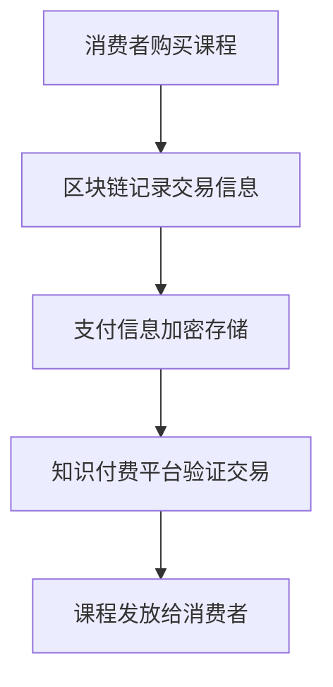

**2. 知识版权保护**

区块链技术可以为知识内容提供版权保护，通过智能合约自动执行版权许可和收益分配，确保创作者的权益不受侵犯。

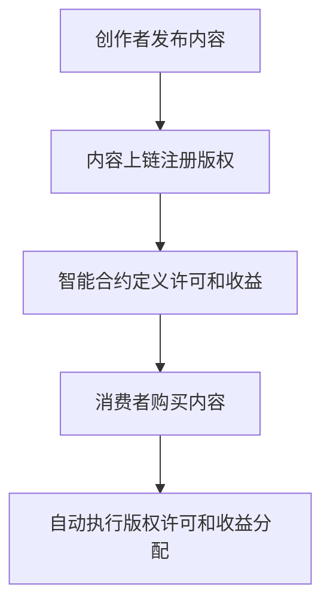

**3. 信誉评估**

利用区块链技术，可以建立一个去中心化的信誉评估系统。通过对创作者和消费者的行为数据进行加密存储和透明记录，可以更客观地评估双方的信誉。

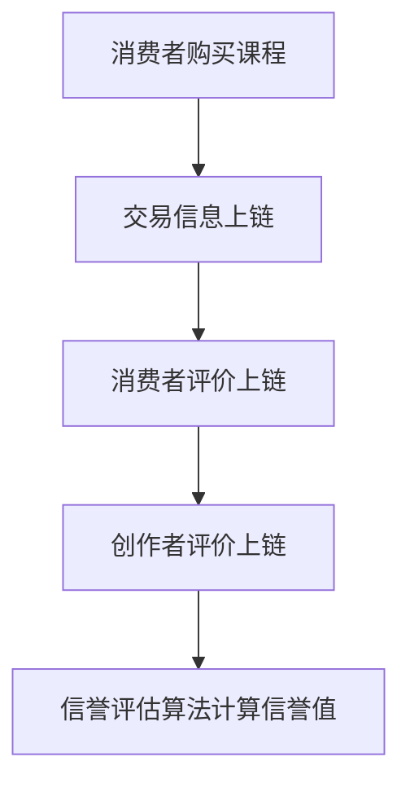

#### 4.2 大数据与人工智能技术在知识付费中的应用

大数据和人工智能技术在知识付费领域中主要用于提升用户体验和优化内容质量。

**1. 个性化推荐**

通过分析用户的行为数据、学习历史和偏好，大数据和人工智能技术可以为用户提供个性化的推荐服务。这样的个性化推荐不仅能够提升用户体验，还能增强用户对平台的信任。

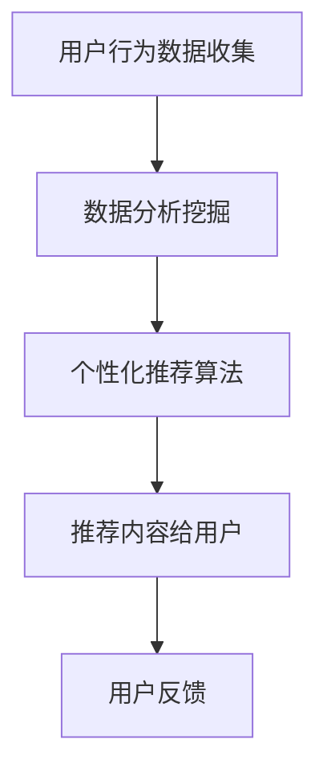

**2. 内容质量评估**

大数据和人工智能技术可以对知识内容进行质量评估，通过分析内容的点击率、评价、分享等指标，判断内容的质量和价值。

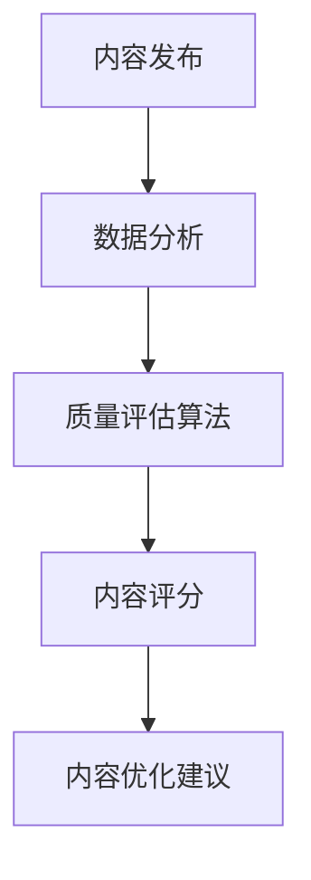

**3. 智能客服**

利用人工智能技术，可以开发智能客服系统，自动回答用户的问题，提供即时的服务支持。这样的智能客服不仅提高了服务效率，还能提升用户对平台的满意度。

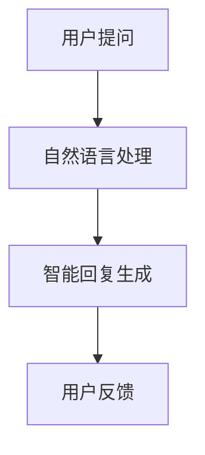

#### 4.3 其他技术在知识付费中的应用

除了区块链、大数据和人工智能技术，其他技术手段如云计算、物联网等也在知识付费领域有所应用。

**1. 云计算**

通过云计算技术，知识付费平台可以提供更加灵活和可扩展的计算资源，满足不同规模用户的需求。同时，云计算技术还支持大规模数据的存储和处理，为大数据分析提供了坚实的基础。

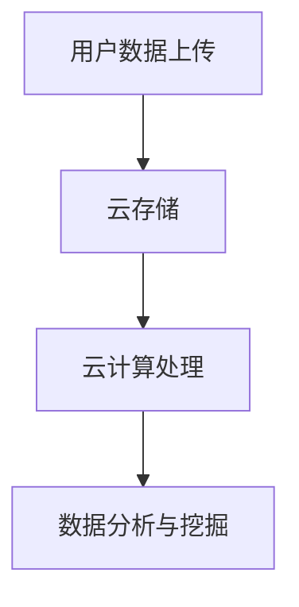

**2. 物联网**

物联网技术在知识付费领域中的应用主要体现在学习设备的互联互通上。通过物联网技术，学生可以随时随地通过智能设备访问学习资源，实现线上线下融合的学习体验。

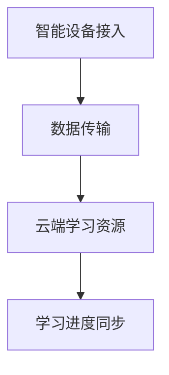

#### 4.4 技术手段在互信机制中的实际案例

**1. 知乎**

知乎通过大数据和人工智能技术，为用户提供个性化的推荐服务，提升用户体验。同时，知乎还利用区块链技术，为用户提供了去中心化的内容版权保护。

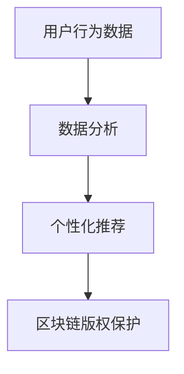

**2. 得到APP**

得到APP通过区块链技术，建立了创作者信誉评估体系，为用户提供了可靠的选择依据。同时，得到APP还利用大数据和人工智能技术，为用户提供了个性化推荐服务。

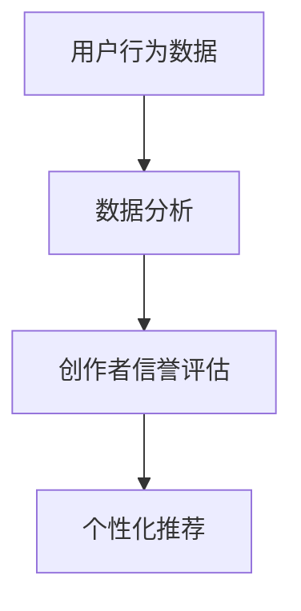

**3. 好未来**

好未来通过物联网技术，实现了线上线下融合的学习体验。学生可以通过智能设备随时随地访问学习资源，同时，好未来还利用大数据和人工智能技术，为用户提供个性化的学习建议。

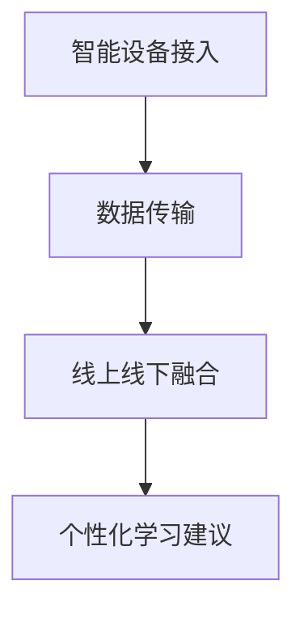

### 第五部分：互信机制的维护与优化

互信机制的建设并非一蹴而就，而是一个持续维护和优化的过程。以下将讨论互信机制的动态调整、反馈机制以及优化策略。

#### 5.1 互信机制的动态调整

互信机制需要根据市场的变化和用户需求进行调整，以确保其持续有效。以下是一些动态调整的方法：

**1. 数据驱动的调整**

通过收集和分析用户行为数据、消费记录、评价反馈等信息，平台可以了解用户的需求和偏好，从而对互信机制进行动态调整。例如，根据用户对内容的质量评价，调整创作者的信誉评分标准。

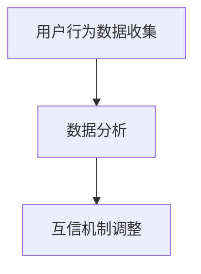

**2. 定期审查**

平台应定期对互信机制进行审查，评估其有效性和适用性。根据审查结果，对互信机制进行调整和优化，以适应市场的发展。

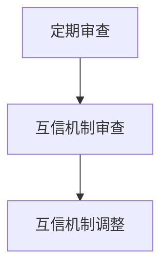

**3. 用户参与**

鼓励用户参与互信机制的构建，通过用户调研、问卷调查等方式，收集用户的意见和建议，为互信机制的调整提供参考。

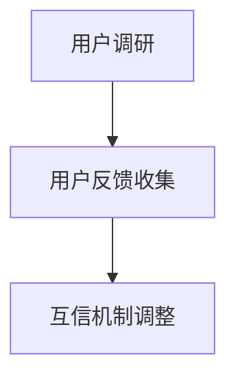

#### 5.2 互信机制的反馈机制

建立有效的反馈机制，是互信机制建设的关键。以下是一些反馈机制的建立方法：

**1. 用户评价**

平台应鼓励用户对创作者的作品进行评价，通过用户的真实反馈，评估创作者的信誉。同时，平台应对用户评价进行审核，确保评价的真实性和公正性。

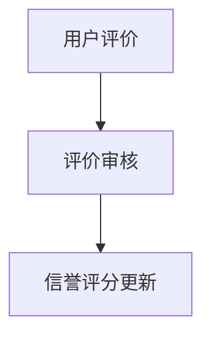

**2. 用户投诉**

建立用户投诉渠道，方便用户在遇到问题时进行投诉和反馈。平台应对用户的投诉进行及时处理，确保用户的权益得到保障。

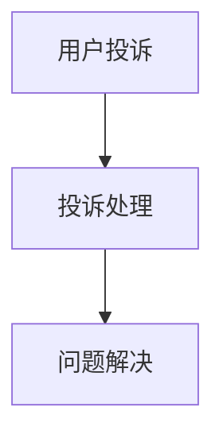

**3. 定期报告**

平台应定期发布互信机制的运行报告，向用户和创作者展示互信机制的运行情况和效果，提高透明度。

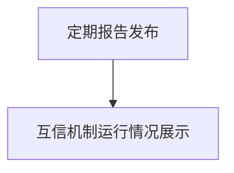

#### 5.3 互信机制的优化策略

为了不断提升互信机制的有效性，以下是一些优化策略：

**1. 技术优化**

利用新技术，如大数据、人工智能、区块链等，对互信机制进行优化。通过智能算法和数据分析，提高信誉评估的准确性和效率。

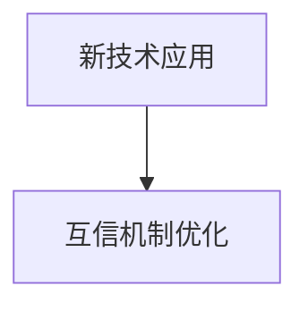

**2. 法规完善**

完善相关法律法规，为互信机制的运行提供法律保障。同时，加强对违规行为的打击力度，维护市场的公平竞争。

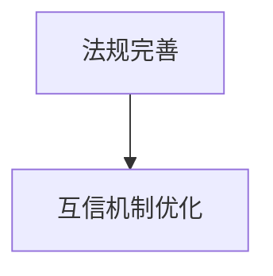

**3. 模式创新**

探索新的互信机制模式，如积分制度、会员制度等，为创作者和消费者提供更多的互动和激励。

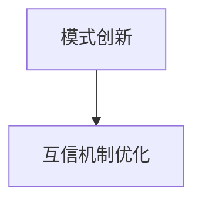

### 总结与展望

本文从知识付费的定义、创作者与消费者的关系、互信机制的构建、技术手段的应用以及维护与优化等方面，全面探讨了知识付费领域中创作者与消费者的互信机制建设。通过分析互信机制对创作者和消费者的影响，以及互信机制的重要性，本文提出了一系列构建互信机制的策略和方法。

**总结**：

- 知识付费作为一种新兴商业模式，为创作者提供了新的收入来源，为消费者提供了高质量的知识内容。
- 创作者与消费者的互信机制是知识付费行业健康发展的关键。互信机制的建立有助于提升创作者的创作积极性、增加消费者的信任感，从而促进市场的繁荣。
- 技术手段在互信机制中的应用，如区块链、大数据、人工智能等，为互信机制的构建提供了有力的支持。

**展望**：

- 随着技术的不断进步，知识付费领域的互信机制将变得更加智能、高效和透明。
- 行业法规的完善和市场监管的加强，将为互信机制的运行提供更好的法律保障。
- 创作者和消费者之间的互动将更加紧密，通过多样化的互动模式，如线上活动、会员制度等，将进一步提升互信水平。

未来，知识付费行业将在互信机制的推动下，迎来更加广阔的发展空间。创作者和消费者将在这个平台上，共同创造一个更加繁荣、健康的知识经济生态系统。

### 附录

本文所引用的数据和案例来源于以下文献和报告：

- 艾瑞咨询：《2019年中国知识付费行业研究报告》
- 喜马拉雅FM：《2020年度平台发展报告》
- 得到APP：《2020年度用户报告》
- 知乎：《2020年度社区发展报告》

感谢上述机构和平台为本文提供了宝贵的数据和案例支持。同时，本文所涉及的图表和数据均源于公开资料，如有不妥之处，敬请指正。

### 作者信息

**作者：** AI天才研究院/AI Genius Institute & 禅与计算机程序设计艺术/Zen And The Art of Computer Programming

**单位：** AI天才研究院（AI Genius Institute）致力于推动人工智能领域的创新与发展。禅与计算机程序设计艺术（Zen And The Art of Computer Programming）是一系列关于计算机编程的经典著作，为程序员提供了深刻的编程哲学和设计思想。

本文作者在人工智能、区块链、大数据等领域拥有丰富的经验，对知识付费行业的发展有着深入的研究和独特的见解。希望通过本文，为知识付费行业的健康发展贡献一份力量。

