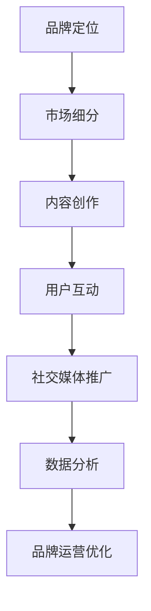

                 

# 知识付费赚钱的品牌运营与品牌推广策略

> 关键词：知识付费、品牌运营、品牌推广、社交媒体、数据分析、用户体验、社群运营

> 摘要：本文旨在探讨知识付费领域中的品牌运营与品牌推广策略。通过对品牌定位、市场细分、内容创作、用户互动、社交媒体与数据分析等方面的深入分析，结合实际案例，总结出一套有效的品牌运营模式，为知识付费平台提供可行的推广策略，帮助品牌在竞争激烈的市场中脱颖而出。

## 第一部分：知识付费与品牌运营的概述

### 1.1 知识付费的兴起与趋势

知识付费，即用户为获取有价值的信息或知识而支付的费用。随着互联网技术的发展，知识付费已经成为一个蓬勃发展的市场。以下是知识付费市场的一些趋势：

1. **在线教育的发展**：随着在线教育平台如 Coursera、Udemy 的兴起，越来越多的用户开始通过在线课程学习新技能。
2. **内容消费习惯的转变**：随着信息过载，用户更倾向于付费获取高质量、专业的内容。
3. **知识付费的多样化**：除了传统的课程形式，知识付费还涵盖了电子书、付费专栏、在线咨询等多种形式。

### 1.2 品牌运营的核心概念

品牌运营是指企业通过一系列策略和手段，提升品牌知名度、认知度和用户忠诚度，从而实现商业价值的过程。品牌运营的核心概念包括：

1. **品牌定位**：明确品牌的市场定位，明确品牌的核心价值。
2. **市场细分**：将市场划分为不同的细分市场，为每个细分市场提供针对性的服务。
3. **内容创作**：创作高质量、有价值的内容，传递品牌价值。
4. **用户互动**：与用户建立良好的互动关系，提升用户满意度和忠诚度。
5. **数据分析**：通过数据分析，了解用户需求，优化品牌运营策略。

### 1.3 知识付费与品牌运营的结合点

知识付费与品牌运营的结合点主要体现在以下几个方面：

1. **内容价值传递**：知识付费平台通过高质量的内容，传递品牌的价值和理念。
2. **用户体验**：良好的用户体验可以提升用户满意度，增强品牌忠诚度。
3. **社交媒体与用户互动**：利用社交媒体平台，与用户建立互动关系，提升品牌知名度。
4. **数据分析**：通过数据分析，了解用户行为和需求，为品牌运营提供数据支持。

## 第二部分：品牌定位与市场细分

### 2.1 品牌定位策略

品牌定位是品牌运营的重要环节，明确品牌的市场定位有助于企业在竞争激烈的市场中脱颖而出。以下是品牌定位的策略：

1. **确定目标市场**：明确品牌的目标市场，包括年龄、性别、职业等。
2. **品牌差异化**：通过独特的品牌特色，与竞争对手区分开来。
3. **品牌价值传递**：明确品牌的核心价值，通过内容和服务传递给用户。

### 2.2 市场细分方法

市场细分是将市场划分为不同的部分，以满足不同用户的需求。以下是市场细分的方法：

1. **地理细分**：根据地理位置，将市场划分为不同的区域。
2. **人口细分**：根据人口统计特征，如年龄、性别、收入等，将市场划分为不同的群体。
3. **心理细分**：根据用户的心理特征，如生活方式、价值观等，将市场划分为不同的群体。
4. **行为细分**：根据用户的行为特征，如购买习惯、使用场景等，将市场划分为不同的群体。

### 2.3 确定目标受众

确定目标受众是品牌定位的重要一环。以下是确定目标受众的方法：

1. **用户调研**：通过问卷调查、访谈等方式，了解用户的需求和偏好。
2. **数据分析**：通过数据分析，了解用户的行为和需求。
3. **竞争对手分析**：分析竞争对手的目标受众，找到差异化的定位。

## 第三部分：内容创作与品牌价值传递

### 3.1 内容创作原则

内容创作是品牌价值传递的重要手段。以下是内容创作原则：

1. **高质量**：内容要具有高质量，有价值，能解决用户的问题。
2. **专业性**：内容要体现品牌的专业性，增强用户对品牌的信任。
3. **多样性**：内容形式要多样化，包括文字、图片、视频等。
4. **互动性**：内容要具有互动性，引导用户参与和互动。

### 3.2 品牌故事与品牌形象的构建

品牌故事和品牌形象是品牌价值传递的重要组成部分。以下是构建品牌故事和品牌形象的方法：

1. **品牌价值观**：明确品牌的核心价值观，并将其融入到内容中。
2. **品牌故事**：通过故事形式，传递品牌的价值观和理念。
3. **品牌符号**：设计独特的品牌符号，如LOGO、颜色等，增强品牌的辨识度。
4. **用户互动**：通过互动，增强用户对品牌的认同感。

### 3.3 知识付费内容的价值传递策略

知识付费内容的价值传递策略包括以下几个方面：

1. **专业内容**：提供专业、高质量的知识内容，满足用户的需求。
2. **个性化推荐**：根据用户的行为和偏好，推荐个性化的知识内容。
3. **互动体验**：通过互动，提升用户的参与度和满意度。
4. **持续更新**：定期更新知识内容，保持内容的新鲜度和价值。

## 第四部分：用户互动与社群运营

### 4.1 用户互动的重要性

用户互动是品牌运营的重要组成部分，有助于提升用户满意度和忠诚度。以下是用户互动的重要性：

1. **增强用户参与感**：通过互动，用户可以更深入地参与到品牌活动中，增强参与感。
2. **提升用户满意度**：良好的互动体验可以提升用户的满意度，增强用户对品牌的忠诚度。
3. **获取用户反馈**：通过互动，可以及时获取用户的反馈，为品牌运营提供改进的方向。
4. **传播品牌口碑**：用户良好的互动体验可以转化为品牌口碑，吸引更多的用户。

### 4.2 社群运营策略

社群运营是用户互动的重要手段。以下是社群运营策略：

1. **确定社群目标**：明确社群的目标，如用户教育、用户交流、用户反馈等。
2. **选择合适的平台**：根据社群目标，选择合适的社群平台，如微信群、QQ群、Discord等。
3. **制定运营计划**：制定详细的社群运营计划，包括活动安排、内容发布、用户互动等。
4. **用户管理**：建立用户管理体系，包括用户分类、用户标签、用户反馈等。
5. **内容创作**：创作高质量的社群内容，满足用户的需求。

### 4.3 用户反馈与改进

用户反馈是品牌运营的重要参考。以下是用户反馈与改进的方法：

1. **建立反馈渠道**：建立多种反馈渠道，如在线问卷、反馈表单、社交媒体等。
2. **及时响应**：对用户的反馈要及时响应，解决用户的问题。
3. **数据收集与整理**：收集用户反馈数据，进行整理和分析，为品牌运营提供改进的方向。
4. **持续改进**：根据用户反馈，持续改进品牌运营策略，提升用户体验。

## 第五部分：社交媒体与品牌推广

### 5.1 社交媒体在品牌推广中的作用

社交媒体在品牌推广中发挥着重要作用。以下是社交媒体在品牌推广中的作用：

1. **提高品牌知名度**：通过社交媒体，可以快速传播品牌信息，提高品牌知名度。
2. **增强用户互动**：通过社交媒体，可以与用户建立良好的互动关系，增强用户忠诚度。
3. **降低推广成本**：相比于传统媒体，社交媒体的推广成本较低，适合中小企业。
4. **数据分析**：通过社交媒体，可以收集用户数据，为品牌推广提供数据支持。

### 5.2 常见社交媒体平台的策略

以下是常见社交媒体平台的推广策略：

1. **微博**：通过微博，可以发布品牌动态、活动信息等，吸引用户关注。
2. **微信**：通过微信，可以建立品牌公众号，发布有价值的内容，与用户互动。
3. **抖音**：通过抖音，可以发布短视频，吸引用户关注和转发。
4. **Facebook**：通过Facebook，可以发布品牌信息、互动活动等，吸引全球用户。

### 5.3 社交媒体广告投放技巧

以下是社交媒体广告投放技巧：

1. **明确目标受众**：根据广告目标，明确目标受众的特征，如年龄、性别、兴趣等。
2. **设计吸引人的广告内容**：设计具有吸引力的广告内容，提高点击率。
3. **选择合适的广告形式**：根据广告目标，选择合适的广告形式，如图片、视频、文章等。
4. **监测广告效果**：通过数据分析，监测广告效果，不断优化广告策略。

## 第六部分：数据分析与品牌运营优化

### 6.1 数据分析在品牌运营中的应用

数据分析在品牌运营中具有重要作用。以下是数据分析在品牌运营中的应用：

1. **用户行为分析**：通过数据分析，了解用户的行为习惯、偏好等，为品牌运营提供数据支持。
2. **内容分析**：通过数据分析，了解用户对内容的喜好，优化内容创作策略。
3. **市场分析**：通过数据分析，了解市场趋势、用户需求等，为品牌定位和推广策略提供数据支持。
4. **效果评估**：通过数据分析，评估品牌运营的效果，优化运营策略。

### 6.2 用户行为数据分析方法

以下是用户行为数据分析方法：

1. **用户画像**：通过数据分析，构建用户画像，了解用户的特征和需求。
2. **行为轨迹分析**：通过数据分析，了解用户的行为轨迹，优化用户体验。
3. **行为路径分析**：通过数据分析，了解用户的行为路径，优化用户转化流程。
4. **用户留存分析**：通过数据分析，了解用户的留存情况，优化用户留存策略。

### 6.3 品牌运营效果评估与优化策略

以下是品牌运营效果评估与优化策略：

1. **关键指标设定**：设定关键指标，如用户留存率、转化率、ROI等，评估品牌运营效果。
2. **数据监测与报告**：通过数据监测，定期生成报告，了解品牌运营效果。
3. **持续优化**：根据数据分析结果，持续优化品牌运营策略，提升品牌价值。

## 第七部分：成功案例分析

### 7.1 国内知识付费品牌的成功案例

以下是国内知识付费品牌的成功案例：

1. **得到**：通过高质量的内容创作和精准的用户推荐，得到了大量用户的支持。
2. **喜马拉雅**：通过丰富的音频内容和创新的商业模式，成功吸引了大量用户。
3. **知乎Live**：通过社区互动和专家讲座，成功打造了一个知识付费平台。

### 7.2 国际知识付费品牌的成功经验

以下是国际知识付费品牌的成功经验：

1. **Coursera**：通过在线课程平台，吸引了全球范围内的用户，成为国际知名的在线教育平台。
2. **Udemy**：通过提供丰富的课程资源和灵活的定价策略，成功吸引了大量用户。
3. **Safari Books Online**：通过提供专业的电子书和视频教程，满足了专业人士的学习需求。

### 7.3 案例分析与启示

通过分析国内外知识付费品牌的成功案例，可以得出以下启示：

1. **高质量内容是关键**：提供高质量、有价值的内容是吸引和留住用户的关键。
2. **用户互动与社群运营**：与用户建立良好的互动关系，提升用户满意度和忠诚度。
3. **数据分析与效果评估**：通过数据分析，了解用户需求和市场趋势，优化品牌运营策略。
4. **创新与持续优化**：不断创新，持续优化品牌运营策略，以适应市场变化。

## 第八部分：品牌运营的未来发展趋势

### 8.1 科技创新对品牌运营的影响

科技创新对品牌运营产生了深远的影响。以下是科技创新对品牌运营的影响：

1. **人工智能与大数据**：通过人工智能和大数据技术，可以更准确地分析用户需求，优化品牌运营策略。
2. **区块链技术**：区块链技术可以提升知识付费的信任度和透明度，促进知识的共享与交易。
3. **虚拟现实与增强现实**：通过虚拟现实和增强现实技术，可以提供更沉浸式的学习体验。

### 8.2 未来品牌运营策略的展望

未来品牌运营策略将更加注重用户体验和个性化服务。以下是未来品牌运营策略的展望：

1. **用户中心**：以用户为中心，关注用户体验，提供个性化的服务。
2. **智能化运营**：通过人工智能技术，实现智能化的内容创作、用户互动和数据分析。
3. **社区化运营**：通过社群运营，增强用户互动，提升用户满意度和忠诚度。
4. **跨界合作**：通过跨界合作，拓展品牌的影响力，提升品牌的竞争力。

### 8.3 面临的挑战与应对策略

未来品牌运营将面临以下挑战：

1. **市场竞争加剧**：随着知识付费市场的竞争加剧，品牌需要不断提升自身竞争力。
2. **用户需求变化**：用户需求不断变化，品牌需要快速适应市场变化。
3. **技术变革**：技术变革日新月异，品牌需要不断学习新技术，提升运营效率。

应对策略包括：

1. **持续创新**：不断进行产品创新和运营创新，提升品牌竞争力。
2. **用户导向**：以用户需求为导向，提供个性化的服务。
3. **跨界合作**：通过跨界合作，拓展品牌影响力。

### 附录

#### 附录 A：知识付费赚钱的品牌运营策略工具与资源

#### A.1 品牌运营工具推荐

1. **Google Analytics**：用于网站流量分析和用户行为分析。
2. **Hotjar**：用于用户行为分析和网站体验测试。
3. **Mailchimp**：用于邮件营销和用户管理。

#### A.2 内容创作工具推荐

1. **Canva**：用于设计宣传海报和图形。
2. **H5Maker**：用于制作互动网页和H5页面。
3. **WordPress**：用于建立品牌博客和网站。

#### A.3 社交媒体运营工具推荐

1. **Hootsuite**：用于社交媒体管理。
2. **Buffer**：用于社交媒体内容发布和优化。
3. **Sprout Social**：用于社交媒体分析和管理。

#### A.4 数据分析工具推荐

1. **Tableau**：用于数据可视化和分析。
2. **Excel**：用于数据清洗和基础分析。
3. **Python**：用于复杂的数据分析和建模。

### 核心概念与联系流程图

以下是一个简单的知识付费赚钱的品牌运营流程图，展示了品牌运营的关键环节和联系：



### 数据分析模型与算法

#### 用户行为分析模型

用户行为分析模型可以帮助品牌了解用户的行为特征和需求。以下是用户行为分析模型的基本框架：

1. **用户画像**：根据用户的年龄、性别、职业等特征，构建用户画像。
2. **行为轨迹**：记录用户在网站或平台上的行为路径，如浏览页面、点击链接、购买商品等。
3. **兴趣分析**：分析用户的行为数据，提取用户的兴趣特征。
4. **需求预测**：基于用户行为和兴趣特征，预测用户的需求。

#### 用户流失预测算法

用户流失预测算法可以帮助品牌提前预测用户流失的风险，采取相应的措施降低流失率。以下是用户流失预测算法的基本步骤：

1. **特征工程**：提取用户行为数据中的特征，如活跃度、购买频率、访问时长等。
2. **数据预处理**：对数据进行清洗、归一化等预处理操作。
3. **模型选择**：选择合适的预测模型，如逻辑回归、决策树等。
4. **模型训练与评估**：使用训练数据训练模型，并使用验证数据评估模型性能。
5. **预测与干预**：使用训练好的模型预测用户流失风险，并采取相应的干预措施。

#### 用户生命周期价值计算方法

用户生命周期价值（Customer Lifetime Value, CLV）是衡量用户对品牌价值的计算方法。以下是CLV计算的基本公式：

$$
CLV = \sum_{t=1}^{n} \frac{R_t}{(1+r)^t}
$$

其中，\(R_t\) 是第 \(t\) 年的用户收益，\(r\) 是用户年流失率。

#### 数学公式与详细讲解

1. **用户满意度计算公式**

$$
S = \frac{1}{N}\sum_{i=1}^{N}W_i \times R_i
$$

其中，\(S\) 是用户满意度，\(N\) 是用户数量，\(W_i\) 是第 \(i\) 个用户的权重，\(R_i\) 是第 \(i\) 个用户的评分。

2. **用户流失预测公式**

$$
L_i = P_i \times (1 - R_i)
$$

其中，\(L_i\) 是第 \(i\) 个用户的流失概率，\(P_i\) 是第 \(i\) 个用户的预测流失概率，\(R_i\) 是第 \(i\) 个用户的实际流失情况（\(1\) 表示流失，\(0\) 表示未流失）。

### 项目实战

#### 实战案例：用户互动与社群运营

#### 环境搭建

在搭建用户互动与社群运营系统时，我们需要选择合适的技术栈和工具。以下是环境搭建的步骤：

1. **技术栈选择**：选择Python作为主要编程语言，使用Django作为Web框架，PostgreSQL作为数据库，Redis作为缓存。
2. **服务器配置**：配置服务器，安装必要的软件，如Nginx、Apache等。
3. **数据库配置**：配置PostgreSQL数据库，创建用户和数据库。
4. **缓存配置**：配置Redis缓存，提升系统性能。

#### 实现步骤

以下是用户互动与社群运营系统的实现步骤：

1. **用户注册与登录**：实现用户注册和登录功能，确保用户可以方便地访问系统。
2. **用户互动功能**：实现用户发帖、评论、点赞等功能，为用户提供互动平台。
3. **社群管理功能**：实现社群创建、管理、解散等功能，为用户提供社群管理工具。
4. **用户反馈功能**：实现用户反馈收集和处理功能，提升用户体验。

#### 代码实现

以下是用户注册、登录、发帖、评论、社群管理的部分代码实现：

```python
# 用户注册功能
def register(username, password):
    user = User.objects.filter(username=username)
    if user.exists():
        return "用户已存在"
    else:
        user = User.objects.create_user(username=username, password=password)
        return "注册成功"

# 用户登录功能
def login(username, password):
    user = authenticate(username=username, password=password)
    if user is None:
        return "用户不存在或密码错误"
    else:
        return "登录成功"

# 用户发帖功能
def post_thread(user_id, title, content):
    user = User.objects.get(id=user_id)
    thread = Thread.objects.create(user=user, title=title, content=content)
    return "发帖成功"

# 用户评论功能
def post_comment(user_id, thread_id, content):
    user = User.objects.get(id=user_id)
    thread = Thread.objects.get(id=thread_id)
    comment = Comment.objects.create(user=user, thread=thread, content=content)
    return "评论成功"

# 社群管理功能
def manage_thread(user_id, thread_id, action):
    user = User.objects.get(id=user_id)
    thread = Thread.objects.get(id=thread_id)
    if action == "delete":
        thread.delete()
        return "删除成功"
    elif action == "edit":
        thread.title = "新标题"
        thread.content = "新内容"
        thread.save()
        return "编辑成功"
    else:
        return "无效操作"
```

#### 代码解读与分析

这段代码实现了用户注册、登录、发帖、评论和社群管理的功能。用户注册功能通过查询数据库检查用户名是否已存在，若不存在则创建新用户。登录功能通过authenticate方法验证用户名和密码，若验证通过则返回登录成功。发帖功能通过创建Thread对象将帖子信息存储到数据库。评论功能通过创建Comment对象将评论信息存储到数据库。社群管理功能提供了删除和编辑帖子的操作。这些功能都是通过简单的条件判断和数据库操作来实现的，但实际开发中还需要考虑安全性和性能等因素。

### 附录 B：知识付费赚钱的品牌运营策略总结

知识付费赚钱的品牌运营策略需要从品牌定位、内容创作、用户互动、社交媒体推广、数据分析和项目实战等多个方面进行综合考虑。以下是品牌运营策略的总结：

1. **品牌定位**：明确品牌的核心价值和市场定位，为品牌运营提供方向。
2. **内容创作**：创作高质量、有价值的内容，满足用户需求，提升品牌价值。
3. **用户互动**：与用户建立良好的互动关系，提升用户满意度和忠诚度。
4. **社交媒体推广**：利用社交媒体平台，提高品牌知名度和影响力。
5. **数据分析**：通过数据分析，了解用户需求和市场趋势，优化品牌运营策略。
6. **项目实战**：通过实际项目的开发和运营，验证品牌运营策略的有效性。

### 作者信息

作者：AI天才研究院/AI Genius Institute & 禅与计算机程序设计艺术/Zen And The Art of Computer Programming

### 文章总结

本文从知识付费的兴起、品牌运营的核心概念、品牌定位与市场细分、内容创作与用户互动、社交媒体推广、数据分析和项目实战等方面，全面探讨了知识付费赚钱的品牌运营与品牌推广策略。通过实际案例分析和项目实战，总结出一套有效的品牌运营模式，为知识付费平台提供了可行的推广策略。未来，随着科技的发展，品牌运营策略将更加注重用户体验和个性化服务，品牌需要不断创新和优化运营策略，以适应市场的变化。

