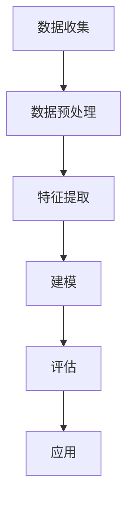

                 

### 《知识发现引擎的用户画像技术》

> **关键词：** 用户画像、知识发现引擎、数据源、数据处理、特征工程、建模算法、应用场景、优化策略

> **摘要：** 本文章深入探讨了知识发现引擎中的用户画像技术。通过详细解析用户画像的基本概念、数据来源、数据处理与分析技术，以及用户画像在智能推荐、客户关系管理和营销自动化等应用场景中的实现，本文旨在为读者提供全面的技术指导，帮助理解用户画像技术在知识发现引擎中的核心作用和未来发展趋势。

---

## 《知识发现引擎的用户画像技术》目录大纲

### 第一部分：用户画像技术概述

### 第二部分：用户画像数据处理与分析技术

### 第三部分：用户画像技术实现与优化

### 第四部分：用户画像技术的应用

### 第五部分：用户画像技术的未来展望

### 附录

### 附录A：用户画像技术常用工具与框架

### 附录B：用户画像技术Mermaid流程图

### 附录C：用户画像技术数学模型与公式

---

### 第一部分：用户画像技术概述

#### 第1章：用户画像的基本概念

#### 第2章：用户画像的数据来源

---

### 第一部分：用户画像技术概述

#### 第1章：用户画像的基本概念

#### 1.1 用户画像的定义与重要性

用户画像，又称用户轮廓或用户档案，是一种描述用户特征、偏好和行为的数据集合。通过构建用户画像，企业可以更准确地了解其用户群体，实现个性化的服务推荐和精准营销。用户画像的重要性主要体现在以下几个方面：

1. **个性化服务：** 用户画像使得企业能够根据用户的个人喜好、行为习惯和历史数据提供定制化的服务和推荐，提升用户体验。
2. **精准营销：** 通过用户画像，企业可以识别潜在客户，分析用户需求，设计出更有效的营销策略。
3. **风险控制：** 在金融、保险等领域，用户画像有助于评估信用风险，提高风控能力。
4. **用户洞察：** 用户画像可以帮助企业深入了解用户需求和行为模式，为产品迭代和业务优化提供数据支持。

#### 1.2 用户画像的类型与应用场景

用户画像可以根据不同的维度进行分类，常见的类型包括：

1. **基础画像：** 包括用户的基本信息，如年龄、性别、地域、职业等。
2. **行为画像：** 描述用户在网站、APP等平台上的行为数据，如浏览历史、购买记录、搜索关键词等。
3. **兴趣画像：** 反映用户的兴趣爱好，通过社交行为、内容偏好等数据进行分析得出。
4. **情境画像：** 描述用户在不同情境下的行为模式，如工作、娱乐、旅行等。
5. **情感画像：** 通过用户生成的文本数据，如评论、反馈等，分析用户的情绪状态。

不同的用户画像类型适用于不同的应用场景：

1. **电商推荐系统：** 行为画像和兴趣画像用于推荐商品，提升用户转化率。
2. **社交媒体平台：** 情境画像和情感画像用于推荐内容，提升用户粘性。
3. **金融风控：** 基础画像和行为画像用于风险评估和信用评估。
4. **健康管理：** 用户画像可以帮助医疗机构提供个性化的健康建议和服务。

#### 1.3 用户画像的发展历程

用户画像技术经历了以下几个发展阶段：

1. **传统用户研究：** 通过问卷调查、访谈等方式收集用户数据，分析用户特征和需求。
2. **大数据时代：** 随着互联网和移动设备的普及，大数据技术使得用户画像的数据来源更加丰富，数据处理和分析能力得到提升。
3. **人工智能时代：** 人工智能技术的应用，特别是机器学习和深度学习，使得用户画像的构建和分析更加精确和高效。

在当前人工智能时代，用户画像技术不断演进，数据来源更加多样化，分析手段更加智能化，应用场景也更加广泛。随着技术的不断发展，用户画像将为企业和用户带来更多的价值。

#### 第2章：用户画像的数据来源

用户画像的构建依赖于大量的数据来源。以下将详细介绍用户画像数据的几种主要来源：

#### 2.1 用户行为数据的获取

用户行为数据是构建用户画像的核心数据之一。这些数据可以通过以下途径获取：

1. **Web日志数据：** 包括用户访问网站的时间、页面浏览记录、点击行为等。这些数据通常通过Web服务器日志收集。
2. **APP行为数据：** 包括用户在APP中的操作行为，如浏览、搜索、购买、评价等。这些数据可以通过APP内置的追踪机制收集。
3. **社交媒体数据：** 包括用户在社交媒体平台上的互动行为，如点赞、评论、转发等。这些数据可以通过API接口或社交数据分析工具获取。

用户行为数据的特点是实时性高、数据量大，但同时也存在噪声多、数据缺失等问题。因此，在获取这些数据时，需要保证数据的质量和完整性。

#### 2.2 用户社交数据的收集

用户社交数据是了解用户兴趣、态度和情感的重要来源。以下是一些常见的用户社交数据收集途径：

1. **社交媒体：** 包括微博、微信、Facebook、Twitter等。这些平台提供了丰富的用户互动数据，如帖子、评论、点赞等。
2. **论坛和社区：** 包括知乎、贴吧、Reddit等。用户在这些平台上的讨论和分享可以反映其专业知识和兴趣爱好。
3. **用户生成内容：** 包括用户上传的视频、图片、博客等。这些内容通常包含用户的真实情感和态度。

收集用户社交数据时，需要注意用户隐私保护问题，遵守相关法律法规和平台规则。

#### 2.3 用户属性数据的收集

用户属性数据是构建用户基础画像的重要部分。以下是一些常见的用户属性数据收集途径：

1. **注册信息：** 包括用户在网站、APP等平台注册时提交的信息，如姓名、性别、年龄、邮箱、电话等。
2. **问卷调查：** 通过在线问卷调查，收集用户的基本信息、兴趣爱好、生活习惯等。
3. **第三方数据源：** 利用第三方数据源，如社交媒体公开信息、公共数据库等，获取用户的基本属性数据。

收集用户属性数据时，需要确保数据来源的可靠性和真实性，以避免数据偏差。

#### 2.4 数据融合与清洗

用户画像数据的来源多样，数据类型和格式各不相同。为了构建高质量的用户画像，需要对不同来源的数据进行融合和清洗。以下是一些常见的数据融合与清洗方法：

1. **数据融合：** 通过数据对齐、数据整合等技术，将不同来源的数据进行整合，形成一个统一的用户画像数据集。
2. **数据清洗：** 通过数据去重、缺失值填充、异常值检测等方法，提高数据质量，消除数据噪声。
3. **特征提取：** 从原始数据中提取有助于用户画像构建的特征，如用户活跃度、购买频率、浏览时长等。

数据融合与清洗是用户画像构建过程中的重要环节，直接影响用户画像的准确性和实用性。

### 第二部分：用户画像数据处理与分析技术

#### 第3章：数据预处理与清洗

#### 第4章：特征工程

#### 第5章：用户画像建模与评估

---

### 第二部分：用户画像数据处理与分析技术

#### 第3章：数据预处理与清洗

#### 3.1 数据预处理方法

数据预处理是用户画像构建过程中至关重要的一步，其目的是将原始数据转换为适合分析和建模的格式。以下是一些常见的数据预处理方法：

1. **数据清洗：** 数据清洗包括数据去重、缺失值填充、异常值检测和修正等步骤。去重可以消除重复记录，提高数据质量；缺失值填充可以通过均值、中位数、回归等方法填补缺失数据；异常值检测可以通过统计方法或机器学习算法识别和修正异常数据。

2. **数据规范化：** 数据规范化包括数据类型转换、数值范围缩放等操作。例如，将字符串类型的数据转换为数值类型，将不同数据范围的数据进行归一化处理，以便于后续分析。

3. **特征提取：** 从原始数据中提取有助于用户画像构建的特征，如用户活跃度、购买频率、浏览时长等。特征提取可以通过统计方法、机器学习算法或深度学习模型实现。

4. **数据集成：** 将来自不同来源和格式的数据整合到一个统一的数据集中。数据集成可以通过数据对齐、数据整合等技术实现。

#### 3.2 数据清洗流程与策略

数据清洗是一个复杂且迭代的过程，以下是一个常见的数据清洗流程与策略：

1. **数据收集与初步分析：** 收集原始数据，并进行初步分析，以了解数据的基本特征和问题。

2. **数据去重：** 检测并删除重复的记录，保证数据的一致性和准确性。

3. **缺失值处理：** 对于缺失的数据，可以根据不同情况选择填充方法，如均值、中位数、回归等。

4. **异常值检测：** 通过统计方法或机器学习算法检测异常值，并根据实际情况进行修正或剔除。

5. **数据规范化：** 对数据进行类型转换和数值范围缩放，使数据适合后续分析。

6. **数据验证：** 对清洗后的数据进行验证，确保数据质量满足分析和建模的要求。

#### 3.3 数据质量评估与优化

数据质量评估是确保数据清洗效果的重要环节。以下是一些常见的数据质量评估指标和方法：

1. **完整性：** 衡量数据缺失的程度，常用指标包括缺失率、完整性百分比等。

2. **准确性：** 衡量数据准确性，可以通过与真实数据进行比对或使用统计方法进行评估。

3. **一致性：** 衡量数据的一致性，如同一数据在不同来源中是否一致。

4. **及时性：** 衡量数据的更新速度，是否能够及时反映用户行为。

5. **可靠性：** 衡量数据的可靠性，是否受到外部因素的影响。

为了优化数据质量，可以采取以下策略：

1. **数据清洗策略优化：** 根据数据特点调整清洗方法，提高清洗效果。

2. **数据源管理：** 加强数据源的管理，确保数据来源的可靠性和一致性。

3. **自动化数据清洗：** 使用自动化工具和算法进行数据清洗，提高效率。

4. **持续监控与反馈：** 建立数据质量监控系统，及时发现和处理数据质量问题。

#### 第4章：特征工程

#### 4.1 特征工程的重要性

特征工程（Feature Engineering）是在数据预处理之后，通过对原始数据进行处理和变换，构造出有助于提高模型性能和解释性的特征的过程。特征工程在用户画像构建中具有重要作用，主要体现在以下几个方面：

1. **数据压缩：** 通过特征工程可以降低数据的维度，减少存储空间和计算资源的需求。

2. **数据转换：** 将原始数据进行适当的转换，使其更适合模型处理。例如，将类别数据转换为数值数据，对数值数据进行归一化或标准化。

3. **特征提取：** 从原始数据中提取具有预测能力和解释性的特征，有助于提高模型的性能和可解释性。

4. **噪声消除：** 通过特征工程可以识别和消除数据中的噪声，提高数据质量。

5. **模型性能优化：** 通过特征工程可以调整特征组合和权重，优化模型性能，提高预测准确率。

#### 4.2 基本特征提取方法

基本特征提取方法主要包括以下几种：

1. **统计特征：** 基于原始数据的统计结果，提取描述用户行为和特征的信息。例如，平均购买金额、购买频率、浏览时长等。

2. **时间序列特征：** 提取用户行为的时间序列特征，如最近一次购买时间、最近一次登录时间等。

3. **文本特征：** 对于文本数据，可以提取词频、词频-逆文档频率（TF-IDF）、主题模型等特征。

4. **图像特征：** 对于图像数据，可以提取颜色、纹理、形状等特征。

5. **社会网络特征：** 提取用户在社交网络中的关系特征，如朋友数、互动频率等。

#### 4.3 高级特征提取技术

高级特征提取技术主要包括以下几种：

1. **机器学习特征提取：** 利用机器学习算法（如主成分分析、聚类等）提取高维数据中的潜在特征。

2. **深度学习特征提取：** 利用深度学习模型（如卷积神经网络、循环神经网络等）从原始数据中自动提取特征。

3. **网络嵌入：** 将用户在网络中的关系转化为低维向量表示，可用于用户推荐和分类任务。

4. **集成特征：** 将多种特征组合在一起，形成新的特征，以提升模型的性能。

#### 第5章：用户画像建模与评估

#### 5.1 建模算法概述

用户画像建模是利用机器学习和深度学习算法，将提取的特征转换为用户标签或分类的过程。常见的建模算法包括：

1. **分类算法：** 如逻辑回归、支持向量机、决策树、随机森林等，用于将用户划分为不同的类别。

2. **聚类算法：** 如K均值聚类、层次聚类等，用于发现用户群体的相似性和差异性。

3. **关联规则算法：** 如Apriori算法、FP-Growth算法等，用于发现用户行为之间的关联关系。

4. **协同过滤算法：** 如基于用户的协同过滤、基于项目的协同过滤等，用于推荐相似用户喜欢的项目或相似项目给用户。

#### 5.2 用户画像评估指标

评估用户画像模型的性能是确保其有效性和准确性的关键。以下是一些常见的评估指标：

1. **准确率（Accuracy）：** 衡量模型正确分类的样本数占总样本数的比例。

2. **召回率（Recall）：** 衡量模型正确分类的样本数占所有实际正样本数的比例。

3. **精确率（Precision）：** 衡量模型正确分类的样本数占所有预测为正样本的样本数的比例。

4. **F1值（F1 Score）：** 结合精确率和召回率的综合指标，计算公式为 F1 = 2 * 精确率 * 召回率 / (精确率 + 召回率)。

5. **ROC曲线和AUC值：** ROC曲线描述了不同阈值下模型的准确率和召回率，AUC值衡量了ROC曲线下的面积，用于评估模型的分类能力。

#### 5.3 用户画像评估方法

用户画像评估方法主要包括以下几种：

1. **交叉验证：** 将数据集划分为训练集和测试集，通过多次训练和测试，评估模型在不同数据集上的性能。

2. **K折交叉验证：** 将数据集划分为K个子集，每次选择一个子集作为测试集，其余K-1个子集作为训练集，重复K次，取平均性能作为最终评估结果。

3. **模型对比：** 比较不同模型在相同数据集上的性能，选择性能最好的模型。

4. **在线评估：** 在实际应用中，实时收集用户数据，评估模型的性能，并根据评估结果进行调整。

### 第三部分：用户画像技术实现与优化

#### 第6章：用户画像系统的设计与实现

#### 第7章：用户画像技术的优化策略

---

### 第三部分：用户画像技术实现与优化

#### 第6章：用户画像系统的设计与实现

#### 6.1 用户画像系统的架构设计

用户画像系统的架构设计是确保系统高效、稳定、可扩展的关键。以下是用户画像系统常见的架构设计：

1. **数据层：** 负责数据的存储和管理，包括关系数据库、NoSQL数据库、数据仓库等。数据层的主要功能是存储用户行为数据、属性数据和第三方数据源的数据。

2. **处理层：** 负责数据的处理和清洗，包括数据预处理、特征提取、数据融合等。处理层可以使用数据清洗工具、特征工程工具和批处理框架（如Apache Spark）等。

3. **存储层：** 负责存储处理后的用户画像数据，包括用户基础画像、行为画像、兴趣画像等。存储层可以使用关系数据库、NoSQL数据库、图数据库等。

4. **服务层：** 负责提供用户画像服务的接口，包括用户画像查询、更新、删除等。服务层可以使用RESTful API、消息队列等。

5. **展现层：** 负责将用户画像数据可视化，供用户和管理员查看。展现层可以使用Web前端框架、数据可视化工具等。

#### 6.2 数据存储与索引策略

数据存储与索引策略是用户画像系统性能的关键因素。以下是一些常见的数据存储与索引策略：

1. **关系数据库：** 适用于存储用户基础画像数据，如MySQL、PostgreSQL等。使用关系数据库的优点是数据结构清晰、查询速度快，但缺点是扩展性较差。

2. **NoSQL数据库：** 适用于存储用户行为数据、兴趣画像等，如MongoDB、Cassandra等。NoSQL数据库的优点是扩展性好、读写速度快，但缺点是查询能力较弱。

3. **图数据库：** 适用于存储用户社交网络数据，如Neo4j、Titan等。图数据库的优点是能够高效地处理复杂的图结构数据，但缺点是查询性能相对较低。

4. **索引策略：** 使用B树、哈希索引等策略提高数据查询速度。例如，在关系数据库中，可以为主键、外键等字段建立索引；在NoSQL数据库中，可以使用复合键索引提高查询性能。

#### 6.3 用户画像系统开发实战

以下是一个简单的用户画像系统开发实战示例：

1. **环境搭建：** 安装MySQL数据库、Python开发环境、Apache Spark等。

2. **数据收集：** 从网站日志、APP行为数据、第三方数据源等渠道收集用户数据。

3. **数据处理：** 使用Apache Spark进行数据预处理、特征提取和融合。

4. **数据存储：** 将处理后的用户画像数据存储到MySQL数据库。

5. **API开发：** 开发RESTful API提供用户画像查询、更新和删除功能。

6. **前端展示：** 使用Vue.js、React等前端框架，实现用户画像数据的可视化。

#### 第7章：用户画像技术的优化策略

用户画像技术的优化策略是提高系统性能、稳定性和可扩展性的关键。以下是一些常见的优化策略：

1. **数据压缩：** 使用压缩算法（如Hadoop、Spark）对数据进行压缩，减少存储空间和传输带宽。

2. **并行处理：** 使用并行处理框架（如Apache Spark、Flink）进行大规模数据处理，提高处理速度。

3. **缓存策略：** 使用缓存机制（如Redis、Memcached）提高数据读取速度，减少数据库压力。

4. **分布式存储：** 使用分布式存储系统（如HDFS、Cassandra）提高数据存储的可靠性和性能。

5. **负载均衡：** 使用负载均衡器（如Nginx、HAProxy）均衡系统负载，提高系统的可用性。

6. **自动化运维：** 使用自动化工具（如Docker、Kubernetes）进行系统部署、监控和运维，提高系统运维效率。

7. **安全防护：** 实施安全策略（如数据加密、访问控制）保护用户数据安全。

8. **持续优化：** 定期进行性能测试和优化，持续改进系统性能。

#### 第8章：用户画像技术在企业中的应用

#### 8.1 企业用户画像的应用价值

用户画像技术在企业中的应用具有显著的价值，主要体现在以下几个方面：

1. **个性化推荐：** 通过用户画像，企业可以准确了解用户偏好，提供个性化的产品推荐，提高用户满意度和转化率。

2. **精准营销：** 通过用户画像，企业可以识别潜在客户，制定有针对性的营销策略，提高营销效果。

3. **用户行为分析：** 通过用户画像，企业可以深入分析用户行为，优化产品设计和功能，提升用户体验。

4. **风险管理：** 通过用户画像，企业可以评估用户信用风险，提高风控能力。

5. **客户服务：** 通过用户画像，企业可以提供个性化的客户服务，提升客户满意度和忠诚度。

6. **供应链优化：** 通过用户画像，企业可以优化供应链管理，降低库存成本，提高供应链效率。

#### 8.2 企业用户画像实践案例

以下是一些企业用户画像的实践案例：

1. **电商企业：** 电商企业通过用户画像分析用户购买行为和兴趣偏好，实现个性化商品推荐，提高销售额。

2. **金融企业：** 金融企业通过用户画像评估用户信用风险，降低不良贷款率，提高风控能力。

3. **医疗企业：** 医疗企业通过用户画像分析患者健康状况和需求，提供个性化的医疗服务，提升患者满意度。

4. **旅游企业：** 旅游企业通过用户画像分析用户出行习惯和偏好，提供个性化的旅游推荐和预订服务。

5. **教育企业：** 教育企业通过用户画像分析学生学习情况和兴趣，提供个性化的学习建议和课程推荐。

#### 8.3 用户画像技术在企业中的挑战与应对

用户画像技术在企业中应用面临以下挑战：

1. **数据隐私保护：** 用户画像涉及用户隐私数据，需要确保数据安全和用户隐私保护。

2. **数据质量：** 用户画像的质量取决于数据源的可靠性和数据预处理的效果。

3. **计算性能：** 随着数据规模的扩大，计算性能成为用户画像技术的一个重要挑战。

4. **模型解释性：** 用户画像模型需要具备较高的解释性，以便用户理解和使用。

应对策略：

1. **数据隐私保护：** 采用数据脱敏、加密等技术保护用户隐私，遵守相关法律法规。

2. **数据质量：** 加强数据质量管理，确保数据源的可靠性和完整性。

3. **计算性能：** 采用分布式计算、并行处理等技术提高计算性能。

4. **模型解释性：** 采用可解释的机器学习模型，如LIME、SHAP等，提高模型的可解释性。

### 第四部分：用户画像技术的应用

#### 第6章：用户画像的应用场景

#### 第7章：用户画像在行业中的应用

#### 第8章：用户画像技术在企业数字化转型中的应用

---

### 第四部分：用户画像技术的应用

#### 第6章：用户画像的应用场景

用户画像技术在多个领域和场景中具有广泛的应用，以下是一些常见应用场景：

1. **个性化推荐系统：** 通过用户画像，推荐系统可以精确了解用户的兴趣和行为，提供个性化的内容推荐，提高用户满意度和转化率。例如，电商平台的个性化商品推荐、视频平台的个性化视频推荐等。

2. **客户关系管理（CRM）：** 用户画像帮助企业更好地了解客户需求和行为，优化客户服务策略，提升客户满意度和忠诚度。例如，通过用户画像分析客户购买历史和偏好，制定个性化的营销活动和促销策略。

3. **营销自动化：** 用户画像技术用于自动化营销流程，例如通过用户画像触发个性化邮件营销、社交媒体推广等，提高营销效率。

4. **风险控制：** 在金融、保险等领域，用户画像技术用于评估用户信用风险、欺诈风险等，提高风险控制能力。

5. **人力资源：** 企业通过用户画像了解员工行为和职业发展需求，优化人才管理策略，提高员工满意度和留存率。

6. **公共安全：** 公安部门通过用户画像分析犯罪行为和嫌疑人特征，提高犯罪预防和打击效率。

7. **健康管理：** 医疗机构通过用户画像了解患者健康状况和行为，提供个性化的健康建议和医疗服务。

#### 第7章：用户画像在行业中的应用

用户画像技术在各个行业中都有广泛应用，以下是一些行业应用案例：

1. **电子商务：** 电商企业通过用户画像分析用户购买行为和偏好，提供个性化的商品推荐和优惠活动，提升销售额。

2. **金融行业：** 银行和保险公司通过用户画像评估用户信用风险和保险需求，优化风险评估和产品设计。

3. **旅游行业：** 旅游企业通过用户画像分析游客出行偏好和行为，提供个性化的旅游推荐和预订服务。

4. **教育行业：** 教育机构通过用户画像分析学生学习情况和需求，提供个性化的学习资源和课程推荐。

5. ** healthcare：** 医疗机构通过用户画像了解患者健康状况和行为，提供个性化的健康管理和医疗服务。

6. **社交网络：** 社交平台通过用户画像分析用户互动行为和兴趣，优化内容推荐和社交体验。

7. **零售行业：** 零售企业通过用户画像分析顾客购物行为和偏好，优化库存管理和营销策略。

8. **物流行业：** 物流企业通过用户画像分析订单和配送数据，优化配送路径和效率。

#### 第8章：用户画像技术在企业数字化转型中的应用

用户画像技术在企业数字化转型中扮演关键角色，以下是一些应用场景：

1. **客户体验优化：** 通过用户画像，企业可以深入理解客户需求和行为，优化产品和服务设计，提供个性化的客户体验。

2. **业务流程优化：** 用户画像技术可以帮助企业分析业务流程中的瓶颈和改进点，优化业务流程，提高运营效率。

3. **数据驱动决策：** 用户画像提供丰富的数据支持，帮助企业进行数据驱动决策，提高业务洞察力和竞争力。

4. **营销自动化：** 用户画像技术实现营销自动化，提高营销效率，降低营销成本。

5. **供应链优化：** 通过用户画像分析市场需求和客户行为，优化供应链管理和库存策略。

6. **人力资源优化：** 用户画像技术帮助企业在招聘、培训、绩效评估等方面做出数据驱动的决策，提高员工满意度和留存率。

7. **风险控制：** 用户画像技术用于风险评估和控制，提高企业的风险预警和应对能力。

8. **客户生命周期管理：** 用户画像技术帮助企业更好地理解客户生命周期，制定有针对性的客户关系管理策略。

通过用户画像技术，企业可以实现数字化转型，提高业务效率、降低成本、提升客户满意度，从而在竞争激烈的市场中获得优势。

### 第五部分：用户画像技术的未来展望

#### 第9章：用户画像技术的发展趋势

#### 第10章：用户画像技术的挑战与机遇

#### 第11章：用户画像技术的未来发展方向

---

### 第五部分：用户画像技术的未来展望

#### 第9章：用户画像技术的发展趋势

随着技术的不断进步和应用的深入，用户画像技术呈现出以下发展趋势：

1. **数据源多样化：** 随着物联网、社交媒体、移动设备等技术的发展，用户画像的数据源将更加多样化，涵盖用户行为、地理位置、设备信息等多维数据。

2. **实时性增强：** 随着实时数据处理和分析技术的成熟，用户画像的实时性将得到显著提升，使得企业能够更快速地响应用户需求和市场变化。

3. **智能化水平提高：** 机器学习和深度学习等人工智能技术的应用将进一步提高用户画像的建模和分析能力，实现更精准的用户洞察。

4. **隐私保护强化：** 随着用户对隐私保护的重视，数据匿名化、隐私计算等技术将得到广泛应用，确保用户画像在提供价值的同时保护用户隐私。

5. **跨平台整合：** 用户画像技术将实现跨平台整合，包括线上和线下数据的整合，提供全方位的用户画像。

6. **可视化与分析工具的改进：** 可视化工具和数据分析平台的改进将使得用户画像更加易于理解和应用。

#### 第10章：用户画像技术的挑战与机遇

用户画像技术在发展过程中面临以下挑战和机遇：

**挑战：**

1. **数据质量：** 用户画像的质量取决于数据源的可靠性和数据预处理的效果，数据质量问题会影响用户画像的准确性。

2. **隐私保护：** 用户画像涉及用户隐私数据，如何在提供价值的同时保护用户隐私是一个重要挑战。

3. **计算性能：** 随着数据规模的扩大，计算性能成为用户画像技术的一个重要挑战。

4. **模型解释性：** 用户画像模型需要具备较高的解释性，以便用户理解和使用。

**机遇：**

1. **人工智能应用：** 人工智能技术的发展为用户画像技术提供了更强大的建模和分析能力。

2. **大数据技术：** 大数据技术的成熟为用户画像提供了丰富的数据源和高效的数据处理能力。

3. **物联网：** 物联网的发展将带来更多的数据来源，丰富用户画像的数据维度。

4. **跨行业应用：** 用户画像技术在多个行业中的应用将带来更多的商业价值。

#### 第11章：用户画像技术的未来发展方向

用户画像技术的未来发展方向包括：

1. **多模态数据融合：** 结合多种数据源（如文本、图像、音频等），构建更全面、更准确的用户画像。

2. **实时数据处理：** 提高用户画像的实时性，实现实时分析和实时响应。

3. **个性化推荐与交互：** 利用用户画像实现更精确的个性化推荐，并提升用户交互体验。

4. **隐私保护与安全：** 强化用户隐私保护，确保用户数据的安全和合规。

5. **自动化与智能化：** 通过自动化和智能化技术，简化用户画像的构建和管理过程。

6. **跨领域应用：** 探索用户画像技术在医疗、金融、教育等领域的应用，创造更多商业价值。

### 附录

#### 附录A：用户画像技术常用工具与框架

1. **数据预处理工具：** Pandas、NumPy、Scikit-learn
2. **机器学习框架：** TensorFlow、PyTorch、Scikit-learn
3. **深度学习框架：** Keras、TensorFlow、PyTorch
4. **图数据库：** Neo4j、Titan
5. **数据可视化工具：** Matplotlib、Seaborn、Plotly
6. **用户画像评估工具：** RMSE、MAE、F1 Score、ROC-AUC

#### 附录B：用户画像技术Mermaid流程图

#### 附录C：用户画像技术数学模型与公式

1. **用户行为分析：**

   $$ 用户活跃度 = \frac{用户行为次数}{总用户数} $$

2. **用户兴趣评估：**

   $$ 用户兴趣度 = \frac{用户关注内容次数}{总用户数} $$

3. **模型评估：**

   $$ 准确率 = \frac{正确分类的样本数}{总样本数} $$

4. **召回率：**

   $$ 召回率 = \frac{正确分类的正样本数}{所有正样本数} $$

5. **F1 值：**

   $$ F1 = \frac{2 \times 精确率 \times 召回率}{精确率 + 召回率} $$

---

### 作者信息

**作者：** AI天才研究院/AI Genius Institute & 禅与计算机程序设计艺术 /Zen And The Art of Computer Programming

通过本篇文章，我们详细探讨了知识发现引擎中的用户画像技术，从用户画像的基本概念、数据来源，到数据处理与分析技术，再到应用场景和实现与优化策略，最终展望了用户画像技术的未来发展趋势。用户画像技术在当今信息化社会中具有重要地位，它不仅帮助企业更好地了解用户，实现个性化服务和精准营销，还为企业的数字化转型提供了强有力的支持。随着技术的不断进步，用户画像技术将发挥更大的作用，带来更多的商业价值和社会效益。希望本文能为您在用户画像技术的学习和应用中提供有益的参考和指导。

