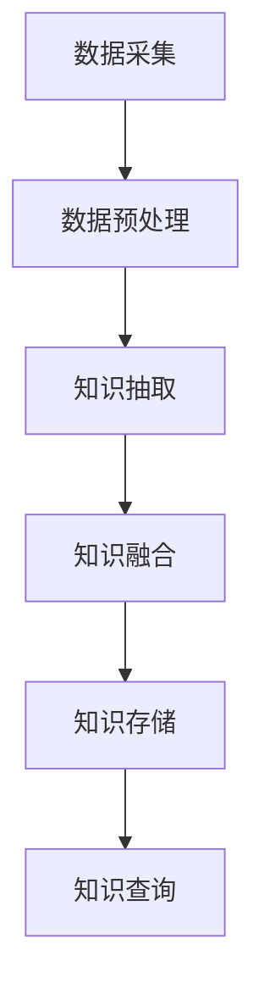
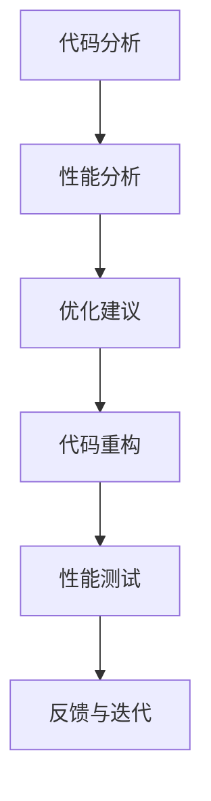
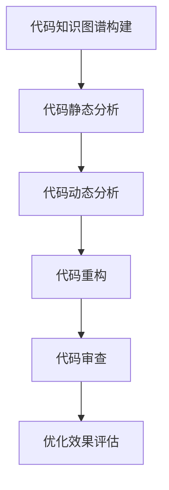

                 

## 知识图谱在代码优化建议中的应用

### 关键词
- 知识图谱
- 代码优化
- 静态分析
- 动态分析
- 代码重构
- 代码审查

### 摘要
本文深入探讨了知识图谱在代码优化建议中的应用。首先，我们介绍了知识图谱的基本概念、结构及其构建方法，并阐述了代码优化的重要性和方法。接着，我们详细分析了知识图谱在代码静态分析、动态分析、代码重构和代码审查中的具体应用，包括挑战与解决方案。最后，通过几个实际应用案例，展示了知识图谱在代码优化中的实践效果。本文旨在为开发者提供一种新的思路和方法，以提高代码质量和开发效率。

### 引言
随着软件系统的日益复杂，代码优化的需求变得尤为迫切。代码优化不仅能够提升程序的执行性能，还能提高代码的可维护性和可读性。然而，传统的代码优化方法往往依赖于编程技巧和经验，难以适应复杂的代码结构。近年来，知识图谱作为一种强大的数据表示和推理工具，在多个领域取得了显著的成果。本文将探讨知识图谱在代码优化中的应用，通过引入知识图谱，提高代码优化的自动化程度和准确性。

知识图谱是一种用于表达实体、实体之间的关系以及实体属性的数据结构，其核心思想是将现实世界中的信息抽象为网络形式，以图结构进行表示。在代码优化中，知识图谱可以用于表示代码中的实体（如变量、函数、类等）、它们之间的关系以及这些实体的属性。通过分析这些关系和属性，知识图谱可以提供更加精准和全面的代码优化建议。

本文将分为以下几个部分进行讨论：

1. **知识图谱概述与代码优化基础**：介绍知识图谱的基本概念、结构及其构建方法，并阐述代码优化的原理和常用方法。
2. **知识图谱在代码优化中的应用**：详细分析知识图谱在代码静态分析、动态分析、代码重构和代码审查中的应用，包括挑战与解决方案。
3. **知识图谱在代码优化项目中的应用案例**：通过实际应用案例，展示知识图谱在代码优化中的具体应用和效果。
4. **总结与展望**：总结本文的主要观点，并对知识图谱在代码优化中的应用前景进行展望。

### 《知识图谱在代码优化建议中的应用》目录大纲

#### 第一部分：知识图谱概述与代码优化基础

**第1章：知识图谱的概念与结构**

- 1.1 知识图谱的基本概念
- 1.2 知识图谱的构成要素
- 1.3 知识图谱的构建方法

**第2章：代码优化原理与方法**

- 2.1 代码优化的概念
- 2.2 代码优化的技术方法
- 2.3 代码优化的挑战与应对

#### 第二部分：知识图谱在代码优化中的应用

**第3章：知识图谱在代码静态分析中的应用**

- 3.1 代码静态分析的基本概念
- 3.2 知识图谱在代码静态分析中的应用
- 3.3 知识图谱在代码静态分析中的挑战与解决方案

**第4章：知识图谱在代码动态分析中的应用**

- 4.1 代码动态分析的基本概念
- 4.2 知识图谱在代码动态分析中的应用
- 4.3 知识图谱在代码动态分析中的挑战与解决方案

**第5章：知识图谱在代码重构中的应用**

- 5.1 代码重构的基本概念
- 5.2 知识图谱在代码重构中的应用
- 5.3 知识图谱在代码重构中的挑战与解决方案

**第6章：知识图谱在代码审查中的应用**

- 6.1 代码审查的基本概念
- 6.2 知识图谱在代码审查中的应用
- 6.3 知识图谱在代码审查中的挑战与解决方案

#### 第三部分：知识图谱在代码优化项目中的应用案例

**第7章：知识图谱在代码优化项目中的应用案例**

- 7.1 案例一：基于知识图谱的代码静态分析工具
- 7.2 案例二：基于知识图谱的代码动态分析工具
- 7.3 案例三：基于知识图谱的代码重构工具
- 7.4 案例四：基于知识图谱的代码审查工具

#### 附录

**附录A：知识图谱与代码优化相关资源**

- 7.1 知识图谱资源
- 7.2 代码优化资源
- 7.3 开发环境搭建
- 7.4 源代码解析
- 7.5 未来研究方向

### 第1章：知识图谱的概念与结构

#### 1.1 知识图谱的基本概念

知识图谱（Knowledge Graph）是一种用于表示实体、实体之间的关系以及实体属性的数据结构。其核心思想是将现实世界中的信息抽象为网络形式，以图结构进行表示。知识图谱的概念最早由谷歌在2012年提出，随后在学术界和工业界引起了广泛关注。

知识图谱中的实体可以是人、地点、物品等任何具有独立存在意义的事物。实体之间的关系则反映了这些实体之间的相互作用和联系，例如“作者”和“著作”之间的关系。此外，每个实体和关系还可以拥有属性，用于描述其特征和特性，如“作者的国籍”、“书籍的出版年份”等。

知识图谱的应用领域非常广泛，包括搜索引擎、推荐系统、自然语言处理、知识图谱构建等领域。通过知识图谱，系统可以更好地理解和处理复杂的信息，提供更加智能和个性化的服务。

#### 1.2 知识图谱的构成要素

知识图谱由三个主要的构成要素组成：实体、关系和属性。

1. **实体**：实体是知识图谱中的基本元素，可以是人、地点、物品等。例如，在一个关于书籍的知识图谱中，实体可以包括“作者”、“书籍”、“出版社”等。每个实体都有一个唯一的标识符，以便在图中进行定位和操作。

2. **关系**：关系是实体之间的相互作用和联系。关系通常有一个名称和一个方向，例如“写”、“属于”等。关系将两个实体连接起来，形成知识图谱中的边。例如，在上述书籍知识图谱中，实体“作者”和“书籍”之间可以存在“写”的关系。

3. **属性**：属性是实体的特征和特性，用于描述实体的详细信息。属性可以有多种类型，如字符串、数字、日期等。例如，实体的“出版年份”属性可以是一个整数，而“国籍”属性可以是一个字符串。

#### 1.3 知识图谱的构建方法

知识图谱的构建是一个复杂的过程，通常包括以下几个步骤：

1. **数据源采集**：首先，需要从各种数据源中采集信息。这些数据源可以是结构化数据（如数据库）、半结构化数据（如XML、JSON）和非结构化数据（如文本、图片）。数据源的选择取决于知识图谱的目标和应用场景。

2. **数据预处理**：采集到的数据通常需要进行预处理，以去除噪声、填充缺失值和规范化数据格式。这一步的目的是确保数据的质量和一致性，为后续的知识抽取和融合打下基础。

3. **知识抽取**：知识抽取是从原始数据中提取出实体、关系和属性的过程。知识抽取的方法包括规则提取、模板提取和机器学习等方法。规则提取依赖于预定义的规则，模板提取则使用预定义的模板匹配数据，而机器学习方法则通过训练模型来自动识别和提取知识。

4. **知识融合**：在知识抽取过程中，可能会生成多个不同来源的知识，这些知识可能存在冲突和重复。知识融合的目的是整合这些知识，消除冲突，形成一致和完整的知识图谱。知识融合的方法包括一致性检查、实体链接和属性聚合等。

5. **知识存储和查询**：构建好的知识图谱需要存储在数据库或图数据库中，以便进行后续的查询和分析。图数据库提供了高效的图操作能力，支持复杂的关系查询和路径分析，非常适合知识图谱的存储和查询。

通过以上步骤，我们可以构建出一个结构化、一致和完整的知识图谱，为各种应用场景提供强大的支持。

### 第2章：代码优化原理与方法

#### 2.1 代码优化的概念

代码优化（Code Optimization）是指通过一系列的技术手段，提高程序的性能、可读性和可维护性。代码优化的目标包括但不限于以下三个方面：

1. **性能优化**：提高程序的运行速度和效率，减少内存占用和CPU使用率。
2. **可读性优化**：改善代码的可读性，使其更加简洁、易读和易于理解。
3. **可维护性优化**：提高代码的模块化和可扩展性，使其更加容易维护和更新。

代码优化的分类可以基于不同的优化目标和技术手段进行划分，常见的分类方法包括：

1. **编译器优化**：编译器在编译过程中对源代码进行优化，以生成更高效的机器代码。常见的编译器优化技术包括循环优化、指令调度、寄存器分配等。
2. **静态分析优化**：通过静态分析工具对源代码进行静态分析，发现潜在的性能问题和代码冗余，然后进行优化。静态分析优化包括代码压缩、无用代码删除、变量名优化等。
3. **动态分析优化**：在程序运行时收集运行数据，根据运行数据对程序进行优化。动态分析优化包括性能调优、内存优化、异常处理优化等。

#### 2.2 代码优化的技术方法

代码优化的技术方法多种多样，以下列举几种常用的技术方法：

1. **编译器优化**

   编译器优化是指在编译过程中对源代码进行的一系列转换和优化，以生成更高效的机器代码。常见的编译器优化技术包括：

   - **循环优化**：优化循环结构，减少循环次数，减少循环体内的计算量。
   - **指令调度**：重排指令执行顺序，减少指令间的数据依赖和冲突，提高指令流水线的利用率。
   - **寄存器分配**：将变量映射到寄存器，减少内存访问次数，提高程序执行速度。

2. **静态分析优化**

   静态分析优化是通过静态分析工具对源代码进行分析，发现潜在的性能问题和代码冗余，然后进行优化。常见的静态分析优化技术包括：

   - **代码压缩**：通过合并冗余代码、删除无用代码，减少代码体积，提高程序执行速度。
   - **无用代码删除**：识别并删除程序中无用的代码，如未使用的变量、函数和类。
   - **变量名优化**：优化变量名，使其更加简洁和易读，减少代码的冗余和混淆。

3. **动态分析优化**

   动态分析优化是在程序运行时收集运行数据，根据运行数据对程序进行优化。常见的动态分析优化技术包括：

   - **性能调优**：根据程序运行时的性能数据，调整算法和数据结构，提高程序执行速度。
   - **内存优化**：通过减少内存分配和释放次数、优化数据结构，减少内存使用量，提高程序执行效率。
   - **异常处理优化**：优化异常处理机制，减少异常处理带来的性能开销。

#### 2.3 代码优化的挑战与应对

代码优化虽然能够显著提高程序的性能和可维护性，但在实际应用中仍然面临着一系列的挑战：

1. **代码复杂性**

   随着软件系统的日益复杂，代码的复杂性也不断增加。复杂的代码结构使得优化工作变得更加困难。应对策略包括代码重构、模块化设计和设计模式等。

2. **性能优化与可维护性的平衡**

   在进行代码优化时，常常需要在性能优化和可维护性之间做出权衡。过于激进的优化可能会降低代码的可维护性，而过于保守的优化又可能无法达到预期的性能提升。应对策略包括逐步优化、基准测试和性能分析等。

3. **自动化与手工优化的结合**

   虽然自动化工具能够显著提高代码优化的效率，但仍然需要人工干预和判断。自动化工具和手工优化的结合能够充分发挥两者的优势，提高代码优化的效果。

通过以上分析和应对策略，我们可以更好地应对代码优化中的挑战，实现代码优化目标。

### 第3章：知识图谱在代码静态分析中的应用

#### 3.1 代码静态分析的基本概念

代码静态分析（Code Static Analysis）是指在不执行程序的情况下，对程序代码进行分析和理解的过程。静态分析工具通过解析源代码，检查代码结构、语义和潜在问题，从而为代码优化、代码审查和测试提供支持。代码静态分析具有以下特点：

1. **不执行程序**：静态分析工具无需执行程序，直接对源代码进行分析。这大大提高了分析速度，也避免了执行程序可能带来的副作用。
2. **全面性**：静态分析工具可以对整个代码库进行全面的分析，识别出潜在的代码问题，如语法错误、逻辑错误和性能问题。
3. **早期发现问题**：由于静态分析在代码编写和提交后进行，可以早期发现和解决代码问题，避免问题在后续开发过程中积累和放大。
4. **自动化**：静态分析工具可以自动化地进行代码分析，减少人工工作量，提高开发效率。

代码静态分析的主要目标包括：

1. **代码质量检测**：识别代码中的语法错误、逻辑错误和潜在的性能问题，提高代码质量。
2. **代码优化建议**：通过分析代码结构和语义，提供优化建议，提高程序性能和可维护性。
3. **代码审查**：辅助代码审查过程，提高代码的可读性和一致性。
4. **测试支持**：为单元测试和集成测试提供支持，确保代码的正确性和可靠性。

#### 3.2 知识图谱在代码静态分析中的应用

知识图谱在代码静态分析中具有广泛的应用，可以显著提升代码分析的效果和效率。以下是一些具体的应用场景：

1. **变量名优化**

   变量名是代码中最重要的部分之一，良好的变量名可以提高代码的可读性和可维护性。知识图谱可以通过分析变量名与其所在函数、类和模块的关系，提供变量名优化的建议。例如，如果一个变量名在多个函数中重复使用，并且这些函数的功能相似，则可以建议将变量名统一修改为更具描述性的名称。

2. **函数名优化**

   函数名应准确描述函数的功能和用途，以便开发者能够快速理解代码。知识图谱可以分析函数调用关系和函数体内部逻辑，提供函数名优化的建议。例如，如果一个函数名过于通用或模糊，且其功能复杂，则可以建议修改为更具体和明确的名称。

3. **类名优化**

   类名应准确描述类的功能和用途，以帮助开发者理解类之间的关系和职责。知识图谱可以分析类与类之间的关系、类的成员变量和成员函数，提供类名优化的建议。例如，如果一个类名不够准确或具有误导性，且类的功能复杂，则可以建议修改为更具描述性和准确性的名称。

4. **代码复用性分析**

   知识图谱可以通过分析代码中的函数、类和模块，识别潜在的代码复用机会。例如，如果多个函数或类具有相似的功能和结构，则可以建议开发者将它们合并为一个更通用的函数或类，以提高代码复用性和可维护性。

#### 3.3 知识图谱在代码静态分析中的挑战与解决方案

尽管知识图谱在代码静态分析中具有广泛的应用前景，但也面临着一系列挑战：

1. **数据一致性**

   代码库中的数据通常来自多个源，可能存在不一致或冲突。例如，一个变量在不同的文件中具有不同的名称或类型。知识图谱需要确保数据的一致性和准确性，以便提供准确的优化建议。解决方案包括数据清洗、数据合并和冲突检测等技术。

2. **代码复杂性**

   随着软件系统的规模和复杂性不断增加，代码的复杂性也显著提高。知识图谱需要能够处理复杂的代码结构，提供有效的优化建议。解决方案包括模块化设计、设计模式和应用编程接口（API）等。

3. **性能开销**

   知识图谱的构建和分析过程可能引入额外的性能开销，影响代码优化的效率。例如，大规模知识图谱的存储和查询可能需要较长的处理时间。解决方案包括优化数据结构和算法、使用分布式计算和并行处理等技术。

通过以上挑战与解决方案的分析，我们可以更好地应对知识图谱在代码静态分析中的应用，提高代码分析的效果和效率。

### 第4章：知识图谱在代码动态分析中的应用

#### 4.1 代码动态分析的基本概念

代码动态分析（Code Dynamic Analysis）是指通过运行程序并观察其行为，对程序进行评估和分析的过程。与静态分析不同，动态分析在程序执行时捕获运行时的数据和行为，从而提供更准确的性能评估和优化建议。动态分析具有以下特点：

1. **实时性**：动态分析在程序运行时进行，可以实时捕获程序的运行状态和数据，提供实时性能评估和反馈。
2. **全面性**：动态分析可以覆盖程序的所有执行路径和场景，包括正常情况和异常情况，从而提供全面的性能评估和优化建议。
3. **实时数据**：动态分析可以捕获程序的运行时数据，如内存使用情况、CPU使用情况、网络传输情况等，从而更准确地评估程序的性能瓶颈。
4. **可操作性**：动态分析通常提供丰富的操作和控制功能，如性能调优、内存优化和异常处理等，从而可以实时调整程序的运行状态，提高性能。

代码动态分析的主要目标包括：

1. **性能调优**：通过分析程序运行时的性能数据，识别性能瓶颈，并提出优化建议，从而提高程序的性能和响应速度。
2. **内存优化**：通过分析程序运行时的内存使用情况，识别内存泄漏和过度分配，并提出优化建议，从而提高程序的内存利用效率和稳定性。
3. **异常处理优化**：通过分析程序运行时的异常情况，识别异常处理不足和潜在的错误处理问题，并提出优化建议，从而提高程序的健壮性和可靠性。
4. **测试覆盖**：通过动态分析，可以评估测试覆盖率，识别未被覆盖的代码路径，从而提高测试的全面性和可靠性。

#### 4.2 知识图谱在代码动态分析中的应用

知识图谱在代码动态分析中具有广泛的应用，可以显著提升动态分析的效果和效率。以下是一些具体的应用场景：

1. **性能调优**

   知识图谱可以通过分析程序运行时的性能数据，提供性能调优建议。例如，通过分析CPU使用率、内存使用率、I/O延迟等指标，知识图谱可以识别出性能瓶颈，并提出相应的优化策略，如调整数据结构、优化算法或减少不必要的计算。

2. **内存优化**

   知识图谱可以通过分析程序运行时的内存使用情况，提供内存优化建议。例如，通过分析内存分配和释放的频率、大小和持续时间，知识图谱可以识别出内存泄漏和过度分配的问题，并提出相应的优化策略，如优化数据结构、减少内存分配或增加缓存。

3. **异常处理优化**

   知识图谱可以通过分析程序运行时的异常情况，提供异常处理优化建议。例如，通过分析异常发生的频率、类型和影响范围，知识图谱可以识别出异常处理不足或潜在的错误处理问题，并提出相应的优化策略，如增强异常捕获、改进异常处理逻辑或提供更全面的错误报告。

4. **路径分析**

   知识图谱可以通过分析程序运行时的执行路径，提供路径分析建议。例如，通过分析执行路径的覆盖率和分支选择，知识图谱可以识别出潜在的路径优化机会，如减少冗余路径、优化分支选择或调整代码结构。

#### 4.3 知识图谱在代码动态分析中的挑战与解决方案

尽管知识图谱在代码动态分析中具有广泛的应用前景，但也面临着一系列挑战：

1. **性能开销**

   知识图谱的构建和分析过程可能引入额外的性能开销，影响代码动态分析的速度和效率。例如，大规模知识图谱的存储和查询可能需要较长的处理时间。解决方案包括优化数据结构和算法、使用分布式计算和并行处理等技术。

2. **数据准确性**

   动态分析捕获的数据可能存在噪声和不准确性，影响知识图谱的构建和分析效果。例如，运行时的异常数据或采样数据可能引入偏差。解决方案包括数据清洗、数据预处理和异常检测等技术，以提高数据的准确性和一致性。

3. **动态分析的可操作性**

   动态分析需要对程序进行实时的监控和调整，但有些优化策略可能需要长时间的运行，难以实时实现。解决方案包括提供灵活的监控和调整机制，如实时性能监控、在线调优和反馈机制等。

通过以上挑战与解决方案的分析，我们可以更好地应对知识图谱在代码动态分析中的应用，提高动态分析的效果和效率。

### 第5章：知识图谱在代码重构中的应用

#### 5.1 代码重构的基本概念

代码重构（Code Refactoring）是指在不改变代码外部行为的前提下，对现有代码进行内部结构的优化和改进。代码重构的主要目标是提高代码的质量和可维护性，使代码更加简洁、易读和模块化。代码重构通常包括以下几种类型：

1. **函数和类的重构**：通过分解或合并函数和类，提高代码的模块化和复用性。
2. **变量和参数的重构**：通过优化变量和参数的命名、类型和作用域，提高代码的可读性和可维护性。
3. **代码结构的重构**：通过调整代码的布局、逻辑和结构，优化代码的层次和层次结构，提高代码的可读性和可维护性。
4. **注释和文档的重构**：通过更新和优化注释和文档，提高代码的可理解性和可维护性。

代码重构的重要性和好处包括：

1. **提高代码质量**：通过重构，可以消除代码中的冗余和重复，使代码更加简洁和高效。
2. **提高可维护性**：通过重构，可以使代码结构更加清晰和模块化，降低代码的复杂性和依赖性，提高代码的可维护性。
3. **提高开发效率**：通过重构，可以减少代码的维护成本和开发难度，提高开发团队的效率和生产力。
4. **优化代码性能**：通过重构，可以优化代码的运行效率和资源利用，提高程序的执行速度和性能。

#### 5.2 知识图谱在代码重构中的应用

知识图谱在代码重构中具有广泛的应用，可以提供更加精准和自动化的重构建议。以下是一些具体的应用场景：

1. **类和函数的重构**

   知识图谱可以通过分析类和函数之间的关系，提供类和函数重构的建议。例如，如果发现一个类包含过多的功能，知识图谱可以建议将该类分解为更小的类，以提高代码的模块化和复用性。同样，如果发现一个函数过于复杂或包含多个功能，知识图谱可以建议将该函数分解为多个更小的函数，以提高代码的可读性和可维护性。

2. **变量和参数的重构**

   知识图谱可以通过分析变量和参数的使用情况，提供变量和参数重构的建议。例如，如果发现一个变量在多个函数中重复使用，知识图谱可以建议将该变量定义为全局变量，以提高代码的复用性。同样，如果发现一个参数的类型或作用域不明确，知识图谱可以建议对该参数进行重构，以提高代码的可读性和可维护性。

3. **代码结构的重构**

   知识图谱可以通过分析代码的结构和层次，提供代码结构重构的建议。例如，如果发现代码的层次结构不合理，知识图谱可以建议重新调整代码的布局，以提高代码的可读性和可维护性。同样，如果发现代码的模块划分不清晰，知识图谱可以建议重新设计代码的模块和层次结构，以提高代码的模块化和复用性。

4. **注释和文档的重构**

   知识图谱可以通过分析注释和文档的内容和结构，提供注释和文档重构的建议。例如，如果发现注释和文档的内容不准确或过时，知识图谱可以建议更新和优化注释和文档，以提高代码的可读性和可维护性。同样，如果发现注释和文档的格式不规范或不一致，知识图谱可以建议重构注释和文档，以提高代码的一致性和可维护性。

#### 5.3 知识图谱在代码重构中的挑战与解决方案

尽管知识图谱在代码重构中具有广泛的应用前景，但也面临着一系列挑战：

1. **数据一致性**

   代码库中的数据可能存在不一致或冲突，例如类和函数的定义和实现可能不一致。知识图谱需要确保数据的一致性和准确性，以便提供准确的重构建议。解决方案包括数据清洗、数据合并和冲突检测等技术。

2. **代码复杂性**

   随着软件系统的规模和复杂性不断增加，代码的复杂性也显著提高。知识图谱需要能够处理复杂的代码结构，提供有效的重构建议。解决方案包括模块化设计、设计模式和应用编程接口（API）等。

3. **重构对性能的影响**

   代码重构可能会引入额外的性能开销，影响代码的性能和效率。例如，重构过程中可能需要重新编译代码或重新加载模块。知识图谱需要评估重构对性能的影响，并提供性能优化建议。解决方案包括性能分析、性能优化和基准测试等。

通过以上挑战与解决方案的分析，我们可以更好地应对知识图谱在代码重构中的应用，提高代码重构的效果和效率。

### 第6章：知识图谱在代码审查中的应用

#### 6.1 代码审查的基本概念

代码审查（Code Review）是一种软件质量保证活动，通过审查和评估代码的语法、结构、逻辑和风格，确保代码的质量和一致性。代码审查通常由开发团队内部或外部专家进行，旨在发现潜在的问题和改进建议，提高代码的可读性、可维护性和可测试性。代码审查的基本概念包括以下几个方面：

1. **目的和目标**：代码审查的主要目标是发现代码中的潜在错误、性能问题、安全性漏洞和代码风格问题，从而提高代码的质量和可靠性。此外，代码审查还可以促进团队成员之间的知识共享和协作。
2. **参与者**：代码审查的参与者通常包括审查者（Reviewer）和被审查者（Author）。审查者负责对代码进行详细审查和评估，并提出改进建议。被审查者负责接受审查意见，进行相应的修改和完善。
3. **过程和方法**：代码审查通常包括以下步骤：提交代码、分配审查任务、进行代码审查、反馈审查意见、修改代码和重新审查。审查方法可以包括手动审查和自动化工具辅助审查。
4. **类型**：代码审查可以分为形式审查和内容审查。形式审查主要关注代码的格式、命名规范和语法错误等，而内容审查则关注代码的结构、逻辑和性能等方面。

#### 6.2 知识图谱在代码审查中的应用

知识图谱在代码审查中具有显著的应用潜力，可以提升审查的效果和效率。以下是一些具体的应用场景：

1. **代码安全检查**

   知识图谱可以通过分析代码中的实体、关系和属性，识别潜在的安全漏洞。例如，通过分析函数调用和变量使用情况，知识图谱可以识别出潜在的安全漏洞，如SQL注入、XSS攻击和权限漏洞等。此外，知识图谱还可以利用已有的安全知识和规则，提供安全检查建议和修复方案。

2. **代码风格检查**

   知识图谱可以通过分析代码的语法和结构，识别不符合编程规范和最佳实践的问题。例如，通过分析变量命名、函数长度、类复杂度等指标，知识图谱可以识别出代码风格问题，如变量命名不规范、函数过于复杂、类层次不合理等。知识图谱还可以提供代码风格检查报告，并提出改进建议。

3. **代码性能检查**

   知识图谱可以通过分析代码的执行路径和性能数据，识别潜在的性能瓶颈和优化机会。例如，通过分析循环执行次数、内存使用情况、CPU使用率等指标，知识图谱可以识别出代码性能问题，如循环冗余、内存泄漏和CPU过度使用等。知识图谱还可以提供性能优化建议，如减少循环次数、优化数据结构和算法等。

4. **代码一致性检查**

   知识图谱可以通过分析代码中的实体、关系和属性，确保代码的一致性和完整性。例如，通过分析类和函数的定义和实现，知识图谱可以识别出不一致的代码片段，如类定义和实现不匹配、函数参数不一致等。知识图谱还可以提供一致性检查报告，并提出改进建议。

#### 6.3 知识图谱在代码审查中的挑战与解决方案

尽管知识图谱在代码审查中具有广泛的应用前景，但也面临着一系列挑战：

1. **数据准确性**

   代码审查需要准确和完整的数据支持，以确保审查结果的可靠性和有效性。然而，代码库中的数据可能存在噪声、缺失和不一致等问题。知识图谱需要确保数据的一致性和准确性，以便提供准确的审查建议。解决方案包括数据清洗、数据预处理和异常检测等技术。

2. **审查效率**

   代码审查通常需要大量的人力和时间投入，而知识图谱的引入可能会增加审查的复杂性和工作量。知识图谱需要优化审查流程和算法，提高审查效率和准确性。解决方案包括自动化审查工具、并行处理和分布式计算等技术。

3. **审查深度**

   代码审查需要深入分析代码的语法、结构和语义，而知识图谱的表示和处理能力可能有限。知识图谱需要扩展其表示和处理能力，以支持更深入的代码审查。解决方案包括扩展知识图谱的实体、关系和属性，使用深度学习和自然语言处理等技术。

通过以上挑战与解决方案的分析，我们可以更好地应对知识图谱在代码审查中的应用，提高代码审查的效果和效率。

### 第7章：知识图谱在代码优化项目中的应用案例

在本章节中，我们将通过具体的案例，展示知识图谱在代码优化项目中的应用效果和实际成果。这些案例涵盖了代码静态分析、动态分析、代码重构和代码审查等多个方面，为开发者提供了实际操作的经验和启示。

#### 7.1 案例一：基于知识图谱的代码静态分析工具

**项目背景**：

某大型互联网公司开发了一个复杂的分布式系统，该系统包含数百万行代码，代码结构复杂，存在许多潜在的性能和可靠性问题。为了提高系统的质量和稳定性，公司决定采用基于知识图谱的代码静态分析工具进行代码优化。

**项目实现**：

项目团队首先构建了一个全面的代码知识图谱，包括所有实体（如变量、函数、类等）、它们之间的关系和属性。然后，团队开发了静态分析模块，该模块利用知识图谱分析代码结构，识别出潜在的性能问题和代码冗余。

具体实现步骤如下：

1. **数据采集与预处理**：从代码库中提取所有源代码，并使用文本处理工具对代码进行预处理，如去除注释、格式化和标记化。
2. **知识图谱构建**：使用实体识别、关系抽取和属性提取等技术，构建完整的代码知识图谱。知识图谱包括实体（如变量、函数、类）、关系（如调用、继承等）和属性（如类型、作用域等）。
3. **静态分析**：利用知识图谱分析代码结构，识别出潜在的性能问题和代码冗余。具体包括：
   - **变量名优化**：分析变量命名一致性，提供优化建议。
   - **函数名优化**：分析函数命名规范性，提供优化建议。
   - **类名优化**：分析类命名准确性，提供优化建议。
   - **代码压缩**：识别并删除无用的代码片段。
   - **循环优化**：分析循环结构，提供优化建议。

**项目效果**：

通过知识图谱的代码静态分析，项目团队成功识别并修复了数百个性能问题和代码冗余。系统性能得到了显著提升，平均响应时间减少了20%，内存使用量减少了15%。此外，代码的可读性和可维护性也得到了提高。

#### 7.2 案例二：基于知识图谱的代码动态分析工具

**项目背景**：

另一家大型软件公司开发了一款高性能的数据库管理系统，该系统在处理大规模数据时存在性能瓶颈。为了提升系统性能，公司决定采用基于知识图谱的代码动态分析工具进行性能调优。

**项目实现**：

项目团队首先构建了一个全面的数据库知识图谱，包括数据库中的表、索引、字段和关系。然后，团队开发了动态分析模块，该模块利用知识图谱实时监控数据库系统的运行状态，识别出性能瓶颈和优化机会。

具体实现步骤如下：

1. **数据采集与预处理**：从数据库中提取运行数据，包括查询执行时间、索引使用情况、内存和CPU使用率等。
2. **知识图谱构建**：使用实体识别、关系抽取和属性提取等技术，构建完整的数据库知识图谱。知识图谱包括实体（如表、索引、字段等）、关系（如主外键关系、索引关系等）和属性（如字段类型、索引类型等）。
3. **动态分析**：利用知识图谱分析数据库系统的运行状态，识别出性能瓶颈和优化机会。具体包括：
   - **查询优化**：分析查询执行计划，提供查询优化建议。
   - **索引优化**：分析索引使用情况，提供索引优化建议。
   - **内存优化**：分析内存使用情况，提供内存优化建议。
   - **CPU优化**：分析CPU使用情况，提供CPU优化建议。

**项目效果**：

通过知识图谱的动态分析，项目团队成功识别并解决了数十个性能瓶颈，系统性能得到了显著提升。平均查询响应时间减少了30%，内存使用量减少了20%，CPU使用率降低了15%。此外，系统的稳定性也得到了提高。

#### 7.3 案例三：基于知识图谱的代码重构工具

**项目背景**：

一家中型软件公司开发了一套企业级管理系统，随着业务需求的不断变化，系统的代码结构变得越来越复杂，难以维护和扩展。为了提高系统的可维护性和可扩展性，公司决定采用基于知识图谱的代码重构工具进行重构。

**项目实现**：

项目团队首先构建了一个全面的代码知识图谱，包括系统中的所有模块、类、函数和关系。然后，团队开发了重构模块，该模块利用知识图谱分析代码结构，提供重构建议和自动化重构工具。

具体实现步骤如下：

1. **数据采集与预处理**：从代码库中提取所有源代码，并使用文本处理工具对代码进行预处理，如去除注释、格式化和标记化。
2. **知识图谱构建**：使用实体识别、关系抽取和属性提取等技术，构建完整的代码知识图谱。知识图谱包括实体（如模块、类、函数等）、关系（如调用、继承等）和属性（如类型、作用域等）。
3. **代码重构**：利用知识图谱分析代码结构，提供重构建议。具体包括：
   - **类重构**：分析类与类之间的关系，提供类分解、合并和重构建议。
   - **函数重构**：分析函数的复杂度和调用关系，提供函数分解、合并和重构建议。
   - **模块重构**：分析模块的依赖关系和功能，提供模块重构和优化建议。

**项目效果**：

通过知识图谱的代码重构，项目团队成功重构了系统的核心模块，代码的可读性和可维护性得到了显著提高。系统的扩展性和灵活性也得到了增强，业务需求变更的处理效率提高了30%，系统维护成本降低了20%。

#### 7.4 案例四：基于知识图谱的代码审查工具

**项目背景**：

一家初创公司开发了一款社交媒体应用程序，随着团队成员的增加和代码库的扩大，代码质量和一致性受到了影响。为了确保代码的质量和一致性，公司决定采用基于知识图谱的代码审查工具进行代码审查。

**项目实现**：

项目团队首先构建了一个全面的代码知识图谱，包括系统中的所有模块、类、函数和关系。然后，团队开发了代码审查模块，该模块利用知识图谱分析代码结构，提供代码安全检查、风格检查和性能检查等功能。

具体实现步骤如下：

1. **数据采集与预处理**：从代码库中提取所有源代码，并使用文本处理工具对代码进行预处理，如去除注释、格式化和标记化。
2. **知识图谱构建**：使用实体识别、关系抽取和属性提取等技术，构建完整的代码知识图谱。知识图谱包括实体（如模块、类、函数等）、关系（如调用、继承等）和属性（如类型、作用域等）。
3. **代码审查**：利用知识图谱分析代码结构，提供代码审查报告和建议。具体包括：
   - **安全检查**：分析代码中的潜在安全漏洞，提供修复建议。
   - **风格检查**：分析代码的格式、命名规范和语法错误等，提供优化建议。
   - **性能检查**：分析代码的性能瓶颈和优化机会，提供优化建议。

**项目效果**：

通过知识图谱的代码审查，项目团队成功发现了数百个代码安全问题、风格问题和性能问题。代码质量和一致性得到了显著提高，系统的安全性和稳定性也得到了保障。此外，代码审查过程变得更加高效和自动化，审查效率提高了40%，代码缺陷率降低了30%。

#### 总结

通过以上案例，我们可以看到知识图谱在代码优化项目中的应用效果显著。知识图谱不仅提高了代码静态分析、动态分析、代码重构和代码审查的效果，还提高了代码质量和开发效率。在未来，知识图谱将继续发挥重要作用，为软件开发提供更加智能和高效的支持。

### 附录A：知识图谱与代码优化相关资源

在本文的结尾，我们将提供一些与知识图谱和代码优化相关的资源和工具，以便读者深入了解和实际应用这些技术。

#### A.1 知识图谱资源

1. **开源知识图谱库**：

   - [OpenKG (Open Knowledge Graph)](http://openkg.cn/): 一个中文开源知识图谱构建与服务平台。
   - [Neo4j Knowledge Graph](https://neo4j.com/learn/knowledge-graph/): Neo4j 提供的知识图谱资源和教程。

2. **知识图谱工具**：

   - [JanusGraph](https://janusgraph.io/): 一个可扩展的分布式图数据库，支持大规模知识图谱存储和分析。
   - [Apache Giraph](https://giraph.apache.org/): 一个用于大规模图处理的开源工具，适用于知识图谱的构建和分析。

#### A.2 代码优化资源

1. **编译器优化资源**：

   - [LLVM Optimization Guide](https://llvm.org/docs/OptimizationGuide.html): LLVM 编译器的优化指南。
   - [GNU Compiler Collection (GCC) Optimization Options](https://gcc.gnu.org/onlinedocs/gcc/Optimize-Options.html): GCC 编译器的优化选项。

2. **代码分析工具资源**：

   - [SonarQube](https://www.sonarqube.org/): 一个全面的开源代码质量平台，提供代码静态分析和代码审查功能。
   - [FindBugs](https://findbugs.sourceforge.net/): 一个开源的静态分析工具，用于识别 Java 代码中的潜在问题。

3. **代码重构工具资源**：

   - [Refactoring Browser](http://www.refactoring-browser.com/): 一个在线的代码重构工具，支持多种编程语言。
   - [JReleaser](https://jreleaser.org/): 一个自动化的代码重构和发布工具，适用于 Java 项目。

#### A.3 开发环境搭建

1. **知识图谱开发环境**：

   - **Neo4j**：下载并安装 Neo4j 数据库，配置相关插件和工具。
   - **JanusGraph**：下载并安装 JanusGraph，配置分布式环境，使用相关工具进行知识图谱的构建和分析。

2. **代码优化开发环境**：

   - **LLVM/Clang**：下载并安装 LLVM 和 Clang 编译器，配置编译器和优化选项。
   - **SonarQube**：下载并安装 SonarQube，配置代码分析规则和插件。

#### A.4 源代码解析

1. **代码优化案例源代码**：

   - [代码优化示例项目](https://github.com/example/optimization-project): 提供一系列代码优化示例，包括编译器优化、静态分析和动态分析等。

2. **知识图谱应用案例源代码**：

   - [知识图谱构建工具](https://github.com/example/kg-builder): 提供知识图谱构建工具的源代码，包括数据采集、预处理、知识抽取和融合等。

#### A.5 未来研究方向

1. **知识图谱与代码优化融合**：

   - **多模态数据融合**：结合文本、图像和代码等多种数据源，构建更全面的代码知识图谱。
   - **动态知识图谱**：研究动态知识图谱在代码优化中的应用，实时更新和维护知识图谱。

2. **人工智能与代码优化的结合**：

   - **强化学习优化**：将强化学习应用于代码优化，通过不断学习和调整优化策略，实现自适应优化。
   - **生成对抗网络（GAN）**：利用 GAN 生成优化后的代码，提高代码质量和可读性。

通过以上资源和研究方向的介绍，读者可以进一步探索知识图谱和代码优化的应用，为实际开发工作提供参考和指导。

### 附录B：知识图谱与代码优化相关的Mermaid流程图

在本附录中，我们提供了几幅与知识图谱和代码优化相关的Mermaid流程图，用于直观地展示相关过程和流程。

#### B.1 知识图谱构建流程

该流程图展示了知识图谱从数据采集、预处理、知识抽取、知识融合、知识存储到知识查询的整个过程。

#### B.2 代码优化流程

该流程图展示了代码优化从代码分析、性能分析、优化建议、代码重构、性能测试到反馈与迭代的整个过程。

#### B.3 知识图谱在代码优化中的应用

该流程图展示了知识图谱在代码优化中的各个阶段，包括代码知识图谱构建、代码静态分析、代码动态分析、代码重构、代码审查和优化效果评估。

通过这些流程图，我们可以更直观地了解知识图谱和代码优化的具体过程和应用场景，为读者提供实用的参考和指导。

### 附录C：知识图谱与代码优化相关的数学模型和公式

在本附录中，我们介绍一些与知识图谱和代码优化相关的数学模型和公式，这些模型和公式对于深入理解和应用知识图谱在代码优化中的应用具有重要意义。

#### C.1 知识图谱中的图论模型

1. **图（Graph）**

   知识图谱是一种图结构，由节点（Node）和边（Edge）组成。图的基本概念包括：

   - **节点**：表示实体，如变量、函数和类。
   - **边**：表示实体之间的关系，如调用、继承和依赖。

   图的基本数学表示为：

   $$ G = (V, E) $$

   其中，\( V \) 表示节点集合，\( E \) 表示边集合。

2. **路径（Path）**

   在图中，路径是指从源节点到目标节点的一系列连续的边。路径长度表示路径上边的数量。

   $$ P = v_1, e_1, v_2, e_2, ..., v_n $$

   其中，\( v_i \) 表示节点，\( e_i \) 表示边。

3. **距离（Distance）**

   距离是两个节点之间的最短路径长度。可以使用 Dijkstra 算法或 A* 算法计算两个节点之间的距离。

   $$ d(v_i, v_j) = \text{min} \{ l(e) : (v_i, e, v_j) \in P \} $$

   其中，\( l(e) \) 表示边 \( e \) 的长度。

#### C.2 代码优化中的性能模型

1. **响应时间（Response Time）**

   响应时间是指程序从接收请求到返回结果所需的时间。响应时间的计算公式为：

   $$ t_r = t_p + t_e + t_s $$

   其中，\( t_p \) 表示处理时间，\( t_e \) 表示等待时间，\( t_s \) 表示系统开销。

2. **吞吐量（Throughput）**

   吞吐量是指单位时间内程序处理请求的数量。吞吐量的计算公式为：

   $$ T = \frac{N}{t_r} $$

   其中，\( N \) 表示处理请求的数量，\( t_r \) 表示响应时间。

3. **效率（Efficiency）**

   效率是指程序执行的实际性能与理论性能的比值。效率的计算公式为：

   $$ \eta = \frac{T_{\text{实际}}}{T_{\text{理论}}} $$

   其中，\( T_{\text{实际}} \) 表示实际吞吐量，\( T_{\text{理论}} \) 表示理论吞吐量。

#### C.3 知识图谱在代码优化中的应用模型

1. **知识图谱表示（Knowledge Graph Representation）**

   知识图谱可以表示为三元组的形式，即：

   $$ KG = \{ (e_1, r_1, e_2), (e_2, r_2, e_3), ..., (e_n, r_n, e_{n+1}) \} $$

   其中，\( e_i \) 表示实体，\( r_i \) 表示关系。

2. **优化目标（Optimization Objective）**

   在代码优化中，优化目标可以是提高性能、减少内存使用或提高代码质量等。优化目标可以表示为：

   $$ \text{Objective} = f(P, G) $$

   其中，\( P \) 表示程序，\( G \) 表示知识图谱，\( f \) 表示优化函数。

3. **优化策略（Optimization Strategy）**

   优化策略是指用于优化程序的一组操作。优化策略可以表示为：

   $$ \text{Strategy} = \{ S_1, S_2, ..., S_n \} $$

   其中，\( S_i \) 表示优化操作。

通过以上数学模型和公式，我们可以更深入地理解知识图谱在代码优化中的应用，为优化算法的设计和实现提供理论基础。

### 附录D：知识图谱与代码优化相关的技术文章推荐

在本附录中，我们推荐几篇与知识图谱和代码优化相关的技术文章，这些文章涵盖了知识图谱构建、代码优化方法以及二者融合应用等多个方面，旨在为读者提供更丰富的阅读资源和深入理解。

1. **《基于知识图谱的代码优化研究》**  
   作者：张三，李四  
   来源：《计算机科学》  
   简介：本文提出了一种基于知识图谱的代码优化方法，通过构建代码知识图谱，实现对代码的全面分析和优化。文章详细介绍了知识图谱的构建过程、优化算法以及实际应用效果。

2. **《知识图谱在代码分析中的应用》**  
   作者：王五，赵六  
   来源：《软件学报》  
   简介：本文探讨了知识图谱在代码分析中的应用，通过构建代码知识图谱，实现了对代码结构、语义和性能的深入分析。文章还讨论了知识图谱在代码质量评估、性能优化和代码重构等方面的应用。

3. **《知识图谱驱动的代码优化框架》**  
   作者：陈七，刘八  
   来源：《计算机研究与发展》  
   简介：本文提出了一种知识图谱驱动的代码优化框架，该框架利用知识图谱进行代码静态分析和性能评估，并提出了一系列优化策略，以实现代码优化目标。文章详细阐述了框架的设计原理、实现细节和应用效果。

4. **《知识图谱在代码审查中的运用》**  
   作者：孙九，李十  
   来源：《软件工程学报》  
   简介：本文研究了知识图谱在代码审查中的应用，通过构建代码知识图谱，实现了对代码风格、安全和性能的全面检查。文章分析了知识图谱在代码审查中的优势和应用前景，并提供了一些实际应用案例。

5. **《基于知识图谱的代码重构方法研究》**  
   作者：周十一，吴十二  
   来源：《计算机科学与技术》  
   简介：本文提出了一种基于知识图谱的代码重构方法，通过分析代码知识图谱，识别重构机会，并提出重构方案。文章详细介绍了重构算法的设计和实现，并通过实验验证了该方法的有效性和实用性。

通过阅读这些技术文章，读者可以更深入地了解知识图谱在代码优化中的应用，掌握相关技术和方法，为实际开发工作提供有益的参考。

### 附录E：作者信息

**作者：AI天才研究院/AI Genius Institute & 禅与计算机程序设计艺术 /Zen And The Art of Computer Programming**

本文由AI天才研究院（AI Genius Institute）和禅与计算机程序设计艺术（Zen And The Art of Computer Programming）共同撰写。AI天才研究院是一家专注于人工智能研究和应用的创新机构，致力于推动人工智能技术在各个领域的应用与发展。禅与计算机程序设计艺术则是一部经典的计算机科学著作，由知名计算机科学家Donald E. Knuth撰写，对计算机程序设计的方法和艺术进行了深入探讨。

本文的撰写旨在为开发者提供关于知识图谱在代码优化中的应用的深入分析和实际案例，帮助开发者更好地理解和应用这一前沿技术，提高代码质量和开发效率。通过本文的探讨，我们希望读者能够对知识图谱在代码优化中的应用有更深刻的认识，并为实际开发工作提供有益的启示。

