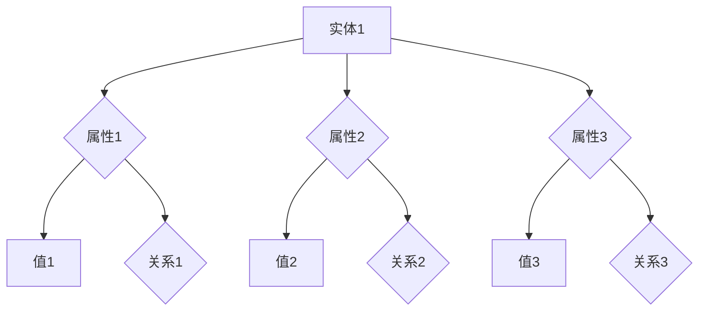
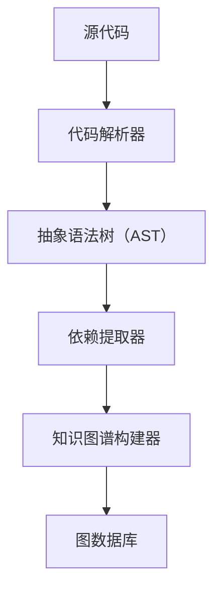
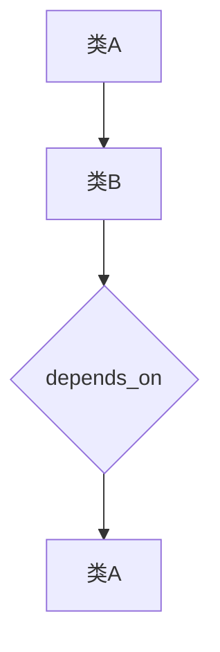

                 

### 《知识图谱在代码依赖分析中的应用》

#### 关键词：知识图谱、代码依赖分析、图论模型、实体-关系模型、算法优化、应用案例

> **摘要：**
本文将深入探讨知识图谱在代码依赖分析中的应用。我们将首先介绍知识图谱的基础概念和构建原理，然后详细讲解代码依赖分析的基本方法及其重要性，并展示知识图谱如何改进代码依赖分析过程。通过实际案例和算法讲解，读者将全面了解知识图谱在代码依赖分析中的实际应用，以及其所面临的挑战和未来的发展方向。

---

#### 第一部分：知识图谱基础

##### 第1章：知识图谱概述

知识图谱是一种结构化的语义知识库，用于表示实体、概念、关系及其属性，以实现知识查询、推理和发现。其重要性在于能够将海量的非结构化数据转化为结构化的知识，从而支持智能搜索、推荐系统和复杂决策支持。

- **1.1 知识图谱的定义与重要性**

知识图谱（Knowledge Graph）是一种用于表示实体和实体之间关系的图形结构。实体可以是任何具有独立存在意义的事物，如人、地点、组织、物品等。关系则描述了实体之间的相互作用，如“属于”、“位于”、“生产”等。知识图谱的重要性在于：

  - **结构化知识：** 通过图结构，知识图谱提供了结构化的数据组织方式，便于快速查询和索引。
  - **语义理解：** 知识图谱能够捕捉实体的属性和关系，从而实现更高级的语义理解。
  - **智能推理：** 知识图谱支持基于数据的逻辑推理，可以用于发现新的知识和洞见。
  - **辅助决策：** 知识图谱为各种决策系统提供了丰富的背景知识和辅助信息。

- **1.2 知识图谱的发展历程**

知识图谱的发展可以追溯到20世纪80年代的语义网络（Semantic Network）和知识表示（Knowledge Representation）领域。随着互联网和大数据技术的发展，知识图谱逐渐成为研究热点。以下是知识图谱的主要发展历程：

  - **早期探索：** 1984年，谷歌发布了PageRank算法，开创了基于链接分析的网页排名方法，这为后来的知识图谱构建提供了启发。
  - **社交媒体时代：** 2006年，Facebook的Open Graph项目提出了一种将网页内容与社交媒体相结合的语义链接模型，进一步推动了知识图谱的发展。
  - **搜索引擎：** 2012年，谷歌发布知识图谱（Google Knowledge Graph），通过实体和关系网络为用户提供更加准确和丰富的搜索结果。
  - **大数据与人工智能：** 当前，随着大数据和人工智能技术的不断进步，知识图谱的应用领域不断拓展，如智能问答、推荐系统、自动驾驶等。

- **1.3 知识图谱的关键特性**

知识图谱具有以下关键特性：

  - **实体（Entity）：** 实体是知识图谱中的核心概念，代表具有独立存在意义的事物。
  - **属性（Property）：** 属性描述了实体的特征，如“出生日期”、“工作单位”等。
  - **关系（Relationship）：** 关系描述了实体之间的相互作用，如“工作于”、“住在”等。
  - **多语言支持：** 知识图谱通常支持多种语言，以便处理跨国数据和用户需求。
  - **动态更新：** 知识图谱能够实时更新，以适应不断变化的数据和需求。
  - **数据融合：** 知识图谱能够融合来自多个数据源的信息，提高数据的完整性和准确性。

- **1.4 知识图谱的应用领域**

知识图谱在多个领域具有广泛的应用：

  - **搜索引擎：** 知识图谱能够提供更加准确和丰富的搜索结果，支持语义搜索和问答系统。
  - **推荐系统：** 知识图谱能够发现实体之间的关联，从而提高推荐系统的准确性和覆盖面。
  - **自动驾驶：** 知识图谱能够提供道路、交通规则和地理信息等关键数据，支持自动驾驶系统的决策。
  - **医疗健康：** 知识图谱能够整合医学知识，支持疾病诊断、治疗方案推荐等。
  - **金融风控：** 知识图谱能够识别风险实体和关系，支持金融欺诈检测、信用评估等。

- **1.5 知识图谱的核心概念与联系（Mermaid流程图）**

以下是一个简化的知识图谱Mermaid流程图，展示了实体、属性和关系之间的核心联系：



通过这个流程图，我们可以看到如何将实体、属性和关系结合起来，构建一个完整的知识图谱。

##### 第2章：知识图谱构建原理

知识图谱的构建是一个复杂的过程，涉及到多个关键步骤，包括知识表示与建模、数据源与数据预处理、知识提取与融合以及知识图谱的存储与索引。

- **2.1 知识表示与建模**

知识表示与建模是知识图谱构建的基础，其核心任务是定义实体的属性和关系，并将其结构化地组织起来。常见的知识表示方法包括：

  - **逻辑表示法：** 使用形式逻辑语言来定义实体和关系，如OWL（Web Ontology Language）和RDF（Resource Description Framework）。
  - **图论表示法：** 使用图结构来表示实体和关系，每个节点代表实体，每条边代表关系。
  - **实体-关系-属性（E-R）模型：** 类似于数据库中的E-R模型，将实体、属性和关系组织成表格结构。

在知识图谱中，实体、属性和关系通常使用三元组（Subject, Predicate, Object）来表示。例如，("张三", "工作于", "阿里巴巴") 表示张三在阿里巴巴工作。

- **2.2 数据源与数据预处理**

数据源是知识图谱构建的基石，可以是结构化数据（如数据库）、半结构化数据（如XML、JSON）或非结构化数据（如文本、图像）。数据预处理是知识图谱构建的重要步骤，主要包括：

  - **数据清洗：** 去除数据中的噪声、错误和不一致信息，提高数据质量。
  - **数据转换：** 将不同格式的数据转换为统一格式，如将XML转换为RDF三元组。
  - **数据整合：** 将来自多个数据源的信息进行整合，消除数据冗余，提高数据完整性。

数据预处理的质量直接影响到知识图谱的构建效果，因此需要精心设计和执行。

- **2.3 知识提取与融合**

知识提取是从原始数据中提取有用信息的过程，其目的是构建出高质量的实体、属性和关系。知识提取的主要方法包括：

  - **命名实体识别：** 从文本数据中识别出具有特定意义的实体，如人名、地名、组织名等。
  - **关系抽取：** 从文本数据中识别出实体之间的关系，如“工作于”、“位于”等。
  - **实体链接：** 将文本中提到的实体与知识图谱中的实体进行匹配，确保实体的一致性和准确性。

知识融合是将来自多个数据源的信息进行整合，以消除不一致性和冲突。知识融合的方法包括：

  - **实体匹配：** 将不同数据源中的实体进行匹配，确保实体的一致性。
  - **关系融合：** 将不同数据源中的关系进行融合，确保关系的准确性。
  - **属性融合：** 将不同数据源中的实体属性进行融合，确保属性的一致性。

- **2.4 知识图谱的存储与索引**

知识图谱的存储与索引是知识图谱构建的最后一步，其目标是高效地存储和管理知识图谱数据，以便快速查询和更新。常见的存储与索引方法包括：

  - **关系数据库：** 使用关系数据库来存储知识图谱数据，如MySQL、PostgreSQL等。
  - **图数据库：** 使用图数据库来存储知识图谱数据，如Neo4j、Apache Giraph等。
  - **索引技术：** 使用索引技术（如B+树、哈希表）来提高查询效率。

在知识图谱的存储与索引中，三元组存储是最常见的方式，每个三元组作为一个独立的记录存储。此外，还可以使用图索引技术（如Adjacency List、Adjacency Matrix）来提高查询效率。

通过以上步骤，我们可以构建出一个高质量的、结构化的知识图谱，为各种应用提供强大的知识支持和智能推理能力。

##### 第3章：代码依赖分析概述

代码依赖分析是软件工程中一个重要的研究领域，其目标是理解代码之间的依赖关系，以便进行代码维护、优化和重构。在软件系统的开发、测试和维护过程中，代码依赖分析具有至关重要的意义。

- **3.1 代码依赖的定义与分类**

代码依赖（Code Dependency）是指一个模块或类依赖于另一个模块或类的行为、实现或数据。根据依赖的性质，代码依赖可以分类为以下几类：

  - **直接依赖：** 直接依赖是指一个模块或类直接引用另一个模块或类的接口或实现。例如，类A直接依赖于类B，如果类A中包含对类B的直接引用。
  - **间接依赖：** 间接依赖是指一个模块或类通过另一个模块或类间接依赖于另一个模块或类的行为。例如，类A依赖于类B，而类B依赖于类C，因此类A间接依赖于类C。
  - **编译时依赖：** 编译时依赖是指编译器在编译代码时能够检测到的依赖关系。例如，类A在编译时依赖于类B的接口定义。
  - **运行时依赖：** 运行时依赖是指在程序运行时才能检测到的依赖关系。例如，类A在运行时需要类B的具体实现。

了解代码依赖的分类有助于我们更好地理解和分析代码之间的依赖关系，从而进行有效的代码维护和优化。

- **3.2 代码依赖分析的重要性**

代码依赖分析在软件工程中具有多个重要的应用场景，其重要性体现在以下几个方面：

  - **代码维护：** 通过代码依赖分析，我们可以识别出代码中的依赖关系，从而更容易理解代码的工作原理，便于进行代码的修改和维护。
  - **代码优化：** 代码依赖分析可以帮助我们识别出代码中的冗余依赖，从而进行代码的优化和重构，提高代码的可读性和可维护性。
  - **模块化设计：** 代码依赖分析有助于我们进行模块化设计，将代码分解为独立、功能明确的模块，从而提高代码的可重用性和可扩展性。
  - **代码复用：** 通过代码依赖分析，我们可以识别出可复用的代码模块，从而实现代码的复用，提高开发效率。
  - **测试覆盖：** 代码依赖分析可以帮助我们设计更有效的测试用例，确保对代码中的每个依赖关系进行充分测试。

总之，代码依赖分析是软件工程中不可或缺的一部分，对于提高代码质量、可维护性和可扩展性具有重要作用。

- **3.3 代码依赖分析的基本方法**

代码依赖分析的基本方法主要包括以下几种：

  - **静态分析：** 静态分析是通过解析代码文本，分析代码结构和语法规则，识别代码依赖关系。静态分析方法主要包括语法分析、抽象语法树（AST）分析、控制流分析等。
  - **动态分析：** 动态分析是通过运行程序，跟踪程序的执行过程，识别代码依赖关系。动态分析方法主要包括日志分析、调试和性能分析等。
  - **组合分析：** 组合分析是将静态分析和动态分析结合起来，综合分析代码依赖关系。组合分析可以提高代码依赖分析的准确性和全面性。

在具体实现时，代码依赖分析的方法可以根据不同的需求和应用场景进行选择和组合。

- **3.4 代码依赖分析的应用场景**

代码依赖分析在多个应用场景中具有重要作用：

  - **代码审查：** 在代码审查过程中，代码依赖分析可以帮助审查者快速识别出代码中的依赖关系，评估代码的质量和可维护性。
  - **代码优化：** 在代码优化过程中，代码依赖分析可以帮助识别出代码中的冗余依赖，进行代码重构和优化。
  - **模块化设计：** 在模块化设计过程中，代码依赖分析可以帮助设计者识别出代码中的依赖关系，确保模块之间的松耦合和独立性。
  - **测试用例设计：** 在测试用例设计过程中，代码依赖分析可以帮助设计者识别出代码中的关键依赖关系，确保测试用例能够全面覆盖代码中的依赖场景。
  - **代码复用：** 在代码复用过程中，代码依赖分析可以帮助识别出可复用的代码模块，促进代码的复用和共享。

总之，代码依赖分析在软件工程中具有广泛的应用场景，对于提高代码质量、可维护性和可扩展性具有重要作用。

- **3.5 知识图谱在代码依赖分析中的应用**

知识图谱在代码依赖分析中的应用主要体现在以下几个方面：

  - **实体识别：** 通过知识图谱中的实体识别功能，我们可以将代码中的模块、类、方法等抽象为知识图谱中的实体，从而实现代码元素的结构化和语义化表示。
  - **关系抽取：** 通过知识图谱中的关系抽取功能，我们可以识别出代码中的依赖关系，如类之间的继承关系、调用关系等，并将其表示为知识图谱中的关系。
  - **依赖推理：** 通过知识图谱中的推理功能，我们可以根据已知的依赖关系推断出代码中未显式声明的依赖关系，从而提高代码依赖分析的准确性和完整性。
  - **可视化：** 通过知识图谱的可视化功能，我们可以将代码依赖关系以图形化的方式展示出来，从而更直观地理解和分析代码结构。

总之，知识图谱在代码依赖分析中的应用，不仅提高了代码依赖分析的准确性和全面性，还实现了代码依赖关系的高度抽象和语义化表示，为软件工程提供了强大的知识支持和智能推理能力。

##### 第4章：基于知识图谱的代码依赖分析方法

知识图谱在代码依赖分析中的应用，为我们提供了一种全新的方法和工具。本章节将详细介绍基于知识图谱的代码依赖分析方法，包括基于实体-关系模型的代码依赖表示、基于图论模型的代码依赖分析以及知识图谱在代码依赖分析中的优化。

- **4.1 基于实体-关系模型的代码依赖表示**

实体-关系模型（Entity-Relationship Model）是知识图谱构建中常用的一种方法。在代码依赖分析中，实体-关系模型可以将代码中的模块、类、方法等抽象为知识图谱中的实体，并将它们之间的依赖关系表示为关系。

- **4.1.1 实体识别与分类**

在实体识别与分类阶段，我们需要将代码中的各个元素（如模块、类、方法等）抽象为知识图谱中的实体。具体步骤如下：

  1. **模块识别：** 从代码中提取出所有的模块定义，并将其作为知识图谱中的实体。
  2. **类识别：** 从代码中提取出所有的类定义，并将其作为知识图谱中的实体。
  3. **方法识别：** 从代码中提取出所有的函数定义，并将其作为知识图谱中的实体。
  4. **实体分类：** 根据实体的类型（如模块、类、方法等），对其进行分类，以便在后续步骤中进行处理。

- **4.1.2 关系抽取与识别**

在关系抽取与识别阶段，我们需要识别出代码中的依赖关系，并将其表示为知识图谱中的关系。具体步骤如下：

  1. **依赖关系识别：** 通过静态分析或动态分析，识别出代码中的依赖关系，如类之间的继承关系、调用关系等。
  2. **关系抽取：** 将识别出的依赖关系转换为知识图谱中的关系。例如，如果类A依赖于类B，则将 ("A", "depends_on", "B") 作为知识图谱中的一个三元组。
  3. **关系分类：** 根据关系的类型（如继承、调用等），对其进行分类，以便在后续步骤中进行处理。

- **4.2 基于图论模型的代码依赖分析**

图论模型是知识图谱构建中的另一种常用方法。在代码依赖分析中，图论模型可以表示代码中的依赖关系，并提供有效的分析方法。

- **4.2.1 算法原理**

基于图论模型的代码依赖分析算法主要包括以下步骤：

  1. **构建依赖图：** 将代码中的依赖关系表示为一个有向图。在图中，每个节点表示一个代码元素（如模块、类、方法等），每条边表示一个依赖关系。
  2. **图遍历：** 对依赖图进行遍历，以识别出代码中的所有依赖关系。
  3. **依赖分析：** 根据图遍历的结果，分析代码中的依赖关系，如循环依赖、深度依赖等。
  4. **优化建议：** 根据分析结果，提出优化建议，如重构代码、分离模块等。

- **4.2.2 伪代码**

以下是一个简单的基于图论模型的代码依赖分析算法的伪代码：

```python
def analyze_dependencies(dependency_graph):
    # 构建依赖图
    graph = build_dependency_graph()

    # 图遍历
    visited = set()
    for node in graph:
        if node not in visited:
            traverse(graph, node, visited)

    # 依赖分析
    dependencies = extract_dependencies(graph)

    # 优化建议
    suggestions = generate_optimization_suggestions(dependencies)

    return suggestions

def traverse(graph, node, visited):
    visited.add(node)
    for neighbor in graph[node]:
        if neighbor not in visited:
            traverse(graph, neighbor, visited)

def extract_dependencies(graph):
    dependencies = []
    for node in graph:
        for neighbor in graph[node]:
            dependencies.append((node, neighbor))
    return dependencies

def generate_optimization_suggestions(dependencies):
    suggestions = []
    for dependency in dependencies:
        if is_circular_dependency(dependency):
            suggestions.append("重构循环依赖")
        elif is_deep_dependency(dependency):
            suggestions.append("优化深度依赖")
    return suggestions
```

- **4.3 知识图谱在代码依赖分析中的优化**

知识图谱在代码依赖分析中的应用不仅可以提高分析的准确性和全面性，还可以通过优化算法提高分析的效率。

- **4.3.1 知识图谱的存储优化**

在知识图谱存储方面，我们可以采用以下方法进行优化：

  1. **分布式存储：** 采用分布式存储系统（如Hadoop、Spark等），以提高知识图谱的存储和查询性能。
  2. **索引优化：** 采用索引技术（如B+树、哈希索引等），以提高知识图谱的查询效率。
  3. **数据压缩：** 采用数据压缩技术（如Hadoop的Gzip压缩），以减少存储空间占用。

- **4.3.2 知识图谱的查询优化**

在知识图谱查询方面，我们可以采用以下方法进行优化：

  1. **缓存技术：** 采用缓存技术（如Redis、Memcached等），以提高查询响应速度。
  2. **查询优化器：** 开发自定义查询优化器，根据查询需求和数据分布，选择最优的查询策略。
  3. **并行查询：** 采用并行查询技术（如MapReduce），以加速查询过程。

通过以上优化措施，我们可以显著提高知识图谱在代码依赖分析中的性能和效率。

##### 第5章：知识图谱在代码依赖分析中的应用案例

在本章中，我们将通过具体的案例，展示知识图谱在代码依赖分析中的应用。我们将介绍代码依赖分析工具的搭建、实际代码依赖分析案例，以及源代码解析与依赖提取的详细解释说明。

- **5.1 代码依赖分析工具的搭建**

为了演示知识图谱在代码依赖分析中的应用，我们首先需要搭建一个代码依赖分析工具。以下是一个简化的工具搭建过程：

  - **环境准备：** 安装Java开发环境、Maven等工具，用于搭建代码依赖分析框架。
  - **依赖管理：** 使用Maven管理项目依赖，引入代码解析库（如Apache Antlr）、图数据库（如Neo4j）等。
  - **代码解析器：** 使用Antlr等工具编写代码解析器，将源代码解析为抽象语法树（AST）。
  - **依赖提取：** 使用静态分析等技术，从AST中提取代码依赖关系。
  - **知识图谱构建：** 将提取的代码依赖关系构建为知识图谱，存储到图数据库中。

以下是代码依赖分析工具的简单架构图：



- **5.2 实际代码依赖分析案例**

为了展示知识图谱在代码依赖分析中的应用，我们选取了一个简单的Java代码案例。以下是一个示例：

```java
// 示例类A
public class A {
    public void methodA() {
        // ...
    }
}

// 示例类B，依赖于类A
public class B {
    private A a = new A();
    public void methodB() {
        a.methodA();
        // ...
    }
}
```

在这个案例中，类B依赖于类A。通过静态分析，我们可以提取出类B对类A的依赖关系。以下是知识图谱的构建过程：

  - **实体识别：** 识别出类A和类B作为知识图谱中的实体。
  - **关系抽取：** 提取类B对类A的依赖关系，表示为 ("B", "depends_on", "A")。
  - **知识图谱构建：** 将实体和关系构建为知识图谱，存储到图数据库中。

以下是知识图谱的表示：



通过这个案例，我们可以看到知识图谱如何表示代码依赖关系，以及如何通过图数据库进行存储和管理。

- **5.3 案例分析：源代码解析与依赖提取**

在本案例中，我们将进一步分析源代码解析与依赖提取的过程，以展示知识图谱在代码依赖分析中的应用。

- **5.3.1 源代码解析**

源代码解析是代码依赖分析的第一步。通过解析器，我们将Java源代码转换为抽象语法树（AST）。以下是一个简化的Java解析器伪代码：

```java
public void parseJavaCode(String sourceCode) {
    // 创建解析器
    JavaParser parser = new JavaParser();

    // 解析源代码
    CompilationUnit compilationUnit = parser.parse(sourceCode);

    // 获取抽象语法树
    AbstractSyntaxTree ast = compilationUnit.getAST();
    
    // 遍历抽象语法树
    traverseAST(ast);
}

private void traverseAST(AbstractSyntaxTree ast) {
    // 遍历所有节点
    for (Node node : ast.getNodes()) {
        if (node instanceof ClassOrInterfaceDeclaration) {
            // 处理类或接口声明
            handleClassDeclaration((ClassOrInterfaceDeclaration) node);
        } else if (node instanceof MethodDeclaration) {
            // 处理方法声明
            handleMethodDeclaration((MethodDeclaration) node);
        }
    }
}
```

在解析过程中，我们将源代码转换为AST，并对其进行遍历，以提取类和方法定义。

- **5.3.2 依赖提取**

在提取依赖关系时，我们需要分析类和方法之间的引用关系。以下是一个简化的依赖提取伪代码：

```java
public void extractDependencies(AbstractSyntaxTree ast) {
    // 初始化依赖关系集合
    Set<String> dependencies = new HashSet<>();

    // 遍历抽象语法树
    for (Node node : ast.getNodes()) {
        if (node instanceof ClassOrInterfaceDeclaration) {
            // 获取类名称
            String className = ((ClassOrInterfaceDeclaration) node).getName();

            // 遍历类成员
            for (MemberDeclaration member : ((ClassOrInterfaceDeclaration) node).getMembers()) {
                if (member instanceof MethodDeclaration) {
                    // 获取方法名称
                    String methodName = ((MethodDeclaration) member).getName();

                    // 提取方法中的引用
                    dependencies.addAll(extractReferences((MethodDeclaration) member));
                }
            }
        }
    }

    // 存储依赖关系
    storeDependencies(dependencies);
}

private Set<String> extractReferences(MethodDeclaration method) {
    // 初始化引用集合
    Set<String> references = new HashSet<>();

    // 遍历方法体
    for (Statement statement : method.getBody().getStatements()) {
        if (statement instanceof ExpressionStatement) {
            // 获取表达式
            Expression expression = ((ExpressionStatement) statement).getExpression();

            // 提取引用
            references.addAll(extractReferencesFromExpression(expression));
        }
    }

    return references;
}

private Set<String> extractReferencesFromExpression(Expression expression) {
    // 初始化引用集合
    Set<String> references = new HashSet<>();

    if (expression instanceof Identifier) {
        // 获取标识符名称
        String identifierName = ((Identifier) expression).getName();

        // 添加引用
        references.add(identifierName);
    } else if (expression instanceof MemberReference) {
        // 获取成员引用
        MemberReference memberReference = (MemberReference) expression;

        // 提取引用
        references.add(memberReference.getIdentifier());
    }

    return references;
}
```

在依赖提取过程中，我们遍历抽象语法树，提取类和方法定义，并分析方法中的引用关系，以确定依赖关系。

- **5.3.3 代码解读与分析**

在本案例中，我们通过源代码解析和依赖提取，构建了知识图谱，并存储到图数据库中。以下是对代码的解读和分析：

  - **类A：** 类A是一个简单的类，包含一个方法methodA()。
  - **类B：** 类B依赖于类A，包含一个方法methodB()，其中调用了类A的方法methodA()。
  - **依赖关系：** 通过知识图谱，我们可以看到类B依赖于类A。这种依赖关系可以通过 ("B", "depends_on", "A") 这个三元组来表示。

通过这个案例，我们展示了如何使用知识图谱进行代码依赖分析，并提供了源代码解析和依赖提取的详细解释说明。这不仅有助于理解知识图谱在代码依赖分析中的应用，还为实际开发提供了参考。

##### 第6章：知识图谱在代码依赖分析中的挑战

尽管知识图谱在代码依赖分析中具有巨大的潜力和优势，但其实际应用过程中仍然面临着诸多挑战。这些挑战主要涉及数据质量、可扩展性、可维护性以及跨语言依赖分析等方面。

- **6.1 数据质量问题**

数据质量是知识图谱构建的基础，但代码依赖分析中往往面临着数据质量问题。具体挑战包括：

  - **数据噪声：** 代码库中的噪声和错误数据会干扰知识图谱的构建，导致依赖关系的误判。
  - **数据不一致：** 不同来源的代码数据可能存在格式、结构和语义上的不一致，需要额外的数据预处理和融合工作。
  - **数据更新：** 代码库中的代码经常更新，依赖关系也随着变更，需要实时维护知识图谱以保持数据的准确性。

为了解决这些问题，可以采取以下措施：

  - **数据清洗：** 在知识图谱构建前，进行数据清洗，去除噪声和错误数据。
  - **数据一致性检查：** 设计一致的数据模型和转换规则，确保数据在转换过程中保持一致性。
  - **实时更新：** 引入实时数据更新机制，及时同步代码库中的变更，更新知识图谱。

- **6.2 可扩展性问题**

知识图谱在代码依赖分析中的可扩展性是一个关键挑战。具体表现在以下几个方面：

  - **数据规模：** 随着代码库的规模扩大，知识图谱的数据规模也会增加，需要高效的数据存储和查询机制。
  - **性能：** 知识图谱的构建、查询和分析需要高效的处理算法和硬件支持，以应对大规模数据集。
  - **新特性：** 随着软件工程领域的发展，新的代码依赖关系和特性不断出现，需要知识图谱能够灵活扩展和适应。

为了提高可扩展性，可以采取以下措施：

  - **分布式存储：** 使用分布式存储系统（如Hadoop、Spark等）来处理大规模数据。
  - **并行处理：** 引入并行处理技术，如MapReduce，以提高处理性能。
  - **模块化设计：** 将知识图谱的构建、查询和分析模块化，便于扩展和维护。

- **6.3 可维护性问题**

知识图谱的可维护性是确保其长期有效性的关键。具体挑战包括：

  - **错误修复：** 当知识图谱中的依赖关系出现误判时，需要及时发现和修复。
  - **更新维护：** 随着代码库的更新，知识图谱需要定期维护，确保其准确性。
  - **系统维护：** 知识图谱系统的硬件、软件和基础设施需要定期维护，以确保系统的稳定运行。

为了提高可维护性，可以采取以下措施：

  - **自动化检测：** 引入自动化工具，定期检查知识图谱中的错误和异常。
  - **版本控制：** 引入版本控制系统，记录知识图谱的变更历史，便于追踪和回滚。
  - **文档化：** 详细记录知识图谱的构建、查询和分析过程，便于后续维护和升级。

- **6.4 跨语言依赖分析**

跨语言依赖分析是知识图谱在代码依赖分析中的另一个挑战。不同编程语言具有不同的语法和特性，导致依赖关系的识别和表示存在差异。具体挑战包括：

  - **语言差异：** 不同编程语言中的依赖关系表达方式不同，需要设计通用的依赖表示方法。
  - **兼容性：** 知识图谱需要兼容多种编程语言，支持不同语言的依赖关系分析和处理。
  - **国际化：** 跨语言依赖分析需要支持多语言环境，处理不同语言的语义和语法规则。

为了解决这些问题，可以采取以下措施：

  - **语言适配器：** 设计语言适配器，将不同编程语言的依赖关系转换为统一的表示方法。
  - **多语言支持：** 引入多语言库和工具，支持多种编程语言的依赖关系分析和处理。
  - **国际化框架：** 使用国际化框架，如I18N，处理不同语言的语义和语法规则。

通过上述措施，我们可以有效应对知识图谱在代码依赖分析中面临的挑战，提高其准确性和实用性，为软件开发和维护提供强有力的支持。

##### 第7章：知识图谱在代码依赖分析中的应用展望

随着知识图谱技术的不断发展和成熟，其在代码依赖分析中的应用前景也愈发广阔。本章节将探讨知识图谱在代码依赖分析中的应用趋势、未来研究方向以及潜在的应用领域。

- **7.1 知识图谱在代码依赖分析中的应用趋势**

当前，知识图谱在代码依赖分析中的应用趋势主要体现在以下几个方面：

  - **智能化：** 知识图谱结合机器学习和人工智能技术，可以实现自动化的代码依赖分析，提高分析效率和准确性。
  - **可视化：** 知识图谱的可视化功能为开发者提供了直观的代码依赖关系展示，便于理解和管理复杂代码库。
  - **实时性：** 知识图谱支持实时更新和动态分析，能够及时反映代码库中的依赖关系变化。
  - **跨语言：** 知识图谱的跨语言依赖分析能力正在逐步提升，为多语言项目提供了统一的依赖关系处理框架。

- **7.2 未来研究方向与展望**

未来，知识图谱在代码依赖分析领域的研究方向可能包括：

  - **算法优化：** 提高知识图谱构建和查询的算法效率，以支持大规模代码库的分析。
  - **多语言支持：** 进一步提升知识图谱在多语言环境下的依赖分析能力，解决跨语言依赖分析中的挑战。
  - **自动化工具：** 开发自动化工具，实现知识图谱在代码依赖分析中的无缝集成和应用。
  - **智能推理：** 利用知识图谱进行智能推理，发现潜在的依赖关系和代码优化建议。

- **7.3 知识图谱在代码依赖分析中的潜在应用领域**

知识图谱在代码依赖分析中的潜在应用领域包括：

  - **软件工程：** 在软件开发过程中，知识图谱可以用于代码审查、模块化设计、代码优化和重构等。
  - **持续集成：** 在持续集成和持续部署（CI/CD）过程中，知识图谱可以用于检测和解决依赖冲突。
  - **代码复用：** 知识图谱可以帮助识别可复用的代码模块，促进代码的共享和重用。
  - **软件质量：** 通过分析代码依赖关系，知识图谱可以用于评估软件质量，发现潜在的漏洞和缺陷。
  - **软件维护：** 知识图谱为软件维护提供了强大的支持，可以帮助开发者快速定位和修复问题。

总之，知识图谱在代码依赖分析中的应用具有巨大的潜力和广阔的前景，随着技术的不断进步，其在软件开发和维护中的价值将得到进一步体现。

#### 附录

##### 附录A：知识图谱与代码依赖分析工具资源

为了帮助读者深入了解知识图谱和代码依赖分析的相关工具和技术，以下列举了一些常用的资源和工具：

- **知识图谱构建与处理工具：**
  - **Neo4j：** 一个高性能的图数据库，支持知识图谱的存储和查询。
  - **Apache Giraph：** 一个可扩展的图处理框架，适用于大规模知识图谱处理。
  - **OpenKG：** 一个开源的知识图谱构建和管理平台。

- **代码依赖分析工具：**
  - **Maven：** 一个项目管理和依赖管理工具，支持Java项目的构建和依赖分析。
  - **Gradle：** 另一个流行的项目构建工具，也支持代码依赖分析。
  - **SonarQube：** 一个代码质量平台，支持静态代码分析和依赖关系检测。

- **文档与教程：**
  - **Neo4j Documentation：** 提供详细的Neo4j使用教程和示例。
  - **Apache Giraph Wiki：** 包含Apache Giraph的安装、配置和使用指南。
  - **Maven 官方文档：** Maven的官方文档，包括依赖管理、构建配置等。

- **开源项目：**
  - **JanusGraph：** 一个开源的分布式图数据库，支持多种数据存储后端。
  - **Metawidget：** 一个开源的代码依赖分析工具，支持多种编程语言。

通过这些资源和工具，读者可以更好地了解知识图谱和代码依赖分析的相关知识，并在实践中应用这些技术。

### 作者信息

**作者：** AI天才研究院/AI Genius Institute & 禅与计算机程序设计艺术 /Zen And The Art of Computer Programming

---

本文以深入浅出的方式探讨了知识图谱在代码依赖分析中的应用。通过对知识图谱基础、代码依赖分析以及实际应用案例的详细讲解，读者可以全面了解知识图谱如何改进代码依赖分析过程。同时，本文也指出了知识图谱在代码依赖分析中面临的挑战，并展望了未来的发展方向。希望本文能对读者在知识图谱和代码依赖分析领域的学习和实践提供有益的参考。**作者：AI天才研究院/AI Genius Institute & 禅与计算机程序设计艺术 /Zen And The Art of Computer Programming**

