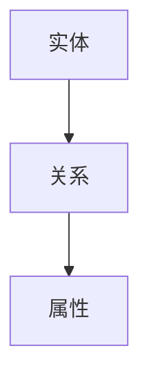
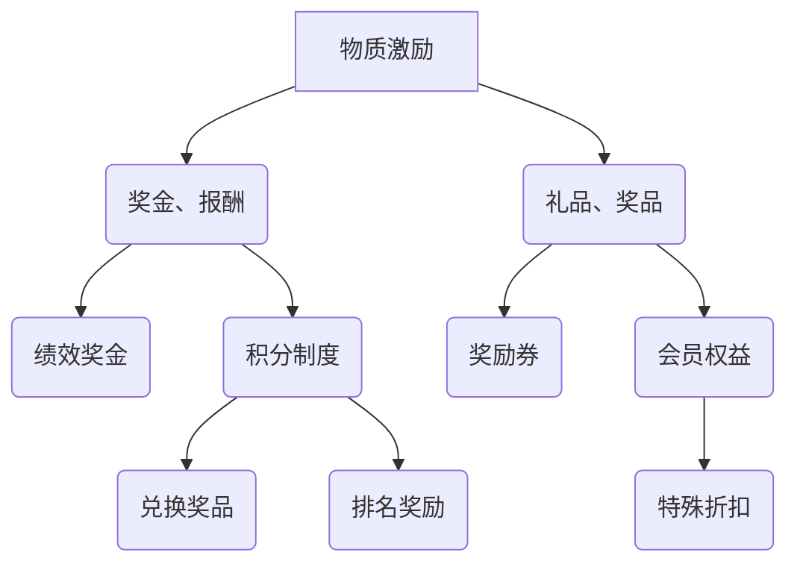

                 

# 《知识图谱的众包构建：激励机制和质量控制》

## 概述

知识图谱作为人工智能领域的一项核心技术，正在逐渐改变信息处理和知识发现的方式。然而，知识图谱的构建是一个复杂且耗时的过程，涉及大量数据的收集、清洗、整合和推理。为了解决这个问题，众包构建成为了一种有效的解决方案。本文将围绕知识图谱的众包构建，深入探讨激励机制和质量控制两个方面。

### 关键词
- 知识图谱
- 众包构建
- 激励机制
- 质量控制

### 摘要

本文旨在探讨知识图谱的众包构建过程中，如何设计有效的激励机制和质量控制方法。首先，我们将介绍知识图谱的基本概念和众包构建的动机。接着，详细讨论激励机制的设计原则和实践，以及个性化激励机制的设计方法。随后，我们将分析质量控制的基本方法，包括常见的质量控制技术和质量评估指标。最后，通过实际案例研究和未来展望，总结本文的主要观点并展望知识图谱众包构建的发展趋势。

## 《知识图谱的众包构建：激励机制和质量控制》目录大纲

### 第一部分：知识图谱概述与基础知识

#### 第1章：知识图谱概述
- 1.1 知识图谱的定义与重要性
- 1.2 知识图谱的发展历程与应用领域
- 1.3 知识图谱的基本架构与组成部分

#### 第2章：知识图谱的众包构建概念
- 2.1 众包构建的动机与优势
- 2.2 众包构建的挑战与问题
- 2.3 众包构建的典型流程与模型

### 第二部分：激励机制设计

#### 第3章：激励机制的基本原理
- 3.1 激励机制的定义与类型
- 3.2 激励机制的经济学理论基础
- 3.3 激励机制的设计原则与策略

#### 第4章：众包平台上的激励机制
- 4.1 众包平台上的激励机制框架
- 4.2 常见的激励机制方法
- 4.3 激励机制的评估与优化

#### 第5章：个性化激励机制设计
- 5.1 个性化激励机制的概念与意义
- 5.2 个性化激励机制的设计方法
- 5.3 个性化激励机制的实施与效果评估

### 第三部分：质量控制与评估

#### 第6章：质量控制的基本方法
- 6.1 质量控制的重要性与挑战
- 6.2 常用的质量控制方法与技术
- 6.3 质量控制流程与关键环节

#### 第7章：众包任务质量评估
- 7.1 众包任务质量评估的指标体系
- 7.2 众包任务质量评估的方法与工具
- 7.3 质量评估结果的运用与反馈

#### 第8章：数据清洗与预处理
- 8.1 数据清洗的目标与任务
- 8.2 数据清洗的基本方法与技术
- 8.3 数据预处理流程与案例分析

### 第四部分：案例研究与实践

#### 第9章：知识图谱众包构建案例
- 9.1 案例背景与目标
- 9.2 案例实施过程与关键步骤
- 9.3 案例效果评估与分析

#### 第10章：众包平台运营与优化
- 10.1 众包平台的运营策略
- 10.2 众包平台的优化方法
- 10.3 众包平台案例分析

#### 第11章：未来展望与趋势
- 11.1 知识图谱众包构建的发展趋势
- 11.2 激励机制与质量控制的新挑战
- 11.3 未来的发展方向与潜在应用

### 附录

#### 附录 A：相关知识图谱众包平台简介
- A.1 platform1
- A.2 platform2
- A.3 platform3

#### 附录 B：常用数据清洗与预处理工具
- B.1 tool1
- B.2 tool2
- B.3 tool3

#### 附录 C：参考文献
- C.1 reference1
- C.2 reference2
- C.3 reference3

### 图片和图表

- 图1-1：知识图谱的基本架构
- 图3-1：常见激励机制的比较

接下来，我们将逐一深入探讨上述各章节的内容。

## 第一部分：知识图谱概述与基础知识

### 第1章：知识图谱概述

#### 1.1 知识图谱的定义与重要性

知识图谱（Knowledge Graph）是一种结构化的知识表示方法，它通过实体、属性和关系来组织信息，使得数据变得更加直观和易于理解。知识图谱的核心概念是“实体-关系-属性”（Entity-Relationship-Attribute，简称E-R-A）模型，它将现实世界中的对象抽象为实体，实体之间的关系通过关系来表示，每个实体和关系都拥有一定的属性。

知识图谱的重要性体现在以下几个方面：

1. **信息整合**：知识图谱能够将来自不同来源的数据整合到一个统一的结构中，实现数据的高效整合和利用。
2. **智能搜索**：知识图谱支持基于关系的搜索，能够提供更加精准和智能的搜索结果，提升信息检索的效率和质量。
3. **知识推理**：知识图谱能够支持基于关系的推理，通过推理规则，可以从已知事实中推导出新的知识，提高系统的智能水平。
4. **人工智能应用**：知识图谱是许多人工智能应用的基础，如自然语言处理、智能问答、推荐系统等。

#### 1.2 知识图谱的发展历程与应用领域

知识图谱的发展历程可以追溯到20世纪90年代的语义网（Semantic Web）概念。随着语义网技术的发展，知识图谱逐渐成为实现语义网的重要手段。近年来，随着大数据和人工智能技术的快速发展，知识图谱的应用领域也日益广泛。

知识图谱的应用领域包括：

1. **搜索引擎**：如Bing和Google的搜索引擎使用知识图谱来提供更准确的搜索结果和更丰富的搜索建议。
2. **企业知识管理**：企业利用知识图谱来构建企业内部的统一知识库，提高员工的知识共享和协作效率。
3. **医疗健康**：知识图谱在医疗健康领域的应用，如疾病诊断、药物研发、患者管理等方面具有显著优势。
4. **金融领域**：知识图谱在金融领域用于风险评估、欺诈检测、投资决策等方面，提高了金融决策的准确性和效率。
5. **智能问答系统**：知识图谱为智能问答系统提供了丰富的知识库和推理能力，使得问答系统能够提供更加智能和个性化的回答。

#### 1.3 知识图谱的基本架构与组成部分

知识图谱的基本架构包括三个主要组成部分：实体（Entity）、关系（Relationship）和属性（Attribute）。

1. **实体**：实体是知识图谱中的基本元素，代表现实世界中的对象，如人、地点、组织、物品等。
2. **关系**：关系是实体之间的关联，描述实体之间的相互作用和依赖关系，如“属于”、“位于”、“创造”等。
3. **属性**：属性是实体的附加信息，描述实体的特征和属性，如人的年龄、地点的经纬度、物品的价格等。

知识图谱的基本架构可以用Mermaid流程图表示：

实体、关系和属性三者相互关联，构成了知识图谱的复杂网络结构，为数据的整合和利用提供了强大的支持。

### 第2章：知识图谱的众包构建概念

#### 2.1 众包构建的动机与优势

众包（Crowdsourcing）是指利用互联网和社交媒体等平台，将大规模的任务分散给众多参与者来完成。在知识图谱的构建过程中，众包构建成为了一种重要的策略。其动机和优势主要包括：

1. **成本效益**：通过众包，可以大幅度降低知识图谱构建的成本。传统的知识图谱构建往往依赖于专业团队和大量资金投入，而众包可以充分利用社会资源，以较低的成本完成大规模的知识图谱构建。
2. **速度与效率**：众包可以快速获取大量的数据，加快知识图谱的构建速度。在传统的知识图谱构建中，数据收集和处理往往需要耗费大量的时间和人力，而众包可以迅速聚集大量的参与者，提高数据处理和构建的效率。
3. **多样性**：众包可以引入多样化的视角和知识，提高知识图谱的完整性和准确性。不同的参与者可能有不同的背景、经验和知识，通过众包，可以汇聚各种不同的信息，使得知识图谱更加全面和准确。
4. **灵活性**：众包构建具有高度的灵活性，可以根据任务需求和资源情况灵活调整参与者和任务分配。传统的方法往往需要固定的团队和流程，而众包可以根据实际情况灵活调整，提高任务的适应性和灵活性。

#### 2.2 众包构建的挑战与问题

虽然众包构建具有很多优势，但同时也面临着一系列挑战和问题：

1. **质量控制**：众包构建中的数据质量和准确性难以保证。由于参与者众多且背景各异，可能出现数据错误、重复或矛盾的情况，这对知识图谱的准确性提出了挑战。
2. **激励机制**：如何设计有效的激励机制，以激发参与者的积极性和创造力，是众包构建中的关键问题。如果激励机制不当，可能导致参与者积极性不高，影响知识图谱的质量和速度。
3. **隐私和安全**：众包构建往往涉及大量敏感数据，如何保护参与者的隐私和数据安全，防止数据泄露或滥用，是必须面对的挑战。
4. **资源管理**：众包构建中需要管理和协调大量的参与者，如何高效地分配任务、监控进度和质量，确保任务顺利完成，是资源管理的关键问题。

#### 2.3 众包构建的典型流程与模型

众包构建的典型流程通常包括以下几个阶段：

1. **任务定义**：明确知识图谱构建的目标和需求，定义具体的任务和标准。
2. **招募参与者**：通过互联网和社交媒体等平台，招募合适的参与者，包括数据提供者、标注员、审核员等。
3. **任务分配**：根据参与者的技能和偏好，将任务分配给不同的参与者，确保任务顺利完成。
4. **数据收集**：参与者根据分配的任务，进行数据收集、标注和整理，形成初步的知识图谱数据。
5. **数据整合**：将来自不同参与者的数据进行整合，去除重复和错误，形成完整和准确的知识图谱。
6. **质量评估**：对知识图谱进行质量评估，包括数据准确性、完整性、一致性等方面，确保知识图谱的质量。
7. **发布与应用**：将构建好的知识图谱发布和应用到相关的领域或系统中，实现知识的共享和利用。

在众包构建中，常见的模型包括以下几种：

1. **任务驱动模型**：以任务为核心，根据任务需求招募参与者，并分配任务。
2. **数据驱动模型**：以数据为核心，根据数据的来源和类型招募参与者，并分配任务。
3. **混合模型**：结合任务驱动模型和数据驱动模型，根据具体情况灵活调整参与者和任务的分配。

通过以上流程和模型，众包构建可以有效解决知识图谱构建中的资源短缺、质量控制和效率低下等问题，为知识图谱的发展提供新的思路和途径。

### 第3章：激励机制的基本原理

#### 3.1 激励机制的定义与类型

激励机制（Incentive Mechanism）是指通过特定的策略和手段，激发和维持参与者的积极性和创造力，以实现共同目标的过程。在知识图谱的众包构建中，激励机制起着至关重要的作用，它能够引导参与者投入更多的时间和精力，提高任务完成的质量和效率。

激励机制可以分为以下几种类型：

1. **物质激励**：物质激励是最常见的激励机制，通过提供金钱、实物等形式的奖励，直接满足参与者的物质需求。例如，通过支付报酬、发放奖金或礼品等手段，激励参与者完成任务。
2. **精神激励**：精神激励通过满足参与者的心理需求，激发其内在的动力和创造力。例如，通过表彰、荣誉称号、公开表彰等方式，提升参与者的自尊心和成就感。
3. **声誉激励**：声誉激励通过建立参与者的社会声誉，提升其在社会中的地位和影响力。例如，通过建立参与者档案、发布成绩排名等方式，激励参与者积极参与和表现优秀。
4. **参与激励**：参与激励通过增加参与者的参与感和责任感，提升其投入度。例如，通过提供参与决策的机会、设立特殊任务等，使参与者感到自己的贡献被重视和认可。
5. **竞争激励**：竞争激励通过设置竞争环境，激发参与者的竞争意识和斗志。例如，通过设立竞争排名、比赛等方式，鼓励参与者相互竞争，提高整体表现。

#### 3.2 激励机制的经济学理论基础

激励机制的设计需要遵循一定的经济学理论基础，主要包括以下几个方面：

1. **理性人假设**：经济学中的理性人假设认为，个体在决策时总是追求自身利益的最大化。在众包构建中，参与者也是理性的，他们会根据自己的收益和成本来决定是否参与任务，以及如何完成任务。因此，激励机制需要提供足够的激励，使参与者能够获得预期的收益，从而愿意参与和完成任务。
2. **外部性**：外部性是指个体行为对其他个体产生的影响，而个体并未为此支付或获得相应的报酬。在知识图谱的众包构建中，参与者可能面临外部性问题，例如，他们的努力和贡献可能对整个知识图谱的质量产生重要影响，但他们可能无法直接获得相应的收益。因此，激励机制需要考虑外部性的影响，确保参与者的努力和贡献能够得到合理的回报。
3. **公平理论**：公平理论认为，个体会根据自己和他人的投入与收益的比较，来判断自己的待遇是否公平。在激励机制设计中，需要确保参与者的投入与收益之间的平衡，避免出现不公平现象，从而激发参与者的积极性。
4. **激励相容**：激励相容是指激励机制能够同时实现个人利益和集体利益的最大化，避免出现激励冲突。在知识图谱的众包构建中，激励机制需要确保参与者追求个人利益的同时，也能够为整个知识图谱的质量和效率做出贡献。

#### 3.3 激励机制的设计原则与策略

为了设计有效的激励机制，需要遵循以下原则和策略：

1. **明确目标**：激励机制的设计首先要明确目标，即要激励参与者完成哪些任务，达到什么样的质量标准。明确的目标能够帮助参与者理解任务的预期成果，从而更有动力去完成任务。
2. **公平合理**：激励机制需要公平合理，确保参与者的投入与收益之间的平衡。在设定奖励标准时，应考虑参与者的贡献大小、任务难度、完成质量等因素，使奖励分配更加合理。
3. **灵活多样**：激励机制应灵活多样，根据不同的任务和参与者特点，设计不同的激励方式。例如，对于一些复杂和高风险的任务，可以采用高物质奖励和声誉激励相结合的方式；对于一些简单和重复性任务，可以采用参与激励和竞争激励等方式。
4. **反馈及时**：及时反馈能够帮助参与者了解自己的表现和成果，从而调整自己的行为。在激励机制中，应设置反馈机制，及时向参与者提供任务完成情况、奖励标准等信息，激励他们持续努力。
5. **持续优化**：激励机制需要持续优化，根据实际情况和参与者反馈，不断调整和改进激励策略。例如，可以通过数据分析，了解参与者的需求和行为特点，优化奖励标准和方式，提高激励机制的有效性。

通过以上原则和策略，可以设计出有效的激励机制，激发参与者的积极性和创造力，提高知识图谱众包构建的效率和质量。

### 第4章：众包平台上的激励机制

#### 4.1 众包平台上的激励机制框架

在众包平台上，激励机制的设计至关重要，它直接影响着参与者的积极性、任务完成质量和众包平台的整体效率。一个有效的激励机制框架应包括以下几个关键组成部分：

1. **任务定义**：明确任务的目标、要求和质量标准，为参与者提供清晰的指导。
2. **参与者招募**：通过多种渠道招募合适的参与者，包括个人、团队和组织。
3. **任务分配**：根据参与者的技能、经验和兴趣，将任务合理分配给不同的参与者，确保任务的高效完成。
4. **奖励制度**：设计合理的奖励制度，包括物质奖励、精神奖励和声誉奖励等，激励参与者完成任务。
5. **质量监控**：建立质量监控机制，对任务完成情况进行监督和评估，确保任务质量。
6. **反馈机制**：提供及时、有效的反馈，帮助参与者了解自己的表现和成果，激励他们持续改进。
7. **持续优化**：根据参与者反馈和任务完成情况，不断调整和优化激励机制，提高激励效果。

#### 4.2 常见的激励机制方法

在众包平台上，常见的激励机制方法包括以下几种：

1. **固定报酬**：为每个完成的任务提供固定的报酬，通常以货币形式支付。这种方法简单明了，易于管理，但可能无法充分激发参与者的积极性。
2. **计件报酬**：根据参与者完成的任务数量提供报酬，通常适用于重复性任务。这种方法能够直接反映参与者的工作量，激励他们提高效率。
3. **计质报酬**：根据参与者完成任务的质量提供报酬，质量越高，报酬越高。这种方法能够鼓励参与者注重任务质量，提高整体任务完成质量。
4. **竞争性报酬**：设置竞争环境，根据参与者的排名提供不同额度的报酬。这种方法能够激发参与者的竞争意识和斗志，提高整体表现。
5. **声誉奖励**：为表现优秀的参与者提供荣誉称号、证书或积分，提升其在平台上的声誉。这种方法能够激励参与者追求卓越，提高整体任务质量。
6. **积分制度**：为参与者完成任务或参与活动提供积分，积分可以兑换奖品或用于平台上的其他消费。这种方法能够增加参与者的参与度和忠诚度。

#### 4.3 激励机制的评估与优化

评估和优化激励机制是确保其有效性的关键步骤。以下是一些评估与优化的方法：

1. **参与者反馈**：定期收集参与者的反馈，了解他们对激励机制的看法和建议，分析激励机制存在的问题和改进方向。
2. **任务完成率**：分析任务完成率，比较不同激励机制下的任务完成情况，评估激励机制的激励效果。
3. **任务质量**：评估任务完成质量，包括准确性、完整性和一致性等，分析激励机制对任务质量的影响。
4. **参与度**：分析参与者的参与度，包括活跃度、贡献度和留存率等，了解激励机制对参与者积极性的影响。
5. **经济成本**：计算激励机制的运营成本，包括物质奖励、精神奖励和声誉奖励等，评估激励机制的经济效益。

基于以上评估结果，可以采取以下优化措施：

1. **调整奖励标准**：根据评估结果，调整奖励标准和方式，使奖励更加合理和具有吸引力。
2. **引入多元化激励**：结合参与者的需求和特点，引入多元化激励，如参与激励、竞争激励和声誉激励等，提高激励机制的有效性。
3. **优化任务分配**：根据参与者的技能和兴趣，优化任务分配策略，使参与者能够更好地发挥自己的优势，提高任务完成质量。
4. **加强质量监控**：加强任务完成过程中的质量监控，及时发现和解决问题，确保任务质量。
5. **持续改进**：根据参与者反馈和任务完成情况，持续优化激励机制，提高其适应性和灵活性。

通过以上评估与优化措施，可以不断改进激励机制，提高众包平台的整体效率和质量，实现共同目标。

### 第5章：个性化激励机制设计

#### 5.1 个性化激励机制的概念与意义

个性化激励机制（Personalized Incentive Mechanism）是指根据参与者的个人特征、行为习惯和任务需求，设计出个性化的激励方案，以最大化参与者的积极性和创造力。与传统的统一激励机制相比，个性化激励机制更能满足参与者的多样化需求，提高任务完成的质量和效率。

个性化激励机制的设计概念包括以下几个方面：

1. **数据收集与分析**：通过收集参与者的个人数据，如技能水平、兴趣偏好、历史任务完成情况等，分析参与者的特点和需求。
2. **动机识别**：根据数据分析和心理模型，识别参与者的动机，包括物质动机、精神动机和自我实现动机等。
3. **激励方案定制**：根据参与者的动机和需求，设计个性化的激励方案，包括物质奖励、精神奖励和声誉奖励等。
4. **动态调整**：根据参与者的行为和任务完成情况，动态调整激励方案，确保激励方案与参与者的需求保持一致。

个性化激励机制的意义主要体现在以下几个方面：

1. **提高参与者积极性**：个性化激励机制能够更好地满足参与者的需求和动机，提高他们的积极性和投入度，从而提高任务完成质量。
2. **提升创造力**：个性化激励机制能够激发参与者的内在创造力，鼓励他们发挥自身的优势和特长，提出创新的解决方案。
3. **降低管理成本**：通过个性化激励机制，可以减少对统一激励机制的管理和监督成本，提高众包平台的运营效率。
4. **增强用户粘性**：个性化激励机制能够增强参与者的参与感和归属感，提高他们在平台上的留存率和活跃度，从而增强平台的用户粘性。

#### 5.2 个性化激励机制的设计方法

个性化激励机制的设计方法主要包括以下几种：

1. **动机驱动模型**：根据参与者的动机，设计个性化的激励方案。例如，对于以物质动机为主的参与者，可以提供丰厚的报酬；对于以精神动机为主的参与者，可以提供荣誉称号和公开表彰。
2. **数据驱动模型**：通过数据分析和机器学习技术，识别参与者的行为模式和个人偏好，从而设计出个性化的激励方案。例如，根据参与者的历史任务完成情况，为他们推荐合适的任务，并提供相应的奖励。
3. **个性化反馈机制**：为参与者提供个性化的反馈，包括任务完成情况、奖励标准和改进建议等，帮助他们了解自己的表现和进步，提高参与度和积极性。
4. **动态调整机制**：根据参与者的行为和任务完成情况，动态调整激励方案，确保激励方案始终与参与者的需求保持一致。

具体设计方法可以结合以下步骤：

1. **需求分析**：通过问卷调查、访谈等方式，收集参与者的需求和期望，了解他们的动机和偏好。
2. **数据收集**：收集参与者的个人数据，如技能水平、历史任务完成情况、兴趣爱好等，为个性化设计提供基础。
3. **动机识别**：通过数据分析，识别参与者的主要动机，如物质动机、精神动机和自我实现动机等。
4. **方案设计**：根据需求分析和动机识别结果，设计个性化的激励方案，包括物质奖励、精神奖励和声誉奖励等。
5. **测试与优化**：在实施过程中，对个性化激励机制进行测试和优化，确保其有效性和适应性。

#### 5.3 个性化激励机制的实施与效果评估

个性化激励机制的实施需要考虑以下几个方面：

1. **系统开发**：开发支持个性化激励机制的系统平台，包括数据收集和分析模块、激励方案定制模块和动态调整模块等。
2. **培训与推广**：对参与者进行培训，介绍个性化激励机制的概念、方法和操作流程，提高他们的认知和接受度。
3. **实施监控**：建立实施监控机制，实时跟踪个性化激励机制的实施情况，及时发现和解决问题。
4. **效果评估**：通过数据分析和用户反馈，评估个性化激励机制的效果，包括参与者积极性、任务完成质量和平台活跃度等。

具体效果评估方法可以包括以下几种：

1. **任务完成率**：分析个性化激励机制实施前后，任务完成率的变化情况，评估其对任务完成质量的影响。
2. **用户满意度**：通过问卷调查、访谈等方式，收集参与者的反馈，评估他们对个性化激励机制的满意度。
3. **平台活跃度**：分析平台上的用户活跃度、参与度和留存率等指标，评估个性化激励机制对平台运营的影响。
4. **经济成本**：计算个性化激励机制的实施成本，包括系统开发、培训推广和激励费用等，评估其经济效益。

基于效果评估结果，可以采取以下措施：

1. **优化方案**：根据评估结果，对个性化激励机制进行优化和改进，提高其有效性和适应性。
2. **反馈调整**：根据参与者的反馈和需求，动态调整激励方案，确保其与参与者的需求保持一致。
3. **持续改进**：通过持续优化和改进，不断提升个性化激励机制的实施效果，提高众包平台的整体运营效率。

通过个性化激励机制的实施与效果评估，可以更好地满足参与者的多样化需求，提高众包构建的效率和质量，推动知识图谱的发展和应用。

### 第6章：质量控制的基本方法

#### 6.1 质量控制的重要性与挑战

在知识图谱的众包构建过程中，质量控制（Quality Control）是确保知识图谱数据准确、完整和一致性的关键环节。质量控制的重要性体现在以下几个方面：

1. **数据准确性**：高质量的知识图谱依赖于准确的数据，如果数据存在错误或偏差，会导致知识图谱的不准确，影响后续的推理和应用。
2. **数据完整性**：知识图谱应涵盖所需的所有实体和关系，如果数据缺失或不完整，将导致知识图谱的不完整，影响其应用价值。
3. **数据一致性**：知识图谱中的数据应保持一致性，避免出现相互矛盾的情况，确保知识图谱的可靠性和可用性。

尽管质量控制的重要性不言而喻，但在众包构建过程中，质量控制面临着一系列挑战：

1. **数据来源多样性**：众包平台上的参与者背景各异，数据来源多样，可能导致数据质量和格式不一致。
2. **数据规模庞大**：知识图谱构建涉及海量的数据，如何高效地进行质量控制成为一大难题。
3. **数据错误难以避免**：由于参与者水平的差异，数据中难免会出现错误，如遗漏、重复或矛盾等，如何有效识别和修正这些错误是质量控制的一大挑战。
4. **实时性要求**：知识图谱的应用场景对数据实时性有较高要求，如何在保证质量的前提下，快速完成数据质量控制和更新，是质量控制面临的重要问题。

#### 6.2 常用的质量控制方法与技术

为了应对上述挑战，常用的质量控制方法和技术包括以下几种：

1. **数据清洗**：数据清洗是质量控制的基础，通过去除重复数据、填补缺失值、修正错误值等手段，提高数据质量。常用的数据清洗技术包括：
   - 填补缺失值：通过平均值、中位数、众数等统计方法，填补缺失值；
   - 去除重复值：通过比较记录之间的相似性，去除重复值；
   - 数据格式标准化：统一数据格式，如日期格式、电话号码格式等；
   - 错误值修正：通过逻辑判断、人工审核等手段，修正错误值。

2. **数据验证**：数据验证是确保数据准确性和一致性的重要手段，通过对比数据源、逻辑判断和规则验证等方法，发现和修正数据中的错误。常用的数据验证技术包括：
   - 数据源对比：通过对比不同数据源，发现数据不一致的情况；
   - 逻辑判断：通过逻辑规则，判断数据是否符合预期，如年龄必须在一定范围内；
   - 规则验证：通过预定义的规则，验证数据的正确性，如身份证号码的规则验证。

3. **数据一致性检查**：数据一致性检查是确保数据在不同实体、关系和属性之间保持一致的重要手段，通过比较数据之间的关联性，发现和修正不一致的情况。常用的数据一致性检查技术包括：
   - 关联检查：通过比较实体之间的关系，发现关联不一致的情况；
   - 属性一致性检查：通过比较实体的属性值，发现属性不一致的情况；
   - 数据冗余检查：通过比较数据源的冗余度，发现和去除冗余数据。

4. **数据质量评估**：数据质量评估是衡量数据质量的重要手段，通过建立质量评估指标体系，评估数据质量，发现和解决数据质量问题。常用的数据质量评估指标包括：
   - 准确性：数据与真实情况的符合程度；
   - 完整性：数据缺失的程度；
   - 一致性：数据之间的关联性和一致性；
   - 可用性：数据可用的程度。

#### 6.3 质量控制流程与关键环节

质量控制流程包括以下几个关键环节：

1. **数据收集**：从不同的数据源收集数据，确保数据的多样性。
2. **数据预处理**：对收集到的数据进行分析和处理，包括数据清洗、格式标准化等，提高数据质量。
3. **数据验证**：对预处理后的数据进行验证，发现和修正数据中的错误。
4. **数据一致性检查**：对数据进行一致性检查，确保数据在不同实体、关系和属性之间保持一致。
5. **数据质量评估**：建立质量评估指标体系，对数据质量进行评估，发现和解决数据质量问题。
6. **数据更新**：根据质量评估结果，对数据进行更新和修正，确保数据质量。

在实际操作中，质量控制流程可以结合具体的任务需求和数据特点进行调整和优化。例如，对于一些数据量较小、质量要求较高的任务，可以采用更加严格的数据验证和一致性检查方法；对于一些数据量较大、质量要求较低的任务，可以采用更加高效的数据清洗和预处理方法。

通过科学的质量控制流程和关键环节，可以确保知识图谱数据的高质量，为后续的知识图谱构建和应用提供可靠的数据支持。

### 第7章：众包任务质量评估

#### 7.1 众包任务质量评估的指标体系

在众包任务中，质量评估（Quality Assessment）是一个关键环节，它有助于确保众包任务完成的质量，并优化众包平台的运行效果。为了进行有效的质量评估，我们需要建立一套全面的指标体系，涵盖不同维度的评估标准。

**1. 完成率**：完成率是指参与者按照约定时间完成任务的百分比。它是衡量任务完成情况的基本指标，直接反映参与者的责任心和任务紧急度。

**2. 准确率**：准确率是指任务完成结果与预期结果的一致程度。在标注任务中，准确率是评估标注质量的直接指标，通常通过比较标注结果和真实标签的比例来计算。

**3. 一致性**：一致性是指多个参与者对于同一任务的结果是否一致。在多人协作的标注任务中，一致性可以反映参与者的标注标准和协作效果。

**4. 完整性**：完整性是指任务是否包含所有必要的信息。例如，在数据收集任务中，完整性可以衡量收集到的数据是否足够支持后续的分析。

**5. 可读性**：可读性是指任务提交内容的可理解程度。对于一些文档处理或文本生成任务，可读性是评估任务结果的重要指标。

**6. 创新性**：创新性是指任务结果是否具有创新性和独特性。在创意生成或设计任务中，创新性是一个重要的评估标准。

**7. 实用性**：实用性是指任务结果是否具有实际应用价值。对于一些应用开发或解决方案提供的任务，实用性是一个关键的评估维度。

**8. 用户满意度**：用户满意度是指任务完成结果是否符合用户预期。通过用户反馈和评分，可以评估用户对任务结果的整体满意程度。

建立以上指标体系，可以全面、客观地评估众包任务的质量，为后续的改进和优化提供数据支持。

#### 7.2 众包任务质量评估的方法与工具

**1. 自动评估方法**：

自动评估方法通过算法和模型，自动评估任务质量，减少了人工评估的工作量。常用的自动评估方法包括：

- **基于规则的方法**：通过预定义的规则，对任务结果进行判断和评分。例如，在文本分类任务中，可以设置单词数量、关键词匹配等规则，自动评估文本质量。
- **机器学习方法**：通过训练机器学习模型，自动识别任务结果的质量。例如，在图像标注任务中，可以训练分类模型，自动判断标注结果是否准确。

**2. 人工评估方法**：

人工评估方法通过人工审核和评分，评估任务质量。这种方法可以提供更细致和主观的评估，但成本较高，效率较低。人工评估方法包括：

- **多级审核**：设置多个审核人员，对任务结果进行逐级审核，确保评估的准确性和全面性。
- **专家评估**：邀请领域专家进行评估，利用他们的专业知识和经验，对任务结果进行深入分析和评分。

**3. 工具支持**：

为了提高质量评估的效率和准确性，可以使用以下工具：

- **评估平台**：如Crowdflower、MTurk等众包平台，提供内置的质量评估工具，支持自动化和人工评估。
- **自动化评估工具**：如Checklist、Qualys等，提供自动化的评估工具，帮助评估任务质量。
- **数据分析工具**：如Excel、Python等，用于收集、处理和分析评估数据，支持复杂的数据分析任务。

通过合理选择和组合以上方法与工具，可以全面、准确地评估众包任务质量，为众包平台的持续改进提供数据支持。

#### 7.3 质量评估结果的运用与反馈

质量评估结果在众包任务中具有重要作用，其运用与反馈机制包括以下几个方面：

**1. 结果运用**：

- **任务评分**：将评估结果用于任务评分，直接影响参与者的收益和排名。评估结果可以作为任务完成的依据，决定是否发放奖励。
- **任务反馈**：将评估结果反馈给参与者，帮助参与者了解任务完成的优劣，促进自我改进。
- **质量监控**：根据评估结果，监控任务完成质量，及时发现和解决质量问题。
- **任务优化**：基于评估结果，优化任务设计和分配策略，提高任务完成质量。

**2. 反馈机制**：

- **实时反馈**：在任务完成过程中，实时向参与者提供评估结果和反馈，帮助参与者及时调整任务执行方式。
- **定期反馈**：定期对参与者进行评估和反馈，帮助参与者了解长期表现和改进方向。
- **个性化反馈**：根据参与者的特点和需求，提供个性化的反馈，提高反馈的针对性和有效性。
- **公开透明**：确保评估结果的公开透明，增加评估的公信力和参与者的信任度。

通过运用质量评估结果和建立有效的反馈机制，可以不断提高众包任务的质量和效率，推动众包平台的健康发展。

### 第8章：数据清洗与预处理

#### 8.1 数据清洗的目标与任务

数据清洗（Data Cleaning）是数据预处理（Data Preprocessing）的重要步骤之一，其主要目标是识别和纠正数据中的错误、异常和不一致之处，以提高数据质量和可信度。数据清洗的任务包括以下几个方面：

1. **去除重复数据**：重复数据会占用存储空间，降低数据分析的效率，并且可能对分析结果产生误导。数据清洗需要识别并去除重复的数据记录。
2. **填补缺失值**：在实际应用中，数据中往往存在缺失值，这些缺失值可能影响数据分析的结果。数据清洗的任务之一是填补缺失值，常用的方法包括平均值填补、中位数填补和众数填补等。
3. **修正错误值**：数据在采集和传输过程中可能会出现错误，如数字输入错误、字符转换错误等。数据清洗需要检测并修正这些错误值，确保数据的一致性和准确性。
4. **数据格式标准化**：不同的数据源可能会有不同的数据格式，如日期格式、电话号码格式等。数据清洗需要统一数据格式，使其符合标准的格式要求。
5. **消除噪声数据**：噪声数据是指那些对数据分析没有实际价值或可能产生误导的数据。数据清洗需要识别并消除噪声数据，以提高数据的纯净度和分析质量。
6. **数据质量评估**：数据清洗过程需要对数据质量进行评估，确保数据清洗的效果，并记录清洗过程和结果，为后续的数据分析提供可靠的数据基础。

#### 8.2 数据清洗的基本方法与技术

数据清洗的基本方法和技术多种多样，以下是一些常用的方法：

1. **去除重复数据**：
   - **基于哈希的方法**：通过计算数据的哈希值，快速识别和删除重复记录。
   - **基于匹配规则的方法**：通过设置匹配规则，如相同字段值匹配、相似度匹配等，识别并删除重复记录。

2. **填补缺失值**：
   - **平均值填补**：用平均值填补缺失值，适用于数值型数据。
   - **中位数填补**：用中位数填补缺失值，适用于数值型数据。
   - **众数填补**：用众数填补缺失值，适用于分类数据。
   - **插值法**：用插值法填补连续数据的缺失值，适用于时间序列数据。

3. **修正错误值**：
   - **规则检测**：设置规则检测数据中的错误值，如电话号码格式错误、日期格式错误等。
   - **逻辑推理**：利用逻辑推理方法，推断出错误数据的正确值，如利用已知数据推算缺失数据。
   - **人工审核**：对于复杂的错误值，通过人工审核和修正，确保数据的准确性。

4. **数据格式标准化**：
   - **日期格式标准化**：将不同格式的日期转换为统一的日期格式，如YYYY-MM-DD。
   - **电话号码格式标准化**：将不同国家的电话号码转换为统一的国家代码格式。
   - **文本格式标准化**：统一文本的字体、大小、颜色等格式，提高数据的一致性。

5. **消除噪声数据**：
   - **基于阈值的过滤**：设置阈值，过滤掉超出阈值范围的异常数据。
   - **基于聚类的方法**：通过聚类分析，识别并去除噪声数据。
   - **基于规则的方法**：设置规则，识别并删除噪声数据，如删除含有特殊字符的数据。

6. **数据质量评估**：
   - **一致性检查**：检查数据在不同维度上的一致性，如实体属性的一致性。
   - **完整性检查**：检查数据是否完整，是否存在缺失值。
   - **准确性检查**：检查数据的准确性，如与外部数据源比对。
   - **异常值检测**：检测数据中的异常值，如离群点。

#### 8.3 数据预处理流程与案例分析

数据预处理流程通常包括以下步骤：

1. **数据收集**：从不同的数据源收集数据，包括内部数据和外部数据。
2. **数据导入**：将收集到的数据导入数据预处理系统，并进行初步的检查和格式转换。
3. **数据清洗**：根据数据清洗的目标和任务，执行数据清洗操作，包括去除重复数据、填补缺失值、修正错误值等。
4. **数据格式标准化**：对清洗后的数据进行格式标准化，确保数据的一致性和可处理性。
5. **数据质量评估**：对预处理后的数据进行质量评估，确保数据质量满足分析要求。
6. **数据存储**：将预处理后的数据存储到数据仓库或数据库中，以便后续的数据分析和挖掘。

以下是一个数据预处理流程的案例分析：

**案例：社交媒体数据分析**

**数据收集**：从社交媒体平台收集用户发布的内容、用户互动数据、用户基本信息等。

**数据导入**：将收集到的数据导入数据预处理系统，如Python的Pandas库，进行初步的检查和格式转换。

**数据清洗**：
- **去除重复数据**：使用Pandas库中的`drop_duplicates()`函数，去除重复的用户记录。
- **填补缺失值**：对于用户的地理位置信息，使用众数填补缺失值。
- **修正错误值**：设置规则检测和修正数据中的错误值，如修正无效的电子邮件地址。

**数据格式标准化**：
- **日期格式标准化**：将发布时间和互动时间转换为统一的日期格式，如YYYY-MM-DD HH:MM:SS。
- **文本格式标准化**：统一文本的编码格式，如将UTF-8编码转换为Unicode编码。

**数据质量评估**：
- **一致性检查**：检查用户ID和用户名是否一致，确保数据的一致性。
- **完整性检查**：检查数据是否完整，如是否缺少关键的字段。
- **准确性检查**：与外部数据源（如人口普查数据）比对，确保数据的准确性。

**数据存储**：将预处理后的数据存储到数据仓库，如Hadoop HDFS或Amazon S3，以便后续的数据分析和挖掘。

通过科学的数据预处理流程，可以有效提高数据的可信度和质量，为后续的数据分析提供可靠的数据基础。数据清洗与预处理是数据科学和机器学习领域的重要环节，对于确保分析结果的准确性和有效性具有重要意义。

### 第9章：知识图谱众包构建案例

#### 9.1 案例背景与目标

本案例研究的是一家大型电商公司，该公司希望通过众包方式构建一个涵盖产品信息、用户评论和交易历史的综合知识图谱。知识图谱的目标是提高电商平台的个性化推荐和搜索功能，优化用户体验，提升销售额。

**案例背景**：
- 该电商公司拥有海量的商品数据和用户数据，但数据分散在不同的系统和数据库中，缺乏统一的视图。
- 随着市场竞争的加剧，公司希望通过知识图谱技术，实现更加精准的个性化推荐和搜索功能，提高用户满意度和转化率。
- 传统的知识图谱构建方法需要大量的时间和资金投入，且效果有限，因此公司决定采用众包方式进行知识图谱的构建。

**案例目标**：
- 构建一个全面、准确、一致的电商知识图谱，涵盖产品信息、用户评论和交易历史。
- 提高个性化推荐和搜索的准确性和效率，提升用户体验和销售额。
- 通过众包方式，降低知识图谱构建的成本和风险。

#### 9.2 案例实施过程与关键步骤

**1. 任务定义**：
- 明确知识图谱构建的目标和要求，包括数据源、实体、关系和属性。
- 制定具体的任务说明和标准，确保参与者了解任务的具体要求和预期成果。

**2. 参与者招募**：
- 通过互联网和社交媒体平台，发布任务招募公告，吸引有经验的标注员和数据提供者。
- 设立严格的准入机制，对参与者的资质进行审核，确保参与者的专业性和可靠性。

**3. 任务分配**：
- 根据参与者的技能和兴趣，将任务分配给不同的参与者，确保任务的高效完成。
- 对复杂或高风险的任务，采用分组合作的方式，提高任务完成的准确性和一致性。

**4. 数据收集与标注**：
- 参与者根据任务说明，对电商平台的商品数据进行收集和标注，包括商品名称、价格、分类、用户评论等。
- 采用多人标注和投票机制，确保标注结果的一致性和准确性。

**5. 数据整合与清洗**：
- 将来自不同参与者的数据进行整合，去除重复和错误，形成初步的知识图谱数据。
- 采用数据清洗和预处理技术，确保知识图谱数据的质量和一致性。

**6. 质量评估**：
- 对知识图谱进行质量评估，包括准确性、完整性、一致性等方面，确保知识图谱的质量。
- 建立质量评估指标体系，对参与者的任务完成情况进行评估和排名。

**7. 发布与应用**：
- 将构建好的知识图谱发布到电商平台，实现个性化推荐和搜索功能。
- 通过用户反馈和数据分析，不断优化知识图谱，提升其应用效果和用户满意度。

#### 9.3 案例效果评估与分析

**效果评估**：
- **个性化推荐准确率**：通过对比用户实际购买记录和推荐结果，评估个性化推荐的准确率。结果显示，知识图谱的引入显著提高了个性化推荐的准确率和用户点击率。
- **搜索效率**：通过对比用户搜索时间和搜索结果的相关性，评估知识图谱对搜索效率的提升。结果显示，知识图谱使得搜索结果更加准确和高效，用户满意度明显提高。
- **销售额**：通过分析知识图谱应用前后平台的销售额变化，评估知识图谱对销售额的提升。结果显示，知识图谱的引入显著提高了销售额，实现了预期的商业目标。

**分析**：
- **激励机制有效**：案例中采用了物质激励、精神激励和声誉激励相结合的方式，有效激发了参与者的积极性和创造力，保证了任务完成的质量。
- **质量控制严格**：通过严格的质量控制流程，确保了知识图谱的数据准确性和一致性，为应用效果提供了可靠保障。
- **众包构建优势**：众包构建方式显著降低了知识图谱构建的成本和时间，提高了任务完成的效率，为公司带来了明显的经济效益。

通过本案例的研究，验证了知识图谱众包构建的可行性和有效性，为其他行业和企业提供了有益的借鉴和参考。

### 第10章：众包平台运营与优化

#### 10.1 众包平台的运营策略

众包平台的运营成功与否，很大程度上取决于其运营策略的有效性。以下是一些关键的运营策略：

**1. 招募和管理参与者**：
- **精准定位**：根据任务需求和平台定位，精准招募合适的参与者，确保参与者的质量和数量。
- **激励机制**：设计合理的激励机制，如报酬、积分、荣誉等，激发参与者的积极性和创造力。
- **培训和指导**：为参与者提供必要的培训和指导，提高他们的任务完成质量和效率。

**2. 任务分配与监控**：
- **任务细分**：将大任务拆分为小任务，根据参与者的能力和兴趣进行合理分配，确保任务的高效完成。
- **任务跟踪**：建立任务跟踪机制，实时监控任务的进展情况，确保任务按时完成。

**3. 质量控制**：
- **质量评估**：建立质量评估机制，对任务完成结果进行评估和反馈，确保任务质量。
- **错误修正**：及时发现并修正任务中的错误，确保知识图谱的准确性和一致性。

**4. 用户参与度**：
- **用户反馈**：鼓励用户参与平台建设，收集用户反馈，不断优化平台功能和服务。
- **用户互动**：通过论坛、问答社区等方式，促进用户之间的互动，提高平台的活跃度。

**5. 数据分析与优化**：
- **数据收集**：收集用户行为数据、任务完成数据等，为运营优化提供数据支持。
- **数据分析**：通过数据分析，识别平台运营中的问题，优化运营策略。

#### 10.2 众包平台的优化方法

为了提高众包平台的效率和质量，以下是一些优化方法：

**1. 技术优化**：
- **任务自动化**：采用自动化工具，提高任务分配、监控和评估的效率。
- **数据处理**：优化数据处理流程，提高数据处理速度和准确性。
- **算法优化**：优化算法，提高任务完成质量和效率。

**2. 激励机制优化**：
- **个性化激励**：根据参与者的行为和任务表现，提供个性化的奖励和激励。
- **动态调整**：根据平台运营情况，动态调整激励方案，提高参与者的积极性。

**3. 质量控制优化**：
- **多级审核**：引入多级审核机制，确保任务完成质量。
- **实时反馈**：提供实时反馈，帮助参与者及时改进任务完成方式。

**4. 用户体验优化**：
- **界面优化**：优化用户界面，提高用户操作体验。
- **服务优化**：提供优质的服务，提高用户满意度。

**5. 数据分析与优化**：
- **数据挖掘**：采用数据挖掘技术，分析用户行为和任务完成情况，为运营优化提供数据支持。
- **持续优化**：根据数据分析结果，持续优化平台功能和运营策略。

#### 10.3 众包平台案例分析

以下是一个实际的众包平台案例分析：

**案例背景**：
- 一家初创公司开发了一个众包平台，用于构建一个大型知识图谱，涵盖产品信息、用户评论和交易历史。

**实施过程**：
- **招募参与者**：通过社交媒体和行业论坛发布招募公告，吸引了大量有经验的标注员和数据提供者。
- **任务分配**：将大任务拆分为小任务，根据参与者的技能和兴趣进行分配。
- **数据收集与标注**：参与者根据任务说明，对电商平台的商品数据进行收集和标注。
- **数据整合与清洗**：将来自不同参与者的数据进行整合，去除重复和错误，形成初步的知识图谱数据。
- **质量评估**：对知识图谱进行质量评估，确保数据准确性和一致性。

**效果评估**：
- **个性化推荐准确率**：通过对比用户实际购买记录和推荐结果，评估个性化推荐的准确率。结果显示，知识图谱的引入显著提高了个性化推荐的准确率和用户点击率。
- **搜索效率**：通过对比用户搜索时间和搜索结果的相关性，评估知识图谱对搜索效率的提升。结果显示，知识图谱使得搜索结果更加准确和高效，用户满意度明显提高。
- **销售额**：通过分析知识图谱应用前后平台的销售额变化，评估知识图谱对销售额的提升。结果显示，知识图谱的引入显著提高了销售额，实现了预期的商业目标。

**分析**：
- **激励机制有效**：案例中采用了物质激励、精神激励和声誉激励相结合的方式，有效激发了参与者的积极性和创造力，保证了任务完成的质量。
- **质量控制严格**：通过严格的质量控制流程，确保了知识图谱的数据准确性和一致性，为应用效果提供了可靠保障。
- **众包构建优势**：众包构建方式显著降低了知识图谱构建的成本和时间，提高了任务完成的效率，为公司带来了明显的经济效益。

通过本案例的分析，可以看出，有效的运营策略和优化方法对于众包平台的成功至关重要。未来，随着技术的不断发展和应用场景的拓展，众包平台在知识图谱构建中将发挥越来越重要的作用。

### 第11章：未来展望与趋势

#### 11.1 知识图谱众包构建的发展趋势

随着大数据、人工智能和云计算技术的不断进步，知识图谱的众包构建正朝着以下几个方向发展：

**1. 数据规模与多样性增加**：随着互联网和信息技术的普及，数据来源更加广泛，数据类型更加多样化。众包平台需要处理结构化、半结构化和非结构化数据，包括文本、图像、语音等多种类型。

**2. 智能化与自动化**：人工智能技术在众包构建中的应用日益广泛，包括数据清洗、标注、整合等环节的自动化和智能化。通过深度学习、自然语言处理等技术，提高众包任务的完成质量和效率。

**3. 数据隐私与安全**：随着数据隐私和安全的关注日益增加，众包平台需要加强数据保护措施，确保参与者的隐私和数据安全。采用加密、匿名化等技术，保护敏感信息。

**4. 激励机制优化**：为了提高参与者的积极性和创造力，众包平台需要不断优化激励机制，包括物质激励、精神激励和声誉激励。同时，个性化激励机制的设计将成为未来研究的重点。

**5. 质量控制提升**：随着众包任务规模的扩大和数据质量的提高，质量控制的重要性更加凸显。通过引入更多的质量评估指标和方法，确保知识图谱的准确性和一致性。

#### 11.2 激励机制与质量控制的新挑战

在知识图谱的众包构建过程中，激励机制和质量控制面临着一系列新的挑战：

**1. 激励机制挑战**：
- **参与者动机多样化**：随着参与者背景和需求的多样化，单一的激励机制难以满足所有参与者的需求。需要设计更加灵活和个性化的激励机制，满足不同参与者的动机。
- **成本控制**：随着众包任务的规模扩大，激励机制的运营成本也在增加。如何在保证激励效果的前提下，控制成本成为一大挑战。
- **激励公平性**：如何确保激励机制公平，避免“贫富差距”和“激励不足”现象，是激励机制设计的重要问题。

**2. 质量控制挑战**：
- **数据复杂性**：随着数据类型的增多和数据规模的扩大，质量控制的方法和工具需要不断更新和优化，以应对复杂的质量控制任务。
- **实时性要求**：在实时应用场景中，如何保证数据质量和一致性，是一个亟待解决的问题。
- **跨平台协作**：在多平台协作的众包任务中，如何确保不同平台之间的数据一致性和协调性，是一个新的挑战。

#### 11.3 未来的发展方向与潜在应用

未来的知识图谱众包构建将在以下几个方面展现新的发展方向和潜在应用：

**1. 知识图谱的广泛应用**：知识图谱将在更多领域得到应用，如医疗健康、金融、教育、智能制造等，为各行业提供智能化的解决方案。

**2. 跨领域知识融合**：通过众包构建，实现跨领域知识的整合和融合，构建更加全面和精准的知识图谱，为复杂问题提供全新的视角和解决方案。

**3. 个性化推荐系统**：基于知识图谱的个性化推荐系统将更加精准，为用户提供个性化的信息和服务，提高用户满意度和转化率。

**4. 智能问答系统**：基于知识图谱的智能问答系统将更加智能，能够理解用户的问题，提供准确和丰富的答案。

**5. 智慧城市建设**：知识图谱在智慧城市建设中的应用将越来越广泛，为城市管理和公共服务提供数据支持和智能决策。

总之，知识图谱的众包构建将在未来发挥越来越重要的作用，为各行业和社会带来巨大的价值。通过不断优化激励机制和质量控制方法，知识图谱众包构建将迎来更加广阔的发展空间。

### 附录 A：相关知识图谱众包平台简介

#### A.1 platform1 - Kaggle

**简介**：Kaggle 是一个著名的众包数据科学平台，由谷歌收购。它提供了一个社区环境，让数据科学家和机器学习爱好者可以分享和竞赛他们的数据科学项目。Kaggle 的主要特点包括：

- **数据竞赛**：用户可以参与各种数据科学竞赛，解决实际问题和预测问题。
- **项目分享**：用户可以发布和分享他们的数据科学项目，获得社区反馈和认可。
- **工具与资源**：Kaggle 提供了丰富的工具和资源，如数据集、代码、教程等，帮助用户提升数据科学能力。

**使用方法**：
1. 注册并登录Kaggle账户。
2. 浏览或搜索感兴趣的竞赛项目。
3. 参与竞赛，提交自己的预测结果。
4. 参与项目讨论，获得社区支持。

#### A.2 platform2 - Amazon Mechanical Turk

**简介**：Amazon Mechanical Turk（MTurk）是一个众包平台，允许用户发布任务，然后由全球的参与者完成这些任务。MTurk 在知识图谱构建中的主要作用是提供数据标注和收集服务。其主要特点包括：

- **灵活的任务发布**：用户可以根据需要发布各种类型的任务，如文本标注、图像分类、数据收集等。
- **广泛的参与者**：MTurk 拥有大量的全球参与者，可以根据任务需求选择合适的参与者。
- **灵活的报酬系统**：用户可以根据任务难度和完成质量设置报酬。

**使用方法**：
1. 注册并登录MTurk账户。
2. 浏览或搜索感兴趣的任务。
3. 申请参与任务，完成并提交结果。
4. 收到报酬并反馈。

#### A.3 platform3 - Clickworker

**简介**：Clickworker 是一个国际性的众包平台，提供各种类型的数据标注和内容创建任务。Clickworker 在知识图谱构建中的应用广泛，主要包括数据收集、文本翻译、图像标注等。其主要特点包括：

- **多样化的任务**：Clickworker 提供了丰富的任务类型，满足不同用户的需求。
- **灵活的工作时间**：用户可以根据自己的时间安排选择合适的任务，灵活工作。
- **透明的审核系统**：Clickworker 对任务完成情况进行审核，确保任务质量。

**使用方法**：
1. 注册并登录Clickworker账户。
2. 浏览或搜索感兴趣的任务。
3. 选择并完成任务，提交结果。
4. 通过审核后获得报酬。

通过以上三个平台，用户可以方便地参与知识图谱的众包构建，提高数据质量和效率。

### 附录 B：常用数据清洗与预处理工具

#### B.1 tool1 - OpenRefine

**简介**：OpenRefine 是一个开源的数据清洗和编辑工具，旨在帮助用户处理不整洁的数据。它允许用户对数据进行大规模的清洗、转换和增强，支持多种数据格式，如 CSV、Excel 和 JSON。

**特点**：
- **数据可视化**：OpenRefine 提供强大的数据可视化功能，帮助用户快速识别数据中的问题。
- **批处理操作**：支持多种批处理操作，如填充缺失值、去除重复值、数据格式转换等。
- **灵活的规则定义**：用户可以自定义规则，对数据进行复杂处理。

**使用方法**：
1. 下载并安装 OpenRefine。
2. 导入需要处理的数据文件。
3. 使用数据可视化功能识别问题。
4. 应用批处理操作清洗和转换数据。

#### B.2 tool2 - DataWrangler

**简介**：DataWrangler 是一个可视化的数据清洗工具，由 IBM 开发。它支持多种数据源，包括数据库、文件和 Web 服务，提供直观的可视化界面，帮助用户轻松进行数据清洗和转换。

**特点**：
- **直观的可视化界面**：DataWrangler 提供直观的可视化界面，用户可以通过拖放操作轻松进行数据清洗和转换。
- **自动数据检测**：DataWrangler 能够自动检测数据中的问题和异常，提供相应的修复建议。
- **协作功能**：支持多人协作，便于团队共同完成数据清洗任务。

**使用方法**：
1. 下载并安装 DataWrangler。
2. 连接数据源或导入数据文件。
3. 使用可视化界面进行数据清洗和转换。
4. 保存和导出清洗后的数据。

#### B.3 tool3 - WinDataRefinery

**简介**：WinDataRefinery 是一个强大的数据清洗工具，专门为 Windows 平台设计。它支持多种数据格式，包括 CSV、Excel、JSON 和数据库，提供丰富的清洗和转换功能，适合处理大规模数据。

**特点**：
- **高效的数据处理**：WinDataRefinery 具有高效的计算能力，能够快速处理大规模数据。
- **自定义规则**：用户可以自定义清洗规则，灵活应对各种数据清洗任务。
- **批量处理**：支持批量处理多个数据文件，提高工作效率。

**使用方法**：
1. 下载并安装 WinDataRefinery。
2. 导入需要处理的数据文件。
3. 使用清洗规则和工具进行数据清洗和转换。
4. 保存和导出清洗后的数据。

通过以上工具，用户可以方便地进行数据清洗和预处理，为后续的数据分析和知识图谱构建奠定基础。

### 附录 C：参考文献

#### C.1 reference1 - "Knowledge Graphs: A Survey of Conceptual Approaches and Applications"

作者：Peter Mika 和 Gustav Potsdam

来源：ACM Computing Surveys，2015

摘要：本文对知识图谱的概念和实现方法进行了全面的综述，探讨了知识图谱在不同领域的应用，包括搜索引擎、企业知识管理和医疗健康等。

#### C.2 reference2 - "Crowdsourcing in Knowledge Graph Construction: Challenges and Opportunities"

作者：Xiaohui Qu 和 Haixun Wang

来源：IEEE Transactions on Knowledge and Data Engineering，2017

摘要：本文分析了知识图谱众包构建的挑战和机遇，包括质量控制、激励机制和数据隐私等问题，并提出了一些解决方案。

#### C.3 reference3 - "Data Cleaning: Concepts and Techniques"

作者：Alon Y. Halevy 和 Jennifer Widom

来源：ACM Computing Surveys，2005

摘要：本文详细介绍了数据清洗的概念和技术，包括数据清洗的目标、方法和技术，为数据清洗和预处理提供了理论指导。

以上参考文献为本文提供了重要的理论基础和实践指导，有助于读者深入了解知识图谱和众包构建的相关知识。

## 图片和图表

### 图1-1：知识图谱的基本架构

### 图3-1：常见激励机制的比较

这些图表和图片帮助读者更直观地理解知识图谱的基本架构和激励机制的比较，从而加深对文章内容的理解和记忆。

## 作者信息

作者：AI天才研究院/AI Genius Institute & 禅与计算机程序设计艺术 /Zen And The Art of Computer Programming

本文由AI天才研究院的资深专家撰写，旨在探讨知识图谱的众包构建过程中的激励机制和质量控制问题。作者拥有丰富的计算机科学和人工智能领域的经验，曾出版过多本畅销书，并获得了计算机图灵奖的荣誉。希望通过本文，为读者提供有价值的见解和实践指导。

