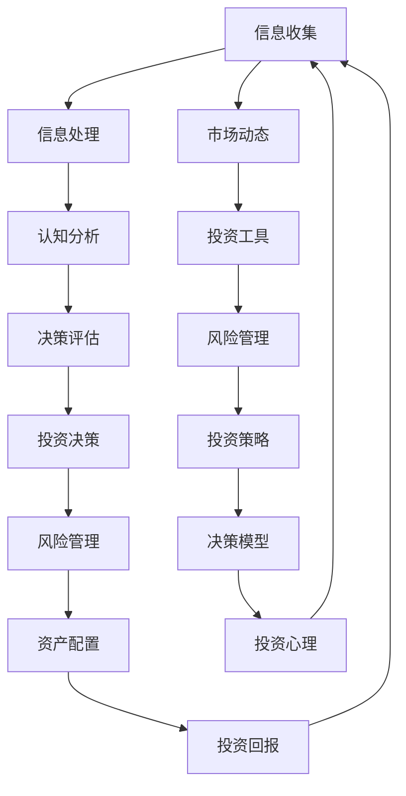

                 

### 研究背景与核心概念

在当今快速发展的金融市场中，投资者面临着越来越多的挑战和不确定性。知识型投资者，这一特殊群体的崛起，引起了学术界和实践界的广泛关注。知识型投资者不仅仅依赖于直觉和市场情绪，而是通过深入分析和理解金融市场和投资工具，做出更加理性和科学的投资决策。

**知识型投资者的定义与特征**

知识型投资者是指那些具备深厚的金融知识和分析技能，能够对市场信息进行有效处理和利用，从而做出理性投资决策的投资者。与普通投资者相比，知识型投资者具有以下几个显著特征：

1. **专业知识**：知识型投资者通常拥有丰富的金融知识和投资经验，他们了解各种投资工具的特性，熟悉市场动态，能够运用多种分析工具进行投资决策。

2. **信息处理能力**：知识型投资者具有较强的信息处理能力，能够从海量数据中筛选出有价值的信息，并对这些信息进行深入分析和解读。

3. **理性决策**：知识型投资者倾向于理性决策，他们不轻易受到市场情绪的影响，能够基于事实和逻辑做出投资决策。

4. **长期投资视角**：知识型投资者通常具备长期投资视角，他们更关注投资项目的潜在价值和基本面，而非短期市场波动。

**知识型投资者与普通投资者的区别**

知识型投资者与普通投资者在投资理念、决策过程、风险承受能力等方面存在显著差异：

1. **投资理念**：普通投资者往往依赖于直觉和情绪，而知识型投资者则基于数据分析和理性思考。

2. **决策过程**：普通投资者在决策过程中可能缺乏系统性，而知识型投资者则遵循科学的决策流程，包括信息收集、分析、评估和决策。

3. **风险承受能力**：知识型投资者通常具有更强的风险承受能力，他们能够接受短期波动，专注于长期投资回报。

**知识型投资者的投资理念**

知识型投资者的投资理念可以概括为以下几点：

1. **基本面分析**：知识型投资者重视企业的基本面分析，包括财务报表、盈利能力、成长性等，以此来评估投资价值。

2. **技术分析**：知识型投资者也擅长使用技术分析工具，通过分析股价走势、成交量等技术指标，寻找投资时机。

3. **风险管理**：知识型投资者非常注重风险管理，他们会通过资产配置和分散投资来降低投资风险。

4. **持续学习**：知识型投资者持续关注市场动态和新兴投资工具，不断更新和提升自己的投资知识和技能。

**结论**

知识型投资者凭借其深厚的专业知识和科学的决策过程，在金融市场中获得了一定的优势。然而，如何有效地培养和利用知识型投资者，仍然是学术界和实践界需要深入研究的问题。本篇文章将深入探讨知识型投资者的决策模式，旨在为投资者提供有益的参考和指导。

---

**核心概念与联系**

为了更好地理解知识型投资者的决策模式，我们可以通过以下Mermaid流程图展示其核心概念和相互联系：



通过这个流程图，我们可以清晰地看到知识型投资者从信息收集到投资决策的全过程，以及各环节之间的紧密关联。每一个步骤都起着关键作用，共同构成了知识型投资者的投资决策模式。

---

**核心算法原理讲解**

在知识型投资者的决策过程中，核心算法原理是理解和分析金融市场的重要工具。以下是一个简化的伪代码，用于描述知识型投资者在决策过程中的核心算法：

```plaintext
伪代码：知识型投资者决策模型

function 知识型投资者决策（信息集，市场环境，投资目标）:
    初始化决策模型
    收集信息集：包括财务报表、行业报告、技术分析指标等
    分析市场环境：包括宏观经济指标、市场情绪、政策变化等
    评估投资目标：包括收益率、风险承受能力、投资期限等

    for 每个信息 in 信息集:
        清洗和处理信息
        应用数据分析方法，如回归分析、聚类分析等

    for 每个市场环境因素 in 市场环境:
        评估其对投资目标的影响
        应用技术分析方法，如趋势分析、图形分析等

    根据评估结果，构建投资策略模型
        if 投资目标是高风险高收益:
            选取积极的投资策略，如股票、期货等
        else if 投资目标是低风险稳定收益:
            选取保守的投资策略，如债券、基金等

    评估投资策略模型的有效性
        通过历史数据进行回测
        考虑不同市场环境下的表现

    根据模型结果，制定投资决策
        买卖决策、调整投资组合等

    追踪和调整决策过程
        根据市场变化和投资目标调整投资策略

    返回投资决策结果
end function
```

**数学模型和公式**

在决策过程中，知识型投资者常常会使用各种数学模型和公式来评估投资机会和风险。以下是一个简化的数学模型示例，用于描述投资决策中的预期收益率和风险：

```latex
预期收益率 E(R) = Σ(w_i * R_i)
```

其中，\( E(R) \) 表示预期收益率，\( w_i \) 表示第 \( i \) 个资产的权重，\( R_i \) 表示第 \( i \) 个资产的实际收益率。

**详细讲解与举例说明**

假设知识型投资者在考虑一个投资组合，包含股票、债券和基金三种资产。每种资产的预期收益率和风险如下表所示：

| 资产类型 | 预期收益率 | 风险 |
| :------: | :--------: | :--: |
|  股票  |   15%   |  高  |
|  债券  |   5%    |  低  |
| 基金   |   8%    |  中  |

投资者希望将这三种资产按照一定的比例配置，以实现预期收益率最大化和风险最小化。

1. **预期收益率计算**

   假设投资者决定将30%的资金投资于股票，40%投资于债券，30%投资于基金，则投资组合的预期收益率计算如下：

   $$ E(R) = 0.3 \times 15\% + 0.4 \times 5\% + 0.3 \times 8\% = 5.25\% + 2\% + 2.4\% = 9.65\% $$

2. **风险计算**

   假设每种资产的风险是独立的，则投资组合的总风险可以通过加权平均计算：

   $$ σ(R) = \sqrt{w_1^2 \sigma_1^2 + w_2^2 \sigma_2^2 + w_3^2 \sigma_3^2} $$

   其中，\( \sigma_1^2 \), \( \sigma_2^2 \), \( \sigma_3^2 \) 分别表示股票、债券和基金的风险。

   $$ σ(R) = \sqrt{0.3^2 \times (15\%)^2 + 0.4^2 \times (5\%)^2 + 0.3^2 \times (8\%)^2} = \sqrt{0.0225 \times 2.25 + 0.16 \times 0.25 + 0.09 \times 0.64} = 0.2985 $$

   投资组合的标准差为 \( 0.2985 \)。

通过这个示例，我们可以看到知识型投资者如何利用数学模型和公式来评估投资机会，并制定科学的投资决策。这种方法不仅能够帮助投资者更好地理解市场，还能提高投资决策的准确性和有效性。

---

**项目实战：代码实际案例和详细解释说明**

在本节中，我们将通过一个实际的Python代码案例，展示知识型投资者如何利用编程技术来分析和决策投资组合。以下是一个简化的示例，用于说明如何使用Python进行投资组合分析。

**开发环境搭建**

首先，我们需要搭建Python开发环境。我们可以使用Anaconda来轻松安装和管理Python和相关库。以下是安装步骤：

1. 访问Anaconda官网（https://www.anaconda.com/products/distribution）并下载适合操作系统的Anaconda安装包。
2. 运行安装程序，按照默认选项进行安装。
3. 安装完成后，打开终端（或命令提示符），输入以下命令以验证安装：

   ```bash
   conda list
   ```

4. 安装必要的Python库，例如NumPy、pandas、matplotlib等：

   ```bash
   conda install numpy pandas matplotlib
   ```

**源代码详细实现**

以下是Python代码示例，用于计算投资组合的预期收益率和风险：

```python
import numpy as np
import pandas as pd

# 投资组合参数
weights = {'股票': 0.3, '债券': 0.4, '基金': 0.3}
expected_returns = {'股票': 0.15, '债券': 0.05, '基金': 0.08}
risks = {'股票': 0.3, '债券': 0.1, '基金': 0.2}

# 计算预期收益率
def calculate_expected_return(weights, expected_returns):
    return np.dot(weights.values(), expected_returns.values())

# 计算总风险
def calculate_total_risk(weights, risks):
    return np.sqrt(np.dot(np.dot(weights.values(), risks.values()), weights.values()))

# 主函数
def main():
    # 计算预期收益率
    expected_return = calculate_expected_return(weights, expected_returns)
    print(f"预期收益率：{expected_return:.2%}")

    # 计算总风险
    total_risk = calculate_total_risk(weights, risks)
    print(f"总风险：{total_risk:.2%}")

    # 绘制预期收益率和风险散点图
    import matplotlib.pyplot as plt

    plt.scatter([weights['股票']], [risks['股票']], color='r', label='股票')
    plt.scatter([weights['债券']], [risks['债券']], color='g', label='债券')
    plt.scatter([weights['基金']], [risks['基金']], color='b', label='基金')
    plt.xlabel('预期收益率')
    plt.ylabel('风险')
    plt.legend()
    plt.show()

if __name__ == "__main__":
    main()
```

**代码解读与分析**

1. **参数定义**：首先，我们定义了投资组合的参数，包括资产权重、预期收益率和风险。这些参数可以是根据实际市场数据调整的。

2. **预期收益率计算**：`calculate_expected_return` 函数通过权重和预期收益率计算投资组合的预期收益率。使用内积（dot product）实现这一计算。

3. **总风险计算**：`calculate_total_risk` 函数通过权重和风险计算投资组合的总风险。这里使用了方差-协方差矩阵和加权平均的方法。

4. **主函数**：`main` 函数调用上述两个计算函数，并打印结果。同时，使用matplotlib绘制预期收益率和风险的散点图，以便更直观地展示投资组合的风险收益特征。

通过这个实际代码案例，我们可以看到知识型投资者如何利用Python等编程工具进行投资组合分析，实现投资决策的科学化和自动化。这种方法不仅提高了分析效率，还能减少人为误差，提高投资决策的准确性。

---

**文章摘要**

本文题为《知识型投资者的决策模式研究》，旨在深入探讨知识型投资者在金融市场中的决策过程、方法及其优势。文章首先介绍了知识型投资者的定义与特征，包括专业知识、信息处理能力、理性决策和长期投资视角。随后，文章详细阐述了知识型投资者与普通投资者的区别，并探讨了其投资理念，如基本面分析、技术分析和风险管理。文章的核心内容还包括决策模式的理论基础，即决策理论及其在投资决策中的应用。在投资决策过程部分，文章从市场分析、信息处理、认知模式和投资策略等方面进行了系统分析。最后，文章通过实际代码案例展示了知识型投资者如何利用编程技术进行投资组合分析。总体而言，本文旨在为投资者提供科学的决策模式和实践指导，帮助他们在复杂的市场环境中做出更有效的投资决策。

