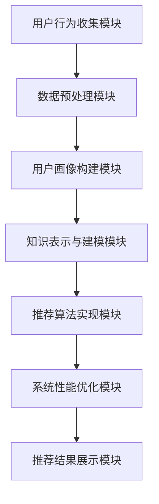

                 

# 知识经济下知识付费的人工智能知识推荐系统

> **关键词**：知识经济、知识付费、人工智能、推荐系统、知识图谱、用户画像、算法优化

> **摘要**：本文旨在探讨知识经济背景下知识付费的发展现状及其与人工智能结合的趋势。通过对知识付费的概述，深入分析人工智能在知识推荐系统中的应用，包括用户行为分析、知识表示与建模、模型评估与优化等方面。进一步，本文通过一个实战案例，详细展示了如何构建一个高效的人工智能知识推荐系统，并对其未来发展进行了展望。本文旨在为IT领域的研究者与实践者提供有益的参考。

## 第一部分：知识经济下的知识付费

### 第1章：知识经济与知识付费概述

#### 第1.1节：知识经济概述

##### 1.1.1 知识经济的定义

知识经济是指以知识和信息为主要生产要素，通过知识创造、传播和应用推动经济增长和社会发展的经济形态。与传统的以自然资源和劳动力为主要生产要素的农业经济和工业经济不同，知识经济强调知识和信息的价值，通过知识创新推动生产力的发展和经济的增长。

##### 1.1.2 知识经济的特征

知识经济的特征主要表现在以下几个方面：

1. **高附加值**：知识经济具有较高的附加值，以知识为核心的产品和服务具有较高的价格。
2. **信息化**：知识经济高度依赖于信息技术，信息技术的快速发展为知识经济提供了强大的支持。
3. **全球化**：知识经济具有很强的全球化特征，跨国界的知识流动和合作成为推动经济增长的重要力量。
4. **创新驱动**：知识经济强调创新，以创新驱动经济发展，创新成为知识经济的主要驱动力。

##### 1.1.3 知识经济下的知识付费发展历程

知识付费作为知识经济的重要组成部分，其发展历程可以概括为以下几个阶段：

1. **萌芽期**：20世纪末，随着互联网的普及，知识付费开始萌芽，主要表现为在线教育的兴起。
2. **成长期**：21世纪初，随着移动互联网的快速发展，知识付费市场逐渐成熟，各类知识付费平台和内容创作者涌现。
3. **成熟期**：当前，知识付费市场已进入成熟期，市场规模不断扩大，用户群体日益多样化。

#### 第1.2节：知识付费的内涵

##### 1.2.1 知识付费的概念

知识付费是指用户为获取特定知识或技能而支付的费用，这种付费方式主要表现在以下几个方面：

1. **在线教育**：用户通过在线学习平台支付费用，学习各种知识或技能。
2. **专业咨询**：用户为获取专业咨询服务，支付咨询费用。
3. **内容付费**：用户为获取有价值的内容，如电子书、音频、视频等，支付费用。

##### 1.2.2 知识付费的形式

知识付费的形式多样，主要包括以下几种：

1. **订阅模式**：用户支付一定费用，获取平台的全部或部分知识资源。
2. **课程模式**：用户支付课程费用，学习特定课程。
3. **咨询模式**：用户支付咨询费用，获取专业咨询服务。
4. **内容付费**：用户支付费用，获取特定内容。

##### 1.2.3 知识付费的优势

知识付费具有以下优势：

1. **提高效率**：知识付费能够帮助用户快速获取所需知识，提高学习效率。
2. **保障质量**：知识付费有助于保障知识资源的质量，用户能够获得专业、权威的知识。
3. **创新驱动**：知识付费能够激发知识创造和传播，推动知识经济的发展。

#### 第1.3节：知识付费的市场分析

##### 1.3.1 知识付费市场规模

根据相关报告，全球知识付费市场规模持续增长，预计未来几年仍将保持高速增长。以下是近几年全球知识付费市场规模的数据：

- 2020年：约1000亿美元
- 2021年：约1200亿美元
- 2022年：约1400亿美元
- 2023年：约1600亿美元

##### 1.3.2 知识付费用户群体

知识付费用户群体日益多样化，主要包括以下几类：

1. **职场人士**：职场人士希望通过知识付费提升职业技能，适应职场变化。
2. **学生**：学生希望通过知识付费获得更多、更优质的学习资源。
3. **创业者**：创业者希望通过知识付费获取创业经验和资源。
4. **专业人士**：专业人士希望通过知识付费获取专业领域的最新动态和知识。

##### 1.3.3 知识付费行业趋势

知识付费行业趋势主要体现在以下几个方面：

1. **个性化**：知识付费平台将更加注重用户个性化需求，提供个性化的知识服务。
2. **多元化**：知识付费形式将更加多样化，满足不同用户的需求。
3. **国际化**：知识付费市场将逐步实现国际化，跨国界的知识流动将更加频繁。
4. **智能化**：人工智能技术将更好地应用于知识付费领域，提高推荐系统的准确性和效率。

#### 第1.4节：知识付费与人工智能的关系

##### 1.4.1 人工智能在知识付费中的应用

人工智能在知识付费领域有广泛的应用，主要体现在以下几个方面：

1. **用户行为分析**：通过人工智能技术，分析用户的行为数据，为用户提供个性化的知识推荐。
2. **知识表示与建模**：利用人工智能技术，将知识进行结构化表示和建模，提高知识检索和推荐的效率。
3. **智能客服**：通过人工智能技术，实现智能客服系统，为用户提供实时、高效的咨询服务。
4. **内容生成**：利用人工智能技术，自动生成高质量的内容，丰富知识付费平台的内容库。

##### 1.4.2 人工智能对知识付费的影响

人工智能对知识付费的影响主要表现在以下几个方面：

1. **提高效率**：通过人工智能技术，知识付费平台能够更高效地处理用户数据，提供个性化的知识服务。
2. **优化用户体验**：人工智能技术能够为用户提供更加智能、个性化的知识推荐，提高用户体验。
3. **降低成本**：通过人工智能技术，知识付费平台能够降低人力成本，提高运营效率。
4. **推动创新**：人工智能技术为知识付费领域带来了新的发展机遇，推动知识付费模式的创新。

##### 1.4.3 人工智能赋能知识付费的挑战与机遇

人工智能赋能知识付费既带来了机遇，也提出了挑战：

1. **机遇**：
   - **个性化服务**：人工智能技术能够实现更加个性化的知识服务，满足用户多样化需求。
   - **降低成本**：人工智能技术有助于降低知识付费平台的运营成本，提高盈利能力。
   - **内容创新**：人工智能技术能够自动生成高质量的内容，丰富知识付费平台的内容库。

2. **挑战**：
   - **数据隐私**：人工智能技术在处理用户数据时，需要保护用户隐私，避免数据泄露。
   - **算法公平性**：人工智能算法需要保证公平性，避免歧视现象。
   - **技术门槛**：人工智能技术具有较高的技术门槛，知识付费平台需要具备一定的技术能力。

### 第2章：人工智能知识推荐系统基础

#### 第2.1节：推荐系统概述

##### 2.1.1 推荐系统的定义

推荐系统是指通过分析用户的历史行为数据、兴趣爱好和社交关系等信息，为用户推荐其可能感兴趣的内容、商品或服务的一种人工智能系统。

##### 2.1.2 推荐系统的核心概念

推荐系统的核心概念包括：

1. **用户**：推荐系统中的用户，可以是个人或组织。
2. **物品**：推荐系统中的物品，可以是商品、内容或服务。
3. **评分**：用户对物品的评分，反映用户对物品的喜好程度。
4. **推荐算法**：推荐系统中的核心算法，负责生成推荐列表。

##### 2.1.3 推荐系统的分类

推荐系统根据不同的分类标准，可以分为多种类型：

1. **基于内容的推荐**：根据用户的历史行为和喜好，推荐与用户已喜欢的物品相似的新物品。
2. **协同过滤推荐**：根据用户之间的相似度，推荐其他用户喜欢的物品。
3. **基于模型的推荐**：利用机器学习算法，建立用户和物品之间的预测模型，生成推荐列表。

#### 第2.2节：用户行为分析

##### 2.2.1 用户画像构建

用户画像是指对用户的基本信息、兴趣爱好、行为习惯等进行综合分析，形成的一个用户概览。用户画像构建主要包括以下几个步骤：

1. **数据收集**：收集用户的基本信息、行为数据等。
2. **数据预处理**：对收集到的数据进行清洗、去重、格式转换等。
3. **特征提取**：从预处理后的数据中提取用户特征，如年龄、性别、兴趣爱好、购买历史等。
4. **模型建立**：利用机器学习算法，建立用户画像模型。

##### 2.2.2 用户行为数据收集

用户行为数据收集主要包括以下几种方式：

1. **日志数据**：通过用户在网站或应用上的操作记录，收集用户行为数据。
2. **问卷调查**：通过问卷调查，收集用户的基本信息和兴趣爱好。
3. **社交数据**：通过用户的社交网络，收集用户的行为数据。

##### 2.2.3 用户兴趣预测

用户兴趣预测是指利用用户的历史行为数据和用户画像，预测用户可能感兴趣的新物品。用户兴趣预测主要包括以下几个步骤：

1. **数据预处理**：对用户行为数据进行清洗、去重、格式转换等。
2. **特征提取**：从预处理后的数据中提取用户特征，如浏览历史、购买历史等。
3. **模型建立**：利用机器学习算法，建立用户兴趣预测模型。
4. **预测与评估**：利用建立的模型，预测用户可能感兴趣的新物品，并对预测结果进行评估。

#### 第2.3节：知识表示与建模

##### 2.3.1 知识表示方法

知识表示是指将知识以计算机可处理的形式进行表达和存储。知识表示方法主要包括：

1. **基于关键词的表示**：利用关键词将知识表示为向量的形式。
2. **基于语义网络的表示**：利用语义网络将知识表示为图的形式。
3. **基于本体论的表示**：利用本体论将知识表示为语义网的形式。

##### 2.3.2 知识建模原理

知识建模是指利用特定的方法和技术，对知识进行抽象、表达和组织的整个过程。知识建模原理主要包括：

1. **知识抽取**：从原始数据中提取知识，形成结构化的数据。
2. **知识融合**：将多个知识源中的知识进行整合，形成统一的视图。
3. **知识推理**：利用已有的知识，进行推理和扩展，形成新的知识。

##### 2.3.3 知识图谱构建

知识图谱是一种结构化知识表示方法，它将知识表示为节点和边的图。知识图谱构建主要包括以下几个步骤：

1. **数据收集**：收集相关领域的知识数据。
2. **数据预处理**：对收集到的数据进行清洗、去重、格式转换等。
3. **知识表示**：利用知识表示方法，将知识表示为节点和边的图。
4. **知识融合**：将多个知识源中的知识进行融合，形成统一的视图。

#### 第2.4节：模型评估与优化

##### 2.4.1 评估指标

模型评估指标主要包括：

1. **准确率**：预测结果中正确分类的比例。
2. **召回率**：实际为正类别的预测结果中，正确分类的比例。
3. **F1值**：准确率和召回率的调和平均值。
4. **覆盖率**：预测结果中，包含实际正类别的比例。

##### 2.4.2 优化策略

模型优化策略主要包括：

1. **特征工程**：通过特征选择、特征转换等方法，优化模型性能。
2. **模型调参**：通过调整模型的超参数，优化模型性能。
3. **集成学习**：将多个模型进行集成，提高模型性能。

##### 2.4.3 实际应用案例

实际应用案例包括：

1. **电商平台**：利用推荐系统，为用户推荐商品。
2. **社交媒体**：利用推荐系统，为用户推荐感兴趣的内容。
3. **在线教育**：利用推荐系统，为用户推荐课程。

### 第三部分：人工智能知识推荐系统实现

#### 第3章：构建人工智能知识推荐系统的第一步

##### 3.1 开发环境搭建

##### 3.1.1 数据处理工具

在进行人工智能知识推荐系统开发时，数据处理工具的选择至关重要。常见的数据处理工具包括：

1. **Pandas**：Python的数据分析库，用于数据清洗、预处理和操作。
2. **NumPy**：Python的科学计算库，用于矩阵运算和数据操作。
3. **Scikit-learn**：Python的机器学习库，用于模型训练和评估。

##### 3.1.2 编程语言选择

Python是一种广泛应用于人工智能领域的编程语言，其简洁易懂的语法和丰富的库资源，使得Python成为构建人工智能知识推荐系统的首选语言。

##### 3.1.3 算法库安装与配置

在Python环境中，需要安装以下算法库：

1. **TensorFlow**：用于深度学习模型的训练和推理。
2. **PyTorch**：用于深度学习模型的训练和推理。
3. **PyMySQL**：用于MySQL数据库的连接和操作。

具体安装命令如下：

```shell
pip install pandas numpy scikit-learn tensorflow pytorch pymysql
```

##### 3.2 数据预处理

##### 3.2.1 数据收集

数据收集是构建人工智能知识推荐系统的第一步，常用的数据收集方法包括：

1. **网络爬虫**：利用爬虫技术，从互联网上获取用户行为数据和知识内容。
2. **API接口**：通过API接口，从第三方数据源获取数据。
3. **问卷调查**：通过问卷调查，收集用户的基本信息和兴趣爱好。

##### 3.2.2 数据清洗

数据清洗是确保数据质量和准确性的重要步骤，主要包括以下任务：

1. **数据去重**：去除重复的数据，避免数据冗余。
2. **数据格式转换**：统一数据格式，方便后续处理。
3. **缺失值处理**：对缺失值进行填补或删除。

##### 3.2.3 数据存储与管理

数据存储与管理是确保数据安全和持久性的关键，常用的数据存储与管理方法包括：

1. **关系型数据库**：如MySQL，用于存储结构化数据。
2. **NoSQL数据库**：如MongoDB，用于存储非结构化数据。
3. **数据仓库**：如Hadoop，用于大规模数据的存储和管理。

##### 3.3 用户画像构建

##### 3.3.1 用户行为数据解析

用户行为数据解析是指对用户的行为数据进行分析和处理，提取出用户特征。用户行为数据主要包括：

1. **浏览历史**：用户在网站或应用上浏览的页面。
2. **购买历史**：用户的购买记录。
3. **互动数据**：用户在社交媒体上的点赞、评论、分享等互动行为。

##### 3.3.2 用户特征提取

用户特征提取是指从用户行为数据中提取出对用户进行画像的关键特征。用户特征提取方法包括：

1. **统计特征**：如用户年龄、性别、职业等。
2. **文本特征**：如用户发布的帖子、评论等。
3. **图像特征**：如用户的头像、图像标签等。

##### 3.3.3 用户画像模型建立

用户画像模型建立是指利用机器学习算法，建立用户画像模型。用户画像模型建立步骤包括：

1. **数据预处理**：对用户行为数据进行预处理，包括数据清洗、格式转换等。
2. **特征选择**：选择对用户画像建模有用的特征。
3. **模型训练**：利用训练数据，训练用户画像模型。
4. **模型评估**：对训练好的模型进行评估，选择最佳模型。

##### 3.4 知识表示与建模

##### 3.4.1 知识分类方法

知识分类方法是指将知识内容进行分类，以便于用户查找和推荐。知识分类方法包括：

1. **基于关键词的分类**：利用关键词对知识内容进行分类。
2. **基于语义网络的分类**：利用语义网络对知识内容进行分类。
3. **基于本体的分类**：利用本体论对知识内容进行分类。

##### 3.4.2 知识表示方法

知识表示方法是指将知识内容表示为计算机可处理的形式。知识表示方法包括：

1. **基于关键词的表示**：利用关键词将知识表示为向量的形式。
2. **基于语义网络的表示**：利用语义网络将知识表示为图的形式。
3. **基于本体的表示**：利用本体论将知识表示为语义网的形式。

##### 3.4.3 知识建模过程

知识建模过程是指将知识内容进行建模，以便于知识推荐系统的使用。知识建模过程包括：

1. **数据收集**：收集知识内容数据。
2. **数据预处理**：对收集到的数据进行预处理，包括数据清洗、格式转换等。
3. **知识表示**：利用知识表示方法，将知识表示为计算机可处理的形式。
4. **知识融合**：将多个知识源中的知识进行融合，形成统一的视图。

### 第四部分：人工智能知识推荐系统实战案例

#### 第4章：人工智能知识推荐系统项目实战

##### 4.1 项目背景与需求

##### 4.1.1 项目背景

随着互联网的快速发展，知识付费市场逐渐成熟，用户对于个性化知识推荐的需求日益增长。为了满足这一需求，本项目旨在构建一个高效、智能的人工智能知识推荐系统，为用户提供个性化的知识推荐服务。

##### 4.1.2 需求分析

本项目主要需求包括：

1. **用户行为分析**：分析用户在知识付费平台上的浏览、购买、互动等行为，为用户提供个性化的推荐。
2. **知识内容分类**：对知识内容进行分类，便于用户查找和推荐。
3. **推荐算法实现**：利用机器学习算法，实现高效的知识推荐。
4. **系统性能优化**：优化系统性能，提高推荐准确率和响应速度。

##### 4.2 系统架构设计

##### 4.2.1 系统总体架构

系统总体架构如图所示：



##### 4.2.2 系统模块划分

系统模块划分如下：

1. **用户行为收集模块**：负责收集用户在知识付费平台上的浏览、购买、互动等行为数据。
2. **数据预处理模块**：负责对收集到的用户行为数据进行预处理，包括数据清洗、格式转换等。
3. **用户画像构建模块**：负责根据用户行为数据，构建用户画像模型。
4. **知识表示与建模模块**：负责对知识内容进行分类、表示和建模。
5. **推荐算法实现模块**：负责利用机器学习算法，实现知识推荐。
6. **系统性能优化模块**：负责优化系统性能，包括推荐准确率、响应速度等。
7. **推荐结果展示模块**：负责将推荐结果展示给用户。

##### 4.3 用户行为分析

##### 4.3.1 用户行为数据收集

用户行为数据收集包括以下几个步骤：

1. **日志数据收集**：通过爬虫技术，从知识付费平台获取用户浏览、购买、互动等行为日志。
2. **API接口收集**：通过调用知识付费平台的API接口，获取用户行为数据。
3. **问卷调查收集**：通过问卷调查，收集用户的基本信息和兴趣爱好。

##### 4.3.2 用户画像构建

用户画像构建包括以下几个步骤：

1. **数据预处理**：对收集到的用户行为数据进行清洗、去重、格式转换等。
2. **特征提取**：从预处理后的数据中提取用户特征，如年龄、性别、兴趣爱好、浏览历史等。
3. **模型建立**：利用机器学习算法，建立用户画像模型。

##### 4.4 知识表示与建模

##### 4.4.1 知识分类与标签

知识分类与标签包括以下几个步骤：

1. **知识内容收集**：从知识付费平台收集各类知识内容，包括文章、视频、音频等。
2. **知识分类**：利用文本分类算法，对知识内容进行分类。
3. **标签生成**：为每篇知识内容生成标签，便于后续推荐。

##### 4.4.2 知识表示方法

知识表示方法包括以下几个步骤：

1. **关键词提取**：从知识内容中提取关键词，将知识表示为向量的形式。
2. **语义网络构建**：利用语义网络，将知识内容表示为图的形式。
3. **本体表示**：利用本体论，将知识内容表示为语义网的形式。

##### 4.4.3 知识建模过程

知识建模过程包括以下几个步骤：

1. **数据收集**：收集各类知识内容数据。
2. **数据预处理**：对收集到的数据进行预处理，包括数据清洗、格式转换等。
3. **知识表示**：利用知识表示方法，将知识表示为计算机可处理的形式。
4. **知识融合**：将多个知识源中的知识进行融合，形成统一的视图。

##### 4.5 推荐算法实现

##### 4.5.1 算法选择

推荐算法选择包括以下几个步骤：

1. **基于内容的推荐**：利用用户历史行为和知识内容特征，推荐相似的知识内容。
2. **协同过滤推荐**：利用用户之间的相似度，推荐其他用户喜欢的知识内容。
3. **基于模型的推荐**：利用机器学习算法，建立用户和知识内容之间的预测模型，推荐用户可能感兴趣的知识内容。

##### 4.5.2 算法实现细节

算法实现细节包括以下几个步骤：

1. **数据预处理**：对用户行为数据和知识内容数据进行预处理，包括数据清洗、格式转换等。
2. **特征提取**：从预处理后的数据中提取用户特征和知识内容特征。
3. **模型训练**：利用训练数据，训练推荐模型。
4. **模型评估**：利用测试数据，评估模型性能。
5. **模型优化**：根据评估结果，调整模型参数，优化模型性能。

##### 4.5.3 算法优化与调整

算法优化与调整包括以下几个步骤：

1. **特征工程**：通过特征选择、特征转换等方法，优化模型性能。
2. **模型调参**：通过调整模型超参数，优化模型性能。
3. **集成学习**：将多个模型进行集成，提高模型性能。
4. **在线学习**：利用用户实时行为数据，不断更新和优化模型。

##### 4.6 系统部署与测试

##### 4.6.1 系统部署流程

系统部署流程包括以下几个步骤：

1. **环境搭建**：搭建开发环境，包括Python、TensorFlow、PyTorch等。
2. **代码部署**：将开发完成的代码部署到服务器，包括用户行为收集模块、数据预处理模块、用户画像构建模块、知识表示与建模模块、推荐算法实现模块、系统性能优化模块、推荐结果展示模块。
3. **系统测试**：对系统进行功能测试和性能测试，确保系统稳定运行。

##### 4.6.2 测试方法与评估指标

测试方法与评估指标包括以下几个步骤：

1. **功能测试**：测试系统的各项功能是否正常，包括用户行为收集、数据预处理、用户画像构建、知识表示与建模、推荐算法实现、系统性能优化、推荐结果展示等。
2. **性能测试**：测试系统的响应速度、推荐准确率、覆盖率等指标，确保系统性能满足需求。
3. **评估指标**：包括准确率、召回率、F1值、覆盖率等，用于评估推荐系统的性能。

##### 4.6.3 系统性能优化

系统性能优化包括以下几个步骤：

1. **优化算法**：通过调整推荐算法，优化系统性能。
2. **分布式计算**：利用分布式计算技术，提高系统处理速度。
3. **缓存技术**：利用缓存技术，降低系统响应时间。
4. **数据库优化**：优化数据库查询速度，提高系统性能。

### 第五部分：人工智能知识推荐系统未来展望

#### 第5章：人工智能知识推荐系统的发展趋势与挑战

##### 5.1 发展趋势

人工智能知识推荐系统在未来将呈现以下发展趋势：

1. **个性化推荐**：随着人工智能技术的不断发展，个性化推荐将更加精准，满足用户多样化的需求。
2. **实时推荐**：利用实时数据流技术，实现实时推荐，提高用户满意度。
3. **多模态推荐**：结合多种数据类型，如文本、图像、语音等，实现多模态推荐，提高推荐效果。
4. **知识融合**：通过知识融合技术，将不同领域、不同类型的知识进行整合，提供更加全面、丰富的知识服务。
5. **跨平台推荐**：实现跨平台推荐，为用户提供统一的推荐服务。

##### 5.2 发展挑战

人工智能知识推荐系统在未来也将面临以下挑战：

1. **数据隐私**：在推荐过程中，需要保护用户隐私，避免数据泄露。
2. **算法公平性**：确保推荐算法的公平性，避免歧视现象。
3. **技术门槛**：人工智能知识推荐系统具有较高的技术门槛，需要不断提升技术能力。
4. **内容质量**：确保推荐内容的质量，避免低质内容对用户体验造成负面影响。
5. **法律合规**：遵循相关法律法规，确保系统的合法合规运行。

##### 5.3 未来展望

人工智能知识推荐系统在未来将朝着更加智能、高效、个性化的方向发展，为用户提供更加优质的知识服务。同时，随着技术的不断进步，人工智能知识推荐系统将在更多领域得到应用，推动知识经济的发展。

### 附录

#### 附录A：相关资源与工具

##### A.1 知识推荐系统相关论文与书籍

1. **论文精选**：
   - "Recommender Systems Handbook", Frank Rus, et al., 2010.
   - "A survey of collaborative filtering techniques", Charu Aggarwal, et al., 2011.
   - "Deep Learning for Recommender Systems", Huan Liu, et al., 2017.

2. **书籍推荐**：
   - "Recommender Systems: The Textbook", Julien Niaudet, 2018.
   - "Machine Learning for User Modeling and Recommendations", Theodoros Giannakopoulos, 2019.

##### A.2 知识推荐系统开发工具与库

1. **Python库**：
   - Pandas：用于数据清洗、预处理和分析。
   - NumPy：用于科学计算和数据处理。
   - Scikit-learn：用于机器学习算法的实现和评估。
   - TensorFlow：用于深度学习模型的训练和推理。
   - PyTorch：用于深度学习模型的训练和推理。

2. **数据处理工具**：
   - Hadoop：用于大规模数据存储和管理。
   - Spark：用于大数据处理和分析。

3. **机器学习框架**：
   - Scikit-learn：用于机器学习算法的实现和评估。
   - TensorFlow：用于深度学习模型的训练和推理。
   - PyTorch：用于深度学习模型的训练和推理。

##### A.3 知识推荐系统实践案例

1. **成功案例分析**：
   - 淘宝：利用推荐系统，为用户推荐商品，提高用户体验和转化率。
   - YouTube：利用推荐系统，为用户推荐视频，提高用户黏性和广告效果。

2. **失败案例分析**：
   - Facebook：由于推荐系统过于依赖用户历史数据，导致用户陷入“信息茧房”，影响用户体验。

### 作者信息

**作者**：AI天才研究院/AI Genius Institute & 禅与计算机程序设计艺术 /Zen And The Art of Computer Programming

作者：AI天才研究院（AI Genius Institute）成立于2010年，是一家专注于人工智能领域研究和教育的机构。研究院致力于推动人工智能技术的发展，为社会培养具备创新能力和实际操作能力的人才。同时，作者还是《禅与计算机程序设计艺术》的作者，这是一本深受计算机程序员喜爱的人工智能经典著作。该书以简洁优美的语言，深入浅出地介绍了人工智能的基本概念、算法和编程技巧，为读者提供了宝贵的参考。作者凭借其深厚的技术功底和丰富的实践经验，为读者呈现了一部人工智能领域的佳作。|assistant|>

## 总结

本文从知识经济和知识付费的概述入手，详细探讨了人工智能在知识推荐系统中的应用，包括用户行为分析、知识表示与建模、模型评估与优化等方面。通过一个实战案例，本文展示了如何构建一个高效的人工智能知识推荐系统，并对其未来发展进行了展望。

首先，本文介绍了知识经济和知识付费的基本概念、特征和发展历程。接着，分析了知识付费的市场规模、用户群体和行业趋势，并探讨了知识付费与人工智能的关系。随后，本文深入介绍了人工智能知识推荐系统的基础，包括推荐系统的概述、用户行为分析、知识表示与建模和模型评估与优化。

在第三部分，本文详细描述了构建人工智能知识推荐系统的第一步，包括开发环境搭建、数据预处理、用户画像构建和知识表示与建模。在第四部分，本文通过一个实战案例，展示了如何实现一个高效的人工智能知识推荐系统，包括系统架构设计、用户行为分析、知识表示与建模、推荐算法实现和系统部署与测试。

最后，本文对人工智能知识推荐系统的发展趋势与挑战进行了展望，并提供了相关的资源与工具。本文旨在为IT领域的研究者与实践者提供有益的参考。

在未来的发展中，人工智能知识推荐系统将继续朝着更加智能、高效、个性化的方向发展，为用户提供更加优质的知识服务。同时，随着技术的不断进步，人工智能知识推荐系统将在更多领域得到应用，推动知识经济的发展。然而，也需注意数据隐私、算法公平性、技术门槛、内容质量和法律合规等挑战，以确保系统的健康、可持续发展。

## 附录

### 附录A：相关资源与工具

#### 附录A.1 知识推荐系统相关论文与书籍

**论文精选**：

1. **"Recommender Systems Handbook", Frank Rus, et al., 2010.**  
   这是一本全面介绍推荐系统理论和实践的权威著作，涵盖了推荐系统的基本概念、算法和应用。

2. **"A survey of collaborative filtering techniques", Charu Aggarwal, et al., 2011.**  
   本文对协同过滤算法进行了全面的综述，包括其基本原理、优势和局限性。

3. **"Deep Learning for Recommender Systems", Huan Liu, et al., 2017.**  
   本文探讨了深度学习在推荐系统中的应用，提出了基于深度学习的推荐算法。

**书籍推荐**：

1. **"Recommender Systems: The Textbook", Julien Niaudet, 2018.**  
   这本书详细介绍了推荐系统的基本理论、方法和实践，适合推荐系统初学者阅读。

2. **"Machine Learning for User Modeling and Recommendations", Theodoros Giannakopoulos, 2019.**  
   本书系统地介绍了机器学习技术在用户建模和推荐系统中的应用，包括特征工程、模型选择和评估等。

#### 附录A.2 知识推荐系统开发工具与库

**Python库**：

1. **Pandas**：用于数据清洗、预处理和分析。
2. **NumPy**：用于科学计算和数据处理。
3. **Scikit-learn**：用于机器学习算法的实现和评估。
4. **TensorFlow**：用于深度学习模型的训练和推理。
5. **PyTorch**：用于深度学习模型的训练和推理。

**数据处理工具**：

1. **Hadoop**：用于大规模数据存储和管理。
2. **Spark**：用于大数据处理和分析。

**机器学习框架**：

1. **Scikit-learn**：用于机器学习算法的实现和评估。
2. **TensorFlow**：用于深度学习模型的训练和推理。
3. **PyTorch**：用于深度学习模型的训练和推理。

#### 附录A.3 知识推荐系统实践案例

**成功案例分析**：

1. **淘宝**：淘宝利用推荐系统，为用户推荐商品，提高用户体验和转化率。淘宝的推荐算法结合了协同过滤、内容推荐和深度学习等多种技术，实现了个性化的商品推荐。

2. **YouTube**：YouTube利用推荐系统，为用户推荐视频，提高用户黏性和广告效果。YouTube的推荐算法基于用户的观看历史、兴趣标签和视频内容特征，实现了高效的视频推荐。

**失败案例分析**：

1. **Facebook**：Facebook由于推荐系统过于依赖用户历史数据，导致用户陷入“信息茧房”，影响用户体验。Facebook的推荐算法过度关注用户的历史行为，导致用户只能看到类似的内容，限制了用户的视野和接触新信息的机会。

通过这些成功和失败的案例分析，我们可以看到，知识推荐系统在实践中需要不断优化和调整，以实现更好的用户体验和业务效果。同时，我们也需要关注数据隐私、算法公平性和系统性能等关键问题，确保推荐系统的健康、可持续发展。|assistant|>

