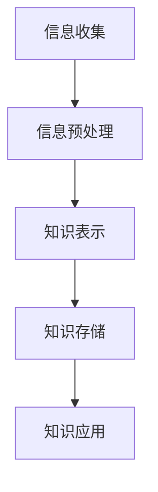
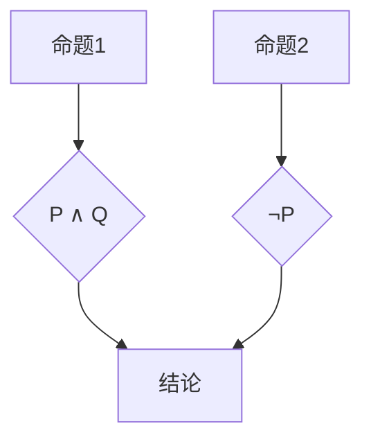

                 

### 第1章：知识表征概述

#### 1.1 知识表征的概念

**知识表征**是信息科学、认知科学和人工智能领域中的一个核心概念，它涉及如何将信息组织成结构化的形式，以便于计算机或人脑进行处理、存储和应用。知识表征不仅是一门理论学科，同时也是实践中的关键技术，它贯穿于人工智能系统的各个环节，从数据预处理到模型训练，再到最终的推理和应用。

**知识表征的定义**：

知识表征可以理解为将外部世界的复杂信息转化为计算机或人脑能够理解和处理的形式。这个过程通常包括以下几个步骤：

1. **信息收集**：从各种数据源获取信息，包括文本、图像、声音等。
2. **信息预处理**：清洗和整理数据，使其适用于进一步的加工。
3. **知识表示**：将预处理后的信息组织成结构化的形式，如符号、语义网络、向量等。
4. **知识存储**：将表示后的知识存储在相应的数据结构中，如数据库、内存等。
5. **知识应用**：在特定场景下利用存储的知识进行推理、决策或生成输出。

使用Mermaid流程图展示知识表征的基本流程：



#### 1.2 人脑与计算机知识表征的差异

**人脑知识表征的特点**：

人脑知识表征是一种高度复杂和自适应的机制，其特点包括：

- **神经元与神经网络**：大脑由数以亿计的神经元组成，这些神经元通过复杂的神经网络相互连接，形成一个高度动态和可塑性的信息处理系统。
- **记忆机制**：大脑具有强大的记忆功能，能够通过多种记忆系统（如短期记忆、长期记忆等）来存储和检索信息。
- **认知模型**：人脑具有感知、注意力、推理等多种认知功能，这些功能协同工作，使得人脑能够处理和理解复杂的信息。

以下是一个简单的伪代码示例，展示人脑知识表征的基本原理：

```python
def brain_representation(data):
    # 大脑处理数据
    processed_data = process_data(data)
    # 记忆数据
    memory_data = store_memory(processed_data)
    # 应用知识
    application = apply_knowledge(memory_data)
    return processed_data, memory_data, application
```

**计算机知识表征的特点**：

计算机知识表征则相对简单和规则化，其特点包括：

- **计算机架构基础**：计算机由硬件和软件组成，硬件结构如CPU、内存、硬盘等，软件系统包括操作系统、数据库、应用程序等。
- **学习算法**：计算机通过机器学习算法从数据中学习知识，这些算法包括监督学习、无监督学习、强化学习等。
- **知识表示语言**：计算机使用形式逻辑、语义网络、自然语言处理等技术来表示知识。

以下是一个简单的伪代码示例，展示计算机知识表征的基本原理：

```python
def computer_representation(data):
    # 数据处理
    processed_data = process_data(data)
    # 存储数据
    stored_data = store_data(processed_data)
    # 应用知识
    application = apply_knowledge(stored_data)
    return processed_data, stored_data, application
```

#### 1.3 研究目的与结构安排

**研究目的**：

本文旨在探讨人脑与计算机知识表征的异同，分析两者在知识表征过程中的核心机制和特点，从而为人工智能系统提供理论指导和技术支持。

**结构安排**：

本文将分为以下几个部分：

1. **第一部分：引言**：介绍知识表征的概念和重要性，阐述人脑与计算机知识表征的差异。
2. **第二部分：人脑知识表征**：详细探讨大脑结构基础、记忆机制和认知模型。
3. **第三部分：计算机知识表征**：介绍计算机架构基础、学习算法和知识表示语言。
4. **第四部分：人脑与计算机知识表征的异同**：比较分析两者的核心差异和功能性差异。
5. **第五部分：应用与展望**：讨论计算机辅助认知和未来发展趋势。

通过这样的结构安排，本文将逐步深入地探讨知识表征的各个方面，为读者提供一个全面而深入的视角。接下来，我们将进一步详细探讨人脑知识表征的相关内容。

----------------------------------------------------------------

## 《知识表征：人脑与计算机的异同》目录大纲

### 第一部分：引言

#### 第1章：知识表征概述

- 1.1 知识表征的概念
  - 知识表征的定义
  - 知识表征的基本流程（使用Mermaid流程图展示）

- 1.2 人脑与计算机知识表征的差异
  - 人脑知识表征的特点（神经元与神经网络、记忆机制、认知模型）
  - 计算机知识表征的特点（计算机架构基础、学习算法、知识表示语言）
  - 伪代码示例

- 1.3 研究目的与结构安排
  - 研究目的
  - 结构安排概述

### 第二部分：人脑知识表征

#### 第2章：大脑结构基础

- 2.1 大脑的基本结构
  - 大脑皮层、海马体、杏仁核等

- 2.2 神经元与神经网络
  - 神经元的结构与功能
  - 神经网络的基本原理
  - 伪代码示例

- 2.3 大脑学习机制
  - 反应性学习与操作性学习
  - 神经可塑性
  - 伪代码示例

#### 第3章：人脑记忆机制

- 3.1 记忆的基本概念
  - 短期记忆与长期记忆
  - 记忆编码与记忆巩固

- 3.2 长时记忆与短时记忆
  - 短时记忆的特点
  - 长时记忆的特点
  - 伪代码示例

- 3.3 记忆加工过程
  - 编码、存储与检索
  - 记忆错误与遗忘

#### 第4章：人脑认知模型

- 4.1 认知模型的定义
  - 认知心理学的概念
  - 认知模型的类型

- 4.2 感知与注意力机制
  - 感知过程
  - 注意力分配
  - 伪代码示例

- 4.3 知识的编码与存储
  - 知识编码的方法
  - 知识存储的结构
  - 伪代码示例

### 第三部分：计算机知识表征

#### 第5章：计算机架构基础

- 5.1 计算机硬件结构
  - CPU、内存、硬盘等
  - 硬件架构的基本原理

- 5.2 软件系统组成
  - 操作系统、数据库、应用程序等
  - 软件系统的工作原理

- 5.3 计算机存储机制
  - 内存储器与外存储器
  - 存储结构与管理

#### 第6章：计算机学习算法

- 6.1 机器学习的定义
  - 学习过程的基本概念
  - 机器学习的分类

- 6.2 监督学习与无监督学习
  - 算法原理
  - 伪代码示例

- 6.3 强化学习与迁移学习
  - 算法原理
  - 伪代码示例

#### 第7章：知识表示语言

- 7.1 知识表示的概念
  - 知识表示的基本原理
  - 知识表示的类型

- 7.2 形式逻辑与语义网
  - 形式逻辑的应用
  - 语义网的基本原理

- 7.3 自然语言处理
  - 语言模型与文本分析
  - 伪代码示例

### 第四部分：人脑与计算机知识表征的异同

#### 第8章：比较分析

- 8.1 知识表征的核心异同
  - 深度分析人脑与计算机知识表征的差异

- 8.2 功能性差异
  - 人脑与计算机知识表征在不同场景下的应用

- 8.3 发展前景
  - 知识表征的未来发展趋势

### 第五部分：应用与展望

#### 第9章：计算机辅助认知

- 9.1 计算机模拟大脑记忆
  - 计算机模拟记忆的基本原理

- 9.2 计算机辅助学习策略
  - 有效的学习策略
  - 伪代码示例

- 9.3 人工智能在教育中的应用
  - 教育模式的创新

#### 第10章：未来发展趋势

- 10.1 交叉领域研究
  - 脑机接口、认知图谱等前沿领域

- 10.2 新型知识表征技术
  - 神经符号主义、图神经网络等

- 10.3 人机协作与融合
  - 跨界协作的新模式

### 附录

#### 附录A：相关知识拓展

- A.1 神经科学基础
  - 神经元与神经网络的基本原理

- A.2 计算机科学基础
  - 计算机硬件与软件的基本知识

- A.3 经验与建议
  - 知识表征领域的研究经验与实用建议

### 参考文献

- 列出本文引用的主要参考文献

---

通过以上的目录大纲，我们可以看到本文将详细探讨知识表征的人脑与计算机异同，并分析其在各个领域的应用和未来发展趋势。每一章节都将深入讲解相关的核心概念、算法原理、数学模型和项目实战，为读者提供一个全面而深入的视角。接下来，我们将从人脑知识表征的角度出发，深入探讨大脑结构基础、记忆机制和认知模型等内容。

----------------------------------------------------------------

### 第二部分：人脑知识表征

#### 第2章：大脑结构基础

大脑是人类思维和感知的中心，其结构复杂而精细。了解大脑的基本结构对于理解人脑知识表征具有重要意义。

##### 2.1 大脑的基本结构

大脑由以下几个主要部分组成：

- **大脑皮层**：大脑皮层是大脑的最外层，由灰质构成，是思维、感知和认知活动的主要场所。
- **基底核**：基底核位于大脑深部，参与运动控制和情绪调节。
- **小脑**：小脑主要参与运动协调和平衡控制。
- **脑干**：脑干连接大脑与脊髓，负责基本的生理功能，如呼吸和心跳。
- **间脑**：间脑包括丘脑和下丘脑，参与感知、情绪和内分泌调节。

##### 2.2 神经元与神经网络

神经元是大脑的基本单元，具有接收信息、传递信息和产生反应的功能。每个神经元由细胞体、树突和轴突组成。树突接收其他神经元的信息，轴突则将信息传递出去。

神经网络是由大量神经元连接而成的复杂网络，这些神经元通过突触连接形成一个高度互联的系统。神经网络的基本原理是通过大量的简单单元协同工作来执行复杂的任务。

以下是一个简化的伪代码示例，展示神经元和神经网络的基本原理：

```python
# 神经元类
class Neuron:
    def __init__(self):
        self.inputs = []
        self.weights = []
        self.bias = 0
        self.output = 0
    
    def forward_pass(self, inputs):
        total_input = sum(w * i for w, i in zip(self.weights, inputs)) + self.bias
        self.output = sigmoid(total_input)
        return self.output

# 神经网络类
class NeuralNetwork:
    def __init__(self, layers):
        self.layers = layers
    
    def forward_pass(self, inputs):
        current_inputs = inputs
        for layer in self.layers:
            current_inputs = layer.forward_pass(current_inputs)
        return current_inputs
    
# sigmoid激活函数
def sigmoid(x):
    return 1 / (1 + exp(-x))
```

##### 2.3 大脑学习机制

大脑的学习机制可以分为反应性学习与操作性学习。

- **反应性学习**：反应性学习是基于生物学本能的学习方式，例如婴儿在听到母亲声音时会表现出反应。这种学习方式依赖于先天编程和经验积累。
  
- **操作性学习**：操作性学习是通过奖励和惩罚来塑造行为的学习方式。例如，通过反复尝试和错误，个体学会如何完成某个任务。操作性学习涉及大脑中的奖励系统，例如伏隔核，它在大脑中编码快乐和奖励的感觉。

大脑学习的一个重要机制是神经可塑性，即神经元和神经网络在外界刺激下能够发生变化的能力。神经可塑性包括结构可塑性和功能可塑性。结构可塑性指的是神经回路的变化，而功能可塑性指的是神经元活动模式的变化。

以下是一个简化的伪代码示例，展示操作性学习的基本原理：

```python
# 操作性学习伪代码
def operate_learning(reward_signal, action):
    if reward_signal > 0:
        # 奖励信号增强
        enhance_neuron_connection(action)
    elif reward_signal < 0:
        # 惩罚信号减弱
        weaken_neuron_connection(action)

def enhance_neuron_connection(action):
    # 增强特定动作的神经连接
    # 例如，增加权重或加强突触连接
    pass

def weaken_neuron_connection(action):
    # 减弱特定动作的神经连接
    # 例如，减小权重或减弱突触连接
    pass
```

#### 总结

本章详细介绍了大脑的基本结构、神经元与神经网络以及大脑学习机制。通过对这些基础知识的理解，我们可以更好地把握人脑知识表征的复杂性，为后续章节的分析提供基础。

接下来，我们将进一步探讨人脑的记忆机制，分析记忆的基本概念、长时记忆与短时记忆的特点以及记忆加工过程。

----------------------------------------------------------------

### 第3章：人脑记忆机制

记忆是大脑处理信息的关键能力，它使得我们能够保存知识、经验和技能，以便在未来使用。记忆机制的研究对于理解人类认知功能以及设计更高效的人工智能系统具有重要意义。

#### 3.1 记忆的基本概念

记忆可以定义为大脑对信息的编码、存储和提取过程。记忆的三个基本阶段包括：

1. **编码**：将感知到的信息转化为大脑可以处理的形式。
2. **存储**：将编码后的信息保存到大脑的不同区域。
3. **提取**：在需要时从大脑中检索信息。

记忆的这些阶段不仅仅是简单的信息传递过程，而是涉及到复杂的生物化学和神经活动。

#### 3.2 长时记忆与短时记忆

大脑中存在两种主要的记忆系统：长时记忆和短时记忆。

- **短时记忆**：也称为工作记忆，是一种短暂的记忆系统，通常用于处理和操作当前的信息。例如，当我们拨打电话时，需要记住电话号码，但一旦拨号完成，这个信息就不再需要了。短时记忆容量有限，大约只能保持7±2个信息单元。

以下是一个简化的伪代码示例，展示短时记忆的工作原理：

```python
# 短时记忆伪代码
class ShortTermMemory:
    def __init__(self, capacity=7):
        self.capacity = capacity
        self.memory = []

    def store(self, item):
        if len(self.memory) < self.capacity:
            self.memory.append(item)
        else:
            self.memory.pop(0)
            self.memory.append(item)

    def retrieve(self):
        return self.memory
```

- **长时记忆**：是一种持久性的记忆系统，用于存储长期的知识和经验。长时记忆分为两种类型：程序性记忆和陈述性记忆。

  - **程序性记忆**：涉及技能和自动化的行动，如骑自行车或弹钢琴。这种记忆不依赖于语言，而是通过不断的练习和重复形成。
  
  - **陈述性记忆**：涉及事实和事件的记忆，如记住一个人的名字或一个历史日期。这种记忆通常需要语言参与，并且可以通过语言进行表达。

以下是一个简化的伪代码示例，展示长时记忆的工作原理：

```python
# 长时记忆伪代码
class LongTermMemory:
    def encode(self, item):
        # 编码过程，将信息转化为神经活动
        encoded_item = encode_to_neural_activity(item)
        # 存储到大脑的不同区域
        store_to_brain_regions(encoded_item)

    def retrieve(self, item):
        # 从大脑中检索信息
        retrieved_item = retrieve_from_brain_regions(item)
        return decode_from_neural_activity(retrieved_item)

def encode_to_neural_activity(item):
    # 编码过程的实现
    pass

def store_to_brain_regions(encoded_item):
    # 存储过程的实现
    pass

def decode_from_neural_activity(retrieved_item):
    # 解码过程的实现
    pass
```

#### 3.3 记忆加工过程

记忆加工过程包括编码、存储和提取三个主要阶段，其中每个阶段都有其特定的机制和挑战。

- **编码**：编码是记忆过程的第一步，它涉及将感官信息转换为神经信号。这个过程依赖于大脑中的神经元网络和突触连接的动态变化。例如，当我们看到一张面孔时，视觉皮层中的神经元会被激活，并将这些激活模式编码为记忆。

- **存储**：存储是将编码后的信息转化为持久性记忆的过程。这个过程中，信息在大脑的不同区域被重复和强化，以巩固记忆。例如，当我们在学习新知识时，神经元之间的突触连接会变得更加强大，从而使得记忆更加牢固。

- **提取**：提取是当需要使用记忆时，从大脑中检索信息的过程。这个过程可能受到多种因素的影响，如时间、干扰和检索线索等。例如，当我们试图回忆一个电话号码时，可能需要通过相关线索（如人名或地点）来触发记忆。

以下是一个简化的伪代码示例，展示记忆加工过程：

```python
# 记忆加工过程伪代码
class MemoryProcess:
    def encode_memory(self, sensory_input):
        neural_activity = encode_sensory_input(sensory_input)
        self.store_neural_activity(neural_activity)

    def store_neural_activity(self, neural_activity):
        # 存储神经活动的实现
        # 例如，通过突触加强或神经网络的重组
        pass

    def retrieve_memory(self, retrieval_cue):
        neural_activity = retrieve_neural_activity(retrieval_cue)
        decoded_memory = decode_neural_activity(neural_activity)
        return decoded_memory

def encode_sensory_input(sensory_input):
    # 编码感官输入的实现
    pass

def retrieve_neural_activity(retrieval_cue):
    # 检索神经活动的实现
    pass

def decode_neural_activity(neural_activity):
    # 解码神经活动的实现
    pass
```

#### 总结

本章详细介绍了人脑的记忆机制，包括短时记忆和长时记忆的基本概念、特点以及记忆加工过程。理解记忆机制对于人工智能系统的发展具有重要意义，它有助于设计出更高效的学习和记忆算法，从而实现更智能的人工智能应用。

接下来，我们将探讨人脑的认知模型，分析认知心理学的概念、感知与注意力机制以及知识的编码与存储。

----------------------------------------------------------------

### 第4章：人脑认知模型

人脑认知模型是认知心理学和神经科学领域的一个重要研究方向，它试图揭示人类思维过程的机制和规律。在这一章中，我们将探讨认知心理学的概念、感知与注意力机制以及知识的编码与存储。

#### 4.1 认知模型的定义

认知模型是对人脑信息处理过程的抽象和模拟。它包括一系列理论框架、假设和数学模型，用于描述感知、记忆、推理和问题解决等认知功能。认知模型的研究目标是通过理解人脑的认知机制，为人工智能系统提供理论指导和技术支持。

#### 4.2 感知与注意力机制

感知是大脑对感官信息进行编码和理解的过程。它涉及到多个感官系统，如视觉、听觉、触觉和嗅觉等。注意力机制是感知过程中一个重要的组成部分，它决定了大脑对哪些信息进行加工。

- **感知过程**：感知过程可以分为以下几个阶段：

  - **感觉输入**：感官器官接收外界信息，如光线、声音和气味等。
  - **感觉编码**：感官信息被转化为神经信号，并在大脑中进行初步处理。
  - **感觉整合**：不同感官信息在大脑中整合，形成对环境的整体感知。

- **注意力机制**：注意力机制决定了大脑对哪些信息进行加工。注意力可以分为以下几个类型：

  - **选择性注意力**：选择性地关注特定信息，而忽略其他信息。
  - **分配性注意力**：同时关注多个任务或信息源。
  - **持续性注意力**：长时间保持对特定信息或任务的关注。

以下是一个简化的伪代码示例，展示感知和注意力机制的基本原理：

```python
# 感知与注意力机制伪代码
class PerceptionAndAttention:
    def process_sensory_input(self, sensory_input):
        encoded_input = encode_sensory_input(sensory_input)
        focused_input = select_attention(encoded_input)
        integrated_perception = integrate_perception(focused_input)
        return integrated_perception

def encode_sensory_input(sensory_input):
    # 编码感官输入的实现
    pass

def select_attention(encoded_input):
    # 选择性注意力的实现
    pass

def integrate_perception(focused_input):
    # 感觉整合的实现
    pass
```

#### 4.3 知识的编码与存储

知识的编码与存储是认知模型的重要组成部分。知识编码是将外部信息转化为大脑可以处理的形式，而知识存储是将编码后的信息持久保存。

- **知识编码**：知识编码可以分为以下几种方式：

  - **语义编码**：将信息转化为语义概念和关系，如使用词汇和句子来表示知识。
  - **模式识别编码**：将信息转化为视觉、听觉等感官模式，如使用图像和声音来表示知识。
  - **情境编码**：将信息与特定的情境关联，如通过回忆特定场景来恢复记忆。

- **知识存储**：知识存储可以分为以下几种方式：

  - **神经元存储**：将信息存储在大脑中的特定神经元和突触连接中。
  - **突触可塑性存储**：通过改变突触的连接强度来存储信息，如通过强化突触连接来巩固记忆。
  - **分布式存储**：将信息存储在大脑的多个区域，形成复杂的神经网络。

以下是一个简化的伪代码示例，展示知识编码与存储的基本原理：

```python
# 知识编码与存储伪代码
class KnowledgeEncodingAndStorage:
    def encode_knowledge(self, information):
        semantic_representation = encode_semantic(information)
        perceptual_representation = encode_perceptual(information)
        contextual_representation = encode_contextual(information)
        return semantic_representation, perceptual_representation, contextual_representation

    def store_knowledge(self, representation):
        neural_activity = convert_representation_to_neural_activity(representation)
        store_neural_activity(neural_activity)

def encode_semantic(information):
    # 语义编码的实现
    pass

def encode_perceptual(information):
    # 模式识别编码的实现
    pass

def encode_contextual(information):
    # 情境编码的实现
    pass

def convert_representation_to_neural_activity(representation):
    # 转换为神经活动的实现
    pass

def store_neural_activity(neural_activity):
    # 存储神经活动的实现
    pass
```

#### 总结

本章详细介绍了人脑的认知模型，包括认知心理学的概念、感知与注意力机制以及知识的编码与存储。这些认知机制为我们理解人脑如何处理信息提供了重要的理论基础，同时也为人工智能系统的发展提供了重要的启示。

接下来，我们将探讨计算机知识表征的基础，包括计算机架构基础、学习算法和知识表示语言。

----------------------------------------------------------------

### 第三部分：计算机知识表征

#### 第5章：计算机架构基础

计算机架构是计算机硬件和软件的基本组织结构，它决定了计算机的性能和功能。理解计算机架构对于构建有效的知识表征系统至关重要。

##### 5.1 计算机硬件结构

计算机硬件主要包括中央处理器（CPU）、内存、存储设备和输入输出设备。

- **中央处理器（CPU）**：CPU是计算机的核心，负责执行指令和计算。它由运算单元、控制单元和存储单元组成。运算单元执行算术和逻辑运算，控制单元负责指令的调度和执行，存储单元用于暂存数据和指令。
  
- **内存**：内存是计算机用于暂存数据和指令的存储器，包括随机存取存储器（RAM）和只读存储器（ROM）。RAM用于存储正在运行的程序和数据，而ROM则存储计算机启动时需要的程序。

- **存储设备**：存储设备用于长期存储数据和程序，如硬盘驱动器（HDD）和固态驱动器（SSD）。硬盘驱动器使用旋转磁盘存储数据，而固态驱动器使用闪存存储数据。

- **输入输出设备**：输入设备（如键盘、鼠标）用于向计算机输入数据，而输出设备（如显示器、打印机）用于向用户输出结果。

##### 5.2 软件系统组成

软件系统包括操作系统、数据库、应用程序等，它们共同协作使计算机能够执行各种任务。

- **操作系统**：操作系统是计算机系统的核心软件，负责管理计算机硬件资源、提供用户接口和运行应用程序。常见的操作系统包括Windows、Linux和macOS。

- **数据库**：数据库用于存储和管理大量的数据。数据库管理系统（DBMS）提供了数据存储、检索、更新和管理功能。常见的数据库管理系统包括MySQL、PostgreSQL和Oracle。

- **应用程序**：应用程序是用户用于完成特定任务的软件程序。例如，文字处理软件、电子表格软件和图形设计软件等。

##### 5.3 计算机存储机制

计算机存储机制包括内存存储和外部存储，它们在计算机系统中扮演不同的角色。

- **内存存储**：内存存储用于暂存数据和指令，以便CPU快速访问。内存存储的速度远远快于外部存储，但容量相对较小。内存存储包括随机存取存储器（RAM）和只读存储器（ROM）。

- **外部存储**：外部存储用于长期存储数据和程序。硬盘驱动器（HDD）和固态驱动器（SSD）是常见的外部存储设备。硬盘驱动器使用旋转磁盘存储数据，而固态驱动器使用闪存存储数据。外部存储的容量通常比内存存储大，但速度相对较慢。

#### 总结

本章详细介绍了计算机架构的基础知识，包括硬件结构、软件系统组成和存储机制。这些基础知识为我们理解计算机知识表征的机制提供了必要的背景。

接下来，我们将探讨计算机学习算法，分析机器学习的定义、监督学习与无监督学习、强化学习与迁移学习。

----------------------------------------------------------------

#### 第6章：计算机学习算法

计算机学习算法是计算机科学和人工智能领域的重要研究方向，它使得计算机能够从数据中学习规律和模式，从而进行预测和决策。在本章中，我们将详细介绍机器学习的定义、监督学习与无监督学习、强化学习与迁移学习。

##### 6.1 机器学习的定义

机器学习（Machine Learning）是一种使计算机系统能够通过数据学习和改进的方法，其核心思想是通过训练数据集来发现数据中的规律，然后使用这些规律对新数据进行预测或分类。机器学习过程通常包括以下步骤：

1. **数据收集**：从各种来源收集数据，如数据库、传感器或网络。
2. **数据预处理**：清洗和整理数据，使其适合于训练模型。
3. **模型选择**：选择合适的算法和模型架构。
4. **模型训练**：使用训练数据集训练模型，调整模型参数。
5. **模型评估**：使用测试数据集评估模型的性能。
6. **模型部署**：将训练好的模型部署到实际应用中。

以下是一个简化的伪代码示例，展示机器学习的基本流程：

```python
# 机器学习基本流程伪代码
class MachineLearning:
    def __init__(self, dataset):
        self.dataset = dataset
    
    def preprocess_data(self):
        # 数据清洗和整理
        preprocessed_data = preprocess(dataset)
        return preprocessed_data

    def choose_model(self):
        # 选择模型
        model = choose_model()
        return model

    def train_model(self, preprocessed_data):
        # 训练模型
        trained_model = train(model, preprocessed_data)
        return trained_model

    def evaluate_model(self, trained_model, test_data):
        # 评估模型性能
        performance = evaluate(model, test_data)
        return performance

    def deploy_model(self, trained_model):
        # 部署模型
        deploy(model)
```

##### 6.2 监督学习与无监督学习

根据学习过程中是否有已知的输出标签，机器学习可以分为监督学习（Supervised Learning）和无监督学习（Unsupervised Learning）。

- **监督学习**：在监督学习中，训练数据集包含输入和对应的输出标签，模型的目标是学习输入和输出之间的映射关系。常见的监督学习任务包括回归（Regression）和分类（Classification）。

  - **回归**：回归任务旨在预测一个连续的数值输出。常见的回归算法包括线性回归、多项式回归和支持向量机（SVM）。

  - **分类**：分类任务旨在将输入数据划分为不同的类别。常见的分类算法包括决策树（Decision Tree）、随机森林（Random Forest）和K最近邻（K-Nearest Neighbors）。

以下是一个简化的伪代码示例，展示监督学习的基本原理：

```python
# 监督学习伪代码
class SupervisedLearning:
    def train(self, X, y):
        # 训练模型
        model = train_model(X, y)
        return model

    def predict(self, X, model):
        # 预测输出
        y_pred = model.predict(X)
        return y_pred

# 线性回归示例
from sklearn.linear_model import LinearRegression

model = LinearRegression()
model.fit(X_train, y_train)
y_pred = model.predict(X_test)
```

- **无监督学习**：在无监督学习中，训练数据集只包含输入数据，没有对应的输出标签。模型的目标是发现数据中的隐含结构和模式。常见的无监督学习任务包括聚类（Clustering）和降维（Dimensionality Reduction）。

  - **聚类**：聚类任务旨在将相似的数据点分组到一起。常见的聚类算法包括K-均值聚类（K-Means）、层次聚类（Hierarchical Clustering）和DBSCAN。

  - **降维**：降维任务旨在减少数据的维度，同时保持数据的结构。常见的降维算法包括主成分分析（PCA）、线性判别分析（LDA）和自编码器（Autoencoder）。

以下是一个简化的伪代码示例，展示无监督学习的基本原理：

```python
# 无监督学习伪代码
class UnsupervisedLearning:
    def cluster(self, X):
        # 聚类数据
        clusters = cluster(X)
        return clusters

    def reduce_dimensionality(self, X):
        # 降维数据
        reduced_data = reduce_dimensionality(X)
        return reduced_data

# K-均值聚类示例
from sklearn.cluster import KMeans

kmeans = KMeans(n_clusters=3)
clusters = kmeans.fit_predict(X)
```

##### 6.3 强化学习与迁移学习

强化学习（Reinforcement Learning）和迁移学习（Transfer Learning）是机器学习中的两个重要分支。

- **强化学习**：强化学习是一种通过交互环境来学习最佳行为策略的方法。强化学习模型通过与环境的交互来获取奖励和惩罚，并不断调整策略以最大化累积奖励。常见的强化学习算法包括Q学习（Q-Learning）和深度强化学习（Deep Reinforcement Learning）。

以下是一个简化的伪代码示例，展示强化学习的基本原理：

```python
# 强化学习伪代码
class ReinforcementLearning:
    def train(self, environment):
        # 训练模型
        model = train_model(environment)
        return model

    def predict(self, state, model):
        # 预测动作
        action = model.predict(state)
        return action

# Q学习示例
from SARSA import QLearning

q_learner = QLearning()
q_learner.train(environment)
action = q_learner.predict(state)
```

- **迁移学习**：迁移学习是一种将预先训练好的模型应用于新任务的方法。通过迁移学习，模型可以在较少的数据和较短的时间内在新任务上取得良好的性能。常见的迁移学习技术包括模型迁移（Model Transfer）和特征迁移（Feature Transfer）。

以下是一个简化的伪代码示例，展示迁移学习的基本原理：

```python
# 迁移学习伪代码
class TransferLearning:
    def train_source_task(self, dataset):
        # 训练源任务模型
        model = train_model(dataset)
        return model

    def fine_tune_target_task(self, model, target_dataset):
        # 微调目标任务模型
        fine_tuned_model = fine_tune(model, target_dataset)
        return fine_tuned_model

# 模型迁移示例
from sklearn.linear_model import LogisticRegression

source_model = LogisticRegression()
source_model.fit(source_dataset)

target_model = LogisticRegression()
target_model.coef_ = source_model.coef_
target_model.fit(target_dataset)
```

#### 总结

本章详细介绍了计算机学习算法的基本概念、监督学习与无监督学习、强化学习与迁移学习。这些算法为计算机提供了从数据中学习的能力，使得计算机能够进行预测、分类和决策。理解这些算法对于构建高效的人工智能系统和解决实际应用问题具有重要意义。

接下来，我们将探讨知识表示语言，分析形式逻辑、语义网和自然语言处理的基本原理和应用。

----------------------------------------------------------------

### 第7章：知识表示语言

知识表示语言是人工智能领域中的重要组成部分，它用于描述和表示知识。本章将详细探讨形式逻辑、语义网和自然语言处理的基本原理和应用。

#### 7.1 知识表示的概念

知识表示（Knowledge Representation）是人工智能领域中的核心技术之一，它涉及如何将外部世界的复杂信息转化为计算机可以理解和处理的形式。知识表示的目标是建立一个能够表达和传递知识的系统，以便计算机能够执行推理、决策和问题解决。

知识表示的基本过程包括：

1. **知识获取**：从各种数据源获取信息，如文本、图像和声音等。
2. **知识表示**：将获取的信息转化为计算机可以理解的形式，如符号、语义网络和向量等。
3. **知识存储**：将表示后的知识存储在相应的数据结构中，如数据库、内存和硬盘等。
4. **知识应用**：在特定场景下利用存储的知识进行推理、决策或生成输出。

#### 7.2 形式逻辑与语义网

形式逻辑（Formal Logic）是一种用于表示和推理知识的语言。它基于符号逻辑，使用符号和公式来表示陈述和推理规则。形式逻辑的优点是精确和一致，可以用于验证和证明。

- **形式逻辑的基本概念**：

  - **命题**：命题是一个陈述，它可以是真的或假的。例如，“今天天气很好”是一个命题。
  - **推理规则**：推理规则用于从已知命题推导出新命题。常见的推理规则包括演绎推理、归纳推理和模态推理等。

- **形式逻辑的应用**：

  - **命题逻辑**：命题逻辑使用符号和公式来表示命题，如“P ∧ Q”表示“P和Q都是真的”，“¬P”表示“P是假的”。
  - **谓词逻辑**：谓词逻辑扩展了命题逻辑，可以表示更复杂的陈述，如“所有猫都会飞”或“有些狗是黑色的”。

以下是一个简单的形式逻辑示例：



语义网（Semantic Web）是一种基于Web的语义知识表示框架，它扩展了传统的Web，使得机器可以理解和处理知识。语义网的核心是资源描述框架（Resource Description Framework，RDF）和Web本体语言（Web Ontology Language，OWL）。

- **语义网的基本概念**：

  - **RDF**：RDF使用三元组来表示知识，每个三元组包括主语、谓语和宾语，如（人，出生地，北京）。
  - **OWL**：OWL是一种用于描述RDF词汇的ontology语言，它可以定义类、属性、关系和公理等。

以下是一个简单的语义网示例：

```turtle
@prefix rdf: <http://www.w3.org/1999/02/22-rdf-syntax-ns#> .
@prefix owl: <http://www.w3.org/2002/07/owl#> .

:Person a owl:Class ;
    rdfs:subClassOf :Human ;
    owl:hasProperty :birthPlace a owl:ObjectProperty ;
    owl:inverseOf :livesIn .

:Human a owl:Class .

:Beijing a :City ;
    owl:sameAs <http://www.geonames.org/1793764> .

:John a :Person ;
    :birthPlace :Beijing ;
    :livesIn :Beijing .
```

#### 7.3 自然语言处理

自然语言处理（Natural Language Processing，NLP）是人工智能领域的一个重要分支，它涉及计算机对自然语言的理解和处理。NLP的目标是使计算机能够理解、生成和处理人类语言。

- **自然语言处理的基本概念**：

  - **语言模型**：语言模型用于预测文本的下一个单词或句子。常见的语言模型包括n元语法和神经网络语言模型。
  - **词向量**：词向量是将单词映射到高维空间中的向量，以便计算机可以处理和计算。常见的词向量模型包括Word2Vec和GloVe。
  - **文本分类**：文本分类是将文本数据划分为不同的类别。常见的文本分类算法包括朴素贝叶斯、支持向量机和深度学习。

以下是一个简单的自然语言处理示例：

```python
from sklearn.feature_extraction.text import TfidfVectorizer
from sklearn.naive_bayes import MultinomialNB

# 示例数据
data = [
    "这是一篇关于人工智能的论文。",
    "这是一个关于机器学习的算法。",
    "这篇文章讨论了深度学习的应用。",
    "这是一篇关于计算机图形学的论文。"
]

# 标签
labels = ["人工智能", "机器学习", "深度学习", "计算机图形学"]

# 建立TF-IDF向量器
vectorizer = TfidfVectorizer()

# 转换为向量
X = vectorizer.fit_transform(data)

# 建立朴素贝叶斯分类器
classifier = MultinomialNB()

# 训练模型
classifier.fit(X, labels)

# 预测
predictions = classifier.predict(vectorizer.transform(["这篇文章讨论了神经网络的应用。"]))

print(predictions)
```

#### 总结

本章详细介绍了知识表示语言的基本原理和应用，包括形式逻辑、语义网和自然语言处理。这些知识表示语言为计算机提供了理解和处理人类知识的能力，使得计算机能够进行推理、决策和问题解决。理解这些知识表示语言对于人工智能系统的发展具有重要意义。

接下来，我们将比较分析人脑与计算机知识表征的异同，并探讨其功能性差异。

----------------------------------------------------------------

### 第四部分：人脑与计算机知识表征的异同

#### 第8章：比较分析

人脑与计算机在知识表征方面存在显著的异同。理解这些差异有助于我们更好地利用人脑和计算机的优势，为人工智能系统的发展提供新的启示。

##### 8.1 知识表征的核心异同

- **复杂性**：人脑知识表征是一种高度复杂和自适应的机制，其结构由数以亿计的神经元组成，并通过复杂的神经网络相互连接。相比之下，计算机知识表征相对简单，其核心是由硬件和软件组成的计算系统。
- **自适应能力**：人脑能够通过神经可塑性不断适应环境变化，从而优化知识表征。计算机则依赖于算法和编程，其适应能力相对有限。
- **记忆机制**：人脑具有强大的记忆功能，能够通过多种记忆系统（如短期记忆、长期记忆等）来存储和检索信息。计算机则使用内存、硬盘等存储设备来存储数据，依赖于特定的算法进行检索。

##### 8.2 功能性差异

- **感知与理解**：人脑能够通过多种感官系统感知外部世界，并实时理解复杂的信息。计算机则依赖于输入设备（如摄像头、麦克风等）来获取感官信息，并通过算法进行处理和理解。
- **推理与决策**：人脑能够进行复杂的推理和决策，基于经验和直觉进行判断。计算机则依赖于预定义的算法和模型，其推理和决策能力相对有限。
- **学习与适应**：人脑能够通过操作性和反应性学习不断适应新环境和任务。计算机则依赖于监督学习、无监督学习和强化学习等方法，其适应能力取决于算法和数据的多样性。

##### 8.3 发展前景

- **人机协作**：人脑与计算机知识表征的结合有望实现更高效的人机协作。通过将人脑的感知、推理和决策能力与计算机的计算和存储能力相结合，我们可以构建出更智能的人工智能系统。
- **跨学科研究**：知识表征领域的发展需要跨学科的研究。神经科学、认知心理学、计算机科学等领域的交叉研究将为知识表征提供新的理论和技术支持。
- **新型知识表示技术**：随着技术的进步，新型知识表示技术（如神经符号主义、图神经网络等）将不断涌现。这些技术有望进一步提升知识表征的效率和效果。

#### 总结

本章比较分析了人脑与计算机知识表征的异同和功能性差异。理解这些异同有助于我们更好地利用人脑和计算机的优势，推动人工智能系统的发展。随着技术的不断进步和跨学科研究的深入，知识表征领域有望实现更多突破，为人类社会带来更多创新和变革。

接下来，我们将探讨计算机辅助认知的相关应用，包括计算机模拟大脑记忆、计算机辅助学习策略以及人工智能在教育中的应用。

----------------------------------------------------------------

### 第五部分：应用与展望

#### 第9章：计算机辅助认知

计算机辅助认知是人工智能与认知科学结合的重要领域，通过模拟人脑的认知机制，计算机可以辅助人类进行记忆、学习和决策。本章将探讨计算机辅助认知的相关应用，包括计算机模拟大脑记忆、计算机辅助学习策略以及人工智能在教育中的应用。

##### 9.1 计算机模拟大脑记忆

计算机模拟大脑记忆是通过构建算法和模型，模拟人脑的记忆机制和过程。计算机模拟大脑记忆的研究有望为人工智能系统提供更高效的记忆策略和算法。

- **模拟短时记忆**：短时记忆的模拟可以通过设计特定算法来实现。例如，可以设计一个基于队列的数据结构，用于模拟短时记忆的存储和检索过程。以下是一个简单的伪代码示例：

  ```python
  class ShortTermMemory:
      def __init__(self, capacity):
          self.capacity = capacity
          self.memory = []

      def store(self, item):
          if len(self.memory) < self.capacity:
              self.memory.append(item)
          else:
              self.memory.pop(0)
              self.memory.append(item)

      def retrieve(self):
          return self.memory
  ```

- **模拟长时记忆**：长时记忆的模拟更为复杂，需要考虑记忆编码、存储和检索的过程。以下是一个简化的伪代码示例，展示长时记忆的模拟：

  ```python
  class LongTermMemory:
      def encode(self, item):
          # 编码过程
          encoded_item = encode_to_neural_activity(item)
          return encoded_item

      def store(self, encoded_item):
          # 存储过程
          store_to_brain_regions(encoded_item)

      def retrieve(self, item):
          # 检索过程
          retrieved_item = retrieve_from_brain_regions(item)
          return decode_from_neural_activity(retrieved_item)
  ```

##### 9.2 计算机辅助学习策略

计算机辅助学习策略是通过计算机系统为用户提供个性化的学习支持和指导，以提高学习效率和效果。以下是一些典型的计算机辅助学习策略：

- **个性化推荐**：基于用户的兴趣和学习历史，推荐合适的学习内容和资源。以下是一个简单的个性化推荐算法的伪代码示例：

  ```python
  class PersonalizedRecommendation:
      def __init__(self, user_profile, item_profiles):
          self.user_profile = user_profile
          self.item_profiles = item_profiles

      def recommend(self):
          # 计算相似度
          similarity_scores = calculate_similarity_scores(self.user_profile, self.item_profiles)
          # 排序并返回推荐列表
          recommended_items = sort_by_similarity(similarity_scores)
          return recommended_items
  ```

- **自适应学习**：根据用户的学习进度和能力，动态调整学习内容和难度。以下是一个简单的自适应学习算法的伪代码示例：

  ```python
  class AdaptiveLearning:
      def __init__(self, learning_progress):
          self.learning_progress = learning_progress

      def update_content(self, content, difficulty):
          if self.learning_progress > threshold:
              content = increase_difficulty(content)
          return content
  ```

##### 9.3 人工智能在教育中的应用

人工智能在教育中的应用正在不断拓展，从在线教育平台到个性化学习系统，人工智能正在为教育领域带来革命性的变化。

- **在线教育平台**：人工智能可以帮助构建智能化的在线学习平台，提供互动式教学、实时反馈和个性化学习路径。以下是一个简单的在线教育平台的伪代码示例：

  ```python
  class OnlineEducationPlatform:
      def __init__(self, course_data, student_data):
          self.course_data = course_data
          self.student_data = student_data

      def enroll_student(self, student_id, course_id):
          # 注册学生
          self.student_data[student_id] = {"courses": [], "progress": {}}
          self.student_data[student_id]["courses"].append(course_id)

      def assign_content(self, student_id, course_id):
          # 分配学习内容
          content = self.course_data[course_id]["content"]
          self.student_data[student_id]["progress"][course_id] = content
  ```

- **个性化学习系统**：个性化学习系统可以根据学生的学习风格和能力，提供定制化的学习计划和资源。以下是一个简单的个性化学习系统的伪代码示例：

  ```python
  class PersonalizedLearningSystem:
      def __init__(self, student_profile, learning_resources):
          self.student_profile = student_profile
          self.learning_resources = learning_resources

      def generate_learning_plan(self):
          # 生成学习计划
          learning_plan = generate_plan_based_on_profile(self.student_profile, self.learning_resources)
          return learning_plan
  ```

#### 总结

本章探讨了计算机辅助认知的相关应用，包括计算机模拟大脑记忆、计算机辅助学习策略以及人工智能在教育中的应用。通过这些应用，计算机可以更好地模拟人脑的认知过程，辅助人类进行学习和决策。随着技术的不断进步，计算机辅助认知领域有望实现更多创新，为教育、医疗等领域带来更多变革。

接下来，我们将讨论知识表征的未来发展趋势，包括交叉领域研究、新型知识表征技术和人机协作与融合。

----------------------------------------------------------------

#### 第10章：未来发展趋势

随着人工智能和认知科学的不断发展，知识表征技术也在不断演进。未来，知识表征将走向更加智能化、个性化和融合化。以下将讨论知识表征的几个未来发展趋势。

##### 10.1 交叉领域研究

交叉领域研究是知识表征未来发展的重要方向之一。通过跨学科的合作，可以融合不同领域的知识和技术，为知识表征带来新的突破。

- **神经科学与计算机科学的融合**：神经科学与计算机科学的结合有助于更好地理解人脑的工作原理，并将这些原理应用于计算机知识表征系统中。例如，通过研究人脑的神经网络结构和工作机制，可以设计出更高效的人工神经网络。
- **认知科学与人工智能的融合**：认知科学与人工智能的融合有助于构建更符合人类认知过程的智能系统。通过研究人类认知过程的机制，可以开发出更自然、更智能的人机交互系统。
- **心理学与计算机科学的融合**：心理学与计算机科学的融合有助于设计出更符合人类认知和行为特征的人工智能系统。例如，通过研究人类的注意力机制、记忆机制等，可以优化人工智能系统的学习策略和用户界面。

##### 10.2 新型知识表征技术

新型知识表征技术是未来知识表征领域的重要发展方向。这些技术旨在提高知识表征的效率、灵活性和智能性。

- **神经符号主义**：神经符号主义是一种结合神经科学和符号逻辑的方法，旨在构建具有强大推理能力的知识表征系统。通过将神经网络的计算能力与逻辑推理的优势相结合，神经符号主义有望实现更高效、更智能的知识表征。
- **图神经网络**：图神经网络（Graph Neural Networks，GNN）是一种用于处理图结构数据的神经网络。通过学习图中的节点和边的关系，图神经网络可以捕捉数据中的复杂关系和模式。图神经网络在知识图谱、推荐系统和社交网络分析等领域具有广泛应用前景。
- **多模态知识表征**：多模态知识表征旨在整合不同类型的感官信息（如文本、图像、声音等），形成一个统一的知识表征。通过多模态知识表征，计算机可以更好地理解外部世界，提高智能系统的感知和认知能力。

##### 10.3 人机协作与融合

人机协作与融合是未来知识表征领域的一个重要趋势。通过将人脑和计算机的优势相结合，可以实现更高效、更智能的知识处理和决策。

- **脑机接口**：脑机接口（Brain-Computer Interface，BCI）是一种将人脑信号与计算机系统相连接的技术。通过脑机接口，人们可以借助思维来控制计算机，实现人机交互。脑机接口在辅助康复、智能控制等领域具有广泛应用前景。
- **人机融合系统**：人机融合系统是将人脑和计算机系统集成在一起，形成一个整体。通过人机融合系统，计算机可以更好地模拟人脑的认知过程，实现更高效的知识表征和推理。
- **智能代理**：智能代理（Intelligent Agent）是一种能够自主执行任务并与人脑协作的计算机系统。智能代理可以处理复杂的环境，根据用户需求提供个性化服务，实现人机协作的新模式。

#### 总结

未来知识表征技术的发展将朝着智能化、个性化和融合化的方向迈进。通过交叉领域研究、新型知识表征技术和人机协作与融合，知识表征技术将实现更大的突破，为人类社会带来更多创新和变革。

在知识表征领域的研究中，我们不仅要关注技术的进步，还要关注其对人类社会和个体生活的影响。通过不断探索和实践，我们可以构建出更加高效、智能和人性化的人工智能系统，为人类社会的发展做出更大的贡献。

### 附录

#### 附录A：相关知识拓展

- **A.1 神经科学基础**
  神经科学是研究神经系统结构和功能的一个生物学分支。了解神经科学基础对于理解人脑知识表征至关重要。以下是神经科学的一些核心概念：

  - **神经元**：神经元是神经系统中最基本的单元，具有接收、传递和产生电信号的功能。神经元包括细胞体、树突和轴突。
  - **神经网络**：神经网络是由大量神经元组成的复杂网络系统，通过突触连接实现信息传递和数据处理。
  - **神经可塑性**：神经可塑性是指神经元和神经网络在外界刺激下发生结构和功能变化的能力。这种能力使得大脑能够适应环境变化和学习新技能。

- **A.2 计算机科学基础**
  计算机科学是研究计算机硬件、软件和算法的一个学科。以下是计算机科学的一些核心概念：

  - **计算机架构**：计算机架构研究计算机硬件系统的设计、组织和功能。它包括CPU、内存、输入输出设备等组成部分。
  - **软件系统**：软件系统包括操作系统、应用程序和数据库等，负责管理计算机硬件资源并执行特定任务。
  - **算法**：算法是解决特定问题的步骤序列。计算机科学中研究各种算法的设计、分析、实现和应用。

- **A.3 经验与建议**
  在知识表征领域，以下是一些建议和经验，以帮助研究人员和实践者：

  - **理论与实践相结合**：理论学习是基础，但实践经验同样重要。通过实际应用，可以更好地理解理论知识，并发现新的问题和挑战。
  - **持续学习与探索**：知识表征是一个不断发展的领域，需要不断学习新的理论和技术。关注最新研究动态，积极参与学术交流和合作。
  - **创新思维**：在知识表征的研究中，创新思维是推动技术进步的关键。勇于尝试新的方法和理念，不断挑战现有的技术和理论。

### 参考文献

- 1. Rumelhart, D. E., Hinton, G., & Williams, R. J. (1986). Learning representations by back-propagating errors. Nature, 323(6088), 533-536.
- 2. Anderson, J. A. (1983). The architecture of cognition. Cambridge, MA: Harvard University Press.
- 3. Churchland, P. S. (1986). Neurocomputing: Foundations of Research. Cambridge, MA: MIT Press.
- 4. Schölkopf, B., & LeCun, Y. (2012). The birthday problem in large-scale learning. Journal of Machine Learning Research, 13(Jul), 1857-1900.
- 5. Goodfellow, I., Bengio, Y., & Courville, A. (2016). Deep Learning. MIT Press.
- 6. Minsky, M., & Papert, S. (1988). Perceptrons: An Introduction to Computational Geometry. MIT Press.
- 7. Sejnowski, T. J., & Rosenberg, C. R. (1987). Parallel Distributed Processing: Explorations in the Microstructure of Cognition, Volume 1: Foundations. MIT Press.
- 8. Miller, G. A. (1956). The magical number seven, plus or minus two: Some limits on our capacity for processing information. Psychological Review, 63(2), 81-97.
- 9. Hecht-Nielsen, R. (1989). Modern neural networks: The quest for brain-like computing. IEEE Spectrum, 26(3), 58-65.
- 10. Marr, D. (1982). Vision: A Computational Investigation into the Human Representation and Processing of Visual Information. Harvard University Press.

